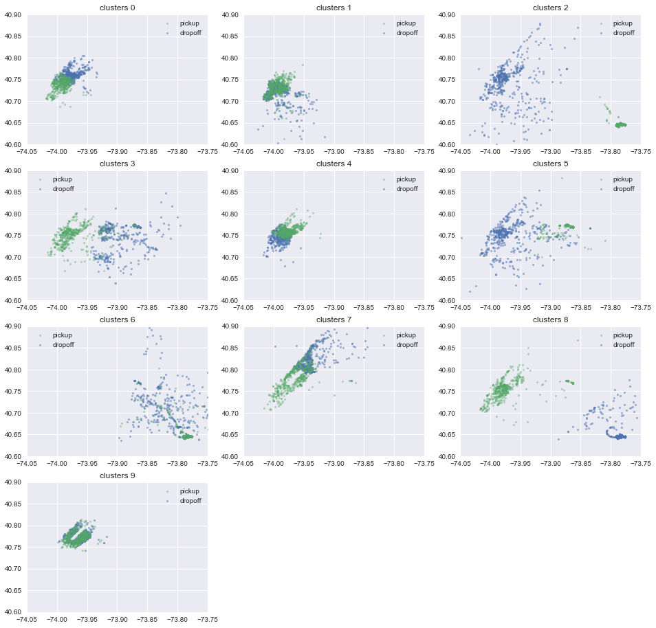
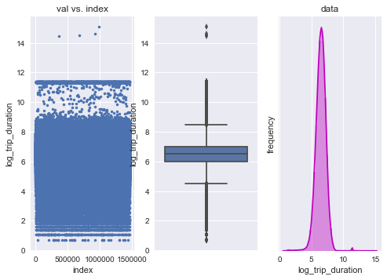
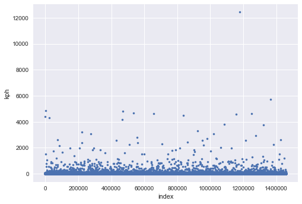
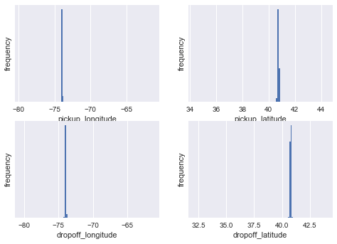
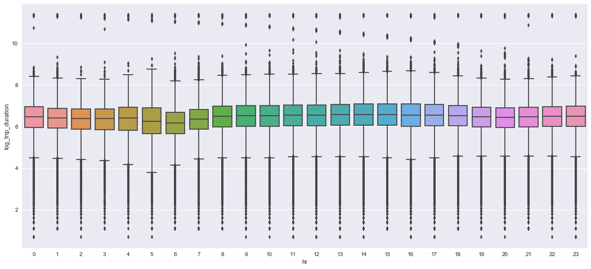
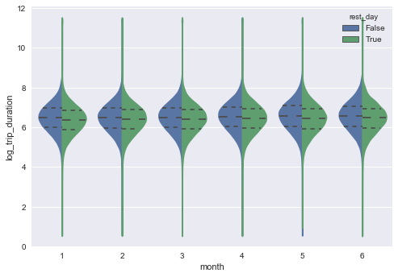
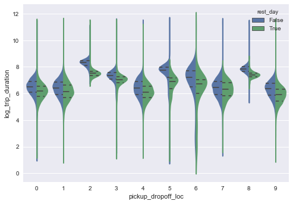
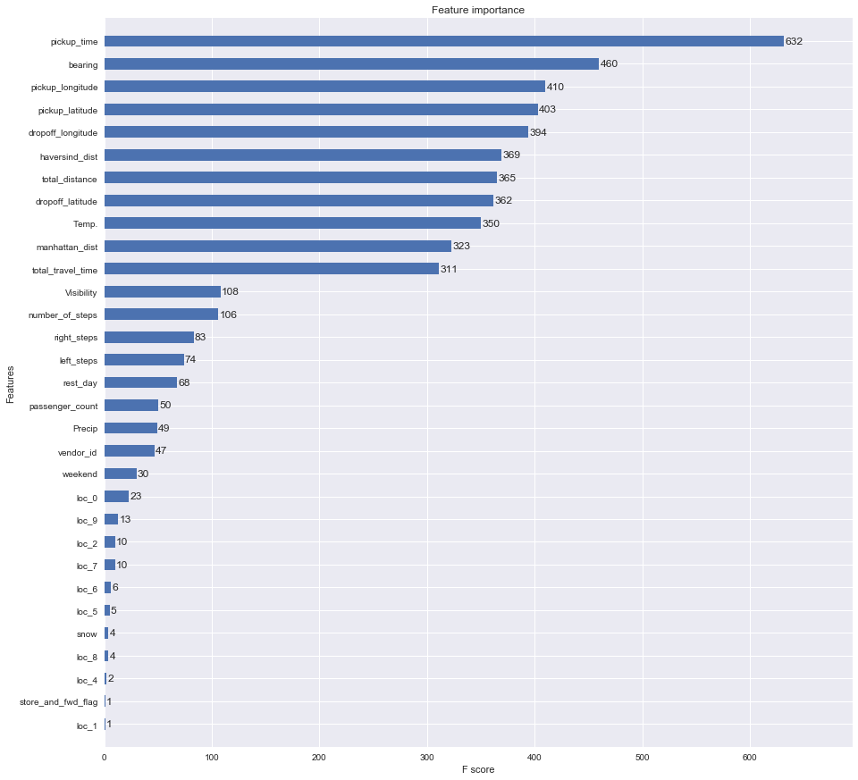

# A Practical Guide to NY Taxi Data (0.379)
### 2017/8/13 Weiying Wang

The guide is aimed to assist beginners to understand the basic workflow of building a predictive model. Also I add descriptions to each steps that may save you some searching time. Hope you will find it helpful! I am welcome for any comment and suggestion that can help this kernel better.

So far this competetion aroses lots of discussions and great analysis (the best analysis, I think, is probably [Heads or Tails](https://www.kaggle.com/headsortails/nyc-taxi-eda-update-the-fast-the-curious)). The data provides a great opportunity of learning and applying things we learned at school.

One must understand that 90% of the work is **clean-up the data** and **acquire the relevent features**, which is essential of getting a good analysis.

There are already a lot of great kernels out there. Some of my features is from (Thanks for their dedication and great kernels!)

1. [beluga](https://www.kaggle.com/gaborfodor/from-eda-to-the-top-lb-0-367)
2. [Oscarleo](https://www.kaggle.com/oscarleo/new-york-city-taxi-with-osrm)
3. [Heads or Tails](https://www.kaggle.com/headsortails/nyc-taxi-eda-update-the-fast-the-curious)


## Table of Content
### 0. [Import Modules and Data](#Import Modules and Data)
### 1. [Features](#Features)
 
 - 1.1 [Pickup Time and Weekend Features](#Pickup Time and Weekend Features)
 - 1.2 [Distance Features](#Distance Features)
     - 1.2.1[OSRM Features](#OSRM Features)
     - 1.2.2[Appendix:Google Map API](#Google Map API)
     - 1.2.2[Other Distance Features](#Other Distance Features)
 - 1.3 [Location Features: K-means Clustering](#Location Features: K-means Clustering)
 - 1.4 [Weather Features](#Weather Features)
 
### 2. [Outliers](#Outliers)
 - 2.1 [Outliers from 'trip_duration'](#Outliers from trip_duration)
 - 2.2 [Outliers from Locations](#Outliers from Locations)
 
### 3. [Analysis of Features](#Analysis of Features)
### 4. [XGB Model: the Prediction of `trip_duration`](#XGB Model)

 - 4.1 [Using XGBoost Module](#Using XGBoost Module)
 - 4.2 [The Submission](#The Submission)
 - 4.3 [Importance for each Feature](#Importance for each Feature)


## 0. Import Modules and Data<a id='Import Modules and Data'></a>
A standard way to import .csv data is through pandas. 


```python
#from importlib import reload
import pandas as pd
import numpy as np
import matplotlib.pyplot as plt
import matplotlib
matplotlib.rcParams['figure.figsize']=(10,18)
%matplotlib inline
from datetime import datetime
from datetime import date
import xgboost as xgb
from sklearn.cluster import MiniBatchKMeans
import seaborn as sns # plot beautiful charts
sns.set()
#warnings.filterwarnings('ignore')
```

    C:\WinPython-64bit-3.6.0.1Qt5\python-3.6.0.amd64\lib\site-packages\sklearn\cross_validation.py:44: DeprecationWarning: This module was deprecated in version 0.18 in favor of the model_selection module into which all the refactored classes and functions are moved. Also note that the interface of the new CV iterators are different from that of this module. This module will be removed in 0.20.
      "This module will be removed in 0.20.", DeprecationWarning)
    


```python
data = pd.read_csv('../input/nyc-taxi-trip-duration/train.csv', parse_dates=['pickup_datetime'])# `parse_dates` will recognize the column is date time
test = pd.read_csv('../input/nyc-taxi-trip-duration/test.csv', parse_dates=['pickup_datetime'])
data.head(3)
```


<div>
<table border="1" class="dataframe">
  <thead>
    <tr style="text-align: right;">
      <th></th>
      <th>id</th>
      <th>vendor_id</th>
      <th>pickup_datetime</th>
      <th>dropoff_datetime</th>
      <th>passenger_count</th>
      <th>pickup_longitude</th>
      <th>pickup_latitude</th>
      <th>dropoff_longitude</th>
      <th>dropoff_latitude</th>
      <th>store_and_fwd_flag</th>
      <th>trip_duration</th>
    </tr>
  </thead>
  <tbody>
    <tr>
      <th>0</th>
      <td>id2875421</td>
      <td>2</td>
      <td>2016-03-14 17:24:55</td>
      <td>2016-03-14 17:32:30</td>
      <td>1</td>
      <td>-73.982155</td>
      <td>40.767937</td>
      <td>-73.964630</td>
      <td>40.765602</td>
      <td>N</td>
      <td>455</td>
    </tr>
    <tr>
      <th>1</th>
      <td>id2377394</td>
      <td>1</td>
      <td>2016-06-12 00:43:35</td>
      <td>2016-06-12 00:54:38</td>
      <td>1</td>
      <td>-73.980415</td>
      <td>40.738564</td>
      <td>-73.999481</td>
      <td>40.731152</td>
      <td>N</td>
      <td>663</td>
    </tr>
    <tr>
      <th>2</th>
      <td>id3858529</td>
      <td>2</td>
      <td>2016-01-19 11:35:24</td>
      <td>2016-01-19 12:10:48</td>
      <td>1</td>
      <td>-73.979027</td>
      <td>40.763939</td>
      <td>-74.005333</td>
      <td>40.710087</td>
      <td>N</td>
      <td>2124</td>
    </tr>
  </tbody>
</table>
</div>


```python
data.info()
```

    <class 'pandas.core.frame.DataFrame'>
    RangeIndex: 1458644 entries, 0 to 1458643
    Data columns (total 11 columns):
    id                    1458644 non-null object
    vendor_id             1458644 non-null int64
    pickup_datetime       1458644 non-null datetime64[ns]
    dropoff_datetime      1458644 non-null object
    passenger_count       1458644 non-null int64
    pickup_longitude      1458644 non-null float64
    pickup_latitude       1458644 non-null float64
    dropoff_longitude     1458644 non-null float64
    dropoff_latitude      1458644 non-null float64
    store_and_fwd_flag    1458644 non-null object
    trip_duration         1458644 non-null int64
    dtypes: datetime64[ns](1), float64(4), int64(3), object(3)
    memory usage: 122.4+ MB
    

Let's do a little clean up: starting by converting `pickup_datetime` to `year`, `month`, `day`, `hr`, `minute`. 
 1. `year`:int value
 2. `month`: int value 1,2,...,6. (Note that the data observe from Jan to June (1~6) here). The month when pickup occurred
 3. `day`:int value


```python
for df in (data,test):
    df['year']  = df['pickup_datetime'].dt.year
    df['month'] = df['pickup_datetime'].dt.month
    df['day']   = df['pickup_datetime'].dt.day
    df['hr']    = df['pickup_datetime'].dt.hour
    df['minute']= df['pickup_datetime'].dt.minute
    df['store_and_fwd_flag'] = 1 * (df.store_and_fwd_flag.values == 'Y')
```


```python
test.head(3)
```


<div>
<table border="1" class="dataframe">
  <thead>
    <tr style="text-align: right;">
      <th></th>
      <th>id</th>
      <th>vendor_id</th>
      <th>pickup_datetime</th>
      <th>passenger_count</th>
      <th>pickup_longitude</th>
      <th>pickup_latitude</th>
      <th>dropoff_longitude</th>
      <th>dropoff_latitude</th>
      <th>store_and_fwd_flag</th>
      <th>year</th>
      <th>month</th>
      <th>day</th>
      <th>hr</th>
      <th>minute</th>
    </tr>
  </thead>
  <tbody>
    <tr>
      <th>0</th>
      <td>id3004672</td>
      <td>1</td>
      <td>2016-06-30 23:59:58</td>
      <td>1</td>
      <td>-73.988129</td>
      <td>40.732029</td>
      <td>-73.990173</td>
      <td>40.756680</td>
      <td>0</td>
      <td>2016</td>
      <td>6</td>
      <td>30</td>
      <td>23</td>
      <td>59</td>
    </tr>
    <tr>
      <th>1</th>
      <td>id3505355</td>
      <td>1</td>
      <td>2016-06-30 23:59:53</td>
      <td>1</td>
      <td>-73.964203</td>
      <td>40.679993</td>
      <td>-73.959808</td>
      <td>40.655403</td>
      <td>0</td>
      <td>2016</td>
      <td>6</td>
      <td>30</td>
      <td>23</td>
      <td>59</td>
    </tr>
    <tr>
      <th>2</th>
      <td>id1217141</td>
      <td>1</td>
      <td>2016-06-30 23:59:47</td>
      <td>1</td>
      <td>-73.997437</td>
      <td>40.737583</td>
      <td>-73.986160</td>
      <td>40.729523</td>
      <td>0</td>
      <td>2016</td>
      <td>6</td>
      <td>30</td>
      <td>23</td>
      <td>59</td>
    </tr>
  </tbody>
</table>
</div>


Since we will use RMSLE as the metric of our score, let's transform the `trip_duration` in to the log form:
$$\text{log_trip_duration}=\log(\text{trip_duration}+1)$$

If there is an outlier in `trip_duration` (as we will see), the transform help mitigate the effect. If the value is still enormously big after the log transform, we can tell it is a true outliers with more confidence.


```python
data = data.assign(log_trip_duration = np.log(data.trip_duration+1))
```

# 1. Features<a id='Features'></a>

I think two of the most important features should be:

1. the pickup time (rush hour should cause longer trip duration.)
2. the trip distance
3. the pickup location

Others are subsidiary. When select features, one needs to put the analysis model into the consideration. I plan to use everyone's favorate **Gradient Boost Tree** in the end, which does not care much about irrelevent information. Since it will choose the most relevent feature to partition the data in every iteration. Also we don't need to care about multicolliearity. So, in theory we can just put as much features as we want. However, considering the time it will take, let's just put the features that possibly matter. But if you have time to spend, you should put as much as you can.

Oh, another good thing about Gradient Boost, it doesn't care about missing values since it is a tree-based algorithm.

## 1.1 Pickup Time and Weekend Features<a id='Pickup Time and Weekend Features'></a>

As one can imagine that these should be big factors, since rush hour will result in longer travel time, and work day should render different results.

Also note that we don't need features `dropoff_datetime` since the training data uses it to generate the response `trip_duration`. (Take a look at test set, of course both columns are not there; we are trying to predict `trip_duration` here!)

We will generate, from `pickup_datetime`, the following features:

1. `rest_day`: boolean value `True` if it is a rest day; `False` if not. 
2. `weekend` :boolean value `True` if it is a weekend; `False` if not.
3. `pickup_time`: float value. E.g. 7.5 means 7:30 am. E.g. 18.75 means 6:45 pm


```python
from datetime import datetime
holiday = pd.read_csv('../input/nyc2016holidays/NYC_2016Holidays.csv',sep=';')
holiday['Date'] = holiday['Date'].apply(lambda x: x + ' 2016')
holidays = [datetime.strptime(holiday.loc[i,'Date'], '%B %d %Y').date() for i in range(len(holiday))]
```


```python
time_data = pd.DataFrame(index = range(len(data)))
time_test = pd.DataFrame(index = range(len(test)))
```


```python
from datetime import date
def restday(yr,month,day,holidays):
    '''
    Output:
        is_rest: a list of Boolean variable indicating if the sample occurred in the rest day.
        is_weekend: a list of Boolean variable indicating if the sample occurred in the weekend.
    '''
    is_rest    = [None]*len(yr)
    is_weekend = [None]*len(yr)
    i=0
    for yy,mm,dd in zip(yr,month,day):        
        is_weekend[i] = date(yy,mm,dd).isoweekday() in (6,7)
        is_rest[i]    = is_weekend[i] or date(yy,mm,dd) in holidays 
        i+=1
    return is_rest,is_weekend
```


```python
rest_day,weekend = restday(data.year,data.month,data.day,holidays)
time_data = time_data.assign(rest_day=rest_day)
time_data = time_data.assign(weekend=weekend)

rest_day,weekend = restday(test.year,test.month,test.day,holidays)
time_test = time_test.assign(rest_day=rest_day)
time_test = time_test.assign(weekend=weekend)
```


```python
time_data = time_data.assign(pickup_time = data.hr+data.minute/60)#float value. E.g. 7.5 means 7:30 am
time_test = time_test.assign(pickup_time = test.hr+test.minute/60)
```

Use the following code to save the features:
```
time_data.to_csv('../features/time_data.csv',index=False)
time_test.to_csv('../features/time_test.csv',index=False) ```


```python
time_data.head()
```


<div>
<table border="1" class="dataframe">
  <thead>
    <tr style="text-align: right;">
      <th></th>
      <th>rest_day</th>
      <th>weekend</th>
      <th>pickup_time</th>
    </tr>
  </thead>
  <tbody>
    <tr>
      <th>0</th>
      <td>False</td>
      <td>False</td>
      <td>17.400000</td>
    </tr>
    <tr>
      <th>1</th>
      <td>True</td>
      <td>True</td>
      <td>0.716667</td>
    </tr>
    <tr>
      <th>2</th>
      <td>False</td>
      <td>False</td>
      <td>11.583333</td>
    </tr>
    <tr>
      <th>3</th>
      <td>False</td>
      <td>False</td>
      <td>19.533333</td>
    </tr>
    <tr>
      <th>4</th>
      <td>True</td>
      <td>True</td>
      <td>13.500000</td>
    </tr>
  </tbody>
</table>
</div>


## 1.2 Distance Features<a id='Distance Features'></a>

### 1.2.1 OSRM Features<a id='OSRM Features'></a>
The first thing comes to mind is using the GPS location to aquire the real distance between pickup point and dropoff one, as you will see in Subsection [Other Distance Features](#Other Distance Features). However, **travel distance** should be more relevent here. The difficault part is to aquire this feature. Thanks to [Oscarleo](https://www.kaggle.com/oscarleo/new-york-city-taxi-with-osrm) who manage to pull it off from [OSRM](http://project-osrm.org/). Let's put together the most relative columns.


```python
fastrout1 = pd.read_csv('../input/new-york-city-taxi-with-osrm/fastest_routes_train_part_1.csv',
                        usecols=['id', 'total_distance', 'total_travel_time',  'number_of_steps','step_direction'])
fastrout2 = pd.read_csv('../input/new-york-city-taxi-with-osrm/fastest_routes_train_part_2.csv',
                        usecols=['id', 'total_distance', 'total_travel_time',  'number_of_steps','step_direction'])
fastrout = pd.concat((fastrout1,fastrout2))
fastrout.head()
```


<div>
<table border="1" class="dataframe">
  <thead>
    <tr style="text-align: right;">
      <th></th>
      <th>id</th>
      <th>total_distance</th>
      <th>total_travel_time</th>
      <th>number_of_steps</th>
      <th>step_direction</th>
    </tr>
  </thead>
  <tbody>
    <tr>
      <th>0</th>
      <td>id2875421</td>
      <td>2009.1</td>
      <td>164.9</td>
      <td>5</td>
      <td>left|straight|right|straight|arrive</td>
    </tr>
    <tr>
      <th>1</th>
      <td>id2377394</td>
      <td>2513.2</td>
      <td>332.0</td>
      <td>6</td>
      <td>none|right|left|right|left|arrive</td>
    </tr>
    <tr>
      <th>2</th>
      <td>id3504673</td>
      <td>1779.4</td>
      <td>235.8</td>
      <td>4</td>
      <td>left|left|right|arrive</td>
    </tr>
    <tr>
      <th>3</th>
      <td>id2181028</td>
      <td>1614.9</td>
      <td>140.1</td>
      <td>5</td>
      <td>right|left|right|left|arrive</td>
    </tr>
    <tr>
      <th>4</th>
      <td>id0801584</td>
      <td>1393.5</td>
      <td>189.4</td>
      <td>5</td>
      <td>right|right|right|left|arrive</td>
    </tr>
  </tbody>
</table>
</div>


Generate a feature for number of right turns and left turns. Note that I didn't count 'slight right' and 'slight left'.


```python
right_turn = []
left_turn = []
right_turn+= list(map(lambda x:x.count('right')-x.count('slight right'),fastrout.step_direction))
left_turn += list(map(lambda x:x.count('left')-x.count('slight left'),fastrout.step_direction))
```

Let's combine the features that seems to be relevent to `trip_duration`


```python
osrm_data = fastrout[['id','total_distance','total_travel_time','number_of_steps']]
osrm_data = osrm_data.assign(right_steps=right_turn)
osrm_data = osrm_data.assign(left_steps=left_turn)
osrm_data.head(3)
```


<div>
<table border="1" class="dataframe">
  <thead>
    <tr style="text-align: right;">
      <th></th>
      <th>id</th>
      <th>total_distance</th>
      <th>total_travel_time</th>
      <th>number_of_steps</th>
      <th>right_steps</th>
      <th>left_steps</th>
    </tr>
  </thead>
  <tbody>
    <tr>
      <th>0</th>
      <td>id2875421</td>
      <td>2009.1</td>
      <td>164.9</td>
      <td>5</td>
      <td>1</td>
      <td>1</td>
    </tr>
    <tr>
      <th>1</th>
      <td>id2377394</td>
      <td>2513.2</td>
      <td>332.0</td>
      <td>6</td>
      <td>2</td>
      <td>2</td>
    </tr>
    <tr>
      <th>2</th>
      <td>id3504673</td>
      <td>1779.4</td>
      <td>235.8</td>
      <td>4</td>
      <td>1</td>
      <td>2</td>
    </tr>
  </tbody>
</table>
</div>


On thing to be careful is that the data from Oscarleo has different order from the original data. Also sample size are different : `len(data)=1458644`;`len(df_oscarleo)=1458643` . So if you want to use them, you have to use something like 'join on ...' (in SQL)


```python
data = data.join(osrm_data.set_index('id'), on='id')
data.head(3)
```


<div>
<table border="1" class="dataframe">
  <thead>
    <tr style="text-align: right;">
      <th></th>
      <th>id</th>
      <th>vendor_id</th>
      <th>pickup_datetime</th>
      <th>dropoff_datetime</th>
      <th>passenger_count</th>
      <th>pickup_longitude</th>
      <th>pickup_latitude</th>
      <th>dropoff_longitude</th>
      <th>dropoff_latitude</th>
      <th>store_and_fwd_flag</th>
      <th>...</th>
      <th>month</th>
      <th>day</th>
      <th>hr</th>
      <th>minute</th>
      <th>log_trip_duration</th>
      <th>total_distance</th>
      <th>total_travel_time</th>
      <th>number_of_steps</th>
      <th>right_steps</th>
      <th>left_steps</th>
    </tr>
  </thead>
  <tbody>
    <tr>
      <th>0</th>
      <td>id2875421</td>
      <td>2</td>
      <td>2016-03-14 17:24:55</td>
      <td>2016-03-14 17:32:30</td>
      <td>1</td>
      <td>-73.982155</td>
      <td>40.767937</td>
      <td>-73.964630</td>
      <td>40.765602</td>
      <td>0</td>
      <td>...</td>
      <td>3</td>
      <td>14</td>
      <td>17</td>
      <td>24</td>
      <td>6.122493</td>
      <td>2009.1</td>
      <td>164.9</td>
      <td>5.0</td>
      <td>1.0</td>
      <td>1.0</td>
    </tr>
    <tr>
      <th>1</th>
      <td>id2377394</td>
      <td>1</td>
      <td>2016-06-12 00:43:35</td>
      <td>2016-06-12 00:54:38</td>
      <td>1</td>
      <td>-73.980415</td>
      <td>40.738564</td>
      <td>-73.999481</td>
      <td>40.731152</td>
      <td>0</td>
      <td>...</td>
      <td>6</td>
      <td>12</td>
      <td>0</td>
      <td>43</td>
      <td>6.498282</td>
      <td>2513.2</td>
      <td>332.0</td>
      <td>6.0</td>
      <td>2.0</td>
      <td>2.0</td>
    </tr>
    <tr>
      <th>2</th>
      <td>id3858529</td>
      <td>2</td>
      <td>2016-01-19 11:35:24</td>
      <td>2016-01-19 12:10:48</td>
      <td>1</td>
      <td>-73.979027</td>
      <td>40.763939</td>
      <td>-74.005333</td>
      <td>40.710087</td>
      <td>0</td>
      <td>...</td>
      <td>1</td>
      <td>19</td>
      <td>11</td>
      <td>35</td>
      <td>7.661527</td>
      <td>11060.8</td>
      <td>767.6</td>
      <td>16.0</td>
      <td>5.0</td>
      <td>4.0</td>
    </tr>
  </tbody>
</table>
<p>3 rows × 22 columns</p>
</div>


Let's do the same thing to test data:


```python
osrm_test = pd.read_csv('../input/new-york-city-taxi-with-osrm/fastest_routes_test.csv')
right_turn= list(map(lambda x:x.count('right')-x.count('slight right'),osrm_test.step_direction))
left_turn = list(map(lambda x:x.count('left')-x.count('slight left'),osrm_test.step_direction))

osrm_test = osrm_test[['id','total_distance','total_travel_time','number_of_steps']]
osrm_test = osrm_test.assign(right_steps=right_turn)
osrm_test = osrm_test.assign(left_steps=left_turn)
osrm_test.head(3)
```


<div>
<table border="1" class="dataframe">
  <thead>
    <tr style="text-align: right;">
      <th></th>
      <th>id</th>
      <th>total_distance</th>
      <th>total_travel_time</th>
      <th>number_of_steps</th>
      <th>right_steps</th>
      <th>left_steps</th>
    </tr>
  </thead>
  <tbody>
    <tr>
      <th>0</th>
      <td>id3004672</td>
      <td>3795.9</td>
      <td>424.6</td>
      <td>4</td>
      <td>1</td>
      <td>1</td>
    </tr>
    <tr>
      <th>1</th>
      <td>id3505355</td>
      <td>2904.5</td>
      <td>200.0</td>
      <td>4</td>
      <td>1</td>
      <td>1</td>
    </tr>
    <tr>
      <th>2</th>
      <td>id1217141</td>
      <td>1499.5</td>
      <td>193.2</td>
      <td>4</td>
      <td>1</td>
      <td>1</td>
    </tr>
  </tbody>
</table>
</div>


```python
test = test.join(osrm_test.set_index('id'), on='id')
```


```python
osrm_test.head()
```


<div>
<table border="1" class="dataframe">
  <thead>
    <tr style="text-align: right;">
      <th></th>
      <th>id</th>
      <th>total_distance</th>
      <th>total_travel_time</th>
      <th>number_of_steps</th>
      <th>right_steps</th>
      <th>left_steps</th>
    </tr>
  </thead>
  <tbody>
    <tr>
      <th>0</th>
      <td>id3004672</td>
      <td>3795.9</td>
      <td>424.6</td>
      <td>4</td>
      <td>1</td>
      <td>1</td>
    </tr>
    <tr>
      <th>1</th>
      <td>id3505355</td>
      <td>2904.5</td>
      <td>200.0</td>
      <td>4</td>
      <td>1</td>
      <td>1</td>
    </tr>
    <tr>
      <th>2</th>
      <td>id1217141</td>
      <td>1499.5</td>
      <td>193.2</td>
      <td>4</td>
      <td>1</td>
      <td>1</td>
    </tr>
    <tr>
      <th>3</th>
      <td>id1598245</td>
      <td>1108.2</td>
      <td>103.2</td>
      <td>4</td>
      <td>1</td>
      <td>2</td>
    </tr>
    <tr>
      <th>4</th>
      <td>id0898117</td>
      <td>3786.2</td>
      <td>489.2</td>
      <td>12</td>
      <td>5</td>
      <td>2</td>
    </tr>
  </tbody>
</table>
</div>


```python
osrm_data = data[['total_distance','total_travel_time','number_of_steps','right_steps','left_steps']]
osrm_test = test[['total_distance','total_travel_time','number_of_steps','right_steps','left_steps']]
```

Use the following code to save the features:
```
data.to_csv('../features/osrm_data.csv',index=False,
            columns = ['total_distance','total_travel_time','number_of_steps','right_steps','left_steps'])
test.to_csv('../features/osrm_test.csv',index=False,
            columns = ['total_distance','total_travel_time','number_of_steps','right_steps','left_steps'])```

### Appendix: Google Map API<a id='Google Map API'></a>

Here is a way to using google map API to aquire travel distance and time without asking a key. I found the code from [here](https://stackoverflow.com/questions/36500331/putting-latitudes-and-longitudes-into-a-distance-matrix-google-map-api-in-pytho) and modified it to Python 3.

There is quota limit for the request so the is much harder to get than OSRM. 

So far Kaggle cannot run it in the kernel, so I just put here:
```
import urllib, json
def google(lato, lono, latd, lond):
    url = """http://maps.googleapis.com/maps/api/distancematrix/json?origins=%s,%s"""%(lato, lono)+  \
    """&destinations=%s,%s&mode=driving&language=en-EN&sensor=false"""% (latd, lond)
    response = urllib.request.urlopen(url)
    obj = json.load(response)
    try:
        minutes =   obj['rows'][0]['elements'][0]['duration']['value']/60
        kilometers = (obj['rows'][0]['elements'][0]['distance']['value']/1000) #kilometers
        return minutes, kilometers
    except IndexError:
        return None,None
        
orig_lat = 40.767937;orig_lng = -73.982155
dest_lat = 40.765602;dest_lng = -73.964630
time,dist = google(orig_lat,orig_lng,dest_lat,dest_lng)
print('It takes %1.2f min to arrive the destiny with distance %1.3f km.'%(time,dist))
```

### 1.2.2 Other Distance Features<a id='Other Distance Features'></a>

The distance functions are from [beluga](https://www.kaggle.com/gaborfodor/from-eda-to-the-top-lb-0-367).
 
 1. Haversine distance: the direct distance of two GPS location, taking into account that the earth is round.
 2. Manhattan distance: the usual L1 distance, here the haversine distance is used to calculate each coordinate of distance.
 3. Bearing: The direction of the trip. Using radian as unit. (I must admit that I am not fully understand the formula. I have starring at it for a long time but can't come up anything. If anyone can help explain that will do me a big favor.)


```python
def haversine_array(lat1, lng1, lat2, lng2):
    lat1, lng1, lat2, lng2 = map(np.radians, (lat1, lng1, lat2, lng2))
    AVG_EARTH_RADIUS = 6371  # in km
    lat = lat2 - lat1
    lng = lng2 - lng1
    d = np.sin(lat * 0.5) ** 2 + np.cos(lat1) * np.cos(lat2) * np.sin(lng * 0.5) ** 2
    h = 2 * AVG_EARTH_RADIUS * np.arcsin(np.sqrt(d))
    return h

def dummy_manhattan_distance(lat1, lng1, lat2, lng2):
    a = haversine_array(lat1, lng1, lat1, lng2)
    b = haversine_array(lat1, lng1, lat2, lng1)
    return a + b

def bearing_array(lat1, lng1, lat2, lng2):
    lng_delta_rad = np.radians(lng2 - lng1)
    lat1, lng1, lat2, lng2 = map(np.radians, (lat1, lng1, lat2, lng2))
    y = np.sin(lng_delta_rad) * np.cos(lat2)
    x = np.cos(lat1) * np.sin(lat2) - np.sin(lat1) * np.cos(lat2) * np.cos(lng_delta_rad)
    return np.degrees(np.arctan2(y, x))
```


```python
List_dist = []
for df in (data,test):
    lat1, lng1, lat2, lng2 = (df['pickup_latitude'].values, df['pickup_longitude'].values, 
                              df['dropoff_latitude'].values,df['dropoff_longitude'].values)
    dist = pd.DataFrame(index=range(len(df)))
    dist = dist.assign(haversind_dist = haversine_array(lat1, lng1, lat2, lng2))
    dist = dist.assign(manhattan_dist = dummy_manhattan_distance(lat1, lng1, lat2, lng2))
    dist = dist.assign(bearing = bearing_array(lat1, lng1, lat2, lng2))
    List_dist.append(dist)
Other_dist_data,Other_dist_test = List_dist
```

Use the following code to save it to your features.
```
Other_dist_data.to_csv('../features/Other_dist_data.csv',index=False)
Other_dist_test.to_csv('../features/Other_dist_test.csv',index=False)```

## 1.3 Location Features: K-means Clustering<a id='Location Features: K-means Clustering'></a>

Besides of keeping entire list of latitude and longitute, I would like to distinguish them with few approximately locations. It might be helpful our xgboost since it will take 4 branches of tree (remember I will use a tree-based algorithm) to specify a square region. The best way, I guess, is to separate these points by the town of the location, which requires some geological information from google API or OSRM. Besides OSRM, you can acquire googlemap information from Googlemap API.

I setup 10 kmeans clusters for our data set. The kmeans method is performed on 4-d data 
```['pickup_latitude', 'pickup_longitude','dropoff_latitude', 'dropoff_longitude']```

Note that the resulting feature is categorical value between 0,1,2,...,10. To use this feature in `xgboost`, you have to transform it to 20 dummy variables, otherwise the module will treat it as numerical.


```python
coord_pickup = np.vstack((data[['pickup_latitude', 'pickup_longitude']].values,                  
                          test[['pickup_latitude', 'pickup_longitude']].values))
coord_dropoff = np.vstack((data[['dropoff_latitude', 'dropoff_longitude']].values,                  
                           test[['dropoff_latitude', 'dropoff_longitude']].values))
```


```python
coords = np.hstack((coord_pickup,coord_dropoff))# 4 dimensional data
sample_ind = np.random.permutation(len(coords))[:500000]
kmeans = MiniBatchKMeans(n_clusters=10, batch_size=10000).fit(coords[sample_ind])
for df in (data,test):
    df.loc[:, 'pickup_dropoff_loc'] = kmeans.predict(df[['pickup_latitude', 'pickup_longitude',
                                                         'dropoff_latitude','dropoff_longitude']])
```


```python
kmean10_data = data[['pickup_dropoff_loc']]
kmean10_test = test[['pickup_dropoff_loc']]
```

Use the following code to save the data.
```
data.to_csv('../features/kmean10_data.csv',index=False,columns = ['pickup_dropoff_loc'])
test.to_csv('../features/kmean10_test.csv',index=False,columns = ['pickup_dropoff_loc'])```

<a id='KmeansPlot'></a> Let's take a look at our kmeans clusters. Remember that each cluster is represented by a 4d point (longitude/latitude of pickup location and logitude/latitude of dropoff location). I will drow first 500 points of each clusters, and each plot have two locations, pickup and dropoff.


```python
plt.figure(figsize=(16,16))
N = 500
for i in range(10):
    plt.subplot(4,3,i+1)
    tmp_data = data[data.pickup_dropoff_loc==i]
    drop = plt.scatter(tmp_data['dropoff_longitude'][:N], tmp_data['dropoff_latitude'][:N], s=10, lw=0, alpha=0.5,label='dropoff')
    pick = plt.scatter(tmp_data['pickup_longitude'][:N], tmp_data['pickup_latitude'][:N], s=10, lw=0, alpha=0.4,label='pickup')    
    plt.xlim([-74.05,-73.75]);plt.ylim([40.6,40.9])
    plt.legend(handles = [pick,drop])
    plt.title('clusters %d'%i)
#plt.axes().set_aspect('equal')
```





Some interesting facts:

 1. The short trips are clustered to the same clusters.
 2. Pickup location is more concentrated than dropoff one. This might just because the taxi driver doesn't want to reach out too far to pickup. Or there are more convenient way (like train) for people to go to the city.

## 1.4 Weather Features<a id='Weather Features'></a>
The weather data is obtained [here](https://www.kaggle.com/cabaki/knycmetars2016).


```python
weather = pd.read_csv('../input/knycmetars2016/KNYC_Metars.csv', parse_dates=['Time'])
weather.head(3)
```


<div>
<table border="1" class="dataframe">
  <thead>
    <tr style="text-align: right;">
      <th></th>
      <th>Time</th>
      <th>Temp.</th>
      <th>Windchill</th>
      <th>Heat Index</th>
      <th>Humidity</th>
      <th>Pressure</th>
      <th>Dew Point</th>
      <th>Visibility</th>
      <th>Wind Dir</th>
      <th>Wind Speed</th>
      <th>Gust Speed</th>
      <th>Precip</th>
      <th>Events</th>
      <th>Conditions</th>
    </tr>
  </thead>
  <tbody>
    <tr>
      <th>0</th>
      <td>2015-12-31 02:00:00</td>
      <td>7.8</td>
      <td>7.1</td>
      <td>NaN</td>
      <td>0.89</td>
      <td>1017.0</td>
      <td>6.1</td>
      <td>8.0</td>
      <td>NNE</td>
      <td>5.6</td>
      <td>0.0</td>
      <td>0.8</td>
      <td>None</td>
      <td>Overcast</td>
    </tr>
    <tr>
      <th>1</th>
      <td>2015-12-31 03:00:00</td>
      <td>7.2</td>
      <td>5.9</td>
      <td>NaN</td>
      <td>0.90</td>
      <td>1016.5</td>
      <td>5.6</td>
      <td>12.9</td>
      <td>Variable</td>
      <td>7.4</td>
      <td>0.0</td>
      <td>0.3</td>
      <td>None</td>
      <td>Overcast</td>
    </tr>
    <tr>
      <th>2</th>
      <td>2015-12-31 04:00:00</td>
      <td>7.2</td>
      <td>NaN</td>
      <td>NaN</td>
      <td>0.90</td>
      <td>1016.7</td>
      <td>5.6</td>
      <td>12.9</td>
      <td>Calm</td>
      <td>0.0</td>
      <td>0.0</td>
      <td>0.0</td>
      <td>None</td>
      <td>Overcast</td>
    </tr>
  </tbody>
</table>
</div>


```python
print('The Events has values {}.'.format(str(set(weather.Events))))
```

    The Events has values {'Fog', 'Fog\n\t,\nSnow', 'Rain', 'None', 'Fog\n\t,\nRain', 'Snow'}.
    


```python
weather['snow']= 1*(weather.Events=='Snow') + 1*(weather.Events=='Fog\n\t,\nSnow')
weather['year'] = weather['Time'].dt.year
weather['month'] = weather['Time'].dt.month
weather['day'] = weather['Time'].dt.day
weather['hr'] = weather['Time'].dt.hour
weather = weather[weather['year'] == 2016][['month','day','hr','Temp.','Precip','snow','Visibility']]
```


```python
weather.head()
```


<div>
<table border="1" class="dataframe">
  <thead>
    <tr style="text-align: right;">
      <th></th>
      <th>month</th>
      <th>day</th>
      <th>hr</th>
      <th>Temp.</th>
      <th>Precip</th>
      <th>snow</th>
      <th>Visibility</th>
    </tr>
  </thead>
  <tbody>
    <tr>
      <th>22</th>
      <td>1</td>
      <td>1</td>
      <td>0</td>
      <td>5.6</td>
      <td>0.0</td>
      <td>0</td>
      <td>16.1</td>
    </tr>
    <tr>
      <th>23</th>
      <td>1</td>
      <td>1</td>
      <td>1</td>
      <td>5.6</td>
      <td>0.0</td>
      <td>0</td>
      <td>16.1</td>
    </tr>
    <tr>
      <th>24</th>
      <td>1</td>
      <td>1</td>
      <td>2</td>
      <td>5.6</td>
      <td>0.0</td>
      <td>0</td>
      <td>16.1</td>
    </tr>
    <tr>
      <th>25</th>
      <td>1</td>
      <td>1</td>
      <td>3</td>
      <td>5.0</td>
      <td>0.0</td>
      <td>0</td>
      <td>16.1</td>
    </tr>
    <tr>
      <th>26</th>
      <td>1</td>
      <td>1</td>
      <td>4</td>
      <td>5.0</td>
      <td>0.0</td>
      <td>0</td>
      <td>16.1</td>
    </tr>
  </tbody>
</table>
</div>


Merge the snow infomation to our data set.


```python
data = pd.merge(data, weather, on = ['month', 'day', 'hr'], how = 'left')
test = pd.merge(test, weather, on = ['month', 'day', 'hr'], how = 'left')
```


```python
weather_data = data[['Temp.','Precip','snow','Visibility']]
weather_test = test[['Temp.','Precip','snow','Visibility']]
```

Use the following code to save the features.
```
weather_data.to_csv('../features/weather_data.csv',index=False)
weather_test.to_csv('../features/weather_test.csv',index=False)```


```python
weather_data.head()
```


<div>
<table border="1" class="dataframe">
  <thead>
    <tr style="text-align: right;">
      <th></th>
      <th>Temp.</th>
      <th>Precip</th>
      <th>snow</th>
      <th>Visibility</th>
    </tr>
  </thead>
  <tbody>
    <tr>
      <th>0</th>
      <td>4.4</td>
      <td>0.3</td>
      <td>0.0</td>
      <td>8.0</td>
    </tr>
    <tr>
      <th>1</th>
      <td>28.9</td>
      <td>0.0</td>
      <td>0.0</td>
      <td>16.1</td>
    </tr>
    <tr>
      <th>2</th>
      <td>-6.7</td>
      <td>0.0</td>
      <td>0.0</td>
      <td>16.1</td>
    </tr>
    <tr>
      <th>3</th>
      <td>7.2</td>
      <td>0.0</td>
      <td>0.0</td>
      <td>16.1</td>
    </tr>
    <tr>
      <th>4</th>
      <td>9.4</td>
      <td>0.0</td>
      <td>0.0</td>
      <td>16.1</td>
    </tr>
  </tbody>
</table>
</div>


# 2. Outliers<a id='Outliers'></a>

As I said, we are using score as RMSLE, which cares less about outliers. **You should be able to completely skip this section without sacrifice your score**. Actually, if you specify too much outliers, like 500 of the data, you might run into problem: You will see the validation error is small but the submission score is bad. So proceed with caution here. Keep in mind in the competition we want to minimize the score of test set, which is randomly drawn from original set, so mistakes (if there is a lot) in your training set are much likely to be in your test set.

That being said, if the task is to predict the new data, I will remove more unresonable data points. Here I will just remove very tiny portion (7 of them) of our training set, which does not affect your model to a noticible decimal. **I create this section is just to show you how bizzard our real world data is, and how to identify and treat them properly**.

A better way to treat outliers (instead of deleting them right away) is to add a column with boolean value `True`(this sample is an outlier) or `False`.


```python
outliers=np.array([False]*len(data))
```

First let's check the missing value. Let's hope there is not many of it.


```python
print('There are %d rows that have missing values'%sum(data.isnull().any(axis=1)))
```

    There are 56598 rows that have missing values
    

You can check the missing value using the above command on any dataframeyou have.

Note that the data from oscarleo (Subsection 1.2) has 1 missing values, since his data has 1 less row to the original data.

Unfortunately there is a lot of missing valuethe weather feature. However, as long as we stick to the plan of using gradient boost, we will be fine with this. Actually all the tree methods will be fine with this.

## 2.1 Outliers from 'trip_duration'<a id='Outliers from trip_duration'></a>

### `trip_duration` too big

Note that for column 'trip_duration', the unit is second. There are some samples that have ridiculus 100 days ride; that's the outliers. There are several tools to help you detect them: "run sequence plot", and "boxplot".


```python
y = np.array(data.log_trip_duration)
plt.subplot(131)
plt.plot(range(len(y)),y,'.');plt.ylabel('log_trip_duration');plt.xlabel('index');plt.title('val vs. index')
plt.subplot(132)
sns.boxplot(y=data.log_trip_duration)
plt.subplot(133)
sns.distplot(y,bins=50, color="m");plt.yticks([]);plt.xlabel('log_trip_duration');plt.title('data');plt.ylabel('frequency')
#plt.hist(y,bins=50);
```


    <matplotlib.text.Text at 0x2139e218358>





Looks like there are just 4 points that really far off. Also, there are a lot of `trip duration` in 
$$\exp(11.37)-1\approx86400,$$
which is 24 hrs. Well, I think it is still a possible thing, sometimes you take a taxi to a certain place then come back, and the clock just reset for every day, or simply they just forgot to turn off... That is the story I imagine. We can not treat them as outliers, despite how outliers they are, since it will happened in test set also. But for the 4 points, I think cast them to outliers is wise.


```python
outliers[y>12]=True
print('There are %d entries that have trip duration too long'% sum(outliers))
```

    There are 4 entries that have trip duration too long
    

There are several tests to decide the threshold of outliers. 

### `trip_duration` too small
I notice there are some rides only consists with 1 sec and have several miles on `total_distance`. I don't think teleportational taxi exist right now, thus it should be considered as outliers. I will calculate the km/hr using 

$$ \text{kph} = \frac{\text{total_distance}/1000}{\text{trip_duration}}\cdot3600 $$

Notice that several of the rides has 1 second `trip_duration` and nearly 0 `total_distance`. I think this might be a normal condition since the passenger can just walk off the taxi simply because he changes his mind.
 
Let's first make the run sequence plot to see how absurb those value is:


```python
kph = osrm_data.total_distance/1000/data.trip_duration*3600
plt.plot(range(len(kph)),kph,'.');plt.ylabel('kph');plt.xlabel('index');plt.show()
```





As you can see, there are a lot of taxi drive beyond 1000 km/hr; there is a lot of recording error. If I am predict new values I will remove it. For this competition I simply keep all of them. If you still can't tolerant this error, you can use the following code to cast them to outliers.

```
kph = np.array(kph)
kph[np.isnan(kph)]=0.0
dist = np.array(osrm_data.total_distance) #note this is in meters
dist[np.isnan(dist)]=0.0
outliers_speeding = np.array([False]*len(kph))
outliers_speeding = outliers_speeding | ((kph>300) & (dist>1000))
outliers_speeding = outliers_speeding | ((kph>180)  & (dist<=1000))                                         
outliers_speeding = outliers_speeding | ((kph>100)  & (dist<=100))                                         
outliers_speeding = outliers_speeding | ((kph>80)  & (dist<=20))
print('There are %d speeding outliers'%sum(outliers_speeding))   
outliers = outliers|outliers_speeding```

## 2.2 Outliers from Locations<a id='Outliers from Locations'></a>
There are two locations, pickup and dropoff location. To find out if there is any outliers, I combine them and plot the boxplot.


```python
fig=plt.figure(figsize=(10, 8))
for i,loc in enumerate((['pickup_longitude','dropoff_longitude'],['pickup_latitude','dropoff_latitude'])):
    plt.subplot(1,2,i+1)
    sns.boxplot(data=data[outliers==False],order=loc);#plt.title(loc)
```


Both of the longtitudes has one points that is pretty far off the center(median). I will simply remove them.


```python
outliers[data.pickup_longitude<-110]=True
outliers[data.dropoff_longitude<-110]=True
outliers[data.pickup_latitude>45]=True
print('There are total %d entries of ouliers'% sum(outliers))
```

    There are total 7 entries of ouliers
    

As you can see the locations are pretty clump up, as the following plots indicates.


```python
for i,feature in enumerate(['pickup_longitude', 'pickup_latitude','dropoff_longitude', 'dropoff_latitude']):
    plt.subplot(2,2,i+1)
    data[outliers==False][feature].hist(bins=100)
    plt.xlabel(feature);plt.ylabel('frequency');plt.yticks([])
#plt.show();plt.close()
```





Let's plot some locations on the map with a very cool `folium` module, to get some ideas.


```python
import folium # goelogical map
map_1 = folium.Map(location=[40.767937,-73.982155 ],tiles='OpenStreetMap',
 zoom_start=12)
#tile: 'OpenStreetMap','Stamen Terrain','Mapbox Bright','Mapbox Control room'
for each in data[:1000].iterrows():
    folium.CircleMarker([each[1]['pickup_latitude'],each[1]['pickup_longitude']],
                        radius=3,
                        color='red',
                        popup=str(each[1]['pickup_latitude'])+','+str(each[1]['pickup_longitude']),
                        fill_color='#FD8A6C'
                        ).add_to(map_1)
map_1
```


<div style="width:100%;"><div style="position:relative;width:100%;height:0;padding-bottom:60%;"><iframe src="data:text/html;charset=utf-8;base64,PCFET0NUWVBFIGh0bWw+CjxoZWFkPiAgICAKICAgIDxtZXRhIGh0dHAtZXF1aXY9ImNvbnRlbnQtdHlwZSIgY29udGVudD0idGV4dC9odG1sOyBjaGFyc2V0PVVURi04IiAvPgogICAgPHNjcmlwdD5MX1BSRUZFUl9DQU5WQVMgPSBmYWxzZTsgTF9OT19UT1VDSCA9IGZhbHNlOyBMX0RJU0FCTEVfM0QgPSBmYWxzZTs8L3NjcmlwdD4KICAgIDxzY3JpcHQgc3JjPSJodHRwczovL3VucGtnLmNvbS9sZWFmbGV0QDEuMC4xL2Rpc3QvbGVhZmxldC5qcyI+PC9zY3JpcHQ+CiAgICA8c2NyaXB0IHNyYz0iaHR0cHM6Ly9hamF4Lmdvb2dsZWFwaXMuY29tL2FqYXgvbGlicy9qcXVlcnkvMS4xMS4xL2pxdWVyeS5taW4uanMiPjwvc2NyaXB0PgogICAgPHNjcmlwdCBzcmM9Imh0dHBzOi8vbWF4Y2RuLmJvb3RzdHJhcGNkbi5jb20vYm9vdHN0cmFwLzMuMi4wL2pzL2Jvb3RzdHJhcC5taW4uanMiPjwvc2NyaXB0PgogICAgPHNjcmlwdCBzcmM9Imh0dHBzOi8vY2RuanMuY2xvdWRmbGFyZS5jb20vYWpheC9saWJzL0xlYWZsZXQuYXdlc29tZS1tYXJrZXJzLzIuMC4yL2xlYWZsZXQuYXdlc29tZS1tYXJrZXJzLmpzIj48L3NjcmlwdD4KICAgIDxzY3JpcHQgc3JjPSJodHRwczovL2NkbmpzLmNsb3VkZmxhcmUuY29tL2FqYXgvbGlicy9sZWFmbGV0Lm1hcmtlcmNsdXN0ZXIvMS4wLjAvbGVhZmxldC5tYXJrZXJjbHVzdGVyLXNyYy5qcyI+PC9zY3JpcHQ+CiAgICA8c2NyaXB0IHNyYz0iaHR0cHM6Ly9jZG5qcy5jbG91ZGZsYXJlLmNvbS9hamF4L2xpYnMvbGVhZmxldC5tYXJrZXJjbHVzdGVyLzEuMC4wL2xlYWZsZXQubWFya2VyY2x1c3Rlci5qcyI+PC9zY3JpcHQ+CiAgICA8bGluayByZWw9InN0eWxlc2hlZXQiIGhyZWY9Imh0dHBzOi8vdW5wa2cuY29tL2xlYWZsZXRAMS4wLjEvZGlzdC9sZWFmbGV0LmNzcyIgLz4KICAgIDxsaW5rIHJlbD0ic3R5bGVzaGVldCIgaHJlZj0iaHR0cHM6Ly9tYXhjZG4uYm9vdHN0cmFwY2RuLmNvbS9ib290c3RyYXAvMy4yLjAvY3NzL2Jvb3RzdHJhcC5taW4uY3NzIiAvPgogICAgPGxpbmsgcmVsPSJzdHlsZXNoZWV0IiBocmVmPSJodHRwczovL21heGNkbi5ib290c3RyYXBjZG4uY29tL2Jvb3RzdHJhcC8zLjIuMC9jc3MvYm9vdHN0cmFwLXRoZW1lLm1pbi5jc3MiIC8+CiAgICA8bGluayByZWw9InN0eWxlc2hlZXQiIGhyZWY9Imh0dHBzOi8vbWF4Y2RuLmJvb3RzdHJhcGNkbi5jb20vZm9udC1hd2Vzb21lLzQuNi4zL2Nzcy9mb250LWF3ZXNvbWUubWluLmNzcyIgLz4KICAgIDxsaW5rIHJlbD0ic3R5bGVzaGVldCIgaHJlZj0iaHR0cHM6Ly9jZG5qcy5jbG91ZGZsYXJlLmNvbS9hamF4L2xpYnMvTGVhZmxldC5hd2Vzb21lLW1hcmtlcnMvMi4wLjIvbGVhZmxldC5hd2Vzb21lLW1hcmtlcnMuY3NzIiAvPgogICAgPGxpbmsgcmVsPSJzdHlsZXNoZWV0IiBocmVmPSJodHRwczovL2NkbmpzLmNsb3VkZmxhcmUuY29tL2FqYXgvbGlicy9sZWFmbGV0Lm1hcmtlcmNsdXN0ZXIvMS4wLjAvTWFya2VyQ2x1c3Rlci5EZWZhdWx0LmNzcyIgLz4KICAgIDxsaW5rIHJlbD0ic3R5bGVzaGVldCIgaHJlZj0iaHR0cHM6Ly9jZG5qcy5jbG91ZGZsYXJlLmNvbS9hamF4L2xpYnMvbGVhZmxldC5tYXJrZXJjbHVzdGVyLzEuMC4wL01hcmtlckNsdXN0ZXIuY3NzIiAvPgogICAgPGxpbmsgcmVsPSJzdHlsZXNoZWV0IiBocmVmPSJodHRwczovL3Jhd2dpdC5jb20vcHl0aG9uLXZpc3VhbGl6YXRpb24vZm9saXVtL21hc3Rlci9mb2xpdW0vdGVtcGxhdGVzL2xlYWZsZXQuYXdlc29tZS5yb3RhdGUuY3NzIiAvPgogICAgPHN0eWxlPmh0bWwsIGJvZHkge3dpZHRoOiAxMDAlO2hlaWdodDogMTAwJTttYXJnaW46IDA7cGFkZGluZzogMDt9PC9zdHlsZT4KICAgIDxzdHlsZT4jbWFwIHtwb3NpdGlvbjphYnNvbHV0ZTt0b3A6MDtib3R0b206MDtyaWdodDowO2xlZnQ6MDt9PC9zdHlsZT4KICAgIAogICAgICAgICAgICA8c3R5bGU+ICNtYXBfMzRmMTI5ZTdjZDRlNDNiZmJjMDI5YzcxZDc3NTc1ZTkgewogICAgICAgICAgICAgICAgcG9zaXRpb24gOiByZWxhdGl2ZTsKICAgICAgICAgICAgICAgIHdpZHRoIDogMTAwLjAlOwogICAgICAgICAgICAgICAgaGVpZ2h0OiAxMDAuMCU7CiAgICAgICAgICAgICAgICBsZWZ0OiAwLjAlOwogICAgICAgICAgICAgICAgdG9wOiAwLjAlOwogICAgICAgICAgICAgICAgfQogICAgICAgICAgICA8L3N0eWxlPgogICAgICAgIAo8L2hlYWQ+Cjxib2R5PiAgICAKICAgIAogICAgICAgICAgICA8ZGl2IGNsYXNzPSJmb2xpdW0tbWFwIiBpZD0ibWFwXzM0ZjEyOWU3Y2Q0ZTQzYmZiYzAyOWM3MWQ3NzU3NWU5IiA+PC9kaXY+CiAgICAgICAgCjwvYm9keT4KPHNjcmlwdD4gICAgCiAgICAKCiAgICAgICAgICAgIAogICAgICAgICAgICAgICAgdmFyIHNvdXRoV2VzdCA9IEwubGF0TG5nKC05MCwgLTE4MCk7CiAgICAgICAgICAgICAgICB2YXIgbm9ydGhFYXN0ID0gTC5sYXRMbmcoOTAsIDE4MCk7CiAgICAgICAgICAgICAgICB2YXIgYm91bmRzID0gTC5sYXRMbmdCb3VuZHMoc291dGhXZXN0LCBub3J0aEVhc3QpOwogICAgICAgICAgICAKCiAgICAgICAgICAgIHZhciBtYXBfMzRmMTI5ZTdjZDRlNDNiZmJjMDI5YzcxZDc3NTc1ZTkgPSBMLm1hcCgKICAgICAgICAgICAgICAgICAgICAgICAgICAgICAgICAgICdtYXBfMzRmMTI5ZTdjZDRlNDNiZmJjMDI5YzcxZDc3NTc1ZTknLAogICAgICAgICAgICAgICAgICAgICAgICAgICAgICAgICAge2NlbnRlcjogWzQwLjc2NzkzNywtNzMuOTgyMTU1XSwKICAgICAgICAgICAgICAgICAgICAgICAgICAgICAgICAgIHpvb206IDEyLAogICAgICAgICAgICAgICAgICAgICAgICAgICAgICAgICAgbWF4Qm91bmRzOiBib3VuZHMsCiAgICAgICAgICAgICAgICAgICAgICAgICAgICAgICAgICBsYXllcnM6IFtdLAogICAgICAgICAgICAgICAgICAgICAgICAgICAgICAgICAgd29ybGRDb3B5SnVtcDogZmFsc2UsCiAgICAgICAgICAgICAgICAgICAgICAgICAgICAgICAgICBjcnM6IEwuQ1JTLkVQU0czODU3CiAgICAgICAgICAgICAgICAgICAgICAgICAgICAgICAgIH0pOwogICAgICAgICAgICAKICAgICAgICAKICAgIAogICAgICAgICAgICB2YXIgdGlsZV9sYXllcl8zNzVhYzkzYjdlN2Y0Yzg2YWQ1MzExMTY5NDI0ZmRhNiA9IEwudGlsZUxheWVyKAogICAgICAgICAgICAgICAgJ2h0dHBzOi8ve3N9LnRpbGUub3BlbnN0cmVldG1hcC5vcmcve3p9L3t4fS97eX0ucG5nJywKICAgICAgICAgICAgICAgIHsKICAgICAgICAgICAgICAgICAgICBtYXhab29tOiAxOCwKICAgICAgICAgICAgICAgICAgICBtaW5ab29tOiAxLAogICAgICAgICAgICAgICAgICAgIGNvbnRpbnVvdXNXb3JsZDogZmFsc2UsCiAgICAgICAgICAgICAgICAgICAgbm9XcmFwOiBmYWxzZSwKICAgICAgICAgICAgICAgICAgICBhdHRyaWJ1dGlvbjogJ0RhdGEgYnkgPGEgaHJlZj0iaHR0cDovL29wZW5zdHJlZXRtYXAub3JnIj5PcGVuU3RyZWV0TWFwPC9hPiwgdW5kZXIgPGEgaHJlZj0iaHR0cDovL3d3dy5vcGVuc3RyZWV0bWFwLm9yZy9jb3B5cmlnaHQiPk9EYkw8L2E+LicsCiAgICAgICAgICAgICAgICAgICAgZGV0ZWN0UmV0aW5hOiBmYWxzZQogICAgICAgICAgICAgICAgICAgIH0KICAgICAgICAgICAgICAgICkuYWRkVG8obWFwXzM0ZjEyOWU3Y2Q0ZTQzYmZiYzAyOWM3MWQ3NzU3NWU5KTsKCiAgICAgICAgCiAgICAKCiAgICAgICAgICAgIHZhciBjaXJjbGVfbWFya2VyXzZkNzRlZDYxNjdkMjQ0NDI5MThlN2YwNGQ4ZTQ1NzE4ID0gTC5jaXJjbGVNYXJrZXIoCiAgICAgICAgICAgICAgICBbNDAuNzY3OTM2NzA2NTQyOTcsLTczLjk4MjE1NDg0NjE5MTM5XSwKICAgICAgICAgICAgICAgIHsKICAgICAgICAgICAgICAgICAgICBjb2xvcjogJ3JlZCcsCiAgICAgICAgICAgICAgICAgICAgd2VpZ2h0OiAyLAogICAgICAgICAgICAgICAgICAgIGZpbGxDb2xvcjogJyNGRDhBNkMnLAogICAgICAgICAgICAgICAgICAgIGZpbGxPcGFjaXR5OiAwLjYKICAgICAgICAgICAgICAgICAgICB9CiAgICAgICAgICAgICAgICApCiAgICAgICAgICAgICAgICAuc2V0UmFkaXVzKDMpCiAgICAgICAgICAgICAgICAuYWRkVG8obWFwXzM0ZjEyOWU3Y2Q0ZTQzYmZiYzAyOWM3MWQ3NzU3NWU5KTsKICAgICAgICAgICAgCiAgICAKICAgICAgICAgICAgdmFyIHBvcHVwXzdkZmE0OWRmNmE0MzQ0YmZhOTVmMTYxM2Q2MWMxZTY5ID0gTC5wb3B1cCh7bWF4V2lkdGg6ICczMDAnfSk7CgogICAgICAgICAgICAKICAgICAgICAgICAgICAgIHZhciBodG1sXzY3NDA3N2JhZTMyNTQxZGU4Nzc2NjcyNTJhZmE4YzczID0gJCgnPGRpdiBpZD0iaHRtbF82NzQwNzdiYWUzMjU0MWRlODc3NjY3MjUyYWZhOGM3MyIgc3R5bGU9IndpZHRoOiAxMDAuMCU7IGhlaWdodDogMTAwLjAlOyI+NDAuNzY3OTM2NzA2NTQyOTcsLTczLjk4MjE1NDg0NjE5MTM5PC9kaXY+JylbMF07CiAgICAgICAgICAgICAgICBwb3B1cF83ZGZhNDlkZjZhNDM0NGJmYTk1ZjE2MTNkNjFjMWU2OS5zZXRDb250ZW50KGh0bWxfNjc0MDc3YmFlMzI1NDFkZTg3NzY2NzI1MmFmYThjNzMpOwogICAgICAgICAgICAKCiAgICAgICAgICAgIGNpcmNsZV9tYXJrZXJfNmQ3NGVkNjE2N2QyNDQ0MjkxOGU3ZjA0ZDhlNDU3MTguYmluZFBvcHVwKHBvcHVwXzdkZmE0OWRmNmE0MzQ0YmZhOTVmMTYxM2Q2MWMxZTY5KTsKCiAgICAgICAgICAgIAogICAgICAgIAogICAgCgogICAgICAgICAgICB2YXIgY2lyY2xlX21hcmtlcl9jZGRkOGZiOWYyNjI0ZjI5YmJlNGJhYTlmNDgyMzk3MSA9IEwuY2lyY2xlTWFya2VyKAogICAgICAgICAgICAgICAgWzQwLjczODU2MzUzNzU5NzY1NiwtNzMuOTgwNDE1MzQ0MjM4MjddLAogICAgICAgICAgICAgICAgewogICAgICAgICAgICAgICAgICAgIGNvbG9yOiAncmVkJywKICAgICAgICAgICAgICAgICAgICB3ZWlnaHQ6IDIsCiAgICAgICAgICAgICAgICAgICAgZmlsbENvbG9yOiAnI0ZEOEE2QycsCiAgICAgICAgICAgICAgICAgICAgZmlsbE9wYWNpdHk6IDAuNgogICAgICAgICAgICAgICAgICAgIH0KICAgICAgICAgICAgICAgICkKICAgICAgICAgICAgICAgIC5zZXRSYWRpdXMoMykKICAgICAgICAgICAgICAgIC5hZGRUbyhtYXBfMzRmMTI5ZTdjZDRlNDNiZmJjMDI5YzcxZDc3NTc1ZTkpOwogICAgICAgICAgICAKICAgIAogICAgICAgICAgICB2YXIgcG9wdXBfNDMxN2U4MTExYjM3NDUxNWE3ZDIxYjc4MGI3YWFjMzMgPSBMLnBvcHVwKHttYXhXaWR0aDogJzMwMCd9KTsKCiAgICAgICAgICAgIAogICAgICAgICAgICAgICAgdmFyIGh0bWxfZWFlM2U2ODA1ZDg0NGU2ZmE2ZTliNjFjMjI4OWY0ZjkgPSAkKCc8ZGl2IGlkPSJodG1sX2VhZTNlNjgwNWQ4NDRlNmZhNmU5YjYxYzIyODlmNGY5IiBzdHlsZT0id2lkdGg6IDEwMC4wJTsgaGVpZ2h0OiAxMDAuMCU7Ij40MC43Mzg1NjM1Mzc1OTc2NTYsLTczLjk4MDQxNTM0NDIzODI3PC9kaXY+JylbMF07CiAgICAgICAgICAgICAgICBwb3B1cF80MzE3ZTgxMTFiMzc0NTE1YTdkMjFiNzgwYjdhYWMzMy5zZXRDb250ZW50KGh0bWxfZWFlM2U2ODA1ZDg0NGU2ZmE2ZTliNjFjMjI4OWY0ZjkpOwogICAgICAgICAgICAKCiAgICAgICAgICAgIGNpcmNsZV9tYXJrZXJfY2RkZDhmYjlmMjYyNGYyOWJiZTRiYWE5ZjQ4MjM5NzEuYmluZFBvcHVwKHBvcHVwXzQzMTdlODExMWIzNzQ1MTVhN2QyMWI3ODBiN2FhYzMzKTsKCiAgICAgICAgICAgIAogICAgICAgIAogICAgCgogICAgICAgICAgICB2YXIgY2lyY2xlX21hcmtlcl8zMjkwMDI0M2QxMGU0MTQxOWU4NWE0OTY4ODBiMzI0NiA9IEwuY2lyY2xlTWFya2VyKAogICAgICAgICAgICAgICAgWzQwLjc2MzkzODkwMzgwODU5NCwtNzMuOTc5MDI2Nzk0NDMzNThdLAogICAgICAgICAgICAgICAgewogICAgICAgICAgICAgICAgICAgIGNvbG9yOiAncmVkJywKICAgICAgICAgICAgICAgICAgICB3ZWlnaHQ6IDIsCiAgICAgICAgICAgICAgICAgICAgZmlsbENvbG9yOiAnI0ZEOEE2QycsCiAgICAgICAgICAgICAgICAgICAgZmlsbE9wYWNpdHk6IDAuNgogICAgICAgICAgICAgICAgICAgIH0KICAgICAgICAgICAgICAgICkKICAgICAgICAgICAgICAgIC5zZXRSYWRpdXMoMykKICAgICAgICAgICAgICAgIC5hZGRUbyhtYXBfMzRmMTI5ZTdjZDRlNDNiZmJjMDI5YzcxZDc3NTc1ZTkpOwogICAgICAgICAgICAKICAgIAogICAgICAgICAgICB2YXIgcG9wdXBfOWQ1N2Q4ZDU5OWZjNGZmMDg1NjVlZGNhZWY3NjUxYjUgPSBMLnBvcHVwKHttYXhXaWR0aDogJzMwMCd9KTsKCiAgICAgICAgICAgIAogICAgICAgICAgICAgICAgdmFyIGh0bWxfZGM2MWExNDY3Y2Y3NGM5NWFjZWY5ZTliNWJkMDdlYTUgPSAkKCc8ZGl2IGlkPSJodG1sX2RjNjFhMTQ2N2NmNzRjOTVhY2VmOWU5YjViZDA3ZWE1IiBzdHlsZT0id2lkdGg6IDEwMC4wJTsgaGVpZ2h0OiAxMDAuMCU7Ij40MC43NjM5Mzg5MDM4MDg1OTQsLTczLjk3OTAyNjc5NDQzMzU4PC9kaXY+JylbMF07CiAgICAgICAgICAgICAgICBwb3B1cF85ZDU3ZDhkNTk5ZmM0ZmYwODU2NWVkY2FlZjc2NTFiNS5zZXRDb250ZW50KGh0bWxfZGM2MWExNDY3Y2Y3NGM5NWFjZWY5ZTliNWJkMDdlYTUpOwogICAgICAgICAgICAKCiAgICAgICAgICAgIGNpcmNsZV9tYXJrZXJfMzI5MDAyNDNkMTBlNDE0MTllODVhNDk2ODgwYjMyNDYuYmluZFBvcHVwKHBvcHVwXzlkNTdkOGQ1OTlmYzRmZjA4NTY1ZWRjYWVmNzY1MWI1KTsKCiAgICAgICAgICAgIAogICAgICAgIAogICAgCgogICAgICAgICAgICB2YXIgY2lyY2xlX21hcmtlcl9jMzQyNTIwMjU1YzY0M2I1OGJkNTIxMDgxNmQ0MmYwNiA9IEwuY2lyY2xlTWFya2VyKAogICAgICAgICAgICAgICAgWzQwLjcxOTk3MDcwMzEyNSwtNzQuMDEwMDQwMjgzMjAzMTJdLAogICAgICAgICAgICAgICAgewogICAgICAgICAgICAgICAgICAgIGNvbG9yOiAncmVkJywKICAgICAgICAgICAgICAgICAgICB3ZWlnaHQ6IDIsCiAgICAgICAgICAgICAgICAgICAgZmlsbENvbG9yOiAnI0ZEOEE2QycsCiAgICAgICAgICAgICAgICAgICAgZmlsbE9wYWNpdHk6IDAuNgogICAgICAgICAgICAgICAgICAgIH0KICAgICAgICAgICAgICAgICkKICAgICAgICAgICAgICAgIC5zZXRSYWRpdXMoMykKICAgICAgICAgICAgICAgIC5hZGRUbyhtYXBfMzRmMTI5ZTdjZDRlNDNiZmJjMDI5YzcxZDc3NTc1ZTkpOwogICAgICAgICAgICAKICAgIAogICAgICAgICAgICB2YXIgcG9wdXBfNGJlZWYxNjcxYzU5NDVlYjhjMzJkYTdjNmRhYTBlOWIgPSBMLnBvcHVwKHttYXhXaWR0aDogJzMwMCd9KTsKCiAgICAgICAgICAgIAogICAgICAgICAgICAgICAgdmFyIGh0bWxfZjVmMDg2NTg3MzY1NGM1YTkyYTMxNmI4MmQ5M2NiNGMgPSAkKCc8ZGl2IGlkPSJodG1sX2Y1ZjA4NjU4NzM2NTRjNWE5MmEzMTZiODJkOTNjYjRjIiBzdHlsZT0id2lkdGg6IDEwMC4wJTsgaGVpZ2h0OiAxMDAuMCU7Ij40MC43MTk5NzA3MDMxMjUsLTc0LjAxMDA0MDI4MzIwMzEyPC9kaXY+JylbMF07CiAgICAgICAgICAgICAgICBwb3B1cF80YmVlZjE2NzFjNTk0NWViOGMzMmRhN2M2ZGFhMGU5Yi5zZXRDb250ZW50KGh0bWxfZjVmMDg2NTg3MzY1NGM1YTkyYTMxNmI4MmQ5M2NiNGMpOwogICAgICAgICAgICAKCiAgICAgICAgICAgIGNpcmNsZV9tYXJrZXJfYzM0MjUyMDI1NWM2NDNiNThiZDUyMTA4MTZkNDJmMDYuYmluZFBvcHVwKHBvcHVwXzRiZWVmMTY3MWM1OTQ1ZWI4YzMyZGE3YzZkYWEwZTliKTsKCiAgICAgICAgICAgIAogICAgICAgIAogICAgCgogICAgICAgICAgICB2YXIgY2lyY2xlX21hcmtlcl80ZmUxMGZmMjUxZGE0ZjQwOTNkYjM2MjdkMWM2MjdmZSA9IEwuY2lyY2xlTWFya2VyKAogICAgICAgICAgICAgICAgWzQwLjc5MzIwOTA3NTkyNzczLC03My45NzMwNTI5Nzg1MTU2Ml0sCiAgICAgICAgICAgICAgICB7CiAgICAgICAgICAgICAgICAgICAgY29sb3I6ICdyZWQnLAogICAgICAgICAgICAgICAgICAgIHdlaWdodDogMiwKICAgICAgICAgICAgICAgICAgICBmaWxsQ29sb3I6ICcjRkQ4QTZDJywKICAgICAgICAgICAgICAgICAgICBmaWxsT3BhY2l0eTogMC42CiAgICAgICAgICAgICAgICAgICAgfQogICAgICAgICAgICAgICAgKQogICAgICAgICAgICAgICAgLnNldFJhZGl1cygzKQogICAgICAgICAgICAgICAgLmFkZFRvKG1hcF8zNGYxMjllN2NkNGU0M2JmYmMwMjljNzFkNzc1NzVlOSk7CiAgICAgICAgICAgIAogICAgCiAgICAgICAgICAgIHZhciBwb3B1cF9iOWU2ZWQ3YmJmNDA0ZTY3ODRmNTkyMTBkZGRkYzQ5NCA9IEwucG9wdXAoe21heFdpZHRoOiAnMzAwJ30pOwoKICAgICAgICAgICAgCiAgICAgICAgICAgICAgICB2YXIgaHRtbF9hYThhNWRkZDlmZjQ0ZjE0OTBiMmZjZGI4YmY4ZTJlYyA9ICQoJzxkaXYgaWQ9Imh0bWxfYWE4YTVkZGQ5ZmY0NGYxNDkwYjJmY2RiOGJmOGUyZWMiIHN0eWxlPSJ3aWR0aDogMTAwLjAlOyBoZWlnaHQ6IDEwMC4wJTsiPjQwLjc5MzIwOTA3NTkyNzczLC03My45NzMwNTI5Nzg1MTU2MjwvZGl2PicpWzBdOwogICAgICAgICAgICAgICAgcG9wdXBfYjllNmVkN2JiZjQwNGU2Nzg0ZjU5MjEwZGRkZGM0OTQuc2V0Q29udGVudChodG1sX2FhOGE1ZGRkOWZmNDRmMTQ5MGIyZmNkYjhiZjhlMmVjKTsKICAgICAgICAgICAgCgogICAgICAgICAgICBjaXJjbGVfbWFya2VyXzRmZTEwZmYyNTFkYTRmNDA5M2RiMzYyN2QxYzYyN2ZlLmJpbmRQb3B1cChwb3B1cF9iOWU2ZWQ3YmJmNDA0ZTY3ODRmNTkyMTBkZGRkYzQ5NCk7CgogICAgICAgICAgICAKICAgICAgICAKICAgIAoKICAgICAgICAgICAgdmFyIGNpcmNsZV9tYXJrZXJfMDE2MmIyNWJlMTBjNDM0ZWIxMTE0MTJmYjZjNThiNTcgPSBMLmNpcmNsZU1hcmtlcigKICAgICAgICAgICAgICAgIFs0MC43NDIxOTUxMjkzOTQ1MywtNzMuOTgyODU2NzUwNDg4M10sCiAgICAgICAgICAgICAgICB7CiAgICAgICAgICAgICAgICAgICAgY29sb3I6ICdyZWQnLAogICAgICAgICAgICAgICAgICAgIHdlaWdodDogMiwKICAgICAgICAgICAgICAgICAgICBmaWxsQ29sb3I6ICcjRkQ4QTZDJywKICAgICAgICAgICAgICAgICAgICBmaWxsT3BhY2l0eTogMC42CiAgICAgICAgICAgICAgICAgICAgfQogICAgICAgICAgICAgICAgKQogICAgICAgICAgICAgICAgLnNldFJhZGl1cygzKQogICAgICAgICAgICAgICAgLmFkZFRvKG1hcF8zNGYxMjllN2NkNGU0M2JmYmMwMjljNzFkNzc1NzVlOSk7CiAgICAgICAgICAgIAogICAgCiAgICAgICAgICAgIHZhciBwb3B1cF84MGFhNzNmOWFlZGY0YWM4OTUzZDM3NzY2ZDljZTQzNyA9IEwucG9wdXAoe21heFdpZHRoOiAnMzAwJ30pOwoKICAgICAgICAgICAgCiAgICAgICAgICAgICAgICB2YXIgaHRtbF9jMWI2YWE2YzBiYTY0OWRlYmY3MWFjNGNlMWZkZjkwYSA9ICQoJzxkaXYgaWQ9Imh0bWxfYzFiNmFhNmMwYmE2NDlkZWJmNzFhYzRjZTFmZGY5MGEiIHN0eWxlPSJ3aWR0aDogMTAwLjAlOyBoZWlnaHQ6IDEwMC4wJTsiPjQwLjc0MjE5NTEyOTM5NDUzLC03My45ODI4NTY3NTA0ODgzPC9kaXY+JylbMF07CiAgICAgICAgICAgICAgICBwb3B1cF84MGFhNzNmOWFlZGY0YWM4OTUzZDM3NzY2ZDljZTQzNy5zZXRDb250ZW50KGh0bWxfYzFiNmFhNmMwYmE2NDlkZWJmNzFhYzRjZTFmZGY5MGEpOwogICAgICAgICAgICAKCiAgICAgICAgICAgIGNpcmNsZV9tYXJrZXJfMDE2MmIyNWJlMTBjNDM0ZWIxMTE0MTJmYjZjNThiNTcuYmluZFBvcHVwKHBvcHVwXzgwYWE3M2Y5YWVkZjRhYzg5NTNkMzc3NjZkOWNlNDM3KTsKCiAgICAgICAgICAgIAogICAgICAgIAogICAgCgogICAgICAgICAgICB2YXIgY2lyY2xlX21hcmtlcl8yODNjNTUyMTEzZGM0NTA4OTRhNWZkZjhjYTUyNTQ3YSA9IEwuY2lyY2xlTWFya2VyKAogICAgICAgICAgICAgICAgWzQwLjc1NzgzOTIwMjg4MDg1LC03My45NjkwMTcwMjg4MDg2XSwKICAgICAgICAgICAgICAgIHsKICAgICAgICAgICAgICAgICAgICBjb2xvcjogJ3JlZCcsCiAgICAgICAgICAgICAgICAgICAgd2VpZ2h0OiAyLAogICAgICAgICAgICAgICAgICAgIGZpbGxDb2xvcjogJyNGRDhBNkMnLAogICAgICAgICAgICAgICAgICAgIGZpbGxPcGFjaXR5OiAwLjYKICAgICAgICAgICAgICAgICAgICB9CiAgICAgICAgICAgICAgICApCiAgICAgICAgICAgICAgICAuc2V0UmFkaXVzKDMpCiAgICAgICAgICAgICAgICAuYWRkVG8obWFwXzM0ZjEyOWU3Y2Q0ZTQzYmZiYzAyOWM3MWQ3NzU3NWU5KTsKICAgICAgICAgICAgCiAgICAKICAgICAgICAgICAgdmFyIHBvcHVwX2RlMzAxNTI1NTc5MjRkNmE5ZjcyY2Q2YmFjNGZjY2U1ID0gTC5wb3B1cCh7bWF4V2lkdGg6ICczMDAnfSk7CgogICAgICAgICAgICAKICAgICAgICAgICAgICAgIHZhciBodG1sX2QzNTk0NDBlMTA5ZDQ0YzM5ZTVmMWZlYzQ4YzMwNzc2ID0gJCgnPGRpdiBpZD0iaHRtbF9kMzU5NDQwZTEwOWQ0NGMzOWU1ZjFmZWM0OGMzMDc3NiIgc3R5bGU9IndpZHRoOiAxMDAuMCU7IGhlaWdodDogMTAwLjAlOyI+NDAuNzU3ODM5MjAyODgwODUsLTczLjk2OTAxNzAyODgwODY8L2Rpdj4nKVswXTsKICAgICAgICAgICAgICAgIHBvcHVwX2RlMzAxNTI1NTc5MjRkNmE5ZjcyY2Q2YmFjNGZjY2U1LnNldENvbnRlbnQoaHRtbF9kMzU5NDQwZTEwOWQ0NGMzOWU1ZjFmZWM0OGMzMDc3Nik7CiAgICAgICAgICAgIAoKICAgICAgICAgICAgY2lyY2xlX21hcmtlcl8yODNjNTUyMTEzZGM0NTA4OTRhNWZkZjhjYTUyNTQ3YS5iaW5kUG9wdXAocG9wdXBfZGUzMDE1MjU1NzkyNGQ2YTlmNzJjZDZiYWM0ZmNjZTUpOwoKICAgICAgICAgICAgCiAgICAgICAgCiAgICAKCiAgICAgICAgICAgIHZhciBjaXJjbGVfbWFya2VyXzQ2MTliODk5ZDhiNjQ3ODg5YTM5OGMyOGJjZjg5OGEwID0gTC5jaXJjbGVNYXJrZXIoCiAgICAgICAgICAgICAgICBbNDAuNzk3Nzc5MDgzMjUxOTUsLTczLjk2OTI3NjQyODIyMjY2XSwKICAgICAgICAgICAgICAgIHsKICAgICAgICAgICAgICAgICAgICBjb2xvcjogJ3JlZCcsCiAgICAgICAgICAgICAgICAgICAgd2VpZ2h0OiAyLAogICAgICAgICAgICAgICAgICAgIGZpbGxDb2xvcjogJyNGRDhBNkMnLAogICAgICAgICAgICAgICAgICAgIGZpbGxPcGFjaXR5OiAwLjYKICAgICAgICAgICAgICAgICAgICB9CiAgICAgICAgICAgICAgICApCiAgICAgICAgICAgICAgICAuc2V0UmFkaXVzKDMpCiAgICAgICAgICAgICAgICAuYWRkVG8obWFwXzM0ZjEyOWU3Y2Q0ZTQzYmZiYzAyOWM3MWQ3NzU3NWU5KTsKICAgICAgICAgICAgCiAgICAKICAgICAgICAgICAgdmFyIHBvcHVwXzQxNjM2ODMzOTJjYTQ0OWY5MWMwMDMwODZkODFiNmNlID0gTC5wb3B1cCh7bWF4V2lkdGg6ICczMDAnfSk7CgogICAgICAgICAgICAKICAgICAgICAgICAgICAgIHZhciBodG1sX2MzMDM5OWMzZmJiNzQxZWNiNzEyYWU5NmNmZmNjOGRkID0gJCgnPGRpdiBpZD0iaHRtbF9jMzAzOTljM2ZiYjc0MWVjYjcxMmFlOTZjZmZjYzhkZCIgc3R5bGU9IndpZHRoOiAxMDAuMCU7IGhlaWdodDogMTAwLjAlOyI+NDAuNzk3Nzc5MDgzMjUxOTUsLTczLjk2OTI3NjQyODIyMjY2PC9kaXY+JylbMF07CiAgICAgICAgICAgICAgICBwb3B1cF80MTYzNjgzMzkyY2E0NDlmOTFjMDAzMDg2ZDgxYjZjZS5zZXRDb250ZW50KGh0bWxfYzMwMzk5YzNmYmI3NDFlY2I3MTJhZTk2Y2ZmY2M4ZGQpOwogICAgICAgICAgICAKCiAgICAgICAgICAgIGNpcmNsZV9tYXJrZXJfNDYxOWI4OTlkOGI2NDc4ODlhMzk4YzI4YmNmODk4YTAuYmluZFBvcHVwKHBvcHVwXzQxNjM2ODMzOTJjYTQ0OWY5MWMwMDMwODZkODFiNmNlKTsKCiAgICAgICAgICAgIAogICAgICAgIAogICAgCgogICAgICAgICAgICB2YXIgY2lyY2xlX21hcmtlcl9hNjVmMDk4YjNlNjI0NDZhODYzZTZhOThhZTVhMzE5YSA9IEwuY2lyY2xlTWFya2VyKAogICAgICAgICAgICAgICAgWzQwLjczODM5OTUwNTYxNTIzLC03My45OTk0ODEyMDExNzE4OF0sCiAgICAgICAgICAgICAgICB7CiAgICAgICAgICAgICAgICAgICAgY29sb3I6ICdyZWQnLAogICAgICAgICAgICAgICAgICAgIHdlaWdodDogMiwKICAgICAgICAgICAgICAgICAgICBmaWxsQ29sb3I6ICcjRkQ4QTZDJywKICAgICAgICAgICAgICAgICAgICBmaWxsT3BhY2l0eTogMC42CiAgICAgICAgICAgICAgICAgICAgfQogICAgICAgICAgICAgICAgKQogICAgICAgICAgICAgICAgLnNldFJhZGl1cygzKQogICAgICAgICAgICAgICAgLmFkZFRvKG1hcF8zNGYxMjllN2NkNGU0M2JmYmMwMjljNzFkNzc1NzVlOSk7CiAgICAgICAgICAgIAogICAgCiAgICAgICAgICAgIHZhciBwb3B1cF9jYzQ4ZjRlMGNlOTE0NTdiOTVhNzdlN2EyOGE0OTY5ZiA9IEwucG9wdXAoe21heFdpZHRoOiAnMzAwJ30pOwoKICAgICAgICAgICAgCiAgICAgICAgICAgICAgICB2YXIgaHRtbF82YTBlNjRlMTJhYmE0MmYzOTMyOGQ4MGQwM2ExZmI0ZiA9ICQoJzxkaXYgaWQ9Imh0bWxfNmEwZTY0ZTEyYWJhNDJmMzkzMjhkODBkMDNhMWZiNGYiIHN0eWxlPSJ3aWR0aDogMTAwLjAlOyBoZWlnaHQ6IDEwMC4wJTsiPjQwLjczODM5OTUwNTYxNTIzLC03My45OTk0ODEyMDExNzE4ODwvZGl2PicpWzBdOwogICAgICAgICAgICAgICAgcG9wdXBfY2M0OGY0ZTBjZTkxNDU3Yjk1YTc3ZTdhMjhhNDk2OWYuc2V0Q29udGVudChodG1sXzZhMGU2NGUxMmFiYTQyZjM5MzI4ZDgwZDAzYTFmYjRmKTsKICAgICAgICAgICAgCgogICAgICAgICAgICBjaXJjbGVfbWFya2VyX2E2NWYwOThiM2U2MjQ0NmE4NjNlNmE5OGFlNWEzMTlhLmJpbmRQb3B1cChwb3B1cF9jYzQ4ZjRlMGNlOTE0NTdiOTVhNzdlN2EyOGE0OTY5Zik7CgogICAgICAgICAgICAKICAgICAgICAKICAgIAoKICAgICAgICAgICAgdmFyIGNpcmNsZV9tYXJrZXJfNDhmNjY0ZmI4Y2M4NDdhNjk5ZGNmM2ZlMjI2ZWYwNWYgPSBMLmNpcmNsZU1hcmtlcigKICAgICAgICAgICAgICAgIFs0MC43NDQzMzg5ODkyNTc4MSwtNzMuOTgxMDQ4NTgzOTg0MzhdLAogICAgICAgICAgICAgICAgewogICAgICAgICAgICAgICAgICAgIGNvbG9yOiAncmVkJywKICAgICAgICAgICAgICAgICAgICB3ZWlnaHQ6IDIsCiAgICAgICAgICAgICAgICAgICAgZmlsbENvbG9yOiAnI0ZEOEE2QycsCiAgICAgICAgICAgICAgICAgICAgZmlsbE9wYWNpdHk6IDAuNgogICAgICAgICAgICAgICAgICAgIH0KICAgICAgICAgICAgICAgICkKICAgICAgICAgICAgICAgIC5zZXRSYWRpdXMoMykKICAgICAgICAgICAgICAgIC5hZGRUbyhtYXBfMzRmMTI5ZTdjZDRlNDNiZmJjMDI5YzcxZDc3NTc1ZTkpOwogICAgICAgICAgICAKICAgIAogICAgICAgICAgICB2YXIgcG9wdXBfOWQxMDM4NDg1MmZkNGMyNjkyM2E5NjY0N2RkNzkwYjAgPSBMLnBvcHVwKHttYXhXaWR0aDogJzMwMCd9KTsKCiAgICAgICAgICAgIAogICAgICAgICAgICAgICAgdmFyIGh0bWxfY2Q3YWU1ZDE3MTZkNGUyMTllOTFlNzcyODIxY2M1OTAgPSAkKCc8ZGl2IGlkPSJodG1sX2NkN2FlNWQxNzE2ZDRlMjE5ZTkxZTc3MjgyMWNjNTkwIiBzdHlsZT0id2lkdGg6IDEwMC4wJTsgaGVpZ2h0OiAxMDAuMCU7Ij40MC43NDQzMzg5ODkyNTc4MSwtNzMuOTgxMDQ4NTgzOTg0Mzg8L2Rpdj4nKVswXTsKICAgICAgICAgICAgICAgIHBvcHVwXzlkMTAzODQ4NTJmZDRjMjY5MjNhOTY2NDdkZDc5MGIwLnNldENvbnRlbnQoaHRtbF9jZDdhZTVkMTcxNmQ0ZTIxOWU5MWU3NzI4MjFjYzU5MCk7CiAgICAgICAgICAgIAoKICAgICAgICAgICAgY2lyY2xlX21hcmtlcl80OGY2NjRmYjhjYzg0N2E2OTlkY2YzZmUyMjZlZjA1Zi5iaW5kUG9wdXAocG9wdXBfOWQxMDM4NDg1MmZkNGMyNjkyM2E5NjY0N2RkNzkwYjApOwoKICAgICAgICAgICAgCiAgICAgICAgCiAgICAKCiAgICAgICAgICAgIHZhciBjaXJjbGVfbWFya2VyX2Q3NzQxMTFiMTE5NDQ0NGFhOGI0ZjY0NDdiZTIyZjA1ID0gTC5jaXJjbGVNYXJrZXIoCiAgICAgICAgICAgICAgICBbNDAuNzYzODM5NzIxNjc5NjksLTczLjk4MjY1MDc1NjgzNTk0XSwKICAgICAgICAgICAgICAgIHsKICAgICAgICAgICAgICAgICAgICBjb2xvcjogJ3JlZCcsCiAgICAgICAgICAgICAgICAgICAgd2VpZ2h0OiAyLAogICAgICAgICAgICAgICAgICAgIGZpbGxDb2xvcjogJyNGRDhBNkMnLAogICAgICAgICAgICAgICAgICAgIGZpbGxPcGFjaXR5OiAwLjYKICAgICAgICAgICAgICAgICAgICB9CiAgICAgICAgICAgICAgICApCiAgICAgICAgICAgICAgICAuc2V0UmFkaXVzKDMpCiAgICAgICAgICAgICAgICAuYWRkVG8obWFwXzM0ZjEyOWU3Y2Q0ZTQzYmZiYzAyOWM3MWQ3NzU3NWU5KTsKICAgICAgICAgICAgCiAgICAKICAgICAgICAgICAgdmFyIHBvcHVwX2I4MmI4MGZkYTkyMDRjZDhiOThjNTlmODVlMDQ4ZjM4ID0gTC5wb3B1cCh7bWF4V2lkdGg6ICczMDAnfSk7CgogICAgICAgICAgICAKICAgICAgICAgICAgICAgIHZhciBodG1sX2UxMWUwZTkzZjI4YTRiZGI4NWY3NzI5NTgzZDgzMzMwID0gJCgnPGRpdiBpZD0iaHRtbF9lMTFlMGU5M2YyOGE0YmRiODVmNzcyOTU4M2Q4MzMzMCIgc3R5bGU9IndpZHRoOiAxMDAuMCU7IGhlaWdodDogMTAwLjAlOyI+NDAuNzYzODM5NzIxNjc5NjksLTczLjk4MjY1MDc1NjgzNTk0PC9kaXY+JylbMF07CiAgICAgICAgICAgICAgICBwb3B1cF9iODJiODBmZGE5MjA0Y2Q4Yjk4YzU5Zjg1ZTA0OGYzOC5zZXRDb250ZW50KGh0bWxfZTExZTBlOTNmMjhhNGJkYjg1Zjc3Mjk1ODNkODMzMzApOwogICAgICAgICAgICAKCiAgICAgICAgICAgIGNpcmNsZV9tYXJrZXJfZDc3NDExMWIxMTk0NDQ0YWE4YjRmNjQ0N2JlMjJmMDUuYmluZFBvcHVwKHBvcHVwX2I4MmI4MGZkYTkyMDRjZDhiOThjNTlmODVlMDQ4ZjM4KTsKCiAgICAgICAgICAgIAogICAgICAgIAogICAgCgogICAgICAgICAgICB2YXIgY2lyY2xlX21hcmtlcl8xOGJiM2E3MjU4MjE0NDkwYTFkNWIyNGQ3MDc1YzY4MCA9IEwuY2lyY2xlTWFya2VyKAogICAgICAgICAgICAgICAgWzQwLjc0OTQzOTIzOTUwMTk1LC03My45OTE1MzEzNzIwNzAzXSwKICAgICAgICAgICAgICAgIHsKICAgICAgICAgICAgICAgICAgICBjb2xvcjogJ3JlZCcsCiAgICAgICAgICAgICAgICAgICAgd2VpZ2h0OiAyLAogICAgICAgICAgICAgICAgICAgIGZpbGxDb2xvcjogJyNGRDhBNkMnLAogICAgICAgICAgICAgICAgICAgIGZpbGxPcGFjaXR5OiAwLjYKICAgICAgICAgICAgICAgICAgICB9CiAgICAgICAgICAgICAgICApCiAgICAgICAgICAgICAgICAuc2V0UmFkaXVzKDMpCiAgICAgICAgICAgICAgICAuYWRkVG8obWFwXzM0ZjEyOWU3Y2Q0ZTQzYmZiYzAyOWM3MWQ3NzU3NWU5KTsKICAgICAgICAgICAgCiAgICAKICAgICAgICAgICAgdmFyIHBvcHVwX2E1MmZlY2U3MGJmNDQzM2ZiOWFiNmY2NDRkZmQxNzgzID0gTC5wb3B1cCh7bWF4V2lkdGg6ICczMDAnfSk7CgogICAgICAgICAgICAKICAgICAgICAgICAgICAgIHZhciBodG1sXzhkZWUwZWYwMTc0MzRmMjVhZjVkYTQ2NDg3NDFhZjUxID0gJCgnPGRpdiBpZD0iaHRtbF84ZGVlMGVmMDE3NDM0ZjI1YWY1ZGE0NjQ4NzQxYWY1MSIgc3R5bGU9IndpZHRoOiAxMDAuMCU7IGhlaWdodDogMTAwLjAlOyI+NDAuNzQ5NDM5MjM5NTAxOTUsLTczLjk5MTUzMTM3MjA3MDM8L2Rpdj4nKVswXTsKICAgICAgICAgICAgICAgIHBvcHVwX2E1MmZlY2U3MGJmNDQzM2ZiOWFiNmY2NDRkZmQxNzgzLnNldENvbnRlbnQoaHRtbF84ZGVlMGVmMDE3NDM0ZjI1YWY1ZGE0NjQ4NzQxYWY1MSk7CiAgICAgICAgICAgIAoKICAgICAgICAgICAgY2lyY2xlX21hcmtlcl8xOGJiM2E3MjU4MjE0NDkwYTFkNWIyNGQ3MDc1YzY4MC5iaW5kUG9wdXAocG9wdXBfYTUyZmVjZTcwYmY0NDMzZmI5YWI2ZjY0NGRmZDE3ODMpOwoKICAgICAgICAgICAgCiAgICAgICAgCiAgICAKCiAgICAgICAgICAgIHZhciBjaXJjbGVfbWFya2VyX2Y5NGVlNTE5MzhmMjQ3NmQ4ZWU5NGZlNmFiOWY1NzdkID0gTC5jaXJjbGVNYXJrZXIoCiAgICAgICAgICAgICAgICBbNDAuNzU2Njc5NTM0OTEyMSwtNzMuOTYyOTgyMTc3NzM0MzhdLAogICAgICAgICAgICAgICAgewogICAgICAgICAgICAgICAgICAgIGNvbG9yOiAncmVkJywKICAgICAgICAgICAgICAgICAgICB3ZWlnaHQ6IDIsCiAgICAgICAgICAgICAgICAgICAgZmlsbENvbG9yOiAnI0ZEOEE2QycsCiAgICAgICAgICAgICAgICAgICAgZmlsbE9wYWNpdHk6IDAuNgogICAgICAgICAgICAgICAgICAgIH0KICAgICAgICAgICAgICAgICkKICAgICAgICAgICAgICAgIC5zZXRSYWRpdXMoMykKICAgICAgICAgICAgICAgIC5hZGRUbyhtYXBfMzRmMTI5ZTdjZDRlNDNiZmJjMDI5YzcxZDc3NTc1ZTkpOwogICAgICAgICAgICAKICAgIAogICAgICAgICAgICB2YXIgcG9wdXBfMTNkNjlmOTUwMWM3NDMwYjg1YzAwMTk1Nzg2ZmNhNWIgPSBMLnBvcHVwKHttYXhXaWR0aDogJzMwMCd9KTsKCiAgICAgICAgICAgIAogICAgICAgICAgICAgICAgdmFyIGh0bWxfYjczZjViYmRkNDc5NDM2MjlhZGFiZTA3NTAyMzYzZDcgPSAkKCc8ZGl2IGlkPSJodG1sX2I3M2Y1YmJkZDQ3OTQzNjI5YWRhYmUwNzUwMjM2M2Q3IiBzdHlsZT0id2lkdGg6IDEwMC4wJTsgaGVpZ2h0OiAxMDAuMCU7Ij40MC43NTY2Nzk1MzQ5MTIxLC03My45NjI5ODIxNzc3MzQzODwvZGl2PicpWzBdOwogICAgICAgICAgICAgICAgcG9wdXBfMTNkNjlmOTUwMWM3NDMwYjg1YzAwMTk1Nzg2ZmNhNWIuc2V0Q29udGVudChodG1sX2I3M2Y1YmJkZDQ3OTQzNjI5YWRhYmUwNzUwMjM2M2Q3KTsKICAgICAgICAgICAgCgogICAgICAgICAgICBjaXJjbGVfbWFya2VyX2Y5NGVlNTE5MzhmMjQ3NmQ4ZWU5NGZlNmFiOWY1NzdkLmJpbmRQb3B1cChwb3B1cF8xM2Q2OWY5NTAxYzc0MzBiODVjMDAxOTU3ODZmY2E1Yik7CgogICAgICAgICAgICAKICAgICAgICAKICAgIAoKICAgICAgICAgICAgdmFyIGNpcmNsZV9tYXJrZXJfMzI1NWM5ZDU2NDhmNGU0MmEwZjU3MDZkOTY4YThkZTMgPSBMLmNpcmNsZU1hcmtlcigKICAgICAgICAgICAgICAgIFs0MC43Njc5NDA1MjEyNDAyNCwtNzMuOTU2MzA2NDU3NTE5NTVdLAogICAgICAgICAgICAgICAgewogICAgICAgICAgICAgICAgICAgIGNvbG9yOiAncmVkJywKICAgICAgICAgICAgICAgICAgICB3ZWlnaHQ6IDIsCiAgICAgICAgICAgICAgICAgICAgZmlsbENvbG9yOiAnI0ZEOEE2QycsCiAgICAgICAgICAgICAgICAgICAgZmlsbE9wYWNpdHk6IDAuNgogICAgICAgICAgICAgICAgICAgIH0KICAgICAgICAgICAgICAgICkKICAgICAgICAgICAgICAgIC5zZXRSYWRpdXMoMykKICAgICAgICAgICAgICAgIC5hZGRUbyhtYXBfMzRmMTI5ZTdjZDRlNDNiZmJjMDI5YzcxZDc3NTc1ZTkpOwogICAgICAgICAgICAKICAgIAogICAgICAgICAgICB2YXIgcG9wdXBfODYxNWRhMTI3NzA0NDg3OGJjNDkyMmEwZDAxNDY0ZDggPSBMLnBvcHVwKHttYXhXaWR0aDogJzMwMCd9KTsKCiAgICAgICAgICAgIAogICAgICAgICAgICAgICAgdmFyIGh0bWxfYjMyZjRkZTlkZGFmNDlhYjk5YTYzOTQ5YjY1Zjg2MWQgPSAkKCc8ZGl2IGlkPSJodG1sX2IzMmY0ZGU5ZGRhZjQ5YWI5OWE2Mzk0OWI2NWY4NjFkIiBzdHlsZT0id2lkdGg6IDEwMC4wJTsgaGVpZ2h0OiAxMDAuMCU7Ij40MC43Njc5NDA1MjEyNDAyNCwtNzMuOTU2MzA2NDU3NTE5NTU8L2Rpdj4nKVswXTsKICAgICAgICAgICAgICAgIHBvcHVwXzg2MTVkYTEyNzcwNDQ4NzhiYzQ5MjJhMGQwMTQ2NGQ4LnNldENvbnRlbnQoaHRtbF9iMzJmNGRlOWRkYWY0OWFiOTlhNjM5NDliNjVmODYxZCk7CiAgICAgICAgICAgIAoKICAgICAgICAgICAgY2lyY2xlX21hcmtlcl8zMjU1YzlkNTY0OGY0ZTQyYTBmNTcwNmQ5NjhhOGRlMy5iaW5kUG9wdXAocG9wdXBfODYxNWRhMTI3NzA0NDg3OGJjNDkyMmEwZDAxNDY0ZDgpOwoKICAgICAgICAgICAgCiAgICAgICAgCiAgICAKCiAgICAgICAgICAgIHZhciBjaXJjbGVfbWFya2VyXzZhYWUxNTczODcyODRlOWQ4OTgwMGU4NTQ4MTVkYzQ2ID0gTC5jaXJjbGVNYXJrZXIoCiAgICAgICAgICAgICAgICBbNDAuNzI3MjI2MjU3MzI0MjIsLTczLjk5MjE5NTEyOTM5NDUzXSwKICAgICAgICAgICAgICAgIHsKICAgICAgICAgICAgICAgICAgICBjb2xvcjogJ3JlZCcsCiAgICAgICAgICAgICAgICAgICAgd2VpZ2h0OiAyLAogICAgICAgICAgICAgICAgICAgIGZpbGxDb2xvcjogJyNGRDhBNkMnLAogICAgICAgICAgICAgICAgICAgIGZpbGxPcGFjaXR5OiAwLjYKICAgICAgICAgICAgICAgICAgICB9CiAgICAgICAgICAgICAgICApCiAgICAgICAgICAgICAgICAuc2V0UmFkaXVzKDMpCiAgICAgICAgICAgICAgICAuYWRkVG8obWFwXzM0ZjEyOWU3Y2Q0ZTQzYmZiYzAyOWM3MWQ3NzU3NWU5KTsKICAgICAgICAgICAgCiAgICAKICAgICAgICAgICAgdmFyIHBvcHVwXzIzNGRjMDliNzhhMjRlMzI5ZTdkYWNmMjA4MDVhNTA3ID0gTC5wb3B1cCh7bWF4V2lkdGg6ICczMDAnfSk7CgogICAgICAgICAgICAKICAgICAgICAgICAgICAgIHZhciBodG1sXzFjZGYyMWQ0YWViNTRlMWQ4YzkyZDYzYjM4MGQ1ZWE0ID0gJCgnPGRpdiBpZD0iaHRtbF8xY2RmMjFkNGFlYjU0ZTFkOGM5MmQ2M2IzODBkNWVhNCIgc3R5bGU9IndpZHRoOiAxMDAuMCU7IGhlaWdodDogMTAwLjAlOyI+NDAuNzI3MjI2MjU3MzI0MjIsLTczLjk5MjE5NTEyOTM5NDUzPC9kaXY+JylbMF07CiAgICAgICAgICAgICAgICBwb3B1cF8yMzRkYzA5Yjc4YTI0ZTMyOWU3ZGFjZjIwODA1YTUwNy5zZXRDb250ZW50KGh0bWxfMWNkZjIxZDRhZWI1NGUxZDhjOTJkNjNiMzgwZDVlYTQpOwogICAgICAgICAgICAKCiAgICAgICAgICAgIGNpcmNsZV9tYXJrZXJfNmFhZTE1NzM4NzI4NGU5ZDg5ODAwZTg1NDgxNWRjNDYuYmluZFBvcHVwKHBvcHVwXzIzNGRjMDliNzhhMjRlMzI5ZTdkYWNmMjA4MDVhNTA3KTsKCiAgICAgICAgICAgIAogICAgICAgIAogICAgCgogICAgICAgICAgICB2YXIgY2lyY2xlX21hcmtlcl9iMDJjNzAwNjlmMjI0ZGExOTk0OGFjZmMyYzAxOThmMCA9IEwuY2lyY2xlTWFya2VyKAogICAgICAgICAgICAgICAgWzQwLjc2ODU5MjgzNDQ3MjY1NiwtNzMuOTU1NTEzMDAwNDg4M10sCiAgICAgICAgICAgICAgICB7CiAgICAgICAgICAgICAgICAgICAgY29sb3I6ICdyZWQnLAogICAgICAgICAgICAgICAgICAgIHdlaWdodDogMiwKICAgICAgICAgICAgICAgICAgICBmaWxsQ29sb3I6ICcjRkQ4QTZDJywKICAgICAgICAgICAgICAgICAgICBmaWxsT3BhY2l0eTogMC42CiAgICAgICAgICAgICAgICAgICAgfQogICAgICAgICAgICAgICAgKQogICAgICAgICAgICAgICAgLnNldFJhZGl1cygzKQogICAgICAgICAgICAgICAgLmFkZFRvKG1hcF8zNGYxMjllN2NkNGU0M2JmYmMwMjljNzFkNzc1NzVlOSk7CiAgICAgICAgICAgIAogICAgCiAgICAgICAgICAgIHZhciBwb3B1cF85ZmFiYWE2NGY5OTU0MzMyYjUxNDliOTA0Y2YxMzVmMyA9IEwucG9wdXAoe21heFdpZHRoOiAnMzAwJ30pOwoKICAgICAgICAgICAgCiAgICAgICAgICAgICAgICB2YXIgaHRtbF8zZTE5NDc1OTk1ZmQ0Mjc3OGYwZjM5M2MwNTU0ZGFjNSA9ICQoJzxkaXYgaWQ9Imh0bWxfM2UxOTQ3NTk5NWZkNDI3NzhmMGYzOTNjMDU1NGRhYzUiIHN0eWxlPSJ3aWR0aDogMTAwLjAlOyBoZWlnaHQ6IDEwMC4wJTsiPjQwLjc2ODU5MjgzNDQ3MjY1NiwtNzMuOTU1NTEzMDAwNDg4MzwvZGl2PicpWzBdOwogICAgICAgICAgICAgICAgcG9wdXBfOWZhYmFhNjRmOTk1NDMzMmI1MTQ5YjkwNGNmMTM1ZjMuc2V0Q29udGVudChodG1sXzNlMTk0NzU5OTVmZDQyNzc4ZjBmMzkzYzA1NTRkYWM1KTsKICAgICAgICAgICAgCgogICAgICAgICAgICBjaXJjbGVfbWFya2VyX2IwMmM3MDA2OWYyMjRkYTE5OTQ4YWNmYzJjMDE5OGYwLmJpbmRQb3B1cChwb3B1cF85ZmFiYWE2NGY5OTU0MzMyYjUxNDliOTA0Y2YxMzVmMyk7CgogICAgICAgICAgICAKICAgICAgICAKICAgIAoKICAgICAgICAgICAgdmFyIGNpcmNsZV9tYXJrZXJfNzZkMTQ0YjlkNjc0NDJmOWE5MjczYzIyOTVjZDhhZmQgPSBMLmNpcmNsZU1hcmtlcigKICAgICAgICAgICAgICAgIFs0MC43NTU1NjE4Mjg2MTMyOCwtNzMuOTkxMTY1MTYxMTMyODFdLAogICAgICAgICAgICAgICAgewogICAgICAgICAgICAgICAgICAgIGNvbG9yOiAncmVkJywKICAgICAgICAgICAgICAgICAgICB3ZWlnaHQ6IDIsCiAgICAgICAgICAgICAgICAgICAgZmlsbENvbG9yOiAnI0ZEOEE2QycsCiAgICAgICAgICAgICAgICAgICAgZmlsbE9wYWNpdHk6IDAuNgogICAgICAgICAgICAgICAgICAgIH0KICAgICAgICAgICAgICAgICkKICAgICAgICAgICAgICAgIC5zZXRSYWRpdXMoMykKICAgICAgICAgICAgICAgIC5hZGRUbyhtYXBfMzRmMTI5ZTdjZDRlNDNiZmJjMDI5YzcxZDc3NTc1ZTkpOwogICAgICAgICAgICAKICAgIAogICAgICAgICAgICB2YXIgcG9wdXBfNjRjNzBjYzgyMzE4NDNlOTg0MjQ4ZWU1NWY5MDY1OWQgPSBMLnBvcHVwKHttYXhXaWR0aDogJzMwMCd9KTsKCiAgICAgICAgICAgIAogICAgICAgICAgICAgICAgdmFyIGh0bWxfNzY1ZDk3MDc5YzM3NDNkZGJhZTgwNDVjMmM4NzZjYjYgPSAkKCc8ZGl2IGlkPSJodG1sXzc2NWQ5NzA3OWMzNzQzZGRiYWU4MDQ1YzJjODc2Y2I2IiBzdHlsZT0id2lkdGg6IDEwMC4wJTsgaGVpZ2h0OiAxMDAuMCU7Ij40MC43NTU1NjE4Mjg2MTMyOCwtNzMuOTkxMTY1MTYxMTMyODE8L2Rpdj4nKVswXTsKICAgICAgICAgICAgICAgIHBvcHVwXzY0YzcwY2M4MjMxODQzZTk4NDI0OGVlNTVmOTA2NTlkLnNldENvbnRlbnQoaHRtbF83NjVkOTcwNzljMzc0M2RkYmFlODA0NWMyYzg3NmNiNik7CiAgICAgICAgICAgIAoKICAgICAgICAgICAgY2lyY2xlX21hcmtlcl83NmQxNDRiOWQ2NzQ0MmY5YTkyNzNjMjI5NWNkOGFmZC5iaW5kUG9wdXAocG9wdXBfNjRjNzBjYzgyMzE4NDNlOTg0MjQ4ZWU1NWY5MDY1OWQpOwoKICAgICAgICAgICAgCiAgICAgICAgCiAgICAKCiAgICAgICAgICAgIHZhciBjaXJjbGVfbWFya2VyX2Q2MWI4ZDg2MjUzYjQ3MTBhZjFhODA0NDA0N2M5MWYxID0gTC5jaXJjbGVNYXJrZXIoCiAgICAgICAgICAgICAgICBbNDAuNzQ1ODAzODMzMDA3ODEsLTczLjk5NDI1NTA2NTkxNzk3XSwKICAgICAgICAgICAgICAgIHsKICAgICAgICAgICAgICAgICAgICBjb2xvcjogJ3JlZCcsCiAgICAgICAgICAgICAgICAgICAgd2VpZ2h0OiAyLAogICAgICAgICAgICAgICAgICAgIGZpbGxDb2xvcjogJyNGRDhBNkMnLAogICAgICAgICAgICAgICAgICAgIGZpbGxPcGFjaXR5OiAwLjYKICAgICAgICAgICAgICAgICAgICB9CiAgICAgICAgICAgICAgICApCiAgICAgICAgICAgICAgICAuc2V0UmFkaXVzKDMpCiAgICAgICAgICAgICAgICAuYWRkVG8obWFwXzM0ZjEyOWU3Y2Q0ZTQzYmZiYzAyOWM3MWQ3NzU3NWU5KTsKICAgICAgICAgICAgCiAgICAKICAgICAgICAgICAgdmFyIHBvcHVwXzNlMGFmOWY3ZjlhZDRkMDM5ZmE2MzQwNTVmODEyNzhhID0gTC5wb3B1cCh7bWF4V2lkdGg6ICczMDAnfSk7CgogICAgICAgICAgICAKICAgICAgICAgICAgICAgIHZhciBodG1sXzQzZTdmOTRmOGNiZTQxZjBiNjI2MmYxMDBkNjdkYjk5ID0gJCgnPGRpdiBpZD0iaHRtbF80M2U3Zjk0ZjhjYmU0MWYwYjYyNjJmMTAwZDY3ZGI5OSIgc3R5bGU9IndpZHRoOiAxMDAuMCU7IGhlaWdodDogMTAwLjAlOyI+NDAuNzQ1ODAzODMzMDA3ODEsLTczLjk5NDI1NTA2NTkxNzk3PC9kaXY+JylbMF07CiAgICAgICAgICAgICAgICBwb3B1cF8zZTBhZjlmN2Y5YWQ0ZDAzOWZhNjM0MDU1ZjgxMjc4YS5zZXRDb250ZW50KGh0bWxfNDNlN2Y5NGY4Y2JlNDFmMGI2MjYyZjEwMGQ2N2RiOTkpOwogICAgICAgICAgICAKCiAgICAgICAgICAgIGNpcmNsZV9tYXJrZXJfZDYxYjhkODYyNTNiNDcxMGFmMWE4MDQ0MDQ3YzkxZjEuYmluZFBvcHVwKHBvcHVwXzNlMGFmOWY3ZjlhZDRkMDM5ZmE2MzQwNTVmODEyNzhhKTsKCiAgICAgICAgICAgIAogICAgICAgIAogICAgCgogICAgICAgICAgICB2YXIgY2lyY2xlX21hcmtlcl9jYzdhNzE0MTFjNzg0ZTNlYmRlYzY3NzVhODc2ODY0YyA9IEwuY2lyY2xlTWFya2VyKAogICAgICAgICAgICAgICAgWzQwLjcxMzAxMjY5NTMxMjUsLTc0LjAwMzk4MjU0Mzk0NTMxXSwKICAgICAgICAgICAgICAgIHsKICAgICAgICAgICAgICAgICAgICBjb2xvcjogJ3JlZCcsCiAgICAgICAgICAgICAgICAgICAgd2VpZ2h0OiAyLAogICAgICAgICAgICAgICAgICAgIGZpbGxDb2xvcjogJyNGRDhBNkMnLAogICAgICAgICAgICAgICAgICAgIGZpbGxPcGFjaXR5OiAwLjYKICAgICAgICAgICAgICAgICAgICB9CiAgICAgICAgICAgICAgICApCiAgICAgICAgICAgICAgICAuc2V0UmFkaXVzKDMpCiAgICAgICAgICAgICAgICAuYWRkVG8obWFwXzM0ZjEyOWU3Y2Q0ZTQzYmZiYzAyOWM3MWQ3NzU3NWU5KTsKICAgICAgICAgICAgCiAgICAKICAgICAgICAgICAgdmFyIHBvcHVwXzM2Mjc1YjdjMjYwODQzYjFiNTVhOGY3NjdmYjg4YmNkID0gTC5wb3B1cCh7bWF4V2lkdGg6ICczMDAnfSk7CgogICAgICAgICAgICAKICAgICAgICAgICAgICAgIHZhciBodG1sXzgyNDA2NDQxMWE0OTQ0ZWE5MzBmZTUyN2UwMWQxNjY4ID0gJCgnPGRpdiBpZD0iaHRtbF84MjQwNjQ0MTFhNDk0NGVhOTMwZmU1MjdlMDFkMTY2OCIgc3R5bGU9IndpZHRoOiAxMDAuMCU7IGhlaWdodDogMTAwLjAlOyI+NDAuNzEzMDEyNjk1MzEyNSwtNzQuMDAzOTgyNTQzOTQ1MzE8L2Rpdj4nKVswXTsKICAgICAgICAgICAgICAgIHBvcHVwXzM2Mjc1YjdjMjYwODQzYjFiNTVhOGY3NjdmYjg4YmNkLnNldENvbnRlbnQoaHRtbF84MjQwNjQ0MTFhNDk0NGVhOTMwZmU1MjdlMDFkMTY2OCk7CiAgICAgICAgICAgIAoKICAgICAgICAgICAgY2lyY2xlX21hcmtlcl9jYzdhNzE0MTFjNzg0ZTNlYmRlYzY3NzVhODc2ODY0Yy5iaW5kUG9wdXAocG9wdXBfMzYyNzViN2MyNjA4NDNiMWI1NWE4Zjc2N2ZiODhiY2QpOwoKICAgICAgICAgICAgCiAgICAgICAgCiAgICAKCiAgICAgICAgICAgIHZhciBjaXJjbGVfbWFya2VyX2Q4NjZlYTdkM2NiODQ3ZjE5MmUyOGE4ZDk3MWE0YzkyID0gTC5jaXJjbGVNYXJrZXIoCiAgICAgICAgICAgICAgICBbNDAuNzM4MTk3MzI2NjYwMTU2LC03My45ODM4ODY3MTg3NV0sCiAgICAgICAgICAgICAgICB7CiAgICAgICAgICAgICAgICAgICAgY29sb3I6ICdyZWQnLAogICAgICAgICAgICAgICAgICAgIHdlaWdodDogMiwKICAgICAgICAgICAgICAgICAgICBmaWxsQ29sb3I6ICcjRkQ4QTZDJywKICAgICAgICAgICAgICAgICAgICBmaWxsT3BhY2l0eTogMC42CiAgICAgICAgICAgICAgICAgICAgfQogICAgICAgICAgICAgICAgKQogICAgICAgICAgICAgICAgLnNldFJhZGl1cygzKQogICAgICAgICAgICAgICAgLmFkZFRvKG1hcF8zNGYxMjllN2NkNGU0M2JmYmMwMjljNzFkNzc1NzVlOSk7CiAgICAgICAgICAgIAogICAgCiAgICAgICAgICAgIHZhciBwb3B1cF9mNTNlNTU0MGNlMmQ0NDVjOWNiZjE5ZTYyMjljNmNiZSA9IEwucG9wdXAoe21heFdpZHRoOiAnMzAwJ30pOwoKICAgICAgICAgICAgCiAgICAgICAgICAgICAgICB2YXIgaHRtbF9kMTg3MGQ3YmVjYWE0NDJiODZlNGJlOWU0ZWQ3NDkzZCA9ICQoJzxkaXYgaWQ9Imh0bWxfZDE4NzBkN2JlY2FhNDQyYjg2ZTRiZTllNGVkNzQ5M2QiIHN0eWxlPSJ3aWR0aDogMTAwLjAlOyBoZWlnaHQ6IDEwMC4wJTsiPjQwLjczODE5NzMyNjY2MDE1NiwtNzMuOTgzODg2NzE4NzU8L2Rpdj4nKVswXTsKICAgICAgICAgICAgICAgIHBvcHVwX2Y1M2U1NTQwY2UyZDQ0NWM5Y2JmMTllNjIyOWM2Y2JlLnNldENvbnRlbnQoaHRtbF9kMTg3MGQ3YmVjYWE0NDJiODZlNGJlOWU0ZWQ3NDkzZCk7CiAgICAgICAgICAgIAoKICAgICAgICAgICAgY2lyY2xlX21hcmtlcl9kODY2ZWE3ZDNjYjg0N2YxOTJlMjhhOGQ5NzFhNGM5Mi5iaW5kUG9wdXAocG9wdXBfZjUzZTU1NDBjZTJkNDQ1YzljYmYxOWU2MjI5YzZjYmUpOwoKICAgICAgICAgICAgCiAgICAgICAgCiAgICAKCiAgICAgICAgICAgIHZhciBjaXJjbGVfbWFya2VyXzgzYmI1ZjIxNmI3OTRhOTE4YzRiYjUxNDcwNWI5NDA1ID0gTC5jaXJjbGVNYXJrZXIoCiAgICAgICAgICAgICAgICBbNDAuNzQyNDIwMTk2NTMzMiwtNzMuOTgwMzY5NTY3ODcxMV0sCiAgICAgICAgICAgICAgICB7CiAgICAgICAgICAgICAgICAgICAgY29sb3I6ICdyZWQnLAogICAgICAgICAgICAgICAgICAgIHdlaWdodDogMiwKICAgICAgICAgICAgICAgICAgICBmaWxsQ29sb3I6ICcjRkQ4QTZDJywKICAgICAgICAgICAgICAgICAgICBmaWxsT3BhY2l0eTogMC42CiAgICAgICAgICAgICAgICAgICAgfQogICAgICAgICAgICAgICAgKQogICAgICAgICAgICAgICAgLnNldFJhZGl1cygzKQogICAgICAgICAgICAgICAgLmFkZFRvKG1hcF8zNGYxMjllN2NkNGU0M2JmYmMwMjljNzFkNzc1NzVlOSk7CiAgICAgICAgICAgIAogICAgCiAgICAgICAgICAgIHZhciBwb3B1cF9iODhjM2NkNTc4ZDc0YTBhODk1NWFjODdlMDM4Y2IzMSA9IEwucG9wdXAoe21heFdpZHRoOiAnMzAwJ30pOwoKICAgICAgICAgICAgCiAgICAgICAgICAgICAgICB2YXIgaHRtbF9jOThhZjY2YjQ2MmI0OGJlOTdiMDAyYzcwMjZmMWNiMSA9ICQoJzxkaXYgaWQ9Imh0bWxfYzk4YWY2NmI0NjJiNDhiZTk3YjAwMmM3MDI2ZjFjYjEiIHN0eWxlPSJ3aWR0aDogMTAwLjAlOyBoZWlnaHQ6IDEwMC4wJTsiPjQwLjc0MjQyMDE5NjUzMzIsLTczLjk4MDM2OTU2Nzg3MTE8L2Rpdj4nKVswXTsKICAgICAgICAgICAgICAgIHBvcHVwX2I4OGMzY2Q1NzhkNzRhMGE4OTU1YWM4N2UwMzhjYjMxLnNldENvbnRlbnQoaHRtbF9jOThhZjY2YjQ2MmI0OGJlOTdiMDAyYzcwMjZmMWNiMSk7CiAgICAgICAgICAgIAoKICAgICAgICAgICAgY2lyY2xlX21hcmtlcl84M2JiNWYyMTZiNzk0YTkxOGM0YmI1MTQ3MDViOTQwNS5iaW5kUG9wdXAocG9wdXBfYjg4YzNjZDU3OGQ3NGEwYTg5NTVhYzg3ZTAzOGNiMzEpOwoKICAgICAgICAgICAgCiAgICAgICAgCiAgICAKCiAgICAgICAgICAgIHZhciBjaXJjbGVfbWFya2VyXzFiMDEyNDdiMGZiYzQwYjlhMTBlMWQ4MmJiODk3MjkyID0gTC5jaXJjbGVNYXJrZXIoCiAgICAgICAgICAgICAgICBbNDAuNzUzMzYwNzQ4MjkxMDE2LC03My45Nzk1Mzc5NjM4NjcyXSwKICAgICAgICAgICAgICAgIHsKICAgICAgICAgICAgICAgICAgICBjb2xvcjogJ3JlZCcsCiAgICAgICAgICAgICAgICAgICAgd2VpZ2h0OiAyLAogICAgICAgICAgICAgICAgICAgIGZpbGxDb2xvcjogJyNGRDhBNkMnLAogICAgICAgICAgICAgICAgICAgIGZpbGxPcGFjaXR5OiAwLjYKICAgICAgICAgICAgICAgICAgICB9CiAgICAgICAgICAgICAgICApCiAgICAgICAgICAgICAgICAuc2V0UmFkaXVzKDMpCiAgICAgICAgICAgICAgICAuYWRkVG8obWFwXzM0ZjEyOWU3Y2Q0ZTQzYmZiYzAyOWM3MWQ3NzU3NWU5KTsKICAgICAgICAgICAgCiAgICAKICAgICAgICAgICAgdmFyIHBvcHVwXzJkNzRiNDNlZWZkOTRlZmQ4Njk2OTU0NjhmOTRkNDE4ID0gTC5wb3B1cCh7bWF4V2lkdGg6ICczMDAnfSk7CgogICAgICAgICAgICAKICAgICAgICAgICAgICAgIHZhciBodG1sXzRiMjI2YmE1YjNmMzRmMTk4YWI2ZGU2NzBiMjU3OGUzID0gJCgnPGRpdiBpZD0iaHRtbF80YjIyNmJhNWIzZjM0ZjE5OGFiNmRlNjcwYjI1NzhlMyIgc3R5bGU9IndpZHRoOiAxMDAuMCU7IGhlaWdodDogMTAwLjAlOyI+NDAuNzUzMzYwNzQ4MjkxMDE2LC03My45Nzk1Mzc5NjM4NjcyPC9kaXY+JylbMF07CiAgICAgICAgICAgICAgICBwb3B1cF8yZDc0YjQzZWVmZDk0ZWZkODY5Njk1NDY4Zjk0ZDQxOC5zZXRDb250ZW50KGh0bWxfNGIyMjZiYTViM2YzNGYxOThhYjZkZTY3MGIyNTc4ZTMpOwogICAgICAgICAgICAKCiAgICAgICAgICAgIGNpcmNsZV9tYXJrZXJfMWIwMTI0N2IwZmJjNDBiOWExMGUxZDgyYmI4OTcyOTIuYmluZFBvcHVwKHBvcHVwXzJkNzRiNDNlZWZkOTRlZmQ4Njk2OTU0NjhmOTRkNDE4KTsKCiAgICAgICAgICAgIAogICAgICAgIAogICAgCgogICAgICAgICAgICB2YXIgY2lyY2xlX21hcmtlcl8wY2JkNzE2MzRhM2I0NTc0YmFlMTdiYjFmMDExMTMxOSA9IEwuY2lyY2xlTWFya2VyKAogICAgICAgICAgICAgICAgWzQwLjc1ODgxMTk1MDY4MzYsLTczLjk5NTg2NDg2ODE2NDA2XSwKICAgICAgICAgICAgICAgIHsKICAgICAgICAgICAgICAgICAgICBjb2xvcjogJ3JlZCcsCiAgICAgICAgICAgICAgICAgICAgd2VpZ2h0OiAyLAogICAgICAgICAgICAgICAgICAgIGZpbGxDb2xvcjogJyNGRDhBNkMnLAogICAgICAgICAgICAgICAgICAgIGZpbGxPcGFjaXR5OiAwLjYKICAgICAgICAgICAgICAgICAgICB9CiAgICAgICAgICAgICAgICApCiAgICAgICAgICAgICAgICAuc2V0UmFkaXVzKDMpCiAgICAgICAgICAgICAgICAuYWRkVG8obWFwXzM0ZjEyOWU3Y2Q0ZTQzYmZiYzAyOWM3MWQ3NzU3NWU5KTsKICAgICAgICAgICAgCiAgICAKICAgICAgICAgICAgdmFyIHBvcHVwXzY0ZDQyNTExZGM1NTQ0Nzg5MzFjYWY5MjAwY2M2MWJlID0gTC5wb3B1cCh7bWF4V2lkdGg6ICczMDAnfSk7CgogICAgICAgICAgICAKICAgICAgICAgICAgICAgIHZhciBodG1sXzIzZWUzZmQ3NDA0MzRmY2U4MDlhNjAyYmI5Y2E3MWRkID0gJCgnPGRpdiBpZD0iaHRtbF8yM2VlM2ZkNzQwNDM0ZmNlODA5YTYwMmJiOWNhNzFkZCIgc3R5bGU9IndpZHRoOiAxMDAuMCU7IGhlaWdodDogMTAwLjAlOyI+NDAuNzU4ODExOTUwNjgzNiwtNzMuOTk1ODY0ODY4MTY0MDY8L2Rpdj4nKVswXTsKICAgICAgICAgICAgICAgIHBvcHVwXzY0ZDQyNTExZGM1NTQ0Nzg5MzFjYWY5MjAwY2M2MWJlLnNldENvbnRlbnQoaHRtbF8yM2VlM2ZkNzQwNDM0ZmNlODA5YTYwMmJiOWNhNzFkZCk7CiAgICAgICAgICAgIAoKICAgICAgICAgICAgY2lyY2xlX21hcmtlcl8wY2JkNzE2MzRhM2I0NTc0YmFlMTdiYjFmMDExMTMxOS5iaW5kUG9wdXAocG9wdXBfNjRkNDI1MTFkYzU1NDQ3ODkzMWNhZjkyMDBjYzYxYmUpOwoKICAgICAgICAgICAgCiAgICAgICAgCiAgICAKCiAgICAgICAgICAgIHZhciBjaXJjbGVfbWFya2VyXzA2MWIzNmVlNjhkZTQyMTE5YzRlNjE2MmUwZTZhN2MzID0gTC5jaXJjbGVNYXJrZXIoCiAgICAgICAgICAgICAgICBbNDAuNzQ3MTczMzA5MzI2MTcsLTczLjk5MzU1MzE2MTYyMTFdLAogICAgICAgICAgICAgICAgewogICAgICAgICAgICAgICAgICAgIGNvbG9yOiAncmVkJywKICAgICAgICAgICAgICAgICAgICB3ZWlnaHQ6IDIsCiAgICAgICAgICAgICAgICAgICAgZmlsbENvbG9yOiAnI0ZEOEE2QycsCiAgICAgICAgICAgICAgICAgICAgZmlsbE9wYWNpdHk6IDAuNgogICAgICAgICAgICAgICAgICAgIH0KICAgICAgICAgICAgICAgICkKICAgICAgICAgICAgICAgIC5zZXRSYWRpdXMoMykKICAgICAgICAgICAgICAgIC5hZGRUbyhtYXBfMzRmMTI5ZTdjZDRlNDNiZmJjMDI5YzcxZDc3NTc1ZTkpOwogICAgICAgICAgICAKICAgIAogICAgICAgICAgICB2YXIgcG9wdXBfMDJiMThhZWRiN2I4NDBmMGJhY2FmYmRkMjA5MTMzMTUgPSBMLnBvcHVwKHttYXhXaWR0aDogJzMwMCd9KTsKCiAgICAgICAgICAgIAogICAgICAgICAgICAgICAgdmFyIGh0bWxfZjFhMTA1YzlhYTljNDQxY2I3MTBhNzc3Y2Y1ODExN2UgPSAkKCc8ZGl2IGlkPSJodG1sX2YxYTEwNWM5YWE5YzQ0MWNiNzEwYTc3N2NmNTgxMTdlIiBzdHlsZT0id2lkdGg6IDEwMC4wJTsgaGVpZ2h0OiAxMDAuMCU7Ij40MC43NDcxNzMzMDkzMjYxNywtNzMuOTkzNTUzMTYxNjIxMTwvZGl2PicpWzBdOwogICAgICAgICAgICAgICAgcG9wdXBfMDJiMThhZWRiN2I4NDBmMGJhY2FmYmRkMjA5MTMzMTUuc2V0Q29udGVudChodG1sX2YxYTEwNWM5YWE5YzQ0MWNiNzEwYTc3N2NmNTgxMTdlKTsKICAgICAgICAgICAgCgogICAgICAgICAgICBjaXJjbGVfbWFya2VyXzA2MWIzNmVlNjhkZTQyMTE5YzRlNjE2MmUwZTZhN2MzLmJpbmRQb3B1cChwb3B1cF8wMmIxOGFlZGI3Yjg0MGYwYmFjYWZiZGQyMDkxMzMxNSk7CgogICAgICAgICAgICAKICAgICAgICAKICAgIAoKICAgICAgICAgICAgdmFyIGNpcmNsZV9tYXJrZXJfYWMwYmI2NjQxOWUxNGNiNjg1YWE3ZDM2NWI0MTI1YzMgPSBMLmNpcmNsZU1hcmtlcigKICAgICAgICAgICAgICAgIFs0MC43NzcxMzM5NDE2NTAzOSwtNzMuOTU1MjMwNzEyODkwNjJdLAogICAgICAgICAgICAgICAgewogICAgICAgICAgICAgICAgICAgIGNvbG9yOiAncmVkJywKICAgICAgICAgICAgICAgICAgICB3ZWlnaHQ6IDIsCiAgICAgICAgICAgICAgICAgICAgZmlsbENvbG9yOiAnI0ZEOEE2QycsCiAgICAgICAgICAgICAgICAgICAgZmlsbE9wYWNpdHk6IDAuNgogICAgICAgICAgICAgICAgICAgIH0KICAgICAgICAgICAgICAgICkKICAgICAgICAgICAgICAgIC5zZXRSYWRpdXMoMykKICAgICAgICAgICAgICAgIC5hZGRUbyhtYXBfMzRmMTI5ZTdjZDRlNDNiZmJjMDI5YzcxZDc3NTc1ZTkpOwogICAgICAgICAgICAKICAgIAogICAgICAgICAgICB2YXIgcG9wdXBfYzk1N2M5NTY2MjE2NDRiZGFkYTY2ZTJmMDQ0MzYzNDEgPSBMLnBvcHVwKHttYXhXaWR0aDogJzMwMCd9KTsKCiAgICAgICAgICAgIAogICAgICAgICAgICAgICAgdmFyIGh0bWxfNjliM2E3YThlYzYxNDFlN2E2ZmM1ODRkMzFjYTk0NTMgPSAkKCc8ZGl2IGlkPSJodG1sXzY5YjNhN2E4ZWM2MTQxZTdhNmZjNTg0ZDMxY2E5NDUzIiBzdHlsZT0id2lkdGg6IDEwMC4wJTsgaGVpZ2h0OiAxMDAuMCU7Ij40MC43NzcxMzM5NDE2NTAzOSwtNzMuOTU1MjMwNzEyODkwNjI8L2Rpdj4nKVswXTsKICAgICAgICAgICAgICAgIHBvcHVwX2M5NTdjOTU2NjIxNjQ0YmRhZGE2NmUyZjA0NDM2MzQxLnNldENvbnRlbnQoaHRtbF82OWIzYTdhOGVjNjE0MWU3YTZmYzU4NGQzMWNhOTQ1Myk7CiAgICAgICAgICAgIAoKICAgICAgICAgICAgY2lyY2xlX21hcmtlcl9hYzBiYjY2NDE5ZTE0Y2I2ODVhYTdkMzY1YjQxMjVjMy5iaW5kUG9wdXAocG9wdXBfYzk1N2M5NTY2MjE2NDRiZGFkYTY2ZTJmMDQ0MzYzNDEpOwoKICAgICAgICAgICAgCiAgICAgICAgCiAgICAKCiAgICAgICAgICAgIHZhciBjaXJjbGVfbWFya2VyXzNmY2ZiNTAxYjhhYjQzMWM4NmNlMjNjY2I2YzgwOTM0ID0gTC5jaXJjbGVNYXJrZXIoCiAgICAgICAgICAgICAgICBbNDAuNzcxMzU4NDg5OTkwMjQsLTczLjk1NjU4MTExNTcyMjY2XSwKICAgICAgICAgICAgICAgIHsKICAgICAgICAgICAgICAgICAgICBjb2xvcjogJ3JlZCcsCiAgICAgICAgICAgICAgICAgICAgd2VpZ2h0OiAyLAogICAgICAgICAgICAgICAgICAgIGZpbGxDb2xvcjogJyNGRDhBNkMnLAogICAgICAgICAgICAgICAgICAgIGZpbGxPcGFjaXR5OiAwLjYKICAgICAgICAgICAgICAgICAgICB9CiAgICAgICAgICAgICAgICApCiAgICAgICAgICAgICAgICAuc2V0UmFkaXVzKDMpCiAgICAgICAgICAgICAgICAuYWRkVG8obWFwXzM0ZjEyOWU3Y2Q0ZTQzYmZiYzAyOWM3MWQ3NzU3NWU5KTsKICAgICAgICAgICAgCiAgICAKICAgICAgICAgICAgdmFyIHBvcHVwX2I1MDMyYzhmNzM0ZjRhZjc4MzdiZDViNmNjNWNlZjJlID0gTC5wb3B1cCh7bWF4V2lkdGg6ICczMDAnfSk7CgogICAgICAgICAgICAKICAgICAgICAgICAgICAgIHZhciBodG1sXzg4OGQyYjAxMGE0ZTQ4MDA4ZDMwMDdlMGZjMTVlZTFjID0gJCgnPGRpdiBpZD0iaHRtbF84ODhkMmIwMTBhNGU0ODAwOGQzMDA3ZTBmYzE1ZWUxYyIgc3R5bGU9IndpZHRoOiAxMDAuMCU7IGhlaWdodDogMTAwLjAlOyI+NDAuNzcxMzU4NDg5OTkwMjQsLTczLjk1NjU4MTExNTcyMjY2PC9kaXY+JylbMF07CiAgICAgICAgICAgICAgICBwb3B1cF9iNTAzMmM4ZjczNGY0YWY3ODM3YmQ1YjZjYzVjZWYyZS5zZXRDb250ZW50KGh0bWxfODg4ZDJiMDEwYTRlNDgwMDhkMzAwN2UwZmMxNWVlMWMpOwogICAgICAgICAgICAKCiAgICAgICAgICAgIGNpcmNsZV9tYXJrZXJfM2ZjZmI1MDFiOGFiNDMxYzg2Y2UyM2NjYjZjODA5MzQuYmluZFBvcHVwKHBvcHVwX2I1MDMyYzhmNzM0ZjRhZjc4MzdiZDViNmNjNWNlZjJlKTsKCiAgICAgICAgICAgIAogICAgICAgIAogICAgCgogICAgICAgICAgICB2YXIgY2lyY2xlX21hcmtlcl80NWYzNGZmYmEzNmY0YjFhOTYzMzc5NmM5N2JlMzIwZSA9IEwuY2lyY2xlTWFya2VyKAogICAgICAgICAgICAgICAgWzQwLjc0OTg3NDExNDk5MDI0LC03My45ODM3NjQ2NDg0Mzc1XSwKICAgICAgICAgICAgICAgIHsKICAgICAgICAgICAgICAgICAgICBjb2xvcjogJ3JlZCcsCiAgICAgICAgICAgICAgICAgICAgd2VpZ2h0OiAyLAogICAgICAgICAgICAgICAgICAgIGZpbGxDb2xvcjogJyNGRDhBNkMnLAogICAgICAgICAgICAgICAgICAgIGZpbGxPcGFjaXR5OiAwLjYKICAgICAgICAgICAgICAgICAgICB9CiAgICAgICAgICAgICAgICApCiAgICAgICAgICAgICAgICAuc2V0UmFkaXVzKDMpCiAgICAgICAgICAgICAgICAuYWRkVG8obWFwXzM0ZjEyOWU3Y2Q0ZTQzYmZiYzAyOWM3MWQ3NzU3NWU5KTsKICAgICAgICAgICAgCiAgICAKICAgICAgICAgICAgdmFyIHBvcHVwXzU4MTJkYTQ3ZTk1NjRjNTFhMWI0NjAwOTIyYmQyYWEzID0gTC5wb3B1cCh7bWF4V2lkdGg6ICczMDAnfSk7CgogICAgICAgICAgICAKICAgICAgICAgICAgICAgIHZhciBodG1sXzI3OGNmMzgwOTM0YzQ2NmU5MjRjZDA4NDZlYjFlYWM1ID0gJCgnPGRpdiBpZD0iaHRtbF8yNzhjZjM4MDkzNGM0NjZlOTI0Y2QwODQ2ZWIxZWFjNSIgc3R5bGU9IndpZHRoOiAxMDAuMCU7IGhlaWdodDogMTAwLjAlOyI+NDAuNzQ5ODc0MTE0OTkwMjQsLTczLjk4Mzc2NDY0ODQzNzU8L2Rpdj4nKVswXTsKICAgICAgICAgICAgICAgIHBvcHVwXzU4MTJkYTQ3ZTk1NjRjNTFhMWI0NjAwOTIyYmQyYWEzLnNldENvbnRlbnQoaHRtbF8yNzhjZjM4MDkzNGM0NjZlOTI0Y2QwODQ2ZWIxZWFjNSk7CiAgICAgICAgICAgIAoKICAgICAgICAgICAgY2lyY2xlX21hcmtlcl80NWYzNGZmYmEzNmY0YjFhOTYzMzc5NmM5N2JlMzIwZS5iaW5kUG9wdXAocG9wdXBfNTgxMmRhNDdlOTU2NGM1MWExYjQ2MDA5MjJiZDJhYTMpOwoKICAgICAgICAgICAgCiAgICAgICAgCiAgICAKCiAgICAgICAgICAgIHZhciBjaXJjbGVfbWFya2VyXzY4MDE3MmU5MGI3OTQ0MDk5Yzc5YmZlMDc1ZDI0MWFkID0gTC5jaXJjbGVNYXJrZXIoCiAgICAgICAgICAgICAgICBbNDAuNzEzMTkxOTg2MDgzOTg0LC03My45NTg0MzUwNTg1OTM3NV0sCiAgICAgICAgICAgICAgICB7CiAgICAgICAgICAgICAgICAgICAgY29sb3I6ICdyZWQnLAogICAgICAgICAgICAgICAgICAgIHdlaWdodDogMiwKICAgICAgICAgICAgICAgICAgICBmaWxsQ29sb3I6ICcjRkQ4QTZDJywKICAgICAgICAgICAgICAgICAgICBmaWxsT3BhY2l0eTogMC42CiAgICAgICAgICAgICAgICAgICAgfQogICAgICAgICAgICAgICAgKQogICAgICAgICAgICAgICAgLnNldFJhZGl1cygzKQogICAgICAgICAgICAgICAgLmFkZFRvKG1hcF8zNGYxMjllN2NkNGU0M2JmYmMwMjljNzFkNzc1NzVlOSk7CiAgICAgICAgICAgIAogICAgCiAgICAgICAgICAgIHZhciBwb3B1cF82NjcyYTJhM2VkZTI0YjRkYjM1YmM1NzAwZmM4MGQ0ZSA9IEwucG9wdXAoe21heFdpZHRoOiAnMzAwJ30pOwoKICAgICAgICAgICAgCiAgICAgICAgICAgICAgICB2YXIgaHRtbF9hNTRiNTU5NzU2MGI0OTliOGFiMjYyZTc1MjJhZGUxYyA9ICQoJzxkaXYgaWQ9Imh0bWxfYTU0YjU1OTc1NjBiNDk5YjhhYjI2MmU3NTIyYWRlMWMiIHN0eWxlPSJ3aWR0aDogMTAwLjAlOyBoZWlnaHQ6IDEwMC4wJTsiPjQwLjcxMzE5MTk4NjA4Mzk4NCwtNzMuOTU4NDM1MDU4NTkzNzU8L2Rpdj4nKVswXTsKICAgICAgICAgICAgICAgIHBvcHVwXzY2NzJhMmEzZWRlMjRiNGRiMzViYzU3MDBmYzgwZDRlLnNldENvbnRlbnQoaHRtbF9hNTRiNTU5NzU2MGI0OTliOGFiMjYyZTc1MjJhZGUxYyk7CiAgICAgICAgICAgIAoKICAgICAgICAgICAgY2lyY2xlX21hcmtlcl82ODAxNzJlOTBiNzk0NDA5OWM3OWJmZTA3NWQyNDFhZC5iaW5kUG9wdXAocG9wdXBfNjY3MmEyYTNlZGUyNGI0ZGIzNWJjNTcwMGZjODBkNGUpOwoKICAgICAgICAgICAgCiAgICAgICAgCiAgICAKCiAgICAgICAgICAgIHZhciBjaXJjbGVfbWFya2VyX2Q5ZDk5MmUzNmU5NjQzZjU4ZjUyZmFhZDk1NjliZDk0ID0gTC5jaXJjbGVNYXJrZXIoCiAgICAgICAgICAgICAgICBbNDAuNzEzMzA2NDI3MDAxOTUsLTczLjk5NDIxNjkxODk0NTMxXSwKICAgICAgICAgICAgICAgIHsKICAgICAgICAgICAgICAgICAgICBjb2xvcjogJ3JlZCcsCiAgICAgICAgICAgICAgICAgICAgd2VpZ2h0OiAyLAogICAgICAgICAgICAgICAgICAgIGZpbGxDb2xvcjogJyNGRDhBNkMnLAogICAgICAgICAgICAgICAgICAgIGZpbGxPcGFjaXR5OiAwLjYKICAgICAgICAgICAgICAgICAgICB9CiAgICAgICAgICAgICAgICApCiAgICAgICAgICAgICAgICAuc2V0UmFkaXVzKDMpCiAgICAgICAgICAgICAgICAuYWRkVG8obWFwXzM0ZjEyOWU3Y2Q0ZTQzYmZiYzAyOWM3MWQ3NzU3NWU5KTsKICAgICAgICAgICAgCiAgICAKICAgICAgICAgICAgdmFyIHBvcHVwXzY5NTczNGFiZDI0MjRiOTI4ZDJiMTRhZGY2YWRkMDUxID0gTC5wb3B1cCh7bWF4V2lkdGg6ICczMDAnfSk7CgogICAgICAgICAgICAKICAgICAgICAgICAgICAgIHZhciBodG1sX2E2MmRkY2IyNWY2ODQyNmZhNjAyNmZlN2FmNzE1OTU5ID0gJCgnPGRpdiBpZD0iaHRtbF9hNjJkZGNiMjVmNjg0MjZmYTYwMjZmZTdhZjcxNTk1OSIgc3R5bGU9IndpZHRoOiAxMDAuMCU7IGhlaWdodDogMTAwLjAlOyI+NDAuNzEzMzA2NDI3MDAxOTUsLTczLjk5NDIxNjkxODk0NTMxPC9kaXY+JylbMF07CiAgICAgICAgICAgICAgICBwb3B1cF82OTU3MzRhYmQyNDI0YjkyOGQyYjE0YWRmNmFkZDA1MS5zZXRDb250ZW50KGh0bWxfYTYyZGRjYjI1ZjY4NDI2ZmE2MDI2ZmU3YWY3MTU5NTkpOwogICAgICAgICAgICAKCiAgICAgICAgICAgIGNpcmNsZV9tYXJrZXJfZDlkOTkyZTM2ZTk2NDNmNThmNTJmYWFkOTU2OWJkOTQuYmluZFBvcHVwKHBvcHVwXzY5NTczNGFiZDI0MjRiOTI4ZDJiMTRhZGY2YWRkMDUxKTsKCiAgICAgICAgICAgIAogICAgICAgIAogICAgCgogICAgICAgICAgICB2YXIgY2lyY2xlX21hcmtlcl85ZjJmZWIwNTY3ODg0MDgxYjU4OTAzMTFlMzAwOTVjNCA9IEwuY2lyY2xlTWFya2VyKAogICAgICAgICAgICAgICAgWzQwLjc1NjM1MTQ3MDk0NzI3LC03My45ODIxMTY2OTkyMTg3NV0sCiAgICAgICAgICAgICAgICB7CiAgICAgICAgICAgICAgICAgICAgY29sb3I6ICdyZWQnLAogICAgICAgICAgICAgICAgICAgIHdlaWdodDogMiwKICAgICAgICAgICAgICAgICAgICBmaWxsQ29sb3I6ICcjRkQ4QTZDJywKICAgICAgICAgICAgICAgICAgICBmaWxsT3BhY2l0eTogMC42CiAgICAgICAgICAgICAgICAgICAgfQogICAgICAgICAgICAgICAgKQogICAgICAgICAgICAgICAgLnNldFJhZGl1cygzKQogICAgICAgICAgICAgICAgLmFkZFRvKG1hcF8zNGYxMjllN2NkNGU0M2JmYmMwMjljNzFkNzc1NzVlOSk7CiAgICAgICAgICAgIAogICAgCiAgICAgICAgICAgIHZhciBwb3B1cF9jMDJiNTRiNTM4NjY0MGE3ODFhZDBjNTI2NzNkYzQwNSA9IEwucG9wdXAoe21heFdpZHRoOiAnMzAwJ30pOwoKICAgICAgICAgICAgCiAgICAgICAgICAgICAgICB2YXIgaHRtbF8xMTc3NWUwNjUzMTQ0YzM0OWYxNTc3ZWI2NjNhOGI2YSA9ICQoJzxkaXYgaWQ9Imh0bWxfMTE3NzVlMDY1MzE0NGMzNDlmMTU3N2ViNjYzYThiNmEiIHN0eWxlPSJ3aWR0aDogMTAwLjAlOyBoZWlnaHQ6IDEwMC4wJTsiPjQwLjc1NjM1MTQ3MDk0NzI3LC03My45ODIxMTY2OTkyMTg3NTwvZGl2PicpWzBdOwogICAgICAgICAgICAgICAgcG9wdXBfYzAyYjU0YjUzODY2NDBhNzgxYWQwYzUyNjczZGM0MDUuc2V0Q29udGVudChodG1sXzExNzc1ZTA2NTMxNDRjMzQ5ZjE1NzdlYjY2M2E4YjZhKTsKICAgICAgICAgICAgCgogICAgICAgICAgICBjaXJjbGVfbWFya2VyXzlmMmZlYjA1Njc4ODQwODFiNTg5MDMxMWUzMDA5NWM0LmJpbmRQb3B1cChwb3B1cF9jMDJiNTRiNTM4NjY0MGE3ODFhZDBjNTI2NzNkYzQwNSk7CgogICAgICAgICAgICAKICAgICAgICAKICAgIAoKICAgICAgICAgICAgdmFyIGNpcmNsZV9tYXJrZXJfN2E2YjA2ZTg5NDRmNDVkMDgwNDg0ZWQ3ZTY0MDdjZGMgPSBMLmNpcmNsZU1hcmtlcigKICAgICAgICAgICAgICAgIFs0MC43NjE2NjkxNTg5MzU1NSwtNzMuOTcwOTM5NjM2MjMwNDhdLAogICAgICAgICAgICAgICAgewogICAgICAgICAgICAgICAgICAgIGNvbG9yOiAncmVkJywKICAgICAgICAgICAgICAgICAgICB3ZWlnaHQ6IDIsCiAgICAgICAgICAgICAgICAgICAgZmlsbENvbG9yOiAnI0ZEOEE2QycsCiAgICAgICAgICAgICAgICAgICAgZmlsbE9wYWNpdHk6IDAuNgogICAgICAgICAgICAgICAgICAgIH0KICAgICAgICAgICAgICAgICkKICAgICAgICAgICAgICAgIC5zZXRSYWRpdXMoMykKICAgICAgICAgICAgICAgIC5hZGRUbyhtYXBfMzRmMTI5ZTdjZDRlNDNiZmJjMDI5YzcxZDc3NTc1ZTkpOwogICAgICAgICAgICAKICAgIAogICAgICAgICAgICB2YXIgcG9wdXBfNzJlYmRjNzU3YWYzNDljZTk3ZTdmN2Q1Njc3YzJkNGYgPSBMLnBvcHVwKHttYXhXaWR0aDogJzMwMCd9KTsKCiAgICAgICAgICAgIAogICAgICAgICAgICAgICAgdmFyIGh0bWxfY2MwNTAyNmJjN2QxNGFmNzkyZjIwMmI0ZTdjODhmNTYgPSAkKCc8ZGl2IGlkPSJodG1sX2NjMDUwMjZiYzdkMTRhZjc5MmYyMDJiNGU3Yzg4ZjU2IiBzdHlsZT0id2lkdGg6IDEwMC4wJTsgaGVpZ2h0OiAxMDAuMCU7Ij40MC43NjE2NjkxNTg5MzU1NSwtNzMuOTcwOTM5NjM2MjMwNDg8L2Rpdj4nKVswXTsKICAgICAgICAgICAgICAgIHBvcHVwXzcyZWJkYzc1N2FmMzQ5Y2U5N2U3ZjdkNTY3N2MyZDRmLnNldENvbnRlbnQoaHRtbF9jYzA1MDI2YmM3ZDE0YWY3OTJmMjAyYjRlN2M4OGY1Nik7CiAgICAgICAgICAgIAoKICAgICAgICAgICAgY2lyY2xlX21hcmtlcl83YTZiMDZlODk0NGY0NWQwODA0ODRlZDdlNjQwN2NkYy5iaW5kUG9wdXAocG9wdXBfNzJlYmRjNzU3YWYzNDljZTk3ZTdmN2Q1Njc3YzJkNGYpOwoKICAgICAgICAgICAgCiAgICAgICAgCiAgICAKCiAgICAgICAgICAgIHZhciBjaXJjbGVfbWFya2VyX2RjYjg5NzNjZWY1OTQwMTJhNjc4ODk1NDM1ZGQ0ZTA1ID0gTC5jaXJjbGVNYXJrZXIoCiAgICAgICAgICAgICAgICBbNDAuNzIwMDM5MzY3Njc1Nzc0LC03My45OTgyNjgxMjc0NDE0XSwKICAgICAgICAgICAgICAgIHsKICAgICAgICAgICAgICAgICAgICBjb2xvcjogJ3JlZCcsCiAgICAgICAgICAgICAgICAgICAgd2VpZ2h0OiAyLAogICAgICAgICAgICAgICAgICAgIGZpbGxDb2xvcjogJyNGRDhBNkMnLAogICAgICAgICAgICAgICAgICAgIGZpbGxPcGFjaXR5OiAwLjYKICAgICAgICAgICAgICAgICAgICB9CiAgICAgICAgICAgICAgICApCiAgICAgICAgICAgICAgICAuc2V0UmFkaXVzKDMpCiAgICAgICAgICAgICAgICAuYWRkVG8obWFwXzM0ZjEyOWU3Y2Q0ZTQzYmZiYzAyOWM3MWQ3NzU3NWU5KTsKICAgICAgICAgICAgCiAgICAKICAgICAgICAgICAgdmFyIHBvcHVwX2Y4NTY4YTE5ZDRhNjRlZDE4ZGE2MDhkYTU1NjNkN2Q0ID0gTC5wb3B1cCh7bWF4V2lkdGg6ICczMDAnfSk7CgogICAgICAgICAgICAKICAgICAgICAgICAgICAgIHZhciBodG1sX2EyYzJkOTI0YTZjYTQyNmRhNDVjODMzMzk3NmY0OTNjID0gJCgnPGRpdiBpZD0iaHRtbF9hMmMyZDkyNGE2Y2E0MjZkYTQ1YzgzMzM5NzZmNDkzYyIgc3R5bGU9IndpZHRoOiAxMDAuMCU7IGhlaWdodDogMTAwLjAlOyI+NDAuNzIwMDM5MzY3Njc1Nzc0LC03My45OTgyNjgxMjc0NDE0PC9kaXY+JylbMF07CiAgICAgICAgICAgICAgICBwb3B1cF9mODU2OGExOWQ0YTY0ZWQxOGRhNjA4ZGE1NTYzZDdkNC5zZXRDb250ZW50KGh0bWxfYTJjMmQ5MjRhNmNhNDI2ZGE0NWM4MzMzOTc2ZjQ5M2MpOwogICAgICAgICAgICAKCiAgICAgICAgICAgIGNpcmNsZV9tYXJrZXJfZGNiODk3M2NlZjU5NDAxMmE2Nzg4OTU0MzVkZDRlMDUuYmluZFBvcHVwKHBvcHVwX2Y4NTY4YTE5ZDRhNjRlZDE4ZGE2MDhkYTU1NjNkN2Q0KTsKCiAgICAgICAgICAgIAogICAgICAgIAogICAgCgogICAgICAgICAgICB2YXIgY2lyY2xlX21hcmtlcl8zNjgzYzhiYjRjZTc0OTAyYjlkMDUyM2M3ZWY1NzhhYiA9IEwuY2lyY2xlTWFya2VyKAogICAgICAgICAgICAgICAgWzQwLjcwNjU4ODc0NTExNzE5LC03NC4wMDU1MDA3OTM0NTcwMl0sCiAgICAgICAgICAgICAgICB7CiAgICAgICAgICAgICAgICAgICAgY29sb3I6ICdyZWQnLAogICAgICAgICAgICAgICAgICAgIHdlaWdodDogMiwKICAgICAgICAgICAgICAgICAgICBmaWxsQ29sb3I6ICcjRkQ4QTZDJywKICAgICAgICAgICAgICAgICAgICBmaWxsT3BhY2l0eTogMC42CiAgICAgICAgICAgICAgICAgICAgfQogICAgICAgICAgICAgICAgKQogICAgICAgICAgICAgICAgLnNldFJhZGl1cygzKQogICAgICAgICAgICAgICAgLmFkZFRvKG1hcF8zNGYxMjllN2NkNGU0M2JmYmMwMjljNzFkNzc1NzVlOSk7CiAgICAgICAgICAgIAogICAgCiAgICAgICAgICAgIHZhciBwb3B1cF8xNDhlNzE2MDRmMTc0NWEwYTFjM2Y2YzA2N2YxMzZlNCA9IEwucG9wdXAoe21heFdpZHRoOiAnMzAwJ30pOwoKICAgICAgICAgICAgCiAgICAgICAgICAgICAgICB2YXIgaHRtbF83MDIyN2YyZGEyOWY0ZmQ3OWE0ZTU3NWEyOWQ5ZTliMyA9ICQoJzxkaXYgaWQ9Imh0bWxfNzAyMjdmMmRhMjlmNGZkNzlhNGU1NzVhMjlkOWU5YjMiIHN0eWxlPSJ3aWR0aDogMTAwLjAlOyBoZWlnaHQ6IDEwMC4wJTsiPjQwLjcwNjU4ODc0NTExNzE5LC03NC4wMDU1MDA3OTM0NTcwMjwvZGl2PicpWzBdOwogICAgICAgICAgICAgICAgcG9wdXBfMTQ4ZTcxNjA0ZjE3NDVhMGExYzNmNmMwNjdmMTM2ZTQuc2V0Q29udGVudChodG1sXzcwMjI3ZjJkYTI5ZjRmZDc5YTRlNTc1YTI5ZDllOWIzKTsKICAgICAgICAgICAgCgogICAgICAgICAgICBjaXJjbGVfbWFya2VyXzM2ODNjOGJiNGNlNzQ5MDJiOWQwNTIzYzdlZjU3OGFiLmJpbmRQb3B1cChwb3B1cF8xNDhlNzE2MDRmMTc0NWEwYTFjM2Y2YzA2N2YxMzZlNCk7CgogICAgICAgICAgICAKICAgICAgICAKICAgIAoKICAgICAgICAgICAgdmFyIGNpcmNsZV9tYXJrZXJfYTAxMDZiZjNlOGQ4NDczOWFmODZkYWY2MjdlOTI3NjkgPSBMLmNpcmNsZU1hcmtlcigKICAgICAgICAgICAgICAgIFs0MC43NTY1ODAzNTI3ODMyLC03My45OTAzMTA2Njg5NDUzMV0sCiAgICAgICAgICAgICAgICB7CiAgICAgICAgICAgICAgICAgICAgY29sb3I6ICdyZWQnLAogICAgICAgICAgICAgICAgICAgIHdlaWdodDogMiwKICAgICAgICAgICAgICAgICAgICBmaWxsQ29sb3I6ICcjRkQ4QTZDJywKICAgICAgICAgICAgICAgICAgICBmaWxsT3BhY2l0eTogMC42CiAgICAgICAgICAgICAgICAgICAgfQogICAgICAgICAgICAgICAgKQogICAgICAgICAgICAgICAgLnNldFJhZGl1cygzKQogICAgICAgICAgICAgICAgLmFkZFRvKG1hcF8zNGYxMjllN2NkNGU0M2JmYmMwMjljNzFkNzc1NzVlOSk7CiAgICAgICAgICAgIAogICAgCiAgICAgICAgICAgIHZhciBwb3B1cF80NDdjMjdjYjNhM2Y0M2RhODc2Y2M2MzUxYzlmZDI3MSA9IEwucG9wdXAoe21heFdpZHRoOiAnMzAwJ30pOwoKICAgICAgICAgICAgCiAgICAgICAgICAgICAgICB2YXIgaHRtbF8wODJjMjFjNmVlYmQ0NTllOWZmYTJmZGM5NzQzZWQ0NSA9ICQoJzxkaXYgaWQ9Imh0bWxfMDgyYzIxYzZlZWJkNDU5ZTlmZmEyZmRjOTc0M2VkNDUiIHN0eWxlPSJ3aWR0aDogMTAwLjAlOyBoZWlnaHQ6IDEwMC4wJTsiPjQwLjc1NjU4MDM1Mjc4MzIsLTczLjk5MDMxMDY2ODk0NTMxPC9kaXY+JylbMF07CiAgICAgICAgICAgICAgICBwb3B1cF80NDdjMjdjYjNhM2Y0M2RhODc2Y2M2MzUxYzlmZDI3MS5zZXRDb250ZW50KGh0bWxfMDgyYzIxYzZlZWJkNDU5ZTlmZmEyZmRjOTc0M2VkNDUpOwogICAgICAgICAgICAKCiAgICAgICAgICAgIGNpcmNsZV9tYXJrZXJfYTAxMDZiZjNlOGQ4NDczOWFmODZkYWY2MjdlOTI3NjkuYmluZFBvcHVwKHBvcHVwXzQ0N2MyN2NiM2EzZjQzZGE4NzZjYzYzNTFjOWZkMjcxKTsKCiAgICAgICAgICAgIAogICAgICAgIAogICAgCgogICAgICAgICAgICB2YXIgY2lyY2xlX21hcmtlcl80ZjFjODE4NzA3MTY0NWRjYWNhNTEyODllMzMwOTZiOCA9IEwuY2lyY2xlTWFya2VyKAogICAgICAgICAgICAgICAgWzQwLjcxMjU4OTI2MzkxNjAxNiwtNzQuMDA4OTk1MDU2MTUyMzRdLAogICAgICAgICAgICAgICAgewogICAgICAgICAgICAgICAgICAgIGNvbG9yOiAncmVkJywKICAgICAgICAgICAgICAgICAgICB3ZWlnaHQ6IDIsCiAgICAgICAgICAgICAgICAgICAgZmlsbENvbG9yOiAnI0ZEOEE2QycsCiAgICAgICAgICAgICAgICAgICAgZmlsbE9wYWNpdHk6IDAuNgogICAgICAgICAgICAgICAgICAgIH0KICAgICAgICAgICAgICAgICkKICAgICAgICAgICAgICAgIC5zZXRSYWRpdXMoMykKICAgICAgICAgICAgICAgIC5hZGRUbyhtYXBfMzRmMTI5ZTdjZDRlNDNiZmJjMDI5YzcxZDc3NTc1ZTkpOwogICAgICAgICAgICAKICAgIAogICAgICAgICAgICB2YXIgcG9wdXBfODcwYzJmODllNjI2NDA1YWEyZjUwYjA1ZDlmNzg2YTggPSBMLnBvcHVwKHttYXhXaWR0aDogJzMwMCd9KTsKCiAgICAgICAgICAgIAogICAgICAgICAgICAgICAgdmFyIGh0bWxfM2RkYWMwODliOTEzNGQ3M2FhMmNhMTQ5MDZiMzE0MGUgPSAkKCc8ZGl2IGlkPSJodG1sXzNkZGFjMDg5YjkxMzRkNzNhYTJjYTE0OTA2YjMxNDBlIiBzdHlsZT0id2lkdGg6IDEwMC4wJTsgaGVpZ2h0OiAxMDAuMCU7Ij40MC43MTI1ODkyNjM5MTYwMTYsLTc0LjAwODk5NTA1NjE1MjM0PC9kaXY+JylbMF07CiAgICAgICAgICAgICAgICBwb3B1cF84NzBjMmY4OWU2MjY0MDVhYTJmNTBiMDVkOWY3ODZhOC5zZXRDb250ZW50KGh0bWxfM2RkYWMwODliOTEzNGQ3M2FhMmNhMTQ5MDZiMzE0MGUpOwogICAgICAgICAgICAKCiAgICAgICAgICAgIGNpcmNsZV9tYXJrZXJfNGYxYzgxODcwNzE2NDVkY2FjYTUxMjg5ZTMzMDk2YjguYmluZFBvcHVwKHBvcHVwXzg3MGMyZjg5ZTYyNjQwNWFhMmY1MGIwNWQ5Zjc4NmE4KTsKCiAgICAgICAgICAgIAogICAgICAgIAogICAgCgogICAgICAgICAgICB2YXIgY2lyY2xlX21hcmtlcl9kMjdkNWI0YWVjYzg0OWM5ODIyMmZhMDZkZTRiNmRmYSA9IEwuY2lyY2xlTWFya2VyKAogICAgICAgICAgICAgICAgWzQwLjc1MDUyNjQyODIyMjY1NiwtNzMuOTk0NTYwMjQxNjk5MjNdLAogICAgICAgICAgICAgICAgewogICAgICAgICAgICAgICAgICAgIGNvbG9yOiAncmVkJywKICAgICAgICAgICAgICAgICAgICB3ZWlnaHQ6IDIsCiAgICAgICAgICAgICAgICAgICAgZmlsbENvbG9yOiAnI0ZEOEE2QycsCiAgICAgICAgICAgICAgICAgICAgZmlsbE9wYWNpdHk6IDAuNgogICAgICAgICAgICAgICAgICAgIH0KICAgICAgICAgICAgICAgICkKICAgICAgICAgICAgICAgIC5zZXRSYWRpdXMoMykKICAgICAgICAgICAgICAgIC5hZGRUbyhtYXBfMzRmMTI5ZTdjZDRlNDNiZmJjMDI5YzcxZDc3NTc1ZTkpOwogICAgICAgICAgICAKICAgIAogICAgICAgICAgICB2YXIgcG9wdXBfYWRiYzMzMGYyY2MyNDI3YTk0MWI4MTYyOTJlYTIyYTEgPSBMLnBvcHVwKHttYXhXaWR0aDogJzMwMCd9KTsKCiAgICAgICAgICAgIAogICAgICAgICAgICAgICAgdmFyIGh0bWxfMTViODliYzk2MDRiNDJiNzk0NjgxNWZhY2EyYTg1MDMgPSAkKCc8ZGl2IGlkPSJodG1sXzE1Yjg5YmM5NjA0YjQyYjc5NDY4MTVmYWNhMmE4NTAzIiBzdHlsZT0id2lkdGg6IDEwMC4wJTsgaGVpZ2h0OiAxMDAuMCU7Ij40MC43NTA1MjY0MjgyMjI2NTYsLTczLjk5NDU2MDI0MTY5OTIzPC9kaXY+JylbMF07CiAgICAgICAgICAgICAgICBwb3B1cF9hZGJjMzMwZjJjYzI0MjdhOTQxYjgxNjI5MmVhMjJhMS5zZXRDb250ZW50KGh0bWxfMTViODliYzk2MDRiNDJiNzk0NjgxNWZhY2EyYTg1MDMpOwogICAgICAgICAgICAKCiAgICAgICAgICAgIGNpcmNsZV9tYXJrZXJfZDI3ZDViNGFlY2M4NDljOTgyMjJmYTA2ZGU0YjZkZmEuYmluZFBvcHVwKHBvcHVwX2FkYmMzMzBmMmNjMjQyN2E5NDFiODE2MjkyZWEyMmExKTsKCiAgICAgICAgICAgIAogICAgICAgIAogICAgCgogICAgICAgICAgICB2YXIgY2lyY2xlX21hcmtlcl9hYjQyZTgxYjg3ZDQ0MDVhOTJhZTU3NGNhODBlMjQ3OSA9IEwuY2lyY2xlTWFya2VyKAogICAgICAgICAgICAgICAgWzQwLjc3MDI0ODQxMzA4NTk0LC03My45NTE1MTUxOTc3NTM5XSwKICAgICAgICAgICAgICAgIHsKICAgICAgICAgICAgICAgICAgICBjb2xvcjogJ3JlZCcsCiAgICAgICAgICAgICAgICAgICAgd2VpZ2h0OiAyLAogICAgICAgICAgICAgICAgICAgIGZpbGxDb2xvcjogJyNGRDhBNkMnLAogICAgICAgICAgICAgICAgICAgIGZpbGxPcGFjaXR5OiAwLjYKICAgICAgICAgICAgICAgICAgICB9CiAgICAgICAgICAgICAgICApCiAgICAgICAgICAgICAgICAuc2V0UmFkaXVzKDMpCiAgICAgICAgICAgICAgICAuYWRkVG8obWFwXzM0ZjEyOWU3Y2Q0ZTQzYmZiYzAyOWM3MWQ3NzU3NWU5KTsKICAgICAgICAgICAgCiAgICAKICAgICAgICAgICAgdmFyIHBvcHVwX2ZmMzQzNjRjNDMyYjQ3MGFhM2EwZGI1NjM3MjIzYzkxID0gTC5wb3B1cCh7bWF4V2lkdGg6ICczMDAnfSk7CgogICAgICAgICAgICAKICAgICAgICAgICAgICAgIHZhciBodG1sXzU1ZmZjOWZiNjg0YzRiNDk5YjMwZTk2NTk3NmUyYzJkID0gJCgnPGRpdiBpZD0iaHRtbF81NWZmYzlmYjY4NGM0YjQ5OWIzMGU5NjU5NzZlMmMyZCIgc3R5bGU9IndpZHRoOiAxMDAuMCU7IGhlaWdodDogMTAwLjAlOyI+NDAuNzcwMjQ4NDEzMDg1OTQsLTczLjk1MTUxNTE5Nzc1Mzk8L2Rpdj4nKVswXTsKICAgICAgICAgICAgICAgIHBvcHVwX2ZmMzQzNjRjNDMyYjQ3MGFhM2EwZGI1NjM3MjIzYzkxLnNldENvbnRlbnQoaHRtbF81NWZmYzlmYjY4NGM0YjQ5OWIzMGU5NjU5NzZlMmMyZCk7CiAgICAgICAgICAgIAoKICAgICAgICAgICAgY2lyY2xlX21hcmtlcl9hYjQyZTgxYjg3ZDQ0MDVhOTJhZTU3NGNhODBlMjQ3OS5iaW5kUG9wdXAocG9wdXBfZmYzNDM2NGM0MzJiNDcwYWEzYTBkYjU2MzcyMjNjOTEpOwoKICAgICAgICAgICAgCiAgICAgICAgCiAgICAKCiAgICAgICAgICAgIHZhciBjaXJjbGVfbWFya2VyXzFiMzFhM2UyNjI2MTQxM2NhYzgzM2NjZmY0OTY5MDhlID0gTC5jaXJjbGVNYXJrZXIoCiAgICAgICAgICAgICAgICBbNDAuNzI4MDgwNzQ5NTExNzIsLTczLjk4ODA2NzYyNjk1MzEyXSwKICAgICAgICAgICAgICAgIHsKICAgICAgICAgICAgICAgICAgICBjb2xvcjogJ3JlZCcsCiAgICAgICAgICAgICAgICAgICAgd2VpZ2h0OiAyLAogICAgICAgICAgICAgICAgICAgIGZpbGxDb2xvcjogJyNGRDhBNkMnLAogICAgICAgICAgICAgICAgICAgIGZpbGxPcGFjaXR5OiAwLjYKICAgICAgICAgICAgICAgICAgICB9CiAgICAgICAgICAgICAgICApCiAgICAgICAgICAgICAgICAuc2V0UmFkaXVzKDMpCiAgICAgICAgICAgICAgICAuYWRkVG8obWFwXzM0ZjEyOWU3Y2Q0ZTQzYmZiYzAyOWM3MWQ3NzU3NWU5KTsKICAgICAgICAgICAgCiAgICAKICAgICAgICAgICAgdmFyIHBvcHVwXzc2MjBkNDBkYTk4MDQ0YjNiNjZhYmIzMzUzODZlMWI3ID0gTC5wb3B1cCh7bWF4V2lkdGg6ICczMDAnfSk7CgogICAgICAgICAgICAKICAgICAgICAgICAgICAgIHZhciBodG1sXzM2N2M0MjM0NzA4NDQ1NTA4YjYzYWU0YjNhZTY5OGY1ID0gJCgnPGRpdiBpZD0iaHRtbF8zNjdjNDIzNDcwODQ0NTUwOGI2M2FlNGIzYWU2OThmNSIgc3R5bGU9IndpZHRoOiAxMDAuMCU7IGhlaWdodDogMTAwLjAlOyI+NDAuNzI4MDgwNzQ5NTExNzIsLTczLjk4ODA2NzYyNjk1MzEyPC9kaXY+JylbMF07CiAgICAgICAgICAgICAgICBwb3B1cF83NjIwZDQwZGE5ODA0NGIzYjY2YWJiMzM1Mzg2ZTFiNy5zZXRDb250ZW50KGh0bWxfMzY3YzQyMzQ3MDg0NDU1MDhiNjNhZTRiM2FlNjk4ZjUpOwogICAgICAgICAgICAKCiAgICAgICAgICAgIGNpcmNsZV9tYXJrZXJfMWIzMWEzZTI2MjYxNDEzY2FjODMzY2NmZjQ5NjkwOGUuYmluZFBvcHVwKHBvcHVwXzc2MjBkNDBkYTk4MDQ0YjNiNjZhYmIzMzUzODZlMWI3KTsKCiAgICAgICAgICAgIAogICAgICAgIAogICAgCgogICAgICAgICAgICB2YXIgY2lyY2xlX21hcmtlcl9hNDEwMzcxOWUzNTk0ZDg0OTExOWIxZjJkZWVlYjFhZiA9IEwuY2lyY2xlTWFya2VyKAogICAgICAgICAgICAgICAgWzQwLjc1ODM0Mjc0MjkxOTkyLC03My45NzgxMjY1MjU4Nzg5XSwKICAgICAgICAgICAgICAgIHsKICAgICAgICAgICAgICAgICAgICBjb2xvcjogJ3JlZCcsCiAgICAgICAgICAgICAgICAgICAgd2VpZ2h0OiAyLAogICAgICAgICAgICAgICAgICAgIGZpbGxDb2xvcjogJyNGRDhBNkMnLAogICAgICAgICAgICAgICAgICAgIGZpbGxPcGFjaXR5OiAwLjYKICAgICAgICAgICAgICAgICAgICB9CiAgICAgICAgICAgICAgICApCiAgICAgICAgICAgICAgICAuc2V0UmFkaXVzKDMpCiAgICAgICAgICAgICAgICAuYWRkVG8obWFwXzM0ZjEyOWU3Y2Q0ZTQzYmZiYzAyOWM3MWQ3NzU3NWU5KTsKICAgICAgICAgICAgCiAgICAKICAgICAgICAgICAgdmFyIHBvcHVwX2RjNTkwNTI1NDg5ZDQyMDU5NDBlNzE5NjI4NDQ0YzA0ID0gTC5wb3B1cCh7bWF4V2lkdGg6ICczMDAnfSk7CgogICAgICAgICAgICAKICAgICAgICAgICAgICAgIHZhciBodG1sX2U1NmM4NTczYTc0YzQyYTRiZjI1NGE4MzgwY2YyZWY3ID0gJCgnPGRpdiBpZD0iaHRtbF9lNTZjODU3M2E3NGM0MmE0YmYyNTRhODM4MGNmMmVmNyIgc3R5bGU9IndpZHRoOiAxMDAuMCU7IGhlaWdodDogMTAwLjAlOyI+NDAuNzU4MzQyNzQyOTE5OTIsLTczLjk3ODEyNjUyNTg3ODk8L2Rpdj4nKVswXTsKICAgICAgICAgICAgICAgIHBvcHVwX2RjNTkwNTI1NDg5ZDQyMDU5NDBlNzE5NjI4NDQ0YzA0LnNldENvbnRlbnQoaHRtbF9lNTZjODU3M2E3NGM0MmE0YmYyNTRhODM4MGNmMmVmNyk7CiAgICAgICAgICAgIAoKICAgICAgICAgICAgY2lyY2xlX21hcmtlcl9hNDEwMzcxOWUzNTk0ZDg0OTExOWIxZjJkZWVlYjFhZi5iaW5kUG9wdXAocG9wdXBfZGM1OTA1MjU0ODlkNDIwNTk0MGU3MTk2Mjg0NDRjMDQpOwoKICAgICAgICAgICAgCiAgICAgICAgCiAgICAKCiAgICAgICAgICAgIHZhciBjaXJjbGVfbWFya2VyX2RiYTQyZjExN2NhMzRhZTdiYTJiYjIwZTI4OGMxMjhjID0gTC5jaXJjbGVNYXJrZXIoCiAgICAgICAgICAgICAgICBbNDAuNzc0MDc4MzY5MTQwNjMsLTczLjk3Nzc2Nzk0NDMzNTk0XSwKICAgICAgICAgICAgICAgIHsKICAgICAgICAgICAgICAgICAgICBjb2xvcjogJ3JlZCcsCiAgICAgICAgICAgICAgICAgICAgd2VpZ2h0OiAyLAogICAgICAgICAgICAgICAgICAgIGZpbGxDb2xvcjogJyNGRDhBNkMnLAogICAgICAgICAgICAgICAgICAgIGZpbGxPcGFjaXR5OiAwLjYKICAgICAgICAgICAgICAgICAgICB9CiAgICAgICAgICAgICAgICApCiAgICAgICAgICAgICAgICAuc2V0UmFkaXVzKDMpCiAgICAgICAgICAgICAgICAuYWRkVG8obWFwXzM0ZjEyOWU3Y2Q0ZTQzYmZiYzAyOWM3MWQ3NzU3NWU5KTsKICAgICAgICAgICAgCiAgICAKICAgICAgICAgICAgdmFyIHBvcHVwXzhkZWY5NjAwMTcwNDQ1NjRhYzA3MTU1MDg2YTU5YWI5ID0gTC5wb3B1cCh7bWF4V2lkdGg6ICczMDAnfSk7CgogICAgICAgICAgICAKICAgICAgICAgICAgICAgIHZhciBodG1sXzZiYzE4ZGU0OTZjZDRhMTY4OWNkOGYyNTg0OTQ2YzlmID0gJCgnPGRpdiBpZD0iaHRtbF82YmMxOGRlNDk2Y2Q0YTE2ODljZDhmMjU4NDk0NmM5ZiIgc3R5bGU9IndpZHRoOiAxMDAuMCU7IGhlaWdodDogMTAwLjAlOyI+NDAuNzc0MDc4MzY5MTQwNjMsLTczLjk3Nzc2Nzk0NDMzNTk0PC9kaXY+JylbMF07CiAgICAgICAgICAgICAgICBwb3B1cF84ZGVmOTYwMDE3MDQ0NTY0YWMwNzE1NTA4NmE1OWFiOS5zZXRDb250ZW50KGh0bWxfNmJjMThkZTQ5NmNkNGExNjg5Y2Q4ZjI1ODQ5NDZjOWYpOwogICAgICAgICAgICAKCiAgICAgICAgICAgIGNpcmNsZV9tYXJrZXJfZGJhNDJmMTE3Y2EzNGFlN2JhMmJiMjBlMjg4YzEyOGMuYmluZFBvcHVwKHBvcHVwXzhkZWY5NjAwMTcwNDQ1NjRhYzA3MTU1MDg2YTU5YWI5KTsKCiAgICAgICAgICAgIAogICAgICAgIAogICAgCgogICAgICAgICAgICB2YXIgY2lyY2xlX21hcmtlcl9hNmY2ZDQ5MTc3MmE0NTA5ODJlY2ZhYmU3ZjA5OTczYyA9IEwuY2lyY2xlTWFya2VyKAogICAgICAgICAgICAgICAgWzQwLjc0NTk3OTMwOTA4MjAzLC03My45ODg1NDgyNzg4MDg2XSwKICAgICAgICAgICAgICAgIHsKICAgICAgICAgICAgICAgICAgICBjb2xvcjogJ3JlZCcsCiAgICAgICAgICAgICAgICAgICAgd2VpZ2h0OiAyLAogICAgICAgICAgICAgICAgICAgIGZpbGxDb2xvcjogJyNGRDhBNkMnLAogICAgICAgICAgICAgICAgICAgIGZpbGxPcGFjaXR5OiAwLjYKICAgICAgICAgICAgICAgICAgICB9CiAgICAgICAgICAgICAgICApCiAgICAgICAgICAgICAgICAuc2V0UmFkaXVzKDMpCiAgICAgICAgICAgICAgICAuYWRkVG8obWFwXzM0ZjEyOWU3Y2Q0ZTQzYmZiYzAyOWM3MWQ3NzU3NWU5KTsKICAgICAgICAgICAgCiAgICAKICAgICAgICAgICAgdmFyIHBvcHVwX2YxNmM0YWU0YjVlZjRmN2ZiYjgxZTE1ODdmMTBjODkwID0gTC5wb3B1cCh7bWF4V2lkdGg6ICczMDAnfSk7CgogICAgICAgICAgICAKICAgICAgICAgICAgICAgIHZhciBodG1sX2FkNTY2OTg5YzU2OTQxNTY4NTE3MTQ4NGI1YWIxMmViID0gJCgnPGRpdiBpZD0iaHRtbF9hZDU2Njk4OWM1Njk0MTU2ODUxNzE0ODRiNWFiMTJlYiIgc3R5bGU9IndpZHRoOiAxMDAuMCU7IGhlaWdodDogMTAwLjAlOyI+NDAuNzQ1OTc5MzA5MDgyMDMsLTczLjk4ODU0ODI3ODgwODY8L2Rpdj4nKVswXTsKICAgICAgICAgICAgICAgIHBvcHVwX2YxNmM0YWU0YjVlZjRmN2ZiYjgxZTE1ODdmMTBjODkwLnNldENvbnRlbnQoaHRtbF9hZDU2Njk4OWM1Njk0MTU2ODUxNzE0ODRiNWFiMTJlYik7CiAgICAgICAgICAgIAoKICAgICAgICAgICAgY2lyY2xlX21hcmtlcl9hNmY2ZDQ5MTc3MmE0NTA5ODJlY2ZhYmU3ZjA5OTczYy5iaW5kUG9wdXAocG9wdXBfZjE2YzRhZTRiNWVmNGY3ZmJiODFlMTU4N2YxMGM4OTApOwoKICAgICAgICAgICAgCiAgICAgICAgCiAgICAKCiAgICAgICAgICAgIHZhciBjaXJjbGVfbWFya2VyX2JiM2JjOGQxYmI0OTRkMjFhODM5M2I1ZTU4NjYzYTJhID0gTC5jaXJjbGVNYXJrZXIoCiAgICAgICAgICAgICAgICBbNDAuNzUxMTM2Nzc5Nzg1MTU2LC03My45NzQ3MjM4MTU5MTc5N10sCiAgICAgICAgICAgICAgICB7CiAgICAgICAgICAgICAgICAgICAgY29sb3I6ICdyZWQnLAogICAgICAgICAgICAgICAgICAgIHdlaWdodDogMiwKICAgICAgICAgICAgICAgICAgICBmaWxsQ29sb3I6ICcjRkQ4QTZDJywKICAgICAgICAgICAgICAgICAgICBmaWxsT3BhY2l0eTogMC42CiAgICAgICAgICAgICAgICAgICAgfQogICAgICAgICAgICAgICAgKQogICAgICAgICAgICAgICAgLnNldFJhZGl1cygzKQogICAgICAgICAgICAgICAgLmFkZFRvKG1hcF8zNGYxMjllN2NkNGU0M2JmYmMwMjljNzFkNzc1NzVlOSk7CiAgICAgICAgICAgIAogICAgCiAgICAgICAgICAgIHZhciBwb3B1cF81ZTgyZmRkYjUzYWE0Njk1YWI3YzgxODExZDUxZWRiYyA9IEwucG9wdXAoe21heFdpZHRoOiAnMzAwJ30pOwoKICAgICAgICAgICAgCiAgICAgICAgICAgICAgICB2YXIgaHRtbF85ZDhkNGQ4YWQxNjg0YjY0OTNiYzY0MWFjNjBlYzJhZSA9ICQoJzxkaXYgaWQ9Imh0bWxfOWQ4ZDRkOGFkMTY4NGI2NDkzYmM2NDFhYzYwZWMyYWUiIHN0eWxlPSJ3aWR0aDogMTAwLjAlOyBoZWlnaHQ6IDEwMC4wJTsiPjQwLjc1MTEzNjc3OTc4NTE1NiwtNzMuOTc0NzIzODE1OTE3OTc8L2Rpdj4nKVswXTsKICAgICAgICAgICAgICAgIHBvcHVwXzVlODJmZGRiNTNhYTQ2OTVhYjdjODE4MTFkNTFlZGJjLnNldENvbnRlbnQoaHRtbF85ZDhkNGQ4YWQxNjg0YjY0OTNiYzY0MWFjNjBlYzJhZSk7CiAgICAgICAgICAgIAoKICAgICAgICAgICAgY2lyY2xlX21hcmtlcl9iYjNiYzhkMWJiNDk0ZDIxYTgzOTNiNWU1ODY2M2EyYS5iaW5kUG9wdXAocG9wdXBfNWU4MmZkZGI1M2FhNDY5NWFiN2M4MTgxMWQ1MWVkYmMpOwoKICAgICAgICAgICAgCiAgICAgICAgCiAgICAKCiAgICAgICAgICAgIHZhciBjaXJjbGVfbWFya2VyXzVlMzE5YWUxZGJhMTRmNzg4ZjhmNDVmZmVkNjc1MDE5ID0gTC5jaXJjbGVNYXJrZXIoCiAgICAgICAgICAgICAgICBbNDAuNzU4NzY2MTc0MzE2NDA2LC03My45NzUwOTAwMjY4NTU0N10sCiAgICAgICAgICAgICAgICB7CiAgICAgICAgICAgICAgICAgICAgY29sb3I6ICdyZWQnLAogICAgICAgICAgICAgICAgICAgIHdlaWdodDogMiwKICAgICAgICAgICAgICAgICAgICBmaWxsQ29sb3I6ICcjRkQ4QTZDJywKICAgICAgICAgICAgICAgICAgICBmaWxsT3BhY2l0eTogMC42CiAgICAgICAgICAgICAgICAgICAgfQogICAgICAgICAgICAgICAgKQogICAgICAgICAgICAgICAgLnNldFJhZGl1cygzKQogICAgICAgICAgICAgICAgLmFkZFRvKG1hcF8zNGYxMjllN2NkNGU0M2JmYmMwMjljNzFkNzc1NzVlOSk7CiAgICAgICAgICAgIAogICAgCiAgICAgICAgICAgIHZhciBwb3B1cF9iMzY1ZmQzMWYwYmU0YmJiODQwNzU3MWNhZmZiMjk3MiA9IEwucG9wdXAoe21heFdpZHRoOiAnMzAwJ30pOwoKICAgICAgICAgICAgCiAgICAgICAgICAgICAgICB2YXIgaHRtbF8wZmEyNjY4NDQzZmM0OGM2YmNjY2Q2OTdjYzkxODViMCA9ICQoJzxkaXYgaWQ9Imh0bWxfMGZhMjY2ODQ0M2ZjNDhjNmJjY2NkNjk3Y2M5MTg1YjAiIHN0eWxlPSJ3aWR0aDogMTAwLjAlOyBoZWlnaHQ6IDEwMC4wJTsiPjQwLjc1ODc2NjE3NDMxNjQwNiwtNzMuOTc1MDkwMDI2ODU1NDc8L2Rpdj4nKVswXTsKICAgICAgICAgICAgICAgIHBvcHVwX2IzNjVmZDMxZjBiZTRiYmI4NDA3NTcxY2FmZmIyOTcyLnNldENvbnRlbnQoaHRtbF8wZmEyNjY4NDQzZmM0OGM2YmNjY2Q2OTdjYzkxODViMCk7CiAgICAgICAgICAgIAoKICAgICAgICAgICAgY2lyY2xlX21hcmtlcl81ZTMxOWFlMWRiYTE0Zjc4OGY4ZjQ1ZmZlZDY3NTAxOS5iaW5kUG9wdXAocG9wdXBfYjM2NWZkMzFmMGJlNGJiYjg0MDc1NzFjYWZmYjI5NzIpOwoKICAgICAgICAgICAgCiAgICAgICAgCiAgICAKCiAgICAgICAgICAgIHZhciBjaXJjbGVfbWFya2VyXzliMGRiZmFjZmI1YTRlOTY5NTllY2NjYzk3ODA5MGUxID0gTC5jaXJjbGVNYXJrZXIoCiAgICAgICAgICAgICAgICBbNDAuNzM5NzgwNDI2MDI1MzksLTczLjk3NjQ3MDk0NzI2NTYyXSwKICAgICAgICAgICAgICAgIHsKICAgICAgICAgICAgICAgICAgICBjb2xvcjogJ3JlZCcsCiAgICAgICAgICAgICAgICAgICAgd2VpZ2h0OiAyLAogICAgICAgICAgICAgICAgICAgIGZpbGxDb2xvcjogJyNGRDhBNkMnLAogICAgICAgICAgICAgICAgICAgIGZpbGxPcGFjaXR5OiAwLjYKICAgICAgICAgICAgICAgICAgICB9CiAgICAgICAgICAgICAgICApCiAgICAgICAgICAgICAgICAuc2V0UmFkaXVzKDMpCiAgICAgICAgICAgICAgICAuYWRkVG8obWFwXzM0ZjEyOWU3Y2Q0ZTQzYmZiYzAyOWM3MWQ3NzU3NWU5KTsKICAgICAgICAgICAgCiAgICAKICAgICAgICAgICAgdmFyIHBvcHVwXzFjZGM0MWU3ZGNlYjRhZTg5MDQ1M2FjMGZlMTMyYjkwID0gTC5wb3B1cCh7bWF4V2lkdGg6ICczMDAnfSk7CgogICAgICAgICAgICAKICAgICAgICAgICAgICAgIHZhciBodG1sX2EyNDE4ZGY1NjI1NDQwZjE5OTk0YTdkMzUxZWMyM2Q4ID0gJCgnPGRpdiBpZD0iaHRtbF9hMjQxOGRmNTYyNTQ0MGYxOTk5NGE3ZDM1MWVjMjNkOCIgc3R5bGU9IndpZHRoOiAxMDAuMCU7IGhlaWdodDogMTAwLjAlOyI+NDAuNzM5NzgwNDI2MDI1MzksLTczLjk3NjQ3MDk0NzI2NTYyPC9kaXY+JylbMF07CiAgICAgICAgICAgICAgICBwb3B1cF8xY2RjNDFlN2RjZWI0YWU4OTA0NTNhYzBmZTEzMmI5MC5zZXRDb250ZW50KGh0bWxfYTI0MThkZjU2MjU0NDBmMTk5OTRhN2QzNTFlYzIzZDgpOwogICAgICAgICAgICAKCiAgICAgICAgICAgIGNpcmNsZV9tYXJrZXJfOWIwZGJmYWNmYjVhNGU5Njk1OWVjY2NjOTc4MDkwZTEuYmluZFBvcHVwKHBvcHVwXzFjZGM0MWU3ZGNlYjRhZTg5MDQ1M2FjMGZlMTMyYjkwKTsKCiAgICAgICAgICAgIAogICAgICAgIAogICAgCgogICAgICAgICAgICB2YXIgY2lyY2xlX21hcmtlcl9lYjcyOGUyMDZkMTE0ZWExOWY2Yjc2ZGExZmQ3ODk4NSA9IEwuY2lyY2xlTWFya2VyKAogICAgICAgICAgICAgICAgWzQwLjczOTYzMTY1MjgzMjAzLC03My45Nzk2NDQ3NzUzOTA2Ml0sCiAgICAgICAgICAgICAgICB7CiAgICAgICAgICAgICAgICAgICAgY29sb3I6ICdyZWQnLAogICAgICAgICAgICAgICAgICAgIHdlaWdodDogMiwKICAgICAgICAgICAgICAgICAgICBmaWxsQ29sb3I6ICcjRkQ4QTZDJywKICAgICAgICAgICAgICAgICAgICBmaWxsT3BhY2l0eTogMC42CiAgICAgICAgICAgICAgICAgICAgfQogICAgICAgICAgICAgICAgKQogICAgICAgICAgICAgICAgLnNldFJhZGl1cygzKQogICAgICAgICAgICAgICAgLmFkZFRvKG1hcF8zNGYxMjllN2NkNGU0M2JmYmMwMjljNzFkNzc1NzVlOSk7CiAgICAgICAgICAgIAogICAgCiAgICAgICAgICAgIHZhciBwb3B1cF9kODJkNmUwYTMzZjY0YWY5OTAyMjhlYjk5YjJlMzQzNCA9IEwucG9wdXAoe21heFdpZHRoOiAnMzAwJ30pOwoKICAgICAgICAgICAgCiAgICAgICAgICAgICAgICB2YXIgaHRtbF8wNzVmYjZkY2Q0M2Y0ZTFjOTM5NTAwNWEwMzc2Y2E0MiA9ICQoJzxkaXYgaWQ9Imh0bWxfMDc1ZmI2ZGNkNDNmNGUxYzkzOTUwMDVhMDM3NmNhNDIiIHN0eWxlPSJ3aWR0aDogMTAwLjAlOyBoZWlnaHQ6IDEwMC4wJTsiPjQwLjczOTYzMTY1MjgzMjAzLC03My45Nzk2NDQ3NzUzOTA2MjwvZGl2PicpWzBdOwogICAgICAgICAgICAgICAgcG9wdXBfZDgyZDZlMGEzM2Y2NGFmOTkwMjI4ZWI5OWIyZTM0MzQuc2V0Q29udGVudChodG1sXzA3NWZiNmRjZDQzZjRlMWM5Mzk1MDA1YTAzNzZjYTQyKTsKICAgICAgICAgICAgCgogICAgICAgICAgICBjaXJjbGVfbWFya2VyX2ViNzI4ZTIwNmQxMTRlYTE5ZjZiNzZkYTFmZDc4OTg1LmJpbmRQb3B1cChwb3B1cF9kODJkNmUwYTMzZjY0YWY5OTAyMjhlYjk5YjJlMzQzNCk7CgogICAgICAgICAgICAKICAgICAgICAKICAgIAoKICAgICAgICAgICAgdmFyIGNpcmNsZV9tYXJrZXJfNWQ2ZjNhMjA2MWJiNGI4YzhlZjk3NjliMTQ2OTVhZDUgPSBMLmNpcmNsZU1hcmtlcigKICAgICAgICAgICAgICAgIFs0MC43MDQ5OTAzODY5NjI4OSwtNzQuMDE2MzI2OTA0Mjk2ODZdLAogICAgICAgICAgICAgICAgewogICAgICAgICAgICAgICAgICAgIGNvbG9yOiAncmVkJywKICAgICAgICAgICAgICAgICAgICB3ZWlnaHQ6IDIsCiAgICAgICAgICAgICAgICAgICAgZmlsbENvbG9yOiAnI0ZEOEE2QycsCiAgICAgICAgICAgICAgICAgICAgZmlsbE9wYWNpdHk6IDAuNgogICAgICAgICAgICAgICAgICAgIH0KICAgICAgICAgICAgICAgICkKICAgICAgICAgICAgICAgIC5zZXRSYWRpdXMoMykKICAgICAgICAgICAgICAgIC5hZGRUbyhtYXBfMzRmMTI5ZTdjZDRlNDNiZmJjMDI5YzcxZDc3NTc1ZTkpOwogICAgICAgICAgICAKICAgIAogICAgICAgICAgICB2YXIgcG9wdXBfNzUwNDM0M2M0MjM1NDZiOGEzYjZhNTM5MWFiOTcwYzIgPSBMLnBvcHVwKHttYXhXaWR0aDogJzMwMCd9KTsKCiAgICAgICAgICAgIAogICAgICAgICAgICAgICAgdmFyIGh0bWxfM2YzMDYwNjNlYjVlNDYxMWE0YzhhYjYwZGMxNTBjYWIgPSAkKCc8ZGl2IGlkPSJodG1sXzNmMzA2MDYzZWI1ZTQ2MTFhNGM4YWI2MGRjMTUwY2FiIiBzdHlsZT0id2lkdGg6IDEwMC4wJTsgaGVpZ2h0OiAxMDAuMCU7Ij40MC43MDQ5OTAzODY5NjI4OSwtNzQuMDE2MzI2OTA0Mjk2ODY8L2Rpdj4nKVswXTsKICAgICAgICAgICAgICAgIHBvcHVwXzc1MDQzNDNjNDIzNTQ2YjhhM2I2YTUzOTFhYjk3MGMyLnNldENvbnRlbnQoaHRtbF8zZjMwNjA2M2ViNWU0NjExYTRjOGFiNjBkYzE1MGNhYik7CiAgICAgICAgICAgIAoKICAgICAgICAgICAgY2lyY2xlX21hcmtlcl81ZDZmM2EyMDYxYmI0YjhjOGVmOTc2OWIxNDY5NWFkNS5iaW5kUG9wdXAocG9wdXBfNzUwNDM0M2M0MjM1NDZiOGEzYjZhNTM5MWFiOTcwYzIpOwoKICAgICAgICAgICAgCiAgICAgICAgCiAgICAKCiAgICAgICAgICAgIHZhciBjaXJjbGVfbWFya2VyXzc3ZTRhZGRmOGNmZDQ1ZjQ4Mjk5ZTg4MDg2NzFiNWNjID0gTC5jaXJjbGVNYXJrZXIoCiAgICAgICAgICAgICAgICBbNDAuNzMyMTkyOTkzMTY0MDYsLTczLjk4NTEzNzkzOTQ1MzEyXSwKICAgICAgICAgICAgICAgIHsKICAgICAgICAgICAgICAgICAgICBjb2xvcjogJ3JlZCcsCiAgICAgICAgICAgICAgICAgICAgd2VpZ2h0OiAyLAogICAgICAgICAgICAgICAgICAgIGZpbGxDb2xvcjogJyNGRDhBNkMnLAogICAgICAgICAgICAgICAgICAgIGZpbGxPcGFjaXR5OiAwLjYKICAgICAgICAgICAgICAgICAgICB9CiAgICAgICAgICAgICAgICApCiAgICAgICAgICAgICAgICAuc2V0UmFkaXVzKDMpCiAgICAgICAgICAgICAgICAuYWRkVG8obWFwXzM0ZjEyOWU3Y2Q0ZTQzYmZiYzAyOWM3MWQ3NzU3NWU5KTsKICAgICAgICAgICAgCiAgICAKICAgICAgICAgICAgdmFyIHBvcHVwXzNhN2EyODNlYTcyMDRhZTk4NDczMTA0ZjAyYzRhMWU0ID0gTC5wb3B1cCh7bWF4V2lkdGg6ICczMDAnfSk7CgogICAgICAgICAgICAKICAgICAgICAgICAgICAgIHZhciBodG1sXzk3N2E5ODY4MTU3MjQwZTA5YjlmYTQ1ZmM5ZWNhZDBiID0gJCgnPGRpdiBpZD0iaHRtbF85NzdhOTg2ODE1NzI0MGUwOWI5ZmE0NWZjOWVjYWQwYiIgc3R5bGU9IndpZHRoOiAxMDAuMCU7IGhlaWdodDogMTAwLjAlOyI+NDAuNzMyMTkyOTkzMTY0MDYsLTczLjk4NTEzNzkzOTQ1MzEyPC9kaXY+JylbMF07CiAgICAgICAgICAgICAgICBwb3B1cF8zYTdhMjgzZWE3MjA0YWU5ODQ3MzEwNGYwMmM0YTFlNC5zZXRDb250ZW50KGh0bWxfOTc3YTk4NjgxNTcyNDBlMDliOWZhNDVmYzllY2FkMGIpOwogICAgICAgICAgICAKCiAgICAgICAgICAgIGNpcmNsZV9tYXJrZXJfNzdlNGFkZGY4Y2ZkNDVmNDgyOTllODgwODY3MWI1Y2MuYmluZFBvcHVwKHBvcHVwXzNhN2EyODNlYTcyMDRhZTk4NDczMTA0ZjAyYzRhMWU0KTsKCiAgICAgICAgICAgIAogICAgICAgIAogICAgCgogICAgICAgICAgICB2YXIgY2lyY2xlX21hcmtlcl9kOThkODUyN2YzMGE0NDkyOTZjOTRmZTUzZjBmMjU0MyA9IEwuY2lyY2xlTWFya2VyKAogICAgICAgICAgICAgICAgWzQwLjc3ODk3MjYyNTczMjQxNSwtNzMuOTgxNjU4OTM1NTQ2ODZdLAogICAgICAgICAgICAgICAgewogICAgICAgICAgICAgICAgICAgIGNvbG9yOiAncmVkJywKICAgICAgICAgICAgICAgICAgICB3ZWlnaHQ6IDIsCiAgICAgICAgICAgICAgICAgICAgZmlsbENvbG9yOiAnI0ZEOEE2QycsCiAgICAgICAgICAgICAgICAgICAgZmlsbE9wYWNpdHk6IDAuNgogICAgICAgICAgICAgICAgICAgIH0KICAgICAgICAgICAgICAgICkKICAgICAgICAgICAgICAgIC5zZXRSYWRpdXMoMykKICAgICAgICAgICAgICAgIC5hZGRUbyhtYXBfMzRmMTI5ZTdjZDRlNDNiZmJjMDI5YzcxZDc3NTc1ZTkpOwogICAgICAgICAgICAKICAgIAogICAgICAgICAgICB2YXIgcG9wdXBfMjA0YTI5MzViOWMzNDA1MzhlMGJkNGVhOTE5ZWQwNzQgPSBMLnBvcHVwKHttYXhXaWR0aDogJzMwMCd9KTsKCiAgICAgICAgICAgIAogICAgICAgICAgICAgICAgdmFyIGh0bWxfOTJkNjI4YTY3YzQ1NDk4NGFmNmQxMGUyM2MxZjZjOGQgPSAkKCc8ZGl2IGlkPSJodG1sXzkyZDYyOGE2N2M0NTQ5ODRhZjZkMTBlMjNjMWY2YzhkIiBzdHlsZT0id2lkdGg6IDEwMC4wJTsgaGVpZ2h0OiAxMDAuMCU7Ij40MC43Nzg5NzI2MjU3MzI0MTUsLTczLjk4MTY1ODkzNTU0Njg2PC9kaXY+JylbMF07CiAgICAgICAgICAgICAgICBwb3B1cF8yMDRhMjkzNWI5YzM0MDUzOGUwYmQ0ZWE5MTllZDA3NC5zZXRDb250ZW50KGh0bWxfOTJkNjI4YTY3YzQ1NDk4NGFmNmQxMGUyM2MxZjZjOGQpOwogICAgICAgICAgICAKCiAgICAgICAgICAgIGNpcmNsZV9tYXJrZXJfZDk4ZDg1MjdmMzBhNDQ5Mjk2Yzk0ZmU1M2YwZjI1NDMuYmluZFBvcHVwKHBvcHVwXzIwNGEyOTM1YjljMzQwNTM4ZTBiZDRlYTkxOWVkMDc0KTsKCiAgICAgICAgICAgIAogICAgICAgIAogICAgCgogICAgICAgICAgICB2YXIgY2lyY2xlX21hcmtlcl82N2ZkZDRiOWM0Y2M0MmJiYmU5YTQ5NTVhOWQ4YmM2NCA9IEwuY2lyY2xlTWFya2VyKAogICAgICAgICAgICAgICAgWzQwLjc2NjkxNDM2NzY3NTc3NCwtNzMuOTY2MTYzNjM1MjUzOV0sCiAgICAgICAgICAgICAgICB7CiAgICAgICAgICAgICAgICAgICAgY29sb3I6ICdyZWQnLAogICAgICAgICAgICAgICAgICAgIHdlaWdodDogMiwKICAgICAgICAgICAgICAgICAgICBmaWxsQ29sb3I6ICcjRkQ4QTZDJywKICAgICAgICAgICAgICAgICAgICBmaWxsT3BhY2l0eTogMC42CiAgICAgICAgICAgICAgICAgICAgfQogICAgICAgICAgICAgICAgKQogICAgICAgICAgICAgICAgLnNldFJhZGl1cygzKQogICAgICAgICAgICAgICAgLmFkZFRvKG1hcF8zNGYxMjllN2NkNGU0M2JmYmMwMjljNzFkNzc1NzVlOSk7CiAgICAgICAgICAgIAogICAgCiAgICAgICAgICAgIHZhciBwb3B1cF8zMDcwMWUwZTFiNmE0OTBlYjZiN2U3ZWJhNjcyNTEwMSA9IEwucG9wdXAoe21heFdpZHRoOiAnMzAwJ30pOwoKICAgICAgICAgICAgCiAgICAgICAgICAgICAgICB2YXIgaHRtbF8xYTI1YTMzZmVmNDE0NTIyOGUyNDMzNTA1ZTkxYTY3OSA9ICQoJzxkaXYgaWQ9Imh0bWxfMWEyNWEzM2ZlZjQxNDUyMjhlMjQzMzUwNWU5MWE2NzkiIHN0eWxlPSJ3aWR0aDogMTAwLjAlOyBoZWlnaHQ6IDEwMC4wJTsiPjQwLjc2NjkxNDM2NzY3NTc3NCwtNzMuOTY2MTYzNjM1MjUzOTwvZGl2PicpWzBdOwogICAgICAgICAgICAgICAgcG9wdXBfMzA3MDFlMGUxYjZhNDkwZWI2YjdlN2ViYTY3MjUxMDEuc2V0Q29udGVudChodG1sXzFhMjVhMzNmZWY0MTQ1MjI4ZTI0MzM1MDVlOTFhNjc5KTsKICAgICAgICAgICAgCgogICAgICAgICAgICBjaXJjbGVfbWFya2VyXzY3ZmRkNGI5YzRjYzQyYmJiZTlhNDk1NWE5ZDhiYzY0LmJpbmRQb3B1cChwb3B1cF8zMDcwMWUwZTFiNmE0OTBlYjZiN2U3ZWJhNjcyNTEwMSk7CgogICAgICAgICAgICAKICAgICAgICAKICAgIAoKICAgICAgICAgICAgdmFyIGNpcmNsZV9tYXJrZXJfMzk1MjQ2YjhlMTUxNDRjOGFhMzMzZGM5ZmNmNDU4NDIgPSBMLmNpcmNsZU1hcmtlcigKICAgICAgICAgICAgICAgIFs0MC43NjU4NDYyNTI0NDE0MDYsLTczLjk2NTQ2OTM2MDM1MTU1XSwKICAgICAgICAgICAgICAgIHsKICAgICAgICAgICAgICAgICAgICBjb2xvcjogJ3JlZCcsCiAgICAgICAgICAgICAgICAgICAgd2VpZ2h0OiAyLAogICAgICAgICAgICAgICAgICAgIGZpbGxDb2xvcjogJyNGRDhBNkMnLAogICAgICAgICAgICAgICAgICAgIGZpbGxPcGFjaXR5OiAwLjYKICAgICAgICAgICAgICAgICAgICB9CiAgICAgICAgICAgICAgICApCiAgICAgICAgICAgICAgICAuc2V0UmFkaXVzKDMpCiAgICAgICAgICAgICAgICAuYWRkVG8obWFwXzM0ZjEyOWU3Y2Q0ZTQzYmZiYzAyOWM3MWQ3NzU3NWU5KTsKICAgICAgICAgICAgCiAgICAKICAgICAgICAgICAgdmFyIHBvcHVwX2VjNzRmZDhmYmY2NDQ5YjViYWViYTY3MzMxNThlZDZkID0gTC5wb3B1cCh7bWF4V2lkdGg6ICczMDAnfSk7CgogICAgICAgICAgICAKICAgICAgICAgICAgICAgIHZhciBodG1sXzUxOWQzOWEyNmRkODQ3NjI4YTAxNjdkODUwZjhhZGRiID0gJCgnPGRpdiBpZD0iaHRtbF81MTlkMzlhMjZkZDg0NzYyOGEwMTY3ZDg1MGY4YWRkYiIgc3R5bGU9IndpZHRoOiAxMDAuMCU7IGhlaWdodDogMTAwLjAlOyI+NDAuNzY1ODQ2MjUyNDQxNDA2LC03My45NjU0NjkzNjAzNTE1NTwvZGl2PicpWzBdOwogICAgICAgICAgICAgICAgcG9wdXBfZWM3NGZkOGZiZjY0NDliNWJhZWJhNjczMzE1OGVkNmQuc2V0Q29udGVudChodG1sXzUxOWQzOWEyNmRkODQ3NjI4YTAxNjdkODUwZjhhZGRiKTsKICAgICAgICAgICAgCgogICAgICAgICAgICBjaXJjbGVfbWFya2VyXzM5NTI0NmI4ZTE1MTQ0YzhhYTMzM2RjOWZjZjQ1ODQyLmJpbmRQb3B1cChwb3B1cF9lYzc0ZmQ4ZmJmNjQ0OWI1YmFlYmE2NzMzMTU4ZWQ2ZCk7CgogICAgICAgICAgICAKICAgICAgICAKICAgIAoKICAgICAgICAgICAgdmFyIGNpcmNsZV9tYXJrZXJfZDVkMGViOTIxYjVjNGI2ZTllN2JiMjMxNGZhODc3MmMgPSBMLmNpcmNsZU1hcmtlcigKICAgICAgICAgICAgICAgIFs0MC43NTI4NjEwMjI5NDkyMiwtNzMuOTk2ODE4NTQyNDgwNDhdLAogICAgICAgICAgICAgICAgewogICAgICAgICAgICAgICAgICAgIGNvbG9yOiAncmVkJywKICAgICAgICAgICAgICAgICAgICB3ZWlnaHQ6IDIsCiAgICAgICAgICAgICAgICAgICAgZmlsbENvbG9yOiAnI0ZEOEE2QycsCiAgICAgICAgICAgICAgICAgICAgZmlsbE9wYWNpdHk6IDAuNgogICAgICAgICAgICAgICAgICAgIH0KICAgICAgICAgICAgICAgICkKICAgICAgICAgICAgICAgIC5zZXRSYWRpdXMoMykKICAgICAgICAgICAgICAgIC5hZGRUbyhtYXBfMzRmMTI5ZTdjZDRlNDNiZmJjMDI5YzcxZDc3NTc1ZTkpOwogICAgICAgICAgICAKICAgIAogICAgICAgICAgICB2YXIgcG9wdXBfZWZhZGMzN2RiODhhNGM2ZDhkZmFjNzY2MWExZGE0MDIgPSBMLnBvcHVwKHttYXhXaWR0aDogJzMwMCd9KTsKCiAgICAgICAgICAgIAogICAgICAgICAgICAgICAgdmFyIGh0bWxfOWQzYmZlMjc2NWJmNDkwZmEzOGQxMWQzZDEzODkzYmMgPSAkKCc8ZGl2IGlkPSJodG1sXzlkM2JmZTI3NjViZjQ5MGZhMzhkMTFkM2QxMzg5M2JjIiBzdHlsZT0id2lkdGg6IDEwMC4wJTsgaGVpZ2h0OiAxMDAuMCU7Ij40MC43NTI4NjEwMjI5NDkyMiwtNzMuOTk2ODE4NTQyNDgwNDg8L2Rpdj4nKVswXTsKICAgICAgICAgICAgICAgIHBvcHVwX2VmYWRjMzdkYjg4YTRjNmQ4ZGZhYzc2NjFhMWRhNDAyLnNldENvbnRlbnQoaHRtbF85ZDNiZmUyNzY1YmY0OTBmYTM4ZDExZDNkMTM4OTNiYyk7CiAgICAgICAgICAgIAoKICAgICAgICAgICAgY2lyY2xlX21hcmtlcl9kNWQwZWI5MjFiNWM0YjZlOWU3YmIyMzE0ZmE4NzcyYy5iaW5kUG9wdXAocG9wdXBfZWZhZGMzN2RiODhhNGM2ZDhkZmFjNzY2MWExZGE0MDIpOwoKICAgICAgICAgICAgCiAgICAgICAgCiAgICAKCiAgICAgICAgICAgIHZhciBjaXJjbGVfbWFya2VyXzQxZjkwMDI4ZTQ4MTQ5MWFhNjU2NTVkZWVkY2JlYjk3ID0gTC5jaXJjbGVNYXJrZXIoCiAgICAgICAgICAgICAgICBbNDAuNzc0MjQ2MjE1ODIwMzEsLTczLjk3NzI1Njc3NDkwMjM0XSwKICAgICAgICAgICAgICAgIHsKICAgICAgICAgICAgICAgICAgICBjb2xvcjogJ3JlZCcsCiAgICAgICAgICAgICAgICAgICAgd2VpZ2h0OiAyLAogICAgICAgICAgICAgICAgICAgIGZpbGxDb2xvcjogJyNGRDhBNkMnLAogICAgICAgICAgICAgICAgICAgIGZpbGxPcGFjaXR5OiAwLjYKICAgICAgICAgICAgICAgICAgICB9CiAgICAgICAgICAgICAgICApCiAgICAgICAgICAgICAgICAuc2V0UmFkaXVzKDMpCiAgICAgICAgICAgICAgICAuYWRkVG8obWFwXzM0ZjEyOWU3Y2Q0ZTQzYmZiYzAyOWM3MWQ3NzU3NWU5KTsKICAgICAgICAgICAgCiAgICAKICAgICAgICAgICAgdmFyIHBvcHVwX2U2YzYyMDc3NDYxZTRmZWZhNGJjNTVjMTU0MmUwMjczID0gTC5wb3B1cCh7bWF4V2lkdGg6ICczMDAnfSk7CgogICAgICAgICAgICAKICAgICAgICAgICAgICAgIHZhciBodG1sXzU1Y2UzZTdlNThiYjQ4OTJiNmUyNjcyYTY5NzRkMmNmID0gJCgnPGRpdiBpZD0iaHRtbF81NWNlM2U3ZTU4YmI0ODkyYjZlMjY3MmE2OTc0ZDJjZiIgc3R5bGU9IndpZHRoOiAxMDAuMCU7IGhlaWdodDogMTAwLjAlOyI+NDAuNzc0MjQ2MjE1ODIwMzEsLTczLjk3NzI1Njc3NDkwMjM0PC9kaXY+JylbMF07CiAgICAgICAgICAgICAgICBwb3B1cF9lNmM2MjA3NzQ2MWU0ZmVmYTRiYzU1YzE1NDJlMDI3My5zZXRDb250ZW50KGh0bWxfNTVjZTNlN2U1OGJiNDg5MmI2ZTI2NzJhNjk3NGQyY2YpOwogICAgICAgICAgICAKCiAgICAgICAgICAgIGNpcmNsZV9tYXJrZXJfNDFmOTAwMjhlNDgxNDkxYWE2NTY1NWRlZWRjYmViOTcuYmluZFBvcHVwKHBvcHVwX2U2YzYyMDc3NDYxZTRmZWZhNGJjNTVjMTU0MmUwMjczKTsKCiAgICAgICAgICAgIAogICAgICAgIAogICAgCgogICAgICAgICAgICB2YXIgY2lyY2xlX21hcmtlcl8wMzg3OGNmMWJiNGQ0YjIxODQ3MTMzNGI2NDgxMWZmZCA9IEwuY2lyY2xlTWFya2VyKAogICAgICAgICAgICAgICAgWzQwLjc1NDYzMTA0MjQ4MDQ3LC03My45Nzc3NTI2ODU1NDY4Nl0sCiAgICAgICAgICAgICAgICB7CiAgICAgICAgICAgICAgICAgICAgY29sb3I6ICdyZWQnLAogICAgICAgICAgICAgICAgICAgIHdlaWdodDogMiwKICAgICAgICAgICAgICAgICAgICBmaWxsQ29sb3I6ICcjRkQ4QTZDJywKICAgICAgICAgICAgICAgICAgICBmaWxsT3BhY2l0eTogMC42CiAgICAgICAgICAgICAgICAgICAgfQogICAgICAgICAgICAgICAgKQogICAgICAgICAgICAgICAgLnNldFJhZGl1cygzKQogICAgICAgICAgICAgICAgLmFkZFRvKG1hcF8zNGYxMjllN2NkNGU0M2JmYmMwMjljNzFkNzc1NzVlOSk7CiAgICAgICAgICAgIAogICAgCiAgICAgICAgICAgIHZhciBwb3B1cF8wNTNlOGMyYTE2NzI0ZmYxYjJiNDk3OTJkOGE1ODUxZCA9IEwucG9wdXAoe21heFdpZHRoOiAnMzAwJ30pOwoKICAgICAgICAgICAgCiAgICAgICAgICAgICAgICB2YXIgaHRtbF9lNTRiM2E4ZjA0ZTg0MWMxYjQwMzA4YTllZjQ1Mzc3YSA9ICQoJzxkaXYgaWQ9Imh0bWxfZTU0YjNhOGYwNGU4NDFjMWI0MDMwOGE5ZWY0NTM3N2EiIHN0eWxlPSJ3aWR0aDogMTAwLjAlOyBoZWlnaHQ6IDEwMC4wJTsiPjQwLjc1NDYzMTA0MjQ4MDQ3LC03My45Nzc3NTI2ODU1NDY4NjwvZGl2PicpWzBdOwogICAgICAgICAgICAgICAgcG9wdXBfMDUzZThjMmExNjcyNGZmMWIyYjQ5NzkyZDhhNTg1MWQuc2V0Q29udGVudChodG1sX2U1NGIzYThmMDRlODQxYzFiNDAzMDhhOWVmNDUzNzdhKTsKICAgICAgICAgICAgCgogICAgICAgICAgICBjaXJjbGVfbWFya2VyXzAzODc4Y2YxYmI0ZDRiMjE4NDcxMzM0YjY0ODExZmZkLmJpbmRQb3B1cChwb3B1cF8wNTNlOGMyYTE2NzI0ZmYxYjJiNDk3OTJkOGE1ODUxZCk7CgogICAgICAgICAgICAKICAgICAgICAKICAgIAoKICAgICAgICAgICAgdmFyIGNpcmNsZV9tYXJrZXJfZGY3NTIxOGYyMzg0NDIzZmFjMjA1OTgyZjhjZjlhMDMgPSBMLmNpcmNsZU1hcmtlcigKICAgICAgICAgICAgICAgIFs0MC43ODY0Mzc5ODgyODEyNSwtNzMuOTY4NzI3MTExODE2NF0sCiAgICAgICAgICAgICAgICB7CiAgICAgICAgICAgICAgICAgICAgY29sb3I6ICdyZWQnLAogICAgICAgICAgICAgICAgICAgIHdlaWdodDogMiwKICAgICAgICAgICAgICAgICAgICBmaWxsQ29sb3I6ICcjRkQ4QTZDJywKICAgICAgICAgICAgICAgICAgICBmaWxsT3BhY2l0eTogMC42CiAgICAgICAgICAgICAgICAgICAgfQogICAgICAgICAgICAgICAgKQogICAgICAgICAgICAgICAgLnNldFJhZGl1cygzKQogICAgICAgICAgICAgICAgLmFkZFRvKG1hcF8zNGYxMjllN2NkNGU0M2JmYmMwMjljNzFkNzc1NzVlOSk7CiAgICAgICAgICAgIAogICAgCiAgICAgICAgICAgIHZhciBwb3B1cF9jZTNkYzdmYjZhMzU0NTlkOWExMDQxNWEzNTdlZWE3MCA9IEwucG9wdXAoe21heFdpZHRoOiAnMzAwJ30pOwoKICAgICAgICAgICAgCiAgICAgICAgICAgICAgICB2YXIgaHRtbF84NDhkYzNkYTc3Y2U0YTQzYWUzOWIxNGM0ZjJkYjYyMSA9ICQoJzxkaXYgaWQ9Imh0bWxfODQ4ZGMzZGE3N2NlNGE0M2FlMzliMTRjNGYyZGI2MjEiIHN0eWxlPSJ3aWR0aDogMTAwLjAlOyBoZWlnaHQ6IDEwMC4wJTsiPjQwLjc4NjQzNzk4ODI4MTI1LC03My45Njg3MjcxMTE4MTY0PC9kaXY+JylbMF07CiAgICAgICAgICAgICAgICBwb3B1cF9jZTNkYzdmYjZhMzU0NTlkOWExMDQxNWEzNTdlZWE3MC5zZXRDb250ZW50KGh0bWxfODQ4ZGMzZGE3N2NlNGE0M2FlMzliMTRjNGYyZGI2MjEpOwogICAgICAgICAgICAKCiAgICAgICAgICAgIGNpcmNsZV9tYXJrZXJfZGY3NTIxOGYyMzg0NDIzZmFjMjA1OTgyZjhjZjlhMDMuYmluZFBvcHVwKHBvcHVwX2NlM2RjN2ZiNmEzNTQ1OWQ5YTEwNDE1YTM1N2VlYTcwKTsKCiAgICAgICAgICAgIAogICAgICAgIAogICAgCgogICAgICAgICAgICB2YXIgY2lyY2xlX21hcmtlcl85MzcwMDI2YzY2YTI0M2EzYmNmY2RlZmZiODFjODgxNCA9IEwuY2lyY2xlTWFya2VyKAogICAgICAgICAgICAgICAgWzQwLjgwMTAxMDEzMTgzNTk0LC03My45MzQ4ODMxMTc2NzU3OF0sCiAgICAgICAgICAgICAgICB7CiAgICAgICAgICAgICAgICAgICAgY29sb3I6ICdyZWQnLAogICAgICAgICAgICAgICAgICAgIHdlaWdodDogMiwKICAgICAgICAgICAgICAgICAgICBmaWxsQ29sb3I6ICcjRkQ4QTZDJywKICAgICAgICAgICAgICAgICAgICBmaWxsT3BhY2l0eTogMC42CiAgICAgICAgICAgICAgICAgICAgfQogICAgICAgICAgICAgICAgKQogICAgICAgICAgICAgICAgLnNldFJhZGl1cygzKQogICAgICAgICAgICAgICAgLmFkZFRvKG1hcF8zNGYxMjllN2NkNGU0M2JmYmMwMjljNzFkNzc1NzVlOSk7CiAgICAgICAgICAgIAogICAgCiAgICAgICAgICAgIHZhciBwb3B1cF82NzgxMmMwYjk5Y2Q0YmZiYjI0YmU5ODE3Y2YyNjFhMyA9IEwucG9wdXAoe21heFdpZHRoOiAnMzAwJ30pOwoKICAgICAgICAgICAgCiAgICAgICAgICAgICAgICB2YXIgaHRtbF8zZDg0Nzc0NzA3NTc0MDBhOGM3NThjZmJlOGUxNGY4NSA9ICQoJzxkaXYgaWQ9Imh0bWxfM2Q4NDc3NDcwNzU3NDAwYThjNzU4Y2ZiZThlMTRmODUiIHN0eWxlPSJ3aWR0aDogMTAwLjAlOyBoZWlnaHQ6IDEwMC4wJTsiPjQwLjgwMTAxMDEzMTgzNTk0LC03My45MzQ4ODMxMTc2NzU3ODwvZGl2PicpWzBdOwogICAgICAgICAgICAgICAgcG9wdXBfNjc4MTJjMGI5OWNkNGJmYmIyNGJlOTgxN2NmMjYxYTMuc2V0Q29udGVudChodG1sXzNkODQ3NzQ3MDc1NzQwMGE4Yzc1OGNmYmU4ZTE0Zjg1KTsKICAgICAgICAgICAgCgogICAgICAgICAgICBjaXJjbGVfbWFya2VyXzkzNzAwMjZjNjZhMjQzYTNiY2ZjZGVmZmI4MWM4ODE0LmJpbmRQb3B1cChwb3B1cF82NzgxMmMwYjk5Y2Q0YmZiYjI0YmU5ODE3Y2YyNjFhMyk7CgogICAgICAgICAgICAKICAgICAgICAKICAgIAoKICAgICAgICAgICAgdmFyIGNpcmNsZV9tYXJrZXJfOGYxMDdiY2JjZDBjNGRhZjk4MWEzY2E0YjQxOTk3ZmIgPSBMLmNpcmNsZU1hcmtlcigKICAgICAgICAgICAgICAgIFs0MC42NTc4Nzg4NzU3MzI0MTUsLTczLjc5Mjg5MjQ1NjA1NDY5XSwKICAgICAgICAgICAgICAgIHsKICAgICAgICAgICAgICAgICAgICBjb2xvcjogJ3JlZCcsCiAgICAgICAgICAgICAgICAgICAgd2VpZ2h0OiAyLAogICAgICAgICAgICAgICAgICAgIGZpbGxDb2xvcjogJyNGRDhBNkMnLAogICAgICAgICAgICAgICAgICAgIGZpbGxPcGFjaXR5OiAwLjYKICAgICAgICAgICAgICAgICAgICB9CiAgICAgICAgICAgICAgICApCiAgICAgICAgICAgICAgICAuc2V0UmFkaXVzKDMpCiAgICAgICAgICAgICAgICAuYWRkVG8obWFwXzM0ZjEyOWU3Y2Q0ZTQzYmZiYzAyOWM3MWQ3NzU3NWU5KTsKICAgICAgICAgICAgCiAgICAKICAgICAgICAgICAgdmFyIHBvcHVwXzczNWQzMDZhZjZjYzRlMmFhZGVlNDI4NjY3ZDNmMjM3ID0gTC5wb3B1cCh7bWF4V2lkdGg6ICczMDAnfSk7CgogICAgICAgICAgICAKICAgICAgICAgICAgICAgIHZhciBodG1sXzIwNjU4ZDg4NjMzMjQyZDFhM2Q1ZmZlYmNlMDljMzc0ID0gJCgnPGRpdiBpZD0iaHRtbF8yMDY1OGQ4ODYzMzI0MmQxYTNkNWZmZWJjZTA5YzM3NCIgc3R5bGU9IndpZHRoOiAxMDAuMCU7IGhlaWdodDogMTAwLjAlOyI+NDAuNjU3ODc4ODc1NzMyNDE1LC03My43OTI4OTI0NTYwNTQ2OTwvZGl2PicpWzBdOwogICAgICAgICAgICAgICAgcG9wdXBfNzM1ZDMwNmFmNmNjNGUyYWFkZWU0Mjg2NjdkM2YyMzcuc2V0Q29udGVudChodG1sXzIwNjU4ZDg4NjMzMjQyZDFhM2Q1ZmZlYmNlMDljMzc0KTsKICAgICAgICAgICAgCgogICAgICAgICAgICBjaXJjbGVfbWFya2VyXzhmMTA3YmNiY2QwYzRkYWY5ODFhM2NhNGI0MTk5N2ZiLmJpbmRQb3B1cChwb3B1cF83MzVkMzA2YWY2Y2M0ZTJhYWRlZTQyODY2N2QzZjIzNyk7CgogICAgICAgICAgICAKICAgICAgICAKICAgIAoKICAgICAgICAgICAgdmFyIGNpcmNsZV9tYXJrZXJfMjYxNGM5YzM5MzMwNGQ2MGI0ZDZhNDcwYjk0MDVlMzcgPSBMLmNpcmNsZU1hcmtlcigKICAgICAgICAgICAgICAgIFs0MC43NjI4MDk3NTM0MTc5NywtNzMuOTgyMzM3OTUxNjYwMTRdLAogICAgICAgICAgICAgICAgewogICAgICAgICAgICAgICAgICAgIGNvbG9yOiAncmVkJywKICAgICAgICAgICAgICAgICAgICB3ZWlnaHQ6IDIsCiAgICAgICAgICAgICAgICAgICAgZmlsbENvbG9yOiAnI0ZEOEE2QycsCiAgICAgICAgICAgICAgICAgICAgZmlsbE9wYWNpdHk6IDAuNgogICAgICAgICAgICAgICAgICAgIH0KICAgICAgICAgICAgICAgICkKICAgICAgICAgICAgICAgIC5zZXRSYWRpdXMoMykKICAgICAgICAgICAgICAgIC5hZGRUbyhtYXBfMzRmMTI5ZTdjZDRlNDNiZmJjMDI5YzcxZDc3NTc1ZTkpOwogICAgICAgICAgICAKICAgIAogICAgICAgICAgICB2YXIgcG9wdXBfN2FhZjI1ZjQzODA0NDE4YWE2OTE1MTFlOWIwM2VkMzYgPSBMLnBvcHVwKHttYXhXaWR0aDogJzMwMCd9KTsKCiAgICAgICAgICAgIAogICAgICAgICAgICAgICAgdmFyIGh0bWxfMzA4MGVkMGJkNTQyNGQ0MzhiM2NhOTIyNWJlMWYwZmMgPSAkKCc8ZGl2IGlkPSJodG1sXzMwODBlZDBiZDU0MjRkNDM4YjNjYTkyMjViZTFmMGZjIiBzdHlsZT0id2lkdGg6IDEwMC4wJTsgaGVpZ2h0OiAxMDAuMCU7Ij40MC43NjI4MDk3NTM0MTc5NywtNzMuOTgyMzM3OTUxNjYwMTQ8L2Rpdj4nKVswXTsKICAgICAgICAgICAgICAgIHBvcHVwXzdhYWYyNWY0MzgwNDQxOGFhNjkxNTExZTliMDNlZDM2LnNldENvbnRlbnQoaHRtbF8zMDgwZWQwYmQ1NDI0ZDQzOGIzY2E5MjI1YmUxZjBmYyk7CiAgICAgICAgICAgIAoKICAgICAgICAgICAgY2lyY2xlX21hcmtlcl8yNjE0YzljMzkzMzA0ZDYwYjRkNmE0NzBiOTQwNWUzNy5iaW5kUG9wdXAocG9wdXBfN2FhZjI1ZjQzODA0NDE4YWE2OTE1MTFlOWIwM2VkMzYpOwoKICAgICAgICAgICAgCiAgICAgICAgCiAgICAKCiAgICAgICAgICAgIHZhciBjaXJjbGVfbWFya2VyXzU1NWIyNTIzMDVhMzRhMzU4YzM3OWQ4MDZiY2Q2YmUzID0gTC5jaXJjbGVNYXJrZXIoCiAgICAgICAgICAgICAgICBbNDAuNzE4NzgwNTE3NTc4MTMsLTczLjk5NDg1MDE1ODY5MTM5XSwKICAgICAgICAgICAgICAgIHsKICAgICAgICAgICAgICAgICAgICBjb2xvcjogJ3JlZCcsCiAgICAgICAgICAgICAgICAgICAgd2VpZ2h0OiAyLAogICAgICAgICAgICAgICAgICAgIGZpbGxDb2xvcjogJyNGRDhBNkMnLAogICAgICAgICAgICAgICAgICAgIGZpbGxPcGFjaXR5OiAwLjYKICAgICAgICAgICAgICAgICAgICB9CiAgICAgICAgICAgICAgICApCiAgICAgICAgICAgICAgICAuc2V0UmFkaXVzKDMpCiAgICAgICAgICAgICAgICAuYWRkVG8obWFwXzM0ZjEyOWU3Y2Q0ZTQzYmZiYzAyOWM3MWQ3NzU3NWU5KTsKICAgICAgICAgICAgCiAgICAKICAgICAgICAgICAgdmFyIHBvcHVwXzIyZWMyNmQ2MTkwNTRmMDY4MzE3Y2FlMmU3MDZlZDM5ID0gTC5wb3B1cCh7bWF4V2lkdGg6ICczMDAnfSk7CgogICAgICAgICAgICAKICAgICAgICAgICAgICAgIHZhciBodG1sXzcwNDk3ZjQ2NWNlZTRlNzNiNjM5ODQ5ODAyOTgzMTk3ID0gJCgnPGRpdiBpZD0iaHRtbF83MDQ5N2Y0NjVjZWU0ZTczYjYzOTg0OTgwMjk4MzE5NyIgc3R5bGU9IndpZHRoOiAxMDAuMCU7IGhlaWdodDogMTAwLjAlOyI+NDAuNzE4NzgwNTE3NTc4MTMsLTczLjk5NDg1MDE1ODY5MTM5PC9kaXY+JylbMF07CiAgICAgICAgICAgICAgICBwb3B1cF8yMmVjMjZkNjE5MDU0ZjA2ODMxN2NhZTJlNzA2ZWQzOS5zZXRDb250ZW50KGh0bWxfNzA0OTdmNDY1Y2VlNGU3M2I2Mzk4NDk4MDI5ODMxOTcpOwogICAgICAgICAgICAKCiAgICAgICAgICAgIGNpcmNsZV9tYXJrZXJfNTU1YjI1MjMwNWEzNGEzNThjMzc5ZDgwNmJjZDZiZTMuYmluZFBvcHVwKHBvcHVwXzIyZWMyNmQ2MTkwNTRmMDY4MzE3Y2FlMmU3MDZlZDM5KTsKCiAgICAgICAgICAgIAogICAgICAgIAogICAgCgogICAgICAgICAgICB2YXIgY2lyY2xlX21hcmtlcl9jNDM2ZWJkYTA5NTg0ZDdmYjk4YTA2MGU2MjdkM2EwYiA9IEwuY2lyY2xlTWFya2VyKAogICAgICAgICAgICAgICAgWzQwLjc0NTA4NjY2OTkyMTg4LC03My45OTQ0ODM5NDc3NTM5XSwKICAgICAgICAgICAgICAgIHsKICAgICAgICAgICAgICAgICAgICBjb2xvcjogJ3JlZCcsCiAgICAgICAgICAgICAgICAgICAgd2VpZ2h0OiAyLAogICAgICAgICAgICAgICAgICAgIGZpbGxDb2xvcjogJyNGRDhBNkMnLAogICAgICAgICAgICAgICAgICAgIGZpbGxPcGFjaXR5OiAwLjYKICAgICAgICAgICAgICAgICAgICB9CiAgICAgICAgICAgICAgICApCiAgICAgICAgICAgICAgICAuc2V0UmFkaXVzKDMpCiAgICAgICAgICAgICAgICAuYWRkVG8obWFwXzM0ZjEyOWU3Y2Q0ZTQzYmZiYzAyOWM3MWQ3NzU3NWU5KTsKICAgICAgICAgICAgCiAgICAKICAgICAgICAgICAgdmFyIHBvcHVwXzEyMjI0MDlhZTNmNTQ0OWVhN2U3ODcyZWU5OGY1ODZlID0gTC5wb3B1cCh7bWF4V2lkdGg6ICczMDAnfSk7CgogICAgICAgICAgICAKICAgICAgICAgICAgICAgIHZhciBodG1sXzVjOWZlYmY1YzViZjQzYzViMDIzZTk2NTJlNzM2ZmUxID0gJCgnPGRpdiBpZD0iaHRtbF81YzlmZWJmNWM1YmY0M2M1YjAyM2U5NjUyZTczNmZlMSIgc3R5bGU9IndpZHRoOiAxMDAuMCU7IGhlaWdodDogMTAwLjAlOyI+NDAuNzQ1MDg2NjY5OTIxODgsLTczLjk5NDQ4Mzk0Nzc1Mzk8L2Rpdj4nKVswXTsKICAgICAgICAgICAgICAgIHBvcHVwXzEyMjI0MDlhZTNmNTQ0OWVhN2U3ODcyZWU5OGY1ODZlLnNldENvbnRlbnQoaHRtbF81YzlmZWJmNWM1YmY0M2M1YjAyM2U5NjUyZTczNmZlMSk7CiAgICAgICAgICAgIAoKICAgICAgICAgICAgY2lyY2xlX21hcmtlcl9jNDM2ZWJkYTA5NTg0ZDdmYjk4YTA2MGU2MjdkM2EwYi5iaW5kUG9wdXAocG9wdXBfMTIyMjQwOWFlM2Y1NDQ5ZWE3ZTc4NzJlZTk4ZjU4NmUpOwoKICAgICAgICAgICAgCiAgICAgICAgCiAgICAKCiAgICAgICAgICAgIHZhciBjaXJjbGVfbWFya2VyXzE2MGEyZWY5ZWZiODQwMmM5MzMzNGNkMmEwNzAyZDhhID0gTC5jaXJjbGVNYXJrZXIoCiAgICAgICAgICAgICAgICBbNDAuNzY3NjU4MjMzNjQyNTgsLTczLjk1MzQyMjU0NjM4NjcyXSwKICAgICAgICAgICAgICAgIHsKICAgICAgICAgICAgICAgICAgICBjb2xvcjogJ3JlZCcsCiAgICAgICAgICAgICAgICAgICAgd2VpZ2h0OiAyLAogICAgICAgICAgICAgICAgICAgIGZpbGxDb2xvcjogJyNGRDhBNkMnLAogICAgICAgICAgICAgICAgICAgIGZpbGxPcGFjaXR5OiAwLjYKICAgICAgICAgICAgICAgICAgICB9CiAgICAgICAgICAgICAgICApCiAgICAgICAgICAgICAgICAuc2V0UmFkaXVzKDMpCiAgICAgICAgICAgICAgICAuYWRkVG8obWFwXzM0ZjEyOWU3Y2Q0ZTQzYmZiYzAyOWM3MWQ3NzU3NWU5KTsKICAgICAgICAgICAgCiAgICAKICAgICAgICAgICAgdmFyIHBvcHVwXzAwODdjOTc0YmYzNTQ2ZmQ5MmI2ZTY3YTJmZTZjNzQ2ID0gTC5wb3B1cCh7bWF4V2lkdGg6ICczMDAnfSk7CgogICAgICAgICAgICAKICAgICAgICAgICAgICAgIHZhciBodG1sX2NiMzhhNjUyMmJiMTRkZjA5Yjg0ZjA1MDkwMTQxMjAxID0gJCgnPGRpdiBpZD0iaHRtbF9jYjM4YTY1MjJiYjE0ZGYwOWI4NGYwNTA5MDE0MTIwMSIgc3R5bGU9IndpZHRoOiAxMDAuMCU7IGhlaWdodDogMTAwLjAlOyI+NDAuNzY3NjU4MjMzNjQyNTgsLTczLjk1MzQyMjU0NjM4NjcyPC9kaXY+JylbMF07CiAgICAgICAgICAgICAgICBwb3B1cF8wMDg3Yzk3NGJmMzU0NmZkOTJiNmU2N2EyZmU2Yzc0Ni5zZXRDb250ZW50KGh0bWxfY2IzOGE2NTIyYmIxNGRmMDliODRmMDUwOTAxNDEyMDEpOwogICAgICAgICAgICAKCiAgICAgICAgICAgIGNpcmNsZV9tYXJrZXJfMTYwYTJlZjllZmI4NDAyYzkzMzM0Y2QyYTA3MDJkOGEuYmluZFBvcHVwKHBvcHVwXzAwODdjOTc0YmYzNTQ2ZmQ5MmI2ZTY3YTJmZTZjNzQ2KTsKCiAgICAgICAgICAgIAogICAgICAgIAogICAgCgogICAgICAgICAgICB2YXIgY2lyY2xlX21hcmtlcl9kN2Q2Y2JhMTcxYTg0MjQ3YmNkOTRlMTYzYzcxMGUyOSA9IEwuY2lyY2xlTWFya2VyKAogICAgICAgICAgICAgICAgWzQwLjcxNDA2OTM2NjQ1NTA4LC03My45NTE4NTA4OTExMTMyOF0sCiAgICAgICAgICAgICAgICB7CiAgICAgICAgICAgICAgICAgICAgY29sb3I6ICdyZWQnLAogICAgICAgICAgICAgICAgICAgIHdlaWdodDogMiwKICAgICAgICAgICAgICAgICAgICBmaWxsQ29sb3I6ICcjRkQ4QTZDJywKICAgICAgICAgICAgICAgICAgICBmaWxsT3BhY2l0eTogMC42CiAgICAgICAgICAgICAgICAgICAgfQogICAgICAgICAgICAgICAgKQogICAgICAgICAgICAgICAgLnNldFJhZGl1cygzKQogICAgICAgICAgICAgICAgLmFkZFRvKG1hcF8zNGYxMjllN2NkNGU0M2JmYmMwMjljNzFkNzc1NzVlOSk7CiAgICAgICAgICAgIAogICAgCiAgICAgICAgICAgIHZhciBwb3B1cF9jMzAwNDJhNDYzZmY0ODVhYjgxZDk5ZjMwM2I1Nzc1MSA9IEwucG9wdXAoe21heFdpZHRoOiAnMzAwJ30pOwoKICAgICAgICAgICAgCiAgICAgICAgICAgICAgICB2YXIgaHRtbF8zNGVkYjIzMWIxOGQ0YzkzOWQ2MDc1OGQ4NDMxMWQ3YyA9ICQoJzxkaXYgaWQ9Imh0bWxfMzRlZGIyMzFiMThkNGM5MzlkNjA3NThkODQzMTFkN2MiIHN0eWxlPSJ3aWR0aDogMTAwLjAlOyBoZWlnaHQ6IDEwMC4wJTsiPjQwLjcxNDA2OTM2NjQ1NTA4LC03My45NTE4NTA4OTExMTMyODwvZGl2PicpWzBdOwogICAgICAgICAgICAgICAgcG9wdXBfYzMwMDQyYTQ2M2ZmNDg1YWI4MWQ5OWYzMDNiNTc3NTEuc2V0Q29udGVudChodG1sXzM0ZWRiMjMxYjE4ZDRjOTM5ZDYwNzU4ZDg0MzExZDdjKTsKICAgICAgICAgICAgCgogICAgICAgICAgICBjaXJjbGVfbWFya2VyX2Q3ZDZjYmExNzFhODQyNDdiY2Q5NGUxNjNjNzEwZTI5LmJpbmRQb3B1cChwb3B1cF9jMzAwNDJhNDYzZmY0ODVhYjgxZDk5ZjMwM2I1Nzc1MSk7CgogICAgICAgICAgICAKICAgICAgICAKICAgIAoKICAgICAgICAgICAgdmFyIGNpcmNsZV9tYXJrZXJfZTZhZTc0ZTU2MmQxNDk5MjkxZmM1NGVjMGY5ZTRhMjcgPSBMLmNpcmNsZU1hcmtlcigKICAgICAgICAgICAgICAgIFs0MC43NTIwMjE3ODk1NTA3OCwtNzMuOTc2OTUxNTk5MTIxMV0sCiAgICAgICAgICAgICAgICB7CiAgICAgICAgICAgICAgICAgICAgY29sb3I6ICdyZWQnLAogICAgICAgICAgICAgICAgICAgIHdlaWdodDogMiwKICAgICAgICAgICAgICAgICAgICBmaWxsQ29sb3I6ICcjRkQ4QTZDJywKICAgICAgICAgICAgICAgICAgICBmaWxsT3BhY2l0eTogMC42CiAgICAgICAgICAgICAgICAgICAgfQogICAgICAgICAgICAgICAgKQogICAgICAgICAgICAgICAgLnNldFJhZGl1cygzKQogICAgICAgICAgICAgICAgLmFkZFRvKG1hcF8zNGYxMjllN2NkNGU0M2JmYmMwMjljNzFkNzc1NzVlOSk7CiAgICAgICAgICAgIAogICAgCiAgICAgICAgICAgIHZhciBwb3B1cF84OTJmYTkxMGQ3NGQ0NDNmYjcwY2I3MTc0MjIwMGQ0YyA9IEwucG9wdXAoe21heFdpZHRoOiAnMzAwJ30pOwoKICAgICAgICAgICAgCiAgICAgICAgICAgICAgICB2YXIgaHRtbF9lMjQ4MDc0YTFhODk0Nzk1YTQ1YTBkZDgwYjA5OTIyYSA9ICQoJzxkaXYgaWQ9Imh0bWxfZTI0ODA3NGExYTg5NDc5NWE0NWEwZGQ4MGIwOTkyMmEiIHN0eWxlPSJ3aWR0aDogMTAwLjAlOyBoZWlnaHQ6IDEwMC4wJTsiPjQwLjc1MjAyMTc4OTU1MDc4LC03My45NzY5NTE1OTkxMjExPC9kaXY+JylbMF07CiAgICAgICAgICAgICAgICBwb3B1cF84OTJmYTkxMGQ3NGQ0NDNmYjcwY2I3MTc0MjIwMGQ0Yy5zZXRDb250ZW50KGh0bWxfZTI0ODA3NGExYTg5NDc5NWE0NWEwZGQ4MGIwOTkyMmEpOwogICAgICAgICAgICAKCiAgICAgICAgICAgIGNpcmNsZV9tYXJrZXJfZTZhZTc0ZTU2MmQxNDk5MjkxZmM1NGVjMGY5ZTRhMjcuYmluZFBvcHVwKHBvcHVwXzg5MmZhOTEwZDc0ZDQ0M2ZiNzBjYjcxNzQyMjAwZDRjKTsKCiAgICAgICAgICAgIAogICAgICAgIAogICAgCgogICAgICAgICAgICB2YXIgY2lyY2xlX21hcmtlcl8zMDM1NmYyYmZlYzI0NjhiYThlY2UzOTQyYjI0NzFkOSA9IEwuY2lyY2xlTWFya2VyKAogICAgICAgICAgICAgICAgWzQwLjcyNjEzNTI1MzkwNjI1LC03NC4wMDE4MDA1MzcxMDkzOF0sCiAgICAgICAgICAgICAgICB7CiAgICAgICAgICAgICAgICAgICAgY29sb3I6ICdyZWQnLAogICAgICAgICAgICAgICAgICAgIHdlaWdodDogMiwKICAgICAgICAgICAgICAgICAgICBmaWxsQ29sb3I6ICcjRkQ4QTZDJywKICAgICAgICAgICAgICAgICAgICBmaWxsT3BhY2l0eTogMC42CiAgICAgICAgICAgICAgICAgICAgfQogICAgICAgICAgICAgICAgKQogICAgICAgICAgICAgICAgLnNldFJhZGl1cygzKQogICAgICAgICAgICAgICAgLmFkZFRvKG1hcF8zNGYxMjllN2NkNGU0M2JmYmMwMjljNzFkNzc1NzVlOSk7CiAgICAgICAgICAgIAogICAgCiAgICAgICAgICAgIHZhciBwb3B1cF9lNWYwMmZmZjVmZTc0NzE1ODc4MjFiNzFkMDc4NDFhNCA9IEwucG9wdXAoe21heFdpZHRoOiAnMzAwJ30pOwoKICAgICAgICAgICAgCiAgICAgICAgICAgICAgICB2YXIgaHRtbF9lMGQ1NWIxZmY4MzM0MDI3YmFjNjRlYjU3NzY5ODI3NCA9ICQoJzxkaXYgaWQ9Imh0bWxfZTBkNTViMWZmODMzNDAyN2JhYzY0ZWI1Nzc2OTgyNzQiIHN0eWxlPSJ3aWR0aDogMTAwLjAlOyBoZWlnaHQ6IDEwMC4wJTsiPjQwLjcyNjEzNTI1MzkwNjI1LC03NC4wMDE4MDA1MzcxMDkzODwvZGl2PicpWzBdOwogICAgICAgICAgICAgICAgcG9wdXBfZTVmMDJmZmY1ZmU3NDcxNTg3ODIxYjcxZDA3ODQxYTQuc2V0Q29udGVudChodG1sX2UwZDU1YjFmZjgzMzQwMjdiYWM2NGViNTc3Njk4Mjc0KTsKICAgICAgICAgICAgCgogICAgICAgICAgICBjaXJjbGVfbWFya2VyXzMwMzU2ZjJiZmVjMjQ2OGJhOGVjZTM5NDJiMjQ3MWQ5LmJpbmRQb3B1cChwb3B1cF9lNWYwMmZmZjVmZTc0NzE1ODc4MjFiNzFkMDc4NDFhNCk7CgogICAgICAgICAgICAKICAgICAgICAKICAgIAoKICAgICAgICAgICAgdmFyIGNpcmNsZV9tYXJrZXJfYjU3ZjBkNzBiNjYxNDAyNzkwOTAyNDBlNWE2ZDI4MjAgPSBMLmNpcmNsZU1hcmtlcigKICAgICAgICAgICAgICAgIFs0MC43NjE1NTA5MDMzMjAzMSwtNzMuOTk0MDk0ODQ4NjMyODFdLAogICAgICAgICAgICAgICAgewogICAgICAgICAgICAgICAgICAgIGNvbG9yOiAncmVkJywKICAgICAgICAgICAgICAgICAgICB3ZWlnaHQ6IDIsCiAgICAgICAgICAgICAgICAgICAgZmlsbENvbG9yOiAnI0ZEOEE2QycsCiAgICAgICAgICAgICAgICAgICAgZmlsbE9wYWNpdHk6IDAuNgogICAgICAgICAgICAgICAgICAgIH0KICAgICAgICAgICAgICAgICkKICAgICAgICAgICAgICAgIC5zZXRSYWRpdXMoMykKICAgICAgICAgICAgICAgIC5hZGRUbyhtYXBfMzRmMTI5ZTdjZDRlNDNiZmJjMDI5YzcxZDc3NTc1ZTkpOwogICAgICAgICAgICAKICAgIAogICAgICAgICAgICB2YXIgcG9wdXBfMTg1YzJiNWI4ZjVlNGY5NzhlNmMxYmFlOWFlYWU2MzcgPSBMLnBvcHVwKHttYXhXaWR0aDogJzMwMCd9KTsKCiAgICAgICAgICAgIAogICAgICAgICAgICAgICAgdmFyIGh0bWxfMzgwNTU1NTQ4Nzc3NGI4OGJiNjE3ZWNmNDlkNmZlYzQgPSAkKCc8ZGl2IGlkPSJodG1sXzM4MDU1NTU0ODc3NzRiODhiYjYxN2VjZjQ5ZDZmZWM0IiBzdHlsZT0id2lkdGg6IDEwMC4wJTsgaGVpZ2h0OiAxMDAuMCU7Ij40MC43NjE1NTA5MDMzMjAzMSwtNzMuOTk0MDk0ODQ4NjMyODE8L2Rpdj4nKVswXTsKICAgICAgICAgICAgICAgIHBvcHVwXzE4NWMyYjViOGY1ZTRmOTc4ZTZjMWJhZTlhZWFlNjM3LnNldENvbnRlbnQoaHRtbF8zODA1NTU1NDg3Nzc0Yjg4YmI2MTdlY2Y0OWQ2ZmVjNCk7CiAgICAgICAgICAgIAoKICAgICAgICAgICAgY2lyY2xlX21hcmtlcl9iNTdmMGQ3MGI2NjE0MDI3OTA5MDI0MGU1YTZkMjgyMC5iaW5kUG9wdXAocG9wdXBfMTg1YzJiNWI4ZjVlNGY5NzhlNmMxYmFlOWFlYWU2MzcpOwoKICAgICAgICAgICAgCiAgICAgICAgCiAgICAKCiAgICAgICAgICAgIHZhciBjaXJjbGVfbWFya2VyXzlmNDM0ZGExYzcxNDRjNTU5ZTMyY2YzNzVlMTI0MjZkID0gTC5jaXJjbGVNYXJrZXIoCiAgICAgICAgICAgICAgICBbNDAuNzMzMzkwODA4MTA1NDcsLTc0LjAwNjMyNDc2ODA2NjRdLAogICAgICAgICAgICAgICAgewogICAgICAgICAgICAgICAgICAgIGNvbG9yOiAncmVkJywKICAgICAgICAgICAgICAgICAgICB3ZWlnaHQ6IDIsCiAgICAgICAgICAgICAgICAgICAgZmlsbENvbG9yOiAnI0ZEOEE2QycsCiAgICAgICAgICAgICAgICAgICAgZmlsbE9wYWNpdHk6IDAuNgogICAgICAgICAgICAgICAgICAgIH0KICAgICAgICAgICAgICAgICkKICAgICAgICAgICAgICAgIC5zZXRSYWRpdXMoMykKICAgICAgICAgICAgICAgIC5hZGRUbyhtYXBfMzRmMTI5ZTdjZDRlNDNiZmJjMDI5YzcxZDc3NTc1ZTkpOwogICAgICAgICAgICAKICAgIAogICAgICAgICAgICB2YXIgcG9wdXBfNTk1MzhmOWMxN2RjNDFjMmI1ZWM0ZGYxYWQ5M2MxMTUgPSBMLnBvcHVwKHttYXhXaWR0aDogJzMwMCd9KTsKCiAgICAgICAgICAgIAogICAgICAgICAgICAgICAgdmFyIGh0bWxfNmNmOWM0YTY3MTRjNDFjYTlhMTk4MTVkYTE2NmE5MTkgPSAkKCc8ZGl2IGlkPSJodG1sXzZjZjljNGE2NzE0YzQxY2E5YTE5ODE1ZGExNjZhOTE5IiBzdHlsZT0id2lkdGg6IDEwMC4wJTsgaGVpZ2h0OiAxMDAuMCU7Ij40MC43MzMzOTA4MDgxMDU0NywtNzQuMDA2MzI0NzY4MDY2NDwvZGl2PicpWzBdOwogICAgICAgICAgICAgICAgcG9wdXBfNTk1MzhmOWMxN2RjNDFjMmI1ZWM0ZGYxYWQ5M2MxMTUuc2V0Q29udGVudChodG1sXzZjZjljNGE2NzE0YzQxY2E5YTE5ODE1ZGExNjZhOTE5KTsKICAgICAgICAgICAgCgogICAgICAgICAgICBjaXJjbGVfbWFya2VyXzlmNDM0ZGExYzcxNDRjNTU5ZTMyY2YzNzVlMTI0MjZkLmJpbmRQb3B1cChwb3B1cF81OTUzOGY5YzE3ZGM0MWMyYjVlYzRkZjFhZDkzYzExNSk7CgogICAgICAgICAgICAKICAgICAgICAKICAgIAoKICAgICAgICAgICAgdmFyIGNpcmNsZV9tYXJrZXJfMmJlZjcxMmVmYzA4NDQzOTgxMDdkNzA1MTVmNjM4NmEgPSBMLmNpcmNsZU1hcmtlcigKICAgICAgICAgICAgICAgIFs0MC43MzkzMTEyMTgyNjE3MiwtNzQuMDAyNTcxMTA1OTU3MDJdLAogICAgICAgICAgICAgICAgewogICAgICAgICAgICAgICAgICAgIGNvbG9yOiAncmVkJywKICAgICAgICAgICAgICAgICAgICB3ZWlnaHQ6IDIsCiAgICAgICAgICAgICAgICAgICAgZmlsbENvbG9yOiAnI0ZEOEE2QycsCiAgICAgICAgICAgICAgICAgICAgZmlsbE9wYWNpdHk6IDAuNgogICAgICAgICAgICAgICAgICAgIH0KICAgICAgICAgICAgICAgICkKICAgICAgICAgICAgICAgIC5zZXRSYWRpdXMoMykKICAgICAgICAgICAgICAgIC5hZGRUbyhtYXBfMzRmMTI5ZTdjZDRlNDNiZmJjMDI5YzcxZDc3NTc1ZTkpOwogICAgICAgICAgICAKICAgIAogICAgICAgICAgICB2YXIgcG9wdXBfZjFjMGVlNjA1NGI1NGY2YTllMzc0ZWFlZmZlNjY4YTEgPSBMLnBvcHVwKHttYXhXaWR0aDogJzMwMCd9KTsKCiAgICAgICAgICAgIAogICAgICAgICAgICAgICAgdmFyIGh0bWxfNWVmYWVhNjNlZjk4NGM1ZDk5ZmRkNjZlNzQ1ZjFjYWEgPSAkKCc8ZGl2IGlkPSJodG1sXzVlZmFlYTYzZWY5ODRjNWQ5OWZkZDY2ZTc0NWYxY2FhIiBzdHlsZT0id2lkdGg6IDEwMC4wJTsgaGVpZ2h0OiAxMDAuMCU7Ij40MC43MzkzMTEyMTgyNjE3MiwtNzQuMDAyNTcxMTA1OTU3MDI8L2Rpdj4nKVswXTsKICAgICAgICAgICAgICAgIHBvcHVwX2YxYzBlZTYwNTRiNTRmNmE5ZTM3NGVhZWZmZTY2OGExLnNldENvbnRlbnQoaHRtbF81ZWZhZWE2M2VmOTg0YzVkOTlmZGQ2NmU3NDVmMWNhYSk7CiAgICAgICAgICAgIAoKICAgICAgICAgICAgY2lyY2xlX21hcmtlcl8yYmVmNzEyZWZjMDg0NDM5ODEwN2Q3MDUxNWY2Mzg2YS5iaW5kUG9wdXAocG9wdXBfZjFjMGVlNjA1NGI1NGY2YTllMzc0ZWFlZmZlNjY4YTEpOwoKICAgICAgICAgICAgCiAgICAgICAgCiAgICAKCiAgICAgICAgICAgIHZhciBjaXJjbGVfbWFya2VyXzg0MzQ3Y2ZiOGZhNTQwYjFiMjJlN2I1NjIzYjg5Mjg0ID0gTC5jaXJjbGVNYXJrZXIoCiAgICAgICAgICAgICAgICBbNDAuNzc0NDM2OTUwNjgzNiwtNzMuOTQ4MzAzMjIyNjU2MjVdLAogICAgICAgICAgICAgICAgewogICAgICAgICAgICAgICAgICAgIGNvbG9yOiAncmVkJywKICAgICAgICAgICAgICAgICAgICB3ZWlnaHQ6IDIsCiAgICAgICAgICAgICAgICAgICAgZmlsbENvbG9yOiAnI0ZEOEE2QycsCiAgICAgICAgICAgICAgICAgICAgZmlsbE9wYWNpdHk6IDAuNgogICAgICAgICAgICAgICAgICAgIH0KICAgICAgICAgICAgICAgICkKICAgICAgICAgICAgICAgIC5zZXRSYWRpdXMoMykKICAgICAgICAgICAgICAgIC5hZGRUbyhtYXBfMzRmMTI5ZTdjZDRlNDNiZmJjMDI5YzcxZDc3NTc1ZTkpOwogICAgICAgICAgICAKICAgIAogICAgICAgICAgICB2YXIgcG9wdXBfMjVkNjQ5ZjMxZDk4NGNkMjgwNGVhODY1ZTA3M2RmNTAgPSBMLnBvcHVwKHttYXhXaWR0aDogJzMwMCd9KTsKCiAgICAgICAgICAgIAogICAgICAgICAgICAgICAgdmFyIGh0bWxfMDIyOGYxOTZlYTUwNGI0Zjk3ZThmNzIyNjQ0YjNkOWQgPSAkKCc8ZGl2IGlkPSJodG1sXzAyMjhmMTk2ZWE1MDRiNGY5N2U4ZjcyMjY0NGIzZDlkIiBzdHlsZT0id2lkdGg6IDEwMC4wJTsgaGVpZ2h0OiAxMDAuMCU7Ij40MC43NzQ0MzY5NTA2ODM2LC03My45NDgzMDMyMjI2NTYyNTwvZGl2PicpWzBdOwogICAgICAgICAgICAgICAgcG9wdXBfMjVkNjQ5ZjMxZDk4NGNkMjgwNGVhODY1ZTA3M2RmNTAuc2V0Q29udGVudChodG1sXzAyMjhmMTk2ZWE1MDRiNGY5N2U4ZjcyMjY0NGIzZDlkKTsKICAgICAgICAgICAgCgogICAgICAgICAgICBjaXJjbGVfbWFya2VyXzg0MzQ3Y2ZiOGZhNTQwYjFiMjJlN2I1NjIzYjg5Mjg0LmJpbmRQb3B1cChwb3B1cF8yNWQ2NDlmMzFkOTg0Y2QyODA0ZWE4NjVlMDczZGY1MCk7CgogICAgICAgICAgICAKICAgICAgICAKICAgIAoKICAgICAgICAgICAgdmFyIGNpcmNsZV9tYXJrZXJfNWU4MDY0MWY1ZmE1NDE2M2EzYmFmMTBjMTJlZjZkNWIgPSBMLmNpcmNsZU1hcmtlcigKICAgICAgICAgICAgICAgIFs0MC43NjE0MzI2NDc3MDUwOCwtNzQuMDAxNDExNDM3OTg4M10sCiAgICAgICAgICAgICAgICB7CiAgICAgICAgICAgICAgICAgICAgY29sb3I6ICdyZWQnLAogICAgICAgICAgICAgICAgICAgIHdlaWdodDogMiwKICAgICAgICAgICAgICAgICAgICBmaWxsQ29sb3I6ICcjRkQ4QTZDJywKICAgICAgICAgICAgICAgICAgICBmaWxsT3BhY2l0eTogMC42CiAgICAgICAgICAgICAgICAgICAgfQogICAgICAgICAgICAgICAgKQogICAgICAgICAgICAgICAgLnNldFJhZGl1cygzKQogICAgICAgICAgICAgICAgLmFkZFRvKG1hcF8zNGYxMjllN2NkNGU0M2JmYmMwMjljNzFkNzc1NzVlOSk7CiAgICAgICAgICAgIAogICAgCiAgICAgICAgICAgIHZhciBwb3B1cF8zNWU0MGU0NTQ2ZWI0NDU1YmI4M2QzN2YyMzhkMjRmZCA9IEwucG9wdXAoe21heFdpZHRoOiAnMzAwJ30pOwoKICAgICAgICAgICAgCiAgICAgICAgICAgICAgICB2YXIgaHRtbF82OTQ2MDY3YjZjYmQ0YmIxYjc0NzI0ZTAzZjk3MDExNyA9ICQoJzxkaXYgaWQ9Imh0bWxfNjk0NjA2N2I2Y2JkNGJiMWI3NDcyNGUwM2Y5NzAxMTciIHN0eWxlPSJ3aWR0aDogMTAwLjAlOyBoZWlnaHQ6IDEwMC4wJTsiPjQwLjc2MTQzMjY0NzcwNTA4LC03NC4wMDE0MTE0Mzc5ODgzPC9kaXY+JylbMF07CiAgICAgICAgICAgICAgICBwb3B1cF8zNWU0MGU0NTQ2ZWI0NDU1YmI4M2QzN2YyMzhkMjRmZC5zZXRDb250ZW50KGh0bWxfNjk0NjA2N2I2Y2JkNGJiMWI3NDcyNGUwM2Y5NzAxMTcpOwogICAgICAgICAgICAKCiAgICAgICAgICAgIGNpcmNsZV9tYXJrZXJfNWU4MDY0MWY1ZmE1NDE2M2EzYmFmMTBjMTJlZjZkNWIuYmluZFBvcHVwKHBvcHVwXzM1ZTQwZTQ1NDZlYjQ0NTViYjgzZDM3ZjIzOGQyNGZkKTsKCiAgICAgICAgICAgIAogICAgICAgIAogICAgCgogICAgICAgICAgICB2YXIgY2lyY2xlX21hcmtlcl9kYzE5OGY0NmFjYzY0NjNkODgwZTA4ZWVlODU4OTVjYiA9IEwuY2lyY2xlTWFya2VyKAogICAgICAgICAgICAgICAgWzQwLjcyMzMxMjM3NzkyOTY5LC03NC4wMDI5ODMwOTMyNjE3M10sCiAgICAgICAgICAgICAgICB7CiAgICAgICAgICAgICAgICAgICAgY29sb3I6ICdyZWQnLAogICAgICAgICAgICAgICAgICAgIHdlaWdodDogMiwKICAgICAgICAgICAgICAgICAgICBmaWxsQ29sb3I6ICcjRkQ4QTZDJywKICAgICAgICAgICAgICAgICAgICBmaWxsT3BhY2l0eTogMC42CiAgICAgICAgICAgICAgICAgICAgfQogICAgICAgICAgICAgICAgKQogICAgICAgICAgICAgICAgLnNldFJhZGl1cygzKQogICAgICAgICAgICAgICAgLmFkZFRvKG1hcF8zNGYxMjllN2NkNGU0M2JmYmMwMjljNzFkNzc1NzVlOSk7CiAgICAgICAgICAgIAogICAgCiAgICAgICAgICAgIHZhciBwb3B1cF8wYWY0MWRiZDg2NzY0MDZmYWI0NGVmNDlhZjVjMTI4MiA9IEwucG9wdXAoe21heFdpZHRoOiAnMzAwJ30pOwoKICAgICAgICAgICAgCiAgICAgICAgICAgICAgICB2YXIgaHRtbF8zMTVmNzM2MDkzOGI0NmU5OTkzNDg1NWI3N2JjYWE5YyA9ICQoJzxkaXYgaWQ9Imh0bWxfMzE1ZjczNjA5MzhiNDZlOTk5MzQ4NTViNzdiY2FhOWMiIHN0eWxlPSJ3aWR0aDogMTAwLjAlOyBoZWlnaHQ6IDEwMC4wJTsiPjQwLjcyMzMxMjM3NzkyOTY5LC03NC4wMDI5ODMwOTMyNjE3MzwvZGl2PicpWzBdOwogICAgICAgICAgICAgICAgcG9wdXBfMGFmNDFkYmQ4Njc2NDA2ZmFiNDRlZjQ5YWY1YzEyODIuc2V0Q29udGVudChodG1sXzMxNWY3MzYwOTM4YjQ2ZTk5OTM0ODU1Yjc3YmNhYTljKTsKICAgICAgICAgICAgCgogICAgICAgICAgICBjaXJjbGVfbWFya2VyX2RjMTk4ZjQ2YWNjNjQ2M2Q4ODBlMDhlZWU4NTg5NWNiLmJpbmRQb3B1cChwb3B1cF8wYWY0MWRiZDg2NzY0MDZmYWI0NGVmNDlhZjVjMTI4Mik7CgogICAgICAgICAgICAKICAgICAgICAKICAgIAoKICAgICAgICAgICAgdmFyIGNpcmNsZV9tYXJrZXJfZTRjNGFlNTg0Y2I1NDg0NTljM2Y5ZGQ1NzBlOWJiZmQgPSBMLmNpcmNsZU1hcmtlcigKICAgICAgICAgICAgICAgIFs0MC43NTQwNzAyODE5ODI0MTUsLTczLjk3ODMzMjUxOTUzMTI1XSwKICAgICAgICAgICAgICAgIHsKICAgICAgICAgICAgICAgICAgICBjb2xvcjogJ3JlZCcsCiAgICAgICAgICAgICAgICAgICAgd2VpZ2h0OiAyLAogICAgICAgICAgICAgICAgICAgIGZpbGxDb2xvcjogJyNGRDhBNkMnLAogICAgICAgICAgICAgICAgICAgIGZpbGxPcGFjaXR5OiAwLjYKICAgICAgICAgICAgICAgICAgICB9CiAgICAgICAgICAgICAgICApCiAgICAgICAgICAgICAgICAuc2V0UmFkaXVzKDMpCiAgICAgICAgICAgICAgICAuYWRkVG8obWFwXzM0ZjEyOWU3Y2Q0ZTQzYmZiYzAyOWM3MWQ3NzU3NWU5KTsKICAgICAgICAgICAgCiAgICAKICAgICAgICAgICAgdmFyIHBvcHVwXzQwZTRiNGY0MjhjNjRhZjY5ZTE4Yzc1ZGQ2ZjBlN2NlID0gTC5wb3B1cCh7bWF4V2lkdGg6ICczMDAnfSk7CgogICAgICAgICAgICAKICAgICAgICAgICAgICAgIHZhciBodG1sXzAyY2RhMjZhMzcwYzQ0MDM4M2IyOGI4M2RkYjhiNWY4ID0gJCgnPGRpdiBpZD0iaHRtbF8wMmNkYTI2YTM3MGM0NDAzODNiMjhiODNkZGI4YjVmOCIgc3R5bGU9IndpZHRoOiAxMDAuMCU7IGhlaWdodDogMTAwLjAlOyI+NDAuNzU0MDcwMjgxOTgyNDE1LC03My45NzgzMzI1MTk1MzEyNTwvZGl2PicpWzBdOwogICAgICAgICAgICAgICAgcG9wdXBfNDBlNGI0ZjQyOGM2NGFmNjllMThjNzVkZDZmMGU3Y2Uuc2V0Q29udGVudChodG1sXzAyY2RhMjZhMzcwYzQ0MDM4M2IyOGI4M2RkYjhiNWY4KTsKICAgICAgICAgICAgCgogICAgICAgICAgICBjaXJjbGVfbWFya2VyX2U0YzRhZTU4NGNiNTQ4NDU5YzNmOWRkNTcwZTliYmZkLmJpbmRQb3B1cChwb3B1cF80MGU0YjRmNDI4YzY0YWY2OWUxOGM3NWRkNmYwZTdjZSk7CgogICAgICAgICAgICAKICAgICAgICAKICAgIAoKICAgICAgICAgICAgdmFyIGNpcmNsZV9tYXJrZXJfOGJiZjViNGNiZWMwNGRiY2I3NDMwNDQwODQzMDEzZWIgPSBMLmNpcmNsZU1hcmtlcigKICAgICAgICAgICAgICAgIFs0MC43Njk4ODk4MzE1NDI5NywtNzMuODYzMzgwNDMyMTI4OV0sCiAgICAgICAgICAgICAgICB7CiAgICAgICAgICAgICAgICAgICAgY29sb3I6ICdyZWQnLAogICAgICAgICAgICAgICAgICAgIHdlaWdodDogMiwKICAgICAgICAgICAgICAgICAgICBmaWxsQ29sb3I6ICcjRkQ4QTZDJywKICAgICAgICAgICAgICAgICAgICBmaWxsT3BhY2l0eTogMC42CiAgICAgICAgICAgICAgICAgICAgfQogICAgICAgICAgICAgICAgKQogICAgICAgICAgICAgICAgLnNldFJhZGl1cygzKQogICAgICAgICAgICAgICAgLmFkZFRvKG1hcF8zNGYxMjllN2NkNGU0M2JmYmMwMjljNzFkNzc1NzVlOSk7CiAgICAgICAgICAgIAogICAgCiAgICAgICAgICAgIHZhciBwb3B1cF83YmEyNWNmMWI0ZDI0MGQ5OGE3MTA3ZWY3ZGRlMzczYSA9IEwucG9wdXAoe21heFdpZHRoOiAnMzAwJ30pOwoKICAgICAgICAgICAgCiAgICAgICAgICAgICAgICB2YXIgaHRtbF85MzJhYjkxMjg3ZjY0NWZmYWI1YjllMGM2ZTUxZjA0MyA9ICQoJzxkaXYgaWQ9Imh0bWxfOTMyYWI5MTI4N2Y2NDVmZmFiNWI5ZTBjNmU1MWYwNDMiIHN0eWxlPSJ3aWR0aDogMTAwLjAlOyBoZWlnaHQ6IDEwMC4wJTsiPjQwLjc2OTg4OTgzMTU0Mjk3LC03My44NjMzODA0MzIxMjg5PC9kaXY+JylbMF07CiAgICAgICAgICAgICAgICBwb3B1cF83YmEyNWNmMWI0ZDI0MGQ5OGE3MTA3ZWY3ZGRlMzczYS5zZXRDb250ZW50KGh0bWxfOTMyYWI5MTI4N2Y2NDVmZmFiNWI5ZTBjNmU1MWYwNDMpOwogICAgICAgICAgICAKCiAgICAgICAgICAgIGNpcmNsZV9tYXJrZXJfOGJiZjViNGNiZWMwNGRiY2I3NDMwNDQwODQzMDEzZWIuYmluZFBvcHVwKHBvcHVwXzdiYTI1Y2YxYjRkMjQwZDk4YTcxMDdlZjdkZGUzNzNhKTsKCiAgICAgICAgICAgIAogICAgICAgIAogICAgCgogICAgICAgICAgICB2YXIgY2lyY2xlX21hcmtlcl82ZmVmNGIwODYyYTA0NzcyYTEzYjg2Y2Y2ZWQ2M2FiNyA9IEwuY2lyY2xlTWFya2VyKAogICAgICAgICAgICAgICAgWzQwLjcxNzk2MDM1NzY2NjAxNiwtNzMuOTk3MjUzNDE3OTY4NzVdLAogICAgICAgICAgICAgICAgewogICAgICAgICAgICAgICAgICAgIGNvbG9yOiAncmVkJywKICAgICAgICAgICAgICAgICAgICB3ZWlnaHQ6IDIsCiAgICAgICAgICAgICAgICAgICAgZmlsbENvbG9yOiAnI0ZEOEE2QycsCiAgICAgICAgICAgICAgICAgICAgZmlsbE9wYWNpdHk6IDAuNgogICAgICAgICAgICAgICAgICAgIH0KICAgICAgICAgICAgICAgICkKICAgICAgICAgICAgICAgIC5zZXRSYWRpdXMoMykKICAgICAgICAgICAgICAgIC5hZGRUbyhtYXBfMzRmMTI5ZTdjZDRlNDNiZmJjMDI5YzcxZDc3NTc1ZTkpOwogICAgICAgICAgICAKICAgIAogICAgICAgICAgICB2YXIgcG9wdXBfMDVlYTJiNjdmOTdhNGU0MzgxZGVlZjZhY2QyN2NjNjIgPSBMLnBvcHVwKHttYXhXaWR0aDogJzMwMCd9KTsKCiAgICAgICAgICAgIAogICAgICAgICAgICAgICAgdmFyIGh0bWxfMGZiNTZkNDE2NjdlNDBhNGJhMjgzMjViM2MyZmNmMDAgPSAkKCc8ZGl2IGlkPSJodG1sXzBmYjU2ZDQxNjY3ZTQwYTRiYTI4MzI1YjNjMmZjZjAwIiBzdHlsZT0id2lkdGg6IDEwMC4wJTsgaGVpZ2h0OiAxMDAuMCU7Ij40MC43MTc5NjAzNTc2NjYwMTYsLTczLjk5NzI1MzQxNzk2ODc1PC9kaXY+JylbMF07CiAgICAgICAgICAgICAgICBwb3B1cF8wNWVhMmI2N2Y5N2E0ZTQzODFkZWVmNmFjZDI3Y2M2Mi5zZXRDb250ZW50KGh0bWxfMGZiNTZkNDE2NjdlNDBhNGJhMjgzMjViM2MyZmNmMDApOwogICAgICAgICAgICAKCiAgICAgICAgICAgIGNpcmNsZV9tYXJrZXJfNmZlZjRiMDg2MmEwNDc3MmExM2I4NmNmNmVkNjNhYjcuYmluZFBvcHVwKHBvcHVwXzA1ZWEyYjY3Zjk3YTRlNDM4MWRlZWY2YWNkMjdjYzYyKTsKCiAgICAgICAgICAgIAogICAgICAgIAogICAgCgogICAgICAgICAgICB2YXIgY2lyY2xlX21hcmtlcl8xMDdiZWJiNWYzNDQ0Y2QyODA5MjFkZDNiNjg4MzQ2ZiA9IEwuY2lyY2xlTWFya2VyKAogICAgICAgICAgICAgICAgWzQwLjc3MjYyODc4NDE3OTY5LC03My45NTgzOTY5MTE2MjExXSwKICAgICAgICAgICAgICAgIHsKICAgICAgICAgICAgICAgICAgICBjb2xvcjogJ3JlZCcsCiAgICAgICAgICAgICAgICAgICAgd2VpZ2h0OiAyLAogICAgICAgICAgICAgICAgICAgIGZpbGxDb2xvcjogJyNGRDhBNkMnLAogICAgICAgICAgICAgICAgICAgIGZpbGxPcGFjaXR5OiAwLjYKICAgICAgICAgICAgICAgICAgICB9CiAgICAgICAgICAgICAgICApCiAgICAgICAgICAgICAgICAuc2V0UmFkaXVzKDMpCiAgICAgICAgICAgICAgICAuYWRkVG8obWFwXzM0ZjEyOWU3Y2Q0ZTQzYmZiYzAyOWM3MWQ3NzU3NWU5KTsKICAgICAgICAgICAgCiAgICAKICAgICAgICAgICAgdmFyIHBvcHVwXzdkZTg0MTM5NmFkNDQyM2RiMDJlMzAxOGEzMzkxYTM1ID0gTC5wb3B1cCh7bWF4V2lkdGg6ICczMDAnfSk7CgogICAgICAgICAgICAKICAgICAgICAgICAgICAgIHZhciBodG1sX2ViY2M5NjVlMjY1ZTQ2ZTVhMTQ1NTY0NjY1YmFiNmEzID0gJCgnPGRpdiBpZD0iaHRtbF9lYmNjOTY1ZTI2NWU0NmU1YTE0NTU2NDY2NWJhYjZhMyIgc3R5bGU9IndpZHRoOiAxMDAuMCU7IGhlaWdodDogMTAwLjAlOyI+NDAuNzcyNjI4Nzg0MTc5NjksLTczLjk1ODM5NjkxMTYyMTE8L2Rpdj4nKVswXTsKICAgICAgICAgICAgICAgIHBvcHVwXzdkZTg0MTM5NmFkNDQyM2RiMDJlMzAxOGEzMzkxYTM1LnNldENvbnRlbnQoaHRtbF9lYmNjOTY1ZTI2NWU0NmU1YTE0NTU2NDY2NWJhYjZhMyk7CiAgICAgICAgICAgIAoKICAgICAgICAgICAgY2lyY2xlX21hcmtlcl8xMDdiZWJiNWYzNDQ0Y2QyODA5MjFkZDNiNjg4MzQ2Zi5iaW5kUG9wdXAocG9wdXBfN2RlODQxMzk2YWQ0NDIzZGIwMmUzMDE4YTMzOTFhMzUpOwoKICAgICAgICAgICAgCiAgICAgICAgCiAgICAKCiAgICAgICAgICAgIHZhciBjaXJjbGVfbWFya2VyX2QzNDc2NWUxMGI5YzQzNTliYzU5OTRiMGMwMmYyYjZlID0gTC5jaXJjbGVNYXJrZXIoCiAgICAgICAgICAgICAgICBbNDAuNzQ5NTUzNjgwNDE5OTIsLTczLjk5MTIwMzMwODEwNTQ3XSwKICAgICAgICAgICAgICAgIHsKICAgICAgICAgICAgICAgICAgICBjb2xvcjogJ3JlZCcsCiAgICAgICAgICAgICAgICAgICAgd2VpZ2h0OiAyLAogICAgICAgICAgICAgICAgICAgIGZpbGxDb2xvcjogJyNGRDhBNkMnLAogICAgICAgICAgICAgICAgICAgIGZpbGxPcGFjaXR5OiAwLjYKICAgICAgICAgICAgICAgICAgICB9CiAgICAgICAgICAgICAgICApCiAgICAgICAgICAgICAgICAuc2V0UmFkaXVzKDMpCiAgICAgICAgICAgICAgICAuYWRkVG8obWFwXzM0ZjEyOWU3Y2Q0ZTQzYmZiYzAyOWM3MWQ3NzU3NWU5KTsKICAgICAgICAgICAgCiAgICAKICAgICAgICAgICAgdmFyIHBvcHVwXzE3YWU5ZDBjMTQ3MzQxNjFhYTRkZjZkOTc2NDAyNzJiID0gTC5wb3B1cCh7bWF4V2lkdGg6ICczMDAnfSk7CgogICAgICAgICAgICAKICAgICAgICAgICAgICAgIHZhciBodG1sXzk3ODI0OTYxNThhMjQ4Y2Y4OTlhYTkwNWVmNGM1OWYwID0gJCgnPGRpdiBpZD0iaHRtbF85NzgyNDk2MTU4YTI0OGNmODk5YWE5MDVlZjRjNTlmMCIgc3R5bGU9IndpZHRoOiAxMDAuMCU7IGhlaWdodDogMTAwLjAlOyI+NDAuNzQ5NTUzNjgwNDE5OTIsLTczLjk5MTIwMzMwODEwNTQ3PC9kaXY+JylbMF07CiAgICAgICAgICAgICAgICBwb3B1cF8xN2FlOWQwYzE0NzM0MTYxYWE0ZGY2ZDk3NjQwMjcyYi5zZXRDb250ZW50KGh0bWxfOTc4MjQ5NjE1OGEyNDhjZjg5OWFhOTA1ZWY0YzU5ZjApOwogICAgICAgICAgICAKCiAgICAgICAgICAgIGNpcmNsZV9tYXJrZXJfZDM0NzY1ZTEwYjljNDM1OWJjNTk5NGIwYzAyZjJiNmUuYmluZFBvcHVwKHBvcHVwXzE3YWU5ZDBjMTQ3MzQxNjFhYTRkZjZkOTc2NDAyNzJiKTsKCiAgICAgICAgICAgIAogICAgICAgIAogICAgCgogICAgICAgICAgICB2YXIgY2lyY2xlX21hcmtlcl8zMmExMjY5ODMyMWE0N2MyODZmMTIxYmRlMGJjOTEzMSA9IEwuY2lyY2xlTWFya2VyKAogICAgICAgICAgICAgICAgWzQwLjczMDcyMDUyMDAxOTUzLC03My45OTIzMjQ4MjkxMDE1Nl0sCiAgICAgICAgICAgICAgICB7CiAgICAgICAgICAgICAgICAgICAgY29sb3I6ICdyZWQnLAogICAgICAgICAgICAgICAgICAgIHdlaWdodDogMiwKICAgICAgICAgICAgICAgICAgICBmaWxsQ29sb3I6ICcjRkQ4QTZDJywKICAgICAgICAgICAgICAgICAgICBmaWxsT3BhY2l0eTogMC42CiAgICAgICAgICAgICAgICAgICAgfQogICAgICAgICAgICAgICAgKQogICAgICAgICAgICAgICAgLnNldFJhZGl1cygzKQogICAgICAgICAgICAgICAgLmFkZFRvKG1hcF8zNGYxMjllN2NkNGU0M2JmYmMwMjljNzFkNzc1NzVlOSk7CiAgICAgICAgICAgIAogICAgCiAgICAgICAgICAgIHZhciBwb3B1cF80MjlkZDZlNDJmN2M0YzhlYWJhNTYxYTg1YTIzNmNhMSA9IEwucG9wdXAoe21heFdpZHRoOiAnMzAwJ30pOwoKICAgICAgICAgICAgCiAgICAgICAgICAgICAgICB2YXIgaHRtbF83ODcwYTAxNTRlMGM0ZTY2OGY2ZjczNjJhMzQzYTNkNSA9ICQoJzxkaXYgaWQ9Imh0bWxfNzg3MGEwMTU0ZTBjNGU2NjhmNmY3MzYyYTM0M2EzZDUiIHN0eWxlPSJ3aWR0aDogMTAwLjAlOyBoZWlnaHQ6IDEwMC4wJTsiPjQwLjczMDcyMDUyMDAxOTUzLC03My45OTIzMjQ4MjkxMDE1NjwvZGl2PicpWzBdOwogICAgICAgICAgICAgICAgcG9wdXBfNDI5ZGQ2ZTQyZjdjNGM4ZWFiYTU2MWE4NWEyMzZjYTEuc2V0Q29udGVudChodG1sXzc4NzBhMDE1NGUwYzRlNjY4ZjZmNzM2MmEzNDNhM2Q1KTsKICAgICAgICAgICAgCgogICAgICAgICAgICBjaXJjbGVfbWFya2VyXzMyYTEyNjk4MzIxYTQ3YzI4NmYxMjFiZGUwYmM5MTMxLmJpbmRQb3B1cChwb3B1cF80MjlkZDZlNDJmN2M0YzhlYWJhNTYxYTg1YTIzNmNhMSk7CgogICAgICAgICAgICAKICAgICAgICAKICAgIAoKICAgICAgICAgICAgdmFyIGNpcmNsZV9tYXJrZXJfNjMxYjA3OWNjZWE2NDMyMjk1Njg3MmMyNjE1NTFjZmQgPSBMLmNpcmNsZU1hcmtlcigKICAgICAgICAgICAgICAgIFs0MC43Njg5MDE4MjQ5NTExNywtNzMuOTg4ODM4MTk1ODAwNzhdLAogICAgICAgICAgICAgICAgewogICAgICAgICAgICAgICAgICAgIGNvbG9yOiAncmVkJywKICAgICAgICAgICAgICAgICAgICB3ZWlnaHQ6IDIsCiAgICAgICAgICAgICAgICAgICAgZmlsbENvbG9yOiAnI0ZEOEE2QycsCiAgICAgICAgICAgICAgICAgICAgZmlsbE9wYWNpdHk6IDAuNgogICAgICAgICAgICAgICAgICAgIH0KICAgICAgICAgICAgICAgICkKICAgICAgICAgICAgICAgIC5zZXRSYWRpdXMoMykKICAgICAgICAgICAgICAgIC5hZGRUbyhtYXBfMzRmMTI5ZTdjZDRlNDNiZmJjMDI5YzcxZDc3NTc1ZTkpOwogICAgICAgICAgICAKICAgIAogICAgICAgICAgICB2YXIgcG9wdXBfMTYyMWRhYmNhNDBhNGUyMzgxMGY2YzgyOWEzMDI4NGIgPSBMLnBvcHVwKHttYXhXaWR0aDogJzMwMCd9KTsKCiAgICAgICAgICAgIAogICAgICAgICAgICAgICAgdmFyIGh0bWxfMzRiNTc5NTUxNGQxNDIxM2E4NjhiNzk0NGNhNTM0YzUgPSAkKCc8ZGl2IGlkPSJodG1sXzM0YjU3OTU1MTRkMTQyMTNhODY4Yjc5NDRjYTUzNGM1IiBzdHlsZT0id2lkdGg6IDEwMC4wJTsgaGVpZ2h0OiAxMDAuMCU7Ij40MC43Njg5MDE4MjQ5NTExNywtNzMuOTg4ODM4MTk1ODAwNzg8L2Rpdj4nKVswXTsKICAgICAgICAgICAgICAgIHBvcHVwXzE2MjFkYWJjYTQwYTRlMjM4MTBmNmM4MjlhMzAyODRiLnNldENvbnRlbnQoaHRtbF8zNGI1Nzk1NTE0ZDE0MjEzYTg2OGI3OTQ0Y2E1MzRjNSk7CiAgICAgICAgICAgIAoKICAgICAgICAgICAgY2lyY2xlX21hcmtlcl82MzFiMDc5Y2NlYTY0MzIyOTU2ODcyYzI2MTU1MWNmZC5iaW5kUG9wdXAocG9wdXBfMTYyMWRhYmNhNDBhNGUyMzgxMGY2YzgyOWEzMDI4NGIpOwoKICAgICAgICAgICAgCiAgICAgICAgCiAgICAKCiAgICAgICAgICAgIHZhciBjaXJjbGVfbWFya2VyXzljY2JmZDQwMDM5OTQ3NTE4NjExYjZkZTI4Y2Y1YmQ2ID0gTC5jaXJjbGVNYXJrZXIoCiAgICAgICAgICAgICAgICBbNDAuODA2NjA2MjkyNzI0NjEsLTczLjk2NDcyMTY3OTY4NzVdLAogICAgICAgICAgICAgICAgewogICAgICAgICAgICAgICAgICAgIGNvbG9yOiAncmVkJywKICAgICAgICAgICAgICAgICAgICB3ZWlnaHQ6IDIsCiAgICAgICAgICAgICAgICAgICAgZmlsbENvbG9yOiAnI0ZEOEE2QycsCiAgICAgICAgICAgICAgICAgICAgZmlsbE9wYWNpdHk6IDAuNgogICAgICAgICAgICAgICAgICAgIH0KICAgICAgICAgICAgICAgICkKICAgICAgICAgICAgICAgIC5zZXRSYWRpdXMoMykKICAgICAgICAgICAgICAgIC5hZGRUbyhtYXBfMzRmMTI5ZTdjZDRlNDNiZmJjMDI5YzcxZDc3NTc1ZTkpOwogICAgICAgICAgICAKICAgIAogICAgICAgICAgICB2YXIgcG9wdXBfMmY3MjkwODY3M2Q5NGZkODkyZTIwZDQyYjljOGJiMzEgPSBMLnBvcHVwKHttYXhXaWR0aDogJzMwMCd9KTsKCiAgICAgICAgICAgIAogICAgICAgICAgICAgICAgdmFyIGh0bWxfNDUzOTQ3YmNhZjU4NGQ5NGE3MTA5NTY3YTQ1Y2Y1YzcgPSAkKCc8ZGl2IGlkPSJodG1sXzQ1Mzk0N2JjYWY1ODRkOTRhNzEwOTU2N2E0NWNmNWM3IiBzdHlsZT0id2lkdGg6IDEwMC4wJTsgaGVpZ2h0OiAxMDAuMCU7Ij40MC44MDY2MDYyOTI3MjQ2MSwtNzMuOTY0NzIxNjc5Njg3NTwvZGl2PicpWzBdOwogICAgICAgICAgICAgICAgcG9wdXBfMmY3MjkwODY3M2Q5NGZkODkyZTIwZDQyYjljOGJiMzEuc2V0Q29udGVudChodG1sXzQ1Mzk0N2JjYWY1ODRkOTRhNzEwOTU2N2E0NWNmNWM3KTsKICAgICAgICAgICAgCgogICAgICAgICAgICBjaXJjbGVfbWFya2VyXzljY2JmZDQwMDM5OTQ3NTE4NjExYjZkZTI4Y2Y1YmQ2LmJpbmRQb3B1cChwb3B1cF8yZjcyOTA4NjczZDk0ZmQ4OTJlMjBkNDJiOWM4YmIzMSk7CgogICAgICAgICAgICAKICAgICAgICAKICAgIAoKICAgICAgICAgICAgdmFyIGNpcmNsZV9tYXJrZXJfMjcxYWRjNDVmMzQ3NGM3M2E3OWI1Y2Y0MjA0MTRlMTQgPSBMLmNpcmNsZU1hcmtlcigKICAgICAgICAgICAgICAgIFs0MC43ODk2MzA4ODk4OTI1OCwtNzMuOTQzMTQ1NzUxOTUzMTJdLAogICAgICAgICAgICAgICAgewogICAgICAgICAgICAgICAgICAgIGNvbG9yOiAncmVkJywKICAgICAgICAgICAgICAgICAgICB3ZWlnaHQ6IDIsCiAgICAgICAgICAgICAgICAgICAgZmlsbENvbG9yOiAnI0ZEOEE2QycsCiAgICAgICAgICAgICAgICAgICAgZmlsbE9wYWNpdHk6IDAuNgogICAgICAgICAgICAgICAgICAgIH0KICAgICAgICAgICAgICAgICkKICAgICAgICAgICAgICAgIC5zZXRSYWRpdXMoMykKICAgICAgICAgICAgICAgIC5hZGRUbyhtYXBfMzRmMTI5ZTdjZDRlNDNiZmJjMDI5YzcxZDc3NTc1ZTkpOwogICAgICAgICAgICAKICAgIAogICAgICAgICAgICB2YXIgcG9wdXBfMTAwYjU5ZmJkMjY4NGM4ZjhiNmEzYWIwY2U4NTM2ZDIgPSBMLnBvcHVwKHttYXhXaWR0aDogJzMwMCd9KTsKCiAgICAgICAgICAgIAogICAgICAgICAgICAgICAgdmFyIGh0bWxfYjlmYTQ1ZTAzMzc0NGMyYWJhM2ZmZGIwNjhlMjljYWQgPSAkKCc8ZGl2IGlkPSJodG1sX2I5ZmE0NWUwMzM3NDRjMmFiYTNmZmRiMDY4ZTI5Y2FkIiBzdHlsZT0id2lkdGg6IDEwMC4wJTsgaGVpZ2h0OiAxMDAuMCU7Ij40MC43ODk2MzA4ODk4OTI1OCwtNzMuOTQzMTQ1NzUxOTUzMTI8L2Rpdj4nKVswXTsKICAgICAgICAgICAgICAgIHBvcHVwXzEwMGI1OWZiZDI2ODRjOGY4YjZhM2FiMGNlODUzNmQyLnNldENvbnRlbnQoaHRtbF9iOWZhNDVlMDMzNzQ0YzJhYmEzZmZkYjA2OGUyOWNhZCk7CiAgICAgICAgICAgIAoKICAgICAgICAgICAgY2lyY2xlX21hcmtlcl8yNzFhZGM0NWYzNDc0YzczYTc5YjVjZjQyMDQxNGUxNC5iaW5kUG9wdXAocG9wdXBfMTAwYjU5ZmJkMjY4NGM4ZjhiNmEzYWIwY2U4NTM2ZDIpOwoKICAgICAgICAgICAgCiAgICAgICAgCiAgICAKCiAgICAgICAgICAgIHZhciBjaXJjbGVfbWFya2VyX2U1NzVjZDY1NDY0OTRhMGFhNjI5NzNiYzI1MmFiMGNlID0gTC5jaXJjbGVNYXJrZXIoCiAgICAgICAgICAgICAgICBbNDAuNzAzNjA1NjUxODU1NDcsLTc0LjAxMTE2OTQzMzU5Mzc1XSwKICAgICAgICAgICAgICAgIHsKICAgICAgICAgICAgICAgICAgICBjb2xvcjogJ3JlZCcsCiAgICAgICAgICAgICAgICAgICAgd2VpZ2h0OiAyLAogICAgICAgICAgICAgICAgICAgIGZpbGxDb2xvcjogJyNGRDhBNkMnLAogICAgICAgICAgICAgICAgICAgIGZpbGxPcGFjaXR5OiAwLjYKICAgICAgICAgICAgICAgICAgICB9CiAgICAgICAgICAgICAgICApCiAgICAgICAgICAgICAgICAuc2V0UmFkaXVzKDMpCiAgICAgICAgICAgICAgICAuYWRkVG8obWFwXzM0ZjEyOWU3Y2Q0ZTQzYmZiYzAyOWM3MWQ3NzU3NWU5KTsKICAgICAgICAgICAgCiAgICAKICAgICAgICAgICAgdmFyIHBvcHVwXzY4YWU2NmEyZmYzYjQwYTU5ZWJhYTYwMTdiZWM5ZDZkID0gTC5wb3B1cCh7bWF4V2lkdGg6ICczMDAnfSk7CgogICAgICAgICAgICAKICAgICAgICAgICAgICAgIHZhciBodG1sXzliZDE5MjI5MWZiYTQ4ZjVhZTdjMGFlNTZlYzJlMmE1ID0gJCgnPGRpdiBpZD0iaHRtbF85YmQxOTIyOTFmYmE0OGY1YWU3YzBhZTU2ZWMyZTJhNSIgc3R5bGU9IndpZHRoOiAxMDAuMCU7IGhlaWdodDogMTAwLjAlOyI+NDAuNzAzNjA1NjUxODU1NDcsLTc0LjAxMTE2OTQzMzU5Mzc1PC9kaXY+JylbMF07CiAgICAgICAgICAgICAgICBwb3B1cF82OGFlNjZhMmZmM2I0MGE1OWViYWE2MDE3YmVjOWQ2ZC5zZXRDb250ZW50KGh0bWxfOWJkMTkyMjkxZmJhNDhmNWFlN2MwYWU1NmVjMmUyYTUpOwogICAgICAgICAgICAKCiAgICAgICAgICAgIGNpcmNsZV9tYXJrZXJfZTU3NWNkNjU0NjQ5NGEwYWE2Mjk3M2JjMjUyYWIwY2UuYmluZFBvcHVwKHBvcHVwXzY4YWU2NmEyZmYzYjQwYTU5ZWJhYTYwMTdiZWM5ZDZkKTsKCiAgICAgICAgICAgIAogICAgICAgIAogICAgCgogICAgICAgICAgICB2YXIgY2lyY2xlX21hcmtlcl9hYzRmMmJmZDkzOTE0NjI2YWVjNjViODA2N2ZiYmEwMCA9IEwuY2lyY2xlTWFya2VyKAogICAgICAgICAgICAgICAgWzQwLjc1ODg1MDA5NzY1NjI1LC03My45ODAzMTYxNjIxMDkzOF0sCiAgICAgICAgICAgICAgICB7CiAgICAgICAgICAgICAgICAgICAgY29sb3I6ICdyZWQnLAogICAgICAgICAgICAgICAgICAgIHdlaWdodDogMiwKICAgICAgICAgICAgICAgICAgICBmaWxsQ29sb3I6ICcjRkQ4QTZDJywKICAgICAgICAgICAgICAgICAgICBmaWxsT3BhY2l0eTogMC42CiAgICAgICAgICAgICAgICAgICAgfQogICAgICAgICAgICAgICAgKQogICAgICAgICAgICAgICAgLnNldFJhZGl1cygzKQogICAgICAgICAgICAgICAgLmFkZFRvKG1hcF8zNGYxMjllN2NkNGU0M2JmYmMwMjljNzFkNzc1NzVlOSk7CiAgICAgICAgICAgIAogICAgCiAgICAgICAgICAgIHZhciBwb3B1cF8xMzY3N2VjMTA5NGE0NDI1YWUwNzk3Nzc5NzdkMjdkNiA9IEwucG9wdXAoe21heFdpZHRoOiAnMzAwJ30pOwoKICAgICAgICAgICAgCiAgICAgICAgICAgICAgICB2YXIgaHRtbF84MzdlZTcxMzNjMDY0ZDkzYTcwNWI4YWViYTY4MzQxZiA9ICQoJzxkaXYgaWQ9Imh0bWxfODM3ZWU3MTMzYzA2NGQ5M2E3MDViOGFlYmE2ODM0MWYiIHN0eWxlPSJ3aWR0aDogMTAwLjAlOyBoZWlnaHQ6IDEwMC4wJTsiPjQwLjc1ODg1MDA5NzY1NjI1LC03My45ODAzMTYxNjIxMDkzODwvZGl2PicpWzBdOwogICAgICAgICAgICAgICAgcG9wdXBfMTM2NzdlYzEwOTRhNDQyNWFlMDc5Nzc3OTc3ZDI3ZDYuc2V0Q29udGVudChodG1sXzgzN2VlNzEzM2MwNjRkOTNhNzA1YjhhZWJhNjgzNDFmKTsKICAgICAgICAgICAgCgogICAgICAgICAgICBjaXJjbGVfbWFya2VyX2FjNGYyYmZkOTM5MTQ2MjZhZWM2NWI4MDY3ZmJiYTAwLmJpbmRQb3B1cChwb3B1cF8xMzY3N2VjMTA5NGE0NDI1YWUwNzk3Nzc5NzdkMjdkNik7CgogICAgICAgICAgICAKICAgICAgICAKICAgIAoKICAgICAgICAgICAgdmFyIGNpcmNsZV9tYXJrZXJfNDI1NjFiYjA1NzllNGE3YjkzMGQ2OGYyNzgwNWUwNGQgPSBMLmNpcmNsZU1hcmtlcigKICAgICAgICAgICAgICAgIFs0MC43NzEyNjY5MzcyNTU4NSwtNzMuOTUwNDkyODU4ODg2NzJdLAogICAgICAgICAgICAgICAgewogICAgICAgICAgICAgICAgICAgIGNvbG9yOiAncmVkJywKICAgICAgICAgICAgICAgICAgICB3ZWlnaHQ6IDIsCiAgICAgICAgICAgICAgICAgICAgZmlsbENvbG9yOiAnI0ZEOEE2QycsCiAgICAgICAgICAgICAgICAgICAgZmlsbE9wYWNpdHk6IDAuNgogICAgICAgICAgICAgICAgICAgIH0KICAgICAgICAgICAgICAgICkKICAgICAgICAgICAgICAgIC5zZXRSYWRpdXMoMykKICAgICAgICAgICAgICAgIC5hZGRUbyhtYXBfMzRmMTI5ZTdjZDRlNDNiZmJjMDI5YzcxZDc3NTc1ZTkpOwogICAgICAgICAgICAKICAgIAogICAgICAgICAgICB2YXIgcG9wdXBfZjAyYzI1YWE0MGIyNDk1NmE3MGE4NmU3NjRiOWE0NWEgPSBMLnBvcHVwKHttYXhXaWR0aDogJzMwMCd9KTsKCiAgICAgICAgICAgIAogICAgICAgICAgICAgICAgdmFyIGh0bWxfZjNhOWQ1NzQ1NjEyNDBmYTg4NjU5N2Y5OWFkYWY2N2MgPSAkKCc8ZGl2IGlkPSJodG1sX2YzYTlkNTc0NTYxMjQwZmE4ODY1OTdmOTlhZGFmNjdjIiBzdHlsZT0id2lkdGg6IDEwMC4wJTsgaGVpZ2h0OiAxMDAuMCU7Ij40MC43NzEyNjY5MzcyNTU4NSwtNzMuOTUwNDkyODU4ODg2NzI8L2Rpdj4nKVswXTsKICAgICAgICAgICAgICAgIHBvcHVwX2YwMmMyNWFhNDBiMjQ5NTZhNzBhODZlNzY0YjlhNDVhLnNldENvbnRlbnQoaHRtbF9mM2E5ZDU3NDU2MTI0MGZhODg2NTk3Zjk5YWRhZjY3Yyk7CiAgICAgICAgICAgIAoKICAgICAgICAgICAgY2lyY2xlX21hcmtlcl80MjU2MWJiMDU3OWU0YTdiOTMwZDY4ZjI3ODA1ZTA0ZC5iaW5kUG9wdXAocG9wdXBfZjAyYzI1YWE0MGIyNDk1NmE3MGE4NmU3NjRiOWE0NWEpOwoKICAgICAgICAgICAgCiAgICAgICAgCiAgICAKCiAgICAgICAgICAgIHZhciBjaXJjbGVfbWFya2VyXzA3MTRiNTI5M2FjZTQ3M2Y4OTllMWE2Mzc2ZWRmZjJlID0gTC5jaXJjbGVNYXJrZXIoCiAgICAgICAgICAgICAgICBbNDAuNzY4NDc0NTc4ODU3NDIsLTczLjk4NzEyMTU4MjAzMTI1XSwKICAgICAgICAgICAgICAgIHsKICAgICAgICAgICAgICAgICAgICBjb2xvcjogJ3JlZCcsCiAgICAgICAgICAgICAgICAgICAgd2VpZ2h0OiAyLAogICAgICAgICAgICAgICAgICAgIGZpbGxDb2xvcjogJyNGRDhBNkMnLAogICAgICAgICAgICAgICAgICAgIGZpbGxPcGFjaXR5OiAwLjYKICAgICAgICAgICAgICAgICAgICB9CiAgICAgICAgICAgICAgICApCiAgICAgICAgICAgICAgICAuc2V0UmFkaXVzKDMpCiAgICAgICAgICAgICAgICAuYWRkVG8obWFwXzM0ZjEyOWU3Y2Q0ZTQzYmZiYzAyOWM3MWQ3NzU3NWU5KTsKICAgICAgICAgICAgCiAgICAKICAgICAgICAgICAgdmFyIHBvcHVwX2Q0YmQ0NDQxODJhYTRlMGY5MGNlMGVjM2U5OWZhMjU3ID0gTC5wb3B1cCh7bWF4V2lkdGg6ICczMDAnfSk7CgogICAgICAgICAgICAKICAgICAgICAgICAgICAgIHZhciBodG1sXzAxMzMxMDg3ZWM0OTQ4ODFhZGY2N2JmODdjMjkxZDkwID0gJCgnPGRpdiBpZD0iaHRtbF8wMTMzMTA4N2VjNDk0ODgxYWRmNjdiZjg3YzI5MWQ5MCIgc3R5bGU9IndpZHRoOiAxMDAuMCU7IGhlaWdodDogMTAwLjAlOyI+NDAuNzY4NDc0NTc4ODU3NDIsLTczLjk4NzEyMTU4MjAzMTI1PC9kaXY+JylbMF07CiAgICAgICAgICAgICAgICBwb3B1cF9kNGJkNDQ0MTgyYWE0ZTBmOTBjZTBlYzNlOTlmYTI1Ny5zZXRDb250ZW50KGh0bWxfMDEzMzEwODdlYzQ5NDg4MWFkZjY3YmY4N2MyOTFkOTApOwogICAgICAgICAgICAKCiAgICAgICAgICAgIGNpcmNsZV9tYXJrZXJfMDcxNGI1MjkzYWNlNDczZjg5OWUxYTYzNzZlZGZmMmUuYmluZFBvcHVwKHBvcHVwX2Q0YmQ0NDQxODJhYTRlMGY5MGNlMGVjM2U5OWZhMjU3KTsKCiAgICAgICAgICAgIAogICAgICAgIAogICAgCgogICAgICAgICAgICB2YXIgY2lyY2xlX21hcmtlcl84ODhiYzczODU0Y2M0ZjhmYjJiMTc2MmM5OTlkMTU4MiA9IEwuY2lyY2xlTWFya2VyKAogICAgICAgICAgICAgICAgWzQwLjc1NjYxNDY4NTA1ODU5NCwtNzMuOTg2Mzg5MTYwMTU2MjVdLAogICAgICAgICAgICAgICAgewogICAgICAgICAgICAgICAgICAgIGNvbG9yOiAncmVkJywKICAgICAgICAgICAgICAgICAgICB3ZWlnaHQ6IDIsCiAgICAgICAgICAgICAgICAgICAgZmlsbENvbG9yOiAnI0ZEOEE2QycsCiAgICAgICAgICAgICAgICAgICAgZmlsbE9wYWNpdHk6IDAuNgogICAgICAgICAgICAgICAgICAgIH0KICAgICAgICAgICAgICAgICkKICAgICAgICAgICAgICAgIC5zZXRSYWRpdXMoMykKICAgICAgICAgICAgICAgIC5hZGRUbyhtYXBfMzRmMTI5ZTdjZDRlNDNiZmJjMDI5YzcxZDc3NTc1ZTkpOwogICAgICAgICAgICAKICAgIAogICAgICAgICAgICB2YXIgcG9wdXBfMzQ1NDc0MDNiZjQ2NGIyNjk5OTIwN2I0YTg4YjJlN2IgPSBMLnBvcHVwKHttYXhXaWR0aDogJzMwMCd9KTsKCiAgICAgICAgICAgIAogICAgICAgICAgICAgICAgdmFyIGh0bWxfZGEyOGZlOWYxMmIxNDNjNDk5YjIwY2MyZDlhZWRlZDkgPSAkKCc8ZGl2IGlkPSJodG1sX2RhMjhmZTlmMTJiMTQzYzQ5OWIyMGNjMmQ5YWVkZWQ5IiBzdHlsZT0id2lkdGg6IDEwMC4wJTsgaGVpZ2h0OiAxMDAuMCU7Ij40MC43NTY2MTQ2ODUwNTg1OTQsLTczLjk4NjM4OTE2MDE1NjI1PC9kaXY+JylbMF07CiAgICAgICAgICAgICAgICBwb3B1cF8zNDU0NzQwM2JmNDY0YjI2OTk5MjA3YjRhODhiMmU3Yi5zZXRDb250ZW50KGh0bWxfZGEyOGZlOWYxMmIxNDNjNDk5YjIwY2MyZDlhZWRlZDkpOwogICAgICAgICAgICAKCiAgICAgICAgICAgIGNpcmNsZV9tYXJrZXJfODg4YmM3Mzg1NGNjNGY4ZmIyYjE3NjJjOTk5ZDE1ODIuYmluZFBvcHVwKHBvcHVwXzM0NTQ3NDAzYmY0NjRiMjY5OTkyMDdiNGE4OGIyZTdiKTsKCiAgICAgICAgICAgIAogICAgICAgIAogICAgCgogICAgICAgICAgICB2YXIgY2lyY2xlX21hcmtlcl8xZDNhYjkyZmFjZmI0OWQ0ODkzMTYwNDc5ZTY1N2VkOSA9IEwuY2lyY2xlTWFya2VyKAogICAgICAgICAgICAgICAgWzQwLjc1ODgyNzIwOTQ3MjY1NiwtNzMuOTYyNjA4MzM3NDAyMzRdLAogICAgICAgICAgICAgICAgewogICAgICAgICAgICAgICAgICAgIGNvbG9yOiAncmVkJywKICAgICAgICAgICAgICAgICAgICB3ZWlnaHQ6IDIsCiAgICAgICAgICAgICAgICAgICAgZmlsbENvbG9yOiAnI0ZEOEE2QycsCiAgICAgICAgICAgICAgICAgICAgZmlsbE9wYWNpdHk6IDAuNgogICAgICAgICAgICAgICAgICAgIH0KICAgICAgICAgICAgICAgICkKICAgICAgICAgICAgICAgIC5zZXRSYWRpdXMoMykKICAgICAgICAgICAgICAgIC5hZGRUbyhtYXBfMzRmMTI5ZTdjZDRlNDNiZmJjMDI5YzcxZDc3NTc1ZTkpOwogICAgICAgICAgICAKICAgIAogICAgICAgICAgICB2YXIgcG9wdXBfNjhkYWFjNWQ4YmEzNDczZTk0MTMzMjlhYzYyOGU0MjkgPSBMLnBvcHVwKHttYXhXaWR0aDogJzMwMCd9KTsKCiAgICAgICAgICAgIAogICAgICAgICAgICAgICAgdmFyIGh0bWxfZTFiNTU2YTMxOTA0NGNjYWIyNzIyMDQ1ZjE4NDZjM2YgPSAkKCc8ZGl2IGlkPSJodG1sX2UxYjU1NmEzMTkwNDRjY2FiMjcyMjA0NWYxODQ2YzNmIiBzdHlsZT0id2lkdGg6IDEwMC4wJTsgaGVpZ2h0OiAxMDAuMCU7Ij40MC43NTg4MjcyMDk0NzI2NTYsLTczLjk2MjYwODMzNzQwMjM0PC9kaXY+JylbMF07CiAgICAgICAgICAgICAgICBwb3B1cF82OGRhYWM1ZDhiYTM0NzNlOTQxMzMyOWFjNjI4ZTQyOS5zZXRDb250ZW50KGh0bWxfZTFiNTU2YTMxOTA0NGNjYWIyNzIyMDQ1ZjE4NDZjM2YpOwogICAgICAgICAgICAKCiAgICAgICAgICAgIGNpcmNsZV9tYXJrZXJfMWQzYWI5MmZhY2ZiNDlkNDg5MzE2MDQ3OWU2NTdlZDkuYmluZFBvcHVwKHBvcHVwXzY4ZGFhYzVkOGJhMzQ3M2U5NDEzMzI5YWM2MjhlNDI5KTsKCiAgICAgICAgICAgIAogICAgICAgIAogICAgCgogICAgICAgICAgICB2YXIgY2lyY2xlX21hcmtlcl8wYWQwNTZjMGY0OWU0MGQ2YTg0ZjRhY2QwYmMzNDA1MSA9IEwuY2lyY2xlTWFya2VyKAogICAgICAgICAgICAgICAgWzQwLjc1Njg4MTcxMzg2NzE5LC03My45OTA0MTc0ODA0Njg3NV0sCiAgICAgICAgICAgICAgICB7CiAgICAgICAgICAgICAgICAgICAgY29sb3I6ICdyZWQnLAogICAgICAgICAgICAgICAgICAgIHdlaWdodDogMiwKICAgICAgICAgICAgICAgICAgICBmaWxsQ29sb3I6ICcjRkQ4QTZDJywKICAgICAgICAgICAgICAgICAgICBmaWxsT3BhY2l0eTogMC42CiAgICAgICAgICAgICAgICAgICAgfQogICAgICAgICAgICAgICAgKQogICAgICAgICAgICAgICAgLnNldFJhZGl1cygzKQogICAgICAgICAgICAgICAgLmFkZFRvKG1hcF8zNGYxMjllN2NkNGU0M2JmYmMwMjljNzFkNzc1NzVlOSk7CiAgICAgICAgICAgIAogICAgCiAgICAgICAgICAgIHZhciBwb3B1cF8zM2E2YTk5ZmI1NzU0ZmZmODcxYTlhNTg0ODYxNzM1YiA9IEwucG9wdXAoe21heFdpZHRoOiAnMzAwJ30pOwoKICAgICAgICAgICAgCiAgICAgICAgICAgICAgICB2YXIgaHRtbF8zMGI0NmYyYmI0NDI0MjI2YTFmOWM2MWVjMTJkOTVhOSA9ICQoJzxkaXYgaWQ9Imh0bWxfMzBiNDZmMmJiNDQyNDIyNmExZjljNjFlYzEyZDk1YTkiIHN0eWxlPSJ3aWR0aDogMTAwLjAlOyBoZWlnaHQ6IDEwMC4wJTsiPjQwLjc1Njg4MTcxMzg2NzE5LC03My45OTA0MTc0ODA0Njg3NTwvZGl2PicpWzBdOwogICAgICAgICAgICAgICAgcG9wdXBfMzNhNmE5OWZiNTc1NGZmZjg3MWE5YTU4NDg2MTczNWIuc2V0Q29udGVudChodG1sXzMwYjQ2ZjJiYjQ0MjQyMjZhMWY5YzYxZWMxMmQ5NWE5KTsKICAgICAgICAgICAgCgogICAgICAgICAgICBjaXJjbGVfbWFya2VyXzBhZDA1NmMwZjQ5ZTQwZDZhODRmNGFjZDBiYzM0MDUxLmJpbmRQb3B1cChwb3B1cF8zM2E2YTk5ZmI1NzU0ZmZmODcxYTlhNTg0ODYxNzM1Yik7CgogICAgICAgICAgICAKICAgICAgICAKICAgIAoKICAgICAgICAgICAgdmFyIGNpcmNsZV9tYXJrZXJfY2U0MGViN2RlYzgzNDVkMTk0NTNiYTIyZTk5Y2FjMTIgPSBMLmNpcmNsZU1hcmtlcigKICAgICAgICAgICAgICAgIFs0MC43MzQyMTg1OTc0MTIxLC03My45OTM2MzcwODQ5NjA5NF0sCiAgICAgICAgICAgICAgICB7CiAgICAgICAgICAgICAgICAgICAgY29sb3I6ICdyZWQnLAogICAgICAgICAgICAgICAgICAgIHdlaWdodDogMiwKICAgICAgICAgICAgICAgICAgICBmaWxsQ29sb3I6ICcjRkQ4QTZDJywKICAgICAgICAgICAgICAgICAgICBmaWxsT3BhY2l0eTogMC42CiAgICAgICAgICAgICAgICAgICAgfQogICAgICAgICAgICAgICAgKQogICAgICAgICAgICAgICAgLnNldFJhZGl1cygzKQogICAgICAgICAgICAgICAgLmFkZFRvKG1hcF8zNGYxMjllN2NkNGU0M2JmYmMwMjljNzFkNzc1NzVlOSk7CiAgICAgICAgICAgIAogICAgCiAgICAgICAgICAgIHZhciBwb3B1cF9mMGJlNzBiZWQ0NDk0NmIyYWRkZDNlMGM4ZDY0OWI2ZiA9IEwucG9wdXAoe21heFdpZHRoOiAnMzAwJ30pOwoKICAgICAgICAgICAgCiAgICAgICAgICAgICAgICB2YXIgaHRtbF9kM2E4YWJlNWRmOTQ0OGRjYTc0MmE1ZDNhYzA0ZTAzMSA9ICQoJzxkaXYgaWQ9Imh0bWxfZDNhOGFiZTVkZjk0NDhkY2E3NDJhNWQzYWMwNGUwMzEiIHN0eWxlPSJ3aWR0aDogMTAwLjAlOyBoZWlnaHQ6IDEwMC4wJTsiPjQwLjczNDIxODU5NzQxMjEsLTczLjk5MzYzNzA4NDk2MDk0PC9kaXY+JylbMF07CiAgICAgICAgICAgICAgICBwb3B1cF9mMGJlNzBiZWQ0NDk0NmIyYWRkZDNlMGM4ZDY0OWI2Zi5zZXRDb250ZW50KGh0bWxfZDNhOGFiZTVkZjk0NDhkY2E3NDJhNWQzYWMwNGUwMzEpOwogICAgICAgICAgICAKCiAgICAgICAgICAgIGNpcmNsZV9tYXJrZXJfY2U0MGViN2RlYzgzNDVkMTk0NTNiYTIyZTk5Y2FjMTIuYmluZFBvcHVwKHBvcHVwX2YwYmU3MGJlZDQ0OTQ2YjJhZGRkM2UwYzhkNjQ5YjZmKTsKCiAgICAgICAgICAgIAogICAgICAgIAogICAgCgogICAgICAgICAgICB2YXIgY2lyY2xlX21hcmtlcl9kMmM1ZGU0ZDdkZjc0N2JmOWU0OTgzYTkxMGViZTViMSA9IEwuY2lyY2xlTWFya2VyKAogICAgICAgICAgICAgICAgWzQwLjY0NDY0NTY5MDkxNzk3LC03My43ODI0NzgzMzI1MTk1NV0sCiAgICAgICAgICAgICAgICB7CiAgICAgICAgICAgICAgICAgICAgY29sb3I6ICdyZWQnLAogICAgICAgICAgICAgICAgICAgIHdlaWdodDogMiwKICAgICAgICAgICAgICAgICAgICBmaWxsQ29sb3I6ICcjRkQ4QTZDJywKICAgICAgICAgICAgICAgICAgICBmaWxsT3BhY2l0eTogMC42CiAgICAgICAgICAgICAgICAgICAgfQogICAgICAgICAgICAgICAgKQogICAgICAgICAgICAgICAgLnNldFJhZGl1cygzKQogICAgICAgICAgICAgICAgLmFkZFRvKG1hcF8zNGYxMjllN2NkNGU0M2JmYmMwMjljNzFkNzc1NzVlOSk7CiAgICAgICAgICAgIAogICAgCiAgICAgICAgICAgIHZhciBwb3B1cF9kZGYxNDYzZjdmOTc0MTU3YWRlMDE0ZTM1YjY2N2UwMiA9IEwucG9wdXAoe21heFdpZHRoOiAnMzAwJ30pOwoKICAgICAgICAgICAgCiAgICAgICAgICAgICAgICB2YXIgaHRtbF84ZWY1YTlkNzgxOTM0NDI3ODJlYWVkYzE2NTlmZDAyMCA9ICQoJzxkaXYgaWQ9Imh0bWxfOGVmNWE5ZDc4MTkzNDQyNzgyZWFlZGMxNjU5ZmQwMjAiIHN0eWxlPSJ3aWR0aDogMTAwLjAlOyBoZWlnaHQ6IDEwMC4wJTsiPjQwLjY0NDY0NTY5MDkxNzk3LC03My43ODI0NzgzMzI1MTk1NTwvZGl2PicpWzBdOwogICAgICAgICAgICAgICAgcG9wdXBfZGRmMTQ2M2Y3Zjk3NDE1N2FkZTAxNGUzNWI2NjdlMDIuc2V0Q29udGVudChodG1sXzhlZjVhOWQ3ODE5MzQ0Mjc4MmVhZWRjMTY1OWZkMDIwKTsKICAgICAgICAgICAgCgogICAgICAgICAgICBjaXJjbGVfbWFya2VyX2QyYzVkZTRkN2RmNzQ3YmY5ZTQ5ODNhOTEwZWJlNWIxLmJpbmRQb3B1cChwb3B1cF9kZGYxNDYzZjdmOTc0MTU3YWRlMDE0ZTM1YjY2N2UwMik7CgogICAgICAgICAgICAKICAgICAgICAKICAgIAoKICAgICAgICAgICAgdmFyIGNpcmNsZV9tYXJrZXJfMzczNWJjMzQzNGY5NDkzMjhkYTMzOGZjOGE5ZDEyOTAgPSBMLmNpcmNsZU1hcmtlcigKICAgICAgICAgICAgICAgIFs0MC43MTI4MzM0MDQ1NDEwMTYsLTc0LjAxMzk1NDE2MjU5NzY2XSwKICAgICAgICAgICAgICAgIHsKICAgICAgICAgICAgICAgICAgICBjb2xvcjogJ3JlZCcsCiAgICAgICAgICAgICAgICAgICAgd2VpZ2h0OiAyLAogICAgICAgICAgICAgICAgICAgIGZpbGxDb2xvcjogJyNGRDhBNkMnLAogICAgICAgICAgICAgICAgICAgIGZpbGxPcGFjaXR5OiAwLjYKICAgICAgICAgICAgICAgICAgICB9CiAgICAgICAgICAgICAgICApCiAgICAgICAgICAgICAgICAuc2V0UmFkaXVzKDMpCiAgICAgICAgICAgICAgICAuYWRkVG8obWFwXzM0ZjEyOWU3Y2Q0ZTQzYmZiYzAyOWM3MWQ3NzU3NWU5KTsKICAgICAgICAgICAgCiAgICAKICAgICAgICAgICAgdmFyIHBvcHVwXzUyMDhjOWMyNDNjZjQyZDBiODNmNmJlNjVkZmZmOTY5ID0gTC5wb3B1cCh7bWF4V2lkdGg6ICczMDAnfSk7CgogICAgICAgICAgICAKICAgICAgICAgICAgICAgIHZhciBodG1sXzgxMTIxYmVhODZhNjRkNjJiM2YyMjhmNjlkNGZhOGNkID0gJCgnPGRpdiBpZD0iaHRtbF84MTEyMWJlYTg2YTY0ZDYyYjNmMjI4ZjY5ZDRmYThjZCIgc3R5bGU9IndpZHRoOiAxMDAuMCU7IGhlaWdodDogMTAwLjAlOyI+NDAuNzEyODMzNDA0NTQxMDE2LC03NC4wMTM5NTQxNjI1OTc2NjwvZGl2PicpWzBdOwogICAgICAgICAgICAgICAgcG9wdXBfNTIwOGM5YzI0M2NmNDJkMGI4M2Y2YmU2NWRmZmY5Njkuc2V0Q29udGVudChodG1sXzgxMTIxYmVhODZhNjRkNjJiM2YyMjhmNjlkNGZhOGNkKTsKICAgICAgICAgICAgCgogICAgICAgICAgICBjaXJjbGVfbWFya2VyXzM3MzViYzM0MzRmOTQ5MzI4ZGEzMzhmYzhhOWQxMjkwLmJpbmRQb3B1cChwb3B1cF81MjA4YzljMjQzY2Y0MmQwYjgzZjZiZTY1ZGZmZjk2OSk7CgogICAgICAgICAgICAKICAgICAgICAKICAgIAoKICAgICAgICAgICAgdmFyIGNpcmNsZV9tYXJrZXJfODljOGIwZTg3MDI3NGIwMjlkZGU3MjAwMjdjODMwZWIgPSBMLmNpcmNsZU1hcmtlcigKICAgICAgICAgICAgICAgIFs0MC43NTQxOTYxNjY5OTIxOSwtNzMuOTY4ODI2MjkzOTQ1MzFdLAogICAgICAgICAgICAgICAgewogICAgICAgICAgICAgICAgICAgIGNvbG9yOiAncmVkJywKICAgICAgICAgICAgICAgICAgICB3ZWlnaHQ6IDIsCiAgICAgICAgICAgICAgICAgICAgZmlsbENvbG9yOiAnI0ZEOEE2QycsCiAgICAgICAgICAgICAgICAgICAgZmlsbE9wYWNpdHk6IDAuNgogICAgICAgICAgICAgICAgICAgIH0KICAgICAgICAgICAgICAgICkKICAgICAgICAgICAgICAgIC5zZXRSYWRpdXMoMykKICAgICAgICAgICAgICAgIC5hZGRUbyhtYXBfMzRmMTI5ZTdjZDRlNDNiZmJjMDI5YzcxZDc3NTc1ZTkpOwogICAgICAgICAgICAKICAgIAogICAgICAgICAgICB2YXIgcG9wdXBfMjg0MjFhZWZhOTg1NGM1YmE3MGZjYzA4ZmY1ZTcxOGMgPSBMLnBvcHVwKHttYXhXaWR0aDogJzMwMCd9KTsKCiAgICAgICAgICAgIAogICAgICAgICAgICAgICAgdmFyIGh0bWxfOGMwNjI2NWQ1MTE1NGM4ZTg4ZjQyYTZmNzdhYmY5MjMgPSAkKCc8ZGl2IGlkPSJodG1sXzhjMDYyNjVkNTExNTRjOGU4OGY0MmE2Zjc3YWJmOTIzIiBzdHlsZT0id2lkdGg6IDEwMC4wJTsgaGVpZ2h0OiAxMDAuMCU7Ij40MC43NTQxOTYxNjY5OTIxOSwtNzMuOTY4ODI2MjkzOTQ1MzE8L2Rpdj4nKVswXTsKICAgICAgICAgICAgICAgIHBvcHVwXzI4NDIxYWVmYTk4NTRjNWJhNzBmY2MwOGZmNWU3MThjLnNldENvbnRlbnQoaHRtbF84YzA2MjY1ZDUxMTU0YzhlODhmNDJhNmY3N2FiZjkyMyk7CiAgICAgICAgICAgIAoKICAgICAgICAgICAgY2lyY2xlX21hcmtlcl84OWM4YjBlODcwMjc0YjAyOWRkZTcyMDAyN2M4MzBlYi5iaW5kUG9wdXAocG9wdXBfMjg0MjFhZWZhOTg1NGM1YmE3MGZjYzA4ZmY1ZTcxOGMpOwoKICAgICAgICAgICAgCiAgICAgICAgCiAgICAKCiAgICAgICAgICAgIHZhciBjaXJjbGVfbWFya2VyXzlhM2FjNjdhMmNkMTRkOTNiZDZjZjIyMmM5ODQyMDllID0gTC5jaXJjbGVNYXJrZXIoCiAgICAgICAgICAgICAgICBbNDAuNzI2OTcwNjcyNjA3NDIsLTc0LjAwMzI4ODI2OTA0Mjk4XSwKICAgICAgICAgICAgICAgIHsKICAgICAgICAgICAgICAgICAgICBjb2xvcjogJ3JlZCcsCiAgICAgICAgICAgICAgICAgICAgd2VpZ2h0OiAyLAogICAgICAgICAgICAgICAgICAgIGZpbGxDb2xvcjogJyNGRDhBNkMnLAogICAgICAgICAgICAgICAgICAgIGZpbGxPcGFjaXR5OiAwLjYKICAgICAgICAgICAgICAgICAgICB9CiAgICAgICAgICAgICAgICApCiAgICAgICAgICAgICAgICAuc2V0UmFkaXVzKDMpCiAgICAgICAgICAgICAgICAuYWRkVG8obWFwXzM0ZjEyOWU3Y2Q0ZTQzYmZiYzAyOWM3MWQ3NzU3NWU5KTsKICAgICAgICAgICAgCiAgICAKICAgICAgICAgICAgdmFyIHBvcHVwXzNlYWRlYTg3ZmY3ZTQxMzQ4N2Q5ZDFiNmQ2MGEyMjNhID0gTC5wb3B1cCh7bWF4V2lkdGg6ICczMDAnfSk7CgogICAgICAgICAgICAKICAgICAgICAgICAgICAgIHZhciBodG1sXzQwYTVmYzBhZWYxZjQ5ZWI5MGYwNGI0NmQzNmEwYzBiID0gJCgnPGRpdiBpZD0iaHRtbF80MGE1ZmMwYWVmMWY0OWViOTBmMDRiNDZkMzZhMGMwYiIgc3R5bGU9IndpZHRoOiAxMDAuMCU7IGhlaWdodDogMTAwLjAlOyI+NDAuNzI2OTcwNjcyNjA3NDIsLTc0LjAwMzI4ODI2OTA0Mjk4PC9kaXY+JylbMF07CiAgICAgICAgICAgICAgICBwb3B1cF8zZWFkZWE4N2ZmN2U0MTM0ODdkOWQxYjZkNjBhMjIzYS5zZXRDb250ZW50KGh0bWxfNDBhNWZjMGFlZjFmNDllYjkwZjA0YjQ2ZDM2YTBjMGIpOwogICAgICAgICAgICAKCiAgICAgICAgICAgIGNpcmNsZV9tYXJrZXJfOWEzYWM2N2EyY2QxNGQ5M2JkNmNmMjIyYzk4NDIwOWUuYmluZFBvcHVwKHBvcHVwXzNlYWRlYTg3ZmY3ZTQxMzQ4N2Q5ZDFiNmQ2MGEyMjNhKTsKCiAgICAgICAgICAgIAogICAgICAgIAogICAgCgogICAgICAgICAgICB2YXIgY2lyY2xlX21hcmtlcl9mNWJiYzU4NWZjOGQ0NThkOTIxMDE1OGMzYmFjZjhmYSA9IEwuY2lyY2xlTWFya2VyKAogICAgICAgICAgICAgICAgWzQwLjczOTU3MDYxNzY3NTc3NCwtNzMuOTkxMDU4MzQ5NjA5MzhdLAogICAgICAgICAgICAgICAgewogICAgICAgICAgICAgICAgICAgIGNvbG9yOiAncmVkJywKICAgICAgICAgICAgICAgICAgICB3ZWlnaHQ6IDIsCiAgICAgICAgICAgICAgICAgICAgZmlsbENvbG9yOiAnI0ZEOEE2QycsCiAgICAgICAgICAgICAgICAgICAgZmlsbE9wYWNpdHk6IDAuNgogICAgICAgICAgICAgICAgICAgIH0KICAgICAgICAgICAgICAgICkKICAgICAgICAgICAgICAgIC5zZXRSYWRpdXMoMykKICAgICAgICAgICAgICAgIC5hZGRUbyhtYXBfMzRmMTI5ZTdjZDRlNDNiZmJjMDI5YzcxZDc3NTc1ZTkpOwogICAgICAgICAgICAKICAgIAogICAgICAgICAgICB2YXIgcG9wdXBfN2IzMjM3NTRmMTdlNDM4NzhiNTQwZGU2YWQ0OGIxYTUgPSBMLnBvcHVwKHttYXhXaWR0aDogJzMwMCd9KTsKCiAgICAgICAgICAgIAogICAgICAgICAgICAgICAgdmFyIGh0bWxfZjU0MDMxMzdkODg0NGZmY2JmN2QzYzRhYmJlZTY3MDggPSAkKCc8ZGl2IGlkPSJodG1sX2Y1NDAzMTM3ZDg4NDRmZmNiZjdkM2M0YWJiZWU2NzA4IiBzdHlsZT0id2lkdGg6IDEwMC4wJTsgaGVpZ2h0OiAxMDAuMCU7Ij40MC43Mzk1NzA2MTc2NzU3NzQsLTczLjk5MTA1ODM0OTYwOTM4PC9kaXY+JylbMF07CiAgICAgICAgICAgICAgICBwb3B1cF83YjMyMzc1NGYxN2U0Mzg3OGI1NDBkZTZhZDQ4YjFhNS5zZXRDb250ZW50KGh0bWxfZjU0MDMxMzdkODg0NGZmY2JmN2QzYzRhYmJlZTY3MDgpOwogICAgICAgICAgICAKCiAgICAgICAgICAgIGNpcmNsZV9tYXJrZXJfZjViYmM1ODVmYzhkNDU4ZDkyMTAxNThjM2JhY2Y4ZmEuYmluZFBvcHVwKHBvcHVwXzdiMzIzNzU0ZjE3ZTQzODc4YjU0MGRlNmFkNDhiMWE1KTsKCiAgICAgICAgICAgIAogICAgICAgIAogICAgCgogICAgICAgICAgICB2YXIgY2lyY2xlX21hcmtlcl8wYWFhOGQ0Mzc3ZWQ0OWMxOGM1ZDJkOWVjMGQyNTEwMCA9IEwuY2lyY2xlTWFya2VyKAogICAgICAgICAgICAgICAgWzQwLjc4ODY4MTAzMDI3MzQ0LC03My45NjY4ODA3OTgzMzk4NF0sCiAgICAgICAgICAgICAgICB7CiAgICAgICAgICAgICAgICAgICAgY29sb3I6ICdyZWQnLAogICAgICAgICAgICAgICAgICAgIHdlaWdodDogMiwKICAgICAgICAgICAgICAgICAgICBmaWxsQ29sb3I6ICcjRkQ4QTZDJywKICAgICAgICAgICAgICAgICAgICBmaWxsT3BhY2l0eTogMC42CiAgICAgICAgICAgICAgICAgICAgfQogICAgICAgICAgICAgICAgKQogICAgICAgICAgICAgICAgLnNldFJhZGl1cygzKQogICAgICAgICAgICAgICAgLmFkZFRvKG1hcF8zNGYxMjllN2NkNGU0M2JmYmMwMjljNzFkNzc1NzVlOSk7CiAgICAgICAgICAgIAogICAgCiAgICAgICAgICAgIHZhciBwb3B1cF9lY2NlZjQ5Nzg5OWM0N2VlYTBmMjRjNzBjOGU5YjMwMCA9IEwucG9wdXAoe21heFdpZHRoOiAnMzAwJ30pOwoKICAgICAgICAgICAgCiAgICAgICAgICAgICAgICB2YXIgaHRtbF8xYTQwYjNiNDIwN2M0OWE3YWYxZmEzMzA5OWI2YWJhYyA9ICQoJzxkaXYgaWQ9Imh0bWxfMWE0MGIzYjQyMDdjNDlhN2FmMWZhMzMwOTliNmFiYWMiIHN0eWxlPSJ3aWR0aDogMTAwLjAlOyBoZWlnaHQ6IDEwMC4wJTsiPjQwLjc4ODY4MTAzMDI3MzQ0LC03My45NjY4ODA3OTgzMzk4NDwvZGl2PicpWzBdOwogICAgICAgICAgICAgICAgcG9wdXBfZWNjZWY0OTc4OTljNDdlZWEwZjI0YzcwYzhlOWIzMDAuc2V0Q29udGVudChodG1sXzFhNDBiM2I0MjA3YzQ5YTdhZjFmYTMzMDk5YjZhYmFjKTsKICAgICAgICAgICAgCgogICAgICAgICAgICBjaXJjbGVfbWFya2VyXzBhYWE4ZDQzNzdlZDQ5YzE4YzVkMmQ5ZWMwZDI1MTAwLmJpbmRQb3B1cChwb3B1cF9lY2NlZjQ5Nzg5OWM0N2VlYTBmMjRjNzBjOGU5YjMwMCk7CgogICAgICAgICAgICAKICAgICAgICAKICAgIAoKICAgICAgICAgICAgdmFyIGNpcmNsZV9tYXJrZXJfYWMwMGRkMjAzNGFlNDc0ZDk4N2FhNGViMzJkMWNkNDcgPSBMLmNpcmNsZU1hcmtlcigKICAgICAgICAgICAgICAgIFs0MC43NzU5NjY2NDQyODcxMSwtNzMuOTYxNjc3NTUxMjY5NTVdLAogICAgICAgICAgICAgICAgewogICAgICAgICAgICAgICAgICAgIGNvbG9yOiAncmVkJywKICAgICAgICAgICAgICAgICAgICB3ZWlnaHQ6IDIsCiAgICAgICAgICAgICAgICAgICAgZmlsbENvbG9yOiAnI0ZEOEE2QycsCiAgICAgICAgICAgICAgICAgICAgZmlsbE9wYWNpdHk6IDAuNgogICAgICAgICAgICAgICAgICAgIH0KICAgICAgICAgICAgICAgICkKICAgICAgICAgICAgICAgIC5zZXRSYWRpdXMoMykKICAgICAgICAgICAgICAgIC5hZGRUbyhtYXBfMzRmMTI5ZTdjZDRlNDNiZmJjMDI5YzcxZDc3NTc1ZTkpOwogICAgICAgICAgICAKICAgIAogICAgICAgICAgICB2YXIgcG9wdXBfN2JlODdmMmIwNTYzNDhkOGEwMjI5YTA3NGY2MzgyN2QgPSBMLnBvcHVwKHttYXhXaWR0aDogJzMwMCd9KTsKCiAgICAgICAgICAgIAogICAgICAgICAgICAgICAgdmFyIGh0bWxfNzIzMzFmMjdiOGFhNGIwODgzOWNhZTVmNjJhMmIxYTcgPSAkKCc8ZGl2IGlkPSJodG1sXzcyMzMxZjI3YjhhYTRiMDg4MzljYWU1ZjYyYTJiMWE3IiBzdHlsZT0id2lkdGg6IDEwMC4wJTsgaGVpZ2h0OiAxMDAuMCU7Ij40MC43NzU5NjY2NDQyODcxMSwtNzMuOTYxNjc3NTUxMjY5NTU8L2Rpdj4nKVswXTsKICAgICAgICAgICAgICAgIHBvcHVwXzdiZTg3ZjJiMDU2MzQ4ZDhhMDIyOWEwNzRmNjM4MjdkLnNldENvbnRlbnQoaHRtbF83MjMzMWYyN2I4YWE0YjA4ODM5Y2FlNWY2MmEyYjFhNyk7CiAgICAgICAgICAgIAoKICAgICAgICAgICAgY2lyY2xlX21hcmtlcl9hYzAwZGQyMDM0YWU0NzRkOTg3YWE0ZWIzMmQxY2Q0Ny5iaW5kUG9wdXAocG9wdXBfN2JlODdmMmIwNTYzNDhkOGEwMjI5YTA3NGY2MzgyN2QpOwoKICAgICAgICAgICAgCiAgICAgICAgCiAgICAKCiAgICAgICAgICAgIHZhciBjaXJjbGVfbWFya2VyXzJkMmQ4OWIyZTUyZTQ5NTE4YzEyZmVhMmFiNjUyYjAwID0gTC5jaXJjbGVNYXJrZXIoCiAgICAgICAgICAgICAgICBbNDAuNzY5ODI4Nzk2Mzg2NzIsLTczLjg2NDMxODg0NzY1NjI1XSwKICAgICAgICAgICAgICAgIHsKICAgICAgICAgICAgICAgICAgICBjb2xvcjogJ3JlZCcsCiAgICAgICAgICAgICAgICAgICAgd2VpZ2h0OiAyLAogICAgICAgICAgICAgICAgICAgIGZpbGxDb2xvcjogJyNGRDhBNkMnLAogICAgICAgICAgICAgICAgICAgIGZpbGxPcGFjaXR5OiAwLjYKICAgICAgICAgICAgICAgICAgICB9CiAgICAgICAgICAgICAgICApCiAgICAgICAgICAgICAgICAuc2V0UmFkaXVzKDMpCiAgICAgICAgICAgICAgICAuYWRkVG8obWFwXzM0ZjEyOWU3Y2Q0ZTQzYmZiYzAyOWM3MWQ3NzU3NWU5KTsKICAgICAgICAgICAgCiAgICAKICAgICAgICAgICAgdmFyIHBvcHVwXzJlNDZhYThlYTdmYzRkZTY4MTRlN2Y3ODFkNzUwNjNjID0gTC5wb3B1cCh7bWF4V2lkdGg6ICczMDAnfSk7CgogICAgICAgICAgICAKICAgICAgICAgICAgICAgIHZhciBodG1sXzI0MTlmNzMzYzNhNTQyYWNhY2RhOTg5MTQzZTU3MDVmID0gJCgnPGRpdiBpZD0iaHRtbF8yNDE5ZjczM2MzYTU0MmFjYWNkYTk4OTE0M2U1NzA1ZiIgc3R5bGU9IndpZHRoOiAxMDAuMCU7IGhlaWdodDogMTAwLjAlOyI+NDAuNzY5ODI4Nzk2Mzg2NzIsLTczLjg2NDMxODg0NzY1NjI1PC9kaXY+JylbMF07CiAgICAgICAgICAgICAgICBwb3B1cF8yZTQ2YWE4ZWE3ZmM0ZGU2ODE0ZTdmNzgxZDc1MDYzYy5zZXRDb250ZW50KGh0bWxfMjQxOWY3MzNjM2E1NDJhY2FjZGE5ODkxNDNlNTcwNWYpOwogICAgICAgICAgICAKCiAgICAgICAgICAgIGNpcmNsZV9tYXJrZXJfMmQyZDg5YjJlNTJlNDk1MThjMTJmZWEyYWI2NTJiMDAuYmluZFBvcHVwKHBvcHVwXzJlNDZhYThlYTdmYzRkZTY4MTRlN2Y3ODFkNzUwNjNjKTsKCiAgICAgICAgICAgIAogICAgICAgIAogICAgCgogICAgICAgICAgICB2YXIgY2lyY2xlX21hcmtlcl85ZTk1MTBkMTc1YTI0YmU3YjhhYWU3MTRlNWI4NDUyNSA9IEwuY2lyY2xlTWFya2VyKAogICAgICAgICAgICAgICAgWzQwLjc0NDI4MTc2ODc5ODgzLC03My45OTIyMzMyNzYzNjcyXSwKICAgICAgICAgICAgICAgIHsKICAgICAgICAgICAgICAgICAgICBjb2xvcjogJ3JlZCcsCiAgICAgICAgICAgICAgICAgICAgd2VpZ2h0OiAyLAogICAgICAgICAgICAgICAgICAgIGZpbGxDb2xvcjogJyNGRDhBNkMnLAogICAgICAgICAgICAgICAgICAgIGZpbGxPcGFjaXR5OiAwLjYKICAgICAgICAgICAgICAgICAgICB9CiAgICAgICAgICAgICAgICApCiAgICAgICAgICAgICAgICAuc2V0UmFkaXVzKDMpCiAgICAgICAgICAgICAgICAuYWRkVG8obWFwXzM0ZjEyOWU3Y2Q0ZTQzYmZiYzAyOWM3MWQ3NzU3NWU5KTsKICAgICAgICAgICAgCiAgICAKICAgICAgICAgICAgdmFyIHBvcHVwX2FhYjllNmFiZmRmYTRjZmU4ZTM0ZGQ0OTg1MGUzMWEyID0gTC5wb3B1cCh7bWF4V2lkdGg6ICczMDAnfSk7CgogICAgICAgICAgICAKICAgICAgICAgICAgICAgIHZhciBodG1sX2QzZTVlYjk0YTI1MDQ2MzM5YWExYjBkMjdkMmRkOGNjID0gJCgnPGRpdiBpZD0iaHRtbF9kM2U1ZWI5NGEyNTA0NjMzOWFhMWIwZDI3ZDJkZDhjYyIgc3R5bGU9IndpZHRoOiAxMDAuMCU7IGhlaWdodDogMTAwLjAlOyI+NDAuNzQ0MjgxNzY4Nzk4ODMsLTczLjk5MjIzMzI3NjM2NzI8L2Rpdj4nKVswXTsKICAgICAgICAgICAgICAgIHBvcHVwX2FhYjllNmFiZmRmYTRjZmU4ZTM0ZGQ0OTg1MGUzMWEyLnNldENvbnRlbnQoaHRtbF9kM2U1ZWI5NGEyNTA0NjMzOWFhMWIwZDI3ZDJkZDhjYyk7CiAgICAgICAgICAgIAoKICAgICAgICAgICAgY2lyY2xlX21hcmtlcl85ZTk1MTBkMTc1YTI0YmU3YjhhYWU3MTRlNWI4NDUyNS5iaW5kUG9wdXAocG9wdXBfYWFiOWU2YWJmZGZhNGNmZThlMzRkZDQ5ODUwZTMxYTIpOwoKICAgICAgICAgICAgCiAgICAgICAgCiAgICAKCiAgICAgICAgICAgIHZhciBjaXJjbGVfbWFya2VyX2JlNzEzZDYzODU5NDQ0ZDNiODAwZTFmNTg4NTVlZWUzID0gTC5jaXJjbGVNYXJrZXIoCiAgICAgICAgICAgICAgICBbNDAuNzUwMzAxMzYxMDgzOTg0LC03My45NzY5ODIxMTY2OTkyM10sCiAgICAgICAgICAgICAgICB7CiAgICAgICAgICAgICAgICAgICAgY29sb3I6ICdyZWQnLAogICAgICAgICAgICAgICAgICAgIHdlaWdodDogMiwKICAgICAgICAgICAgICAgICAgICBmaWxsQ29sb3I6ICcjRkQ4QTZDJywKICAgICAgICAgICAgICAgICAgICBmaWxsT3BhY2l0eTogMC42CiAgICAgICAgICAgICAgICAgICAgfQogICAgICAgICAgICAgICAgKQogICAgICAgICAgICAgICAgLnNldFJhZGl1cygzKQogICAgICAgICAgICAgICAgLmFkZFRvKG1hcF8zNGYxMjllN2NkNGU0M2JmYmMwMjljNzFkNzc1NzVlOSk7CiAgICAgICAgICAgIAogICAgCiAgICAgICAgICAgIHZhciBwb3B1cF83MmNmY2IxMWY1NmQ0ZDlkYjY1Nzc0NTE3MzMwNTY4MCA9IEwucG9wdXAoe21heFdpZHRoOiAnMzAwJ30pOwoKICAgICAgICAgICAgCiAgICAgICAgICAgICAgICB2YXIgaHRtbF8wMTRkMmY2MGYwY2I0YmNhYTJlMjI1M2NmNzBmZjEwMSA9ICQoJzxkaXYgaWQ9Imh0bWxfMDE0ZDJmNjBmMGNiNGJjYWEyZTIyNTNjZjcwZmYxMDEiIHN0eWxlPSJ3aWR0aDogMTAwLjAlOyBoZWlnaHQ6IDEwMC4wJTsiPjQwLjc1MDMwMTM2MTA4Mzk4NCwtNzMuOTc2OTgyMTE2Njk5MjM8L2Rpdj4nKVswXTsKICAgICAgICAgICAgICAgIHBvcHVwXzcyY2ZjYjExZjU2ZDRkOWRiNjU3NzQ1MTczMzA1NjgwLnNldENvbnRlbnQoaHRtbF8wMTRkMmY2MGYwY2I0YmNhYTJlMjI1M2NmNzBmZjEwMSk7CiAgICAgICAgICAgIAoKICAgICAgICAgICAgY2lyY2xlX21hcmtlcl9iZTcxM2Q2Mzg1OTQ0NGQzYjgwMGUxZjU4ODU1ZWVlMy5iaW5kUG9wdXAocG9wdXBfNzJjZmNiMTFmNTZkNGQ5ZGI2NTc3NDUxNzMzMDU2ODApOwoKICAgICAgICAgICAgCiAgICAgICAgCiAgICAKCiAgICAgICAgICAgIHZhciBjaXJjbGVfbWFya2VyXzkzOTI5MGQ2YWU0MTRhZGY4MzM1OTgyZjdjMjM4MGE4ID0gTC5jaXJjbGVNYXJrZXIoCiAgICAgICAgICAgICAgICBbNDAuNzU1MjI5OTQ5OTUxMTcsLTczLjk3MzQ2NDk2NTgyMDNdLAogICAgICAgICAgICAgICAgewogICAgICAgICAgICAgICAgICAgIGNvbG9yOiAncmVkJywKICAgICAgICAgICAgICAgICAgICB3ZWlnaHQ6IDIsCiAgICAgICAgICAgICAgICAgICAgZmlsbENvbG9yOiAnI0ZEOEE2QycsCiAgICAgICAgICAgICAgICAgICAgZmlsbE9wYWNpdHk6IDAuNgogICAgICAgICAgICAgICAgICAgIH0KICAgICAgICAgICAgICAgICkKICAgICAgICAgICAgICAgIC5zZXRSYWRpdXMoMykKICAgICAgICAgICAgICAgIC5hZGRUbyhtYXBfMzRmMTI5ZTdjZDRlNDNiZmJjMDI5YzcxZDc3NTc1ZTkpOwogICAgICAgICAgICAKICAgIAogICAgICAgICAgICB2YXIgcG9wdXBfYWQzNzAxY2E1ZDhlNDI5ZWFiZjYyNjBhNGU2OGNiOGYgPSBMLnBvcHVwKHttYXhXaWR0aDogJzMwMCd9KTsKCiAgICAgICAgICAgIAogICAgICAgICAgICAgICAgdmFyIGh0bWxfNGViYjQxODZjZTA3NDEyYjhlMjkxZTcyZmYwNTkyY2IgPSAkKCc8ZGl2IGlkPSJodG1sXzRlYmI0MTg2Y2UwNzQxMmI4ZTI5MWU3MmZmMDU5MmNiIiBzdHlsZT0id2lkdGg6IDEwMC4wJTsgaGVpZ2h0OiAxMDAuMCU7Ij40MC43NTUyMjk5NDk5NTExNywtNzMuOTczNDY0OTY1ODIwMzwvZGl2PicpWzBdOwogICAgICAgICAgICAgICAgcG9wdXBfYWQzNzAxY2E1ZDhlNDI5ZWFiZjYyNjBhNGU2OGNiOGYuc2V0Q29udGVudChodG1sXzRlYmI0MTg2Y2UwNzQxMmI4ZTI5MWU3MmZmMDU5MmNiKTsKICAgICAgICAgICAgCgogICAgICAgICAgICBjaXJjbGVfbWFya2VyXzkzOTI5MGQ2YWU0MTRhZGY4MzM1OTgyZjdjMjM4MGE4LmJpbmRQb3B1cChwb3B1cF9hZDM3MDFjYTVkOGU0MjllYWJmNjI2MGE0ZTY4Y2I4Zik7CgogICAgICAgICAgICAKICAgICAgICAKICAgIAoKICAgICAgICAgICAgdmFyIGNpcmNsZV9tYXJrZXJfNTQ5NjU3ZDZlZjEyNDdjNzllOGM1MmI4NmZhNjI3NzkgPSBMLmNpcmNsZU1hcmtlcigKICAgICAgICAgICAgICAgIFs0MC43NTg3NzM4MDM3MTA5NCwtNzMuOTgxODY0OTI5MTk5MjNdLAogICAgICAgICAgICAgICAgewogICAgICAgICAgICAgICAgICAgIGNvbG9yOiAncmVkJywKICAgICAgICAgICAgICAgICAgICB3ZWlnaHQ6IDIsCiAgICAgICAgICAgICAgICAgICAgZmlsbENvbG9yOiAnI0ZEOEE2QycsCiAgICAgICAgICAgICAgICAgICAgZmlsbE9wYWNpdHk6IDAuNgogICAgICAgICAgICAgICAgICAgIH0KICAgICAgICAgICAgICAgICkKICAgICAgICAgICAgICAgIC5zZXRSYWRpdXMoMykKICAgICAgICAgICAgICAgIC5hZGRUbyhtYXBfMzRmMTI5ZTdjZDRlNDNiZmJjMDI5YzcxZDc3NTc1ZTkpOwogICAgICAgICAgICAKICAgIAogICAgICAgICAgICB2YXIgcG9wdXBfMjU0MDhiYzM1MjcyNGU0NjhkNzA0Yjk4YWEzNmZmN2QgPSBMLnBvcHVwKHttYXhXaWR0aDogJzMwMCd9KTsKCiAgICAgICAgICAgIAogICAgICAgICAgICAgICAgdmFyIGh0bWxfYmM0OTIyNWUyZGRiNGM3NjllZGFjYTkzNzc0MWI4ZDEgPSAkKCc8ZGl2IGlkPSJodG1sX2JjNDkyMjVlMmRkYjRjNzY5ZWRhY2E5Mzc3NDFiOGQxIiBzdHlsZT0id2lkdGg6IDEwMC4wJTsgaGVpZ2h0OiAxMDAuMCU7Ij40MC43NTg3NzM4MDM3MTA5NCwtNzMuOTgxODY0OTI5MTk5MjM8L2Rpdj4nKVswXTsKICAgICAgICAgICAgICAgIHBvcHVwXzI1NDA4YmMzNTI3MjRlNDY4ZDcwNGI5OGFhMzZmZjdkLnNldENvbnRlbnQoaHRtbF9iYzQ5MjI1ZTJkZGI0Yzc2OWVkYWNhOTM3NzQxYjhkMSk7CiAgICAgICAgICAgIAoKICAgICAgICAgICAgY2lyY2xlX21hcmtlcl81NDk2NTdkNmVmMTI0N2M3OWU4YzUyYjg2ZmE2Mjc3OS5iaW5kUG9wdXAocG9wdXBfMjU0MDhiYzM1MjcyNGU0NjhkNzA0Yjk4YWEzNmZmN2QpOwoKICAgICAgICAgICAgCiAgICAgICAgCiAgICAKCiAgICAgICAgICAgIHZhciBjaXJjbGVfbWFya2VyXzIzODBmZWRkOTBkNTRlNjdiNmMwYjFmNjQ1MTU2NTJiID0gTC5jaXJjbGVNYXJrZXIoCiAgICAgICAgICAgICAgICBbNDAuNjQzNTU4NTAyMTk3MjcsLTczLjc4OTg0MDY5ODI0MjE5XSwKICAgICAgICAgICAgICAgIHsKICAgICAgICAgICAgICAgICAgICBjb2xvcjogJ3JlZCcsCiAgICAgICAgICAgICAgICAgICAgd2VpZ2h0OiAyLAogICAgICAgICAgICAgICAgICAgIGZpbGxDb2xvcjogJyNGRDhBNkMnLAogICAgICAgICAgICAgICAgICAgIGZpbGxPcGFjaXR5OiAwLjYKICAgICAgICAgICAgICAgICAgICB9CiAgICAgICAgICAgICAgICApCiAgICAgICAgICAgICAgICAuc2V0UmFkaXVzKDMpCiAgICAgICAgICAgICAgICAuYWRkVG8obWFwXzM0ZjEyOWU3Y2Q0ZTQzYmZiYzAyOWM3MWQ3NzU3NWU5KTsKICAgICAgICAgICAgCiAgICAKICAgICAgICAgICAgdmFyIHBvcHVwX2FjNWM0ODk1MGI1YTRhZDhiZTFiZmEwMzg0NDY5YTFkID0gTC5wb3B1cCh7bWF4V2lkdGg6ICczMDAnfSk7CgogICAgICAgICAgICAKICAgICAgICAgICAgICAgIHZhciBodG1sXzEwYmQ3NzJiNWJlNjQ2YTdiMzRiNTA4N2Y0OTA1MGYyID0gJCgnPGRpdiBpZD0iaHRtbF8xMGJkNzcyYjViZTY0NmE3YjM0YjUwODdmNDkwNTBmMiIgc3R5bGU9IndpZHRoOiAxMDAuMCU7IGhlaWdodDogMTAwLjAlOyI+NDAuNjQzNTU4NTAyMTk3MjcsLTczLjc4OTg0MDY5ODI0MjE5PC9kaXY+JylbMF07CiAgICAgICAgICAgICAgICBwb3B1cF9hYzVjNDg5NTBiNWE0YWQ4YmUxYmZhMDM4NDQ2OWExZC5zZXRDb250ZW50KGh0bWxfMTBiZDc3MmI1YmU2NDZhN2IzNGI1MDg3ZjQ5MDUwZjIpOwogICAgICAgICAgICAKCiAgICAgICAgICAgIGNpcmNsZV9tYXJrZXJfMjM4MGZlZGQ5MGQ1NGU2N2I2YzBiMWY2NDUxNTY1MmIuYmluZFBvcHVwKHBvcHVwX2FjNWM0ODk1MGI1YTRhZDhiZTFiZmEwMzg0NDY5YTFkKTsKCiAgICAgICAgICAgIAogICAgICAgIAogICAgCgogICAgICAgICAgICB2YXIgY2lyY2xlX21hcmtlcl8wZDA3MGUwYWFhMjI0OWYxYTU1M2FjZmUxYTk4OGQwYiA9IEwuY2lyY2xlTWFya2VyKAogICAgICAgICAgICAgICAgWzQwLjc0OTk5NjE4NTMwMjczNCwtNzMuOTkxOTczODc2OTUzMTJdLAogICAgICAgICAgICAgICAgewogICAgICAgICAgICAgICAgICAgIGNvbG9yOiAncmVkJywKICAgICAgICAgICAgICAgICAgICB3ZWlnaHQ6IDIsCiAgICAgICAgICAgICAgICAgICAgZmlsbENvbG9yOiAnI0ZEOEE2QycsCiAgICAgICAgICAgICAgICAgICAgZmlsbE9wYWNpdHk6IDAuNgogICAgICAgICAgICAgICAgICAgIH0KICAgICAgICAgICAgICAgICkKICAgICAgICAgICAgICAgIC5zZXRSYWRpdXMoMykKICAgICAgICAgICAgICAgIC5hZGRUbyhtYXBfMzRmMTI5ZTdjZDRlNDNiZmJjMDI5YzcxZDc3NTc1ZTkpOwogICAgICAgICAgICAKICAgIAogICAgICAgICAgICB2YXIgcG9wdXBfNDNkNTNmYzc0N2U1NDAwMDg2YzJjM2ZjNjFjYTg4ZDAgPSBMLnBvcHVwKHttYXhXaWR0aDogJzMwMCd9KTsKCiAgICAgICAgICAgIAogICAgICAgICAgICAgICAgdmFyIGh0bWxfYTNkMTNlMDg2MzY5NGVhNmJlNjM4NWRlMDUzOGNmNDYgPSAkKCc8ZGl2IGlkPSJodG1sX2EzZDEzZTA4NjM2OTRlYTZiZTYzODVkZTA1MzhjZjQ2IiBzdHlsZT0id2lkdGg6IDEwMC4wJTsgaGVpZ2h0OiAxMDAuMCU7Ij40MC43NDk5OTYxODUzMDI3MzQsLTczLjk5MTk3Mzg3Njk1MzEyPC9kaXY+JylbMF07CiAgICAgICAgICAgICAgICBwb3B1cF80M2Q1M2ZjNzQ3ZTU0MDAwODZjMmMzZmM2MWNhODhkMC5zZXRDb250ZW50KGh0bWxfYTNkMTNlMDg2MzY5NGVhNmJlNjM4NWRlMDUzOGNmNDYpOwogICAgICAgICAgICAKCiAgICAgICAgICAgIGNpcmNsZV9tYXJrZXJfMGQwNzBlMGFhYTIyNDlmMWE1NTNhY2ZlMWE5ODhkMGIuYmluZFBvcHVwKHBvcHVwXzQzZDUzZmM3NDdlNTQwMDA4NmMyYzNmYzYxY2E4OGQwKTsKCiAgICAgICAgICAgIAogICAgICAgIAogICAgCgogICAgICAgICAgICB2YXIgY2lyY2xlX21hcmtlcl81MTQ2YzI3OTFlZWU0OTdiODNiZjZhMTZkY2M3N2EwMyA9IEwuY2lyY2xlTWFya2VyKAogICAgICAgICAgICAgICAgWzQwLjc0NjQ1MjMzMTU0Mjk3LC03NC4wMDUwMjc3NzA5OTYxXSwKICAgICAgICAgICAgICAgIHsKICAgICAgICAgICAgICAgICAgICBjb2xvcjogJ3JlZCcsCiAgICAgICAgICAgICAgICAgICAgd2VpZ2h0OiAyLAogICAgICAgICAgICAgICAgICAgIGZpbGxDb2xvcjogJyNGRDhBNkMnLAogICAgICAgICAgICAgICAgICAgIGZpbGxPcGFjaXR5OiAwLjYKICAgICAgICAgICAgICAgICAgICB9CiAgICAgICAgICAgICAgICApCiAgICAgICAgICAgICAgICAuc2V0UmFkaXVzKDMpCiAgICAgICAgICAgICAgICAuYWRkVG8obWFwXzM0ZjEyOWU3Y2Q0ZTQzYmZiYzAyOWM3MWQ3NzU3NWU5KTsKICAgICAgICAgICAgCiAgICAKICAgICAgICAgICAgdmFyIHBvcHVwXzQyMGM3NzYwNWM4NjQ3MDE4OWY4Y2I5Y2QwNWJhZDlmID0gTC5wb3B1cCh7bWF4V2lkdGg6ICczMDAnfSk7CgogICAgICAgICAgICAKICAgICAgICAgICAgICAgIHZhciBodG1sXzI4NDRkN2UwNDEyNTRlOTViZjA3MWNlZjYwNjQ2MjhlID0gJCgnPGRpdiBpZD0iaHRtbF8yODQ0ZDdlMDQxMjU0ZTk1YmYwNzFjZWY2MDY0NjI4ZSIgc3R5bGU9IndpZHRoOiAxMDAuMCU7IGhlaWdodDogMTAwLjAlOyI+NDAuNzQ2NDUyMzMxNTQyOTcsLTc0LjAwNTAyNzc3MDk5NjE8L2Rpdj4nKVswXTsKICAgICAgICAgICAgICAgIHBvcHVwXzQyMGM3NzYwNWM4NjQ3MDE4OWY4Y2I5Y2QwNWJhZDlmLnNldENvbnRlbnQoaHRtbF8yODQ0ZDdlMDQxMjU0ZTk1YmYwNzFjZWY2MDY0NjI4ZSk7CiAgICAgICAgICAgIAoKICAgICAgICAgICAgY2lyY2xlX21hcmtlcl81MTQ2YzI3OTFlZWU0OTdiODNiZjZhMTZkY2M3N2EwMy5iaW5kUG9wdXAocG9wdXBfNDIwYzc3NjA1Yzg2NDcwMTg5ZjhjYjljZDA1YmFkOWYpOwoKICAgICAgICAgICAgCiAgICAgICAgCiAgICAKCiAgICAgICAgICAgIHZhciBjaXJjbGVfbWFya2VyXzYyNDcxNjZjYzczZjQzYTA5MTIyZTVlNmY2NzdlYjI4ID0gTC5jaXJjbGVNYXJrZXIoCiAgICAgICAgICAgICAgICBbNDAuNzU2NzMyOTQwNjczODMsLTczLjk4MTQxNDc5NDkyMTg4XSwKICAgICAgICAgICAgICAgIHsKICAgICAgICAgICAgICAgICAgICBjb2xvcjogJ3JlZCcsCiAgICAgICAgICAgICAgICAgICAgd2VpZ2h0OiAyLAogICAgICAgICAgICAgICAgICAgIGZpbGxDb2xvcjogJyNGRDhBNkMnLAogICAgICAgICAgICAgICAgICAgIGZpbGxPcGFjaXR5OiAwLjYKICAgICAgICAgICAgICAgICAgICB9CiAgICAgICAgICAgICAgICApCiAgICAgICAgICAgICAgICAuc2V0UmFkaXVzKDMpCiAgICAgICAgICAgICAgICAuYWRkVG8obWFwXzM0ZjEyOWU3Y2Q0ZTQzYmZiYzAyOWM3MWQ3NzU3NWU5KTsKICAgICAgICAgICAgCiAgICAKICAgICAgICAgICAgdmFyIHBvcHVwX2NiYWU3ZmY1YTEzYTRlYjdiZDYxZWJmYWI1YmM3NzY0ID0gTC5wb3B1cCh7bWF4V2lkdGg6ICczMDAnfSk7CgogICAgICAgICAgICAKICAgICAgICAgICAgICAgIHZhciBodG1sXzQyMzYxYzdjZjRkMDRhNGI5MDUyOTRjNzAyMGE0MzI3ID0gJCgnPGRpdiBpZD0iaHRtbF80MjM2MWM3Y2Y0ZDA0YTRiOTA1Mjk0YzcwMjBhNDMyNyIgc3R5bGU9IndpZHRoOiAxMDAuMCU7IGhlaWdodDogMTAwLjAlOyI+NDAuNzU2NzMyOTQwNjczODMsLTczLjk4MTQxNDc5NDkyMTg4PC9kaXY+JylbMF07CiAgICAgICAgICAgICAgICBwb3B1cF9jYmFlN2ZmNWExM2E0ZWI3YmQ2MWViZmFiNWJjNzc2NC5zZXRDb250ZW50KGh0bWxfNDIzNjFjN2NmNGQwNGE0YjkwNTI5NGM3MDIwYTQzMjcpOwogICAgICAgICAgICAKCiAgICAgICAgICAgIGNpcmNsZV9tYXJrZXJfNjI0NzE2NmNjNzNmNDNhMDkxMjJlNWU2ZjY3N2ViMjguYmluZFBvcHVwKHBvcHVwX2NiYWU3ZmY1YTEzYTRlYjdiZDYxZWJmYWI1YmM3NzY0KTsKCiAgICAgICAgICAgIAogICAgICAgIAogICAgCgogICAgICAgICAgICB2YXIgY2lyY2xlX21hcmtlcl81OTJiYTIzOGY0Nzg0ZDIwOTFlYjNiN2FlYTMyZTQzNSA9IEwuY2lyY2xlTWFya2VyKAogICAgICAgICAgICAgICAgWzQwLjY0MzcwNzI3NTM5MDYzLC03My43ODk3MTg2Mjc5Mjk3XSwKICAgICAgICAgICAgICAgIHsKICAgICAgICAgICAgICAgICAgICBjb2xvcjogJ3JlZCcsCiAgICAgICAgICAgICAgICAgICAgd2VpZ2h0OiAyLAogICAgICAgICAgICAgICAgICAgIGZpbGxDb2xvcjogJyNGRDhBNkMnLAogICAgICAgICAgICAgICAgICAgIGZpbGxPcGFjaXR5OiAwLjYKICAgICAgICAgICAgICAgICAgICB9CiAgICAgICAgICAgICAgICApCiAgICAgICAgICAgICAgICAuc2V0UmFkaXVzKDMpCiAgICAgICAgICAgICAgICAuYWRkVG8obWFwXzM0ZjEyOWU3Y2Q0ZTQzYmZiYzAyOWM3MWQ3NzU3NWU5KTsKICAgICAgICAgICAgCiAgICAKICAgICAgICAgICAgdmFyIHBvcHVwXzVmNTUwZDI3OWI5ZTQzNjNhNGYyOWRmOWQ0ZTMwZDU5ID0gTC5wb3B1cCh7bWF4V2lkdGg6ICczMDAnfSk7CgogICAgICAgICAgICAKICAgICAgICAgICAgICAgIHZhciBodG1sX2FiYzdmMjYzZGI2ZjQ5ODdhMDYyZDJjMDk5MzY1MjYwID0gJCgnPGRpdiBpZD0iaHRtbF9hYmM3ZjI2M2RiNmY0OTg3YTA2MmQyYzA5OTM2NTI2MCIgc3R5bGU9IndpZHRoOiAxMDAuMCU7IGhlaWdodDogMTAwLjAlOyI+NDAuNjQzNzA3Mjc1MzkwNjMsLTczLjc4OTcxODYyNzkyOTc8L2Rpdj4nKVswXTsKICAgICAgICAgICAgICAgIHBvcHVwXzVmNTUwZDI3OWI5ZTQzNjNhNGYyOWRmOWQ0ZTMwZDU5LnNldENvbnRlbnQoaHRtbF9hYmM3ZjI2M2RiNmY0OTg3YTA2MmQyYzA5OTM2NTI2MCk7CiAgICAgICAgICAgIAoKICAgICAgICAgICAgY2lyY2xlX21hcmtlcl81OTJiYTIzOGY0Nzg0ZDIwOTFlYjNiN2FlYTMyZTQzNS5iaW5kUG9wdXAocG9wdXBfNWY1NTBkMjc5YjllNDM2M2E0ZjI5ZGY5ZDRlMzBkNTkpOwoKICAgICAgICAgICAgCiAgICAgICAgCiAgICAKCiAgICAgICAgICAgIHZhciBjaXJjbGVfbWFya2VyX2YwMjIxZjIyNjBlZTRiZjU5ODljNWVlNDYyYzdiZjExID0gTC5jaXJjbGVNYXJrZXIoCiAgICAgICAgICAgICAgICBbNDAuNzU3MTUyNTU3MzczMDUsLTczLjk3NDAxNDI4MjIyNjU2XSwKICAgICAgICAgICAgICAgIHsKICAgICAgICAgICAgICAgICAgICBjb2xvcjogJ3JlZCcsCiAgICAgICAgICAgICAgICAgICAgd2VpZ2h0OiAyLAogICAgICAgICAgICAgICAgICAgIGZpbGxDb2xvcjogJyNGRDhBNkMnLAogICAgICAgICAgICAgICAgICAgIGZpbGxPcGFjaXR5OiAwLjYKICAgICAgICAgICAgICAgICAgICB9CiAgICAgICAgICAgICAgICApCiAgICAgICAgICAgICAgICAuc2V0UmFkaXVzKDMpCiAgICAgICAgICAgICAgICAuYWRkVG8obWFwXzM0ZjEyOWU3Y2Q0ZTQzYmZiYzAyOWM3MWQ3NzU3NWU5KTsKICAgICAgICAgICAgCiAgICAKICAgICAgICAgICAgdmFyIHBvcHVwXzY2YzQ2ZWUxNzIwNzRkY2NiNGZmZDg1MDkzOWM1YWYxID0gTC5wb3B1cCh7bWF4V2lkdGg6ICczMDAnfSk7CgogICAgICAgICAgICAKICAgICAgICAgICAgICAgIHZhciBodG1sXzQ3ZWM5M2QxM2Q1ZDQ4ODA5YWUwZTNmNDNiNGFjN2IzID0gJCgnPGRpdiBpZD0iaHRtbF80N2VjOTNkMTNkNWQ0ODgwOWFlMGUzZjQzYjRhYzdiMyIgc3R5bGU9IndpZHRoOiAxMDAuMCU7IGhlaWdodDogMTAwLjAlOyI+NDAuNzU3MTUyNTU3MzczMDUsLTczLjk3NDAxNDI4MjIyNjU2PC9kaXY+JylbMF07CiAgICAgICAgICAgICAgICBwb3B1cF82NmM0NmVlMTcyMDc0ZGNjYjRmZmQ4NTA5MzljNWFmMS5zZXRDb250ZW50KGh0bWxfNDdlYzkzZDEzZDVkNDg4MDlhZTBlM2Y0M2I0YWM3YjMpOwogICAgICAgICAgICAKCiAgICAgICAgICAgIGNpcmNsZV9tYXJrZXJfZjAyMjFmMjI2MGVlNGJmNTk4OWM1ZWU0NjJjN2JmMTEuYmluZFBvcHVwKHBvcHVwXzY2YzQ2ZWUxNzIwNzRkY2NiNGZmZDg1MDkzOWM1YWYxKTsKCiAgICAgICAgICAgIAogICAgICAgIAogICAgCgogICAgICAgICAgICB2YXIgY2lyY2xlX21hcmtlcl9jMTZiMjY4MjU0ODY0NDNhOTA3YmJkYzM3ZjcyYzY5NiA9IEwuY2lyY2xlTWFya2VyKAogICAgICAgICAgICAgICAgWzQwLjY0MTQ2MDQxODcwMTE3LC03My43ODgxMzE3MTM4NjcyXSwKICAgICAgICAgICAgICAgIHsKICAgICAgICAgICAgICAgICAgICBjb2xvcjogJ3JlZCcsCiAgICAgICAgICAgICAgICAgICAgd2VpZ2h0OiAyLAogICAgICAgICAgICAgICAgICAgIGZpbGxDb2xvcjogJyNGRDhBNkMnLAogICAgICAgICAgICAgICAgICAgIGZpbGxPcGFjaXR5OiAwLjYKICAgICAgICAgICAgICAgICAgICB9CiAgICAgICAgICAgICAgICApCiAgICAgICAgICAgICAgICAuc2V0UmFkaXVzKDMpCiAgICAgICAgICAgICAgICAuYWRkVG8obWFwXzM0ZjEyOWU3Y2Q0ZTQzYmZiYzAyOWM3MWQ3NzU3NWU5KTsKICAgICAgICAgICAgCiAgICAKICAgICAgICAgICAgdmFyIHBvcHVwXzA2ZDA1ODBiNDBiNTQ5NTRhYjY2Nzg0MGUxYzc5NGFmID0gTC5wb3B1cCh7bWF4V2lkdGg6ICczMDAnfSk7CgogICAgICAgICAgICAKICAgICAgICAgICAgICAgIHZhciBodG1sXzE5NzU2N2E3YjljZDQyNTk4ZGRmY2Y0YTBkMWJiMjI0ID0gJCgnPGRpdiBpZD0iaHRtbF8xOTc1NjdhN2I5Y2Q0MjU5OGRkZmNmNGEwZDFiYjIyNCIgc3R5bGU9IndpZHRoOiAxMDAuMCU7IGhlaWdodDogMTAwLjAlOyI+NDAuNjQxNDYwNDE4NzAxMTcsLTczLjc4ODEzMTcxMzg2NzI8L2Rpdj4nKVswXTsKICAgICAgICAgICAgICAgIHBvcHVwXzA2ZDA1ODBiNDBiNTQ5NTRhYjY2Nzg0MGUxYzc5NGFmLnNldENvbnRlbnQoaHRtbF8xOTc1NjdhN2I5Y2Q0MjU5OGRkZmNmNGEwZDFiYjIyNCk7CiAgICAgICAgICAgIAoKICAgICAgICAgICAgY2lyY2xlX21hcmtlcl9jMTZiMjY4MjU0ODY0NDNhOTA3YmJkYzM3ZjcyYzY5Ni5iaW5kUG9wdXAocG9wdXBfMDZkMDU4MGI0MGI1NDk1NGFiNjY3ODQwZTFjNzk0YWYpOwoKICAgICAgICAgICAgCiAgICAgICAgCiAgICAKCiAgICAgICAgICAgIHZhciBjaXJjbGVfbWFya2VyXzE0Yjc0ZDUxMmQ5MTQ5NzRiMmYwNGIwOTg3NjllOGJiID0gTC5jaXJjbGVNYXJrZXIoCiAgICAgICAgICAgICAgICBbNDAuNzY3NjA4NjQyNTc4MTMsLTczLjk1NjAzOTQyODcxMDk0XSwKICAgICAgICAgICAgICAgIHsKICAgICAgICAgICAgICAgICAgICBjb2xvcjogJ3JlZCcsCiAgICAgICAgICAgICAgICAgICAgd2VpZ2h0OiAyLAogICAgICAgICAgICAgICAgICAgIGZpbGxDb2xvcjogJyNGRDhBNkMnLAogICAgICAgICAgICAgICAgICAgIGZpbGxPcGFjaXR5OiAwLjYKICAgICAgICAgICAgICAgICAgICB9CiAgICAgICAgICAgICAgICApCiAgICAgICAgICAgICAgICAuc2V0UmFkaXVzKDMpCiAgICAgICAgICAgICAgICAuYWRkVG8obWFwXzM0ZjEyOWU3Y2Q0ZTQzYmZiYzAyOWM3MWQ3NzU3NWU5KTsKICAgICAgICAgICAgCiAgICAKICAgICAgICAgICAgdmFyIHBvcHVwXzczYTg3ZmQxN2VjYzRhZmE5NDE5MTUzMWZhYzM0OWQ0ID0gTC5wb3B1cCh7bWF4V2lkdGg6ICczMDAnfSk7CgogICAgICAgICAgICAKICAgICAgICAgICAgICAgIHZhciBodG1sXzA4YzM4NWRkMDk4NjQzYWNiZWY0ZTk4NGMzMmQ5NjIyID0gJCgnPGRpdiBpZD0iaHRtbF8wOGMzODVkZDA5ODY0M2FjYmVmNGU5ODRjMzJkOTYyMiIgc3R5bGU9IndpZHRoOiAxMDAuMCU7IGhlaWdodDogMTAwLjAlOyI+NDAuNzY3NjA4NjQyNTc4MTMsLTczLjk1NjAzOTQyODcxMDk0PC9kaXY+JylbMF07CiAgICAgICAgICAgICAgICBwb3B1cF83M2E4N2ZkMTdlY2M0YWZhOTQxOTE1MzFmYWMzNDlkNC5zZXRDb250ZW50KGh0bWxfMDhjMzg1ZGQwOTg2NDNhY2JlZjRlOTg0YzMyZDk2MjIpOwogICAgICAgICAgICAKCiAgICAgICAgICAgIGNpcmNsZV9tYXJrZXJfMTRiNzRkNTEyZDkxNDk3NGIyZjA0YjA5ODc2OWU4YmIuYmluZFBvcHVwKHBvcHVwXzczYTg3ZmQxN2VjYzRhZmE5NDE5MTUzMWZhYzM0OWQ0KTsKCiAgICAgICAgICAgIAogICAgICAgIAogICAgCgogICAgICAgICAgICB2YXIgY2lyY2xlX21hcmtlcl82NWExMGZmZjc4N2Q0YmQ1YTI1YTQ4YTMxNGY4NmVhNCA9IEwuY2lyY2xlTWFya2VyKAogICAgICAgICAgICAgICAgWzQwLjc1NTY5OTE1NzcxNDg1LC03My45NzMxNjc0MTk0MzM1OF0sCiAgICAgICAgICAgICAgICB7CiAgICAgICAgICAgICAgICAgICAgY29sb3I6ICdyZWQnLAogICAgICAgICAgICAgICAgICAgIHdlaWdodDogMiwKICAgICAgICAgICAgICAgICAgICBmaWxsQ29sb3I6ICcjRkQ4QTZDJywKICAgICAgICAgICAgICAgICAgICBmaWxsT3BhY2l0eTogMC42CiAgICAgICAgICAgICAgICAgICAgfQogICAgICAgICAgICAgICAgKQogICAgICAgICAgICAgICAgLnNldFJhZGl1cygzKQogICAgICAgICAgICAgICAgLmFkZFRvKG1hcF8zNGYxMjllN2NkNGU0M2JmYmMwMjljNzFkNzc1NzVlOSk7CiAgICAgICAgICAgIAogICAgCiAgICAgICAgICAgIHZhciBwb3B1cF9kYmQ4NDg5Yjg4YjM0ZGFmYjAxNjM2Y2Y0NTM0MjM3YyA9IEwucG9wdXAoe21heFdpZHRoOiAnMzAwJ30pOwoKICAgICAgICAgICAgCiAgICAgICAgICAgICAgICB2YXIgaHRtbF8yMWY4Y2NjMWRjMTM0ZTA4ODFiNWMzMDFlOGQwYzdhMSA9ICQoJzxkaXYgaWQ9Imh0bWxfMjFmOGNjYzFkYzEzNGUwODgxYjVjMzAxZThkMGM3YTEiIHN0eWxlPSJ3aWR0aDogMTAwLjAlOyBoZWlnaHQ6IDEwMC4wJTsiPjQwLjc1NTY5OTE1NzcxNDg1LC03My45NzMxNjc0MTk0MzM1ODwvZGl2PicpWzBdOwogICAgICAgICAgICAgICAgcG9wdXBfZGJkODQ4OWI4OGIzNGRhZmIwMTYzNmNmNDUzNDIzN2Muc2V0Q29udGVudChodG1sXzIxZjhjY2MxZGMxMzRlMDg4MWI1YzMwMWU4ZDBjN2ExKTsKICAgICAgICAgICAgCgogICAgICAgICAgICBjaXJjbGVfbWFya2VyXzY1YTEwZmZmNzg3ZDRiZDVhMjVhNDhhMzE0Zjg2ZWE0LmJpbmRQb3B1cChwb3B1cF9kYmQ4NDg5Yjg4YjM0ZGFmYjAxNjM2Y2Y0NTM0MjM3Yyk7CgogICAgICAgICAgICAKICAgICAgICAKICAgIAoKICAgICAgICAgICAgdmFyIGNpcmNsZV9tYXJrZXJfZjJlNGFiYThlNWRkNDZiYjk5MTMxZGI3OWU0NWEwY2IgPSBMLmNpcmNsZU1hcmtlcigKICAgICAgICAgICAgICAgIFs0MC43NjA2Mjc3NDY1ODIwMywtNzMuOTc1ODA3MTg5OTQxNF0sCiAgICAgICAgICAgICAgICB7CiAgICAgICAgICAgICAgICAgICAgY29sb3I6ICdyZWQnLAogICAgICAgICAgICAgICAgICAgIHdlaWdodDogMiwKICAgICAgICAgICAgICAgICAgICBmaWxsQ29sb3I6ICcjRkQ4QTZDJywKICAgICAgICAgICAgICAgICAgICBmaWxsT3BhY2l0eTogMC42CiAgICAgICAgICAgICAgICAgICAgfQogICAgICAgICAgICAgICAgKQogICAgICAgICAgICAgICAgLnNldFJhZGl1cygzKQogICAgICAgICAgICAgICAgLmFkZFRvKG1hcF8zNGYxMjllN2NkNGU0M2JmYmMwMjljNzFkNzc1NzVlOSk7CiAgICAgICAgICAgIAogICAgCiAgICAgICAgICAgIHZhciBwb3B1cF8zOGY1NGRkOGUyMWE0OWZiYWJkODFhNWZhMjMyNDQ3YyA9IEwucG9wdXAoe21heFdpZHRoOiAnMzAwJ30pOwoKICAgICAgICAgICAgCiAgICAgICAgICAgICAgICB2YXIgaHRtbF9kNTFkZGMyNGUyMTI0YmEwODMyMThhMGZjZDdhMzkxYSA9ICQoJzxkaXYgaWQ9Imh0bWxfZDUxZGRjMjRlMjEyNGJhMDgzMjE4YTBmY2Q3YTM5MWEiIHN0eWxlPSJ3aWR0aDogMTAwLjAlOyBoZWlnaHQ6IDEwMC4wJTsiPjQwLjc2MDYyNzc0NjU4MjAzLC03My45NzU4MDcxODk5NDE0PC9kaXY+JylbMF07CiAgICAgICAgICAgICAgICBwb3B1cF8zOGY1NGRkOGUyMWE0OWZiYWJkODFhNWZhMjMyNDQ3Yy5zZXRDb250ZW50KGh0bWxfZDUxZGRjMjRlMjEyNGJhMDgzMjE4YTBmY2Q3YTM5MWEpOwogICAgICAgICAgICAKCiAgICAgICAgICAgIGNpcmNsZV9tYXJrZXJfZjJlNGFiYThlNWRkNDZiYjk5MTMxZGI3OWU0NWEwY2IuYmluZFBvcHVwKHBvcHVwXzM4ZjU0ZGQ4ZTIxYTQ5ZmJhYmQ4MWE1ZmEyMzI0NDdjKTsKCiAgICAgICAgICAgIAogICAgICAgIAogICAgCgogICAgICAgICAgICB2YXIgY2lyY2xlX21hcmtlcl82NjE1NGFkNGQwNjA0M2NhOTM0NzBkZGNkZmEyZDA3ZSA9IEwuY2lyY2xlTWFya2VyKAogICAgICAgICAgICAgICAgWzQwLjc2Mjg0MDI3MDk5NjA5NCwtNzMuOTY1ODgxMzQ3NjU2MjVdLAogICAgICAgICAgICAgICAgewogICAgICAgICAgICAgICAgICAgIGNvbG9yOiAncmVkJywKICAgICAgICAgICAgICAgICAgICB3ZWlnaHQ6IDIsCiAgICAgICAgICAgICAgICAgICAgZmlsbENvbG9yOiAnI0ZEOEE2QycsCiAgICAgICAgICAgICAgICAgICAgZmlsbE9wYWNpdHk6IDAuNgogICAgICAgICAgICAgICAgICAgIH0KICAgICAgICAgICAgICAgICkKICAgICAgICAgICAgICAgIC5zZXRSYWRpdXMoMykKICAgICAgICAgICAgICAgIC5hZGRUbyhtYXBfMzRmMTI5ZTdjZDRlNDNiZmJjMDI5YzcxZDc3NTc1ZTkpOwogICAgICAgICAgICAKICAgIAogICAgICAgICAgICB2YXIgcG9wdXBfN2MzYzEyMjU5NzgwNDQ4MWE5ZWY5OGViYzIyM2Q4NzkgPSBMLnBvcHVwKHttYXhXaWR0aDogJzMwMCd9KTsKCiAgICAgICAgICAgIAogICAgICAgICAgICAgICAgdmFyIGh0bWxfODFjYmYxN2YwMjEzNGMxOGI2YjJkMjgyMzg5OTBkN2YgPSAkKCc8ZGl2IGlkPSJodG1sXzgxY2JmMTdmMDIxMzRjMThiNmIyZDI4MjM4OTkwZDdmIiBzdHlsZT0id2lkdGg6IDEwMC4wJTsgaGVpZ2h0OiAxMDAuMCU7Ij40MC43NjI4NDAyNzA5OTYwOTQsLTczLjk2NTg4MTM0NzY1NjI1PC9kaXY+JylbMF07CiAgICAgICAgICAgICAgICBwb3B1cF83YzNjMTIyNTk3ODA0NDgxYTllZjk4ZWJjMjIzZDg3OS5zZXRDb250ZW50KGh0bWxfODFjYmYxN2YwMjEzNGMxOGI2YjJkMjgyMzg5OTBkN2YpOwogICAgICAgICAgICAKCiAgICAgICAgICAgIGNpcmNsZV9tYXJrZXJfNjYxNTRhZDRkMDYwNDNjYTkzNDcwZGRjZGZhMmQwN2UuYmluZFBvcHVwKHBvcHVwXzdjM2MxMjI1OTc4MDQ0ODFhOWVmOThlYmMyMjNkODc5KTsKCiAgICAgICAgICAgIAogICAgICAgIAogICAgCgogICAgICAgICAgICB2YXIgY2lyY2xlX21hcmtlcl8zOGQ3MDM4ZTRmNTI0YWIzYTMyYTJkMGNlZTk2MmVkZiA9IEwuY2lyY2xlTWFya2VyKAogICAgICAgICAgICAgICAgWzQwLjc1NjQ4ODgwMDA0ODgzLC03My45ODkyNzMwNzEyODkwNl0sCiAgICAgICAgICAgICAgICB7CiAgICAgICAgICAgICAgICAgICAgY29sb3I6ICdyZWQnLAogICAgICAgICAgICAgICAgICAgIHdlaWdodDogMiwKICAgICAgICAgICAgICAgICAgICBmaWxsQ29sb3I6ICcjRkQ4QTZDJywKICAgICAgICAgICAgICAgICAgICBmaWxsT3BhY2l0eTogMC42CiAgICAgICAgICAgICAgICAgICAgfQogICAgICAgICAgICAgICAgKQogICAgICAgICAgICAgICAgLnNldFJhZGl1cygzKQogICAgICAgICAgICAgICAgLmFkZFRvKG1hcF8zNGYxMjllN2NkNGU0M2JmYmMwMjljNzFkNzc1NzVlOSk7CiAgICAgICAgICAgIAogICAgCiAgICAgICAgICAgIHZhciBwb3B1cF84MDVjNTA4NmI2NWM0MjQ2YTUwMmYyMDc3NjA0MTU5MyA9IEwucG9wdXAoe21heFdpZHRoOiAnMzAwJ30pOwoKICAgICAgICAgICAgCiAgICAgICAgICAgICAgICB2YXIgaHRtbF9jZDdhNmE5MzdkMzE0OGZiODU3OWEzNGNhZmY1NmE1NCA9ICQoJzxkaXYgaWQ9Imh0bWxfY2Q3YTZhOTM3ZDMxNDhmYjg1NzlhMzRjYWZmNTZhNTQiIHN0eWxlPSJ3aWR0aDogMTAwLjAlOyBoZWlnaHQ6IDEwMC4wJTsiPjQwLjc1NjQ4ODgwMDA0ODgzLC03My45ODkyNzMwNzEyODkwNjwvZGl2PicpWzBdOwogICAgICAgICAgICAgICAgcG9wdXBfODA1YzUwODZiNjVjNDI0NmE1MDJmMjA3NzYwNDE1OTMuc2V0Q29udGVudChodG1sX2NkN2E2YTkzN2QzMTQ4ZmI4NTc5YTM0Y2FmZjU2YTU0KTsKICAgICAgICAgICAgCgogICAgICAgICAgICBjaXJjbGVfbWFya2VyXzM4ZDcwMzhlNGY1MjRhYjNhMzJhMmQwY2VlOTYyZWRmLmJpbmRQb3B1cChwb3B1cF84MDVjNTA4NmI2NWM0MjQ2YTUwMmYyMDc3NjA0MTU5Myk7CgogICAgICAgICAgICAKICAgICAgICAKICAgIAoKICAgICAgICAgICAgdmFyIGNpcmNsZV9tYXJrZXJfNTI0YjYyMmIzZjE1NGRkNGE0YTUyMDkyYWM4OTM5NmYgPSBMLmNpcmNsZU1hcmtlcigKICAgICAgICAgICAgICAgIFs0MC43NzM2ODE2NDA2MjUsLTczLjk0NTc1NTAwNDg4MjgxXSwKICAgICAgICAgICAgICAgIHsKICAgICAgICAgICAgICAgICAgICBjb2xvcjogJ3JlZCcsCiAgICAgICAgICAgICAgICAgICAgd2VpZ2h0OiAyLAogICAgICAgICAgICAgICAgICAgIGZpbGxDb2xvcjogJyNGRDhBNkMnLAogICAgICAgICAgICAgICAgICAgIGZpbGxPcGFjaXR5OiAwLjYKICAgICAgICAgICAgICAgICAgICB9CiAgICAgICAgICAgICAgICApCiAgICAgICAgICAgICAgICAuc2V0UmFkaXVzKDMpCiAgICAgICAgICAgICAgICAuYWRkVG8obWFwXzM0ZjEyOWU3Y2Q0ZTQzYmZiYzAyOWM3MWQ3NzU3NWU5KTsKICAgICAgICAgICAgCiAgICAKICAgICAgICAgICAgdmFyIHBvcHVwXzY2NTBlZjVmNTgxNDRjZDBhOWI3NzU5YTRlZmYxMWM2ID0gTC5wb3B1cCh7bWF4V2lkdGg6ICczMDAnfSk7CgogICAgICAgICAgICAKICAgICAgICAgICAgICAgIHZhciBodG1sX2IwZGMwZjM4NGMyNzQ0NTliYTA2MTBlYmZiNzkxMzc4ID0gJCgnPGRpdiBpZD0iaHRtbF9iMGRjMGYzODRjMjc0NDU5YmEwNjEwZWJmYjc5MTM3OCIgc3R5bGU9IndpZHRoOiAxMDAuMCU7IGhlaWdodDogMTAwLjAlOyI+NDAuNzczNjgxNjQwNjI1LC03My45NDU3NTUwMDQ4ODI4MTwvZGl2PicpWzBdOwogICAgICAgICAgICAgICAgcG9wdXBfNjY1MGVmNWY1ODE0NGNkMGE5Yjc3NTlhNGVmZjExYzYuc2V0Q29udGVudChodG1sX2IwZGMwZjM4NGMyNzQ0NTliYTA2MTBlYmZiNzkxMzc4KTsKICAgICAgICAgICAgCgogICAgICAgICAgICBjaXJjbGVfbWFya2VyXzUyNGI2MjJiM2YxNTRkZDRhNGE1MjA5MmFjODkzOTZmLmJpbmRQb3B1cChwb3B1cF82NjUwZWY1ZjU4MTQ0Y2QwYTliNzc1OWE0ZWZmMTFjNik7CgogICAgICAgICAgICAKICAgICAgICAKICAgIAoKICAgICAgICAgICAgdmFyIGNpcmNsZV9tYXJrZXJfMjU0YWQwNGM0NTBmNGRhMGI4YjQ3ODQ3MjhhMzQ5YzkgPSBMLmNpcmNsZU1hcmtlcigKICAgICAgICAgICAgICAgIFs0MC43Njk3NzE1NzU5Mjc3MywtNzMuODYzNjc3OTc4NTE1NjJdLAogICAgICAgICAgICAgICAgewogICAgICAgICAgICAgICAgICAgIGNvbG9yOiAncmVkJywKICAgICAgICAgICAgICAgICAgICB3ZWlnaHQ6IDIsCiAgICAgICAgICAgICAgICAgICAgZmlsbENvbG9yOiAnI0ZEOEE2QycsCiAgICAgICAgICAgICAgICAgICAgZmlsbE9wYWNpdHk6IDAuNgogICAgICAgICAgICAgICAgICAgIH0KICAgICAgICAgICAgICAgICkKICAgICAgICAgICAgICAgIC5zZXRSYWRpdXMoMykKICAgICAgICAgICAgICAgIC5hZGRUbyhtYXBfMzRmMTI5ZTdjZDRlNDNiZmJjMDI5YzcxZDc3NTc1ZTkpOwogICAgICAgICAgICAKICAgIAogICAgICAgICAgICB2YXIgcG9wdXBfNTE2ZmM4MTc3MzE2NDNlMmJmMzdmZGVhYTEyNmVjMGQgPSBMLnBvcHVwKHttYXhXaWR0aDogJzMwMCd9KTsKCiAgICAgICAgICAgIAogICAgICAgICAgICAgICAgdmFyIGh0bWxfZTgzZjgxMDhmZmMxNGIxMjgzNTBkMTQyZWFkMzVmNTQgPSAkKCc8ZGl2IGlkPSJodG1sX2U4M2Y4MTA4ZmZjMTRiMTI4MzUwZDE0MmVhZDM1ZjU0IiBzdHlsZT0id2lkdGg6IDEwMC4wJTsgaGVpZ2h0OiAxMDAuMCU7Ij40MC43Njk3NzE1NzU5Mjc3MywtNzMuODYzNjc3OTc4NTE1NjI8L2Rpdj4nKVswXTsKICAgICAgICAgICAgICAgIHBvcHVwXzUxNmZjODE3NzMxNjQzZTJiZjM3ZmRlYWExMjZlYzBkLnNldENvbnRlbnQoaHRtbF9lODNmODEwOGZmYzE0YjEyODM1MGQxNDJlYWQzNWY1NCk7CiAgICAgICAgICAgIAoKICAgICAgICAgICAgY2lyY2xlX21hcmtlcl8yNTRhZDA0YzQ1MGY0ZGEwYjhiNDc4NDcyOGEzNDljOS5iaW5kUG9wdXAocG9wdXBfNTE2ZmM4MTc3MzE2NDNlMmJmMzdmZGVhYTEyNmVjMGQpOwoKICAgICAgICAgICAgCiAgICAgICAgCiAgICAKCiAgICAgICAgICAgIHZhciBjaXJjbGVfbWFya2VyXzdmNjIxZDNjMDkzYTRjNDQ4YzM1NzgyNzEwMTgwNDJmID0gTC5jaXJjbGVNYXJrZXIoCiAgICAgICAgICAgICAgICBbNDAuNzQ3MzUyNjAwMDk3NjU2LC03NC4wMDgyNDczNzU0ODgzXSwKICAgICAgICAgICAgICAgIHsKICAgICAgICAgICAgICAgICAgICBjb2xvcjogJ3JlZCcsCiAgICAgICAgICAgICAgICAgICAgd2VpZ2h0OiAyLAogICAgICAgICAgICAgICAgICAgIGZpbGxDb2xvcjogJyNGRDhBNkMnLAogICAgICAgICAgICAgICAgICAgIGZpbGxPcGFjaXR5OiAwLjYKICAgICAgICAgICAgICAgICAgICB9CiAgICAgICAgICAgICAgICApCiAgICAgICAgICAgICAgICAuc2V0UmFkaXVzKDMpCiAgICAgICAgICAgICAgICAuYWRkVG8obWFwXzM0ZjEyOWU3Y2Q0ZTQzYmZiYzAyOWM3MWQ3NzU3NWU5KTsKICAgICAgICAgICAgCiAgICAKICAgICAgICAgICAgdmFyIHBvcHVwX2Q0YTZkY2M5NWIwYzRhNWNiNTkyYjY1NzQ1YWFiMmI1ID0gTC5wb3B1cCh7bWF4V2lkdGg6ICczMDAnfSk7CgogICAgICAgICAgICAKICAgICAgICAgICAgICAgIHZhciBodG1sX2Q2ZGVmM2U4ZjMxNjRkM2U5ZjJhNDk2MThhNDljZWZiID0gJCgnPGRpdiBpZD0iaHRtbF9kNmRlZjNlOGYzMTY0ZDNlOWYyYTQ5NjE4YTQ5Y2VmYiIgc3R5bGU9IndpZHRoOiAxMDAuMCU7IGhlaWdodDogMTAwLjAlOyI+NDAuNzQ3MzUyNjAwMDk3NjU2LC03NC4wMDgyNDczNzU0ODgzPC9kaXY+JylbMF07CiAgICAgICAgICAgICAgICBwb3B1cF9kNGE2ZGNjOTViMGM0YTVjYjU5MmI2NTc0NWFhYjJiNS5zZXRDb250ZW50KGh0bWxfZDZkZWYzZThmMzE2NGQzZTlmMmE0OTYxOGE0OWNlZmIpOwogICAgICAgICAgICAKCiAgICAgICAgICAgIGNpcmNsZV9tYXJrZXJfN2Y2MjFkM2MwOTNhNGM0NDhjMzU3ODI3MTAxODA0MmYuYmluZFBvcHVwKHBvcHVwX2Q0YTZkY2M5NWIwYzRhNWNiNTkyYjY1NzQ1YWFiMmI1KTsKCiAgICAgICAgICAgIAogICAgICAgIAogICAgCgogICAgICAgICAgICB2YXIgY2lyY2xlX21hcmtlcl9mYjI5ZDRkYzZhNDM0MTc0ODY5ZGQwNGI1ZDBlMWRmNCA9IEwuY2lyY2xlTWFya2VyKAogICAgICAgICAgICAgICAgWzQwLjcwNjA3Mzc2MDk4NjMzLC03NC4wMDY3OTc3OTA1MjczNF0sCiAgICAgICAgICAgICAgICB7CiAgICAgICAgICAgICAgICAgICAgY29sb3I6ICdyZWQnLAogICAgICAgICAgICAgICAgICAgIHdlaWdodDogMiwKICAgICAgICAgICAgICAgICAgICBmaWxsQ29sb3I6ICcjRkQ4QTZDJywKICAgICAgICAgICAgICAgICAgICBmaWxsT3BhY2l0eTogMC42CiAgICAgICAgICAgICAgICAgICAgfQogICAgICAgICAgICAgICAgKQogICAgICAgICAgICAgICAgLnNldFJhZGl1cygzKQogICAgICAgICAgICAgICAgLmFkZFRvKG1hcF8zNGYxMjllN2NkNGU0M2JmYmMwMjljNzFkNzc1NzVlOSk7CiAgICAgICAgICAgIAogICAgCiAgICAgICAgICAgIHZhciBwb3B1cF9jNWMzMmM1NmNkZGM0YWQ5YTg4MjljNThkM2YwNGE3YiA9IEwucG9wdXAoe21heFdpZHRoOiAnMzAwJ30pOwoKICAgICAgICAgICAgCiAgICAgICAgICAgICAgICB2YXIgaHRtbF8zMjE0NzY4Y2VkYjI0MGEzYjNlZDRmYTA4MzE4MzNkMSA9ICQoJzxkaXYgaWQ9Imh0bWxfMzIxNDc2OGNlZGIyNDBhM2IzZWQ0ZmEwODMxODMzZDEiIHN0eWxlPSJ3aWR0aDogMTAwLjAlOyBoZWlnaHQ6IDEwMC4wJTsiPjQwLjcwNjA3Mzc2MDk4NjMzLC03NC4wMDY3OTc3OTA1MjczNDwvZGl2PicpWzBdOwogICAgICAgICAgICAgICAgcG9wdXBfYzVjMzJjNTZjZGRjNGFkOWE4ODI5YzU4ZDNmMDRhN2Iuc2V0Q29udGVudChodG1sXzMyMTQ3NjhjZWRiMjQwYTNiM2VkNGZhMDgzMTgzM2QxKTsKICAgICAgICAgICAgCgogICAgICAgICAgICBjaXJjbGVfbWFya2VyX2ZiMjlkNGRjNmE0MzQxNzQ4NjlkZDA0YjVkMGUxZGY0LmJpbmRQb3B1cChwb3B1cF9jNWMzMmM1NmNkZGM0YWQ5YTg4MjljNThkM2YwNGE3Yik7CgogICAgICAgICAgICAKICAgICAgICAKICAgIAoKICAgICAgICAgICAgdmFyIGNpcmNsZV9tYXJrZXJfNGQ1MTFiOTg3NzYyNGUyM2IyZWRmMTdjOWNkNjYyOWYgPSBMLmNpcmNsZU1hcmtlcigKICAgICAgICAgICAgICAgIFs0MC43NTczNTA5MjE2MzA4NSwtNzMuOTc3MjcyMDMzNjkxMzldLAogICAgICAgICAgICAgICAgewogICAgICAgICAgICAgICAgICAgIGNvbG9yOiAncmVkJywKICAgICAgICAgICAgICAgICAgICB3ZWlnaHQ6IDIsCiAgICAgICAgICAgICAgICAgICAgZmlsbENvbG9yOiAnI0ZEOEE2QycsCiAgICAgICAgICAgICAgICAgICAgZmlsbE9wYWNpdHk6IDAuNgogICAgICAgICAgICAgICAgICAgIH0KICAgICAgICAgICAgICAgICkKICAgICAgICAgICAgICAgIC5zZXRSYWRpdXMoMykKICAgICAgICAgICAgICAgIC5hZGRUbyhtYXBfMzRmMTI5ZTdjZDRlNDNiZmJjMDI5YzcxZDc3NTc1ZTkpOwogICAgICAgICAgICAKICAgIAogICAgICAgICAgICB2YXIgcG9wdXBfNzU2YTAyZjIwNWUwNDY2ZWJkYmE3NTIwNzlmYjg2YWIgPSBMLnBvcHVwKHttYXhXaWR0aDogJzMwMCd9KTsKCiAgICAgICAgICAgIAogICAgICAgICAgICAgICAgdmFyIGh0bWxfZDMwNjljZTJlN2YyNDIyYzhhMjdjMThmMTE0MWJiZWEgPSAkKCc8ZGl2IGlkPSJodG1sX2QzMDY5Y2UyZTdmMjQyMmM4YTI3YzE4ZjExNDFiYmVhIiBzdHlsZT0id2lkdGg6IDEwMC4wJTsgaGVpZ2h0OiAxMDAuMCU7Ij40MC43NTczNTA5MjE2MzA4NSwtNzMuOTc3MjcyMDMzNjkxMzk8L2Rpdj4nKVswXTsKICAgICAgICAgICAgICAgIHBvcHVwXzc1NmEwMmYyMDVlMDQ2NmViZGJhNzUyMDc5ZmI4NmFiLnNldENvbnRlbnQoaHRtbF9kMzA2OWNlMmU3ZjI0MjJjOGEyN2MxOGYxMTQxYmJlYSk7CiAgICAgICAgICAgIAoKICAgICAgICAgICAgY2lyY2xlX21hcmtlcl80ZDUxMWI5ODc3NjI0ZTIzYjJlZGYxN2M5Y2Q2NjI5Zi5iaW5kUG9wdXAocG9wdXBfNzU2YTAyZjIwNWUwNDY2ZWJkYmE3NTIwNzlmYjg2YWIpOwoKICAgICAgICAgICAgCiAgICAgICAgCiAgICAKCiAgICAgICAgICAgIHZhciBjaXJjbGVfbWFya2VyX2RkYmYxMDYzZDIyNTRmMTNhZjBhMWIzYWVjMDAwMDhmID0gTC5jaXJjbGVNYXJrZXIoCiAgICAgICAgICAgICAgICBbNDAuNzczNzM4ODYxMDgzOTg0LC03My44NzA4MTkwOTE3OTY4Nl0sCiAgICAgICAgICAgICAgICB7CiAgICAgICAgICAgICAgICAgICAgY29sb3I6ICdyZWQnLAogICAgICAgICAgICAgICAgICAgIHdlaWdodDogMiwKICAgICAgICAgICAgICAgICAgICBmaWxsQ29sb3I6ICcjRkQ4QTZDJywKICAgICAgICAgICAgICAgICAgICBmaWxsT3BhY2l0eTogMC42CiAgICAgICAgICAgICAgICAgICAgfQogICAgICAgICAgICAgICAgKQogICAgICAgICAgICAgICAgLnNldFJhZGl1cygzKQogICAgICAgICAgICAgICAgLmFkZFRvKG1hcF8zNGYxMjllN2NkNGU0M2JmYmMwMjljNzFkNzc1NzVlOSk7CiAgICAgICAgICAgIAogICAgCiAgICAgICAgICAgIHZhciBwb3B1cF80Zjc0ZWUxY2IzMjc0MGZlYTljYmVhZDBkZTEzODViZSA9IEwucG9wdXAoe21heFdpZHRoOiAnMzAwJ30pOwoKICAgICAgICAgICAgCiAgICAgICAgICAgICAgICB2YXIgaHRtbF9jMmZhMzEzZjMyMTE0NTAwOWM0YzdhYjFlOThiY2U1ZiA9ICQoJzxkaXYgaWQ9Imh0bWxfYzJmYTMxM2YzMjExNDUwMDljNGM3YWIxZTk4YmNlNWYiIHN0eWxlPSJ3aWR0aDogMTAwLjAlOyBoZWlnaHQ6IDEwMC4wJTsiPjQwLjc3MzczODg2MTA4Mzk4NCwtNzMuODcwODE5MDkxNzk2ODY8L2Rpdj4nKVswXTsKICAgICAgICAgICAgICAgIHBvcHVwXzRmNzRlZTFjYjMyNzQwZmVhOWNiZWFkMGRlMTM4NWJlLnNldENvbnRlbnQoaHRtbF9jMmZhMzEzZjMyMTE0NTAwOWM0YzdhYjFlOThiY2U1Zik7CiAgICAgICAgICAgIAoKICAgICAgICAgICAgY2lyY2xlX21hcmtlcl9kZGJmMTA2M2QyMjU0ZjEzYWYwYTFiM2FlYzAwMDA4Zi5iaW5kUG9wdXAocG9wdXBfNGY3NGVlMWNiMzI3NDBmZWE5Y2JlYWQwZGUxMzg1YmUpOwoKICAgICAgICAgICAgCiAgICAgICAgCiAgICAKCiAgICAgICAgICAgIHZhciBjaXJjbGVfbWFya2VyXzI3YmVhNDQyMTgzMzQ0ZTc5ZWZmNWQ0ZjIxYzU5ZGI5ID0gTC5jaXJjbGVNYXJrZXIoCiAgICAgICAgICAgICAgICBbNDAuNzQ1NDkxMDI3ODMyMDMsLTczLjk5OTA5MjEwMjA1MDc4XSwKICAgICAgICAgICAgICAgIHsKICAgICAgICAgICAgICAgICAgICBjb2xvcjogJ3JlZCcsCiAgICAgICAgICAgICAgICAgICAgd2VpZ2h0OiAyLAogICAgICAgICAgICAgICAgICAgIGZpbGxDb2xvcjogJyNGRDhBNkMnLAogICAgICAgICAgICAgICAgICAgIGZpbGxPcGFjaXR5OiAwLjYKICAgICAgICAgICAgICAgICAgICB9CiAgICAgICAgICAgICAgICApCiAgICAgICAgICAgICAgICAuc2V0UmFkaXVzKDMpCiAgICAgICAgICAgICAgICAuYWRkVG8obWFwXzM0ZjEyOWU3Y2Q0ZTQzYmZiYzAyOWM3MWQ3NzU3NWU5KTsKICAgICAgICAgICAgCiAgICAKICAgICAgICAgICAgdmFyIHBvcHVwXzc2M2Y1MzU3MGQ0YTQ1YTY4ZTRmOWI5YzVlY2UyNzUyID0gTC5wb3B1cCh7bWF4V2lkdGg6ICczMDAnfSk7CgogICAgICAgICAgICAKICAgICAgICAgICAgICAgIHZhciBodG1sXzQ3ZGZhNTg2MTQzNzRlZDVhYzg2MjkwZjE1Y2FmOWJhID0gJCgnPGRpdiBpZD0iaHRtbF80N2RmYTU4NjE0Mzc0ZWQ1YWM4NjI5MGYxNWNhZjliYSIgc3R5bGU9IndpZHRoOiAxMDAuMCU7IGhlaWdodDogMTAwLjAlOyI+NDAuNzQ1NDkxMDI3ODMyMDMsLTczLjk5OTA5MjEwMjA1MDc4PC9kaXY+JylbMF07CiAgICAgICAgICAgICAgICBwb3B1cF83NjNmNTM1NzBkNGE0NWE2OGU0ZjliOWM1ZWNlMjc1Mi5zZXRDb250ZW50KGh0bWxfNDdkZmE1ODYxNDM3NGVkNWFjODYyOTBmMTVjYWY5YmEpOwogICAgICAgICAgICAKCiAgICAgICAgICAgIGNpcmNsZV9tYXJrZXJfMjdiZWE0NDIxODMzNDRlNzllZmY1ZDRmMjFjNTlkYjkuYmluZFBvcHVwKHBvcHVwXzc2M2Y1MzU3MGQ0YTQ1YTY4ZTRmOWI5YzVlY2UyNzUyKTsKCiAgICAgICAgICAgIAogICAgICAgIAogICAgCgogICAgICAgICAgICB2YXIgY2lyY2xlX21hcmtlcl82ODNiYTU4Mzc5MzE0NzNlOTU5MjUzOGY4MWU3YzM1NiA9IEwuY2lyY2xlTWFya2VyKAogICAgICAgICAgICAgICAgWzQwLjc0MjcxMDExMzUyNTM5LC03My45ODQzNTk3NDEyMTA5NF0sCiAgICAgICAgICAgICAgICB7CiAgICAgICAgICAgICAgICAgICAgY29sb3I6ICdyZWQnLAogICAgICAgICAgICAgICAgICAgIHdlaWdodDogMiwKICAgICAgICAgICAgICAgICAgICBmaWxsQ29sb3I6ICcjRkQ4QTZDJywKICAgICAgICAgICAgICAgICAgICBmaWxsT3BhY2l0eTogMC42CiAgICAgICAgICAgICAgICAgICAgfQogICAgICAgICAgICAgICAgKQogICAgICAgICAgICAgICAgLnNldFJhZGl1cygzKQogICAgICAgICAgICAgICAgLmFkZFRvKG1hcF8zNGYxMjllN2NkNGU0M2JmYmMwMjljNzFkNzc1NzVlOSk7CiAgICAgICAgICAgIAogICAgCiAgICAgICAgICAgIHZhciBwb3B1cF82YWNkMzE5YjRjMmU0OWQyYWI0MGJiMjdhYjIzYmJhZSA9IEwucG9wdXAoe21heFdpZHRoOiAnMzAwJ30pOwoKICAgICAgICAgICAgCiAgICAgICAgICAgICAgICB2YXIgaHRtbF85ODdiOGZkNWUzZWI0MjhmOTAxYjE5YzQ5ZDkxMjUxMyA9ICQoJzxkaXYgaWQ9Imh0bWxfOTg3YjhmZDVlM2ViNDI4ZjkwMWIxOWM0OWQ5MTI1MTMiIHN0eWxlPSJ3aWR0aDogMTAwLjAlOyBoZWlnaHQ6IDEwMC4wJTsiPjQwLjc0MjcxMDExMzUyNTM5LC03My45ODQzNTk3NDEyMTA5NDwvZGl2PicpWzBdOwogICAgICAgICAgICAgICAgcG9wdXBfNmFjZDMxOWI0YzJlNDlkMmFiNDBiYjI3YWIyM2JiYWUuc2V0Q29udGVudChodG1sXzk4N2I4ZmQ1ZTNlYjQyOGY5MDFiMTljNDlkOTEyNTEzKTsKICAgICAgICAgICAgCgogICAgICAgICAgICBjaXJjbGVfbWFya2VyXzY4M2JhNTgzNzkzMTQ3M2U5NTkyNTM4ZjgxZTdjMzU2LmJpbmRQb3B1cChwb3B1cF82YWNkMzE5YjRjMmU0OWQyYWI0MGJiMjdhYjIzYmJhZSk7CgogICAgICAgICAgICAKICAgICAgICAKICAgIAoKICAgICAgICAgICAgdmFyIGNpcmNsZV9tYXJrZXJfMTE1NDYwMzVlZTc5NDE4OGEwNWVkYjZmYzE0NGRiY2MgPSBMLmNpcmNsZU1hcmtlcigKICAgICAgICAgICAgICAgIFs0MC43NzExNzkxOTkyMTg3NSwtNzMuOTYxNjc3NTUxMjY5NTVdLAogICAgICAgICAgICAgICAgewogICAgICAgICAgICAgICAgICAgIGNvbG9yOiAncmVkJywKICAgICAgICAgICAgICAgICAgICB3ZWlnaHQ6IDIsCiAgICAgICAgICAgICAgICAgICAgZmlsbENvbG9yOiAnI0ZEOEE2QycsCiAgICAgICAgICAgICAgICAgICAgZmlsbE9wYWNpdHk6IDAuNgogICAgICAgICAgICAgICAgICAgIH0KICAgICAgICAgICAgICAgICkKICAgICAgICAgICAgICAgIC5zZXRSYWRpdXMoMykKICAgICAgICAgICAgICAgIC5hZGRUbyhtYXBfMzRmMTI5ZTdjZDRlNDNiZmJjMDI5YzcxZDc3NTc1ZTkpOwogICAgICAgICAgICAKICAgIAogICAgICAgICAgICB2YXIgcG9wdXBfYjBlNDhhMzFjZTA0NDVlZmE1NGE0MTI3OGQ1OTM3MmYgPSBMLnBvcHVwKHttYXhXaWR0aDogJzMwMCd9KTsKCiAgICAgICAgICAgIAogICAgICAgICAgICAgICAgdmFyIGh0bWxfYTMwOTA0YWZlMTE2NDNmZDkwOGVjYWU1ZmYzYmVkOTcgPSAkKCc8ZGl2IGlkPSJodG1sX2EzMDkwNGFmZTExNjQzZmQ5MDhlY2FlNWZmM2JlZDk3IiBzdHlsZT0id2lkdGg6IDEwMC4wJTsgaGVpZ2h0OiAxMDAuMCU7Ij40MC43NzExNzkxOTkyMTg3NSwtNzMuOTYxNjc3NTUxMjY5NTU8L2Rpdj4nKVswXTsKICAgICAgICAgICAgICAgIHBvcHVwX2IwZTQ4YTMxY2UwNDQ1ZWZhNTRhNDEyNzhkNTkzNzJmLnNldENvbnRlbnQoaHRtbF9hMzA5MDRhZmUxMTY0M2ZkOTA4ZWNhZTVmZjNiZWQ5Nyk7CiAgICAgICAgICAgIAoKICAgICAgICAgICAgY2lyY2xlX21hcmtlcl8xMTU0NjAzNWVlNzk0MTg4YTA1ZWRiNmZjMTQ0ZGJjYy5iaW5kUG9wdXAocG9wdXBfYjBlNDhhMzFjZTA0NDVlZmE1NGE0MTI3OGQ1OTM3MmYpOwoKICAgICAgICAgICAgCiAgICAgICAgCiAgICAKCiAgICAgICAgICAgIHZhciBjaXJjbGVfbWFya2VyX2ZhMGMyNDBhZmUxNDQzMjc5YWZlYWU0NzJmZjY0ZWI1ID0gTC5jaXJjbGVNYXJrZXIoCiAgICAgICAgICAgICAgICBbNDAuNzM1Nzk3ODgyMDgwMDgsLTczLjk5Mzg1ODMzNzQwMjM0XSwKICAgICAgICAgICAgICAgIHsKICAgICAgICAgICAgICAgICAgICBjb2xvcjogJ3JlZCcsCiAgICAgICAgICAgICAgICAgICAgd2VpZ2h0OiAyLAogICAgICAgICAgICAgICAgICAgIGZpbGxDb2xvcjogJyNGRDhBNkMnLAogICAgICAgICAgICAgICAgICAgIGZpbGxPcGFjaXR5OiAwLjYKICAgICAgICAgICAgICAgICAgICB9CiAgICAgICAgICAgICAgICApCiAgICAgICAgICAgICAgICAuc2V0UmFkaXVzKDMpCiAgICAgICAgICAgICAgICAuYWRkVG8obWFwXzM0ZjEyOWU3Y2Q0ZTQzYmZiYzAyOWM3MWQ3NzU3NWU5KTsKICAgICAgICAgICAgCiAgICAKICAgICAgICAgICAgdmFyIHBvcHVwXzkyMTFjNjNiOGI3OTRkNmRhNjAxODA4OWMwOGZhMWYwID0gTC5wb3B1cCh7bWF4V2lkdGg6ICczMDAnfSk7CgogICAgICAgICAgICAKICAgICAgICAgICAgICAgIHZhciBodG1sXzhhNDE4NjJhMGJjOTQyMmJhMmMxNjQ0YWEyNTA0NWZkID0gJCgnPGRpdiBpZD0iaHRtbF84YTQxODYyYTBiYzk0MjJiYTJjMTY0NGFhMjUwNDVmZCIgc3R5bGU9IndpZHRoOiAxMDAuMCU7IGhlaWdodDogMTAwLjAlOyI+NDAuNzM1Nzk3ODgyMDgwMDgsLTczLjk5Mzg1ODMzNzQwMjM0PC9kaXY+JylbMF07CiAgICAgICAgICAgICAgICBwb3B1cF85MjExYzYzYjhiNzk0ZDZkYTYwMTgwODljMDhmYTFmMC5zZXRDb250ZW50KGh0bWxfOGE0MTg2MmEwYmM5NDIyYmEyYzE2NDRhYTI1MDQ1ZmQpOwogICAgICAgICAgICAKCiAgICAgICAgICAgIGNpcmNsZV9tYXJrZXJfZmEwYzI0MGFmZTE0NDMyNzlhZmVhZTQ3MmZmNjRlYjUuYmluZFBvcHVwKHBvcHVwXzkyMTFjNjNiOGI3OTRkNmRhNjAxODA4OWMwOGZhMWYwKTsKCiAgICAgICAgICAgIAogICAgICAgIAogICAgCgogICAgICAgICAgICB2YXIgY2lyY2xlX21hcmtlcl82MmUwNzZlM2MzYzU0NTgxOWVlOGNjMDJlYTA3NmJhNSA9IEwuY2lyY2xlTWFya2VyKAogICAgICAgICAgICAgICAgWzQwLjc4MDA4NjUxNzMzMzk4NCwtNzMuOTUwMTI2NjQ3OTQ5MjNdLAogICAgICAgICAgICAgICAgewogICAgICAgICAgICAgICAgICAgIGNvbG9yOiAncmVkJywKICAgICAgICAgICAgICAgICAgICB3ZWlnaHQ6IDIsCiAgICAgICAgICAgICAgICAgICAgZmlsbENvbG9yOiAnI0ZEOEE2QycsCiAgICAgICAgICAgICAgICAgICAgZmlsbE9wYWNpdHk6IDAuNgogICAgICAgICAgICAgICAgICAgIH0KICAgICAgICAgICAgICAgICkKICAgICAgICAgICAgICAgIC5zZXRSYWRpdXMoMykKICAgICAgICAgICAgICAgIC5hZGRUbyhtYXBfMzRmMTI5ZTdjZDRlNDNiZmJjMDI5YzcxZDc3NTc1ZTkpOwogICAgICAgICAgICAKICAgIAogICAgICAgICAgICB2YXIgcG9wdXBfOGI1YTA3YjY5MGRjNDE1NGE5OThiMDA2NGIzOWJhNjAgPSBMLnBvcHVwKHttYXhXaWR0aDogJzMwMCd9KTsKCiAgICAgICAgICAgIAogICAgICAgICAgICAgICAgdmFyIGh0bWxfZGIxN2RkNTY4NDRhNDRmZWIzNWEzNTAyNWIzMjUzNTEgPSAkKCc8ZGl2IGlkPSJodG1sX2RiMTdkZDU2ODQ0YTQ0ZmViMzVhMzUwMjViMzI1MzUxIiBzdHlsZT0id2lkdGg6IDEwMC4wJTsgaGVpZ2h0OiAxMDAuMCU7Ij40MC43ODAwODY1MTczMzM5ODQsLTczLjk1MDEyNjY0Nzk0OTIzPC9kaXY+JylbMF07CiAgICAgICAgICAgICAgICBwb3B1cF84YjVhMDdiNjkwZGM0MTU0YTk5OGIwMDY0YjM5YmE2MC5zZXRDb250ZW50KGh0bWxfZGIxN2RkNTY4NDRhNDRmZWIzNWEzNTAyNWIzMjUzNTEpOwogICAgICAgICAgICAKCiAgICAgICAgICAgIGNpcmNsZV9tYXJrZXJfNjJlMDc2ZTNjM2M1NDU4MTllZThjYzAyZWEwNzZiYTUuYmluZFBvcHVwKHBvcHVwXzhiNWEwN2I2OTBkYzQxNTRhOTk4YjAwNjRiMzliYTYwKTsKCiAgICAgICAgICAgIAogICAgICAgIAogICAgCgogICAgICAgICAgICB2YXIgY2lyY2xlX21hcmtlcl8yZTA4ZmViMGEwMTA0MDM1YWUzNTk2Mjc3OWI2MzRhYiA9IEwuY2lyY2xlTWFya2VyKAogICAgICAgICAgICAgICAgWzQwLjc2NjQ2ODA0ODA5NTY5NiwtNzMuOTUxNTc2MjMyOTEwMTRdLAogICAgICAgICAgICAgICAgewogICAgICAgICAgICAgICAgICAgIGNvbG9yOiAncmVkJywKICAgICAgICAgICAgICAgICAgICB3ZWlnaHQ6IDIsCiAgICAgICAgICAgICAgICAgICAgZmlsbENvbG9yOiAnI0ZEOEE2QycsCiAgICAgICAgICAgICAgICAgICAgZmlsbE9wYWNpdHk6IDAuNgogICAgICAgICAgICAgICAgICAgIH0KICAgICAgICAgICAgICAgICkKICAgICAgICAgICAgICAgIC5zZXRSYWRpdXMoMykKICAgICAgICAgICAgICAgIC5hZGRUbyhtYXBfMzRmMTI5ZTdjZDRlNDNiZmJjMDI5YzcxZDc3NTc1ZTkpOwogICAgICAgICAgICAKICAgIAogICAgICAgICAgICB2YXIgcG9wdXBfMGFmN2Y3NDNhMTVhNDhlYmI0NDJhYWJlN2VkZjE2MGMgPSBMLnBvcHVwKHttYXhXaWR0aDogJzMwMCd9KTsKCiAgICAgICAgICAgIAogICAgICAgICAgICAgICAgdmFyIGh0bWxfZGI0ZTEwMjEyYTE4NDZlNjk4YzlkYTc2ZjA1NWQ0OTQgPSAkKCc8ZGl2IGlkPSJodG1sX2RiNGUxMDIxMmExODQ2ZTY5OGM5ZGE3NmYwNTVkNDk0IiBzdHlsZT0id2lkdGg6IDEwMC4wJTsgaGVpZ2h0OiAxMDAuMCU7Ij40MC43NjY0NjgwNDgwOTU2OTYsLTczLjk1MTU3NjIzMjkxMDE0PC9kaXY+JylbMF07CiAgICAgICAgICAgICAgICBwb3B1cF8wYWY3Zjc0M2ExNWE0OGViYjQ0MmFhYmU3ZWRmMTYwYy5zZXRDb250ZW50KGh0bWxfZGI0ZTEwMjEyYTE4NDZlNjk4YzlkYTc2ZjA1NWQ0OTQpOwogICAgICAgICAgICAKCiAgICAgICAgICAgIGNpcmNsZV9tYXJrZXJfMmUwOGZlYjBhMDEwNDAzNWFlMzU5NjI3NzliNjM0YWIuYmluZFBvcHVwKHBvcHVwXzBhZjdmNzQzYTE1YTQ4ZWJiNDQyYWFiZTdlZGYxNjBjKTsKCiAgICAgICAgICAgIAogICAgICAgIAogICAgCgogICAgICAgICAgICB2YXIgY2lyY2xlX21hcmtlcl8wZjU2MjBkZTM1NjU0ZDljYTU1YjhiY2Y0MDhiNDVjYiA9IEwuY2lyY2xlTWFya2VyKAogICAgICAgICAgICAgICAgWzQwLjc0OTUzNDYwNjkzMzYsLTczLjk5OTI5ODA5NTcwMzEyXSwKICAgICAgICAgICAgICAgIHsKICAgICAgICAgICAgICAgICAgICBjb2xvcjogJ3JlZCcsCiAgICAgICAgICAgICAgICAgICAgd2VpZ2h0OiAyLAogICAgICAgICAgICAgICAgICAgIGZpbGxDb2xvcjogJyNGRDhBNkMnLAogICAgICAgICAgICAgICAgICAgIGZpbGxPcGFjaXR5OiAwLjYKICAgICAgICAgICAgICAgICAgICB9CiAgICAgICAgICAgICAgICApCiAgICAgICAgICAgICAgICAuc2V0UmFkaXVzKDMpCiAgICAgICAgICAgICAgICAuYWRkVG8obWFwXzM0ZjEyOWU3Y2Q0ZTQzYmZiYzAyOWM3MWQ3NzU3NWU5KTsKICAgICAgICAgICAgCiAgICAKICAgICAgICAgICAgdmFyIHBvcHVwXzIyYjNhYmUzMTFkZDRiNjI4NTJkYTZiNWI5NjAzOTY5ID0gTC5wb3B1cCh7bWF4V2lkdGg6ICczMDAnfSk7CgogICAgICAgICAgICAKICAgICAgICAgICAgICAgIHZhciBodG1sXzEyZWQ4MDM3NjBhMjRmMTE5OTdmY2MwMmY0YmQ0ZjBkID0gJCgnPGRpdiBpZD0iaHRtbF8xMmVkODAzNzYwYTI0ZjExOTk3ZmNjMDJmNGJkNGYwZCIgc3R5bGU9IndpZHRoOiAxMDAuMCU7IGhlaWdodDogMTAwLjAlOyI+NDAuNzQ5NTM0NjA2OTMzNiwtNzMuOTk5Mjk4MDk1NzAzMTI8L2Rpdj4nKVswXTsKICAgICAgICAgICAgICAgIHBvcHVwXzIyYjNhYmUzMTFkZDRiNjI4NTJkYTZiNWI5NjAzOTY5LnNldENvbnRlbnQoaHRtbF8xMmVkODAzNzYwYTI0ZjExOTk3ZmNjMDJmNGJkNGYwZCk7CiAgICAgICAgICAgIAoKICAgICAgICAgICAgY2lyY2xlX21hcmtlcl8wZjU2MjBkZTM1NjU0ZDljYTU1YjhiY2Y0MDhiNDVjYi5iaW5kUG9wdXAocG9wdXBfMjJiM2FiZTMxMWRkNGI2Mjg1MmRhNmI1Yjk2MDM5NjkpOwoKICAgICAgICAgICAgCiAgICAgICAgCiAgICAKCiAgICAgICAgICAgIHZhciBjaXJjbGVfbWFya2VyXzZlNzc5YWNmZmJiODQ4NjFiZmE5NTMwYWFkNzc4NDNhID0gTC5jaXJjbGVNYXJrZXIoCiAgICAgICAgICAgICAgICBbNDAuNzc1Mjk1MjU3NTY4MzYsLTczLjk1MzcyMDA5Mjc3MzQ0XSwKICAgICAgICAgICAgICAgIHsKICAgICAgICAgICAgICAgICAgICBjb2xvcjogJ3JlZCcsCiAgICAgICAgICAgICAgICAgICAgd2VpZ2h0OiAyLAogICAgICAgICAgICAgICAgICAgIGZpbGxDb2xvcjogJyNGRDhBNkMnLAogICAgICAgICAgICAgICAgICAgIGZpbGxPcGFjaXR5OiAwLjYKICAgICAgICAgICAgICAgICAgICB9CiAgICAgICAgICAgICAgICApCiAgICAgICAgICAgICAgICAuc2V0UmFkaXVzKDMpCiAgICAgICAgICAgICAgICAuYWRkVG8obWFwXzM0ZjEyOWU3Y2Q0ZTQzYmZiYzAyOWM3MWQ3NzU3NWU5KTsKICAgICAgICAgICAgCiAgICAKICAgICAgICAgICAgdmFyIHBvcHVwX2ZmNWM3YjEzMjM1MTQ0ZjY5OTU0NTQxNmI0ZDM5YTllID0gTC5wb3B1cCh7bWF4V2lkdGg6ICczMDAnfSk7CgogICAgICAgICAgICAKICAgICAgICAgICAgICAgIHZhciBodG1sX2NmMDY3MmJlOWY5NTRiNGJhN2I5YzAyZjAxZmFhY2U2ID0gJCgnPGRpdiBpZD0iaHRtbF9jZjA2NzJiZTlmOTU0YjRiYTdiOWMwMmYwMWZhYWNlNiIgc3R5bGU9IndpZHRoOiAxMDAuMCU7IGhlaWdodDogMTAwLjAlOyI+NDAuNzc1Mjk1MjU3NTY4MzYsLTczLjk1MzcyMDA5Mjc3MzQ0PC9kaXY+JylbMF07CiAgICAgICAgICAgICAgICBwb3B1cF9mZjVjN2IxMzIzNTE0NGY2OTk1NDU0MTZiNGQzOWE5ZS5zZXRDb250ZW50KGh0bWxfY2YwNjcyYmU5Zjk1NGI0YmE3YjljMDJmMDFmYWFjZTYpOwogICAgICAgICAgICAKCiAgICAgICAgICAgIGNpcmNsZV9tYXJrZXJfNmU3NzlhY2ZmYmI4NDg2MWJmYTk1MzBhYWQ3Nzg0M2EuYmluZFBvcHVwKHBvcHVwX2ZmNWM3YjEzMjM1MTQ0ZjY5OTU0NTQxNmI0ZDM5YTllKTsKCiAgICAgICAgICAgIAogICAgICAgIAogICAgCgogICAgICAgICAgICB2YXIgY2lyY2xlX21hcmtlcl9kMjlmMzliYTQ5MzA0YzAyYTYzYTYwMGIyNDBiYTI0ZSA9IEwuY2lyY2xlTWFya2VyKAogICAgICAgICAgICAgICAgWzQwLjc0OTk1MDQwODkzNTU1LC03My45NzY3OTkwMTEyMzA0OF0sCiAgICAgICAgICAgICAgICB7CiAgICAgICAgICAgICAgICAgICAgY29sb3I6ICdyZWQnLAogICAgICAgICAgICAgICAgICAgIHdlaWdodDogMiwKICAgICAgICAgICAgICAgICAgICBmaWxsQ29sb3I6ICcjRkQ4QTZDJywKICAgICAgICAgICAgICAgICAgICBmaWxsT3BhY2l0eTogMC42CiAgICAgICAgICAgICAgICAgICAgfQogICAgICAgICAgICAgICAgKQogICAgICAgICAgICAgICAgLnNldFJhZGl1cygzKQogICAgICAgICAgICAgICAgLmFkZFRvKG1hcF8zNGYxMjllN2NkNGU0M2JmYmMwMjljNzFkNzc1NzVlOSk7CiAgICAgICAgICAgIAogICAgCiAgICAgICAgICAgIHZhciBwb3B1cF83NDBmY2ZkYmMzNjg0OTVmYjMzODYxOTcyMTdmNWQyYyA9IEwucG9wdXAoe21heFdpZHRoOiAnMzAwJ30pOwoKICAgICAgICAgICAgCiAgICAgICAgICAgICAgICB2YXIgaHRtbF83YTIwNWQwZGVkYjk0MWJhODAyODZjM2U4NjVjMGVmOSA9ICQoJzxkaXYgaWQ9Imh0bWxfN2EyMDVkMGRlZGI5NDFiYTgwMjg2YzNlODY1YzBlZjkiIHN0eWxlPSJ3aWR0aDogMTAwLjAlOyBoZWlnaHQ6IDEwMC4wJTsiPjQwLjc0OTk1MDQwODkzNTU1LC03My45NzY3OTkwMTEyMzA0ODwvZGl2PicpWzBdOwogICAgICAgICAgICAgICAgcG9wdXBfNzQwZmNmZGJjMzY4NDk1ZmIzMzg2MTk3MjE3ZjVkMmMuc2V0Q29udGVudChodG1sXzdhMjA1ZDBkZWRiOTQxYmE4MDI4NmMzZTg2NWMwZWY5KTsKICAgICAgICAgICAgCgogICAgICAgICAgICBjaXJjbGVfbWFya2VyX2QyOWYzOWJhNDkzMDRjMDJhNjNhNjAwYjI0MGJhMjRlLmJpbmRQb3B1cChwb3B1cF83NDBmY2ZkYmMzNjg0OTVmYjMzODYxOTcyMTdmNWQyYyk7CgogICAgICAgICAgICAKICAgICAgICAKICAgIAoKICAgICAgICAgICAgdmFyIGNpcmNsZV9tYXJrZXJfMjdhYTdiNTM3NTg5NGU5OTgyOTIzNTM3Y2RlYjk4YTggPSBMLmNpcmNsZU1hcmtlcigKICAgICAgICAgICAgICAgIFs0MC44MDA0NDU1NTY2NDA2MywtNzMuOTYxOTUyMjA5NDcyNjZdLAogICAgICAgICAgICAgICAgewogICAgICAgICAgICAgICAgICAgIGNvbG9yOiAncmVkJywKICAgICAgICAgICAgICAgICAgICB3ZWlnaHQ6IDIsCiAgICAgICAgICAgICAgICAgICAgZmlsbENvbG9yOiAnI0ZEOEE2QycsCiAgICAgICAgICAgICAgICAgICAgZmlsbE9wYWNpdHk6IDAuNgogICAgICAgICAgICAgICAgICAgIH0KICAgICAgICAgICAgICAgICkKICAgICAgICAgICAgICAgIC5zZXRSYWRpdXMoMykKICAgICAgICAgICAgICAgIC5hZGRUbyhtYXBfMzRmMTI5ZTdjZDRlNDNiZmJjMDI5YzcxZDc3NTc1ZTkpOwogICAgICAgICAgICAKICAgIAogICAgICAgICAgICB2YXIgcG9wdXBfOWU0NWQ3NDdhZDlhNDVhZDhhMDVkYzgxNDA4ZWEyY2UgPSBMLnBvcHVwKHttYXhXaWR0aDogJzMwMCd9KTsKCiAgICAgICAgICAgIAogICAgICAgICAgICAgICAgdmFyIGh0bWxfZDU4ZGM4ZDYxNjVjNGJhNzkyMGVjZjViNTkxMWI3MzUgPSAkKCc8ZGl2IGlkPSJodG1sX2Q1OGRjOGQ2MTY1YzRiYTc5MjBlY2Y1YjU5MTFiNzM1IiBzdHlsZT0id2lkdGg6IDEwMC4wJTsgaGVpZ2h0OiAxMDAuMCU7Ij40MC44MDA0NDU1NTY2NDA2MywtNzMuOTYxOTUyMjA5NDcyNjY8L2Rpdj4nKVswXTsKICAgICAgICAgICAgICAgIHBvcHVwXzllNDVkNzQ3YWQ5YTQ1YWQ4YTA1ZGM4MTQwOGVhMmNlLnNldENvbnRlbnQoaHRtbF9kNThkYzhkNjE2NWM0YmE3OTIwZWNmNWI1OTExYjczNSk7CiAgICAgICAgICAgIAoKICAgICAgICAgICAgY2lyY2xlX21hcmtlcl8yN2FhN2I1Mzc1ODk0ZTk5ODI5MjM1MzdjZGViOThhOC5iaW5kUG9wdXAocG9wdXBfOWU0NWQ3NDdhZDlhNDVhZDhhMDVkYzgxNDA4ZWEyY2UpOwoKICAgICAgICAgICAgCiAgICAgICAgCiAgICAKCiAgICAgICAgICAgIHZhciBjaXJjbGVfbWFya2VyXzlhNmVmMmY2YmIzMDQzYjQ5MWIxYTA2NWM3OGQwNDIzID0gTC5jaXJjbGVNYXJrZXIoCiAgICAgICAgICAgICAgICBbNDAuNzczNjUxMTIzMDQ2ODgsLTczLjk2Mzg5MDA3NTY4MzU4XSwKICAgICAgICAgICAgICAgIHsKICAgICAgICAgICAgICAgICAgICBjb2xvcjogJ3JlZCcsCiAgICAgICAgICAgICAgICAgICAgd2VpZ2h0OiAyLAogICAgICAgICAgICAgICAgICAgIGZpbGxDb2xvcjogJyNGRDhBNkMnLAogICAgICAgICAgICAgICAgICAgIGZpbGxPcGFjaXR5OiAwLjYKICAgICAgICAgICAgICAgICAgICB9CiAgICAgICAgICAgICAgICApCiAgICAgICAgICAgICAgICAuc2V0UmFkaXVzKDMpCiAgICAgICAgICAgICAgICAuYWRkVG8obWFwXzM0ZjEyOWU3Y2Q0ZTQzYmZiYzAyOWM3MWQ3NzU3NWU5KTsKICAgICAgICAgICAgCiAgICAKICAgICAgICAgICAgdmFyIHBvcHVwXzk3NGUzYTVjOTFmMDRhNWFiYmEyYjBiMGUxNTE2NWI4ID0gTC5wb3B1cCh7bWF4V2lkdGg6ICczMDAnfSk7CgogICAgICAgICAgICAKICAgICAgICAgICAgICAgIHZhciBodG1sX2UxN2QwZmExZWNlZDQxMjY4MjE3MjJjYjVlMWM5M2YwID0gJCgnPGRpdiBpZD0iaHRtbF9lMTdkMGZhMWVjZWQ0MTI2ODIxNzIyY2I1ZTFjOTNmMCIgc3R5bGU9IndpZHRoOiAxMDAuMCU7IGhlaWdodDogMTAwLjAlOyI+NDAuNzczNjUxMTIzMDQ2ODgsLTczLjk2Mzg5MDA3NTY4MzU4PC9kaXY+JylbMF07CiAgICAgICAgICAgICAgICBwb3B1cF85NzRlM2E1YzkxZjA0YTVhYmJhMmIwYjBlMTUxNjViOC5zZXRDb250ZW50KGh0bWxfZTE3ZDBmYTFlY2VkNDEyNjgyMTcyMmNiNWUxYzkzZjApOwogICAgICAgICAgICAKCiAgICAgICAgICAgIGNpcmNsZV9tYXJrZXJfOWE2ZWYyZjZiYjMwNDNiNDkxYjFhMDY1Yzc4ZDA0MjMuYmluZFBvcHVwKHBvcHVwXzk3NGUzYTVjOTFmMDRhNWFiYmEyYjBiMGUxNTE2NWI4KTsKCiAgICAgICAgICAgIAogICAgICAgIAogICAgCgogICAgICAgICAgICB2YXIgY2lyY2xlX21hcmtlcl83MmY1MTNkMDgyZjc0M2ZjYjRmY2FkYWU5NTQwYTQ4YyA9IEwuY2lyY2xlTWFya2VyKAogICAgICAgICAgICAgICAgWzQwLjczMDM2MTkzODQ3NjU2LC03NC4wMDY5MTIyMzE0NDUzMV0sCiAgICAgICAgICAgICAgICB7CiAgICAgICAgICAgICAgICAgICAgY29sb3I6ICdyZWQnLAogICAgICAgICAgICAgICAgICAgIHdlaWdodDogMiwKICAgICAgICAgICAgICAgICAgICBmaWxsQ29sb3I6ICcjRkQ4QTZDJywKICAgICAgICAgICAgICAgICAgICBmaWxsT3BhY2l0eTogMC42CiAgICAgICAgICAgICAgICAgICAgfQogICAgICAgICAgICAgICAgKQogICAgICAgICAgICAgICAgLnNldFJhZGl1cygzKQogICAgICAgICAgICAgICAgLmFkZFRvKG1hcF8zNGYxMjllN2NkNGU0M2JmYmMwMjljNzFkNzc1NzVlOSk7CiAgICAgICAgICAgIAogICAgCiAgICAgICAgICAgIHZhciBwb3B1cF82ZDA3NTZjNDhhNWQ0Y2Y5OGJjYjUwM2UzNDg0NjAwYSA9IEwucG9wdXAoe21heFdpZHRoOiAnMzAwJ30pOwoKICAgICAgICAgICAgCiAgICAgICAgICAgICAgICB2YXIgaHRtbF9hODFlNWI4NmIxNzY0MmFiYjg1NzY3ZTA2MjJiMDFiYSA9ICQoJzxkaXYgaWQ9Imh0bWxfYTgxZTViODZiMTc2NDJhYmI4NTc2N2UwNjIyYjAxYmEiIHN0eWxlPSJ3aWR0aDogMTAwLjAlOyBoZWlnaHQ6IDEwMC4wJTsiPjQwLjczMDM2MTkzODQ3NjU2LC03NC4wMDY5MTIyMzE0NDUzMTwvZGl2PicpWzBdOwogICAgICAgICAgICAgICAgcG9wdXBfNmQwNzU2YzQ4YTVkNGNmOThiY2I1MDNlMzQ4NDYwMGEuc2V0Q29udGVudChodG1sX2E4MWU1Yjg2YjE3NjQyYWJiODU3NjdlMDYyMmIwMWJhKTsKICAgICAgICAgICAgCgogICAgICAgICAgICBjaXJjbGVfbWFya2VyXzcyZjUxM2QwODJmNzQzZmNiNGZjYWRhZTk1NDBhNDhjLmJpbmRQb3B1cChwb3B1cF82ZDA3NTZjNDhhNWQ0Y2Y5OGJjYjUwM2UzNDg0NjAwYSk7CgogICAgICAgICAgICAKICAgICAgICAKICAgIAoKICAgICAgICAgICAgdmFyIGNpcmNsZV9tYXJrZXJfNDhkOTVjOGM5MTIzNDI5Y2I5YWZhYTQwNTFhMDhiNzYgPSBMLmNpcmNsZU1hcmtlcigKICAgICAgICAgICAgICAgIFs0MC43NDgwMzU0MzA5MDgyLC03My45Nzg2NDUzMjQ3MDcwMl0sCiAgICAgICAgICAgICAgICB7CiAgICAgICAgICAgICAgICAgICAgY29sb3I6ICdyZWQnLAogICAgICAgICAgICAgICAgICAgIHdlaWdodDogMiwKICAgICAgICAgICAgICAgICAgICBmaWxsQ29sb3I6ICcjRkQ4QTZDJywKICAgICAgICAgICAgICAgICAgICBmaWxsT3BhY2l0eTogMC42CiAgICAgICAgICAgICAgICAgICAgfQogICAgICAgICAgICAgICAgKQogICAgICAgICAgICAgICAgLnNldFJhZGl1cygzKQogICAgICAgICAgICAgICAgLmFkZFRvKG1hcF8zNGYxMjllN2NkNGU0M2JmYmMwMjljNzFkNzc1NzVlOSk7CiAgICAgICAgICAgIAogICAgCiAgICAgICAgICAgIHZhciBwb3B1cF9lM2RkOWY1NjUyNjE0NTY4OWYxNTJkODhiMWIwN2FhNiA9IEwucG9wdXAoe21heFdpZHRoOiAnMzAwJ30pOwoKICAgICAgICAgICAgCiAgICAgICAgICAgICAgICB2YXIgaHRtbF8yYzcyNDZiYWNlMDA0NDU4OWM0NjE0ZjljODc1N2ZkZSA9ICQoJzxkaXYgaWQ9Imh0bWxfMmM3MjQ2YmFjZTAwNDQ1ODljNDYxNGY5Yzg3NTdmZGUiIHN0eWxlPSJ3aWR0aDogMTAwLjAlOyBoZWlnaHQ6IDEwMC4wJTsiPjQwLjc0ODAzNTQzMDkwODIsLTczLjk3ODY0NTMyNDcwNzAyPC9kaXY+JylbMF07CiAgICAgICAgICAgICAgICBwb3B1cF9lM2RkOWY1NjUyNjE0NTY4OWYxNTJkODhiMWIwN2FhNi5zZXRDb250ZW50KGh0bWxfMmM3MjQ2YmFjZTAwNDQ1ODljNDYxNGY5Yzg3NTdmZGUpOwogICAgICAgICAgICAKCiAgICAgICAgICAgIGNpcmNsZV9tYXJrZXJfNDhkOTVjOGM5MTIzNDI5Y2I5YWZhYTQwNTFhMDhiNzYuYmluZFBvcHVwKHBvcHVwX2UzZGQ5ZjU2NTI2MTQ1Njg5ZjE1MmQ4OGIxYjA3YWE2KTsKCiAgICAgICAgICAgIAogICAgICAgIAogICAgCgogICAgICAgICAgICB2YXIgY2lyY2xlX21hcmtlcl81MmRjYjA1MmEzNTg0ZjBhYTgwZjY0YjkxNWMyM2NjNSA9IEwuY2lyY2xlTWFya2VyKAogICAgICAgICAgICAgICAgWzQwLjc4ODIxMTgyMjUwOTc3LC03My45NzY4Mjk1Mjg4MDg2XSwKICAgICAgICAgICAgICAgIHsKICAgICAgICAgICAgICAgICAgICBjb2xvcjogJ3JlZCcsCiAgICAgICAgICAgICAgICAgICAgd2VpZ2h0OiAyLAogICAgICAgICAgICAgICAgICAgIGZpbGxDb2xvcjogJyNGRDhBNkMnLAogICAgICAgICAgICAgICAgICAgIGZpbGxPcGFjaXR5OiAwLjYKICAgICAgICAgICAgICAgICAgICB9CiAgICAgICAgICAgICAgICApCiAgICAgICAgICAgICAgICAuc2V0UmFkaXVzKDMpCiAgICAgICAgICAgICAgICAuYWRkVG8obWFwXzM0ZjEyOWU3Y2Q0ZTQzYmZiYzAyOWM3MWQ3NzU3NWU5KTsKICAgICAgICAgICAgCiAgICAKICAgICAgICAgICAgdmFyIHBvcHVwXzhmM2E4MmMzMmQwNzQwMjJhZTE4ZjE2MmZkNWVkMzNhID0gTC5wb3B1cCh7bWF4V2lkdGg6ICczMDAnfSk7CgogICAgICAgICAgICAKICAgICAgICAgICAgICAgIHZhciBodG1sX2IzNzU5NDkxYjlkODQwMDk4YzhiM2QxNzVkZWQ3MGU4ID0gJCgnPGRpdiBpZD0iaHRtbF9iMzc1OTQ5MWI5ZDg0MDA5OGM4YjNkMTc1ZGVkNzBlOCIgc3R5bGU9IndpZHRoOiAxMDAuMCU7IGhlaWdodDogMTAwLjAlOyI+NDAuNzg4MjExODIyNTA5NzcsLTczLjk3NjgyOTUyODgwODY8L2Rpdj4nKVswXTsKICAgICAgICAgICAgICAgIHBvcHVwXzhmM2E4MmMzMmQwNzQwMjJhZTE4ZjE2MmZkNWVkMzNhLnNldENvbnRlbnQoaHRtbF9iMzc1OTQ5MWI5ZDg0MDA5OGM4YjNkMTc1ZGVkNzBlOCk7CiAgICAgICAgICAgIAoKICAgICAgICAgICAgY2lyY2xlX21hcmtlcl81MmRjYjA1MmEzNTg0ZjBhYTgwZjY0YjkxNWMyM2NjNS5iaW5kUG9wdXAocG9wdXBfOGYzYTgyYzMyZDA3NDAyMmFlMThmMTYyZmQ1ZWQzM2EpOwoKICAgICAgICAgICAgCiAgICAgICAgCiAgICAKCiAgICAgICAgICAgIHZhciBjaXJjbGVfbWFya2VyXzk1Y2M1MDM3NTIyMDRjOGJhZDgxM2IzMWFkMDhmNzAyID0gTC5jaXJjbGVNYXJrZXIoCiAgICAgICAgICAgICAgICBbNDAuNzk4MjMzMDMyMjI2NTYsLTczLjkzNjk0MzA1NDE5OTIzXSwKICAgICAgICAgICAgICAgIHsKICAgICAgICAgICAgICAgICAgICBjb2xvcjogJ3JlZCcsCiAgICAgICAgICAgICAgICAgICAgd2VpZ2h0OiAyLAogICAgICAgICAgICAgICAgICAgIGZpbGxDb2xvcjogJyNGRDhBNkMnLAogICAgICAgICAgICAgICAgICAgIGZpbGxPcGFjaXR5OiAwLjYKICAgICAgICAgICAgICAgICAgICB9CiAgICAgICAgICAgICAgICApCiAgICAgICAgICAgICAgICAuc2V0UmFkaXVzKDMpCiAgICAgICAgICAgICAgICAuYWRkVG8obWFwXzM0ZjEyOWU3Y2Q0ZTQzYmZiYzAyOWM3MWQ3NzU3NWU5KTsKICAgICAgICAgICAgCiAgICAKICAgICAgICAgICAgdmFyIHBvcHVwX2JhNzk3OGY2ZDZhYzQxNDRhNThlOWQwYjQzZTNmMDMyID0gTC5wb3B1cCh7bWF4V2lkdGg6ICczMDAnfSk7CgogICAgICAgICAgICAKICAgICAgICAgICAgICAgIHZhciBodG1sXzgxYzJkZTk1MTQ2YjRlOWJhZWNjMTM4NWExY2JhNjgwID0gJCgnPGRpdiBpZD0iaHRtbF84MWMyZGU5NTE0NmI0ZTliYWVjYzEzODVhMWNiYTY4MCIgc3R5bGU9IndpZHRoOiAxMDAuMCU7IGhlaWdodDogMTAwLjAlOyI+NDAuNzk4MjMzMDMyMjI2NTYsLTczLjkzNjk0MzA1NDE5OTIzPC9kaXY+JylbMF07CiAgICAgICAgICAgICAgICBwb3B1cF9iYTc5NzhmNmQ2YWM0MTQ0YTU4ZTlkMGI0M2UzZjAzMi5zZXRDb250ZW50KGh0bWxfODFjMmRlOTUxNDZiNGU5YmFlY2MxMzg1YTFjYmE2ODApOwogICAgICAgICAgICAKCiAgICAgICAgICAgIGNpcmNsZV9tYXJrZXJfOTVjYzUwMzc1MjIwNGM4YmFkODEzYjMxYWQwOGY3MDIuYmluZFBvcHVwKHBvcHVwX2JhNzk3OGY2ZDZhYzQxNDRhNThlOWQwYjQzZTNmMDMyKTsKCiAgICAgICAgICAgIAogICAgICAgIAogICAgCgogICAgICAgICAgICB2YXIgY2lyY2xlX21hcmtlcl8yZjc5NWI1N2NmYzg0ZDI2ODRiOGVlYjJhNTM2Nzg0OSA9IEwuY2lyY2xlTWFya2VyKAogICAgICAgICAgICAgICAgWzQwLjczODAxMDQwNjQ5NDE1LC03My45OTAwNTEyNjk1MzEyNV0sCiAgICAgICAgICAgICAgICB7CiAgICAgICAgICAgICAgICAgICAgY29sb3I6ICdyZWQnLAogICAgICAgICAgICAgICAgICAgIHdlaWdodDogMiwKICAgICAgICAgICAgICAgICAgICBmaWxsQ29sb3I6ICcjRkQ4QTZDJywKICAgICAgICAgICAgICAgICAgICBmaWxsT3BhY2l0eTogMC42CiAgICAgICAgICAgICAgICAgICAgfQogICAgICAgICAgICAgICAgKQogICAgICAgICAgICAgICAgLnNldFJhZGl1cygzKQogICAgICAgICAgICAgICAgLmFkZFRvKG1hcF8zNGYxMjllN2NkNGU0M2JmYmMwMjljNzFkNzc1NzVlOSk7CiAgICAgICAgICAgIAogICAgCiAgICAgICAgICAgIHZhciBwb3B1cF85MDg1NDFlMDU2NjQ0NTg5YjBiYzlmOWExN2NkOWI2MSA9IEwucG9wdXAoe21heFdpZHRoOiAnMzAwJ30pOwoKICAgICAgICAgICAgCiAgICAgICAgICAgICAgICB2YXIgaHRtbF9jYmNmNjUxZDMxYjI0ZTBjYmRjNTVkNTc2NzU4MjcwZCA9ICQoJzxkaXYgaWQ9Imh0bWxfY2JjZjY1MWQzMWIyNGUwY2JkYzU1ZDU3Njc1ODI3MGQiIHN0eWxlPSJ3aWR0aDogMTAwLjAlOyBoZWlnaHQ6IDEwMC4wJTsiPjQwLjczODAxMDQwNjQ5NDE1LC03My45OTAwNTEyNjk1MzEyNTwvZGl2PicpWzBdOwogICAgICAgICAgICAgICAgcG9wdXBfOTA4NTQxZTA1NjY0NDU4OWIwYmM5ZjlhMTdjZDliNjEuc2V0Q29udGVudChodG1sX2NiY2Y2NTFkMzFiMjRlMGNiZGM1NWQ1NzY3NTgyNzBkKTsKICAgICAgICAgICAgCgogICAgICAgICAgICBjaXJjbGVfbWFya2VyXzJmNzk1YjU3Y2ZjODRkMjY4NGI4ZWViMmE1MzY3ODQ5LmJpbmRQb3B1cChwb3B1cF85MDg1NDFlMDU2NjQ0NTg5YjBiYzlmOWExN2NkOWI2MSk7CgogICAgICAgICAgICAKICAgICAgICAKICAgIAoKICAgICAgICAgICAgdmFyIGNpcmNsZV9tYXJrZXJfMDc2MzFkZjhlMDZiNGE5MmFiMzg0YWEwYTA3YTUwM2YgPSBMLmNpcmNsZU1hcmtlcigKICAgICAgICAgICAgICAgIFs0MC43NTI4MDM4MDI0OTAyNCwtNzMuOTc4ODI4NDMwMTc1NzhdLAogICAgICAgICAgICAgICAgewogICAgICAgICAgICAgICAgICAgIGNvbG9yOiAncmVkJywKICAgICAgICAgICAgICAgICAgICB3ZWlnaHQ6IDIsCiAgICAgICAgICAgICAgICAgICAgZmlsbENvbG9yOiAnI0ZEOEE2QycsCiAgICAgICAgICAgICAgICAgICAgZmlsbE9wYWNpdHk6IDAuNgogICAgICAgICAgICAgICAgICAgIH0KICAgICAgICAgICAgICAgICkKICAgICAgICAgICAgICAgIC5zZXRSYWRpdXMoMykKICAgICAgICAgICAgICAgIC5hZGRUbyhtYXBfMzRmMTI5ZTdjZDRlNDNiZmJjMDI5YzcxZDc3NTc1ZTkpOwogICAgICAgICAgICAKICAgIAogICAgICAgICAgICB2YXIgcG9wdXBfMmQ3ZjZiY2FlYmMzNGYwYzlkY2Y5ZDVhMmI1YmJjNDkgPSBMLnBvcHVwKHttYXhXaWR0aDogJzMwMCd9KTsKCiAgICAgICAgICAgIAogICAgICAgICAgICAgICAgdmFyIGh0bWxfOWNjYTMyYmQ1OTk4NGUwMGJmMjNlNGJlYTBmNmE4OTkgPSAkKCc8ZGl2IGlkPSJodG1sXzljY2EzMmJkNTk5ODRlMDBiZjIzZTRiZWEwZjZhODk5IiBzdHlsZT0id2lkdGg6IDEwMC4wJTsgaGVpZ2h0OiAxMDAuMCU7Ij40MC43NTI4MDM4MDI0OTAyNCwtNzMuOTc4ODI4NDMwMTc1Nzg8L2Rpdj4nKVswXTsKICAgICAgICAgICAgICAgIHBvcHVwXzJkN2Y2YmNhZWJjMzRmMGM5ZGNmOWQ1YTJiNWJiYzQ5LnNldENvbnRlbnQoaHRtbF85Y2NhMzJiZDU5OTg0ZTAwYmYyM2U0YmVhMGY2YTg5OSk7CiAgICAgICAgICAgIAoKICAgICAgICAgICAgY2lyY2xlX21hcmtlcl8wNzYzMWRmOGUwNmI0YTkyYWIzODRhYTBhMDdhNTAzZi5iaW5kUG9wdXAocG9wdXBfMmQ3ZjZiY2FlYmMzNGYwYzlkY2Y5ZDVhMmI1YmJjNDkpOwoKICAgICAgICAgICAgCiAgICAgICAgCiAgICAKCiAgICAgICAgICAgIHZhciBjaXJjbGVfbWFya2VyX2NhNTA3NjNjNGFlMjQ1Mjg4OGU0OGYwZDI4YmI5MzYxID0gTC5jaXJjbGVNYXJrZXIoCiAgICAgICAgICAgICAgICBbNDAuNzU1NTYxODI4NjEzMjgsLTczLjk4MzU2NjI4NDE3OTY5XSwKICAgICAgICAgICAgICAgIHsKICAgICAgICAgICAgICAgICAgICBjb2xvcjogJ3JlZCcsCiAgICAgICAgICAgICAgICAgICAgd2VpZ2h0OiAyLAogICAgICAgICAgICAgICAgICAgIGZpbGxDb2xvcjogJyNGRDhBNkMnLAogICAgICAgICAgICAgICAgICAgIGZpbGxPcGFjaXR5OiAwLjYKICAgICAgICAgICAgICAgICAgICB9CiAgICAgICAgICAgICAgICApCiAgICAgICAgICAgICAgICAuc2V0UmFkaXVzKDMpCiAgICAgICAgICAgICAgICAuYWRkVG8obWFwXzM0ZjEyOWU3Y2Q0ZTQzYmZiYzAyOWM3MWQ3NzU3NWU5KTsKICAgICAgICAgICAgCiAgICAKICAgICAgICAgICAgdmFyIHBvcHVwX2QxNTAzMGEwMWVmZjRkZDViZGUxMmM0MjZjMzY3NzZkID0gTC5wb3B1cCh7bWF4V2lkdGg6ICczMDAnfSk7CgogICAgICAgICAgICAKICAgICAgICAgICAgICAgIHZhciBodG1sX2NlMzQ4ODhjOTdiMjQ4NmRiZTY4MmExMDE2MDA4MDViID0gJCgnPGRpdiBpZD0iaHRtbF9jZTM0ODg4Yzk3YjI0ODZkYmU2ODJhMTAxNjAwODA1YiIgc3R5bGU9IndpZHRoOiAxMDAuMCU7IGhlaWdodDogMTAwLjAlOyI+NDAuNzU1NTYxODI4NjEzMjgsLTczLjk4MzU2NjI4NDE3OTY5PC9kaXY+JylbMF07CiAgICAgICAgICAgICAgICBwb3B1cF9kMTUwMzBhMDFlZmY0ZGQ1YmRlMTJjNDI2YzM2Nzc2ZC5zZXRDb250ZW50KGh0bWxfY2UzNDg4OGM5N2IyNDg2ZGJlNjgyYTEwMTYwMDgwNWIpOwogICAgICAgICAgICAKCiAgICAgICAgICAgIGNpcmNsZV9tYXJrZXJfY2E1MDc2M2M0YWUyNDUyODg4ZTQ4ZjBkMjhiYjkzNjEuYmluZFBvcHVwKHBvcHVwX2QxNTAzMGEwMWVmZjRkZDViZGUxMmM0MjZjMzY3NzZkKTsKCiAgICAgICAgICAgIAogICAgICAgIAogICAgCgogICAgICAgICAgICB2YXIgY2lyY2xlX21hcmtlcl81OTk0NWZiMzMxMTU0YTlhYWZlYzA3NDcwYzE2M2IxNCA9IEwuY2lyY2xlTWFya2VyKAogICAgICAgICAgICAgICAgWzQwLjc1ODk2MDcyMzg3Njk1LC03My45ODg0MTA5NDk3MDcwMl0sCiAgICAgICAgICAgICAgICB7CiAgICAgICAgICAgICAgICAgICAgY29sb3I6ICdyZWQnLAogICAgICAgICAgICAgICAgICAgIHdlaWdodDogMiwKICAgICAgICAgICAgICAgICAgICBmaWxsQ29sb3I6ICcjRkQ4QTZDJywKICAgICAgICAgICAgICAgICAgICBmaWxsT3BhY2l0eTogMC42CiAgICAgICAgICAgICAgICAgICAgfQogICAgICAgICAgICAgICAgKQogICAgICAgICAgICAgICAgLnNldFJhZGl1cygzKQogICAgICAgICAgICAgICAgLmFkZFRvKG1hcF8zNGYxMjllN2NkNGU0M2JmYmMwMjljNzFkNzc1NzVlOSk7CiAgICAgICAgICAgIAogICAgCiAgICAgICAgICAgIHZhciBwb3B1cF9jZjI0NDdmYzdlZDU0OGU4OGViM2RhN2RhYzMxN2E2NCA9IEwucG9wdXAoe21heFdpZHRoOiAnMzAwJ30pOwoKICAgICAgICAgICAgCiAgICAgICAgICAgICAgICB2YXIgaHRtbF9kZmQ4Njg0MWRhMDI0NWRkYWFmZGNjOGMxOThhODMxMSA9ICQoJzxkaXYgaWQ9Imh0bWxfZGZkODY4NDFkYTAyNDVkZGFhZmRjYzhjMTk4YTgzMTEiIHN0eWxlPSJ3aWR0aDogMTAwLjAlOyBoZWlnaHQ6IDEwMC4wJTsiPjQwLjc1ODk2MDcyMzg3Njk1LC03My45ODg0MTA5NDk3MDcwMjwvZGl2PicpWzBdOwogICAgICAgICAgICAgICAgcG9wdXBfY2YyNDQ3ZmM3ZWQ1NDhlODhlYjNkYTdkYWMzMTdhNjQuc2V0Q29udGVudChodG1sX2RmZDg2ODQxZGEwMjQ1ZGRhYWZkY2M4YzE5OGE4MzExKTsKICAgICAgICAgICAgCgogICAgICAgICAgICBjaXJjbGVfbWFya2VyXzU5OTQ1ZmIzMzExNTRhOWFhZmVjMDc0NzBjMTYzYjE0LmJpbmRQb3B1cChwb3B1cF9jZjI0NDdmYzdlZDU0OGU4OGViM2RhN2RhYzMxN2E2NCk7CgogICAgICAgICAgICAKICAgICAgICAKICAgIAoKICAgICAgICAgICAgdmFyIGNpcmNsZV9tYXJrZXJfMzAxNDgxYjY4MzBlNDc5ZWIyYjVjYWUwMjhkZGY3ZGUgPSBMLmNpcmNsZU1hcmtlcigKICAgICAgICAgICAgICAgIFs0MC43NjIyMjk5MTk0MzM2LC03My45NjAyMzU1OTU3MDMxMl0sCiAgICAgICAgICAgICAgICB7CiAgICAgICAgICAgICAgICAgICAgY29sb3I6ICdyZWQnLAogICAgICAgICAgICAgICAgICAgIHdlaWdodDogMiwKICAgICAgICAgICAgICAgICAgICBmaWxsQ29sb3I6ICcjRkQ4QTZDJywKICAgICAgICAgICAgICAgICAgICBmaWxsT3BhY2l0eTogMC42CiAgICAgICAgICAgICAgICAgICAgfQogICAgICAgICAgICAgICAgKQogICAgICAgICAgICAgICAgLnNldFJhZGl1cygzKQogICAgICAgICAgICAgICAgLmFkZFRvKG1hcF8zNGYxMjllN2NkNGU0M2JmYmMwMjljNzFkNzc1NzVlOSk7CiAgICAgICAgICAgIAogICAgCiAgICAgICAgICAgIHZhciBwb3B1cF85NjYwNTlhZTc0MWU0MDgyYTVhYzIwNjgxZThkNzdhMyA9IEwucG9wdXAoe21heFdpZHRoOiAnMzAwJ30pOwoKICAgICAgICAgICAgCiAgICAgICAgICAgICAgICB2YXIgaHRtbF9iZmZkZGExYzEyNGU0ODVmOWExMWQ1N2M3NzNjMmI2NiA9ICQoJzxkaXYgaWQ9Imh0bWxfYmZmZGRhMWMxMjRlNDg1ZjlhMTFkNTdjNzczYzJiNjYiIHN0eWxlPSJ3aWR0aDogMTAwLjAlOyBoZWlnaHQ6IDEwMC4wJTsiPjQwLjc2MjIyOTkxOTQzMzYsLTczLjk2MDIzNTU5NTcwMzEyPC9kaXY+JylbMF07CiAgICAgICAgICAgICAgICBwb3B1cF85NjYwNTlhZTc0MWU0MDgyYTVhYzIwNjgxZThkNzdhMy5zZXRDb250ZW50KGh0bWxfYmZmZGRhMWMxMjRlNDg1ZjlhMTFkNTdjNzczYzJiNjYpOwogICAgICAgICAgICAKCiAgICAgICAgICAgIGNpcmNsZV9tYXJrZXJfMzAxNDgxYjY4MzBlNDc5ZWIyYjVjYWUwMjhkZGY3ZGUuYmluZFBvcHVwKHBvcHVwXzk2NjA1OWFlNzQxZTQwODJhNWFjMjA2ODFlOGQ3N2EzKTsKCiAgICAgICAgICAgIAogICAgICAgIAogICAgCgogICAgICAgICAgICB2YXIgY2lyY2xlX21hcmtlcl9kYjk3M2RiYTM0Nzk0OTI0OWVlMmI5YTA0OTM5ZWNkNCA9IEwuY2lyY2xlTWFya2VyKAogICAgICAgICAgICAgICAgWzQwLjc2NDgzMTU0Mjk2ODc1LC03My45NzAyODM1MDgzMDA3OF0sCiAgICAgICAgICAgICAgICB7CiAgICAgICAgICAgICAgICAgICAgY29sb3I6ICdyZWQnLAogICAgICAgICAgICAgICAgICAgIHdlaWdodDogMiwKICAgICAgICAgICAgICAgICAgICBmaWxsQ29sb3I6ICcjRkQ4QTZDJywKICAgICAgICAgICAgICAgICAgICBmaWxsT3BhY2l0eTogMC42CiAgICAgICAgICAgICAgICAgICAgfQogICAgICAgICAgICAgICAgKQogICAgICAgICAgICAgICAgLnNldFJhZGl1cygzKQogICAgICAgICAgICAgICAgLmFkZFRvKG1hcF8zNGYxMjllN2NkNGU0M2JmYmMwMjljNzFkNzc1NzVlOSk7CiAgICAgICAgICAgIAogICAgCiAgICAgICAgICAgIHZhciBwb3B1cF8zYzYwZjFiZDlhMWI0MjIyODE2YjcyNjdkNmM3YmUxYiA9IEwucG9wdXAoe21heFdpZHRoOiAnMzAwJ30pOwoKICAgICAgICAgICAgCiAgICAgICAgICAgICAgICB2YXIgaHRtbF9jOThkMmU0MWVmOTE0M2U4OWU4NDc5Mjk1YjA1ZTZiNiA9ICQoJzxkaXYgaWQ9Imh0bWxfYzk4ZDJlNDFlZjkxNDNlODllODQ3OTI5NWIwNWU2YjYiIHN0eWxlPSJ3aWR0aDogMTAwLjAlOyBoZWlnaHQ6IDEwMC4wJTsiPjQwLjc2NDgzMTU0Mjk2ODc1LC03My45NzAyODM1MDgzMDA3ODwvZGl2PicpWzBdOwogICAgICAgICAgICAgICAgcG9wdXBfM2M2MGYxYmQ5YTFiNDIyMjgxNmI3MjY3ZDZjN2JlMWIuc2V0Q29udGVudChodG1sX2M5OGQyZTQxZWY5MTQzZTg5ZTg0NzkyOTViMDVlNmI2KTsKICAgICAgICAgICAgCgogICAgICAgICAgICBjaXJjbGVfbWFya2VyX2RiOTczZGJhMzQ3OTQ5MjQ5ZWUyYjlhMDQ5MzllY2Q0LmJpbmRQb3B1cChwb3B1cF8zYzYwZjFiZDlhMWI0MjIyODE2YjcyNjdkNmM3YmUxYik7CgogICAgICAgICAgICAKICAgICAgICAKICAgIAoKICAgICAgICAgICAgdmFyIGNpcmNsZV9tYXJrZXJfMGJiNjE0MDUzYjFhNGIwY2I1YTI1MGQ4NDg3Yzk3YjAgPSBMLmNpcmNsZU1hcmtlcigKICAgICAgICAgICAgICAgIFs0MC43NjQ1MDcyOTM3MDExNywtNzMuOTY4NjU4NDQ3MjY1NjJdLAogICAgICAgICAgICAgICAgewogICAgICAgICAgICAgICAgICAgIGNvbG9yOiAncmVkJywKICAgICAgICAgICAgICAgICAgICB3ZWlnaHQ6IDIsCiAgICAgICAgICAgICAgICAgICAgZmlsbENvbG9yOiAnI0ZEOEE2QycsCiAgICAgICAgICAgICAgICAgICAgZmlsbE9wYWNpdHk6IDAuNgogICAgICAgICAgICAgICAgICAgIH0KICAgICAgICAgICAgICAgICkKICAgICAgICAgICAgICAgIC5zZXRSYWRpdXMoMykKICAgICAgICAgICAgICAgIC5hZGRUbyhtYXBfMzRmMTI5ZTdjZDRlNDNiZmJjMDI5YzcxZDc3NTc1ZTkpOwogICAgICAgICAgICAKICAgIAogICAgICAgICAgICB2YXIgcG9wdXBfYzZkMTdjZmRmYWJlNDcxOTljZTgxMWE5NzQ5MzJlODAgPSBMLnBvcHVwKHttYXhXaWR0aDogJzMwMCd9KTsKCiAgICAgICAgICAgIAogICAgICAgICAgICAgICAgdmFyIGh0bWxfMzRiM2Y3Y2JhMTk1NDU0ZWE0ZGQyOWViZDhhMzlhOGMgPSAkKCc8ZGl2IGlkPSJodG1sXzM0YjNmN2NiYTE5NTQ1NGVhNGRkMjllYmQ4YTM5YThjIiBzdHlsZT0id2lkdGg6IDEwMC4wJTsgaGVpZ2h0OiAxMDAuMCU7Ij40MC43NjQ1MDcyOTM3MDExNywtNzMuOTY4NjU4NDQ3MjY1NjI8L2Rpdj4nKVswXTsKICAgICAgICAgICAgICAgIHBvcHVwX2M2ZDE3Y2ZkZmFiZTQ3MTk5Y2U4MTFhOTc0OTMyZTgwLnNldENvbnRlbnQoaHRtbF8zNGIzZjdjYmExOTU0NTRlYTRkZDI5ZWJkOGEzOWE4Yyk7CiAgICAgICAgICAgIAoKICAgICAgICAgICAgY2lyY2xlX21hcmtlcl8wYmI2MTQwNTNiMWE0YjBjYjVhMjUwZDg0ODdjOTdiMC5iaW5kUG9wdXAocG9wdXBfYzZkMTdjZmRmYWJlNDcxOTljZTgxMWE5NzQ5MzJlODApOwoKICAgICAgICAgICAgCiAgICAgICAgCiAgICAKCiAgICAgICAgICAgIHZhciBjaXJjbGVfbWFya2VyXzUwYTZhZmQyMDFlMTRiNzE5MmM5ZWY0ZmViMjE5MzNhID0gTC5jaXJjbGVNYXJrZXIoCiAgICAgICAgICAgICAgICBbNDAuNzQwMjM0Mzc1LC03My45OTQ1MzczNTM1MTU2Ml0sCiAgICAgICAgICAgICAgICB7CiAgICAgICAgICAgICAgICAgICAgY29sb3I6ICdyZWQnLAogICAgICAgICAgICAgICAgICAgIHdlaWdodDogMiwKICAgICAgICAgICAgICAgICAgICBmaWxsQ29sb3I6ICcjRkQ4QTZDJywKICAgICAgICAgICAgICAgICAgICBmaWxsT3BhY2l0eTogMC42CiAgICAgICAgICAgICAgICAgICAgfQogICAgICAgICAgICAgICAgKQogICAgICAgICAgICAgICAgLnNldFJhZGl1cygzKQogICAgICAgICAgICAgICAgLmFkZFRvKG1hcF8zNGYxMjllN2NkNGU0M2JmYmMwMjljNzFkNzc1NzVlOSk7CiAgICAgICAgICAgIAogICAgCiAgICAgICAgICAgIHZhciBwb3B1cF84MGE5NTEwOGU2MGY0YjBmYjJjZjQzMzMxOGMzZTdiMyA9IEwucG9wdXAoe21heFdpZHRoOiAnMzAwJ30pOwoKICAgICAgICAgICAgCiAgICAgICAgICAgICAgICB2YXIgaHRtbF8xMGI0YzdjNGNkNmY0YjY3YmQ0OWU3NzRhYTNjMjYwNyA9ICQoJzxkaXYgaWQ9Imh0bWxfMTBiNGM3YzRjZDZmNGI2N2JkNDllNzc0YWEzYzI2MDciIHN0eWxlPSJ3aWR0aDogMTAwLjAlOyBoZWlnaHQ6IDEwMC4wJTsiPjQwLjc0MDIzNDM3NSwtNzMuOTk0NTM3MzUzNTE1NjI8L2Rpdj4nKVswXTsKICAgICAgICAgICAgICAgIHBvcHVwXzgwYTk1MTA4ZTYwZjRiMGZiMmNmNDMzMzE4YzNlN2IzLnNldENvbnRlbnQoaHRtbF8xMGI0YzdjNGNkNmY0YjY3YmQ0OWU3NzRhYTNjMjYwNyk7CiAgICAgICAgICAgIAoKICAgICAgICAgICAgY2lyY2xlX21hcmtlcl81MGE2YWZkMjAxZTE0YjcxOTJjOWVmNGZlYjIxOTMzYS5iaW5kUG9wdXAocG9wdXBfODBhOTUxMDhlNjBmNGIwZmIyY2Y0MzMzMThjM2U3YjMpOwoKICAgICAgICAgICAgCiAgICAgICAgCiAgICAKCiAgICAgICAgICAgIHZhciBjaXJjbGVfbWFya2VyXzA4YjI3ZmI0OTFkZjRkMTY4MDdmYzI5MTA4MDcwZjllID0gTC5jaXJjbGVNYXJrZXIoCiAgICAgICAgICAgICAgICBbNDAuNzY4NzI2MzQ4ODc2OTUsLTczLjk4NTExNTA1MTI2OTU1XSwKICAgICAgICAgICAgICAgIHsKICAgICAgICAgICAgICAgICAgICBjb2xvcjogJ3JlZCcsCiAgICAgICAgICAgICAgICAgICAgd2VpZ2h0OiAyLAogICAgICAgICAgICAgICAgICAgIGZpbGxDb2xvcjogJyNGRDhBNkMnLAogICAgICAgICAgICAgICAgICAgIGZpbGxPcGFjaXR5OiAwLjYKICAgICAgICAgICAgICAgICAgICB9CiAgICAgICAgICAgICAgICApCiAgICAgICAgICAgICAgICAuc2V0UmFkaXVzKDMpCiAgICAgICAgICAgICAgICAuYWRkVG8obWFwXzM0ZjEyOWU3Y2Q0ZTQzYmZiYzAyOWM3MWQ3NzU3NWU5KTsKICAgICAgICAgICAgCiAgICAKICAgICAgICAgICAgdmFyIHBvcHVwX2U0YjFlMDc1NTVlNTQ1MzY4N2IwZjcyMGEzMTgxMDA0ID0gTC5wb3B1cCh7bWF4V2lkdGg6ICczMDAnfSk7CgogICAgICAgICAgICAKICAgICAgICAgICAgICAgIHZhciBodG1sX2EwMmIyZGEwNWU4YzRhNzc5OWZlNWI3NzY4OTI2NGZlID0gJCgnPGRpdiBpZD0iaHRtbF9hMDJiMmRhMDVlOGM0YTc3OTlmZTViNzc2ODkyNjRmZSIgc3R5bGU9IndpZHRoOiAxMDAuMCU7IGhlaWdodDogMTAwLjAlOyI+NDAuNzY4NzI2MzQ4ODc2OTUsLTczLjk4NTExNTA1MTI2OTU1PC9kaXY+JylbMF07CiAgICAgICAgICAgICAgICBwb3B1cF9lNGIxZTA3NTU1ZTU0NTM2ODdiMGY3MjBhMzE4MTAwNC5zZXRDb250ZW50KGh0bWxfYTAyYjJkYTA1ZThjNGE3Nzk5ZmU1Yjc3Njg5MjY0ZmUpOwogICAgICAgICAgICAKCiAgICAgICAgICAgIGNpcmNsZV9tYXJrZXJfMDhiMjdmYjQ5MWRmNGQxNjgwN2ZjMjkxMDgwNzBmOWUuYmluZFBvcHVwKHBvcHVwX2U0YjFlMDc1NTVlNTQ1MzY4N2IwZjcyMGEzMTgxMDA0KTsKCiAgICAgICAgICAgIAogICAgICAgIAogICAgCgogICAgICAgICAgICB2YXIgY2lyY2xlX21hcmtlcl9lYjU0NmI0Yjk3MzU0ZDIwYTNkYzAwMjM1ZTA2ZmRlOSA9IEwuY2lyY2xlTWFya2VyKAogICAgICAgICAgICAgICAgWzQwLjc1MTg1Nzc1NzU2ODM2LC03My45ODQ5Mzk1NzUxOTUzMV0sCiAgICAgICAgICAgICAgICB7CiAgICAgICAgICAgICAgICAgICAgY29sb3I6ICdyZWQnLAogICAgICAgICAgICAgICAgICAgIHdlaWdodDogMiwKICAgICAgICAgICAgICAgICAgICBmaWxsQ29sb3I6ICcjRkQ4QTZDJywKICAgICAgICAgICAgICAgICAgICBmaWxsT3BhY2l0eTogMC42CiAgICAgICAgICAgICAgICAgICAgfQogICAgICAgICAgICAgICAgKQogICAgICAgICAgICAgICAgLnNldFJhZGl1cygzKQogICAgICAgICAgICAgICAgLmFkZFRvKG1hcF8zNGYxMjllN2NkNGU0M2JmYmMwMjljNzFkNzc1NzVlOSk7CiAgICAgICAgICAgIAogICAgCiAgICAgICAgICAgIHZhciBwb3B1cF9iMTk3MWYzYjg4Y2Y0NDczYjVmODk1OTJiZTQyOTI2OSA9IEwucG9wdXAoe21heFdpZHRoOiAnMzAwJ30pOwoKICAgICAgICAgICAgCiAgICAgICAgICAgICAgICB2YXIgaHRtbF84MDhkNTVhOTU2N2I0YzIyOWFhMDVmYjBmODI0MzIxZCA9ICQoJzxkaXYgaWQ9Imh0bWxfODA4ZDU1YTk1NjdiNGMyMjlhYTA1ZmIwZjgyNDMyMWQiIHN0eWxlPSJ3aWR0aDogMTAwLjAlOyBoZWlnaHQ6IDEwMC4wJTsiPjQwLjc1MTg1Nzc1NzU2ODM2LC03My45ODQ5Mzk1NzUxOTUzMTwvZGl2PicpWzBdOwogICAgICAgICAgICAgICAgcG9wdXBfYjE5NzFmM2I4OGNmNDQ3M2I1Zjg5NTkyYmU0MjkyNjkuc2V0Q29udGVudChodG1sXzgwOGQ1NWE5NTY3YjRjMjI5YWEwNWZiMGY4MjQzMjFkKTsKICAgICAgICAgICAgCgogICAgICAgICAgICBjaXJjbGVfbWFya2VyX2ViNTQ2YjRiOTczNTRkMjBhM2RjMDAyMzVlMDZmZGU5LmJpbmRQb3B1cChwb3B1cF9iMTk3MWYzYjg4Y2Y0NDczYjVmODk1OTJiZTQyOTI2OSk7CgogICAgICAgICAgICAKICAgICAgICAKICAgIAoKICAgICAgICAgICAgdmFyIGNpcmNsZV9tYXJrZXJfYmExMTkxNWJiZGU3NGQ4NWExMGMzY2VmYjE5YTdhMWQgPSBMLmNpcmNsZU1hcmtlcigKICAgICAgICAgICAgICAgIFs0MC43MzE3ODEwMDU4NTkzNzUsLTc0LjAwMTAwNzA4MDA3ODExXSwKICAgICAgICAgICAgICAgIHsKICAgICAgICAgICAgICAgICAgICBjb2xvcjogJ3JlZCcsCiAgICAgICAgICAgICAgICAgICAgd2VpZ2h0OiAyLAogICAgICAgICAgICAgICAgICAgIGZpbGxDb2xvcjogJyNGRDhBNkMnLAogICAgICAgICAgICAgICAgICAgIGZpbGxPcGFjaXR5OiAwLjYKICAgICAgICAgICAgICAgICAgICB9CiAgICAgICAgICAgICAgICApCiAgICAgICAgICAgICAgICAuc2V0UmFkaXVzKDMpCiAgICAgICAgICAgICAgICAuYWRkVG8obWFwXzM0ZjEyOWU3Y2Q0ZTQzYmZiYzAyOWM3MWQ3NzU3NWU5KTsKICAgICAgICAgICAgCiAgICAKICAgICAgICAgICAgdmFyIHBvcHVwX2E0ZWJiNjMxNGI5NDRmYjk4YzRkZDFmZmFmY2QxN2IyID0gTC5wb3B1cCh7bWF4V2lkdGg6ICczMDAnfSk7CgogICAgICAgICAgICAKICAgICAgICAgICAgICAgIHZhciBodG1sXzJhNTc1NWQ4ODA1OTQwYjM5Mjg3MTM5NmJlOTFiNWQ0ID0gJCgnPGRpdiBpZD0iaHRtbF8yYTU3NTVkODgwNTk0MGIzOTI4NzEzOTZiZTkxYjVkNCIgc3R5bGU9IndpZHRoOiAxMDAuMCU7IGhlaWdodDogMTAwLjAlOyI+NDAuNzMxNzgxMDA1ODU5Mzc1LC03NC4wMDEwMDcwODAwNzgxMTwvZGl2PicpWzBdOwogICAgICAgICAgICAgICAgcG9wdXBfYTRlYmI2MzE0Yjk0NGZiOThjNGRkMWZmYWZjZDE3YjIuc2V0Q29udGVudChodG1sXzJhNTc1NWQ4ODA1OTQwYjM5Mjg3MTM5NmJlOTFiNWQ0KTsKICAgICAgICAgICAgCgogICAgICAgICAgICBjaXJjbGVfbWFya2VyX2JhMTE5MTViYmRlNzRkODVhMTBjM2NlZmIxOWE3YTFkLmJpbmRQb3B1cChwb3B1cF9hNGViYjYzMTRiOTQ0ZmI5OGM0ZGQxZmZhZmNkMTdiMik7CgogICAgICAgICAgICAKICAgICAgICAKICAgIAoKICAgICAgICAgICAgdmFyIGNpcmNsZV9tYXJrZXJfMTQ0NDI0NzAzNDRlNDRjODgyMjU3NjQ3ZmQ5NWE2ZDcgPSBMLmNpcmNsZU1hcmtlcigKICAgICAgICAgICAgICAgIFs0MC43NjQ0MDA0ODIxNzc3MywtNzMuOTcyODU0NjE0MjU3ODFdLAogICAgICAgICAgICAgICAgewogICAgICAgICAgICAgICAgICAgIGNvbG9yOiAncmVkJywKICAgICAgICAgICAgICAgICAgICB3ZWlnaHQ6IDIsCiAgICAgICAgICAgICAgICAgICAgZmlsbENvbG9yOiAnI0ZEOEE2QycsCiAgICAgICAgICAgICAgICAgICAgZmlsbE9wYWNpdHk6IDAuNgogICAgICAgICAgICAgICAgICAgIH0KICAgICAgICAgICAgICAgICkKICAgICAgICAgICAgICAgIC5zZXRSYWRpdXMoMykKICAgICAgICAgICAgICAgIC5hZGRUbyhtYXBfMzRmMTI5ZTdjZDRlNDNiZmJjMDI5YzcxZDc3NTc1ZTkpOwogICAgICAgICAgICAKICAgIAogICAgICAgICAgICB2YXIgcG9wdXBfMjIzYWRlYTU2ZDdmNDFhMDg0MGNkZWU4MjBmZjE5MzkgPSBMLnBvcHVwKHttYXhXaWR0aDogJzMwMCd9KTsKCiAgICAgICAgICAgIAogICAgICAgICAgICAgICAgdmFyIGh0bWxfZTM3ZWU0YmE3NWFkNDc3NmI1ZmNhMTg4YzExMjQxZmIgPSAkKCc8ZGl2IGlkPSJodG1sX2UzN2VlNGJhNzVhZDQ3NzZiNWZjYTE4OGMxMTI0MWZiIiBzdHlsZT0id2lkdGg6IDEwMC4wJTsgaGVpZ2h0OiAxMDAuMCU7Ij40MC43NjQ0MDA0ODIxNzc3MywtNzMuOTcyODU0NjE0MjU3ODE8L2Rpdj4nKVswXTsKICAgICAgICAgICAgICAgIHBvcHVwXzIyM2FkZWE1NmQ3ZjQxYTA4NDBjZGVlODIwZmYxOTM5LnNldENvbnRlbnQoaHRtbF9lMzdlZTRiYTc1YWQ0Nzc2YjVmY2ExODhjMTEyNDFmYik7CiAgICAgICAgICAgIAoKICAgICAgICAgICAgY2lyY2xlX21hcmtlcl8xNDQ0MjQ3MDM0NGU0NGM4ODIyNTc2NDdmZDk1YTZkNy5iaW5kUG9wdXAocG9wdXBfMjIzYWRlYTU2ZDdmNDFhMDg0MGNkZWU4MjBmZjE5MzkpOwoKICAgICAgICAgICAgCiAgICAgICAgCiAgICAKCiAgICAgICAgICAgIHZhciBjaXJjbGVfbWFya2VyXzY4ZWE0NWUyZjQ4OTRhOGNiZDk3MTk2NTIyN2M3NjNiID0gTC5jaXJjbGVNYXJrZXIoCiAgICAgICAgICAgICAgICBbNDAuNzIwNjM4Mjc1MTQ2NDgsLTczLjk5NzA3Nzk0MTg5NDUzXSwKICAgICAgICAgICAgICAgIHsKICAgICAgICAgICAgICAgICAgICBjb2xvcjogJ3JlZCcsCiAgICAgICAgICAgICAgICAgICAgd2VpZ2h0OiAyLAogICAgICAgICAgICAgICAgICAgIGZpbGxDb2xvcjogJyNGRDhBNkMnLAogICAgICAgICAgICAgICAgICAgIGZpbGxPcGFjaXR5OiAwLjYKICAgICAgICAgICAgICAgICAgICB9CiAgICAgICAgICAgICAgICApCiAgICAgICAgICAgICAgICAuc2V0UmFkaXVzKDMpCiAgICAgICAgICAgICAgICAuYWRkVG8obWFwXzM0ZjEyOWU3Y2Q0ZTQzYmZiYzAyOWM3MWQ3NzU3NWU5KTsKICAgICAgICAgICAgCiAgICAKICAgICAgICAgICAgdmFyIHBvcHVwXzRhNDkzYTU3YWZmMDRiZGJiYjM2NTViNWJiNjc5NmFlID0gTC5wb3B1cCh7bWF4V2lkdGg6ICczMDAnfSk7CgogICAgICAgICAgICAKICAgICAgICAgICAgICAgIHZhciBodG1sX2E0NmRlZGYxZDEzYTQ5MDA5NGMxYzZiZjJhZDA0YWQxID0gJCgnPGRpdiBpZD0iaHRtbF9hNDZkZWRmMWQxM2E0OTAwOTRjMWM2YmYyYWQwNGFkMSIgc3R5bGU9IndpZHRoOiAxMDAuMCU7IGhlaWdodDogMTAwLjAlOyI+NDAuNzIwNjM4Mjc1MTQ2NDgsLTczLjk5NzA3Nzk0MTg5NDUzPC9kaXY+JylbMF07CiAgICAgICAgICAgICAgICBwb3B1cF80YTQ5M2E1N2FmZjA0YmRiYmIzNjU1YjViYjY3OTZhZS5zZXRDb250ZW50KGh0bWxfYTQ2ZGVkZjFkMTNhNDkwMDk0YzFjNmJmMmFkMDRhZDEpOwogICAgICAgICAgICAKCiAgICAgICAgICAgIGNpcmNsZV9tYXJrZXJfNjhlYTQ1ZTJmNDg5NGE4Y2JkOTcxOTY1MjI3Yzc2M2IuYmluZFBvcHVwKHBvcHVwXzRhNDkzYTU3YWZmMDRiZGJiYjM2NTViNWJiNjc5NmFlKTsKCiAgICAgICAgICAgIAogICAgICAgIAogICAgCgogICAgICAgICAgICB2YXIgY2lyY2xlX21hcmtlcl9lMjI1N2E0MjdkNDQ0ZDI3ODYxOTYyOWNjNWE5ZGJjMSA9IEwuY2lyY2xlTWFya2VyKAogICAgICAgICAgICAgICAgWzQwLjc5NDAxNzc5MTc0ODA1LC03My45NzI1NDk0Mzg0NzY1Nl0sCiAgICAgICAgICAgICAgICB7CiAgICAgICAgICAgICAgICAgICAgY29sb3I6ICdyZWQnLAogICAgICAgICAgICAgICAgICAgIHdlaWdodDogMiwKICAgICAgICAgICAgICAgICAgICBmaWxsQ29sb3I6ICcjRkQ4QTZDJywKICAgICAgICAgICAgICAgICAgICBmaWxsT3BhY2l0eTogMC42CiAgICAgICAgICAgICAgICAgICAgfQogICAgICAgICAgICAgICAgKQogICAgICAgICAgICAgICAgLnNldFJhZGl1cygzKQogICAgICAgICAgICAgICAgLmFkZFRvKG1hcF8zNGYxMjllN2NkNGU0M2JmYmMwMjljNzFkNzc1NzVlOSk7CiAgICAgICAgICAgIAogICAgCiAgICAgICAgICAgIHZhciBwb3B1cF9jNmNkYzZhNjNkMjM0M2NmYWM3MzE1ZDAzMzMzYWNiZCA9IEwucG9wdXAoe21heFdpZHRoOiAnMzAwJ30pOwoKICAgICAgICAgICAgCiAgICAgICAgICAgICAgICB2YXIgaHRtbF8xMTdhM2JlNDY2YmY0MGIwYjk0NWNmZDNjMDgyMjU0YyA9ICQoJzxkaXYgaWQ9Imh0bWxfMTE3YTNiZTQ2NmJmNDBiMGI5NDVjZmQzYzA4MjI1NGMiIHN0eWxlPSJ3aWR0aDogMTAwLjAlOyBoZWlnaHQ6IDEwMC4wJTsiPjQwLjc5NDAxNzc5MTc0ODA1LC03My45NzI1NDk0Mzg0NzY1NjwvZGl2PicpWzBdOwogICAgICAgICAgICAgICAgcG9wdXBfYzZjZGM2YTYzZDIzNDNjZmFjNzMxNWQwMzMzM2FjYmQuc2V0Q29udGVudChodG1sXzExN2EzYmU0NjZiZjQwYjBiOTQ1Y2ZkM2MwODIyNTRjKTsKICAgICAgICAgICAgCgogICAgICAgICAgICBjaXJjbGVfbWFya2VyX2UyMjU3YTQyN2Q0NDRkMjc4NjE5NjI5Y2M1YTlkYmMxLmJpbmRQb3B1cChwb3B1cF9jNmNkYzZhNjNkMjM0M2NmYWM3MzE1ZDAzMzMzYWNiZCk7CgogICAgICAgICAgICAKICAgICAgICAKICAgIAoKICAgICAgICAgICAgdmFyIGNpcmNsZV9tYXJrZXJfNDAxMDVkM2EzYjRlNGE4MGE2YWU2ODRhYTU3YWEyN2IgPSBMLmNpcmNsZU1hcmtlcigKICAgICAgICAgICAgICAgIFs0MC43MTA1NzEyODkwNjI1LC03My45ODQ3NzE3Mjg1MTU2Ml0sCiAgICAgICAgICAgICAgICB7CiAgICAgICAgICAgICAgICAgICAgY29sb3I6ICdyZWQnLAogICAgICAgICAgICAgICAgICAgIHdlaWdodDogMiwKICAgICAgICAgICAgICAgICAgICBmaWxsQ29sb3I6ICcjRkQ4QTZDJywKICAgICAgICAgICAgICAgICAgICBmaWxsT3BhY2l0eTogMC42CiAgICAgICAgICAgICAgICAgICAgfQogICAgICAgICAgICAgICAgKQogICAgICAgICAgICAgICAgLnNldFJhZGl1cygzKQogICAgICAgICAgICAgICAgLmFkZFRvKG1hcF8zNGYxMjllN2NkNGU0M2JmYmMwMjljNzFkNzc1NzVlOSk7CiAgICAgICAgICAgIAogICAgCiAgICAgICAgICAgIHZhciBwb3B1cF9iODExOTBhMDEzMGE0ZDRjODRjNDY5MDZkODc0NTYyNyA9IEwucG9wdXAoe21heFdpZHRoOiAnMzAwJ30pOwoKICAgICAgICAgICAgCiAgICAgICAgICAgICAgICB2YXIgaHRtbF85ZmEwZWE1Mzg2MjU0YjhhYmU5ZWM0MWE5NzhjMDc4NiA9ICQoJzxkaXYgaWQ9Imh0bWxfOWZhMGVhNTM4NjI1NGI4YWJlOWVjNDFhOTc4YzA3ODYiIHN0eWxlPSJ3aWR0aDogMTAwLjAlOyBoZWlnaHQ6IDEwMC4wJTsiPjQwLjcxMDU3MTI4OTA2MjUsLTczLjk4NDc3MTcyODUxNTYyPC9kaXY+JylbMF07CiAgICAgICAgICAgICAgICBwb3B1cF9iODExOTBhMDEzMGE0ZDRjODRjNDY5MDZkODc0NTYyNy5zZXRDb250ZW50KGh0bWxfOWZhMGVhNTM4NjI1NGI4YWJlOWVjNDFhOTc4YzA3ODYpOwogICAgICAgICAgICAKCiAgICAgICAgICAgIGNpcmNsZV9tYXJrZXJfNDAxMDVkM2EzYjRlNGE4MGE2YWU2ODRhYTU3YWEyN2IuYmluZFBvcHVwKHBvcHVwX2I4MTE5MGEwMTMwYTRkNGM4NGM0NjkwNmQ4NzQ1NjI3KTsKCiAgICAgICAgICAgIAogICAgICAgIAogICAgCgogICAgICAgICAgICB2YXIgY2lyY2xlX21hcmtlcl83NjQwZTQyMWUzZDI0NjY3YmYyZjE4YzkxZjJkZjQ2NiA9IEwuY2lyY2xlTWFya2VyKAogICAgICAgICAgICAgICAgWzQwLjc0MzAxNTI4OTMwNjY0LC03My45ODQ3ODY5ODczMDQ2N10sCiAgICAgICAgICAgICAgICB7CiAgICAgICAgICAgICAgICAgICAgY29sb3I6ICdyZWQnLAogICAgICAgICAgICAgICAgICAgIHdlaWdodDogMiwKICAgICAgICAgICAgICAgICAgICBmaWxsQ29sb3I6ICcjRkQ4QTZDJywKICAgICAgICAgICAgICAgICAgICBmaWxsT3BhY2l0eTogMC42CiAgICAgICAgICAgICAgICAgICAgfQogICAgICAgICAgICAgICAgKQogICAgICAgICAgICAgICAgLnNldFJhZGl1cygzKQogICAgICAgICAgICAgICAgLmFkZFRvKG1hcF8zNGYxMjllN2NkNGU0M2JmYmMwMjljNzFkNzc1NzVlOSk7CiAgICAgICAgICAgIAogICAgCiAgICAgICAgICAgIHZhciBwb3B1cF9mMjdiYmMxMWMyNjg0NDk5OWVkMjJhMjU0YTYzYmJmNCA9IEwucG9wdXAoe21heFdpZHRoOiAnMzAwJ30pOwoKICAgICAgICAgICAgCiAgICAgICAgICAgICAgICB2YXIgaHRtbF9iM2ZiZjhlNDQzZDA0Yjk2OTcwZTZhNGRlNWZiMGI1ZiA9ICQoJzxkaXYgaWQ9Imh0bWxfYjNmYmY4ZTQ0M2QwNGI5Njk3MGU2YTRkZTVmYjBiNWYiIHN0eWxlPSJ3aWR0aDogMTAwLjAlOyBoZWlnaHQ6IDEwMC4wJTsiPjQwLjc0MzAxNTI4OTMwNjY0LC03My45ODQ3ODY5ODczMDQ2NzwvZGl2PicpWzBdOwogICAgICAgICAgICAgICAgcG9wdXBfZjI3YmJjMTFjMjY4NDQ5OTllZDIyYTI1NGE2M2JiZjQuc2V0Q29udGVudChodG1sX2IzZmJmOGU0NDNkMDRiOTY5NzBlNmE0ZGU1ZmIwYjVmKTsKICAgICAgICAgICAgCgogICAgICAgICAgICBjaXJjbGVfbWFya2VyXzc2NDBlNDIxZTNkMjQ2NjdiZjJmMThjOTFmMmRmNDY2LmJpbmRQb3B1cChwb3B1cF9mMjdiYmMxMWMyNjg0NDk5OWVkMjJhMjU0YTYzYmJmNCk7CgogICAgICAgICAgICAKICAgICAgICAKICAgIAoKICAgICAgICAgICAgdmFyIGNpcmNsZV9tYXJrZXJfYjQwNmI1ZjhhNWY4NDRkZjgwYWIxOTI1OGJkOTIyZjAgPSBMLmNpcmNsZU1hcmtlcigKICAgICAgICAgICAgICAgIFs0MC43NTAwNzYyOTM5NDUzMSwtNzMuOTkxODIxMjg5MDYyNV0sCiAgICAgICAgICAgICAgICB7CiAgICAgICAgICAgICAgICAgICAgY29sb3I6ICdyZWQnLAogICAgICAgICAgICAgICAgICAgIHdlaWdodDogMiwKICAgICAgICAgICAgICAgICAgICBmaWxsQ29sb3I6ICcjRkQ4QTZDJywKICAgICAgICAgICAgICAgICAgICBmaWxsT3BhY2l0eTogMC42CiAgICAgICAgICAgICAgICAgICAgfQogICAgICAgICAgICAgICAgKQogICAgICAgICAgICAgICAgLnNldFJhZGl1cygzKQogICAgICAgICAgICAgICAgLmFkZFRvKG1hcF8zNGYxMjllN2NkNGU0M2JmYmMwMjljNzFkNzc1NzVlOSk7CiAgICAgICAgICAgIAogICAgCiAgICAgICAgICAgIHZhciBwb3B1cF8xZThlYjdkNzExNDI0OWQwODVlNTE5NmYyOWQ1NDhmZiA9IEwucG9wdXAoe21heFdpZHRoOiAnMzAwJ30pOwoKICAgICAgICAgICAgCiAgICAgICAgICAgICAgICB2YXIgaHRtbF8zYTYzOGFmMjlhOTQ0ZGE2YWQwMDMxZjI1MTE2YzdiYSA9ICQoJzxkaXYgaWQ9Imh0bWxfM2E2MzhhZjI5YTk0NGRhNmFkMDAzMWYyNTExNmM3YmEiIHN0eWxlPSJ3aWR0aDogMTAwLjAlOyBoZWlnaHQ6IDEwMC4wJTsiPjQwLjc1MDA3NjI5Mzk0NTMxLC03My45OTE4MjEyODkwNjI1PC9kaXY+JylbMF07CiAgICAgICAgICAgICAgICBwb3B1cF8xZThlYjdkNzExNDI0OWQwODVlNTE5NmYyOWQ1NDhmZi5zZXRDb250ZW50KGh0bWxfM2E2MzhhZjI5YTk0NGRhNmFkMDAzMWYyNTExNmM3YmEpOwogICAgICAgICAgICAKCiAgICAgICAgICAgIGNpcmNsZV9tYXJrZXJfYjQwNmI1ZjhhNWY4NDRkZjgwYWIxOTI1OGJkOTIyZjAuYmluZFBvcHVwKHBvcHVwXzFlOGViN2Q3MTE0MjQ5ZDA4NWU1MTk2ZjI5ZDU0OGZmKTsKCiAgICAgICAgICAgIAogICAgICAgIAogICAgCgogICAgICAgICAgICB2YXIgY2lyY2xlX21hcmtlcl80ODY2MTAzNjc1N2E0NzJmYWNjN2Q3MmM0YzMyODQ2OSA9IEwuY2lyY2xlTWFya2VyKAogICAgICAgICAgICAgICAgWzQwLjc0ODU4MDkzMjYxNzE5LC03My45ODQ5ODUzNTE1NjI1XSwKICAgICAgICAgICAgICAgIHsKICAgICAgICAgICAgICAgICAgICBjb2xvcjogJ3JlZCcsCiAgICAgICAgICAgICAgICAgICAgd2VpZ2h0OiAyLAogICAgICAgICAgICAgICAgICAgIGZpbGxDb2xvcjogJyNGRDhBNkMnLAogICAgICAgICAgICAgICAgICAgIGZpbGxPcGFjaXR5OiAwLjYKICAgICAgICAgICAgICAgICAgICB9CiAgICAgICAgICAgICAgICApCiAgICAgICAgICAgICAgICAuc2V0UmFkaXVzKDMpCiAgICAgICAgICAgICAgICAuYWRkVG8obWFwXzM0ZjEyOWU3Y2Q0ZTQzYmZiYzAyOWM3MWQ3NzU3NWU5KTsKICAgICAgICAgICAgCiAgICAKICAgICAgICAgICAgdmFyIHBvcHVwXzBlODBlZGZkMjA2ZjQ0ZTZhOTIyYzZlZDZkYzAwY2JmID0gTC5wb3B1cCh7bWF4V2lkdGg6ICczMDAnfSk7CgogICAgICAgICAgICAKICAgICAgICAgICAgICAgIHZhciBodG1sX2U1YzY5ODRiMDFiYzQyYmRhZGU5MDMyZmU0ZjZjNGY5ID0gJCgnPGRpdiBpZD0iaHRtbF9lNWM2OTg0YjAxYmM0MmJkYWRlOTAzMmZlNGY2YzRmOSIgc3R5bGU9IndpZHRoOiAxMDAuMCU7IGhlaWdodDogMTAwLjAlOyI+NDAuNzQ4NTgwOTMyNjE3MTksLTczLjk4NDk4NTM1MTU2MjU8L2Rpdj4nKVswXTsKICAgICAgICAgICAgICAgIHBvcHVwXzBlODBlZGZkMjA2ZjQ0ZTZhOTIyYzZlZDZkYzAwY2JmLnNldENvbnRlbnQoaHRtbF9lNWM2OTg0YjAxYmM0MmJkYWRlOTAzMmZlNGY2YzRmOSk7CiAgICAgICAgICAgIAoKICAgICAgICAgICAgY2lyY2xlX21hcmtlcl80ODY2MTAzNjc1N2E0NzJmYWNjN2Q3MmM0YzMyODQ2OS5iaW5kUG9wdXAocG9wdXBfMGU4MGVkZmQyMDZmNDRlNmE5MjJjNmVkNmRjMDBjYmYpOwoKICAgICAgICAgICAgCiAgICAgICAgCiAgICAKCiAgICAgICAgICAgIHZhciBjaXJjbGVfbWFya2VyX2IzZTkwZmZlMzY4ZDQzNTJhMWQzYTIyZjNmMTNjNzlkID0gTC5jaXJjbGVNYXJrZXIoCiAgICAgICAgICAgICAgICBbNDAuNzQxODc4NTA5NTIxNDksLTczLjk5MzY2NzYwMjUzOTA2XSwKICAgICAgICAgICAgICAgIHsKICAgICAgICAgICAgICAgICAgICBjb2xvcjogJ3JlZCcsCiAgICAgICAgICAgICAgICAgICAgd2VpZ2h0OiAyLAogICAgICAgICAgICAgICAgICAgIGZpbGxDb2xvcjogJyNGRDhBNkMnLAogICAgICAgICAgICAgICAgICAgIGZpbGxPcGFjaXR5OiAwLjYKICAgICAgICAgICAgICAgICAgICB9CiAgICAgICAgICAgICAgICApCiAgICAgICAgICAgICAgICAuc2V0UmFkaXVzKDMpCiAgICAgICAgICAgICAgICAuYWRkVG8obWFwXzM0ZjEyOWU3Y2Q0ZTQzYmZiYzAyOWM3MWQ3NzU3NWU5KTsKICAgICAgICAgICAgCiAgICAKICAgICAgICAgICAgdmFyIHBvcHVwX2FhNGY2YjZiNDdjNDQzZmU5ZGE4MjMzMDUxYzhmNGRiID0gTC5wb3B1cCh7bWF4V2lkdGg6ICczMDAnfSk7CgogICAgICAgICAgICAKICAgICAgICAgICAgICAgIHZhciBodG1sXzI4OTkzNTZiMDE0MzRjMDg5OWNkMzQwNjA1YzdlYzRmID0gJCgnPGRpdiBpZD0iaHRtbF8yODk5MzU2YjAxNDM0YzA4OTljZDM0MDYwNWM3ZWM0ZiIgc3R5bGU9IndpZHRoOiAxMDAuMCU7IGhlaWdodDogMTAwLjAlOyI+NDAuNzQxODc4NTA5NTIxNDksLTczLjk5MzY2NzYwMjUzOTA2PC9kaXY+JylbMF07CiAgICAgICAgICAgICAgICBwb3B1cF9hYTRmNmI2YjQ3YzQ0M2ZlOWRhODIzMzA1MWM4ZjRkYi5zZXRDb250ZW50KGh0bWxfMjg5OTM1NmIwMTQzNGMwODk5Y2QzNDA2MDVjN2VjNGYpOwogICAgICAgICAgICAKCiAgICAgICAgICAgIGNpcmNsZV9tYXJrZXJfYjNlOTBmZmUzNjhkNDM1MmExZDNhMjJmM2YxM2M3OWQuYmluZFBvcHVwKHBvcHVwX2FhNGY2YjZiNDdjNDQzZmU5ZGE4MjMzMDUxYzhmNGRiKTsKCiAgICAgICAgICAgIAogICAgICAgIAogICAgCgogICAgICAgICAgICB2YXIgY2lyY2xlX21hcmtlcl84NzZiOGM5MWE5OTc0NjhhYTNjMDAzMTBiMWY5OWNkZCA9IEwuY2lyY2xlTWFya2VyKAogICAgICAgICAgICAgICAgWzQwLjc2OTE2NTAzOTA2MjUsLTczLjk2OTU2NjM0NTIxNDg0XSwKICAgICAgICAgICAgICAgIHsKICAgICAgICAgICAgICAgICAgICBjb2xvcjogJ3JlZCcsCiAgICAgICAgICAgICAgICAgICAgd2VpZ2h0OiAyLAogICAgICAgICAgICAgICAgICAgIGZpbGxDb2xvcjogJyNGRDhBNkMnLAogICAgICAgICAgICAgICAgICAgIGZpbGxPcGFjaXR5OiAwLjYKICAgICAgICAgICAgICAgICAgICB9CiAgICAgICAgICAgICAgICApCiAgICAgICAgICAgICAgICAuc2V0UmFkaXVzKDMpCiAgICAgICAgICAgICAgICAuYWRkVG8obWFwXzM0ZjEyOWU3Y2Q0ZTQzYmZiYzAyOWM3MWQ3NzU3NWU5KTsKICAgICAgICAgICAgCiAgICAKICAgICAgICAgICAgdmFyIHBvcHVwXzEwMzhiMzAxYzVjMTQ5ZTA5MTU2OGRmMzNjODI1ZmJlID0gTC5wb3B1cCh7bWF4V2lkdGg6ICczMDAnfSk7CgogICAgICAgICAgICAKICAgICAgICAgICAgICAgIHZhciBodG1sXzljMzczYTI4NGI3MDRiNTU4MzA0NmQ1MDZlYjNhNzQ3ID0gJCgnPGRpdiBpZD0iaHRtbF85YzM3M2EyODRiNzA0YjU1ODMwNDZkNTA2ZWIzYTc0NyIgc3R5bGU9IndpZHRoOiAxMDAuMCU7IGhlaWdodDogMTAwLjAlOyI+NDAuNzY5MTY1MDM5MDYyNSwtNzMuOTY5NTY2MzQ1MjE0ODQ8L2Rpdj4nKVswXTsKICAgICAgICAgICAgICAgIHBvcHVwXzEwMzhiMzAxYzVjMTQ5ZTA5MTU2OGRmMzNjODI1ZmJlLnNldENvbnRlbnQoaHRtbF85YzM3M2EyODRiNzA0YjU1ODMwNDZkNTA2ZWIzYTc0Nyk7CiAgICAgICAgICAgIAoKICAgICAgICAgICAgY2lyY2xlX21hcmtlcl84NzZiOGM5MWE5OTc0NjhhYTNjMDAzMTBiMWY5OWNkZC5iaW5kUG9wdXAocG9wdXBfMTAzOGIzMDFjNWMxNDllMDkxNTY4ZGYzM2M4MjVmYmUpOwoKICAgICAgICAgICAgCiAgICAgICAgCiAgICAKCiAgICAgICAgICAgIHZhciBjaXJjbGVfbWFya2VyXzI5OTdkOGU0MjMxYjRkNjE5MjYwMTIxNjk5NGVmNGY5ID0gTC5jaXJjbGVNYXJrZXIoCiAgICAgICAgICAgICAgICBbNDAuNzQxMDgxMjM3NzkyOTcsLTczLjk4OTk1OTcxNjc5Njg2XSwKICAgICAgICAgICAgICAgIHsKICAgICAgICAgICAgICAgICAgICBjb2xvcjogJ3JlZCcsCiAgICAgICAgICAgICAgICAgICAgd2VpZ2h0OiAyLAogICAgICAgICAgICAgICAgICAgIGZpbGxDb2xvcjogJyNGRDhBNkMnLAogICAgICAgICAgICAgICAgICAgIGZpbGxPcGFjaXR5OiAwLjYKICAgICAgICAgICAgICAgICAgICB9CiAgICAgICAgICAgICAgICApCiAgICAgICAgICAgICAgICAuc2V0UmFkaXVzKDMpCiAgICAgICAgICAgICAgICAuYWRkVG8obWFwXzM0ZjEyOWU3Y2Q0ZTQzYmZiYzAyOWM3MWQ3NzU3NWU5KTsKICAgICAgICAgICAgCiAgICAKICAgICAgICAgICAgdmFyIHBvcHVwX2M5MTA3MmY5NWFhMzQxOWE5Mzg3ZTYxYjkwMjQ4YjA3ID0gTC5wb3B1cCh7bWF4V2lkdGg6ICczMDAnfSk7CgogICAgICAgICAgICAKICAgICAgICAgICAgICAgIHZhciBodG1sXzRhMDVjNGMxOWU1YzRmMWM4YzBjZTkxNmU5ZjhmYTliID0gJCgnPGRpdiBpZD0iaHRtbF80YTA1YzRjMTllNWM0ZjFjOGMwY2U5MTZlOWY4ZmE5YiIgc3R5bGU9IndpZHRoOiAxMDAuMCU7IGhlaWdodDogMTAwLjAlOyI+NDAuNzQxMDgxMjM3NzkyOTcsLTczLjk4OTk1OTcxNjc5Njg2PC9kaXY+JylbMF07CiAgICAgICAgICAgICAgICBwb3B1cF9jOTEwNzJmOTVhYTM0MTlhOTM4N2U2MWI5MDI0OGIwNy5zZXRDb250ZW50KGh0bWxfNGEwNWM0YzE5ZTVjNGYxYzhjMGNlOTE2ZTlmOGZhOWIpOwogICAgICAgICAgICAKCiAgICAgICAgICAgIGNpcmNsZV9tYXJrZXJfMjk5N2Q4ZTQyMzFiNGQ2MTkyNjAxMjE2OTk0ZWY0ZjkuYmluZFBvcHVwKHBvcHVwX2M5MTA3MmY5NWFhMzQxOWE5Mzg3ZTYxYjkwMjQ4YjA3KTsKCiAgICAgICAgICAgIAogICAgICAgIAogICAgCgogICAgICAgICAgICB2YXIgY2lyY2xlX21hcmtlcl85NjdkODY5ZmE3NDg0ZmVlOGVjODc5NjY2NzM2OWZjZCA9IEwuY2lyY2xlTWFya2VyKAogICAgICAgICAgICAgICAgWzQwLjc3NTAyMDU5OTM2NTIzLC03My45ODkxMzU3NDIxODc1XSwKICAgICAgICAgICAgICAgIHsKICAgICAgICAgICAgICAgICAgICBjb2xvcjogJ3JlZCcsCiAgICAgICAgICAgICAgICAgICAgd2VpZ2h0OiAyLAogICAgICAgICAgICAgICAgICAgIGZpbGxDb2xvcjogJyNGRDhBNkMnLAogICAgICAgICAgICAgICAgICAgIGZpbGxPcGFjaXR5OiAwLjYKICAgICAgICAgICAgICAgICAgICB9CiAgICAgICAgICAgICAgICApCiAgICAgICAgICAgICAgICAuc2V0UmFkaXVzKDMpCiAgICAgICAgICAgICAgICAuYWRkVG8obWFwXzM0ZjEyOWU3Y2Q0ZTQzYmZiYzAyOWM3MWQ3NzU3NWU5KTsKICAgICAgICAgICAgCiAgICAKICAgICAgICAgICAgdmFyIHBvcHVwXzFlMDM4YmQ2NTQ0NzRiM2VhMDIwYjI5YmZhOGRmZTE3ID0gTC5wb3B1cCh7bWF4V2lkdGg6ICczMDAnfSk7CgogICAgICAgICAgICAKICAgICAgICAgICAgICAgIHZhciBodG1sXzkyMzhiOTUyNzA4NDRmMDU5YzkxM2M3Mjk2MTE4NGU0ID0gJCgnPGRpdiBpZD0iaHRtbF85MjM4Yjk1MjcwODQ0ZjA1OWM5MTNjNzI5NjExODRlNCIgc3R5bGU9IndpZHRoOiAxMDAuMCU7IGhlaWdodDogMTAwLjAlOyI+NDAuNzc1MDIwNTk5MzY1MjMsLTczLjk4OTEzNTc0MjE4NzU8L2Rpdj4nKVswXTsKICAgICAgICAgICAgICAgIHBvcHVwXzFlMDM4YmQ2NTQ0NzRiM2VhMDIwYjI5YmZhOGRmZTE3LnNldENvbnRlbnQoaHRtbF85MjM4Yjk1MjcwODQ0ZjA1OWM5MTNjNzI5NjExODRlNCk7CiAgICAgICAgICAgIAoKICAgICAgICAgICAgY2lyY2xlX21hcmtlcl85NjdkODY5ZmE3NDg0ZmVlOGVjODc5NjY2NzM2OWZjZC5iaW5kUG9wdXAocG9wdXBfMWUwMzhiZDY1NDQ3NGIzZWEwMjBiMjliZmE4ZGZlMTcpOwoKICAgICAgICAgICAgCiAgICAgICAgCiAgICAKCiAgICAgICAgICAgIHZhciBjaXJjbGVfbWFya2VyXzBkYjg5NDI2ZWM3ZjQ0YThiNmIzOTRkMjZlNDY1MGY2ID0gTC5jaXJjbGVNYXJrZXIoCiAgICAgICAgICAgICAgICBbNDAuNzU5ODExNDAxMzY3MTksLTczLjk2Nzg4MDI0OTAyMzQyXSwKICAgICAgICAgICAgICAgIHsKICAgICAgICAgICAgICAgICAgICBjb2xvcjogJ3JlZCcsCiAgICAgICAgICAgICAgICAgICAgd2VpZ2h0OiAyLAogICAgICAgICAgICAgICAgICAgIGZpbGxDb2xvcjogJyNGRDhBNkMnLAogICAgICAgICAgICAgICAgICAgIGZpbGxPcGFjaXR5OiAwLjYKICAgICAgICAgICAgICAgICAgICB9CiAgICAgICAgICAgICAgICApCiAgICAgICAgICAgICAgICAuc2V0UmFkaXVzKDMpCiAgICAgICAgICAgICAgICAuYWRkVG8obWFwXzM0ZjEyOWU3Y2Q0ZTQzYmZiYzAyOWM3MWQ3NzU3NWU5KTsKICAgICAgICAgICAgCiAgICAKICAgICAgICAgICAgdmFyIHBvcHVwX2IwNDhlZWNlZTkxMzRmNDRhYjNiMjkzZDY2Y2IyYjIxID0gTC5wb3B1cCh7bWF4V2lkdGg6ICczMDAnfSk7CgogICAgICAgICAgICAKICAgICAgICAgICAgICAgIHZhciBodG1sXzQxNTVkODhhZGVjMzRiYjRiYzNiZDM1NzI4YzEzNTYyID0gJCgnPGRpdiBpZD0iaHRtbF80MTU1ZDg4YWRlYzM0YmI0YmMzYmQzNTcyOGMxMzU2MiIgc3R5bGU9IndpZHRoOiAxMDAuMCU7IGhlaWdodDogMTAwLjAlOyI+NDAuNzU5ODExNDAxMzY3MTksLTczLjk2Nzg4MDI0OTAyMzQyPC9kaXY+JylbMF07CiAgICAgICAgICAgICAgICBwb3B1cF9iMDQ4ZWVjZWU5MTM0ZjQ0YWIzYjI5M2Q2NmNiMmIyMS5zZXRDb250ZW50KGh0bWxfNDE1NWQ4OGFkZWMzNGJiNGJjM2JkMzU3MjhjMTM1NjIpOwogICAgICAgICAgICAKCiAgICAgICAgICAgIGNpcmNsZV9tYXJrZXJfMGRiODk0MjZlYzdmNDRhOGI2YjM5NGQyNmU0NjUwZjYuYmluZFBvcHVwKHBvcHVwX2IwNDhlZWNlZTkxMzRmNDRhYjNiMjkzZDY2Y2IyYjIxKTsKCiAgICAgICAgICAgIAogICAgICAgIAogICAgCgogICAgICAgICAgICB2YXIgY2lyY2xlX21hcmtlcl9mNWZhYjUyMWQwN2Q0YWUzOGU3ZmMxZjFkOWMyZTk0YiA9IEwuY2lyY2xlTWFya2VyKAogICAgICAgICAgICAgICAgWzQwLjcwNTU1NDk2MjE1ODIsLTc0LjAwNjcwNjIzNzc5Mjk4XSwKICAgICAgICAgICAgICAgIHsKICAgICAgICAgICAgICAgICAgICBjb2xvcjogJ3JlZCcsCiAgICAgICAgICAgICAgICAgICAgd2VpZ2h0OiAyLAogICAgICAgICAgICAgICAgICAgIGZpbGxDb2xvcjogJyNGRDhBNkMnLAogICAgICAgICAgICAgICAgICAgIGZpbGxPcGFjaXR5OiAwLjYKICAgICAgICAgICAgICAgICAgICB9CiAgICAgICAgICAgICAgICApCiAgICAgICAgICAgICAgICAuc2V0UmFkaXVzKDMpCiAgICAgICAgICAgICAgICAuYWRkVG8obWFwXzM0ZjEyOWU3Y2Q0ZTQzYmZiYzAyOWM3MWQ3NzU3NWU5KTsKICAgICAgICAgICAgCiAgICAKICAgICAgICAgICAgdmFyIHBvcHVwX2FkZWI3Y2VjNzQ4NzQ4MTdiZDBkZWYyZjJlYzg1YzljID0gTC5wb3B1cCh7bWF4V2lkdGg6ICczMDAnfSk7CgogICAgICAgICAgICAKICAgICAgICAgICAgICAgIHZhciBodG1sX2IxYzg5ODk2ZmEwNjQyMDliNGVjZjVmNjdjMGY4ZmQwID0gJCgnPGRpdiBpZD0iaHRtbF9iMWM4OTg5NmZhMDY0MjA5YjRlY2Y1ZjY3YzBmOGZkMCIgc3R5bGU9IndpZHRoOiAxMDAuMCU7IGhlaWdodDogMTAwLjAlOyI+NDAuNzA1NTU0OTYyMTU4MiwtNzQuMDA2NzA2MjM3NzkyOTg8L2Rpdj4nKVswXTsKICAgICAgICAgICAgICAgIHBvcHVwX2FkZWI3Y2VjNzQ4NzQ4MTdiZDBkZWYyZjJlYzg1YzljLnNldENvbnRlbnQoaHRtbF9iMWM4OTg5NmZhMDY0MjA5YjRlY2Y1ZjY3YzBmOGZkMCk7CiAgICAgICAgICAgIAoKICAgICAgICAgICAgY2lyY2xlX21hcmtlcl9mNWZhYjUyMWQwN2Q0YWUzOGU3ZmMxZjFkOWMyZTk0Yi5iaW5kUG9wdXAocG9wdXBfYWRlYjdjZWM3NDg3NDgxN2JkMGRlZjJmMmVjODVjOWMpOwoKICAgICAgICAgICAgCiAgICAgICAgCiAgICAKCiAgICAgICAgICAgIHZhciBjaXJjbGVfbWFya2VyXzBjZDRkNGNmODRiMDQ1ZmI5ZGVmNjQwYzVjOGFhMWY0ID0gTC5jaXJjbGVNYXJrZXIoCiAgICAgICAgICAgICAgICBbNDAuNzQ5ODUxMjI2ODA2NjQsLTczLjk5NjI2OTIyNjA3NDIyXSwKICAgICAgICAgICAgICAgIHsKICAgICAgICAgICAgICAgICAgICBjb2xvcjogJ3JlZCcsCiAgICAgICAgICAgICAgICAgICAgd2VpZ2h0OiAyLAogICAgICAgICAgICAgICAgICAgIGZpbGxDb2xvcjogJyNGRDhBNkMnLAogICAgICAgICAgICAgICAgICAgIGZpbGxPcGFjaXR5OiAwLjYKICAgICAgICAgICAgICAgICAgICB9CiAgICAgICAgICAgICAgICApCiAgICAgICAgICAgICAgICAuc2V0UmFkaXVzKDMpCiAgICAgICAgICAgICAgICAuYWRkVG8obWFwXzM0ZjEyOWU3Y2Q0ZTQzYmZiYzAyOWM3MWQ3NzU3NWU5KTsKICAgICAgICAgICAgCiAgICAKICAgICAgICAgICAgdmFyIHBvcHVwX2Q5M2JmYTIxMTBiMzRjYTU5NzgxODAyNmU1YmFlMWQ3ID0gTC5wb3B1cCh7bWF4V2lkdGg6ICczMDAnfSk7CgogICAgICAgICAgICAKICAgICAgICAgICAgICAgIHZhciBodG1sXzQyODMxMjljZDE2OTRkZDE4MTA4MTMyZmM4NzlkNjFiID0gJCgnPGRpdiBpZD0iaHRtbF80MjgzMTI5Y2QxNjk0ZGQxODEwODEzMmZjODc5ZDYxYiIgc3R5bGU9IndpZHRoOiAxMDAuMCU7IGhlaWdodDogMTAwLjAlOyI+NDAuNzQ5ODUxMjI2ODA2NjQsLTczLjk5NjI2OTIyNjA3NDIyPC9kaXY+JylbMF07CiAgICAgICAgICAgICAgICBwb3B1cF9kOTNiZmEyMTEwYjM0Y2E1OTc4MTgwMjZlNWJhZTFkNy5zZXRDb250ZW50KGh0bWxfNDI4MzEyOWNkMTY5NGRkMTgxMDgxMzJmYzg3OWQ2MWIpOwogICAgICAgICAgICAKCiAgICAgICAgICAgIGNpcmNsZV9tYXJrZXJfMGNkNGQ0Y2Y4NGIwNDVmYjlkZWY2NDBjNWM4YWExZjQuYmluZFBvcHVwKHBvcHVwX2Q5M2JmYTIxMTBiMzRjYTU5NzgxODAyNmU1YmFlMWQ3KTsKCiAgICAgICAgICAgIAogICAgICAgIAogICAgCgogICAgICAgICAgICB2YXIgY2lyY2xlX21hcmtlcl9mZTQxZmRhYTA5MGQ0ZTM5ODk1MmQ0MWJjMzFlNDdjNSA9IEwuY2lyY2xlTWFya2VyKAogICAgICAgICAgICAgICAgWzQwLjc1MDY0MDg2OTE0MDYzLC03My45ODczMTk5NDYyODkwNl0sCiAgICAgICAgICAgICAgICB7CiAgICAgICAgICAgICAgICAgICAgY29sb3I6ICdyZWQnLAogICAgICAgICAgICAgICAgICAgIHdlaWdodDogMiwKICAgICAgICAgICAgICAgICAgICBmaWxsQ29sb3I6ICcjRkQ4QTZDJywKICAgICAgICAgICAgICAgICAgICBmaWxsT3BhY2l0eTogMC42CiAgICAgICAgICAgICAgICAgICAgfQogICAgICAgICAgICAgICAgKQogICAgICAgICAgICAgICAgLnNldFJhZGl1cygzKQogICAgICAgICAgICAgICAgLmFkZFRvKG1hcF8zNGYxMjllN2NkNGU0M2JmYmMwMjljNzFkNzc1NzVlOSk7CiAgICAgICAgICAgIAogICAgCiAgICAgICAgICAgIHZhciBwb3B1cF9mMDMwNTdkY2NmZTU0MjFkOGNlMWVkY2NlMGEwMjZlZCA9IEwucG9wdXAoe21heFdpZHRoOiAnMzAwJ30pOwoKICAgICAgICAgICAgCiAgICAgICAgICAgICAgICB2YXIgaHRtbF85ZDYwNmIyNmU0NmI0Y2FmYjNhMGI0YjFhMDljN2I2MCA9ICQoJzxkaXYgaWQ9Imh0bWxfOWQ2MDZiMjZlNDZiNGNhZmIzYTBiNGIxYTA5YzdiNjAiIHN0eWxlPSJ3aWR0aDogMTAwLjAlOyBoZWlnaHQ6IDEwMC4wJTsiPjQwLjc1MDY0MDg2OTE0MDYzLC03My45ODczMTk5NDYyODkwNjwvZGl2PicpWzBdOwogICAgICAgICAgICAgICAgcG9wdXBfZjAzMDU3ZGNjZmU1NDIxZDhjZTFlZGNjZTBhMDI2ZWQuc2V0Q29udGVudChodG1sXzlkNjA2YjI2ZTQ2YjRjYWZiM2EwYjRiMWEwOWM3YjYwKTsKICAgICAgICAgICAgCgogICAgICAgICAgICBjaXJjbGVfbWFya2VyX2ZlNDFmZGFhMDkwZDRlMzk4OTUyZDQxYmMzMWU0N2M1LmJpbmRQb3B1cChwb3B1cF9mMDMwNTdkY2NmZTU0MjFkOGNlMWVkY2NlMGEwMjZlZCk7CgogICAgICAgICAgICAKICAgICAgICAKICAgIAoKICAgICAgICAgICAgdmFyIGNpcmNsZV9tYXJrZXJfMTg0MThjNGY5ZTAzNDJiNGE2MzgxZjVkMDQ1NzA3YjggPSBMLmNpcmNsZU1hcmtlcigKICAgICAgICAgICAgICAgIFs0MC43NTIxMzI0MTU3NzE0OSwtNzMuOTc1NDMzMzQ5NjA5MzhdLAogICAgICAgICAgICAgICAgewogICAgICAgICAgICAgICAgICAgIGNvbG9yOiAncmVkJywKICAgICAgICAgICAgICAgICAgICB3ZWlnaHQ6IDIsCiAgICAgICAgICAgICAgICAgICAgZmlsbENvbG9yOiAnI0ZEOEE2QycsCiAgICAgICAgICAgICAgICAgICAgZmlsbE9wYWNpdHk6IDAuNgogICAgICAgICAgICAgICAgICAgIH0KICAgICAgICAgICAgICAgICkKICAgICAgICAgICAgICAgIC5zZXRSYWRpdXMoMykKICAgICAgICAgICAgICAgIC5hZGRUbyhtYXBfMzRmMTI5ZTdjZDRlNDNiZmJjMDI5YzcxZDc3NTc1ZTkpOwogICAgICAgICAgICAKICAgIAogICAgICAgICAgICB2YXIgcG9wdXBfOTBhNDczYmNiZWY2NGFiZmFhODRjODkwNGFmMzRlMzIgPSBMLnBvcHVwKHttYXhXaWR0aDogJzMwMCd9KTsKCiAgICAgICAgICAgIAogICAgICAgICAgICAgICAgdmFyIGh0bWxfODMwNWFmMjlhMWQ4NGUxMWI4NTkyYTI4ZmEzZWY1NGYgPSAkKCc8ZGl2IGlkPSJodG1sXzgzMDVhZjI5YTFkODRlMTFiODU5MmEyOGZhM2VmNTRmIiBzdHlsZT0id2lkdGg6IDEwMC4wJTsgaGVpZ2h0OiAxMDAuMCU7Ij40MC43NTIxMzI0MTU3NzE0OSwtNzMuOTc1NDMzMzQ5NjA5Mzg8L2Rpdj4nKVswXTsKICAgICAgICAgICAgICAgIHBvcHVwXzkwYTQ3M2JjYmVmNjRhYmZhYTg0Yzg5MDRhZjM0ZTMyLnNldENvbnRlbnQoaHRtbF84MzA1YWYyOWExZDg0ZTExYjg1OTJhMjhmYTNlZjU0Zik7CiAgICAgICAgICAgIAoKICAgICAgICAgICAgY2lyY2xlX21hcmtlcl8xODQxOGM0ZjllMDM0MmI0YTYzODFmNWQwNDU3MDdiOC5iaW5kUG9wdXAocG9wdXBfOTBhNDczYmNiZWY2NGFiZmFhODRjODkwNGFmMzRlMzIpOwoKICAgICAgICAgICAgCiAgICAgICAgCiAgICAKCiAgICAgICAgICAgIHZhciBjaXJjbGVfbWFya2VyXzg1YTYzZTQxYmQ4OTQ0NjM4ZDFjNjFlM2YxZDgzMDVkID0gTC5jaXJjbGVNYXJrZXIoCiAgICAgICAgICAgICAgICBbNDAuNzM3ODQ2Mzc0NTExNzIsLTc0LjAwMDIwNTk5MzY1MjM0XSwKICAgICAgICAgICAgICAgIHsKICAgICAgICAgICAgICAgICAgICBjb2xvcjogJ3JlZCcsCiAgICAgICAgICAgICAgICAgICAgd2VpZ2h0OiAyLAogICAgICAgICAgICAgICAgICAgIGZpbGxDb2xvcjogJyNGRDhBNkMnLAogICAgICAgICAgICAgICAgICAgIGZpbGxPcGFjaXR5OiAwLjYKICAgICAgICAgICAgICAgICAgICB9CiAgICAgICAgICAgICAgICApCiAgICAgICAgICAgICAgICAuc2V0UmFkaXVzKDMpCiAgICAgICAgICAgICAgICAuYWRkVG8obWFwXzM0ZjEyOWU3Y2Q0ZTQzYmZiYzAyOWM3MWQ3NzU3NWU5KTsKICAgICAgICAgICAgCiAgICAKICAgICAgICAgICAgdmFyIHBvcHVwXzNlYTkyMmJjNzM4ZDQ1N2Q5NzViOWQzZTE5M2U4MzliID0gTC5wb3B1cCh7bWF4V2lkdGg6ICczMDAnfSk7CgogICAgICAgICAgICAKICAgICAgICAgICAgICAgIHZhciBodG1sXzhlYzI3NmEzMWVkZTRhM2FhMWQwOTYwZjg4ZDBiMWY3ID0gJCgnPGRpdiBpZD0iaHRtbF84ZWMyNzZhMzFlZGU0YTNhYTFkMDk2MGY4OGQwYjFmNyIgc3R5bGU9IndpZHRoOiAxMDAuMCU7IGhlaWdodDogMTAwLjAlOyI+NDAuNzM3ODQ2Mzc0NTExNzIsLTc0LjAwMDIwNTk5MzY1MjM0PC9kaXY+JylbMF07CiAgICAgICAgICAgICAgICBwb3B1cF8zZWE5MjJiYzczOGQ0NTdkOTc1YjlkM2UxOTNlODM5Yi5zZXRDb250ZW50KGh0bWxfOGVjMjc2YTMxZWRlNGEzYWExZDA5NjBmODhkMGIxZjcpOwogICAgICAgICAgICAKCiAgICAgICAgICAgIGNpcmNsZV9tYXJrZXJfODVhNjNlNDFiZDg5NDQ2MzhkMWM2MWUzZjFkODMwNWQuYmluZFBvcHVwKHBvcHVwXzNlYTkyMmJjNzM4ZDQ1N2Q5NzViOWQzZTE5M2U4MzliKTsKCiAgICAgICAgICAgIAogICAgICAgIAogICAgCgogICAgICAgICAgICB2YXIgY2lyY2xlX21hcmtlcl8yODljM2FjOWRkNjE0M2UyYTRhN2Y3NGU0MTQ4NTUyYiA9IEwuY2lyY2xlTWFya2VyKAogICAgICAgICAgICAgICAgWzQwLjc2NzMwNzI4MTQ5NDE1LC03My45NTU0NTk1OTQ3MjY1Nl0sCiAgICAgICAgICAgICAgICB7CiAgICAgICAgICAgICAgICAgICAgY29sb3I6ICdyZWQnLAogICAgICAgICAgICAgICAgICAgIHdlaWdodDogMiwKICAgICAgICAgICAgICAgICAgICBmaWxsQ29sb3I6ICcjRkQ4QTZDJywKICAgICAgICAgICAgICAgICAgICBmaWxsT3BhY2l0eTogMC42CiAgICAgICAgICAgICAgICAgICAgfQogICAgICAgICAgICAgICAgKQogICAgICAgICAgICAgICAgLnNldFJhZGl1cygzKQogICAgICAgICAgICAgICAgLmFkZFRvKG1hcF8zNGYxMjllN2NkNGU0M2JmYmMwMjljNzFkNzc1NzVlOSk7CiAgICAgICAgICAgIAogICAgCiAgICAgICAgICAgIHZhciBwb3B1cF85NDI4YzI3YTRhNmI0NDYwOTQyN2Q3NGM2YTkwZmYzOCA9IEwucG9wdXAoe21heFdpZHRoOiAnMzAwJ30pOwoKICAgICAgICAgICAgCiAgICAgICAgICAgICAgICB2YXIgaHRtbF80OTg0ZjVlZmMyZGY0NmRhOTlhMTk0M2U3NTFhZDQzZCA9ICQoJzxkaXYgaWQ9Imh0bWxfNDk4NGY1ZWZjMmRmNDZkYTk5YTE5NDNlNzUxYWQ0M2QiIHN0eWxlPSJ3aWR0aDogMTAwLjAlOyBoZWlnaHQ6IDEwMC4wJTsiPjQwLjc2NzMwNzI4MTQ5NDE1LC03My45NTU0NTk1OTQ3MjY1NjwvZGl2PicpWzBdOwogICAgICAgICAgICAgICAgcG9wdXBfOTQyOGMyN2E0YTZiNDQ2MDk0MjdkNzRjNmE5MGZmMzguc2V0Q29udGVudChodG1sXzQ5ODRmNWVmYzJkZjQ2ZGE5OWExOTQzZTc1MWFkNDNkKTsKICAgICAgICAgICAgCgogICAgICAgICAgICBjaXJjbGVfbWFya2VyXzI4OWMzYWM5ZGQ2MTQzZTJhNGE3Zjc0ZTQxNDg1NTJiLmJpbmRQb3B1cChwb3B1cF85NDI4YzI3YTRhNmI0NDYwOTQyN2Q3NGM2YTkwZmYzOCk7CgogICAgICAgICAgICAKICAgICAgICAKICAgIAoKICAgICAgICAgICAgdmFyIGNpcmNsZV9tYXJrZXJfODM1YzdhNGEzYjQ5NDdlNzk0MzAwYmQ5ZDEzODJlY2QgPSBMLmNpcmNsZU1hcmtlcigKICAgICAgICAgICAgICAgIFs0MC43NTU3OTA3MTA0NDkyMiwtNzMuOTY0ODY2NjM4MTgzNThdLAogICAgICAgICAgICAgICAgewogICAgICAgICAgICAgICAgICAgIGNvbG9yOiAncmVkJywKICAgICAgICAgICAgICAgICAgICB3ZWlnaHQ6IDIsCiAgICAgICAgICAgICAgICAgICAgZmlsbENvbG9yOiAnI0ZEOEE2QycsCiAgICAgICAgICAgICAgICAgICAgZmlsbE9wYWNpdHk6IDAuNgogICAgICAgICAgICAgICAgICAgIH0KICAgICAgICAgICAgICAgICkKICAgICAgICAgICAgICAgIC5zZXRSYWRpdXMoMykKICAgICAgICAgICAgICAgIC5hZGRUbyhtYXBfMzRmMTI5ZTdjZDRlNDNiZmJjMDI5YzcxZDc3NTc1ZTkpOwogICAgICAgICAgICAKICAgIAogICAgICAgICAgICB2YXIgcG9wdXBfOGRmMmIwM2I3MWZhNGE3NThiYzc3YmNkM2JiMmY4YjEgPSBMLnBvcHVwKHttYXhXaWR0aDogJzMwMCd9KTsKCiAgICAgICAgICAgIAogICAgICAgICAgICAgICAgdmFyIGh0bWxfMTQzM2I3N2M2ZWZmNDAyOGEwZWRkMTIzNDU1MGYwNjAgPSAkKCc8ZGl2IGlkPSJodG1sXzE0MzNiNzdjNmVmZjQwMjhhMGVkZDEyMzQ1NTBmMDYwIiBzdHlsZT0id2lkdGg6IDEwMC4wJTsgaGVpZ2h0OiAxMDAuMCU7Ij40MC43NTU3OTA3MTA0NDkyMiwtNzMuOTY0ODY2NjM4MTgzNTg8L2Rpdj4nKVswXTsKICAgICAgICAgICAgICAgIHBvcHVwXzhkZjJiMDNiNzFmYTRhNzU4YmM3N2JjZDNiYjJmOGIxLnNldENvbnRlbnQoaHRtbF8xNDMzYjc3YzZlZmY0MDI4YTBlZGQxMjM0NTUwZjA2MCk7CiAgICAgICAgICAgIAoKICAgICAgICAgICAgY2lyY2xlX21hcmtlcl84MzVjN2E0YTNiNDk0N2U3OTQzMDBiZDlkMTM4MmVjZC5iaW5kUG9wdXAocG9wdXBfOGRmMmIwM2I3MWZhNGE3NThiYzc3YmNkM2JiMmY4YjEpOwoKICAgICAgICAgICAgCiAgICAgICAgCiAgICAKCiAgICAgICAgICAgIHZhciBjaXJjbGVfbWFya2VyX2Y1NDg1M2I5NzU2ZjQ0MzQ5MTQ1M2Y0NTk3ZmMzZWUyID0gTC5jaXJjbGVNYXJrZXIoCiAgICAgICAgICAgICAgICBbNDAuNzQ0MzY5NTA2ODM1OTQsLTczLjk5OTE2MDc2NjYwMTU2XSwKICAgICAgICAgICAgICAgIHsKICAgICAgICAgICAgICAgICAgICBjb2xvcjogJ3JlZCcsCiAgICAgICAgICAgICAgICAgICAgd2VpZ2h0OiAyLAogICAgICAgICAgICAgICAgICAgIGZpbGxDb2xvcjogJyNGRDhBNkMnLAogICAgICAgICAgICAgICAgICAgIGZpbGxPcGFjaXR5OiAwLjYKICAgICAgICAgICAgICAgICAgICB9CiAgICAgICAgICAgICAgICApCiAgICAgICAgICAgICAgICAuc2V0UmFkaXVzKDMpCiAgICAgICAgICAgICAgICAuYWRkVG8obWFwXzM0ZjEyOWU3Y2Q0ZTQzYmZiYzAyOWM3MWQ3NzU3NWU5KTsKICAgICAgICAgICAgCiAgICAKICAgICAgICAgICAgdmFyIHBvcHVwXzZmN2Y0OGY4ODMzODQ4NWY5ODE1NDc4ZjM2MGZiNTk0ID0gTC5wb3B1cCh7bWF4V2lkdGg6ICczMDAnfSk7CgogICAgICAgICAgICAKICAgICAgICAgICAgICAgIHZhciBodG1sX2UxOTEzMTA2N2ZjMzQ5NGY5ZWQzZGEyNWEzOGJiYTEwID0gJCgnPGRpdiBpZD0iaHRtbF9lMTkxMzEwNjdmYzM0OTRmOWVkM2RhMjVhMzhiYmExMCIgc3R5bGU9IndpZHRoOiAxMDAuMCU7IGhlaWdodDogMTAwLjAlOyI+NDAuNzQ0MzY5NTA2ODM1OTQsLTczLjk5OTE2MDc2NjYwMTU2PC9kaXY+JylbMF07CiAgICAgICAgICAgICAgICBwb3B1cF82ZjdmNDhmODgzMzg0ODVmOTgxNTQ3OGYzNjBmYjU5NC5zZXRDb250ZW50KGh0bWxfZTE5MTMxMDY3ZmMzNDk0ZjllZDNkYTI1YTM4YmJhMTApOwogICAgICAgICAgICAKCiAgICAgICAgICAgIGNpcmNsZV9tYXJrZXJfZjU0ODUzYjk3NTZmNDQzNDkxNDUzZjQ1OTdmYzNlZTIuYmluZFBvcHVwKHBvcHVwXzZmN2Y0OGY4ODMzODQ4NWY5ODE1NDc4ZjM2MGZiNTk0KTsKCiAgICAgICAgICAgIAogICAgICAgIAogICAgCgogICAgICAgICAgICB2YXIgY2lyY2xlX21hcmtlcl83YmI2MWYwZjE3YzU0MzM2YjM4ZDY0ZTliOGY2ZWRmNiA9IEwuY2lyY2xlTWFya2VyKAogICAgICAgICAgICAgICAgWzQwLjc2MzU3MjY5Mjg3MTA5NCwtNzMuOTc3NjE1MzU2NDQ1MzFdLAogICAgICAgICAgICAgICAgewogICAgICAgICAgICAgICAgICAgIGNvbG9yOiAncmVkJywKICAgICAgICAgICAgICAgICAgICB3ZWlnaHQ6IDIsCiAgICAgICAgICAgICAgICAgICAgZmlsbENvbG9yOiAnI0ZEOEE2QycsCiAgICAgICAgICAgICAgICAgICAgZmlsbE9wYWNpdHk6IDAuNgogICAgICAgICAgICAgICAgICAgIH0KICAgICAgICAgICAgICAgICkKICAgICAgICAgICAgICAgIC5zZXRSYWRpdXMoMykKICAgICAgICAgICAgICAgIC5hZGRUbyhtYXBfMzRmMTI5ZTdjZDRlNDNiZmJjMDI5YzcxZDc3NTc1ZTkpOwogICAgICAgICAgICAKICAgIAogICAgICAgICAgICB2YXIgcG9wdXBfZDg2MWRiMmZlZDdjNGY2YWIzMTU0ZTY3MWQ1MjZiNjEgPSBMLnBvcHVwKHttYXhXaWR0aDogJzMwMCd9KTsKCiAgICAgICAgICAgIAogICAgICAgICAgICAgICAgdmFyIGh0bWxfN2UzOTBiMDNiZjFmNDQ3NzkzZTAxMWI4N2Y5MzJmZTcgPSAkKCc8ZGl2IGlkPSJodG1sXzdlMzkwYjAzYmYxZjQ0Nzc5M2UwMTFiODdmOTMyZmU3IiBzdHlsZT0id2lkdGg6IDEwMC4wJTsgaGVpZ2h0OiAxMDAuMCU7Ij40MC43NjM1NzI2OTI4NzEwOTQsLTczLjk3NzYxNTM1NjQ0NTMxPC9kaXY+JylbMF07CiAgICAgICAgICAgICAgICBwb3B1cF9kODYxZGIyZmVkN2M0ZjZhYjMxNTRlNjcxZDUyNmI2MS5zZXRDb250ZW50KGh0bWxfN2UzOTBiMDNiZjFmNDQ3NzkzZTAxMWI4N2Y5MzJmZTcpOwogICAgICAgICAgICAKCiAgICAgICAgICAgIGNpcmNsZV9tYXJrZXJfN2JiNjFmMGYxN2M1NDMzNmIzOGQ2NGU5YjhmNmVkZjYuYmluZFBvcHVwKHBvcHVwX2Q4NjFkYjJmZWQ3YzRmNmFiMzE1NGU2NzFkNTI2YjYxKTsKCiAgICAgICAgICAgIAogICAgICAgIAogICAgCgogICAgICAgICAgICB2YXIgY2lyY2xlX21hcmtlcl81Zjg5MTk4NThkZmY0NzU2OGY3MDkzNWQ2YWZjZGQxOCA9IEwuY2lyY2xlTWFya2VyKAogICAgICAgICAgICAgICAgWzQwLjc3MTgwMDk5NDg3MzA1LC03My45NTMxMTczNzA2MDU0N10sCiAgICAgICAgICAgICAgICB7CiAgICAgICAgICAgICAgICAgICAgY29sb3I6ICdyZWQnLAogICAgICAgICAgICAgICAgICAgIHdlaWdodDogMiwKICAgICAgICAgICAgICAgICAgICBmaWxsQ29sb3I6ICcjRkQ4QTZDJywKICAgICAgICAgICAgICAgICAgICBmaWxsT3BhY2l0eTogMC42CiAgICAgICAgICAgICAgICAgICAgfQogICAgICAgICAgICAgICAgKQogICAgICAgICAgICAgICAgLnNldFJhZGl1cygzKQogICAgICAgICAgICAgICAgLmFkZFRvKG1hcF8zNGYxMjllN2NkNGU0M2JmYmMwMjljNzFkNzc1NzVlOSk7CiAgICAgICAgICAgIAogICAgCiAgICAgICAgICAgIHZhciBwb3B1cF9iMGI0ZTU4OTMyMDA0NGIyOGQzZmJiNWZlNGU0ZjNiNCA9IEwucG9wdXAoe21heFdpZHRoOiAnMzAwJ30pOwoKICAgICAgICAgICAgCiAgICAgICAgICAgICAgICB2YXIgaHRtbF8yMzBkYzc2NmRmYmY0MTQ2OWY0ZDM1ZDdiODVmODk4MCA9ICQoJzxkaXYgaWQ9Imh0bWxfMjMwZGM3NjZkZmJmNDE0NjlmNGQzNWQ3Yjg1Zjg5ODAiIHN0eWxlPSJ3aWR0aDogMTAwLjAlOyBoZWlnaHQ6IDEwMC4wJTsiPjQwLjc3MTgwMDk5NDg3MzA1LC03My45NTMxMTczNzA2MDU0NzwvZGl2PicpWzBdOwogICAgICAgICAgICAgICAgcG9wdXBfYjBiNGU1ODkzMjAwNDRiMjhkM2ZiYjVmZTRlNGYzYjQuc2V0Q29udGVudChodG1sXzIzMGRjNzY2ZGZiZjQxNDY5ZjRkMzVkN2I4NWY4OTgwKTsKICAgICAgICAgICAgCgogICAgICAgICAgICBjaXJjbGVfbWFya2VyXzVmODkxOTg1OGRmZjQ3NTY4ZjcwOTM1ZDZhZmNkZDE4LmJpbmRQb3B1cChwb3B1cF9iMGI0ZTU4OTMyMDA0NGIyOGQzZmJiNWZlNGU0ZjNiNCk7CgogICAgICAgICAgICAKICAgICAgICAKICAgIAoKICAgICAgICAgICAgdmFyIGNpcmNsZV9tYXJrZXJfMmQxNzI5YmM2Y2Q1NGZhMGEwMGQ3OTUwMmMzMjRiNzggPSBMLmNpcmNsZU1hcmtlcigKICAgICAgICAgICAgICAgIFs0MC43NDA4MTAzOTQyODcxMSwtNzQuMDAxNjA5ODAyMjQ2MV0sCiAgICAgICAgICAgICAgICB7CiAgICAgICAgICAgICAgICAgICAgY29sb3I6ICdyZWQnLAogICAgICAgICAgICAgICAgICAgIHdlaWdodDogMiwKICAgICAgICAgICAgICAgICAgICBmaWxsQ29sb3I6ICcjRkQ4QTZDJywKICAgICAgICAgICAgICAgICAgICBmaWxsT3BhY2l0eTogMC42CiAgICAgICAgICAgICAgICAgICAgfQogICAgICAgICAgICAgICAgKQogICAgICAgICAgICAgICAgLnNldFJhZGl1cygzKQogICAgICAgICAgICAgICAgLmFkZFRvKG1hcF8zNGYxMjllN2NkNGU0M2JmYmMwMjljNzFkNzc1NzVlOSk7CiAgICAgICAgICAgIAogICAgCiAgICAgICAgICAgIHZhciBwb3B1cF9jZDhhMmFiMGQwYjI0Y2IwYjk0NTY3MjZkNzUxMjY5YyA9IEwucG9wdXAoe21heFdpZHRoOiAnMzAwJ30pOwoKICAgICAgICAgICAgCiAgICAgICAgICAgICAgICB2YXIgaHRtbF82MjFkZmJiZDk2MDA0ZWVkOTk5ZDdmZTQyZGRlM2UwYiA9ICQoJzxkaXYgaWQ9Imh0bWxfNjIxZGZiYmQ5NjAwNGVlZDk5OWQ3ZmU0MmRkZTNlMGIiIHN0eWxlPSJ3aWR0aDogMTAwLjAlOyBoZWlnaHQ6IDEwMC4wJTsiPjQwLjc0MDgxMDM5NDI4NzExLC03NC4wMDE2MDk4MDIyNDYxPC9kaXY+JylbMF07CiAgICAgICAgICAgICAgICBwb3B1cF9jZDhhMmFiMGQwYjI0Y2IwYjk0NTY3MjZkNzUxMjY5Yy5zZXRDb250ZW50KGh0bWxfNjIxZGZiYmQ5NjAwNGVlZDk5OWQ3ZmU0MmRkZTNlMGIpOwogICAgICAgICAgICAKCiAgICAgICAgICAgIGNpcmNsZV9tYXJrZXJfMmQxNzI5YmM2Y2Q1NGZhMGEwMGQ3OTUwMmMzMjRiNzguYmluZFBvcHVwKHBvcHVwX2NkOGEyYWIwZDBiMjRjYjBiOTQ1NjcyNmQ3NTEyNjljKTsKCiAgICAgICAgICAgIAogICAgICAgIAogICAgCgogICAgICAgICAgICB2YXIgY2lyY2xlX21hcmtlcl8xZTk0ZjE1OTgxNTU0MzJlOWI3YmE4OTRjYmU4MGIyNSA9IEwuY2lyY2xlTWFya2VyKAogICAgICAgICAgICAgICAgWzQwLjgxMDcyNjE2NTc3MTQ5LC03My45NjIxODEwOTEzMDg2XSwKICAgICAgICAgICAgICAgIHsKICAgICAgICAgICAgICAgICAgICBjb2xvcjogJ3JlZCcsCiAgICAgICAgICAgICAgICAgICAgd2VpZ2h0OiAyLAogICAgICAgICAgICAgICAgICAgIGZpbGxDb2xvcjogJyNGRDhBNkMnLAogICAgICAgICAgICAgICAgICAgIGZpbGxPcGFjaXR5OiAwLjYKICAgICAgICAgICAgICAgICAgICB9CiAgICAgICAgICAgICAgICApCiAgICAgICAgICAgICAgICAuc2V0UmFkaXVzKDMpCiAgICAgICAgICAgICAgICAuYWRkVG8obWFwXzM0ZjEyOWU3Y2Q0ZTQzYmZiYzAyOWM3MWQ3NzU3NWU5KTsKICAgICAgICAgICAgCiAgICAKICAgICAgICAgICAgdmFyIHBvcHVwXzEzMmMwYTNlYTcyNjQzZGJiYzIzNTU1MzJiMjFhYWI1ID0gTC5wb3B1cCh7bWF4V2lkdGg6ICczMDAnfSk7CgogICAgICAgICAgICAKICAgICAgICAgICAgICAgIHZhciBodG1sX2FjMjJiMjczNDFjYTQ2ODQ5ODEyOWIxZmUzM2ZkNDI2ID0gJCgnPGRpdiBpZD0iaHRtbF9hYzIyYjI3MzQxY2E0Njg0OTgxMjliMWZlMzNmZDQyNiIgc3R5bGU9IndpZHRoOiAxMDAuMCU7IGhlaWdodDogMTAwLjAlOyI+NDAuODEwNzI2MTY1NzcxNDksLTczLjk2MjE4MTA5MTMwODY8L2Rpdj4nKVswXTsKICAgICAgICAgICAgICAgIHBvcHVwXzEzMmMwYTNlYTcyNjQzZGJiYzIzNTU1MzJiMjFhYWI1LnNldENvbnRlbnQoaHRtbF9hYzIyYjI3MzQxY2E0Njg0OTgxMjliMWZlMzNmZDQyNik7CiAgICAgICAgICAgIAoKICAgICAgICAgICAgY2lyY2xlX21hcmtlcl8xZTk0ZjE1OTgxNTU0MzJlOWI3YmE4OTRjYmU4MGIyNS5iaW5kUG9wdXAocG9wdXBfMTMyYzBhM2VhNzI2NDNkYmJjMjM1NTUzMmIyMWFhYjUpOwoKICAgICAgICAgICAgCiAgICAgICAgCiAgICAKCiAgICAgICAgICAgIHZhciBjaXJjbGVfbWFya2VyX2ZiYmZjMjIyNWE5ZDQ2MWQ5MzNhNDYyNGZhOTdiMTI3ID0gTC5jaXJjbGVNYXJrZXIoCiAgICAgICAgICAgICAgICBbNDAuNzQyODUxMjU3MzI0MjIsLTczLjk4Njk2ODk5NDE0MDYyXSwKICAgICAgICAgICAgICAgIHsKICAgICAgICAgICAgICAgICAgICBjb2xvcjogJ3JlZCcsCiAgICAgICAgICAgICAgICAgICAgd2VpZ2h0OiAyLAogICAgICAgICAgICAgICAgICAgIGZpbGxDb2xvcjogJyNGRDhBNkMnLAogICAgICAgICAgICAgICAgICAgIGZpbGxPcGFjaXR5OiAwLjYKICAgICAgICAgICAgICAgICAgICB9CiAgICAgICAgICAgICAgICApCiAgICAgICAgICAgICAgICAuc2V0UmFkaXVzKDMpCiAgICAgICAgICAgICAgICAuYWRkVG8obWFwXzM0ZjEyOWU3Y2Q0ZTQzYmZiYzAyOWM3MWQ3NzU3NWU5KTsKICAgICAgICAgICAgCiAgICAKICAgICAgICAgICAgdmFyIHBvcHVwX2IyOTRlNDIxZGMwNDQzNjFhZjQ1NTMxZjE3Yzg0MDg3ID0gTC5wb3B1cCh7bWF4V2lkdGg6ICczMDAnfSk7CgogICAgICAgICAgICAKICAgICAgICAgICAgICAgIHZhciBodG1sX2ZjMjNkMDY3NWUzMjQxZmNiYmQ2NjdlZGY2M2VlNThiID0gJCgnPGRpdiBpZD0iaHRtbF9mYzIzZDA2NzVlMzI0MWZjYmJkNjY3ZWRmNjNlZTU4YiIgc3R5bGU9IndpZHRoOiAxMDAuMCU7IGhlaWdodDogMTAwLjAlOyI+NDAuNzQyODUxMjU3MzI0MjIsLTczLjk4Njk2ODk5NDE0MDYyPC9kaXY+JylbMF07CiAgICAgICAgICAgICAgICBwb3B1cF9iMjk0ZTQyMWRjMDQ0MzYxYWY0NTUzMWYxN2M4NDA4Ny5zZXRDb250ZW50KGh0bWxfZmMyM2QwNjc1ZTMyNDFmY2JiZDY2N2VkZjYzZWU1OGIpOwogICAgICAgICAgICAKCiAgICAgICAgICAgIGNpcmNsZV9tYXJrZXJfZmJiZmMyMjI1YTlkNDYxZDkzM2E0NjI0ZmE5N2IxMjcuYmluZFBvcHVwKHBvcHVwX2IyOTRlNDIxZGMwNDQzNjFhZjQ1NTMxZjE3Yzg0MDg3KTsKCiAgICAgICAgICAgIAogICAgICAgIAogICAgCgogICAgICAgICAgICB2YXIgY2lyY2xlX21hcmtlcl84OWU5NjVlN2UwZmY0ZmRlOTcxM2VhMWM2Mzg4ZTg1YSA9IEwuY2lyY2xlTWFya2VyKAogICAgICAgICAgICAgICAgWzQwLjc1MDYyOTQyNTA0ODgzLC03My45NzE1NTc2MTcxODc1XSwKICAgICAgICAgICAgICAgIHsKICAgICAgICAgICAgICAgICAgICBjb2xvcjogJ3JlZCcsCiAgICAgICAgICAgICAgICAgICAgd2VpZ2h0OiAyLAogICAgICAgICAgICAgICAgICAgIGZpbGxDb2xvcjogJyNGRDhBNkMnLAogICAgICAgICAgICAgICAgICAgIGZpbGxPcGFjaXR5OiAwLjYKICAgICAgICAgICAgICAgICAgICB9CiAgICAgICAgICAgICAgICApCiAgICAgICAgICAgICAgICAuc2V0UmFkaXVzKDMpCiAgICAgICAgICAgICAgICAuYWRkVG8obWFwXzM0ZjEyOWU3Y2Q0ZTQzYmZiYzAyOWM3MWQ3NzU3NWU5KTsKICAgICAgICAgICAgCiAgICAKICAgICAgICAgICAgdmFyIHBvcHVwX2NhMDk3YzA2MTUxYzQxMGQ5M2VlMDNiMTA5ZWEyNzE1ID0gTC5wb3B1cCh7bWF4V2lkdGg6ICczMDAnfSk7CgogICAgICAgICAgICAKICAgICAgICAgICAgICAgIHZhciBodG1sXzkwNDAyMTk5ZGRkYTQ4ZTU4NTAyYmY4ZDU3NGMxNzQzID0gJCgnPGRpdiBpZD0iaHRtbF85MDQwMjE5OWRkZGE0OGU1ODUwMmJmOGQ1NzRjMTc0MyIgc3R5bGU9IndpZHRoOiAxMDAuMCU7IGhlaWdodDogMTAwLjAlOyI+NDAuNzUwNjI5NDI1MDQ4ODMsLTczLjk3MTU1NzYxNzE4NzU8L2Rpdj4nKVswXTsKICAgICAgICAgICAgICAgIHBvcHVwX2NhMDk3YzA2MTUxYzQxMGQ5M2VlMDNiMTA5ZWEyNzE1LnNldENvbnRlbnQoaHRtbF85MDQwMjE5OWRkZGE0OGU1ODUwMmJmOGQ1NzRjMTc0Myk7CiAgICAgICAgICAgIAoKICAgICAgICAgICAgY2lyY2xlX21hcmtlcl84OWU5NjVlN2UwZmY0ZmRlOTcxM2VhMWM2Mzg4ZTg1YS5iaW5kUG9wdXAocG9wdXBfY2EwOTdjMDYxNTFjNDEwZDkzZWUwM2IxMDllYTI3MTUpOwoKICAgICAgICAgICAgCiAgICAgICAgCiAgICAKCiAgICAgICAgICAgIHZhciBjaXJjbGVfbWFya2VyXzkzOTQ0ZGQxNDkzMDRjNjI4OTFmMTFiZjY3NTJmOTM4ID0gTC5jaXJjbGVNYXJrZXIoCiAgICAgICAgICAgICAgICBbNDAuNzc0ODcxODI2MTcxODgsLTczLjk1Njg3ODY2MjEwOTM4XSwKICAgICAgICAgICAgICAgIHsKICAgICAgICAgICAgICAgICAgICBjb2xvcjogJ3JlZCcsCiAgICAgICAgICAgICAgICAgICAgd2VpZ2h0OiAyLAogICAgICAgICAgICAgICAgICAgIGZpbGxDb2xvcjogJyNGRDhBNkMnLAogICAgICAgICAgICAgICAgICAgIGZpbGxPcGFjaXR5OiAwLjYKICAgICAgICAgICAgICAgICAgICB9CiAgICAgICAgICAgICAgICApCiAgICAgICAgICAgICAgICAuc2V0UmFkaXVzKDMpCiAgICAgICAgICAgICAgICAuYWRkVG8obWFwXzM0ZjEyOWU3Y2Q0ZTQzYmZiYzAyOWM3MWQ3NzU3NWU5KTsKICAgICAgICAgICAgCiAgICAKICAgICAgICAgICAgdmFyIHBvcHVwX2Q5ODhhNzZlZGM2MzRkMTFhOGVhNTE3MGQyZjM3YmQ3ID0gTC5wb3B1cCh7bWF4V2lkdGg6ICczMDAnfSk7CgogICAgICAgICAgICAKICAgICAgICAgICAgICAgIHZhciBodG1sX2UyNmE3MDEwMWUzNTQ2ODk4ODYwZThjYTRmNzQwNWFmID0gJCgnPGRpdiBpZD0iaHRtbF9lMjZhNzAxMDFlMzU0Njg5ODg2MGU4Y2E0Zjc0MDVhZiIgc3R5bGU9IndpZHRoOiAxMDAuMCU7IGhlaWdodDogMTAwLjAlOyI+NDAuNzc0ODcxODI2MTcxODgsLTczLjk1Njg3ODY2MjEwOTM4PC9kaXY+JylbMF07CiAgICAgICAgICAgICAgICBwb3B1cF9kOTg4YTc2ZWRjNjM0ZDExYThlYTUxNzBkMmYzN2JkNy5zZXRDb250ZW50KGh0bWxfZTI2YTcwMTAxZTM1NDY4OTg4NjBlOGNhNGY3NDA1YWYpOwogICAgICAgICAgICAKCiAgICAgICAgICAgIGNpcmNsZV9tYXJrZXJfOTM5NDRkZDE0OTMwNGM2Mjg5MWYxMWJmNjc1MmY5MzguYmluZFBvcHVwKHBvcHVwX2Q5ODhhNzZlZGM2MzRkMTFhOGVhNTE3MGQyZjM3YmQ3KTsKCiAgICAgICAgICAgIAogICAgICAgIAogICAgCgogICAgICAgICAgICB2YXIgY2lyY2xlX21hcmtlcl9iMmQ4OWIxM2Q2NzI0NWU3OTAyMjViMTU3OTBmNDU4NiA9IEwuY2lyY2xlTWFya2VyKAogICAgICAgICAgICAgICAgWzQwLjcxNDQ4ODk4MzE1NDMsLTczLjk0NDM1ODgyNTY4MzU4XSwKICAgICAgICAgICAgICAgIHsKICAgICAgICAgICAgICAgICAgICBjb2xvcjogJ3JlZCcsCiAgICAgICAgICAgICAgICAgICAgd2VpZ2h0OiAyLAogICAgICAgICAgICAgICAgICAgIGZpbGxDb2xvcjogJyNGRDhBNkMnLAogICAgICAgICAgICAgICAgICAgIGZpbGxPcGFjaXR5OiAwLjYKICAgICAgICAgICAgICAgICAgICB9CiAgICAgICAgICAgICAgICApCiAgICAgICAgICAgICAgICAuc2V0UmFkaXVzKDMpCiAgICAgICAgICAgICAgICAuYWRkVG8obWFwXzM0ZjEyOWU3Y2Q0ZTQzYmZiYzAyOWM3MWQ3NzU3NWU5KTsKICAgICAgICAgICAgCiAgICAKICAgICAgICAgICAgdmFyIHBvcHVwXzViNGI0NDc4OGEzODQyZDlhN2FiNGU5MTE0YjI5YTk2ID0gTC5wb3B1cCh7bWF4V2lkdGg6ICczMDAnfSk7CgogICAgICAgICAgICAKICAgICAgICAgICAgICAgIHZhciBodG1sXzJjM2RhZThmODIzNDRjNjhhMDlkZDMwNzUzODM0OTIxID0gJCgnPGRpdiBpZD0iaHRtbF8yYzNkYWU4ZjgyMzQ0YzY4YTA5ZGQzMDc1MzgzNDkyMSIgc3R5bGU9IndpZHRoOiAxMDAuMCU7IGhlaWdodDogMTAwLjAlOyI+NDAuNzE0NDg4OTgzMTU0MywtNzMuOTQ0MzU4ODI1NjgzNTg8L2Rpdj4nKVswXTsKICAgICAgICAgICAgICAgIHBvcHVwXzViNGI0NDc4OGEzODQyZDlhN2FiNGU5MTE0YjI5YTk2LnNldENvbnRlbnQoaHRtbF8yYzNkYWU4ZjgyMzQ0YzY4YTA5ZGQzMDc1MzgzNDkyMSk7CiAgICAgICAgICAgIAoKICAgICAgICAgICAgY2lyY2xlX21hcmtlcl9iMmQ4OWIxM2Q2NzI0NWU3OTAyMjViMTU3OTBmNDU4Ni5iaW5kUG9wdXAocG9wdXBfNWI0YjQ0Nzg4YTM4NDJkOWE3YWI0ZTkxMTRiMjlhOTYpOwoKICAgICAgICAgICAgCiAgICAgICAgCiAgICAKCiAgICAgICAgICAgIHZhciBjaXJjbGVfbWFya2VyXzYxZjcxYTc5YTcxNTRkZjlhOGRlMTMyODgwMjYwZDM0ID0gTC5jaXJjbGVNYXJrZXIoCiAgICAgICAgICAgICAgICBbNDAuNzU1NTk2MTYwODg4NjcsLTczLjk3Mjc5MzU3OTEwMTU2XSwKICAgICAgICAgICAgICAgIHsKICAgICAgICAgICAgICAgICAgICBjb2xvcjogJ3JlZCcsCiAgICAgICAgICAgICAgICAgICAgd2VpZ2h0OiAyLAogICAgICAgICAgICAgICAgICAgIGZpbGxDb2xvcjogJyNGRDhBNkMnLAogICAgICAgICAgICAgICAgICAgIGZpbGxPcGFjaXR5OiAwLjYKICAgICAgICAgICAgICAgICAgICB9CiAgICAgICAgICAgICAgICApCiAgICAgICAgICAgICAgICAuc2V0UmFkaXVzKDMpCiAgICAgICAgICAgICAgICAuYWRkVG8obWFwXzM0ZjEyOWU3Y2Q0ZTQzYmZiYzAyOWM3MWQ3NzU3NWU5KTsKICAgICAgICAgICAgCiAgICAKICAgICAgICAgICAgdmFyIHBvcHVwX2MyODFkMWM0OTIyOTQzOTJhMmZmNjUxMGJhODEwY2RiID0gTC5wb3B1cCh7bWF4V2lkdGg6ICczMDAnfSk7CgogICAgICAgICAgICAKICAgICAgICAgICAgICAgIHZhciBodG1sXzYxNTkzOWNhODA4MjQxNmI5MWI2NzJlNzU3ZjYxOGRjID0gJCgnPGRpdiBpZD0iaHRtbF82MTU5MzljYTgwODI0MTZiOTFiNjcyZTc1N2Y2MThkYyIgc3R5bGU9IndpZHRoOiAxMDAuMCU7IGhlaWdodDogMTAwLjAlOyI+NDAuNzU1NTk2MTYwODg4NjcsLTczLjk3Mjc5MzU3OTEwMTU2PC9kaXY+JylbMF07CiAgICAgICAgICAgICAgICBwb3B1cF9jMjgxZDFjNDkyMjk0MzkyYTJmZjY1MTBiYTgxMGNkYi5zZXRDb250ZW50KGh0bWxfNjE1OTM5Y2E4MDgyNDE2YjkxYjY3MmU3NTdmNjE4ZGMpOwogICAgICAgICAgICAKCiAgICAgICAgICAgIGNpcmNsZV9tYXJrZXJfNjFmNzFhNzlhNzE1NGRmOWE4ZGUxMzI4ODAyNjBkMzQuYmluZFBvcHVwKHBvcHVwX2MyODFkMWM0OTIyOTQzOTJhMmZmNjUxMGJhODEwY2RiKTsKCiAgICAgICAgICAgIAogICAgICAgIAogICAgCgogICAgICAgICAgICB2YXIgY2lyY2xlX21hcmtlcl8wYzNmYzlkZTJmMzk0M2IzODUwNDZmM2ZmZWMyNTc5NCA9IEwuY2lyY2xlTWFya2VyKAogICAgICAgICAgICAgICAgWzQwLjcwOTI2Mjg0NzkwMDM5LC03NC4wMDU1NDY1Njk4MjQyMl0sCiAgICAgICAgICAgICAgICB7CiAgICAgICAgICAgICAgICAgICAgY29sb3I6ICdyZWQnLAogICAgICAgICAgICAgICAgICAgIHdlaWdodDogMiwKICAgICAgICAgICAgICAgICAgICBmaWxsQ29sb3I6ICcjRkQ4QTZDJywKICAgICAgICAgICAgICAgICAgICBmaWxsT3BhY2l0eTogMC42CiAgICAgICAgICAgICAgICAgICAgfQogICAgICAgICAgICAgICAgKQogICAgICAgICAgICAgICAgLnNldFJhZGl1cygzKQogICAgICAgICAgICAgICAgLmFkZFRvKG1hcF8zNGYxMjllN2NkNGU0M2JmYmMwMjljNzFkNzc1NzVlOSk7CiAgICAgICAgICAgIAogICAgCiAgICAgICAgICAgIHZhciBwb3B1cF9lODhlYTMwZGZjODQ0YzEyOGExYWQyNmE1M2ZiMzQxZSA9IEwucG9wdXAoe21heFdpZHRoOiAnMzAwJ30pOwoKICAgICAgICAgICAgCiAgICAgICAgICAgICAgICB2YXIgaHRtbF8xNzUwNzUyNWUyZGE0ODJkYjUxMWE1MTVlNWZmNDczZiA9ICQoJzxkaXYgaWQ9Imh0bWxfMTc1MDc1MjVlMmRhNDgyZGI1MTFhNTE1ZTVmZjQ3M2YiIHN0eWxlPSJ3aWR0aDogMTAwLjAlOyBoZWlnaHQ6IDEwMC4wJTsiPjQwLjcwOTI2Mjg0NzkwMDM5LC03NC4wMDU1NDY1Njk4MjQyMjwvZGl2PicpWzBdOwogICAgICAgICAgICAgICAgcG9wdXBfZTg4ZWEzMGRmYzg0NGMxMjhhMWFkMjZhNTNmYjM0MWUuc2V0Q29udGVudChodG1sXzE3NTA3NTI1ZTJkYTQ4MmRiNTExYTUxNWU1ZmY0NzNmKTsKICAgICAgICAgICAgCgogICAgICAgICAgICBjaXJjbGVfbWFya2VyXzBjM2ZjOWRlMmYzOTQzYjM4NTA0NmYzZmZlYzI1Nzk0LmJpbmRQb3B1cChwb3B1cF9lODhlYTMwZGZjODQ0YzEyOGExYWQyNmE1M2ZiMzQxZSk7CgogICAgICAgICAgICAKICAgICAgICAKICAgIAoKICAgICAgICAgICAgdmFyIGNpcmNsZV9tYXJrZXJfMmVlZGQyOGU3YTJkNDUxYTkxODBjODA5YzY3Njk4ZGUgPSBMLmNpcmNsZU1hcmtlcigKICAgICAgICAgICAgICAgIFs0MC43NDU5NzkzMDkwODIwMywtNzMuOTg0NjQ5NjU4MjAzMTJdLAogICAgICAgICAgICAgICAgewogICAgICAgICAgICAgICAgICAgIGNvbG9yOiAncmVkJywKICAgICAgICAgICAgICAgICAgICB3ZWlnaHQ6IDIsCiAgICAgICAgICAgICAgICAgICAgZmlsbENvbG9yOiAnI0ZEOEE2QycsCiAgICAgICAgICAgICAgICAgICAgZmlsbE9wYWNpdHk6IDAuNgogICAgICAgICAgICAgICAgICAgIH0KICAgICAgICAgICAgICAgICkKICAgICAgICAgICAgICAgIC5zZXRSYWRpdXMoMykKICAgICAgICAgICAgICAgIC5hZGRUbyhtYXBfMzRmMTI5ZTdjZDRlNDNiZmJjMDI5YzcxZDc3NTc1ZTkpOwogICAgICAgICAgICAKICAgIAogICAgICAgICAgICB2YXIgcG9wdXBfNzc3MDNjZDg0YzUzNDYyMDk4ZDgzNWYwYWRjNTUwNTkgPSBMLnBvcHVwKHttYXhXaWR0aDogJzMwMCd9KTsKCiAgICAgICAgICAgIAogICAgICAgICAgICAgICAgdmFyIGh0bWxfZDAwMzhlYjFlNGUzNDk3NmFiYjZiYzUzMWE4MzQ4ZjQgPSAkKCc8ZGl2IGlkPSJodG1sX2QwMDM4ZWIxZTRlMzQ5NzZhYmI2YmM1MzFhODM0OGY0IiBzdHlsZT0id2lkdGg6IDEwMC4wJTsgaGVpZ2h0OiAxMDAuMCU7Ij40MC43NDU5NzkzMDkwODIwMywtNzMuOTg0NjQ5NjU4MjAzMTI8L2Rpdj4nKVswXTsKICAgICAgICAgICAgICAgIHBvcHVwXzc3NzAzY2Q4NGM1MzQ2MjA5OGQ4MzVmMGFkYzU1MDU5LnNldENvbnRlbnQoaHRtbF9kMDAzOGViMWU0ZTM0OTc2YWJiNmJjNTMxYTgzNDhmNCk7CiAgICAgICAgICAgIAoKICAgICAgICAgICAgY2lyY2xlX21hcmtlcl8yZWVkZDI4ZTdhMmQ0NTFhOTE4MGM4MDljNjc2OThkZS5iaW5kUG9wdXAocG9wdXBfNzc3MDNjZDg0YzUzNDYyMDk4ZDgzNWYwYWRjNTUwNTkpOwoKICAgICAgICAgICAgCiAgICAgICAgCiAgICAKCiAgICAgICAgICAgIHZhciBjaXJjbGVfbWFya2VyXzg4NzBmNjcxNWFkNjRiYmJhYWUyMWZiNDJiZDVlOTEwID0gTC5jaXJjbGVNYXJrZXIoCiAgICAgICAgICAgICAgICBbNDAuNzcwMDgwNTY2NDA2MjUsLTczLjk2MTk2NzQ2ODI2MTczXSwKICAgICAgICAgICAgICAgIHsKICAgICAgICAgICAgICAgICAgICBjb2xvcjogJ3JlZCcsCiAgICAgICAgICAgICAgICAgICAgd2VpZ2h0OiAyLAogICAgICAgICAgICAgICAgICAgIGZpbGxDb2xvcjogJyNGRDhBNkMnLAogICAgICAgICAgICAgICAgICAgIGZpbGxPcGFjaXR5OiAwLjYKICAgICAgICAgICAgICAgICAgICB9CiAgICAgICAgICAgICAgICApCiAgICAgICAgICAgICAgICAuc2V0UmFkaXVzKDMpCiAgICAgICAgICAgICAgICAuYWRkVG8obWFwXzM0ZjEyOWU3Y2Q0ZTQzYmZiYzAyOWM3MWQ3NzU3NWU5KTsKICAgICAgICAgICAgCiAgICAKICAgICAgICAgICAgdmFyIHBvcHVwXzk1YTU4YTgyZDgyMjRlZGE4YTQzOTM4YjAyNWVlMTE3ID0gTC5wb3B1cCh7bWF4V2lkdGg6ICczMDAnfSk7CgogICAgICAgICAgICAKICAgICAgICAgICAgICAgIHZhciBodG1sXzkxN2ZmOWJhMjY0YjQxMTU4Y2JlNTI3NjljM2FiN2U5ID0gJCgnPGRpdiBpZD0iaHRtbF85MTdmZjliYTI2NGI0MTE1OGNiZTUyNzY5YzNhYjdlOSIgc3R5bGU9IndpZHRoOiAxMDAuMCU7IGhlaWdodDogMTAwLjAlOyI+NDAuNzcwMDgwNTY2NDA2MjUsLTczLjk2MTk2NzQ2ODI2MTczPC9kaXY+JylbMF07CiAgICAgICAgICAgICAgICBwb3B1cF85NWE1OGE4MmQ4MjI0ZWRhOGE0MzkzOGIwMjVlZTExNy5zZXRDb250ZW50KGh0bWxfOTE3ZmY5YmEyNjRiNDExNThjYmU1Mjc2OWMzYWI3ZTkpOwogICAgICAgICAgICAKCiAgICAgICAgICAgIGNpcmNsZV9tYXJrZXJfODg3MGY2NzE1YWQ2NGJiYmFhZTIxZmI0MmJkNWU5MTAuYmluZFBvcHVwKHBvcHVwXzk1YTU4YTgyZDgyMjRlZGE4YTQzOTM4YjAyNWVlMTE3KTsKCiAgICAgICAgICAgIAogICAgICAgIAogICAgCgogICAgICAgICAgICB2YXIgY2lyY2xlX21hcmtlcl9iZTc1ZDIyNjYxOWU0YjlhOWIxODM2NmJkYTUyYmM4ZiA9IEwuY2lyY2xlTWFya2VyKAogICAgICAgICAgICAgICAgWzQwLjgwMDAzMzU2OTMzNTk0LC03My45Njk0MjEzODY3MTg3NV0sCiAgICAgICAgICAgICAgICB7CiAgICAgICAgICAgICAgICAgICAgY29sb3I6ICdyZWQnLAogICAgICAgICAgICAgICAgICAgIHdlaWdodDogMiwKICAgICAgICAgICAgICAgICAgICBmaWxsQ29sb3I6ICcjRkQ4QTZDJywKICAgICAgICAgICAgICAgICAgICBmaWxsT3BhY2l0eTogMC42CiAgICAgICAgICAgICAgICAgICAgfQogICAgICAgICAgICAgICAgKQogICAgICAgICAgICAgICAgLnNldFJhZGl1cygzKQogICAgICAgICAgICAgICAgLmFkZFRvKG1hcF8zNGYxMjllN2NkNGU0M2JmYmMwMjljNzFkNzc1NzVlOSk7CiAgICAgICAgICAgIAogICAgCiAgICAgICAgICAgIHZhciBwb3B1cF80ZDYwMDBjNzBlNjU0MzYwYjNkYWJlNDgwMWI5MDg2ZSA9IEwucG9wdXAoe21heFdpZHRoOiAnMzAwJ30pOwoKICAgICAgICAgICAgCiAgICAgICAgICAgICAgICB2YXIgaHRtbF80Yzc2NTVmNjA1MjI0ODk3YmM4OTAyYmU0ZTI0YTNmNyA9ICQoJzxkaXYgaWQ9Imh0bWxfNGM3NjU1ZjYwNTIyNDg5N2JjODkwMmJlNGUyNGEzZjciIHN0eWxlPSJ3aWR0aDogMTAwLjAlOyBoZWlnaHQ6IDEwMC4wJTsiPjQwLjgwMDAzMzU2OTMzNTk0LC03My45Njk0MjEzODY3MTg3NTwvZGl2PicpWzBdOwogICAgICAgICAgICAgICAgcG9wdXBfNGQ2MDAwYzcwZTY1NDM2MGIzZGFiZTQ4MDFiOTA4NmUuc2V0Q29udGVudChodG1sXzRjNzY1NWY2MDUyMjQ4OTdiYzg5MDJiZTRlMjRhM2Y3KTsKICAgICAgICAgICAgCgogICAgICAgICAgICBjaXJjbGVfbWFya2VyX2JlNzVkMjI2NjE5ZTRiOWE5YjE4MzY2YmRhNTJiYzhmLmJpbmRQb3B1cChwb3B1cF80ZDYwMDBjNzBlNjU0MzYwYjNkYWJlNDgwMWI5MDg2ZSk7CgogICAgICAgICAgICAKICAgICAgICAKICAgIAoKICAgICAgICAgICAgdmFyIGNpcmNsZV9tYXJrZXJfZTIxMmUzMTIyMmNhNGU5MTkyZDM4ZDNiOWNmYTUzNzAgPSBMLmNpcmNsZU1hcmtlcigKICAgICAgICAgICAgICAgIFs0MC43NjIxMTE2NjM4MTgzNiwtNzMuOTgyNjI3ODY4NjUyMzRdLAogICAgICAgICAgICAgICAgewogICAgICAgICAgICAgICAgICAgIGNvbG9yOiAncmVkJywKICAgICAgICAgICAgICAgICAgICB3ZWlnaHQ6IDIsCiAgICAgICAgICAgICAgICAgICAgZmlsbENvbG9yOiAnI0ZEOEE2QycsCiAgICAgICAgICAgICAgICAgICAgZmlsbE9wYWNpdHk6IDAuNgogICAgICAgICAgICAgICAgICAgIH0KICAgICAgICAgICAgICAgICkKICAgICAgICAgICAgICAgIC5zZXRSYWRpdXMoMykKICAgICAgICAgICAgICAgIC5hZGRUbyhtYXBfMzRmMTI5ZTdjZDRlNDNiZmJjMDI5YzcxZDc3NTc1ZTkpOwogICAgICAgICAgICAKICAgIAogICAgICAgICAgICB2YXIgcG9wdXBfNTFiMTlmMmI4NjNlNGJiZjg3ZWJiNjIzNzMxNTcxODMgPSBMLnBvcHVwKHttYXhXaWR0aDogJzMwMCd9KTsKCiAgICAgICAgICAgIAogICAgICAgICAgICAgICAgdmFyIGh0bWxfYmU5ZTQ1YTNhMDg4NDQ3NWI4ZjRmNzViM2M4YTkxYmEgPSAkKCc8ZGl2IGlkPSJodG1sX2JlOWU0NWEzYTA4ODQ0NzViOGY0Zjc1YjNjOGE5MWJhIiBzdHlsZT0id2lkdGg6IDEwMC4wJTsgaGVpZ2h0OiAxMDAuMCU7Ij40MC43NjIxMTE2NjM4MTgzNiwtNzMuOTgyNjI3ODY4NjUyMzQ8L2Rpdj4nKVswXTsKICAgICAgICAgICAgICAgIHBvcHVwXzUxYjE5ZjJiODYzZTRiYmY4N2ViYjYyMzczMTU3MTgzLnNldENvbnRlbnQoaHRtbF9iZTllNDVhM2EwODg0NDc1YjhmNGY3NWIzYzhhOTFiYSk7CiAgICAgICAgICAgIAoKICAgICAgICAgICAgY2lyY2xlX21hcmtlcl9lMjEyZTMxMjIyY2E0ZTkxOTJkMzhkM2I5Y2ZhNTM3MC5iaW5kUG9wdXAocG9wdXBfNTFiMTlmMmI4NjNlNGJiZjg3ZWJiNjIzNzMxNTcxODMpOwoKICAgICAgICAgICAgCiAgICAgICAgCiAgICAKCiAgICAgICAgICAgIHZhciBjaXJjbGVfbWFya2VyXzI5MzkxMzljNDIxNTQ3MzNhNWRjYzhlZmE1OTQ2ZDViID0gTC5jaXJjbGVNYXJrZXIoCiAgICAgICAgICAgICAgICBbNDAuNzQyNTY4OTY5NzI2NTYsLTczLjk5NTc3MzMxNTQyOTddLAogICAgICAgICAgICAgICAgewogICAgICAgICAgICAgICAgICAgIGNvbG9yOiAncmVkJywKICAgICAgICAgICAgICAgICAgICB3ZWlnaHQ6IDIsCiAgICAgICAgICAgICAgICAgICAgZmlsbENvbG9yOiAnI0ZEOEE2QycsCiAgICAgICAgICAgICAgICAgICAgZmlsbE9wYWNpdHk6IDAuNgogICAgICAgICAgICAgICAgICAgIH0KICAgICAgICAgICAgICAgICkKICAgICAgICAgICAgICAgIC5zZXRSYWRpdXMoMykKICAgICAgICAgICAgICAgIC5hZGRUbyhtYXBfMzRmMTI5ZTdjZDRlNDNiZmJjMDI5YzcxZDc3NTc1ZTkpOwogICAgICAgICAgICAKICAgIAogICAgICAgICAgICB2YXIgcG9wdXBfYjk0N2M0MmRlZjdjNGQwODhiODg1MTEzNmVjZjY3NjUgPSBMLnBvcHVwKHttYXhXaWR0aDogJzMwMCd9KTsKCiAgICAgICAgICAgIAogICAgICAgICAgICAgICAgdmFyIGh0bWxfN2ZiMjhkMDM3ZjFlNDI1YWFlMWQ5ODE5NzFhZmQ2MjMgPSAkKCc8ZGl2IGlkPSJodG1sXzdmYjI4ZDAzN2YxZTQyNWFhZTFkOTgxOTcxYWZkNjIzIiBzdHlsZT0id2lkdGg6IDEwMC4wJTsgaGVpZ2h0OiAxMDAuMCU7Ij40MC43NDI1Njg5Njk3MjY1NiwtNzMuOTk1NzczMzE1NDI5NzwvZGl2PicpWzBdOwogICAgICAgICAgICAgICAgcG9wdXBfYjk0N2M0MmRlZjdjNGQwODhiODg1MTEzNmVjZjY3NjUuc2V0Q29udGVudChodG1sXzdmYjI4ZDAzN2YxZTQyNWFhZTFkOTgxOTcxYWZkNjIzKTsKICAgICAgICAgICAgCgogICAgICAgICAgICBjaXJjbGVfbWFya2VyXzI5MzkxMzljNDIxNTQ3MzNhNWRjYzhlZmE1OTQ2ZDViLmJpbmRQb3B1cChwb3B1cF9iOTQ3YzQyZGVmN2M0ZDA4OGI4ODUxMTM2ZWNmNjc2NSk7CgogICAgICAgICAgICAKICAgICAgICAKICAgIAoKICAgICAgICAgICAgdmFyIGNpcmNsZV9tYXJrZXJfOTQ2MjBlNjg2ZTk1NDc2M2E5ZGFjOGFiMmY2ZWM3YjMgPSBMLmNpcmNsZU1hcmtlcigKICAgICAgICAgICAgICAgIFs0MC43NDgyOTg2NDUwMTk1MywtNzQuMDAwMDc2MjkzOTQ1MzFdLAogICAgICAgICAgICAgICAgewogICAgICAgICAgICAgICAgICAgIGNvbG9yOiAncmVkJywKICAgICAgICAgICAgICAgICAgICB3ZWlnaHQ6IDIsCiAgICAgICAgICAgICAgICAgICAgZmlsbENvbG9yOiAnI0ZEOEE2QycsCiAgICAgICAgICAgICAgICAgICAgZmlsbE9wYWNpdHk6IDAuNgogICAgICAgICAgICAgICAgICAgIH0KICAgICAgICAgICAgICAgICkKICAgICAgICAgICAgICAgIC5zZXRSYWRpdXMoMykKICAgICAgICAgICAgICAgIC5hZGRUbyhtYXBfMzRmMTI5ZTdjZDRlNDNiZmJjMDI5YzcxZDc3NTc1ZTkpOwogICAgICAgICAgICAKICAgIAogICAgICAgICAgICB2YXIgcG9wdXBfOWNjZmM4NmRjODkxNDRmYWIzYjRhMDEzZDYzNWIxODkgPSBMLnBvcHVwKHttYXhXaWR0aDogJzMwMCd9KTsKCiAgICAgICAgICAgIAogICAgICAgICAgICAgICAgdmFyIGh0bWxfNTY2YzU1MzRkNjQ1NDcxNWFkZjEwODA5ZGI0NDBkMzIgPSAkKCc8ZGl2IGlkPSJodG1sXzU2NmM1NTM0ZDY0NTQ3MTVhZGYxMDgwOWRiNDQwZDMyIiBzdHlsZT0id2lkdGg6IDEwMC4wJTsgaGVpZ2h0OiAxMDAuMCU7Ij40MC43NDgyOTg2NDUwMTk1MywtNzQuMDAwMDc2MjkzOTQ1MzE8L2Rpdj4nKVswXTsKICAgICAgICAgICAgICAgIHBvcHVwXzljY2ZjODZkYzg5MTQ0ZmFiM2I0YTAxM2Q2MzViMTg5LnNldENvbnRlbnQoaHRtbF81NjZjNTUzNGQ2NDU0NzE1YWRmMTA4MDlkYjQ0MGQzMik7CiAgICAgICAgICAgIAoKICAgICAgICAgICAgY2lyY2xlX21hcmtlcl85NDYyMGU2ODZlOTU0NzYzYTlkYWM4YWIyZjZlYzdiMy5iaW5kUG9wdXAocG9wdXBfOWNjZmM4NmRjODkxNDRmYWIzYjRhMDEzZDYzNWIxODkpOwoKICAgICAgICAgICAgCiAgICAgICAgCiAgICAKCiAgICAgICAgICAgIHZhciBjaXJjbGVfbWFya2VyXzQxOGM4MjUxNTgxOTRiZjlhMTZlZTEwYTJiM2MwYTlkID0gTC5jaXJjbGVNYXJrZXIoCiAgICAgICAgICAgICAgICBbNDAuNzM0MjMzODU2MjAxMTcsLTczLjk5OTE2ODM5NTk5NjFdLAogICAgICAgICAgICAgICAgewogICAgICAgICAgICAgICAgICAgIGNvbG9yOiAncmVkJywKICAgICAgICAgICAgICAgICAgICB3ZWlnaHQ6IDIsCiAgICAgICAgICAgICAgICAgICAgZmlsbENvbG9yOiAnI0ZEOEE2QycsCiAgICAgICAgICAgICAgICAgICAgZmlsbE9wYWNpdHk6IDAuNgogICAgICAgICAgICAgICAgICAgIH0KICAgICAgICAgICAgICAgICkKICAgICAgICAgICAgICAgIC5zZXRSYWRpdXMoMykKICAgICAgICAgICAgICAgIC5hZGRUbyhtYXBfMzRmMTI5ZTdjZDRlNDNiZmJjMDI5YzcxZDc3NTc1ZTkpOwogICAgICAgICAgICAKICAgIAogICAgICAgICAgICB2YXIgcG9wdXBfMjBmOGQ5YTU2OTllNDM5YTlhZTg5N2NlZTZlNDFlNmEgPSBMLnBvcHVwKHttYXhXaWR0aDogJzMwMCd9KTsKCiAgICAgICAgICAgIAogICAgICAgICAgICAgICAgdmFyIGh0bWxfZGM0ZDkwYmI3YWUxNDVlYTliNjE4ZGFhNjZmYTc3M2IgPSAkKCc8ZGl2IGlkPSJodG1sX2RjNGQ5MGJiN2FlMTQ1ZWE5YjYxOGRhYTY2ZmE3NzNiIiBzdHlsZT0id2lkdGg6IDEwMC4wJTsgaGVpZ2h0OiAxMDAuMCU7Ij40MC43MzQyMzM4NTYyMDExNywtNzMuOTk5MTY4Mzk1OTk2MTwvZGl2PicpWzBdOwogICAgICAgICAgICAgICAgcG9wdXBfMjBmOGQ5YTU2OTllNDM5YTlhZTg5N2NlZTZlNDFlNmEuc2V0Q29udGVudChodG1sX2RjNGQ5MGJiN2FlMTQ1ZWE5YjYxOGRhYTY2ZmE3NzNiKTsKICAgICAgICAgICAgCgogICAgICAgICAgICBjaXJjbGVfbWFya2VyXzQxOGM4MjUxNTgxOTRiZjlhMTZlZTEwYTJiM2MwYTlkLmJpbmRQb3B1cChwb3B1cF8yMGY4ZDlhNTY5OWU0MzlhOWFlODk3Y2VlNmU0MWU2YSk7CgogICAgICAgICAgICAKICAgICAgICAKICAgIAoKICAgICAgICAgICAgdmFyIGNpcmNsZV9tYXJrZXJfOTQ0NGRmZDcwZjA0NDdlZWFmYmU0NDA4OWYyNDk3M2UgPSBMLmNpcmNsZU1hcmtlcigKICAgICAgICAgICAgICAgIFs0MC43MTM5MTI5NjM4NjcxOSwtNzQuMDE0MjUxNzA4OTg0MzhdLAogICAgICAgICAgICAgICAgewogICAgICAgICAgICAgICAgICAgIGNvbG9yOiAncmVkJywKICAgICAgICAgICAgICAgICAgICB3ZWlnaHQ6IDIsCiAgICAgICAgICAgICAgICAgICAgZmlsbENvbG9yOiAnI0ZEOEE2QycsCiAgICAgICAgICAgICAgICAgICAgZmlsbE9wYWNpdHk6IDAuNgogICAgICAgICAgICAgICAgICAgIH0KICAgICAgICAgICAgICAgICkKICAgICAgICAgICAgICAgIC5zZXRSYWRpdXMoMykKICAgICAgICAgICAgICAgIC5hZGRUbyhtYXBfMzRmMTI5ZTdjZDRlNDNiZmJjMDI5YzcxZDc3NTc1ZTkpOwogICAgICAgICAgICAKICAgIAogICAgICAgICAgICB2YXIgcG9wdXBfMzgxMDY2OTI5NTE3NDMxOWIxOTg5ZjM3MmRjYjIyYzggPSBMLnBvcHVwKHttYXhXaWR0aDogJzMwMCd9KTsKCiAgICAgICAgICAgIAogICAgICAgICAgICAgICAgdmFyIGh0bWxfYmE1ZTVlMmYxMTkyNDI4ZWIzYTk3ZWJiN2QyYjBlOGEgPSAkKCc8ZGl2IGlkPSJodG1sX2JhNWU1ZTJmMTE5MjQyOGViM2E5N2ViYjdkMmIwZThhIiBzdHlsZT0id2lkdGg6IDEwMC4wJTsgaGVpZ2h0OiAxMDAuMCU7Ij40MC43MTM5MTI5NjM4NjcxOSwtNzQuMDE0MjUxNzA4OTg0Mzg8L2Rpdj4nKVswXTsKICAgICAgICAgICAgICAgIHBvcHVwXzM4MTA2NjkyOTUxNzQzMTliMTk4OWYzNzJkY2IyMmM4LnNldENvbnRlbnQoaHRtbF9iYTVlNWUyZjExOTI0MjhlYjNhOTdlYmI3ZDJiMGU4YSk7CiAgICAgICAgICAgIAoKICAgICAgICAgICAgY2lyY2xlX21hcmtlcl85NDQ0ZGZkNzBmMDQ0N2VlYWZiZTQ0MDg5ZjI0OTczZS5iaW5kUG9wdXAocG9wdXBfMzgxMDY2OTI5NTE3NDMxOWIxOTg5ZjM3MmRjYjIyYzgpOwoKICAgICAgICAgICAgCiAgICAgICAgCiAgICAKCiAgICAgICAgICAgIHZhciBjaXJjbGVfbWFya2VyXzExMzEyOGFmZDE3MDQ5YWU4MDAwZjc4ZmVlZWFkOTJlID0gTC5jaXJjbGVNYXJrZXIoCiAgICAgICAgICAgICAgICBbNDAuNzUwNjYzNzU3MzI0MjIsLTczLjk5MDg5ODEzMjMyNDIyXSwKICAgICAgICAgICAgICAgIHsKICAgICAgICAgICAgICAgICAgICBjb2xvcjogJ3JlZCcsCiAgICAgICAgICAgICAgICAgICAgd2VpZ2h0OiAyLAogICAgICAgICAgICAgICAgICAgIGZpbGxDb2xvcjogJyNGRDhBNkMnLAogICAgICAgICAgICAgICAgICAgIGZpbGxPcGFjaXR5OiAwLjYKICAgICAgICAgICAgICAgICAgICB9CiAgICAgICAgICAgICAgICApCiAgICAgICAgICAgICAgICAuc2V0UmFkaXVzKDMpCiAgICAgICAgICAgICAgICAuYWRkVG8obWFwXzM0ZjEyOWU3Y2Q0ZTQzYmZiYzAyOWM3MWQ3NzU3NWU5KTsKICAgICAgICAgICAgCiAgICAKICAgICAgICAgICAgdmFyIHBvcHVwXzI0NzM5NzFlNWIyYTQ1OTdiMTA0ZmYzNDg3ZTFhN2M1ID0gTC5wb3B1cCh7bWF4V2lkdGg6ICczMDAnfSk7CgogICAgICAgICAgICAKICAgICAgICAgICAgICAgIHZhciBodG1sX2E2NzUwNzdiZmMwZDRlODhiYmYyZGM3ZGZkZWQxYmMwID0gJCgnPGRpdiBpZD0iaHRtbF9hNjc1MDc3YmZjMGQ0ZTg4YmJmMmRjN2RmZGVkMWJjMCIgc3R5bGU9IndpZHRoOiAxMDAuMCU7IGhlaWdodDogMTAwLjAlOyI+NDAuNzUwNjYzNzU3MzI0MjIsLTczLjk5MDg5ODEzMjMyNDIyPC9kaXY+JylbMF07CiAgICAgICAgICAgICAgICBwb3B1cF8yNDczOTcxZTViMmE0NTk3YjEwNGZmMzQ4N2UxYTdjNS5zZXRDb250ZW50KGh0bWxfYTY3NTA3N2JmYzBkNGU4OGJiZjJkYzdkZmRlZDFiYzApOwogICAgICAgICAgICAKCiAgICAgICAgICAgIGNpcmNsZV9tYXJrZXJfMTEzMTI4YWZkMTcwNDlhZTgwMDBmNzhmZWVlYWQ5MmUuYmluZFBvcHVwKHBvcHVwXzI0NzM5NzFlNWIyYTQ1OTdiMTA0ZmYzNDg3ZTFhN2M1KTsKCiAgICAgICAgICAgIAogICAgICAgIAogICAgCgogICAgICAgICAgICB2YXIgY2lyY2xlX21hcmtlcl9mYjM0NWNhZTI0MDE0MTc5YjlmM2ViOWY2NjFkNDBlMCA9IEwuY2lyY2xlTWFya2VyKAogICAgICAgICAgICAgICAgWzQwLjc1NTY5MTUyODMyMDMxLC03My45NzUxMDUyODU2NDQ1M10sCiAgICAgICAgICAgICAgICB7CiAgICAgICAgICAgICAgICAgICAgY29sb3I6ICdyZWQnLAogICAgICAgICAgICAgICAgICAgIHdlaWdodDogMiwKICAgICAgICAgICAgICAgICAgICBmaWxsQ29sb3I6ICcjRkQ4QTZDJywKICAgICAgICAgICAgICAgICAgICBmaWxsT3BhY2l0eTogMC42CiAgICAgICAgICAgICAgICAgICAgfQogICAgICAgICAgICAgICAgKQogICAgICAgICAgICAgICAgLnNldFJhZGl1cygzKQogICAgICAgICAgICAgICAgLmFkZFRvKG1hcF8zNGYxMjllN2NkNGU0M2JmYmMwMjljNzFkNzc1NzVlOSk7CiAgICAgICAgICAgIAogICAgCiAgICAgICAgICAgIHZhciBwb3B1cF9iNDIxNjQxZjRlNWM0NTBhYWI0Y2E5NjIyZWRkNTkwNyA9IEwucG9wdXAoe21heFdpZHRoOiAnMzAwJ30pOwoKICAgICAgICAgICAgCiAgICAgICAgICAgICAgICB2YXIgaHRtbF82MGY3NmNlNzEzZGY0ZWQyODkxZThlYjMzNTAyYzg4OSA9ICQoJzxkaXYgaWQ9Imh0bWxfNjBmNzZjZTcxM2RmNGVkMjg5MWU4ZWIzMzUwMmM4ODkiIHN0eWxlPSJ3aWR0aDogMTAwLjAlOyBoZWlnaHQ6IDEwMC4wJTsiPjQwLjc1NTY5MTUyODMyMDMxLC03My45NzUxMDUyODU2NDQ1MzwvZGl2PicpWzBdOwogICAgICAgICAgICAgICAgcG9wdXBfYjQyMTY0MWY0ZTVjNDUwYWFiNGNhOTYyMmVkZDU5MDcuc2V0Q29udGVudChodG1sXzYwZjc2Y2U3MTNkZjRlZDI4OTFlOGViMzM1MDJjODg5KTsKICAgICAgICAgICAgCgogICAgICAgICAgICBjaXJjbGVfbWFya2VyX2ZiMzQ1Y2FlMjQwMTQxNzliOWYzZWI5ZjY2MWQ0MGUwLmJpbmRQb3B1cChwb3B1cF9iNDIxNjQxZjRlNWM0NTBhYWI0Y2E5NjIyZWRkNTkwNyk7CgogICAgICAgICAgICAKICAgICAgICAKICAgIAoKICAgICAgICAgICAgdmFyIGNpcmNsZV9tYXJrZXJfMGU0ZmFlZDc0MGFkNGJmMjg3YjI0ODc0YWI3MjMwOTcgPSBMLmNpcmNsZU1hcmtlcigKICAgICAgICAgICAgICAgIFs0MC43NTkzNDk4MjI5OTgwNSwtNzMuOTY3NDM3NzQ0MTQwNjJdLAogICAgICAgICAgICAgICAgewogICAgICAgICAgICAgICAgICAgIGNvbG9yOiAncmVkJywKICAgICAgICAgICAgICAgICAgICB3ZWlnaHQ6IDIsCiAgICAgICAgICAgICAgICAgICAgZmlsbENvbG9yOiAnI0ZEOEE2QycsCiAgICAgICAgICAgICAgICAgICAgZmlsbE9wYWNpdHk6IDAuNgogICAgICAgICAgICAgICAgICAgIH0KICAgICAgICAgICAgICAgICkKICAgICAgICAgICAgICAgIC5zZXRSYWRpdXMoMykKICAgICAgICAgICAgICAgIC5hZGRUbyhtYXBfMzRmMTI5ZTdjZDRlNDNiZmJjMDI5YzcxZDc3NTc1ZTkpOwogICAgICAgICAgICAKICAgIAogICAgICAgICAgICB2YXIgcG9wdXBfZTQyMzJkMWNiZDc2NDgxNGEzNWE1Y2NkYjc5ZDBjOGIgPSBMLnBvcHVwKHttYXhXaWR0aDogJzMwMCd9KTsKCiAgICAgICAgICAgIAogICAgICAgICAgICAgICAgdmFyIGh0bWxfYzBiNjA1MjFlMDE2NGIwYWI4MDAzMjhlMDg3Yzk5Y2YgPSAkKCc8ZGl2IGlkPSJodG1sX2MwYjYwNTIxZTAxNjRiMGFiODAwMzI4ZTA4N2M5OWNmIiBzdHlsZT0id2lkdGg6IDEwMC4wJTsgaGVpZ2h0OiAxMDAuMCU7Ij40MC43NTkzNDk4MjI5OTgwNSwtNzMuOTY3NDM3NzQ0MTQwNjI8L2Rpdj4nKVswXTsKICAgICAgICAgICAgICAgIHBvcHVwX2U0MjMyZDFjYmQ3NjQ4MTRhMzVhNWNjZGI3OWQwYzhiLnNldENvbnRlbnQoaHRtbF9jMGI2MDUyMWUwMTY0YjBhYjgwMDMyOGUwODdjOTljZik7CiAgICAgICAgICAgIAoKICAgICAgICAgICAgY2lyY2xlX21hcmtlcl8wZTRmYWVkNzQwYWQ0YmYyODdiMjQ4NzRhYjcyMzA5Ny5iaW5kUG9wdXAocG9wdXBfZTQyMzJkMWNiZDc2NDgxNGEzNWE1Y2NkYjc5ZDBjOGIpOwoKICAgICAgICAgICAgCiAgICAgICAgCiAgICAKCiAgICAgICAgICAgIHZhciBjaXJjbGVfbWFya2VyXzViNTFmMGY1NDQ4MTQzODg5NmFhMGRmNjRhMjk0Zjg5ID0gTC5jaXJjbGVNYXJrZXIoCiAgICAgICAgICAgICAgICBbNDAuNzUxMTM2Nzc5Nzg1MTU2LC03My45NzU5OTc5MjQ4MDQ2N10sCiAgICAgICAgICAgICAgICB7CiAgICAgICAgICAgICAgICAgICAgY29sb3I6ICdyZWQnLAogICAgICAgICAgICAgICAgICAgIHdlaWdodDogMiwKICAgICAgICAgICAgICAgICAgICBmaWxsQ29sb3I6ICcjRkQ4QTZDJywKICAgICAgICAgICAgICAgICAgICBmaWxsT3BhY2l0eTogMC42CiAgICAgICAgICAgICAgICAgICAgfQogICAgICAgICAgICAgICAgKQogICAgICAgICAgICAgICAgLnNldFJhZGl1cygzKQogICAgICAgICAgICAgICAgLmFkZFRvKG1hcF8zNGYxMjllN2NkNGU0M2JmYmMwMjljNzFkNzc1NzVlOSk7CiAgICAgICAgICAgIAogICAgCiAgICAgICAgICAgIHZhciBwb3B1cF8xZTZjMDQ3OTJlMjI0OGNjODM4YmFhNDg2MTAzM2VkNiA9IEwucG9wdXAoe21heFdpZHRoOiAnMzAwJ30pOwoKICAgICAgICAgICAgCiAgICAgICAgICAgICAgICB2YXIgaHRtbF83ZDMzNDU4ODM3ZTk0ZWE4YjQ1YjY2Njc2NmY4MTY4OSA9ICQoJzxkaXYgaWQ9Imh0bWxfN2QzMzQ1ODgzN2U5NGVhOGI0NWI2NjY3NjZmODE2ODkiIHN0eWxlPSJ3aWR0aDogMTAwLjAlOyBoZWlnaHQ6IDEwMC4wJTsiPjQwLjc1MTEzNjc3OTc4NTE1NiwtNzMuOTc1OTk3OTI0ODA0Njc8L2Rpdj4nKVswXTsKICAgICAgICAgICAgICAgIHBvcHVwXzFlNmMwNDc5MmUyMjQ4Y2M4MzhiYWE0ODYxMDMzZWQ2LnNldENvbnRlbnQoaHRtbF83ZDMzNDU4ODM3ZTk0ZWE4YjQ1YjY2Njc2NmY4MTY4OSk7CiAgICAgICAgICAgIAoKICAgICAgICAgICAgY2lyY2xlX21hcmtlcl81YjUxZjBmNTQ0ODE0Mzg4OTZhYTBkZjY0YTI5NGY4OS5iaW5kUG9wdXAocG9wdXBfMWU2YzA0NzkyZTIyNDhjYzgzOGJhYTQ4NjEwMzNlZDYpOwoKICAgICAgICAgICAgCiAgICAgICAgCiAgICAKCiAgICAgICAgICAgIHZhciBjaXJjbGVfbWFya2VyXzQyMjZmYjQxYzY1ZTRkNzU4YmNjMmQ0OTQ2MGIwYzUyID0gTC5jaXJjbGVNYXJrZXIoCiAgICAgICAgICAgICAgICBbNDAuNzUwOTMwNzg2MTMyODEsLTczLjk3ODk1MDUwMDQ4ODNdLAogICAgICAgICAgICAgICAgewogICAgICAgICAgICAgICAgICAgIGNvbG9yOiAncmVkJywKICAgICAgICAgICAgICAgICAgICB3ZWlnaHQ6IDIsCiAgICAgICAgICAgICAgICAgICAgZmlsbENvbG9yOiAnI0ZEOEE2QycsCiAgICAgICAgICAgICAgICAgICAgZmlsbE9wYWNpdHk6IDAuNgogICAgICAgICAgICAgICAgICAgIH0KICAgICAgICAgICAgICAgICkKICAgICAgICAgICAgICAgIC5zZXRSYWRpdXMoMykKICAgICAgICAgICAgICAgIC5hZGRUbyhtYXBfMzRmMTI5ZTdjZDRlNDNiZmJjMDI5YzcxZDc3NTc1ZTkpOwogICAgICAgICAgICAKICAgIAogICAgICAgICAgICB2YXIgcG9wdXBfMTk1YjYxZGE3ZmE0NDBhYTllYjIwMGE2MWEwNzc1NDYgPSBMLnBvcHVwKHttYXhXaWR0aDogJzMwMCd9KTsKCiAgICAgICAgICAgIAogICAgICAgICAgICAgICAgdmFyIGh0bWxfNDc1OGQ2YzY3OGEzNDMxNzhiOGEyZGQyY2MxOWE5N2MgPSAkKCc8ZGl2IGlkPSJodG1sXzQ3NThkNmM2NzhhMzQzMTc4YjhhMmRkMmNjMTlhOTdjIiBzdHlsZT0id2lkdGg6IDEwMC4wJTsgaGVpZ2h0OiAxMDAuMCU7Ij40MC43NTA5MzA3ODYxMzI4MSwtNzMuOTc4OTUwNTAwNDg4MzwvZGl2PicpWzBdOwogICAgICAgICAgICAgICAgcG9wdXBfMTk1YjYxZGE3ZmE0NDBhYTllYjIwMGE2MWEwNzc1NDYuc2V0Q29udGVudChodG1sXzQ3NThkNmM2NzhhMzQzMTc4YjhhMmRkMmNjMTlhOTdjKTsKICAgICAgICAgICAgCgogICAgICAgICAgICBjaXJjbGVfbWFya2VyXzQyMjZmYjQxYzY1ZTRkNzU4YmNjMmQ0OTQ2MGIwYzUyLmJpbmRQb3B1cChwb3B1cF8xOTViNjFkYTdmYTQ0MGFhOWViMjAwYTYxYTA3NzU0Nik7CgogICAgICAgICAgICAKICAgICAgICAKICAgIAoKICAgICAgICAgICAgdmFyIGNpcmNsZV9tYXJrZXJfZjQ1ODE2ZjFiODJjNDFkZGIxYjI5NjgyMWViYzVhOTggPSBMLmNpcmNsZU1hcmtlcigKICAgICAgICAgICAgICAgIFs0MC43ODEyNjUyNTg3ODkwNTUsLTczLjk3OTc4OTczMzg4NjcyXSwKICAgICAgICAgICAgICAgIHsKICAgICAgICAgICAgICAgICAgICBjb2xvcjogJ3JlZCcsCiAgICAgICAgICAgICAgICAgICAgd2VpZ2h0OiAyLAogICAgICAgICAgICAgICAgICAgIGZpbGxDb2xvcjogJyNGRDhBNkMnLAogICAgICAgICAgICAgICAgICAgIGZpbGxPcGFjaXR5OiAwLjYKICAgICAgICAgICAgICAgICAgICB9CiAgICAgICAgICAgICAgICApCiAgICAgICAgICAgICAgICAuc2V0UmFkaXVzKDMpCiAgICAgICAgICAgICAgICAuYWRkVG8obWFwXzM0ZjEyOWU3Y2Q0ZTQzYmZiYzAyOWM3MWQ3NzU3NWU5KTsKICAgICAgICAgICAgCiAgICAKICAgICAgICAgICAgdmFyIHBvcHVwXzIxYTFjNmJmMDI3NzRiYTU5ODIxNjhlOTk4MDIyZTcyID0gTC5wb3B1cCh7bWF4V2lkdGg6ICczMDAnfSk7CgogICAgICAgICAgICAKICAgICAgICAgICAgICAgIHZhciBodG1sXzAyZDlkOTJjZTk2NTRjY2Q4ZDMzMDY3MDAxMDYyOTJhID0gJCgnPGRpdiBpZD0iaHRtbF8wMmQ5ZDkyY2U5NjU0Y2NkOGQzMzA2NzAwMTA2MjkyYSIgc3R5bGU9IndpZHRoOiAxMDAuMCU7IGhlaWdodDogMTAwLjAlOyI+NDAuNzgxMjY1MjU4Nzg5MDU1LC03My45Nzk3ODk3MzM4ODY3MjwvZGl2PicpWzBdOwogICAgICAgICAgICAgICAgcG9wdXBfMjFhMWM2YmYwMjc3NGJhNTk4MjE2OGU5OTgwMjJlNzIuc2V0Q29udGVudChodG1sXzAyZDlkOTJjZTk2NTRjY2Q4ZDMzMDY3MDAxMDYyOTJhKTsKICAgICAgICAgICAgCgogICAgICAgICAgICBjaXJjbGVfbWFya2VyX2Y0NTgxNmYxYjgyYzQxZGRiMWIyOTY4MjFlYmM1YTk4LmJpbmRQb3B1cChwb3B1cF8yMWExYzZiZjAyNzc0YmE1OTgyMTY4ZTk5ODAyMmU3Mik7CgogICAgICAgICAgICAKICAgICAgICAKICAgIAoKICAgICAgICAgICAgdmFyIGNpcmNsZV9tYXJrZXJfYzY5NmM0ZTNiZmI3NDAwZGFjYzdjYTI4YzZjYzIyZjEgPSBMLmNpcmNsZU1hcmtlcigKICAgICAgICAgICAgICAgIFs0MC43NTA5NjEzMDM3MTA5NCwtNzMuOTg2ODYyMTgyNjE3MTldLAogICAgICAgICAgICAgICAgewogICAgICAgICAgICAgICAgICAgIGNvbG9yOiAncmVkJywKICAgICAgICAgICAgICAgICAgICB3ZWlnaHQ6IDIsCiAgICAgICAgICAgICAgICAgICAgZmlsbENvbG9yOiAnI0ZEOEE2QycsCiAgICAgICAgICAgICAgICAgICAgZmlsbE9wYWNpdHk6IDAuNgogICAgICAgICAgICAgICAgICAgIH0KICAgICAgICAgICAgICAgICkKICAgICAgICAgICAgICAgIC5zZXRSYWRpdXMoMykKICAgICAgICAgICAgICAgIC5hZGRUbyhtYXBfMzRmMTI5ZTdjZDRlNDNiZmJjMDI5YzcxZDc3NTc1ZTkpOwogICAgICAgICAgICAKICAgIAogICAgICAgICAgICB2YXIgcG9wdXBfYmQwYWZmYjVlYWI2NDU0OWFiMTZjYjA1ZWUzMjYzOTcgPSBMLnBvcHVwKHttYXhXaWR0aDogJzMwMCd9KTsKCiAgICAgICAgICAgIAogICAgICAgICAgICAgICAgdmFyIGh0bWxfZTM0MTQzZTBkNjc5NGUxOGE2MmU0Njg2ZDZiZWU3MWEgPSAkKCc8ZGl2IGlkPSJodG1sX2UzNDE0M2UwZDY3OTRlMThhNjJlNDY4NmQ2YmVlNzFhIiBzdHlsZT0id2lkdGg6IDEwMC4wJTsgaGVpZ2h0OiAxMDAuMCU7Ij40MC43NTA5NjEzMDM3MTA5NCwtNzMuOTg2ODYyMTgyNjE3MTk8L2Rpdj4nKVswXTsKICAgICAgICAgICAgICAgIHBvcHVwX2JkMGFmZmI1ZWFiNjQ1NDlhYjE2Y2IwNWVlMzI2Mzk3LnNldENvbnRlbnQoaHRtbF9lMzQxNDNlMGQ2Nzk0ZTE4YTYyZTQ2ODZkNmJlZTcxYSk7CiAgICAgICAgICAgIAoKICAgICAgICAgICAgY2lyY2xlX21hcmtlcl9jNjk2YzRlM2JmYjc0MDBkYWNjN2NhMjhjNmNjMjJmMS5iaW5kUG9wdXAocG9wdXBfYmQwYWZmYjVlYWI2NDU0OWFiMTZjYjA1ZWUzMjYzOTcpOwoKICAgICAgICAgICAgCiAgICAgICAgCiAgICAKCiAgICAgICAgICAgIHZhciBjaXJjbGVfbWFya2VyXzc0MjkxM2M1N2U5NzRmMmJiMTUyNGZiYzhmZTRmMGJjID0gTC5jaXJjbGVNYXJrZXIoCiAgICAgICAgICAgICAgICBbNDAuNzUzMDA1OTgxNDQ1MzEsLTczLjk2NzAxODEyNzQ0MTRdLAogICAgICAgICAgICAgICAgewogICAgICAgICAgICAgICAgICAgIGNvbG9yOiAncmVkJywKICAgICAgICAgICAgICAgICAgICB3ZWlnaHQ6IDIsCiAgICAgICAgICAgICAgICAgICAgZmlsbENvbG9yOiAnI0ZEOEE2QycsCiAgICAgICAgICAgICAgICAgICAgZmlsbE9wYWNpdHk6IDAuNgogICAgICAgICAgICAgICAgICAgIH0KICAgICAgICAgICAgICAgICkKICAgICAgICAgICAgICAgIC5zZXRSYWRpdXMoMykKICAgICAgICAgICAgICAgIC5hZGRUbyhtYXBfMzRmMTI5ZTdjZDRlNDNiZmJjMDI5YzcxZDc3NTc1ZTkpOwogICAgICAgICAgICAKICAgIAogICAgICAgICAgICB2YXIgcG9wdXBfNTFhZmJmNTIyOTNmNDQ1MDk1MmJhZjI1NDg4Nzk5YTQgPSBMLnBvcHVwKHttYXhXaWR0aDogJzMwMCd9KTsKCiAgICAgICAgICAgIAogICAgICAgICAgICAgICAgdmFyIGh0bWxfN2ZkYzQ0MjAzNTUwNDJkNThmMjg0ODVhOGJiZjU2OTggPSAkKCc8ZGl2IGlkPSJodG1sXzdmZGM0NDIwMzU1MDQyZDU4ZjI4NDg1YThiYmY1Njk4IiBzdHlsZT0id2lkdGg6IDEwMC4wJTsgaGVpZ2h0OiAxMDAuMCU7Ij40MC43NTMwMDU5ODE0NDUzMSwtNzMuOTY3MDE4MTI3NDQxNDwvZGl2PicpWzBdOwogICAgICAgICAgICAgICAgcG9wdXBfNTFhZmJmNTIyOTNmNDQ1MDk1MmJhZjI1NDg4Nzk5YTQuc2V0Q29udGVudChodG1sXzdmZGM0NDIwMzU1MDQyZDU4ZjI4NDg1YThiYmY1Njk4KTsKICAgICAgICAgICAgCgogICAgICAgICAgICBjaXJjbGVfbWFya2VyXzc0MjkxM2M1N2U5NzRmMmJiMTUyNGZiYzhmZTRmMGJjLmJpbmRQb3B1cChwb3B1cF81MWFmYmY1MjI5M2Y0NDUwOTUyYmFmMjU0ODg3OTlhNCk7CgogICAgICAgICAgICAKICAgICAgICAKICAgIAoKICAgICAgICAgICAgdmFyIGNpcmNsZV9tYXJrZXJfM2ZmZGY2NGNhOWM4NDQyNTljYTcwMWJmOTE3NWRjNzkgPSBMLmNpcmNsZU1hcmtlcigKICAgICAgICAgICAgICAgIFs0MC43NjQ5OTE3NjAyNTM5MDYsLTczLjk3MDM4MjY5MDQyOTddLAogICAgICAgICAgICAgICAgewogICAgICAgICAgICAgICAgICAgIGNvbG9yOiAncmVkJywKICAgICAgICAgICAgICAgICAgICB3ZWlnaHQ6IDIsCiAgICAgICAgICAgICAgICAgICAgZmlsbENvbG9yOiAnI0ZEOEE2QycsCiAgICAgICAgICAgICAgICAgICAgZmlsbE9wYWNpdHk6IDAuNgogICAgICAgICAgICAgICAgICAgIH0KICAgICAgICAgICAgICAgICkKICAgICAgICAgICAgICAgIC5zZXRSYWRpdXMoMykKICAgICAgICAgICAgICAgIC5hZGRUbyhtYXBfMzRmMTI5ZTdjZDRlNDNiZmJjMDI5YzcxZDc3NTc1ZTkpOwogICAgICAgICAgICAKICAgIAogICAgICAgICAgICB2YXIgcG9wdXBfYTBiYzM4Y2Q4MzJhNDBjMWFiMWE0NTNjY2RkMWQyMWQgPSBMLnBvcHVwKHttYXhXaWR0aDogJzMwMCd9KTsKCiAgICAgICAgICAgIAogICAgICAgICAgICAgICAgdmFyIGh0bWxfNTYwZmM2NDhmMjk0NDFmOWJmNGU3ODkwMzI1NWFhYTggPSAkKCc8ZGl2IGlkPSJodG1sXzU2MGZjNjQ4ZjI5NDQxZjliZjRlNzg5MDMyNTVhYWE4IiBzdHlsZT0id2lkdGg6IDEwMC4wJTsgaGVpZ2h0OiAxMDAuMCU7Ij40MC43NjQ5OTE3NjAyNTM5MDYsLTczLjk3MDM4MjY5MDQyOTc8L2Rpdj4nKVswXTsKICAgICAgICAgICAgICAgIHBvcHVwX2EwYmMzOGNkODMyYTQwYzFhYjFhNDUzY2NkZDFkMjFkLnNldENvbnRlbnQoaHRtbF81NjBmYzY0OGYyOTQ0MWY5YmY0ZTc4OTAzMjU1YWFhOCk7CiAgICAgICAgICAgIAoKICAgICAgICAgICAgY2lyY2xlX21hcmtlcl8zZmZkZjY0Y2E5Yzg0NDI1OWNhNzAxYmY5MTc1ZGM3OS5iaW5kUG9wdXAocG9wdXBfYTBiYzM4Y2Q4MzJhNDBjMWFiMWE0NTNjY2RkMWQyMWQpOwoKICAgICAgICAgICAgCiAgICAgICAgCiAgICAKCiAgICAgICAgICAgIHZhciBjaXJjbGVfbWFya2VyXzUwMmZiM2QwNjYxYjQxZmFiMmY3MzIwNzcwOGM4YTI5ID0gTC5jaXJjbGVNYXJrZXIoCiAgICAgICAgICAgICAgICBbNDAuNzE3MTY2OTAwNjM0NzcsLTc0LjAwMjQzMzc3Njg1NTQ3XSwKICAgICAgICAgICAgICAgIHsKICAgICAgICAgICAgICAgICAgICBjb2xvcjogJ3JlZCcsCiAgICAgICAgICAgICAgICAgICAgd2VpZ2h0OiAyLAogICAgICAgICAgICAgICAgICAgIGZpbGxDb2xvcjogJyNGRDhBNkMnLAogICAgICAgICAgICAgICAgICAgIGZpbGxPcGFjaXR5OiAwLjYKICAgICAgICAgICAgICAgICAgICB9CiAgICAgICAgICAgICAgICApCiAgICAgICAgICAgICAgICAuc2V0UmFkaXVzKDMpCiAgICAgICAgICAgICAgICAuYWRkVG8obWFwXzM0ZjEyOWU3Y2Q0ZTQzYmZiYzAyOWM3MWQ3NzU3NWU5KTsKICAgICAgICAgICAgCiAgICAKICAgICAgICAgICAgdmFyIHBvcHVwXzlhYzUyYzI1NmQ0ZDRhMjY4MTA5NGQ1MTYyNmNkOTJlID0gTC5wb3B1cCh7bWF4V2lkdGg6ICczMDAnfSk7CgogICAgICAgICAgICAKICAgICAgICAgICAgICAgIHZhciBodG1sXzA3YWNmODM1ZTJjYTQ5OWM4YTYwZTBhOTQwNTk3M2M2ID0gJCgnPGRpdiBpZD0iaHRtbF8wN2FjZjgzNWUyY2E0OTljOGE2MGUwYTk0MDU5NzNjNiIgc3R5bGU9IndpZHRoOiAxMDAuMCU7IGhlaWdodDogMTAwLjAlOyI+NDAuNzE3MTY2OTAwNjM0NzcsLTc0LjAwMjQzMzc3Njg1NTQ3PC9kaXY+JylbMF07CiAgICAgICAgICAgICAgICBwb3B1cF85YWM1MmMyNTZkNGQ0YTI2ODEwOTRkNTE2MjZjZDkyZS5zZXRDb250ZW50KGh0bWxfMDdhY2Y4MzVlMmNhNDk5YzhhNjBlMGE5NDA1OTczYzYpOwogICAgICAgICAgICAKCiAgICAgICAgICAgIGNpcmNsZV9tYXJrZXJfNTAyZmIzZDA2NjFiNDFmYWIyZjczMjA3NzA4YzhhMjkuYmluZFBvcHVwKHBvcHVwXzlhYzUyYzI1NmQ0ZDRhMjY4MTA5NGQ1MTYyNmNkOTJlKTsKCiAgICAgICAgICAgIAogICAgICAgIAogICAgCgogICAgICAgICAgICB2YXIgY2lyY2xlX21hcmtlcl8yNTJkZjVhYWVhOTU0MGI5YjFlNDBjNDkyYzdkMmVjMCA9IEwuY2lyY2xlTWFya2VyKAogICAgICAgICAgICAgICAgWzQwLjc0MDk1MTUzODA4NTk0LC03NC4wMDc0OTk2OTQ4MjQyMl0sCiAgICAgICAgICAgICAgICB7CiAgICAgICAgICAgICAgICAgICAgY29sb3I6ICdyZWQnLAogICAgICAgICAgICAgICAgICAgIHdlaWdodDogMiwKICAgICAgICAgICAgICAgICAgICBmaWxsQ29sb3I6ICcjRkQ4QTZDJywKICAgICAgICAgICAgICAgICAgICBmaWxsT3BhY2l0eTogMC42CiAgICAgICAgICAgICAgICAgICAgfQogICAgICAgICAgICAgICAgKQogICAgICAgICAgICAgICAgLnNldFJhZGl1cygzKQogICAgICAgICAgICAgICAgLmFkZFRvKG1hcF8zNGYxMjllN2NkNGU0M2JmYmMwMjljNzFkNzc1NzVlOSk7CiAgICAgICAgICAgIAogICAgCiAgICAgICAgICAgIHZhciBwb3B1cF85Nzg1ODFiNzMzZjU0M2JmOWM2ODFkNGVlN2M2NmY3ZCA9IEwucG9wdXAoe21heFdpZHRoOiAnMzAwJ30pOwoKICAgICAgICAgICAgCiAgICAgICAgICAgICAgICB2YXIgaHRtbF9hOTI5MmE2MmUxZTc0MWQ2YmRkMGRiZjZlNWMyNDM5MCA9ICQoJzxkaXYgaWQ9Imh0bWxfYTkyOTJhNjJlMWU3NDFkNmJkZDBkYmY2ZTVjMjQzOTAiIHN0eWxlPSJ3aWR0aDogMTAwLjAlOyBoZWlnaHQ6IDEwMC4wJTsiPjQwLjc0MDk1MTUzODA4NTk0LC03NC4wMDc0OTk2OTQ4MjQyMjwvZGl2PicpWzBdOwogICAgICAgICAgICAgICAgcG9wdXBfOTc4NTgxYjczM2Y1NDNiZjljNjgxZDRlZTdjNjZmN2Quc2V0Q29udGVudChodG1sX2E5MjkyYTYyZTFlNzQxZDZiZGQwZGJmNmU1YzI0MzkwKTsKICAgICAgICAgICAgCgogICAgICAgICAgICBjaXJjbGVfbWFya2VyXzI1MmRmNWFhZWE5NTQwYjliMWU0MGM0OTJjN2QyZWMwLmJpbmRQb3B1cChwb3B1cF85Nzg1ODFiNzMzZjU0M2JmOWM2ODFkNGVlN2M2NmY3ZCk7CgogICAgICAgICAgICAKICAgICAgICAKICAgIAoKICAgICAgICAgICAgdmFyIGNpcmNsZV9tYXJrZXJfMzNhZGU0ZmZhY2U2NGYwNjlmN2E0YTYzNzM4NzZkNzUgPSBMLmNpcmNsZU1hcmtlcigKICAgICAgICAgICAgICAgIFs0MC43NDkyOTgwOTU3MDMxMywtNzMuOTk1Mzg0MjE2MzA4Nl0sCiAgICAgICAgICAgICAgICB7CiAgICAgICAgICAgICAgICAgICAgY29sb3I6ICdyZWQnLAogICAgICAgICAgICAgICAgICAgIHdlaWdodDogMiwKICAgICAgICAgICAgICAgICAgICBmaWxsQ29sb3I6ICcjRkQ4QTZDJywKICAgICAgICAgICAgICAgICAgICBmaWxsT3BhY2l0eTogMC42CiAgICAgICAgICAgICAgICAgICAgfQogICAgICAgICAgICAgICAgKQogICAgICAgICAgICAgICAgLnNldFJhZGl1cygzKQogICAgICAgICAgICAgICAgLmFkZFRvKG1hcF8zNGYxMjllN2NkNGU0M2JmYmMwMjljNzFkNzc1NzVlOSk7CiAgICAgICAgICAgIAogICAgCiAgICAgICAgICAgIHZhciBwb3B1cF9mMzQ5YjNhZjU1OWQ0NjdjODBjNzQ1ZGE5OWY0OTk0MiA9IEwucG9wdXAoe21heFdpZHRoOiAnMzAwJ30pOwoKICAgICAgICAgICAgCiAgICAgICAgICAgICAgICB2YXIgaHRtbF81M2I5Yjk4NDYwODA0ZDBiYTg2N2VlYWUwYjVmZmZiZSA9ICQoJzxkaXYgaWQ9Imh0bWxfNTNiOWI5ODQ2MDgwNGQwYmE4NjdlZWFlMGI1ZmZmYmUiIHN0eWxlPSJ3aWR0aDogMTAwLjAlOyBoZWlnaHQ6IDEwMC4wJTsiPjQwLjc0OTI5ODA5NTcwMzEzLC03My45OTUzODQyMTYzMDg2PC9kaXY+JylbMF07CiAgICAgICAgICAgICAgICBwb3B1cF9mMzQ5YjNhZjU1OWQ0NjdjODBjNzQ1ZGE5OWY0OTk0Mi5zZXRDb250ZW50KGh0bWxfNTNiOWI5ODQ2MDgwNGQwYmE4NjdlZWFlMGI1ZmZmYmUpOwogICAgICAgICAgICAKCiAgICAgICAgICAgIGNpcmNsZV9tYXJrZXJfMzNhZGU0ZmZhY2U2NGYwNjlmN2E0YTYzNzM4NzZkNzUuYmluZFBvcHVwKHBvcHVwX2YzNDliM2FmNTU5ZDQ2N2M4MGM3NDVkYTk5ZjQ5OTQyKTsKCiAgICAgICAgICAgIAogICAgICAgIAogICAgCgogICAgICAgICAgICB2YXIgY2lyY2xlX21hcmtlcl8yM2QxMjYyMWJlM2M0NDY3YWU5N2MxNTA0Y2E3Nzk4YyA9IEwuY2lyY2xlTWFya2VyKAogICAgICAgICAgICAgICAgWzQwLjcyNTg0OTE1MTYxMTMzLC03My45ODY2NzkwNzcxNDg0NV0sCiAgICAgICAgICAgICAgICB7CiAgICAgICAgICAgICAgICAgICAgY29sb3I6ICdyZWQnLAogICAgICAgICAgICAgICAgICAgIHdlaWdodDogMiwKICAgICAgICAgICAgICAgICAgICBmaWxsQ29sb3I6ICcjRkQ4QTZDJywKICAgICAgICAgICAgICAgICAgICBmaWxsT3BhY2l0eTogMC42CiAgICAgICAgICAgICAgICAgICAgfQogICAgICAgICAgICAgICAgKQogICAgICAgICAgICAgICAgLnNldFJhZGl1cygzKQogICAgICAgICAgICAgICAgLmFkZFRvKG1hcF8zNGYxMjllN2NkNGU0M2JmYmMwMjljNzFkNzc1NzVlOSk7CiAgICAgICAgICAgIAogICAgCiAgICAgICAgICAgIHZhciBwb3B1cF8zNmUzYzdkMmQ4YmY0MTIzYjAwYzljZWVhMjY1YmZmMiA9IEwucG9wdXAoe21heFdpZHRoOiAnMzAwJ30pOwoKICAgICAgICAgICAgCiAgICAgICAgICAgICAgICB2YXIgaHRtbF9iYzIwOWJjYzUyNmM0MjMxYTVjMzlkYTljNDNjOTkwNyA9ICQoJzxkaXYgaWQ9Imh0bWxfYmMyMDliY2M1MjZjNDIzMWE1YzM5ZGE5YzQzYzk5MDciIHN0eWxlPSJ3aWR0aDogMTAwLjAlOyBoZWlnaHQ6IDEwMC4wJTsiPjQwLjcyNTg0OTE1MTYxMTMzLC03My45ODY2NzkwNzcxNDg0NTwvZGl2PicpWzBdOwogICAgICAgICAgICAgICAgcG9wdXBfMzZlM2M3ZDJkOGJmNDEyM2IwMGM5Y2VlYTI2NWJmZjIuc2V0Q29udGVudChodG1sX2JjMjA5YmNjNTI2YzQyMzFhNWMzOWRhOWM0M2M5OTA3KTsKICAgICAgICAgICAgCgogICAgICAgICAgICBjaXJjbGVfbWFya2VyXzIzZDEyNjIxYmUzYzQ0NjdhZTk3YzE1MDRjYTc3OThjLmJpbmRQb3B1cChwb3B1cF8zNmUzYzdkMmQ4YmY0MTIzYjAwYzljZWVhMjY1YmZmMik7CgogICAgICAgICAgICAKICAgICAgICAKICAgIAoKICAgICAgICAgICAgdmFyIGNpcmNsZV9tYXJrZXJfMGUzNGFjMWVkYmIwNGYyYjg5ODgyZDQ1Nzc4MWI3NzMgPSBMLmNpcmNsZU1hcmtlcigKICAgICAgICAgICAgICAgIFs0MC43NjU5NjgzMjI3NTM5MDYsLTczLjk4MDAyNjI0NTExNzE5XSwKICAgICAgICAgICAgICAgIHsKICAgICAgICAgICAgICAgICAgICBjb2xvcjogJ3JlZCcsCiAgICAgICAgICAgICAgICAgICAgd2VpZ2h0OiAyLAogICAgICAgICAgICAgICAgICAgIGZpbGxDb2xvcjogJyNGRDhBNkMnLAogICAgICAgICAgICAgICAgICAgIGZpbGxPcGFjaXR5OiAwLjYKICAgICAgICAgICAgICAgICAgICB9CiAgICAgICAgICAgICAgICApCiAgICAgICAgICAgICAgICAuc2V0UmFkaXVzKDMpCiAgICAgICAgICAgICAgICAuYWRkVG8obWFwXzM0ZjEyOWU3Y2Q0ZTQzYmZiYzAyOWM3MWQ3NzU3NWU5KTsKICAgICAgICAgICAgCiAgICAKICAgICAgICAgICAgdmFyIHBvcHVwX2I2ZmYxM2I0OTk0ZTRhZTc4YjlmNTE5MWEyMjViZThjID0gTC5wb3B1cCh7bWF4V2lkdGg6ICczMDAnfSk7CgogICAgICAgICAgICAKICAgICAgICAgICAgICAgIHZhciBodG1sX2E0Y2FiMTZiMDM1MjRiM2Q4MDdiZTY1ODM3NTJhODIyID0gJCgnPGRpdiBpZD0iaHRtbF9hNGNhYjE2YjAzNTI0YjNkODA3YmU2NTgzNzUyYTgyMiIgc3R5bGU9IndpZHRoOiAxMDAuMCU7IGhlaWdodDogMTAwLjAlOyI+NDAuNzY1OTY4MzIyNzUzOTA2LC03My45ODAwMjYyNDUxMTcxOTwvZGl2PicpWzBdOwogICAgICAgICAgICAgICAgcG9wdXBfYjZmZjEzYjQ5OTRlNGFlNzhiOWY1MTkxYTIyNWJlOGMuc2V0Q29udGVudChodG1sX2E0Y2FiMTZiMDM1MjRiM2Q4MDdiZTY1ODM3NTJhODIyKTsKICAgICAgICAgICAgCgogICAgICAgICAgICBjaXJjbGVfbWFya2VyXzBlMzRhYzFlZGJiMDRmMmI4OTg4MmQ0NTc3ODFiNzczLmJpbmRQb3B1cChwb3B1cF9iNmZmMTNiNDk5NGU0YWU3OGI5ZjUxOTFhMjI1YmU4Yyk7CgogICAgICAgICAgICAKICAgICAgICAKICAgIAoKICAgICAgICAgICAgdmFyIGNpcmNsZV9tYXJrZXJfZWRmN2UwOTBjOWM3NGY1ODhkNTNmYzgzMzU0MzA2MWUgPSBMLmNpcmNsZU1hcmtlcigKICAgICAgICAgICAgICAgIFs0MC43NjY4MDc1NTYxNTIzNCwtNzMuOTU0NDk4MjkxMDE1NjJdLAogICAgICAgICAgICAgICAgewogICAgICAgICAgICAgICAgICAgIGNvbG9yOiAncmVkJywKICAgICAgICAgICAgICAgICAgICB3ZWlnaHQ6IDIsCiAgICAgICAgICAgICAgICAgICAgZmlsbENvbG9yOiAnI0ZEOEE2QycsCiAgICAgICAgICAgICAgICAgICAgZmlsbE9wYWNpdHk6IDAuNgogICAgICAgICAgICAgICAgICAgIH0KICAgICAgICAgICAgICAgICkKICAgICAgICAgICAgICAgIC5zZXRSYWRpdXMoMykKICAgICAgICAgICAgICAgIC5hZGRUbyhtYXBfMzRmMTI5ZTdjZDRlNDNiZmJjMDI5YzcxZDc3NTc1ZTkpOwogICAgICAgICAgICAKICAgIAogICAgICAgICAgICB2YXIgcG9wdXBfMTQ0ODdmZDI5YjViNDA3ZDhiMGYyNDA5N2JmZGI1MjcgPSBMLnBvcHVwKHttYXhXaWR0aDogJzMwMCd9KTsKCiAgICAgICAgICAgIAogICAgICAgICAgICAgICAgdmFyIGh0bWxfY2Q0NDRkMTM2MWVmNDY3Nzk1Yjk2YTNjZWY3NmMyN2EgPSAkKCc8ZGl2IGlkPSJodG1sX2NkNDQ0ZDEzNjFlZjQ2Nzc5NWI5NmEzY2VmNzZjMjdhIiBzdHlsZT0id2lkdGg6IDEwMC4wJTsgaGVpZ2h0OiAxMDAuMCU7Ij40MC43NjY4MDc1NTYxNTIzNCwtNzMuOTU0NDk4MjkxMDE1NjI8L2Rpdj4nKVswXTsKICAgICAgICAgICAgICAgIHBvcHVwXzE0NDg3ZmQyOWI1YjQwN2Q4YjBmMjQwOTdiZmRiNTI3LnNldENvbnRlbnQoaHRtbF9jZDQ0NGQxMzYxZWY0Njc3OTViOTZhM2NlZjc2YzI3YSk7CiAgICAgICAgICAgIAoKICAgICAgICAgICAgY2lyY2xlX21hcmtlcl9lZGY3ZTA5MGM5Yzc0ZjU4OGQ1M2ZjODMzNTQzMDYxZS5iaW5kUG9wdXAocG9wdXBfMTQ0ODdmZDI5YjViNDA3ZDhiMGYyNDA5N2JmZGI1MjcpOwoKICAgICAgICAgICAgCiAgICAgICAgCiAgICAKCiAgICAgICAgICAgIHZhciBjaXJjbGVfbWFya2VyXzQzZThmNmYwODA4NjQyMGU4MjRlYjdkMTkyODA1OTAwID0gTC5jaXJjbGVNYXJrZXIoCiAgICAgICAgICAgICAgICBbNDAuNzQwNjA4MjE1MzMyMDMsLTc0LjAwNzcyODU3NjY2MDE0XSwKICAgICAgICAgICAgICAgIHsKICAgICAgICAgICAgICAgICAgICBjb2xvcjogJ3JlZCcsCiAgICAgICAgICAgICAgICAgICAgd2VpZ2h0OiAyLAogICAgICAgICAgICAgICAgICAgIGZpbGxDb2xvcjogJyNGRDhBNkMnLAogICAgICAgICAgICAgICAgICAgIGZpbGxPcGFjaXR5OiAwLjYKICAgICAgICAgICAgICAgICAgICB9CiAgICAgICAgICAgICAgICApCiAgICAgICAgICAgICAgICAuc2V0UmFkaXVzKDMpCiAgICAgICAgICAgICAgICAuYWRkVG8obWFwXzM0ZjEyOWU3Y2Q0ZTQzYmZiYzAyOWM3MWQ3NzU3NWU5KTsKICAgICAgICAgICAgCiAgICAKICAgICAgICAgICAgdmFyIHBvcHVwXzYzODdhYzEzNTU0NDRiOTBhZmQ1MWFiYjZiYmRiYmE4ID0gTC5wb3B1cCh7bWF4V2lkdGg6ICczMDAnfSk7CgogICAgICAgICAgICAKICAgICAgICAgICAgICAgIHZhciBodG1sXzg1MDQyMjNjNTM2ZjQ2ZDdiZTRkN2Q0MWE3YTQ2NWU1ID0gJCgnPGRpdiBpZD0iaHRtbF84NTA0MjIzYzUzNmY0NmQ3YmU0ZDdkNDFhN2E0NjVlNSIgc3R5bGU9IndpZHRoOiAxMDAuMCU7IGhlaWdodDogMTAwLjAlOyI+NDAuNzQwNjA4MjE1MzMyMDMsLTc0LjAwNzcyODU3NjY2MDE0PC9kaXY+JylbMF07CiAgICAgICAgICAgICAgICBwb3B1cF82Mzg3YWMxMzU1NDQ0YjkwYWZkNTFhYmI2YmJkYmJhOC5zZXRDb250ZW50KGh0bWxfODUwNDIyM2M1MzZmNDZkN2JlNGQ3ZDQxYTdhNDY1ZTUpOwogICAgICAgICAgICAKCiAgICAgICAgICAgIGNpcmNsZV9tYXJrZXJfNDNlOGY2ZjA4MDg2NDIwZTgyNGViN2QxOTI4MDU5MDAuYmluZFBvcHVwKHBvcHVwXzYzODdhYzEzNTU0NDRiOTBhZmQ1MWFiYjZiYmRiYmE4KTsKCiAgICAgICAgICAgIAogICAgICAgIAogICAgCgogICAgICAgICAgICB2YXIgY2lyY2xlX21hcmtlcl81YjJiYmNhNWRjOTA0ZGNhOTU5Mjk3MjkzZWI0OTI4YSA9IEwuY2lyY2xlTWFya2VyKAogICAgICAgICAgICAgICAgWzQwLjczMTA3MTQ3MjE2Nzk3LC03NC4wMDY3OTc3OTA1MjczNF0sCiAgICAgICAgICAgICAgICB7CiAgICAgICAgICAgICAgICAgICAgY29sb3I6ICdyZWQnLAogICAgICAgICAgICAgICAgICAgIHdlaWdodDogMiwKICAgICAgICAgICAgICAgICAgICBmaWxsQ29sb3I6ICcjRkQ4QTZDJywKICAgICAgICAgICAgICAgICAgICBmaWxsT3BhY2l0eTogMC42CiAgICAgICAgICAgICAgICAgICAgfQogICAgICAgICAgICAgICAgKQogICAgICAgICAgICAgICAgLnNldFJhZGl1cygzKQogICAgICAgICAgICAgICAgLmFkZFRvKG1hcF8zNGYxMjllN2NkNGU0M2JmYmMwMjljNzFkNzc1NzVlOSk7CiAgICAgICAgICAgIAogICAgCiAgICAgICAgICAgIHZhciBwb3B1cF85MDdjZWM0MGMwYzk0NTVjOTA3OGM1Y2Y1Mjg3Y2MyMyA9IEwucG9wdXAoe21heFdpZHRoOiAnMzAwJ30pOwoKICAgICAgICAgICAgCiAgICAgICAgICAgICAgICB2YXIgaHRtbF8zOTJhMmQzMjgyNjc0MWEwOTA4MGMzNGQwZTgwMzFlNSA9ICQoJzxkaXYgaWQ9Imh0bWxfMzkyYTJkMzI4MjY3NDFhMDkwODBjMzRkMGU4MDMxZTUiIHN0eWxlPSJ3aWR0aDogMTAwLjAlOyBoZWlnaHQ6IDEwMC4wJTsiPjQwLjczMTA3MTQ3MjE2Nzk3LC03NC4wMDY3OTc3OTA1MjczNDwvZGl2PicpWzBdOwogICAgICAgICAgICAgICAgcG9wdXBfOTA3Y2VjNDBjMGM5NDU1YzkwNzhjNWNmNTI4N2NjMjMuc2V0Q29udGVudChodG1sXzM5MmEyZDMyODI2NzQxYTA5MDgwYzM0ZDBlODAzMWU1KTsKICAgICAgICAgICAgCgogICAgICAgICAgICBjaXJjbGVfbWFya2VyXzViMmJiY2E1ZGM5MDRkY2E5NTkyOTcyOTNlYjQ5MjhhLmJpbmRQb3B1cChwb3B1cF85MDdjZWM0MGMwYzk0NTVjOTA3OGM1Y2Y1Mjg3Y2MyMyk7CgogICAgICAgICAgICAKICAgICAgICAKICAgIAoKICAgICAgICAgICAgdmFyIGNpcmNsZV9tYXJrZXJfNWFmOGM1YzRkNDM2NDE1MGE0MzU2NjcxZWViZTQxM2MgPSBMLmNpcmNsZU1hcmtlcigKICAgICAgICAgICAgICAgIFs0MC43NTUyNDEzOTQwNDI5NywtNzMuOTgwOTI2NTEzNjcxODhdLAogICAgICAgICAgICAgICAgewogICAgICAgICAgICAgICAgICAgIGNvbG9yOiAncmVkJywKICAgICAgICAgICAgICAgICAgICB3ZWlnaHQ6IDIsCiAgICAgICAgICAgICAgICAgICAgZmlsbENvbG9yOiAnI0ZEOEE2QycsCiAgICAgICAgICAgICAgICAgICAgZmlsbE9wYWNpdHk6IDAuNgogICAgICAgICAgICAgICAgICAgIH0KICAgICAgICAgICAgICAgICkKICAgICAgICAgICAgICAgIC5zZXRSYWRpdXMoMykKICAgICAgICAgICAgICAgIC5hZGRUbyhtYXBfMzRmMTI5ZTdjZDRlNDNiZmJjMDI5YzcxZDc3NTc1ZTkpOwogICAgICAgICAgICAKICAgIAogICAgICAgICAgICB2YXIgcG9wdXBfNzQ0NTg3ZjNmNzA4NGI5OTk3ZjhhMGRlMzY3MWQzYzkgPSBMLnBvcHVwKHttYXhXaWR0aDogJzMwMCd9KTsKCiAgICAgICAgICAgIAogICAgICAgICAgICAgICAgdmFyIGh0bWxfZjIxNjVkZTE1OGU4NGM4YmE0NDBhZDIzNWZlNzQ2YWQgPSAkKCc8ZGl2IGlkPSJodG1sX2YyMTY1ZGUxNThlODRjOGJhNDQwYWQyMzVmZTc0NmFkIiBzdHlsZT0id2lkdGg6IDEwMC4wJTsgaGVpZ2h0OiAxMDAuMCU7Ij40MC43NTUyNDEzOTQwNDI5NywtNzMuOTgwOTI2NTEzNjcxODg8L2Rpdj4nKVswXTsKICAgICAgICAgICAgICAgIHBvcHVwXzc0NDU4N2YzZjcwODRiOTk5N2Y4YTBkZTM2NzFkM2M5LnNldENvbnRlbnQoaHRtbF9mMjE2NWRlMTU4ZTg0YzhiYTQ0MGFkMjM1ZmU3NDZhZCk7CiAgICAgICAgICAgIAoKICAgICAgICAgICAgY2lyY2xlX21hcmtlcl81YWY4YzVjNGQ0MzY0MTUwYTQzNTY2NzFlZWJlNDEzYy5iaW5kUG9wdXAocG9wdXBfNzQ0NTg3ZjNmNzA4NGI5OTk3ZjhhMGRlMzY3MWQzYzkpOwoKICAgICAgICAgICAgCiAgICAgICAgCiAgICAKCiAgICAgICAgICAgIHZhciBjaXJjbGVfbWFya2VyX2YyMDJhMWJhY2M2MjRiN2M4YzljYzk4YTgwMTYwMDhjID0gTC5jaXJjbGVNYXJrZXIoCiAgICAgICAgICAgICAgICBbNDAuNzY5MzEzODEyMjU1ODUsLTczLjg2Mjc3NzcwOTk2MDk0XSwKICAgICAgICAgICAgICAgIHsKICAgICAgICAgICAgICAgICAgICBjb2xvcjogJ3JlZCcsCiAgICAgICAgICAgICAgICAgICAgd2VpZ2h0OiAyLAogICAgICAgICAgICAgICAgICAgIGZpbGxDb2xvcjogJyNGRDhBNkMnLAogICAgICAgICAgICAgICAgICAgIGZpbGxPcGFjaXR5OiAwLjYKICAgICAgICAgICAgICAgICAgICB9CiAgICAgICAgICAgICAgICApCiAgICAgICAgICAgICAgICAuc2V0UmFkaXVzKDMpCiAgICAgICAgICAgICAgICAuYWRkVG8obWFwXzM0ZjEyOWU3Y2Q0ZTQzYmZiYzAyOWM3MWQ3NzU3NWU5KTsKICAgICAgICAgICAgCiAgICAKICAgICAgICAgICAgdmFyIHBvcHVwXzQwZGIwMzBjNTE4ZjQxOGQ4MDdmMTUwNDVhNGI3OTU5ID0gTC5wb3B1cCh7bWF4V2lkdGg6ICczMDAnfSk7CgogICAgICAgICAgICAKICAgICAgICAgICAgICAgIHZhciBodG1sXzVjYzczZTA2ZDgzMzQ0N2FiY2EzODRlZWRiNGNkNjFlID0gJCgnPGRpdiBpZD0iaHRtbF81Y2M3M2UwNmQ4MzM0NDdhYmNhMzg0ZWVkYjRjZDYxZSIgc3R5bGU9IndpZHRoOiAxMDAuMCU7IGhlaWdodDogMTAwLjAlOyI+NDAuNzY5MzEzODEyMjU1ODUsLTczLjg2Mjc3NzcwOTk2MDk0PC9kaXY+JylbMF07CiAgICAgICAgICAgICAgICBwb3B1cF80MGRiMDMwYzUxOGY0MThkODA3ZjE1MDQ1YTRiNzk1OS5zZXRDb250ZW50KGh0bWxfNWNjNzNlMDZkODMzNDQ3YWJjYTM4NGVlZGI0Y2Q2MWUpOwogICAgICAgICAgICAKCiAgICAgICAgICAgIGNpcmNsZV9tYXJrZXJfZjIwMmExYmFjYzYyNGI3YzhjOWNjOThhODAxNjAwOGMuYmluZFBvcHVwKHBvcHVwXzQwZGIwMzBjNTE4ZjQxOGQ4MDdmMTUwNDVhNGI3OTU5KTsKCiAgICAgICAgICAgIAogICAgICAgIAogICAgCgogICAgICAgICAgICB2YXIgY2lyY2xlX21hcmtlcl9lZTY2MmNhYzdiNmI0OTM2YTQ2MDU0OGMwYWYyMDQyYyA9IEwuY2lyY2xlTWFya2VyKAogICAgICAgICAgICAgICAgWzQwLjc2NTA5ODU3MTc3NzM0NCwtNzMuOTg3ODY5MjYyNjk1MzFdLAogICAgICAgICAgICAgICAgewogICAgICAgICAgICAgICAgICAgIGNvbG9yOiAncmVkJywKICAgICAgICAgICAgICAgICAgICB3ZWlnaHQ6IDIsCiAgICAgICAgICAgICAgICAgICAgZmlsbENvbG9yOiAnI0ZEOEE2QycsCiAgICAgICAgICAgICAgICAgICAgZmlsbE9wYWNpdHk6IDAuNgogICAgICAgICAgICAgICAgICAgIH0KICAgICAgICAgICAgICAgICkKICAgICAgICAgICAgICAgIC5zZXRSYWRpdXMoMykKICAgICAgICAgICAgICAgIC5hZGRUbyhtYXBfMzRmMTI5ZTdjZDRlNDNiZmJjMDI5YzcxZDc3NTc1ZTkpOwogICAgICAgICAgICAKICAgIAogICAgICAgICAgICB2YXIgcG9wdXBfNDg1NGM5NjczNGVkNDYyNTkyYTFiZTA1MzFjZmE2MjggPSBMLnBvcHVwKHttYXhXaWR0aDogJzMwMCd9KTsKCiAgICAgICAgICAgIAogICAgICAgICAgICAgICAgdmFyIGh0bWxfM2M2ZDdhMDFmNDYyNGIyNTg5MTFlOGE3YWIwOWM3ZmMgPSAkKCc8ZGl2IGlkPSJodG1sXzNjNmQ3YTAxZjQ2MjRiMjU4OTExZThhN2FiMDljN2ZjIiBzdHlsZT0id2lkdGg6IDEwMC4wJTsgaGVpZ2h0OiAxMDAuMCU7Ij40MC43NjUwOTg1NzE3NzczNDQsLTczLjk4Nzg2OTI2MjY5NTMxPC9kaXY+JylbMF07CiAgICAgICAgICAgICAgICBwb3B1cF80ODU0Yzk2NzM0ZWQ0NjI1OTJhMWJlMDUzMWNmYTYyOC5zZXRDb250ZW50KGh0bWxfM2M2ZDdhMDFmNDYyNGIyNTg5MTFlOGE3YWIwOWM3ZmMpOwogICAgICAgICAgICAKCiAgICAgICAgICAgIGNpcmNsZV9tYXJrZXJfZWU2NjJjYWM3YjZiNDkzNmE0NjA1NDhjMGFmMjA0MmMuYmluZFBvcHVwKHBvcHVwXzQ4NTRjOTY3MzRlZDQ2MjU5MmExYmUwNTMxY2ZhNjI4KTsKCiAgICAgICAgICAgIAogICAgICAgIAogICAgCgogICAgICAgICAgICB2YXIgY2lyY2xlX21hcmtlcl8wNmJlMWY1ZDRjZmQ0MjA2YTVjNDgwMDY5ZmM0ZTg0MCA9IEwuY2lyY2xlTWFya2VyKAogICAgICAgICAgICAgICAgWzQwLjc3NDc4NDA4ODEzNDc3LC03My45NTQxMzIwODAwNzgxMV0sCiAgICAgICAgICAgICAgICB7CiAgICAgICAgICAgICAgICAgICAgY29sb3I6ICdyZWQnLAogICAgICAgICAgICAgICAgICAgIHdlaWdodDogMiwKICAgICAgICAgICAgICAgICAgICBmaWxsQ29sb3I6ICcjRkQ4QTZDJywKICAgICAgICAgICAgICAgICAgICBmaWxsT3BhY2l0eTogMC42CiAgICAgICAgICAgICAgICAgICAgfQogICAgICAgICAgICAgICAgKQogICAgICAgICAgICAgICAgLnNldFJhZGl1cygzKQogICAgICAgICAgICAgICAgLmFkZFRvKG1hcF8zNGYxMjllN2NkNGU0M2JmYmMwMjljNzFkNzc1NzVlOSk7CiAgICAgICAgICAgIAogICAgCiAgICAgICAgICAgIHZhciBwb3B1cF8wMTZjNjg0N2QzMTY0YjllYTllNWIzNzc0MDUwNDkxMSA9IEwucG9wdXAoe21heFdpZHRoOiAnMzAwJ30pOwoKICAgICAgICAgICAgCiAgICAgICAgICAgICAgICB2YXIgaHRtbF8zOTI3NjQ5YzQwZjc0MTJjOWNkZjllZDJjY2NkM2IyYyA9ICQoJzxkaXYgaWQ9Imh0bWxfMzkyNzY0OWM0MGY3NDEyYzljZGY5ZWQyY2NjZDNiMmMiIHN0eWxlPSJ3aWR0aDogMTAwLjAlOyBoZWlnaHQ6IDEwMC4wJTsiPjQwLjc3NDc4NDA4ODEzNDc3LC03My45NTQxMzIwODAwNzgxMTwvZGl2PicpWzBdOwogICAgICAgICAgICAgICAgcG9wdXBfMDE2YzY4NDdkMzE2NGI5ZWE5ZTViMzc3NDA1MDQ5MTEuc2V0Q29udGVudChodG1sXzM5Mjc2NDljNDBmNzQxMmM5Y2RmOWVkMmNjY2QzYjJjKTsKICAgICAgICAgICAgCgogICAgICAgICAgICBjaXJjbGVfbWFya2VyXzA2YmUxZjVkNGNmZDQyMDZhNWM0ODAwNjlmYzRlODQwLmJpbmRQb3B1cChwb3B1cF8wMTZjNjg0N2QzMTY0YjllYTllNWIzNzc0MDUwNDkxMSk7CgogICAgICAgICAgICAKICAgICAgICAKICAgIAoKICAgICAgICAgICAgdmFyIGNpcmNsZV9tYXJrZXJfMzNiY2VmNjBjMzY3NGUwMTk4ZjVjZmM4ZGYxYTQyZWQgPSBMLmNpcmNsZU1hcmtlcigKICAgICAgICAgICAgICAgIFs0MC43ODIyMDc0ODkwMTM2NywtNzMuOTcyMDk5MzA0MTk5MjNdLAogICAgICAgICAgICAgICAgewogICAgICAgICAgICAgICAgICAgIGNvbG9yOiAncmVkJywKICAgICAgICAgICAgICAgICAgICB3ZWlnaHQ6IDIsCiAgICAgICAgICAgICAgICAgICAgZmlsbENvbG9yOiAnI0ZEOEE2QycsCiAgICAgICAgICAgICAgICAgICAgZmlsbE9wYWNpdHk6IDAuNgogICAgICAgICAgICAgICAgICAgIH0KICAgICAgICAgICAgICAgICkKICAgICAgICAgICAgICAgIC5zZXRSYWRpdXMoMykKICAgICAgICAgICAgICAgIC5hZGRUbyhtYXBfMzRmMTI5ZTdjZDRlNDNiZmJjMDI5YzcxZDc3NTc1ZTkpOwogICAgICAgICAgICAKICAgIAogICAgICAgICAgICB2YXIgcG9wdXBfY2IwYjg3NjhmZWJiNDY3M2EyZGJlZTNhZWM5MmMyNGYgPSBMLnBvcHVwKHttYXhXaWR0aDogJzMwMCd9KTsKCiAgICAgICAgICAgIAogICAgICAgICAgICAgICAgdmFyIGh0bWxfZWZlOGE4ODg4NmQ4NDdlNmEyZDBlN2FjYWNhNTljMmMgPSAkKCc8ZGl2IGlkPSJodG1sX2VmZThhODg4ODZkODQ3ZTZhMmQwZTdhY2FjYTU5YzJjIiBzdHlsZT0id2lkdGg6IDEwMC4wJTsgaGVpZ2h0OiAxMDAuMCU7Ij40MC43ODIyMDc0ODkwMTM2NywtNzMuOTcyMDk5MzA0MTk5MjM8L2Rpdj4nKVswXTsKICAgICAgICAgICAgICAgIHBvcHVwX2NiMGI4NzY4ZmViYjQ2NzNhMmRiZWUzYWVjOTJjMjRmLnNldENvbnRlbnQoaHRtbF9lZmU4YTg4ODg2ZDg0N2U2YTJkMGU3YWNhY2E1OWMyYyk7CiAgICAgICAgICAgIAoKICAgICAgICAgICAgY2lyY2xlX21hcmtlcl8zM2JjZWY2MGMzNjc0ZTAxOThmNWNmYzhkZjFhNDJlZC5iaW5kUG9wdXAocG9wdXBfY2IwYjg3NjhmZWJiNDY3M2EyZGJlZTNhZWM5MmMyNGYpOwoKICAgICAgICAgICAgCiAgICAgICAgCiAgICAKCiAgICAgICAgICAgIHZhciBjaXJjbGVfbWFya2VyX2RkN2IzODY0NWFkNjRkOTNhMTczMTljMjFkNmNjMjZlID0gTC5jaXJjbGVNYXJrZXIoCiAgICAgICAgICAgICAgICBbNDAuNzc3MTYwNjQ0NTMxMjUsLTczLjk3ODIxMDQ0OTIxODc1XSwKICAgICAgICAgICAgICAgIHsKICAgICAgICAgICAgICAgICAgICBjb2xvcjogJ3JlZCcsCiAgICAgICAgICAgICAgICAgICAgd2VpZ2h0OiAyLAogICAgICAgICAgICAgICAgICAgIGZpbGxDb2xvcjogJyNGRDhBNkMnLAogICAgICAgICAgICAgICAgICAgIGZpbGxPcGFjaXR5OiAwLjYKICAgICAgICAgICAgICAgICAgICB9CiAgICAgICAgICAgICAgICApCiAgICAgICAgICAgICAgICAuc2V0UmFkaXVzKDMpCiAgICAgICAgICAgICAgICAuYWRkVG8obWFwXzM0ZjEyOWU3Y2Q0ZTQzYmZiYzAyOWM3MWQ3NzU3NWU5KTsKICAgICAgICAgICAgCiAgICAKICAgICAgICAgICAgdmFyIHBvcHVwXzY2MTRiNzYyNjgyODQ4OTA4Y2NlZWFmYWUyYTFiYWZhID0gTC5wb3B1cCh7bWF4V2lkdGg6ICczMDAnfSk7CgogICAgICAgICAgICAKICAgICAgICAgICAgICAgIHZhciBodG1sX2JkYjI3YzgzOWVmZDRmMTZhNDc5N2RhYmU0MTA3NjYyID0gJCgnPGRpdiBpZD0iaHRtbF9iZGIyN2M4MzllZmQ0ZjE2YTQ3OTdkYWJlNDEwNzY2MiIgc3R5bGU9IndpZHRoOiAxMDAuMCU7IGhlaWdodDogMTAwLjAlOyI+NDAuNzc3MTYwNjQ0NTMxMjUsLTczLjk3ODIxMDQ0OTIxODc1PC9kaXY+JylbMF07CiAgICAgICAgICAgICAgICBwb3B1cF82NjE0Yjc2MjY4Mjg0ODkwOGNjZWVhZmFlMmExYmFmYS5zZXRDb250ZW50KGh0bWxfYmRiMjdjODM5ZWZkNGYxNmE0Nzk3ZGFiZTQxMDc2NjIpOwogICAgICAgICAgICAKCiAgICAgICAgICAgIGNpcmNsZV9tYXJrZXJfZGQ3YjM4NjQ1YWQ2NGQ5M2ExNzMxOWMyMWQ2Y2MyNmUuYmluZFBvcHVwKHBvcHVwXzY2MTRiNzYyNjgyODQ4OTA4Y2NlZWFmYWUyYTFiYWZhKTsKCiAgICAgICAgICAgIAogICAgICAgIAogICAgCgogICAgICAgICAgICB2YXIgY2lyY2xlX21hcmtlcl82NWFkMjc5NzgxMjI0YjQ0YjM1MWU2OGFjYWM1MDRhNiA9IEwuY2lyY2xlTWFya2VyKAogICAgICAgICAgICAgICAgWzQwLjczODQxODU3OTEwMTU2LC03My45ODM1NzM5MTM1NzQyMl0sCiAgICAgICAgICAgICAgICB7CiAgICAgICAgICAgICAgICAgICAgY29sb3I6ICdyZWQnLAogICAgICAgICAgICAgICAgICAgIHdlaWdodDogMiwKICAgICAgICAgICAgICAgICAgICBmaWxsQ29sb3I6ICcjRkQ4QTZDJywKICAgICAgICAgICAgICAgICAgICBmaWxsT3BhY2l0eTogMC42CiAgICAgICAgICAgICAgICAgICAgfQogICAgICAgICAgICAgICAgKQogICAgICAgICAgICAgICAgLnNldFJhZGl1cygzKQogICAgICAgICAgICAgICAgLmFkZFRvKG1hcF8zNGYxMjllN2NkNGU0M2JmYmMwMjljNzFkNzc1NzVlOSk7CiAgICAgICAgICAgIAogICAgCiAgICAgICAgICAgIHZhciBwb3B1cF84ODY3OGRhOTZiYTQ0MzBkYmMzMzhhYmEzY2EwZjJjOSA9IEwucG9wdXAoe21heFdpZHRoOiAnMzAwJ30pOwoKICAgICAgICAgICAgCiAgICAgICAgICAgICAgICB2YXIgaHRtbF85ZWM2Yzk1ZmRjOTU0ZDg3OTg5MDVkNTQ2NWQzYjQ2ZSA9ICQoJzxkaXYgaWQ9Imh0bWxfOWVjNmM5NWZkYzk1NGQ4Nzk4OTA1ZDU0NjVkM2I0NmUiIHN0eWxlPSJ3aWR0aDogMTAwLjAlOyBoZWlnaHQ6IDEwMC4wJTsiPjQwLjczODQxODU3OTEwMTU2LC03My45ODM1NzM5MTM1NzQyMjwvZGl2PicpWzBdOwogICAgICAgICAgICAgICAgcG9wdXBfODg2NzhkYTk2YmE0NDMwZGJjMzM4YWJhM2NhMGYyYzkuc2V0Q29udGVudChodG1sXzllYzZjOTVmZGM5NTRkODc5ODkwNWQ1NDY1ZDNiNDZlKTsKICAgICAgICAgICAgCgogICAgICAgICAgICBjaXJjbGVfbWFya2VyXzY1YWQyNzk3ODEyMjRiNDRiMzUxZTY4YWNhYzUwNGE2LmJpbmRQb3B1cChwb3B1cF84ODY3OGRhOTZiYTQ0MzBkYmMzMzhhYmEzY2EwZjJjOSk7CgogICAgICAgICAgICAKICAgICAgICAKICAgIAoKICAgICAgICAgICAgdmFyIGNpcmNsZV9tYXJrZXJfNDUyMWIyZTcwMTY4NGU5ZWE2M2M1NWMwODczZjQ2MTkgPSBMLmNpcmNsZU1hcmtlcigKICAgICAgICAgICAgICAgIFs0MC43NjAxODE0MjcwMDE5NSwtNzMuOTg0NzEwNjkzMzU5MzhdLAogICAgICAgICAgICAgICAgewogICAgICAgICAgICAgICAgICAgIGNvbG9yOiAncmVkJywKICAgICAgICAgICAgICAgICAgICB3ZWlnaHQ6IDIsCiAgICAgICAgICAgICAgICAgICAgZmlsbENvbG9yOiAnI0ZEOEE2QycsCiAgICAgICAgICAgICAgICAgICAgZmlsbE9wYWNpdHk6IDAuNgogICAgICAgICAgICAgICAgICAgIH0KICAgICAgICAgICAgICAgICkKICAgICAgICAgICAgICAgIC5zZXRSYWRpdXMoMykKICAgICAgICAgICAgICAgIC5hZGRUbyhtYXBfMzRmMTI5ZTdjZDRlNDNiZmJjMDI5YzcxZDc3NTc1ZTkpOwogICAgICAgICAgICAKICAgIAogICAgICAgICAgICB2YXIgcG9wdXBfMDc3YzhiNTYxYTQxNGVlNzg4NGVhODllZGQzMWEwZTMgPSBMLnBvcHVwKHttYXhXaWR0aDogJzMwMCd9KTsKCiAgICAgICAgICAgIAogICAgICAgICAgICAgICAgdmFyIGh0bWxfMDViNTM4MDNlNjRjNDQ5MDk5MGIxYjhjMDk1MzE1NmQgPSAkKCc8ZGl2IGlkPSJodG1sXzA1YjUzODAzZTY0YzQ0OTA5OTBiMWI4YzA5NTMxNTZkIiBzdHlsZT0id2lkdGg6IDEwMC4wJTsgaGVpZ2h0OiAxMDAuMCU7Ij40MC43NjAxODE0MjcwMDE5NSwtNzMuOTg0NzEwNjkzMzU5Mzg8L2Rpdj4nKVswXTsKICAgICAgICAgICAgICAgIHBvcHVwXzA3N2M4YjU2MWE0MTRlZTc4ODRlYTg5ZWRkMzFhMGUzLnNldENvbnRlbnQoaHRtbF8wNWI1MzgwM2U2NGM0NDkwOTkwYjFiOGMwOTUzMTU2ZCk7CiAgICAgICAgICAgIAoKICAgICAgICAgICAgY2lyY2xlX21hcmtlcl80NTIxYjJlNzAxNjg0ZTllYTYzYzU1YzA4NzNmNDYxOS5iaW5kUG9wdXAocG9wdXBfMDc3YzhiNTYxYTQxNGVlNzg4NGVhODllZGQzMWEwZTMpOwoKICAgICAgICAgICAgCiAgICAgICAgCiAgICAKCiAgICAgICAgICAgIHZhciBjaXJjbGVfbWFya2VyXzVjNmZmYzhmZjJkMTRlNDliNTc2N2ZhOGE0ZjNhNTE5ID0gTC5jaXJjbGVNYXJrZXIoCiAgICAgICAgICAgICAgICBbNDAuNzQ3MTU4MDUwNTM3MTEsLTczLjk4OTg5MTA1MjI0NjFdLAogICAgICAgICAgICAgICAgewogICAgICAgICAgICAgICAgICAgIGNvbG9yOiAncmVkJywKICAgICAgICAgICAgICAgICAgICB3ZWlnaHQ6IDIsCiAgICAgICAgICAgICAgICAgICAgZmlsbENvbG9yOiAnI0ZEOEE2QycsCiAgICAgICAgICAgICAgICAgICAgZmlsbE9wYWNpdHk6IDAuNgogICAgICAgICAgICAgICAgICAgIH0KICAgICAgICAgICAgICAgICkKICAgICAgICAgICAgICAgIC5zZXRSYWRpdXMoMykKICAgICAgICAgICAgICAgIC5hZGRUbyhtYXBfMzRmMTI5ZTdjZDRlNDNiZmJjMDI5YzcxZDc3NTc1ZTkpOwogICAgICAgICAgICAKICAgIAogICAgICAgICAgICB2YXIgcG9wdXBfYWU1ZWY2Y2NlZjA0NDQyZmI5MjNjZWI5ZTMwYTEzZjIgPSBMLnBvcHVwKHttYXhXaWR0aDogJzMwMCd9KTsKCiAgICAgICAgICAgIAogICAgICAgICAgICAgICAgdmFyIGh0bWxfYzZmYjdhNWM5MTY5NDlhZGE4N2U5Njk4NjE5NjQ1MjUgPSAkKCc8ZGl2IGlkPSJodG1sX2M2ZmI3YTVjOTE2OTQ5YWRhODdlOTY5ODYxOTY0NTI1IiBzdHlsZT0id2lkdGg6IDEwMC4wJTsgaGVpZ2h0OiAxMDAuMCU7Ij40MC43NDcxNTgwNTA1MzcxMSwtNzMuOTg5ODkxMDUyMjQ2MTwvZGl2PicpWzBdOwogICAgICAgICAgICAgICAgcG9wdXBfYWU1ZWY2Y2NlZjA0NDQyZmI5MjNjZWI5ZTMwYTEzZjIuc2V0Q29udGVudChodG1sX2M2ZmI3YTVjOTE2OTQ5YWRhODdlOTY5ODYxOTY0NTI1KTsKICAgICAgICAgICAgCgogICAgICAgICAgICBjaXJjbGVfbWFya2VyXzVjNmZmYzhmZjJkMTRlNDliNTc2N2ZhOGE0ZjNhNTE5LmJpbmRQb3B1cChwb3B1cF9hZTVlZjZjY2VmMDQ0NDJmYjkyM2NlYjllMzBhMTNmMik7CgogICAgICAgICAgICAKICAgICAgICAKICAgIAoKICAgICAgICAgICAgdmFyIGNpcmNsZV9tYXJrZXJfN2I3OWQzZWIyNDZmNGI1MjgxMWRkZWRmZWUwY2RiMzQgPSBMLmNpcmNsZU1hcmtlcigKICAgICAgICAgICAgICAgIFs0MC43Njk4MTczNTIyOTQ5MiwtNzMuODYzNDcxOTg0ODYzMjhdLAogICAgICAgICAgICAgICAgewogICAgICAgICAgICAgICAgICAgIGNvbG9yOiAncmVkJywKICAgICAgICAgICAgICAgICAgICB3ZWlnaHQ6IDIsCiAgICAgICAgICAgICAgICAgICAgZmlsbENvbG9yOiAnI0ZEOEE2QycsCiAgICAgICAgICAgICAgICAgICAgZmlsbE9wYWNpdHk6IDAuNgogICAgICAgICAgICAgICAgICAgIH0KICAgICAgICAgICAgICAgICkKICAgICAgICAgICAgICAgIC5zZXRSYWRpdXMoMykKICAgICAgICAgICAgICAgIC5hZGRUbyhtYXBfMzRmMTI5ZTdjZDRlNDNiZmJjMDI5YzcxZDc3NTc1ZTkpOwogICAgICAgICAgICAKICAgIAogICAgICAgICAgICB2YXIgcG9wdXBfNDY0MTIxOGE4MDBlNDk4Mzg5NjY2OWQzMmI1OTBiNDggPSBMLnBvcHVwKHttYXhXaWR0aDogJzMwMCd9KTsKCiAgICAgICAgICAgIAogICAgICAgICAgICAgICAgdmFyIGh0bWxfNTY0M2ZkOWQ0Y2Q4NGNjNDk4N2Y3ZWU2OTM2YzVjZDkgPSAkKCc8ZGl2IGlkPSJodG1sXzU2NDNmZDlkNGNkODRjYzQ5ODdmN2VlNjkzNmM1Y2Q5IiBzdHlsZT0id2lkdGg6IDEwMC4wJTsgaGVpZ2h0OiAxMDAuMCU7Ij40MC43Njk4MTczNTIyOTQ5MiwtNzMuODYzNDcxOTg0ODYzMjg8L2Rpdj4nKVswXTsKICAgICAgICAgICAgICAgIHBvcHVwXzQ2NDEyMThhODAwZTQ5ODM4OTY2NjlkMzJiNTkwYjQ4LnNldENvbnRlbnQoaHRtbF81NjQzZmQ5ZDRjZDg0Y2M0OTg3ZjdlZTY5MzZjNWNkOSk7CiAgICAgICAgICAgIAoKICAgICAgICAgICAgY2lyY2xlX21hcmtlcl83Yjc5ZDNlYjI0NmY0YjUyODExZGRlZGZlZTBjZGIzNC5iaW5kUG9wdXAocG9wdXBfNDY0MTIxOGE4MDBlNDk4Mzg5NjY2OWQzMmI1OTBiNDgpOwoKICAgICAgICAgICAgCiAgICAgICAgCiAgICAKCiAgICAgICAgICAgIHZhciBjaXJjbGVfbWFya2VyXzNmYzQzNjQ3YmYwOTRlOWU5N2Y1OWI2YzNkZGU0MDFiID0gTC5jaXJjbGVNYXJrZXIoCiAgICAgICAgICAgICAgICBbNDAuNzU3MjQwMjk1NDEwMTU2LC03My45NzU4NjA1OTU3MDMxMl0sCiAgICAgICAgICAgICAgICB7CiAgICAgICAgICAgICAgICAgICAgY29sb3I6ICdyZWQnLAogICAgICAgICAgICAgICAgICAgIHdlaWdodDogMiwKICAgICAgICAgICAgICAgICAgICBmaWxsQ29sb3I6ICcjRkQ4QTZDJywKICAgICAgICAgICAgICAgICAgICBmaWxsT3BhY2l0eTogMC42CiAgICAgICAgICAgICAgICAgICAgfQogICAgICAgICAgICAgICAgKQogICAgICAgICAgICAgICAgLnNldFJhZGl1cygzKQogICAgICAgICAgICAgICAgLmFkZFRvKG1hcF8zNGYxMjllN2NkNGU0M2JmYmMwMjljNzFkNzc1NzVlOSk7CiAgICAgICAgICAgIAogICAgCiAgICAgICAgICAgIHZhciBwb3B1cF8zNDQyZTg4MzkwNDc0ZWQ2OWU2NWFiYmIzNTgzMzg3MyA9IEwucG9wdXAoe21heFdpZHRoOiAnMzAwJ30pOwoKICAgICAgICAgICAgCiAgICAgICAgICAgICAgICB2YXIgaHRtbF9jZDIyZGM5MTNjMzc0MDZkYjg2OGQxN2JiZDU2MTllYSA9ICQoJzxkaXYgaWQ9Imh0bWxfY2QyMmRjOTEzYzM3NDA2ZGI4NjhkMTdiYmQ1NjE5ZWEiIHN0eWxlPSJ3aWR0aDogMTAwLjAlOyBoZWlnaHQ6IDEwMC4wJTsiPjQwLjc1NzI0MDI5NTQxMDE1NiwtNzMuOTc1ODYwNTk1NzAzMTI8L2Rpdj4nKVswXTsKICAgICAgICAgICAgICAgIHBvcHVwXzM0NDJlODgzOTA0NzRlZDY5ZTY1YWJiYjM1ODMzODczLnNldENvbnRlbnQoaHRtbF9jZDIyZGM5MTNjMzc0MDZkYjg2OGQxN2JiZDU2MTllYSk7CiAgICAgICAgICAgIAoKICAgICAgICAgICAgY2lyY2xlX21hcmtlcl8zZmM0MzY0N2JmMDk0ZTllOTdmNTliNmMzZGRlNDAxYi5iaW5kUG9wdXAocG9wdXBfMzQ0MmU4ODM5MDQ3NGVkNjllNjVhYmJiMzU4MzM4NzMpOwoKICAgICAgICAgICAgCiAgICAgICAgCiAgICAKCiAgICAgICAgICAgIHZhciBjaXJjbGVfbWFya2VyX2M3OWJlZDgzZTNkMDRkYTNiZTFkNDkwZTk0ZGI2N2IwID0gTC5jaXJjbGVNYXJrZXIoCiAgICAgICAgICAgICAgICBbNDAuNzgwNzY5MzQ4MTQ0NTMsLTczLjk1NjY1NzQwOTY2Nzk4XSwKICAgICAgICAgICAgICAgIHsKICAgICAgICAgICAgICAgICAgICBjb2xvcjogJ3JlZCcsCiAgICAgICAgICAgICAgICAgICAgd2VpZ2h0OiAyLAogICAgICAgICAgICAgICAgICAgIGZpbGxDb2xvcjogJyNGRDhBNkMnLAogICAgICAgICAgICAgICAgICAgIGZpbGxPcGFjaXR5OiAwLjYKICAgICAgICAgICAgICAgICAgICB9CiAgICAgICAgICAgICAgICApCiAgICAgICAgICAgICAgICAuc2V0UmFkaXVzKDMpCiAgICAgICAgICAgICAgICAuYWRkVG8obWFwXzM0ZjEyOWU3Y2Q0ZTQzYmZiYzAyOWM3MWQ3NzU3NWU5KTsKICAgICAgICAgICAgCiAgICAKICAgICAgICAgICAgdmFyIHBvcHVwXzQ3ZGViNjI1ZmRkODQ1NDlhNGM4YWJjZjU5YWE2YzJlID0gTC5wb3B1cCh7bWF4V2lkdGg6ICczMDAnfSk7CgogICAgICAgICAgICAKICAgICAgICAgICAgICAgIHZhciBodG1sXzVkMTYyM2Q5NDZjOTRlNDVhYjI3OGFiNDBiMTY4MGUzID0gJCgnPGRpdiBpZD0iaHRtbF81ZDE2MjNkOTQ2Yzk0ZTQ1YWIyNzhhYjQwYjE2ODBlMyIgc3R5bGU9IndpZHRoOiAxMDAuMCU7IGhlaWdodDogMTAwLjAlOyI+NDAuNzgwNzY5MzQ4MTQ0NTMsLTczLjk1NjY1NzQwOTY2Nzk4PC9kaXY+JylbMF07CiAgICAgICAgICAgICAgICBwb3B1cF80N2RlYjYyNWZkZDg0NTQ5YTRjOGFiY2Y1OWFhNmMyZS5zZXRDb250ZW50KGh0bWxfNWQxNjIzZDk0NmM5NGU0NWFiMjc4YWI0MGIxNjgwZTMpOwogICAgICAgICAgICAKCiAgICAgICAgICAgIGNpcmNsZV9tYXJrZXJfYzc5YmVkODNlM2QwNGRhM2JlMWQ0OTBlOTRkYjY3YjAuYmluZFBvcHVwKHBvcHVwXzQ3ZGViNjI1ZmRkODQ1NDlhNGM4YWJjZjU5YWE2YzJlKTsKCiAgICAgICAgICAgIAogICAgICAgIAogICAgCgogICAgICAgICAgICB2YXIgY2lyY2xlX21hcmtlcl85MDQzYWU0OGNhZDY0MDMyYTRlZWMwNmY5MWVjMjYyNyA9IEwuY2lyY2xlTWFya2VyKAogICAgICAgICAgICAgICAgWzQwLjc3NDEyMDMzMDgxMDU1LC03My44NzMwMDg3MjgwMjczNF0sCiAgICAgICAgICAgICAgICB7CiAgICAgICAgICAgICAgICAgICAgY29sb3I6ICdyZWQnLAogICAgICAgICAgICAgICAgICAgIHdlaWdodDogMiwKICAgICAgICAgICAgICAgICAgICBmaWxsQ29sb3I6ICcjRkQ4QTZDJywKICAgICAgICAgICAgICAgICAgICBmaWxsT3BhY2l0eTogMC42CiAgICAgICAgICAgICAgICAgICAgfQogICAgICAgICAgICAgICAgKQogICAgICAgICAgICAgICAgLnNldFJhZGl1cygzKQogICAgICAgICAgICAgICAgLmFkZFRvKG1hcF8zNGYxMjllN2NkNGU0M2JmYmMwMjljNzFkNzc1NzVlOSk7CiAgICAgICAgICAgIAogICAgCiAgICAgICAgICAgIHZhciBwb3B1cF80N2VmZTk0ZDU3NDc0OTNkYmM4MTY1ZTkyOGQxNDI5NSA9IEwucG9wdXAoe21heFdpZHRoOiAnMzAwJ30pOwoKICAgICAgICAgICAgCiAgICAgICAgICAgICAgICB2YXIgaHRtbF9iNDIwNDkzMjJkNGI0YjU1YmY5ZjFkNmYwOTkxMmM5YSA9ICQoJzxkaXYgaWQ9Imh0bWxfYjQyMDQ5MzIyZDRiNGI1NWJmOWYxZDZmMDk5MTJjOWEiIHN0eWxlPSJ3aWR0aDogMTAwLjAlOyBoZWlnaHQ6IDEwMC4wJTsiPjQwLjc3NDEyMDMzMDgxMDU1LC03My44NzMwMDg3MjgwMjczNDwvZGl2PicpWzBdOwogICAgICAgICAgICAgICAgcG9wdXBfNDdlZmU5NGQ1NzQ3NDkzZGJjODE2NWU5MjhkMTQyOTUuc2V0Q29udGVudChodG1sX2I0MjA0OTMyMmQ0YjRiNTViZjlmMWQ2ZjA5OTEyYzlhKTsKICAgICAgICAgICAgCgogICAgICAgICAgICBjaXJjbGVfbWFya2VyXzkwNDNhZTQ4Y2FkNjQwMzJhNGVlYzA2ZjkxZWMyNjI3LmJpbmRQb3B1cChwb3B1cF80N2VmZTk0ZDU3NDc0OTNkYmM4MTY1ZTkyOGQxNDI5NSk7CgogICAgICAgICAgICAKICAgICAgICAKICAgIAoKICAgICAgICAgICAgdmFyIGNpcmNsZV9tYXJrZXJfZDliNGViOGNiZjExNDM4N2IyZDM1NGYwNGVhMjQ3NjAgPSBMLmNpcmNsZU1hcmtlcigKICAgICAgICAgICAgICAgIFs0MC43ODE5NjMzNDgzODg2NywtNzMuOTcxNjMzOTExMTMyODFdLAogICAgICAgICAgICAgICAgewogICAgICAgICAgICAgICAgICAgIGNvbG9yOiAncmVkJywKICAgICAgICAgICAgICAgICAgICB3ZWlnaHQ6IDIsCiAgICAgICAgICAgICAgICAgICAgZmlsbENvbG9yOiAnI0ZEOEE2QycsCiAgICAgICAgICAgICAgICAgICAgZmlsbE9wYWNpdHk6IDAuNgogICAgICAgICAgICAgICAgICAgIH0KICAgICAgICAgICAgICAgICkKICAgICAgICAgICAgICAgIC5zZXRSYWRpdXMoMykKICAgICAgICAgICAgICAgIC5hZGRUbyhtYXBfMzRmMTI5ZTdjZDRlNDNiZmJjMDI5YzcxZDc3NTc1ZTkpOwogICAgICAgICAgICAKICAgIAogICAgICAgICAgICB2YXIgcG9wdXBfNGIxYTNmZjY0ZmQ1NDEyMWFlYjMwZDY5M2M3YzlmYjAgPSBMLnBvcHVwKHttYXhXaWR0aDogJzMwMCd9KTsKCiAgICAgICAgICAgIAogICAgICAgICAgICAgICAgdmFyIGh0bWxfYTY4OGJmOWYzZmY5NDVmOTgyMzIyYjk2OTUyNTgwYzIgPSAkKCc8ZGl2IGlkPSJodG1sX2E2ODhiZjlmM2ZmOTQ1Zjk4MjMyMmI5Njk1MjU4MGMyIiBzdHlsZT0id2lkdGg6IDEwMC4wJTsgaGVpZ2h0OiAxMDAuMCU7Ij40MC43ODE5NjMzNDgzODg2NywtNzMuOTcxNjMzOTExMTMyODE8L2Rpdj4nKVswXTsKICAgICAgICAgICAgICAgIHBvcHVwXzRiMWEzZmY2NGZkNTQxMjFhZWIzMGQ2OTNjN2M5ZmIwLnNldENvbnRlbnQoaHRtbF9hNjg4YmY5ZjNmZjk0NWY5ODIzMjJiOTY5NTI1ODBjMik7CiAgICAgICAgICAgIAoKICAgICAgICAgICAgY2lyY2xlX21hcmtlcl9kOWI0ZWI4Y2JmMTE0Mzg3YjJkMzU0ZjA0ZWEyNDc2MC5iaW5kUG9wdXAocG9wdXBfNGIxYTNmZjY0ZmQ1NDEyMWFlYjMwZDY5M2M3YzlmYjApOwoKICAgICAgICAgICAgCiAgICAgICAgCiAgICAKCiAgICAgICAgICAgIHZhciBjaXJjbGVfbWFya2VyXzU5YWZjNmVkMDNlZDQ1ZTNiOGU4MDBmOTlkNjcyZDUwID0gTC5jaXJjbGVNYXJrZXIoCiAgICAgICAgICAgICAgICBbNDAuNzQ4OTg1MjkwNTI3MzQ0LC03My45ODQzNTk3NDEyMTA5NF0sCiAgICAgICAgICAgICAgICB7CiAgICAgICAgICAgICAgICAgICAgY29sb3I6ICdyZWQnLAogICAgICAgICAgICAgICAgICAgIHdlaWdodDogMiwKICAgICAgICAgICAgICAgICAgICBmaWxsQ29sb3I6ICcjRkQ4QTZDJywKICAgICAgICAgICAgICAgICAgICBmaWxsT3BhY2l0eTogMC42CiAgICAgICAgICAgICAgICAgICAgfQogICAgICAgICAgICAgICAgKQogICAgICAgICAgICAgICAgLnNldFJhZGl1cygzKQogICAgICAgICAgICAgICAgLmFkZFRvKG1hcF8zNGYxMjllN2NkNGU0M2JmYmMwMjljNzFkNzc1NzVlOSk7CiAgICAgICAgICAgIAogICAgCiAgICAgICAgICAgIHZhciBwb3B1cF9lY2UwZTNkOWE4YTY0ODNjODI2NjQzY2ViZDU3OGE0ZCA9IEwucG9wdXAoe21heFdpZHRoOiAnMzAwJ30pOwoKICAgICAgICAgICAgCiAgICAgICAgICAgICAgICB2YXIgaHRtbF8xZDcyOWNkNTc1ODA0ZGJiODBhZjUzMGVkMTBiYzliNiA9ICQoJzxkaXYgaWQ9Imh0bWxfMWQ3MjljZDU3NTgwNGRiYjgwYWY1MzBlZDEwYmM5YjYiIHN0eWxlPSJ3aWR0aDogMTAwLjAlOyBoZWlnaHQ6IDEwMC4wJTsiPjQwLjc0ODk4NTI5MDUyNzM0NCwtNzMuOTg0MzU5NzQxMjEwOTQ8L2Rpdj4nKVswXTsKICAgICAgICAgICAgICAgIHBvcHVwX2VjZTBlM2Q5YThhNjQ4M2M4MjY2NDNjZWJkNTc4YTRkLnNldENvbnRlbnQoaHRtbF8xZDcyOWNkNTc1ODA0ZGJiODBhZjUzMGVkMTBiYzliNik7CiAgICAgICAgICAgIAoKICAgICAgICAgICAgY2lyY2xlX21hcmtlcl81OWFmYzZlZDAzZWQ0NWUzYjhlODAwZjk5ZDY3MmQ1MC5iaW5kUG9wdXAocG9wdXBfZWNlMGUzZDlhOGE2NDgzYzgyNjY0M2NlYmQ1NzhhNGQpOwoKICAgICAgICAgICAgCiAgICAgICAgCiAgICAKCiAgICAgICAgICAgIHZhciBjaXJjbGVfbWFya2VyXzVhYmFmOWVmMjViYTQxMmI4NGQ0NDg4ZTVjNjA4ZjI5ID0gTC5jaXJjbGVNYXJrZXIoCiAgICAgICAgICAgICAgICBbNDAuNzY0MTI1ODIzOTc0NjEsLTczLjk3MDk3MDE1MzgwODZdLAogICAgICAgICAgICAgICAgewogICAgICAgICAgICAgICAgICAgIGNvbG9yOiAncmVkJywKICAgICAgICAgICAgICAgICAgICB3ZWlnaHQ6IDIsCiAgICAgICAgICAgICAgICAgICAgZmlsbENvbG9yOiAnI0ZEOEE2QycsCiAgICAgICAgICAgICAgICAgICAgZmlsbE9wYWNpdHk6IDAuNgogICAgICAgICAgICAgICAgICAgIH0KICAgICAgICAgICAgICAgICkKICAgICAgICAgICAgICAgIC5zZXRSYWRpdXMoMykKICAgICAgICAgICAgICAgIC5hZGRUbyhtYXBfMzRmMTI5ZTdjZDRlNDNiZmJjMDI5YzcxZDc3NTc1ZTkpOwogICAgICAgICAgICAKICAgIAogICAgICAgICAgICB2YXIgcG9wdXBfYjQxZmY4MmQ2YWE1NDViOThhYTM2MmIwZWEzMjJmNDIgPSBMLnBvcHVwKHttYXhXaWR0aDogJzMwMCd9KTsKCiAgICAgICAgICAgIAogICAgICAgICAgICAgICAgdmFyIGh0bWxfYmZkYzFlMmIzNzMzNDA0ZjkyZjI5ODRmOWViZmNiYzkgPSAkKCc8ZGl2IGlkPSJodG1sX2JmZGMxZTJiMzczMzQwNGY5MmYyOTg0ZjllYmZjYmM5IiBzdHlsZT0id2lkdGg6IDEwMC4wJTsgaGVpZ2h0OiAxMDAuMCU7Ij40MC43NjQxMjU4MjM5NzQ2MSwtNzMuOTcwOTcwMTUzODA4NjwvZGl2PicpWzBdOwogICAgICAgICAgICAgICAgcG9wdXBfYjQxZmY4MmQ2YWE1NDViOThhYTM2MmIwZWEzMjJmNDIuc2V0Q29udGVudChodG1sX2JmZGMxZTJiMzczMzQwNGY5MmYyOTg0ZjllYmZjYmM5KTsKICAgICAgICAgICAgCgogICAgICAgICAgICBjaXJjbGVfbWFya2VyXzVhYmFmOWVmMjViYTQxMmI4NGQ0NDg4ZTVjNjA4ZjI5LmJpbmRQb3B1cChwb3B1cF9iNDFmZjgyZDZhYTU0NWI5OGFhMzYyYjBlYTMyMmY0Mik7CgogICAgICAgICAgICAKICAgICAgICAKICAgIAoKICAgICAgICAgICAgdmFyIGNpcmNsZV9tYXJrZXJfNGM1NDFjMDdhZGE3NDk5NjhmYTk5NjRlMDFmNTA3MjcgPSBMLmNpcmNsZU1hcmtlcigKICAgICAgICAgICAgICAgIFs0MC43NzE4NzcyODg4MTgzNiwtNzMuODY2OTEyODQxNzk2ODZdLAogICAgICAgICAgICAgICAgewogICAgICAgICAgICAgICAgICAgIGNvbG9yOiAncmVkJywKICAgICAgICAgICAgICAgICAgICB3ZWlnaHQ6IDIsCiAgICAgICAgICAgICAgICAgICAgZmlsbENvbG9yOiAnI0ZEOEE2QycsCiAgICAgICAgICAgICAgICAgICAgZmlsbE9wYWNpdHk6IDAuNgogICAgICAgICAgICAgICAgICAgIH0KICAgICAgICAgICAgICAgICkKICAgICAgICAgICAgICAgIC5zZXRSYWRpdXMoMykKICAgICAgICAgICAgICAgIC5hZGRUbyhtYXBfMzRmMTI5ZTdjZDRlNDNiZmJjMDI5YzcxZDc3NTc1ZTkpOwogICAgICAgICAgICAKICAgIAogICAgICAgICAgICB2YXIgcG9wdXBfNWI1Y2E5OWRjY2M5NGJkZDgzNzU1MmIxMDFiMmQ0YTkgPSBMLnBvcHVwKHttYXhXaWR0aDogJzMwMCd9KTsKCiAgICAgICAgICAgIAogICAgICAgICAgICAgICAgdmFyIGh0bWxfY2UzNTc2YTZiZDkxNDA1Zjk5N2EwZmVlZDliZTA5ZDUgPSAkKCc8ZGl2IGlkPSJodG1sX2NlMzU3NmE2YmQ5MTQwNWY5OTdhMGZlZWQ5YmUwOWQ1IiBzdHlsZT0id2lkdGg6IDEwMC4wJTsgaGVpZ2h0OiAxMDAuMCU7Ij40MC43NzE4NzcyODg4MTgzNiwtNzMuODY2OTEyODQxNzk2ODY8L2Rpdj4nKVswXTsKICAgICAgICAgICAgICAgIHBvcHVwXzViNWNhOTlkY2NjOTRiZGQ4Mzc1NTJiMTAxYjJkNGE5LnNldENvbnRlbnQoaHRtbF9jZTM1NzZhNmJkOTE0MDVmOTk3YTBmZWVkOWJlMDlkNSk7CiAgICAgICAgICAgIAoKICAgICAgICAgICAgY2lyY2xlX21hcmtlcl80YzU0MWMwN2FkYTc0OTk2OGZhOTk2NGUwMWY1MDcyNy5iaW5kUG9wdXAocG9wdXBfNWI1Y2E5OWRjY2M5NGJkZDgzNzU1MmIxMDFiMmQ0YTkpOwoKICAgICAgICAgICAgCiAgICAgICAgCiAgICAKCiAgICAgICAgICAgIHZhciBjaXJjbGVfbWFya2VyXzY1YzU4NzNhZjdlNzQ5YWE4ODY3ZTFmMWRmMmUxYmM5ID0gTC5jaXJjbGVNYXJrZXIoCiAgICAgICAgICAgICAgICBbNDAuNzgwMjQ2NzM0NjE5MTMsLTczLjk1NTIxNTQ1NDEwMTU2XSwKICAgICAgICAgICAgICAgIHsKICAgICAgICAgICAgICAgICAgICBjb2xvcjogJ3JlZCcsCiAgICAgICAgICAgICAgICAgICAgd2VpZ2h0OiAyLAogICAgICAgICAgICAgICAgICAgIGZpbGxDb2xvcjogJyNGRDhBNkMnLAogICAgICAgICAgICAgICAgICAgIGZpbGxPcGFjaXR5OiAwLjYKICAgICAgICAgICAgICAgICAgICB9CiAgICAgICAgICAgICAgICApCiAgICAgICAgICAgICAgICAuc2V0UmFkaXVzKDMpCiAgICAgICAgICAgICAgICAuYWRkVG8obWFwXzM0ZjEyOWU3Y2Q0ZTQzYmZiYzAyOWM3MWQ3NzU3NWU5KTsKICAgICAgICAgICAgCiAgICAKICAgICAgICAgICAgdmFyIHBvcHVwXzQzNzIxNTEwZDgxYzRlMzE4NDM4Y2VlZTY1OGIyMGNlID0gTC5wb3B1cCh7bWF4V2lkdGg6ICczMDAnfSk7CgogICAgICAgICAgICAKICAgICAgICAgICAgICAgIHZhciBodG1sX2ZhODhmYWFkZjllMzQ5ZjBiM2JjOTE3ZDMyMWRhMDI1ID0gJCgnPGRpdiBpZD0iaHRtbF9mYTg4ZmFhZGY5ZTM0OWYwYjNiYzkxN2QzMjFkYTAyNSIgc3R5bGU9IndpZHRoOiAxMDAuMCU7IGhlaWdodDogMTAwLjAlOyI+NDAuNzgwMjQ2NzM0NjE5MTMsLTczLjk1NTIxNTQ1NDEwMTU2PC9kaXY+JylbMF07CiAgICAgICAgICAgICAgICBwb3B1cF80MzcyMTUxMGQ4MWM0ZTMxODQzOGNlZWU2NThiMjBjZS5zZXRDb250ZW50KGh0bWxfZmE4OGZhYWRmOWUzNDlmMGIzYmM5MTdkMzIxZGEwMjUpOwogICAgICAgICAgICAKCiAgICAgICAgICAgIGNpcmNsZV9tYXJrZXJfNjVjNTg3M2FmN2U3NDlhYTg4NjdlMWYxZGYyZTFiYzkuYmluZFBvcHVwKHBvcHVwXzQzNzIxNTEwZDgxYzRlMzE4NDM4Y2VlZTY1OGIyMGNlKTsKCiAgICAgICAgICAgIAogICAgICAgIAogICAgCgogICAgICAgICAgICB2YXIgY2lyY2xlX21hcmtlcl82YjY2ZDQwNjlhMzk0MDJkOTAxMDgzZmIzNzE0NjhmYSA9IEwuY2lyY2xlTWFya2VyKAogICAgICAgICAgICAgICAgWzQwLjc3MjI1ODc1ODU0NDkyLC03My45NTI3NDM1MzAyNzM0NF0sCiAgICAgICAgICAgICAgICB7CiAgICAgICAgICAgICAgICAgICAgY29sb3I6ICdyZWQnLAogICAgICAgICAgICAgICAgICAgIHdlaWdodDogMiwKICAgICAgICAgICAgICAgICAgICBmaWxsQ29sb3I6ICcjRkQ4QTZDJywKICAgICAgICAgICAgICAgICAgICBmaWxsT3BhY2l0eTogMC42CiAgICAgICAgICAgICAgICAgICAgfQogICAgICAgICAgICAgICAgKQogICAgICAgICAgICAgICAgLnNldFJhZGl1cygzKQogICAgICAgICAgICAgICAgLmFkZFRvKG1hcF8zNGYxMjllN2NkNGU0M2JmYmMwMjljNzFkNzc1NzVlOSk7CiAgICAgICAgICAgIAogICAgCiAgICAgICAgICAgIHZhciBwb3B1cF8yYzU1ODdiZTUwMGU0NjZjOGNkY2QxYzQ5YTkwNzYzZiA9IEwucG9wdXAoe21heFdpZHRoOiAnMzAwJ30pOwoKICAgICAgICAgICAgCiAgICAgICAgICAgICAgICB2YXIgaHRtbF8xYjlhNDAwYjkwODM0NzMxYjA3NjkwZGRmNmUzZGZmOCA9ICQoJzxkaXYgaWQ9Imh0bWxfMWI5YTQwMGI5MDgzNDczMWIwNzY5MGRkZjZlM2RmZjgiIHN0eWxlPSJ3aWR0aDogMTAwLjAlOyBoZWlnaHQ6IDEwMC4wJTsiPjQwLjc3MjI1ODc1ODU0NDkyLC03My45NTI3NDM1MzAyNzM0NDwvZGl2PicpWzBdOwogICAgICAgICAgICAgICAgcG9wdXBfMmM1NTg3YmU1MDBlNDY2YzhjZGNkMWM0OWE5MDc2M2Yuc2V0Q29udGVudChodG1sXzFiOWE0MDBiOTA4MzQ3MzFiMDc2OTBkZGY2ZTNkZmY4KTsKICAgICAgICAgICAgCgogICAgICAgICAgICBjaXJjbGVfbWFya2VyXzZiNjZkNDA2OWEzOTQwMmQ5MDEwODNmYjM3MTQ2OGZhLmJpbmRQb3B1cChwb3B1cF8yYzU1ODdiZTUwMGU0NjZjOGNkY2QxYzQ5YTkwNzYzZik7CgogICAgICAgICAgICAKICAgICAgICAKICAgIAoKICAgICAgICAgICAgdmFyIGNpcmNsZV9tYXJrZXJfYjkzZWMzN2EyOTQyNGU0NzliNzFkNGQyMjkxZjVkZWUgPSBMLmNpcmNsZU1hcmtlcigKICAgICAgICAgICAgICAgIFs0MC43NDg5MDUxODE4ODQ3NywtNzMuOTcyNTc5OTU2MDU0NjldLAogICAgICAgICAgICAgICAgewogICAgICAgICAgICAgICAgICAgIGNvbG9yOiAncmVkJywKICAgICAgICAgICAgICAgICAgICB3ZWlnaHQ6IDIsCiAgICAgICAgICAgICAgICAgICAgZmlsbENvbG9yOiAnI0ZEOEE2QycsCiAgICAgICAgICAgICAgICAgICAgZmlsbE9wYWNpdHk6IDAuNgogICAgICAgICAgICAgICAgICAgIH0KICAgICAgICAgICAgICAgICkKICAgICAgICAgICAgICAgIC5zZXRSYWRpdXMoMykKICAgICAgICAgICAgICAgIC5hZGRUbyhtYXBfMzRmMTI5ZTdjZDRlNDNiZmJjMDI5YzcxZDc3NTc1ZTkpOwogICAgICAgICAgICAKICAgIAogICAgICAgICAgICB2YXIgcG9wdXBfY2Q1MDQ4MmQ4ODZjNDRiNTgzYjlhNzE5OTk2NWFmNzUgPSBMLnBvcHVwKHttYXhXaWR0aDogJzMwMCd9KTsKCiAgICAgICAgICAgIAogICAgICAgICAgICAgICAgdmFyIGh0bWxfYjcxZTNkMmUxN2FkNGYwYjllODBlMWI0ZjgzZmQ2YTggPSAkKCc8ZGl2IGlkPSJodG1sX2I3MWUzZDJlMTdhZDRmMGI5ZTgwZTFiNGY4M2ZkNmE4IiBzdHlsZT0id2lkdGg6IDEwMC4wJTsgaGVpZ2h0OiAxMDAuMCU7Ij40MC43NDg5MDUxODE4ODQ3NywtNzMuOTcyNTc5OTU2MDU0Njk8L2Rpdj4nKVswXTsKICAgICAgICAgICAgICAgIHBvcHVwX2NkNTA0ODJkODg2YzQ0YjU4M2I5YTcxOTk5NjVhZjc1LnNldENvbnRlbnQoaHRtbF9iNzFlM2QyZTE3YWQ0ZjBiOWU4MGUxYjRmODNmZDZhOCk7CiAgICAgICAgICAgIAoKICAgICAgICAgICAgY2lyY2xlX21hcmtlcl9iOTNlYzM3YTI5NDI0ZTQ3OWI3MWQ0ZDIyOTFmNWRlZS5iaW5kUG9wdXAocG9wdXBfY2Q1MDQ4MmQ4ODZjNDRiNTgzYjlhNzE5OTk2NWFmNzUpOwoKICAgICAgICAgICAgCiAgICAgICAgCiAgICAKCiAgICAgICAgICAgIHZhciBjaXJjbGVfbWFya2VyXzJjMDZmZDQ1YWZiNjQ3ZWI4MWRjMWY1NDc4NjI3NjFlID0gTC5jaXJjbGVNYXJrZXIoCiAgICAgICAgICAgICAgICBbNDAuNzgwMjQyOTE5OTIxODgsLTczLjk1NTI2MTIzMDQ2ODc1XSwKICAgICAgICAgICAgICAgIHsKICAgICAgICAgICAgICAgICAgICBjb2xvcjogJ3JlZCcsCiAgICAgICAgICAgICAgICAgICAgd2VpZ2h0OiAyLAogICAgICAgICAgICAgICAgICAgIGZpbGxDb2xvcjogJyNGRDhBNkMnLAogICAgICAgICAgICAgICAgICAgIGZpbGxPcGFjaXR5OiAwLjYKICAgICAgICAgICAgICAgICAgICB9CiAgICAgICAgICAgICAgICApCiAgICAgICAgICAgICAgICAuc2V0UmFkaXVzKDMpCiAgICAgICAgICAgICAgICAuYWRkVG8obWFwXzM0ZjEyOWU3Y2Q0ZTQzYmZiYzAyOWM3MWQ3NzU3NWU5KTsKICAgICAgICAgICAgCiAgICAKICAgICAgICAgICAgdmFyIHBvcHVwXzBjMzc1ZDY1YTY4NzRlYjg4OWU5MjY3ZGMwZTlhMTYyID0gTC5wb3B1cCh7bWF4V2lkdGg6ICczMDAnfSk7CgogICAgICAgICAgICAKICAgICAgICAgICAgICAgIHZhciBodG1sX2ZkMGNlMmYzMTFkYjQ4ZjU4MDk1ZDE5ZWU5ZDU3OTJjID0gJCgnPGRpdiBpZD0iaHRtbF9mZDBjZTJmMzExZGI0OGY1ODA5NWQxOWVlOWQ1NzkyYyIgc3R5bGU9IndpZHRoOiAxMDAuMCU7IGhlaWdodDogMTAwLjAlOyI+NDAuNzgwMjQyOTE5OTIxODgsLTczLjk1NTI2MTIzMDQ2ODc1PC9kaXY+JylbMF07CiAgICAgICAgICAgICAgICBwb3B1cF8wYzM3NWQ2NWE2ODc0ZWI4ODllOTI2N2RjMGU5YTE2Mi5zZXRDb250ZW50KGh0bWxfZmQwY2UyZjMxMWRiNDhmNTgwOTVkMTllZTlkNTc5MmMpOwogICAgICAgICAgICAKCiAgICAgICAgICAgIGNpcmNsZV9tYXJrZXJfMmMwNmZkNDVhZmI2NDdlYjgxZGMxZjU0Nzg2Mjc2MWUuYmluZFBvcHVwKHBvcHVwXzBjMzc1ZDY1YTY4NzRlYjg4OWU5MjY3ZGMwZTlhMTYyKTsKCiAgICAgICAgICAgIAogICAgICAgIAogICAgCgogICAgICAgICAgICB2YXIgY2lyY2xlX21hcmtlcl84MTJhYWM1M2E0ZDc0YTJkODQ1ZjAzZTY1NWUxODExZiA9IEwuY2lyY2xlTWFya2VyKAogICAgICAgICAgICAgICAgWzQwLjc2MDM2MDcxNzc3MzQ0LC03NC4wMDI4MzgxMzQ3NjU2Ml0sCiAgICAgICAgICAgICAgICB7CiAgICAgICAgICAgICAgICAgICAgY29sb3I6ICdyZWQnLAogICAgICAgICAgICAgICAgICAgIHdlaWdodDogMiwKICAgICAgICAgICAgICAgICAgICBmaWxsQ29sb3I6ICcjRkQ4QTZDJywKICAgICAgICAgICAgICAgICAgICBmaWxsT3BhY2l0eTogMC42CiAgICAgICAgICAgICAgICAgICAgfQogICAgICAgICAgICAgICAgKQogICAgICAgICAgICAgICAgLnNldFJhZGl1cygzKQogICAgICAgICAgICAgICAgLmFkZFRvKG1hcF8zNGYxMjllN2NkNGU0M2JmYmMwMjljNzFkNzc1NzVlOSk7CiAgICAgICAgICAgIAogICAgCiAgICAgICAgICAgIHZhciBwb3B1cF81M2RkMzA0NTdlMjU0NmMzYTcxMzk4NDI1MzYxN2ZkMSA9IEwucG9wdXAoe21heFdpZHRoOiAnMzAwJ30pOwoKICAgICAgICAgICAgCiAgICAgICAgICAgICAgICB2YXIgaHRtbF9iYjk4YWQ5OWI1NjM0MTUxYTEzYzJjYWFkNzA0N2RlZCA9ICQoJzxkaXYgaWQ9Imh0bWxfYmI5OGFkOTliNTYzNDE1MWExM2MyY2FhZDcwNDdkZWQiIHN0eWxlPSJ3aWR0aDogMTAwLjAlOyBoZWlnaHQ6IDEwMC4wJTsiPjQwLjc2MDM2MDcxNzc3MzQ0LC03NC4wMDI4MzgxMzQ3NjU2MjwvZGl2PicpWzBdOwogICAgICAgICAgICAgICAgcG9wdXBfNTNkZDMwNDU3ZTI1NDZjM2E3MTM5ODQyNTM2MTdmZDEuc2V0Q29udGVudChodG1sX2JiOThhZDk5YjU2MzQxNTFhMTNjMmNhYWQ3MDQ3ZGVkKTsKICAgICAgICAgICAgCgogICAgICAgICAgICBjaXJjbGVfbWFya2VyXzgxMmFhYzUzYTRkNzRhMmQ4NDVmMDNlNjU1ZTE4MTFmLmJpbmRQb3B1cChwb3B1cF81M2RkMzA0NTdlMjU0NmMzYTcxMzk4NDI1MzYxN2ZkMSk7CgogICAgICAgICAgICAKICAgICAgICAKICAgIAoKICAgICAgICAgICAgdmFyIGNpcmNsZV9tYXJrZXJfN2VmYzIyMThhMzc5NGE1NjkxN2FiNDFlYmUzYTYxNmYgPSBMLmNpcmNsZU1hcmtlcigKICAgICAgICAgICAgICAgIFs0MC43NTE5MzQwNTE1MTM2NywtNzMuOTkwMDY2NTI4MzIwM10sCiAgICAgICAgICAgICAgICB7CiAgICAgICAgICAgICAgICAgICAgY29sb3I6ICdyZWQnLAogICAgICAgICAgICAgICAgICAgIHdlaWdodDogMiwKICAgICAgICAgICAgICAgICAgICBmaWxsQ29sb3I6ICcjRkQ4QTZDJywKICAgICAgICAgICAgICAgICAgICBmaWxsT3BhY2l0eTogMC42CiAgICAgICAgICAgICAgICAgICAgfQogICAgICAgICAgICAgICAgKQogICAgICAgICAgICAgICAgLnNldFJhZGl1cygzKQogICAgICAgICAgICAgICAgLmFkZFRvKG1hcF8zNGYxMjllN2NkNGU0M2JmYmMwMjljNzFkNzc1NzVlOSk7CiAgICAgICAgICAgIAogICAgCiAgICAgICAgICAgIHZhciBwb3B1cF83OTIxMWVhMmEyODA0ZDRlYjcyNzdlNWU4Y2RkZTQ3ZiA9IEwucG9wdXAoe21heFdpZHRoOiAnMzAwJ30pOwoKICAgICAgICAgICAgCiAgICAgICAgICAgICAgICB2YXIgaHRtbF85M2JhMDZkYmNkNWI0YWJiOTU2YmE5MjMzNWRhZmFmOSA9ICQoJzxkaXYgaWQ9Imh0bWxfOTNiYTA2ZGJjZDViNGFiYjk1NmJhOTIzMzVkYWZhZjkiIHN0eWxlPSJ3aWR0aDogMTAwLjAlOyBoZWlnaHQ6IDEwMC4wJTsiPjQwLjc1MTkzNDA1MTUxMzY3LC03My45OTAwNjY1MjgzMjAzPC9kaXY+JylbMF07CiAgICAgICAgICAgICAgICBwb3B1cF83OTIxMWVhMmEyODA0ZDRlYjcyNzdlNWU4Y2RkZTQ3Zi5zZXRDb250ZW50KGh0bWxfOTNiYTA2ZGJjZDViNGFiYjk1NmJhOTIzMzVkYWZhZjkpOwogICAgICAgICAgICAKCiAgICAgICAgICAgIGNpcmNsZV9tYXJrZXJfN2VmYzIyMThhMzc5NGE1NjkxN2FiNDFlYmUzYTYxNmYuYmluZFBvcHVwKHBvcHVwXzc5MjExZWEyYTI4MDRkNGViNzI3N2U1ZThjZGRlNDdmKTsKCiAgICAgICAgICAgIAogICAgICAgIAogICAgCgogICAgICAgICAgICB2YXIgY2lyY2xlX21hcmtlcl8wYjM0ZDE1ZjFjODM0MGNiOGY4MTQwNjdkYjg4YmJhYyA9IEwuY2lyY2xlTWFya2VyKAogICAgICAgICAgICAgICAgWzQwLjc1NjczNjc1NTM3MTA5NCwtNzMuOTkwMDgxNzg3MTA5MzhdLAogICAgICAgICAgICAgICAgewogICAgICAgICAgICAgICAgICAgIGNvbG9yOiAncmVkJywKICAgICAgICAgICAgICAgICAgICB3ZWlnaHQ6IDIsCiAgICAgICAgICAgICAgICAgICAgZmlsbENvbG9yOiAnI0ZEOEE2QycsCiAgICAgICAgICAgICAgICAgICAgZmlsbE9wYWNpdHk6IDAuNgogICAgICAgICAgICAgICAgICAgIH0KICAgICAgICAgICAgICAgICkKICAgICAgICAgICAgICAgIC5zZXRSYWRpdXMoMykKICAgICAgICAgICAgICAgIC5hZGRUbyhtYXBfMzRmMTI5ZTdjZDRlNDNiZmJjMDI5YzcxZDc3NTc1ZTkpOwogICAgICAgICAgICAKICAgIAogICAgICAgICAgICB2YXIgcG9wdXBfNmRjODlhYzAyMDlkNDFmMWI4OTFkZWE0NDVlZTZiYmIgPSBMLnBvcHVwKHttYXhXaWR0aDogJzMwMCd9KTsKCiAgICAgICAgICAgIAogICAgICAgICAgICAgICAgdmFyIGh0bWxfMWQ3NWU2YmIwZjQ0NGZiYzllNjY2MjRjN2U5YWI2NWEgPSAkKCc8ZGl2IGlkPSJodG1sXzFkNzVlNmJiMGY0NDRmYmM5ZTY2NjI0YzdlOWFiNjVhIiBzdHlsZT0id2lkdGg6IDEwMC4wJTsgaGVpZ2h0OiAxMDAuMCU7Ij40MC43NTY3MzY3NTUzNzEwOTQsLTczLjk5MDA4MTc4NzEwOTM4PC9kaXY+JylbMF07CiAgICAgICAgICAgICAgICBwb3B1cF82ZGM4OWFjMDIwOWQ0MWYxYjg5MWRlYTQ0NWVlNmJiYi5zZXRDb250ZW50KGh0bWxfMWQ3NWU2YmIwZjQ0NGZiYzllNjY2MjRjN2U5YWI2NWEpOwogICAgICAgICAgICAKCiAgICAgICAgICAgIGNpcmNsZV9tYXJrZXJfMGIzNGQxNWYxYzgzNDBjYjhmODE0MDY3ZGI4OGJiYWMuYmluZFBvcHVwKHBvcHVwXzZkYzg5YWMwMjA5ZDQxZjFiODkxZGVhNDQ1ZWU2YmJiKTsKCiAgICAgICAgICAgIAogICAgICAgIAogICAgCgogICAgICAgICAgICB2YXIgY2lyY2xlX21hcmtlcl9lOTZlYTJjOGNmM2Y0ZmY2YjgxNWY2OTI1ZjUwNjMzZCA9IEwuY2lyY2xlTWFya2VyKAogICAgICAgICAgICAgICAgWzQwLjc3NjYxMTMyODEyNSwtNzMuOTQ5NTIzOTI1NzgxMjVdLAogICAgICAgICAgICAgICAgewogICAgICAgICAgICAgICAgICAgIGNvbG9yOiAncmVkJywKICAgICAgICAgICAgICAgICAgICB3ZWlnaHQ6IDIsCiAgICAgICAgICAgICAgICAgICAgZmlsbENvbG9yOiAnI0ZEOEE2QycsCiAgICAgICAgICAgICAgICAgICAgZmlsbE9wYWNpdHk6IDAuNgogICAgICAgICAgICAgICAgICAgIH0KICAgICAgICAgICAgICAgICkKICAgICAgICAgICAgICAgIC5zZXRSYWRpdXMoMykKICAgICAgICAgICAgICAgIC5hZGRUbyhtYXBfMzRmMTI5ZTdjZDRlNDNiZmJjMDI5YzcxZDc3NTc1ZTkpOwogICAgICAgICAgICAKICAgIAogICAgICAgICAgICB2YXIgcG9wdXBfMDVjNTVlYzE2ODYyNDBiZmE1YmZlNjcyYjUxMWJlYzYgPSBMLnBvcHVwKHttYXhXaWR0aDogJzMwMCd9KTsKCiAgICAgICAgICAgIAogICAgICAgICAgICAgICAgdmFyIGh0bWxfMGVlNzljOGRjMmU0NGMyMmE1Y2E3YjZjYTRiMDNmMzEgPSAkKCc8ZGl2IGlkPSJodG1sXzBlZTc5YzhkYzJlNDRjMjJhNWNhN2I2Y2E0YjAzZjMxIiBzdHlsZT0id2lkdGg6IDEwMC4wJTsgaGVpZ2h0OiAxMDAuMCU7Ij40MC43NzY2MTEzMjgxMjUsLTczLjk0OTUyMzkyNTc4MTI1PC9kaXY+JylbMF07CiAgICAgICAgICAgICAgICBwb3B1cF8wNWM1NWVjMTY4NjI0MGJmYTViZmU2NzJiNTExYmVjNi5zZXRDb250ZW50KGh0bWxfMGVlNzljOGRjMmU0NGMyMmE1Y2E3YjZjYTRiMDNmMzEpOwogICAgICAgICAgICAKCiAgICAgICAgICAgIGNpcmNsZV9tYXJrZXJfZTk2ZWEyYzhjZjNmNGZmNmI4MTVmNjkyNWY1MDYzM2QuYmluZFBvcHVwKHBvcHVwXzA1YzU1ZWMxNjg2MjQwYmZhNWJmZTY3MmI1MTFiZWM2KTsKCiAgICAgICAgICAgIAogICAgICAgIAogICAgCgogICAgICAgICAgICB2YXIgY2lyY2xlX21hcmtlcl80ZTU3ZGVlNTMwMjU0NWNjYmQxZDEwZTc4ZjRmZDEwOSA9IEwuY2lyY2xlTWFya2VyKAogICAgICAgICAgICAgICAgWzQwLjc1LC03My45OTUxNDAwNzU2ODM1OF0sCiAgICAgICAgICAgICAgICB7CiAgICAgICAgICAgICAgICAgICAgY29sb3I6ICdyZWQnLAogICAgICAgICAgICAgICAgICAgIHdlaWdodDogMiwKICAgICAgICAgICAgICAgICAgICBmaWxsQ29sb3I6ICcjRkQ4QTZDJywKICAgICAgICAgICAgICAgICAgICBmaWxsT3BhY2l0eTogMC42CiAgICAgICAgICAgICAgICAgICAgfQogICAgICAgICAgICAgICAgKQogICAgICAgICAgICAgICAgLnNldFJhZGl1cygzKQogICAgICAgICAgICAgICAgLmFkZFRvKG1hcF8zNGYxMjllN2NkNGU0M2JmYmMwMjljNzFkNzc1NzVlOSk7CiAgICAgICAgICAgIAogICAgCiAgICAgICAgICAgIHZhciBwb3B1cF83MjJkNTliZTc2YTk0NTE1ODYxNTgxODFkZDA5M2Y0MiA9IEwucG9wdXAoe21heFdpZHRoOiAnMzAwJ30pOwoKICAgICAgICAgICAgCiAgICAgICAgICAgICAgICB2YXIgaHRtbF83ZmNiYTIyZDRlZGY0NTVkOGI3Yjg3NjU4NTg4ZDYwYyA9ICQoJzxkaXYgaWQ9Imh0bWxfN2ZjYmEyMmQ0ZWRmNDU1ZDhiN2I4NzY1ODU4OGQ2MGMiIHN0eWxlPSJ3aWR0aDogMTAwLjAlOyBoZWlnaHQ6IDEwMC4wJTsiPjQwLjc1LC03My45OTUxNDAwNzU2ODM1ODwvZGl2PicpWzBdOwogICAgICAgICAgICAgICAgcG9wdXBfNzIyZDU5YmU3NmE5NDUxNTg2MTU4MTgxZGQwOTNmNDIuc2V0Q29udGVudChodG1sXzdmY2JhMjJkNGVkZjQ1NWQ4YjdiODc2NTg1ODhkNjBjKTsKICAgICAgICAgICAgCgogICAgICAgICAgICBjaXJjbGVfbWFya2VyXzRlNTdkZWU1MzAyNTQ1Y2NiZDFkMTBlNzhmNGZkMTA5LmJpbmRQb3B1cChwb3B1cF83MjJkNTliZTc2YTk0NTE1ODYxNTgxODFkZDA5M2Y0Mik7CgogICAgICAgICAgICAKICAgICAgICAKICAgIAoKICAgICAgICAgICAgdmFyIGNpcmNsZV9tYXJrZXJfYTEzOGJhOTZjZGNkNGYxMzkwODIyNGIwM2NiMzg1ZDMgPSBMLmNpcmNsZU1hcmtlcigKICAgICAgICAgICAgICAgIFs0MC43ODE5NTE5MDQyOTY4OCwtNzMuOTYwMTIxMTU0Nzg1MTZdLAogICAgICAgICAgICAgICAgewogICAgICAgICAgICAgICAgICAgIGNvbG9yOiAncmVkJywKICAgICAgICAgICAgICAgICAgICB3ZWlnaHQ6IDIsCiAgICAgICAgICAgICAgICAgICAgZmlsbENvbG9yOiAnI0ZEOEE2QycsCiAgICAgICAgICAgICAgICAgICAgZmlsbE9wYWNpdHk6IDAuNgogICAgICAgICAgICAgICAgICAgIH0KICAgICAgICAgICAgICAgICkKICAgICAgICAgICAgICAgIC5zZXRSYWRpdXMoMykKICAgICAgICAgICAgICAgIC5hZGRUbyhtYXBfMzRmMTI5ZTdjZDRlNDNiZmJjMDI5YzcxZDc3NTc1ZTkpOwogICAgICAgICAgICAKICAgIAogICAgICAgICAgICB2YXIgcG9wdXBfMGMwMWVjYzRiNzRiNDhjZGE5Yjg5NzhhYTE2NzVjNzQgPSBMLnBvcHVwKHttYXhXaWR0aDogJzMwMCd9KTsKCiAgICAgICAgICAgIAogICAgICAgICAgICAgICAgdmFyIGh0bWxfODNhNWRjMWU4Y2M2NDY4NGE4NTU5OTZlYTRmYmRiZGMgPSAkKCc8ZGl2IGlkPSJodG1sXzgzYTVkYzFlOGNjNjQ2ODRhODU1OTk2ZWE0ZmJkYmRjIiBzdHlsZT0id2lkdGg6IDEwMC4wJTsgaGVpZ2h0OiAxMDAuMCU7Ij40MC43ODE5NTE5MDQyOTY4OCwtNzMuOTYwMTIxMTU0Nzg1MTY8L2Rpdj4nKVswXTsKICAgICAgICAgICAgICAgIHBvcHVwXzBjMDFlY2M0Yjc0YjQ4Y2RhOWI4OTc4YWExNjc1Yzc0LnNldENvbnRlbnQoaHRtbF84M2E1ZGMxZThjYzY0Njg0YTg1NTk5NmVhNGZiZGJkYyk7CiAgICAgICAgICAgIAoKICAgICAgICAgICAgY2lyY2xlX21hcmtlcl9hMTM4YmE5NmNkY2Q0ZjEzOTA4MjI0YjAzY2IzODVkMy5iaW5kUG9wdXAocG9wdXBfMGMwMWVjYzRiNzRiNDhjZGE5Yjg5NzhhYTE2NzVjNzQpOwoKICAgICAgICAgICAgCiAgICAgICAgCiAgICAKCiAgICAgICAgICAgIHZhciBjaXJjbGVfbWFya2VyXzkzY2Y3NDM5NDdjZTQzZTA5NmQyZGNlM2ZiN2I5MzYxID0gTC5jaXJjbGVNYXJrZXIoCiAgICAgICAgICAgICAgICBbNDAuNzIxMjQwOTk3MzE0NDUsLTczLjk5NzUyMDQ0Njc3NzM0XSwKICAgICAgICAgICAgICAgIHsKICAgICAgICAgICAgICAgICAgICBjb2xvcjogJ3JlZCcsCiAgICAgICAgICAgICAgICAgICAgd2VpZ2h0OiAyLAogICAgICAgICAgICAgICAgICAgIGZpbGxDb2xvcjogJyNGRDhBNkMnLAogICAgICAgICAgICAgICAgICAgIGZpbGxPcGFjaXR5OiAwLjYKICAgICAgICAgICAgICAgICAgICB9CiAgICAgICAgICAgICAgICApCiAgICAgICAgICAgICAgICAuc2V0UmFkaXVzKDMpCiAgICAgICAgICAgICAgICAuYWRkVG8obWFwXzM0ZjEyOWU3Y2Q0ZTQzYmZiYzAyOWM3MWQ3NzU3NWU5KTsKICAgICAgICAgICAgCiAgICAKICAgICAgICAgICAgdmFyIHBvcHVwXzU5MTRhNWJhMmUyOTQ0Y2FiZGQ5ZDg0YjJjY2I0MTJiID0gTC5wb3B1cCh7bWF4V2lkdGg6ICczMDAnfSk7CgogICAgICAgICAgICAKICAgICAgICAgICAgICAgIHZhciBodG1sXzczNGNjNTkzYTkwYTQ2MzU5NDAyMjRhYjQxNGI0ODMyID0gJCgnPGRpdiBpZD0iaHRtbF83MzRjYzU5M2E5MGE0NjM1OTQwMjI0YWI0MTRiNDgzMiIgc3R5bGU9IndpZHRoOiAxMDAuMCU7IGhlaWdodDogMTAwLjAlOyI+NDAuNzIxMjQwOTk3MzE0NDUsLTczLjk5NzUyMDQ0Njc3NzM0PC9kaXY+JylbMF07CiAgICAgICAgICAgICAgICBwb3B1cF81OTE0YTViYTJlMjk0NGNhYmRkOWQ4NGIyY2NiNDEyYi5zZXRDb250ZW50KGh0bWxfNzM0Y2M1OTNhOTBhNDYzNTk0MDIyNGFiNDE0YjQ4MzIpOwogICAgICAgICAgICAKCiAgICAgICAgICAgIGNpcmNsZV9tYXJrZXJfOTNjZjc0Mzk0N2NlNDNlMDk2ZDJkY2UzZmI3YjkzNjEuYmluZFBvcHVwKHBvcHVwXzU5MTRhNWJhMmUyOTQ0Y2FiZGQ5ZDg0YjJjY2I0MTJiKTsKCiAgICAgICAgICAgIAogICAgICAgIAogICAgCgogICAgICAgICAgICB2YXIgY2lyY2xlX21hcmtlcl9iYjAyOWViOTE3MWY0YjA0YTA3M2MyOGNjZTA0ZDViMiA9IEwuY2lyY2xlTWFya2VyKAogICAgICAgICAgICAgICAgWzQwLjcyNTkyNTQ0NTU1NjY0LC03My45OTgzNzQ5Mzg5NjQ4M10sCiAgICAgICAgICAgICAgICB7CiAgICAgICAgICAgICAgICAgICAgY29sb3I6ICdyZWQnLAogICAgICAgICAgICAgICAgICAgIHdlaWdodDogMiwKICAgICAgICAgICAgICAgICAgICBmaWxsQ29sb3I6ICcjRkQ4QTZDJywKICAgICAgICAgICAgICAgICAgICBmaWxsT3BhY2l0eTogMC42CiAgICAgICAgICAgICAgICAgICAgfQogICAgICAgICAgICAgICAgKQogICAgICAgICAgICAgICAgLnNldFJhZGl1cygzKQogICAgICAgICAgICAgICAgLmFkZFRvKG1hcF8zNGYxMjllN2NkNGU0M2JmYmMwMjljNzFkNzc1NzVlOSk7CiAgICAgICAgICAgIAogICAgCiAgICAgICAgICAgIHZhciBwb3B1cF8yNjNhYjIwMTQwMDc0ZjBjYjVlZjI4YTZlMWU0ZDIwMyA9IEwucG9wdXAoe21heFdpZHRoOiAnMzAwJ30pOwoKICAgICAgICAgICAgCiAgICAgICAgICAgICAgICB2YXIgaHRtbF9iZWJiOTNmMzIwZWE0ZWI4YWQ5ZjdmZGU0YjBmZDFhOSA9ICQoJzxkaXYgaWQ9Imh0bWxfYmViYjkzZjMyMGVhNGViOGFkOWY3ZmRlNGIwZmQxYTkiIHN0eWxlPSJ3aWR0aDogMTAwLjAlOyBoZWlnaHQ6IDEwMC4wJTsiPjQwLjcyNTkyNTQ0NTU1NjY0LC03My45OTgzNzQ5Mzg5NjQ4MzwvZGl2PicpWzBdOwogICAgICAgICAgICAgICAgcG9wdXBfMjYzYWIyMDE0MDA3NGYwY2I1ZWYyOGE2ZTFlNGQyMDMuc2V0Q29udGVudChodG1sX2JlYmI5M2YzMjBlYTRlYjhhZDlmN2ZkZTRiMGZkMWE5KTsKICAgICAgICAgICAgCgogICAgICAgICAgICBjaXJjbGVfbWFya2VyX2JiMDI5ZWI5MTcxZjRiMDRhMDczYzI4Y2NlMDRkNWIyLmJpbmRQb3B1cChwb3B1cF8yNjNhYjIwMTQwMDc0ZjBjYjVlZjI4YTZlMWU0ZDIwMyk7CgogICAgICAgICAgICAKICAgICAgICAKICAgIAoKICAgICAgICAgICAgdmFyIGNpcmNsZV9tYXJrZXJfOWU4ZGQ5MWY2YWY1NDlmMzhhMjU0MTE4OTZiZTNlMjYgPSBMLmNpcmNsZU1hcmtlcigKICAgICAgICAgICAgICAgIFs0MC43MzcxNTk3MjkwMDM5MDYsLTczLjk3ODMwOTYzMTM0NzY2XSwKICAgICAgICAgICAgICAgIHsKICAgICAgICAgICAgICAgICAgICBjb2xvcjogJ3JlZCcsCiAgICAgICAgICAgICAgICAgICAgd2VpZ2h0OiAyLAogICAgICAgICAgICAgICAgICAgIGZpbGxDb2xvcjogJyNGRDhBNkMnLAogICAgICAgICAgICAgICAgICAgIGZpbGxPcGFjaXR5OiAwLjYKICAgICAgICAgICAgICAgICAgICB9CiAgICAgICAgICAgICAgICApCiAgICAgICAgICAgICAgICAuc2V0UmFkaXVzKDMpCiAgICAgICAgICAgICAgICAuYWRkVG8obWFwXzM0ZjEyOWU3Y2Q0ZTQzYmZiYzAyOWM3MWQ3NzU3NWU5KTsKICAgICAgICAgICAgCiAgICAKICAgICAgICAgICAgdmFyIHBvcHVwX2ZkN2FhMGE3MDRmODRiYzNhZjNmNTY0NTFmOWU2NDFiID0gTC5wb3B1cCh7bWF4V2lkdGg6ICczMDAnfSk7CgogICAgICAgICAgICAKICAgICAgICAgICAgICAgIHZhciBodG1sXzcxNmE4NWM1M2I0NzQwOTU4YWQwMjU5MTM1ODI3NzA4ID0gJCgnPGRpdiBpZD0iaHRtbF83MTZhODVjNTNiNDc0MDk1OGFkMDI1OTEzNTgyNzcwOCIgc3R5bGU9IndpZHRoOiAxMDAuMCU7IGhlaWdodDogMTAwLjAlOyI+NDAuNzM3MTU5NzI5MDAzOTA2LC03My45NzgzMDk2MzEzNDc2NjwvZGl2PicpWzBdOwogICAgICAgICAgICAgICAgcG9wdXBfZmQ3YWEwYTcwNGY4NGJjM2FmM2Y1NjQ1MWY5ZTY0MWIuc2V0Q29udGVudChodG1sXzcxNmE4NWM1M2I0NzQwOTU4YWQwMjU5MTM1ODI3NzA4KTsKICAgICAgICAgICAgCgogICAgICAgICAgICBjaXJjbGVfbWFya2VyXzllOGRkOTFmNmFmNTQ5ZjM4YTI1NDExODk2YmUzZTI2LmJpbmRQb3B1cChwb3B1cF9mZDdhYTBhNzA0Zjg0YmMzYWYzZjU2NDUxZjllNjQxYik7CgogICAgICAgICAgICAKICAgICAgICAKICAgIAoKICAgICAgICAgICAgdmFyIGNpcmNsZV9tYXJrZXJfMjA0MTYwM2VmZDYxNDkwOWI5ZDE3YzZjNjVlZmI1M2QgPSBMLmNpcmNsZU1hcmtlcigKICAgICAgICAgICAgICAgIFs0MC43NzUwODkyNjM5MTYwMTYsLTczLjk2NTExMDc3ODgwODZdLAogICAgICAgICAgICAgICAgewogICAgICAgICAgICAgICAgICAgIGNvbG9yOiAncmVkJywKICAgICAgICAgICAgICAgICAgICB3ZWlnaHQ6IDIsCiAgICAgICAgICAgICAgICAgICAgZmlsbENvbG9yOiAnI0ZEOEE2QycsCiAgICAgICAgICAgICAgICAgICAgZmlsbE9wYWNpdHk6IDAuNgogICAgICAgICAgICAgICAgICAgIH0KICAgICAgICAgICAgICAgICkKICAgICAgICAgICAgICAgIC5zZXRSYWRpdXMoMykKICAgICAgICAgICAgICAgIC5hZGRUbyhtYXBfMzRmMTI5ZTdjZDRlNDNiZmJjMDI5YzcxZDc3NTc1ZTkpOwogICAgICAgICAgICAKICAgIAogICAgICAgICAgICB2YXIgcG9wdXBfM2I2MzAwNWZjYTdiNDkzNGI1N2U5OTc1Y2I4ZWNmNjcgPSBMLnBvcHVwKHttYXhXaWR0aDogJzMwMCd9KTsKCiAgICAgICAgICAgIAogICAgICAgICAgICAgICAgdmFyIGh0bWxfY2ZkMDMzZDJjMDA3NDg2MGJkMTNkNTc2ZmQxODNiN2EgPSAkKCc8ZGl2IGlkPSJodG1sX2NmZDAzM2QyYzAwNzQ4NjBiZDEzZDU3NmZkMTgzYjdhIiBzdHlsZT0id2lkdGg6IDEwMC4wJTsgaGVpZ2h0OiAxMDAuMCU7Ij40MC43NzUwODkyNjM5MTYwMTYsLTczLjk2NTExMDc3ODgwODY8L2Rpdj4nKVswXTsKICAgICAgICAgICAgICAgIHBvcHVwXzNiNjMwMDVmY2E3YjQ5MzRiNTdlOTk3NWNiOGVjZjY3LnNldENvbnRlbnQoaHRtbF9jZmQwMzNkMmMwMDc0ODYwYmQxM2Q1NzZmZDE4M2I3YSk7CiAgICAgICAgICAgIAoKICAgICAgICAgICAgY2lyY2xlX21hcmtlcl8yMDQxNjAzZWZkNjE0OTA5YjlkMTdjNmM2NWVmYjUzZC5iaW5kUG9wdXAocG9wdXBfM2I2MzAwNWZjYTdiNDkzNGI1N2U5OTc1Y2I4ZWNmNjcpOwoKICAgICAgICAgICAgCiAgICAgICAgCiAgICAKCiAgICAgICAgICAgIHZhciBjaXJjbGVfbWFya2VyXzljNDhjMjJjZjljYTRmZGE5MTMzMDI4YTBlZjc1NzhiID0gTC5jaXJjbGVNYXJrZXIoCiAgICAgICAgICAgICAgICBbNDAuNzQwNDQ0MTgzMzQ5NjEsLTczLjk5MjUwMDMwNTE3NTc4XSwKICAgICAgICAgICAgICAgIHsKICAgICAgICAgICAgICAgICAgICBjb2xvcjogJ3JlZCcsCiAgICAgICAgICAgICAgICAgICAgd2VpZ2h0OiAyLAogICAgICAgICAgICAgICAgICAgIGZpbGxDb2xvcjogJyNGRDhBNkMnLAogICAgICAgICAgICAgICAgICAgIGZpbGxPcGFjaXR5OiAwLjYKICAgICAgICAgICAgICAgICAgICB9CiAgICAgICAgICAgICAgICApCiAgICAgICAgICAgICAgICAuc2V0UmFkaXVzKDMpCiAgICAgICAgICAgICAgICAuYWRkVG8obWFwXzM0ZjEyOWU3Y2Q0ZTQzYmZiYzAyOWM3MWQ3NzU3NWU5KTsKICAgICAgICAgICAgCiAgICAKICAgICAgICAgICAgdmFyIHBvcHVwXzY3ZTI4MWMxYTQ1ZTRmZTE5ZGIyODZkY2VlY2NjYTRkID0gTC5wb3B1cCh7bWF4V2lkdGg6ICczMDAnfSk7CgogICAgICAgICAgICAKICAgICAgICAgICAgICAgIHZhciBodG1sXzM1ODIxZDBkOGE4YzQ5ZmNiYmVhNzM0NjU5YmNmN2I3ID0gJCgnPGRpdiBpZD0iaHRtbF8zNTgyMWQwZDhhOGM0OWZjYmJlYTczNDY1OWJjZjdiNyIgc3R5bGU9IndpZHRoOiAxMDAuMCU7IGhlaWdodDogMTAwLjAlOyI+NDAuNzQwNDQ0MTgzMzQ5NjEsLTczLjk5MjUwMDMwNTE3NTc4PC9kaXY+JylbMF07CiAgICAgICAgICAgICAgICBwb3B1cF82N2UyODFjMWE0NWU0ZmUxOWRiMjg2ZGNlZWNjY2E0ZC5zZXRDb250ZW50KGh0bWxfMzU4MjFkMGQ4YThjNDlmY2JiZWE3MzQ2NTliY2Y3YjcpOwogICAgICAgICAgICAKCiAgICAgICAgICAgIGNpcmNsZV9tYXJrZXJfOWM0OGMyMmNmOWNhNGZkYTkxMzMwMjhhMGVmNzU3OGIuYmluZFBvcHVwKHBvcHVwXzY3ZTI4MWMxYTQ1ZTRmZTE5ZGIyODZkY2VlY2NjYTRkKTsKCiAgICAgICAgICAgIAogICAgICAgIAogICAgCgogICAgICAgICAgICB2YXIgY2lyY2xlX21hcmtlcl9kYjRlYzNlZThkNjM0OTY5OTliMWM0Njg1OGUzOGU1NyA9IEwuY2lyY2xlTWFya2VyKAogICAgICAgICAgICAgICAgWzQwLjcxNzkxODM5NTk5NjA5NCwtNzQuMDA2MTE4Nzc0NDE0MDZdLAogICAgICAgICAgICAgICAgewogICAgICAgICAgICAgICAgICAgIGNvbG9yOiAncmVkJywKICAgICAgICAgICAgICAgICAgICB3ZWlnaHQ6IDIsCiAgICAgICAgICAgICAgICAgICAgZmlsbENvbG9yOiAnI0ZEOEE2QycsCiAgICAgICAgICAgICAgICAgICAgZmlsbE9wYWNpdHk6IDAuNgogICAgICAgICAgICAgICAgICAgIH0KICAgICAgICAgICAgICAgICkKICAgICAgICAgICAgICAgIC5zZXRSYWRpdXMoMykKICAgICAgICAgICAgICAgIC5hZGRUbyhtYXBfMzRmMTI5ZTdjZDRlNDNiZmJjMDI5YzcxZDc3NTc1ZTkpOwogICAgICAgICAgICAKICAgIAogICAgICAgICAgICB2YXIgcG9wdXBfZmI3NjExOGNmZDc1NGYwYWE3OTlmYzljNmQ2ODlhYjkgPSBMLnBvcHVwKHttYXhXaWR0aDogJzMwMCd9KTsKCiAgICAgICAgICAgIAogICAgICAgICAgICAgICAgdmFyIGh0bWxfNDlhZjZkMDBhNzEyNDBiYmFjMjYyNDk4Mzg4YWFmMGQgPSAkKCc8ZGl2IGlkPSJodG1sXzQ5YWY2ZDAwYTcxMjQwYmJhYzI2MjQ5ODM4OGFhZjBkIiBzdHlsZT0id2lkdGg6IDEwMC4wJTsgaGVpZ2h0OiAxMDAuMCU7Ij40MC43MTc5MTgzOTU5OTYwOTQsLTc0LjAwNjExODc3NDQxNDA2PC9kaXY+JylbMF07CiAgICAgICAgICAgICAgICBwb3B1cF9mYjc2MTE4Y2ZkNzU0ZjBhYTc5OWZjOWM2ZDY4OWFiOS5zZXRDb250ZW50KGh0bWxfNDlhZjZkMDBhNzEyNDBiYmFjMjYyNDk4Mzg4YWFmMGQpOwogICAgICAgICAgICAKCiAgICAgICAgICAgIGNpcmNsZV9tYXJrZXJfZGI0ZWMzZWU4ZDYzNDk2OTk5YjFjNDY4NThlMzhlNTcuYmluZFBvcHVwKHBvcHVwX2ZiNzYxMThjZmQ3NTRmMGFhNzk5ZmM5YzZkNjg5YWI5KTsKCiAgICAgICAgICAgIAogICAgICAgIAogICAgCgogICAgICAgICAgICB2YXIgY2lyY2xlX21hcmtlcl8zZTRiOTZmM2UwOGQ0NzJhOGVmNzhhNDVmNjc0ZjFlNCA9IEwuY2lyY2xlTWFya2VyKAogICAgICAgICAgICAgICAgWzQwLjc0MjE2ODQyNjUxMzY3LC03My45NTgxMDY5OTQ2Mjg5XSwKICAgICAgICAgICAgICAgIHsKICAgICAgICAgICAgICAgICAgICBjb2xvcjogJ3JlZCcsCiAgICAgICAgICAgICAgICAgICAgd2VpZ2h0OiAyLAogICAgICAgICAgICAgICAgICAgIGZpbGxDb2xvcjogJyNGRDhBNkMnLAogICAgICAgICAgICAgICAgICAgIGZpbGxPcGFjaXR5OiAwLjYKICAgICAgICAgICAgICAgICAgICB9CiAgICAgICAgICAgICAgICApCiAgICAgICAgICAgICAgICAuc2V0UmFkaXVzKDMpCiAgICAgICAgICAgICAgICAuYWRkVG8obWFwXzM0ZjEyOWU3Y2Q0ZTQzYmZiYzAyOWM3MWQ3NzU3NWU5KTsKICAgICAgICAgICAgCiAgICAKICAgICAgICAgICAgdmFyIHBvcHVwXzkxYjkyMzY5YmRhOTRmYjc5Yjc4YzY2OTkxMmY1NzM2ID0gTC5wb3B1cCh7bWF4V2lkdGg6ICczMDAnfSk7CgogICAgICAgICAgICAKICAgICAgICAgICAgICAgIHZhciBodG1sXzlhZTM4MzVmYzgwNTQxMThhMmE3ZDYxM2I5Y2I4MTYxID0gJCgnPGRpdiBpZD0iaHRtbF85YWUzODM1ZmM4MDU0MTE4YTJhN2Q2MTNiOWNiODE2MSIgc3R5bGU9IndpZHRoOiAxMDAuMCU7IGhlaWdodDogMTAwLjAlOyI+NDAuNzQyMTY4NDI2NTEzNjcsLTczLjk1ODEwNjk5NDYyODk8L2Rpdj4nKVswXTsKICAgICAgICAgICAgICAgIHBvcHVwXzkxYjkyMzY5YmRhOTRmYjc5Yjc4YzY2OTkxMmY1NzM2LnNldENvbnRlbnQoaHRtbF85YWUzODM1ZmM4MDU0MTE4YTJhN2Q2MTNiOWNiODE2MSk7CiAgICAgICAgICAgIAoKICAgICAgICAgICAgY2lyY2xlX21hcmtlcl8zZTRiOTZmM2UwOGQ0NzJhOGVmNzhhNDVmNjc0ZjFlNC5iaW5kUG9wdXAocG9wdXBfOTFiOTIzNjliZGE5NGZiNzliNzhjNjY5OTEyZjU3MzYpOwoKICAgICAgICAgICAgCiAgICAgICAgCiAgICAKCiAgICAgICAgICAgIHZhciBjaXJjbGVfbWFya2VyX2Y5NzcyYWI5YjFiNjRmZjk4YTEyMTFiNWY4OWMzMWNiID0gTC5jaXJjbGVNYXJrZXIoCiAgICAgICAgICAgICAgICBbNDAuNjQ0NjgzODM3ODkwNjMsLTczLjc4MTg2MDM1MTU2MjVdLAogICAgICAgICAgICAgICAgewogICAgICAgICAgICAgICAgICAgIGNvbG9yOiAncmVkJywKICAgICAgICAgICAgICAgICAgICB3ZWlnaHQ6IDIsCiAgICAgICAgICAgICAgICAgICAgZmlsbENvbG9yOiAnI0ZEOEE2QycsCiAgICAgICAgICAgICAgICAgICAgZmlsbE9wYWNpdHk6IDAuNgogICAgICAgICAgICAgICAgICAgIH0KICAgICAgICAgICAgICAgICkKICAgICAgICAgICAgICAgIC5zZXRSYWRpdXMoMykKICAgICAgICAgICAgICAgIC5hZGRUbyhtYXBfMzRmMTI5ZTdjZDRlNDNiZmJjMDI5YzcxZDc3NTc1ZTkpOwogICAgICAgICAgICAKICAgIAogICAgICAgICAgICB2YXIgcG9wdXBfZWNhNzEzN2I1YzZkNDMxNGFlNWMxOTQwZTU1MjQ1ZTcgPSBMLnBvcHVwKHttYXhXaWR0aDogJzMwMCd9KTsKCiAgICAgICAgICAgIAogICAgICAgICAgICAgICAgdmFyIGh0bWxfYTQwOGIzMmNhZmE1NDdiODkwYzg5MjEwODRmYzVlM2EgPSAkKCc8ZGl2IGlkPSJodG1sX2E0MDhiMzJjYWZhNTQ3Yjg5MGM4OTIxMDg0ZmM1ZTNhIiBzdHlsZT0id2lkdGg6IDEwMC4wJTsgaGVpZ2h0OiAxMDAuMCU7Ij40MC42NDQ2ODM4Mzc4OTA2MywtNzMuNzgxODYwMzUxNTYyNTwvZGl2PicpWzBdOwogICAgICAgICAgICAgICAgcG9wdXBfZWNhNzEzN2I1YzZkNDMxNGFlNWMxOTQwZTU1MjQ1ZTcuc2V0Q29udGVudChodG1sX2E0MDhiMzJjYWZhNTQ3Yjg5MGM4OTIxMDg0ZmM1ZTNhKTsKICAgICAgICAgICAgCgogICAgICAgICAgICBjaXJjbGVfbWFya2VyX2Y5NzcyYWI5YjFiNjRmZjk4YTEyMTFiNWY4OWMzMWNiLmJpbmRQb3B1cChwb3B1cF9lY2E3MTM3YjVjNmQ0MzE0YWU1YzE5NDBlNTUyNDVlNyk7CgogICAgICAgICAgICAKICAgICAgICAKICAgIAoKICAgICAgICAgICAgdmFyIGNpcmNsZV9tYXJrZXJfZWNjYzRjNWY5MGFmNGIzNTg4ODM3MGIyZDdiYTBlN2UgPSBMLmNpcmNsZU1hcmtlcigKICAgICAgICAgICAgICAgIFs0MC43Njc3MzQ1Mjc1ODc4OSwtNzMuOTYxOTc1MDk3NjU2MjVdLAogICAgICAgICAgICAgICAgewogICAgICAgICAgICAgICAgICAgIGNvbG9yOiAncmVkJywKICAgICAgICAgICAgICAgICAgICB3ZWlnaHQ6IDIsCiAgICAgICAgICAgICAgICAgICAgZmlsbENvbG9yOiAnI0ZEOEE2QycsCiAgICAgICAgICAgICAgICAgICAgZmlsbE9wYWNpdHk6IDAuNgogICAgICAgICAgICAgICAgICAgIH0KICAgICAgICAgICAgICAgICkKICAgICAgICAgICAgICAgIC5zZXRSYWRpdXMoMykKICAgICAgICAgICAgICAgIC5hZGRUbyhtYXBfMzRmMTI5ZTdjZDRlNDNiZmJjMDI5YzcxZDc3NTc1ZTkpOwogICAgICAgICAgICAKICAgIAogICAgICAgICAgICB2YXIgcG9wdXBfYTgwYzZhOTRhZGJlNGE2YTg5OGMzNTdjZjViOTk3NDMgPSBMLnBvcHVwKHttYXhXaWR0aDogJzMwMCd9KTsKCiAgICAgICAgICAgIAogICAgICAgICAgICAgICAgdmFyIGh0bWxfNTI3NjE2NDRlMWNjNDk5ZWE3ZjBhNzViMzExYzZkN2UgPSAkKCc8ZGl2IGlkPSJodG1sXzUyNzYxNjQ0ZTFjYzQ5OWVhN2YwYTc1YjMxMWM2ZDdlIiBzdHlsZT0id2lkdGg6IDEwMC4wJTsgaGVpZ2h0OiAxMDAuMCU7Ij40MC43Njc3MzQ1Mjc1ODc4OSwtNzMuOTYxOTc1MDk3NjU2MjU8L2Rpdj4nKVswXTsKICAgICAgICAgICAgICAgIHBvcHVwX2E4MGM2YTk0YWRiZTRhNmE4OThjMzU3Y2Y1Yjk5NzQzLnNldENvbnRlbnQoaHRtbF81Mjc2MTY0NGUxY2M0OTllYTdmMGE3NWIzMTFjNmQ3ZSk7CiAgICAgICAgICAgIAoKICAgICAgICAgICAgY2lyY2xlX21hcmtlcl9lY2NjNGM1ZjkwYWY0YjM1ODg4MzcwYjJkN2JhMGU3ZS5iaW5kUG9wdXAocG9wdXBfYTgwYzZhOTRhZGJlNGE2YTg5OGMzNTdjZjViOTk3NDMpOwoKICAgICAgICAgICAgCiAgICAgICAgCiAgICAKCiAgICAgICAgICAgIHZhciBjaXJjbGVfbWFya2VyXzQ2MmM4OWIzNjM5YzRiYjY5YzBkMzM1ZDFkN2ZkMjkyID0gTC5jaXJjbGVNYXJrZXIoCiAgICAgICAgICAgICAgICBbNDAuNjc0ODA4NTAyMTk3MjcsLTczLjk5ODA2MjEzMzc4OTA2XSwKICAgICAgICAgICAgICAgIHsKICAgICAgICAgICAgICAgICAgICBjb2xvcjogJ3JlZCcsCiAgICAgICAgICAgICAgICAgICAgd2VpZ2h0OiAyLAogICAgICAgICAgICAgICAgICAgIGZpbGxDb2xvcjogJyNGRDhBNkMnLAogICAgICAgICAgICAgICAgICAgIGZpbGxPcGFjaXR5OiAwLjYKICAgICAgICAgICAgICAgICAgICB9CiAgICAgICAgICAgICAgICApCiAgICAgICAgICAgICAgICAuc2V0UmFkaXVzKDMpCiAgICAgICAgICAgICAgICAuYWRkVG8obWFwXzM0ZjEyOWU3Y2Q0ZTQzYmZiYzAyOWM3MWQ3NzU3NWU5KTsKICAgICAgICAgICAgCiAgICAKICAgICAgICAgICAgdmFyIHBvcHVwXzkzY2VhYmM4N2E0NDQzOGNhMTNlMjUwZDU1NjM0Y2Y4ID0gTC5wb3B1cCh7bWF4V2lkdGg6ICczMDAnfSk7CgogICAgICAgICAgICAKICAgICAgICAgICAgICAgIHZhciBodG1sX2EwMzRlYTdhNTdhNjQ0ZmViNjI0NDlkMDhjODcxYjFhID0gJCgnPGRpdiBpZD0iaHRtbF9hMDM0ZWE3YTU3YTY0NGZlYjYyNDQ5ZDA4Yzg3MWIxYSIgc3R5bGU9IndpZHRoOiAxMDAuMCU7IGhlaWdodDogMTAwLjAlOyI+NDAuNjc0ODA4NTAyMTk3MjcsLTczLjk5ODA2MjEzMzc4OTA2PC9kaXY+JylbMF07CiAgICAgICAgICAgICAgICBwb3B1cF85M2NlYWJjODdhNDQ0MzhjYTEzZTI1MGQ1NTYzNGNmOC5zZXRDb250ZW50KGh0bWxfYTAzNGVhN2E1N2E2NDRmZWI2MjQ0OWQwOGM4NzFiMWEpOwogICAgICAgICAgICAKCiAgICAgICAgICAgIGNpcmNsZV9tYXJrZXJfNDYyYzg5YjM2MzljNGJiNjljMGQzMzVkMWQ3ZmQyOTIuYmluZFBvcHVwKHBvcHVwXzkzY2VhYmM4N2E0NDQzOGNhMTNlMjUwZDU1NjM0Y2Y4KTsKCiAgICAgICAgICAgIAogICAgICAgIAogICAgCgogICAgICAgICAgICB2YXIgY2lyY2xlX21hcmtlcl9iZDVjYzk4MmM5N2M0ODE1YTMyNmZjN2UwNjkwYzMxNyA9IEwuY2lyY2xlTWFya2VyKAogICAgICAgICAgICAgICAgWzQwLjcxMTA2MzM4NTAwOTc3LC03My45NTEwODc5NTE2NjAxNF0sCiAgICAgICAgICAgICAgICB7CiAgICAgICAgICAgICAgICAgICAgY29sb3I6ICdyZWQnLAogICAgICAgICAgICAgICAgICAgIHdlaWdodDogMiwKICAgICAgICAgICAgICAgICAgICBmaWxsQ29sb3I6ICcjRkQ4QTZDJywKICAgICAgICAgICAgICAgICAgICBmaWxsT3BhY2l0eTogMC42CiAgICAgICAgICAgICAgICAgICAgfQogICAgICAgICAgICAgICAgKQogICAgICAgICAgICAgICAgLnNldFJhZGl1cygzKQogICAgICAgICAgICAgICAgLmFkZFRvKG1hcF8zNGYxMjllN2NkNGU0M2JmYmMwMjljNzFkNzc1NzVlOSk7CiAgICAgICAgICAgIAogICAgCiAgICAgICAgICAgIHZhciBwb3B1cF9mMzMyZTg3NDMwNzc0M2E3YjNhMTIyMDc3YWQ1NDhiNiA9IEwucG9wdXAoe21heFdpZHRoOiAnMzAwJ30pOwoKICAgICAgICAgICAgCiAgICAgICAgICAgICAgICB2YXIgaHRtbF82YjdjZjBmNmM5M2E0NjgzOWM0ZmQ2NWY0YTNmMjRmOCA9ICQoJzxkaXYgaWQ9Imh0bWxfNmI3Y2YwZjZjOTNhNDY4MzljNGZkNjVmNGEzZjI0ZjgiIHN0eWxlPSJ3aWR0aDogMTAwLjAlOyBoZWlnaHQ6IDEwMC4wJTsiPjQwLjcxMTA2MzM4NTAwOTc3LC03My45NTEwODc5NTE2NjAxNDwvZGl2PicpWzBdOwogICAgICAgICAgICAgICAgcG9wdXBfZjMzMmU4NzQzMDc3NDNhN2IzYTEyMjA3N2FkNTQ4YjYuc2V0Q29udGVudChodG1sXzZiN2NmMGY2YzkzYTQ2ODM5YzRmZDY1ZjRhM2YyNGY4KTsKICAgICAgICAgICAgCgogICAgICAgICAgICBjaXJjbGVfbWFya2VyX2JkNWNjOTgyYzk3YzQ4MTVhMzI2ZmM3ZTA2OTBjMzE3LmJpbmRQb3B1cChwb3B1cF9mMzMyZTg3NDMwNzc0M2E3YjNhMTIyMDc3YWQ1NDhiNik7CgogICAgICAgICAgICAKICAgICAgICAKICAgIAoKICAgICAgICAgICAgdmFyIGNpcmNsZV9tYXJrZXJfZDZiYWRhODg0MWUzNGU1NmFkNTU1NzFjZGYzZDRlMjAgPSBMLmNpcmNsZU1hcmtlcigKICAgICAgICAgICAgICAgIFs0MC43NTM3MDQwNzEwNDQ5MiwtNzMuOTgwMTAyNTM5MDYyNV0sCiAgICAgICAgICAgICAgICB7CiAgICAgICAgICAgICAgICAgICAgY29sb3I6ICdyZWQnLAogICAgICAgICAgICAgICAgICAgIHdlaWdodDogMiwKICAgICAgICAgICAgICAgICAgICBmaWxsQ29sb3I6ICcjRkQ4QTZDJywKICAgICAgICAgICAgICAgICAgICBmaWxsT3BhY2l0eTogMC42CiAgICAgICAgICAgICAgICAgICAgfQogICAgICAgICAgICAgICAgKQogICAgICAgICAgICAgICAgLnNldFJhZGl1cygzKQogICAgICAgICAgICAgICAgLmFkZFRvKG1hcF8zNGYxMjllN2NkNGU0M2JmYmMwMjljNzFkNzc1NzVlOSk7CiAgICAgICAgICAgIAogICAgCiAgICAgICAgICAgIHZhciBwb3B1cF9kZjEzMGY1OWE0YTY0YjAxYmE4ZWM0Y2Q0NTcxN2I3YyA9IEwucG9wdXAoe21heFdpZHRoOiAnMzAwJ30pOwoKICAgICAgICAgICAgCiAgICAgICAgICAgICAgICB2YXIgaHRtbF8yNTg0NTA4N2FhOTk0ODNkYTRhYmYyY2EyN2Q2MDJmYyA9ICQoJzxkaXYgaWQ9Imh0bWxfMjU4NDUwODdhYTk5NDgzZGE0YWJmMmNhMjdkNjAyZmMiIHN0eWxlPSJ3aWR0aDogMTAwLjAlOyBoZWlnaHQ6IDEwMC4wJTsiPjQwLjc1MzcwNDA3MTA0NDkyLC03My45ODAxMDI1MzkwNjI1PC9kaXY+JylbMF07CiAgICAgICAgICAgICAgICBwb3B1cF9kZjEzMGY1OWE0YTY0YjAxYmE4ZWM0Y2Q0NTcxN2I3Yy5zZXRDb250ZW50KGh0bWxfMjU4NDUwODdhYTk5NDgzZGE0YWJmMmNhMjdkNjAyZmMpOwogICAgICAgICAgICAKCiAgICAgICAgICAgIGNpcmNsZV9tYXJrZXJfZDZiYWRhODg0MWUzNGU1NmFkNTU1NzFjZGYzZDRlMjAuYmluZFBvcHVwKHBvcHVwX2RmMTMwZjU5YTRhNjRiMDFiYThlYzRjZDQ1NzE3YjdjKTsKCiAgICAgICAgICAgIAogICAgICAgIAogICAgCgogICAgICAgICAgICB2YXIgY2lyY2xlX21hcmtlcl9kZTllNzE2ZGRmYmI0ZGU4ODk1NzE1NDRiNTgzYjFkNiA9IEwuY2lyY2xlTWFya2VyKAogICAgICAgICAgICAgICAgWzQwLjc2NjMyNjkwNDI5Njg4LC03My45ODE1NTk3NTM0MTc5N10sCiAgICAgICAgICAgICAgICB7CiAgICAgICAgICAgICAgICAgICAgY29sb3I6ICdyZWQnLAogICAgICAgICAgICAgICAgICAgIHdlaWdodDogMiwKICAgICAgICAgICAgICAgICAgICBmaWxsQ29sb3I6ICcjRkQ4QTZDJywKICAgICAgICAgICAgICAgICAgICBmaWxsT3BhY2l0eTogMC42CiAgICAgICAgICAgICAgICAgICAgfQogICAgICAgICAgICAgICAgKQogICAgICAgICAgICAgICAgLnNldFJhZGl1cygzKQogICAgICAgICAgICAgICAgLmFkZFRvKG1hcF8zNGYxMjllN2NkNGU0M2JmYmMwMjljNzFkNzc1NzVlOSk7CiAgICAgICAgICAgIAogICAgCiAgICAgICAgICAgIHZhciBwb3B1cF9kZjE4OGM4MGMwY2Q0MTZlODY1NmZkNjkzOWQ1ODQzMyA9IEwucG9wdXAoe21heFdpZHRoOiAnMzAwJ30pOwoKICAgICAgICAgICAgCiAgICAgICAgICAgICAgICB2YXIgaHRtbF9jNzJmYTFhZjA1MjE0ODY2YTUxNGUxMmFiOTYxMTBmMyA9ICQoJzxkaXYgaWQ9Imh0bWxfYzcyZmExYWYwNTIxNDg2NmE1MTRlMTJhYjk2MTEwZjMiIHN0eWxlPSJ3aWR0aDogMTAwLjAlOyBoZWlnaHQ6IDEwMC4wJTsiPjQwLjc2NjMyNjkwNDI5Njg4LC03My45ODE1NTk3NTM0MTc5NzwvZGl2PicpWzBdOwogICAgICAgICAgICAgICAgcG9wdXBfZGYxODhjODBjMGNkNDE2ZTg2NTZmZDY5MzlkNTg0MzMuc2V0Q29udGVudChodG1sX2M3MmZhMWFmMDUyMTQ4NjZhNTE0ZTEyYWI5NjExMGYzKTsKICAgICAgICAgICAgCgogICAgICAgICAgICBjaXJjbGVfbWFya2VyX2RlOWU3MTZkZGZiYjRkZTg4OTU3MTU0NGI1ODNiMWQ2LmJpbmRQb3B1cChwb3B1cF9kZjE4OGM4MGMwY2Q0MTZlODY1NmZkNjkzOWQ1ODQzMyk7CgogICAgICAgICAgICAKICAgICAgICAKICAgIAoKICAgICAgICAgICAgdmFyIGNpcmNsZV9tYXJrZXJfZDI3NThiNzkyYTY4NGRjZmI2YzE0YjRiOWU5N2RmNmIgPSBMLmNpcmNsZU1hcmtlcigKICAgICAgICAgICAgICAgIFs0MC43MTg4NjQ0NDA5MTc5NywtNzMuOTkwMzEwNjY4OTQ1MzFdLAogICAgICAgICAgICAgICAgewogICAgICAgICAgICAgICAgICAgIGNvbG9yOiAncmVkJywKICAgICAgICAgICAgICAgICAgICB3ZWlnaHQ6IDIsCiAgICAgICAgICAgICAgICAgICAgZmlsbENvbG9yOiAnI0ZEOEE2QycsCiAgICAgICAgICAgICAgICAgICAgZmlsbE9wYWNpdHk6IDAuNgogICAgICAgICAgICAgICAgICAgIH0KICAgICAgICAgICAgICAgICkKICAgICAgICAgICAgICAgIC5zZXRSYWRpdXMoMykKICAgICAgICAgICAgICAgIC5hZGRUbyhtYXBfMzRmMTI5ZTdjZDRlNDNiZmJjMDI5YzcxZDc3NTc1ZTkpOwogICAgICAgICAgICAKICAgIAogICAgICAgICAgICB2YXIgcG9wdXBfYjBiNjM4MWQzZjNhNDc4ZmFiYjExNjdiNDNiOGU4MjIgPSBMLnBvcHVwKHttYXhXaWR0aDogJzMwMCd9KTsKCiAgICAgICAgICAgIAogICAgICAgICAgICAgICAgdmFyIGh0bWxfYTk1ZWUzMDNlNzJjNGQxYWI2Y2YwNTUxNDhjMmI0NWMgPSAkKCc8ZGl2IGlkPSJodG1sX2E5NWVlMzAzZTcyYzRkMWFiNmNmMDU1MTQ4YzJiNDVjIiBzdHlsZT0id2lkdGg6IDEwMC4wJTsgaGVpZ2h0OiAxMDAuMCU7Ij40MC43MTg4NjQ0NDA5MTc5NywtNzMuOTkwMzEwNjY4OTQ1MzE8L2Rpdj4nKVswXTsKICAgICAgICAgICAgICAgIHBvcHVwX2IwYjYzODFkM2YzYTQ3OGZhYmIxMTY3YjQzYjhlODIyLnNldENvbnRlbnQoaHRtbF9hOTVlZTMwM2U3MmM0ZDFhYjZjZjA1NTE0OGMyYjQ1Yyk7CiAgICAgICAgICAgIAoKICAgICAgICAgICAgY2lyY2xlX21hcmtlcl9kMjc1OGI3OTJhNjg0ZGNmYjZjMTRiNGI5ZTk3ZGY2Yi5iaW5kUG9wdXAocG9wdXBfYjBiNjM4MWQzZjNhNDc4ZmFiYjExNjdiNDNiOGU4MjIpOwoKICAgICAgICAgICAgCiAgICAgICAgCiAgICAKCiAgICAgICAgICAgIHZhciBjaXJjbGVfbWFya2VyX2QzODE2ZjUwZDU1YTQ1MmFiMTJjNDQ4NWQ4MTQ5ZWVmID0gTC5jaXJjbGVNYXJrZXIoCiAgICAgICAgICAgICAgICBbNDAuNzk5MTc1MjYyNDUxMTcsLTczLjk3MDQ2NjYxMzc2OTU1XSwKICAgICAgICAgICAgICAgIHsKICAgICAgICAgICAgICAgICAgICBjb2xvcjogJ3JlZCcsCiAgICAgICAgICAgICAgICAgICAgd2VpZ2h0OiAyLAogICAgICAgICAgICAgICAgICAgIGZpbGxDb2xvcjogJyNGRDhBNkMnLAogICAgICAgICAgICAgICAgICAgIGZpbGxPcGFjaXR5OiAwLjYKICAgICAgICAgICAgICAgICAgICB9CiAgICAgICAgICAgICAgICApCiAgICAgICAgICAgICAgICAuc2V0UmFkaXVzKDMpCiAgICAgICAgICAgICAgICAuYWRkVG8obWFwXzM0ZjEyOWU3Y2Q0ZTQzYmZiYzAyOWM3MWQ3NzU3NWU5KTsKICAgICAgICAgICAgCiAgICAKICAgICAgICAgICAgdmFyIHBvcHVwXzM0MDcwZWZhZjEzYTRlMjg4ZGI0MzgzZGU5MGI3ZTQ3ID0gTC5wb3B1cCh7bWF4V2lkdGg6ICczMDAnfSk7CgogICAgICAgICAgICAKICAgICAgICAgICAgICAgIHZhciBodG1sX2ZjODM4MjFjZjRmYjQ2NDY5ZmUwZGM5NTEzOWNmY2FlID0gJCgnPGRpdiBpZD0iaHRtbF9mYzgzODIxY2Y0ZmI0NjQ2OWZlMGRjOTUxMzljZmNhZSIgc3R5bGU9IndpZHRoOiAxMDAuMCU7IGhlaWdodDogMTAwLjAlOyI+NDAuNzk5MTc1MjYyNDUxMTcsLTczLjk3MDQ2NjYxMzc2OTU1PC9kaXY+JylbMF07CiAgICAgICAgICAgICAgICBwb3B1cF8zNDA3MGVmYWYxM2E0ZTI4OGRiNDM4M2RlOTBiN2U0Ny5zZXRDb250ZW50KGh0bWxfZmM4MzgyMWNmNGZiNDY0NjlmZTBkYzk1MTM5Y2ZjYWUpOwogICAgICAgICAgICAKCiAgICAgICAgICAgIGNpcmNsZV9tYXJrZXJfZDM4MTZmNTBkNTVhNDUyYWIxMmM0NDg1ZDgxNDllZWYuYmluZFBvcHVwKHBvcHVwXzM0MDcwZWZhZjEzYTRlMjg4ZGI0MzgzZGU5MGI3ZTQ3KTsKCiAgICAgICAgICAgIAogICAgICAgIAogICAgCgogICAgICAgICAgICB2YXIgY2lyY2xlX21hcmtlcl8zMjY2NmIxZTY3MzM0MTgyYjA1NzE2YzJjMmRmNWRmZSA9IEwuY2lyY2xlTWFya2VyKAogICAgICAgICAgICAgICAgWzQwLjc0OTU1MzY4MDQxOTkyLC03NC4wMDIzODgwMDA0ODgzXSwKICAgICAgICAgICAgICAgIHsKICAgICAgICAgICAgICAgICAgICBjb2xvcjogJ3JlZCcsCiAgICAgICAgICAgICAgICAgICAgd2VpZ2h0OiAyLAogICAgICAgICAgICAgICAgICAgIGZpbGxDb2xvcjogJyNGRDhBNkMnLAogICAgICAgICAgICAgICAgICAgIGZpbGxPcGFjaXR5OiAwLjYKICAgICAgICAgICAgICAgICAgICB9CiAgICAgICAgICAgICAgICApCiAgICAgICAgICAgICAgICAuc2V0UmFkaXVzKDMpCiAgICAgICAgICAgICAgICAuYWRkVG8obWFwXzM0ZjEyOWU3Y2Q0ZTQzYmZiYzAyOWM3MWQ3NzU3NWU5KTsKICAgICAgICAgICAgCiAgICAKICAgICAgICAgICAgdmFyIHBvcHVwXzFkMjNmMWRiMjg0ZDRlMDI4YzdiZGQ1Y2FhZmY1Mzg4ID0gTC5wb3B1cCh7bWF4V2lkdGg6ICczMDAnfSk7CgogICAgICAgICAgICAKICAgICAgICAgICAgICAgIHZhciBodG1sX2Q2ZTNkOWYyNmYxNjRlNWFhMzFmNGQ5MzY5YTdiODQyID0gJCgnPGRpdiBpZD0iaHRtbF9kNmUzZDlmMjZmMTY0ZTVhYTMxZjRkOTM2OWE3Yjg0MiIgc3R5bGU9IndpZHRoOiAxMDAuMCU7IGhlaWdodDogMTAwLjAlOyI+NDAuNzQ5NTUzNjgwNDE5OTIsLTc0LjAwMjM4ODAwMDQ4ODM8L2Rpdj4nKVswXTsKICAgICAgICAgICAgICAgIHBvcHVwXzFkMjNmMWRiMjg0ZDRlMDI4YzdiZGQ1Y2FhZmY1Mzg4LnNldENvbnRlbnQoaHRtbF9kNmUzZDlmMjZmMTY0ZTVhYTMxZjRkOTM2OWE3Yjg0Mik7CiAgICAgICAgICAgIAoKICAgICAgICAgICAgY2lyY2xlX21hcmtlcl8zMjY2NmIxZTY3MzM0MTgyYjA1NzE2YzJjMmRmNWRmZS5iaW5kUG9wdXAocG9wdXBfMWQyM2YxZGIyODRkNGUwMjhjN2JkZDVjYWFmZjUzODgpOwoKICAgICAgICAgICAgCiAgICAgICAgCiAgICAKCiAgICAgICAgICAgIHZhciBjaXJjbGVfbWFya2VyXzc3YTRmMTA4NmQ0NzQ0OTU4OGJjNDI1NDhiOGYxNzI4ID0gTC5jaXJjbGVNYXJrZXIoCiAgICAgICAgICAgICAgICBbNDAuNzU2MjcxMzYyMzA0NjksLTczLjk5MDkwNTc2MTcxODc1XSwKICAgICAgICAgICAgICAgIHsKICAgICAgICAgICAgICAgICAgICBjb2xvcjogJ3JlZCcsCiAgICAgICAgICAgICAgICAgICAgd2VpZ2h0OiAyLAogICAgICAgICAgICAgICAgICAgIGZpbGxDb2xvcjogJyNGRDhBNkMnLAogICAgICAgICAgICAgICAgICAgIGZpbGxPcGFjaXR5OiAwLjYKICAgICAgICAgICAgICAgICAgICB9CiAgICAgICAgICAgICAgICApCiAgICAgICAgICAgICAgICAuc2V0UmFkaXVzKDMpCiAgICAgICAgICAgICAgICAuYWRkVG8obWFwXzM0ZjEyOWU3Y2Q0ZTQzYmZiYzAyOWM3MWQ3NzU3NWU5KTsKICAgICAgICAgICAgCiAgICAKICAgICAgICAgICAgdmFyIHBvcHVwXzgzOGQxNjg4ODM1YzQ2NWNhYWNmZjMzMzQ1Y2IzYTJjID0gTC5wb3B1cCh7bWF4V2lkdGg6ICczMDAnfSk7CgogICAgICAgICAgICAKICAgICAgICAgICAgICAgIHZhciBodG1sXzNiY2VmYzJhZDFmODRkZWRiZmY5NjdmZmUzNjFiY2Q3ID0gJCgnPGRpdiBpZD0iaHRtbF8zYmNlZmMyYWQxZjg0ZGVkYmZmOTY3ZmZlMzYxYmNkNyIgc3R5bGU9IndpZHRoOiAxMDAuMCU7IGhlaWdodDogMTAwLjAlOyI+NDAuNzU2MjcxMzYyMzA0NjksLTczLjk5MDkwNTc2MTcxODc1PC9kaXY+JylbMF07CiAgICAgICAgICAgICAgICBwb3B1cF84MzhkMTY4ODgzNWM0NjVjYWFjZmYzMzM0NWNiM2EyYy5zZXRDb250ZW50KGh0bWxfM2JjZWZjMmFkMWY4NGRlZGJmZjk2N2ZmZTM2MWJjZDcpOwogICAgICAgICAgICAKCiAgICAgICAgICAgIGNpcmNsZV9tYXJrZXJfNzdhNGYxMDg2ZDQ3NDQ5NTg4YmM0MjU0OGI4ZjE3MjguYmluZFBvcHVwKHBvcHVwXzgzOGQxNjg4ODM1YzQ2NWNhYWNmZjMzMzQ1Y2IzYTJjKTsKCiAgICAgICAgICAgIAogICAgICAgIAogICAgCgogICAgICAgICAgICB2YXIgY2lyY2xlX21hcmtlcl8yZjcxNjdmZGYzOTE0MmRkYWU2ZWM1NGU1ZTQ5NTNmZSA9IEwuY2lyY2xlTWFya2VyKAogICAgICAgICAgICAgICAgWzQwLjc2MTYwODEyMzc3OTMsLTczLjk4NjkwNzk1ODk4NDM4XSwKICAgICAgICAgICAgICAgIHsKICAgICAgICAgICAgICAgICAgICBjb2xvcjogJ3JlZCcsCiAgICAgICAgICAgICAgICAgICAgd2VpZ2h0OiAyLAogICAgICAgICAgICAgICAgICAgIGZpbGxDb2xvcjogJyNGRDhBNkMnLAogICAgICAgICAgICAgICAgICAgIGZpbGxPcGFjaXR5OiAwLjYKICAgICAgICAgICAgICAgICAgICB9CiAgICAgICAgICAgICAgICApCiAgICAgICAgICAgICAgICAuc2V0UmFkaXVzKDMpCiAgICAgICAgICAgICAgICAuYWRkVG8obWFwXzM0ZjEyOWU3Y2Q0ZTQzYmZiYzAyOWM3MWQ3NzU3NWU5KTsKICAgICAgICAgICAgCiAgICAKICAgICAgICAgICAgdmFyIHBvcHVwXzUyZjYxZTJiNmY1MjRkMjdhY2ZhNDRhZDI5ZmE5N2YyID0gTC5wb3B1cCh7bWF4V2lkdGg6ICczMDAnfSk7CgogICAgICAgICAgICAKICAgICAgICAgICAgICAgIHZhciBodG1sXzcwZTUxMGNhNjJmMjQwYmM4YTU5MmUyZWFjYTg4MzNmID0gJCgnPGRpdiBpZD0iaHRtbF83MGU1MTBjYTYyZjI0MGJjOGE1OTJlMmVhY2E4ODMzZiIgc3R5bGU9IndpZHRoOiAxMDAuMCU7IGhlaWdodDogMTAwLjAlOyI+NDAuNzYxNjA4MTIzNzc5MywtNzMuOTg2OTA3OTU4OTg0Mzg8L2Rpdj4nKVswXTsKICAgICAgICAgICAgICAgIHBvcHVwXzUyZjYxZTJiNmY1MjRkMjdhY2ZhNDRhZDI5ZmE5N2YyLnNldENvbnRlbnQoaHRtbF83MGU1MTBjYTYyZjI0MGJjOGE1OTJlMmVhY2E4ODMzZik7CiAgICAgICAgICAgIAoKICAgICAgICAgICAgY2lyY2xlX21hcmtlcl8yZjcxNjdmZGYzOTE0MmRkYWU2ZWM1NGU1ZTQ5NTNmZS5iaW5kUG9wdXAocG9wdXBfNTJmNjFlMmI2ZjUyNGQyN2FjZmE0NGFkMjlmYTk3ZjIpOwoKICAgICAgICAgICAgCiAgICAgICAgCiAgICAKCiAgICAgICAgICAgIHZhciBjaXJjbGVfbWFya2VyXzM3NzVkYjA4YjJhNzRhNGE4NzFhOTI0ZjVmOTBkZGVhID0gTC5jaXJjbGVNYXJrZXIoCiAgICAgICAgICAgICAgICBbNDAuNzQ1MDAyNzQ2NTgyMDMsLTc0LjAwODE3MTA4MTU0Mjk4XSwKICAgICAgICAgICAgICAgIHsKICAgICAgICAgICAgICAgICAgICBjb2xvcjogJ3JlZCcsCiAgICAgICAgICAgICAgICAgICAgd2VpZ2h0OiAyLAogICAgICAgICAgICAgICAgICAgIGZpbGxDb2xvcjogJyNGRDhBNkMnLAogICAgICAgICAgICAgICAgICAgIGZpbGxPcGFjaXR5OiAwLjYKICAgICAgICAgICAgICAgICAgICB9CiAgICAgICAgICAgICAgICApCiAgICAgICAgICAgICAgICAuc2V0UmFkaXVzKDMpCiAgICAgICAgICAgICAgICAuYWRkVG8obWFwXzM0ZjEyOWU3Y2Q0ZTQzYmZiYzAyOWM3MWQ3NzU3NWU5KTsKICAgICAgICAgICAgCiAgICAKICAgICAgICAgICAgdmFyIHBvcHVwXzkyMzViNzRmYzdkMTRhMTg4YWY4MWY1NDQ1NmNmOTMxID0gTC5wb3B1cCh7bWF4V2lkdGg6ICczMDAnfSk7CgogICAgICAgICAgICAKICAgICAgICAgICAgICAgIHZhciBodG1sX2E5NWVmNDk3NjM5NjRhM2JiMTFkZTg4YjI4NzI4NzUyID0gJCgnPGRpdiBpZD0iaHRtbF9hOTVlZjQ5NzYzOTY0YTNiYjExZGU4OGIyODcyODc1MiIgc3R5bGU9IndpZHRoOiAxMDAuMCU7IGhlaWdodDogMTAwLjAlOyI+NDAuNzQ1MDAyNzQ2NTgyMDMsLTc0LjAwODE3MTA4MTU0Mjk4PC9kaXY+JylbMF07CiAgICAgICAgICAgICAgICBwb3B1cF85MjM1Yjc0ZmM3ZDE0YTE4OGFmODFmNTQ0NTZjZjkzMS5zZXRDb250ZW50KGh0bWxfYTk1ZWY0OTc2Mzk2NGEzYmIxMWRlODhiMjg3Mjg3NTIpOwogICAgICAgICAgICAKCiAgICAgICAgICAgIGNpcmNsZV9tYXJrZXJfMzc3NWRiMDhiMmE3NGE0YTg3MWE5MjRmNWY5MGRkZWEuYmluZFBvcHVwKHBvcHVwXzkyMzViNzRmYzdkMTRhMTg4YWY4MWY1NDQ1NmNmOTMxKTsKCiAgICAgICAgICAgIAogICAgICAgIAogICAgCgogICAgICAgICAgICB2YXIgY2lyY2xlX21hcmtlcl84MTZlNDRiOGQ4NWU0MWYzOTExZWJjODFiZTEwODQ2YiA9IEwuY2lyY2xlTWFya2VyKAogICAgICAgICAgICAgICAgWzQwLjc1MDIxMzYyMzA0Njg4LC03My45OTQ4ODA2NzYyNjk1NV0sCiAgICAgICAgICAgICAgICB7CiAgICAgICAgICAgICAgICAgICAgY29sb3I6ICdyZWQnLAogICAgICAgICAgICAgICAgICAgIHdlaWdodDogMiwKICAgICAgICAgICAgICAgICAgICBmaWxsQ29sb3I6ICcjRkQ4QTZDJywKICAgICAgICAgICAgICAgICAgICBmaWxsT3BhY2l0eTogMC42CiAgICAgICAgICAgICAgICAgICAgfQogICAgICAgICAgICAgICAgKQogICAgICAgICAgICAgICAgLnNldFJhZGl1cygzKQogICAgICAgICAgICAgICAgLmFkZFRvKG1hcF8zNGYxMjllN2NkNGU0M2JmYmMwMjljNzFkNzc1NzVlOSk7CiAgICAgICAgICAgIAogICAgCiAgICAgICAgICAgIHZhciBwb3B1cF83OWVlMjE1ZGQ1Mjk0YjdiOTE2YjA3ZDQ3ZmY3YjczZCA9IEwucG9wdXAoe21heFdpZHRoOiAnMzAwJ30pOwoKICAgICAgICAgICAgCiAgICAgICAgICAgICAgICB2YXIgaHRtbF84ZDY2ZjNkNDFiN2E0ZmY4YjJiYTVmMTA4NjIxNjljYiA9ICQoJzxkaXYgaWQ9Imh0bWxfOGQ2NmYzZDQxYjdhNGZmOGIyYmE1ZjEwODYyMTY5Y2IiIHN0eWxlPSJ3aWR0aDogMTAwLjAlOyBoZWlnaHQ6IDEwMC4wJTsiPjQwLjc1MDIxMzYyMzA0Njg4LC03My45OTQ4ODA2NzYyNjk1NTwvZGl2PicpWzBdOwogICAgICAgICAgICAgICAgcG9wdXBfNzllZTIxNWRkNTI5NGI3YjkxNmIwN2Q0N2ZmN2I3M2Quc2V0Q29udGVudChodG1sXzhkNjZmM2Q0MWI3YTRmZjhiMmJhNWYxMDg2MjE2OWNiKTsKICAgICAgICAgICAgCgogICAgICAgICAgICBjaXJjbGVfbWFya2VyXzgxNmU0NGI4ZDg1ZTQxZjM5MTFlYmM4MWJlMTA4NDZiLmJpbmRQb3B1cChwb3B1cF83OWVlMjE1ZGQ1Mjk0YjdiOTE2YjA3ZDQ3ZmY3YjczZCk7CgogICAgICAgICAgICAKICAgICAgICAKICAgIAoKICAgICAgICAgICAgdmFyIGNpcmNsZV9tYXJrZXJfNGFhMmMwYjI1NWU1NDcyYzg0ZTc1YmY2ZjUxOWYxMzYgPSBMLmNpcmNsZU1hcmtlcigKICAgICAgICAgICAgICAgIFs0MC43NzQyMzA5NTcwMzEyNSwtNzMuOTYzMTgwNTQxOTkyMTldLAogICAgICAgICAgICAgICAgewogICAgICAgICAgICAgICAgICAgIGNvbG9yOiAncmVkJywKICAgICAgICAgICAgICAgICAgICB3ZWlnaHQ6IDIsCiAgICAgICAgICAgICAgICAgICAgZmlsbENvbG9yOiAnI0ZEOEE2QycsCiAgICAgICAgICAgICAgICAgICAgZmlsbE9wYWNpdHk6IDAuNgogICAgICAgICAgICAgICAgICAgIH0KICAgICAgICAgICAgICAgICkKICAgICAgICAgICAgICAgIC5zZXRSYWRpdXMoMykKICAgICAgICAgICAgICAgIC5hZGRUbyhtYXBfMzRmMTI5ZTdjZDRlNDNiZmJjMDI5YzcxZDc3NTc1ZTkpOwogICAgICAgICAgICAKICAgIAogICAgICAgICAgICB2YXIgcG9wdXBfNDFiNGZiZjZkNTE1NDNhMWIzYjQ4MWFlYTlkYzkzN2MgPSBMLnBvcHVwKHttYXhXaWR0aDogJzMwMCd9KTsKCiAgICAgICAgICAgIAogICAgICAgICAgICAgICAgdmFyIGh0bWxfZDE2Y2ExMGRkYzY1NDJlY2JjM2UwZDUyMjU0OThhNDggPSAkKCc8ZGl2IGlkPSJodG1sX2QxNmNhMTBkZGM2NTQyZWNiYzNlMGQ1MjI1NDk4YTQ4IiBzdHlsZT0id2lkdGg6IDEwMC4wJTsgaGVpZ2h0OiAxMDAuMCU7Ij40MC43NzQyMzA5NTcwMzEyNSwtNzMuOTYzMTgwNTQxOTkyMTk8L2Rpdj4nKVswXTsKICAgICAgICAgICAgICAgIHBvcHVwXzQxYjRmYmY2ZDUxNTQzYTFiM2I0ODFhZWE5ZGM5MzdjLnNldENvbnRlbnQoaHRtbF9kMTZjYTEwZGRjNjU0MmVjYmMzZTBkNTIyNTQ5OGE0OCk7CiAgICAgICAgICAgIAoKICAgICAgICAgICAgY2lyY2xlX21hcmtlcl80YWEyYzBiMjU1ZTU0NzJjODRlNzViZjZmNTE5ZjEzNi5iaW5kUG9wdXAocG9wdXBfNDFiNGZiZjZkNTE1NDNhMWIzYjQ4MWFlYTlkYzkzN2MpOwoKICAgICAgICAgICAgCiAgICAgICAgCiAgICAKCiAgICAgICAgICAgIHZhciBjaXJjbGVfbWFya2VyX2YzZjliYTVlOTUzZTRlNDE5MDlmM2ViMDQ1YWQ3MTc3ID0gTC5jaXJjbGVNYXJrZXIoCiAgICAgICAgICAgICAgICBbNDAuNzI0MzM0NzE2Nzk2ODgsLTczLjk4NDg0ODAyMjQ2MDk0XSwKICAgICAgICAgICAgICAgIHsKICAgICAgICAgICAgICAgICAgICBjb2xvcjogJ3JlZCcsCiAgICAgICAgICAgICAgICAgICAgd2VpZ2h0OiAyLAogICAgICAgICAgICAgICAgICAgIGZpbGxDb2xvcjogJyNGRDhBNkMnLAogICAgICAgICAgICAgICAgICAgIGZpbGxPcGFjaXR5OiAwLjYKICAgICAgICAgICAgICAgICAgICB9CiAgICAgICAgICAgICAgICApCiAgICAgICAgICAgICAgICAuc2V0UmFkaXVzKDMpCiAgICAgICAgICAgICAgICAuYWRkVG8obWFwXzM0ZjEyOWU3Y2Q0ZTQzYmZiYzAyOWM3MWQ3NzU3NWU5KTsKICAgICAgICAgICAgCiAgICAKICAgICAgICAgICAgdmFyIHBvcHVwXzY0MjRhYjk1Mzg2YjQ4YTE4YTg3NWFiZWI1MzBhYjEwID0gTC5wb3B1cCh7bWF4V2lkdGg6ICczMDAnfSk7CgogICAgICAgICAgICAKICAgICAgICAgICAgICAgIHZhciBodG1sX2YyOGYyNmQzMTUxOTQ2NTNiMDdjNjAwNTk5NGYyOTQ4ID0gJCgnPGRpdiBpZD0iaHRtbF9mMjhmMjZkMzE1MTk0NjUzYjA3YzYwMDU5OTRmMjk0OCIgc3R5bGU9IndpZHRoOiAxMDAuMCU7IGhlaWdodDogMTAwLjAlOyI+NDAuNzI0MzM0NzE2Nzk2ODgsLTczLjk4NDg0ODAyMjQ2MDk0PC9kaXY+JylbMF07CiAgICAgICAgICAgICAgICBwb3B1cF82NDI0YWI5NTM4NmI0OGExOGE4NzVhYmViNTMwYWIxMC5zZXRDb250ZW50KGh0bWxfZjI4ZjI2ZDMxNTE5NDY1M2IwN2M2MDA1OTk0ZjI5NDgpOwogICAgICAgICAgICAKCiAgICAgICAgICAgIGNpcmNsZV9tYXJrZXJfZjNmOWJhNWU5NTNlNGU0MTkwOWYzZWIwNDVhZDcxNzcuYmluZFBvcHVwKHBvcHVwXzY0MjRhYjk1Mzg2YjQ4YTE4YTg3NWFiZWI1MzBhYjEwKTsKCiAgICAgICAgICAgIAogICAgICAgIAogICAgCgogICAgICAgICAgICB2YXIgY2lyY2xlX21hcmtlcl83OWVhN2NlNzAwMWU0NThjODhiODk1MzUwODI5ODQ5MSA9IEwuY2lyY2xlTWFya2VyKAogICAgICAgICAgICAgICAgWzQwLjc2ODk2Mjg2MDEwNzQyLC03My45ODE4MTkxNTI4MzIwM10sCiAgICAgICAgICAgICAgICB7CiAgICAgICAgICAgICAgICAgICAgY29sb3I6ICdyZWQnLAogICAgICAgICAgICAgICAgICAgIHdlaWdodDogMiwKICAgICAgICAgICAgICAgICAgICBmaWxsQ29sb3I6ICcjRkQ4QTZDJywKICAgICAgICAgICAgICAgICAgICBmaWxsT3BhY2l0eTogMC42CiAgICAgICAgICAgICAgICAgICAgfQogICAgICAgICAgICAgICAgKQogICAgICAgICAgICAgICAgLnNldFJhZGl1cygzKQogICAgICAgICAgICAgICAgLmFkZFRvKG1hcF8zNGYxMjllN2NkNGU0M2JmYmMwMjljNzFkNzc1NzVlOSk7CiAgICAgICAgICAgIAogICAgCiAgICAgICAgICAgIHZhciBwb3B1cF9kN2Y5ZWQ5YzZjM2I0YjM1Yjc1ZjUwYmNjNzA1NmJiMCA9IEwucG9wdXAoe21heFdpZHRoOiAnMzAwJ30pOwoKICAgICAgICAgICAgCiAgICAgICAgICAgICAgICB2YXIgaHRtbF82NDhmMWU2NmU3MWI0MDQzOWM5MmY2ZmZkMDNlNmRjNCA9ICQoJzxkaXYgaWQ9Imh0bWxfNjQ4ZjFlNjZlNzFiNDA0MzljOTJmNmZmZDAzZTZkYzQiIHN0eWxlPSJ3aWR0aDogMTAwLjAlOyBoZWlnaHQ6IDEwMC4wJTsiPjQwLjc2ODk2Mjg2MDEwNzQyLC03My45ODE4MTkxNTI4MzIwMzwvZGl2PicpWzBdOwogICAgICAgICAgICAgICAgcG9wdXBfZDdmOWVkOWM2YzNiNGIzNWI3NWY1MGJjYzcwNTZiYjAuc2V0Q29udGVudChodG1sXzY0OGYxZTY2ZTcxYjQwNDM5YzkyZjZmZmQwM2U2ZGM0KTsKICAgICAgICAgICAgCgogICAgICAgICAgICBjaXJjbGVfbWFya2VyXzc5ZWE3Y2U3MDAxZTQ1OGM4OGI4OTUzNTA4Mjk4NDkxLmJpbmRQb3B1cChwb3B1cF9kN2Y5ZWQ5YzZjM2I0YjM1Yjc1ZjUwYmNjNzA1NmJiMCk7CgogICAgICAgICAgICAKICAgICAgICAKICAgIAoKICAgICAgICAgICAgdmFyIGNpcmNsZV9tYXJrZXJfNzExYTMzNzY4NDljNGU1MmFmNmU4ZTdhMmFjMDUyNDcgPSBMLmNpcmNsZU1hcmtlcigKICAgICAgICAgICAgICAgIFs0MC43NzYxMjY4NjE1NzIyNjYsLTczLjk3NjAyODQ0MjM4MjgxXSwKICAgICAgICAgICAgICAgIHsKICAgICAgICAgICAgICAgICAgICBjb2xvcjogJ3JlZCcsCiAgICAgICAgICAgICAgICAgICAgd2VpZ2h0OiAyLAogICAgICAgICAgICAgICAgICAgIGZpbGxDb2xvcjogJyNGRDhBNkMnLAogICAgICAgICAgICAgICAgICAgIGZpbGxPcGFjaXR5OiAwLjYKICAgICAgICAgICAgICAgICAgICB9CiAgICAgICAgICAgICAgICApCiAgICAgICAgICAgICAgICAuc2V0UmFkaXVzKDMpCiAgICAgICAgICAgICAgICAuYWRkVG8obWFwXzM0ZjEyOWU3Y2Q0ZTQzYmZiYzAyOWM3MWQ3NzU3NWU5KTsKICAgICAgICAgICAgCiAgICAKICAgICAgICAgICAgdmFyIHBvcHVwXzNhM2FkYjgwZGU1ODQxMWRiNDgwOWI0YjNhMmIyNmM5ID0gTC5wb3B1cCh7bWF4V2lkdGg6ICczMDAnfSk7CgogICAgICAgICAgICAKICAgICAgICAgICAgICAgIHZhciBodG1sXzU4ZjFiYjcwZWRkMzRmNjViYTI5M2QxYzBkZmRiZWI1ID0gJCgnPGRpdiBpZD0iaHRtbF81OGYxYmI3MGVkZDM0ZjY1YmEyOTNkMWMwZGZkYmViNSIgc3R5bGU9IndpZHRoOiAxMDAuMCU7IGhlaWdodDogMTAwLjAlOyI+NDAuNzc2MTI2ODYxNTcyMjY2LC03My45NzYwMjg0NDIzODI4MTwvZGl2PicpWzBdOwogICAgICAgICAgICAgICAgcG9wdXBfM2EzYWRiODBkZTU4NDExZGI0ODA5YjRiM2EyYjI2Yzkuc2V0Q29udGVudChodG1sXzU4ZjFiYjcwZWRkMzRmNjViYTI5M2QxYzBkZmRiZWI1KTsKICAgICAgICAgICAgCgogICAgICAgICAgICBjaXJjbGVfbWFya2VyXzcxMWEzMzc2ODQ5YzRlNTJhZjZlOGU3YTJhYzA1MjQ3LmJpbmRQb3B1cChwb3B1cF8zYTNhZGI4MGRlNTg0MTFkYjQ4MDliNGIzYTJiMjZjOSk7CgogICAgICAgICAgICAKICAgICAgICAKICAgIAoKICAgICAgICAgICAgdmFyIGNpcmNsZV9tYXJrZXJfMmRiNDdkMmM1Y2E5NDY4MGIwMjBkODIwMzc4MWQzNzkgPSBMLmNpcmNsZU1hcmtlcigKICAgICAgICAgICAgICAgIFs0MC43NTA3MDU3MTg5OTQxNSwtNzMuOTgzNzk1MTY2MDE1NjJdLAogICAgICAgICAgICAgICAgewogICAgICAgICAgICAgICAgICAgIGNvbG9yOiAncmVkJywKICAgICAgICAgICAgICAgICAgICB3ZWlnaHQ6IDIsCiAgICAgICAgICAgICAgICAgICAgZmlsbENvbG9yOiAnI0ZEOEE2QycsCiAgICAgICAgICAgICAgICAgICAgZmlsbE9wYWNpdHk6IDAuNgogICAgICAgICAgICAgICAgICAgIH0KICAgICAgICAgICAgICAgICkKICAgICAgICAgICAgICAgIC5zZXRSYWRpdXMoMykKICAgICAgICAgICAgICAgIC5hZGRUbyhtYXBfMzRmMTI5ZTdjZDRlNDNiZmJjMDI5YzcxZDc3NTc1ZTkpOwogICAgICAgICAgICAKICAgIAogICAgICAgICAgICB2YXIgcG9wdXBfNzg2NjZjOGViZjk3NDFjMGIyNjNjMDhjNjVjMDgxNjYgPSBMLnBvcHVwKHttYXhXaWR0aDogJzMwMCd9KTsKCiAgICAgICAgICAgIAogICAgICAgICAgICAgICAgdmFyIGh0bWxfYzVlMzY3NTk1N2I3NDA0NGFmYzVlZDA2M2NiNTY3YTEgPSAkKCc8ZGl2IGlkPSJodG1sX2M1ZTM2NzU5NTdiNzQwNDRhZmM1ZWQwNjNjYjU2N2ExIiBzdHlsZT0id2lkdGg6IDEwMC4wJTsgaGVpZ2h0OiAxMDAuMCU7Ij40MC43NTA3MDU3MTg5OTQxNSwtNzMuOTgzNzk1MTY2MDE1NjI8L2Rpdj4nKVswXTsKICAgICAgICAgICAgICAgIHBvcHVwXzc4NjY2YzhlYmY5NzQxYzBiMjYzYzA4YzY1YzA4MTY2LnNldENvbnRlbnQoaHRtbF9jNWUzNjc1OTU3Yjc0MDQ0YWZjNWVkMDYzY2I1NjdhMSk7CiAgICAgICAgICAgIAoKICAgICAgICAgICAgY2lyY2xlX21hcmtlcl8yZGI0N2QyYzVjYTk0NjgwYjAyMGQ4MjAzNzgxZDM3OS5iaW5kUG9wdXAocG9wdXBfNzg2NjZjOGViZjk3NDFjMGIyNjNjMDhjNjVjMDgxNjYpOwoKICAgICAgICAgICAgCiAgICAgICAgCiAgICAKCiAgICAgICAgICAgIHZhciBjaXJjbGVfbWFya2VyX2I5NjExZGU4ODE4OTRlNjE5YTg3YjA4ZTc3MWNkZDMxID0gTC5jaXJjbGVNYXJrZXIoCiAgICAgICAgICAgICAgICBbNDAuNzYwODc5NTE2NjAxNTYsLTczLjk3MzQ2NDk2NTgyMDNdLAogICAgICAgICAgICAgICAgewogICAgICAgICAgICAgICAgICAgIGNvbG9yOiAncmVkJywKICAgICAgICAgICAgICAgICAgICB3ZWlnaHQ6IDIsCiAgICAgICAgICAgICAgICAgICAgZmlsbENvbG9yOiAnI0ZEOEE2QycsCiAgICAgICAgICAgICAgICAgICAgZmlsbE9wYWNpdHk6IDAuNgogICAgICAgICAgICAgICAgICAgIH0KICAgICAgICAgICAgICAgICkKICAgICAgICAgICAgICAgIC5zZXRSYWRpdXMoMykKICAgICAgICAgICAgICAgIC5hZGRUbyhtYXBfMzRmMTI5ZTdjZDRlNDNiZmJjMDI5YzcxZDc3NTc1ZTkpOwogICAgICAgICAgICAKICAgIAogICAgICAgICAgICB2YXIgcG9wdXBfMGUxYzhmOWQzMzk2NGI1N2E3ZDc5ZGEwYWE2NGE4NDYgPSBMLnBvcHVwKHttYXhXaWR0aDogJzMwMCd9KTsKCiAgICAgICAgICAgIAogICAgICAgICAgICAgICAgdmFyIGh0bWxfOTczOWQ2MTUxZGZiNGNiZDg2MDUxMTVhZmI1NmE2YjggPSAkKCc8ZGl2IGlkPSJodG1sXzk3MzlkNjE1MWRmYjRjYmQ4NjA1MTE1YWZiNTZhNmI4IiBzdHlsZT0id2lkdGg6IDEwMC4wJTsgaGVpZ2h0OiAxMDAuMCU7Ij40MC43NjA4Nzk1MTY2MDE1NiwtNzMuOTczNDY0OTY1ODIwMzwvZGl2PicpWzBdOwogICAgICAgICAgICAgICAgcG9wdXBfMGUxYzhmOWQzMzk2NGI1N2E3ZDc5ZGEwYWE2NGE4NDYuc2V0Q29udGVudChodG1sXzk3MzlkNjE1MWRmYjRjYmQ4NjA1MTE1YWZiNTZhNmI4KTsKICAgICAgICAgICAgCgogICAgICAgICAgICBjaXJjbGVfbWFya2VyX2I5NjExZGU4ODE4OTRlNjE5YTg3YjA4ZTc3MWNkZDMxLmJpbmRQb3B1cChwb3B1cF8wZTFjOGY5ZDMzOTY0YjU3YTdkNzlkYTBhYTY0YTg0Nik7CgogICAgICAgICAgICAKICAgICAgICAKICAgIAoKICAgICAgICAgICAgdmFyIGNpcmNsZV9tYXJrZXJfMDg3NTA0NTNkNGVhNGNhODkyZDRjY2U4OGU5OTljMzEgPSBMLmNpcmNsZU1hcmtlcigKICAgICAgICAgICAgICAgIFs0MC43NDcyNjg2NzY3NTc4MSwtNzMuOTgxMzMwODcxNTgyMDNdLAogICAgICAgICAgICAgICAgewogICAgICAgICAgICAgICAgICAgIGNvbG9yOiAncmVkJywKICAgICAgICAgICAgICAgICAgICB3ZWlnaHQ6IDIsCiAgICAgICAgICAgICAgICAgICAgZmlsbENvbG9yOiAnI0ZEOEE2QycsCiAgICAgICAgICAgICAgICAgICAgZmlsbE9wYWNpdHk6IDAuNgogICAgICAgICAgICAgICAgICAgIH0KICAgICAgICAgICAgICAgICkKICAgICAgICAgICAgICAgIC5zZXRSYWRpdXMoMykKICAgICAgICAgICAgICAgIC5hZGRUbyhtYXBfMzRmMTI5ZTdjZDRlNDNiZmJjMDI5YzcxZDc3NTc1ZTkpOwogICAgICAgICAgICAKICAgIAogICAgICAgICAgICB2YXIgcG9wdXBfM2Q1MTViYzgyMWRjNDI0ZWJjNjliZGRmZjFiNDc3NDAgPSBMLnBvcHVwKHttYXhXaWR0aDogJzMwMCd9KTsKCiAgICAgICAgICAgIAogICAgICAgICAgICAgICAgdmFyIGh0bWxfODRmYmRiNDg4YTJlNDdjOTkxZmI5ZjI3NWMyMmZmYTggPSAkKCc8ZGl2IGlkPSJodG1sXzg0ZmJkYjQ4OGEyZTQ3Yzk5MWZiOWYyNzVjMjJmZmE4IiBzdHlsZT0id2lkdGg6IDEwMC4wJTsgaGVpZ2h0OiAxMDAuMCU7Ij40MC43NDcyNjg2NzY3NTc4MSwtNzMuOTgxMzMwODcxNTgyMDM8L2Rpdj4nKVswXTsKICAgICAgICAgICAgICAgIHBvcHVwXzNkNTE1YmM4MjFkYzQyNGViYzY5YmRkZmYxYjQ3NzQwLnNldENvbnRlbnQoaHRtbF84NGZiZGI0ODhhMmU0N2M5OTFmYjlmMjc1YzIyZmZhOCk7CiAgICAgICAgICAgIAoKICAgICAgICAgICAgY2lyY2xlX21hcmtlcl8wODc1MDQ1M2Q0ZWE0Y2E4OTJkNGNjZTg4ZTk5OWMzMS5iaW5kUG9wdXAocG9wdXBfM2Q1MTViYzgyMWRjNDI0ZWJjNjliZGRmZjFiNDc3NDApOwoKICAgICAgICAgICAgCiAgICAgICAgCiAgICAKCiAgICAgICAgICAgIHZhciBjaXJjbGVfbWFya2VyX2RiYThkZmNmOWUyZDQ1NjdhNWZhOWEzM2VkZTQ1MDAzID0gTC5jaXJjbGVNYXJrZXIoCiAgICAgICAgICAgICAgICBbNDAuNzI0MTkzNTcyOTk4MDUsLTc0LjAwNDUyNDIzMDk1NzAyXSwKICAgICAgICAgICAgICAgIHsKICAgICAgICAgICAgICAgICAgICBjb2xvcjogJ3JlZCcsCiAgICAgICAgICAgICAgICAgICAgd2VpZ2h0OiAyLAogICAgICAgICAgICAgICAgICAgIGZpbGxDb2xvcjogJyNGRDhBNkMnLAogICAgICAgICAgICAgICAgICAgIGZpbGxPcGFjaXR5OiAwLjYKICAgICAgICAgICAgICAgICAgICB9CiAgICAgICAgICAgICAgICApCiAgICAgICAgICAgICAgICAuc2V0UmFkaXVzKDMpCiAgICAgICAgICAgICAgICAuYWRkVG8obWFwXzM0ZjEyOWU3Y2Q0ZTQzYmZiYzAyOWM3MWQ3NzU3NWU5KTsKICAgICAgICAgICAgCiAgICAKICAgICAgICAgICAgdmFyIHBvcHVwX2YyZmE1NDgzYjZkNDQ1MzE4MDcyMTNmMzJjMTNjM2VlID0gTC5wb3B1cCh7bWF4V2lkdGg6ICczMDAnfSk7CgogICAgICAgICAgICAKICAgICAgICAgICAgICAgIHZhciBodG1sXzZiYTEyNGFjNGVkODQzYzg4OWU0NmRiYzc1YjU1MDk5ID0gJCgnPGRpdiBpZD0iaHRtbF82YmExMjRhYzRlZDg0M2M4ODllNDZkYmM3NWI1NTA5OSIgc3R5bGU9IndpZHRoOiAxMDAuMCU7IGhlaWdodDogMTAwLjAlOyI+NDAuNzI0MTkzNTcyOTk4MDUsLTc0LjAwNDUyNDIzMDk1NzAyPC9kaXY+JylbMF07CiAgICAgICAgICAgICAgICBwb3B1cF9mMmZhNTQ4M2I2ZDQ0NTMxODA3MjEzZjMyYzEzYzNlZS5zZXRDb250ZW50KGh0bWxfNmJhMTI0YWM0ZWQ4NDNjODg5ZTQ2ZGJjNzViNTUwOTkpOwogICAgICAgICAgICAKCiAgICAgICAgICAgIGNpcmNsZV9tYXJrZXJfZGJhOGRmY2Y5ZTJkNDU2N2E1ZmE5YTMzZWRlNDUwMDMuYmluZFBvcHVwKHBvcHVwX2YyZmE1NDgzYjZkNDQ1MzE4MDcyMTNmMzJjMTNjM2VlKTsKCiAgICAgICAgICAgIAogICAgICAgIAogICAgCgogICAgICAgICAgICB2YXIgY2lyY2xlX21hcmtlcl9hNjYxYjc5MThkNzE0NWVhODQ2MzhkOTdmYzY2NWFjNiA9IEwuY2lyY2xlTWFya2VyKAogICAgICAgICAgICAgICAgWzQwLjc3NTY2MTQ2ODUwNTg1LC03My45ODI1MzYzMTU5MTc5N10sCiAgICAgICAgICAgICAgICB7CiAgICAgICAgICAgICAgICAgICAgY29sb3I6ICdyZWQnLAogICAgICAgICAgICAgICAgICAgIHdlaWdodDogMiwKICAgICAgICAgICAgICAgICAgICBmaWxsQ29sb3I6ICcjRkQ4QTZDJywKICAgICAgICAgICAgICAgICAgICBmaWxsT3BhY2l0eTogMC42CiAgICAgICAgICAgICAgICAgICAgfQogICAgICAgICAgICAgICAgKQogICAgICAgICAgICAgICAgLnNldFJhZGl1cygzKQogICAgICAgICAgICAgICAgLmFkZFRvKG1hcF8zNGYxMjllN2NkNGU0M2JmYmMwMjljNzFkNzc1NzVlOSk7CiAgICAgICAgICAgIAogICAgCiAgICAgICAgICAgIHZhciBwb3B1cF9lY2RkYzc5Y2Q5NjM0YmU5YjdlMzNkNTFlMGM5YmY5MiA9IEwucG9wdXAoe21heFdpZHRoOiAnMzAwJ30pOwoKICAgICAgICAgICAgCiAgICAgICAgICAgICAgICB2YXIgaHRtbF80N2RjNGEzNTE0NTA0YjJjODUyYTY4MTI0OWQ3YWVhYSA9ICQoJzxkaXYgaWQ9Imh0bWxfNDdkYzRhMzUxNDUwNGIyYzg1MmE2ODEyNDlkN2FlYWEiIHN0eWxlPSJ3aWR0aDogMTAwLjAlOyBoZWlnaHQ6IDEwMC4wJTsiPjQwLjc3NTY2MTQ2ODUwNTg1LC03My45ODI1MzYzMTU5MTc5NzwvZGl2PicpWzBdOwogICAgICAgICAgICAgICAgcG9wdXBfZWNkZGM3OWNkOTYzNGJlOWI3ZTMzZDUxZTBjOWJmOTIuc2V0Q29udGVudChodG1sXzQ3ZGM0YTM1MTQ1MDRiMmM4NTJhNjgxMjQ5ZDdhZWFhKTsKICAgICAgICAgICAgCgogICAgICAgICAgICBjaXJjbGVfbWFya2VyX2E2NjFiNzkxOGQ3MTQ1ZWE4NDYzOGQ5N2ZjNjY1YWM2LmJpbmRQb3B1cChwb3B1cF9lY2RkYzc5Y2Q5NjM0YmU5YjdlMzNkNTFlMGM5YmY5Mik7CgogICAgICAgICAgICAKICAgICAgICAKICAgIAoKICAgICAgICAgICAgdmFyIGNpcmNsZV9tYXJrZXJfMTg2YzVkZGM4N2U0NGVmMjk4M2E5ZDg1OWYzMzQ1OTIgPSBMLmNpcmNsZU1hcmtlcigKICAgICAgICAgICAgICAgIFs0MC43NjI2OTkxMjcxOTcyNywtNzMuOTY3Nzg4Njk2Mjg5MDZdLAogICAgICAgICAgICAgICAgewogICAgICAgICAgICAgICAgICAgIGNvbG9yOiAncmVkJywKICAgICAgICAgICAgICAgICAgICB3ZWlnaHQ6IDIsCiAgICAgICAgICAgICAgICAgICAgZmlsbENvbG9yOiAnI0ZEOEE2QycsCiAgICAgICAgICAgICAgICAgICAgZmlsbE9wYWNpdHk6IDAuNgogICAgICAgICAgICAgICAgICAgIH0KICAgICAgICAgICAgICAgICkKICAgICAgICAgICAgICAgIC5zZXRSYWRpdXMoMykKICAgICAgICAgICAgICAgIC5hZGRUbyhtYXBfMzRmMTI5ZTdjZDRlNDNiZmJjMDI5YzcxZDc3NTc1ZTkpOwogICAgICAgICAgICAKICAgIAogICAgICAgICAgICB2YXIgcG9wdXBfYWU1NWExNjE4MDU4NDA1NDg4YTJkOWY0OWNmMWFmZjMgPSBMLnBvcHVwKHttYXhXaWR0aDogJzMwMCd9KTsKCiAgICAgICAgICAgIAogICAgICAgICAgICAgICAgdmFyIGh0bWxfYmI4NjhlNWU3OGMzNGRiYzg1NWVlMzNhOTg0OWI2ODggPSAkKCc8ZGl2IGlkPSJodG1sX2JiODY4ZTVlNzhjMzRkYmM4NTVlZTMzYTk4NDliNjg4IiBzdHlsZT0id2lkdGg6IDEwMC4wJTsgaGVpZ2h0OiAxMDAuMCU7Ij40MC43NjI2OTkxMjcxOTcyNywtNzMuOTY3Nzg4Njk2Mjg5MDY8L2Rpdj4nKVswXTsKICAgICAgICAgICAgICAgIHBvcHVwX2FlNTVhMTYxODA1ODQwNTQ4OGEyZDlmNDljZjFhZmYzLnNldENvbnRlbnQoaHRtbF9iYjg2OGU1ZTc4YzM0ZGJjODU1ZWUzM2E5ODQ5YjY4OCk7CiAgICAgICAgICAgIAoKICAgICAgICAgICAgY2lyY2xlX21hcmtlcl8xODZjNWRkYzg3ZTQ0ZWYyOTgzYTlkODU5ZjMzNDU5Mi5iaW5kUG9wdXAocG9wdXBfYWU1NWExNjE4MDU4NDA1NDg4YTJkOWY0OWNmMWFmZjMpOwoKICAgICAgICAgICAgCiAgICAgICAgCiAgICAKCiAgICAgICAgICAgIHZhciBjaXJjbGVfbWFya2VyX2FlODRkZGZlMWVmOTQxNTE4YTc4MzM1Zjg3M2EwM2MzID0gTC5jaXJjbGVNYXJrZXIoCiAgICAgICAgICAgICAgICBbNDAuNzU2NjMzNzU4NTQ0OTIsLTczLjk4NzA2ODE3NjI2OTU1XSwKICAgICAgICAgICAgICAgIHsKICAgICAgICAgICAgICAgICAgICBjb2xvcjogJ3JlZCcsCiAgICAgICAgICAgICAgICAgICAgd2VpZ2h0OiAyLAogICAgICAgICAgICAgICAgICAgIGZpbGxDb2xvcjogJyNGRDhBNkMnLAogICAgICAgICAgICAgICAgICAgIGZpbGxPcGFjaXR5OiAwLjYKICAgICAgICAgICAgICAgICAgICB9CiAgICAgICAgICAgICAgICApCiAgICAgICAgICAgICAgICAuc2V0UmFkaXVzKDMpCiAgICAgICAgICAgICAgICAuYWRkVG8obWFwXzM0ZjEyOWU3Y2Q0ZTQzYmZiYzAyOWM3MWQ3NzU3NWU5KTsKICAgICAgICAgICAgCiAgICAKICAgICAgICAgICAgdmFyIHBvcHVwXzZjNDViNmNmNzhjZTQ2Mjg4OWRjMmViZjlhZTlkNTFjID0gTC5wb3B1cCh7bWF4V2lkdGg6ICczMDAnfSk7CgogICAgICAgICAgICAKICAgICAgICAgICAgICAgIHZhciBodG1sX2YwZTE3MDQ1MWY1NTRmODNiZDg1N2ViZmRhMTYxNzkyID0gJCgnPGRpdiBpZD0iaHRtbF9mMGUxNzA0NTFmNTU0ZjgzYmQ4NTdlYmZkYTE2MTc5MiIgc3R5bGU9IndpZHRoOiAxMDAuMCU7IGhlaWdodDogMTAwLjAlOyI+NDAuNzU2NjMzNzU4NTQ0OTIsLTczLjk4NzA2ODE3NjI2OTU1PC9kaXY+JylbMF07CiAgICAgICAgICAgICAgICBwb3B1cF82YzQ1YjZjZjc4Y2U0NjI4ODlkYzJlYmY5YWU5ZDUxYy5zZXRDb250ZW50KGh0bWxfZjBlMTcwNDUxZjU1NGY4M2JkODU3ZWJmZGExNjE3OTIpOwogICAgICAgICAgICAKCiAgICAgICAgICAgIGNpcmNsZV9tYXJrZXJfYWU4NGRkZmUxZWY5NDE1MThhNzgzMzVmODczYTAzYzMuYmluZFBvcHVwKHBvcHVwXzZjNDViNmNmNzhjZTQ2Mjg4OWRjMmViZjlhZTlkNTFjKTsKCiAgICAgICAgICAgIAogICAgICAgIAogICAgCgogICAgICAgICAgICB2YXIgY2lyY2xlX21hcmtlcl9hZjZmODRlNDA4NDI0OWRjYjc4NTY3YjQ2MTUyOTY1YyA9IEwuY2lyY2xlTWFya2VyKAogICAgICAgICAgICAgICAgWzQwLjcxOTQ4NjIzNjU3MjI2NiwtNzMuOTg2MDk5MjQzMTY0MDZdLAogICAgICAgICAgICAgICAgewogICAgICAgICAgICAgICAgICAgIGNvbG9yOiAncmVkJywKICAgICAgICAgICAgICAgICAgICB3ZWlnaHQ6IDIsCiAgICAgICAgICAgICAgICAgICAgZmlsbENvbG9yOiAnI0ZEOEE2QycsCiAgICAgICAgICAgICAgICAgICAgZmlsbE9wYWNpdHk6IDAuNgogICAgICAgICAgICAgICAgICAgIH0KICAgICAgICAgICAgICAgICkKICAgICAgICAgICAgICAgIC5zZXRSYWRpdXMoMykKICAgICAgICAgICAgICAgIC5hZGRUbyhtYXBfMzRmMTI5ZTdjZDRlNDNiZmJjMDI5YzcxZDc3NTc1ZTkpOwogICAgICAgICAgICAKICAgIAogICAgICAgICAgICB2YXIgcG9wdXBfMjk4NDc0MzY3MWEyNDVmZDgzMDFlODYyOWMxNzRkOGEgPSBMLnBvcHVwKHttYXhXaWR0aDogJzMwMCd9KTsKCiAgICAgICAgICAgIAogICAgICAgICAgICAgICAgdmFyIGh0bWxfZDM1ZjhkYzAxMzc0NGVjOGE5Y2IzY2ZmNTYzZjQyNTcgPSAkKCc8ZGl2IGlkPSJodG1sX2QzNWY4ZGMwMTM3NDRlYzhhOWNiM2NmZjU2M2Y0MjU3IiBzdHlsZT0id2lkdGg6IDEwMC4wJTsgaGVpZ2h0OiAxMDAuMCU7Ij40MC43MTk0ODYyMzY1NzIyNjYsLTczLjk4NjA5OTI0MzE2NDA2PC9kaXY+JylbMF07CiAgICAgICAgICAgICAgICBwb3B1cF8yOTg0NzQzNjcxYTI0NWZkODMwMWU4NjI5YzE3NGQ4YS5zZXRDb250ZW50KGh0bWxfZDM1ZjhkYzAxMzc0NGVjOGE5Y2IzY2ZmNTYzZjQyNTcpOwogICAgICAgICAgICAKCiAgICAgICAgICAgIGNpcmNsZV9tYXJrZXJfYWY2Zjg0ZTQwODQyNDlkY2I3ODU2N2I0NjE1Mjk2NWMuYmluZFBvcHVwKHBvcHVwXzI5ODQ3NDM2NzFhMjQ1ZmQ4MzAxZTg2MjljMTc0ZDhhKTsKCiAgICAgICAgICAgIAogICAgICAgIAogICAgCgogICAgICAgICAgICB2YXIgY2lyY2xlX21hcmtlcl9mNGQ0ODZjNjg4ZjA0MDlhYWU0MjRkYzkyOGI2NWRhZSA9IEwuY2lyY2xlTWFya2VyKAogICAgICAgICAgICAgICAgWzQwLjc0MDk0MzkwODY5MTQwNiwtNzQuMDA3NzgxOTgyNDIxODhdLAogICAgICAgICAgICAgICAgewogICAgICAgICAgICAgICAgICAgIGNvbG9yOiAncmVkJywKICAgICAgICAgICAgICAgICAgICB3ZWlnaHQ6IDIsCiAgICAgICAgICAgICAgICAgICAgZmlsbENvbG9yOiAnI0ZEOEE2QycsCiAgICAgICAgICAgICAgICAgICAgZmlsbE9wYWNpdHk6IDAuNgogICAgICAgICAgICAgICAgICAgIH0KICAgICAgICAgICAgICAgICkKICAgICAgICAgICAgICAgIC5zZXRSYWRpdXMoMykKICAgICAgICAgICAgICAgIC5hZGRUbyhtYXBfMzRmMTI5ZTdjZDRlNDNiZmJjMDI5YzcxZDc3NTc1ZTkpOwogICAgICAgICAgICAKICAgIAogICAgICAgICAgICB2YXIgcG9wdXBfZDNhODVjNmMwZGIyNDY2MmFjNWUzN2Y2OTVhM2RkOGYgPSBMLnBvcHVwKHttYXhXaWR0aDogJzMwMCd9KTsKCiAgICAgICAgICAgIAogICAgICAgICAgICAgICAgdmFyIGh0bWxfZjYyMjdhOTBhNzRkNDBjYmI2MTk3ZjgwN2E5MTI5ZTkgPSAkKCc8ZGl2IGlkPSJodG1sX2Y2MjI3YTkwYTc0ZDQwY2JiNjE5N2Y4MDdhOTEyOWU5IiBzdHlsZT0id2lkdGg6IDEwMC4wJTsgaGVpZ2h0OiAxMDAuMCU7Ij40MC43NDA5NDM5MDg2OTE0MDYsLTc0LjAwNzc4MTk4MjQyMTg4PC9kaXY+JylbMF07CiAgICAgICAgICAgICAgICBwb3B1cF9kM2E4NWM2YzBkYjI0NjYyYWM1ZTM3ZjY5NWEzZGQ4Zi5zZXRDb250ZW50KGh0bWxfZjYyMjdhOTBhNzRkNDBjYmI2MTk3ZjgwN2E5MTI5ZTkpOwogICAgICAgICAgICAKCiAgICAgICAgICAgIGNpcmNsZV9tYXJrZXJfZjRkNDg2YzY4OGYwNDA5YWFlNDI0ZGM5MjhiNjVkYWUuYmluZFBvcHVwKHBvcHVwX2QzYTg1YzZjMGRiMjQ2NjJhYzVlMzdmNjk1YTNkZDhmKTsKCiAgICAgICAgICAgIAogICAgICAgIAogICAgCgogICAgICAgICAgICB2YXIgY2lyY2xlX21hcmtlcl8wOWZiMzM5ZTFlMzc0ZjhmOTFhYjhmMGQwM2QxMWQwNiA9IEwuY2lyY2xlTWFya2VyKAogICAgICAgICAgICAgICAgWzQwLjczMjIwNDQzNzI1NTg1LC03My45ODUwNjkyNzQ5MDIzNF0sCiAgICAgICAgICAgICAgICB7CiAgICAgICAgICAgICAgICAgICAgY29sb3I6ICdyZWQnLAogICAgICAgICAgICAgICAgICAgIHdlaWdodDogMiwKICAgICAgICAgICAgICAgICAgICBmaWxsQ29sb3I6ICcjRkQ4QTZDJywKICAgICAgICAgICAgICAgICAgICBmaWxsT3BhY2l0eTogMC42CiAgICAgICAgICAgICAgICAgICAgfQogICAgICAgICAgICAgICAgKQogICAgICAgICAgICAgICAgLnNldFJhZGl1cygzKQogICAgICAgICAgICAgICAgLmFkZFRvKG1hcF8zNGYxMjllN2NkNGU0M2JmYmMwMjljNzFkNzc1NzVlOSk7CiAgICAgICAgICAgIAogICAgCiAgICAgICAgICAgIHZhciBwb3B1cF9hNmEwMTI5MjQ2Y2Y0NTEyYTc5MGQyYjZhMWRjNTk1MSA9IEwucG9wdXAoe21heFdpZHRoOiAnMzAwJ30pOwoKICAgICAgICAgICAgCiAgICAgICAgICAgICAgICB2YXIgaHRtbF9hODU2N2Y2NDM4OGQ0YzIwYTg0M2UxOGNkMjRlMjA5ZSA9ICQoJzxkaXYgaWQ9Imh0bWxfYTg1NjdmNjQzODhkNGMyMGE4NDNlMThjZDI0ZTIwOWUiIHN0eWxlPSJ3aWR0aDogMTAwLjAlOyBoZWlnaHQ6IDEwMC4wJTsiPjQwLjczMjIwNDQzNzI1NTg1LC03My45ODUwNjkyNzQ5MDIzNDwvZGl2PicpWzBdOwogICAgICAgICAgICAgICAgcG9wdXBfYTZhMDEyOTI0NmNmNDUxMmE3OTBkMmI2YTFkYzU5NTEuc2V0Q29udGVudChodG1sX2E4NTY3ZjY0Mzg4ZDRjMjBhODQzZTE4Y2QyNGUyMDllKTsKICAgICAgICAgICAgCgogICAgICAgICAgICBjaXJjbGVfbWFya2VyXzA5ZmIzMzllMWUzNzRmOGY5MWFiOGYwZDAzZDExZDA2LmJpbmRQb3B1cChwb3B1cF9hNmEwMTI5MjQ2Y2Y0NTEyYTc5MGQyYjZhMWRjNTk1MSk7CgogICAgICAgICAgICAKICAgICAgICAKICAgIAoKICAgICAgICAgICAgdmFyIGNpcmNsZV9tYXJrZXJfOTkxYTNlOTI2YjRmNGMxODg0ZjRkMDA3ODY4ZTI5MWEgPSBMLmNpcmNsZU1hcmtlcigKICAgICAgICAgICAgICAgIFs0MC43MzE2ODE4MjM3MzA0NywtNzMuOTgzNDM2NTg0NDcyNjZdLAogICAgICAgICAgICAgICAgewogICAgICAgICAgICAgICAgICAgIGNvbG9yOiAncmVkJywKICAgICAgICAgICAgICAgICAgICB3ZWlnaHQ6IDIsCiAgICAgICAgICAgICAgICAgICAgZmlsbENvbG9yOiAnI0ZEOEE2QycsCiAgICAgICAgICAgICAgICAgICAgZmlsbE9wYWNpdHk6IDAuNgogICAgICAgICAgICAgICAgICAgIH0KICAgICAgICAgICAgICAgICkKICAgICAgICAgICAgICAgIC5zZXRSYWRpdXMoMykKICAgICAgICAgICAgICAgIC5hZGRUbyhtYXBfMzRmMTI5ZTdjZDRlNDNiZmJjMDI5YzcxZDc3NTc1ZTkpOwogICAgICAgICAgICAKICAgIAogICAgICAgICAgICB2YXIgcG9wdXBfMTAyMTllNmJlY2Q2NDhiYmFhYjg3MDY5Yjg4MDgyMmMgPSBMLnBvcHVwKHttYXhXaWR0aDogJzMwMCd9KTsKCiAgICAgICAgICAgIAogICAgICAgICAgICAgICAgdmFyIGh0bWxfY2U2MWJmZTE1ODE0NGFlNWIxMmY1YzVlNGFiZjY4N2UgPSAkKCc8ZGl2IGlkPSJodG1sX2NlNjFiZmUxNTgxNDRhZTViMTJmNWM1ZTRhYmY2ODdlIiBzdHlsZT0id2lkdGg6IDEwMC4wJTsgaGVpZ2h0OiAxMDAuMCU7Ij40MC43MzE2ODE4MjM3MzA0NywtNzMuOTgzNDM2NTg0NDcyNjY8L2Rpdj4nKVswXTsKICAgICAgICAgICAgICAgIHBvcHVwXzEwMjE5ZTZiZWNkNjQ4YmJhYWI4NzA2OWI4ODA4MjJjLnNldENvbnRlbnQoaHRtbF9jZTYxYmZlMTU4MTQ0YWU1YjEyZjVjNWU0YWJmNjg3ZSk7CiAgICAgICAgICAgIAoKICAgICAgICAgICAgY2lyY2xlX21hcmtlcl85OTFhM2U5MjZiNGY0YzE4ODRmNGQwMDc4NjhlMjkxYS5iaW5kUG9wdXAocG9wdXBfMTAyMTllNmJlY2Q2NDhiYmFhYjg3MDY5Yjg4MDgyMmMpOwoKICAgICAgICAgICAgCiAgICAgICAgCiAgICAKCiAgICAgICAgICAgIHZhciBjaXJjbGVfbWFya2VyXzU2MDgyOWY1NTA1NjQxZmZiOGQ5NjYxMWYzYmU3YzljID0gTC5jaXJjbGVNYXJrZXIoCiAgICAgICAgICAgICAgICBbNDAuNzQ1NzgwOTQ0ODI0MjIsLTczLjk5MTE1NzUzMTczODI3XSwKICAgICAgICAgICAgICAgIHsKICAgICAgICAgICAgICAgICAgICBjb2xvcjogJ3JlZCcsCiAgICAgICAgICAgICAgICAgICAgd2VpZ2h0OiAyLAogICAgICAgICAgICAgICAgICAgIGZpbGxDb2xvcjogJyNGRDhBNkMnLAogICAgICAgICAgICAgICAgICAgIGZpbGxPcGFjaXR5OiAwLjYKICAgICAgICAgICAgICAgICAgICB9CiAgICAgICAgICAgICAgICApCiAgICAgICAgICAgICAgICAuc2V0UmFkaXVzKDMpCiAgICAgICAgICAgICAgICAuYWRkVG8obWFwXzM0ZjEyOWU3Y2Q0ZTQzYmZiYzAyOWM3MWQ3NzU3NWU5KTsKICAgICAgICAgICAgCiAgICAKICAgICAgICAgICAgdmFyIHBvcHVwXzk2YzQxZGViNjcwNjQzYWNhMjlkM2NhNDliYjI0YzIxID0gTC5wb3B1cCh7bWF4V2lkdGg6ICczMDAnfSk7CgogICAgICAgICAgICAKICAgICAgICAgICAgICAgIHZhciBodG1sX2RlOGQ3ODVmN2ZiZTQwOTJiYTI0OTdmNDhlY2U5N2FlID0gJCgnPGRpdiBpZD0iaHRtbF9kZThkNzg1ZjdmYmU0MDkyYmEyNDk3ZjQ4ZWNlOTdhZSIgc3R5bGU9IndpZHRoOiAxMDAuMCU7IGhlaWdodDogMTAwLjAlOyI+NDAuNzQ1NzgwOTQ0ODI0MjIsLTczLjk5MTE1NzUzMTczODI3PC9kaXY+JylbMF07CiAgICAgICAgICAgICAgICBwb3B1cF85NmM0MWRlYjY3MDY0M2FjYTI5ZDNjYTQ5YmIyNGMyMS5zZXRDb250ZW50KGh0bWxfZGU4ZDc4NWY3ZmJlNDA5MmJhMjQ5N2Y0OGVjZTk3YWUpOwogICAgICAgICAgICAKCiAgICAgICAgICAgIGNpcmNsZV9tYXJrZXJfNTYwODI5ZjU1MDU2NDFmZmI4ZDk2NjExZjNiZTdjOWMuYmluZFBvcHVwKHBvcHVwXzk2YzQxZGViNjcwNjQzYWNhMjlkM2NhNDliYjI0YzIxKTsKCiAgICAgICAgICAgIAogICAgICAgIAogICAgCgogICAgICAgICAgICB2YXIgY2lyY2xlX21hcmtlcl8zZGFiZWQ2ZmMyYWM0MmY3YTQwYzQ4YTZkNzExYjQxNyA9IEwuY2lyY2xlTWFya2VyKAogICAgICAgICAgICAgICAgWzQwLjc1OTY3Nzg4Njk2Mjg5LC03My45ODIwNDA0MDUyNzM0NF0sCiAgICAgICAgICAgICAgICB7CiAgICAgICAgICAgICAgICAgICAgY29sb3I6ICdyZWQnLAogICAgICAgICAgICAgICAgICAgIHdlaWdodDogMiwKICAgICAgICAgICAgICAgICAgICBmaWxsQ29sb3I6ICcjRkQ4QTZDJywKICAgICAgICAgICAgICAgICAgICBmaWxsT3BhY2l0eTogMC42CiAgICAgICAgICAgICAgICAgICAgfQogICAgICAgICAgICAgICAgKQogICAgICAgICAgICAgICAgLnNldFJhZGl1cygzKQogICAgICAgICAgICAgICAgLmFkZFRvKG1hcF8zNGYxMjllN2NkNGU0M2JmYmMwMjljNzFkNzc1NzVlOSk7CiAgICAgICAgICAgIAogICAgCiAgICAgICAgICAgIHZhciBwb3B1cF81ZGNjYTZmNjY0YzE0YTRhOWM3OTVhMGM4MTYwMzRhOSA9IEwucG9wdXAoe21heFdpZHRoOiAnMzAwJ30pOwoKICAgICAgICAgICAgCiAgICAgICAgICAgICAgICB2YXIgaHRtbF82MTBlNTdmMjk1MGE0YWI4OTkzYzVlMGM4NzA4ZjQzOSA9ICQoJzxkaXYgaWQ9Imh0bWxfNjEwZTU3ZjI5NTBhNGFiODk5M2M1ZTBjODcwOGY0MzkiIHN0eWxlPSJ3aWR0aDogMTAwLjAlOyBoZWlnaHQ6IDEwMC4wJTsiPjQwLjc1OTY3Nzg4Njk2Mjg5LC03My45ODIwNDA0MDUyNzM0NDwvZGl2PicpWzBdOwogICAgICAgICAgICAgICAgcG9wdXBfNWRjY2E2ZjY2NGMxNGE0YTljNzk1YTBjODE2MDM0YTkuc2V0Q29udGVudChodG1sXzYxMGU1N2YyOTUwYTRhYjg5OTNjNWUwYzg3MDhmNDM5KTsKICAgICAgICAgICAgCgogICAgICAgICAgICBjaXJjbGVfbWFya2VyXzNkYWJlZDZmYzJhYzQyZjdhNDBjNDhhNmQ3MTFiNDE3LmJpbmRQb3B1cChwb3B1cF81ZGNjYTZmNjY0YzE0YTRhOWM3OTVhMGM4MTYwMzRhOSk7CgogICAgICAgICAgICAKICAgICAgICAKICAgIAoKICAgICAgICAgICAgdmFyIGNpcmNsZV9tYXJrZXJfZDIxZWU1YTliNDVjNDk5Y2EyM2JlNTg0Y2E2MGE3YTIgPSBMLmNpcmNsZU1hcmtlcigKICAgICAgICAgICAgICAgIFs0MC43NjA1NTkwODIwMzEyNSwtNzMuOTYxMjA0NTI4ODA4Nl0sCiAgICAgICAgICAgICAgICB7CiAgICAgICAgICAgICAgICAgICAgY29sb3I6ICdyZWQnLAogICAgICAgICAgICAgICAgICAgIHdlaWdodDogMiwKICAgICAgICAgICAgICAgICAgICBmaWxsQ29sb3I6ICcjRkQ4QTZDJywKICAgICAgICAgICAgICAgICAgICBmaWxsT3BhY2l0eTogMC42CiAgICAgICAgICAgICAgICAgICAgfQogICAgICAgICAgICAgICAgKQogICAgICAgICAgICAgICAgLnNldFJhZGl1cygzKQogICAgICAgICAgICAgICAgLmFkZFRvKG1hcF8zNGYxMjllN2NkNGU0M2JmYmMwMjljNzFkNzc1NzVlOSk7CiAgICAgICAgICAgIAogICAgCiAgICAgICAgICAgIHZhciBwb3B1cF9kYmUzZmMwZmU0ZDA0NDMzYTljNWRmOWExZjgxODgwYiA9IEwucG9wdXAoe21heFdpZHRoOiAnMzAwJ30pOwoKICAgICAgICAgICAgCiAgICAgICAgICAgICAgICB2YXIgaHRtbF8yN2Q3NDQ1ZGFiZTE0Y2FlYWMyMWZiNTJhNmJhZDYxNiA9ICQoJzxkaXYgaWQ9Imh0bWxfMjdkNzQ0NWRhYmUxNGNhZWFjMjFmYjUyYTZiYWQ2MTYiIHN0eWxlPSJ3aWR0aDogMTAwLjAlOyBoZWlnaHQ6IDEwMC4wJTsiPjQwLjc2MDU1OTA4MjAzMTI1LC03My45NjEyMDQ1Mjg4MDg2PC9kaXY+JylbMF07CiAgICAgICAgICAgICAgICBwb3B1cF9kYmUzZmMwZmU0ZDA0NDMzYTljNWRmOWExZjgxODgwYi5zZXRDb250ZW50KGh0bWxfMjdkNzQ0NWRhYmUxNGNhZWFjMjFmYjUyYTZiYWQ2MTYpOwogICAgICAgICAgICAKCiAgICAgICAgICAgIGNpcmNsZV9tYXJrZXJfZDIxZWU1YTliNDVjNDk5Y2EyM2JlNTg0Y2E2MGE3YTIuYmluZFBvcHVwKHBvcHVwX2RiZTNmYzBmZTRkMDQ0MzNhOWM1ZGY5YTFmODE4ODBiKTsKCiAgICAgICAgICAgIAogICAgICAgIAogICAgCgogICAgICAgICAgICB2YXIgY2lyY2xlX21hcmtlcl8yODg2ZGRkM2IwN2U0ODJiYjc5NDI2YzM2ZjFhOGM0YiA9IEwuY2lyY2xlTWFya2VyKAogICAgICAgICAgICAgICAgWzQwLjc5OTA0NTU2Mjc0NDE1LC03My45NzA1ODEwNTQ2ODc1XSwKICAgICAgICAgICAgICAgIHsKICAgICAgICAgICAgICAgICAgICBjb2xvcjogJ3JlZCcsCiAgICAgICAgICAgICAgICAgICAgd2VpZ2h0OiAyLAogICAgICAgICAgICAgICAgICAgIGZpbGxDb2xvcjogJyNGRDhBNkMnLAogICAgICAgICAgICAgICAgICAgIGZpbGxPcGFjaXR5OiAwLjYKICAgICAgICAgICAgICAgICAgICB9CiAgICAgICAgICAgICAgICApCiAgICAgICAgICAgICAgICAuc2V0UmFkaXVzKDMpCiAgICAgICAgICAgICAgICAuYWRkVG8obWFwXzM0ZjEyOWU3Y2Q0ZTQzYmZiYzAyOWM3MWQ3NzU3NWU5KTsKICAgICAgICAgICAgCiAgICAKICAgICAgICAgICAgdmFyIHBvcHVwXzBiYTRkNGEzMTA5YTQ1MGVhNmI2MWIxMGI4YTUwOWE1ID0gTC5wb3B1cCh7bWF4V2lkdGg6ICczMDAnfSk7CgogICAgICAgICAgICAKICAgICAgICAgICAgICAgIHZhciBodG1sXzg1OTk1YjllNTQyZjRmOGZhZWM4NzE1N2FlNTE0NTZjID0gJCgnPGRpdiBpZD0iaHRtbF84NTk5NWI5ZTU0MmY0ZjhmYWVjODcxNTdhZTUxNDU2YyIgc3R5bGU9IndpZHRoOiAxMDAuMCU7IGhlaWdodDogMTAwLjAlOyI+NDAuNzk5MDQ1NTYyNzQ0MTUsLTczLjk3MDU4MTA1NDY4NzU8L2Rpdj4nKVswXTsKICAgICAgICAgICAgICAgIHBvcHVwXzBiYTRkNGEzMTA5YTQ1MGVhNmI2MWIxMGI4YTUwOWE1LnNldENvbnRlbnQoaHRtbF84NTk5NWI5ZTU0MmY0ZjhmYWVjODcxNTdhZTUxNDU2Yyk7CiAgICAgICAgICAgIAoKICAgICAgICAgICAgY2lyY2xlX21hcmtlcl8yODg2ZGRkM2IwN2U0ODJiYjc5NDI2YzM2ZjFhOGM0Yi5iaW5kUG9wdXAocG9wdXBfMGJhNGQ0YTMxMDlhNDUwZWE2YjYxYjEwYjhhNTA5YTUpOwoKICAgICAgICAgICAgCiAgICAgICAgCiAgICAKCiAgICAgICAgICAgIHZhciBjaXJjbGVfbWFya2VyXzdkNGIzNGQ0MGJiNjQyMWE4YTI1NDJlZDA5NzhjZTcxID0gTC5jaXJjbGVNYXJrZXIoCiAgICAgICAgICAgICAgICBbNDAuNzgwNTY3MTY5MTg5NDUsLTczLjk0OTc4MzMyNTE5NTMxXSwKICAgICAgICAgICAgICAgIHsKICAgICAgICAgICAgICAgICAgICBjb2xvcjogJ3JlZCcsCiAgICAgICAgICAgICAgICAgICAgd2VpZ2h0OiAyLAogICAgICAgICAgICAgICAgICAgIGZpbGxDb2xvcjogJyNGRDhBNkMnLAogICAgICAgICAgICAgICAgICAgIGZpbGxPcGFjaXR5OiAwLjYKICAgICAgICAgICAgICAgICAgICB9CiAgICAgICAgICAgICAgICApCiAgICAgICAgICAgICAgICAuc2V0UmFkaXVzKDMpCiAgICAgICAgICAgICAgICAuYWRkVG8obWFwXzM0ZjEyOWU3Y2Q0ZTQzYmZiYzAyOWM3MWQ3NzU3NWU5KTsKICAgICAgICAgICAgCiAgICAKICAgICAgICAgICAgdmFyIHBvcHVwXzkxY2Q4YzcxOGEwNDQ5MDRhNjhmOWZjN2ViMmM2MDQ2ID0gTC5wb3B1cCh7bWF4V2lkdGg6ICczMDAnfSk7CgogICAgICAgICAgICAKICAgICAgICAgICAgICAgIHZhciBodG1sXzYwOGEwNWFjNjE0ODQ1MzM4YjhhZmM3NjE3YWUwY2Y1ID0gJCgnPGRpdiBpZD0iaHRtbF82MDhhMDVhYzYxNDg0NTMzOGI4YWZjNzYxN2FlMGNmNSIgc3R5bGU9IndpZHRoOiAxMDAuMCU7IGhlaWdodDogMTAwLjAlOyI+NDAuNzgwNTY3MTY5MTg5NDUsLTczLjk0OTc4MzMyNTE5NTMxPC9kaXY+JylbMF07CiAgICAgICAgICAgICAgICBwb3B1cF85MWNkOGM3MThhMDQ0OTA0YTY4ZjlmYzdlYjJjNjA0Ni5zZXRDb250ZW50KGh0bWxfNjA4YTA1YWM2MTQ4NDUzMzhiOGFmYzc2MTdhZTBjZjUpOwogICAgICAgICAgICAKCiAgICAgICAgICAgIGNpcmNsZV9tYXJrZXJfN2Q0YjM0ZDQwYmI2NDIxYThhMjU0MmVkMDk3OGNlNzEuYmluZFBvcHVwKHBvcHVwXzkxY2Q4YzcxOGEwNDQ5MDRhNjhmOWZjN2ViMmM2MDQ2KTsKCiAgICAgICAgICAgIAogICAgICAgIAogICAgCgogICAgICAgICAgICB2YXIgY2lyY2xlX21hcmtlcl81YjI3MjAwNWQ2OTI0MjljYWIxNzM2YTI5MGViOTYwOCA9IEwuY2lyY2xlTWFya2VyKAogICAgICAgICAgICAgICAgWzQwLjc2MDEzOTQ2NTMzMjAzLC03My45ODc0MzQzODcyMDcwMl0sCiAgICAgICAgICAgICAgICB7CiAgICAgICAgICAgICAgICAgICAgY29sb3I6ICdyZWQnLAogICAgICAgICAgICAgICAgICAgIHdlaWdodDogMiwKICAgICAgICAgICAgICAgICAgICBmaWxsQ29sb3I6ICcjRkQ4QTZDJywKICAgICAgICAgICAgICAgICAgICBmaWxsT3BhY2l0eTogMC42CiAgICAgICAgICAgICAgICAgICAgfQogICAgICAgICAgICAgICAgKQogICAgICAgICAgICAgICAgLnNldFJhZGl1cygzKQogICAgICAgICAgICAgICAgLmFkZFRvKG1hcF8zNGYxMjllN2NkNGU0M2JmYmMwMjljNzFkNzc1NzVlOSk7CiAgICAgICAgICAgIAogICAgCiAgICAgICAgICAgIHZhciBwb3B1cF8wZjRlODI3M2FkYTA0NzU5ODNjZGRlYmE1ZWU1ZmIwNyA9IEwucG9wdXAoe21heFdpZHRoOiAnMzAwJ30pOwoKICAgICAgICAgICAgCiAgICAgICAgICAgICAgICB2YXIgaHRtbF9hNDIzNmJkZmEzYTQ0ZjEzYWUxNjNmYzI1ZDljNjdjMCA9ICQoJzxkaXYgaWQ9Imh0bWxfYTQyMzZiZGZhM2E0NGYxM2FlMTYzZmMyNWQ5YzY3YzAiIHN0eWxlPSJ3aWR0aDogMTAwLjAlOyBoZWlnaHQ6IDEwMC4wJTsiPjQwLjc2MDEzOTQ2NTMzMjAzLC03My45ODc0MzQzODcyMDcwMjwvZGl2PicpWzBdOwogICAgICAgICAgICAgICAgcG9wdXBfMGY0ZTgyNzNhZGEwNDc1OTgzY2RkZWJhNWVlNWZiMDcuc2V0Q29udGVudChodG1sX2E0MjM2YmRmYTNhNDRmMTNhZTE2M2ZjMjVkOWM2N2MwKTsKICAgICAgICAgICAgCgogICAgICAgICAgICBjaXJjbGVfbWFya2VyXzViMjcyMDA1ZDY5MjQyOWNhYjE3MzZhMjkwZWI5NjA4LmJpbmRQb3B1cChwb3B1cF8wZjRlODI3M2FkYTA0NzU5ODNjZGRlYmE1ZWU1ZmIwNyk7CgogICAgICAgICAgICAKICAgICAgICAKICAgIAoKICAgICAgICAgICAgdmFyIGNpcmNsZV9tYXJrZXJfNGE3MTNjMzMwNjY3NGVlZjkxMWM3NTY4ZTQwZGM4ZWMgPSBMLmNpcmNsZU1hcmtlcigKICAgICAgICAgICAgICAgIFs0MC43NTY5Mjc0OTAyMzQzNzUsLTczLjk3NDQ1Njc4NzEwOTM4XSwKICAgICAgICAgICAgICAgIHsKICAgICAgICAgICAgICAgICAgICBjb2xvcjogJ3JlZCcsCiAgICAgICAgICAgICAgICAgICAgd2VpZ2h0OiAyLAogICAgICAgICAgICAgICAgICAgIGZpbGxDb2xvcjogJyNGRDhBNkMnLAogICAgICAgICAgICAgICAgICAgIGZpbGxPcGFjaXR5OiAwLjYKICAgICAgICAgICAgICAgICAgICB9CiAgICAgICAgICAgICAgICApCiAgICAgICAgICAgICAgICAuc2V0UmFkaXVzKDMpCiAgICAgICAgICAgICAgICAuYWRkVG8obWFwXzM0ZjEyOWU3Y2Q0ZTQzYmZiYzAyOWM3MWQ3NzU3NWU5KTsKICAgICAgICAgICAgCiAgICAKICAgICAgICAgICAgdmFyIHBvcHVwXzE0MTViODEyZDQyZDQ2ZWE4MmViZDM3NWU3M2IzMDUwID0gTC5wb3B1cCh7bWF4V2lkdGg6ICczMDAnfSk7CgogICAgICAgICAgICAKICAgICAgICAgICAgICAgIHZhciBodG1sXzg5N2ZiNWYyYTM0NTQzMjBiMTBjYzJkYmI1MjNlNjkwID0gJCgnPGRpdiBpZD0iaHRtbF84OTdmYjVmMmEzNDU0MzIwYjEwY2MyZGJiNTIzZTY5MCIgc3R5bGU9IndpZHRoOiAxMDAuMCU7IGhlaWdodDogMTAwLjAlOyI+NDAuNzU2OTI3NDkwMjM0Mzc1LC03My45NzQ0NTY3ODcxMDkzODwvZGl2PicpWzBdOwogICAgICAgICAgICAgICAgcG9wdXBfMTQxNWI4MTJkNDJkNDZlYTgyZWJkMzc1ZTczYjMwNTAuc2V0Q29udGVudChodG1sXzg5N2ZiNWYyYTM0NTQzMjBiMTBjYzJkYmI1MjNlNjkwKTsKICAgICAgICAgICAgCgogICAgICAgICAgICBjaXJjbGVfbWFya2VyXzRhNzEzYzMzMDY2NzRlZWY5MTFjNzU2OGU0MGRjOGVjLmJpbmRQb3B1cChwb3B1cF8xNDE1YjgxMmQ0MmQ0NmVhODJlYmQzNzVlNzNiMzA1MCk7CgogICAgICAgICAgICAKICAgICAgICAKICAgIAoKICAgICAgICAgICAgdmFyIGNpcmNsZV9tYXJrZXJfMThhNWE5YjNmZjNjNGM3YjkxYjIyZDNmZjcyMTJkNDEgPSBMLmNpcmNsZU1hcmtlcigKICAgICAgICAgICAgICAgIFs0MC43ODcwNzUwNDI3MjQ2MSwtNzMuOTc1NDE4MDkwODIwM10sCiAgICAgICAgICAgICAgICB7CiAgICAgICAgICAgICAgICAgICAgY29sb3I6ICdyZWQnLAogICAgICAgICAgICAgICAgICAgIHdlaWdodDogMiwKICAgICAgICAgICAgICAgICAgICBmaWxsQ29sb3I6ICcjRkQ4QTZDJywKICAgICAgICAgICAgICAgICAgICBmaWxsT3BhY2l0eTogMC42CiAgICAgICAgICAgICAgICAgICAgfQogICAgICAgICAgICAgICAgKQogICAgICAgICAgICAgICAgLnNldFJhZGl1cygzKQogICAgICAgICAgICAgICAgLmFkZFRvKG1hcF8zNGYxMjllN2NkNGU0M2JmYmMwMjljNzFkNzc1NzVlOSk7CiAgICAgICAgICAgIAogICAgCiAgICAgICAgICAgIHZhciBwb3B1cF83Mzc4YTg3YWZmZmI0MDk0ODBmNjcwN2ViMWFkOTViZCA9IEwucG9wdXAoe21heFdpZHRoOiAnMzAwJ30pOwoKICAgICAgICAgICAgCiAgICAgICAgICAgICAgICB2YXIgaHRtbF9mZDdiMjM1NzIwMmY0N2I5ODMxZmZiOGRlMGQ3ZTdlZiA9ICQoJzxkaXYgaWQ9Imh0bWxfZmQ3YjIzNTcyMDJmNDdiOTgzMWZmYjhkZTBkN2U3ZWYiIHN0eWxlPSJ3aWR0aDogMTAwLjAlOyBoZWlnaHQ6IDEwMC4wJTsiPjQwLjc4NzA3NTA0MjcyNDYxLC03My45NzU0MTgwOTA4MjAzPC9kaXY+JylbMF07CiAgICAgICAgICAgICAgICBwb3B1cF83Mzc4YTg3YWZmZmI0MDk0ODBmNjcwN2ViMWFkOTViZC5zZXRDb250ZW50KGh0bWxfZmQ3YjIzNTcyMDJmNDdiOTgzMWZmYjhkZTBkN2U3ZWYpOwogICAgICAgICAgICAKCiAgICAgICAgICAgIGNpcmNsZV9tYXJrZXJfMThhNWE5YjNmZjNjNGM3YjkxYjIyZDNmZjcyMTJkNDEuYmluZFBvcHVwKHBvcHVwXzczNzhhODdhZmZmYjQwOTQ4MGY2NzA3ZWIxYWQ5NWJkKTsKCiAgICAgICAgICAgIAogICAgICAgIAogICAgCgogICAgICAgICAgICB2YXIgY2lyY2xlX21hcmtlcl8yZTlkOGIwMjA5N2I0Nzg0OTE5NzM2M2YyNmFjNTEzMyA9IEwuY2lyY2xlTWFya2VyKAogICAgICAgICAgICAgICAgWzQwLjc1MTEzNjc3OTc4NTE1NiwtNzMuOTk0MDQxNDQyODcxMV0sCiAgICAgICAgICAgICAgICB7CiAgICAgICAgICAgICAgICAgICAgY29sb3I6ICdyZWQnLAogICAgICAgICAgICAgICAgICAgIHdlaWdodDogMiwKICAgICAgICAgICAgICAgICAgICBmaWxsQ29sb3I6ICcjRkQ4QTZDJywKICAgICAgICAgICAgICAgICAgICBmaWxsT3BhY2l0eTogMC42CiAgICAgICAgICAgICAgICAgICAgfQogICAgICAgICAgICAgICAgKQogICAgICAgICAgICAgICAgLnNldFJhZGl1cygzKQogICAgICAgICAgICAgICAgLmFkZFRvKG1hcF8zNGYxMjllN2NkNGU0M2JmYmMwMjljNzFkNzc1NzVlOSk7CiAgICAgICAgICAgIAogICAgCiAgICAgICAgICAgIHZhciBwb3B1cF8wNWRjMGVjOTEwNWI0ZGNiOTI0ZTY2YjYzZTY5MGQzNCA9IEwucG9wdXAoe21heFdpZHRoOiAnMzAwJ30pOwoKICAgICAgICAgICAgCiAgICAgICAgICAgICAgICB2YXIgaHRtbF9hODExZGUwMzNhMWQ0MTJjOTA0YWY1NTA2ODVkZGJlNCA9ICQoJzxkaXYgaWQ9Imh0bWxfYTgxMWRlMDMzYTFkNDEyYzkwNGFmNTUwNjg1ZGRiZTQiIHN0eWxlPSJ3aWR0aDogMTAwLjAlOyBoZWlnaHQ6IDEwMC4wJTsiPjQwLjc1MTEzNjc3OTc4NTE1NiwtNzMuOTk0MDQxNDQyODcxMTwvZGl2PicpWzBdOwogICAgICAgICAgICAgICAgcG9wdXBfMDVkYzBlYzkxMDViNGRjYjkyNGU2NmI2M2U2OTBkMzQuc2V0Q29udGVudChodG1sX2E4MTFkZTAzM2ExZDQxMmM5MDRhZjU1MDY4NWRkYmU0KTsKICAgICAgICAgICAgCgogICAgICAgICAgICBjaXJjbGVfbWFya2VyXzJlOWQ4YjAyMDk3YjQ3ODQ5MTk3MzYzZjI2YWM1MTMzLmJpbmRQb3B1cChwb3B1cF8wNWRjMGVjOTEwNWI0ZGNiOTI0ZTY2YjYzZTY5MGQzNCk7CgogICAgICAgICAgICAKICAgICAgICAKICAgIAoKICAgICAgICAgICAgdmFyIGNpcmNsZV9tYXJrZXJfYzJhYzFjMWIyMDY2NGE1NDgwNGMzZWZkNDVhNzc1MDEgPSBMLmNpcmNsZU1hcmtlcigKICAgICAgICAgICAgICAgIFs0MC42NDY2MTQwNzQ3MDcwMywtNzMuNzkwMTUzNTAzNDE3OTddLAogICAgICAgICAgICAgICAgewogICAgICAgICAgICAgICAgICAgIGNvbG9yOiAncmVkJywKICAgICAgICAgICAgICAgICAgICB3ZWlnaHQ6IDIsCiAgICAgICAgICAgICAgICAgICAgZmlsbENvbG9yOiAnI0ZEOEE2QycsCiAgICAgICAgICAgICAgICAgICAgZmlsbE9wYWNpdHk6IDAuNgogICAgICAgICAgICAgICAgICAgIH0KICAgICAgICAgICAgICAgICkKICAgICAgICAgICAgICAgIC5zZXRSYWRpdXMoMykKICAgICAgICAgICAgICAgIC5hZGRUbyhtYXBfMzRmMTI5ZTdjZDRlNDNiZmJjMDI5YzcxZDc3NTc1ZTkpOwogICAgICAgICAgICAKICAgIAogICAgICAgICAgICB2YXIgcG9wdXBfODU3OTQyYzM3ZGExNDAxNGJhMGY5YzEyNzA5Y2UxN2IgPSBMLnBvcHVwKHttYXhXaWR0aDogJzMwMCd9KTsKCiAgICAgICAgICAgIAogICAgICAgICAgICAgICAgdmFyIGh0bWxfMmYzMDE4NjFkZWQ3NGVhOGE0ZWRjZWYwNjM2MWQ4Y2QgPSAkKCc8ZGl2IGlkPSJodG1sXzJmMzAxODYxZGVkNzRlYThhNGVkY2VmMDYzNjFkOGNkIiBzdHlsZT0id2lkdGg6IDEwMC4wJTsgaGVpZ2h0OiAxMDAuMCU7Ij40MC42NDY2MTQwNzQ3MDcwMywtNzMuNzkwMTUzNTAzNDE3OTc8L2Rpdj4nKVswXTsKICAgICAgICAgICAgICAgIHBvcHVwXzg1Nzk0MmMzN2RhMTQwMTRiYTBmOWMxMjcwOWNlMTdiLnNldENvbnRlbnQoaHRtbF8yZjMwMTg2MWRlZDc0ZWE4YTRlZGNlZjA2MzYxZDhjZCk7CiAgICAgICAgICAgIAoKICAgICAgICAgICAgY2lyY2xlX21hcmtlcl9jMmFjMWMxYjIwNjY0YTU0ODA0YzNlZmQ0NWE3NzUwMS5iaW5kUG9wdXAocG9wdXBfODU3OTQyYzM3ZGExNDAxNGJhMGY5YzEyNzA5Y2UxN2IpOwoKICAgICAgICAgICAgCiAgICAgICAgCiAgICAKCiAgICAgICAgICAgIHZhciBjaXJjbGVfbWFya2VyXzRiN2YzYmMyMTQzODRjODc4YzkyMzU1ZDk0NDM3Zjg0ID0gTC5jaXJjbGVNYXJrZXIoCiAgICAgICAgICAgICAgICBbNDAuNzM3NjQwMzgwODU5Mzc1LC03NC4wMDY2OTA5NzkwMDM5XSwKICAgICAgICAgICAgICAgIHsKICAgICAgICAgICAgICAgICAgICBjb2xvcjogJ3JlZCcsCiAgICAgICAgICAgICAgICAgICAgd2VpZ2h0OiAyLAogICAgICAgICAgICAgICAgICAgIGZpbGxDb2xvcjogJyNGRDhBNkMnLAogICAgICAgICAgICAgICAgICAgIGZpbGxPcGFjaXR5OiAwLjYKICAgICAgICAgICAgICAgICAgICB9CiAgICAgICAgICAgICAgICApCiAgICAgICAgICAgICAgICAuc2V0UmFkaXVzKDMpCiAgICAgICAgICAgICAgICAuYWRkVG8obWFwXzM0ZjEyOWU3Y2Q0ZTQzYmZiYzAyOWM3MWQ3NzU3NWU5KTsKICAgICAgICAgICAgCiAgICAKICAgICAgICAgICAgdmFyIHBvcHVwXzQyOGM1ODY2NzVhMDQ2YzJhZDM5MWIyMjJjMGE0YzJiID0gTC5wb3B1cCh7bWF4V2lkdGg6ICczMDAnfSk7CgogICAgICAgICAgICAKICAgICAgICAgICAgICAgIHZhciBodG1sXzQzM2ZkZThjM2VkZjQwZWQ5NDM4MWE2ZTY4NWZjZWNkID0gJCgnPGRpdiBpZD0iaHRtbF80MzNmZGU4YzNlZGY0MGVkOTQzODFhNmU2ODVmY2VjZCIgc3R5bGU9IndpZHRoOiAxMDAuMCU7IGhlaWdodDogMTAwLjAlOyI+NDAuNzM3NjQwMzgwODU5Mzc1LC03NC4wMDY2OTA5NzkwMDM5PC9kaXY+JylbMF07CiAgICAgICAgICAgICAgICBwb3B1cF80MjhjNTg2Njc1YTA0NmMyYWQzOTFiMjIyYzBhNGMyYi5zZXRDb250ZW50KGh0bWxfNDMzZmRlOGMzZWRmNDBlZDk0MzgxYTZlNjg1ZmNlY2QpOwogICAgICAgICAgICAKCiAgICAgICAgICAgIGNpcmNsZV9tYXJrZXJfNGI3ZjNiYzIxNDM4NGM4NzhjOTIzNTVkOTQ0MzdmODQuYmluZFBvcHVwKHBvcHVwXzQyOGM1ODY2NzVhMDQ2YzJhZDM5MWIyMjJjMGE0YzJiKTsKCiAgICAgICAgICAgIAogICAgICAgIAogICAgCgogICAgICAgICAgICB2YXIgY2lyY2xlX21hcmtlcl9mNDcyNWYwNGMwZWM0YmI5ODM0NzdhMzdmOWNjM2IyYSA9IEwuY2lyY2xlTWFya2VyKAogICAgICAgICAgICAgICAgWzQwLjczNzgxOTY3MTYzMDg1LC03My45ODgwMjk0Nzk5ODA0OF0sCiAgICAgICAgICAgICAgICB7CiAgICAgICAgICAgICAgICAgICAgY29sb3I6ICdyZWQnLAogICAgICAgICAgICAgICAgICAgIHdlaWdodDogMiwKICAgICAgICAgICAgICAgICAgICBmaWxsQ29sb3I6ICcjRkQ4QTZDJywKICAgICAgICAgICAgICAgICAgICBmaWxsT3BhY2l0eTogMC42CiAgICAgICAgICAgICAgICAgICAgfQogICAgICAgICAgICAgICAgKQogICAgICAgICAgICAgICAgLnNldFJhZGl1cygzKQogICAgICAgICAgICAgICAgLmFkZFRvKG1hcF8zNGYxMjllN2NkNGU0M2JmYmMwMjljNzFkNzc1NzVlOSk7CiAgICAgICAgICAgIAogICAgCiAgICAgICAgICAgIHZhciBwb3B1cF82OWVkYWUyMzc1YjM0ZGVmOTI2NGYzNzc5YmQwMzhlMSA9IEwucG9wdXAoe21heFdpZHRoOiAnMzAwJ30pOwoKICAgICAgICAgICAgCiAgICAgICAgICAgICAgICB2YXIgaHRtbF9lYzM3MDVmY2Y1MGI0YjY3ODQzZDA4OTAyMWFiN2JkOCA9ICQoJzxkaXYgaWQ9Imh0bWxfZWMzNzA1ZmNmNTBiNGI2Nzg0M2QwODkwMjFhYjdiZDgiIHN0eWxlPSJ3aWR0aDogMTAwLjAlOyBoZWlnaHQ6IDEwMC4wJTsiPjQwLjczNzgxOTY3MTYzMDg1LC03My45ODgwMjk0Nzk5ODA0ODwvZGl2PicpWzBdOwogICAgICAgICAgICAgICAgcG9wdXBfNjllZGFlMjM3NWIzNGRlZjkyNjRmMzc3OWJkMDM4ZTEuc2V0Q29udGVudChodG1sX2VjMzcwNWZjZjUwYjRiNjc4NDNkMDg5MDIxYWI3YmQ4KTsKICAgICAgICAgICAgCgogICAgICAgICAgICBjaXJjbGVfbWFya2VyX2Y0NzI1ZjA0YzBlYzRiYjk4MzQ3N2EzN2Y5Y2MzYjJhLmJpbmRQb3B1cChwb3B1cF82OWVkYWUyMzc1YjM0ZGVmOTI2NGYzNzc5YmQwMzhlMSk7CgogICAgICAgICAgICAKICAgICAgICAKICAgIAoKICAgICAgICAgICAgdmFyIGNpcmNsZV9tYXJrZXJfZDRiZDlmODY3NzRiNGJjYjg1YzI5OTMzZGUyY2ExMmYgPSBMLmNpcmNsZU1hcmtlcigKICAgICAgICAgICAgICAgIFs0MC43NjYyNjk2ODM4Mzc4OSwtNzMuOTUyNTIyMjc3ODMyMDNdLAogICAgICAgICAgICAgICAgewogICAgICAgICAgICAgICAgICAgIGNvbG9yOiAncmVkJywKICAgICAgICAgICAgICAgICAgICB3ZWlnaHQ6IDIsCiAgICAgICAgICAgICAgICAgICAgZmlsbENvbG9yOiAnI0ZEOEE2QycsCiAgICAgICAgICAgICAgICAgICAgZmlsbE9wYWNpdHk6IDAuNgogICAgICAgICAgICAgICAgICAgIH0KICAgICAgICAgICAgICAgICkKICAgICAgICAgICAgICAgIC5zZXRSYWRpdXMoMykKICAgICAgICAgICAgICAgIC5hZGRUbyhtYXBfMzRmMTI5ZTdjZDRlNDNiZmJjMDI5YzcxZDc3NTc1ZTkpOwogICAgICAgICAgICAKICAgIAogICAgICAgICAgICB2YXIgcG9wdXBfN2FjY2JjYzdmZGFmNGY4YjlmN2QxN2Q0YWE5Nzk3MzIgPSBMLnBvcHVwKHttYXhXaWR0aDogJzMwMCd9KTsKCiAgICAgICAgICAgIAogICAgICAgICAgICAgICAgdmFyIGh0bWxfNGYwNGUwY2M4YmM0NGE3ZmJjNjkwNjllMzg2MTgzODcgPSAkKCc8ZGl2IGlkPSJodG1sXzRmMDRlMGNjOGJjNDRhN2ZiYzY5MDY5ZTM4NjE4Mzg3IiBzdHlsZT0id2lkdGg6IDEwMC4wJTsgaGVpZ2h0OiAxMDAuMCU7Ij40MC43NjYyNjk2ODM4Mzc4OSwtNzMuOTUyNTIyMjc3ODMyMDM8L2Rpdj4nKVswXTsKICAgICAgICAgICAgICAgIHBvcHVwXzdhY2NiY2M3ZmRhZjRmOGI5ZjdkMTdkNGFhOTc5NzMyLnNldENvbnRlbnQoaHRtbF80ZjA0ZTBjYzhiYzQ0YTdmYmM2OTA2OWUzODYxODM4Nyk7CiAgICAgICAgICAgIAoKICAgICAgICAgICAgY2lyY2xlX21hcmtlcl9kNGJkOWY4Njc3NGI0YmNiODVjMjk5MzNkZTJjYTEyZi5iaW5kUG9wdXAocG9wdXBfN2FjY2JjYzdmZGFmNGY4YjlmN2QxN2Q0YWE5Nzk3MzIpOwoKICAgICAgICAgICAgCiAgICAgICAgCiAgICAKCiAgICAgICAgICAgIHZhciBjaXJjbGVfbWFya2VyXzdjN2JkZWE0NDExYTRkOGY4YTM3M2IxNDg1YmRiOTBiID0gTC5jaXJjbGVNYXJrZXIoCiAgICAgICAgICAgICAgICBbNDAuNzY5NzQ0ODczMDQ2ODgsLTczLjg2Mzc4NDc5MDAzOTA2XSwKICAgICAgICAgICAgICAgIHsKICAgICAgICAgICAgICAgICAgICBjb2xvcjogJ3JlZCcsCiAgICAgICAgICAgICAgICAgICAgd2VpZ2h0OiAyLAogICAgICAgICAgICAgICAgICAgIGZpbGxDb2xvcjogJyNGRDhBNkMnLAogICAgICAgICAgICAgICAgICAgIGZpbGxPcGFjaXR5OiAwLjYKICAgICAgICAgICAgICAgICAgICB9CiAgICAgICAgICAgICAgICApCiAgICAgICAgICAgICAgICAuc2V0UmFkaXVzKDMpCiAgICAgICAgICAgICAgICAuYWRkVG8obWFwXzM0ZjEyOWU3Y2Q0ZTQzYmZiYzAyOWM3MWQ3NzU3NWU5KTsKICAgICAgICAgICAgCiAgICAKICAgICAgICAgICAgdmFyIHBvcHVwX2M1MzU1YjBlZDRlNDRlNGJhMGU1N2JjYzYxOTkyMGM3ID0gTC5wb3B1cCh7bWF4V2lkdGg6ICczMDAnfSk7CgogICAgICAgICAgICAKICAgICAgICAgICAgICAgIHZhciBodG1sXzZlY2RiNDUwNjExNzRlMjI5NzczODZiYTQ0YzRjNDQ0ID0gJCgnPGRpdiBpZD0iaHRtbF82ZWNkYjQ1MDYxMTc0ZTIyOTc3Mzg2YmE0NGM0YzQ0NCIgc3R5bGU9IndpZHRoOiAxMDAuMCU7IGhlaWdodDogMTAwLjAlOyI+NDAuNzY5NzQ0ODczMDQ2ODgsLTczLjg2Mzc4NDc5MDAzOTA2PC9kaXY+JylbMF07CiAgICAgICAgICAgICAgICBwb3B1cF9jNTM1NWIwZWQ0ZTQ0ZTRiYTBlNTdiY2M2MTk5MjBjNy5zZXRDb250ZW50KGh0bWxfNmVjZGI0NTA2MTE3NGUyMjk3NzM4NmJhNDRjNGM0NDQpOwogICAgICAgICAgICAKCiAgICAgICAgICAgIGNpcmNsZV9tYXJrZXJfN2M3YmRlYTQ0MTFhNGQ4ZjhhMzczYjE0ODViZGI5MGIuYmluZFBvcHVwKHBvcHVwX2M1MzU1YjBlZDRlNDRlNGJhMGU1N2JjYzYxOTkyMGM3KTsKCiAgICAgICAgICAgIAogICAgICAgIAogICAgCgogICAgICAgICAgICB2YXIgY2lyY2xlX21hcmtlcl9mNzZiYTM2NTU2YjM0OWUzYTIyNmJkMzY3YTk5ODQ4YSA9IEwuY2lyY2xlTWFya2VyKAogICAgICAgICAgICAgICAgWzQwLjc1MDkzMDc4NjEzMjgxLC03My45ODY5MzA4NDcxNjc5OF0sCiAgICAgICAgICAgICAgICB7CiAgICAgICAgICAgICAgICAgICAgY29sb3I6ICdyZWQnLAogICAgICAgICAgICAgICAgICAgIHdlaWdodDogMiwKICAgICAgICAgICAgICAgICAgICBmaWxsQ29sb3I6ICcjRkQ4QTZDJywKICAgICAgICAgICAgICAgICAgICBmaWxsT3BhY2l0eTogMC42CiAgICAgICAgICAgICAgICAgICAgfQogICAgICAgICAgICAgICAgKQogICAgICAgICAgICAgICAgLnNldFJhZGl1cygzKQogICAgICAgICAgICAgICAgLmFkZFRvKG1hcF8zNGYxMjllN2NkNGU0M2JmYmMwMjljNzFkNzc1NzVlOSk7CiAgICAgICAgICAgIAogICAgCiAgICAgICAgICAgIHZhciBwb3B1cF84NjJhMDI3NzkzYzg0OTE4YTkwZjc4NzdmNzQ4MDFmMyA9IEwucG9wdXAoe21heFdpZHRoOiAnMzAwJ30pOwoKICAgICAgICAgICAgCiAgICAgICAgICAgICAgICB2YXIgaHRtbF81YjhlMGI0Mjg1OTE0YzM0YmExNGRkMmQ2ODZmYmI5YyA9ICQoJzxkaXYgaWQ9Imh0bWxfNWI4ZTBiNDI4NTkxNGMzNGJhMTRkZDJkNjg2ZmJiOWMiIHN0eWxlPSJ3aWR0aDogMTAwLjAlOyBoZWlnaHQ6IDEwMC4wJTsiPjQwLjc1MDkzMDc4NjEzMjgxLC03My45ODY5MzA4NDcxNjc5ODwvZGl2PicpWzBdOwogICAgICAgICAgICAgICAgcG9wdXBfODYyYTAyNzc5M2M4NDkxOGE5MGY3ODc3Zjc0ODAxZjMuc2V0Q29udGVudChodG1sXzViOGUwYjQyODU5MTRjMzRiYTE0ZGQyZDY4NmZiYjljKTsKICAgICAgICAgICAgCgogICAgICAgICAgICBjaXJjbGVfbWFya2VyX2Y3NmJhMzY1NTZiMzQ5ZTNhMjI2YmQzNjdhOTk4NDhhLmJpbmRQb3B1cChwb3B1cF84NjJhMDI3NzkzYzg0OTE4YTkwZjc4NzdmNzQ4MDFmMyk7CgogICAgICAgICAgICAKICAgICAgICAKICAgIAoKICAgICAgICAgICAgdmFyIGNpcmNsZV9tYXJrZXJfMmYyNzQ1ZTQyMjJiNDc3MzgzNmFhNDUwOTUzNWY3YjkgPSBMLmNpcmNsZU1hcmtlcigKICAgICAgICAgICAgICAgIFs0MC43NjgyMjY2MjM1MzUxNTYsLTczLjk2MjYzODg1NDk4MDQ4XSwKICAgICAgICAgICAgICAgIHsKICAgICAgICAgICAgICAgICAgICBjb2xvcjogJ3JlZCcsCiAgICAgICAgICAgICAgICAgICAgd2VpZ2h0OiAyLAogICAgICAgICAgICAgICAgICAgIGZpbGxDb2xvcjogJyNGRDhBNkMnLAogICAgICAgICAgICAgICAgICAgIGZpbGxPcGFjaXR5OiAwLjYKICAgICAgICAgICAgICAgICAgICB9CiAgICAgICAgICAgICAgICApCiAgICAgICAgICAgICAgICAuc2V0UmFkaXVzKDMpCiAgICAgICAgICAgICAgICAuYWRkVG8obWFwXzM0ZjEyOWU3Y2Q0ZTQzYmZiYzAyOWM3MWQ3NzU3NWU5KTsKICAgICAgICAgICAgCiAgICAKICAgICAgICAgICAgdmFyIHBvcHVwXzBjYjRlMjBjOTRhNTQxOGNhMDEwMjA4Mjk5NzcxNzYyID0gTC5wb3B1cCh7bWF4V2lkdGg6ICczMDAnfSk7CgogICAgICAgICAgICAKICAgICAgICAgICAgICAgIHZhciBodG1sXzEwMTdjY2E4M2EwNjQ5NDRiYjQzNGQxY2U3NzQzYTIwID0gJCgnPGRpdiBpZD0iaHRtbF8xMDE3Y2NhODNhMDY0OTQ0YmI0MzRkMWNlNzc0M2EyMCIgc3R5bGU9IndpZHRoOiAxMDAuMCU7IGhlaWdodDogMTAwLjAlOyI+NDAuNzY4MjI2NjIzNTM1MTU2LC03My45NjI2Mzg4NTQ5ODA0ODwvZGl2PicpWzBdOwogICAgICAgICAgICAgICAgcG9wdXBfMGNiNGUyMGM5NGE1NDE4Y2EwMTAyMDgyOTk3NzE3NjIuc2V0Q29udGVudChodG1sXzEwMTdjY2E4M2EwNjQ5NDRiYjQzNGQxY2U3NzQzYTIwKTsKICAgICAgICAgICAgCgogICAgICAgICAgICBjaXJjbGVfbWFya2VyXzJmMjc0NWU0MjIyYjQ3NzM4MzZhYTQ1MDk1MzVmN2I5LmJpbmRQb3B1cChwb3B1cF8wY2I0ZTIwYzk0YTU0MThjYTAxMDIwODI5OTc3MTc2Mik7CgogICAgICAgICAgICAKICAgICAgICAKICAgIAoKICAgICAgICAgICAgdmFyIGNpcmNsZV9tYXJrZXJfNzk3ZDViMTU5ZGVjNDk1ODhkN2NiZjhhMTRlYTc4MzEgPSBMLmNpcmNsZU1hcmtlcigKICAgICAgICAgICAgICAgIFs0MC43MTc4NDk3MzE0NDUzMSwtNzQuMDAwMTIyMDcwMzEyNV0sCiAgICAgICAgICAgICAgICB7CiAgICAgICAgICAgICAgICAgICAgY29sb3I6ICdyZWQnLAogICAgICAgICAgICAgICAgICAgIHdlaWdodDogMiwKICAgICAgICAgICAgICAgICAgICBmaWxsQ29sb3I6ICcjRkQ4QTZDJywKICAgICAgICAgICAgICAgICAgICBmaWxsT3BhY2l0eTogMC42CiAgICAgICAgICAgICAgICAgICAgfQogICAgICAgICAgICAgICAgKQogICAgICAgICAgICAgICAgLnNldFJhZGl1cygzKQogICAgICAgICAgICAgICAgLmFkZFRvKG1hcF8zNGYxMjllN2NkNGU0M2JmYmMwMjljNzFkNzc1NzVlOSk7CiAgICAgICAgICAgIAogICAgCiAgICAgICAgICAgIHZhciBwb3B1cF84Njk5NzBlNmVjOTY0Mzc3OWQxNTM4ZDU3NjYyZTY5ZSA9IEwucG9wdXAoe21heFdpZHRoOiAnMzAwJ30pOwoKICAgICAgICAgICAgCiAgICAgICAgICAgICAgICB2YXIgaHRtbF9mNGFmYzQzMDIxZGY0MDJmOTQ4MjVkMDY4NmRiYTc0ZCA9ICQoJzxkaXYgaWQ9Imh0bWxfZjRhZmM0MzAyMWRmNDAyZjk0ODI1ZDA2ODZkYmE3NGQiIHN0eWxlPSJ3aWR0aDogMTAwLjAlOyBoZWlnaHQ6IDEwMC4wJTsiPjQwLjcxNzg0OTczMTQ0NTMxLC03NC4wMDAxMjIwNzAzMTI1PC9kaXY+JylbMF07CiAgICAgICAgICAgICAgICBwb3B1cF84Njk5NzBlNmVjOTY0Mzc3OWQxNTM4ZDU3NjYyZTY5ZS5zZXRDb250ZW50KGh0bWxfZjRhZmM0MzAyMWRmNDAyZjk0ODI1ZDA2ODZkYmE3NGQpOwogICAgICAgICAgICAKCiAgICAgICAgICAgIGNpcmNsZV9tYXJrZXJfNzk3ZDViMTU5ZGVjNDk1ODhkN2NiZjhhMTRlYTc4MzEuYmluZFBvcHVwKHBvcHVwXzg2OTk3MGU2ZWM5NjQzNzc5ZDE1MzhkNTc2NjJlNjllKTsKCiAgICAgICAgICAgIAogICAgICAgIAogICAgCgogICAgICAgICAgICB2YXIgY2lyY2xlX21hcmtlcl9lYTljYmY2NjI5ZGU0NTdkOGU1ZmNkNWUzMzdiMDAwYyA9IEwuY2lyY2xlTWFya2VyKAogICAgICAgICAgICAgICAgWzQwLjc3MjU0ODY3NTUzNzExLC03My44Njk2ODIzMTIwMTE3M10sCiAgICAgICAgICAgICAgICB7CiAgICAgICAgICAgICAgICAgICAgY29sb3I6ICdyZWQnLAogICAgICAgICAgICAgICAgICAgIHdlaWdodDogMiwKICAgICAgICAgICAgICAgICAgICBmaWxsQ29sb3I6ICcjRkQ4QTZDJywKICAgICAgICAgICAgICAgICAgICBmaWxsT3BhY2l0eTogMC42CiAgICAgICAgICAgICAgICAgICAgfQogICAgICAgICAgICAgICAgKQogICAgICAgICAgICAgICAgLnNldFJhZGl1cygzKQogICAgICAgICAgICAgICAgLmFkZFRvKG1hcF8zNGYxMjllN2NkNGU0M2JmYmMwMjljNzFkNzc1NzVlOSk7CiAgICAgICAgICAgIAogICAgCiAgICAgICAgICAgIHZhciBwb3B1cF9jNmNjYmUzODlmN2U0MTcwODM1YjZkMzFjNTNhY2NlZiA9IEwucG9wdXAoe21heFdpZHRoOiAnMzAwJ30pOwoKICAgICAgICAgICAgCiAgICAgICAgICAgICAgICB2YXIgaHRtbF81ZTY4MzY4YTI4ODY0MmYwYTMyOWY2OTRkYmE1ODIzNiA9ICQoJzxkaXYgaWQ9Imh0bWxfNWU2ODM2OGEyODg2NDJmMGEzMjlmNjk0ZGJhNTgyMzYiIHN0eWxlPSJ3aWR0aDogMTAwLjAlOyBoZWlnaHQ6IDEwMC4wJTsiPjQwLjc3MjU0ODY3NTUzNzExLC03My44Njk2ODIzMTIwMTE3MzwvZGl2PicpWzBdOwogICAgICAgICAgICAgICAgcG9wdXBfYzZjY2JlMzg5ZjdlNDE3MDgzNWI2ZDMxYzUzYWNjZWYuc2V0Q29udGVudChodG1sXzVlNjgzNjhhMjg4NjQyZjBhMzI5ZjY5NGRiYTU4MjM2KTsKICAgICAgICAgICAgCgogICAgICAgICAgICBjaXJjbGVfbWFya2VyX2VhOWNiZjY2MjlkZTQ1N2Q4ZTVmY2Q1ZTMzN2IwMDBjLmJpbmRQb3B1cChwb3B1cF9jNmNjYmUzODlmN2U0MTcwODM1YjZkMzFjNTNhY2NlZik7CgogICAgICAgICAgICAKICAgICAgICAKICAgIAoKICAgICAgICAgICAgdmFyIGNpcmNsZV9tYXJrZXJfYzRmM2NjYzUzZjdiNDc4MmJhNjUyZTM3Y2U0OGJkZTcgPSBMLmNpcmNsZU1hcmtlcigKICAgICAgICAgICAgICAgIFs0MC43NjE4MjkzNzYyMjA3LC03My45ODY4MzE2NjUwMzkwNl0sCiAgICAgICAgICAgICAgICB7CiAgICAgICAgICAgICAgICAgICAgY29sb3I6ICdyZWQnLAogICAgICAgICAgICAgICAgICAgIHdlaWdodDogMiwKICAgICAgICAgICAgICAgICAgICBmaWxsQ29sb3I6ICcjRkQ4QTZDJywKICAgICAgICAgICAgICAgICAgICBmaWxsT3BhY2l0eTogMC42CiAgICAgICAgICAgICAgICAgICAgfQogICAgICAgICAgICAgICAgKQogICAgICAgICAgICAgICAgLnNldFJhZGl1cygzKQogICAgICAgICAgICAgICAgLmFkZFRvKG1hcF8zNGYxMjllN2NkNGU0M2JmYmMwMjljNzFkNzc1NzVlOSk7CiAgICAgICAgICAgIAogICAgCiAgICAgICAgICAgIHZhciBwb3B1cF9kNWJkMDk0NGFiNmM0YTU0OTc5MmIwYzg0NWNiNzcwNSA9IEwucG9wdXAoe21heFdpZHRoOiAnMzAwJ30pOwoKICAgICAgICAgICAgCiAgICAgICAgICAgICAgICB2YXIgaHRtbF80M2E4ODBmMWMzMzg0OTM0OTAyYTdlMWIwZTE5MjFkYyA9ICQoJzxkaXYgaWQ9Imh0bWxfNDNhODgwZjFjMzM4NDkzNDkwMmE3ZTFiMGUxOTIxZGMiIHN0eWxlPSJ3aWR0aDogMTAwLjAlOyBoZWlnaHQ6IDEwMC4wJTsiPjQwLjc2MTgyOTM3NjIyMDcsLTczLjk4NjgzMTY2NTAzOTA2PC9kaXY+JylbMF07CiAgICAgICAgICAgICAgICBwb3B1cF9kNWJkMDk0NGFiNmM0YTU0OTc5MmIwYzg0NWNiNzcwNS5zZXRDb250ZW50KGh0bWxfNDNhODgwZjFjMzM4NDkzNDkwMmE3ZTFiMGUxOTIxZGMpOwogICAgICAgICAgICAKCiAgICAgICAgICAgIGNpcmNsZV9tYXJrZXJfYzRmM2NjYzUzZjdiNDc4MmJhNjUyZTM3Y2U0OGJkZTcuYmluZFBvcHVwKHBvcHVwX2Q1YmQwOTQ0YWI2YzRhNTQ5NzkyYjBjODQ1Y2I3NzA1KTsKCiAgICAgICAgICAgIAogICAgICAgIAogICAgCgogICAgICAgICAgICB2YXIgY2lyY2xlX21hcmtlcl82Zjk3NmM0NDhmNWM0NDJkYjkyOGFhN2MyYTg5ZGFiNyA9IEwuY2lyY2xlTWFya2VyKAogICAgICAgICAgICAgICAgWzQwLjcyNTc5NTc0NTg0OTYxLC03NC4wMDM5MjkxMzgxODM1OF0sCiAgICAgICAgICAgICAgICB7CiAgICAgICAgICAgICAgICAgICAgY29sb3I6ICdyZWQnLAogICAgICAgICAgICAgICAgICAgIHdlaWdodDogMiwKICAgICAgICAgICAgICAgICAgICBmaWxsQ29sb3I6ICcjRkQ4QTZDJywKICAgICAgICAgICAgICAgICAgICBmaWxsT3BhY2l0eTogMC42CiAgICAgICAgICAgICAgICAgICAgfQogICAgICAgICAgICAgICAgKQogICAgICAgICAgICAgICAgLnNldFJhZGl1cygzKQogICAgICAgICAgICAgICAgLmFkZFRvKG1hcF8zNGYxMjllN2NkNGU0M2JmYmMwMjljNzFkNzc1NzVlOSk7CiAgICAgICAgICAgIAogICAgCiAgICAgICAgICAgIHZhciBwb3B1cF9hYTI3N2VmOWYzMDQ0Nzc2OTY4NTZmMmFkMzM5MjVlOSA9IEwucG9wdXAoe21heFdpZHRoOiAnMzAwJ30pOwoKICAgICAgICAgICAgCiAgICAgICAgICAgICAgICB2YXIgaHRtbF9jN2M2OTEyMGE2MTY0NzU2OGJhMzE0YTBjZDQ2ZjQ1YSA9ICQoJzxkaXYgaWQ9Imh0bWxfYzdjNjkxMjBhNjE2NDc1NjhiYTMxNGEwY2Q0NmY0NWEiIHN0eWxlPSJ3aWR0aDogMTAwLjAlOyBoZWlnaHQ6IDEwMC4wJTsiPjQwLjcyNTc5NTc0NTg0OTYxLC03NC4wMDM5MjkxMzgxODM1ODwvZGl2PicpWzBdOwogICAgICAgICAgICAgICAgcG9wdXBfYWEyNzdlZjlmMzA0NDc3Njk2ODU2ZjJhZDMzOTI1ZTkuc2V0Q29udGVudChodG1sX2M3YzY5MTIwYTYxNjQ3NTY4YmEzMTRhMGNkNDZmNDVhKTsKICAgICAgICAgICAgCgogICAgICAgICAgICBjaXJjbGVfbWFya2VyXzZmOTc2YzQ0OGY1YzQ0MmRiOTI4YWE3YzJhODlkYWI3LmJpbmRQb3B1cChwb3B1cF9hYTI3N2VmOWYzMDQ0Nzc2OTY4NTZmMmFkMzM5MjVlOSk7CgogICAgICAgICAgICAKICAgICAgICAKICAgIAoKICAgICAgICAgICAgdmFyIGNpcmNsZV9tYXJrZXJfOTVmODY2MzcyNTVhNDE1Mjg4NWQxMzg2YWRjZjhlOTMgPSBMLmNpcmNsZU1hcmtlcigKICAgICAgICAgICAgICAgIFs0MC43NjA1NjI4OTY3Mjg1MiwtNzMuOTc5NzEzNDM5OTQxNF0sCiAgICAgICAgICAgICAgICB7CiAgICAgICAgICAgICAgICAgICAgY29sb3I6ICdyZWQnLAogICAgICAgICAgICAgICAgICAgIHdlaWdodDogMiwKICAgICAgICAgICAgICAgICAgICBmaWxsQ29sb3I6ICcjRkQ4QTZDJywKICAgICAgICAgICAgICAgICAgICBmaWxsT3BhY2l0eTogMC42CiAgICAgICAgICAgICAgICAgICAgfQogICAgICAgICAgICAgICAgKQogICAgICAgICAgICAgICAgLnNldFJhZGl1cygzKQogICAgICAgICAgICAgICAgLmFkZFRvKG1hcF8zNGYxMjllN2NkNGU0M2JmYmMwMjljNzFkNzc1NzVlOSk7CiAgICAgICAgICAgIAogICAgCiAgICAgICAgICAgIHZhciBwb3B1cF82ZmNmN2MyMmZmN2I0ZmVmYTU1OTkyYjBjNWEyZTRjNSA9IEwucG9wdXAoe21heFdpZHRoOiAnMzAwJ30pOwoKICAgICAgICAgICAgCiAgICAgICAgICAgICAgICB2YXIgaHRtbF82NWYzYzE4NDI2Zjc0MGI3ODFiMTE4NWMxN2Y1OTVmYyA9ICQoJzxkaXYgaWQ9Imh0bWxfNjVmM2MxODQyNmY3NDBiNzgxYjExODVjMTdmNTk1ZmMiIHN0eWxlPSJ3aWR0aDogMTAwLjAlOyBoZWlnaHQ6IDEwMC4wJTsiPjQwLjc2MDU2Mjg5NjcyODUyLC03My45Nzk3MTM0Mzk5NDE0PC9kaXY+JylbMF07CiAgICAgICAgICAgICAgICBwb3B1cF82ZmNmN2MyMmZmN2I0ZmVmYTU1OTkyYjBjNWEyZTRjNS5zZXRDb250ZW50KGh0bWxfNjVmM2MxODQyNmY3NDBiNzgxYjExODVjMTdmNTk1ZmMpOwogICAgICAgICAgICAKCiAgICAgICAgICAgIGNpcmNsZV9tYXJrZXJfOTVmODY2MzcyNTVhNDE1Mjg4NWQxMzg2YWRjZjhlOTMuYmluZFBvcHVwKHBvcHVwXzZmY2Y3YzIyZmY3YjRmZWZhNTU5OTJiMGM1YTJlNGM1KTsKCiAgICAgICAgICAgIAogICAgICAgIAogICAgCgogICAgICAgICAgICB2YXIgY2lyY2xlX21hcmtlcl8yN2Y5ZjcxOTcxY2E0YjU1YTA1MGEwZGQ4OGFmNDgxZiA9IEwuY2lyY2xlTWFya2VyKAogICAgICAgICAgICAgICAgWzQwLjc2NjAyMTcyODUxNTYyNSwtNzMuOTYxNTE3MzMzOTg0MzhdLAogICAgICAgICAgICAgICAgewogICAgICAgICAgICAgICAgICAgIGNvbG9yOiAncmVkJywKICAgICAgICAgICAgICAgICAgICB3ZWlnaHQ6IDIsCiAgICAgICAgICAgICAgICAgICAgZmlsbENvbG9yOiAnI0ZEOEE2QycsCiAgICAgICAgICAgICAgICAgICAgZmlsbE9wYWNpdHk6IDAuNgogICAgICAgICAgICAgICAgICAgIH0KICAgICAgICAgICAgICAgICkKICAgICAgICAgICAgICAgIC5zZXRSYWRpdXMoMykKICAgICAgICAgICAgICAgIC5hZGRUbyhtYXBfMzRmMTI5ZTdjZDRlNDNiZmJjMDI5YzcxZDc3NTc1ZTkpOwogICAgICAgICAgICAKICAgIAogICAgICAgICAgICB2YXIgcG9wdXBfMGMwNDU1MGY2ZmYyNDBmODhmMzNlMGZmODBhZDRmMGEgPSBMLnBvcHVwKHttYXhXaWR0aDogJzMwMCd9KTsKCiAgICAgICAgICAgIAogICAgICAgICAgICAgICAgdmFyIGh0bWxfMzYyYmM4NTQxY2M2NDdjM2E3ZDVmNzBhODY0NjgzNzEgPSAkKCc8ZGl2IGlkPSJodG1sXzM2MmJjODU0MWNjNjQ3YzNhN2Q1ZjcwYTg2NDY4MzcxIiBzdHlsZT0id2lkdGg6IDEwMC4wJTsgaGVpZ2h0OiAxMDAuMCU7Ij40MC43NjYwMjE3Mjg1MTU2MjUsLTczLjk2MTUxNzMzMzk4NDM4PC9kaXY+JylbMF07CiAgICAgICAgICAgICAgICBwb3B1cF8wYzA0NTUwZjZmZjI0MGY4OGYzM2UwZmY4MGFkNGYwYS5zZXRDb250ZW50KGh0bWxfMzYyYmM4NTQxY2M2NDdjM2E3ZDVmNzBhODY0NjgzNzEpOwogICAgICAgICAgICAKCiAgICAgICAgICAgIGNpcmNsZV9tYXJrZXJfMjdmOWY3MTk3MWNhNGI1NWEwNTBhMGRkODhhZjQ4MWYuYmluZFBvcHVwKHBvcHVwXzBjMDQ1NTBmNmZmMjQwZjg4ZjMzZTBmZjgwYWQ0ZjBhKTsKCiAgICAgICAgICAgIAogICAgICAgIAogICAgCgogICAgICAgICAgICB2YXIgY2lyY2xlX21hcmtlcl9hNzZiNzdiNmY4NGI0ZDBjOTFmOTBiMzFkOWE5ODliMiA9IEwuY2lyY2xlTWFya2VyKAogICAgICAgICAgICAgICAgWzQwLjc4MDM2MTE3NTUzNzExLC03My45ODEyNzc0NjU4MjAzXSwKICAgICAgICAgICAgICAgIHsKICAgICAgICAgICAgICAgICAgICBjb2xvcjogJ3JlZCcsCiAgICAgICAgICAgICAgICAgICAgd2VpZ2h0OiAyLAogICAgICAgICAgICAgICAgICAgIGZpbGxDb2xvcjogJyNGRDhBNkMnLAogICAgICAgICAgICAgICAgICAgIGZpbGxPcGFjaXR5OiAwLjYKICAgICAgICAgICAgICAgICAgICB9CiAgICAgICAgICAgICAgICApCiAgICAgICAgICAgICAgICAuc2V0UmFkaXVzKDMpCiAgICAgICAgICAgICAgICAuYWRkVG8obWFwXzM0ZjEyOWU3Y2Q0ZTQzYmZiYzAyOWM3MWQ3NzU3NWU5KTsKICAgICAgICAgICAgCiAgICAKICAgICAgICAgICAgdmFyIHBvcHVwX2NiNDlkMmNkYzZiNzQ5ODE4M2E3ZTg5M2U3MDlmZTJlID0gTC5wb3B1cCh7bWF4V2lkdGg6ICczMDAnfSk7CgogICAgICAgICAgICAKICAgICAgICAgICAgICAgIHZhciBodG1sXzNiMzBjZTJiOWUzYTQ5OTg4MjcxNjk0ZDkxYmM3MGI5ID0gJCgnPGRpdiBpZD0iaHRtbF8zYjMwY2UyYjllM2E0OTk4ODI3MTY5NGQ5MWJjNzBiOSIgc3R5bGU9IndpZHRoOiAxMDAuMCU7IGhlaWdodDogMTAwLjAlOyI+NDAuNzgwMzYxMTc1NTM3MTEsLTczLjk4MTI3NzQ2NTgyMDM8L2Rpdj4nKVswXTsKICAgICAgICAgICAgICAgIHBvcHVwX2NiNDlkMmNkYzZiNzQ5ODE4M2E3ZTg5M2U3MDlmZTJlLnNldENvbnRlbnQoaHRtbF8zYjMwY2UyYjllM2E0OTk4ODI3MTY5NGQ5MWJjNzBiOSk7CiAgICAgICAgICAgIAoKICAgICAgICAgICAgY2lyY2xlX21hcmtlcl9hNzZiNzdiNmY4NGI0ZDBjOTFmOTBiMzFkOWE5ODliMi5iaW5kUG9wdXAocG9wdXBfY2I0OWQyY2RjNmI3NDk4MTgzYTdlODkzZTcwOWZlMmUpOwoKICAgICAgICAgICAgCiAgICAgICAgCiAgICAKCiAgICAgICAgICAgIHZhciBjaXJjbGVfbWFya2VyX2Q4MzY2OTA4YWE3ODQ5ZTg5MDBjZmQwZDdjMzUyYTFkID0gTC5jaXJjbGVNYXJrZXIoCiAgICAgICAgICAgICAgICBbNDAuNzY0MTUyNTI2ODU1NDcsLTczLjk1NjA2MjMxNjg5NDUzXSwKICAgICAgICAgICAgICAgIHsKICAgICAgICAgICAgICAgICAgICBjb2xvcjogJ3JlZCcsCiAgICAgICAgICAgICAgICAgICAgd2VpZ2h0OiAyLAogICAgICAgICAgICAgICAgICAgIGZpbGxDb2xvcjogJyNGRDhBNkMnLAogICAgICAgICAgICAgICAgICAgIGZpbGxPcGFjaXR5OiAwLjYKICAgICAgICAgICAgICAgICAgICB9CiAgICAgICAgICAgICAgICApCiAgICAgICAgICAgICAgICAuc2V0UmFkaXVzKDMpCiAgICAgICAgICAgICAgICAuYWRkVG8obWFwXzM0ZjEyOWU3Y2Q0ZTQzYmZiYzAyOWM3MWQ3NzU3NWU5KTsKICAgICAgICAgICAgCiAgICAKICAgICAgICAgICAgdmFyIHBvcHVwXzA5YTg1ZTI1MzA2YjQ3NzI4Y2FjMmU1NTU4ZjY2NDJmID0gTC5wb3B1cCh7bWF4V2lkdGg6ICczMDAnfSk7CgogICAgICAgICAgICAKICAgICAgICAgICAgICAgIHZhciBodG1sXzVhNDE3NmI1YTEyNDQwM2NiN2Q0MmExOGViM2QwZTk3ID0gJCgnPGRpdiBpZD0iaHRtbF81YTQxNzZiNWExMjQ0MDNjYjdkNDJhMThlYjNkMGU5NyIgc3R5bGU9IndpZHRoOiAxMDAuMCU7IGhlaWdodDogMTAwLjAlOyI+NDAuNzY0MTUyNTI2ODU1NDcsLTczLjk1NjA2MjMxNjg5NDUzPC9kaXY+JylbMF07CiAgICAgICAgICAgICAgICBwb3B1cF8wOWE4NWUyNTMwNmI0NzcyOGNhYzJlNTU1OGY2NjQyZi5zZXRDb250ZW50KGh0bWxfNWE0MTc2YjVhMTI0NDAzY2I3ZDQyYTE4ZWIzZDBlOTcpOwogICAgICAgICAgICAKCiAgICAgICAgICAgIGNpcmNsZV9tYXJrZXJfZDgzNjY5MDhhYTc4NDllODkwMGNmZDBkN2MzNTJhMWQuYmluZFBvcHVwKHBvcHVwXzA5YTg1ZTI1MzA2YjQ3NzI4Y2FjMmU1NTU4ZjY2NDJmKTsKCiAgICAgICAgICAgIAogICAgICAgIAogICAgCgogICAgICAgICAgICB2YXIgY2lyY2xlX21hcmtlcl8xMzk2NThhYTVkN2I0MDZhYTJkZjliMThmMWU0NjE2MCA9IEwuY2lyY2xlTWFya2VyKAogICAgICAgICAgICAgICAgWzQwLjc0Mzc5MzQ4NzU0ODgzLC03My45OTE5ODkxMzU3NDIxOV0sCiAgICAgICAgICAgICAgICB7CiAgICAgICAgICAgICAgICAgICAgY29sb3I6ICdyZWQnLAogICAgICAgICAgICAgICAgICAgIHdlaWdodDogMiwKICAgICAgICAgICAgICAgICAgICBmaWxsQ29sb3I6ICcjRkQ4QTZDJywKICAgICAgICAgICAgICAgICAgICBmaWxsT3BhY2l0eTogMC42CiAgICAgICAgICAgICAgICAgICAgfQogICAgICAgICAgICAgICAgKQogICAgICAgICAgICAgICAgLnNldFJhZGl1cygzKQogICAgICAgICAgICAgICAgLmFkZFRvKG1hcF8zNGYxMjllN2NkNGU0M2JmYmMwMjljNzFkNzc1NzVlOSk7CiAgICAgICAgICAgIAogICAgCiAgICAgICAgICAgIHZhciBwb3B1cF8xMDE2MGQ4Njc1MTA0MGZiYWE0ZmU4MTllMDc3ZjgwMyA9IEwucG9wdXAoe21heFdpZHRoOiAnMzAwJ30pOwoKICAgICAgICAgICAgCiAgICAgICAgICAgICAgICB2YXIgaHRtbF9iMTgxZTJmMzA5NTc0N2VjYjQzZWVhYTM2NzUyYmY1YSA9ICQoJzxkaXYgaWQ9Imh0bWxfYjE4MWUyZjMwOTU3NDdlY2I0M2VlYWEzNjc1MmJmNWEiIHN0eWxlPSJ3aWR0aDogMTAwLjAlOyBoZWlnaHQ6IDEwMC4wJTsiPjQwLjc0Mzc5MzQ4NzU0ODgzLC03My45OTE5ODkxMzU3NDIxOTwvZGl2PicpWzBdOwogICAgICAgICAgICAgICAgcG9wdXBfMTAxNjBkODY3NTEwNDBmYmFhNGZlODE5ZTA3N2Y4MDMuc2V0Q29udGVudChodG1sX2IxODFlMmYzMDk1NzQ3ZWNiNDNlZWFhMzY3NTJiZjVhKTsKICAgICAgICAgICAgCgogICAgICAgICAgICBjaXJjbGVfbWFya2VyXzEzOTY1OGFhNWQ3YjQwNmFhMmRmOWIxOGYxZTQ2MTYwLmJpbmRQb3B1cChwb3B1cF8xMDE2MGQ4Njc1MTA0MGZiYWE0ZmU4MTllMDc3ZjgwMyk7CgogICAgICAgICAgICAKICAgICAgICAKICAgIAoKICAgICAgICAgICAgdmFyIGNpcmNsZV9tYXJrZXJfYmI5MDg0Y2RmOGM1NDQ0YzgwNjUxZmU5NjM0ZGU4Y2MgPSBMLmNpcmNsZU1hcmtlcigKICAgICAgICAgICAgICAgIFs0MC43MzY5NzY2MjM1MzUxNTYsLTczLjk4ODcyMzc1NDg4MjgxXSwKICAgICAgICAgICAgICAgIHsKICAgICAgICAgICAgICAgICAgICBjb2xvcjogJ3JlZCcsCiAgICAgICAgICAgICAgICAgICAgd2VpZ2h0OiAyLAogICAgICAgICAgICAgICAgICAgIGZpbGxDb2xvcjogJyNGRDhBNkMnLAogICAgICAgICAgICAgICAgICAgIGZpbGxPcGFjaXR5OiAwLjYKICAgICAgICAgICAgICAgICAgICB9CiAgICAgICAgICAgICAgICApCiAgICAgICAgICAgICAgICAuc2V0UmFkaXVzKDMpCiAgICAgICAgICAgICAgICAuYWRkVG8obWFwXzM0ZjEyOWU3Y2Q0ZTQzYmZiYzAyOWM3MWQ3NzU3NWU5KTsKICAgICAgICAgICAgCiAgICAKICAgICAgICAgICAgdmFyIHBvcHVwX2ZkOWQ5ZGRkZDk4NTQ2YWRhY2M4NjIzYzkzNGYxZmM3ID0gTC5wb3B1cCh7bWF4V2lkdGg6ICczMDAnfSk7CgogICAgICAgICAgICAKICAgICAgICAgICAgICAgIHZhciBodG1sXzAzZWU3ZDA1MDFiYTQzNzM4NzI3ZDRhN2MzZWU3ZDgwID0gJCgnPGRpdiBpZD0iaHRtbF8wM2VlN2QwNTAxYmE0MzczODcyN2Q0YTdjM2VlN2Q4MCIgc3R5bGU9IndpZHRoOiAxMDAuMCU7IGhlaWdodDogMTAwLjAlOyI+NDAuNzM2OTc2NjIzNTM1MTU2LC03My45ODg3MjM3NTQ4ODI4MTwvZGl2PicpWzBdOwogICAgICAgICAgICAgICAgcG9wdXBfZmQ5ZDlkZGRkOTg1NDZhZGFjYzg2MjNjOTM0ZjFmYzcuc2V0Q29udGVudChodG1sXzAzZWU3ZDA1MDFiYTQzNzM4NzI3ZDRhN2MzZWU3ZDgwKTsKICAgICAgICAgICAgCgogICAgICAgICAgICBjaXJjbGVfbWFya2VyX2JiOTA4NGNkZjhjNTQ0NGM4MDY1MWZlOTYzNGRlOGNjLmJpbmRQb3B1cChwb3B1cF9mZDlkOWRkZGQ5ODU0NmFkYWNjODYyM2M5MzRmMWZjNyk7CgogICAgICAgICAgICAKICAgICAgICAKICAgIAoKICAgICAgICAgICAgdmFyIGNpcmNsZV9tYXJrZXJfOTY0Y2ZjZmQxNzU1NDRkZTkyMjJlMDUwZjE4ZTQ0NmEgPSBMLmNpcmNsZU1hcmtlcigKICAgICAgICAgICAgICAgIFs0MC43MDUzNjA0MTI1OTc2NTYsLTc0LjAxNzMwMzQ2Njc5Njg2XSwKICAgICAgICAgICAgICAgIHsKICAgICAgICAgICAgICAgICAgICBjb2xvcjogJ3JlZCcsCiAgICAgICAgICAgICAgICAgICAgd2VpZ2h0OiAyLAogICAgICAgICAgICAgICAgICAgIGZpbGxDb2xvcjogJyNGRDhBNkMnLAogICAgICAgICAgICAgICAgICAgIGZpbGxPcGFjaXR5OiAwLjYKICAgICAgICAgICAgICAgICAgICB9CiAgICAgICAgICAgICAgICApCiAgICAgICAgICAgICAgICAuc2V0UmFkaXVzKDMpCiAgICAgICAgICAgICAgICAuYWRkVG8obWFwXzM0ZjEyOWU3Y2Q0ZTQzYmZiYzAyOWM3MWQ3NzU3NWU5KTsKICAgICAgICAgICAgCiAgICAKICAgICAgICAgICAgdmFyIHBvcHVwX2IwZDUwMDAyMDMzYzQ1MTE4MTFjYWMyZDdlODljNzA0ID0gTC5wb3B1cCh7bWF4V2lkdGg6ICczMDAnfSk7CgogICAgICAgICAgICAKICAgICAgICAgICAgICAgIHZhciBodG1sXzI2ZTljNWUwY2NmNzQwYzQ5NmQ1NjJlM2MxYmM3OTJhID0gJCgnPGRpdiBpZD0iaHRtbF8yNmU5YzVlMGNjZjc0MGM0OTZkNTYyZTNjMWJjNzkyYSIgc3R5bGU9IndpZHRoOiAxMDAuMCU7IGhlaWdodDogMTAwLjAlOyI+NDAuNzA1MzYwNDEyNTk3NjU2LC03NC4wMTczMDM0NjY3OTY4NjwvZGl2PicpWzBdOwogICAgICAgICAgICAgICAgcG9wdXBfYjBkNTAwMDIwMzNjNDUxMTgxMWNhYzJkN2U4OWM3MDQuc2V0Q29udGVudChodG1sXzI2ZTljNWUwY2NmNzQwYzQ5NmQ1NjJlM2MxYmM3OTJhKTsKICAgICAgICAgICAgCgogICAgICAgICAgICBjaXJjbGVfbWFya2VyXzk2NGNmY2ZkMTc1NTQ0ZGU5MjIyZTA1MGYxOGU0NDZhLmJpbmRQb3B1cChwb3B1cF9iMGQ1MDAwMjAzM2M0NTExODExY2FjMmQ3ZTg5YzcwNCk7CgogICAgICAgICAgICAKICAgICAgICAKICAgIAoKICAgICAgICAgICAgdmFyIGNpcmNsZV9tYXJrZXJfYWFiMDRlMTkxOWU2NGMwMDhkZWJlNGI4NjRjZDg5YmMgPSBMLmNpcmNsZU1hcmtlcigKICAgICAgICAgICAgICAgIFs0MC43NDg0NzAzMDYzOTY0OCwtNzQuMDAzOTgyNTQzOTQ1MzFdLAogICAgICAgICAgICAgICAgewogICAgICAgICAgICAgICAgICAgIGNvbG9yOiAncmVkJywKICAgICAgICAgICAgICAgICAgICB3ZWlnaHQ6IDIsCiAgICAgICAgICAgICAgICAgICAgZmlsbENvbG9yOiAnI0ZEOEE2QycsCiAgICAgICAgICAgICAgICAgICAgZmlsbE9wYWNpdHk6IDAuNgogICAgICAgICAgICAgICAgICAgIH0KICAgICAgICAgICAgICAgICkKICAgICAgICAgICAgICAgIC5zZXRSYWRpdXMoMykKICAgICAgICAgICAgICAgIC5hZGRUbyhtYXBfMzRmMTI5ZTdjZDRlNDNiZmJjMDI5YzcxZDc3NTc1ZTkpOwogICAgICAgICAgICAKICAgIAogICAgICAgICAgICB2YXIgcG9wdXBfODk3MmFkMTllNjQ3NGQyMjk2NWU3MTZlZjc5NWZjN2QgPSBMLnBvcHVwKHttYXhXaWR0aDogJzMwMCd9KTsKCiAgICAgICAgICAgIAogICAgICAgICAgICAgICAgdmFyIGh0bWxfOTZmMDA3ZDcyMjlkNDQzMjg0YzU2Y2VjZGE3MTJiNzkgPSAkKCc8ZGl2IGlkPSJodG1sXzk2ZjAwN2Q3MjI5ZDQ0MzI4NGM1NmNlY2RhNzEyYjc5IiBzdHlsZT0id2lkdGg6IDEwMC4wJTsgaGVpZ2h0OiAxMDAuMCU7Ij40MC43NDg0NzAzMDYzOTY0OCwtNzQuMDAzOTgyNTQzOTQ1MzE8L2Rpdj4nKVswXTsKICAgICAgICAgICAgICAgIHBvcHVwXzg5NzJhZDE5ZTY0NzRkMjI5NjVlNzE2ZWY3OTVmYzdkLnNldENvbnRlbnQoaHRtbF85NmYwMDdkNzIyOWQ0NDMyODRjNTZjZWNkYTcxMmI3OSk7CiAgICAgICAgICAgIAoKICAgICAgICAgICAgY2lyY2xlX21hcmtlcl9hYWIwNGUxOTE5ZTY0YzAwOGRlYmU0Yjg2NGNkODliYy5iaW5kUG9wdXAocG9wdXBfODk3MmFkMTllNjQ3NGQyMjk2NWU3MTZlZjc5NWZjN2QpOwoKICAgICAgICAgICAgCiAgICAgICAgCiAgICAKCiAgICAgICAgICAgIHZhciBjaXJjbGVfbWFya2VyX2QzOTU0MGFiMDk4YzQ0NWZiOTI4OGUyMWNlY2VjNzllID0gTC5jaXJjbGVNYXJrZXIoCiAgICAgICAgICAgICAgICBbNDAuNzQwOTMyNDY0NTk5NjEsLTczLjk3ODY0NTMyNDcwNzAyXSwKICAgICAgICAgICAgICAgIHsKICAgICAgICAgICAgICAgICAgICBjb2xvcjogJ3JlZCcsCiAgICAgICAgICAgICAgICAgICAgd2VpZ2h0OiAyLAogICAgICAgICAgICAgICAgICAgIGZpbGxDb2xvcjogJyNGRDhBNkMnLAogICAgICAgICAgICAgICAgICAgIGZpbGxPcGFjaXR5OiAwLjYKICAgICAgICAgICAgICAgICAgICB9CiAgICAgICAgICAgICAgICApCiAgICAgICAgICAgICAgICAuc2V0UmFkaXVzKDMpCiAgICAgICAgICAgICAgICAuYWRkVG8obWFwXzM0ZjEyOWU3Y2Q0ZTQzYmZiYzAyOWM3MWQ3NzU3NWU5KTsKICAgICAgICAgICAgCiAgICAKICAgICAgICAgICAgdmFyIHBvcHVwX2I1Mzk2MzY2MzBlYjQ5ZmRiMWRlNjMwNzQzNGY0YTBlID0gTC5wb3B1cCh7bWF4V2lkdGg6ICczMDAnfSk7CgogICAgICAgICAgICAKICAgICAgICAgICAgICAgIHZhciBodG1sXzFjNzUwZjMxMDMzZjQwY2U4MDkzYWIwMmEzOWQwOTE3ID0gJCgnPGRpdiBpZD0iaHRtbF8xYzc1MGYzMTAzM2Y0MGNlODA5M2FiMDJhMzlkMDkxNyIgc3R5bGU9IndpZHRoOiAxMDAuMCU7IGhlaWdodDogMTAwLjAlOyI+NDAuNzQwOTMyNDY0NTk5NjEsLTczLjk3ODY0NTMyNDcwNzAyPC9kaXY+JylbMF07CiAgICAgICAgICAgICAgICBwb3B1cF9iNTM5NjM2NjMwZWI0OWZkYjFkZTYzMDc0MzRmNGEwZS5zZXRDb250ZW50KGh0bWxfMWM3NTBmMzEwMzNmNDBjZTgwOTNhYjAyYTM5ZDA5MTcpOwogICAgICAgICAgICAKCiAgICAgICAgICAgIGNpcmNsZV9tYXJrZXJfZDM5NTQwYWIwOThjNDQ1ZmI5Mjg4ZTIxY2VjZWM3OWUuYmluZFBvcHVwKHBvcHVwX2I1Mzk2MzY2MzBlYjQ5ZmRiMWRlNjMwNzQzNGY0YTBlKTsKCiAgICAgICAgICAgIAogICAgICAgIAogICAgCgogICAgICAgICAgICB2YXIgY2lyY2xlX21hcmtlcl9jNDAxNjhjZGFiZDQ0YzJhYjJkZTM1MDUwMDlmNjE4ZCA9IEwuY2lyY2xlTWFya2VyKAogICAgICAgICAgICAgICAgWzQwLjc0NzYwODE4NDgxNDQ1LC03My44ODQwNDA4MzI1MTk1NV0sCiAgICAgICAgICAgICAgICB7CiAgICAgICAgICAgICAgICAgICAgY29sb3I6ICdyZWQnLAogICAgICAgICAgICAgICAgICAgIHdlaWdodDogMiwKICAgICAgICAgICAgICAgICAgICBmaWxsQ29sb3I6ICcjRkQ4QTZDJywKICAgICAgICAgICAgICAgICAgICBmaWxsT3BhY2l0eTogMC42CiAgICAgICAgICAgICAgICAgICAgfQogICAgICAgICAgICAgICAgKQogICAgICAgICAgICAgICAgLnNldFJhZGl1cygzKQogICAgICAgICAgICAgICAgLmFkZFRvKG1hcF8zNGYxMjllN2NkNGU0M2JmYmMwMjljNzFkNzc1NzVlOSk7CiAgICAgICAgICAgIAogICAgCiAgICAgICAgICAgIHZhciBwb3B1cF9iZTg2Y2FlZWRkNWQ0MDczYjY1MjQwMDBmNDg3NDY4YiA9IEwucG9wdXAoe21heFdpZHRoOiAnMzAwJ30pOwoKICAgICAgICAgICAgCiAgICAgICAgICAgICAgICB2YXIgaHRtbF81YmJiZTQxMDAyYmE0ZThhOGRmOWZhMzkzYmQ2ZGEyNCA9ICQoJzxkaXYgaWQ9Imh0bWxfNWJiYmU0MTAwMmJhNGU4YThkZjlmYTM5M2JkNmRhMjQiIHN0eWxlPSJ3aWR0aDogMTAwLjAlOyBoZWlnaHQ6IDEwMC4wJTsiPjQwLjc0NzYwODE4NDgxNDQ1LC03My44ODQwNDA4MzI1MTk1NTwvZGl2PicpWzBdOwogICAgICAgICAgICAgICAgcG9wdXBfYmU4NmNhZWVkZDVkNDA3M2I2NTI0MDAwZjQ4NzQ2OGIuc2V0Q29udGVudChodG1sXzViYmJlNDEwMDJiYTRlOGE4ZGY5ZmEzOTNiZDZkYTI0KTsKICAgICAgICAgICAgCgogICAgICAgICAgICBjaXJjbGVfbWFya2VyX2M0MDE2OGNkYWJkNDRjMmFiMmRlMzUwNTAwOWY2MThkLmJpbmRQb3B1cChwb3B1cF9iZTg2Y2FlZWRkNWQ0MDczYjY1MjQwMDBmNDg3NDY4Yik7CgogICAgICAgICAgICAKICAgICAgICAKICAgIAoKICAgICAgICAgICAgdmFyIGNpcmNsZV9tYXJrZXJfNjM3NDk1OGUwYzViNGQ5ZmFmM2MyYjNjNjA2ODY1NTYgPSBMLmNpcmNsZU1hcmtlcigKICAgICAgICAgICAgICAgIFs0MC43NTYyNDA4NDQ3MjY1NiwtNzMuOTkwMzY0MDc0NzA3MDJdLAogICAgICAgICAgICAgICAgewogICAgICAgICAgICAgICAgICAgIGNvbG9yOiAncmVkJywKICAgICAgICAgICAgICAgICAgICB3ZWlnaHQ6IDIsCiAgICAgICAgICAgICAgICAgICAgZmlsbENvbG9yOiAnI0ZEOEE2QycsCiAgICAgICAgICAgICAgICAgICAgZmlsbE9wYWNpdHk6IDAuNgogICAgICAgICAgICAgICAgICAgIH0KICAgICAgICAgICAgICAgICkKICAgICAgICAgICAgICAgIC5zZXRSYWRpdXMoMykKICAgICAgICAgICAgICAgIC5hZGRUbyhtYXBfMzRmMTI5ZTdjZDRlNDNiZmJjMDI5YzcxZDc3NTc1ZTkpOwogICAgICAgICAgICAKICAgIAogICAgICAgICAgICB2YXIgcG9wdXBfOTAzMGZlMDkyZTFkNDU3OGE3YTk2N2NlYTljMzc0YjUgPSBMLnBvcHVwKHttYXhXaWR0aDogJzMwMCd9KTsKCiAgICAgICAgICAgIAogICAgICAgICAgICAgICAgdmFyIGh0bWxfZmIyZGU0MTNhNmE2NDQwMmI3Mzc5OTU5OTU0YjBhZWYgPSAkKCc8ZGl2IGlkPSJodG1sX2ZiMmRlNDEzYTZhNjQ0MDJiNzM3OTk1OTk1NGIwYWVmIiBzdHlsZT0id2lkdGg6IDEwMC4wJTsgaGVpZ2h0OiAxMDAuMCU7Ij40MC43NTYyNDA4NDQ3MjY1NiwtNzMuOTkwMzY0MDc0NzA3MDI8L2Rpdj4nKVswXTsKICAgICAgICAgICAgICAgIHBvcHVwXzkwMzBmZTA5MmUxZDQ1NzhhN2E5NjdjZWE5YzM3NGI1LnNldENvbnRlbnQoaHRtbF9mYjJkZTQxM2E2YTY0NDAyYjczNzk5NTk5NTRiMGFlZik7CiAgICAgICAgICAgIAoKICAgICAgICAgICAgY2lyY2xlX21hcmtlcl82Mzc0OTU4ZTBjNWI0ZDlmYWYzYzJiM2M2MDY4NjU1Ni5iaW5kUG9wdXAocG9wdXBfOTAzMGZlMDkyZTFkNDU3OGE3YTk2N2NlYTljMzc0YjUpOwoKICAgICAgICAgICAgCiAgICAgICAgCiAgICAKCiAgICAgICAgICAgIHZhciBjaXJjbGVfbWFya2VyXzI5NjY0YWVmYmI0MDQ5ZGZhZWE0YjhjMjY2ZmE1ZTA3ID0gTC5jaXJjbGVNYXJrZXIoCiAgICAgICAgICAgICAgICBbNDAuNzIxNjgzNTAyMTk3MjcsLTczLjk4NjY2MzgxODM1OTM4XSwKICAgICAgICAgICAgICAgIHsKICAgICAgICAgICAgICAgICAgICBjb2xvcjogJ3JlZCcsCiAgICAgICAgICAgICAgICAgICAgd2VpZ2h0OiAyLAogICAgICAgICAgICAgICAgICAgIGZpbGxDb2xvcjogJyNGRDhBNkMnLAogICAgICAgICAgICAgICAgICAgIGZpbGxPcGFjaXR5OiAwLjYKICAgICAgICAgICAgICAgICAgICB9CiAgICAgICAgICAgICAgICApCiAgICAgICAgICAgICAgICAuc2V0UmFkaXVzKDMpCiAgICAgICAgICAgICAgICAuYWRkVG8obWFwXzM0ZjEyOWU3Y2Q0ZTQzYmZiYzAyOWM3MWQ3NzU3NWU5KTsKICAgICAgICAgICAgCiAgICAKICAgICAgICAgICAgdmFyIHBvcHVwX2ZkZmEzYzE1M2E1MjQ4OWZhYWM5N2Y3ZWZhN2RiZjZhID0gTC5wb3B1cCh7bWF4V2lkdGg6ICczMDAnfSk7CgogICAgICAgICAgICAKICAgICAgICAgICAgICAgIHZhciBodG1sX2VjMWI4MTM5NDA5YjQyYTFhMjZjYWRmMTM2NDAwNjVhID0gJCgnPGRpdiBpZD0iaHRtbF9lYzFiODEzOTQwOWI0MmExYTI2Y2FkZjEzNjQwMDY1YSIgc3R5bGU9IndpZHRoOiAxMDAuMCU7IGhlaWdodDogMTAwLjAlOyI+NDAuNzIxNjgzNTAyMTk3MjcsLTczLjk4NjY2MzgxODM1OTM4PC9kaXY+JylbMF07CiAgICAgICAgICAgICAgICBwb3B1cF9mZGZhM2MxNTNhNTI0ODlmYWFjOTdmN2VmYTdkYmY2YS5zZXRDb250ZW50KGh0bWxfZWMxYjgxMzk0MDliNDJhMWEyNmNhZGYxMzY0MDA2NWEpOwogICAgICAgICAgICAKCiAgICAgICAgICAgIGNpcmNsZV9tYXJrZXJfMjk2NjRhZWZiYjQwNDlkZmFlYTRiOGMyNjZmYTVlMDcuYmluZFBvcHVwKHBvcHVwX2ZkZmEzYzE1M2E1MjQ4OWZhYWM5N2Y3ZWZhN2RiZjZhKTsKCiAgICAgICAgICAgIAogICAgICAgIAogICAgCgogICAgICAgICAgICB2YXIgY2lyY2xlX21hcmtlcl85OTIxZmNlOWUyNmI0YzI2OTBlZGU0NGZmYmMyYWI4YiA9IEwuY2lyY2xlTWFya2VyKAogICAgICAgICAgICAgICAgWzQwLjc3NTY2MTQ2ODUwNTg1LC03My45NTkwNjgyOTgzMzk4NF0sCiAgICAgICAgICAgICAgICB7CiAgICAgICAgICAgICAgICAgICAgY29sb3I6ICdyZWQnLAogICAgICAgICAgICAgICAgICAgIHdlaWdodDogMiwKICAgICAgICAgICAgICAgICAgICBmaWxsQ29sb3I6ICcjRkQ4QTZDJywKICAgICAgICAgICAgICAgICAgICBmaWxsT3BhY2l0eTogMC42CiAgICAgICAgICAgICAgICAgICAgfQogICAgICAgICAgICAgICAgKQogICAgICAgICAgICAgICAgLnNldFJhZGl1cygzKQogICAgICAgICAgICAgICAgLmFkZFRvKG1hcF8zNGYxMjllN2NkNGU0M2JmYmMwMjljNzFkNzc1NzVlOSk7CiAgICAgICAgICAgIAogICAgCiAgICAgICAgICAgIHZhciBwb3B1cF8zYTVlYTkzMTJlMDE0NmM4OWZmNzc0ODdiNzBhYTY3YSA9IEwucG9wdXAoe21heFdpZHRoOiAnMzAwJ30pOwoKICAgICAgICAgICAgCiAgICAgICAgICAgICAgICB2YXIgaHRtbF9lNTQzYjFiNGMyMTk0MTE3YjZiZjEyMjg0ZWY2OTRhOSA9ICQoJzxkaXYgaWQ9Imh0bWxfZTU0M2IxYjRjMjE5NDExN2I2YmYxMjI4NGVmNjk0YTkiIHN0eWxlPSJ3aWR0aDogMTAwLjAlOyBoZWlnaHQ6IDEwMC4wJTsiPjQwLjc3NTY2MTQ2ODUwNTg1LC03My45NTkwNjgyOTgzMzk4NDwvZGl2PicpWzBdOwogICAgICAgICAgICAgICAgcG9wdXBfM2E1ZWE5MzEyZTAxNDZjODlmZjc3NDg3YjcwYWE2N2Euc2V0Q29udGVudChodG1sX2U1NDNiMWI0YzIxOTQxMTdiNmJmMTIyODRlZjY5NGE5KTsKICAgICAgICAgICAgCgogICAgICAgICAgICBjaXJjbGVfbWFya2VyXzk5MjFmY2U5ZTI2YjRjMjY5MGVkZTQ0ZmZiYzJhYjhiLmJpbmRQb3B1cChwb3B1cF8zYTVlYTkzMTJlMDE0NmM4OWZmNzc0ODdiNzBhYTY3YSk7CgogICAgICAgICAgICAKICAgICAgICAKICAgIAoKICAgICAgICAgICAgdmFyIGNpcmNsZV9tYXJrZXJfMmE5MmRiYmUwZmM5NDdlMzk0ODkyZmY3NmYwYjYyZDcgPSBMLmNpcmNsZU1hcmtlcigKICAgICAgICAgICAgICAgIFs0MC43NTc3NDc2NTAxNDY0OCwtNzMuOTc1OTgyNjY2MDE1NjJdLAogICAgICAgICAgICAgICAgewogICAgICAgICAgICAgICAgICAgIGNvbG9yOiAncmVkJywKICAgICAgICAgICAgICAgICAgICB3ZWlnaHQ6IDIsCiAgICAgICAgICAgICAgICAgICAgZmlsbENvbG9yOiAnI0ZEOEE2QycsCiAgICAgICAgICAgICAgICAgICAgZmlsbE9wYWNpdHk6IDAuNgogICAgICAgICAgICAgICAgICAgIH0KICAgICAgICAgICAgICAgICkKICAgICAgICAgICAgICAgIC5zZXRSYWRpdXMoMykKICAgICAgICAgICAgICAgIC5hZGRUbyhtYXBfMzRmMTI5ZTdjZDRlNDNiZmJjMDI5YzcxZDc3NTc1ZTkpOwogICAgICAgICAgICAKICAgIAogICAgICAgICAgICB2YXIgcG9wdXBfMjJjNTMyMjFiNjY0NDYyOGEyN2IwNzllMDg3ZDg3MmYgPSBMLnBvcHVwKHttYXhXaWR0aDogJzMwMCd9KTsKCiAgICAgICAgICAgIAogICAgICAgICAgICAgICAgdmFyIGh0bWxfYzM5NGEzYzQ1NzA0NGUwZDhjNmMyNzU4ZGYwMDY4NjkgPSAkKCc8ZGl2IGlkPSJodG1sX2MzOTRhM2M0NTcwNDRlMGQ4YzZjMjc1OGRmMDA2ODY5IiBzdHlsZT0id2lkdGg6IDEwMC4wJTsgaGVpZ2h0OiAxMDAuMCU7Ij40MC43NTc3NDc2NTAxNDY0OCwtNzMuOTc1OTgyNjY2MDE1NjI8L2Rpdj4nKVswXTsKICAgICAgICAgICAgICAgIHBvcHVwXzIyYzUzMjIxYjY2NDQ2MjhhMjdiMDc5ZTA4N2Q4NzJmLnNldENvbnRlbnQoaHRtbF9jMzk0YTNjNDU3MDQ0ZTBkOGM2YzI3NThkZjAwNjg2OSk7CiAgICAgICAgICAgIAoKICAgICAgICAgICAgY2lyY2xlX21hcmtlcl8yYTkyZGJiZTBmYzk0N2UzOTQ4OTJmZjc2ZjBiNjJkNy5iaW5kUG9wdXAocG9wdXBfMjJjNTMyMjFiNjY0NDYyOGEyN2IwNzllMDg3ZDg3MmYpOwoKICAgICAgICAgICAgCiAgICAgICAgCiAgICAKCiAgICAgICAgICAgIHZhciBjaXJjbGVfbWFya2VyXzIzMjIyYzlkNmFkZTQ1OTE5YTI2MzU4M2U0ZTRjOWFiID0gTC5jaXJjbGVNYXJrZXIoCiAgICAgICAgICAgICAgICBbNDAuNzgzMjk4NDkyNDMxNjQsLTczLjk0NzY5Mjg3MTA5Mzc1XSwKICAgICAgICAgICAgICAgIHsKICAgICAgICAgICAgICAgICAgICBjb2xvcjogJ3JlZCcsCiAgICAgICAgICAgICAgICAgICAgd2VpZ2h0OiAyLAogICAgICAgICAgICAgICAgICAgIGZpbGxDb2xvcjogJyNGRDhBNkMnLAogICAgICAgICAgICAgICAgICAgIGZpbGxPcGFjaXR5OiAwLjYKICAgICAgICAgICAgICAgICAgICB9CiAgICAgICAgICAgICAgICApCiAgICAgICAgICAgICAgICAuc2V0UmFkaXVzKDMpCiAgICAgICAgICAgICAgICAuYWRkVG8obWFwXzM0ZjEyOWU3Y2Q0ZTQzYmZiYzAyOWM3MWQ3NzU3NWU5KTsKICAgICAgICAgICAgCiAgICAKICAgICAgICAgICAgdmFyIHBvcHVwX2U0NDY2NjZmNDc0ZTQxYzA4Njk4YmQyNDUxY2UyYzBlID0gTC5wb3B1cCh7bWF4V2lkdGg6ICczMDAnfSk7CgogICAgICAgICAgICAKICAgICAgICAgICAgICAgIHZhciBodG1sXzQ2ZjYxNmE4OTU4MjRmZGY4MDUxM2I1MGZkOGIzYTBiID0gJCgnPGRpdiBpZD0iaHRtbF80NmY2MTZhODk1ODI0ZmRmODA1MTNiNTBmZDhiM2EwYiIgc3R5bGU9IndpZHRoOiAxMDAuMCU7IGhlaWdodDogMTAwLjAlOyI+NDAuNzgzMjk4NDkyNDMxNjQsLTczLjk0NzY5Mjg3MTA5Mzc1PC9kaXY+JylbMF07CiAgICAgICAgICAgICAgICBwb3B1cF9lNDQ2NjY2ZjQ3NGU0MWMwODY5OGJkMjQ1MWNlMmMwZS5zZXRDb250ZW50KGh0bWxfNDZmNjE2YTg5NTgyNGZkZjgwNTEzYjUwZmQ4YjNhMGIpOwogICAgICAgICAgICAKCiAgICAgICAgICAgIGNpcmNsZV9tYXJrZXJfMjMyMjJjOWQ2YWRlNDU5MTlhMjYzNTgzZTRlNGM5YWIuYmluZFBvcHVwKHBvcHVwX2U0NDY2NjZmNDc0ZTQxYzA4Njk4YmQyNDUxY2UyYzBlKTsKCiAgICAgICAgICAgIAogICAgICAgIAogICAgCgogICAgICAgICAgICB2YXIgY2lyY2xlX21hcmtlcl9mNTU3ZjI3MmNlYzY0NmRmOGQ2YmJiNDg1NjJmY2E2MyA9IEwuY2lyY2xlTWFya2VyKAogICAgICAgICAgICAgICAgWzQwLjc3Nzk2NTU0NTY1NDMsLTczLjk1NDc4ODIwODAwNzgxXSwKICAgICAgICAgICAgICAgIHsKICAgICAgICAgICAgICAgICAgICBjb2xvcjogJ3JlZCcsCiAgICAgICAgICAgICAgICAgICAgd2VpZ2h0OiAyLAogICAgICAgICAgICAgICAgICAgIGZpbGxDb2xvcjogJyNGRDhBNkMnLAogICAgICAgICAgICAgICAgICAgIGZpbGxPcGFjaXR5OiAwLjYKICAgICAgICAgICAgICAgICAgICB9CiAgICAgICAgICAgICAgICApCiAgICAgICAgICAgICAgICAuc2V0UmFkaXVzKDMpCiAgICAgICAgICAgICAgICAuYWRkVG8obWFwXzM0ZjEyOWU3Y2Q0ZTQzYmZiYzAyOWM3MWQ3NzU3NWU5KTsKICAgICAgICAgICAgCiAgICAKICAgICAgICAgICAgdmFyIHBvcHVwXzFjMDQwNDg4YmZhYjRjMWI5ZDAwMGQ4ODdjYjY4NzczID0gTC5wb3B1cCh7bWF4V2lkdGg6ICczMDAnfSk7CgogICAgICAgICAgICAKICAgICAgICAgICAgICAgIHZhciBodG1sXzA5YjdjOTc1MTc2MTQ5ZjQ4MDI4YjU5ZjBlYzM1YmQxID0gJCgnPGRpdiBpZD0iaHRtbF8wOWI3Yzk3NTE3NjE0OWY0ODAyOGI1OWYwZWMzNWJkMSIgc3R5bGU9IndpZHRoOiAxMDAuMCU7IGhlaWdodDogMTAwLjAlOyI+NDAuNzc3OTY1NTQ1NjU0MywtNzMuOTU0Nzg4MjA4MDA3ODE8L2Rpdj4nKVswXTsKICAgICAgICAgICAgICAgIHBvcHVwXzFjMDQwNDg4YmZhYjRjMWI5ZDAwMGQ4ODdjYjY4NzczLnNldENvbnRlbnQoaHRtbF8wOWI3Yzk3NTE3NjE0OWY0ODAyOGI1OWYwZWMzNWJkMSk7CiAgICAgICAgICAgIAoKICAgICAgICAgICAgY2lyY2xlX21hcmtlcl9mNTU3ZjI3MmNlYzY0NmRmOGQ2YmJiNDg1NjJmY2E2My5iaW5kUG9wdXAocG9wdXBfMWMwNDA0ODhiZmFiNGMxYjlkMDAwZDg4N2NiNjg3NzMpOwoKICAgICAgICAgICAgCiAgICAgICAgCiAgICAKCiAgICAgICAgICAgIHZhciBjaXJjbGVfbWFya2VyXzNlYThmMzA5Y2Y4ZjRhZmViOTFjODA4YmFmNTkyY2VjID0gTC5jaXJjbGVNYXJrZXIoCiAgICAgICAgICAgICAgICBbNDAuNzcyOTQxNTg5MzU1NDcsLTczLjg4NTIzMTAxODA2NjRdLAogICAgICAgICAgICAgICAgewogICAgICAgICAgICAgICAgICAgIGNvbG9yOiAncmVkJywKICAgICAgICAgICAgICAgICAgICB3ZWlnaHQ6IDIsCiAgICAgICAgICAgICAgICAgICAgZmlsbENvbG9yOiAnI0ZEOEE2QycsCiAgICAgICAgICAgICAgICAgICAgZmlsbE9wYWNpdHk6IDAuNgogICAgICAgICAgICAgICAgICAgIH0KICAgICAgICAgICAgICAgICkKICAgICAgICAgICAgICAgIC5zZXRSYWRpdXMoMykKICAgICAgICAgICAgICAgIC5hZGRUbyhtYXBfMzRmMTI5ZTdjZDRlNDNiZmJjMDI5YzcxZDc3NTc1ZTkpOwogICAgICAgICAgICAKICAgIAogICAgICAgICAgICB2YXIgcG9wdXBfNDUyZDU5YTU1YWIxNGRlMWJhMzk4YmUxYjMzMTVmN2MgPSBMLnBvcHVwKHttYXhXaWR0aDogJzMwMCd9KTsKCiAgICAgICAgICAgIAogICAgICAgICAgICAgICAgdmFyIGh0bWxfNDc1ZTNmM2EwZDU1NDhiOGI1ZGJlMjZiZTYyOWU0ZmMgPSAkKCc8ZGl2IGlkPSJodG1sXzQ3NWUzZjNhMGQ1NTQ4YjhiNWRiZTI2YmU2MjllNGZjIiBzdHlsZT0id2lkdGg6IDEwMC4wJTsgaGVpZ2h0OiAxMDAuMCU7Ij40MC43NzI5NDE1ODkzNTU0NywtNzMuODg1MjMxMDE4MDY2NDwvZGl2PicpWzBdOwogICAgICAgICAgICAgICAgcG9wdXBfNDUyZDU5YTU1YWIxNGRlMWJhMzk4YmUxYjMzMTVmN2Muc2V0Q29udGVudChodG1sXzQ3NWUzZjNhMGQ1NTQ4YjhiNWRiZTI2YmU2MjllNGZjKTsKICAgICAgICAgICAgCgogICAgICAgICAgICBjaXJjbGVfbWFya2VyXzNlYThmMzA5Y2Y4ZjRhZmViOTFjODA4YmFmNTkyY2VjLmJpbmRQb3B1cChwb3B1cF80NTJkNTlhNTVhYjE0ZGUxYmEzOThiZTFiMzMxNWY3Yyk7CgogICAgICAgICAgICAKICAgICAgICAKICAgIAoKICAgICAgICAgICAgdmFyIGNpcmNsZV9tYXJrZXJfOTEwMWY5ZTU0ZjZkNGQzNGI4MzQzNjQ5NzU3ZDY2NzkgPSBMLmNpcmNsZU1hcmtlcigKICAgICAgICAgICAgICAgIFs0MC43NTE1OTgzNTgxNTQzLC03My45ODk5ODI2MDQ5ODA0OF0sCiAgICAgICAgICAgICAgICB7CiAgICAgICAgICAgICAgICAgICAgY29sb3I6ICdyZWQnLAogICAgICAgICAgICAgICAgICAgIHdlaWdodDogMiwKICAgICAgICAgICAgICAgICAgICBmaWxsQ29sb3I6ICcjRkQ4QTZDJywKICAgICAgICAgICAgICAgICAgICBmaWxsT3BhY2l0eTogMC42CiAgICAgICAgICAgICAgICAgICAgfQogICAgICAgICAgICAgICAgKQogICAgICAgICAgICAgICAgLnNldFJhZGl1cygzKQogICAgICAgICAgICAgICAgLmFkZFRvKG1hcF8zNGYxMjllN2NkNGU0M2JmYmMwMjljNzFkNzc1NzVlOSk7CiAgICAgICAgICAgIAogICAgCiAgICAgICAgICAgIHZhciBwb3B1cF8wZmI4NzEwZTA2OTM0ZTM2YWMwYmU3YjhiOTRhMzI3ZCA9IEwucG9wdXAoe21heFdpZHRoOiAnMzAwJ30pOwoKICAgICAgICAgICAgCiAgICAgICAgICAgICAgICB2YXIgaHRtbF80MmQ4ODY4ZDIzNTM0MTk3OTNiYzBjMzFmNjVlNGZjNiA9ICQoJzxkaXYgaWQ9Imh0bWxfNDJkODg2OGQyMzUzNDE5NzkzYmMwYzMxZjY1ZTRmYzYiIHN0eWxlPSJ3aWR0aDogMTAwLjAlOyBoZWlnaHQ6IDEwMC4wJTsiPjQwLjc1MTU5ODM1ODE1NDMsLTczLjk4OTk4MjYwNDk4MDQ4PC9kaXY+JylbMF07CiAgICAgICAgICAgICAgICBwb3B1cF8wZmI4NzEwZTA2OTM0ZTM2YWMwYmU3YjhiOTRhMzI3ZC5zZXRDb250ZW50KGh0bWxfNDJkODg2OGQyMzUzNDE5NzkzYmMwYzMxZjY1ZTRmYzYpOwogICAgICAgICAgICAKCiAgICAgICAgICAgIGNpcmNsZV9tYXJrZXJfOTEwMWY5ZTU0ZjZkNGQzNGI4MzQzNjQ5NzU3ZDY2NzkuYmluZFBvcHVwKHBvcHVwXzBmYjg3MTBlMDY5MzRlMzZhYzBiZTdiOGI5NGEzMjdkKTsKCiAgICAgICAgICAgIAogICAgICAgIAogICAgCgogICAgICAgICAgICB2YXIgY2lyY2xlX21hcmtlcl8zNzFiZDQyNzE0YzU0ODI4ODdlMmM3NWY3MGVhNTlmYSA9IEwuY2lyY2xlTWFya2VyKAogICAgICAgICAgICAgICAgWzQwLjc0MjM0NzcxNzI4NTE1NiwtNzQuMDA0MzcxNjQzMDY2NF0sCiAgICAgICAgICAgICAgICB7CiAgICAgICAgICAgICAgICAgICAgY29sb3I6ICdyZWQnLAogICAgICAgICAgICAgICAgICAgIHdlaWdodDogMiwKICAgICAgICAgICAgICAgICAgICBmaWxsQ29sb3I6ICcjRkQ4QTZDJywKICAgICAgICAgICAgICAgICAgICBmaWxsT3BhY2l0eTogMC42CiAgICAgICAgICAgICAgICAgICAgfQogICAgICAgICAgICAgICAgKQogICAgICAgICAgICAgICAgLnNldFJhZGl1cygzKQogICAgICAgICAgICAgICAgLmFkZFRvKG1hcF8zNGYxMjllN2NkNGU0M2JmYmMwMjljNzFkNzc1NzVlOSk7CiAgICAgICAgICAgIAogICAgCiAgICAgICAgICAgIHZhciBwb3B1cF8xNWFiNzdjOTZlMzE0YWYzODFkOGVlN2MxNzY3YTlhOSA9IEwucG9wdXAoe21heFdpZHRoOiAnMzAwJ30pOwoKICAgICAgICAgICAgCiAgICAgICAgICAgICAgICB2YXIgaHRtbF9mZGU1MTU2ZTgwYTc0YmQ2ODkwZGU0MmQ0Y2JhYzlhNyA9ICQoJzxkaXYgaWQ9Imh0bWxfZmRlNTE1NmU4MGE3NGJkNjg5MGRlNDJkNGNiYWM5YTciIHN0eWxlPSJ3aWR0aDogMTAwLjAlOyBoZWlnaHQ6IDEwMC4wJTsiPjQwLjc0MjM0NzcxNzI4NTE1NiwtNzQuMDA0MzcxNjQzMDY2NDwvZGl2PicpWzBdOwogICAgICAgICAgICAgICAgcG9wdXBfMTVhYjc3Yzk2ZTMxNGFmMzgxZDhlZTdjMTc2N2E5YTkuc2V0Q29udGVudChodG1sX2ZkZTUxNTZlODBhNzRiZDY4OTBkZTQyZDRjYmFjOWE3KTsKICAgICAgICAgICAgCgogICAgICAgICAgICBjaXJjbGVfbWFya2VyXzM3MWJkNDI3MTRjNTQ4Mjg4N2UyYzc1ZjcwZWE1OWZhLmJpbmRQb3B1cChwb3B1cF8xNWFiNzdjOTZlMzE0YWYzODFkOGVlN2MxNzY3YTlhOSk7CgogICAgICAgICAgICAKICAgICAgICAKICAgIAoKICAgICAgICAgICAgdmFyIGNpcmNsZV9tYXJrZXJfOTQyYmY4ODJlMGMzNDRmODhjNTUyNjFmYTBmNTc5NTkgPSBMLmNpcmNsZU1hcmtlcigKICAgICAgICAgICAgICAgIFs0MC43NjkxMTkyNjI2OTUzMSwtNzMuOTYxMDgyNDU4NDk2MV0sCiAgICAgICAgICAgICAgICB7CiAgICAgICAgICAgICAgICAgICAgY29sb3I6ICdyZWQnLAogICAgICAgICAgICAgICAgICAgIHdlaWdodDogMiwKICAgICAgICAgICAgICAgICAgICBmaWxsQ29sb3I6ICcjRkQ4QTZDJywKICAgICAgICAgICAgICAgICAgICBmaWxsT3BhY2l0eTogMC42CiAgICAgICAgICAgICAgICAgICAgfQogICAgICAgICAgICAgICAgKQogICAgICAgICAgICAgICAgLnNldFJhZGl1cygzKQogICAgICAgICAgICAgICAgLmFkZFRvKG1hcF8zNGYxMjllN2NkNGU0M2JmYmMwMjljNzFkNzc1NzVlOSk7CiAgICAgICAgICAgIAogICAgCiAgICAgICAgICAgIHZhciBwb3B1cF81Nzg2ODU1MzE0NmI0OGQ5OTFiOWJiOTZjMzAxMWE3NiA9IEwucG9wdXAoe21heFdpZHRoOiAnMzAwJ30pOwoKICAgICAgICAgICAgCiAgICAgICAgICAgICAgICB2YXIgaHRtbF80MzM0YjVlMDI3YzA0ZTAwYmZlZDIwMzVlYzIxZmIyMyA9ICQoJzxkaXYgaWQ9Imh0bWxfNDMzNGI1ZTAyN2MwNGUwMGJmZWQyMDM1ZWMyMWZiMjMiIHN0eWxlPSJ3aWR0aDogMTAwLjAlOyBoZWlnaHQ6IDEwMC4wJTsiPjQwLjc2OTExOTI2MjY5NTMxLC03My45NjEwODI0NTg0OTYxPC9kaXY+JylbMF07CiAgICAgICAgICAgICAgICBwb3B1cF81Nzg2ODU1MzE0NmI0OGQ5OTFiOWJiOTZjMzAxMWE3Ni5zZXRDb250ZW50KGh0bWxfNDMzNGI1ZTAyN2MwNGUwMGJmZWQyMDM1ZWMyMWZiMjMpOwogICAgICAgICAgICAKCiAgICAgICAgICAgIGNpcmNsZV9tYXJrZXJfOTQyYmY4ODJlMGMzNDRmODhjNTUyNjFmYTBmNTc5NTkuYmluZFBvcHVwKHBvcHVwXzU3ODY4NTUzMTQ2YjQ4ZDk5MWI5YmI5NmMzMDExYTc2KTsKCiAgICAgICAgICAgIAogICAgICAgIAogICAgCgogICAgICAgICAgICB2YXIgY2lyY2xlX21hcmtlcl82OTcwNmMzYTczMWI0YWEyYmYwNWY2NWM0MmEwYzIyYiA9IEwuY2lyY2xlTWFya2VyKAogICAgICAgICAgICAgICAgWzQwLjc3MDE5MTE5MjYyNjk1LC03My45ODAyNzgwMTUxMzY3Ml0sCiAgICAgICAgICAgICAgICB7CiAgICAgICAgICAgICAgICAgICAgY29sb3I6ICdyZWQnLAogICAgICAgICAgICAgICAgICAgIHdlaWdodDogMiwKICAgICAgICAgICAgICAgICAgICBmaWxsQ29sb3I6ICcjRkQ4QTZDJywKICAgICAgICAgICAgICAgICAgICBmaWxsT3BhY2l0eTogMC42CiAgICAgICAgICAgICAgICAgICAgfQogICAgICAgICAgICAgICAgKQogICAgICAgICAgICAgICAgLnNldFJhZGl1cygzKQogICAgICAgICAgICAgICAgLmFkZFRvKG1hcF8zNGYxMjllN2NkNGU0M2JmYmMwMjljNzFkNzc1NzVlOSk7CiAgICAgICAgICAgIAogICAgCiAgICAgICAgICAgIHZhciBwb3B1cF80NDExMzFjNWEyYTg0ZmYzYTcxNzlhZjQwNTY2YTY4NCA9IEwucG9wdXAoe21heFdpZHRoOiAnMzAwJ30pOwoKICAgICAgICAgICAgCiAgICAgICAgICAgICAgICB2YXIgaHRtbF8xMTY3NzgyMTUwZWM0YTFjOTg3ZmYzOWJiNWJkOGY0ZSA9ICQoJzxkaXYgaWQ9Imh0bWxfMTE2Nzc4MjE1MGVjNGExYzk4N2ZmMzliYjViZDhmNGUiIHN0eWxlPSJ3aWR0aDogMTAwLjAlOyBoZWlnaHQ6IDEwMC4wJTsiPjQwLjc3MDE5MTE5MjYyNjk1LC03My45ODAyNzgwMTUxMzY3MjwvZGl2PicpWzBdOwogICAgICAgICAgICAgICAgcG9wdXBfNDQxMTMxYzVhMmE4NGZmM2E3MTc5YWY0MDU2NmE2ODQuc2V0Q29udGVudChodG1sXzExNjc3ODIxNTBlYzRhMWM5ODdmZjM5YmI1YmQ4ZjRlKTsKICAgICAgICAgICAgCgogICAgICAgICAgICBjaXJjbGVfbWFya2VyXzY5NzA2YzNhNzMxYjRhYTJiZjA1ZjY1YzQyYTBjMjJiLmJpbmRQb3B1cChwb3B1cF80NDExMzFjNWEyYTg0ZmYzYTcxNzlhZjQwNTY2YTY4NCk7CgogICAgICAgICAgICAKICAgICAgICAKICAgIAoKICAgICAgICAgICAgdmFyIGNpcmNsZV9tYXJrZXJfODE0YjFlNzg1YTM3NGQ0Yjk1OTMxZjYyNjI1YWFkOTEgPSBMLmNpcmNsZU1hcmtlcigKICAgICAgICAgICAgICAgIFs0MC43NzUzMjU3NzUxNDY0OCwtNzMuOTgyMTM5NTg3NDAyMzRdLAogICAgICAgICAgICAgICAgewogICAgICAgICAgICAgICAgICAgIGNvbG9yOiAncmVkJywKICAgICAgICAgICAgICAgICAgICB3ZWlnaHQ6IDIsCiAgICAgICAgICAgICAgICAgICAgZmlsbENvbG9yOiAnI0ZEOEE2QycsCiAgICAgICAgICAgICAgICAgICAgZmlsbE9wYWNpdHk6IDAuNgogICAgICAgICAgICAgICAgICAgIH0KICAgICAgICAgICAgICAgICkKICAgICAgICAgICAgICAgIC5zZXRSYWRpdXMoMykKICAgICAgICAgICAgICAgIC5hZGRUbyhtYXBfMzRmMTI5ZTdjZDRlNDNiZmJjMDI5YzcxZDc3NTc1ZTkpOwogICAgICAgICAgICAKICAgIAogICAgICAgICAgICB2YXIgcG9wdXBfNjY1ZGExNGIxYWIyNDdjOTkwZjQ0YzUyMGE5YmViZDkgPSBMLnBvcHVwKHttYXhXaWR0aDogJzMwMCd9KTsKCiAgICAgICAgICAgIAogICAgICAgICAgICAgICAgdmFyIGh0bWxfMzI4M2JmNzJiMTI0NDQ5MmIzMzdhYTY0ZTEyYjkxN2MgPSAkKCc8ZGl2IGlkPSJodG1sXzMyODNiZjcyYjEyNDQ0OTJiMzM3YWE2NGUxMmI5MTdjIiBzdHlsZT0id2lkdGg6IDEwMC4wJTsgaGVpZ2h0OiAxMDAuMCU7Ij40MC43NzUzMjU3NzUxNDY0OCwtNzMuOTgyMTM5NTg3NDAyMzQ8L2Rpdj4nKVswXTsKICAgICAgICAgICAgICAgIHBvcHVwXzY2NWRhMTRiMWFiMjQ3Yzk5MGY0NGM1MjBhOWJlYmQ5LnNldENvbnRlbnQoaHRtbF8zMjgzYmY3MmIxMjQ0NDkyYjMzN2FhNjRlMTJiOTE3Yyk7CiAgICAgICAgICAgIAoKICAgICAgICAgICAgY2lyY2xlX21hcmtlcl84MTRiMWU3ODVhMzc0ZDRiOTU5MzFmNjI2MjVhYWQ5MS5iaW5kUG9wdXAocG9wdXBfNjY1ZGExNGIxYWIyNDdjOTkwZjQ0YzUyMGE5YmViZDkpOwoKICAgICAgICAgICAgCiAgICAgICAgCiAgICAKCiAgICAgICAgICAgIHZhciBjaXJjbGVfbWFya2VyXzA2YmQ2NWZhMTNkNTRlMzE5MDFmOTc4YzRhNTIxZGNmID0gTC5jaXJjbGVNYXJrZXIoCiAgICAgICAgICAgICAgICBbNDAuNzE5ODI1NzQ0NjI4OTA2LC03My45ODkzNzk4ODI4MTI1XSwKICAgICAgICAgICAgICAgIHsKICAgICAgICAgICAgICAgICAgICBjb2xvcjogJ3JlZCcsCiAgICAgICAgICAgICAgICAgICAgd2VpZ2h0OiAyLAogICAgICAgICAgICAgICAgICAgIGZpbGxDb2xvcjogJyNGRDhBNkMnLAogICAgICAgICAgICAgICAgICAgIGZpbGxPcGFjaXR5OiAwLjYKICAgICAgICAgICAgICAgICAgICB9CiAgICAgICAgICAgICAgICApCiAgICAgICAgICAgICAgICAuc2V0UmFkaXVzKDMpCiAgICAgICAgICAgICAgICAuYWRkVG8obWFwXzM0ZjEyOWU3Y2Q0ZTQzYmZiYzAyOWM3MWQ3NzU3NWU5KTsKICAgICAgICAgICAgCiAgICAKICAgICAgICAgICAgdmFyIHBvcHVwXzk2MTZiMmNmYmFlZDRlYmVhNGU2NTVlYjQ5YmEwODNhID0gTC5wb3B1cCh7bWF4V2lkdGg6ICczMDAnfSk7CgogICAgICAgICAgICAKICAgICAgICAgICAgICAgIHZhciBodG1sXzBlZGQ0OWM0ZDlkMzRjZmZiZjY4YzgxYjkzMTE5NDc3ID0gJCgnPGRpdiBpZD0iaHRtbF8wZWRkNDljNGQ5ZDM0Y2ZmYmY2OGM4MWI5MzExOTQ3NyIgc3R5bGU9IndpZHRoOiAxMDAuMCU7IGhlaWdodDogMTAwLjAlOyI+NDAuNzE5ODI1NzQ0NjI4OTA2LC03My45ODkzNzk4ODI4MTI1PC9kaXY+JylbMF07CiAgICAgICAgICAgICAgICBwb3B1cF85NjE2YjJjZmJhZWQ0ZWJlYTRlNjU1ZWI0OWJhMDgzYS5zZXRDb250ZW50KGh0bWxfMGVkZDQ5YzRkOWQzNGNmZmJmNjhjODFiOTMxMTk0NzcpOwogICAgICAgICAgICAKCiAgICAgICAgICAgIGNpcmNsZV9tYXJrZXJfMDZiZDY1ZmExM2Q1NGUzMTkwMWY5NzhjNGE1MjFkY2YuYmluZFBvcHVwKHBvcHVwXzk2MTZiMmNmYmFlZDRlYmVhNGU2NTVlYjQ5YmEwODNhKTsKCiAgICAgICAgICAgIAogICAgICAgIAogICAgCgogICAgICAgICAgICB2YXIgY2lyY2xlX21hcmtlcl81ZGNmZmQyOTgwOGI0ZmIwYmI4ZTBlMTA3ZTZiZjdiOCA9IEwuY2lyY2xlTWFya2VyKAogICAgICAgICAgICAgICAgWzQwLjc0MzU3MjIzNTEwNzQyLC03My45MTk5ODI5MTAxNTYyNV0sCiAgICAgICAgICAgICAgICB7CiAgICAgICAgICAgICAgICAgICAgY29sb3I6ICdyZWQnLAogICAgICAgICAgICAgICAgICAgIHdlaWdodDogMiwKICAgICAgICAgICAgICAgICAgICBmaWxsQ29sb3I6ICcjRkQ4QTZDJywKICAgICAgICAgICAgICAgICAgICBmaWxsT3BhY2l0eTogMC42CiAgICAgICAgICAgICAgICAgICAgfQogICAgICAgICAgICAgICAgKQogICAgICAgICAgICAgICAgLnNldFJhZGl1cygzKQogICAgICAgICAgICAgICAgLmFkZFRvKG1hcF8zNGYxMjllN2NkNGU0M2JmYmMwMjljNzFkNzc1NzVlOSk7CiAgICAgICAgICAgIAogICAgCiAgICAgICAgICAgIHZhciBwb3B1cF8wMjFkYTE2ZDczOTQ0ZjllYjdlZTIxZTczODY3YTRhMyA9IEwucG9wdXAoe21heFdpZHRoOiAnMzAwJ30pOwoKICAgICAgICAgICAgCiAgICAgICAgICAgICAgICB2YXIgaHRtbF82NWZmNDdlZjA5YmQ0OGNhOTgzZmFjNDA5MzZiMGQ3NSA9ICQoJzxkaXYgaWQ9Imh0bWxfNjVmZjQ3ZWYwOWJkNDhjYTk4M2ZhYzQwOTM2YjBkNzUiIHN0eWxlPSJ3aWR0aDogMTAwLjAlOyBoZWlnaHQ6IDEwMC4wJTsiPjQwLjc0MzU3MjIzNTEwNzQyLC03My45MTk5ODI5MTAxNTYyNTwvZGl2PicpWzBdOwogICAgICAgICAgICAgICAgcG9wdXBfMDIxZGExNmQ3Mzk0NGY5ZWI3ZWUyMWU3Mzg2N2E0YTMuc2V0Q29udGVudChodG1sXzY1ZmY0N2VmMDliZDQ4Y2E5ODNmYWM0MDkzNmIwZDc1KTsKICAgICAgICAgICAgCgogICAgICAgICAgICBjaXJjbGVfbWFya2VyXzVkY2ZmZDI5ODA4YjRmYjBiYjhlMGUxMDdlNmJmN2I4LmJpbmRQb3B1cChwb3B1cF8wMjFkYTE2ZDczOTQ0ZjllYjdlZTIxZTczODY3YTRhMyk7CgogICAgICAgICAgICAKICAgICAgICAKICAgIAoKICAgICAgICAgICAgdmFyIGNpcmNsZV9tYXJrZXJfNzYxOTViY2YwZGYxNDg0Yjk3OTA3YjM4M2NiNjlmMDkgPSBMLmNpcmNsZU1hcmtlcigKICAgICAgICAgICAgICAgIFs0MC43NzQzNDkyMTI2NDY0OCwtNzMuOTQ1Mjk3MjQxMjEwOTRdLAogICAgICAgICAgICAgICAgewogICAgICAgICAgICAgICAgICAgIGNvbG9yOiAncmVkJywKICAgICAgICAgICAgICAgICAgICB3ZWlnaHQ6IDIsCiAgICAgICAgICAgICAgICAgICAgZmlsbENvbG9yOiAnI0ZEOEE2QycsCiAgICAgICAgICAgICAgICAgICAgZmlsbE9wYWNpdHk6IDAuNgogICAgICAgICAgICAgICAgICAgIH0KICAgICAgICAgICAgICAgICkKICAgICAgICAgICAgICAgIC5zZXRSYWRpdXMoMykKICAgICAgICAgICAgICAgIC5hZGRUbyhtYXBfMzRmMTI5ZTdjZDRlNDNiZmJjMDI5YzcxZDc3NTc1ZTkpOwogICAgICAgICAgICAKICAgIAogICAgICAgICAgICB2YXIgcG9wdXBfYjhiM2E2MzA2OGY1NDM4MDhlYTRhYjUyYjFhOTYyM2YgPSBMLnBvcHVwKHttYXhXaWR0aDogJzMwMCd9KTsKCiAgICAgICAgICAgIAogICAgICAgICAgICAgICAgdmFyIGh0bWxfOTllY2E3NDU0ZDU0NDFhMjkyOTAwNzg4YjE2NTI3ODAgPSAkKCc8ZGl2IGlkPSJodG1sXzk5ZWNhNzQ1NGQ1NDQxYTI5MjkwMDc4OGIxNjUyNzgwIiBzdHlsZT0id2lkdGg6IDEwMC4wJTsgaGVpZ2h0OiAxMDAuMCU7Ij40MC43NzQzNDkyMTI2NDY0OCwtNzMuOTQ1Mjk3MjQxMjEwOTQ8L2Rpdj4nKVswXTsKICAgICAgICAgICAgICAgIHBvcHVwX2I4YjNhNjMwNjhmNTQzODA4ZWE0YWI1MmIxYTk2MjNmLnNldENvbnRlbnQoaHRtbF85OWVjYTc0NTRkNTQ0MWEyOTI5MDA3ODhiMTY1Mjc4MCk7CiAgICAgICAgICAgIAoKICAgICAgICAgICAgY2lyY2xlX21hcmtlcl83NjE5NWJjZjBkZjE0ODRiOTc5MDdiMzgzY2I2OWYwOS5iaW5kUG9wdXAocG9wdXBfYjhiM2E2MzA2OGY1NDM4MDhlYTRhYjUyYjFhOTYyM2YpOwoKICAgICAgICAgICAgCiAgICAgICAgCiAgICAKCiAgICAgICAgICAgIHZhciBjaXJjbGVfbWFya2VyXzA4ZDA0MTQ0ZDYwNzRkMzc4MmZkYmYwYjJkNzMyOTg5ID0gTC5jaXJjbGVNYXJrZXIoCiAgICAgICAgICAgICAgICBbNDAuNzkxOTA0NDQ5NDYyODksLTczLjk3MTkyMzgyODEyNV0sCiAgICAgICAgICAgICAgICB7CiAgICAgICAgICAgICAgICAgICAgY29sb3I6ICdyZWQnLAogICAgICAgICAgICAgICAgICAgIHdlaWdodDogMiwKICAgICAgICAgICAgICAgICAgICBmaWxsQ29sb3I6ICcjRkQ4QTZDJywKICAgICAgICAgICAgICAgICAgICBmaWxsT3BhY2l0eTogMC42CiAgICAgICAgICAgICAgICAgICAgfQogICAgICAgICAgICAgICAgKQogICAgICAgICAgICAgICAgLnNldFJhZGl1cygzKQogICAgICAgICAgICAgICAgLmFkZFRvKG1hcF8zNGYxMjllN2NkNGU0M2JmYmMwMjljNzFkNzc1NzVlOSk7CiAgICAgICAgICAgIAogICAgCiAgICAgICAgICAgIHZhciBwb3B1cF9iY2ZiZjVkNmYzOWM0ZWMzOWRjZTdiZmZlNWZhMTU1MyA9IEwucG9wdXAoe21heFdpZHRoOiAnMzAwJ30pOwoKICAgICAgICAgICAgCiAgICAgICAgICAgICAgICB2YXIgaHRtbF9mNjAxMzQyODhmZDI0NDIxYTEyODUyYmNmODRmYzM0MiA9ICQoJzxkaXYgaWQ9Imh0bWxfZjYwMTM0Mjg4ZmQyNDQyMWExMjg1MmJjZjg0ZmMzNDIiIHN0eWxlPSJ3aWR0aDogMTAwLjAlOyBoZWlnaHQ6IDEwMC4wJTsiPjQwLjc5MTkwNDQ0OTQ2Mjg5LC03My45NzE5MjM4MjgxMjU8L2Rpdj4nKVswXTsKICAgICAgICAgICAgICAgIHBvcHVwX2JjZmJmNWQ2ZjM5YzRlYzM5ZGNlN2JmZmU1ZmExNTUzLnNldENvbnRlbnQoaHRtbF9mNjAxMzQyODhmZDI0NDIxYTEyODUyYmNmODRmYzM0Mik7CiAgICAgICAgICAgIAoKICAgICAgICAgICAgY2lyY2xlX21hcmtlcl8wOGQwNDE0NGQ2MDc0ZDM3ODJmZGJmMGIyZDczMjk4OS5iaW5kUG9wdXAocG9wdXBfYmNmYmY1ZDZmMzljNGVjMzlkY2U3YmZmZTVmYTE1NTMpOwoKICAgICAgICAgICAgCiAgICAgICAgCiAgICAKCiAgICAgICAgICAgIHZhciBjaXJjbGVfbWFya2VyX2I5NmNkZWZkNzJmYjQxMDg5MmM5NjBlYThmZGNjNjk0ID0gTC5jaXJjbGVNYXJrZXIoCiAgICAgICAgICAgICAgICBbNDAuNzU2MzAxODc5ODgyODEsLTczLjk3ODY2MDU4MzQ5NjFdLAogICAgICAgICAgICAgICAgewogICAgICAgICAgICAgICAgICAgIGNvbG9yOiAncmVkJywKICAgICAgICAgICAgICAgICAgICB3ZWlnaHQ6IDIsCiAgICAgICAgICAgICAgICAgICAgZmlsbENvbG9yOiAnI0ZEOEE2QycsCiAgICAgICAgICAgICAgICAgICAgZmlsbE9wYWNpdHk6IDAuNgogICAgICAgICAgICAgICAgICAgIH0KICAgICAgICAgICAgICAgICkKICAgICAgICAgICAgICAgIC5zZXRSYWRpdXMoMykKICAgICAgICAgICAgICAgIC5hZGRUbyhtYXBfMzRmMTI5ZTdjZDRlNDNiZmJjMDI5YzcxZDc3NTc1ZTkpOwogICAgICAgICAgICAKICAgIAogICAgICAgICAgICB2YXIgcG9wdXBfZjBjYjNhNmMwYjU2NDE4OWJiMGZjMWNmOTJmMGU0OWMgPSBMLnBvcHVwKHttYXhXaWR0aDogJzMwMCd9KTsKCiAgICAgICAgICAgIAogICAgICAgICAgICAgICAgdmFyIGh0bWxfMjNkYjRmMDEwZmIxNGJkZDgwMDg5ZjZlNmY1Mzk5OGYgPSAkKCc8ZGl2IGlkPSJodG1sXzIzZGI0ZjAxMGZiMTRiZGQ4MDA4OWY2ZTZmNTM5OThmIiBzdHlsZT0id2lkdGg6IDEwMC4wJTsgaGVpZ2h0OiAxMDAuMCU7Ij40MC43NTYzMDE4Nzk4ODI4MSwtNzMuOTc4NjYwNTgzNDk2MTwvZGl2PicpWzBdOwogICAgICAgICAgICAgICAgcG9wdXBfZjBjYjNhNmMwYjU2NDE4OWJiMGZjMWNmOTJmMGU0OWMuc2V0Q29udGVudChodG1sXzIzZGI0ZjAxMGZiMTRiZGQ4MDA4OWY2ZTZmNTM5OThmKTsKICAgICAgICAgICAgCgogICAgICAgICAgICBjaXJjbGVfbWFya2VyX2I5NmNkZWZkNzJmYjQxMDg5MmM5NjBlYThmZGNjNjk0LmJpbmRQb3B1cChwb3B1cF9mMGNiM2E2YzBiNTY0MTg5YmIwZmMxY2Y5MmYwZTQ5Yyk7CgogICAgICAgICAgICAKICAgICAgICAKICAgIAoKICAgICAgICAgICAgdmFyIGNpcmNsZV9tYXJrZXJfMmYyNjczODIxMzA2NDA3ODk4ZGJiZjEzM2JjYmMwY2UgPSBMLmNpcmNsZU1hcmtlcigKICAgICAgICAgICAgICAgIFs0MC43MjY5MDIwMDgwNTY2NCwtNzMuOTg1ODM5ODQzNzVdLAogICAgICAgICAgICAgICAgewogICAgICAgICAgICAgICAgICAgIGNvbG9yOiAncmVkJywKICAgICAgICAgICAgICAgICAgICB3ZWlnaHQ6IDIsCiAgICAgICAgICAgICAgICAgICAgZmlsbENvbG9yOiAnI0ZEOEE2QycsCiAgICAgICAgICAgICAgICAgICAgZmlsbE9wYWNpdHk6IDAuNgogICAgICAgICAgICAgICAgICAgIH0KICAgICAgICAgICAgICAgICkKICAgICAgICAgICAgICAgIC5zZXRSYWRpdXMoMykKICAgICAgICAgICAgICAgIC5hZGRUbyhtYXBfMzRmMTI5ZTdjZDRlNDNiZmJjMDI5YzcxZDc3NTc1ZTkpOwogICAgICAgICAgICAKICAgIAogICAgICAgICAgICB2YXIgcG9wdXBfMjE4ZmE0M2E0MmVhNDZkYmI0ZWMzZWQ2NDM0YjUxNzMgPSBMLnBvcHVwKHttYXhXaWR0aDogJzMwMCd9KTsKCiAgICAgICAgICAgIAogICAgICAgICAgICAgICAgdmFyIGh0bWxfOTdmNTg5OGE3ZWU1NGJkMzhkYzljMTRmN2E0YjhkMGQgPSAkKCc8ZGl2IGlkPSJodG1sXzk3ZjU4OThhN2VlNTRiZDM4ZGM5YzE0ZjdhNGI4ZDBkIiBzdHlsZT0id2lkdGg6IDEwMC4wJTsgaGVpZ2h0OiAxMDAuMCU7Ij40MC43MjY5MDIwMDgwNTY2NCwtNzMuOTg1ODM5ODQzNzU8L2Rpdj4nKVswXTsKICAgICAgICAgICAgICAgIHBvcHVwXzIxOGZhNDNhNDJlYTQ2ZGJiNGVjM2VkNjQzNGI1MTczLnNldENvbnRlbnQoaHRtbF85N2Y1ODk4YTdlZTU0YmQzOGRjOWMxNGY3YTRiOGQwZCk7CiAgICAgICAgICAgIAoKICAgICAgICAgICAgY2lyY2xlX21hcmtlcl8yZjI2NzM4MjEzMDY0MDc4OThkYmJmMTMzYmNiYzBjZS5iaW5kUG9wdXAocG9wdXBfMjE4ZmE0M2E0MmVhNDZkYmI0ZWMzZWQ2NDM0YjUxNzMpOwoKICAgICAgICAgICAgCiAgICAgICAgCiAgICAKCiAgICAgICAgICAgIHZhciBjaXJjbGVfbWFya2VyX2VkYTgwZGM2YjRkMzRjNTM4YjJjMDE3YjYxYjQwMjcyID0gTC5jaXJjbGVNYXJrZXIoCiAgICAgICAgICAgICAgICBbNDAuNzQzMDAzODQ1MjE0ODUsLTc0LjAwNzcyMDk0NzI2NTYyXSwKICAgICAgICAgICAgICAgIHsKICAgICAgICAgICAgICAgICAgICBjb2xvcjogJ3JlZCcsCiAgICAgICAgICAgICAgICAgICAgd2VpZ2h0OiAyLAogICAgICAgICAgICAgICAgICAgIGZpbGxDb2xvcjogJyNGRDhBNkMnLAogICAgICAgICAgICAgICAgICAgIGZpbGxPcGFjaXR5OiAwLjYKICAgICAgICAgICAgICAgICAgICB9CiAgICAgICAgICAgICAgICApCiAgICAgICAgICAgICAgICAuc2V0UmFkaXVzKDMpCiAgICAgICAgICAgICAgICAuYWRkVG8obWFwXzM0ZjEyOWU3Y2Q0ZTQzYmZiYzAyOWM3MWQ3NzU3NWU5KTsKICAgICAgICAgICAgCiAgICAKICAgICAgICAgICAgdmFyIHBvcHVwXzE5YzBiOGM1ODdiODRlNGQ4Mjk5ZDdlNTExYjA2ODRmID0gTC5wb3B1cCh7bWF4V2lkdGg6ICczMDAnfSk7CgogICAgICAgICAgICAKICAgICAgICAgICAgICAgIHZhciBodG1sXzI5MDcyZDY4OGE4YjQyOTRhZGEyZmIzZjZiODM0YjViID0gJCgnPGRpdiBpZD0iaHRtbF8yOTA3MmQ2ODhhOGI0Mjk0YWRhMmZiM2Y2YjgzNGI1YiIgc3R5bGU9IndpZHRoOiAxMDAuMCU7IGhlaWdodDogMTAwLjAlOyI+NDAuNzQzMDAzODQ1MjE0ODUsLTc0LjAwNzcyMDk0NzI2NTYyPC9kaXY+JylbMF07CiAgICAgICAgICAgICAgICBwb3B1cF8xOWMwYjhjNTg3Yjg0ZTRkODI5OWQ3ZTUxMWIwNjg0Zi5zZXRDb250ZW50KGh0bWxfMjkwNzJkNjg4YThiNDI5NGFkYTJmYjNmNmI4MzRiNWIpOwogICAgICAgICAgICAKCiAgICAgICAgICAgIGNpcmNsZV9tYXJrZXJfZWRhODBkYzZiNGQzNGM1MzhiMmMwMTdiNjFiNDAyNzIuYmluZFBvcHVwKHBvcHVwXzE5YzBiOGM1ODdiODRlNGQ4Mjk5ZDdlNTExYjA2ODRmKTsKCiAgICAgICAgICAgIAogICAgICAgIAogICAgCgogICAgICAgICAgICB2YXIgY2lyY2xlX21hcmtlcl83MmZjMGJmZjQ3ZjM0ZDNiOTNlNjk5YzE0NTdkMWVlYSA9IEwuY2lyY2xlTWFya2VyKAogICAgICAgICAgICAgICAgWzQwLjcwMjk5OTExNDk5MDI0LC03My45OTQ1ODMxMjk4ODI4MV0sCiAgICAgICAgICAgICAgICB7CiAgICAgICAgICAgICAgICAgICAgY29sb3I6ICdyZWQnLAogICAgICAgICAgICAgICAgICAgIHdlaWdodDogMiwKICAgICAgICAgICAgICAgICAgICBmaWxsQ29sb3I6ICcjRkQ4QTZDJywKICAgICAgICAgICAgICAgICAgICBmaWxsT3BhY2l0eTogMC42CiAgICAgICAgICAgICAgICAgICAgfQogICAgICAgICAgICAgICAgKQogICAgICAgICAgICAgICAgLnNldFJhZGl1cygzKQogICAgICAgICAgICAgICAgLmFkZFRvKG1hcF8zNGYxMjllN2NkNGU0M2JmYmMwMjljNzFkNzc1NzVlOSk7CiAgICAgICAgICAgIAogICAgCiAgICAgICAgICAgIHZhciBwb3B1cF9mODFlMzIyYTk4MWE0YjhlOWNkNGIwMWVhZjBhY2UzYyA9IEwucG9wdXAoe21heFdpZHRoOiAnMzAwJ30pOwoKICAgICAgICAgICAgCiAgICAgICAgICAgICAgICB2YXIgaHRtbF81ZDA2YWJiN2FhNTU0MzYzOGRhYjQyN2E4MjAyYzNmZCA9ICQoJzxkaXYgaWQ9Imh0bWxfNWQwNmFiYjdhYTU1NDM2MzhkYWI0MjdhODIwMmMzZmQiIHN0eWxlPSJ3aWR0aDogMTAwLjAlOyBoZWlnaHQ6IDEwMC4wJTsiPjQwLjcwMjk5OTExNDk5MDI0LC03My45OTQ1ODMxMjk4ODI4MTwvZGl2PicpWzBdOwogICAgICAgICAgICAgICAgcG9wdXBfZjgxZTMyMmE5ODFhNGI4ZTljZDRiMDFlYWYwYWNlM2Muc2V0Q29udGVudChodG1sXzVkMDZhYmI3YWE1NTQzNjM4ZGFiNDI3YTgyMDJjM2ZkKTsKICAgICAgICAgICAgCgogICAgICAgICAgICBjaXJjbGVfbWFya2VyXzcyZmMwYmZmNDdmMzRkM2I5M2U2OTljMTQ1N2QxZWVhLmJpbmRQb3B1cChwb3B1cF9mODFlMzIyYTk4MWE0YjhlOWNkNGIwMWVhZjBhY2UzYyk7CgogICAgICAgICAgICAKICAgICAgICAKICAgIAoKICAgICAgICAgICAgdmFyIGNpcmNsZV9tYXJrZXJfMWUwNjVlYWM4YzJlNDE5OWIwOWFjYzRiNjBiODdmNzkgPSBMLmNpcmNsZU1hcmtlcigKICAgICAgICAgICAgICAgIFs0MC43NTYxOTEyNTM2NjIxLC03My45NzkzNTQ4NTgzOTg0NF0sCiAgICAgICAgICAgICAgICB7CiAgICAgICAgICAgICAgICAgICAgY29sb3I6ICdyZWQnLAogICAgICAgICAgICAgICAgICAgIHdlaWdodDogMiwKICAgICAgICAgICAgICAgICAgICBmaWxsQ29sb3I6ICcjRkQ4QTZDJywKICAgICAgICAgICAgICAgICAgICBmaWxsT3BhY2l0eTogMC42CiAgICAgICAgICAgICAgICAgICAgfQogICAgICAgICAgICAgICAgKQogICAgICAgICAgICAgICAgLnNldFJhZGl1cygzKQogICAgICAgICAgICAgICAgLmFkZFRvKG1hcF8zNGYxMjllN2NkNGU0M2JmYmMwMjljNzFkNzc1NzVlOSk7CiAgICAgICAgICAgIAogICAgCiAgICAgICAgICAgIHZhciBwb3B1cF8zZmI2YWZhZDIwMjg0ZDU3OTM1MWI5MzBjMTkzNjI4NCA9IEwucG9wdXAoe21heFdpZHRoOiAnMzAwJ30pOwoKICAgICAgICAgICAgCiAgICAgICAgICAgICAgICB2YXIgaHRtbF9hMGRhNTA2NzllNjc0ZmNlODU5YzBiMDJkN2NlYWIzNyA9ICQoJzxkaXYgaWQ9Imh0bWxfYTBkYTUwNjc5ZTY3NGZjZTg1OWMwYjAyZDdjZWFiMzciIHN0eWxlPSJ3aWR0aDogMTAwLjAlOyBoZWlnaHQ6IDEwMC4wJTsiPjQwLjc1NjE5MTI1MzY2MjEsLTczLjk3OTM1NDg1ODM5ODQ0PC9kaXY+JylbMF07CiAgICAgICAgICAgICAgICBwb3B1cF8zZmI2YWZhZDIwMjg0ZDU3OTM1MWI5MzBjMTkzNjI4NC5zZXRDb250ZW50KGh0bWxfYTBkYTUwNjc5ZTY3NGZjZTg1OWMwYjAyZDdjZWFiMzcpOwogICAgICAgICAgICAKCiAgICAgICAgICAgIGNpcmNsZV9tYXJrZXJfMWUwNjVlYWM4YzJlNDE5OWIwOWFjYzRiNjBiODdmNzkuYmluZFBvcHVwKHBvcHVwXzNmYjZhZmFkMjAyODRkNTc5MzUxYjkzMGMxOTM2Mjg0KTsKCiAgICAgICAgICAgIAogICAgICAgIAogICAgCgogICAgICAgICAgICB2YXIgY2lyY2xlX21hcmtlcl9mMTYwN2E5OGViOTY0NDYyYTAwMGYyYjc5YzA1YmJmYiA9IEwuY2lyY2xlTWFya2VyKAogICAgICAgICAgICAgICAgWzQwLjc1NTIxODUwNTg1OTM3NSwtNzMuOTY5NTM1ODI3NjM2NzJdLAogICAgICAgICAgICAgICAgewogICAgICAgICAgICAgICAgICAgIGNvbG9yOiAncmVkJywKICAgICAgICAgICAgICAgICAgICB3ZWlnaHQ6IDIsCiAgICAgICAgICAgICAgICAgICAgZmlsbENvbG9yOiAnI0ZEOEE2QycsCiAgICAgICAgICAgICAgICAgICAgZmlsbE9wYWNpdHk6IDAuNgogICAgICAgICAgICAgICAgICAgIH0KICAgICAgICAgICAgICAgICkKICAgICAgICAgICAgICAgIC5zZXRSYWRpdXMoMykKICAgICAgICAgICAgICAgIC5hZGRUbyhtYXBfMzRmMTI5ZTdjZDRlNDNiZmJjMDI5YzcxZDc3NTc1ZTkpOwogICAgICAgICAgICAKICAgIAogICAgICAgICAgICB2YXIgcG9wdXBfN2YzMjEzODg1ZWI0NGMxYWEzY2MzYjVmM2RlMWQ2NTUgPSBMLnBvcHVwKHttYXhXaWR0aDogJzMwMCd9KTsKCiAgICAgICAgICAgIAogICAgICAgICAgICAgICAgdmFyIGh0bWxfNDQ1NWJhNzcwMzgzNDNiZmFiNzY3MjQ5ZjZkZDQxZjMgPSAkKCc8ZGl2IGlkPSJodG1sXzQ0NTViYTc3MDM4MzQzYmZhYjc2NzI0OWY2ZGQ0MWYzIiBzdHlsZT0id2lkdGg6IDEwMC4wJTsgaGVpZ2h0OiAxMDAuMCU7Ij40MC43NTUyMTg1MDU4NTkzNzUsLTczLjk2OTUzNTgyNzYzNjcyPC9kaXY+JylbMF07CiAgICAgICAgICAgICAgICBwb3B1cF83ZjMyMTM4ODVlYjQ0YzFhYTNjYzNiNWYzZGUxZDY1NS5zZXRDb250ZW50KGh0bWxfNDQ1NWJhNzcwMzgzNDNiZmFiNzY3MjQ5ZjZkZDQxZjMpOwogICAgICAgICAgICAKCiAgICAgICAgICAgIGNpcmNsZV9tYXJrZXJfZjE2MDdhOThlYjk2NDQ2MmEwMDBmMmI3OWMwNWJiZmIuYmluZFBvcHVwKHBvcHVwXzdmMzIxMzg4NWViNDRjMWFhM2NjM2I1ZjNkZTFkNjU1KTsKCiAgICAgICAgICAgIAogICAgICAgIAogICAgCgogICAgICAgICAgICB2YXIgY2lyY2xlX21hcmtlcl9jODdiM2IyNDE2M2Q0MmNmYmU0YjhjMDVjODAxMjI5NSA9IEwuY2lyY2xlTWFya2VyKAogICAgICAgICAgICAgICAgWzQwLjcyNDA3MTUwMjY4NTU1LC03My45OTcyMDc2NDE2MDE1Nl0sCiAgICAgICAgICAgICAgICB7CiAgICAgICAgICAgICAgICAgICAgY29sb3I6ICdyZWQnLAogICAgICAgICAgICAgICAgICAgIHdlaWdodDogMiwKICAgICAgICAgICAgICAgICAgICBmaWxsQ29sb3I6ICcjRkQ4QTZDJywKICAgICAgICAgICAgICAgICAgICBmaWxsT3BhY2l0eTogMC42CiAgICAgICAgICAgICAgICAgICAgfQogICAgICAgICAgICAgICAgKQogICAgICAgICAgICAgICAgLnNldFJhZGl1cygzKQogICAgICAgICAgICAgICAgLmFkZFRvKG1hcF8zNGYxMjllN2NkNGU0M2JmYmMwMjljNzFkNzc1NzVlOSk7CiAgICAgICAgICAgIAogICAgCiAgICAgICAgICAgIHZhciBwb3B1cF9hNTcwY2Y4MDM3MWE0NmJkOWJkODJmM2ZiMzE5Njk1MSA9IEwucG9wdXAoe21heFdpZHRoOiAnMzAwJ30pOwoKICAgICAgICAgICAgCiAgICAgICAgICAgICAgICB2YXIgaHRtbF82NDVhYzBhNDgzMGQ0YmZmYjY2MTIyNzdiNDFlZDZmZSA9ICQoJzxkaXYgaWQ9Imh0bWxfNjQ1YWMwYTQ4MzBkNGJmZmI2NjEyMjc3YjQxZWQ2ZmUiIHN0eWxlPSJ3aWR0aDogMTAwLjAlOyBoZWlnaHQ6IDEwMC4wJTsiPjQwLjcyNDA3MTUwMjY4NTU1LC03My45OTcyMDc2NDE2MDE1NjwvZGl2PicpWzBdOwogICAgICAgICAgICAgICAgcG9wdXBfYTU3MGNmODAzNzFhNDZiZDliZDgyZjNmYjMxOTY5NTEuc2V0Q29udGVudChodG1sXzY0NWFjMGE0ODMwZDRiZmZiNjYxMjI3N2I0MWVkNmZlKTsKICAgICAgICAgICAgCgogICAgICAgICAgICBjaXJjbGVfbWFya2VyX2M4N2IzYjI0MTYzZDQyY2ZiZTRiOGMwNWM4MDEyMjk1LmJpbmRQb3B1cChwb3B1cF9hNTcwY2Y4MDM3MWE0NmJkOWJkODJmM2ZiMzE5Njk1MSk7CgogICAgICAgICAgICAKICAgICAgICAKICAgIAoKICAgICAgICAgICAgdmFyIGNpcmNsZV9tYXJrZXJfOTU1Yjk2MzdhNTA4NGQ5MmE1MjFjZmFhMWExYzRiZDUgPSBMLmNpcmNsZU1hcmtlcigKICAgICAgICAgICAgICAgIFs0MC43MTg3OTU3NzYzNjcxOSwtNzMuOTkwNDA5ODUxMDc0MjJdLAogICAgICAgICAgICAgICAgewogICAgICAgICAgICAgICAgICAgIGNvbG9yOiAncmVkJywKICAgICAgICAgICAgICAgICAgICB3ZWlnaHQ6IDIsCiAgICAgICAgICAgICAgICAgICAgZmlsbENvbG9yOiAnI0ZEOEE2QycsCiAgICAgICAgICAgICAgICAgICAgZmlsbE9wYWNpdHk6IDAuNgogICAgICAgICAgICAgICAgICAgIH0KICAgICAgICAgICAgICAgICkKICAgICAgICAgICAgICAgIC5zZXRSYWRpdXMoMykKICAgICAgICAgICAgICAgIC5hZGRUbyhtYXBfMzRmMTI5ZTdjZDRlNDNiZmJjMDI5YzcxZDc3NTc1ZTkpOwogICAgICAgICAgICAKICAgIAogICAgICAgICAgICB2YXIgcG9wdXBfM2RlNWEzOWY4MmYwNGI2Njk0YTM0NmYwNTIzYTdjNjEgPSBMLnBvcHVwKHttYXhXaWR0aDogJzMwMCd9KTsKCiAgICAgICAgICAgIAogICAgICAgICAgICAgICAgdmFyIGh0bWxfZDhjYWZjMzczMDkzNDM5ODk2NzQxZWUxOWFiM2NjODIgPSAkKCc8ZGl2IGlkPSJodG1sX2Q4Y2FmYzM3MzA5MzQzOTg5Njc0MWVlMTlhYjNjYzgyIiBzdHlsZT0id2lkdGg6IDEwMC4wJTsgaGVpZ2h0OiAxMDAuMCU7Ij40MC43MTg3OTU3NzYzNjcxOSwtNzMuOTkwNDA5ODUxMDc0MjI8L2Rpdj4nKVswXTsKICAgICAgICAgICAgICAgIHBvcHVwXzNkZTVhMzlmODJmMDRiNjY5NGEzNDZmMDUyM2E3YzYxLnNldENvbnRlbnQoaHRtbF9kOGNhZmMzNzMwOTM0Mzk4OTY3NDFlZTE5YWIzY2M4Mik7CiAgICAgICAgICAgIAoKICAgICAgICAgICAgY2lyY2xlX21hcmtlcl85NTViOTYzN2E1MDg0ZDkyYTUyMWNmYWExYTFjNGJkNS5iaW5kUG9wdXAocG9wdXBfM2RlNWEzOWY4MmYwNGI2Njk0YTM0NmYwNTIzYTdjNjEpOwoKICAgICAgICAgICAgCiAgICAgICAgCiAgICAKCiAgICAgICAgICAgIHZhciBjaXJjbGVfbWFya2VyXzZiN2RiZWM4MDQwODQ0OWU5NDIyMTI3YTY0YjIwMGQ3ID0gTC5jaXJjbGVNYXJrZXIoCiAgICAgICAgICAgICAgICBbNDAuNzI5NDk5ODE2ODk0NTMsLTczLjk4NzE0NDQ3MDIxNDg0XSwKICAgICAgICAgICAgICAgIHsKICAgICAgICAgICAgICAgICAgICBjb2xvcjogJ3JlZCcsCiAgICAgICAgICAgICAgICAgICAgd2VpZ2h0OiAyLAogICAgICAgICAgICAgICAgICAgIGZpbGxDb2xvcjogJyNGRDhBNkMnLAogICAgICAgICAgICAgICAgICAgIGZpbGxPcGFjaXR5OiAwLjYKICAgICAgICAgICAgICAgICAgICB9CiAgICAgICAgICAgICAgICApCiAgICAgICAgICAgICAgICAuc2V0UmFkaXVzKDMpCiAgICAgICAgICAgICAgICAuYWRkVG8obWFwXzM0ZjEyOWU3Y2Q0ZTQzYmZiYzAyOWM3MWQ3NzU3NWU5KTsKICAgICAgICAgICAgCiAgICAKICAgICAgICAgICAgdmFyIHBvcHVwXzg2ODljODQ3ZDMwYzQ4MzI4NmFhNjIwNzU1NGFmOWZlID0gTC5wb3B1cCh7bWF4V2lkdGg6ICczMDAnfSk7CgogICAgICAgICAgICAKICAgICAgICAgICAgICAgIHZhciBodG1sXzcwMWJmNTk4NzI2MjQ1ZGFiNDY0Yjk2MjEzMzczMDVhID0gJCgnPGRpdiBpZD0iaHRtbF83MDFiZjU5ODcyNjI0NWRhYjQ2NGI5NjIxMzM3MzA1YSIgc3R5bGU9IndpZHRoOiAxMDAuMCU7IGhlaWdodDogMTAwLjAlOyI+NDAuNzI5NDk5ODE2ODk0NTMsLTczLjk4NzE0NDQ3MDIxNDg0PC9kaXY+JylbMF07CiAgICAgICAgICAgICAgICBwb3B1cF84Njg5Yzg0N2QzMGM0ODMyODZhYTYyMDc1NTRhZjlmZS5zZXRDb250ZW50KGh0bWxfNzAxYmY1OTg3MjYyNDVkYWI0NjRiOTYyMTMzNzMwNWEpOwogICAgICAgICAgICAKCiAgICAgICAgICAgIGNpcmNsZV9tYXJrZXJfNmI3ZGJlYzgwNDA4NDQ5ZTk0MjIxMjdhNjRiMjAwZDcuYmluZFBvcHVwKHBvcHVwXzg2ODljODQ3ZDMwYzQ4MzI4NmFhNjIwNzU1NGFmOWZlKTsKCiAgICAgICAgICAgIAogICAgICAgIAogICAgCgogICAgICAgICAgICB2YXIgY2lyY2xlX21hcmtlcl9iNWY4OWU3NjZhMDk0NjkxODg5NjVjMWVlZmYwMzRkMiA9IEwuY2lyY2xlTWFya2VyKAogICAgICAgICAgICAgICAgWzQwLjc1OTEzMjM4NTI1MzkwNiwtNzMuOTYyMTg4NzIwNzAzMTJdLAogICAgICAgICAgICAgICAgewogICAgICAgICAgICAgICAgICAgIGNvbG9yOiAncmVkJywKICAgICAgICAgICAgICAgICAgICB3ZWlnaHQ6IDIsCiAgICAgICAgICAgICAgICAgICAgZmlsbENvbG9yOiAnI0ZEOEE2QycsCiAgICAgICAgICAgICAgICAgICAgZmlsbE9wYWNpdHk6IDAuNgogICAgICAgICAgICAgICAgICAgIH0KICAgICAgICAgICAgICAgICkKICAgICAgICAgICAgICAgIC5zZXRSYWRpdXMoMykKICAgICAgICAgICAgICAgIC5hZGRUbyhtYXBfMzRmMTI5ZTdjZDRlNDNiZmJjMDI5YzcxZDc3NTc1ZTkpOwogICAgICAgICAgICAKICAgIAogICAgICAgICAgICB2YXIgcG9wdXBfMTU0OGI5ZDJmMWFkNGY3YjhmZDM0NmZmZTg4OWQ5NmUgPSBMLnBvcHVwKHttYXhXaWR0aDogJzMwMCd9KTsKCiAgICAgICAgICAgIAogICAgICAgICAgICAgICAgdmFyIGh0bWxfMmM0ZjAzYTc1N2U1NGUxZjk4OTU1NmVjOWY1NjZjY2EgPSAkKCc8ZGl2IGlkPSJodG1sXzJjNGYwM2E3NTdlNTRlMWY5ODk1NTZlYzlmNTY2Y2NhIiBzdHlsZT0id2lkdGg6IDEwMC4wJTsgaGVpZ2h0OiAxMDAuMCU7Ij40MC43NTkxMzIzODUyNTM5MDYsLTczLjk2MjE4ODcyMDcwMzEyPC9kaXY+JylbMF07CiAgICAgICAgICAgICAgICBwb3B1cF8xNTQ4YjlkMmYxYWQ0ZjdiOGZkMzQ2ZmZlODg5ZDk2ZS5zZXRDb250ZW50KGh0bWxfMmM0ZjAzYTc1N2U1NGUxZjk4OTU1NmVjOWY1NjZjY2EpOwogICAgICAgICAgICAKCiAgICAgICAgICAgIGNpcmNsZV9tYXJrZXJfYjVmODllNzY2YTA5NDY5MTg4OTY1YzFlZWZmMDM0ZDIuYmluZFBvcHVwKHBvcHVwXzE1NDhiOWQyZjFhZDRmN2I4ZmQzNDZmZmU4ODlkOTZlKTsKCiAgICAgICAgICAgIAogICAgICAgIAogICAgCgogICAgICAgICAgICB2YXIgY2lyY2xlX21hcmtlcl84NThiNWUwMGQ4ZGE0NDdhOTJiOWQ1MzE4M2ZjMmQ1NyA9IEwuY2lyY2xlTWFya2VyKAogICAgICAgICAgICAgICAgWzQwLjc0NzQ1MTc4MjIyNjU2LC03My45ODU0OTY1MjA5OTYxXSwKICAgICAgICAgICAgICAgIHsKICAgICAgICAgICAgICAgICAgICBjb2xvcjogJ3JlZCcsCiAgICAgICAgICAgICAgICAgICAgd2VpZ2h0OiAyLAogICAgICAgICAgICAgICAgICAgIGZpbGxDb2xvcjogJyNGRDhBNkMnLAogICAgICAgICAgICAgICAgICAgIGZpbGxPcGFjaXR5OiAwLjYKICAgICAgICAgICAgICAgICAgICB9CiAgICAgICAgICAgICAgICApCiAgICAgICAgICAgICAgICAuc2V0UmFkaXVzKDMpCiAgICAgICAgICAgICAgICAuYWRkVG8obWFwXzM0ZjEyOWU3Y2Q0ZTQzYmZiYzAyOWM3MWQ3NzU3NWU5KTsKICAgICAgICAgICAgCiAgICAKICAgICAgICAgICAgdmFyIHBvcHVwXzBmY2M2NzkwOTExZjQ2YjY4NDA5NzUxNzMyOGViZmEyID0gTC5wb3B1cCh7bWF4V2lkdGg6ICczMDAnfSk7CgogICAgICAgICAgICAKICAgICAgICAgICAgICAgIHZhciBodG1sX2E1MjI5YmQ2MTU3ZTQ0ODk5NzU4ZjU4MjljODQzNTEzID0gJCgnPGRpdiBpZD0iaHRtbF9hNTIyOWJkNjE1N2U0NDg5OTc1OGY1ODI5Yzg0MzUxMyIgc3R5bGU9IndpZHRoOiAxMDAuMCU7IGhlaWdodDogMTAwLjAlOyI+NDAuNzQ3NDUxNzgyMjI2NTYsLTczLjk4NTQ5NjUyMDk5NjE8L2Rpdj4nKVswXTsKICAgICAgICAgICAgICAgIHBvcHVwXzBmY2M2NzkwOTExZjQ2YjY4NDA5NzUxNzMyOGViZmEyLnNldENvbnRlbnQoaHRtbF9hNTIyOWJkNjE1N2U0NDg5OTc1OGY1ODI5Yzg0MzUxMyk7CiAgICAgICAgICAgIAoKICAgICAgICAgICAgY2lyY2xlX21hcmtlcl84NThiNWUwMGQ4ZGE0NDdhOTJiOWQ1MzE4M2ZjMmQ1Ny5iaW5kUG9wdXAocG9wdXBfMGZjYzY3OTA5MTFmNDZiNjg0MDk3NTE3MzI4ZWJmYTIpOwoKICAgICAgICAgICAgCiAgICAgICAgCiAgICAKCiAgICAgICAgICAgIHZhciBjaXJjbGVfbWFya2VyXzQ5NmE3MjExMDc2ZDRjMDE4NWQzODEyNWJkZTUyODRiID0gTC5jaXJjbGVNYXJrZXIoCiAgICAgICAgICAgICAgICBbNDAuNzE1NDA4MzI1MTk1MzEsLTc0LjAxNjQ3OTQ5MjE4NzVdLAogICAgICAgICAgICAgICAgewogICAgICAgICAgICAgICAgICAgIGNvbG9yOiAncmVkJywKICAgICAgICAgICAgICAgICAgICB3ZWlnaHQ6IDIsCiAgICAgICAgICAgICAgICAgICAgZmlsbENvbG9yOiAnI0ZEOEE2QycsCiAgICAgICAgICAgICAgICAgICAgZmlsbE9wYWNpdHk6IDAuNgogICAgICAgICAgICAgICAgICAgIH0KICAgICAgICAgICAgICAgICkKICAgICAgICAgICAgICAgIC5zZXRSYWRpdXMoMykKICAgICAgICAgICAgICAgIC5hZGRUbyhtYXBfMzRmMTI5ZTdjZDRlNDNiZmJjMDI5YzcxZDc3NTc1ZTkpOwogICAgICAgICAgICAKICAgIAogICAgICAgICAgICB2YXIgcG9wdXBfYWMzYTg2OWQzYWZhNGIzN2FjMjI4ODc0NzE2MTA5ODUgPSBMLnBvcHVwKHttYXhXaWR0aDogJzMwMCd9KTsKCiAgICAgICAgICAgIAogICAgICAgICAgICAgICAgdmFyIGh0bWxfZDc3ZDRiY2RiZWU1NGExNzgyNzg3YTAyMWYyM2M5MWQgPSAkKCc8ZGl2IGlkPSJodG1sX2Q3N2Q0YmNkYmVlNTRhMTc4Mjc4N2EwMjFmMjNjOTFkIiBzdHlsZT0id2lkdGg6IDEwMC4wJTsgaGVpZ2h0OiAxMDAuMCU7Ij40MC43MTU0MDgzMjUxOTUzMSwtNzQuMDE2NDc5NDkyMTg3NTwvZGl2PicpWzBdOwogICAgICAgICAgICAgICAgcG9wdXBfYWMzYTg2OWQzYWZhNGIzN2FjMjI4ODc0NzE2MTA5ODUuc2V0Q29udGVudChodG1sX2Q3N2Q0YmNkYmVlNTRhMTc4Mjc4N2EwMjFmMjNjOTFkKTsKICAgICAgICAgICAgCgogICAgICAgICAgICBjaXJjbGVfbWFya2VyXzQ5NmE3MjExMDc2ZDRjMDE4NWQzODEyNWJkZTUyODRiLmJpbmRQb3B1cChwb3B1cF9hYzNhODY5ZDNhZmE0YjM3YWMyMjg4NzQ3MTYxMDk4NSk7CgogICAgICAgICAgICAKICAgICAgICAKICAgIAoKICAgICAgICAgICAgdmFyIGNpcmNsZV9tYXJrZXJfZjMxYThiOTZiNTlhNGM4ODkwYjc5ODJlYWU1YzgxODQgPSBMLmNpcmNsZU1hcmtlcigKICAgICAgICAgICAgICAgIFs0MC43Nzk5OTExNDk5MDIzNCwtNzMuOTU1MTkyNTY1OTE3OTddLAogICAgICAgICAgICAgICAgewogICAgICAgICAgICAgICAgICAgIGNvbG9yOiAncmVkJywKICAgICAgICAgICAgICAgICAgICB3ZWlnaHQ6IDIsCiAgICAgICAgICAgICAgICAgICAgZmlsbENvbG9yOiAnI0ZEOEE2QycsCiAgICAgICAgICAgICAgICAgICAgZmlsbE9wYWNpdHk6IDAuNgogICAgICAgICAgICAgICAgICAgIH0KICAgICAgICAgICAgICAgICkKICAgICAgICAgICAgICAgIC5zZXRSYWRpdXMoMykKICAgICAgICAgICAgICAgIC5hZGRUbyhtYXBfMzRmMTI5ZTdjZDRlNDNiZmJjMDI5YzcxZDc3NTc1ZTkpOwogICAgICAgICAgICAKICAgIAogICAgICAgICAgICB2YXIgcG9wdXBfYmQ1Njk2MmE0NmI5NDQ2NTlkMGYxMDUxZmQwNzcxOTkgPSBMLnBvcHVwKHttYXhXaWR0aDogJzMwMCd9KTsKCiAgICAgICAgICAgIAogICAgICAgICAgICAgICAgdmFyIGh0bWxfNDdmMDMzZDEwNTJmNDdiYWI0NThhZDkxMDZkNjQyYWEgPSAkKCc8ZGl2IGlkPSJodG1sXzQ3ZjAzM2QxMDUyZjQ3YmFiNDU4YWQ5MTA2ZDY0MmFhIiBzdHlsZT0id2lkdGg6IDEwMC4wJTsgaGVpZ2h0OiAxMDAuMCU7Ij40MC43Nzk5OTExNDk5MDIzNCwtNzMuOTU1MTkyNTY1OTE3OTc8L2Rpdj4nKVswXTsKICAgICAgICAgICAgICAgIHBvcHVwX2JkNTY5NjJhNDZiOTQ0NjU5ZDBmMTA1MWZkMDc3MTk5LnNldENvbnRlbnQoaHRtbF80N2YwMzNkMTA1MmY0N2JhYjQ1OGFkOTEwNmQ2NDJhYSk7CiAgICAgICAgICAgIAoKICAgICAgICAgICAgY2lyY2xlX21hcmtlcl9mMzFhOGI5NmI1OWE0Yzg4OTBiNzk4MmVhZTVjODE4NC5iaW5kUG9wdXAocG9wdXBfYmQ1Njk2MmE0NmI5NDQ2NTlkMGYxMDUxZmQwNzcxOTkpOwoKICAgICAgICAgICAgCiAgICAgICAgCiAgICAKCiAgICAgICAgICAgIHZhciBjaXJjbGVfbWFya2VyX2MyNWVkMmM3YmQ5YTRkMjU4OWQyZjNkZTA1MTI4NDQ0ID0gTC5jaXJjbGVNYXJrZXIoCiAgICAgICAgICAgICAgICBbNDAuNzc3ODMyMDMxMjUsLTczLjk2MTE2NjM4MTgzNTk0XSwKICAgICAgICAgICAgICAgIHsKICAgICAgICAgICAgICAgICAgICBjb2xvcjogJ3JlZCcsCiAgICAgICAgICAgICAgICAgICAgd2VpZ2h0OiAyLAogICAgICAgICAgICAgICAgICAgIGZpbGxDb2xvcjogJyNGRDhBNkMnLAogICAgICAgICAgICAgICAgICAgIGZpbGxPcGFjaXR5OiAwLjYKICAgICAgICAgICAgICAgICAgICB9CiAgICAgICAgICAgICAgICApCiAgICAgICAgICAgICAgICAuc2V0UmFkaXVzKDMpCiAgICAgICAgICAgICAgICAuYWRkVG8obWFwXzM0ZjEyOWU3Y2Q0ZTQzYmZiYzAyOWM3MWQ3NzU3NWU5KTsKICAgICAgICAgICAgCiAgICAKICAgICAgICAgICAgdmFyIHBvcHVwXzE2MzFjZTg0ZjRkZDQ3YWRiMzcwYmJhMmFhNDUzZTNmID0gTC5wb3B1cCh7bWF4V2lkdGg6ICczMDAnfSk7CgogICAgICAgICAgICAKICAgICAgICAgICAgICAgIHZhciBodG1sXzI5NDkwM2EyNmFmYjQxN2M4NjlmNTA5ZmEwOWFhYjAyID0gJCgnPGRpdiBpZD0iaHRtbF8yOTQ5MDNhMjZhZmI0MTdjODY5ZjUwOWZhMDlhYWIwMiIgc3R5bGU9IndpZHRoOiAxMDAuMCU7IGhlaWdodDogMTAwLjAlOyI+NDAuNzc3ODMyMDMxMjUsLTczLjk2MTE2NjM4MTgzNTk0PC9kaXY+JylbMF07CiAgICAgICAgICAgICAgICBwb3B1cF8xNjMxY2U4NGY0ZGQ0N2FkYjM3MGJiYTJhYTQ1M2UzZi5zZXRDb250ZW50KGh0bWxfMjk0OTAzYTI2YWZiNDE3Yzg2OWY1MDlmYTA5YWFiMDIpOwogICAgICAgICAgICAKCiAgICAgICAgICAgIGNpcmNsZV9tYXJrZXJfYzI1ZWQyYzdiZDlhNGQyNTg5ZDJmM2RlMDUxMjg0NDQuYmluZFBvcHVwKHBvcHVwXzE2MzFjZTg0ZjRkZDQ3YWRiMzcwYmJhMmFhNDUzZTNmKTsKCiAgICAgICAgICAgIAogICAgICAgIAogICAgCgogICAgICAgICAgICB2YXIgY2lyY2xlX21hcmtlcl8wZTQyNjM5NzFkYjM0YmU1OGVkMmY0M2QxY2RmZTE4NiA9IEwuY2lyY2xlTWFya2VyKAogICAgICAgICAgICAgICAgWzQwLjY0NTI4NjU2MDA1ODU5NCwtNzMuNzg2MjE2NzM1ODM5ODRdLAogICAgICAgICAgICAgICAgewogICAgICAgICAgICAgICAgICAgIGNvbG9yOiAncmVkJywKICAgICAgICAgICAgICAgICAgICB3ZWlnaHQ6IDIsCiAgICAgICAgICAgICAgICAgICAgZmlsbENvbG9yOiAnI0ZEOEE2QycsCiAgICAgICAgICAgICAgICAgICAgZmlsbE9wYWNpdHk6IDAuNgogICAgICAgICAgICAgICAgICAgIH0KICAgICAgICAgICAgICAgICkKICAgICAgICAgICAgICAgIC5zZXRSYWRpdXMoMykKICAgICAgICAgICAgICAgIC5hZGRUbyhtYXBfMzRmMTI5ZTdjZDRlNDNiZmJjMDI5YzcxZDc3NTc1ZTkpOwogICAgICAgICAgICAKICAgIAogICAgICAgICAgICB2YXIgcG9wdXBfYzI4NGI4Y2NmZWRhNGMwNjlhMmQzZTk5YWZmMzNkOWYgPSBMLnBvcHVwKHttYXhXaWR0aDogJzMwMCd9KTsKCiAgICAgICAgICAgIAogICAgICAgICAgICAgICAgdmFyIGh0bWxfMzZkYTU4MzdiNzkyNDY2Njg2MDk5MDY0N2NiZGM4NGUgPSAkKCc8ZGl2IGlkPSJodG1sXzM2ZGE1ODM3Yjc5MjQ2NjY4NjA5OTA2NDdjYmRjODRlIiBzdHlsZT0id2lkdGg6IDEwMC4wJTsgaGVpZ2h0OiAxMDAuMCU7Ij40MC42NDUyODY1NjAwNTg1OTQsLTczLjc4NjIxNjczNTgzOTg0PC9kaXY+JylbMF07CiAgICAgICAgICAgICAgICBwb3B1cF9jMjg0YjhjY2ZlZGE0YzA2OWEyZDNlOTlhZmYzM2Q5Zi5zZXRDb250ZW50KGh0bWxfMzZkYTU4MzdiNzkyNDY2Njg2MDk5MDY0N2NiZGM4NGUpOwogICAgICAgICAgICAKCiAgICAgICAgICAgIGNpcmNsZV9tYXJrZXJfMGU0MjYzOTcxZGIzNGJlNThlZDJmNDNkMWNkZmUxODYuYmluZFBvcHVwKHBvcHVwX2MyODRiOGNjZmVkYTRjMDY5YTJkM2U5OWFmZjMzZDlmKTsKCiAgICAgICAgICAgIAogICAgICAgIAogICAgCgogICAgICAgICAgICB2YXIgY2lyY2xlX21hcmtlcl9iYzEyNmIyMTc2MWU0NjNiODMwMTE0OTUwMmM5ZWU5ZSA9IEwuY2lyY2xlTWFya2VyKAogICAgICAgICAgICAgICAgWzQwLjczODQxMDk0OTcwNzAzLC03My45ODUzNTkxOTE4OTQ1M10sCiAgICAgICAgICAgICAgICB7CiAgICAgICAgICAgICAgICAgICAgY29sb3I6ICdyZWQnLAogICAgICAgICAgICAgICAgICAgIHdlaWdodDogMiwKICAgICAgICAgICAgICAgICAgICBmaWxsQ29sb3I6ICcjRkQ4QTZDJywKICAgICAgICAgICAgICAgICAgICBmaWxsT3BhY2l0eTogMC42CiAgICAgICAgICAgICAgICAgICAgfQogICAgICAgICAgICAgICAgKQogICAgICAgICAgICAgICAgLnNldFJhZGl1cygzKQogICAgICAgICAgICAgICAgLmFkZFRvKG1hcF8zNGYxMjllN2NkNGU0M2JmYmMwMjljNzFkNzc1NzVlOSk7CiAgICAgICAgICAgIAogICAgCiAgICAgICAgICAgIHZhciBwb3B1cF9hNzI2NzY3ZTYxNDY0OTUzODU3NDdhYzc5YjMwOTQ5OSA9IEwucG9wdXAoe21heFdpZHRoOiAnMzAwJ30pOwoKICAgICAgICAgICAgCiAgICAgICAgICAgICAgICB2YXIgaHRtbF9hZjgwYjU5ODkyMjk0MGJmYjZiMWVlZjlmNGRkZjU4ZSA9ICQoJzxkaXYgaWQ9Imh0bWxfYWY4MGI1OTg5MjI5NDBiZmI2YjFlZWY5ZjRkZGY1OGUiIHN0eWxlPSJ3aWR0aDogMTAwLjAlOyBoZWlnaHQ6IDEwMC4wJTsiPjQwLjczODQxMDk0OTcwNzAzLC03My45ODUzNTkxOTE4OTQ1MzwvZGl2PicpWzBdOwogICAgICAgICAgICAgICAgcG9wdXBfYTcyNjc2N2U2MTQ2NDk1Mzg1NzQ3YWM3OWIzMDk0OTkuc2V0Q29udGVudChodG1sX2FmODBiNTk4OTIyOTQwYmZiNmIxZWVmOWY0ZGRmNThlKTsKICAgICAgICAgICAgCgogICAgICAgICAgICBjaXJjbGVfbWFya2VyX2JjMTI2YjIxNzYxZTQ2M2I4MzAxMTQ5NTAyYzllZTllLmJpbmRQb3B1cChwb3B1cF9hNzI2NzY3ZTYxNDY0OTUzODU3NDdhYzc5YjMwOTQ5OSk7CgogICAgICAgICAgICAKICAgICAgICAKICAgIAoKICAgICAgICAgICAgdmFyIGNpcmNsZV9tYXJrZXJfNWI5MDI1YTQ0NGM2NDNmMzk5MGQyNDBmYTYzMTNjYmUgPSBMLmNpcmNsZU1hcmtlcigKICAgICAgICAgICAgICAgIFs0MC43Nzg3OTMzMzQ5NjA5NCwtNzMuOTgxMzk5NTM2MTMyODFdLAogICAgICAgICAgICAgICAgewogICAgICAgICAgICAgICAgICAgIGNvbG9yOiAncmVkJywKICAgICAgICAgICAgICAgICAgICB3ZWlnaHQ6IDIsCiAgICAgICAgICAgICAgICAgICAgZmlsbENvbG9yOiAnI0ZEOEE2QycsCiAgICAgICAgICAgICAgICAgICAgZmlsbE9wYWNpdHk6IDAuNgogICAgICAgICAgICAgICAgICAgIH0KICAgICAgICAgICAgICAgICkKICAgICAgICAgICAgICAgIC5zZXRSYWRpdXMoMykKICAgICAgICAgICAgICAgIC5hZGRUbyhtYXBfMzRmMTI5ZTdjZDRlNDNiZmJjMDI5YzcxZDc3NTc1ZTkpOwogICAgICAgICAgICAKICAgIAogICAgICAgICAgICB2YXIgcG9wdXBfNzQwMWFhODI0ZDkxNDQxYWFkODE5MGZmNjg4ZjVhNDIgPSBMLnBvcHVwKHttYXhXaWR0aDogJzMwMCd9KTsKCiAgICAgICAgICAgIAogICAgICAgICAgICAgICAgdmFyIGh0bWxfNDExMTMxYzFmNzNlNGViZmI3ZDU5NWI5ZjY5MzhmM2QgPSAkKCc8ZGl2IGlkPSJodG1sXzQxMTEzMWMxZjczZTRlYmZiN2Q1OTViOWY2OTM4ZjNkIiBzdHlsZT0id2lkdGg6IDEwMC4wJTsgaGVpZ2h0OiAxMDAuMCU7Ij40MC43Nzg3OTMzMzQ5NjA5NCwtNzMuOTgxMzk5NTM2MTMyODE8L2Rpdj4nKVswXTsKICAgICAgICAgICAgICAgIHBvcHVwXzc0MDFhYTgyNGQ5MTQ0MWFhZDgxOTBmZjY4OGY1YTQyLnNldENvbnRlbnQoaHRtbF80MTExMzFjMWY3M2U0ZWJmYjdkNTk1YjlmNjkzOGYzZCk7CiAgICAgICAgICAgIAoKICAgICAgICAgICAgY2lyY2xlX21hcmtlcl81YjkwMjVhNDQ0YzY0M2YzOTkwZDI0MGZhNjMxM2NiZS5iaW5kUG9wdXAocG9wdXBfNzQwMWFhODI0ZDkxNDQxYWFkODE5MGZmNjg4ZjVhNDIpOwoKICAgICAgICAgICAgCiAgICAgICAgCiAgICAKCiAgICAgICAgICAgIHZhciBjaXJjbGVfbWFya2VyXzZhNWRmMGM2ZTAzODQ3ZGI4YTY3Mjk4OTFkODkyOGExID0gTC5jaXJjbGVNYXJrZXIoCiAgICAgICAgICAgICAgICBbNDAuNzE4OTEwMjE3Mjg1MTU2LC03My45ODkwMjEzMDEyNjk1NV0sCiAgICAgICAgICAgICAgICB7CiAgICAgICAgICAgICAgICAgICAgY29sb3I6ICdyZWQnLAogICAgICAgICAgICAgICAgICAgIHdlaWdodDogMiwKICAgICAgICAgICAgICAgICAgICBmaWxsQ29sb3I6ICcjRkQ4QTZDJywKICAgICAgICAgICAgICAgICAgICBmaWxsT3BhY2l0eTogMC42CiAgICAgICAgICAgICAgICAgICAgfQogICAgICAgICAgICAgICAgKQogICAgICAgICAgICAgICAgLnNldFJhZGl1cygzKQogICAgICAgICAgICAgICAgLmFkZFRvKG1hcF8zNGYxMjllN2NkNGU0M2JmYmMwMjljNzFkNzc1NzVlOSk7CiAgICAgICAgICAgIAogICAgCiAgICAgICAgICAgIHZhciBwb3B1cF81ZmVjZmJhMmQzMGY0ZWVjOTg5NWFlYWM2MDkzNzc0YiA9IEwucG9wdXAoe21heFdpZHRoOiAnMzAwJ30pOwoKICAgICAgICAgICAgCiAgICAgICAgICAgICAgICB2YXIgaHRtbF9lOGY0ZWM5NzkwMGU0YzNkYTFiYzA4NDY2NjM1ZGFjNiA9ICQoJzxkaXYgaWQ9Imh0bWxfZThmNGVjOTc5MDBlNGMzZGExYmMwODQ2NjYzNWRhYzYiIHN0eWxlPSJ3aWR0aDogMTAwLjAlOyBoZWlnaHQ6IDEwMC4wJTsiPjQwLjcxODkxMDIxNzI4NTE1NiwtNzMuOTg5MDIxMzAxMjY5NTU8L2Rpdj4nKVswXTsKICAgICAgICAgICAgICAgIHBvcHVwXzVmZWNmYmEyZDMwZjRlZWM5ODk1YWVhYzYwOTM3NzRiLnNldENvbnRlbnQoaHRtbF9lOGY0ZWM5NzkwMGU0YzNkYTFiYzA4NDY2NjM1ZGFjNik7CiAgICAgICAgICAgIAoKICAgICAgICAgICAgY2lyY2xlX21hcmtlcl82YTVkZjBjNmUwMzg0N2RiOGE2NzI5ODkxZDg5MjhhMS5iaW5kUG9wdXAocG9wdXBfNWZlY2ZiYTJkMzBmNGVlYzk4OTVhZWFjNjA5Mzc3NGIpOwoKICAgICAgICAgICAgCiAgICAgICAgCiAgICAKCiAgICAgICAgICAgIHZhciBjaXJjbGVfbWFya2VyXzcyY2YxOTc1NDkxYjRjZGJhYTQ5OTEyOGI2MTlhZDE4ID0gTC5jaXJjbGVNYXJrZXIoCiAgICAgICAgICAgICAgICBbNDAuNzU2NjUyODMyMDMxMjUsLTc0LjAwMTAyOTk2ODI2MTczXSwKICAgICAgICAgICAgICAgIHsKICAgICAgICAgICAgICAgICAgICBjb2xvcjogJ3JlZCcsCiAgICAgICAgICAgICAgICAgICAgd2VpZ2h0OiAyLAogICAgICAgICAgICAgICAgICAgIGZpbGxDb2xvcjogJyNGRDhBNkMnLAogICAgICAgICAgICAgICAgICAgIGZpbGxPcGFjaXR5OiAwLjYKICAgICAgICAgICAgICAgICAgICB9CiAgICAgICAgICAgICAgICApCiAgICAgICAgICAgICAgICAuc2V0UmFkaXVzKDMpCiAgICAgICAgICAgICAgICAuYWRkVG8obWFwXzM0ZjEyOWU3Y2Q0ZTQzYmZiYzAyOWM3MWQ3NzU3NWU5KTsKICAgICAgICAgICAgCiAgICAKICAgICAgICAgICAgdmFyIHBvcHVwX2I3ZTU1MWQzYmI1NzQ5ZTI4ODI5ZTgzYTg5OWEwMzgzID0gTC5wb3B1cCh7bWF4V2lkdGg6ICczMDAnfSk7CgogICAgICAgICAgICAKICAgICAgICAgICAgICAgIHZhciBodG1sXzNkOTNhMzE5MDFkMzRkZjM4YzViMDE4OTgxN2FiZTI3ID0gJCgnPGRpdiBpZD0iaHRtbF8zZDkzYTMxOTAxZDM0ZGYzOGM1YjAxODk4MTdhYmUyNyIgc3R5bGU9IndpZHRoOiAxMDAuMCU7IGhlaWdodDogMTAwLjAlOyI+NDAuNzU2NjUyODMyMDMxMjUsLTc0LjAwMTAyOTk2ODI2MTczPC9kaXY+JylbMF07CiAgICAgICAgICAgICAgICBwb3B1cF9iN2U1NTFkM2JiNTc0OWUyODgyOWU4M2E4OTlhMDM4My5zZXRDb250ZW50KGh0bWxfM2Q5M2EzMTkwMWQzNGRmMzhjNWIwMTg5ODE3YWJlMjcpOwogICAgICAgICAgICAKCiAgICAgICAgICAgIGNpcmNsZV9tYXJrZXJfNzJjZjE5NzU0OTFiNGNkYmFhNDk5MTI4YjYxOWFkMTguYmluZFBvcHVwKHBvcHVwX2I3ZTU1MWQzYmI1NzQ5ZTI4ODI5ZTgzYTg5OWEwMzgzKTsKCiAgICAgICAgICAgIAogICAgICAgIAogICAgCgogICAgICAgICAgICB2YXIgY2lyY2xlX21hcmtlcl81OGMxN2VhZDRlOGQ0NTQ1OTI0M2VhMzdlMmViYjhjMiA9IEwuY2lyY2xlTWFya2VyKAogICAgICAgICAgICAgICAgWzQwLjc2OTAwMTAwNzA4MDA4LC03My45NTUxMTYyNzE5NzI2Nl0sCiAgICAgICAgICAgICAgICB7CiAgICAgICAgICAgICAgICAgICAgY29sb3I6ICdyZWQnLAogICAgICAgICAgICAgICAgICAgIHdlaWdodDogMiwKICAgICAgICAgICAgICAgICAgICBmaWxsQ29sb3I6ICcjRkQ4QTZDJywKICAgICAgICAgICAgICAgICAgICBmaWxsT3BhY2l0eTogMC42CiAgICAgICAgICAgICAgICAgICAgfQogICAgICAgICAgICAgICAgKQogICAgICAgICAgICAgICAgLnNldFJhZGl1cygzKQogICAgICAgICAgICAgICAgLmFkZFRvKG1hcF8zNGYxMjllN2NkNGU0M2JmYmMwMjljNzFkNzc1NzVlOSk7CiAgICAgICAgICAgIAogICAgCiAgICAgICAgICAgIHZhciBwb3B1cF8xZWJkNGRkNmE1Y2U0Njc2ODVhNWYzMTU0OGM1YjlmMSA9IEwucG9wdXAoe21heFdpZHRoOiAnMzAwJ30pOwoKICAgICAgICAgICAgCiAgICAgICAgICAgICAgICB2YXIgaHRtbF9iYmJlY2YyMmE3NWU0YmQ1ODI3OWMxMjUyNzUzZTMxYyA9ICQoJzxkaXYgaWQ9Imh0bWxfYmJiZWNmMjJhNzVlNGJkNTgyNzljMTI1Mjc1M2UzMWMiIHN0eWxlPSJ3aWR0aDogMTAwLjAlOyBoZWlnaHQ6IDEwMC4wJTsiPjQwLjc2OTAwMTAwNzA4MDA4LC03My45NTUxMTYyNzE5NzI2NjwvZGl2PicpWzBdOwogICAgICAgICAgICAgICAgcG9wdXBfMWViZDRkZDZhNWNlNDY3Njg1YTVmMzE1NDhjNWI5ZjEuc2V0Q29udGVudChodG1sX2JiYmVjZjIyYTc1ZTRiZDU4Mjc5YzEyNTI3NTNlMzFjKTsKICAgICAgICAgICAgCgogICAgICAgICAgICBjaXJjbGVfbWFya2VyXzU4YzE3ZWFkNGU4ZDQ1NDU5MjQzZWEzN2UyZWJiOGMyLmJpbmRQb3B1cChwb3B1cF8xZWJkNGRkNmE1Y2U0Njc2ODVhNWYzMTU0OGM1YjlmMSk7CgogICAgICAgICAgICAKICAgICAgICAKICAgIAoKICAgICAgICAgICAgdmFyIGNpcmNsZV9tYXJrZXJfODU0OTJiYmVhMGQxNDQ3YjkwN2Q3M2QzNTllMzY2Y2MgPSBMLmNpcmNsZU1hcmtlcigKICAgICAgICAgICAgICAgIFs0MC43Mzc4NzMwNzczOTI1OCwtNzMuOTgzOTg1OTAwODc4OV0sCiAgICAgICAgICAgICAgICB7CiAgICAgICAgICAgICAgICAgICAgY29sb3I6ICdyZWQnLAogICAgICAgICAgICAgICAgICAgIHdlaWdodDogMiwKICAgICAgICAgICAgICAgICAgICBmaWxsQ29sb3I6ICcjRkQ4QTZDJywKICAgICAgICAgICAgICAgICAgICBmaWxsT3BhY2l0eTogMC42CiAgICAgICAgICAgICAgICAgICAgfQogICAgICAgICAgICAgICAgKQogICAgICAgICAgICAgICAgLnNldFJhZGl1cygzKQogICAgICAgICAgICAgICAgLmFkZFRvKG1hcF8zNGYxMjllN2NkNGU0M2JmYmMwMjljNzFkNzc1NzVlOSk7CiAgICAgICAgICAgIAogICAgCiAgICAgICAgICAgIHZhciBwb3B1cF84ZGRmYjdhMTJmMTE0YTUwYmEzY2Y2ZmQ0MWE4YWMwMSA9IEwucG9wdXAoe21heFdpZHRoOiAnMzAwJ30pOwoKICAgICAgICAgICAgCiAgICAgICAgICAgICAgICB2YXIgaHRtbF80ZDUwZGI1NDhjY2Y0ZTUxYWM2MWE4YzBlYTQ2NjgwMCA9ICQoJzxkaXYgaWQ9Imh0bWxfNGQ1MGRiNTQ4Y2NmNGU1MWFjNjFhOGMwZWE0NjY4MDAiIHN0eWxlPSJ3aWR0aDogMTAwLjAlOyBoZWlnaHQ6IDEwMC4wJTsiPjQwLjczNzg3MzA3NzM5MjU4LC03My45ODM5ODU5MDA4Nzg5PC9kaXY+JylbMF07CiAgICAgICAgICAgICAgICBwb3B1cF84ZGRmYjdhMTJmMTE0YTUwYmEzY2Y2ZmQ0MWE4YWMwMS5zZXRDb250ZW50KGh0bWxfNGQ1MGRiNTQ4Y2NmNGU1MWFjNjFhOGMwZWE0NjY4MDApOwogICAgICAgICAgICAKCiAgICAgICAgICAgIGNpcmNsZV9tYXJrZXJfODU0OTJiYmVhMGQxNDQ3YjkwN2Q3M2QzNTllMzY2Y2MuYmluZFBvcHVwKHBvcHVwXzhkZGZiN2ExMmYxMTRhNTBiYTNjZjZmZDQxYThhYzAxKTsKCiAgICAgICAgICAgIAogICAgICAgIAogICAgCgogICAgICAgICAgICB2YXIgY2lyY2xlX21hcmtlcl8wZWMwNDQxYjdiNWQ0Y2IzOWQ0MGRjNDVjNWI1OGI4MSA9IEwuY2lyY2xlTWFya2VyKAogICAgICAgICAgICAgICAgWzQwLjc1NDA4MTcyNjA3NDIyLC03My45OTU3Mjc1MzkwNjI1XSwKICAgICAgICAgICAgICAgIHsKICAgICAgICAgICAgICAgICAgICBjb2xvcjogJ3JlZCcsCiAgICAgICAgICAgICAgICAgICAgd2VpZ2h0OiAyLAogICAgICAgICAgICAgICAgICAgIGZpbGxDb2xvcjogJyNGRDhBNkMnLAogICAgICAgICAgICAgICAgICAgIGZpbGxPcGFjaXR5OiAwLjYKICAgICAgICAgICAgICAgICAgICB9CiAgICAgICAgICAgICAgICApCiAgICAgICAgICAgICAgICAuc2V0UmFkaXVzKDMpCiAgICAgICAgICAgICAgICAuYWRkVG8obWFwXzM0ZjEyOWU3Y2Q0ZTQzYmZiYzAyOWM3MWQ3NzU3NWU5KTsKICAgICAgICAgICAgCiAgICAKICAgICAgICAgICAgdmFyIHBvcHVwXzhhNDYwOTJkNmNlNTQyYjY5YjQxYTQ0MzhhMmYzYTg3ID0gTC5wb3B1cCh7bWF4V2lkdGg6ICczMDAnfSk7CgogICAgICAgICAgICAKICAgICAgICAgICAgICAgIHZhciBodG1sXzM4OWE4MDhhOWZjNjQxNzBhOTJlZjRmOTE4OWFhZDdmID0gJCgnPGRpdiBpZD0iaHRtbF8zODlhODA4YTlmYzY0MTcwYTkyZWY0ZjkxODlhYWQ3ZiIgc3R5bGU9IndpZHRoOiAxMDAuMCU7IGhlaWdodDogMTAwLjAlOyI+NDAuNzU0MDgxNzI2MDc0MjIsLTczLjk5NTcyNzUzOTA2MjU8L2Rpdj4nKVswXTsKICAgICAgICAgICAgICAgIHBvcHVwXzhhNDYwOTJkNmNlNTQyYjY5YjQxYTQ0MzhhMmYzYTg3LnNldENvbnRlbnQoaHRtbF8zODlhODA4YTlmYzY0MTcwYTkyZWY0ZjkxODlhYWQ3Zik7CiAgICAgICAgICAgIAoKICAgICAgICAgICAgY2lyY2xlX21hcmtlcl8wZWMwNDQxYjdiNWQ0Y2IzOWQ0MGRjNDVjNWI1OGI4MS5iaW5kUG9wdXAocG9wdXBfOGE0NjA5MmQ2Y2U1NDJiNjliNDFhNDQzOGEyZjNhODcpOwoKICAgICAgICAgICAgCiAgICAgICAgCiAgICAKCiAgICAgICAgICAgIHZhciBjaXJjbGVfbWFya2VyX2ViMmU0YTExNWQ1MjRlMjZiM2Y3NzBmZmM4OTA4MTdlID0gTC5jaXJjbGVNYXJrZXIoCiAgICAgICAgICAgICAgICBbNDAuODEwNzY4MTI3NDQxNDA2LC03My45NTIzNzczMTkzMzU5NF0sCiAgICAgICAgICAgICAgICB7CiAgICAgICAgICAgICAgICAgICAgY29sb3I6ICdyZWQnLAogICAgICAgICAgICAgICAgICAgIHdlaWdodDogMiwKICAgICAgICAgICAgICAgICAgICBmaWxsQ29sb3I6ICcjRkQ4QTZDJywKICAgICAgICAgICAgICAgICAgICBmaWxsT3BhY2l0eTogMC42CiAgICAgICAgICAgICAgICAgICAgfQogICAgICAgICAgICAgICAgKQogICAgICAgICAgICAgICAgLnNldFJhZGl1cygzKQogICAgICAgICAgICAgICAgLmFkZFRvKG1hcF8zNGYxMjllN2NkNGU0M2JmYmMwMjljNzFkNzc1NzVlOSk7CiAgICAgICAgICAgIAogICAgCiAgICAgICAgICAgIHZhciBwb3B1cF8xMWEyY2QxMGQ0YjA0M2UzYTljN2M3ZDQ5MmNmNWM3OSA9IEwucG9wdXAoe21heFdpZHRoOiAnMzAwJ30pOwoKICAgICAgICAgICAgCiAgICAgICAgICAgICAgICB2YXIgaHRtbF8wZTQ3MjZlNzI4YTM0ZmIwOGRhOTdhNGZhNDgzNDcwNiA9ICQoJzxkaXYgaWQ9Imh0bWxfMGU0NzI2ZTcyOGEzNGZiMDhkYTk3YTRmYTQ4MzQ3MDYiIHN0eWxlPSJ3aWR0aDogMTAwLjAlOyBoZWlnaHQ6IDEwMC4wJTsiPjQwLjgxMDc2ODEyNzQ0MTQwNiwtNzMuOTUyMzc3MzE5MzM1OTQ8L2Rpdj4nKVswXTsKICAgICAgICAgICAgICAgIHBvcHVwXzExYTJjZDEwZDRiMDQzZTNhOWM3YzdkNDkyY2Y1Yzc5LnNldENvbnRlbnQoaHRtbF8wZTQ3MjZlNzI4YTM0ZmIwOGRhOTdhNGZhNDgzNDcwNik7CiAgICAgICAgICAgIAoKICAgICAgICAgICAgY2lyY2xlX21hcmtlcl9lYjJlNGExMTVkNTI0ZTI2YjNmNzcwZmZjODkwODE3ZS5iaW5kUG9wdXAocG9wdXBfMTFhMmNkMTBkNGIwNDNlM2E5YzdjN2Q0OTJjZjVjNzkpOwoKICAgICAgICAgICAgCiAgICAgICAgCiAgICAKCiAgICAgICAgICAgIHZhciBjaXJjbGVfbWFya2VyXzMyNDVkYjc5YzE2ZjQ3ZTBhMzUyYWE1Y2YyMzkzOGVhID0gTC5jaXJjbGVNYXJrZXIoCiAgICAgICAgICAgICAgICBbNDAuNzYzODU4Nzk1MTY2MDE2LC03My45NTM5Nzk0OTIxODc1XSwKICAgICAgICAgICAgICAgIHsKICAgICAgICAgICAgICAgICAgICBjb2xvcjogJ3JlZCcsCiAgICAgICAgICAgICAgICAgICAgd2VpZ2h0OiAyLAogICAgICAgICAgICAgICAgICAgIGZpbGxDb2xvcjogJyNGRDhBNkMnLAogICAgICAgICAgICAgICAgICAgIGZpbGxPcGFjaXR5OiAwLjYKICAgICAgICAgICAgICAgICAgICB9CiAgICAgICAgICAgICAgICApCiAgICAgICAgICAgICAgICAuc2V0UmFkaXVzKDMpCiAgICAgICAgICAgICAgICAuYWRkVG8obWFwXzM0ZjEyOWU3Y2Q0ZTQzYmZiYzAyOWM3MWQ3NzU3NWU5KTsKICAgICAgICAgICAgCiAgICAKICAgICAgICAgICAgdmFyIHBvcHVwX2E3NmE2ZjYyYmQzMjQ2MzJhYjRjYTkzM2VlZjkwZDBmID0gTC5wb3B1cCh7bWF4V2lkdGg6ICczMDAnfSk7CgogICAgICAgICAgICAKICAgICAgICAgICAgICAgIHZhciBodG1sXzEzOTVlYmE3YTI3NzQ3YTdhYjE3NjFmZDE1YWFkMWU0ID0gJCgnPGRpdiBpZD0iaHRtbF8xMzk1ZWJhN2EyNzc0N2E3YWIxNzYxZmQxNWFhZDFlNCIgc3R5bGU9IndpZHRoOiAxMDAuMCU7IGhlaWdodDogMTAwLjAlOyI+NDAuNzYzODU4Nzk1MTY2MDE2LC03My45NTM5Nzk0OTIxODc1PC9kaXY+JylbMF07CiAgICAgICAgICAgICAgICBwb3B1cF9hNzZhNmY2MmJkMzI0NjMyYWI0Y2E5MzNlZWY5MGQwZi5zZXRDb250ZW50KGh0bWxfMTM5NWViYTdhMjc3NDdhN2FiMTc2MWZkMTVhYWQxZTQpOwogICAgICAgICAgICAKCiAgICAgICAgICAgIGNpcmNsZV9tYXJrZXJfMzI0NWRiNzljMTZmNDdlMGEzNTJhYTVjZjIzOTM4ZWEuYmluZFBvcHVwKHBvcHVwX2E3NmE2ZjYyYmQzMjQ2MzJhYjRjYTkzM2VlZjkwZDBmKTsKCiAgICAgICAgICAgIAogICAgICAgIAogICAgCgogICAgICAgICAgICB2YXIgY2lyY2xlX21hcmtlcl9kODk1OGFmZmY0ZGQ0ZGRhYjZkYjM4MjYyZDkzMWRiZiA9IEwuY2lyY2xlTWFya2VyKAogICAgICAgICAgICAgICAgWzQwLjY5OTU2MjA3Mjc1MzkwNiwtNzMuOTM5ODI2OTY1MzMyMDNdLAogICAgICAgICAgICAgICAgewogICAgICAgICAgICAgICAgICAgIGNvbG9yOiAncmVkJywKICAgICAgICAgICAgICAgICAgICB3ZWlnaHQ6IDIsCiAgICAgICAgICAgICAgICAgICAgZmlsbENvbG9yOiAnI0ZEOEE2QycsCiAgICAgICAgICAgICAgICAgICAgZmlsbE9wYWNpdHk6IDAuNgogICAgICAgICAgICAgICAgICAgIH0KICAgICAgICAgICAgICAgICkKICAgICAgICAgICAgICAgIC5zZXRSYWRpdXMoMykKICAgICAgICAgICAgICAgIC5hZGRUbyhtYXBfMzRmMTI5ZTdjZDRlNDNiZmJjMDI5YzcxZDc3NTc1ZTkpOwogICAgICAgICAgICAKICAgIAogICAgICAgICAgICB2YXIgcG9wdXBfYzY5ZmY5ZGJjYzM4NGFjMGIyZTg2MGFkMGQzNTE1MTggPSBMLnBvcHVwKHttYXhXaWR0aDogJzMwMCd9KTsKCiAgICAgICAgICAgIAogICAgICAgICAgICAgICAgdmFyIGh0bWxfMDFjZWY0MDdhOWMwNDg5MmIwYmIzZDkzMjI0Y2Y4YWEgPSAkKCc8ZGl2IGlkPSJodG1sXzAxY2VmNDA3YTljMDQ4OTJiMGJiM2Q5MzIyNGNmOGFhIiBzdHlsZT0id2lkdGg6IDEwMC4wJTsgaGVpZ2h0OiAxMDAuMCU7Ij40MC42OTk1NjIwNzI3NTM5MDYsLTczLjkzOTgyNjk2NTMzMjAzPC9kaXY+JylbMF07CiAgICAgICAgICAgICAgICBwb3B1cF9jNjlmZjlkYmNjMzg0YWMwYjJlODYwYWQwZDM1MTUxOC5zZXRDb250ZW50KGh0bWxfMDFjZWY0MDdhOWMwNDg5MmIwYmIzZDkzMjI0Y2Y4YWEpOwogICAgICAgICAgICAKCiAgICAgICAgICAgIGNpcmNsZV9tYXJrZXJfZDg5NThhZmZmNGRkNGRkYWI2ZGIzODI2MmQ5MzFkYmYuYmluZFBvcHVwKHBvcHVwX2M2OWZmOWRiY2MzODRhYzBiMmU4NjBhZDBkMzUxNTE4KTsKCiAgICAgICAgICAgIAogICAgICAgIAogICAgCgogICAgICAgICAgICB2YXIgY2lyY2xlX21hcmtlcl83Y2RmNmMyMWZiMjA0YjQ0YjRjYjNlMzUwZjgyZDI1NiA9IEwuY2lyY2xlTWFya2VyKAogICAgICAgICAgICAgICAgWzQwLjc1OTQ5ODU5NjE5MTQwNiwtNzMuOTc5MDg3ODI5NTg5ODRdLAogICAgICAgICAgICAgICAgewogICAgICAgICAgICAgICAgICAgIGNvbG9yOiAncmVkJywKICAgICAgICAgICAgICAgICAgICB3ZWlnaHQ6IDIsCiAgICAgICAgICAgICAgICAgICAgZmlsbENvbG9yOiAnI0ZEOEE2QycsCiAgICAgICAgICAgICAgICAgICAgZmlsbE9wYWNpdHk6IDAuNgogICAgICAgICAgICAgICAgICAgIH0KICAgICAgICAgICAgICAgICkKICAgICAgICAgICAgICAgIC5zZXRSYWRpdXMoMykKICAgICAgICAgICAgICAgIC5hZGRUbyhtYXBfMzRmMTI5ZTdjZDRlNDNiZmJjMDI5YzcxZDc3NTc1ZTkpOwogICAgICAgICAgICAKICAgIAogICAgICAgICAgICB2YXIgcG9wdXBfYTI0ZmM2YTFiNzFlNDcxMDkzZGM4NTYwZjdhNWVlMTMgPSBMLnBvcHVwKHttYXhXaWR0aDogJzMwMCd9KTsKCiAgICAgICAgICAgIAogICAgICAgICAgICAgICAgdmFyIGh0bWxfNTYzMTAyMTE1NDc3NDdmMGJiZjMyZDNmYzU0OTNmYTEgPSAkKCc8ZGl2IGlkPSJodG1sXzU2MzEwMjExNTQ3NzQ3ZjBiYmYzMmQzZmM1NDkzZmExIiBzdHlsZT0id2lkdGg6IDEwMC4wJTsgaGVpZ2h0OiAxMDAuMCU7Ij40MC43NTk0OTg1OTYxOTE0MDYsLTczLjk3OTA4NzgyOTU4OTg0PC9kaXY+JylbMF07CiAgICAgICAgICAgICAgICBwb3B1cF9hMjRmYzZhMWI3MWU0NzEwOTNkYzg1NjBmN2E1ZWUxMy5zZXRDb250ZW50KGh0bWxfNTYzMTAyMTE1NDc3NDdmMGJiZjMyZDNmYzU0OTNmYTEpOwogICAgICAgICAgICAKCiAgICAgICAgICAgIGNpcmNsZV9tYXJrZXJfN2NkZjZjMjFmYjIwNGI0NGI0Y2IzZTM1MGY4MmQyNTYuYmluZFBvcHVwKHBvcHVwX2EyNGZjNmExYjcxZTQ3MTA5M2RjODU2MGY3YTVlZTEzKTsKCiAgICAgICAgICAgIAogICAgICAgIAogICAgCgogICAgICAgICAgICB2YXIgY2lyY2xlX21hcmtlcl8zOTdmOWNhMmE0MTM0OWE1OGNiMTM1YjI0YWZhNDUyMCA9IEwuY2lyY2xlTWFya2VyKAogICAgICAgICAgICAgICAgWzQwLjc1OTU3NDg5MDEzNjcyLC03My45NjU3NTE2NDc5NDkyM10sCiAgICAgICAgICAgICAgICB7CiAgICAgICAgICAgICAgICAgICAgY29sb3I6ICdyZWQnLAogICAgICAgICAgICAgICAgICAgIHdlaWdodDogMiwKICAgICAgICAgICAgICAgICAgICBmaWxsQ29sb3I6ICcjRkQ4QTZDJywKICAgICAgICAgICAgICAgICAgICBmaWxsT3BhY2l0eTogMC42CiAgICAgICAgICAgICAgICAgICAgfQogICAgICAgICAgICAgICAgKQogICAgICAgICAgICAgICAgLnNldFJhZGl1cygzKQogICAgICAgICAgICAgICAgLmFkZFRvKG1hcF8zNGYxMjllN2NkNGU0M2JmYmMwMjljNzFkNzc1NzVlOSk7CiAgICAgICAgICAgIAogICAgCiAgICAgICAgICAgIHZhciBwb3B1cF9hNDg3N2Y5MjVmNDk0OTI0YWUyODlmYmIxMTNjNzM3NCA9IEwucG9wdXAoe21heFdpZHRoOiAnMzAwJ30pOwoKICAgICAgICAgICAgCiAgICAgICAgICAgICAgICB2YXIgaHRtbF9lYjkyZTViNWFmYWM0NzUwYjZmMDI4ODExNTA3MDFhOSA9ICQoJzxkaXYgaWQ9Imh0bWxfZWI5MmU1YjVhZmFjNDc1MGI2ZjAyODgxMTUwNzAxYTkiIHN0eWxlPSJ3aWR0aDogMTAwLjAlOyBoZWlnaHQ6IDEwMC4wJTsiPjQwLjc1OTU3NDg5MDEzNjcyLC03My45NjU3NTE2NDc5NDkyMzwvZGl2PicpWzBdOwogICAgICAgICAgICAgICAgcG9wdXBfYTQ4NzdmOTI1ZjQ5NDkyNGFlMjg5ZmJiMTEzYzczNzQuc2V0Q29udGVudChodG1sX2ViOTJlNWI1YWZhYzQ3NTBiNmYwMjg4MTE1MDcwMWE5KTsKICAgICAgICAgICAgCgogICAgICAgICAgICBjaXJjbGVfbWFya2VyXzM5N2Y5Y2EyYTQxMzQ5YTU4Y2IxMzViMjRhZmE0NTIwLmJpbmRQb3B1cChwb3B1cF9hNDg3N2Y5MjVmNDk0OTI0YWUyODlmYmIxMTNjNzM3NCk7CgogICAgICAgICAgICAKICAgICAgICAKICAgIAoKICAgICAgICAgICAgdmFyIGNpcmNsZV9tYXJrZXJfZWNkNjc4ZjVlYzA0NDQ0OTkyYjI4ZWFhODkwMmE2YjkgPSBMLmNpcmNsZU1hcmtlcigKICAgICAgICAgICAgICAgIFs0MC43NTg5MzAyMDYyOTg4MywtNzMuOTMyODA3OTIyMzYzMjhdLAogICAgICAgICAgICAgICAgewogICAgICAgICAgICAgICAgICAgIGNvbG9yOiAncmVkJywKICAgICAgICAgICAgICAgICAgICB3ZWlnaHQ6IDIsCiAgICAgICAgICAgICAgICAgICAgZmlsbENvbG9yOiAnI0ZEOEE2QycsCiAgICAgICAgICAgICAgICAgICAgZmlsbE9wYWNpdHk6IDAuNgogICAgICAgICAgICAgICAgICAgIH0KICAgICAgICAgICAgICAgICkKICAgICAgICAgICAgICAgIC5zZXRSYWRpdXMoMykKICAgICAgICAgICAgICAgIC5hZGRUbyhtYXBfMzRmMTI5ZTdjZDRlNDNiZmJjMDI5YzcxZDc3NTc1ZTkpOwogICAgICAgICAgICAKICAgIAogICAgICAgICAgICB2YXIgcG9wdXBfNWE0M2E1YmIyODhkNGJkNTgzYTlmYTczZGMwMmYwZGIgPSBMLnBvcHVwKHttYXhXaWR0aDogJzMwMCd9KTsKCiAgICAgICAgICAgIAogICAgICAgICAgICAgICAgdmFyIGh0bWxfYThkZjRlNWNmMTZiNDc1NmI0ZjQ5MzJmZTUzMDMwNDAgPSAkKCc8ZGl2IGlkPSJodG1sX2E4ZGY0ZTVjZjE2YjQ3NTZiNGY0OTMyZmU1MzAzMDQwIiBzdHlsZT0id2lkdGg6IDEwMC4wJTsgaGVpZ2h0OiAxMDAuMCU7Ij40MC43NTg5MzAyMDYyOTg4MywtNzMuOTMyODA3OTIyMzYzMjg8L2Rpdj4nKVswXTsKICAgICAgICAgICAgICAgIHBvcHVwXzVhNDNhNWJiMjg4ZDRiZDU4M2E5ZmE3M2RjMDJmMGRiLnNldENvbnRlbnQoaHRtbF9hOGRmNGU1Y2YxNmI0NzU2YjRmNDkzMmZlNTMwMzA0MCk7CiAgICAgICAgICAgIAoKICAgICAgICAgICAgY2lyY2xlX21hcmtlcl9lY2Q2NzhmNWVjMDQ0NDQ5OTJiMjhlYWE4OTAyYTZiOS5iaW5kUG9wdXAocG9wdXBfNWE0M2E1YmIyODhkNGJkNTgzYTlmYTczZGMwMmYwZGIpOwoKICAgICAgICAgICAgCiAgICAgICAgCiAgICAKCiAgICAgICAgICAgIHZhciBjaXJjbGVfbWFya2VyXzVlNGQ2NTk5ZDEzMzQ4N2Q4MjJhZGUzNzc5YTVkY2VmID0gTC5jaXJjbGVNYXJrZXIoCiAgICAgICAgICAgICAgICBbNDAuNzY4NzMwMTYzNTc0MjIsLTczLjk2NTcyODc1OTc2NTYyXSwKICAgICAgICAgICAgICAgIHsKICAgICAgICAgICAgICAgICAgICBjb2xvcjogJ3JlZCcsCiAgICAgICAgICAgICAgICAgICAgd2VpZ2h0OiAyLAogICAgICAgICAgICAgICAgICAgIGZpbGxDb2xvcjogJyNGRDhBNkMnLAogICAgICAgICAgICAgICAgICAgIGZpbGxPcGFjaXR5OiAwLjYKICAgICAgICAgICAgICAgICAgICB9CiAgICAgICAgICAgICAgICApCiAgICAgICAgICAgICAgICAuc2V0UmFkaXVzKDMpCiAgICAgICAgICAgICAgICAuYWRkVG8obWFwXzM0ZjEyOWU3Y2Q0ZTQzYmZiYzAyOWM3MWQ3NzU3NWU5KTsKICAgICAgICAgICAgCiAgICAKICAgICAgICAgICAgdmFyIHBvcHVwXzk5YjIzNjMyZTVkNjRiYjY5ODhkM2ZmYTg3ODg2NmVlID0gTC5wb3B1cCh7bWF4V2lkdGg6ICczMDAnfSk7CgogICAgICAgICAgICAKICAgICAgICAgICAgICAgIHZhciBodG1sXzc0M2M0YWMzNWU2ZjRjM2RhNjcxYTU2NGIzZWMyYTYxID0gJCgnPGRpdiBpZD0iaHRtbF83NDNjNGFjMzVlNmY0YzNkYTY3MWE1NjRiM2VjMmE2MSIgc3R5bGU9IndpZHRoOiAxMDAuMCU7IGhlaWdodDogMTAwLjAlOyI+NDAuNzY4NzMwMTYzNTc0MjIsLTczLjk2NTcyODc1OTc2NTYyPC9kaXY+JylbMF07CiAgICAgICAgICAgICAgICBwb3B1cF85OWIyMzYzMmU1ZDY0YmI2OTg4ZDNmZmE4Nzg4NjZlZS5zZXRDb250ZW50KGh0bWxfNzQzYzRhYzM1ZTZmNGMzZGE2NzFhNTY0YjNlYzJhNjEpOwogICAgICAgICAgICAKCiAgICAgICAgICAgIGNpcmNsZV9tYXJrZXJfNWU0ZDY1OTlkMTMzNDg3ZDgyMmFkZTM3NzlhNWRjZWYuYmluZFBvcHVwKHBvcHVwXzk5YjIzNjMyZTVkNjRiYjY5ODhkM2ZmYTg3ODg2NmVlKTsKCiAgICAgICAgICAgIAogICAgICAgIAogICAgCgogICAgICAgICAgICB2YXIgY2lyY2xlX21hcmtlcl84ZTg4NjY4M2FmYWI0NzE1YjdhNTdhNmJlY2U3MjFlZCA9IEwuY2lyY2xlTWFya2VyKAogICAgICAgICAgICAgICAgWzQwLjc4NDMzNjA5MDA4Nzg5LC03My45ODA4ODA3MzczMDQ2N10sCiAgICAgICAgICAgICAgICB7CiAgICAgICAgICAgICAgICAgICAgY29sb3I6ICdyZWQnLAogICAgICAgICAgICAgICAgICAgIHdlaWdodDogMiwKICAgICAgICAgICAgICAgICAgICBmaWxsQ29sb3I6ICcjRkQ4QTZDJywKICAgICAgICAgICAgICAgICAgICBmaWxsT3BhY2l0eTogMC42CiAgICAgICAgICAgICAgICAgICAgfQogICAgICAgICAgICAgICAgKQogICAgICAgICAgICAgICAgLnNldFJhZGl1cygzKQogICAgICAgICAgICAgICAgLmFkZFRvKG1hcF8zNGYxMjllN2NkNGU0M2JmYmMwMjljNzFkNzc1NzVlOSk7CiAgICAgICAgICAgIAogICAgCiAgICAgICAgICAgIHZhciBwb3B1cF80NzdjMTY3NmViYWQ0ZGIxYTY3OTVhMmZiMzQyMDllOSA9IEwucG9wdXAoe21heFdpZHRoOiAnMzAwJ30pOwoKICAgICAgICAgICAgCiAgICAgICAgICAgICAgICB2YXIgaHRtbF9lMWJkNzdiNjA4ZjY0N2NkYTgxN2MwMTNkMDEwMzU3YiA9ICQoJzxkaXYgaWQ9Imh0bWxfZTFiZDc3YjYwOGY2NDdjZGE4MTdjMDEzZDAxMDM1N2IiIHN0eWxlPSJ3aWR0aDogMTAwLjAlOyBoZWlnaHQ6IDEwMC4wJTsiPjQwLjc4NDMzNjA5MDA4Nzg5LC03My45ODA4ODA3MzczMDQ2NzwvZGl2PicpWzBdOwogICAgICAgICAgICAgICAgcG9wdXBfNDc3YzE2NzZlYmFkNGRiMWE2Nzk1YTJmYjM0MjA5ZTkuc2V0Q29udGVudChodG1sX2UxYmQ3N2I2MDhmNjQ3Y2RhODE3YzAxM2QwMTAzNTdiKTsKICAgICAgICAgICAgCgogICAgICAgICAgICBjaXJjbGVfbWFya2VyXzhlODg2NjgzYWZhYjQ3MTViN2E1N2E2YmVjZTcyMWVkLmJpbmRQb3B1cChwb3B1cF80NzdjMTY3NmViYWQ0ZGIxYTY3OTVhMmZiMzQyMDllOSk7CgogICAgICAgICAgICAKICAgICAgICAKICAgIAoKICAgICAgICAgICAgdmFyIGNpcmNsZV9tYXJrZXJfNjgwOTBiNWZmYWMwNGY5MzhkY2U0YzcxM2RhNDFkY2IgPSBMLmNpcmNsZU1hcmtlcigKICAgICAgICAgICAgICAgIFs0MC43MDMyODUyMTcyODUxNTYsLTczLjkyNjI4NDc5MDAzOTA2XSwKICAgICAgICAgICAgICAgIHsKICAgICAgICAgICAgICAgICAgICBjb2xvcjogJ3JlZCcsCiAgICAgICAgICAgICAgICAgICAgd2VpZ2h0OiAyLAogICAgICAgICAgICAgICAgICAgIGZpbGxDb2xvcjogJyNGRDhBNkMnLAogICAgICAgICAgICAgICAgICAgIGZpbGxPcGFjaXR5OiAwLjYKICAgICAgICAgICAgICAgICAgICB9CiAgICAgICAgICAgICAgICApCiAgICAgICAgICAgICAgICAuc2V0UmFkaXVzKDMpCiAgICAgICAgICAgICAgICAuYWRkVG8obWFwXzM0ZjEyOWU3Y2Q0ZTQzYmZiYzAyOWM3MWQ3NzU3NWU5KTsKICAgICAgICAgICAgCiAgICAKICAgICAgICAgICAgdmFyIHBvcHVwXzQ1MWQ3MTczNDY4YzQxNzBiMmUzZmQwMDkyMzcxODQ0ID0gTC5wb3B1cCh7bWF4V2lkdGg6ICczMDAnfSk7CgogICAgICAgICAgICAKICAgICAgICAgICAgICAgIHZhciBodG1sX2I4ZTZkYTg0NzJjNTQ4ZDdiMjNhNWNhODc3ZGQwZTFhID0gJCgnPGRpdiBpZD0iaHRtbF9iOGU2ZGE4NDcyYzU0OGQ3YjIzYTVjYTg3N2RkMGUxYSIgc3R5bGU9IndpZHRoOiAxMDAuMCU7IGhlaWdodDogMTAwLjAlOyI+NDAuNzAzMjg1MjE3Mjg1MTU2LC03My45MjYyODQ3OTAwMzkwNjwvZGl2PicpWzBdOwogICAgICAgICAgICAgICAgcG9wdXBfNDUxZDcxNzM0NjhjNDE3MGIyZTNmZDAwOTIzNzE4NDQuc2V0Q29udGVudChodG1sX2I4ZTZkYTg0NzJjNTQ4ZDdiMjNhNWNhODc3ZGQwZTFhKTsKICAgICAgICAgICAgCgogICAgICAgICAgICBjaXJjbGVfbWFya2VyXzY4MDkwYjVmZmFjMDRmOTM4ZGNlNGM3MTNkYTQxZGNiLmJpbmRQb3B1cChwb3B1cF80NTFkNzE3MzQ2OGM0MTcwYjJlM2ZkMDA5MjM3MTg0NCk7CgogICAgICAgICAgICAKICAgICAgICAKICAgIAoKICAgICAgICAgICAgdmFyIGNpcmNsZV9tYXJrZXJfYzA1Y2I3N2Q0NTk5NDc2YWFlYjk1ZGQzMjI2Y2EyMDEgPSBMLmNpcmNsZU1hcmtlcigKICAgICAgICAgICAgICAgIFs0MC43NTQ5ODk2MjQwMjM0NCwtNzMuOTc2NDg2MjA2MDU0NjldLAogICAgICAgICAgICAgICAgewogICAgICAgICAgICAgICAgICAgIGNvbG9yOiAncmVkJywKICAgICAgICAgICAgICAgICAgICB3ZWlnaHQ6IDIsCiAgICAgICAgICAgICAgICAgICAgZmlsbENvbG9yOiAnI0ZEOEE2QycsCiAgICAgICAgICAgICAgICAgICAgZmlsbE9wYWNpdHk6IDAuNgogICAgICAgICAgICAgICAgICAgIH0KICAgICAgICAgICAgICAgICkKICAgICAgICAgICAgICAgIC5zZXRSYWRpdXMoMykKICAgICAgICAgICAgICAgIC5hZGRUbyhtYXBfMzRmMTI5ZTdjZDRlNDNiZmJjMDI5YzcxZDc3NTc1ZTkpOwogICAgICAgICAgICAKICAgIAogICAgICAgICAgICB2YXIgcG9wdXBfMzE2YmFmNmE3YTgyNDg2ZGE3MTM1NzViMzM3NWNhMmYgPSBMLnBvcHVwKHttYXhXaWR0aDogJzMwMCd9KTsKCiAgICAgICAgICAgIAogICAgICAgICAgICAgICAgdmFyIGh0bWxfNTJhOWI4Nzc5ZGE3NGIzMTk2Y2Q2M2NmOGMyZjJiNTIgPSAkKCc8ZGl2IGlkPSJodG1sXzUyYTliODc3OWRhNzRiMzE5NmNkNjNjZjhjMmYyYjUyIiBzdHlsZT0id2lkdGg6IDEwMC4wJTsgaGVpZ2h0OiAxMDAuMCU7Ij40MC43NTQ5ODk2MjQwMjM0NCwtNzMuOTc2NDg2MjA2MDU0Njk8L2Rpdj4nKVswXTsKICAgICAgICAgICAgICAgIHBvcHVwXzMxNmJhZjZhN2E4MjQ4NmRhNzEzNTc1YjMzNzVjYTJmLnNldENvbnRlbnQoaHRtbF81MmE5Yjg3NzlkYTc0YjMxOTZjZDYzY2Y4YzJmMmI1Mik7CiAgICAgICAgICAgIAoKICAgICAgICAgICAgY2lyY2xlX21hcmtlcl9jMDVjYjc3ZDQ1OTk0NzZhYWViOTVkZDMyMjZjYTIwMS5iaW5kUG9wdXAocG9wdXBfMzE2YmFmNmE3YTgyNDg2ZGE3MTM1NzViMzM3NWNhMmYpOwoKICAgICAgICAgICAgCiAgICAgICAgCiAgICAKCiAgICAgICAgICAgIHZhciBjaXJjbGVfbWFya2VyXzA5OTgwYTYyNjFiYzRiNWE5M2Y2NDg4NDk0YTQxZGMwID0gTC5jaXJjbGVNYXJrZXIoCiAgICAgICAgICAgICAgICBbNDAuNzc3MDIzMzE1NDI5NjksLTczLjk4NjMwNTIzNjgxNjRdLAogICAgICAgICAgICAgICAgewogICAgICAgICAgICAgICAgICAgIGNvbG9yOiAncmVkJywKICAgICAgICAgICAgICAgICAgICB3ZWlnaHQ6IDIsCiAgICAgICAgICAgICAgICAgICAgZmlsbENvbG9yOiAnI0ZEOEE2QycsCiAgICAgICAgICAgICAgICAgICAgZmlsbE9wYWNpdHk6IDAuNgogICAgICAgICAgICAgICAgICAgIH0KICAgICAgICAgICAgICAgICkKICAgICAgICAgICAgICAgIC5zZXRSYWRpdXMoMykKICAgICAgICAgICAgICAgIC5hZGRUbyhtYXBfMzRmMTI5ZTdjZDRlNDNiZmJjMDI5YzcxZDc3NTc1ZTkpOwogICAgICAgICAgICAKICAgIAogICAgICAgICAgICB2YXIgcG9wdXBfYjhlNGFlMjU0NWI3NDM0YjkyYTk5YjljNGJiYjAxYTYgPSBMLnBvcHVwKHttYXhXaWR0aDogJzMwMCd9KTsKCiAgICAgICAgICAgIAogICAgICAgICAgICAgICAgdmFyIGh0bWxfYTVjYzc2YTk4Y2M1NGMyNWIxN2ViMDUzMGViNzA2NWYgPSAkKCc8ZGl2IGlkPSJodG1sX2E1Y2M3NmE5OGNjNTRjMjViMTdlYjA1MzBlYjcwNjVmIiBzdHlsZT0id2lkdGg6IDEwMC4wJTsgaGVpZ2h0OiAxMDAuMCU7Ij40MC43NzcwMjMzMTU0Mjk2OSwtNzMuOTg2MzA1MjM2ODE2NDwvZGl2PicpWzBdOwogICAgICAgICAgICAgICAgcG9wdXBfYjhlNGFlMjU0NWI3NDM0YjkyYTk5YjljNGJiYjAxYTYuc2V0Q29udGVudChodG1sX2E1Y2M3NmE5OGNjNTRjMjViMTdlYjA1MzBlYjcwNjVmKTsKICAgICAgICAgICAgCgogICAgICAgICAgICBjaXJjbGVfbWFya2VyXzA5OTgwYTYyNjFiYzRiNWE5M2Y2NDg4NDk0YTQxZGMwLmJpbmRQb3B1cChwb3B1cF9iOGU0YWUyNTQ1Yjc0MzRiOTJhOTliOWM0YmJiMDFhNik7CgogICAgICAgICAgICAKICAgICAgICAKICAgIAoKICAgICAgICAgICAgdmFyIGNpcmNsZV9tYXJrZXJfNDBjMWY4MzVmOTU0NDRiZGI0ZmM0ODdjNjUzYTIyZWQgPSBMLmNpcmNsZU1hcmtlcigKICAgICAgICAgICAgICAgIFs0MC43NDI4MDkyOTU2NTQzLC03NC4wMDQxMzUxMzE4MzU5NF0sCiAgICAgICAgICAgICAgICB7CiAgICAgICAgICAgICAgICAgICAgY29sb3I6ICdyZWQnLAogICAgICAgICAgICAgICAgICAgIHdlaWdodDogMiwKICAgICAgICAgICAgICAgICAgICBmaWxsQ29sb3I6ICcjRkQ4QTZDJywKICAgICAgICAgICAgICAgICAgICBmaWxsT3BhY2l0eTogMC42CiAgICAgICAgICAgICAgICAgICAgfQogICAgICAgICAgICAgICAgKQogICAgICAgICAgICAgICAgLnNldFJhZGl1cygzKQogICAgICAgICAgICAgICAgLmFkZFRvKG1hcF8zNGYxMjllN2NkNGU0M2JmYmMwMjljNzFkNzc1NzVlOSk7CiAgICAgICAgICAgIAogICAgCiAgICAgICAgICAgIHZhciBwb3B1cF9mYWI1YmI3YzVjNWM0Y2E4YjI0NmRlODZhMzkxYzAyNyA9IEwucG9wdXAoe21heFdpZHRoOiAnMzAwJ30pOwoKICAgICAgICAgICAgCiAgICAgICAgICAgICAgICB2YXIgaHRtbF9kOThlMGNjM2NkMDU0M2U4OGNiYmEwZjI3ZDRmODdhMyA9ICQoJzxkaXYgaWQ9Imh0bWxfZDk4ZTBjYzNjZDA1NDNlODhjYmJhMGYyN2Q0Zjg3YTMiIHN0eWxlPSJ3aWR0aDogMTAwLjAlOyBoZWlnaHQ6IDEwMC4wJTsiPjQwLjc0MjgwOTI5NTY1NDMsLTc0LjAwNDEzNTEzMTgzNTk0PC9kaXY+JylbMF07CiAgICAgICAgICAgICAgICBwb3B1cF9mYWI1YmI3YzVjNWM0Y2E4YjI0NmRlODZhMzkxYzAyNy5zZXRDb250ZW50KGh0bWxfZDk4ZTBjYzNjZDA1NDNlODhjYmJhMGYyN2Q0Zjg3YTMpOwogICAgICAgICAgICAKCiAgICAgICAgICAgIGNpcmNsZV9tYXJrZXJfNDBjMWY4MzVmOTU0NDRiZGI0ZmM0ODdjNjUzYTIyZWQuYmluZFBvcHVwKHBvcHVwX2ZhYjViYjdjNWM1YzRjYThiMjQ2ZGU4NmEzOTFjMDI3KTsKCiAgICAgICAgICAgIAogICAgICAgIAogICAgCgogICAgICAgICAgICB2YXIgY2lyY2xlX21hcmtlcl9hOTE4MTIyZGQ2OTk0NTVhOTI2NzcyMmU2M2NlNGY4MCA9IEwuY2lyY2xlTWFya2VyKAogICAgICAgICAgICAgICAgWzQwLjc3NTA4MTYzNDUyMTQ5LC03My45ODI1MzYzMTU5MTc5N10sCiAgICAgICAgICAgICAgICB7CiAgICAgICAgICAgICAgICAgICAgY29sb3I6ICdyZWQnLAogICAgICAgICAgICAgICAgICAgIHdlaWdodDogMiwKICAgICAgICAgICAgICAgICAgICBmaWxsQ29sb3I6ICcjRkQ4QTZDJywKICAgICAgICAgICAgICAgICAgICBmaWxsT3BhY2l0eTogMC42CiAgICAgICAgICAgICAgICAgICAgfQogICAgICAgICAgICAgICAgKQogICAgICAgICAgICAgICAgLnNldFJhZGl1cygzKQogICAgICAgICAgICAgICAgLmFkZFRvKG1hcF8zNGYxMjllN2NkNGU0M2JmYmMwMjljNzFkNzc1NzVlOSk7CiAgICAgICAgICAgIAogICAgCiAgICAgICAgICAgIHZhciBwb3B1cF9kM2Q2MDk2MjcxYzA0NDEwYWViZTAzYzRhNTc0YTg3YSA9IEwucG9wdXAoe21heFdpZHRoOiAnMzAwJ30pOwoKICAgICAgICAgICAgCiAgICAgICAgICAgICAgICB2YXIgaHRtbF9iMDc2YzhmZWM0MGI0NGRjYjg1OGFiNWFjZWU4YTcyOCA9ICQoJzxkaXYgaWQ9Imh0bWxfYjA3NmM4ZmVjNDBiNDRkY2I4NThhYjVhY2VlOGE3MjgiIHN0eWxlPSJ3aWR0aDogMTAwLjAlOyBoZWlnaHQ6IDEwMC4wJTsiPjQwLjc3NTA4MTYzNDUyMTQ5LC03My45ODI1MzYzMTU5MTc5NzwvZGl2PicpWzBdOwogICAgICAgICAgICAgICAgcG9wdXBfZDNkNjA5NjI3MWMwNDQxMGFlYmUwM2M0YTU3NGE4N2Euc2V0Q29udGVudChodG1sX2IwNzZjOGZlYzQwYjQ0ZGNiODU4YWI1YWNlZThhNzI4KTsKICAgICAgICAgICAgCgogICAgICAgICAgICBjaXJjbGVfbWFya2VyX2E5MTgxMjJkZDY5OTQ1NWE5MjY3NzIyZTYzY2U0ZjgwLmJpbmRQb3B1cChwb3B1cF9kM2Q2MDk2MjcxYzA0NDEwYWViZTAzYzRhNTc0YTg3YSk7CgogICAgICAgICAgICAKICAgICAgICAKICAgIAoKICAgICAgICAgICAgdmFyIGNpcmNsZV9tYXJrZXJfN2I1ZjFkNzEwZWU4NDYyY2EwNjU0MTY4MDZiMmFjOGMgPSBMLmNpcmNsZU1hcmtlcigKICAgICAgICAgICAgICAgIFs0MC43NzM5NzkxODcwMTE3MiwtNzMuOTU0Njk2NjU1MjczNDJdLAogICAgICAgICAgICAgICAgewogICAgICAgICAgICAgICAgICAgIGNvbG9yOiAncmVkJywKICAgICAgICAgICAgICAgICAgICB3ZWlnaHQ6IDIsCiAgICAgICAgICAgICAgICAgICAgZmlsbENvbG9yOiAnI0ZEOEE2QycsCiAgICAgICAgICAgICAgICAgICAgZmlsbE9wYWNpdHk6IDAuNgogICAgICAgICAgICAgICAgICAgIH0KICAgICAgICAgICAgICAgICkKICAgICAgICAgICAgICAgIC5zZXRSYWRpdXMoMykKICAgICAgICAgICAgICAgIC5hZGRUbyhtYXBfMzRmMTI5ZTdjZDRlNDNiZmJjMDI5YzcxZDc3NTc1ZTkpOwogICAgICAgICAgICAKICAgIAogICAgICAgICAgICB2YXIgcG9wdXBfMDJiMmYwOGNiZTAwNDNhNTg4ZTkyM2M4ZTI4OWE1Y2QgPSBMLnBvcHVwKHttYXhXaWR0aDogJzMwMCd9KTsKCiAgICAgICAgICAgIAogICAgICAgICAgICAgICAgdmFyIGh0bWxfYTA0MTc1OGY2MzM1NDBmZDg1MTUyMWU5OGViNmQ3MTggPSAkKCc8ZGl2IGlkPSJodG1sX2EwNDE3NThmNjMzNTQwZmQ4NTE1MjFlOThlYjZkNzE4IiBzdHlsZT0id2lkdGg6IDEwMC4wJTsgaGVpZ2h0OiAxMDAuMCU7Ij40MC43NzM5NzkxODcwMTE3MiwtNzMuOTU0Njk2NjU1MjczNDI8L2Rpdj4nKVswXTsKICAgICAgICAgICAgICAgIHBvcHVwXzAyYjJmMDhjYmUwMDQzYTU4OGU5MjNjOGUyODlhNWNkLnNldENvbnRlbnQoaHRtbF9hMDQxNzU4ZjYzMzU0MGZkODUxNTIxZTk4ZWI2ZDcxOCk7CiAgICAgICAgICAgIAoKICAgICAgICAgICAgY2lyY2xlX21hcmtlcl83YjVmMWQ3MTBlZTg0NjJjYTA2NTQxNjgwNmIyYWM4Yy5iaW5kUG9wdXAocG9wdXBfMDJiMmYwOGNiZTAwNDNhNTg4ZTkyM2M4ZTI4OWE1Y2QpOwoKICAgICAgICAgICAgCiAgICAgICAgCiAgICAKCiAgICAgICAgICAgIHZhciBjaXJjbGVfbWFya2VyXzQ0NzliMTEzYTY4MTRkZjdhYzAyYTNmMmU2ZTc2MDgzID0gTC5jaXJjbGVNYXJrZXIoCiAgICAgICAgICAgICAgICBbNDAuNzQ0ODkyMTIwMzYxMzMsLTczLjk5MTUwMDg1NDQ5MjE5XSwKICAgICAgICAgICAgICAgIHsKICAgICAgICAgICAgICAgICAgICBjb2xvcjogJ3JlZCcsCiAgICAgICAgICAgICAgICAgICAgd2VpZ2h0OiAyLAogICAgICAgICAgICAgICAgICAgIGZpbGxDb2xvcjogJyNGRDhBNkMnLAogICAgICAgICAgICAgICAgICAgIGZpbGxPcGFjaXR5OiAwLjYKICAgICAgICAgICAgICAgICAgICB9CiAgICAgICAgICAgICAgICApCiAgICAgICAgICAgICAgICAuc2V0UmFkaXVzKDMpCiAgICAgICAgICAgICAgICAuYWRkVG8obWFwXzM0ZjEyOWU3Y2Q0ZTQzYmZiYzAyOWM3MWQ3NzU3NWU5KTsKICAgICAgICAgICAgCiAgICAKICAgICAgICAgICAgdmFyIHBvcHVwXzlkOGM4NzYwZTI5MTQ2MTRiODRhYzk3MjM4YTEzZDJkID0gTC5wb3B1cCh7bWF4V2lkdGg6ICczMDAnfSk7CgogICAgICAgICAgICAKICAgICAgICAgICAgICAgIHZhciBodG1sX2JmNjFlNmIwMDZkMzQ3NDA4YmJhMzE1MTQ1MjMyNDhkID0gJCgnPGRpdiBpZD0iaHRtbF9iZjYxZTZiMDA2ZDM0NzQwOGJiYTMxNTE0NTIzMjQ4ZCIgc3R5bGU9IndpZHRoOiAxMDAuMCU7IGhlaWdodDogMTAwLjAlOyI+NDAuNzQ0ODkyMTIwMzYxMzMsLTczLjk5MTUwMDg1NDQ5MjE5PC9kaXY+JylbMF07CiAgICAgICAgICAgICAgICBwb3B1cF85ZDhjODc2MGUyOTE0NjE0Yjg0YWM5NzIzOGExM2QyZC5zZXRDb250ZW50KGh0bWxfYmY2MWU2YjAwNmQzNDc0MDhiYmEzMTUxNDUyMzI0OGQpOwogICAgICAgICAgICAKCiAgICAgICAgICAgIGNpcmNsZV9tYXJrZXJfNDQ3OWIxMTNhNjgxNGRmN2FjMDJhM2YyZTZlNzYwODMuYmluZFBvcHVwKHBvcHVwXzlkOGM4NzYwZTI5MTQ2MTRiODRhYzk3MjM4YTEzZDJkKTsKCiAgICAgICAgICAgIAogICAgICAgIAogICAgCgogICAgICAgICAgICB2YXIgY2lyY2xlX21hcmtlcl9lNDhjMjY4Yjc2Yzc0N2YxOTEyNzQ0OTFiMTgyZDc5YyA9IEwuY2lyY2xlTWFya2VyKAogICAgICAgICAgICAgICAgWzQwLjczOTY1NDU0MTAxNTYyNSwtNzQuMDA5NzA0NTg5ODQzNzVdLAogICAgICAgICAgICAgICAgewogICAgICAgICAgICAgICAgICAgIGNvbG9yOiAncmVkJywKICAgICAgICAgICAgICAgICAgICB3ZWlnaHQ6IDIsCiAgICAgICAgICAgICAgICAgICAgZmlsbENvbG9yOiAnI0ZEOEE2QycsCiAgICAgICAgICAgICAgICAgICAgZmlsbE9wYWNpdHk6IDAuNgogICAgICAgICAgICAgICAgICAgIH0KICAgICAgICAgICAgICAgICkKICAgICAgICAgICAgICAgIC5zZXRSYWRpdXMoMykKICAgICAgICAgICAgICAgIC5hZGRUbyhtYXBfMzRmMTI5ZTdjZDRlNDNiZmJjMDI5YzcxZDc3NTc1ZTkpOwogICAgICAgICAgICAKICAgIAogICAgICAgICAgICB2YXIgcG9wdXBfNjdlMDY3YjMzMDFlNGRjYWJhMmVlZTcwMjc4MGFkMjggPSBMLnBvcHVwKHttYXhXaWR0aDogJzMwMCd9KTsKCiAgICAgICAgICAgIAogICAgICAgICAgICAgICAgdmFyIGh0bWxfZjE1ZmQ1ZTQ0MzI0NGQzNTgzNGMyZWE3ZjkwNTkwMWIgPSAkKCc8ZGl2IGlkPSJodG1sX2YxNWZkNWU0NDMyNDRkMzU4MzRjMmVhN2Y5MDU5MDFiIiBzdHlsZT0id2lkdGg6IDEwMC4wJTsgaGVpZ2h0OiAxMDAuMCU7Ij40MC43Mzk2NTQ1NDEwMTU2MjUsLTc0LjAwOTcwNDU4OTg0Mzc1PC9kaXY+JylbMF07CiAgICAgICAgICAgICAgICBwb3B1cF82N2UwNjdiMzMwMWU0ZGNhYmEyZWVlNzAyNzgwYWQyOC5zZXRDb250ZW50KGh0bWxfZjE1ZmQ1ZTQ0MzI0NGQzNTgzNGMyZWE3ZjkwNTkwMWIpOwogICAgICAgICAgICAKCiAgICAgICAgICAgIGNpcmNsZV9tYXJrZXJfZTQ4YzI2OGI3NmM3NDdmMTkxMjc0NDkxYjE4MmQ3OWMuYmluZFBvcHVwKHBvcHVwXzY3ZTA2N2IzMzAxZTRkY2FiYTJlZWU3MDI3ODBhZDI4KTsKCiAgICAgICAgICAgIAogICAgICAgIAogICAgCgogICAgICAgICAgICB2YXIgY2lyY2xlX21hcmtlcl85ZDUzZmE4YTdkZDM0YzNjYWU1OWNlZmIwM2EzMDFlMyA9IEwuY2lyY2xlTWFya2VyKAogICAgICAgICAgICAgICAgWzQwLjc2NDI4OTg1NTk1NzAzLC03My45ODgxOTczMjY2NjAxNF0sCiAgICAgICAgICAgICAgICB7CiAgICAgICAgICAgICAgICAgICAgY29sb3I6ICdyZWQnLAogICAgICAgICAgICAgICAgICAgIHdlaWdodDogMiwKICAgICAgICAgICAgICAgICAgICBmaWxsQ29sb3I6ICcjRkQ4QTZDJywKICAgICAgICAgICAgICAgICAgICBmaWxsT3BhY2l0eTogMC42CiAgICAgICAgICAgICAgICAgICAgfQogICAgICAgICAgICAgICAgKQogICAgICAgICAgICAgICAgLnNldFJhZGl1cygzKQogICAgICAgICAgICAgICAgLmFkZFRvKG1hcF8zNGYxMjllN2NkNGU0M2JmYmMwMjljNzFkNzc1NzVlOSk7CiAgICAgICAgICAgIAogICAgCiAgICAgICAgICAgIHZhciBwb3B1cF80NDEwNjBiODM4NDU0NzRhODY2NzdjM2ZiMGMyNjcwNiA9IEwucG9wdXAoe21heFdpZHRoOiAnMzAwJ30pOwoKICAgICAgICAgICAgCiAgICAgICAgICAgICAgICB2YXIgaHRtbF9lMDk5ZTQwZmI5OTg0ZDczYmYyNWQ2Nzc3NmI5MTZlNyA9ICQoJzxkaXYgaWQ9Imh0bWxfZTA5OWU0MGZiOTk4NGQ3M2JmMjVkNjc3NzZiOTE2ZTciIHN0eWxlPSJ3aWR0aDogMTAwLjAlOyBoZWlnaHQ6IDEwMC4wJTsiPjQwLjc2NDI4OTg1NTk1NzAzLC03My45ODgxOTczMjY2NjAxNDwvZGl2PicpWzBdOwogICAgICAgICAgICAgICAgcG9wdXBfNDQxMDYwYjgzODQ1NDc0YTg2Njc3YzNmYjBjMjY3MDYuc2V0Q29udGVudChodG1sX2UwOTllNDBmYjk5ODRkNzNiZjI1ZDY3Nzc2YjkxNmU3KTsKICAgICAgICAgICAgCgogICAgICAgICAgICBjaXJjbGVfbWFya2VyXzlkNTNmYThhN2RkMzRjM2NhZTU5Y2VmYjAzYTMwMWUzLmJpbmRQb3B1cChwb3B1cF80NDEwNjBiODM4NDU0NzRhODY2NzdjM2ZiMGMyNjcwNik7CgogICAgICAgICAgICAKICAgICAgICAKICAgIAoKICAgICAgICAgICAgdmFyIGNpcmNsZV9tYXJrZXJfZThiOTc3NjAyYTM5NDM2Mjg2NTc5ZjQ3ZjhiMjA5NDYgPSBMLmNpcmNsZU1hcmtlcigKICAgICAgICAgICAgICAgIFs0MC43MzE5NzU1NTU0MTk5MiwtNzMuOTk2NTY2NzcyNDYwOTRdLAogICAgICAgICAgICAgICAgewogICAgICAgICAgICAgICAgICAgIGNvbG9yOiAncmVkJywKICAgICAgICAgICAgICAgICAgICB3ZWlnaHQ6IDIsCiAgICAgICAgICAgICAgICAgICAgZmlsbENvbG9yOiAnI0ZEOEE2QycsCiAgICAgICAgICAgICAgICAgICAgZmlsbE9wYWNpdHk6IDAuNgogICAgICAgICAgICAgICAgICAgIH0KICAgICAgICAgICAgICAgICkKICAgICAgICAgICAgICAgIC5zZXRSYWRpdXMoMykKICAgICAgICAgICAgICAgIC5hZGRUbyhtYXBfMzRmMTI5ZTdjZDRlNDNiZmJjMDI5YzcxZDc3NTc1ZTkpOwogICAgICAgICAgICAKICAgIAogICAgICAgICAgICB2YXIgcG9wdXBfOWY2N2YwYTllMGFjNDRmZTgxYzIzZTViNTBiNjk4MTkgPSBMLnBvcHVwKHttYXhXaWR0aDogJzMwMCd9KTsKCiAgICAgICAgICAgIAogICAgICAgICAgICAgICAgdmFyIGh0bWxfNzE5YWY5OTIwOGQ3NGFmNjkxZTExNjZmZmEwODZjMDEgPSAkKCc8ZGl2IGlkPSJodG1sXzcxOWFmOTkyMDhkNzRhZjY5MWUxMTY2ZmZhMDg2YzAxIiBzdHlsZT0id2lkdGg6IDEwMC4wJTsgaGVpZ2h0OiAxMDAuMCU7Ij40MC43MzE5NzU1NTU0MTk5MiwtNzMuOTk2NTY2NzcyNDYwOTQ8L2Rpdj4nKVswXTsKICAgICAgICAgICAgICAgIHBvcHVwXzlmNjdmMGE5ZTBhYzQ0ZmU4MWMyM2U1YjUwYjY5ODE5LnNldENvbnRlbnQoaHRtbF83MTlhZjk5MjA4ZDc0YWY2OTFlMTE2NmZmYTA4NmMwMSk7CiAgICAgICAgICAgIAoKICAgICAgICAgICAgY2lyY2xlX21hcmtlcl9lOGI5Nzc2MDJhMzk0MzYyODY1NzlmNDdmOGIyMDk0Ni5iaW5kUG9wdXAocG9wdXBfOWY2N2YwYTllMGFjNDRmZTgxYzIzZTViNTBiNjk4MTkpOwoKICAgICAgICAgICAgCiAgICAgICAgCiAgICAKCiAgICAgICAgICAgIHZhciBjaXJjbGVfbWFya2VyXzkyMjM1ZGVmZjRiMjQ5MDhhY2NhOTM4YTYxMGFkMWQ1ID0gTC5jaXJjbGVNYXJrZXIoCiAgICAgICAgICAgICAgICBbNDAuNzkzNDY0NjYwNjQ0NTMsLTczLjk2NzEzMjU2ODM1OTM4XSwKICAgICAgICAgICAgICAgIHsKICAgICAgICAgICAgICAgICAgICBjb2xvcjogJ3JlZCcsCiAgICAgICAgICAgICAgICAgICAgd2VpZ2h0OiAyLAogICAgICAgICAgICAgICAgICAgIGZpbGxDb2xvcjogJyNGRDhBNkMnLAogICAgICAgICAgICAgICAgICAgIGZpbGxPcGFjaXR5OiAwLjYKICAgICAgICAgICAgICAgICAgICB9CiAgICAgICAgICAgICAgICApCiAgICAgICAgICAgICAgICAuc2V0UmFkaXVzKDMpCiAgICAgICAgICAgICAgICAuYWRkVG8obWFwXzM0ZjEyOWU3Y2Q0ZTQzYmZiYzAyOWM3MWQ3NzU3NWU5KTsKICAgICAgICAgICAgCiAgICAKICAgICAgICAgICAgdmFyIHBvcHVwXzZlZDJkYThjNDY2MDRlODM4Njc1YTM0NzAwZjFiNWM4ID0gTC5wb3B1cCh7bWF4V2lkdGg6ICczMDAnfSk7CgogICAgICAgICAgICAKICAgICAgICAgICAgICAgIHZhciBodG1sXzRiMDkzYzMxMGEzMTRmOTdhNDlmMzQwMzU1MDQ3ZjE5ID0gJCgnPGRpdiBpZD0iaHRtbF80YjA5M2MzMTBhMzE0Zjk3YTQ5ZjM0MDM1NTA0N2YxOSIgc3R5bGU9IndpZHRoOiAxMDAuMCU7IGhlaWdodDogMTAwLjAlOyI+NDAuNzkzNDY0NjYwNjQ0NTMsLTczLjk2NzEzMjU2ODM1OTM4PC9kaXY+JylbMF07CiAgICAgICAgICAgICAgICBwb3B1cF82ZWQyZGE4YzQ2NjA0ZTgzODY3NWEzNDcwMGYxYjVjOC5zZXRDb250ZW50KGh0bWxfNGIwOTNjMzEwYTMxNGY5N2E0OWYzNDAzNTUwNDdmMTkpOwogICAgICAgICAgICAKCiAgICAgICAgICAgIGNpcmNsZV9tYXJrZXJfOTIyMzVkZWZmNGIyNDkwOGFjY2E5MzhhNjEwYWQxZDUuYmluZFBvcHVwKHBvcHVwXzZlZDJkYThjNDY2MDRlODM4Njc1YTM0NzAwZjFiNWM4KTsKCiAgICAgICAgICAgIAogICAgICAgIAogICAgCgogICAgICAgICAgICB2YXIgY2lyY2xlX21hcmtlcl85M2U4NjBjNWQyZDM0ZDlkYjY3MGJhMTNlZjI2MmM1ZSA9IEwuY2lyY2xlTWFya2VyKAogICAgICAgICAgICAgICAgWzQwLjc1NzI4NjA3MTc3NzM0NCwtNzMuOTkwMjQ5NjMzNzg5MDZdLAogICAgICAgICAgICAgICAgewogICAgICAgICAgICAgICAgICAgIGNvbG9yOiAncmVkJywKICAgICAgICAgICAgICAgICAgICB3ZWlnaHQ6IDIsCiAgICAgICAgICAgICAgICAgICAgZmlsbENvbG9yOiAnI0ZEOEE2QycsCiAgICAgICAgICAgICAgICAgICAgZmlsbE9wYWNpdHk6IDAuNgogICAgICAgICAgICAgICAgICAgIH0KICAgICAgICAgICAgICAgICkKICAgICAgICAgICAgICAgIC5zZXRSYWRpdXMoMykKICAgICAgICAgICAgICAgIC5hZGRUbyhtYXBfMzRmMTI5ZTdjZDRlNDNiZmJjMDI5YzcxZDc3NTc1ZTkpOwogICAgICAgICAgICAKICAgIAogICAgICAgICAgICB2YXIgcG9wdXBfODY1MDYxNmY0N2YzNDBlNWJkOTZkZWRkZTdlMjFiMTEgPSBMLnBvcHVwKHttYXhXaWR0aDogJzMwMCd9KTsKCiAgICAgICAgICAgIAogICAgICAgICAgICAgICAgdmFyIGh0bWxfYjgwMjJjMWJiNDU5NDdiN2IzYWUzOWVkMDRmMzI1NTIgPSAkKCc8ZGl2IGlkPSJodG1sX2I4MDIyYzFiYjQ1OTQ3YjdiM2FlMzllZDA0ZjMyNTUyIiBzdHlsZT0id2lkdGg6IDEwMC4wJTsgaGVpZ2h0OiAxMDAuMCU7Ij40MC43NTcyODYwNzE3NzczNDQsLTczLjk5MDI0OTYzMzc4OTA2PC9kaXY+JylbMF07CiAgICAgICAgICAgICAgICBwb3B1cF84NjUwNjE2ZjQ3ZjM0MGU1YmQ5NmRlZGRlN2UyMWIxMS5zZXRDb250ZW50KGh0bWxfYjgwMjJjMWJiNDU5NDdiN2IzYWUzOWVkMDRmMzI1NTIpOwogICAgICAgICAgICAKCiAgICAgICAgICAgIGNpcmNsZV9tYXJrZXJfOTNlODYwYzVkMmQzNGQ5ZGI2NzBiYTEzZWYyNjJjNWUuYmluZFBvcHVwKHBvcHVwXzg2NTA2MTZmNDdmMzQwZTViZDk2ZGVkZGU3ZTIxYjExKTsKCiAgICAgICAgICAgIAogICAgICAgIAogICAgCgogICAgICAgICAgICB2YXIgY2lyY2xlX21hcmtlcl9kOTBjMjBkNWNhMWU0MDE5YTRkNTk0YjBkMjQwMWZkNSA9IEwuY2lyY2xlTWFya2VyKAogICAgICAgICAgICAgICAgWzQwLjc2NjAyNTU0MzIxMjg5LC03My45OTQ1MzczNTM1MTU2Ml0sCiAgICAgICAgICAgICAgICB7CiAgICAgICAgICAgICAgICAgICAgY29sb3I6ICdyZWQnLAogICAgICAgICAgICAgICAgICAgIHdlaWdodDogMiwKICAgICAgICAgICAgICAgICAgICBmaWxsQ29sb3I6ICcjRkQ4QTZDJywKICAgICAgICAgICAgICAgICAgICBmaWxsT3BhY2l0eTogMC42CiAgICAgICAgICAgICAgICAgICAgfQogICAgICAgICAgICAgICAgKQogICAgICAgICAgICAgICAgLnNldFJhZGl1cygzKQogICAgICAgICAgICAgICAgLmFkZFRvKG1hcF8zNGYxMjllN2NkNGU0M2JmYmMwMjljNzFkNzc1NzVlOSk7CiAgICAgICAgICAgIAogICAgCiAgICAgICAgICAgIHZhciBwb3B1cF8zNTY1YzkzYmEyYTg0M2U2OGRlNTQ5NGJkM2FhYzcwMCA9IEwucG9wdXAoe21heFdpZHRoOiAnMzAwJ30pOwoKICAgICAgICAgICAgCiAgICAgICAgICAgICAgICB2YXIgaHRtbF8xZDYyZTg5MTIwZWE0NjI3YjE3NDkwOGJiZDY3MTk5MyA9ICQoJzxkaXYgaWQ9Imh0bWxfMWQ2MmU4OTEyMGVhNDYyN2IxNzQ5MDhiYmQ2NzE5OTMiIHN0eWxlPSJ3aWR0aDogMTAwLjAlOyBoZWlnaHQ6IDEwMC4wJTsiPjQwLjc2NjAyNTU0MzIxMjg5LC03My45OTQ1MzczNTM1MTU2MjwvZGl2PicpWzBdOwogICAgICAgICAgICAgICAgcG9wdXBfMzU2NWM5M2JhMmE4NDNlNjhkZTU0OTRiZDNhYWM3MDAuc2V0Q29udGVudChodG1sXzFkNjJlODkxMjBlYTQ2MjdiMTc0OTA4YmJkNjcxOTkzKTsKICAgICAgICAgICAgCgogICAgICAgICAgICBjaXJjbGVfbWFya2VyX2Q5MGMyMGQ1Y2ExZTQwMTlhNGQ1OTRiMGQyNDAxZmQ1LmJpbmRQb3B1cChwb3B1cF8zNTY1YzkzYmEyYTg0M2U2OGRlNTQ5NGJkM2FhYzcwMCk7CgogICAgICAgICAgICAKICAgICAgICAKICAgIAoKICAgICAgICAgICAgdmFyIGNpcmNsZV9tYXJrZXJfYmRmZjVjZmNlZGZlNDE1ODg5YTY2N2YxNDI1ZTVjOTMgPSBMLmNpcmNsZU1hcmtlcigKICAgICAgICAgICAgICAgIFs0MC43NTQ4NzEzNjg0MDgyLC03My45Nzc5MDUyNzM0Mzc1XSwKICAgICAgICAgICAgICAgIHsKICAgICAgICAgICAgICAgICAgICBjb2xvcjogJ3JlZCcsCiAgICAgICAgICAgICAgICAgICAgd2VpZ2h0OiAyLAogICAgICAgICAgICAgICAgICAgIGZpbGxDb2xvcjogJyNGRDhBNkMnLAogICAgICAgICAgICAgICAgICAgIGZpbGxPcGFjaXR5OiAwLjYKICAgICAgICAgICAgICAgICAgICB9CiAgICAgICAgICAgICAgICApCiAgICAgICAgICAgICAgICAuc2V0UmFkaXVzKDMpCiAgICAgICAgICAgICAgICAuYWRkVG8obWFwXzM0ZjEyOWU3Y2Q0ZTQzYmZiYzAyOWM3MWQ3NzU3NWU5KTsKICAgICAgICAgICAgCiAgICAKICAgICAgICAgICAgdmFyIHBvcHVwXzg1MGQ4ZWNmZTkwNjQyNzI5MGM5MmVmMzQyMDI4MzE4ID0gTC5wb3B1cCh7bWF4V2lkdGg6ICczMDAnfSk7CgogICAgICAgICAgICAKICAgICAgICAgICAgICAgIHZhciBodG1sXzgzNDA5ZTRjZDg3MzQ1NzA5ZDE1MTE5N2M0MmY1ODNjID0gJCgnPGRpdiBpZD0iaHRtbF84MzQwOWU0Y2Q4NzM0NTcwOWQxNTExOTdjNDJmNTgzYyIgc3R5bGU9IndpZHRoOiAxMDAuMCU7IGhlaWdodDogMTAwLjAlOyI+NDAuNzU0ODcxMzY4NDA4MiwtNzMuOTc3OTA1MjczNDM3NTwvZGl2PicpWzBdOwogICAgICAgICAgICAgICAgcG9wdXBfODUwZDhlY2ZlOTA2NDI3MjkwYzkyZWYzNDIwMjgzMTguc2V0Q29udGVudChodG1sXzgzNDA5ZTRjZDg3MzQ1NzA5ZDE1MTE5N2M0MmY1ODNjKTsKICAgICAgICAgICAgCgogICAgICAgICAgICBjaXJjbGVfbWFya2VyX2JkZmY1Y2ZjZWRmZTQxNTg4OWE2NjdmMTQyNWU1YzkzLmJpbmRQb3B1cChwb3B1cF84NTBkOGVjZmU5MDY0MjcyOTBjOTJlZjM0MjAyODMxOCk7CgogICAgICAgICAgICAKICAgICAgICAKICAgIAoKICAgICAgICAgICAgdmFyIGNpcmNsZV9tYXJrZXJfOTBhYzM4ODEwMTU1NDYwZmFiNTRlYjllMzgxZGJiMzcgPSBMLmNpcmNsZU1hcmtlcigKICAgICAgICAgICAgICAgIFs0MC43NjYxNTUyNDI5MTk5MiwtNzMuOTY3NTE0MDM4MDg1OTVdLAogICAgICAgICAgICAgICAgewogICAgICAgICAgICAgICAgICAgIGNvbG9yOiAncmVkJywKICAgICAgICAgICAgICAgICAgICB3ZWlnaHQ6IDIsCiAgICAgICAgICAgICAgICAgICAgZmlsbENvbG9yOiAnI0ZEOEE2QycsCiAgICAgICAgICAgICAgICAgICAgZmlsbE9wYWNpdHk6IDAuNgogICAgICAgICAgICAgICAgICAgIH0KICAgICAgICAgICAgICAgICkKICAgICAgICAgICAgICAgIC5zZXRSYWRpdXMoMykKICAgICAgICAgICAgICAgIC5hZGRUbyhtYXBfMzRmMTI5ZTdjZDRlNDNiZmJjMDI5YzcxZDc3NTc1ZTkpOwogICAgICAgICAgICAKICAgIAogICAgICAgICAgICB2YXIgcG9wdXBfNDNkYjJlZDM4MzJhNGJkNzkxNTY1OTVlYWRiNzE2YjcgPSBMLnBvcHVwKHttYXhXaWR0aDogJzMwMCd9KTsKCiAgICAgICAgICAgIAogICAgICAgICAgICAgICAgdmFyIGh0bWxfOGUxMGRkNTg5NzRjNDk4ZjkyNjJmMjAxMWFmZmJiYTEgPSAkKCc8ZGl2IGlkPSJodG1sXzhlMTBkZDU4OTc0YzQ5OGY5MjYyZjIwMTFhZmZiYmExIiBzdHlsZT0id2lkdGg6IDEwMC4wJTsgaGVpZ2h0OiAxMDAuMCU7Ij40MC43NjYxNTUyNDI5MTk5MiwtNzMuOTY3NTE0MDM4MDg1OTU8L2Rpdj4nKVswXTsKICAgICAgICAgICAgICAgIHBvcHVwXzQzZGIyZWQzODMyYTRiZDc5MTU2NTk1ZWFkYjcxNmI3LnNldENvbnRlbnQoaHRtbF84ZTEwZGQ1ODk3NGM0OThmOTI2MmYyMDExYWZmYmJhMSk7CiAgICAgICAgICAgIAoKICAgICAgICAgICAgY2lyY2xlX21hcmtlcl85MGFjMzg4MTAxNTU0NjBmYWI1NGViOWUzODFkYmIzNy5iaW5kUG9wdXAocG9wdXBfNDNkYjJlZDM4MzJhNGJkNzkxNTY1OTVlYWRiNzE2YjcpOwoKICAgICAgICAgICAgCiAgICAgICAgCiAgICAKCiAgICAgICAgICAgIHZhciBjaXJjbGVfbWFya2VyXzIxZTlmOTQwZDA2ZDQzNjRhYjk3NDcxNGMzNGUzMzExID0gTC5jaXJjbGVNYXJrZXIoCiAgICAgICAgICAgICAgICBbNDAuODEwMTg4MjkzNDU3MDMsLTczLjk1Mjk0MTg5NDUzMTI1XSwKICAgICAgICAgICAgICAgIHsKICAgICAgICAgICAgICAgICAgICBjb2xvcjogJ3JlZCcsCiAgICAgICAgICAgICAgICAgICAgd2VpZ2h0OiAyLAogICAgICAgICAgICAgICAgICAgIGZpbGxDb2xvcjogJyNGRDhBNkMnLAogICAgICAgICAgICAgICAgICAgIGZpbGxPcGFjaXR5OiAwLjYKICAgICAgICAgICAgICAgICAgICB9CiAgICAgICAgICAgICAgICApCiAgICAgICAgICAgICAgICAuc2V0UmFkaXVzKDMpCiAgICAgICAgICAgICAgICAuYWRkVG8obWFwXzM0ZjEyOWU3Y2Q0ZTQzYmZiYzAyOWM3MWQ3NzU3NWU5KTsKICAgICAgICAgICAgCiAgICAKICAgICAgICAgICAgdmFyIHBvcHVwXzZhZTY0YTk4NjVlNjRjNzlhMDI5MDVhMzRmMTU0ODAyID0gTC5wb3B1cCh7bWF4V2lkdGg6ICczMDAnfSk7CgogICAgICAgICAgICAKICAgICAgICAgICAgICAgIHZhciBodG1sXzA5YjM1MTMyMzI1YTQ4ZjVhNjAxYjMzZTAyNDlmNTBkID0gJCgnPGRpdiBpZD0iaHRtbF8wOWIzNTEzMjMyNWE0OGY1YTYwMWIzM2UwMjQ5ZjUwZCIgc3R5bGU9IndpZHRoOiAxMDAuMCU7IGhlaWdodDogMTAwLjAlOyI+NDAuODEwMTg4MjkzNDU3MDMsLTczLjk1Mjk0MTg5NDUzMTI1PC9kaXY+JylbMF07CiAgICAgICAgICAgICAgICBwb3B1cF82YWU2NGE5ODY1ZTY0Yzc5YTAyOTA1YTM0ZjE1NDgwMi5zZXRDb250ZW50KGh0bWxfMDliMzUxMzIzMjVhNDhmNWE2MDFiMzNlMDI0OWY1MGQpOwogICAgICAgICAgICAKCiAgICAgICAgICAgIGNpcmNsZV9tYXJrZXJfMjFlOWY5NDBkMDZkNDM2NGFiOTc0NzE0YzM0ZTMzMTEuYmluZFBvcHVwKHBvcHVwXzZhZTY0YTk4NjVlNjRjNzlhMDI5MDVhMzRmMTU0ODAyKTsKCiAgICAgICAgICAgIAogICAgICAgIAogICAgCgogICAgICAgICAgICB2YXIgY2lyY2xlX21hcmtlcl80NTZlNzEwMmQzZGY0NTQ4YjkzZWM3MmYwZjk2YjNkMSA9IEwuY2lyY2xlTWFya2VyKAogICAgICAgICAgICAgICAgWzQwLjc2OTYyMjgwMjczNDM3NSwtNzMuODYzNjU1MDkwMzMyMDNdLAogICAgICAgICAgICAgICAgewogICAgICAgICAgICAgICAgICAgIGNvbG9yOiAncmVkJywKICAgICAgICAgICAgICAgICAgICB3ZWlnaHQ6IDIsCiAgICAgICAgICAgICAgICAgICAgZmlsbENvbG9yOiAnI0ZEOEE2QycsCiAgICAgICAgICAgICAgICAgICAgZmlsbE9wYWNpdHk6IDAuNgogICAgICAgICAgICAgICAgICAgIH0KICAgICAgICAgICAgICAgICkKICAgICAgICAgICAgICAgIC5zZXRSYWRpdXMoMykKICAgICAgICAgICAgICAgIC5hZGRUbyhtYXBfMzRmMTI5ZTdjZDRlNDNiZmJjMDI5YzcxZDc3NTc1ZTkpOwogICAgICAgICAgICAKICAgIAogICAgICAgICAgICB2YXIgcG9wdXBfMGEzY2YyMmI3ZDg5NDM3Njg4MTE4ZjdkNjc3NzEwZTAgPSBMLnBvcHVwKHttYXhXaWR0aDogJzMwMCd9KTsKCiAgICAgICAgICAgIAogICAgICAgICAgICAgICAgdmFyIGh0bWxfZWFmMDk0ZDFiMzYyNGZiMGI4YTgxYWE3ODhhYzM4Y2YgPSAkKCc8ZGl2IGlkPSJodG1sX2VhZjA5NGQxYjM2MjRmYjBiOGE4MWFhNzg4YWMzOGNmIiBzdHlsZT0id2lkdGg6IDEwMC4wJTsgaGVpZ2h0OiAxMDAuMCU7Ij40MC43Njk2MjI4MDI3MzQzNzUsLTczLjg2MzY1NTA5MDMzMjAzPC9kaXY+JylbMF07CiAgICAgICAgICAgICAgICBwb3B1cF8wYTNjZjIyYjdkODk0Mzc2ODgxMThmN2Q2Nzc3MTBlMC5zZXRDb250ZW50KGh0bWxfZWFmMDk0ZDFiMzYyNGZiMGI4YTgxYWE3ODhhYzM4Y2YpOwogICAgICAgICAgICAKCiAgICAgICAgICAgIGNpcmNsZV9tYXJrZXJfNDU2ZTcxMDJkM2RmNDU0OGI5M2VjNzJmMGY5NmIzZDEuYmluZFBvcHVwKHBvcHVwXzBhM2NmMjJiN2Q4OTQzNzY4ODExOGY3ZDY3NzcxMGUwKTsKCiAgICAgICAgICAgIAogICAgICAgIAogICAgCgogICAgICAgICAgICB2YXIgY2lyY2xlX21hcmtlcl9hZDA0OGY0ZjU2YzY0NTEyYTJkNjJmZGY2NTcyMTg3ZSA9IEwuY2lyY2xlTWFya2VyKAogICAgICAgICAgICAgICAgWzQwLjgwODMwNzY0NzcwNTA4LC03My45NDQzNTg4MjU2ODM1OF0sCiAgICAgICAgICAgICAgICB7CiAgICAgICAgICAgICAgICAgICAgY29sb3I6ICdyZWQnLAogICAgICAgICAgICAgICAgICAgIHdlaWdodDogMiwKICAgICAgICAgICAgICAgICAgICBmaWxsQ29sb3I6ICcjRkQ4QTZDJywKICAgICAgICAgICAgICAgICAgICBmaWxsT3BhY2l0eTogMC42CiAgICAgICAgICAgICAgICAgICAgfQogICAgICAgICAgICAgICAgKQogICAgICAgICAgICAgICAgLnNldFJhZGl1cygzKQogICAgICAgICAgICAgICAgLmFkZFRvKG1hcF8zNGYxMjllN2NkNGU0M2JmYmMwMjljNzFkNzc1NzVlOSk7CiAgICAgICAgICAgIAogICAgCiAgICAgICAgICAgIHZhciBwb3B1cF8xNDAxZTRhZTMwNjY0NDIwYWNmMWFjYzYzYzc2ODYzMyA9IEwucG9wdXAoe21heFdpZHRoOiAnMzAwJ30pOwoKICAgICAgICAgICAgCiAgICAgICAgICAgICAgICB2YXIgaHRtbF8wZGEwMzk0OWRjYWY0ZWVjOTMxNWJlYTI1NGM5ZDNjZiA9ICQoJzxkaXYgaWQ9Imh0bWxfMGRhMDM5NDlkY2FmNGVlYzkzMTViZWEyNTRjOWQzY2YiIHN0eWxlPSJ3aWR0aDogMTAwLjAlOyBoZWlnaHQ6IDEwMC4wJTsiPjQwLjgwODMwNzY0NzcwNTA4LC03My45NDQzNTg4MjU2ODM1ODwvZGl2PicpWzBdOwogICAgICAgICAgICAgICAgcG9wdXBfMTQwMWU0YWUzMDY2NDQyMGFjZjFhY2M2M2M3Njg2MzMuc2V0Q29udGVudChodG1sXzBkYTAzOTQ5ZGNhZjRlZWM5MzE1YmVhMjU0YzlkM2NmKTsKICAgICAgICAgICAgCgogICAgICAgICAgICBjaXJjbGVfbWFya2VyX2FkMDQ4ZjRmNTZjNjQ1MTJhMmQ2MmZkZjY1NzIxODdlLmJpbmRQb3B1cChwb3B1cF8xNDAxZTRhZTMwNjY0NDIwYWNmMWFjYzYzYzc2ODYzMyk7CgogICAgICAgICAgICAKICAgICAgICAKICAgIAoKICAgICAgICAgICAgdmFyIGNpcmNsZV9tYXJrZXJfOWJiYmNhMzhiZGIyNDljYmIzYjg5MGY1OTA3YzU1MjkgPSBMLmNpcmNsZU1hcmtlcigKICAgICAgICAgICAgICAgIFs0MC43NDQ5Njg0MTQzMDY2NCwtNzMuOTkyMjAyNzU4Nzg5MDZdLAogICAgICAgICAgICAgICAgewogICAgICAgICAgICAgICAgICAgIGNvbG9yOiAncmVkJywKICAgICAgICAgICAgICAgICAgICB3ZWlnaHQ6IDIsCiAgICAgICAgICAgICAgICAgICAgZmlsbENvbG9yOiAnI0ZEOEE2QycsCiAgICAgICAgICAgICAgICAgICAgZmlsbE9wYWNpdHk6IDAuNgogICAgICAgICAgICAgICAgICAgIH0KICAgICAgICAgICAgICAgICkKICAgICAgICAgICAgICAgIC5zZXRSYWRpdXMoMykKICAgICAgICAgICAgICAgIC5hZGRUbyhtYXBfMzRmMTI5ZTdjZDRlNDNiZmJjMDI5YzcxZDc3NTc1ZTkpOwogICAgICAgICAgICAKICAgIAogICAgICAgICAgICB2YXIgcG9wdXBfYTYwOTMzYzA4ZDc3NGExOWI5OTZiNmMzOTVlOTA1ZjIgPSBMLnBvcHVwKHttYXhXaWR0aDogJzMwMCd9KTsKCiAgICAgICAgICAgIAogICAgICAgICAgICAgICAgdmFyIGh0bWxfZDliN2I3ZmRlOTUzNGIzNThiNDY4ZDgyNjI3OTQ2ZjAgPSAkKCc8ZGl2IGlkPSJodG1sX2Q5YjdiN2ZkZTk1MzRiMzU4YjQ2OGQ4MjYyNzk0NmYwIiBzdHlsZT0id2lkdGg6IDEwMC4wJTsgaGVpZ2h0OiAxMDAuMCU7Ij40MC43NDQ5Njg0MTQzMDY2NCwtNzMuOTkyMjAyNzU4Nzg5MDY8L2Rpdj4nKVswXTsKICAgICAgICAgICAgICAgIHBvcHVwX2E2MDkzM2MwOGQ3NzRhMTliOTk2YjZjMzk1ZTkwNWYyLnNldENvbnRlbnQoaHRtbF9kOWI3YjdmZGU5NTM0YjM1OGI0NjhkODI2Mjc5NDZmMCk7CiAgICAgICAgICAgIAoKICAgICAgICAgICAgY2lyY2xlX21hcmtlcl85YmJiY2EzOGJkYjI0OWNiYjNiODkwZjU5MDdjNTUyOS5iaW5kUG9wdXAocG9wdXBfYTYwOTMzYzA4ZDc3NGExOWI5OTZiNmMzOTVlOTA1ZjIpOwoKICAgICAgICAgICAgCiAgICAgICAgCiAgICAKCiAgICAgICAgICAgIHZhciBjaXJjbGVfbWFya2VyXzlkMjRhNzVmOWE5OTQ3M2RiNDY4MzNkNDhjZGM0NDM0ID0gTC5jaXJjbGVNYXJrZXIoCiAgICAgICAgICAgICAgICBbNDAuNjQ0NzcxNTc1OTI3NzMsLTczLjc4MTg5ODQ5ODUzNTE2XSwKICAgICAgICAgICAgICAgIHsKICAgICAgICAgICAgICAgICAgICBjb2xvcjogJ3JlZCcsCiAgICAgICAgICAgICAgICAgICAgd2VpZ2h0OiAyLAogICAgICAgICAgICAgICAgICAgIGZpbGxDb2xvcjogJyNGRDhBNkMnLAogICAgICAgICAgICAgICAgICAgIGZpbGxPcGFjaXR5OiAwLjYKICAgICAgICAgICAgICAgICAgICB9CiAgICAgICAgICAgICAgICApCiAgICAgICAgICAgICAgICAuc2V0UmFkaXVzKDMpCiAgICAgICAgICAgICAgICAuYWRkVG8obWFwXzM0ZjEyOWU3Y2Q0ZTQzYmZiYzAyOWM3MWQ3NzU3NWU5KTsKICAgICAgICAgICAgCiAgICAKICAgICAgICAgICAgdmFyIHBvcHVwXzliMjcwNGYxYjdhOTQ4ZGY5ZjgzOGExZTg0YWIyMTNlID0gTC5wb3B1cCh7bWF4V2lkdGg6ICczMDAnfSk7CgogICAgICAgICAgICAKICAgICAgICAgICAgICAgIHZhciBodG1sX2FkNDMyN2ZjMWI3MjQzZTk4MDliNDcwZDkzZjFkNWU2ID0gJCgnPGRpdiBpZD0iaHRtbF9hZDQzMjdmYzFiNzI0M2U5ODA5YjQ3MGQ5M2YxZDVlNiIgc3R5bGU9IndpZHRoOiAxMDAuMCU7IGhlaWdodDogMTAwLjAlOyI+NDAuNjQ0NzcxNTc1OTI3NzMsLTczLjc4MTg5ODQ5ODUzNTE2PC9kaXY+JylbMF07CiAgICAgICAgICAgICAgICBwb3B1cF85YjI3MDRmMWI3YTk0OGRmOWY4MzhhMWU4NGFiMjEzZS5zZXRDb250ZW50KGh0bWxfYWQ0MzI3ZmMxYjcyNDNlOTgwOWI0NzBkOTNmMWQ1ZTYpOwogICAgICAgICAgICAKCiAgICAgICAgICAgIGNpcmNsZV9tYXJrZXJfOWQyNGE3NWY5YTk5NDczZGI0NjgzM2Q0OGNkYzQ0MzQuYmluZFBvcHVwKHBvcHVwXzliMjcwNGYxYjdhOTQ4ZGY5ZjgzOGExZTg0YWIyMTNlKTsKCiAgICAgICAgICAgIAogICAgICAgIAogICAgCgogICAgICAgICAgICB2YXIgY2lyY2xlX21hcmtlcl9mNjFhNDk1ZGQ2N2Q0MzJmYjAwNDRiMTAyOTJkYzM2MSA9IEwuY2lyY2xlTWFya2VyKAogICAgICAgICAgICAgICAgWzQwLjc1OTM3NjUyNTg3ODkwNiwtNzMuOTY4MDc4NjEzMjgxMjVdLAogICAgICAgICAgICAgICAgewogICAgICAgICAgICAgICAgICAgIGNvbG9yOiAncmVkJywKICAgICAgICAgICAgICAgICAgICB3ZWlnaHQ6IDIsCiAgICAgICAgICAgICAgICAgICAgZmlsbENvbG9yOiAnI0ZEOEE2QycsCiAgICAgICAgICAgICAgICAgICAgZmlsbE9wYWNpdHk6IDAuNgogICAgICAgICAgICAgICAgICAgIH0KICAgICAgICAgICAgICAgICkKICAgICAgICAgICAgICAgIC5zZXRSYWRpdXMoMykKICAgICAgICAgICAgICAgIC5hZGRUbyhtYXBfMzRmMTI5ZTdjZDRlNDNiZmJjMDI5YzcxZDc3NTc1ZTkpOwogICAgICAgICAgICAKICAgIAogICAgICAgICAgICB2YXIgcG9wdXBfMWY1MmI1MzYxYzA4NDkxMThlOGVjMTRiZWE3OTFkYzUgPSBMLnBvcHVwKHttYXhXaWR0aDogJzMwMCd9KTsKCiAgICAgICAgICAgIAogICAgICAgICAgICAgICAgdmFyIGh0bWxfNTRiMDVhMmY1NmFiNDVmNzljMWM2MzM5MGM4NzkyNDEgPSAkKCc8ZGl2IGlkPSJodG1sXzU0YjA1YTJmNTZhYjQ1Zjc5YzFjNjMzOTBjODc5MjQxIiBzdHlsZT0id2lkdGg6IDEwMC4wJTsgaGVpZ2h0OiAxMDAuMCU7Ij40MC43NTkzNzY1MjU4Nzg5MDYsLTczLjk2ODA3ODYxMzI4MTI1PC9kaXY+JylbMF07CiAgICAgICAgICAgICAgICBwb3B1cF8xZjUyYjUzNjFjMDg0OTExOGU4ZWMxNGJlYTc5MWRjNS5zZXRDb250ZW50KGh0bWxfNTRiMDVhMmY1NmFiNDVmNzljMWM2MzM5MGM4NzkyNDEpOwogICAgICAgICAgICAKCiAgICAgICAgICAgIGNpcmNsZV9tYXJrZXJfZjYxYTQ5NWRkNjdkNDMyZmIwMDQ0YjEwMjkyZGMzNjEuYmluZFBvcHVwKHBvcHVwXzFmNTJiNTM2MWMwODQ5MTE4ZThlYzE0YmVhNzkxZGM1KTsKCiAgICAgICAgICAgIAogICAgICAgIAogICAgCgogICAgICAgICAgICB2YXIgY2lyY2xlX21hcmtlcl8wZDUxNThlYzgxYTM0MGUxYWQ3MDg3OTBkNzc5ZTczOCA9IEwuY2lyY2xlTWFya2VyKAogICAgICAgICAgICAgICAgWzQwLjcyMjY5MDU4MjI3NTM5LC03NC4wMDQ0Nzg0NTQ1ODk4NF0sCiAgICAgICAgICAgICAgICB7CiAgICAgICAgICAgICAgICAgICAgY29sb3I6ICdyZWQnLAogICAgICAgICAgICAgICAgICAgIHdlaWdodDogMiwKICAgICAgICAgICAgICAgICAgICBmaWxsQ29sb3I6ICcjRkQ4QTZDJywKICAgICAgICAgICAgICAgICAgICBmaWxsT3BhY2l0eTogMC42CiAgICAgICAgICAgICAgICAgICAgfQogICAgICAgICAgICAgICAgKQogICAgICAgICAgICAgICAgLnNldFJhZGl1cygzKQogICAgICAgICAgICAgICAgLmFkZFRvKG1hcF8zNGYxMjllN2NkNGU0M2JmYmMwMjljNzFkNzc1NzVlOSk7CiAgICAgICAgICAgIAogICAgCiAgICAgICAgICAgIHZhciBwb3B1cF8xYzk5ZTRjOWJiNTE0NTcyYjY0ZTBhZjQ2ZTM5NGUyNCA9IEwucG9wdXAoe21heFdpZHRoOiAnMzAwJ30pOwoKICAgICAgICAgICAgCiAgICAgICAgICAgICAgICB2YXIgaHRtbF9lNWUxZTcxYWU4YmM0ZTFhOGJjNDA1NjVmMjU0ZTdiMiA9ICQoJzxkaXYgaWQ9Imh0bWxfZTVlMWU3MWFlOGJjNGUxYThiYzQwNTY1ZjI1NGU3YjIiIHN0eWxlPSJ3aWR0aDogMTAwLjAlOyBoZWlnaHQ6IDEwMC4wJTsiPjQwLjcyMjY5MDU4MjI3NTM5LC03NC4wMDQ0Nzg0NTQ1ODk4NDwvZGl2PicpWzBdOwogICAgICAgICAgICAgICAgcG9wdXBfMWM5OWU0YzliYjUxNDU3MmI2NGUwYWY0NmUzOTRlMjQuc2V0Q29udGVudChodG1sX2U1ZTFlNzFhZThiYzRlMWE4YmM0MDU2NWYyNTRlN2IyKTsKICAgICAgICAgICAgCgogICAgICAgICAgICBjaXJjbGVfbWFya2VyXzBkNTE1OGVjODFhMzQwZTFhZDcwODc5MGQ3NzllNzM4LmJpbmRQb3B1cChwb3B1cF8xYzk5ZTRjOWJiNTE0NTcyYjY0ZTBhZjQ2ZTM5NGUyNCk7CgogICAgICAgICAgICAKICAgICAgICAKICAgIAoKICAgICAgICAgICAgdmFyIGNpcmNsZV9tYXJrZXJfNDU0MDEwZTg4MDhiNGI0NTg3NGExMGQ2YTZhY2NmMjMgPSBMLmNpcmNsZU1hcmtlcigKICAgICAgICAgICAgICAgIFs0MC43NzM3NDI2NzU3ODEyNSwtNzMuOTgzMjgzOTk2NTgyMDNdLAogICAgICAgICAgICAgICAgewogICAgICAgICAgICAgICAgICAgIGNvbG9yOiAncmVkJywKICAgICAgICAgICAgICAgICAgICB3ZWlnaHQ6IDIsCiAgICAgICAgICAgICAgICAgICAgZmlsbENvbG9yOiAnI0ZEOEE2QycsCiAgICAgICAgICAgICAgICAgICAgZmlsbE9wYWNpdHk6IDAuNgogICAgICAgICAgICAgICAgICAgIH0KICAgICAgICAgICAgICAgICkKICAgICAgICAgICAgICAgIC5zZXRSYWRpdXMoMykKICAgICAgICAgICAgICAgIC5hZGRUbyhtYXBfMzRmMTI5ZTdjZDRlNDNiZmJjMDI5YzcxZDc3NTc1ZTkpOwogICAgICAgICAgICAKICAgIAogICAgICAgICAgICB2YXIgcG9wdXBfOTVlNjU3YTE4ODI3NGFmNDg3ZTg3MjhkY2IxOTJhYWMgPSBMLnBvcHVwKHttYXhXaWR0aDogJzMwMCd9KTsKCiAgICAgICAgICAgIAogICAgICAgICAgICAgICAgdmFyIGh0bWxfNTE3YWYxZDUwYWE2NDU4NDgxNzg4ZWRhMzJkNTI5NzYgPSAkKCc8ZGl2IGlkPSJodG1sXzUxN2FmMWQ1MGFhNjQ1ODQ4MTc4OGVkYTMyZDUyOTc2IiBzdHlsZT0id2lkdGg6IDEwMC4wJTsgaGVpZ2h0OiAxMDAuMCU7Ij40MC43NzM3NDI2NzU3ODEyNSwtNzMuOTgzMjgzOTk2NTgyMDM8L2Rpdj4nKVswXTsKICAgICAgICAgICAgICAgIHBvcHVwXzk1ZTY1N2ExODgyNzRhZjQ4N2U4NzI4ZGNiMTkyYWFjLnNldENvbnRlbnQoaHRtbF81MTdhZjFkNTBhYTY0NTg0ODE3ODhlZGEzMmQ1Mjk3Nik7CiAgICAgICAgICAgIAoKICAgICAgICAgICAgY2lyY2xlX21hcmtlcl80NTQwMTBlODgwOGI0YjQ1ODc0YTEwZDZhNmFjY2YyMy5iaW5kUG9wdXAocG9wdXBfOTVlNjU3YTE4ODI3NGFmNDg3ZTg3MjhkY2IxOTJhYWMpOwoKICAgICAgICAgICAgCiAgICAgICAgCiAgICAKCiAgICAgICAgICAgIHZhciBjaXJjbGVfbWFya2VyXzM2NDZjNDNhYTU2YjQwMmFhOWU2ZjRlNzUxN2I0N2EwID0gTC5jaXJjbGVNYXJrZXIoCiAgICAgICAgICAgICAgICBbNDAuNzQ0OTg3NDg3NzkyOTcsLTczLjk4Mjg3MjAwOTI3NzM0XSwKICAgICAgICAgICAgICAgIHsKICAgICAgICAgICAgICAgICAgICBjb2xvcjogJ3JlZCcsCiAgICAgICAgICAgICAgICAgICAgd2VpZ2h0OiAyLAogICAgICAgICAgICAgICAgICAgIGZpbGxDb2xvcjogJyNGRDhBNkMnLAogICAgICAgICAgICAgICAgICAgIGZpbGxPcGFjaXR5OiAwLjYKICAgICAgICAgICAgICAgICAgICB9CiAgICAgICAgICAgICAgICApCiAgICAgICAgICAgICAgICAuc2V0UmFkaXVzKDMpCiAgICAgICAgICAgICAgICAuYWRkVG8obWFwXzM0ZjEyOWU3Y2Q0ZTQzYmZiYzAyOWM3MWQ3NzU3NWU5KTsKICAgICAgICAgICAgCiAgICAKICAgICAgICAgICAgdmFyIHBvcHVwX2QzMWJmNDdlZTA3ODQxZTI5M2M2MTY3OGY1OTE5NDVkID0gTC5wb3B1cCh7bWF4V2lkdGg6ICczMDAnfSk7CgogICAgICAgICAgICAKICAgICAgICAgICAgICAgIHZhciBodG1sX2JlMTE2Y2MyZTlmMTQ3ZjU4NTc2MThkMTYwMmU4ZDQ5ID0gJCgnPGRpdiBpZD0iaHRtbF9iZTExNmNjMmU5ZjE0N2Y1ODU3NjE4ZDE2MDJlOGQ0OSIgc3R5bGU9IndpZHRoOiAxMDAuMCU7IGhlaWdodDogMTAwLjAlOyI+NDAuNzQ0OTg3NDg3NzkyOTcsLTczLjk4Mjg3MjAwOTI3NzM0PC9kaXY+JylbMF07CiAgICAgICAgICAgICAgICBwb3B1cF9kMzFiZjQ3ZWUwNzg0MWUyOTNjNjE2NzhmNTkxOTQ1ZC5zZXRDb250ZW50KGh0bWxfYmUxMTZjYzJlOWYxNDdmNTg1NzYxOGQxNjAyZThkNDkpOwogICAgICAgICAgICAKCiAgICAgICAgICAgIGNpcmNsZV9tYXJrZXJfMzY0NmM0M2FhNTZiNDAyYWE5ZTZmNGU3NTE3YjQ3YTAuYmluZFBvcHVwKHBvcHVwX2QzMWJmNDdlZTA3ODQxZTI5M2M2MTY3OGY1OTE5NDVkKTsKCiAgICAgICAgICAgIAogICAgICAgIAogICAgCgogICAgICAgICAgICB2YXIgY2lyY2xlX21hcmtlcl85MDBkMzQxYjgyNmU0NGVjYTg0MTQ1OTk0MWVlOGFlMSA9IEwuY2lyY2xlTWFya2VyKAogICAgICAgICAgICAgICAgWzQwLjc2NzAwOTczNTEwNzQyLC03My45NjY3OTY4NzVdLAogICAgICAgICAgICAgICAgewogICAgICAgICAgICAgICAgICAgIGNvbG9yOiAncmVkJywKICAgICAgICAgICAgICAgICAgICB3ZWlnaHQ6IDIsCiAgICAgICAgICAgICAgICAgICAgZmlsbENvbG9yOiAnI0ZEOEE2QycsCiAgICAgICAgICAgICAgICAgICAgZmlsbE9wYWNpdHk6IDAuNgogICAgICAgICAgICAgICAgICAgIH0KICAgICAgICAgICAgICAgICkKICAgICAgICAgICAgICAgIC5zZXRSYWRpdXMoMykKICAgICAgICAgICAgICAgIC5hZGRUbyhtYXBfMzRmMTI5ZTdjZDRlNDNiZmJjMDI5YzcxZDc3NTc1ZTkpOwogICAgICAgICAgICAKICAgIAogICAgICAgICAgICB2YXIgcG9wdXBfNDczYWQyMjNhODdhNDNmZmIzODg1NmRlYTE4MWU3ZDggPSBMLnBvcHVwKHttYXhXaWR0aDogJzMwMCd9KTsKCiAgICAgICAgICAgIAogICAgICAgICAgICAgICAgdmFyIGh0bWxfODhkMzJhMGUzNzlmNDFlYjk0NmMzNmZkZGVlNjhmZTEgPSAkKCc8ZGl2IGlkPSJodG1sXzg4ZDMyYTBlMzc5ZjQxZWI5NDZjMzZmZGRlZTY4ZmUxIiBzdHlsZT0id2lkdGg6IDEwMC4wJTsgaGVpZ2h0OiAxMDAuMCU7Ij40MC43NjcwMDk3MzUxMDc0MiwtNzMuOTY2Nzk2ODc1PC9kaXY+JylbMF07CiAgICAgICAgICAgICAgICBwb3B1cF80NzNhZDIyM2E4N2E0M2ZmYjM4ODU2ZGVhMTgxZTdkOC5zZXRDb250ZW50KGh0bWxfODhkMzJhMGUzNzlmNDFlYjk0NmMzNmZkZGVlNjhmZTEpOwogICAgICAgICAgICAKCiAgICAgICAgICAgIGNpcmNsZV9tYXJrZXJfOTAwZDM0MWI4MjZlNDRlY2E4NDE0NTk5NDFlZThhZTEuYmluZFBvcHVwKHBvcHVwXzQ3M2FkMjIzYTg3YTQzZmZiMzg4NTZkZWExODFlN2Q4KTsKCiAgICAgICAgICAgIAogICAgICAgIAogICAgCgogICAgICAgICAgICB2YXIgY2lyY2xlX21hcmtlcl8xYjk3MzVmZDgxZmE0ZDMzYTgzNjRkN2VkZDNjNzg3ZiA9IEwuY2lyY2xlTWFya2VyKAogICAgICAgICAgICAgICAgWzQwLjc1NDE1NDIwNTMyMjI2NiwtNzMuOTgyNzQ5OTM4OTY0ODNdLAogICAgICAgICAgICAgICAgewogICAgICAgICAgICAgICAgICAgIGNvbG9yOiAncmVkJywKICAgICAgICAgICAgICAgICAgICB3ZWlnaHQ6IDIsCiAgICAgICAgICAgICAgICAgICAgZmlsbENvbG9yOiAnI0ZEOEE2QycsCiAgICAgICAgICAgICAgICAgICAgZmlsbE9wYWNpdHk6IDAuNgogICAgICAgICAgICAgICAgICAgIH0KICAgICAgICAgICAgICAgICkKICAgICAgICAgICAgICAgIC5zZXRSYWRpdXMoMykKICAgICAgICAgICAgICAgIC5hZGRUbyhtYXBfMzRmMTI5ZTdjZDRlNDNiZmJjMDI5YzcxZDc3NTc1ZTkpOwogICAgICAgICAgICAKICAgIAogICAgICAgICAgICB2YXIgcG9wdXBfODczMjU0MjM4YzY0NDUxZTg1YWQwMGQ0OWVkYjJjM2UgPSBMLnBvcHVwKHttYXhXaWR0aDogJzMwMCd9KTsKCiAgICAgICAgICAgIAogICAgICAgICAgICAgICAgdmFyIGh0bWxfNjZhMzEzYTQzNDI1NDg1YjlmNWUxNGU5NWQzZWZlMTUgPSAkKCc8ZGl2IGlkPSJodG1sXzY2YTMxM2E0MzQyNTQ4NWI5ZjVlMTRlOTVkM2VmZTE1IiBzdHlsZT0id2lkdGg6IDEwMC4wJTsgaGVpZ2h0OiAxMDAuMCU7Ij40MC43NTQxNTQyMDUzMjIyNjYsLTczLjk4Mjc0OTkzODk2NDgzPC9kaXY+JylbMF07CiAgICAgICAgICAgICAgICBwb3B1cF84NzMyNTQyMzhjNjQ0NTFlODVhZDAwZDQ5ZWRiMmMzZS5zZXRDb250ZW50KGh0bWxfNjZhMzEzYTQzNDI1NDg1YjlmNWUxNGU5NWQzZWZlMTUpOwogICAgICAgICAgICAKCiAgICAgICAgICAgIGNpcmNsZV9tYXJrZXJfMWI5NzM1ZmQ4MWZhNGQzM2E4MzY0ZDdlZGQzYzc4N2YuYmluZFBvcHVwKHBvcHVwXzg3MzI1NDIzOGM2NDQ1MWU4NWFkMDBkNDllZGIyYzNlKTsKCiAgICAgICAgICAgIAogICAgICAgIAogICAgCgogICAgICAgICAgICB2YXIgY2lyY2xlX21hcmtlcl81Zjg0OWRkMmJmYjA0ZjI5OTYxNWVjOGU1YmYyNTk0OSA9IEwuY2lyY2xlTWFya2VyKAogICAgICAgICAgICAgICAgWzQwLjc0MjM1MTUzMTk4MjQxNSwtNzMuOTgyNTU5MjA0MTAxNTZdLAogICAgICAgICAgICAgICAgewogICAgICAgICAgICAgICAgICAgIGNvbG9yOiAncmVkJywKICAgICAgICAgICAgICAgICAgICB3ZWlnaHQ6IDIsCiAgICAgICAgICAgICAgICAgICAgZmlsbENvbG9yOiAnI0ZEOEE2QycsCiAgICAgICAgICAgICAgICAgICAgZmlsbE9wYWNpdHk6IDAuNgogICAgICAgICAgICAgICAgICAgIH0KICAgICAgICAgICAgICAgICkKICAgICAgICAgICAgICAgIC5zZXRSYWRpdXMoMykKICAgICAgICAgICAgICAgIC5hZGRUbyhtYXBfMzRmMTI5ZTdjZDRlNDNiZmJjMDI5YzcxZDc3NTc1ZTkpOwogICAgICAgICAgICAKICAgIAogICAgICAgICAgICB2YXIgcG9wdXBfNjljYjg4MWIzZmExNGY1OWJhMmExYjNmYjRjOGMzMGUgPSBMLnBvcHVwKHttYXhXaWR0aDogJzMwMCd9KTsKCiAgICAgICAgICAgIAogICAgICAgICAgICAgICAgdmFyIGh0bWxfZGEwM2I1MTZkNzUzNGE2YjgzNGViODgxODZhN2M2NDcgPSAkKCc8ZGl2IGlkPSJodG1sX2RhMDNiNTE2ZDc1MzRhNmI4MzRlYjg4MTg2YTdjNjQ3IiBzdHlsZT0id2lkdGg6IDEwMC4wJTsgaGVpZ2h0OiAxMDAuMCU7Ij40MC43NDIzNTE1MzE5ODI0MTUsLTczLjk4MjU1OTIwNDEwMTU2PC9kaXY+JylbMF07CiAgICAgICAgICAgICAgICBwb3B1cF82OWNiODgxYjNmYTE0ZjU5YmEyYTFiM2ZiNGM4YzMwZS5zZXRDb250ZW50KGh0bWxfZGEwM2I1MTZkNzUzNGE2YjgzNGViODgxODZhN2M2NDcpOwogICAgICAgICAgICAKCiAgICAgICAgICAgIGNpcmNsZV9tYXJrZXJfNWY4NDlkZDJiZmIwNGYyOTk2MTVlYzhlNWJmMjU5NDkuYmluZFBvcHVwKHBvcHVwXzY5Y2I4ODFiM2ZhMTRmNTliYTJhMWIzZmI0YzhjMzBlKTsKCiAgICAgICAgICAgIAogICAgICAgIAogICAgCgogICAgICAgICAgICB2YXIgY2lyY2xlX21hcmtlcl85NjVhMjY4Y2UwZDg0MTMzOTY5MzRiZjJiNjU0Zjc1YSA9IEwuY2lyY2xlTWFya2VyKAogICAgICAgICAgICAgICAgWzQwLjc2OTYxODk4ODAzNzExLC03My45NTQ1OTc0NzMxNDQ1M10sCiAgICAgICAgICAgICAgICB7CiAgICAgICAgICAgICAgICAgICAgY29sb3I6ICdyZWQnLAogICAgICAgICAgICAgICAgICAgIHdlaWdodDogMiwKICAgICAgICAgICAgICAgICAgICBmaWxsQ29sb3I6ICcjRkQ4QTZDJywKICAgICAgICAgICAgICAgICAgICBmaWxsT3BhY2l0eTogMC42CiAgICAgICAgICAgICAgICAgICAgfQogICAgICAgICAgICAgICAgKQogICAgICAgICAgICAgICAgLnNldFJhZGl1cygzKQogICAgICAgICAgICAgICAgLmFkZFRvKG1hcF8zNGYxMjllN2NkNGU0M2JmYmMwMjljNzFkNzc1NzVlOSk7CiAgICAgICAgICAgIAogICAgCiAgICAgICAgICAgIHZhciBwb3B1cF81ODk1MDgxOTI3Zjk0M2ZjODIwMmE0ODUxNzQzMDZiOSA9IEwucG9wdXAoe21heFdpZHRoOiAnMzAwJ30pOwoKICAgICAgICAgICAgCiAgICAgICAgICAgICAgICB2YXIgaHRtbF8wNzA4NThiZTczZDM0OGVhYTNmOWRjZTRmOTA4ZWUyOCA9ICQoJzxkaXYgaWQ9Imh0bWxfMDcwODU4YmU3M2QzNDhlYWEzZjlkY2U0ZjkwOGVlMjgiIHN0eWxlPSJ3aWR0aDogMTAwLjAlOyBoZWlnaHQ6IDEwMC4wJTsiPjQwLjc2OTYxODk4ODAzNzExLC03My45NTQ1OTc0NzMxNDQ1MzwvZGl2PicpWzBdOwogICAgICAgICAgICAgICAgcG9wdXBfNTg5NTA4MTkyN2Y5NDNmYzgyMDJhNDg1MTc0MzA2Yjkuc2V0Q29udGVudChodG1sXzA3MDg1OGJlNzNkMzQ4ZWFhM2Y5ZGNlNGY5MDhlZTI4KTsKICAgICAgICAgICAgCgogICAgICAgICAgICBjaXJjbGVfbWFya2VyXzk2NWEyNjhjZTBkODQxMzM5NjkzNGJmMmI2NTRmNzVhLmJpbmRQb3B1cChwb3B1cF81ODk1MDgxOTI3Zjk0M2ZjODIwMmE0ODUxNzQzMDZiOSk7CgogICAgICAgICAgICAKICAgICAgICAKICAgIAoKICAgICAgICAgICAgdmFyIGNpcmNsZV9tYXJrZXJfZmIzNGY3NzIxNjA2NDgzOThkNmE3ODFkZDYyMTlhNTAgPSBMLmNpcmNsZU1hcmtlcigKICAgICAgICAgICAgICAgIFs0MC43NDQwMTA5MjUyOTI5NywtNzMuOTk1NTQ0NDMzNTkzNzVdLAogICAgICAgICAgICAgICAgewogICAgICAgICAgICAgICAgICAgIGNvbG9yOiAncmVkJywKICAgICAgICAgICAgICAgICAgICB3ZWlnaHQ6IDIsCiAgICAgICAgICAgICAgICAgICAgZmlsbENvbG9yOiAnI0ZEOEE2QycsCiAgICAgICAgICAgICAgICAgICAgZmlsbE9wYWNpdHk6IDAuNgogICAgICAgICAgICAgICAgICAgIH0KICAgICAgICAgICAgICAgICkKICAgICAgICAgICAgICAgIC5zZXRSYWRpdXMoMykKICAgICAgICAgICAgICAgIC5hZGRUbyhtYXBfMzRmMTI5ZTdjZDRlNDNiZmJjMDI5YzcxZDc3NTc1ZTkpOwogICAgICAgICAgICAKICAgIAogICAgICAgICAgICB2YXIgcG9wdXBfYzEyMzg2MmViY2M5NDM1NmE5M2ZhZTVjZTQ4NjI4ZjUgPSBMLnBvcHVwKHttYXhXaWR0aDogJzMwMCd9KTsKCiAgICAgICAgICAgIAogICAgICAgICAgICAgICAgdmFyIGh0bWxfZWM0YzllYTgxM2FhNGQ0Mjg1ZjQxNzNlNTViZWIyZWQgPSAkKCc8ZGl2IGlkPSJodG1sX2VjNGM5ZWE4MTNhYTRkNDI4NWY0MTczZTU1YmViMmVkIiBzdHlsZT0id2lkdGg6IDEwMC4wJTsgaGVpZ2h0OiAxMDAuMCU7Ij40MC43NDQwMTA5MjUyOTI5NywtNzMuOTk1NTQ0NDMzNTkzNzU8L2Rpdj4nKVswXTsKICAgICAgICAgICAgICAgIHBvcHVwX2MxMjM4NjJlYmNjOTQzNTZhOTNmYWU1Y2U0ODYyOGY1LnNldENvbnRlbnQoaHRtbF9lYzRjOWVhODEzYWE0ZDQyODVmNDE3M2U1NWJlYjJlZCk7CiAgICAgICAgICAgIAoKICAgICAgICAgICAgY2lyY2xlX21hcmtlcl9mYjM0Zjc3MjE2MDY0ODM5OGQ2YTc4MWRkNjIxOWE1MC5iaW5kUG9wdXAocG9wdXBfYzEyMzg2MmViY2M5NDM1NmE5M2ZhZTVjZTQ4NjI4ZjUpOwoKICAgICAgICAgICAgCiAgICAgICAgCiAgICAKCiAgICAgICAgICAgIHZhciBjaXJjbGVfbWFya2VyXzljNDZhMjM4MjBjNjQ2NTU5ZWY3ZDEzNjNjZjMyMWVhID0gTC5jaXJjbGVNYXJrZXIoCiAgICAgICAgICAgICAgICBbNDAuNzgzNjk1MjIwOTQ3MjcsLTczLjk1NDQ3NTQwMjgzMjAzXSwKICAgICAgICAgICAgICAgIHsKICAgICAgICAgICAgICAgICAgICBjb2xvcjogJ3JlZCcsCiAgICAgICAgICAgICAgICAgICAgd2VpZ2h0OiAyLAogICAgICAgICAgICAgICAgICAgIGZpbGxDb2xvcjogJyNGRDhBNkMnLAogICAgICAgICAgICAgICAgICAgIGZpbGxPcGFjaXR5OiAwLjYKICAgICAgICAgICAgICAgICAgICB9CiAgICAgICAgICAgICAgICApCiAgICAgICAgICAgICAgICAuc2V0UmFkaXVzKDMpCiAgICAgICAgICAgICAgICAuYWRkVG8obWFwXzM0ZjEyOWU3Y2Q0ZTQzYmZiYzAyOWM3MWQ3NzU3NWU5KTsKICAgICAgICAgICAgCiAgICAKICAgICAgICAgICAgdmFyIHBvcHVwXzA1NTExMDI4Yzc3ZDQxZTZiMGQ5N2E1MzNlYWY4MTg5ID0gTC5wb3B1cCh7bWF4V2lkdGg6ICczMDAnfSk7CgogICAgICAgICAgICAKICAgICAgICAgICAgICAgIHZhciBodG1sX2VkZTJlZmRkNDdkNjRiYTA5NDBjMTQ0NWRjNDkwZGY3ID0gJCgnPGRpdiBpZD0iaHRtbF9lZGUyZWZkZDQ3ZDY0YmEwOTQwYzE0NDVkYzQ5MGRmNyIgc3R5bGU9IndpZHRoOiAxMDAuMCU7IGhlaWdodDogMTAwLjAlOyI+NDAuNzgzNjk1MjIwOTQ3MjcsLTczLjk1NDQ3NTQwMjgzMjAzPC9kaXY+JylbMF07CiAgICAgICAgICAgICAgICBwb3B1cF8wNTUxMTAyOGM3N2Q0MWU2YjBkOTdhNTMzZWFmODE4OS5zZXRDb250ZW50KGh0bWxfZWRlMmVmZGQ0N2Q2NGJhMDk0MGMxNDQ1ZGM0OTBkZjcpOwogICAgICAgICAgICAKCiAgICAgICAgICAgIGNpcmNsZV9tYXJrZXJfOWM0NmEyMzgyMGM2NDY1NTllZjdkMTM2M2NmMzIxZWEuYmluZFBvcHVwKHBvcHVwXzA1NTExMDI4Yzc3ZDQxZTZiMGQ5N2E1MzNlYWY4MTg5KTsKCiAgICAgICAgICAgIAogICAgICAgIAogICAgCgogICAgICAgICAgICB2YXIgY2lyY2xlX21hcmtlcl9lZGQ2N2I0ZGU4Zjc0NTNkYTQ4ZDdiZmZkNWM4MDkyNyA9IEwuY2lyY2xlTWFya2VyKAogICAgICAgICAgICAgICAgWzQwLjcxOTYwODMwNjg4NDc3LC03NC4wMDg2NTkzNjI3OTI5OF0sCiAgICAgICAgICAgICAgICB7CiAgICAgICAgICAgICAgICAgICAgY29sb3I6ICdyZWQnLAogICAgICAgICAgICAgICAgICAgIHdlaWdodDogMiwKICAgICAgICAgICAgICAgICAgICBmaWxsQ29sb3I6ICcjRkQ4QTZDJywKICAgICAgICAgICAgICAgICAgICBmaWxsT3BhY2l0eTogMC42CiAgICAgICAgICAgICAgICAgICAgfQogICAgICAgICAgICAgICAgKQogICAgICAgICAgICAgICAgLnNldFJhZGl1cygzKQogICAgICAgICAgICAgICAgLmFkZFRvKG1hcF8zNGYxMjllN2NkNGU0M2JmYmMwMjljNzFkNzc1NzVlOSk7CiAgICAgICAgICAgIAogICAgCiAgICAgICAgICAgIHZhciBwb3B1cF8wMjNhMjM1ZWZjYjQ0MDYyYmYzM2NhZWNhZmViNjExYiA9IEwucG9wdXAoe21heFdpZHRoOiAnMzAwJ30pOwoKICAgICAgICAgICAgCiAgICAgICAgICAgICAgICB2YXIgaHRtbF80YjY5OTRiYmRhZjE0MjE1YmIxNWM4MTU3ZjVmNGI3ZSA9ICQoJzxkaXYgaWQ9Imh0bWxfNGI2OTk0YmJkYWYxNDIxNWJiMTVjODE1N2Y1ZjRiN2UiIHN0eWxlPSJ3aWR0aDogMTAwLjAlOyBoZWlnaHQ6IDEwMC4wJTsiPjQwLjcxOTYwODMwNjg4NDc3LC03NC4wMDg2NTkzNjI3OTI5ODwvZGl2PicpWzBdOwogICAgICAgICAgICAgICAgcG9wdXBfMDIzYTIzNWVmY2I0NDA2MmJmMzNjYWVjYWZlYjYxMWIuc2V0Q29udGVudChodG1sXzRiNjk5NGJiZGFmMTQyMTViYjE1YzgxNTdmNWY0YjdlKTsKICAgICAgICAgICAgCgogICAgICAgICAgICBjaXJjbGVfbWFya2VyX2VkZDY3YjRkZThmNzQ1M2RhNDhkN2JmZmQ1YzgwOTI3LmJpbmRQb3B1cChwb3B1cF8wMjNhMjM1ZWZjYjQ0MDYyYmYzM2NhZWNhZmViNjExYik7CgogICAgICAgICAgICAKICAgICAgICAKICAgIAoKICAgICAgICAgICAgdmFyIGNpcmNsZV9tYXJrZXJfNDJhZmY5NmU1ODFlNGFmMjk4OGQ3YzYxYTIwY2Y3YmYgPSBMLmNpcmNsZU1hcmtlcigKICAgICAgICAgICAgICAgIFs0MC43MzYzMjQzMTAzMDI3MzQsLTc0LjAwMTI1MTIyMDcwMzEyXSwKICAgICAgICAgICAgICAgIHsKICAgICAgICAgICAgICAgICAgICBjb2xvcjogJ3JlZCcsCiAgICAgICAgICAgICAgICAgICAgd2VpZ2h0OiAyLAogICAgICAgICAgICAgICAgICAgIGZpbGxDb2xvcjogJyNGRDhBNkMnLAogICAgICAgICAgICAgICAgICAgIGZpbGxPcGFjaXR5OiAwLjYKICAgICAgICAgICAgICAgICAgICB9CiAgICAgICAgICAgICAgICApCiAgICAgICAgICAgICAgICAuc2V0UmFkaXVzKDMpCiAgICAgICAgICAgICAgICAuYWRkVG8obWFwXzM0ZjEyOWU3Y2Q0ZTQzYmZiYzAyOWM3MWQ3NzU3NWU5KTsKICAgICAgICAgICAgCiAgICAKICAgICAgICAgICAgdmFyIHBvcHVwX2JiMGVkMGMyNTQ5NzRiN2I4MWI2MDUxMDMyZGY5Y2Q2ID0gTC5wb3B1cCh7bWF4V2lkdGg6ICczMDAnfSk7CgogICAgICAgICAgICAKICAgICAgICAgICAgICAgIHZhciBodG1sXzE2OTZjMTRjYzYyNDRiNDI5MzM1OWI0ZjM5YjBiMDAzID0gJCgnPGRpdiBpZD0iaHRtbF8xNjk2YzE0Y2M2MjQ0YjQyOTMzNTliNGYzOWIwYjAwMyIgc3R5bGU9IndpZHRoOiAxMDAuMCU7IGhlaWdodDogMTAwLjAlOyI+NDAuNzM2MzI0MzEwMzAyNzM0LC03NC4wMDEyNTEyMjA3MDMxMjwvZGl2PicpWzBdOwogICAgICAgICAgICAgICAgcG9wdXBfYmIwZWQwYzI1NDk3NGI3YjgxYjYwNTEwMzJkZjljZDYuc2V0Q29udGVudChodG1sXzE2OTZjMTRjYzYyNDRiNDI5MzM1OWI0ZjM5YjBiMDAzKTsKICAgICAgICAgICAgCgogICAgICAgICAgICBjaXJjbGVfbWFya2VyXzQyYWZmOTZlNTgxZTRhZjI5ODhkN2M2MWEyMGNmN2JmLmJpbmRQb3B1cChwb3B1cF9iYjBlZDBjMjU0OTc0YjdiODFiNjA1MTAzMmRmOWNkNik7CgogICAgICAgICAgICAKICAgICAgICAKICAgIAoKICAgICAgICAgICAgdmFyIGNpcmNsZV9tYXJrZXJfZjJjMjNmYmYyZDAzNGRjZmIyMzg1OTA5NmU4NWMwMDMgPSBMLmNpcmNsZU1hcmtlcigKICAgICAgICAgICAgICAgIFs0MC43MjAwMjQxMDg4ODY3MiwtNzMuOTg4Mzg4MDYxNTIzNDJdLAogICAgICAgICAgICAgICAgewogICAgICAgICAgICAgICAgICAgIGNvbG9yOiAncmVkJywKICAgICAgICAgICAgICAgICAgICB3ZWlnaHQ6IDIsCiAgICAgICAgICAgICAgICAgICAgZmlsbENvbG9yOiAnI0ZEOEE2QycsCiAgICAgICAgICAgICAgICAgICAgZmlsbE9wYWNpdHk6IDAuNgogICAgICAgICAgICAgICAgICAgIH0KICAgICAgICAgICAgICAgICkKICAgICAgICAgICAgICAgIC5zZXRSYWRpdXMoMykKICAgICAgICAgICAgICAgIC5hZGRUbyhtYXBfMzRmMTI5ZTdjZDRlNDNiZmJjMDI5YzcxZDc3NTc1ZTkpOwogICAgICAgICAgICAKICAgIAogICAgICAgICAgICB2YXIgcG9wdXBfY2FjMjA3MTk5MDk2NDgxMmIwNTJkYmEzY2E1NzU5YjYgPSBMLnBvcHVwKHttYXhXaWR0aDogJzMwMCd9KTsKCiAgICAgICAgICAgIAogICAgICAgICAgICAgICAgdmFyIGh0bWxfMTEyYTI3MjcwNGRiNGQxOGJmYmZlMjMyYjdjN2RkODIgPSAkKCc8ZGl2IGlkPSJodG1sXzExMmEyNzI3MDRkYjRkMThiZmJmZTIzMmI3YzdkZDgyIiBzdHlsZT0id2lkdGg6IDEwMC4wJTsgaGVpZ2h0OiAxMDAuMCU7Ij40MC43MjAwMjQxMDg4ODY3MiwtNzMuOTg4Mzg4MDYxNTIzNDI8L2Rpdj4nKVswXTsKICAgICAgICAgICAgICAgIHBvcHVwX2NhYzIwNzE5OTA5NjQ4MTJiMDUyZGJhM2NhNTc1OWI2LnNldENvbnRlbnQoaHRtbF8xMTJhMjcyNzA0ZGI0ZDE4YmZiZmUyMzJiN2M3ZGQ4Mik7CiAgICAgICAgICAgIAoKICAgICAgICAgICAgY2lyY2xlX21hcmtlcl9mMmMyM2ZiZjJkMDM0ZGNmYjIzODU5MDk2ZTg1YzAwMy5iaW5kUG9wdXAocG9wdXBfY2FjMjA3MTk5MDk2NDgxMmIwNTJkYmEzY2E1NzU5YjYpOwoKICAgICAgICAgICAgCiAgICAgICAgCiAgICAKCiAgICAgICAgICAgIHZhciBjaXJjbGVfbWFya2VyXzQ4OGE3ZjBhZWRkYjQzYjc4ZjgxNDFlYTQwMmQzMjFkID0gTC5jaXJjbGVNYXJrZXIoCiAgICAgICAgICAgICAgICBbNDAuNzM1NjMwMDM1NDAwMzksLTczLjk3NTU0MDE2MTEzMjgxXSwKICAgICAgICAgICAgICAgIHsKICAgICAgICAgICAgICAgICAgICBjb2xvcjogJ3JlZCcsCiAgICAgICAgICAgICAgICAgICAgd2VpZ2h0OiAyLAogICAgICAgICAgICAgICAgICAgIGZpbGxDb2xvcjogJyNGRDhBNkMnLAogICAgICAgICAgICAgICAgICAgIGZpbGxPcGFjaXR5OiAwLjYKICAgICAgICAgICAgICAgICAgICB9CiAgICAgICAgICAgICAgICApCiAgICAgICAgICAgICAgICAuc2V0UmFkaXVzKDMpCiAgICAgICAgICAgICAgICAuYWRkVG8obWFwXzM0ZjEyOWU3Y2Q0ZTQzYmZiYzAyOWM3MWQ3NzU3NWU5KTsKICAgICAgICAgICAgCiAgICAKICAgICAgICAgICAgdmFyIHBvcHVwXzkzZGJhNzVlYWQzMDQzNzRhODI5OTY3NWY0OTkzMmI0ID0gTC5wb3B1cCh7bWF4V2lkdGg6ICczMDAnfSk7CgogICAgICAgICAgICAKICAgICAgICAgICAgICAgIHZhciBodG1sXzkzNmExOGJkNWY2MDQyNThhZmEzYzIwNGJhNjg4ZWMyID0gJCgnPGRpdiBpZD0iaHRtbF85MzZhMThiZDVmNjA0MjU4YWZhM2MyMDRiYTY4OGVjMiIgc3R5bGU9IndpZHRoOiAxMDAuMCU7IGhlaWdodDogMTAwLjAlOyI+NDAuNzM1NjMwMDM1NDAwMzksLTczLjk3NTU0MDE2MTEzMjgxPC9kaXY+JylbMF07CiAgICAgICAgICAgICAgICBwb3B1cF85M2RiYTc1ZWFkMzA0Mzc0YTgyOTk2NzVmNDk5MzJiNC5zZXRDb250ZW50KGh0bWxfOTM2YTE4YmQ1ZjYwNDI1OGFmYTNjMjA0YmE2ODhlYzIpOwogICAgICAgICAgICAKCiAgICAgICAgICAgIGNpcmNsZV9tYXJrZXJfNDg4YTdmMGFlZGRiNDNiNzhmODE0MWVhNDAyZDMyMWQuYmluZFBvcHVwKHBvcHVwXzkzZGJhNzVlYWQzMDQzNzRhODI5OTY3NWY0OTkzMmI0KTsKCiAgICAgICAgICAgIAogICAgICAgIAogICAgCgogICAgICAgICAgICB2YXIgY2lyY2xlX21hcmtlcl80ZjYwMGM2YTIyY2Y0YzM4OGVlMjYzZGQxNzAwODUwYyA9IEwuY2lyY2xlTWFya2VyKAogICAgICAgICAgICAgICAgWzQwLjc2NTY0NDA3MzQ4NjMzLC03My45ODAzODQ4MjY2NjAxNF0sCiAgICAgICAgICAgICAgICB7CiAgICAgICAgICAgICAgICAgICAgY29sb3I6ICdyZWQnLAogICAgICAgICAgICAgICAgICAgIHdlaWdodDogMiwKICAgICAgICAgICAgICAgICAgICBmaWxsQ29sb3I6ICcjRkQ4QTZDJywKICAgICAgICAgICAgICAgICAgICBmaWxsT3BhY2l0eTogMC42CiAgICAgICAgICAgICAgICAgICAgfQogICAgICAgICAgICAgICAgKQogICAgICAgICAgICAgICAgLnNldFJhZGl1cygzKQogICAgICAgICAgICAgICAgLmFkZFRvKG1hcF8zNGYxMjllN2NkNGU0M2JmYmMwMjljNzFkNzc1NzVlOSk7CiAgICAgICAgICAgIAogICAgCiAgICAgICAgICAgIHZhciBwb3B1cF8yMjY4NTU0NmM1ZGI0NjMxOTZkMzQ2YzQ3ODcwMGY2MyA9IEwucG9wdXAoe21heFdpZHRoOiAnMzAwJ30pOwoKICAgICAgICAgICAgCiAgICAgICAgICAgICAgICB2YXIgaHRtbF9iZjk5YWExNTdiZmE0ODI0YjEwMjk4Y2U2ZTE2NzE4ZiA9ICQoJzxkaXYgaWQ9Imh0bWxfYmY5OWFhMTU3YmZhNDgyNGIxMDI5OGNlNmUxNjcxOGYiIHN0eWxlPSJ3aWR0aDogMTAwLjAlOyBoZWlnaHQ6IDEwMC4wJTsiPjQwLjc2NTY0NDA3MzQ4NjMzLC03My45ODAzODQ4MjY2NjAxNDwvZGl2PicpWzBdOwogICAgICAgICAgICAgICAgcG9wdXBfMjI2ODU1NDZjNWRiNDYzMTk2ZDM0NmM0Nzg3MDBmNjMuc2V0Q29udGVudChodG1sX2JmOTlhYTE1N2JmYTQ4MjRiMTAyOThjZTZlMTY3MThmKTsKICAgICAgICAgICAgCgogICAgICAgICAgICBjaXJjbGVfbWFya2VyXzRmNjAwYzZhMjJjZjRjMzg4ZWUyNjNkZDE3MDA4NTBjLmJpbmRQb3B1cChwb3B1cF8yMjY4NTU0NmM1ZGI0NjMxOTZkMzQ2YzQ3ODcwMGY2Myk7CgogICAgICAgICAgICAKICAgICAgICAKICAgIAoKICAgICAgICAgICAgdmFyIGNpcmNsZV9tYXJrZXJfMzg5YmI4MGE1YWI0NDM4OGIzYjdiZTAxMGQ2NDM5ZDQgPSBMLmNpcmNsZU1hcmtlcigKICAgICAgICAgICAgICAgIFs0MC42NDQyODcxMDkzNzUsLTczLjc4MjQyNDkyNjc1NzgxXSwKICAgICAgICAgICAgICAgIHsKICAgICAgICAgICAgICAgICAgICBjb2xvcjogJ3JlZCcsCiAgICAgICAgICAgICAgICAgICAgd2VpZ2h0OiAyLAogICAgICAgICAgICAgICAgICAgIGZpbGxDb2xvcjogJyNGRDhBNkMnLAogICAgICAgICAgICAgICAgICAgIGZpbGxPcGFjaXR5OiAwLjYKICAgICAgICAgICAgICAgICAgICB9CiAgICAgICAgICAgICAgICApCiAgICAgICAgICAgICAgICAuc2V0UmFkaXVzKDMpCiAgICAgICAgICAgICAgICAuYWRkVG8obWFwXzM0ZjEyOWU3Y2Q0ZTQzYmZiYzAyOWM3MWQ3NzU3NWU5KTsKICAgICAgICAgICAgCiAgICAKICAgICAgICAgICAgdmFyIHBvcHVwXzczNDA1M2M3MzI0ZjQ0NDc5YmRhYmNlZDViN2MxYTI5ID0gTC5wb3B1cCh7bWF4V2lkdGg6ICczMDAnfSk7CgogICAgICAgICAgICAKICAgICAgICAgICAgICAgIHZhciBodG1sXzY3ZjAyMzA4YTBjNzQ4OGRhNTNjYTU2ODExNzA0ZGM0ID0gJCgnPGRpdiBpZD0iaHRtbF82N2YwMjMwOGEwYzc0ODhkYTUzY2E1NjgxMTcwNGRjNCIgc3R5bGU9IndpZHRoOiAxMDAuMCU7IGhlaWdodDogMTAwLjAlOyI+NDAuNjQ0Mjg3MTA5Mzc1LC03My43ODI0MjQ5MjY3NTc4MTwvZGl2PicpWzBdOwogICAgICAgICAgICAgICAgcG9wdXBfNzM0MDUzYzczMjRmNDQ0NzliZGFiY2VkNWI3YzFhMjkuc2V0Q29udGVudChodG1sXzY3ZjAyMzA4YTBjNzQ4OGRhNTNjYTU2ODExNzA0ZGM0KTsKICAgICAgICAgICAgCgogICAgICAgICAgICBjaXJjbGVfbWFya2VyXzM4OWJiODBhNWFiNDQzODhiM2I3YmUwMTBkNjQzOWQ0LmJpbmRQb3B1cChwb3B1cF83MzQwNTNjNzMyNGY0NDQ3OWJkYWJjZWQ1YjdjMWEyOSk7CgogICAgICAgICAgICAKICAgICAgICAKICAgIAoKICAgICAgICAgICAgdmFyIGNpcmNsZV9tYXJrZXJfNDJmNDIyYzBkMDMxNDFmZmE3NTliMjg2OGExZjE4NWIgPSBMLmNpcmNsZU1hcmtlcigKICAgICAgICAgICAgICAgIFs0MC43NTgyNTg4MTk1ODAwOCwtNzQuMDAwNjcxMzg2NzE4NzVdLAogICAgICAgICAgICAgICAgewogICAgICAgICAgICAgICAgICAgIGNvbG9yOiAncmVkJywKICAgICAgICAgICAgICAgICAgICB3ZWlnaHQ6IDIsCiAgICAgICAgICAgICAgICAgICAgZmlsbENvbG9yOiAnI0ZEOEE2QycsCiAgICAgICAgICAgICAgICAgICAgZmlsbE9wYWNpdHk6IDAuNgogICAgICAgICAgICAgICAgICAgIH0KICAgICAgICAgICAgICAgICkKICAgICAgICAgICAgICAgIC5zZXRSYWRpdXMoMykKICAgICAgICAgICAgICAgIC5hZGRUbyhtYXBfMzRmMTI5ZTdjZDRlNDNiZmJjMDI5YzcxZDc3NTc1ZTkpOwogICAgICAgICAgICAKICAgIAogICAgICAgICAgICB2YXIgcG9wdXBfOTNlNzQxZDgwMDA3NGMzMzgyOGZlMDZjMDEwMjQ1YzcgPSBMLnBvcHVwKHttYXhXaWR0aDogJzMwMCd9KTsKCiAgICAgICAgICAgIAogICAgICAgICAgICAgICAgdmFyIGh0bWxfZTNiMGRhODQ3M2Y2NDVlY2JkNDQyZWRjODdlYjljOTYgPSAkKCc8ZGl2IGlkPSJodG1sX2UzYjBkYTg0NzNmNjQ1ZWNiZDQ0MmVkYzg3ZWI5Yzk2IiBzdHlsZT0id2lkdGg6IDEwMC4wJTsgaGVpZ2h0OiAxMDAuMCU7Ij40MC43NTgyNTg4MTk1ODAwOCwtNzQuMDAwNjcxMzg2NzE4NzU8L2Rpdj4nKVswXTsKICAgICAgICAgICAgICAgIHBvcHVwXzkzZTc0MWQ4MDAwNzRjMzM4MjhmZTA2YzAxMDI0NWM3LnNldENvbnRlbnQoaHRtbF9lM2IwZGE4NDczZjY0NWVjYmQ0NDJlZGM4N2ViOWM5Nik7CiAgICAgICAgICAgIAoKICAgICAgICAgICAgY2lyY2xlX21hcmtlcl80MmY0MjJjMGQwMzE0MWZmYTc1OWIyODY4YTFmMTg1Yi5iaW5kUG9wdXAocG9wdXBfOTNlNzQxZDgwMDA3NGMzMzgyOGZlMDZjMDEwMjQ1YzcpOwoKICAgICAgICAgICAgCiAgICAgICAgCiAgICAKCiAgICAgICAgICAgIHZhciBjaXJjbGVfbWFya2VyXzI5MmUwY2YxZTE1MDQ2MTQ4Y2MwODk4Y2YwZmQ0NmUyID0gTC5jaXJjbGVNYXJrZXIoCiAgICAgICAgICAgICAgICBbNDAuNzY0NTQxNjI1OTc2NTYsLTczLjk2MTk0NDU4MDA3ODExXSwKICAgICAgICAgICAgICAgIHsKICAgICAgICAgICAgICAgICAgICBjb2xvcjogJ3JlZCcsCiAgICAgICAgICAgICAgICAgICAgd2VpZ2h0OiAyLAogICAgICAgICAgICAgICAgICAgIGZpbGxDb2xvcjogJyNGRDhBNkMnLAogICAgICAgICAgICAgICAgICAgIGZpbGxPcGFjaXR5OiAwLjYKICAgICAgICAgICAgICAgICAgICB9CiAgICAgICAgICAgICAgICApCiAgICAgICAgICAgICAgICAuc2V0UmFkaXVzKDMpCiAgICAgICAgICAgICAgICAuYWRkVG8obWFwXzM0ZjEyOWU3Y2Q0ZTQzYmZiYzAyOWM3MWQ3NzU3NWU5KTsKICAgICAgICAgICAgCiAgICAKICAgICAgICAgICAgdmFyIHBvcHVwXzdiZTQzZTE0NGU1MTQxZGE4OTQ5MThlNDFhMWZlZTMzID0gTC5wb3B1cCh7bWF4V2lkdGg6ICczMDAnfSk7CgogICAgICAgICAgICAKICAgICAgICAgICAgICAgIHZhciBodG1sX2NiZDQ5MzNkOTZmYjQ0MTE4MmFiNGMxYjQ3MGNkZjM2ID0gJCgnPGRpdiBpZD0iaHRtbF9jYmQ0OTMzZDk2ZmI0NDExODJhYjRjMWI0NzBjZGYzNiIgc3R5bGU9IndpZHRoOiAxMDAuMCU7IGhlaWdodDogMTAwLjAlOyI+NDAuNzY0NTQxNjI1OTc2NTYsLTczLjk2MTk0NDU4MDA3ODExPC9kaXY+JylbMF07CiAgICAgICAgICAgICAgICBwb3B1cF83YmU0M2UxNDRlNTE0MWRhODk0OTE4ZTQxYTFmZWUzMy5zZXRDb250ZW50KGh0bWxfY2JkNDkzM2Q5NmZiNDQxMTgyYWI0YzFiNDcwY2RmMzYpOwogICAgICAgICAgICAKCiAgICAgICAgICAgIGNpcmNsZV9tYXJrZXJfMjkyZTBjZjFlMTUwNDYxNDhjYzA4OThjZjBmZDQ2ZTIuYmluZFBvcHVwKHBvcHVwXzdiZTQzZTE0NGU1MTQxZGE4OTQ5MThlNDFhMWZlZTMzKTsKCiAgICAgICAgICAgIAogICAgICAgIAogICAgCgogICAgICAgICAgICB2YXIgY2lyY2xlX21hcmtlcl9hMDFlOTc2NzkxYTU0MGJlODdiMjQwN2ExOGI5MDljMyA9IEwuY2lyY2xlTWFya2VyKAogICAgICAgICAgICAgICAgWzQwLjc0MTUxOTkyNzk3ODUyLC03NC4wMDEwMzc1OTc2NTYyNV0sCiAgICAgICAgICAgICAgICB7CiAgICAgICAgICAgICAgICAgICAgY29sb3I6ICdyZWQnLAogICAgICAgICAgICAgICAgICAgIHdlaWdodDogMiwKICAgICAgICAgICAgICAgICAgICBmaWxsQ29sb3I6ICcjRkQ4QTZDJywKICAgICAgICAgICAgICAgICAgICBmaWxsT3BhY2l0eTogMC42CiAgICAgICAgICAgICAgICAgICAgfQogICAgICAgICAgICAgICAgKQogICAgICAgICAgICAgICAgLnNldFJhZGl1cygzKQogICAgICAgICAgICAgICAgLmFkZFRvKG1hcF8zNGYxMjllN2NkNGU0M2JmYmMwMjljNzFkNzc1NzVlOSk7CiAgICAgICAgICAgIAogICAgCiAgICAgICAgICAgIHZhciBwb3B1cF9mMTVhZWI3Y2MwMmQ0YWZiYTY1ZTI1NmQ4YmViNzliOSA9IEwucG9wdXAoe21heFdpZHRoOiAnMzAwJ30pOwoKICAgICAgICAgICAgCiAgICAgICAgICAgICAgICB2YXIgaHRtbF9iMWVmY2JiYTNjZDg0OWFjYWE4ZTIyZjQ1OWUyODk2NiA9ICQoJzxkaXYgaWQ9Imh0bWxfYjFlZmNiYmEzY2Q4NDlhY2FhOGUyMmY0NTllMjg5NjYiIHN0eWxlPSJ3aWR0aDogMTAwLjAlOyBoZWlnaHQ6IDEwMC4wJTsiPjQwLjc0MTUxOTkyNzk3ODUyLC03NC4wMDEwMzc1OTc2NTYyNTwvZGl2PicpWzBdOwogICAgICAgICAgICAgICAgcG9wdXBfZjE1YWViN2NjMDJkNGFmYmE2NWUyNTZkOGJlYjc5Yjkuc2V0Q29udGVudChodG1sX2IxZWZjYmJhM2NkODQ5YWNhYThlMjJmNDU5ZTI4OTY2KTsKICAgICAgICAgICAgCgogICAgICAgICAgICBjaXJjbGVfbWFya2VyX2EwMWU5NzY3OTFhNTQwYmU4N2IyNDA3YTE4YjkwOWMzLmJpbmRQb3B1cChwb3B1cF9mMTVhZWI3Y2MwMmQ0YWZiYTY1ZTI1NmQ4YmViNzliOSk7CgogICAgICAgICAgICAKICAgICAgICAKICAgIAoKICAgICAgICAgICAgdmFyIGNpcmNsZV9tYXJrZXJfMzRlNjc3MGNmNjhiNDMxYWJlMTQ2NWVhNWI1YjIyZGUgPSBMLmNpcmNsZU1hcmtlcigKICAgICAgICAgICAgICAgIFs0MC43NjY0NjgwNDgwOTU2OTYsLTczLjk1Mjg4MDg1OTM3NV0sCiAgICAgICAgICAgICAgICB7CiAgICAgICAgICAgICAgICAgICAgY29sb3I6ICdyZWQnLAogICAgICAgICAgICAgICAgICAgIHdlaWdodDogMiwKICAgICAgICAgICAgICAgICAgICBmaWxsQ29sb3I6ICcjRkQ4QTZDJywKICAgICAgICAgICAgICAgICAgICBmaWxsT3BhY2l0eTogMC42CiAgICAgICAgICAgICAgICAgICAgfQogICAgICAgICAgICAgICAgKQogICAgICAgICAgICAgICAgLnNldFJhZGl1cygzKQogICAgICAgICAgICAgICAgLmFkZFRvKG1hcF8zNGYxMjllN2NkNGU0M2JmYmMwMjljNzFkNzc1NzVlOSk7CiAgICAgICAgICAgIAogICAgCiAgICAgICAgICAgIHZhciBwb3B1cF9jZDA2NTcwZmFiOWQ0Zjk5OWZhOGU2NTIyYjBkZTFiMSA9IEwucG9wdXAoe21heFdpZHRoOiAnMzAwJ30pOwoKICAgICAgICAgICAgCiAgICAgICAgICAgICAgICB2YXIgaHRtbF80ZjI1MDc2YjFlMzc0NTQ2OTgyMWRiNGE2MGExNzM1ZCA9ICQoJzxkaXYgaWQ9Imh0bWxfNGYyNTA3NmIxZTM3NDU0Njk4MjFkYjRhNjBhMTczNWQiIHN0eWxlPSJ3aWR0aDogMTAwLjAlOyBoZWlnaHQ6IDEwMC4wJTsiPjQwLjc2NjQ2ODA0ODA5NTY5NiwtNzMuOTUyODgwODU5Mzc1PC9kaXY+JylbMF07CiAgICAgICAgICAgICAgICBwb3B1cF9jZDA2NTcwZmFiOWQ0Zjk5OWZhOGU2NTIyYjBkZTFiMS5zZXRDb250ZW50KGh0bWxfNGYyNTA3NmIxZTM3NDU0Njk4MjFkYjRhNjBhMTczNWQpOwogICAgICAgICAgICAKCiAgICAgICAgICAgIGNpcmNsZV9tYXJrZXJfMzRlNjc3MGNmNjhiNDMxYWJlMTQ2NWVhNWI1YjIyZGUuYmluZFBvcHVwKHBvcHVwX2NkMDY1NzBmYWI5ZDRmOTk5ZmE4ZTY1MjJiMGRlMWIxKTsKCiAgICAgICAgICAgIAogICAgICAgIAogICAgCgogICAgICAgICAgICB2YXIgY2lyY2xlX21hcmtlcl9hZjU2YTQ2MDAyYzM0MDliYWIwZTg1ZjVjMGQ0YWM5OCA9IEwuY2lyY2xlTWFya2VyKAogICAgICAgICAgICAgICAgWzQwLjgwMDQzNzkyNzI0NjA5NCwtNzMuOTY4MTI0Mzg5NjQ4NDVdLAogICAgICAgICAgICAgICAgewogICAgICAgICAgICAgICAgICAgIGNvbG9yOiAncmVkJywKICAgICAgICAgICAgICAgICAgICB3ZWlnaHQ6IDIsCiAgICAgICAgICAgICAgICAgICAgZmlsbENvbG9yOiAnI0ZEOEE2QycsCiAgICAgICAgICAgICAgICAgICAgZmlsbE9wYWNpdHk6IDAuNgogICAgICAgICAgICAgICAgICAgIH0KICAgICAgICAgICAgICAgICkKICAgICAgICAgICAgICAgIC5zZXRSYWRpdXMoMykKICAgICAgICAgICAgICAgIC5hZGRUbyhtYXBfMzRmMTI5ZTdjZDRlNDNiZmJjMDI5YzcxZDc3NTc1ZTkpOwogICAgICAgICAgICAKICAgIAogICAgICAgICAgICB2YXIgcG9wdXBfY2QxMDEyODdhNGFjNDRmY2FiOTkxODc5M2I2NTQxNDggPSBMLnBvcHVwKHttYXhXaWR0aDogJzMwMCd9KTsKCiAgICAgICAgICAgIAogICAgICAgICAgICAgICAgdmFyIGh0bWxfZjAwNWY2MTIxNWJjNDUwYjhiZGZiZjRlNDNlODdlNDggPSAkKCc8ZGl2IGlkPSJodG1sX2YwMDVmNjEyMTViYzQ1MGI4YmRmYmY0ZTQzZTg3ZTQ4IiBzdHlsZT0id2lkdGg6IDEwMC4wJTsgaGVpZ2h0OiAxMDAuMCU7Ij40MC44MDA0Mzc5MjcyNDYwOTQsLTczLjk2ODEyNDM4OTY0ODQ1PC9kaXY+JylbMF07CiAgICAgICAgICAgICAgICBwb3B1cF9jZDEwMTI4N2E0YWM0NGZjYWI5OTE4NzkzYjY1NDE0OC5zZXRDb250ZW50KGh0bWxfZjAwNWY2MTIxNWJjNDUwYjhiZGZiZjRlNDNlODdlNDgpOwogICAgICAgICAgICAKCiAgICAgICAgICAgIGNpcmNsZV9tYXJrZXJfYWY1NmE0NjAwMmMzNDA5YmFiMGU4NWY1YzBkNGFjOTguYmluZFBvcHVwKHBvcHVwX2NkMTAxMjg3YTRhYzQ0ZmNhYjk5MTg3OTNiNjU0MTQ4KTsKCiAgICAgICAgICAgIAogICAgICAgIAogICAgCgogICAgICAgICAgICB2YXIgY2lyY2xlX21hcmtlcl8xMDM3YTBlMWE0YmY0YTU4OGQyMzVmNGE3MmE3MmMxZiA9IEwuY2lyY2xlTWFya2VyKAogICAgICAgICAgICAgICAgWzQwLjcyMDkwMTQ4OTI1NzgxLC03My45ODExNzgyODM2OTEzOV0sCiAgICAgICAgICAgICAgICB7CiAgICAgICAgICAgICAgICAgICAgY29sb3I6ICdyZWQnLAogICAgICAgICAgICAgICAgICAgIHdlaWdodDogMiwKICAgICAgICAgICAgICAgICAgICBmaWxsQ29sb3I6ICcjRkQ4QTZDJywKICAgICAgICAgICAgICAgICAgICBmaWxsT3BhY2l0eTogMC42CiAgICAgICAgICAgICAgICAgICAgfQogICAgICAgICAgICAgICAgKQogICAgICAgICAgICAgICAgLnNldFJhZGl1cygzKQogICAgICAgICAgICAgICAgLmFkZFRvKG1hcF8zNGYxMjllN2NkNGU0M2JmYmMwMjljNzFkNzc1NzVlOSk7CiAgICAgICAgICAgIAogICAgCiAgICAgICAgICAgIHZhciBwb3B1cF80YWNlMzNhZmQ2ZTg0YmMxYjU5MGMzMjllNjExMTU1ZCA9IEwucG9wdXAoe21heFdpZHRoOiAnMzAwJ30pOwoKICAgICAgICAgICAgCiAgICAgICAgICAgICAgICB2YXIgaHRtbF84NTZiM2VmYzVjOTk0YTllYTIxNjExNjQ5ZWU1MzdkMiA9ICQoJzxkaXYgaWQ9Imh0bWxfODU2YjNlZmM1Yzk5NGE5ZWEyMTYxMTY0OWVlNTM3ZDIiIHN0eWxlPSJ3aWR0aDogMTAwLjAlOyBoZWlnaHQ6IDEwMC4wJTsiPjQwLjcyMDkwMTQ4OTI1NzgxLC03My45ODExNzgyODM2OTEzOTwvZGl2PicpWzBdOwogICAgICAgICAgICAgICAgcG9wdXBfNGFjZTMzYWZkNmU4NGJjMWI1OTBjMzI5ZTYxMTE1NWQuc2V0Q29udGVudChodG1sXzg1NmIzZWZjNWM5OTRhOWVhMjE2MTE2NDllZTUzN2QyKTsKICAgICAgICAgICAgCgogICAgICAgICAgICBjaXJjbGVfbWFya2VyXzEwMzdhMGUxYTRiZjRhNTg4ZDIzNWY0YTcyYTcyYzFmLmJpbmRQb3B1cChwb3B1cF80YWNlMzNhZmQ2ZTg0YmMxYjU5MGMzMjllNjExMTU1ZCk7CgogICAgICAgICAgICAKICAgICAgICAKICAgIAoKICAgICAgICAgICAgdmFyIGNpcmNsZV9tYXJrZXJfNGM4YzA0OWM4ZjVlNDNiZmIyZDQ3MGE0OGQzNzhkZWYgPSBMLmNpcmNsZU1hcmtlcigKICAgICAgICAgICAgICAgIFs0MC43NDU0NzU3NjkwNDI5NywtNzQuMDA1ODM2NDg2ODE2NF0sCiAgICAgICAgICAgICAgICB7CiAgICAgICAgICAgICAgICAgICAgY29sb3I6ICdyZWQnLAogICAgICAgICAgICAgICAgICAgIHdlaWdodDogMiwKICAgICAgICAgICAgICAgICAgICBmaWxsQ29sb3I6ICcjRkQ4QTZDJywKICAgICAgICAgICAgICAgICAgICBmaWxsT3BhY2l0eTogMC42CiAgICAgICAgICAgICAgICAgICAgfQogICAgICAgICAgICAgICAgKQogICAgICAgICAgICAgICAgLnNldFJhZGl1cygzKQogICAgICAgICAgICAgICAgLmFkZFRvKG1hcF8zNGYxMjllN2NkNGU0M2JmYmMwMjljNzFkNzc1NzVlOSk7CiAgICAgICAgICAgIAogICAgCiAgICAgICAgICAgIHZhciBwb3B1cF85NDViMGQ0MThjOTk0ZDAzODdlY2IwNThiNzBhZDZlYyA9IEwucG9wdXAoe21heFdpZHRoOiAnMzAwJ30pOwoKICAgICAgICAgICAgCiAgICAgICAgICAgICAgICB2YXIgaHRtbF9hY2FlNDNmY2NiYjg0MWVjYTExMWVlYzY3ZmU0YmUyZSA9ICQoJzxkaXYgaWQ9Imh0bWxfYWNhZTQzZmNjYmI4NDFlY2ExMTFlZWM2N2ZlNGJlMmUiIHN0eWxlPSJ3aWR0aDogMTAwLjAlOyBoZWlnaHQ6IDEwMC4wJTsiPjQwLjc0NTQ3NTc2OTA0Mjk3LC03NC4wMDU4MzY0ODY4MTY0PC9kaXY+JylbMF07CiAgICAgICAgICAgICAgICBwb3B1cF85NDViMGQ0MThjOTk0ZDAzODdlY2IwNThiNzBhZDZlYy5zZXRDb250ZW50KGh0bWxfYWNhZTQzZmNjYmI4NDFlY2ExMTFlZWM2N2ZlNGJlMmUpOwogICAgICAgICAgICAKCiAgICAgICAgICAgIGNpcmNsZV9tYXJrZXJfNGM4YzA0OWM4ZjVlNDNiZmIyZDQ3MGE0OGQzNzhkZWYuYmluZFBvcHVwKHBvcHVwXzk0NWIwZDQxOGM5OTRkMDM4N2VjYjA1OGI3MGFkNmVjKTsKCiAgICAgICAgICAgIAogICAgICAgIAogICAgCgogICAgICAgICAgICB2YXIgY2lyY2xlX21hcmtlcl82MDkxZDE2MDhiNjI0YmMzYTYwNzk3YjlhZDc1Yzk3NCA9IEwuY2lyY2xlTWFya2VyKAogICAgICAgICAgICAgICAgWzQwLjc3NDIyNzE0MjMzMzk4NCwtNzMuOTU5NDExNjIxMDkzNzVdLAogICAgICAgICAgICAgICAgewogICAgICAgICAgICAgICAgICAgIGNvbG9yOiAncmVkJywKICAgICAgICAgICAgICAgICAgICB3ZWlnaHQ6IDIsCiAgICAgICAgICAgICAgICAgICAgZmlsbENvbG9yOiAnI0ZEOEE2QycsCiAgICAgICAgICAgICAgICAgICAgZmlsbE9wYWNpdHk6IDAuNgogICAgICAgICAgICAgICAgICAgIH0KICAgICAgICAgICAgICAgICkKICAgICAgICAgICAgICAgIC5zZXRSYWRpdXMoMykKICAgICAgICAgICAgICAgIC5hZGRUbyhtYXBfMzRmMTI5ZTdjZDRlNDNiZmJjMDI5YzcxZDc3NTc1ZTkpOwogICAgICAgICAgICAKICAgIAogICAgICAgICAgICB2YXIgcG9wdXBfMmU2ZTQ5ZDA4YTE1NDFjNTk0MDNhZTA1YmI1ZTk5MDIgPSBMLnBvcHVwKHttYXhXaWR0aDogJzMwMCd9KTsKCiAgICAgICAgICAgIAogICAgICAgICAgICAgICAgdmFyIGh0bWxfMDhiZDUzNDYyN2QzNGY0ZjhkM2JiNmZmZWIwYTI1ZjEgPSAkKCc8ZGl2IGlkPSJodG1sXzA4YmQ1MzQ2MjdkMzRmNGY4ZDNiYjZmZmViMGEyNWYxIiBzdHlsZT0id2lkdGg6IDEwMC4wJTsgaGVpZ2h0OiAxMDAuMCU7Ij40MC43NzQyMjcxNDIzMzM5ODQsLTczLjk1OTQxMTYyMTA5Mzc1PC9kaXY+JylbMF07CiAgICAgICAgICAgICAgICBwb3B1cF8yZTZlNDlkMDhhMTU0MWM1OTQwM2FlMDViYjVlOTkwMi5zZXRDb250ZW50KGh0bWxfMDhiZDUzNDYyN2QzNGY0ZjhkM2JiNmZmZWIwYTI1ZjEpOwogICAgICAgICAgICAKCiAgICAgICAgICAgIGNpcmNsZV9tYXJrZXJfNjA5MWQxNjA4YjYyNGJjM2E2MDc5N2I5YWQ3NWM5NzQuYmluZFBvcHVwKHBvcHVwXzJlNmU0OWQwOGExNTQxYzU5NDAzYWUwNWJiNWU5OTAyKTsKCiAgICAgICAgICAgIAogICAgICAgIAogICAgCgogICAgICAgICAgICB2YXIgY2lyY2xlX21hcmtlcl9mMDZmY2ZmOWYxMWQ0MzQwYWMyNzM4MzgyNWQwNzAzYyA9IEwuY2lyY2xlTWFya2VyKAogICAgICAgICAgICAgICAgWzQwLjc3MzY1ODc1MjQ0MTQwNiwtNzMuODcwNzM1MTY4NDU3MDJdLAogICAgICAgICAgICAgICAgewogICAgICAgICAgICAgICAgICAgIGNvbG9yOiAncmVkJywKICAgICAgICAgICAgICAgICAgICB3ZWlnaHQ6IDIsCiAgICAgICAgICAgICAgICAgICAgZmlsbENvbG9yOiAnI0ZEOEE2QycsCiAgICAgICAgICAgICAgICAgICAgZmlsbE9wYWNpdHk6IDAuNgogICAgICAgICAgICAgICAgICAgIH0KICAgICAgICAgICAgICAgICkKICAgICAgICAgICAgICAgIC5zZXRSYWRpdXMoMykKICAgICAgICAgICAgICAgIC5hZGRUbyhtYXBfMzRmMTI5ZTdjZDRlNDNiZmJjMDI5YzcxZDc3NTc1ZTkpOwogICAgICAgICAgICAKICAgIAogICAgICAgICAgICB2YXIgcG9wdXBfM2ZiZjU4YzdiYjRlNDI1Mzg1NzJkZTY4YjQyYjM1NzcgPSBMLnBvcHVwKHttYXhXaWR0aDogJzMwMCd9KTsKCiAgICAgICAgICAgIAogICAgICAgICAgICAgICAgdmFyIGh0bWxfODMwNmMwZWYzMGY4NGQ4OGFlOTBhZWU5ZDdiMDY3YjMgPSAkKCc8ZGl2IGlkPSJodG1sXzgzMDZjMGVmMzBmODRkODhhZTkwYWVlOWQ3YjA2N2IzIiBzdHlsZT0id2lkdGg6IDEwMC4wJTsgaGVpZ2h0OiAxMDAuMCU7Ij40MC43NzM2NTg3NTI0NDE0MDYsLTczLjg3MDczNTE2ODQ1NzAyPC9kaXY+JylbMF07CiAgICAgICAgICAgICAgICBwb3B1cF8zZmJmNThjN2JiNGU0MjUzODU3MmRlNjhiNDJiMzU3Ny5zZXRDb250ZW50KGh0bWxfODMwNmMwZWYzMGY4NGQ4OGFlOTBhZWU5ZDdiMDY3YjMpOwogICAgICAgICAgICAKCiAgICAgICAgICAgIGNpcmNsZV9tYXJrZXJfZjA2ZmNmZjlmMTFkNDM0MGFjMjczODM4MjVkMDcwM2MuYmluZFBvcHVwKHBvcHVwXzNmYmY1OGM3YmI0ZTQyNTM4NTcyZGU2OGI0MmIzNTc3KTsKCiAgICAgICAgICAgIAogICAgICAgIAogICAgCgogICAgICAgICAgICB2YXIgY2lyY2xlX21hcmtlcl9kMjNkNzhkNzgzZTE0NzM1OTNhZTAzNjE2NTQ3ODk5OSA9IEwuY2lyY2xlTWFya2VyKAogICAgICAgICAgICAgICAgWzQwLjc0NTY1NTA1OTgxNDQ1LC03My45NzgyNzE0ODQzNzVdLAogICAgICAgICAgICAgICAgewogICAgICAgICAgICAgICAgICAgIGNvbG9yOiAncmVkJywKICAgICAgICAgICAgICAgICAgICB3ZWlnaHQ6IDIsCiAgICAgICAgICAgICAgICAgICAgZmlsbENvbG9yOiAnI0ZEOEE2QycsCiAgICAgICAgICAgICAgICAgICAgZmlsbE9wYWNpdHk6IDAuNgogICAgICAgICAgICAgICAgICAgIH0KICAgICAgICAgICAgICAgICkKICAgICAgICAgICAgICAgIC5zZXRSYWRpdXMoMykKICAgICAgICAgICAgICAgIC5hZGRUbyhtYXBfMzRmMTI5ZTdjZDRlNDNiZmJjMDI5YzcxZDc3NTc1ZTkpOwogICAgICAgICAgICAKICAgIAogICAgICAgICAgICB2YXIgcG9wdXBfNzBmNDM3YmY3YTFjNDUxYzk4MmQ0ODMyZDc3YmVjZWYgPSBMLnBvcHVwKHttYXhXaWR0aDogJzMwMCd9KTsKCiAgICAgICAgICAgIAogICAgICAgICAgICAgICAgdmFyIGh0bWxfZjU2NGEzMTNmOTNhNDgxYTk0NzQzZjgwMGUyOWUxODcgPSAkKCc8ZGl2IGlkPSJodG1sX2Y1NjRhMzEzZjkzYTQ4MWE5NDc0M2Y4MDBlMjllMTg3IiBzdHlsZT0id2lkdGg6IDEwMC4wJTsgaGVpZ2h0OiAxMDAuMCU7Ij40MC43NDU2NTUwNTk4MTQ0NSwtNzMuOTc4MjcxNDg0Mzc1PC9kaXY+JylbMF07CiAgICAgICAgICAgICAgICBwb3B1cF83MGY0MzdiZjdhMWM0NTFjOTgyZDQ4MzJkNzdiZWNlZi5zZXRDb250ZW50KGh0bWxfZjU2NGEzMTNmOTNhNDgxYTk0NzQzZjgwMGUyOWUxODcpOwogICAgICAgICAgICAKCiAgICAgICAgICAgIGNpcmNsZV9tYXJrZXJfZDIzZDc4ZDc4M2UxNDczNTkzYWUwMzYxNjU0Nzg5OTkuYmluZFBvcHVwKHBvcHVwXzcwZjQzN2JmN2ExYzQ1MWM5ODJkNDgzMmQ3N2JlY2VmKTsKCiAgICAgICAgICAgIAogICAgICAgIAogICAgCgogICAgICAgICAgICB2YXIgY2lyY2xlX21hcmtlcl85NjM1MGRhNDljZGQ0MzVhODZiNDcwYTIwN2JlYjM3NyA9IEwuY2lyY2xlTWFya2VyKAogICAgICAgICAgICAgICAgWzQwLjc5NDY5NjgwNzg2MTMzLC03My45NzM3MTY3MzU4Mzk4NF0sCiAgICAgICAgICAgICAgICB7CiAgICAgICAgICAgICAgICAgICAgY29sb3I6ICdyZWQnLAogICAgICAgICAgICAgICAgICAgIHdlaWdodDogMiwKICAgICAgICAgICAgICAgICAgICBmaWxsQ29sb3I6ICcjRkQ4QTZDJywKICAgICAgICAgICAgICAgICAgICBmaWxsT3BhY2l0eTogMC42CiAgICAgICAgICAgICAgICAgICAgfQogICAgICAgICAgICAgICAgKQogICAgICAgICAgICAgICAgLnNldFJhZGl1cygzKQogICAgICAgICAgICAgICAgLmFkZFRvKG1hcF8zNGYxMjllN2NkNGU0M2JmYmMwMjljNzFkNzc1NzVlOSk7CiAgICAgICAgICAgIAogICAgCiAgICAgICAgICAgIHZhciBwb3B1cF8wZDRmZmYzYTM2NmU0MWZjYjIyYzdkMWEwODgyMmVmNiA9IEwucG9wdXAoe21heFdpZHRoOiAnMzAwJ30pOwoKICAgICAgICAgICAgCiAgICAgICAgICAgICAgICB2YXIgaHRtbF8zNWE2YzZmZmZlZWE0NTk4OTI3Yjk2YTliMGQ1OWQwNiA9ICQoJzxkaXYgaWQ9Imh0bWxfMzVhNmM2ZmZmZWVhNDU5ODkyN2I5NmE5YjBkNTlkMDYiIHN0eWxlPSJ3aWR0aDogMTAwLjAlOyBoZWlnaHQ6IDEwMC4wJTsiPjQwLjc5NDY5NjgwNzg2MTMzLC03My45NzM3MTY3MzU4Mzk4NDwvZGl2PicpWzBdOwogICAgICAgICAgICAgICAgcG9wdXBfMGQ0ZmZmM2EzNjZlNDFmY2IyMmM3ZDFhMDg4MjJlZjYuc2V0Q29udGVudChodG1sXzM1YTZjNmZmZmVlYTQ1OTg5MjdiOTZhOWIwZDU5ZDA2KTsKICAgICAgICAgICAgCgogICAgICAgICAgICBjaXJjbGVfbWFya2VyXzk2MzUwZGE0OWNkZDQzNWE4NmI0NzBhMjA3YmViMzc3LmJpbmRQb3B1cChwb3B1cF8wZDRmZmYzYTM2NmU0MWZjYjIyYzdkMWEwODgyMmVmNik7CgogICAgICAgICAgICAKICAgICAgICAKICAgIAoKICAgICAgICAgICAgdmFyIGNpcmNsZV9tYXJrZXJfNjQ3Njk5ZTQyZDU3NDc2YjgzNDlmNjZmNDA1ZDRiNzEgPSBMLmNpcmNsZU1hcmtlcigKICAgICAgICAgICAgICAgIFs0MC43MDI0MzgzNTQ0OTIxOSwtNzQuMDEzMDAwNDg4MjgxMjVdLAogICAgICAgICAgICAgICAgewogICAgICAgICAgICAgICAgICAgIGNvbG9yOiAncmVkJywKICAgICAgICAgICAgICAgICAgICB3ZWlnaHQ6IDIsCiAgICAgICAgICAgICAgICAgICAgZmlsbENvbG9yOiAnI0ZEOEE2QycsCiAgICAgICAgICAgICAgICAgICAgZmlsbE9wYWNpdHk6IDAuNgogICAgICAgICAgICAgICAgICAgIH0KICAgICAgICAgICAgICAgICkKICAgICAgICAgICAgICAgIC5zZXRSYWRpdXMoMykKICAgICAgICAgICAgICAgIC5hZGRUbyhtYXBfMzRmMTI5ZTdjZDRlNDNiZmJjMDI5YzcxZDc3NTc1ZTkpOwogICAgICAgICAgICAKICAgIAogICAgICAgICAgICB2YXIgcG9wdXBfYjA1NDNkNGYxYjhjNDNlMTg3YjVlY2E2MGQ0ZGRkMmQgPSBMLnBvcHVwKHttYXhXaWR0aDogJzMwMCd9KTsKCiAgICAgICAgICAgIAogICAgICAgICAgICAgICAgdmFyIGh0bWxfNmViZWMxNmFhZTg3NGJkOWFmMDVhNzBkYzQ5YzUxZjAgPSAkKCc8ZGl2IGlkPSJodG1sXzZlYmVjMTZhYWU4NzRiZDlhZjA1YTcwZGM0OWM1MWYwIiBzdHlsZT0id2lkdGg6IDEwMC4wJTsgaGVpZ2h0OiAxMDAuMCU7Ij40MC43MDI0MzgzNTQ0OTIxOSwtNzQuMDEzMDAwNDg4MjgxMjU8L2Rpdj4nKVswXTsKICAgICAgICAgICAgICAgIHBvcHVwX2IwNTQzZDRmMWI4YzQzZTE4N2I1ZWNhNjBkNGRkZDJkLnNldENvbnRlbnQoaHRtbF82ZWJlYzE2YWFlODc0YmQ5YWYwNWE3MGRjNDljNTFmMCk7CiAgICAgICAgICAgIAoKICAgICAgICAgICAgY2lyY2xlX21hcmtlcl82NDc2OTllNDJkNTc0NzZiODM0OWY2NmY0MDVkNGI3MS5iaW5kUG9wdXAocG9wdXBfYjA1NDNkNGYxYjhjNDNlMTg3YjVlY2E2MGQ0ZGRkMmQpOwoKICAgICAgICAgICAgCiAgICAgICAgCiAgICAKCiAgICAgICAgICAgIHZhciBjaXJjbGVfbWFya2VyX2I2MDNhNzNhYzk5MzQ2OGJhZDMyM2VlNDM5ODk1NGNmID0gTC5jaXJjbGVNYXJrZXIoCiAgICAgICAgICAgICAgICBbNDAuNzQzNzc4MjI4NzU5NzcsLTczLjk5MTgxMzY1OTY2Nzk4XSwKICAgICAgICAgICAgICAgIHsKICAgICAgICAgICAgICAgICAgICBjb2xvcjogJ3JlZCcsCiAgICAgICAgICAgICAgICAgICAgd2VpZ2h0OiAyLAogICAgICAgICAgICAgICAgICAgIGZpbGxDb2xvcjogJyNGRDhBNkMnLAogICAgICAgICAgICAgICAgICAgIGZpbGxPcGFjaXR5OiAwLjYKICAgICAgICAgICAgICAgICAgICB9CiAgICAgICAgICAgICAgICApCiAgICAgICAgICAgICAgICAuc2V0UmFkaXVzKDMpCiAgICAgICAgICAgICAgICAuYWRkVG8obWFwXzM0ZjEyOWU3Y2Q0ZTQzYmZiYzAyOWM3MWQ3NzU3NWU5KTsKICAgICAgICAgICAgCiAgICAKICAgICAgICAgICAgdmFyIHBvcHVwXzc5ZDRkZjA1M2JiMzQ3NDlhNWExNDQ0MThjM2ZhYjhlID0gTC5wb3B1cCh7bWF4V2lkdGg6ICczMDAnfSk7CgogICAgICAgICAgICAKICAgICAgICAgICAgICAgIHZhciBodG1sX2JlZTA2ZWJiZjY5ZTQ3Yzk4ZWE0ODY4ZTUyMTAyODg4ID0gJCgnPGRpdiBpZD0iaHRtbF9iZWUwNmViYmY2OWU0N2M5OGVhNDg2OGU1MjEwMjg4OCIgc3R5bGU9IndpZHRoOiAxMDAuMCU7IGhlaWdodDogMTAwLjAlOyI+NDAuNzQzNzc4MjI4NzU5NzcsLTczLjk5MTgxMzY1OTY2Nzk4PC9kaXY+JylbMF07CiAgICAgICAgICAgICAgICBwb3B1cF83OWQ0ZGYwNTNiYjM0NzQ5YTVhMTQ0NDE4YzNmYWI4ZS5zZXRDb250ZW50KGh0bWxfYmVlMDZlYmJmNjllNDdjOThlYTQ4NjhlNTIxMDI4ODgpOwogICAgICAgICAgICAKCiAgICAgICAgICAgIGNpcmNsZV9tYXJrZXJfYjYwM2E3M2FjOTkzNDY4YmFkMzIzZWU0Mzk4OTU0Y2YuYmluZFBvcHVwKHBvcHVwXzc5ZDRkZjA1M2JiMzQ3NDlhNWExNDQ0MThjM2ZhYjhlKTsKCiAgICAgICAgICAgIAogICAgICAgIAogICAgCgogICAgICAgICAgICB2YXIgY2lyY2xlX21hcmtlcl84MTY4N2RiODlmNTU0NzdiYmQzNmQ3NTFjMjFkYmRiNCA9IEwuY2lyY2xlTWFya2VyKAogICAgICAgICAgICAgICAgWzQwLjc1NzQ5NTg4MDEyNjk1LC03My45NzQxOTczODc2OTUzMV0sCiAgICAgICAgICAgICAgICB7CiAgICAgICAgICAgICAgICAgICAgY29sb3I6ICdyZWQnLAogICAgICAgICAgICAgICAgICAgIHdlaWdodDogMiwKICAgICAgICAgICAgICAgICAgICBmaWxsQ29sb3I6ICcjRkQ4QTZDJywKICAgICAgICAgICAgICAgICAgICBmaWxsT3BhY2l0eTogMC42CiAgICAgICAgICAgICAgICAgICAgfQogICAgICAgICAgICAgICAgKQogICAgICAgICAgICAgICAgLnNldFJhZGl1cygzKQogICAgICAgICAgICAgICAgLmFkZFRvKG1hcF8zNGYxMjllN2NkNGU0M2JmYmMwMjljNzFkNzc1NzVlOSk7CiAgICAgICAgICAgIAogICAgCiAgICAgICAgICAgIHZhciBwb3B1cF9iYjYxOGUyMjYxYzg0NDU1YjllM2Y5ZTAzNGMyMzIxMCA9IEwucG9wdXAoe21heFdpZHRoOiAnMzAwJ30pOwoKICAgICAgICAgICAgCiAgICAgICAgICAgICAgICB2YXIgaHRtbF9iMjFhNjQ3ZDQ2MzY0MzQ3OWJiZDBiOTQ4MGExNDk2OSA9ICQoJzxkaXYgaWQ9Imh0bWxfYjIxYTY0N2Q0NjM2NDM0NzliYmQwYjk0ODBhMTQ5NjkiIHN0eWxlPSJ3aWR0aDogMTAwLjAlOyBoZWlnaHQ6IDEwMC4wJTsiPjQwLjc1NzQ5NTg4MDEyNjk1LC03My45NzQxOTczODc2OTUzMTwvZGl2PicpWzBdOwogICAgICAgICAgICAgICAgcG9wdXBfYmI2MThlMjI2MWM4NDQ1NWI5ZTNmOWUwMzRjMjMyMTAuc2V0Q29udGVudChodG1sX2IyMWE2NDdkNDYzNjQzNDc5YmJkMGI5NDgwYTE0OTY5KTsKICAgICAgICAgICAgCgogICAgICAgICAgICBjaXJjbGVfbWFya2VyXzgxNjg3ZGI4OWY1NTQ3N2JiZDM2ZDc1MWMyMWRiZGI0LmJpbmRQb3B1cChwb3B1cF9iYjYxOGUyMjYxYzg0NDU1YjllM2Y5ZTAzNGMyMzIxMCk7CgogICAgICAgICAgICAKICAgICAgICAKICAgIAoKICAgICAgICAgICAgdmFyIGNpcmNsZV9tYXJrZXJfY2Q2N2Q0MmFhNzdiNGJlY2FmZTNjYmU5MjU3ZjgxMzcgPSBMLmNpcmNsZU1hcmtlcigKICAgICAgICAgICAgICAgIFs0MC43NzYxODc4OTY3Mjg1MiwtNzMuOTQ3MTUxMTg0MDgyMDNdLAogICAgICAgICAgICAgICAgewogICAgICAgICAgICAgICAgICAgIGNvbG9yOiAncmVkJywKICAgICAgICAgICAgICAgICAgICB3ZWlnaHQ6IDIsCiAgICAgICAgICAgICAgICAgICAgZmlsbENvbG9yOiAnI0ZEOEE2QycsCiAgICAgICAgICAgICAgICAgICAgZmlsbE9wYWNpdHk6IDAuNgogICAgICAgICAgICAgICAgICAgIH0KICAgICAgICAgICAgICAgICkKICAgICAgICAgICAgICAgIC5zZXRSYWRpdXMoMykKICAgICAgICAgICAgICAgIC5hZGRUbyhtYXBfMzRmMTI5ZTdjZDRlNDNiZmJjMDI5YzcxZDc3NTc1ZTkpOwogICAgICAgICAgICAKICAgIAogICAgICAgICAgICB2YXIgcG9wdXBfMDUzOTQ5OGUyOTUyNDEwYWIxNjIzMmVlNWExN2YyN2IgPSBMLnBvcHVwKHttYXhXaWR0aDogJzMwMCd9KTsKCiAgICAgICAgICAgIAogICAgICAgICAgICAgICAgdmFyIGh0bWxfMzI2MTA1MTI1YzMzNGViOWI2N2FjOGJlNmJkMTYwY2IgPSAkKCc8ZGl2IGlkPSJodG1sXzMyNjEwNTEyNWMzMzRlYjliNjdhYzhiZTZiZDE2MGNiIiBzdHlsZT0id2lkdGg6IDEwMC4wJTsgaGVpZ2h0OiAxMDAuMCU7Ij40MC43NzYxODc4OTY3Mjg1MiwtNzMuOTQ3MTUxMTg0MDgyMDM8L2Rpdj4nKVswXTsKICAgICAgICAgICAgICAgIHBvcHVwXzA1Mzk0OThlMjk1MjQxMGFiMTYyMzJlZTVhMTdmMjdiLnNldENvbnRlbnQoaHRtbF8zMjYxMDUxMjVjMzM0ZWI5YjY3YWM4YmU2YmQxNjBjYik7CiAgICAgICAgICAgIAoKICAgICAgICAgICAgY2lyY2xlX21hcmtlcl9jZDY3ZDQyYWE3N2I0YmVjYWZlM2NiZTkyNTdmODEzNy5iaW5kUG9wdXAocG9wdXBfMDUzOTQ5OGUyOTUyNDEwYWIxNjIzMmVlNWExN2YyN2IpOwoKICAgICAgICAgICAgCiAgICAgICAgCiAgICAKCiAgICAgICAgICAgIHZhciBjaXJjbGVfbWFya2VyXzZiOGU4ZGY2MDJjOTRmMjE4Yjk1YmVkNDAzN2JhNTE3ID0gTC5jaXJjbGVNYXJrZXIoCiAgICAgICAgICAgICAgICBbNDAuNzcyNzI3OTY2MzA4NTk0LC03My44ODUyMjMzODg2NzE4OF0sCiAgICAgICAgICAgICAgICB7CiAgICAgICAgICAgICAgICAgICAgY29sb3I6ICdyZWQnLAogICAgICAgICAgICAgICAgICAgIHdlaWdodDogMiwKICAgICAgICAgICAgICAgICAgICBmaWxsQ29sb3I6ICcjRkQ4QTZDJywKICAgICAgICAgICAgICAgICAgICBmaWxsT3BhY2l0eTogMC42CiAgICAgICAgICAgICAgICAgICAgfQogICAgICAgICAgICAgICAgKQogICAgICAgICAgICAgICAgLnNldFJhZGl1cygzKQogICAgICAgICAgICAgICAgLmFkZFRvKG1hcF8zNGYxMjllN2NkNGU0M2JmYmMwMjljNzFkNzc1NzVlOSk7CiAgICAgICAgICAgIAogICAgCiAgICAgICAgICAgIHZhciBwb3B1cF8xMjM0OTNmZDU4NTY0ZDRiOTUzYmZkMzEzMmI2NGM5NSA9IEwucG9wdXAoe21heFdpZHRoOiAnMzAwJ30pOwoKICAgICAgICAgICAgCiAgICAgICAgICAgICAgICB2YXIgaHRtbF8zNjMzMzRmZjNiZmM0Y2E1YTVhZGNhNDUzNTU3NWMzNiA9ICQoJzxkaXYgaWQ9Imh0bWxfMzYzMzM0ZmYzYmZjNGNhNWE1YWRjYTQ1MzU1NzVjMzYiIHN0eWxlPSJ3aWR0aDogMTAwLjAlOyBoZWlnaHQ6IDEwMC4wJTsiPjQwLjc3MjcyNzk2NjMwODU5NCwtNzMuODg1MjIzMzg4NjcxODg8L2Rpdj4nKVswXTsKICAgICAgICAgICAgICAgIHBvcHVwXzEyMzQ5M2ZkNTg1NjRkNGI5NTNiZmQzMTMyYjY0Yzk1LnNldENvbnRlbnQoaHRtbF8zNjMzMzRmZjNiZmM0Y2E1YTVhZGNhNDUzNTU3NWMzNik7CiAgICAgICAgICAgIAoKICAgICAgICAgICAgY2lyY2xlX21hcmtlcl82YjhlOGRmNjAyYzk0ZjIxOGI5NWJlZDQwMzdiYTUxNy5iaW5kUG9wdXAocG9wdXBfMTIzNDkzZmQ1ODU2NGQ0Yjk1M2JmZDMxMzJiNjRjOTUpOwoKICAgICAgICAgICAgCiAgICAgICAgCiAgICAKCiAgICAgICAgICAgIHZhciBjaXJjbGVfbWFya2VyX2U5MWFiOGZlYjMzMjRlNzJhYWNkOGE4ODg1NjgyNjM0ID0gTC5jaXJjbGVNYXJrZXIoCiAgICAgICAgICAgICAgICBbNDAuNzUxMDgzMzc0MDIzNDQsLTczLjk5NDExNzczNjgxNjRdLAogICAgICAgICAgICAgICAgewogICAgICAgICAgICAgICAgICAgIGNvbG9yOiAncmVkJywKICAgICAgICAgICAgICAgICAgICB3ZWlnaHQ6IDIsCiAgICAgICAgICAgICAgICAgICAgZmlsbENvbG9yOiAnI0ZEOEE2QycsCiAgICAgICAgICAgICAgICAgICAgZmlsbE9wYWNpdHk6IDAuNgogICAgICAgICAgICAgICAgICAgIH0KICAgICAgICAgICAgICAgICkKICAgICAgICAgICAgICAgIC5zZXRSYWRpdXMoMykKICAgICAgICAgICAgICAgIC5hZGRUbyhtYXBfMzRmMTI5ZTdjZDRlNDNiZmJjMDI5YzcxZDc3NTc1ZTkpOwogICAgICAgICAgICAKICAgIAogICAgICAgICAgICB2YXIgcG9wdXBfZGZhMWY1MTAyZGVkNDlhMmFjZGY3ZGJhYzc1MGNhYmIgPSBMLnBvcHVwKHttYXhXaWR0aDogJzMwMCd9KTsKCiAgICAgICAgICAgIAogICAgICAgICAgICAgICAgdmFyIGh0bWxfYTM0YWI0ZTFmYzk2NDcwNmIyZWVmYmIxNWYzZTQzODMgPSAkKCc8ZGl2IGlkPSJodG1sX2EzNGFiNGUxZmM5NjQ3MDZiMmVlZmJiMTVmM2U0MzgzIiBzdHlsZT0id2lkdGg6IDEwMC4wJTsgaGVpZ2h0OiAxMDAuMCU7Ij40MC43NTEwODMzNzQwMjM0NCwtNzMuOTk0MTE3NzM2ODE2NDwvZGl2PicpWzBdOwogICAgICAgICAgICAgICAgcG9wdXBfZGZhMWY1MTAyZGVkNDlhMmFjZGY3ZGJhYzc1MGNhYmIuc2V0Q29udGVudChodG1sX2EzNGFiNGUxZmM5NjQ3MDZiMmVlZmJiMTVmM2U0MzgzKTsKICAgICAgICAgICAgCgogICAgICAgICAgICBjaXJjbGVfbWFya2VyX2U5MWFiOGZlYjMzMjRlNzJhYWNkOGE4ODg1NjgyNjM0LmJpbmRQb3B1cChwb3B1cF9kZmExZjUxMDJkZWQ0OWEyYWNkZjdkYmFjNzUwY2FiYik7CgogICAgICAgICAgICAKICAgICAgICAKICAgIAoKICAgICAgICAgICAgdmFyIGNpcmNsZV9tYXJrZXJfYjgyNmU4MTkxOWFjNDE2ZjhmNDQzZjYzOTcxMGMxMjcgPSBMLmNpcmNsZU1hcmtlcigKICAgICAgICAgICAgICAgIFs0MC43NDE5NzM4NzY5NTMxMywtNzQuMDA0MDM1OTQ5NzA3MDJdLAogICAgICAgICAgICAgICAgewogICAgICAgICAgICAgICAgICAgIGNvbG9yOiAncmVkJywKICAgICAgICAgICAgICAgICAgICB3ZWlnaHQ6IDIsCiAgICAgICAgICAgICAgICAgICAgZmlsbENvbG9yOiAnI0ZEOEE2QycsCiAgICAgICAgICAgICAgICAgICAgZmlsbE9wYWNpdHk6IDAuNgogICAgICAgICAgICAgICAgICAgIH0KICAgICAgICAgICAgICAgICkKICAgICAgICAgICAgICAgIC5zZXRSYWRpdXMoMykKICAgICAgICAgICAgICAgIC5hZGRUbyhtYXBfMzRmMTI5ZTdjZDRlNDNiZmJjMDI5YzcxZDc3NTc1ZTkpOwogICAgICAgICAgICAKICAgIAogICAgICAgICAgICB2YXIgcG9wdXBfMzIwOTk5MzY5ZDEwNGE2MDkwNzdmNDBiNGU3YTIyNjYgPSBMLnBvcHVwKHttYXhXaWR0aDogJzMwMCd9KTsKCiAgICAgICAgICAgIAogICAgICAgICAgICAgICAgdmFyIGh0bWxfOGVmYzdjOTk0MjA2NGM0NzkyMTkyMGIzNjQ1MzEyNjcgPSAkKCc8ZGl2IGlkPSJodG1sXzhlZmM3Yzk5NDIwNjRjNDc5MjE5MjBiMzY0NTMxMjY3IiBzdHlsZT0id2lkdGg6IDEwMC4wJTsgaGVpZ2h0OiAxMDAuMCU7Ij40MC43NDE5NzM4NzY5NTMxMywtNzQuMDA0MDM1OTQ5NzA3MDI8L2Rpdj4nKVswXTsKICAgICAgICAgICAgICAgIHBvcHVwXzMyMDk5OTM2OWQxMDRhNjA5MDc3ZjQwYjRlN2EyMjY2LnNldENvbnRlbnQoaHRtbF84ZWZjN2M5OTQyMDY0YzQ3OTIxOTIwYjM2NDUzMTI2Nyk7CiAgICAgICAgICAgIAoKICAgICAgICAgICAgY2lyY2xlX21hcmtlcl9iODI2ZTgxOTE5YWM0MTZmOGY0NDNmNjM5NzEwYzEyNy5iaW5kUG9wdXAocG9wdXBfMzIwOTk5MzY5ZDEwNGE2MDkwNzdmNDBiNGU3YTIyNjYpOwoKICAgICAgICAgICAgCiAgICAgICAgCiAgICAKCiAgICAgICAgICAgIHZhciBjaXJjbGVfbWFya2VyX2Y0NjRiNDUwNDk3YTRhNTg5NmZlYTk3Nzc0ZjgxNTQ3ID0gTC5jaXJjbGVNYXJrZXIoCiAgICAgICAgICAgICAgICBbNDAuNzE1MDk5MzM0NzE2OCwtNzQuMDA3OTY1MDg3ODkwNjJdLAogICAgICAgICAgICAgICAgewogICAgICAgICAgICAgICAgICAgIGNvbG9yOiAncmVkJywKICAgICAgICAgICAgICAgICAgICB3ZWlnaHQ6IDIsCiAgICAgICAgICAgICAgICAgICAgZmlsbENvbG9yOiAnI0ZEOEE2QycsCiAgICAgICAgICAgICAgICAgICAgZmlsbE9wYWNpdHk6IDAuNgogICAgICAgICAgICAgICAgICAgIH0KICAgICAgICAgICAgICAgICkKICAgICAgICAgICAgICAgIC5zZXRSYWRpdXMoMykKICAgICAgICAgICAgICAgIC5hZGRUbyhtYXBfMzRmMTI5ZTdjZDRlNDNiZmJjMDI5YzcxZDc3NTc1ZTkpOwogICAgICAgICAgICAKICAgIAogICAgICAgICAgICB2YXIgcG9wdXBfODhiNmIyYzNkMTk2NDM4ZTg5NDIwNjcxZTUzYzM0MGIgPSBMLnBvcHVwKHttYXhXaWR0aDogJzMwMCd9KTsKCiAgICAgICAgICAgIAogICAgICAgICAgICAgICAgdmFyIGh0bWxfMmQyNDk1Y2Q2ZTg1NDZiYTkwMzNjZjEzN2I2YTkxYzggPSAkKCc8ZGl2IGlkPSJodG1sXzJkMjQ5NWNkNmU4NTQ2YmE5MDMzY2YxMzdiNmE5MWM4IiBzdHlsZT0id2lkdGg6IDEwMC4wJTsgaGVpZ2h0OiAxMDAuMCU7Ij40MC43MTUwOTkzMzQ3MTY4LC03NC4wMDc5NjUwODc4OTA2MjwvZGl2PicpWzBdOwogICAgICAgICAgICAgICAgcG9wdXBfODhiNmIyYzNkMTk2NDM4ZTg5NDIwNjcxZTUzYzM0MGIuc2V0Q29udGVudChodG1sXzJkMjQ5NWNkNmU4NTQ2YmE5MDMzY2YxMzdiNmE5MWM4KTsKICAgICAgICAgICAgCgogICAgICAgICAgICBjaXJjbGVfbWFya2VyX2Y0NjRiNDUwNDk3YTRhNTg5NmZlYTk3Nzc0ZjgxNTQ3LmJpbmRQb3B1cChwb3B1cF84OGI2YjJjM2QxOTY0MzhlODk0MjA2NzFlNTNjMzQwYik7CgogICAgICAgICAgICAKICAgICAgICAKICAgIAoKICAgICAgICAgICAgdmFyIGNpcmNsZV9tYXJrZXJfZjlkYmFlZGU3MThlNDFiMmJlOWRjYjFhNjEyNTYxMGIgPSBMLmNpcmNsZU1hcmtlcigKICAgICAgICAgICAgICAgIFs0MC43Nzg4MTI0MDg0NDcyNywtNzMuOTgyMjg0NTQ1ODk4NDRdLAogICAgICAgICAgICAgICAgewogICAgICAgICAgICAgICAgICAgIGNvbG9yOiAncmVkJywKICAgICAgICAgICAgICAgICAgICB3ZWlnaHQ6IDIsCiAgICAgICAgICAgICAgICAgICAgZmlsbENvbG9yOiAnI0ZEOEE2QycsCiAgICAgICAgICAgICAgICAgICAgZmlsbE9wYWNpdHk6IDAuNgogICAgICAgICAgICAgICAgICAgIH0KICAgICAgICAgICAgICAgICkKICAgICAgICAgICAgICAgIC5zZXRSYWRpdXMoMykKICAgICAgICAgICAgICAgIC5hZGRUbyhtYXBfMzRmMTI5ZTdjZDRlNDNiZmJjMDI5YzcxZDc3NTc1ZTkpOwogICAgICAgICAgICAKICAgIAogICAgICAgICAgICB2YXIgcG9wdXBfYWQzOTA0OWU3YjZkNDBlMGIzNmRkMzdiNDU1ZjhmNzYgPSBMLnBvcHVwKHttYXhXaWR0aDogJzMwMCd9KTsKCiAgICAgICAgICAgIAogICAgICAgICAgICAgICAgdmFyIGh0bWxfZDc5YTQ1NDk2MTM2NDNiNTljZWJhMDc2OWM4NjYzNGEgPSAkKCc8ZGl2IGlkPSJodG1sX2Q3OWE0NTQ5NjEzNjQzYjU5Y2ViYTA3NjljODY2MzRhIiBzdHlsZT0id2lkdGg6IDEwMC4wJTsgaGVpZ2h0OiAxMDAuMCU7Ij40MC43Nzg4MTI0MDg0NDcyNywtNzMuOTgyMjg0NTQ1ODk4NDQ8L2Rpdj4nKVswXTsKICAgICAgICAgICAgICAgIHBvcHVwX2FkMzkwNDllN2I2ZDQwZTBiMzZkZDM3YjQ1NWY4Zjc2LnNldENvbnRlbnQoaHRtbF9kNzlhNDU0OTYxMzY0M2I1OWNlYmEwNzY5Yzg2NjM0YSk7CiAgICAgICAgICAgIAoKICAgICAgICAgICAgY2lyY2xlX21hcmtlcl9mOWRiYWVkZTcxOGU0MWIyYmU5ZGNiMWE2MTI1NjEwYi5iaW5kUG9wdXAocG9wdXBfYWQzOTA0OWU3YjZkNDBlMGIzNmRkMzdiNDU1ZjhmNzYpOwoKICAgICAgICAgICAgCiAgICAgICAgCiAgICAKCiAgICAgICAgICAgIHZhciBjaXJjbGVfbWFya2VyXzZjYTg3NGY1YzUxZDQzNDZhM2RjYTM5NjRjOTg3NDlhID0gTC5jaXJjbGVNYXJrZXIoCiAgICAgICAgICAgICAgICBbNDAuNzU1ODYzMTg5Njk3MjcsLTczLjk3MjY4Njc2NzU3ODExXSwKICAgICAgICAgICAgICAgIHsKICAgICAgICAgICAgICAgICAgICBjb2xvcjogJ3JlZCcsCiAgICAgICAgICAgICAgICAgICAgd2VpZ2h0OiAyLAogICAgICAgICAgICAgICAgICAgIGZpbGxDb2xvcjogJyNGRDhBNkMnLAogICAgICAgICAgICAgICAgICAgIGZpbGxPcGFjaXR5OiAwLjYKICAgICAgICAgICAgICAgICAgICB9CiAgICAgICAgICAgICAgICApCiAgICAgICAgICAgICAgICAuc2V0UmFkaXVzKDMpCiAgICAgICAgICAgICAgICAuYWRkVG8obWFwXzM0ZjEyOWU3Y2Q0ZTQzYmZiYzAyOWM3MWQ3NzU3NWU5KTsKICAgICAgICAgICAgCiAgICAKICAgICAgICAgICAgdmFyIHBvcHVwXzYwZTc1OGMyYWY4YTQ4ZDNiYzYzMjEyYzg5ZjlmMTNkID0gTC5wb3B1cCh7bWF4V2lkdGg6ICczMDAnfSk7CgogICAgICAgICAgICAKICAgICAgICAgICAgICAgIHZhciBodG1sXzgzYWE0YzZjNjViNTQxOWRhMTYyNTZiYmI2NDY0ODExID0gJCgnPGRpdiBpZD0iaHRtbF84M2FhNGM2YzY1YjU0MTlkYTE2MjU2YmJiNjQ2NDgxMSIgc3R5bGU9IndpZHRoOiAxMDAuMCU7IGhlaWdodDogMTAwLjAlOyI+NDAuNzU1ODYzMTg5Njk3MjcsLTczLjk3MjY4Njc2NzU3ODExPC9kaXY+JylbMF07CiAgICAgICAgICAgICAgICBwb3B1cF82MGU3NThjMmFmOGE0OGQzYmM2MzIxMmM4OWY5ZjEzZC5zZXRDb250ZW50KGh0bWxfODNhYTRjNmM2NWI1NDE5ZGExNjI1NmJiYjY0NjQ4MTEpOwogICAgICAgICAgICAKCiAgICAgICAgICAgIGNpcmNsZV9tYXJrZXJfNmNhODc0ZjVjNTFkNDM0NmEzZGNhMzk2NGM5ODc0OWEuYmluZFBvcHVwKHBvcHVwXzYwZTc1OGMyYWY4YTQ4ZDNiYzYzMjEyYzg5ZjlmMTNkKTsKCiAgICAgICAgICAgIAogICAgICAgIAogICAgCgogICAgICAgICAgICB2YXIgY2lyY2xlX21hcmtlcl9iMzQ5NTNmODAzM2M0OWY4YjBmZDViOGZhYWY3MWY1NiA9IEwuY2lyY2xlTWFya2VyKAogICAgICAgICAgICAgICAgWzQwLjc1NjI5MDQzNTc5MTAxNiwtNzMuOTYxODgzNTQ0OTIxODhdLAogICAgICAgICAgICAgICAgewogICAgICAgICAgICAgICAgICAgIGNvbG9yOiAncmVkJywKICAgICAgICAgICAgICAgICAgICB3ZWlnaHQ6IDIsCiAgICAgICAgICAgICAgICAgICAgZmlsbENvbG9yOiAnI0ZEOEE2QycsCiAgICAgICAgICAgICAgICAgICAgZmlsbE9wYWNpdHk6IDAuNgogICAgICAgICAgICAgICAgICAgIH0KICAgICAgICAgICAgICAgICkKICAgICAgICAgICAgICAgIC5zZXRSYWRpdXMoMykKICAgICAgICAgICAgICAgIC5hZGRUbyhtYXBfMzRmMTI5ZTdjZDRlNDNiZmJjMDI5YzcxZDc3NTc1ZTkpOwogICAgICAgICAgICAKICAgIAogICAgICAgICAgICB2YXIgcG9wdXBfMDdmNmM0MDk4MTAzNDI4OWJjNjk3YjZhNmVmZjY0MDcgPSBMLnBvcHVwKHttYXhXaWR0aDogJzMwMCd9KTsKCiAgICAgICAgICAgIAogICAgICAgICAgICAgICAgdmFyIGh0bWxfYWY5Y2E0NmNkMmUwNDIxZGFlM2VkMzViMmViMmM2NzggPSAkKCc8ZGl2IGlkPSJodG1sX2FmOWNhNDZjZDJlMDQyMWRhZTNlZDM1YjJlYjJjNjc4IiBzdHlsZT0id2lkdGg6IDEwMC4wJTsgaGVpZ2h0OiAxMDAuMCU7Ij40MC43NTYyOTA0MzU3OTEwMTYsLTczLjk2MTg4MzU0NDkyMTg4PC9kaXY+JylbMF07CiAgICAgICAgICAgICAgICBwb3B1cF8wN2Y2YzQwOTgxMDM0Mjg5YmM2OTdiNmE2ZWZmNjQwNy5zZXRDb250ZW50KGh0bWxfYWY5Y2E0NmNkMmUwNDIxZGFlM2VkMzViMmViMmM2NzgpOwogICAgICAgICAgICAKCiAgICAgICAgICAgIGNpcmNsZV9tYXJrZXJfYjM0OTUzZjgwMzNjNDlmOGIwZmQ1YjhmYWFmNzFmNTYuYmluZFBvcHVwKHBvcHVwXzA3ZjZjNDA5ODEwMzQyODliYzY5N2I2YTZlZmY2NDA3KTsKCiAgICAgICAgICAgIAogICAgICAgIAogICAgCgogICAgICAgICAgICB2YXIgY2lyY2xlX21hcmtlcl8xMTQzNjgyMzQ5MDU0MjI5OWZlY2M4YTQyZGJhNzQ2YiA9IEwuY2lyY2xlTWFya2VyKAogICAgICAgICAgICAgICAgWzQwLjc1MDMzNTY5MzM1OTM3NSwtNzMuOTkyMzAxOTQwOTE3OTddLAogICAgICAgICAgICAgICAgewogICAgICAgICAgICAgICAgICAgIGNvbG9yOiAncmVkJywKICAgICAgICAgICAgICAgICAgICB3ZWlnaHQ6IDIsCiAgICAgICAgICAgICAgICAgICAgZmlsbENvbG9yOiAnI0ZEOEE2QycsCiAgICAgICAgICAgICAgICAgICAgZmlsbE9wYWNpdHk6IDAuNgogICAgICAgICAgICAgICAgICAgIH0KICAgICAgICAgICAgICAgICkKICAgICAgICAgICAgICAgIC5zZXRSYWRpdXMoMykKICAgICAgICAgICAgICAgIC5hZGRUbyhtYXBfMzRmMTI5ZTdjZDRlNDNiZmJjMDI5YzcxZDc3NTc1ZTkpOwogICAgICAgICAgICAKICAgIAogICAgICAgICAgICB2YXIgcG9wdXBfZGY5MjEyOWE1MDE0NDJiMGE5NGMwYTEwODQzMDRiNzAgPSBMLnBvcHVwKHttYXhXaWR0aDogJzMwMCd9KTsKCiAgICAgICAgICAgIAogICAgICAgICAgICAgICAgdmFyIGh0bWxfMzZjZTcxZjg0NDVjNDIzYzhlYjA2YjYzNWU2ODlkMjggPSAkKCc8ZGl2IGlkPSJodG1sXzM2Y2U3MWY4NDQ1YzQyM2M4ZWIwNmI2MzVlNjg5ZDI4IiBzdHlsZT0id2lkdGg6IDEwMC4wJTsgaGVpZ2h0OiAxMDAuMCU7Ij40MC43NTAzMzU2OTMzNTkzNzUsLTczLjk5MjMwMTk0MDkxNzk3PC9kaXY+JylbMF07CiAgICAgICAgICAgICAgICBwb3B1cF9kZjkyMTI5YTUwMTQ0MmIwYTk0YzBhMTA4NDMwNGI3MC5zZXRDb250ZW50KGh0bWxfMzZjZTcxZjg0NDVjNDIzYzhlYjA2YjYzNWU2ODlkMjgpOwogICAgICAgICAgICAKCiAgICAgICAgICAgIGNpcmNsZV9tYXJrZXJfMTE0MzY4MjM0OTA1NDIyOTlmZWNjOGE0MmRiYTc0NmIuYmluZFBvcHVwKHBvcHVwX2RmOTIxMjlhNTAxNDQyYjBhOTRjMGExMDg0MzA0YjcwKTsKCiAgICAgICAgICAgIAogICAgICAgIAogICAgCgogICAgICAgICAgICB2YXIgY2lyY2xlX21hcmtlcl9mMmM5NzE4OGUwZjg0OTFkYWM0MTQ5N2U5Mzk0OTJmMiA9IEwuY2lyY2xlTWFya2VyKAogICAgICAgICAgICAgICAgWzQwLjc3MzI5NjM1NjIwMTE3LC03My45NTQ4ODczOTAxMzY3Ml0sCiAgICAgICAgICAgICAgICB7CiAgICAgICAgICAgICAgICAgICAgY29sb3I6ICdyZWQnLAogICAgICAgICAgICAgICAgICAgIHdlaWdodDogMiwKICAgICAgICAgICAgICAgICAgICBmaWxsQ29sb3I6ICcjRkQ4QTZDJywKICAgICAgICAgICAgICAgICAgICBmaWxsT3BhY2l0eTogMC42CiAgICAgICAgICAgICAgICAgICAgfQogICAgICAgICAgICAgICAgKQogICAgICAgICAgICAgICAgLnNldFJhZGl1cygzKQogICAgICAgICAgICAgICAgLmFkZFRvKG1hcF8zNGYxMjllN2NkNGU0M2JmYmMwMjljNzFkNzc1NzVlOSk7CiAgICAgICAgICAgIAogICAgCiAgICAgICAgICAgIHZhciBwb3B1cF8xYWUxYmE4Yzc2ZDA0ODBkOTNhM2E3ZTc0YWYyNDE5MSA9IEwucG9wdXAoe21heFdpZHRoOiAnMzAwJ30pOwoKICAgICAgICAgICAgCiAgICAgICAgICAgICAgICB2YXIgaHRtbF9kMDk2NmEwM2Q4YTk0Y2U0YjY3ZmVmOTgyZjA1ODVlYSA9ICQoJzxkaXYgaWQ9Imh0bWxfZDA5NjZhMDNkOGE5NGNlNGI2N2ZlZjk4MmYwNTg1ZWEiIHN0eWxlPSJ3aWR0aDogMTAwLjAlOyBoZWlnaHQ6IDEwMC4wJTsiPjQwLjc3MzI5NjM1NjIwMTE3LC03My45NTQ4ODczOTAxMzY3MjwvZGl2PicpWzBdOwogICAgICAgICAgICAgICAgcG9wdXBfMWFlMWJhOGM3NmQwNDgwZDkzYTNhN2U3NGFmMjQxOTEuc2V0Q29udGVudChodG1sX2QwOTY2YTAzZDhhOTRjZTRiNjdmZWY5ODJmMDU4NWVhKTsKICAgICAgICAgICAgCgogICAgICAgICAgICBjaXJjbGVfbWFya2VyX2YyYzk3MTg4ZTBmODQ5MWRhYzQxNDk3ZTkzOTQ5MmYyLmJpbmRQb3B1cChwb3B1cF8xYWUxYmE4Yzc2ZDA0ODBkOTNhM2E3ZTc0YWYyNDE5MSk7CgogICAgICAgICAgICAKICAgICAgICAKICAgIAoKICAgICAgICAgICAgdmFyIGNpcmNsZV9tYXJrZXJfZDNlODRlODFmNTI1NGU1Zjk1N2EzMzI3ODcyZWMyZjEgPSBMLmNpcmNsZU1hcmtlcigKICAgICAgICAgICAgICAgIFs0MC43MTk5MjExMTIwNjA1NSwtNzQuMDEwMTYyMzUzNTE1NjJdLAogICAgICAgICAgICAgICAgewogICAgICAgICAgICAgICAgICAgIGNvbG9yOiAncmVkJywKICAgICAgICAgICAgICAgICAgICB3ZWlnaHQ6IDIsCiAgICAgICAgICAgICAgICAgICAgZmlsbENvbG9yOiAnI0ZEOEE2QycsCiAgICAgICAgICAgICAgICAgICAgZmlsbE9wYWNpdHk6IDAuNgogICAgICAgICAgICAgICAgICAgIH0KICAgICAgICAgICAgICAgICkKICAgICAgICAgICAgICAgIC5zZXRSYWRpdXMoMykKICAgICAgICAgICAgICAgIC5hZGRUbyhtYXBfMzRmMTI5ZTdjZDRlNDNiZmJjMDI5YzcxZDc3NTc1ZTkpOwogICAgICAgICAgICAKICAgIAogICAgICAgICAgICB2YXIgcG9wdXBfY2RlZWFmNTBiYzE4NDJjZDhjZTBjZWIyNmYxNWJlMmIgPSBMLnBvcHVwKHttYXhXaWR0aDogJzMwMCd9KTsKCiAgICAgICAgICAgIAogICAgICAgICAgICAgICAgdmFyIGh0bWxfZThkNjdmZjFmOGRiNDcxN2IyNjE1NzYzZDQxYjhiNjIgPSAkKCc8ZGl2IGlkPSJodG1sX2U4ZDY3ZmYxZjhkYjQ3MTdiMjYxNTc2M2Q0MWI4YjYyIiBzdHlsZT0id2lkdGg6IDEwMC4wJTsgaGVpZ2h0OiAxMDAuMCU7Ij40MC43MTk5MjExMTIwNjA1NSwtNzQuMDEwMTYyMzUzNTE1NjI8L2Rpdj4nKVswXTsKICAgICAgICAgICAgICAgIHBvcHVwX2NkZWVhZjUwYmMxODQyY2Q4Y2UwY2ViMjZmMTViZTJiLnNldENvbnRlbnQoaHRtbF9lOGQ2N2ZmMWY4ZGI0NzE3YjI2MTU3NjNkNDFiOGI2Mik7CiAgICAgICAgICAgIAoKICAgICAgICAgICAgY2lyY2xlX21hcmtlcl9kM2U4NGU4MWY1MjU0ZTVmOTU3YTMzMjc4NzJlYzJmMS5iaW5kUG9wdXAocG9wdXBfY2RlZWFmNTBiYzE4NDJjZDhjZTBjZWIyNmYxNWJlMmIpOwoKICAgICAgICAgICAgCiAgICAgICAgCiAgICAKCiAgICAgICAgICAgIHZhciBjaXJjbGVfbWFya2VyXzE1NTQ0MjdkY2NjZjRkMmI5MmI1YzYwM2JjYTNiNTU5ID0gTC5jaXJjbGVNYXJrZXIoCiAgICAgICAgICAgICAgICBbNDAuNzMzNTEyODc4NDE3OTcsLTc0LjAwNzQ0NjI4OTA2MjVdLAogICAgICAgICAgICAgICAgewogICAgICAgICAgICAgICAgICAgIGNvbG9yOiAncmVkJywKICAgICAgICAgICAgICAgICAgICB3ZWlnaHQ6IDIsCiAgICAgICAgICAgICAgICAgICAgZmlsbENvbG9yOiAnI0ZEOEE2QycsCiAgICAgICAgICAgICAgICAgICAgZmlsbE9wYWNpdHk6IDAuNgogICAgICAgICAgICAgICAgICAgIH0KICAgICAgICAgICAgICAgICkKICAgICAgICAgICAgICAgIC5zZXRSYWRpdXMoMykKICAgICAgICAgICAgICAgIC5hZGRUbyhtYXBfMzRmMTI5ZTdjZDRlNDNiZmJjMDI5YzcxZDc3NTc1ZTkpOwogICAgICAgICAgICAKICAgIAogICAgICAgICAgICB2YXIgcG9wdXBfNzYxZGEwMDVlMzI0NDY1NjkyZWEzYTg2ZjZmNWY1MGYgPSBMLnBvcHVwKHttYXhXaWR0aDogJzMwMCd9KTsKCiAgICAgICAgICAgIAogICAgICAgICAgICAgICAgdmFyIGh0bWxfMWIyZDY1MzFlODM0NDQ2YzgzOTgwMmRjODY3N2QyNTkgPSAkKCc8ZGl2IGlkPSJodG1sXzFiMmQ2NTMxZTgzNDQ0NmM4Mzk4MDJkYzg2NzdkMjU5IiBzdHlsZT0id2lkdGg6IDEwMC4wJTsgaGVpZ2h0OiAxMDAuMCU7Ij40MC43MzM1MTI4Nzg0MTc5NywtNzQuMDA3NDQ2Mjg5MDYyNTwvZGl2PicpWzBdOwogICAgICAgICAgICAgICAgcG9wdXBfNzYxZGEwMDVlMzI0NDY1NjkyZWEzYTg2ZjZmNWY1MGYuc2V0Q29udGVudChodG1sXzFiMmQ2NTMxZTgzNDQ0NmM4Mzk4MDJkYzg2NzdkMjU5KTsKICAgICAgICAgICAgCgogICAgICAgICAgICBjaXJjbGVfbWFya2VyXzE1NTQ0MjdkY2NjZjRkMmI5MmI1YzYwM2JjYTNiNTU5LmJpbmRQb3B1cChwb3B1cF83NjFkYTAwNWUzMjQ0NjU2OTJlYTNhODZmNmY1ZjUwZik7CgogICAgICAgICAgICAKICAgICAgICAKICAgIAoKICAgICAgICAgICAgdmFyIGNpcmNsZV9tYXJrZXJfY2YyNzc4YzMwN2NhNDZmOTgxNzc4MjAwY2FiOTA5NGQgPSBMLmNpcmNsZU1hcmtlcigKICAgICAgICAgICAgICAgIFs0MC43NjA4OTQ3NzUzOTA2MywtNzMuOTc1ODc1ODU0NDkyMTldLAogICAgICAgICAgICAgICAgewogICAgICAgICAgICAgICAgICAgIGNvbG9yOiAncmVkJywKICAgICAgICAgICAgICAgICAgICB3ZWlnaHQ6IDIsCiAgICAgICAgICAgICAgICAgICAgZmlsbENvbG9yOiAnI0ZEOEE2QycsCiAgICAgICAgICAgICAgICAgICAgZmlsbE9wYWNpdHk6IDAuNgogICAgICAgICAgICAgICAgICAgIH0KICAgICAgICAgICAgICAgICkKICAgICAgICAgICAgICAgIC5zZXRSYWRpdXMoMykKICAgICAgICAgICAgICAgIC5hZGRUbyhtYXBfMzRmMTI5ZTdjZDRlNDNiZmJjMDI5YzcxZDc3NTc1ZTkpOwogICAgICAgICAgICAKICAgIAogICAgICAgICAgICB2YXIgcG9wdXBfODE2YzA1OTBlZmI2NGUxNDgwZTJmZWI0ZWI3NzY5ZmYgPSBMLnBvcHVwKHttYXhXaWR0aDogJzMwMCd9KTsKCiAgICAgICAgICAgIAogICAgICAgICAgICAgICAgdmFyIGh0bWxfYTkwNGJmNThjYmFhNGUyZGJlZmI4YmYxMDNjMzExZGIgPSAkKCc8ZGl2IGlkPSJodG1sX2E5MDRiZjU4Y2JhYTRlMmRiZWZiOGJmMTAzYzMxMWRiIiBzdHlsZT0id2lkdGg6IDEwMC4wJTsgaGVpZ2h0OiAxMDAuMCU7Ij40MC43NjA4OTQ3NzUzOTA2MywtNzMuOTc1ODc1ODU0NDkyMTk8L2Rpdj4nKVswXTsKICAgICAgICAgICAgICAgIHBvcHVwXzgxNmMwNTkwZWZiNjRlMTQ4MGUyZmViNGViNzc2OWZmLnNldENvbnRlbnQoaHRtbF9hOTA0YmY1OGNiYWE0ZTJkYmVmYjhiZjEwM2MzMTFkYik7CiAgICAgICAgICAgIAoKICAgICAgICAgICAgY2lyY2xlX21hcmtlcl9jZjI3NzhjMzA3Y2E0NmY5ODE3NzgyMDBjYWI5MDk0ZC5iaW5kUG9wdXAocG9wdXBfODE2YzA1OTBlZmI2NGUxNDgwZTJmZWI0ZWI3NzY5ZmYpOwoKICAgICAgICAgICAgCiAgICAgICAgCiAgICAKCiAgICAgICAgICAgIHZhciBjaXJjbGVfbWFya2VyXzJlOGFmODBjYWI2ZjQ2NDQ5MTVkODFlYTZmOTcyZGE5ID0gTC5jaXJjbGVNYXJrZXIoCiAgICAgICAgICAgICAgICBbNDAuNzg0NTUzNTI3ODMyMDMsLTczLjk3MzQ2NDk2NTgyMDNdLAogICAgICAgICAgICAgICAgewogICAgICAgICAgICAgICAgICAgIGNvbG9yOiAncmVkJywKICAgICAgICAgICAgICAgICAgICB3ZWlnaHQ6IDIsCiAgICAgICAgICAgICAgICAgICAgZmlsbENvbG9yOiAnI0ZEOEE2QycsCiAgICAgICAgICAgICAgICAgICAgZmlsbE9wYWNpdHk6IDAuNgogICAgICAgICAgICAgICAgICAgIH0KICAgICAgICAgICAgICAgICkKICAgICAgICAgICAgICAgIC5zZXRSYWRpdXMoMykKICAgICAgICAgICAgICAgIC5hZGRUbyhtYXBfMzRmMTI5ZTdjZDRlNDNiZmJjMDI5YzcxZDc3NTc1ZTkpOwogICAgICAgICAgICAKICAgIAogICAgICAgICAgICB2YXIgcG9wdXBfMjgwM2JlZGFiYTRlNGY3N2FmYWY2NDU4NTQzZDAzMGQgPSBMLnBvcHVwKHttYXhXaWR0aDogJzMwMCd9KTsKCiAgICAgICAgICAgIAogICAgICAgICAgICAgICAgdmFyIGh0bWxfMThkMjljZjcyMzFjNDU3ZDg5YWE1Nzc4ZjQyNmI2Y2UgPSAkKCc8ZGl2IGlkPSJodG1sXzE4ZDI5Y2Y3MjMxYzQ1N2Q4OWFhNTc3OGY0MjZiNmNlIiBzdHlsZT0id2lkdGg6IDEwMC4wJTsgaGVpZ2h0OiAxMDAuMCU7Ij40MC43ODQ1NTM1Mjc4MzIwMywtNzMuOTczNDY0OTY1ODIwMzwvZGl2PicpWzBdOwogICAgICAgICAgICAgICAgcG9wdXBfMjgwM2JlZGFiYTRlNGY3N2FmYWY2NDU4NTQzZDAzMGQuc2V0Q29udGVudChodG1sXzE4ZDI5Y2Y3MjMxYzQ1N2Q4OWFhNTc3OGY0MjZiNmNlKTsKICAgICAgICAgICAgCgogICAgICAgICAgICBjaXJjbGVfbWFya2VyXzJlOGFmODBjYWI2ZjQ2NDQ5MTVkODFlYTZmOTcyZGE5LmJpbmRQb3B1cChwb3B1cF8yODAzYmVkYWJhNGU0Zjc3YWZhZjY0NTg1NDNkMDMwZCk7CgogICAgICAgICAgICAKICAgICAgICAKICAgIAoKICAgICAgICAgICAgdmFyIGNpcmNsZV9tYXJrZXJfYzE4NTRmYjBkZDMwNDFlMmIwNGE2NzBlYTJiNjcyMGMgPSBMLmNpcmNsZU1hcmtlcigKICAgICAgICAgICAgICAgIFs0MC43NjkwNjU4NTY5MzM2LC03My44NjI4NDYzNzQ1MTE3M10sCiAgICAgICAgICAgICAgICB7CiAgICAgICAgICAgICAgICAgICAgY29sb3I6ICdyZWQnLAogICAgICAgICAgICAgICAgICAgIHdlaWdodDogMiwKICAgICAgICAgICAgICAgICAgICBmaWxsQ29sb3I6ICcjRkQ4QTZDJywKICAgICAgICAgICAgICAgICAgICBmaWxsT3BhY2l0eTogMC42CiAgICAgICAgICAgICAgICAgICAgfQogICAgICAgICAgICAgICAgKQogICAgICAgICAgICAgICAgLnNldFJhZGl1cygzKQogICAgICAgICAgICAgICAgLmFkZFRvKG1hcF8zNGYxMjllN2NkNGU0M2JmYmMwMjljNzFkNzc1NzVlOSk7CiAgICAgICAgICAgIAogICAgCiAgICAgICAgICAgIHZhciBwb3B1cF9kMzRmZTU0YmE2ZDU0NDA4OGM2NjM4ZmI4M2M3MzA0MSA9IEwucG9wdXAoe21heFdpZHRoOiAnMzAwJ30pOwoKICAgICAgICAgICAgCiAgICAgICAgICAgICAgICB2YXIgaHRtbF83ZjZmMTA5YjliMTM0N2E2OTQ3NDhlZTI3ZjY2MmQwZiA9ICQoJzxkaXYgaWQ9Imh0bWxfN2Y2ZjEwOWI5YjEzNDdhNjk0NzQ4ZWUyN2Y2NjJkMGYiIHN0eWxlPSJ3aWR0aDogMTAwLjAlOyBoZWlnaHQ6IDEwMC4wJTsiPjQwLjc2OTA2NTg1NjkzMzYsLTczLjg2Mjg0NjM3NDUxMTczPC9kaXY+JylbMF07CiAgICAgICAgICAgICAgICBwb3B1cF9kMzRmZTU0YmE2ZDU0NDA4OGM2NjM4ZmI4M2M3MzA0MS5zZXRDb250ZW50KGh0bWxfN2Y2ZjEwOWI5YjEzNDdhNjk0NzQ4ZWUyN2Y2NjJkMGYpOwogICAgICAgICAgICAKCiAgICAgICAgICAgIGNpcmNsZV9tYXJrZXJfYzE4NTRmYjBkZDMwNDFlMmIwNGE2NzBlYTJiNjcyMGMuYmluZFBvcHVwKHBvcHVwX2QzNGZlNTRiYTZkNTQ0MDg4YzY2MzhmYjgzYzczMDQxKTsKCiAgICAgICAgICAgIAogICAgICAgIAogICAgCgogICAgICAgICAgICB2YXIgY2lyY2xlX21hcmtlcl82NDZjYmI5OWE4ZDA0NWQ4OWUxMWZkNjg0Y2RkOWM1NyA9IEwuY2lyY2xlTWFya2VyKAogICAgICAgICAgICAgICAgWzQwLjcyMjg4MTMxNzEzODY3LC03My45OTkyMjk0MzExNTIzNF0sCiAgICAgICAgICAgICAgICB7CiAgICAgICAgICAgICAgICAgICAgY29sb3I6ICdyZWQnLAogICAgICAgICAgICAgICAgICAgIHdlaWdodDogMiwKICAgICAgICAgICAgICAgICAgICBmaWxsQ29sb3I6ICcjRkQ4QTZDJywKICAgICAgICAgICAgICAgICAgICBmaWxsT3BhY2l0eTogMC42CiAgICAgICAgICAgICAgICAgICAgfQogICAgICAgICAgICAgICAgKQogICAgICAgICAgICAgICAgLnNldFJhZGl1cygzKQogICAgICAgICAgICAgICAgLmFkZFRvKG1hcF8zNGYxMjllN2NkNGU0M2JmYmMwMjljNzFkNzc1NzVlOSk7CiAgICAgICAgICAgIAogICAgCiAgICAgICAgICAgIHZhciBwb3B1cF8yMzZkNmIxY2RjNDY0MWRmYjQ1MzVkOGNmYTk5ZDliZCA9IEwucG9wdXAoe21heFdpZHRoOiAnMzAwJ30pOwoKICAgICAgICAgICAgCiAgICAgICAgICAgICAgICB2YXIgaHRtbF9jOTZhMzhhNmZmNTU0YzUwYmU3ZWMzMzRlYjA1ZWNmMSA9ICQoJzxkaXYgaWQ9Imh0bWxfYzk2YTM4YTZmZjU1NGM1MGJlN2VjMzM0ZWIwNWVjZjEiIHN0eWxlPSJ3aWR0aDogMTAwLjAlOyBoZWlnaHQ6IDEwMC4wJTsiPjQwLjcyMjg4MTMxNzEzODY3LC03My45OTkyMjk0MzExNTIzNDwvZGl2PicpWzBdOwogICAgICAgICAgICAgICAgcG9wdXBfMjM2ZDZiMWNkYzQ2NDFkZmI0NTM1ZDhjZmE5OWQ5YmQuc2V0Q29udGVudChodG1sX2M5NmEzOGE2ZmY1NTRjNTBiZTdlYzMzNGViMDVlY2YxKTsKICAgICAgICAgICAgCgogICAgICAgICAgICBjaXJjbGVfbWFya2VyXzY0NmNiYjk5YThkMDQ1ZDg5ZTExZmQ2ODRjZGQ5YzU3LmJpbmRQb3B1cChwb3B1cF8yMzZkNmIxY2RjNDY0MWRmYjQ1MzVkOGNmYTk5ZDliZCk7CgogICAgICAgICAgICAKICAgICAgICAKICAgIAoKICAgICAgICAgICAgdmFyIGNpcmNsZV9tYXJrZXJfMTk2NzBkZGUxZGVjNDFmMTk3NzE1Y2M3YmY0YTQ3MjEgPSBMLmNpcmNsZU1hcmtlcigKICAgICAgICAgICAgICAgIFs0MC43NzYxNzI2Mzc5Mzk0NSwtNzMuOTc2MDM2MDcxNzc3MzRdLAogICAgICAgICAgICAgICAgewogICAgICAgICAgICAgICAgICAgIGNvbG9yOiAncmVkJywKICAgICAgICAgICAgICAgICAgICB3ZWlnaHQ6IDIsCiAgICAgICAgICAgICAgICAgICAgZmlsbENvbG9yOiAnI0ZEOEE2QycsCiAgICAgICAgICAgICAgICAgICAgZmlsbE9wYWNpdHk6IDAuNgogICAgICAgICAgICAgICAgICAgIH0KICAgICAgICAgICAgICAgICkKICAgICAgICAgICAgICAgIC5zZXRSYWRpdXMoMykKICAgICAgICAgICAgICAgIC5hZGRUbyhtYXBfMzRmMTI5ZTdjZDRlNDNiZmJjMDI5YzcxZDc3NTc1ZTkpOwogICAgICAgICAgICAKICAgIAogICAgICAgICAgICB2YXIgcG9wdXBfNmVmN2FlNzk5M2EzNDI1YmE4ZGQ3NDVkNjg1M2U4Y2MgPSBMLnBvcHVwKHttYXhXaWR0aDogJzMwMCd9KTsKCiAgICAgICAgICAgIAogICAgICAgICAgICAgICAgdmFyIGh0bWxfNTNkNWM2YWVkNTFmNDZkZGFmZjU5NjA2OTc2N2FmNDggPSAkKCc8ZGl2IGlkPSJodG1sXzUzZDVjNmFlZDUxZjQ2ZGRhZmY1OTYwNjk3NjdhZjQ4IiBzdHlsZT0id2lkdGg6IDEwMC4wJTsgaGVpZ2h0OiAxMDAuMCU7Ij40MC43NzYxNzI2Mzc5Mzk0NSwtNzMuOTc2MDM2MDcxNzc3MzQ8L2Rpdj4nKVswXTsKICAgICAgICAgICAgICAgIHBvcHVwXzZlZjdhZTc5OTNhMzQyNWJhOGRkNzQ1ZDY4NTNlOGNjLnNldENvbnRlbnQoaHRtbF81M2Q1YzZhZWQ1MWY0NmRkYWZmNTk2MDY5NzY3YWY0OCk7CiAgICAgICAgICAgIAoKICAgICAgICAgICAgY2lyY2xlX21hcmtlcl8xOTY3MGRkZTFkZWM0MWYxOTc3MTVjYzdiZjRhNDcyMS5iaW5kUG9wdXAocG9wdXBfNmVmN2FlNzk5M2EzNDI1YmE4ZGQ3NDVkNjg1M2U4Y2MpOwoKICAgICAgICAgICAgCiAgICAgICAgCiAgICAKCiAgICAgICAgICAgIHZhciBjaXJjbGVfbWFya2VyX2RkODdmNjAyOWQ4MzQ4MDM5MjQ0YmVjMGRkMTM2N2JlID0gTC5jaXJjbGVNYXJrZXIoCiAgICAgICAgICAgICAgICBbNDAuNzU1ODc4NDQ4NDg2MzMsLTczLjk3NzEyNzA3NTE5NTMxXSwKICAgICAgICAgICAgICAgIHsKICAgICAgICAgICAgICAgICAgICBjb2xvcjogJ3JlZCcsCiAgICAgICAgICAgICAgICAgICAgd2VpZ2h0OiAyLAogICAgICAgICAgICAgICAgICAgIGZpbGxDb2xvcjogJyNGRDhBNkMnLAogICAgICAgICAgICAgICAgICAgIGZpbGxPcGFjaXR5OiAwLjYKICAgICAgICAgICAgICAgICAgICB9CiAgICAgICAgICAgICAgICApCiAgICAgICAgICAgICAgICAuc2V0UmFkaXVzKDMpCiAgICAgICAgICAgICAgICAuYWRkVG8obWFwXzM0ZjEyOWU3Y2Q0ZTQzYmZiYzAyOWM3MWQ3NzU3NWU5KTsKICAgICAgICAgICAgCiAgICAKICAgICAgICAgICAgdmFyIHBvcHVwXzA2OGZjMzNhZTc5ZTRkY2E4YmM0ZWJiZjlmMzJjYmI0ID0gTC5wb3B1cCh7bWF4V2lkdGg6ICczMDAnfSk7CgogICAgICAgICAgICAKICAgICAgICAgICAgICAgIHZhciBodG1sXzJmY2Y2YWMxN2UzMTQxYzg5NjU5MWFmNDg0N2YzMmQwID0gJCgnPGRpdiBpZD0iaHRtbF8yZmNmNmFjMTdlMzE0MWM4OTY1OTFhZjQ4NDdmMzJkMCIgc3R5bGU9IndpZHRoOiAxMDAuMCU7IGhlaWdodDogMTAwLjAlOyI+NDAuNzU1ODc4NDQ4NDg2MzMsLTczLjk3NzEyNzA3NTE5NTMxPC9kaXY+JylbMF07CiAgICAgICAgICAgICAgICBwb3B1cF8wNjhmYzMzYWU3OWU0ZGNhOGJjNGViYmY5ZjMyY2JiNC5zZXRDb250ZW50KGh0bWxfMmZjZjZhYzE3ZTMxNDFjODk2NTkxYWY0ODQ3ZjMyZDApOwogICAgICAgICAgICAKCiAgICAgICAgICAgIGNpcmNsZV9tYXJrZXJfZGQ4N2Y2MDI5ZDgzNDgwMzkyNDRiZWMwZGQxMzY3YmUuYmluZFBvcHVwKHBvcHVwXzA2OGZjMzNhZTc5ZTRkY2E4YmM0ZWJiZjlmMzJjYmI0KTsKCiAgICAgICAgICAgIAogICAgICAgIAogICAgCgogICAgICAgICAgICB2YXIgY2lyY2xlX21hcmtlcl9iNTA4ZWQxY2IwZjk0NzM1OTQ2NTU3NjNmMGU4NWJmMiA9IEwuY2lyY2xlTWFya2VyKAogICAgICAgICAgICAgICAgWzQwLjY0NjQ5OTYzMzc4OTA1NSwtNzMuNzc3MTgzNTMyNzE0ODRdLAogICAgICAgICAgICAgICAgewogICAgICAgICAgICAgICAgICAgIGNvbG9yOiAncmVkJywKICAgICAgICAgICAgICAgICAgICB3ZWlnaHQ6IDIsCiAgICAgICAgICAgICAgICAgICAgZmlsbENvbG9yOiAnI0ZEOEE2QycsCiAgICAgICAgICAgICAgICAgICAgZmlsbE9wYWNpdHk6IDAuNgogICAgICAgICAgICAgICAgICAgIH0KICAgICAgICAgICAgICAgICkKICAgICAgICAgICAgICAgIC5zZXRSYWRpdXMoMykKICAgICAgICAgICAgICAgIC5hZGRUbyhtYXBfMzRmMTI5ZTdjZDRlNDNiZmJjMDI5YzcxZDc3NTc1ZTkpOwogICAgICAgICAgICAKICAgIAogICAgICAgICAgICB2YXIgcG9wdXBfNmYxOGRmNzVkYjY0NDZlZThkN2RmOGFkMTg5NzMyZTEgPSBMLnBvcHVwKHttYXhXaWR0aDogJzMwMCd9KTsKCiAgICAgICAgICAgIAogICAgICAgICAgICAgICAgdmFyIGh0bWxfN2NmN2U1YzJiY2JmNGZlMWEwOGQ3NWEwMzAzY2I1N2MgPSAkKCc8ZGl2IGlkPSJodG1sXzdjZjdlNWMyYmNiZjRmZTFhMDhkNzVhMDMwM2NiNTdjIiBzdHlsZT0id2lkdGg6IDEwMC4wJTsgaGVpZ2h0OiAxMDAuMCU7Ij40MC42NDY0OTk2MzM3ODkwNTUsLTczLjc3NzE4MzUzMjcxNDg0PC9kaXY+JylbMF07CiAgICAgICAgICAgICAgICBwb3B1cF82ZjE4ZGY3NWRiNjQ0NmVlOGQ3ZGY4YWQxODk3MzJlMS5zZXRDb250ZW50KGh0bWxfN2NmN2U1YzJiY2JmNGZlMWEwOGQ3NWEwMzAzY2I1N2MpOwogICAgICAgICAgICAKCiAgICAgICAgICAgIGNpcmNsZV9tYXJrZXJfYjUwOGVkMWNiMGY5NDczNTk0NjU1NzYzZjBlODViZjIuYmluZFBvcHVwKHBvcHVwXzZmMThkZjc1ZGI2NDQ2ZWU4ZDdkZjhhZDE4OTczMmUxKTsKCiAgICAgICAgICAgIAogICAgICAgIAogICAgCgogICAgICAgICAgICB2YXIgY2lyY2xlX21hcmtlcl80OTQ2NTQ1M2ZjOTM0MWE3OWRiZDYwODA5ZWY5ZDc4YSA9IEwuY2lyY2xlTWFya2VyKAogICAgICAgICAgICAgICAgWzQwLjcxOTc2MDg5NDc3NTM5LC03My45ODk5OTc4NjM3Njk1NV0sCiAgICAgICAgICAgICAgICB7CiAgICAgICAgICAgICAgICAgICAgY29sb3I6ICdyZWQnLAogICAgICAgICAgICAgICAgICAgIHdlaWdodDogMiwKICAgICAgICAgICAgICAgICAgICBmaWxsQ29sb3I6ICcjRkQ4QTZDJywKICAgICAgICAgICAgICAgICAgICBmaWxsT3BhY2l0eTogMC42CiAgICAgICAgICAgICAgICAgICAgfQogICAgICAgICAgICAgICAgKQogICAgICAgICAgICAgICAgLnNldFJhZGl1cygzKQogICAgICAgICAgICAgICAgLmFkZFRvKG1hcF8zNGYxMjllN2NkNGU0M2JmYmMwMjljNzFkNzc1NzVlOSk7CiAgICAgICAgICAgIAogICAgCiAgICAgICAgICAgIHZhciBwb3B1cF8zODE0YTkxY2ZjMDU0MGJhOTFlZTgxMWVjNjdmODljMyA9IEwucG9wdXAoe21heFdpZHRoOiAnMzAwJ30pOwoKICAgICAgICAgICAgCiAgICAgICAgICAgICAgICB2YXIgaHRtbF80YmFkOGQ2OTU2ZGY0MDdjYTlhMmVhNDlhYTcwMzcyNSA9ICQoJzxkaXYgaWQ9Imh0bWxfNGJhZDhkNjk1NmRmNDA3Y2E5YTJlYTQ5YWE3MDM3MjUiIHN0eWxlPSJ3aWR0aDogMTAwLjAlOyBoZWlnaHQ6IDEwMC4wJTsiPjQwLjcxOTc2MDg5NDc3NTM5LC03My45ODk5OTc4NjM3Njk1NTwvZGl2PicpWzBdOwogICAgICAgICAgICAgICAgcG9wdXBfMzgxNGE5MWNmYzA1NDBiYTkxZWU4MTFlYzY3Zjg5YzMuc2V0Q29udGVudChodG1sXzRiYWQ4ZDY5NTZkZjQwN2NhOWEyZWE0OWFhNzAzNzI1KTsKICAgICAgICAgICAgCgogICAgICAgICAgICBjaXJjbGVfbWFya2VyXzQ5NDY1NDUzZmM5MzQxYTc5ZGJkNjA4MDllZjlkNzhhLmJpbmRQb3B1cChwb3B1cF8zODE0YTkxY2ZjMDU0MGJhOTFlZTgxMWVjNjdmODljMyk7CgogICAgICAgICAgICAKICAgICAgICAKICAgIAoKICAgICAgICAgICAgdmFyIGNpcmNsZV9tYXJrZXJfNjk5YWE2MTZmYmYxNGE5YjlmN2E4NmYxZjZjMmU0YjQgPSBMLmNpcmNsZU1hcmtlcigKICAgICAgICAgICAgICAgIFs0MC43MjgyMjU3MDgwMDc4MSwtNzMuOTg3OTY4NDQ0ODI0MjJdLAogICAgICAgICAgICAgICAgewogICAgICAgICAgICAgICAgICAgIGNvbG9yOiAncmVkJywKICAgICAgICAgICAgICAgICAgICB3ZWlnaHQ6IDIsCiAgICAgICAgICAgICAgICAgICAgZmlsbENvbG9yOiAnI0ZEOEE2QycsCiAgICAgICAgICAgICAgICAgICAgZmlsbE9wYWNpdHk6IDAuNgogICAgICAgICAgICAgICAgICAgIH0KICAgICAgICAgICAgICAgICkKICAgICAgICAgICAgICAgIC5zZXRSYWRpdXMoMykKICAgICAgICAgICAgICAgIC5hZGRUbyhtYXBfMzRmMTI5ZTdjZDRlNDNiZmJjMDI5YzcxZDc3NTc1ZTkpOwogICAgICAgICAgICAKICAgIAogICAgICAgICAgICB2YXIgcG9wdXBfZjJkYjdjYWNiZjlmNDFmNThjZTRjZGIxYTkxZjdmNDIgPSBMLnBvcHVwKHttYXhXaWR0aDogJzMwMCd9KTsKCiAgICAgICAgICAgIAogICAgICAgICAgICAgICAgdmFyIGh0bWxfNWU3ZDBlOTczNTlhNGJmOGJlM2ZjYTBiZmM0ODdiNTQgPSAkKCc8ZGl2IGlkPSJodG1sXzVlN2QwZTk3MzU5YTRiZjhiZTNmY2EwYmZjNDg3YjU0IiBzdHlsZT0id2lkdGg6IDEwMC4wJTsgaGVpZ2h0OiAxMDAuMCU7Ij40MC43MjgyMjU3MDgwMDc4MSwtNzMuOTg3OTY4NDQ0ODI0MjI8L2Rpdj4nKVswXTsKICAgICAgICAgICAgICAgIHBvcHVwX2YyZGI3Y2FjYmY5ZjQxZjU4Y2U0Y2RiMWE5MWY3ZjQyLnNldENvbnRlbnQoaHRtbF81ZTdkMGU5NzM1OWE0YmY4YmUzZmNhMGJmYzQ4N2I1NCk7CiAgICAgICAgICAgIAoKICAgICAgICAgICAgY2lyY2xlX21hcmtlcl82OTlhYTYxNmZiZjE0YTliOWY3YTg2ZjFmNmMyZTRiNC5iaW5kUG9wdXAocG9wdXBfZjJkYjdjYWNiZjlmNDFmNThjZTRjZGIxYTkxZjdmNDIpOwoKICAgICAgICAgICAgCiAgICAgICAgCiAgICAKCiAgICAgICAgICAgIHZhciBjaXJjbGVfbWFya2VyX2RjY2RkMjE3NDY2NzQxNmNiMzg5N2Q2MjI4YjEwYzQzID0gTC5jaXJjbGVNYXJrZXIoCiAgICAgICAgICAgICAgICBbNDAuNzYzOTUwMzQ3OTAwMzksLTczLjk2NDQ5Mjc5Nzg1MTU1XSwKICAgICAgICAgICAgICAgIHsKICAgICAgICAgICAgICAgICAgICBjb2xvcjogJ3JlZCcsCiAgICAgICAgICAgICAgICAgICAgd2VpZ2h0OiAyLAogICAgICAgICAgICAgICAgICAgIGZpbGxDb2xvcjogJyNGRDhBNkMnLAogICAgICAgICAgICAgICAgICAgIGZpbGxPcGFjaXR5OiAwLjYKICAgICAgICAgICAgICAgICAgICB9CiAgICAgICAgICAgICAgICApCiAgICAgICAgICAgICAgICAuc2V0UmFkaXVzKDMpCiAgICAgICAgICAgICAgICAuYWRkVG8obWFwXzM0ZjEyOWU3Y2Q0ZTQzYmZiYzAyOWM3MWQ3NzU3NWU5KTsKICAgICAgICAgICAgCiAgICAKICAgICAgICAgICAgdmFyIHBvcHVwXzIyOGYzOTZmZmE4OTQxYjBhNTJjN2RkODM0NDlmNzM2ID0gTC5wb3B1cCh7bWF4V2lkdGg6ICczMDAnfSk7CgogICAgICAgICAgICAKICAgICAgICAgICAgICAgIHZhciBodG1sXzgwY2M0NWU1NTg3YzQ2ZmViZWZlMTM0MmYxNmE1ZjRhID0gJCgnPGRpdiBpZD0iaHRtbF84MGNjNDVlNTU4N2M0NmZlYmVmZTEzNDJmMTZhNWY0YSIgc3R5bGU9IndpZHRoOiAxMDAuMCU7IGhlaWdodDogMTAwLjAlOyI+NDAuNzYzOTUwMzQ3OTAwMzksLTczLjk2NDQ5Mjc5Nzg1MTU1PC9kaXY+JylbMF07CiAgICAgICAgICAgICAgICBwb3B1cF8yMjhmMzk2ZmZhODk0MWIwYTUyYzdkZDgzNDQ5ZjczNi5zZXRDb250ZW50KGh0bWxfODBjYzQ1ZTU1ODdjNDZmZWJlZmUxMzQyZjE2YTVmNGEpOwogICAgICAgICAgICAKCiAgICAgICAgICAgIGNpcmNsZV9tYXJrZXJfZGNjZGQyMTc0NjY3NDE2Y2IzODk3ZDYyMjhiMTBjNDMuYmluZFBvcHVwKHBvcHVwXzIyOGYzOTZmZmE4OTQxYjBhNTJjN2RkODM0NDlmNzM2KTsKCiAgICAgICAgICAgIAogICAgICAgIAogICAgCgogICAgICAgICAgICB2YXIgY2lyY2xlX21hcmtlcl81NmYzYmU3NTU4MTQ0MjAxYjAxNGM0MmUyMDAzZGZjMSA9IEwuY2lyY2xlTWFya2VyKAogICAgICAgICAgICAgICAgWzQwLjY4NzMzNTk2ODAxNzU4LC03My44MDg0ODY5Mzg0NzY1Nl0sCiAgICAgICAgICAgICAgICB7CiAgICAgICAgICAgICAgICAgICAgY29sb3I6ICdyZWQnLAogICAgICAgICAgICAgICAgICAgIHdlaWdodDogMiwKICAgICAgICAgICAgICAgICAgICBmaWxsQ29sb3I6ICcjRkQ4QTZDJywKICAgICAgICAgICAgICAgICAgICBmaWxsT3BhY2l0eTogMC42CiAgICAgICAgICAgICAgICAgICAgfQogICAgICAgICAgICAgICAgKQogICAgICAgICAgICAgICAgLnNldFJhZGl1cygzKQogICAgICAgICAgICAgICAgLmFkZFRvKG1hcF8zNGYxMjllN2NkNGU0M2JmYmMwMjljNzFkNzc1NzVlOSk7CiAgICAgICAgICAgIAogICAgCiAgICAgICAgICAgIHZhciBwb3B1cF82MzI2MTA3MTdlOTY0MTg5OTdlMWQyYTU4MmM3NDM2NiA9IEwucG9wdXAoe21heFdpZHRoOiAnMzAwJ30pOwoKICAgICAgICAgICAgCiAgICAgICAgICAgICAgICB2YXIgaHRtbF9jNjE1YzY2YWU0NDk0NDIwOTMxNTczMDdiZDRiMGMwMSA9ICQoJzxkaXYgaWQ9Imh0bWxfYzYxNWM2NmFlNDQ5NDQyMDkzMTU3MzA3YmQ0YjBjMDEiIHN0eWxlPSJ3aWR0aDogMTAwLjAlOyBoZWlnaHQ6IDEwMC4wJTsiPjQwLjY4NzMzNTk2ODAxNzU4LC03My44MDg0ODY5Mzg0NzY1NjwvZGl2PicpWzBdOwogICAgICAgICAgICAgICAgcG9wdXBfNjMyNjEwNzE3ZTk2NDE4OTk3ZTFkMmE1ODJjNzQzNjYuc2V0Q29udGVudChodG1sX2M2MTVjNjZhZTQ0OTQ0MjA5MzE1NzMwN2JkNGIwYzAxKTsKICAgICAgICAgICAgCgogICAgICAgICAgICBjaXJjbGVfbWFya2VyXzU2ZjNiZTc1NTgxNDQyMDFiMDE0YzQyZTIwMDNkZmMxLmJpbmRQb3B1cChwb3B1cF82MzI2MTA3MTdlOTY0MTg5OTdlMWQyYTU4MmM3NDM2Nik7CgogICAgICAgICAgICAKICAgICAgICAKICAgIAoKICAgICAgICAgICAgdmFyIGNpcmNsZV9tYXJrZXJfYTc5YjdkMjMzZmVlNDdmY2I2ZTAxZTBiNGM5ZTE1ZjggPSBMLmNpcmNsZU1hcmtlcigKICAgICAgICAgICAgICAgIFs0MC43NzUwMzk2NzI4NTE1NiwtNzMuOTgyMzA3NDM0MDgyMDNdLAogICAgICAgICAgICAgICAgewogICAgICAgICAgICAgICAgICAgIGNvbG9yOiAncmVkJywKICAgICAgICAgICAgICAgICAgICB3ZWlnaHQ6IDIsCiAgICAgICAgICAgICAgICAgICAgZmlsbENvbG9yOiAnI0ZEOEE2QycsCiAgICAgICAgICAgICAgICAgICAgZmlsbE9wYWNpdHk6IDAuNgogICAgICAgICAgICAgICAgICAgIH0KICAgICAgICAgICAgICAgICkKICAgICAgICAgICAgICAgIC5zZXRSYWRpdXMoMykKICAgICAgICAgICAgICAgIC5hZGRUbyhtYXBfMzRmMTI5ZTdjZDRlNDNiZmJjMDI5YzcxZDc3NTc1ZTkpOwogICAgICAgICAgICAKICAgIAogICAgICAgICAgICB2YXIgcG9wdXBfY2U3ZDM3MzFlZTk2NDQ0NDg5YzA4NzIyNmJmYTU0NzIgPSBMLnBvcHVwKHttYXhXaWR0aDogJzMwMCd9KTsKCiAgICAgICAgICAgIAogICAgICAgICAgICAgICAgdmFyIGh0bWxfMDVjNGJiYzE1ZmY3NGVmYTkyNDA4N2YxODYyYWI3ZjYgPSAkKCc8ZGl2IGlkPSJodG1sXzA1YzRiYmMxNWZmNzRlZmE5MjQwODdmMTg2MmFiN2Y2IiBzdHlsZT0id2lkdGg6IDEwMC4wJTsgaGVpZ2h0OiAxMDAuMCU7Ij40MC43NzUwMzk2NzI4NTE1NiwtNzMuOTgyMzA3NDM0MDgyMDM8L2Rpdj4nKVswXTsKICAgICAgICAgICAgICAgIHBvcHVwX2NlN2QzNzMxZWU5NjQ0NDQ4OWMwODcyMjZiZmE1NDcyLnNldENvbnRlbnQoaHRtbF8wNWM0YmJjMTVmZjc0ZWZhOTI0MDg3ZjE4NjJhYjdmNik7CiAgICAgICAgICAgIAoKICAgICAgICAgICAgY2lyY2xlX21hcmtlcl9hNzliN2QyMzNmZWU0N2ZjYjZlMDFlMGI0YzllMTVmOC5iaW5kUG9wdXAocG9wdXBfY2U3ZDM3MzFlZTk2NDQ0NDg5YzA4NzIyNmJmYTU0NzIpOwoKICAgICAgICAgICAgCiAgICAgICAgCiAgICAKCiAgICAgICAgICAgIHZhciBjaXJjbGVfbWFya2VyXzAzNDY3YjRjNDJkZjQzYjBiYTJlYzNlOWRmZTBlNmEyID0gTC5jaXJjbGVNYXJrZXIoCiAgICAgICAgICAgICAgICBbNDAuNzgzOTA4ODQzOTk0MTUsLTczLjk1MjMwMTAyNTM5MDYyXSwKICAgICAgICAgICAgICAgIHsKICAgICAgICAgICAgICAgICAgICBjb2xvcjogJ3JlZCcsCiAgICAgICAgICAgICAgICAgICAgd2VpZ2h0OiAyLAogICAgICAgICAgICAgICAgICAgIGZpbGxDb2xvcjogJyNGRDhBNkMnLAogICAgICAgICAgICAgICAgICAgIGZpbGxPcGFjaXR5OiAwLjYKICAgICAgICAgICAgICAgICAgICB9CiAgICAgICAgICAgICAgICApCiAgICAgICAgICAgICAgICAuc2V0UmFkaXVzKDMpCiAgICAgICAgICAgICAgICAuYWRkVG8obWFwXzM0ZjEyOWU3Y2Q0ZTQzYmZiYzAyOWM3MWQ3NzU3NWU5KTsKICAgICAgICAgICAgCiAgICAKICAgICAgICAgICAgdmFyIHBvcHVwX2Y5NmFjZTA1YzZmODQwYmJiYjdhZjg4NWQ0YmVjOWViID0gTC5wb3B1cCh7bWF4V2lkdGg6ICczMDAnfSk7CgogICAgICAgICAgICAKICAgICAgICAgICAgICAgIHZhciBodG1sXzY4MmRiYTAwODZmMTRiNWE5Yjg3ZDY4NDU4MTIwN2JiID0gJCgnPGRpdiBpZD0iaHRtbF82ODJkYmEwMDg2ZjE0YjVhOWI4N2Q2ODQ1ODEyMDdiYiIgc3R5bGU9IndpZHRoOiAxMDAuMCU7IGhlaWdodDogMTAwLjAlOyI+NDAuNzgzOTA4ODQzOTk0MTUsLTczLjk1MjMwMTAyNTM5MDYyPC9kaXY+JylbMF07CiAgICAgICAgICAgICAgICBwb3B1cF9mOTZhY2UwNWM2Zjg0MGJiYmI3YWY4ODVkNGJlYzllYi5zZXRDb250ZW50KGh0bWxfNjgyZGJhMDA4NmYxNGI1YTliODdkNjg0NTgxMjA3YmIpOwogICAgICAgICAgICAKCiAgICAgICAgICAgIGNpcmNsZV9tYXJrZXJfMDM0NjdiNGM0MmRmNDNiMGJhMmVjM2U5ZGZlMGU2YTIuYmluZFBvcHVwKHBvcHVwX2Y5NmFjZTA1YzZmODQwYmJiYjdhZjg4NWQ0YmVjOWViKTsKCiAgICAgICAgICAgIAogICAgICAgIAogICAgCgogICAgICAgICAgICB2YXIgY2lyY2xlX21hcmtlcl85MGIyZWNhMzE3ZDM0YjQwOGEzYzdhNTQ4OTA2ZjdlNiA9IEwuY2lyY2xlTWFya2VyKAogICAgICAgICAgICAgICAgWzQwLjc4NjkyMjQ1NDgzMzk4NCwtNzMuOTU0MzQ1NzAzMTI1XSwKICAgICAgICAgICAgICAgIHsKICAgICAgICAgICAgICAgICAgICBjb2xvcjogJ3JlZCcsCiAgICAgICAgICAgICAgICAgICAgd2VpZ2h0OiAyLAogICAgICAgICAgICAgICAgICAgIGZpbGxDb2xvcjogJyNGRDhBNkMnLAogICAgICAgICAgICAgICAgICAgIGZpbGxPcGFjaXR5OiAwLjYKICAgICAgICAgICAgICAgICAgICB9CiAgICAgICAgICAgICAgICApCiAgICAgICAgICAgICAgICAuc2V0UmFkaXVzKDMpCiAgICAgICAgICAgICAgICAuYWRkVG8obWFwXzM0ZjEyOWU3Y2Q0ZTQzYmZiYzAyOWM3MWQ3NzU3NWU5KTsKICAgICAgICAgICAgCiAgICAKICAgICAgICAgICAgdmFyIHBvcHVwX2QzNTJlNTJkOGM0NzQ4ZGU5MmZkMDU4ZWY2YjNiN2Y4ID0gTC5wb3B1cCh7bWF4V2lkdGg6ICczMDAnfSk7CgogICAgICAgICAgICAKICAgICAgICAgICAgICAgIHZhciBodG1sXzUyN2FhMGFjZTQ2MjQ2MGY4YzAyZGU3Yjc4MmE5NmFlID0gJCgnPGRpdiBpZD0iaHRtbF81MjdhYTBhY2U0NjI0NjBmOGMwMmRlN2I3ODJhOTZhZSIgc3R5bGU9IndpZHRoOiAxMDAuMCU7IGhlaWdodDogMTAwLjAlOyI+NDAuNzg2OTIyNDU0ODMzOTg0LC03My45NTQzNDU3MDMxMjU8L2Rpdj4nKVswXTsKICAgICAgICAgICAgICAgIHBvcHVwX2QzNTJlNTJkOGM0NzQ4ZGU5MmZkMDU4ZWY2YjNiN2Y4LnNldENvbnRlbnQoaHRtbF81MjdhYTBhY2U0NjI0NjBmOGMwMmRlN2I3ODJhOTZhZSk7CiAgICAgICAgICAgIAoKICAgICAgICAgICAgY2lyY2xlX21hcmtlcl85MGIyZWNhMzE3ZDM0YjQwOGEzYzdhNTQ4OTA2ZjdlNi5iaW5kUG9wdXAocG9wdXBfZDM1MmU1MmQ4YzQ3NDhkZTkyZmQwNThlZjZiM2I3ZjgpOwoKICAgICAgICAgICAgCiAgICAgICAgCiAgICAKCiAgICAgICAgICAgIHZhciBjaXJjbGVfbWFya2VyXzQwNmRjMDY5YmJiMDQyMDY4YjRkZGE0NjIzYTAxODA0ID0gTC5jaXJjbGVNYXJrZXIoCiAgICAgICAgICAgICAgICBbNDAuNzM5OTE3NzU1MTI2OTUsLTczLjk5NTAwMjc0NjU4MjAzXSwKICAgICAgICAgICAgICAgIHsKICAgICAgICAgICAgICAgICAgICBjb2xvcjogJ3JlZCcsCiAgICAgICAgICAgICAgICAgICAgd2VpZ2h0OiAyLAogICAgICAgICAgICAgICAgICAgIGZpbGxDb2xvcjogJyNGRDhBNkMnLAogICAgICAgICAgICAgICAgICAgIGZpbGxPcGFjaXR5OiAwLjYKICAgICAgICAgICAgICAgICAgICB9CiAgICAgICAgICAgICAgICApCiAgICAgICAgICAgICAgICAuc2V0UmFkaXVzKDMpCiAgICAgICAgICAgICAgICAuYWRkVG8obWFwXzM0ZjEyOWU3Y2Q0ZTQzYmZiYzAyOWM3MWQ3NzU3NWU5KTsKICAgICAgICAgICAgCiAgICAKICAgICAgICAgICAgdmFyIHBvcHVwX2EwOGY0M2MxZGM3YTQ2ZjQ4MDViMmFjMzkyNDBmZjIzID0gTC5wb3B1cCh7bWF4V2lkdGg6ICczMDAnfSk7CgogICAgICAgICAgICAKICAgICAgICAgICAgICAgIHZhciBodG1sX2I5OGJhYTI4NjgyNDRlZjU4MzFjZDlhMzdiNmUwMWNjID0gJCgnPGRpdiBpZD0iaHRtbF9iOThiYWEyODY4MjQ0ZWY1ODMxY2Q5YTM3YjZlMDFjYyIgc3R5bGU9IndpZHRoOiAxMDAuMCU7IGhlaWdodDogMTAwLjAlOyI+NDAuNzM5OTE3NzU1MTI2OTUsLTczLjk5NTAwMjc0NjU4MjAzPC9kaXY+JylbMF07CiAgICAgICAgICAgICAgICBwb3B1cF9hMDhmNDNjMWRjN2E0NmY0ODA1YjJhYzM5MjQwZmYyMy5zZXRDb250ZW50KGh0bWxfYjk4YmFhMjg2ODI0NGVmNTgzMWNkOWEzN2I2ZTAxY2MpOwogICAgICAgICAgICAKCiAgICAgICAgICAgIGNpcmNsZV9tYXJrZXJfNDA2ZGMwNjliYmIwNDIwNjhiNGRkYTQ2MjNhMDE4MDQuYmluZFBvcHVwKHBvcHVwX2EwOGY0M2MxZGM3YTQ2ZjQ4MDViMmFjMzkyNDBmZjIzKTsKCiAgICAgICAgICAgIAogICAgICAgIAogICAgCgogICAgICAgICAgICB2YXIgY2lyY2xlX21hcmtlcl9lODczZjdkYmQ4MjM0NzM5OTcwOTU1YWRjMmJmZmM0NyA9IEwuY2lyY2xlTWFya2VyKAogICAgICAgICAgICAgICAgWzQwLjY3Nzg4MzE0ODE5MzM2LC03My45Njk2NDI2MzkxNjAxNF0sCiAgICAgICAgICAgICAgICB7CiAgICAgICAgICAgICAgICAgICAgY29sb3I6ICdyZWQnLAogICAgICAgICAgICAgICAgICAgIHdlaWdodDogMiwKICAgICAgICAgICAgICAgICAgICBmaWxsQ29sb3I6ICcjRkQ4QTZDJywKICAgICAgICAgICAgICAgICAgICBmaWxsT3BhY2l0eTogMC42CiAgICAgICAgICAgICAgICAgICAgfQogICAgICAgICAgICAgICAgKQogICAgICAgICAgICAgICAgLnNldFJhZGl1cygzKQogICAgICAgICAgICAgICAgLmFkZFRvKG1hcF8zNGYxMjllN2NkNGU0M2JmYmMwMjljNzFkNzc1NzVlOSk7CiAgICAgICAgICAgIAogICAgCiAgICAgICAgICAgIHZhciBwb3B1cF9kODQ3NGExNWQ3YmQ0ZGVlYWZmZDc2M2ZiMjcyYmJjYyA9IEwucG9wdXAoe21heFdpZHRoOiAnMzAwJ30pOwoKICAgICAgICAgICAgCiAgICAgICAgICAgICAgICB2YXIgaHRtbF8xNGIxZjkzNGE1YTk0NWQyOTM1NmUwMWMyZGYyZGFiMSA9ICQoJzxkaXYgaWQ9Imh0bWxfMTRiMWY5MzRhNWE5NDVkMjkzNTZlMDFjMmRmMmRhYjEiIHN0eWxlPSJ3aWR0aDogMTAwLjAlOyBoZWlnaHQ6IDEwMC4wJTsiPjQwLjY3Nzg4MzE0ODE5MzM2LC03My45Njk2NDI2MzkxNjAxNDwvZGl2PicpWzBdOwogICAgICAgICAgICAgICAgcG9wdXBfZDg0NzRhMTVkN2JkNGRlZWFmZmQ3NjNmYjI3MmJiY2Muc2V0Q29udGVudChodG1sXzE0YjFmOTM0YTVhOTQ1ZDI5MzU2ZTAxYzJkZjJkYWIxKTsKICAgICAgICAgICAgCgogICAgICAgICAgICBjaXJjbGVfbWFya2VyX2U4NzNmN2RiZDgyMzQ3Mzk5NzA5NTVhZGMyYmZmYzQ3LmJpbmRQb3B1cChwb3B1cF9kODQ3NGExNWQ3YmQ0ZGVlYWZmZDc2M2ZiMjcyYmJjYyk7CgogICAgICAgICAgICAKICAgICAgICAKICAgIAoKICAgICAgICAgICAgdmFyIGNpcmNsZV9tYXJrZXJfMDkxYzFhNGFkYzc1NDcyOGIwNjlmZDY4M2MyM2U0ZmQgPSBMLmNpcmNsZU1hcmtlcigKICAgICAgICAgICAgICAgIFs0MC43NzEyNzgzODEzNDc2NTYsLTczLjk1NjUwNDgyMTc3NzM0XSwKICAgICAgICAgICAgICAgIHsKICAgICAgICAgICAgICAgICAgICBjb2xvcjogJ3JlZCcsCiAgICAgICAgICAgICAgICAgICAgd2VpZ2h0OiAyLAogICAgICAgICAgICAgICAgICAgIGZpbGxDb2xvcjogJyNGRDhBNkMnLAogICAgICAgICAgICAgICAgICAgIGZpbGxPcGFjaXR5OiAwLjYKICAgICAgICAgICAgICAgICAgICB9CiAgICAgICAgICAgICAgICApCiAgICAgICAgICAgICAgICAuc2V0UmFkaXVzKDMpCiAgICAgICAgICAgICAgICAuYWRkVG8obWFwXzM0ZjEyOWU3Y2Q0ZTQzYmZiYzAyOWM3MWQ3NzU3NWU5KTsKICAgICAgICAgICAgCiAgICAKICAgICAgICAgICAgdmFyIHBvcHVwXzg0MmJjNjIwNWZlYTQwOTdiMmI1ZWYyYjgzYTFjMGMzID0gTC5wb3B1cCh7bWF4V2lkdGg6ICczMDAnfSk7CgogICAgICAgICAgICAKICAgICAgICAgICAgICAgIHZhciBodG1sXzdkMDg3ZjcyNjY1NDQyYmZiZjYyYjhlYWI0ODFmZjU2ID0gJCgnPGRpdiBpZD0iaHRtbF83ZDA4N2Y3MjY2NTQ0MmJmYmY2MmI4ZWFiNDgxZmY1NiIgc3R5bGU9IndpZHRoOiAxMDAuMCU7IGhlaWdodDogMTAwLjAlOyI+NDAuNzcxMjc4MzgxMzQ3NjU2LC03My45NTY1MDQ4MjE3NzczNDwvZGl2PicpWzBdOwogICAgICAgICAgICAgICAgcG9wdXBfODQyYmM2MjA1ZmVhNDA5N2IyYjVlZjJiODNhMWMwYzMuc2V0Q29udGVudChodG1sXzdkMDg3ZjcyNjY1NDQyYmZiZjYyYjhlYWI0ODFmZjU2KTsKICAgICAgICAgICAgCgogICAgICAgICAgICBjaXJjbGVfbWFya2VyXzA5MWMxYTRhZGM3NTQ3MjhiMDY5ZmQ2ODNjMjNlNGZkLmJpbmRQb3B1cChwb3B1cF84NDJiYzYyMDVmZWE0MDk3YjJiNWVmMmI4M2ExYzBjMyk7CgogICAgICAgICAgICAKICAgICAgICAKICAgIAoKICAgICAgICAgICAgdmFyIGNpcmNsZV9tYXJrZXJfMmU5ZWU3N2ViYjA2NDQ3Yjk2ZmJlN2NmYjAzY2VmZDYgPSBMLmNpcmNsZU1hcmtlcigKICAgICAgICAgICAgICAgIFs0MC43NDAwMjQ1NjY2NTAzOSwtNzMuOTk1MDAyNzQ2NTgyMDNdLAogICAgICAgICAgICAgICAgewogICAgICAgICAgICAgICAgICAgIGNvbG9yOiAncmVkJywKICAgICAgICAgICAgICAgICAgICB3ZWlnaHQ6IDIsCiAgICAgICAgICAgICAgICAgICAgZmlsbENvbG9yOiAnI0ZEOEE2QycsCiAgICAgICAgICAgICAgICAgICAgZmlsbE9wYWNpdHk6IDAuNgogICAgICAgICAgICAgICAgICAgIH0KICAgICAgICAgICAgICAgICkKICAgICAgICAgICAgICAgIC5zZXRSYWRpdXMoMykKICAgICAgICAgICAgICAgIC5hZGRUbyhtYXBfMzRmMTI5ZTdjZDRlNDNiZmJjMDI5YzcxZDc3NTc1ZTkpOwogICAgICAgICAgICAKICAgIAogICAgICAgICAgICB2YXIgcG9wdXBfM2NiMjU5ZDU0MDQxNDU5YTk3OWM3OTAwYmFiMWJkMDQgPSBMLnBvcHVwKHttYXhXaWR0aDogJzMwMCd9KTsKCiAgICAgICAgICAgIAogICAgICAgICAgICAgICAgdmFyIGh0bWxfNjFhNDYwNzhjN2M1NGExYmEwYzNkZGExMzA5NjI1NjIgPSAkKCc8ZGl2IGlkPSJodG1sXzYxYTQ2MDc4YzdjNTRhMWJhMGMzZGRhMTMwOTYyNTYyIiBzdHlsZT0id2lkdGg6IDEwMC4wJTsgaGVpZ2h0OiAxMDAuMCU7Ij40MC43NDAwMjQ1NjY2NTAzOSwtNzMuOTk1MDAyNzQ2NTgyMDM8L2Rpdj4nKVswXTsKICAgICAgICAgICAgICAgIHBvcHVwXzNjYjI1OWQ1NDA0MTQ1OWE5NzljNzkwMGJhYjFiZDA0LnNldENvbnRlbnQoaHRtbF82MWE0NjA3OGM3YzU0YTFiYTBjM2RkYTEzMDk2MjU2Mik7CiAgICAgICAgICAgIAoKICAgICAgICAgICAgY2lyY2xlX21hcmtlcl8yZTllZTc3ZWJiMDY0NDdiOTZmYmU3Y2ZiMDNjZWZkNi5iaW5kUG9wdXAocG9wdXBfM2NiMjU5ZDU0MDQxNDU5YTk3OWM3OTAwYmFiMWJkMDQpOwoKICAgICAgICAgICAgCiAgICAgICAgCiAgICAKCiAgICAgICAgICAgIHZhciBjaXJjbGVfbWFya2VyXzFlYzQ5ZmUyYTBhNTQxZTBhMWNjMzZhNDhlMTVlYTRhID0gTC5jaXJjbGVNYXJrZXIoCiAgICAgICAgICAgICAgICBbNDAuNjQ0NTczMjExNjY5OTIsLTczLjc4MjIzNDE5MTg5NDUzXSwKICAgICAgICAgICAgICAgIHsKICAgICAgICAgICAgICAgICAgICBjb2xvcjogJ3JlZCcsCiAgICAgICAgICAgICAgICAgICAgd2VpZ2h0OiAyLAogICAgICAgICAgICAgICAgICAgIGZpbGxDb2xvcjogJyNGRDhBNkMnLAogICAgICAgICAgICAgICAgICAgIGZpbGxPcGFjaXR5OiAwLjYKICAgICAgICAgICAgICAgICAgICB9CiAgICAgICAgICAgICAgICApCiAgICAgICAgICAgICAgICAuc2V0UmFkaXVzKDMpCiAgICAgICAgICAgICAgICAuYWRkVG8obWFwXzM0ZjEyOWU3Y2Q0ZTQzYmZiYzAyOWM3MWQ3NzU3NWU5KTsKICAgICAgICAgICAgCiAgICAKICAgICAgICAgICAgdmFyIHBvcHVwX2Y0NGUxOTA0NmFmOTQ2MWNiZDQxNGE0YTU0OTIzMzY5ID0gTC5wb3B1cCh7bWF4V2lkdGg6ICczMDAnfSk7CgogICAgICAgICAgICAKICAgICAgICAgICAgICAgIHZhciBodG1sXzRlMzBjZGNhMDMzYjRhMjBiZjY4MTg4MDZmYTk4ZDhiID0gJCgnPGRpdiBpZD0iaHRtbF80ZTMwY2RjYTAzM2I0YTIwYmY2ODE4ODA2ZmE5OGQ4YiIgc3R5bGU9IndpZHRoOiAxMDAuMCU7IGhlaWdodDogMTAwLjAlOyI+NDAuNjQ0NTczMjExNjY5OTIsLTczLjc4MjIzNDE5MTg5NDUzPC9kaXY+JylbMF07CiAgICAgICAgICAgICAgICBwb3B1cF9mNDRlMTkwNDZhZjk0NjFjYmQ0MTRhNGE1NDkyMzM2OS5zZXRDb250ZW50KGh0bWxfNGUzMGNkY2EwMzNiNGEyMGJmNjgxODgwNmZhOThkOGIpOwogICAgICAgICAgICAKCiAgICAgICAgICAgIGNpcmNsZV9tYXJrZXJfMWVjNDlmZTJhMGE1NDFlMGExY2MzNmE0OGUxNWVhNGEuYmluZFBvcHVwKHBvcHVwX2Y0NGUxOTA0NmFmOTQ2MWNiZDQxNGE0YTU0OTIzMzY5KTsKCiAgICAgICAgICAgIAogICAgICAgIAogICAgCgogICAgICAgICAgICB2YXIgY2lyY2xlX21hcmtlcl9lMDk0ZTkzMmM4YzA0ZWJjYWJlYmYwODA5NTNjYTFiZSA9IEwuY2lyY2xlTWFya2VyKAogICAgICAgICAgICAgICAgWzQwLjc0ODgyODg4NzkzOTQ1LC03NC4wMDMzNzIxOTIzODI4MV0sCiAgICAgICAgICAgICAgICB7CiAgICAgICAgICAgICAgICAgICAgY29sb3I6ICdyZWQnLAogICAgICAgICAgICAgICAgICAgIHdlaWdodDogMiwKICAgICAgICAgICAgICAgICAgICBmaWxsQ29sb3I6ICcjRkQ4QTZDJywKICAgICAgICAgICAgICAgICAgICBmaWxsT3BhY2l0eTogMC42CiAgICAgICAgICAgICAgICAgICAgfQogICAgICAgICAgICAgICAgKQogICAgICAgICAgICAgICAgLnNldFJhZGl1cygzKQogICAgICAgICAgICAgICAgLmFkZFRvKG1hcF8zNGYxMjllN2NkNGU0M2JmYmMwMjljNzFkNzc1NzVlOSk7CiAgICAgICAgICAgIAogICAgCiAgICAgICAgICAgIHZhciBwb3B1cF83YmUyNmE5ZDEwYzI0NjkyOTZiYzQ4ZDU5MWQyMTdiZSA9IEwucG9wdXAoe21heFdpZHRoOiAnMzAwJ30pOwoKICAgICAgICAgICAgCiAgICAgICAgICAgICAgICB2YXIgaHRtbF9iYjYxMGFkMjQ3N2M0NjZlYmFlODU5NDQ3ZDZjZDdmMSA9ICQoJzxkaXYgaWQ9Imh0bWxfYmI2MTBhZDI0NzdjNDY2ZWJhZTg1OTQ0N2Q2Y2Q3ZjEiIHN0eWxlPSJ3aWR0aDogMTAwLjAlOyBoZWlnaHQ6IDEwMC4wJTsiPjQwLjc0ODgyODg4NzkzOTQ1LC03NC4wMDMzNzIxOTIzODI4MTwvZGl2PicpWzBdOwogICAgICAgICAgICAgICAgcG9wdXBfN2JlMjZhOWQxMGMyNDY5Mjk2YmM0OGQ1OTFkMjE3YmUuc2V0Q29udGVudChodG1sX2JiNjEwYWQyNDc3YzQ2NmViYWU4NTk0NDdkNmNkN2YxKTsKICAgICAgICAgICAgCgogICAgICAgICAgICBjaXJjbGVfbWFya2VyX2UwOTRlOTMyYzhjMDRlYmNhYmViZjA4MDk1M2NhMWJlLmJpbmRQb3B1cChwb3B1cF83YmUyNmE5ZDEwYzI0NjkyOTZiYzQ4ZDU5MWQyMTdiZSk7CgogICAgICAgICAgICAKICAgICAgICAKICAgIAoKICAgICAgICAgICAgdmFyIGNpcmNsZV9tYXJrZXJfMmU0M2VlOWYzN2JiNDQ3NTk4OTE3Y2EyMWY2NjBjOTUgPSBMLmNpcmNsZU1hcmtlcigKICAgICAgICAgICAgICAgIFs0MC43NjQ3MTMyODczNTM1MiwtNzMuOTkxNzE0NDc3NTM5MDZdLAogICAgICAgICAgICAgICAgewogICAgICAgICAgICAgICAgICAgIGNvbG9yOiAncmVkJywKICAgICAgICAgICAgICAgICAgICB3ZWlnaHQ6IDIsCiAgICAgICAgICAgICAgICAgICAgZmlsbENvbG9yOiAnI0ZEOEE2QycsCiAgICAgICAgICAgICAgICAgICAgZmlsbE9wYWNpdHk6IDAuNgogICAgICAgICAgICAgICAgICAgIH0KICAgICAgICAgICAgICAgICkKICAgICAgICAgICAgICAgIC5zZXRSYWRpdXMoMykKICAgICAgICAgICAgICAgIC5hZGRUbyhtYXBfMzRmMTI5ZTdjZDRlNDNiZmJjMDI5YzcxZDc3NTc1ZTkpOwogICAgICAgICAgICAKICAgIAogICAgICAgICAgICB2YXIgcG9wdXBfMzc5NmJiMzI1ZGM5NDA5YmFmOTVhYmQ0NTk4NzdkYzkgPSBMLnBvcHVwKHttYXhXaWR0aDogJzMwMCd9KTsKCiAgICAgICAgICAgIAogICAgICAgICAgICAgICAgdmFyIGh0bWxfMDkzODBhZDliNWY1NDYyMmI3NWQyMjk2MjZhMGQwZmUgPSAkKCc8ZGl2IGlkPSJodG1sXzA5MzgwYWQ5YjVmNTQ2MjJiNzVkMjI5NjI2YTBkMGZlIiBzdHlsZT0id2lkdGg6IDEwMC4wJTsgaGVpZ2h0OiAxMDAuMCU7Ij40MC43NjQ3MTMyODczNTM1MiwtNzMuOTkxNzE0NDc3NTM5MDY8L2Rpdj4nKVswXTsKICAgICAgICAgICAgICAgIHBvcHVwXzM3OTZiYjMyNWRjOTQwOWJhZjk1YWJkNDU5ODc3ZGM5LnNldENvbnRlbnQoaHRtbF8wOTM4MGFkOWI1ZjU0NjIyYjc1ZDIyOTYyNmEwZDBmZSk7CiAgICAgICAgICAgIAoKICAgICAgICAgICAgY2lyY2xlX21hcmtlcl8yZTQzZWU5ZjM3YmI0NDc1OTg5MTdjYTIxZjY2MGM5NS5iaW5kUG9wdXAocG9wdXBfMzc5NmJiMzI1ZGM5NDA5YmFmOTVhYmQ0NTk4NzdkYzkpOwoKICAgICAgICAgICAgCiAgICAgICAgCiAgICAKCiAgICAgICAgICAgIHZhciBjaXJjbGVfbWFya2VyX2Q0MjY5YTJmNDE1ODRlYTNhNDcyMjAwZWIxOWM2MjFmID0gTC5jaXJjbGVNYXJrZXIoCiAgICAgICAgICAgICAgICBbNDAuNzU1MDAxMDY4MTE1MjMsLTczLjk3ODUwNzk5NTYwNTQ3XSwKICAgICAgICAgICAgICAgIHsKICAgICAgICAgICAgICAgICAgICBjb2xvcjogJ3JlZCcsCiAgICAgICAgICAgICAgICAgICAgd2VpZ2h0OiAyLAogICAgICAgICAgICAgICAgICAgIGZpbGxDb2xvcjogJyNGRDhBNkMnLAogICAgICAgICAgICAgICAgICAgIGZpbGxPcGFjaXR5OiAwLjYKICAgICAgICAgICAgICAgICAgICB9CiAgICAgICAgICAgICAgICApCiAgICAgICAgICAgICAgICAuc2V0UmFkaXVzKDMpCiAgICAgICAgICAgICAgICAuYWRkVG8obWFwXzM0ZjEyOWU3Y2Q0ZTQzYmZiYzAyOWM3MWQ3NzU3NWU5KTsKICAgICAgICAgICAgCiAgICAKICAgICAgICAgICAgdmFyIHBvcHVwXzc1ZjIyZjdhM2I4MTRiNTE4MzVkN2E0MWJiYTQxMzlhID0gTC5wb3B1cCh7bWF4V2lkdGg6ICczMDAnfSk7CgogICAgICAgICAgICAKICAgICAgICAgICAgICAgIHZhciBodG1sXzE3OTY5Zjk0MGRjZDQyNTc5M2M1ODhmYjI2OTI2ZjZlID0gJCgnPGRpdiBpZD0iaHRtbF8xNzk2OWY5NDBkY2Q0MjU3OTNjNTg4ZmIyNjkyNmY2ZSIgc3R5bGU9IndpZHRoOiAxMDAuMCU7IGhlaWdodDogMTAwLjAlOyI+NDAuNzU1MDAxMDY4MTE1MjMsLTczLjk3ODUwNzk5NTYwNTQ3PC9kaXY+JylbMF07CiAgICAgICAgICAgICAgICBwb3B1cF83NWYyMmY3YTNiODE0YjUxODM1ZDdhNDFiYmE0MTM5YS5zZXRDb250ZW50KGh0bWxfMTc5NjlmOTQwZGNkNDI1NzkzYzU4OGZiMjY5MjZmNmUpOwogICAgICAgICAgICAKCiAgICAgICAgICAgIGNpcmNsZV9tYXJrZXJfZDQyNjlhMmY0MTU4NGVhM2E0NzIyMDBlYjE5YzYyMWYuYmluZFBvcHVwKHBvcHVwXzc1ZjIyZjdhM2I4MTRiNTE4MzVkN2E0MWJiYTQxMzlhKTsKCiAgICAgICAgICAgIAogICAgICAgIAogICAgCgogICAgICAgICAgICB2YXIgY2lyY2xlX21hcmtlcl85NDgwYzVhYjBmYWI0ZDBkODk1NzZhMDIyZmUxOWZhYiA9IEwuY2lyY2xlTWFya2VyKAogICAgICAgICAgICAgICAgWzQwLjc4Mjc3NTg3ODkwNjI1LC03My45NTMwNzE1OTQyMzgyN10sCiAgICAgICAgICAgICAgICB7CiAgICAgICAgICAgICAgICAgICAgY29sb3I6ICdyZWQnLAogICAgICAgICAgICAgICAgICAgIHdlaWdodDogMiwKICAgICAgICAgICAgICAgICAgICBmaWxsQ29sb3I6ICcjRkQ4QTZDJywKICAgICAgICAgICAgICAgICAgICBmaWxsT3BhY2l0eTogMC42CiAgICAgICAgICAgICAgICAgICAgfQogICAgICAgICAgICAgICAgKQogICAgICAgICAgICAgICAgLnNldFJhZGl1cygzKQogICAgICAgICAgICAgICAgLmFkZFRvKG1hcF8zNGYxMjllN2NkNGU0M2JmYmMwMjljNzFkNzc1NzVlOSk7CiAgICAgICAgICAgIAogICAgCiAgICAgICAgICAgIHZhciBwb3B1cF8zMmU3YWQ0MTVlNTI0MzQ5YTZlM2Q4Y2U1NzkyOGQ3ZCA9IEwucG9wdXAoe21heFdpZHRoOiAnMzAwJ30pOwoKICAgICAgICAgICAgCiAgICAgICAgICAgICAgICB2YXIgaHRtbF8zYTQ2ODBiNTdjOTk0N2NmYTdlYWM5ODVkYmI4OTFhZSA9ICQoJzxkaXYgaWQ9Imh0bWxfM2E0NjgwYjU3Yzk5NDdjZmE3ZWFjOTg1ZGJiODkxYWUiIHN0eWxlPSJ3aWR0aDogMTAwLjAlOyBoZWlnaHQ6IDEwMC4wJTsiPjQwLjc4Mjc3NTg3ODkwNjI1LC03My45NTMwNzE1OTQyMzgyNzwvZGl2PicpWzBdOwogICAgICAgICAgICAgICAgcG9wdXBfMzJlN2FkNDE1ZTUyNDM0OWE2ZTNkOGNlNTc5MjhkN2Quc2V0Q29udGVudChodG1sXzNhNDY4MGI1N2M5OTQ3Y2ZhN2VhYzk4NWRiYjg5MWFlKTsKICAgICAgICAgICAgCgogICAgICAgICAgICBjaXJjbGVfbWFya2VyXzk0ODBjNWFiMGZhYjRkMGQ4OTU3NmEwMjJmZTE5ZmFiLmJpbmRQb3B1cChwb3B1cF8zMmU3YWQ0MTVlNTI0MzQ5YTZlM2Q4Y2U1NzkyOGQ3ZCk7CgogICAgICAgICAgICAKICAgICAgICAKICAgIAoKICAgICAgICAgICAgdmFyIGNpcmNsZV9tYXJrZXJfZDM3YzllYmRhMzg3NDgyNjliMGQ1MzZjY2RlN2Y4NWUgPSBMLmNpcmNsZU1hcmtlcigKICAgICAgICAgICAgICAgIFs0MC43MjA5NTEwODAzMjIyNjYsLTc0LjAxMDA3ODQzMDE3NTc4XSwKICAgICAgICAgICAgICAgIHsKICAgICAgICAgICAgICAgICAgICBjb2xvcjogJ3JlZCcsCiAgICAgICAgICAgICAgICAgICAgd2VpZ2h0OiAyLAogICAgICAgICAgICAgICAgICAgIGZpbGxDb2xvcjogJyNGRDhBNkMnLAogICAgICAgICAgICAgICAgICAgIGZpbGxPcGFjaXR5OiAwLjYKICAgICAgICAgICAgICAgICAgICB9CiAgICAgICAgICAgICAgICApCiAgICAgICAgICAgICAgICAuc2V0UmFkaXVzKDMpCiAgICAgICAgICAgICAgICAuYWRkVG8obWFwXzM0ZjEyOWU3Y2Q0ZTQzYmZiYzAyOWM3MWQ3NzU3NWU5KTsKICAgICAgICAgICAgCiAgICAKICAgICAgICAgICAgdmFyIHBvcHVwXzJhNWRhMTMwYjk5NzRmNzZiZGEwMGQwMzdiMGQwNzM4ID0gTC5wb3B1cCh7bWF4V2lkdGg6ICczMDAnfSk7CgogICAgICAgICAgICAKICAgICAgICAgICAgICAgIHZhciBodG1sXzdkNTVkNjcyNTAwOTRhZjRhNTgzYjhlYjJiZWM3OTgzID0gJCgnPGRpdiBpZD0iaHRtbF83ZDU1ZDY3MjUwMDk0YWY0YTU4M2I4ZWIyYmVjNzk4MyIgc3R5bGU9IndpZHRoOiAxMDAuMCU7IGhlaWdodDogMTAwLjAlOyI+NDAuNzIwOTUxMDgwMzIyMjY2LC03NC4wMTAwNzg0MzAxNzU3ODwvZGl2PicpWzBdOwogICAgICAgICAgICAgICAgcG9wdXBfMmE1ZGExMzBiOTk3NGY3NmJkYTAwZDAzN2IwZDA3Mzguc2V0Q29udGVudChodG1sXzdkNTVkNjcyNTAwOTRhZjRhNTgzYjhlYjJiZWM3OTgzKTsKICAgICAgICAgICAgCgogICAgICAgICAgICBjaXJjbGVfbWFya2VyX2QzN2M5ZWJkYTM4NzQ4MjY5YjBkNTM2Y2NkZTdmODVlLmJpbmRQb3B1cChwb3B1cF8yYTVkYTEzMGI5OTc0Zjc2YmRhMDBkMDM3YjBkMDczOCk7CgogICAgICAgICAgICAKICAgICAgICAKICAgIAoKICAgICAgICAgICAgdmFyIGNpcmNsZV9tYXJrZXJfZGRlOWI0YWNkMTNlNDZjMjk4Y2I2MmNjNmFmNDM3MjEgPSBMLmNpcmNsZU1hcmtlcigKICAgICAgICAgICAgICAgIFs0MC43ODUyMDU4NDEwNjQ0NSwtNzMuOTUzNzUwNjEwMzUxNTVdLAogICAgICAgICAgICAgICAgewogICAgICAgICAgICAgICAgICAgIGNvbG9yOiAncmVkJywKICAgICAgICAgICAgICAgICAgICB3ZWlnaHQ6IDIsCiAgICAgICAgICAgICAgICAgICAgZmlsbENvbG9yOiAnI0ZEOEE2QycsCiAgICAgICAgICAgICAgICAgICAgZmlsbE9wYWNpdHk6IDAuNgogICAgICAgICAgICAgICAgICAgIH0KICAgICAgICAgICAgICAgICkKICAgICAgICAgICAgICAgIC5zZXRSYWRpdXMoMykKICAgICAgICAgICAgICAgIC5hZGRUbyhtYXBfMzRmMTI5ZTdjZDRlNDNiZmJjMDI5YzcxZDc3NTc1ZTkpOwogICAgICAgICAgICAKICAgIAogICAgICAgICAgICB2YXIgcG9wdXBfOTlkNWQwNzQzZWYwNGI0MGI4ZjIwNWM1MjRkN2Q1ODggPSBMLnBvcHVwKHttYXhXaWR0aDogJzMwMCd9KTsKCiAgICAgICAgICAgIAogICAgICAgICAgICAgICAgdmFyIGh0bWxfNGMxMDI4OTE3YmJhNDBmNThiNDNlMWJlNGMxODg4NGMgPSAkKCc8ZGl2IGlkPSJodG1sXzRjMTAyODkxN2JiYTQwZjU4YjQzZTFiZTRjMTg4ODRjIiBzdHlsZT0id2lkdGg6IDEwMC4wJTsgaGVpZ2h0OiAxMDAuMCU7Ij40MC43ODUyMDU4NDEwNjQ0NSwtNzMuOTUzNzUwNjEwMzUxNTU8L2Rpdj4nKVswXTsKICAgICAgICAgICAgICAgIHBvcHVwXzk5ZDVkMDc0M2VmMDRiNDBiOGYyMDVjNTI0ZDdkNTg4LnNldENvbnRlbnQoaHRtbF80YzEwMjg5MTdiYmE0MGY1OGI0M2UxYmU0YzE4ODg0Yyk7CiAgICAgICAgICAgIAoKICAgICAgICAgICAgY2lyY2xlX21hcmtlcl9kZGU5YjRhY2QxM2U0NmMyOThjYjYyY2M2YWY0MzcyMS5iaW5kUG9wdXAocG9wdXBfOTlkNWQwNzQzZWYwNGI0MGI4ZjIwNWM1MjRkN2Q1ODgpOwoKICAgICAgICAgICAgCiAgICAgICAgCiAgICAKCiAgICAgICAgICAgIHZhciBjaXJjbGVfbWFya2VyX2E3ODk3YjMxMjI4NTQxMGViMDhiNzM5NmZmMjE3MGE2ID0gTC5jaXJjbGVNYXJrZXIoCiAgICAgICAgICAgICAgICBbNDAuNzA5ODU3OTQwNjczODMsLTc0LjAxNjYzOTcwOTQ3MjY2XSwKICAgICAgICAgICAgICAgIHsKICAgICAgICAgICAgICAgICAgICBjb2xvcjogJ3JlZCcsCiAgICAgICAgICAgICAgICAgICAgd2VpZ2h0OiAyLAogICAgICAgICAgICAgICAgICAgIGZpbGxDb2xvcjogJyNGRDhBNkMnLAogICAgICAgICAgICAgICAgICAgIGZpbGxPcGFjaXR5OiAwLjYKICAgICAgICAgICAgICAgICAgICB9CiAgICAgICAgICAgICAgICApCiAgICAgICAgICAgICAgICAuc2V0UmFkaXVzKDMpCiAgICAgICAgICAgICAgICAuYWRkVG8obWFwXzM0ZjEyOWU3Y2Q0ZTQzYmZiYzAyOWM3MWQ3NzU3NWU5KTsKICAgICAgICAgICAgCiAgICAKICAgICAgICAgICAgdmFyIHBvcHVwX2M3ZGI4YWU4MTQyODQyZjM4YWI3MzgyOTcyNWQwMzc3ID0gTC5wb3B1cCh7bWF4V2lkdGg6ICczMDAnfSk7CgogICAgICAgICAgICAKICAgICAgICAgICAgICAgIHZhciBodG1sXzg3YTNmYmY3OTk2YTQwZTk5OTg1MDdmOWVlYTBmOWIzID0gJCgnPGRpdiBpZD0iaHRtbF84N2EzZmJmNzk5NmE0MGU5OTk4NTA3ZjllZWEwZjliMyIgc3R5bGU9IndpZHRoOiAxMDAuMCU7IGhlaWdodDogMTAwLjAlOyI+NDAuNzA5ODU3OTQwNjczODMsLTc0LjAxNjYzOTcwOTQ3MjY2PC9kaXY+JylbMF07CiAgICAgICAgICAgICAgICBwb3B1cF9jN2RiOGFlODE0Mjg0MmYzOGFiNzM4Mjk3MjVkMDM3Ny5zZXRDb250ZW50KGh0bWxfODdhM2ZiZjc5OTZhNDBlOTk5ODUwN2Y5ZWVhMGY5YjMpOwogICAgICAgICAgICAKCiAgICAgICAgICAgIGNpcmNsZV9tYXJrZXJfYTc4OTdiMzEyMjg1NDEwZWIwOGI3Mzk2ZmYyMTcwYTYuYmluZFBvcHVwKHBvcHVwX2M3ZGI4YWU4MTQyODQyZjM4YWI3MzgyOTcyNWQwMzc3KTsKCiAgICAgICAgICAgIAogICAgICAgIAogICAgCgogICAgICAgICAgICB2YXIgY2lyY2xlX21hcmtlcl8xZDRjZmY2ZTI3MDY0YTZiOGY2ZTM3ZTE0ZjVlMjRjMiA9IEwuY2lyY2xlTWFya2VyKAogICAgICAgICAgICAgICAgWzQwLjczMTAwNjYyMjMxNDQ1LC03NC4wMDE0MjY2OTY3NzczNF0sCiAgICAgICAgICAgICAgICB7CiAgICAgICAgICAgICAgICAgICAgY29sb3I6ICdyZWQnLAogICAgICAgICAgICAgICAgICAgIHdlaWdodDogMiwKICAgICAgICAgICAgICAgICAgICBmaWxsQ29sb3I6ICcjRkQ4QTZDJywKICAgICAgICAgICAgICAgICAgICBmaWxsT3BhY2l0eTogMC42CiAgICAgICAgICAgICAgICAgICAgfQogICAgICAgICAgICAgICAgKQogICAgICAgICAgICAgICAgLnNldFJhZGl1cygzKQogICAgICAgICAgICAgICAgLmFkZFRvKG1hcF8zNGYxMjllN2NkNGU0M2JmYmMwMjljNzFkNzc1NzVlOSk7CiAgICAgICAgICAgIAogICAgCiAgICAgICAgICAgIHZhciBwb3B1cF9jMWY4ZjY1MmEwOGI0OTdmOTViNWExMGY5MjFlYzFhOSA9IEwucG9wdXAoe21heFdpZHRoOiAnMzAwJ30pOwoKICAgICAgICAgICAgCiAgICAgICAgICAgICAgICB2YXIgaHRtbF81ZTViNDFlZjNiNTY0NTliOTI4NTNmYjUzOWM4YmMyNiA9ICQoJzxkaXYgaWQ9Imh0bWxfNWU1YjQxZWYzYjU2NDU5YjkyODUzZmI1MzljOGJjMjYiIHN0eWxlPSJ3aWR0aDogMTAwLjAlOyBoZWlnaHQ6IDEwMC4wJTsiPjQwLjczMTAwNjYyMjMxNDQ1LC03NC4wMDE0MjY2OTY3NzczNDwvZGl2PicpWzBdOwogICAgICAgICAgICAgICAgcG9wdXBfYzFmOGY2NTJhMDhiNDk3Zjk1YjVhMTBmOTIxZWMxYTkuc2V0Q29udGVudChodG1sXzVlNWI0MWVmM2I1NjQ1OWI5Mjg1M2ZiNTM5YzhiYzI2KTsKICAgICAgICAgICAgCgogICAgICAgICAgICBjaXJjbGVfbWFya2VyXzFkNGNmZjZlMjcwNjRhNmI4ZjZlMzdlMTRmNWUyNGMyLmJpbmRQb3B1cChwb3B1cF9jMWY4ZjY1MmEwOGI0OTdmOTViNWExMGY5MjFlYzFhOSk7CgogICAgICAgICAgICAKICAgICAgICAKICAgIAoKICAgICAgICAgICAgdmFyIGNpcmNsZV9tYXJrZXJfYmMxZmM5ODRhOWQ4NGYyODgyMzUzNzk0NzRiY2FkMmEgPSBMLmNpcmNsZU1hcmtlcigKICAgICAgICAgICAgICAgIFs0MC43NjUwNzE4Njg4OTY0OCwtNzMuOTc1MTg5MjA4OTg0MzhdLAogICAgICAgICAgICAgICAgewogICAgICAgICAgICAgICAgICAgIGNvbG9yOiAncmVkJywKICAgICAgICAgICAgICAgICAgICB3ZWlnaHQ6IDIsCiAgICAgICAgICAgICAgICAgICAgZmlsbENvbG9yOiAnI0ZEOEE2QycsCiAgICAgICAgICAgICAgICAgICAgZmlsbE9wYWNpdHk6IDAuNgogICAgICAgICAgICAgICAgICAgIH0KICAgICAgICAgICAgICAgICkKICAgICAgICAgICAgICAgIC5zZXRSYWRpdXMoMykKICAgICAgICAgICAgICAgIC5hZGRUbyhtYXBfMzRmMTI5ZTdjZDRlNDNiZmJjMDI5YzcxZDc3NTc1ZTkpOwogICAgICAgICAgICAKICAgIAogICAgICAgICAgICB2YXIgcG9wdXBfNmI0ZjE2ODZmMThjNDdiM2E1MTJlMzNlNmNhMzViNTkgPSBMLnBvcHVwKHttYXhXaWR0aDogJzMwMCd9KTsKCiAgICAgICAgICAgIAogICAgICAgICAgICAgICAgdmFyIGh0bWxfY2I4NGExNTM5MzdkNDljODg4YmRiZTUzY2I2ZWM0YzEgPSAkKCc8ZGl2IGlkPSJodG1sX2NiODRhMTUzOTM3ZDQ5Yzg4OGJkYmU1M2NiNmVjNGMxIiBzdHlsZT0id2lkdGg6IDEwMC4wJTsgaGVpZ2h0OiAxMDAuMCU7Ij40MC43NjUwNzE4Njg4OTY0OCwtNzMuOTc1MTg5MjA4OTg0Mzg8L2Rpdj4nKVswXTsKICAgICAgICAgICAgICAgIHBvcHVwXzZiNGYxNjg2ZjE4YzQ3YjNhNTEyZTMzZTZjYTM1YjU5LnNldENvbnRlbnQoaHRtbF9jYjg0YTE1MzkzN2Q0OWM4ODhiZGJlNTNjYjZlYzRjMSk7CiAgICAgICAgICAgIAoKICAgICAgICAgICAgY2lyY2xlX21hcmtlcl9iYzFmYzk4NGE5ZDg0ZjI4ODIzNTM3OTQ3NGJjYWQyYS5iaW5kUG9wdXAocG9wdXBfNmI0ZjE2ODZmMThjNDdiM2E1MTJlMzNlNmNhMzViNTkpOwoKICAgICAgICAgICAgCiAgICAgICAgCiAgICAKCiAgICAgICAgICAgIHZhciBjaXJjbGVfbWFya2VyXzE2ZmE0OWY4N2ZhMDQ4MTViZTdjODBmN2JjYWIyNmFlID0gTC5jaXJjbGVNYXJrZXIoCiAgICAgICAgICAgICAgICBbNDAuNzU1MjEwODc2NDY0ODUsLTczLjk3ODY5ODczMDQ2ODc1XSwKICAgICAgICAgICAgICAgIHsKICAgICAgICAgICAgICAgICAgICBjb2xvcjogJ3JlZCcsCiAgICAgICAgICAgICAgICAgICAgd2VpZ2h0OiAyLAogICAgICAgICAgICAgICAgICAgIGZpbGxDb2xvcjogJyNGRDhBNkMnLAogICAgICAgICAgICAgICAgICAgIGZpbGxPcGFjaXR5OiAwLjYKICAgICAgICAgICAgICAgICAgICB9CiAgICAgICAgICAgICAgICApCiAgICAgICAgICAgICAgICAuc2V0UmFkaXVzKDMpCiAgICAgICAgICAgICAgICAuYWRkVG8obWFwXzM0ZjEyOWU3Y2Q0ZTQzYmZiYzAyOWM3MWQ3NzU3NWU5KTsKICAgICAgICAgICAgCiAgICAKICAgICAgICAgICAgdmFyIHBvcHVwX2Y2Njk4ZGE1YmQ2MTQzZGM4NTRiNmU3YzZiMDFhYjNhID0gTC5wb3B1cCh7bWF4V2lkdGg6ICczMDAnfSk7CgogICAgICAgICAgICAKICAgICAgICAgICAgICAgIHZhciBodG1sX2QzYjZlOWJkYmVhZTRlYmRiOGJjOGY5ZDRlYWEwZDQ1ID0gJCgnPGRpdiBpZD0iaHRtbF9kM2I2ZTliZGJlYWU0ZWJkYjhiYzhmOWQ0ZWFhMGQ0NSIgc3R5bGU9IndpZHRoOiAxMDAuMCU7IGhlaWdodDogMTAwLjAlOyI+NDAuNzU1MjEwODc2NDY0ODUsLTczLjk3ODY5ODczMDQ2ODc1PC9kaXY+JylbMF07CiAgICAgICAgICAgICAgICBwb3B1cF9mNjY5OGRhNWJkNjE0M2RjODU0YjZlN2M2YjAxYWIzYS5zZXRDb250ZW50KGh0bWxfZDNiNmU5YmRiZWFlNGViZGI4YmM4ZjlkNGVhYTBkNDUpOwogICAgICAgICAgICAKCiAgICAgICAgICAgIGNpcmNsZV9tYXJrZXJfMTZmYTQ5Zjg3ZmEwNDgxNWJlN2M4MGY3YmNhYjI2YWUuYmluZFBvcHVwKHBvcHVwX2Y2Njk4ZGE1YmQ2MTQzZGM4NTRiNmU3YzZiMDFhYjNhKTsKCiAgICAgICAgICAgIAogICAgICAgIAogICAgCgogICAgICAgICAgICB2YXIgY2lyY2xlX21hcmtlcl8wYzFkZTI0OWIwZmE0ODNiYWQwMGYyM2M0ODg0YzFhMiA9IEwuY2lyY2xlTWFya2VyKAogICAgICAgICAgICAgICAgWzQwLjcxMzYxOTIzMjE3NzczLC03NC4wMDM2MzkyMjExOTEzOV0sCiAgICAgICAgICAgICAgICB7CiAgICAgICAgICAgICAgICAgICAgY29sb3I6ICdyZWQnLAogICAgICAgICAgICAgICAgICAgIHdlaWdodDogMiwKICAgICAgICAgICAgICAgICAgICBmaWxsQ29sb3I6ICcjRkQ4QTZDJywKICAgICAgICAgICAgICAgICAgICBmaWxsT3BhY2l0eTogMC42CiAgICAgICAgICAgICAgICAgICAgfQogICAgICAgICAgICAgICAgKQogICAgICAgICAgICAgICAgLnNldFJhZGl1cygzKQogICAgICAgICAgICAgICAgLmFkZFRvKG1hcF8zNGYxMjllN2NkNGU0M2JmYmMwMjljNzFkNzc1NzVlOSk7CiAgICAgICAgICAgIAogICAgCiAgICAgICAgICAgIHZhciBwb3B1cF9hMDkzZTM0M2I4OGQ0NGNiYmVjYmU2MWNmMzUxODQ2OCA9IEwucG9wdXAoe21heFdpZHRoOiAnMzAwJ30pOwoKICAgICAgICAgICAgCiAgICAgICAgICAgICAgICB2YXIgaHRtbF9mOTk1OTY2NzQyNTM0N2ExYjMwYjczOGViZGQwYjAxMSA9ICQoJzxkaXYgaWQ9Imh0bWxfZjk5NTk2Njc0MjUzNDdhMWIzMGI3MzhlYmRkMGIwMTEiIHN0eWxlPSJ3aWR0aDogMTAwLjAlOyBoZWlnaHQ6IDEwMC4wJTsiPjQwLjcxMzYxOTIzMjE3NzczLC03NC4wMDM2MzkyMjExOTEzOTwvZGl2PicpWzBdOwogICAgICAgICAgICAgICAgcG9wdXBfYTA5M2UzNDNiODhkNDRjYmJlY2JlNjFjZjM1MTg0Njguc2V0Q29udGVudChodG1sX2Y5OTU5NjY3NDI1MzQ3YTFiMzBiNzM4ZWJkZDBiMDExKTsKICAgICAgICAgICAgCgogICAgICAgICAgICBjaXJjbGVfbWFya2VyXzBjMWRlMjQ5YjBmYTQ4M2JhZDAwZjIzYzQ4ODRjMWEyLmJpbmRQb3B1cChwb3B1cF9hMDkzZTM0M2I4OGQ0NGNiYmVjYmU2MWNmMzUxODQ2OCk7CgogICAgICAgICAgICAKICAgICAgICAKICAgIAoKICAgICAgICAgICAgdmFyIGNpcmNsZV9tYXJrZXJfNTBiMGUzN2Q1NjJkNGY5MTk1ZmZmMDZhZTg3NmI0ZTMgPSBMLmNpcmNsZU1hcmtlcigKICAgICAgICAgICAgICAgIFs0MC43NDIxODM2ODUzMDI3MzQsLTc0LjAwNDM3MTY0MzA2NjRdLAogICAgICAgICAgICAgICAgewogICAgICAgICAgICAgICAgICAgIGNvbG9yOiAncmVkJywKICAgICAgICAgICAgICAgICAgICB3ZWlnaHQ6IDIsCiAgICAgICAgICAgICAgICAgICAgZmlsbENvbG9yOiAnI0ZEOEE2QycsCiAgICAgICAgICAgICAgICAgICAgZmlsbE9wYWNpdHk6IDAuNgogICAgICAgICAgICAgICAgICAgIH0KICAgICAgICAgICAgICAgICkKICAgICAgICAgICAgICAgIC5zZXRSYWRpdXMoMykKICAgICAgICAgICAgICAgIC5hZGRUbyhtYXBfMzRmMTI5ZTdjZDRlNDNiZmJjMDI5YzcxZDc3NTc1ZTkpOwogICAgICAgICAgICAKICAgIAogICAgICAgICAgICB2YXIgcG9wdXBfYTI3ZDhkOGJmNDc1NGNkZDliNWZiMjBlYzhhMjA0ZDIgPSBMLnBvcHVwKHttYXhXaWR0aDogJzMwMCd9KTsKCiAgICAgICAgICAgIAogICAgICAgICAgICAgICAgdmFyIGh0bWxfNmRiYjcxNTVmZDA4NDljY2I1M2U4NDZkYWUzZTVjOWQgPSAkKCc8ZGl2IGlkPSJodG1sXzZkYmI3MTU1ZmQwODQ5Y2NiNTNlODQ2ZGFlM2U1YzlkIiBzdHlsZT0id2lkdGg6IDEwMC4wJTsgaGVpZ2h0OiAxMDAuMCU7Ij40MC43NDIxODM2ODUzMDI3MzQsLTc0LjAwNDM3MTY0MzA2NjQ8L2Rpdj4nKVswXTsKICAgICAgICAgICAgICAgIHBvcHVwX2EyN2Q4ZDhiZjQ3NTRjZGQ5YjVmYjIwZWM4YTIwNGQyLnNldENvbnRlbnQoaHRtbF82ZGJiNzE1NWZkMDg0OWNjYjUzZTg0NmRhZTNlNWM5ZCk7CiAgICAgICAgICAgIAoKICAgICAgICAgICAgY2lyY2xlX21hcmtlcl81MGIwZTM3ZDU2MmQ0ZjkxOTVmZmYwNmFlODc2YjRlMy5iaW5kUG9wdXAocG9wdXBfYTI3ZDhkOGJmNDc1NGNkZDliNWZiMjBlYzhhMjA0ZDIpOwoKICAgICAgICAgICAgCiAgICAgICAgCiAgICAKCiAgICAgICAgICAgIHZhciBjaXJjbGVfbWFya2VyXzkxMjc1NTYxZjY1NDRlMGJiMDk2NTQ5MjgyMjhmNGY1ID0gTC5jaXJjbGVNYXJrZXIoCiAgICAgICAgICAgICAgICBbNDAuNzU5NzYxODEwMzAyNzM0LC03My45OTE2MTUyOTU0MTAxNF0sCiAgICAgICAgICAgICAgICB7CiAgICAgICAgICAgICAgICAgICAgY29sb3I6ICdyZWQnLAogICAgICAgICAgICAgICAgICAgIHdlaWdodDogMiwKICAgICAgICAgICAgICAgICAgICBmaWxsQ29sb3I6ICcjRkQ4QTZDJywKICAgICAgICAgICAgICAgICAgICBmaWxsT3BhY2l0eTogMC42CiAgICAgICAgICAgICAgICAgICAgfQogICAgICAgICAgICAgICAgKQogICAgICAgICAgICAgICAgLnNldFJhZGl1cygzKQogICAgICAgICAgICAgICAgLmFkZFRvKG1hcF8zNGYxMjllN2NkNGU0M2JmYmMwMjljNzFkNzc1NzVlOSk7CiAgICAgICAgICAgIAogICAgCiAgICAgICAgICAgIHZhciBwb3B1cF8yMDkwZDVmYjRhNTE0MTljOWJiMDIxNmMxOTgwN2QxNSA9IEwucG9wdXAoe21heFdpZHRoOiAnMzAwJ30pOwoKICAgICAgICAgICAgCiAgICAgICAgICAgICAgICB2YXIgaHRtbF9mZTdiMTE4MGYzMjU0NzU1YTAwNzFlOTJhZjk2YTdhMiA9ICQoJzxkaXYgaWQ9Imh0bWxfZmU3YjExODBmMzI1NDc1NWEwMDcxZTkyYWY5NmE3YTIiIHN0eWxlPSJ3aWR0aDogMTAwLjAlOyBoZWlnaHQ6IDEwMC4wJTsiPjQwLjc1OTc2MTgxMDMwMjczNCwtNzMuOTkxNjE1Mjk1NDEwMTQ8L2Rpdj4nKVswXTsKICAgICAgICAgICAgICAgIHBvcHVwXzIwOTBkNWZiNGE1MTQxOWM5YmIwMjE2YzE5ODA3ZDE1LnNldENvbnRlbnQoaHRtbF9mZTdiMTE4MGYzMjU0NzU1YTAwNzFlOTJhZjk2YTdhMik7CiAgICAgICAgICAgIAoKICAgICAgICAgICAgY2lyY2xlX21hcmtlcl85MTI3NTU2MWY2NTQ0ZTBiYjA5NjU0OTI4MjI4ZjRmNS5iaW5kUG9wdXAocG9wdXBfMjA5MGQ1ZmI0YTUxNDE5YzliYjAyMTZjMTk4MDdkMTUpOwoKICAgICAgICAgICAgCiAgICAgICAgCiAgICAKCiAgICAgICAgICAgIHZhciBjaXJjbGVfbWFya2VyXzVjOTYxYzkyYjhmMzQwZTA5M2NmNDRhMTcxNjcwZjk0ID0gTC5jaXJjbGVNYXJrZXIoCiAgICAgICAgICAgICAgICBbNDAuNzQ1ODYxMDUzNDY2OCwtNzMuOTkwNTQ3MTgwMTc1NzhdLAogICAgICAgICAgICAgICAgewogICAgICAgICAgICAgICAgICAgIGNvbG9yOiAncmVkJywKICAgICAgICAgICAgICAgICAgICB3ZWlnaHQ6IDIsCiAgICAgICAgICAgICAgICAgICAgZmlsbENvbG9yOiAnI0ZEOEE2QycsCiAgICAgICAgICAgICAgICAgICAgZmlsbE9wYWNpdHk6IDAuNgogICAgICAgICAgICAgICAgICAgIH0KICAgICAgICAgICAgICAgICkKICAgICAgICAgICAgICAgIC5zZXRSYWRpdXMoMykKICAgICAgICAgICAgICAgIC5hZGRUbyhtYXBfMzRmMTI5ZTdjZDRlNDNiZmJjMDI5YzcxZDc3NTc1ZTkpOwogICAgICAgICAgICAKICAgIAogICAgICAgICAgICB2YXIgcG9wdXBfYTlhOTU1NzczOWVjNDBhNzkzODIxYWUxNTcyYTY1YjEgPSBMLnBvcHVwKHttYXhXaWR0aDogJzMwMCd9KTsKCiAgICAgICAgICAgIAogICAgICAgICAgICAgICAgdmFyIGh0bWxfZDg4YmZmNDY5NzQxNGQ0OWIzZGU5MGE3NTU4NDhhZTggPSAkKCc8ZGl2IGlkPSJodG1sX2Q4OGJmZjQ2OTc0MTRkNDliM2RlOTBhNzU1ODQ4YWU4IiBzdHlsZT0id2lkdGg6IDEwMC4wJTsgaGVpZ2h0OiAxMDAuMCU7Ij40MC43NDU4NjEwNTM0NjY4LC03My45OTA1NDcxODAxNzU3ODwvZGl2PicpWzBdOwogICAgICAgICAgICAgICAgcG9wdXBfYTlhOTU1NzczOWVjNDBhNzkzODIxYWUxNTcyYTY1YjEuc2V0Q29udGVudChodG1sX2Q4OGJmZjQ2OTc0MTRkNDliM2RlOTBhNzU1ODQ4YWU4KTsKICAgICAgICAgICAgCgogICAgICAgICAgICBjaXJjbGVfbWFya2VyXzVjOTYxYzkyYjhmMzQwZTA5M2NmNDRhMTcxNjcwZjk0LmJpbmRQb3B1cChwb3B1cF9hOWE5NTU3NzM5ZWM0MGE3OTM4MjFhZTE1NzJhNjViMSk7CgogICAgICAgICAgICAKICAgICAgICAKICAgIAoKICAgICAgICAgICAgdmFyIGNpcmNsZV9tYXJrZXJfMmJkMjU3NTU1OGRhNGVmMmEzNzY2OTY2ZDllYzNlYzIgPSBMLmNpcmNsZU1hcmtlcigKICAgICAgICAgICAgICAgIFs0MC43MzQwODEyNjgzMTA1NSwtNzMuOTkxMTU3NTMxNzM4MjddLAogICAgICAgICAgICAgICAgewogICAgICAgICAgICAgICAgICAgIGNvbG9yOiAncmVkJywKICAgICAgICAgICAgICAgICAgICB3ZWlnaHQ6IDIsCiAgICAgICAgICAgICAgICAgICAgZmlsbENvbG9yOiAnI0ZEOEE2QycsCiAgICAgICAgICAgICAgICAgICAgZmlsbE9wYWNpdHk6IDAuNgogICAgICAgICAgICAgICAgICAgIH0KICAgICAgICAgICAgICAgICkKICAgICAgICAgICAgICAgIC5zZXRSYWRpdXMoMykKICAgICAgICAgICAgICAgIC5hZGRUbyhtYXBfMzRmMTI5ZTdjZDRlNDNiZmJjMDI5YzcxZDc3NTc1ZTkpOwogICAgICAgICAgICAKICAgIAogICAgICAgICAgICB2YXIgcG9wdXBfZTI4NDk1ZTdmNGFlNDk0YWFkZWExNDJkNjY4NmIyYzggPSBMLnBvcHVwKHttYXhXaWR0aDogJzMwMCd9KTsKCiAgICAgICAgICAgIAogICAgICAgICAgICAgICAgdmFyIGh0bWxfOGY2NGY4ZjNmNjZkNDAyYzliNWQzNTI0YTEyMzNjYmIgPSAkKCc8ZGl2IGlkPSJodG1sXzhmNjRmOGYzZjY2ZDQwMmM5YjVkMzUyNGExMjMzY2JiIiBzdHlsZT0id2lkdGg6IDEwMC4wJTsgaGVpZ2h0OiAxMDAuMCU7Ij40MC43MzQwODEyNjgzMTA1NSwtNzMuOTkxMTU3NTMxNzM4Mjc8L2Rpdj4nKVswXTsKICAgICAgICAgICAgICAgIHBvcHVwX2UyODQ5NWU3ZjRhZTQ5NGFhZGVhMTQyZDY2ODZiMmM4LnNldENvbnRlbnQoaHRtbF84ZjY0ZjhmM2Y2NmQ0MDJjOWI1ZDM1MjRhMTIzM2NiYik7CiAgICAgICAgICAgIAoKICAgICAgICAgICAgY2lyY2xlX21hcmtlcl8yYmQyNTc1NTU4ZGE0ZWYyYTM3NjY5NjZkOWVjM2VjMi5iaW5kUG9wdXAocG9wdXBfZTI4NDk1ZTdmNGFlNDk0YWFkZWExNDJkNjY4NmIyYzgpOwoKICAgICAgICAgICAgCiAgICAgICAgCiAgICAKCiAgICAgICAgICAgIHZhciBjaXJjbGVfbWFya2VyX2FmZWEwODQ3Njc0MzQwYjI4MGY0M2E3N2YxZTJmYTk3ID0gTC5jaXJjbGVNYXJrZXIoCiAgICAgICAgICAgICAgICBbNDAuNzY5Njg3NjUyNTg3ODksLTczLjk4NDM3NV0sCiAgICAgICAgICAgICAgICB7CiAgICAgICAgICAgICAgICAgICAgY29sb3I6ICdyZWQnLAogICAgICAgICAgICAgICAgICAgIHdlaWdodDogMiwKICAgICAgICAgICAgICAgICAgICBmaWxsQ29sb3I6ICcjRkQ4QTZDJywKICAgICAgICAgICAgICAgICAgICBmaWxsT3BhY2l0eTogMC42CiAgICAgICAgICAgICAgICAgICAgfQogICAgICAgICAgICAgICAgKQogICAgICAgICAgICAgICAgLnNldFJhZGl1cygzKQogICAgICAgICAgICAgICAgLmFkZFRvKG1hcF8zNGYxMjllN2NkNGU0M2JmYmMwMjljNzFkNzc1NzVlOSk7CiAgICAgICAgICAgIAogICAgCiAgICAgICAgICAgIHZhciBwb3B1cF9lMzUzMTVhYWE1Yjc0YTQ3YmNkYmIzYzc1ZGY2YjFkNyA9IEwucG9wdXAoe21heFdpZHRoOiAnMzAwJ30pOwoKICAgICAgICAgICAgCiAgICAgICAgICAgICAgICB2YXIgaHRtbF8yZGMzMTI1OTI1MWI0ZjMzYTFiMjZiNGQzMmNiMzIyOCA9ICQoJzxkaXYgaWQ9Imh0bWxfMmRjMzEyNTkyNTFiNGYzM2ExYjI2YjRkMzJjYjMyMjgiIHN0eWxlPSJ3aWR0aDogMTAwLjAlOyBoZWlnaHQ6IDEwMC4wJTsiPjQwLjc2OTY4NzY1MjU4Nzg5LC03My45ODQzNzU8L2Rpdj4nKVswXTsKICAgICAgICAgICAgICAgIHBvcHVwX2UzNTMxNWFhYTViNzRhNDdiY2RiYjNjNzVkZjZiMWQ3LnNldENvbnRlbnQoaHRtbF8yZGMzMTI1OTI1MWI0ZjMzYTFiMjZiNGQzMmNiMzIyOCk7CiAgICAgICAgICAgIAoKICAgICAgICAgICAgY2lyY2xlX21hcmtlcl9hZmVhMDg0NzY3NDM0MGIyODBmNDNhNzdmMWUyZmE5Ny5iaW5kUG9wdXAocG9wdXBfZTM1MzE1YWFhNWI3NGE0N2JjZGJiM2M3NWRmNmIxZDcpOwoKICAgICAgICAgICAgCiAgICAgICAgCiAgICAKCiAgICAgICAgICAgIHZhciBjaXJjbGVfbWFya2VyXzgyZjg5ZTc0NGYyOTQ4MDNhOTA0YTAyYzc5Yzc2NmI4ID0gTC5jaXJjbGVNYXJrZXIoCiAgICAgICAgICAgICAgICBbNDAuNzU2NjQ5MDE3MzMzOTg0LC03My45OTc3NDkzMjg2MTMyOF0sCiAgICAgICAgICAgICAgICB7CiAgICAgICAgICAgICAgICAgICAgY29sb3I6ICdyZWQnLAogICAgICAgICAgICAgICAgICAgIHdlaWdodDogMiwKICAgICAgICAgICAgICAgICAgICBmaWxsQ29sb3I6ICcjRkQ4QTZDJywKICAgICAgICAgICAgICAgICAgICBmaWxsT3BhY2l0eTogMC42CiAgICAgICAgICAgICAgICAgICAgfQogICAgICAgICAgICAgICAgKQogICAgICAgICAgICAgICAgLnNldFJhZGl1cygzKQogICAgICAgICAgICAgICAgLmFkZFRvKG1hcF8zNGYxMjllN2NkNGU0M2JmYmMwMjljNzFkNzc1NzVlOSk7CiAgICAgICAgICAgIAogICAgCiAgICAgICAgICAgIHZhciBwb3B1cF9mOGZkZjk1ODhhZmU0NzNlOGYzY2U5OGI1OWRjZGU0YSA9IEwucG9wdXAoe21heFdpZHRoOiAnMzAwJ30pOwoKICAgICAgICAgICAgCiAgICAgICAgICAgICAgICB2YXIgaHRtbF9jNDI1ZDBlOGE3YzM0ZDU1YTc4NjA4NmQ5MjBiNDdjMyA9ICQoJzxkaXYgaWQ9Imh0bWxfYzQyNWQwZThhN2MzNGQ1NWE3ODYwODZkOTIwYjQ3YzMiIHN0eWxlPSJ3aWR0aDogMTAwLjAlOyBoZWlnaHQ6IDEwMC4wJTsiPjQwLjc1NjY0OTAxNzMzMzk4NCwtNzMuOTk3NzQ5MzI4NjEzMjg8L2Rpdj4nKVswXTsKICAgICAgICAgICAgICAgIHBvcHVwX2Y4ZmRmOTU4OGFmZTQ3M2U4ZjNjZTk4YjU5ZGNkZTRhLnNldENvbnRlbnQoaHRtbF9jNDI1ZDBlOGE3YzM0ZDU1YTc4NjA4NmQ5MjBiNDdjMyk7CiAgICAgICAgICAgIAoKICAgICAgICAgICAgY2lyY2xlX21hcmtlcl84MmY4OWU3NDRmMjk0ODAzYTkwNGEwMmM3OWM3NjZiOC5iaW5kUG9wdXAocG9wdXBfZjhmZGY5NTg4YWZlNDczZThmM2NlOThiNTlkY2RlNGEpOwoKICAgICAgICAgICAgCiAgICAgICAgCiAgICAKCiAgICAgICAgICAgIHZhciBjaXJjbGVfbWFya2VyXzM1ODhlNjM0ODZhYTQ4YTRhYjc5NTIyODVhNTI5OTgwID0gTC5jaXJjbGVNYXJrZXIoCiAgICAgICAgICAgICAgICBbNDAuNzM0ODYzMjgxMjUsLTc0LjAwMDAzODE0Njk3MjY2XSwKICAgICAgICAgICAgICAgIHsKICAgICAgICAgICAgICAgICAgICBjb2xvcjogJ3JlZCcsCiAgICAgICAgICAgICAgICAgICAgd2VpZ2h0OiAyLAogICAgICAgICAgICAgICAgICAgIGZpbGxDb2xvcjogJyNGRDhBNkMnLAogICAgICAgICAgICAgICAgICAgIGZpbGxPcGFjaXR5OiAwLjYKICAgICAgICAgICAgICAgICAgICB9CiAgICAgICAgICAgICAgICApCiAgICAgICAgICAgICAgICAuc2V0UmFkaXVzKDMpCiAgICAgICAgICAgICAgICAuYWRkVG8obWFwXzM0ZjEyOWU3Y2Q0ZTQzYmZiYzAyOWM3MWQ3NzU3NWU5KTsKICAgICAgICAgICAgCiAgICAKICAgICAgICAgICAgdmFyIHBvcHVwX2MxMjc0NWQyMGNiODQ2YTZhNDExYmY2NGEzNDdhYTljID0gTC5wb3B1cCh7bWF4V2lkdGg6ICczMDAnfSk7CgogICAgICAgICAgICAKICAgICAgICAgICAgICAgIHZhciBodG1sX2YyY2MyNjlmNDFmMTQxODU5YTMwYjk2YmNmNjk5ZjdjID0gJCgnPGRpdiBpZD0iaHRtbF9mMmNjMjY5ZjQxZjE0MTg1OWEzMGI5NmJjZjY5OWY3YyIgc3R5bGU9IndpZHRoOiAxMDAuMCU7IGhlaWdodDogMTAwLjAlOyI+NDAuNzM0ODYzMjgxMjUsLTc0LjAwMDAzODE0Njk3MjY2PC9kaXY+JylbMF07CiAgICAgICAgICAgICAgICBwb3B1cF9jMTI3NDVkMjBjYjg0NmE2YTQxMWJmNjRhMzQ3YWE5Yy5zZXRDb250ZW50KGh0bWxfZjJjYzI2OWY0MWYxNDE4NTlhMzBiOTZiY2Y2OTlmN2MpOwogICAgICAgICAgICAKCiAgICAgICAgICAgIGNpcmNsZV9tYXJrZXJfMzU4OGU2MzQ4NmFhNDhhNGFiNzk1MjI4NWE1Mjk5ODAuYmluZFBvcHVwKHBvcHVwX2MxMjc0NWQyMGNiODQ2YTZhNDExYmY2NGEzNDdhYTljKTsKCiAgICAgICAgICAgIAogICAgICAgIAogICAgCgogICAgICAgICAgICB2YXIgY2lyY2xlX21hcmtlcl8xYWMyZDFmNTlkMDc0NGViOWE3OGFjYjdkZGU0Y2E4YSA9IEwuY2lyY2xlTWFya2VyKAogICAgICAgICAgICAgICAgWzQwLjcyNDk2Nzk1NjU0Mjk3LC03My45ODQ0NTEyOTM5NDUzMV0sCiAgICAgICAgICAgICAgICB7CiAgICAgICAgICAgICAgICAgICAgY29sb3I6ICdyZWQnLAogICAgICAgICAgICAgICAgICAgIHdlaWdodDogMiwKICAgICAgICAgICAgICAgICAgICBmaWxsQ29sb3I6ICcjRkQ4QTZDJywKICAgICAgICAgICAgICAgICAgICBmaWxsT3BhY2l0eTogMC42CiAgICAgICAgICAgICAgICAgICAgfQogICAgICAgICAgICAgICAgKQogICAgICAgICAgICAgICAgLnNldFJhZGl1cygzKQogICAgICAgICAgICAgICAgLmFkZFRvKG1hcF8zNGYxMjllN2NkNGU0M2JmYmMwMjljNzFkNzc1NzVlOSk7CiAgICAgICAgICAgIAogICAgCiAgICAgICAgICAgIHZhciBwb3B1cF81Yjc2NzRhYTJkN2I0MWYxYjBmYmQzNzAzYThjZTZhNyA9IEwucG9wdXAoe21heFdpZHRoOiAnMzAwJ30pOwoKICAgICAgICAgICAgCiAgICAgICAgICAgICAgICB2YXIgaHRtbF9jZTVhMzExZDFiMzk0Njc1ODhhN2NlMzY1OTQ0NTM2MSA9ICQoJzxkaXYgaWQ9Imh0bWxfY2U1YTMxMWQxYjM5NDY3NTg4YTdjZTM2NTk0NDUzNjEiIHN0eWxlPSJ3aWR0aDogMTAwLjAlOyBoZWlnaHQ6IDEwMC4wJTsiPjQwLjcyNDk2Nzk1NjU0Mjk3LC03My45ODQ0NTEyOTM5NDUzMTwvZGl2PicpWzBdOwogICAgICAgICAgICAgICAgcG9wdXBfNWI3Njc0YWEyZDdiNDFmMWIwZmJkMzcwM2E4Y2U2YTcuc2V0Q29udGVudChodG1sX2NlNWEzMTFkMWIzOTQ2NzU4OGE3Y2UzNjU5NDQ1MzYxKTsKICAgICAgICAgICAgCgogICAgICAgICAgICBjaXJjbGVfbWFya2VyXzFhYzJkMWY1OWQwNzQ0ZWI5YTc4YWNiN2RkZTRjYThhLmJpbmRQb3B1cChwb3B1cF81Yjc2NzRhYTJkN2I0MWYxYjBmYmQzNzAzYThjZTZhNyk7CgogICAgICAgICAgICAKICAgICAgICAKICAgIAoKICAgICAgICAgICAgdmFyIGNpcmNsZV9tYXJrZXJfYWJhZjkzODM0MjExNDNhN2ExYTQ4MmVhNzNiM2UxM2QgPSBMLmNpcmNsZU1hcmtlcigKICAgICAgICAgICAgICAgIFs0MC43NTc2OTQyNDQzODQ3NywtNzMuOTkzMTY0MDYyNV0sCiAgICAgICAgICAgICAgICB7CiAgICAgICAgICAgICAgICAgICAgY29sb3I6ICdyZWQnLAogICAgICAgICAgICAgICAgICAgIHdlaWdodDogMiwKICAgICAgICAgICAgICAgICAgICBmaWxsQ29sb3I6ICcjRkQ4QTZDJywKICAgICAgICAgICAgICAgICAgICBmaWxsT3BhY2l0eTogMC42CiAgICAgICAgICAgICAgICAgICAgfQogICAgICAgICAgICAgICAgKQogICAgICAgICAgICAgICAgLnNldFJhZGl1cygzKQogICAgICAgICAgICAgICAgLmFkZFRvKG1hcF8zNGYxMjllN2NkNGU0M2JmYmMwMjljNzFkNzc1NzVlOSk7CiAgICAgICAgICAgIAogICAgCiAgICAgICAgICAgIHZhciBwb3B1cF8xOWM0NzNjOTFiMTc0MGE0OWVhMzI2ZThmYWVmN2RjMiA9IEwucG9wdXAoe21heFdpZHRoOiAnMzAwJ30pOwoKICAgICAgICAgICAgCiAgICAgICAgICAgICAgICB2YXIgaHRtbF84ZjY0NmQwNTkxZTI0N2FkYTkzMTJlMzk4NDRiZjBkOSA9ICQoJzxkaXYgaWQ9Imh0bWxfOGY2NDZkMDU5MWUyNDdhZGE5MzEyZTM5ODQ0YmYwZDkiIHN0eWxlPSJ3aWR0aDogMTAwLjAlOyBoZWlnaHQ6IDEwMC4wJTsiPjQwLjc1NzY5NDI0NDM4NDc3LC03My45OTMxNjQwNjI1PC9kaXY+JylbMF07CiAgICAgICAgICAgICAgICBwb3B1cF8xOWM0NzNjOTFiMTc0MGE0OWVhMzI2ZThmYWVmN2RjMi5zZXRDb250ZW50KGh0bWxfOGY2NDZkMDU5MWUyNDdhZGE5MzEyZTM5ODQ0YmYwZDkpOwogICAgICAgICAgICAKCiAgICAgICAgICAgIGNpcmNsZV9tYXJrZXJfYWJhZjkzODM0MjExNDNhN2ExYTQ4MmVhNzNiM2UxM2QuYmluZFBvcHVwKHBvcHVwXzE5YzQ3M2M5MWIxNzQwYTQ5ZWEzMjZlOGZhZWY3ZGMyKTsKCiAgICAgICAgICAgIAogICAgICAgIAogICAgCgogICAgICAgICAgICB2YXIgY2lyY2xlX21hcmtlcl8wNGQzYmM0OThhMWU0NzhmODU3OGE2OTQ3NWYxZGVlMiA9IEwuY2lyY2xlTWFya2VyKAogICAgICAgICAgICAgICAgWzQwLjc0NDYyODkwNjI1LC03My45ODI4NDkxMjEwOTM3NV0sCiAgICAgICAgICAgICAgICB7CiAgICAgICAgICAgICAgICAgICAgY29sb3I6ICdyZWQnLAogICAgICAgICAgICAgICAgICAgIHdlaWdodDogMiwKICAgICAgICAgICAgICAgICAgICBmaWxsQ29sb3I6ICcjRkQ4QTZDJywKICAgICAgICAgICAgICAgICAgICBmaWxsT3BhY2l0eTogMC42CiAgICAgICAgICAgICAgICAgICAgfQogICAgICAgICAgICAgICAgKQogICAgICAgICAgICAgICAgLnNldFJhZGl1cygzKQogICAgICAgICAgICAgICAgLmFkZFRvKG1hcF8zNGYxMjllN2NkNGU0M2JmYmMwMjljNzFkNzc1NzVlOSk7CiAgICAgICAgICAgIAogICAgCiAgICAgICAgICAgIHZhciBwb3B1cF81ODJjNDVlYTYxNjU0MmFiYTUxYzNhY2Q1ODE3ZjZiMiA9IEwucG9wdXAoe21heFdpZHRoOiAnMzAwJ30pOwoKICAgICAgICAgICAgCiAgICAgICAgICAgICAgICB2YXIgaHRtbF81ZWIzMGM0OTRjOTk0ZTQ5YjNlZDEyMzU5ZTYzNWNiZiA9ICQoJzxkaXYgaWQ9Imh0bWxfNWViMzBjNDk0Yzk5NGU0OWIzZWQxMjM1OWU2MzVjYmYiIHN0eWxlPSJ3aWR0aDogMTAwLjAlOyBoZWlnaHQ6IDEwMC4wJTsiPjQwLjc0NDYyODkwNjI1LC03My45ODI4NDkxMjEwOTM3NTwvZGl2PicpWzBdOwogICAgICAgICAgICAgICAgcG9wdXBfNTgyYzQ1ZWE2MTY1NDJhYmE1MWMzYWNkNTgxN2Y2YjIuc2V0Q29udGVudChodG1sXzVlYjMwYzQ5NGM5OTRlNDliM2VkMTIzNTllNjM1Y2JmKTsKICAgICAgICAgICAgCgogICAgICAgICAgICBjaXJjbGVfbWFya2VyXzA0ZDNiYzQ5OGExZTQ3OGY4NTc4YTY5NDc1ZjFkZWUyLmJpbmRQb3B1cChwb3B1cF81ODJjNDVlYTYxNjU0MmFiYTUxYzNhY2Q1ODE3ZjZiMik7CgogICAgICAgICAgICAKICAgICAgICAKICAgIAoKICAgICAgICAgICAgdmFyIGNpcmNsZV9tYXJrZXJfNTYxYmJjNzA5ZjFlNDg2NmIxYmFjNTA3YjkwZjRmZDUgPSBMLmNpcmNsZU1hcmtlcigKICAgICAgICAgICAgICAgIFs0MC43NzU2NjE0Njg1MDU4NSwtNzMuOTYyNjc3MDAxOTUzMTJdLAogICAgICAgICAgICAgICAgewogICAgICAgICAgICAgICAgICAgIGNvbG9yOiAncmVkJywKICAgICAgICAgICAgICAgICAgICB3ZWlnaHQ6IDIsCiAgICAgICAgICAgICAgICAgICAgZmlsbENvbG9yOiAnI0ZEOEE2QycsCiAgICAgICAgICAgICAgICAgICAgZmlsbE9wYWNpdHk6IDAuNgogICAgICAgICAgICAgICAgICAgIH0KICAgICAgICAgICAgICAgICkKICAgICAgICAgICAgICAgIC5zZXRSYWRpdXMoMykKICAgICAgICAgICAgICAgIC5hZGRUbyhtYXBfMzRmMTI5ZTdjZDRlNDNiZmJjMDI5YzcxZDc3NTc1ZTkpOwogICAgICAgICAgICAKICAgIAogICAgICAgICAgICB2YXIgcG9wdXBfMTQzMGYzM2JiZTVlNDk5Njg3ZGFhM2RmMDM1NjMwOGQgPSBMLnBvcHVwKHttYXhXaWR0aDogJzMwMCd9KTsKCiAgICAgICAgICAgIAogICAgICAgICAgICAgICAgdmFyIGh0bWxfZmYxOTI0MzAzOWQwNDJmZThjZDFiMWE3MTgxNmZhOGUgPSAkKCc8ZGl2IGlkPSJodG1sX2ZmMTkyNDMwMzlkMDQyZmU4Y2QxYjFhNzE4MTZmYThlIiBzdHlsZT0id2lkdGg6IDEwMC4wJTsgaGVpZ2h0OiAxMDAuMCU7Ij40MC43NzU2NjE0Njg1MDU4NSwtNzMuOTYyNjc3MDAxOTUzMTI8L2Rpdj4nKVswXTsKICAgICAgICAgICAgICAgIHBvcHVwXzE0MzBmMzNiYmU1ZTQ5OTY4N2RhYTNkZjAzNTYzMDhkLnNldENvbnRlbnQoaHRtbF9mZjE5MjQzMDM5ZDA0MmZlOGNkMWIxYTcxODE2ZmE4ZSk7CiAgICAgICAgICAgIAoKICAgICAgICAgICAgY2lyY2xlX21hcmtlcl81NjFiYmM3MDlmMWU0ODY2YjFiYWM1MDdiOTBmNGZkNS5iaW5kUG9wdXAocG9wdXBfMTQzMGYzM2JiZTVlNDk5Njg3ZGFhM2RmMDM1NjMwOGQpOwoKICAgICAgICAgICAgCiAgICAgICAgCiAgICAKCiAgICAgICAgICAgIHZhciBjaXJjbGVfbWFya2VyXzE4OWRjZmU1ZjFmYTRhZmFiZDNkZTM4MTkwYTU4Njg3ID0gTC5jaXJjbGVNYXJrZXIoCiAgICAgICAgICAgICAgICBbNDAuNzU4NTEwNTg5NTk5NjEsLTczLjk1OTkyMjc5MDUyNzM0XSwKICAgICAgICAgICAgICAgIHsKICAgICAgICAgICAgICAgICAgICBjb2xvcjogJ3JlZCcsCiAgICAgICAgICAgICAgICAgICAgd2VpZ2h0OiAyLAogICAgICAgICAgICAgICAgICAgIGZpbGxDb2xvcjogJyNGRDhBNkMnLAogICAgICAgICAgICAgICAgICAgIGZpbGxPcGFjaXR5OiAwLjYKICAgICAgICAgICAgICAgICAgICB9CiAgICAgICAgICAgICAgICApCiAgICAgICAgICAgICAgICAuc2V0UmFkaXVzKDMpCiAgICAgICAgICAgICAgICAuYWRkVG8obWFwXzM0ZjEyOWU3Y2Q0ZTQzYmZiYzAyOWM3MWQ3NzU3NWU5KTsKICAgICAgICAgICAgCiAgICAKICAgICAgICAgICAgdmFyIHBvcHVwX2IwNzJlNjk5MjQyOTQwNjBhNTFmNDg2MDNkZWZkNDJhID0gTC5wb3B1cCh7bWF4V2lkdGg6ICczMDAnfSk7CgogICAgICAgICAgICAKICAgICAgICAgICAgICAgIHZhciBodG1sXzlkNTg3ZTQ2OTQwYzQ2MTJhNWE3OTI1ODFlMWRjZmI1ID0gJCgnPGRpdiBpZD0iaHRtbF85ZDU4N2U0Njk0MGM0NjEyYTVhNzkyNTgxZTFkY2ZiNSIgc3R5bGU9IndpZHRoOiAxMDAuMCU7IGhlaWdodDogMTAwLjAlOyI+NDAuNzU4NTEwNTg5NTk5NjEsLTczLjk1OTkyMjc5MDUyNzM0PC9kaXY+JylbMF07CiAgICAgICAgICAgICAgICBwb3B1cF9iMDcyZTY5OTI0Mjk0MDYwYTUxZjQ4NjAzZGVmZDQyYS5zZXRDb250ZW50KGh0bWxfOWQ1ODdlNDY5NDBjNDYxMmE1YTc5MjU4MWUxZGNmYjUpOwogICAgICAgICAgICAKCiAgICAgICAgICAgIGNpcmNsZV9tYXJrZXJfMTg5ZGNmZTVmMWZhNGFmYWJkM2RlMzgxOTBhNTg2ODcuYmluZFBvcHVwKHBvcHVwX2IwNzJlNjk5MjQyOTQwNjBhNTFmNDg2MDNkZWZkNDJhKTsKCiAgICAgICAgICAgIAogICAgICAgIAogICAgCgogICAgICAgICAgICB2YXIgY2lyY2xlX21hcmtlcl83ZDk5OTM4MmRjZmE0YzM5YmUwMjgwOWZiNWEwMTAyMiA9IEwuY2lyY2xlTWFya2VyKAogICAgICAgICAgICAgICAgWzQwLjc1NDA5MzE3MDE2NjAxNiwtNzMuOTY5MjE1MzkzMDY2NF0sCiAgICAgICAgICAgICAgICB7CiAgICAgICAgICAgICAgICAgICAgY29sb3I6ICdyZWQnLAogICAgICAgICAgICAgICAgICAgIHdlaWdodDogMiwKICAgICAgICAgICAgICAgICAgICBmaWxsQ29sb3I6ICcjRkQ4QTZDJywKICAgICAgICAgICAgICAgICAgICBmaWxsT3BhY2l0eTogMC42CiAgICAgICAgICAgICAgICAgICAgfQogICAgICAgICAgICAgICAgKQogICAgICAgICAgICAgICAgLnNldFJhZGl1cygzKQogICAgICAgICAgICAgICAgLmFkZFRvKG1hcF8zNGYxMjllN2NkNGU0M2JmYmMwMjljNzFkNzc1NzVlOSk7CiAgICAgICAgICAgIAogICAgCiAgICAgICAgICAgIHZhciBwb3B1cF8wNmI0ZDU3YjI3MGQ0M2I2YjY2MWZhNzQzZjIyZTc3OSA9IEwucG9wdXAoe21heFdpZHRoOiAnMzAwJ30pOwoKICAgICAgICAgICAgCiAgICAgICAgICAgICAgICB2YXIgaHRtbF9lMDc2NTk1NjE2OTk0OWM4ODViNjE0YmM0OWVmYjI3MCA9ICQoJzxkaXYgaWQ9Imh0bWxfZTA3NjU5NTYxNjk5NDljODg1YjYxNGJjNDllZmIyNzAiIHN0eWxlPSJ3aWR0aDogMTAwLjAlOyBoZWlnaHQ6IDEwMC4wJTsiPjQwLjc1NDA5MzE3MDE2NjAxNiwtNzMuOTY5MjE1MzkzMDY2NDwvZGl2PicpWzBdOwogICAgICAgICAgICAgICAgcG9wdXBfMDZiNGQ1N2IyNzBkNDNiNmI2NjFmYTc0M2YyMmU3Nzkuc2V0Q29udGVudChodG1sX2UwNzY1OTU2MTY5OTQ5Yzg4NWI2MTRiYzQ5ZWZiMjcwKTsKICAgICAgICAgICAgCgogICAgICAgICAgICBjaXJjbGVfbWFya2VyXzdkOTk5MzgyZGNmYTRjMzliZTAyODA5ZmI1YTAxMDIyLmJpbmRQb3B1cChwb3B1cF8wNmI0ZDU3YjI3MGQ0M2I2YjY2MWZhNzQzZjIyZTc3OSk7CgogICAgICAgICAgICAKICAgICAgICAKICAgIAoKICAgICAgICAgICAgdmFyIGNpcmNsZV9tYXJrZXJfNDczODUyNzBkZjNiNDhjNzhlOWM5OTJkM2M3YTJlMGIgPSBMLmNpcmNsZU1hcmtlcigKICAgICAgICAgICAgICAgIFs0MC43Njg3NDE2MDc2NjYwMTYsLTczLjk2Nzk1NjU0Mjk2ODc1XSwKICAgICAgICAgICAgICAgIHsKICAgICAgICAgICAgICAgICAgICBjb2xvcjogJ3JlZCcsCiAgICAgICAgICAgICAgICAgICAgd2VpZ2h0OiAyLAogICAgICAgICAgICAgICAgICAgIGZpbGxDb2xvcjogJyNGRDhBNkMnLAogICAgICAgICAgICAgICAgICAgIGZpbGxPcGFjaXR5OiAwLjYKICAgICAgICAgICAgICAgICAgICB9CiAgICAgICAgICAgICAgICApCiAgICAgICAgICAgICAgICAuc2V0UmFkaXVzKDMpCiAgICAgICAgICAgICAgICAuYWRkVG8obWFwXzM0ZjEyOWU3Y2Q0ZTQzYmZiYzAyOWM3MWQ3NzU3NWU5KTsKICAgICAgICAgICAgCiAgICAKICAgICAgICAgICAgdmFyIHBvcHVwXzhkYzM4MzcyMDE5ZTQyY2RiNmQ4OTNiMjlmMmU1MWJlID0gTC5wb3B1cCh7bWF4V2lkdGg6ICczMDAnfSk7CgogICAgICAgICAgICAKICAgICAgICAgICAgICAgIHZhciBodG1sX2NiMjgxYzU1OWM2YTRmNThhYWI5OTdmY2FmMTFiYWI0ID0gJCgnPGRpdiBpZD0iaHRtbF9jYjI4MWM1NTljNmE0ZjU4YWFiOTk3ZmNhZjExYmFiNCIgc3R5bGU9IndpZHRoOiAxMDAuMCU7IGhlaWdodDogMTAwLjAlOyI+NDAuNzY4NzQxNjA3NjY2MDE2LC03My45Njc5NTY1NDI5Njg3NTwvZGl2PicpWzBdOwogICAgICAgICAgICAgICAgcG9wdXBfOGRjMzgzNzIwMTllNDJjZGI2ZDg5M2IyOWYyZTUxYmUuc2V0Q29udGVudChodG1sX2NiMjgxYzU1OWM2YTRmNThhYWI5OTdmY2FmMTFiYWI0KTsKICAgICAgICAgICAgCgogICAgICAgICAgICBjaXJjbGVfbWFya2VyXzQ3Mzg1MjcwZGYzYjQ4Yzc4ZTljOTkyZDNjN2EyZTBiLmJpbmRQb3B1cChwb3B1cF84ZGMzODM3MjAxOWU0MmNkYjZkODkzYjI5ZjJlNTFiZSk7CgogICAgICAgICAgICAKICAgICAgICAKICAgIAoKICAgICAgICAgICAgdmFyIGNpcmNsZV9tYXJrZXJfNTAzN2RjZjEyNWI3NGU0NTgyZTNhZDhiNzVjMGVlMjggPSBMLmNpcmNsZU1hcmtlcigKICAgICAgICAgICAgICAgIFs0MC43NDcxNjU2Nzk5MzE2NCwtNzMuOTg1NTQ5OTI2NzU3ODFdLAogICAgICAgICAgICAgICAgewogICAgICAgICAgICAgICAgICAgIGNvbG9yOiAncmVkJywKICAgICAgICAgICAgICAgICAgICB3ZWlnaHQ6IDIsCiAgICAgICAgICAgICAgICAgICAgZmlsbENvbG9yOiAnI0ZEOEE2QycsCiAgICAgICAgICAgICAgICAgICAgZmlsbE9wYWNpdHk6IDAuNgogICAgICAgICAgICAgICAgICAgIH0KICAgICAgICAgICAgICAgICkKICAgICAgICAgICAgICAgIC5zZXRSYWRpdXMoMykKICAgICAgICAgICAgICAgIC5hZGRUbyhtYXBfMzRmMTI5ZTdjZDRlNDNiZmJjMDI5YzcxZDc3NTc1ZTkpOwogICAgICAgICAgICAKICAgIAogICAgICAgICAgICB2YXIgcG9wdXBfYTBiZDA1MGMwODU3NDFmMGEyNjU5Zjg3NmViYjBkZDQgPSBMLnBvcHVwKHttYXhXaWR0aDogJzMwMCd9KTsKCiAgICAgICAgICAgIAogICAgICAgICAgICAgICAgdmFyIGh0bWxfODM5ZWJlMGE2ODdjNGNiZjk0MDY5MDljMmY0YTQ5ZjIgPSAkKCc8ZGl2IGlkPSJodG1sXzgzOWViZTBhNjg3YzRjYmY5NDA2OTA5YzJmNGE0OWYyIiBzdHlsZT0id2lkdGg6IDEwMC4wJTsgaGVpZ2h0OiAxMDAuMCU7Ij40MC43NDcxNjU2Nzk5MzE2NCwtNzMuOTg1NTQ5OTI2NzU3ODE8L2Rpdj4nKVswXTsKICAgICAgICAgICAgICAgIHBvcHVwX2EwYmQwNTBjMDg1NzQxZjBhMjY1OWY4NzZlYmIwZGQ0LnNldENvbnRlbnQoaHRtbF84MzllYmUwYTY4N2M0Y2JmOTQwNjkwOWMyZjRhNDlmMik7CiAgICAgICAgICAgIAoKICAgICAgICAgICAgY2lyY2xlX21hcmtlcl81MDM3ZGNmMTI1Yjc0ZTQ1ODJlM2FkOGI3NWMwZWUyOC5iaW5kUG9wdXAocG9wdXBfYTBiZDA1MGMwODU3NDFmMGEyNjU5Zjg3NmViYjBkZDQpOwoKICAgICAgICAgICAgCiAgICAgICAgCiAgICAKCiAgICAgICAgICAgIHZhciBjaXJjbGVfbWFya2VyXzE2NWQwMTVjYjk2ZDRkNzg5NThkNDhhOTIyN2UwNWYwID0gTC5jaXJjbGVNYXJrZXIoCiAgICAgICAgICAgICAgICBbNDAuNzcwMTI2MzQyNzczNDQsLTczLjk4NDM4MjYyOTM5NDUzXSwKICAgICAgICAgICAgICAgIHsKICAgICAgICAgICAgICAgICAgICBjb2xvcjogJ3JlZCcsCiAgICAgICAgICAgICAgICAgICAgd2VpZ2h0OiAyLAogICAgICAgICAgICAgICAgICAgIGZpbGxDb2xvcjogJyNGRDhBNkMnLAogICAgICAgICAgICAgICAgICAgIGZpbGxPcGFjaXR5OiAwLjYKICAgICAgICAgICAgICAgICAgICB9CiAgICAgICAgICAgICAgICApCiAgICAgICAgICAgICAgICAuc2V0UmFkaXVzKDMpCiAgICAgICAgICAgICAgICAuYWRkVG8obWFwXzM0ZjEyOWU3Y2Q0ZTQzYmZiYzAyOWM3MWQ3NzU3NWU5KTsKICAgICAgICAgICAgCiAgICAKICAgICAgICAgICAgdmFyIHBvcHVwXzg0MTM5YmJlMjE1ODQwYTBiZWI1YjBlZjkwNzY5OTA2ID0gTC5wb3B1cCh7bWF4V2lkdGg6ICczMDAnfSk7CgogICAgICAgICAgICAKICAgICAgICAgICAgICAgIHZhciBodG1sX2IxMzAxOGRjMjRjMjRjZTA4ZDFlNDRjNDY5MzRlMDdhID0gJCgnPGRpdiBpZD0iaHRtbF9iMTMwMThkYzI0YzI0Y2UwOGQxZTQ0YzQ2OTM0ZTA3YSIgc3R5bGU9IndpZHRoOiAxMDAuMCU7IGhlaWdodDogMTAwLjAlOyI+NDAuNzcwMTI2MzQyNzczNDQsLTczLjk4NDM4MjYyOTM5NDUzPC9kaXY+JylbMF07CiAgICAgICAgICAgICAgICBwb3B1cF84NDEzOWJiZTIxNTg0MGEwYmViNWIwZWY5MDc2OTkwNi5zZXRDb250ZW50KGh0bWxfYjEzMDE4ZGMyNGMyNGNlMDhkMWU0NGM0NjkzNGUwN2EpOwogICAgICAgICAgICAKCiAgICAgICAgICAgIGNpcmNsZV9tYXJrZXJfMTY1ZDAxNWNiOTZkNGQ3ODk1OGQ0OGE5MjI3ZTA1ZjAuYmluZFBvcHVwKHBvcHVwXzg0MTM5YmJlMjE1ODQwYTBiZWI1YjBlZjkwNzY5OTA2KTsKCiAgICAgICAgICAgIAogICAgICAgIAogICAgCgogICAgICAgICAgICB2YXIgY2lyY2xlX21hcmtlcl9hYjJhMTAxZTMzN2M0MTdiYjY4OTUwNGNiMzVkY2JlNCA9IEwuY2lyY2xlTWFya2VyKAogICAgICAgICAgICAgICAgWzQwLjcxMzY2MTE5Mzg0NzY1NiwtNzQuMDA4ODQyNDY4MjYxNzNdLAogICAgICAgICAgICAgICAgewogICAgICAgICAgICAgICAgICAgIGNvbG9yOiAncmVkJywKICAgICAgICAgICAgICAgICAgICB3ZWlnaHQ6IDIsCiAgICAgICAgICAgICAgICAgICAgZmlsbENvbG9yOiAnI0ZEOEE2QycsCiAgICAgICAgICAgICAgICAgICAgZmlsbE9wYWNpdHk6IDAuNgogICAgICAgICAgICAgICAgICAgIH0KICAgICAgICAgICAgICAgICkKICAgICAgICAgICAgICAgIC5zZXRSYWRpdXMoMykKICAgICAgICAgICAgICAgIC5hZGRUbyhtYXBfMzRmMTI5ZTdjZDRlNDNiZmJjMDI5YzcxZDc3NTc1ZTkpOwogICAgICAgICAgICAKICAgIAogICAgICAgICAgICB2YXIgcG9wdXBfZjNhNjM4MmI4NmI1NDUzNzlmOThlMDBmNzUzZGUwZmIgPSBMLnBvcHVwKHttYXhXaWR0aDogJzMwMCd9KTsKCiAgICAgICAgICAgIAogICAgICAgICAgICAgICAgdmFyIGh0bWxfYjIwY2I1YjVkNTAzNDYxYjgyYzY5ODllNzkxNGVhMDIgPSAkKCc8ZGl2IGlkPSJodG1sX2IyMGNiNWI1ZDUwMzQ2MWI4MmM2OTg5ZTc5MTRlYTAyIiBzdHlsZT0id2lkdGg6IDEwMC4wJTsgaGVpZ2h0OiAxMDAuMCU7Ij40MC43MTM2NjExOTM4NDc2NTYsLTc0LjAwODg0MjQ2ODI2MTczPC9kaXY+JylbMF07CiAgICAgICAgICAgICAgICBwb3B1cF9mM2E2MzgyYjg2YjU0NTM3OWY5OGUwMGY3NTNkZTBmYi5zZXRDb250ZW50KGh0bWxfYjIwY2I1YjVkNTAzNDYxYjgyYzY5ODllNzkxNGVhMDIpOwogICAgICAgICAgICAKCiAgICAgICAgICAgIGNpcmNsZV9tYXJrZXJfYWIyYTEwMWUzMzdjNDE3YmI2ODk1MDRjYjM1ZGNiZTQuYmluZFBvcHVwKHBvcHVwX2YzYTYzODJiODZiNTQ1Mzc5Zjk4ZTAwZjc1M2RlMGZiKTsKCiAgICAgICAgICAgIAogICAgICAgIAogICAgCgogICAgICAgICAgICB2YXIgY2lyY2xlX21hcmtlcl84ZTAxNTJlZGQ0YjU0MTVhOTY0YTExYjA0ZTc0N2MxYiA9IEwuY2lyY2xlTWFya2VyKAogICAgICAgICAgICAgICAgWzQwLjc0OTkzMTMzNTQ0OTIyLC03My45OTEzNjM1MjUzOTA2Ml0sCiAgICAgICAgICAgICAgICB7CiAgICAgICAgICAgICAgICAgICAgY29sb3I6ICdyZWQnLAogICAgICAgICAgICAgICAgICAgIHdlaWdodDogMiwKICAgICAgICAgICAgICAgICAgICBmaWxsQ29sb3I6ICcjRkQ4QTZDJywKICAgICAgICAgICAgICAgICAgICBmaWxsT3BhY2l0eTogMC42CiAgICAgICAgICAgICAgICAgICAgfQogICAgICAgICAgICAgICAgKQogICAgICAgICAgICAgICAgLnNldFJhZGl1cygzKQogICAgICAgICAgICAgICAgLmFkZFRvKG1hcF8zNGYxMjllN2NkNGU0M2JmYmMwMjljNzFkNzc1NzVlOSk7CiAgICAgICAgICAgIAogICAgCiAgICAgICAgICAgIHZhciBwb3B1cF82YzNjZTAzOWVjMjY0NmU3YjU4NWVkNGY0NDk5NTQ2ZSA9IEwucG9wdXAoe21heFdpZHRoOiAnMzAwJ30pOwoKICAgICAgICAgICAgCiAgICAgICAgICAgICAgICB2YXIgaHRtbF83MjczYWE1ZDkxNWU0YmEwOTUzNjhiY2EwY2M0NWFiNyA9ICQoJzxkaXYgaWQ9Imh0bWxfNzI3M2FhNWQ5MTVlNGJhMDk1MzY4YmNhMGNjNDVhYjciIHN0eWxlPSJ3aWR0aDogMTAwLjAlOyBoZWlnaHQ6IDEwMC4wJTsiPjQwLjc0OTkzMTMzNTQ0OTIyLC03My45OTEzNjM1MjUzOTA2MjwvZGl2PicpWzBdOwogICAgICAgICAgICAgICAgcG9wdXBfNmMzY2UwMzllYzI2NDZlN2I1ODVlZDRmNDQ5OTU0NmUuc2V0Q29udGVudChodG1sXzcyNzNhYTVkOTE1ZTRiYTA5NTM2OGJjYTBjYzQ1YWI3KTsKICAgICAgICAgICAgCgogICAgICAgICAgICBjaXJjbGVfbWFya2VyXzhlMDE1MmVkZDRiNTQxNWE5NjRhMTFiMDRlNzQ3YzFiLmJpbmRQb3B1cChwb3B1cF82YzNjZTAzOWVjMjY0NmU3YjU4NWVkNGY0NDk5NTQ2ZSk7CgogICAgICAgICAgICAKICAgICAgICAKICAgIAoKICAgICAgICAgICAgdmFyIGNpcmNsZV9tYXJrZXJfMjgzN2UzYWQwYTQ3NDRkM2FlNmI2NzA1MTBmZGEyYzYgPSBMLmNpcmNsZU1hcmtlcigKICAgICAgICAgICAgICAgIFs0MC43MjU0NDg2MDgzOTg0NCwtNzMuOTk0OTExMTkzODQ3NjZdLAogICAgICAgICAgICAgICAgewogICAgICAgICAgICAgICAgICAgIGNvbG9yOiAncmVkJywKICAgICAgICAgICAgICAgICAgICB3ZWlnaHQ6IDIsCiAgICAgICAgICAgICAgICAgICAgZmlsbENvbG9yOiAnI0ZEOEE2QycsCiAgICAgICAgICAgICAgICAgICAgZmlsbE9wYWNpdHk6IDAuNgogICAgICAgICAgICAgICAgICAgIH0KICAgICAgICAgICAgICAgICkKICAgICAgICAgICAgICAgIC5zZXRSYWRpdXMoMykKICAgICAgICAgICAgICAgIC5hZGRUbyhtYXBfMzRmMTI5ZTdjZDRlNDNiZmJjMDI5YzcxZDc3NTc1ZTkpOwogICAgICAgICAgICAKICAgIAogICAgICAgICAgICB2YXIgcG9wdXBfNWIxY2Q4YzJhODM5NGU3YzlhZjE5M2Q2ZjQ5MzBlMjEgPSBMLnBvcHVwKHttYXhXaWR0aDogJzMwMCd9KTsKCiAgICAgICAgICAgIAogICAgICAgICAgICAgICAgdmFyIGh0bWxfZWQ2ZTc4MDUyNDU5NDM1MmIyYjJiMzU2OGRmYmE1ZjQgPSAkKCc8ZGl2IGlkPSJodG1sX2VkNmU3ODA1MjQ1OTQzNTJiMmIyYjM1NjhkZmJhNWY0IiBzdHlsZT0id2lkdGg6IDEwMC4wJTsgaGVpZ2h0OiAxMDAuMCU7Ij40MC43MjU0NDg2MDgzOTg0NCwtNzMuOTk0OTExMTkzODQ3NjY8L2Rpdj4nKVswXTsKICAgICAgICAgICAgICAgIHBvcHVwXzViMWNkOGMyYTgzOTRlN2M5YWYxOTNkNmY0OTMwZTIxLnNldENvbnRlbnQoaHRtbF9lZDZlNzgwNTI0NTk0MzUyYjJiMmIzNTY4ZGZiYTVmNCk7CiAgICAgICAgICAgIAoKICAgICAgICAgICAgY2lyY2xlX21hcmtlcl8yODM3ZTNhZDBhNDc0NGQzYWU2YjY3MDUxMGZkYTJjNi5iaW5kUG9wdXAocG9wdXBfNWIxY2Q4YzJhODM5NGU3YzlhZjE5M2Q2ZjQ5MzBlMjEpOwoKICAgICAgICAgICAgCiAgICAgICAgCiAgICAKCiAgICAgICAgICAgIHZhciBjaXJjbGVfbWFya2VyX2FlYTI4Njk1ZGJiNTQ3N2NhMmMyZjU1M2MwYWNkYTQwID0gTC5jaXJjbGVNYXJrZXIoCiAgICAgICAgICAgICAgICBbNDAuNzQ5NjEwOTAwODc4OTA2LC03My45OTkxNjgzOTU5OTYxXSwKICAgICAgICAgICAgICAgIHsKICAgICAgICAgICAgICAgICAgICBjb2xvcjogJ3JlZCcsCiAgICAgICAgICAgICAgICAgICAgd2VpZ2h0OiAyLAogICAgICAgICAgICAgICAgICAgIGZpbGxDb2xvcjogJyNGRDhBNkMnLAogICAgICAgICAgICAgICAgICAgIGZpbGxPcGFjaXR5OiAwLjYKICAgICAgICAgICAgICAgICAgICB9CiAgICAgICAgICAgICAgICApCiAgICAgICAgICAgICAgICAuc2V0UmFkaXVzKDMpCiAgICAgICAgICAgICAgICAuYWRkVG8obWFwXzM0ZjEyOWU3Y2Q0ZTQzYmZiYzAyOWM3MWQ3NzU3NWU5KTsKICAgICAgICAgICAgCiAgICAKICAgICAgICAgICAgdmFyIHBvcHVwXzA5YzgxNmNkYmNkYTQ3ZjNhMDAxOTgyOTI4MzhjYzRlID0gTC5wb3B1cCh7bWF4V2lkdGg6ICczMDAnfSk7CgogICAgICAgICAgICAKICAgICAgICAgICAgICAgIHZhciBodG1sX2RhYWI3MDYxYWM1YTQyYjNiYTA5NDU2YTI2NjAwMTFmID0gJCgnPGRpdiBpZD0iaHRtbF9kYWFiNzA2MWFjNWE0MmIzYmEwOTQ1NmEyNjYwMDExZiIgc3R5bGU9IndpZHRoOiAxMDAuMCU7IGhlaWdodDogMTAwLjAlOyI+NDAuNzQ5NjEwOTAwODc4OTA2LC03My45OTkxNjgzOTU5OTYxPC9kaXY+JylbMF07CiAgICAgICAgICAgICAgICBwb3B1cF8wOWM4MTZjZGJjZGE0N2YzYTAwMTk4MjkyODM4Y2M0ZS5zZXRDb250ZW50KGh0bWxfZGFhYjcwNjFhYzVhNDJiM2JhMDk0NTZhMjY2MDAxMWYpOwogICAgICAgICAgICAKCiAgICAgICAgICAgIGNpcmNsZV9tYXJrZXJfYWVhMjg2OTVkYmI1NDc3Y2EyYzJmNTUzYzBhY2RhNDAuYmluZFBvcHVwKHBvcHVwXzA5YzgxNmNkYmNkYTQ3ZjNhMDAxOTgyOTI4MzhjYzRlKTsKCiAgICAgICAgICAgIAogICAgICAgIAogICAgCgogICAgICAgICAgICB2YXIgY2lyY2xlX21hcmtlcl8xZWRjYmY2MWZiYmQ0MjNmYjk4OWZlMjQwOTIzMjJkMiA9IEwuY2lyY2xlTWFya2VyKAogICAgICAgICAgICAgICAgWzQwLjc1OTIwNDg2NDUwMTk1LC03My45ODg5NzU1MjQ5MDIzNF0sCiAgICAgICAgICAgICAgICB7CiAgICAgICAgICAgICAgICAgICAgY29sb3I6ICdyZWQnLAogICAgICAgICAgICAgICAgICAgIHdlaWdodDogMiwKICAgICAgICAgICAgICAgICAgICBmaWxsQ29sb3I6ICcjRkQ4QTZDJywKICAgICAgICAgICAgICAgICAgICBmaWxsT3BhY2l0eTogMC42CiAgICAgICAgICAgICAgICAgICAgfQogICAgICAgICAgICAgICAgKQogICAgICAgICAgICAgICAgLnNldFJhZGl1cygzKQogICAgICAgICAgICAgICAgLmFkZFRvKG1hcF8zNGYxMjllN2NkNGU0M2JmYmMwMjljNzFkNzc1NzVlOSk7CiAgICAgICAgICAgIAogICAgCiAgICAgICAgICAgIHZhciBwb3B1cF8zN2FiOTJmYzE2MzA0MWE4OTQ4MDVjNjJjYmFjZmEwYSA9IEwucG9wdXAoe21heFdpZHRoOiAnMzAwJ30pOwoKICAgICAgICAgICAgCiAgICAgICAgICAgICAgICB2YXIgaHRtbF9iYWY3NzU1MmU2NDY0MTBkOWE5MjE4NDM5YjIyYzhiNSA9ICQoJzxkaXYgaWQ9Imh0bWxfYmFmNzc1NTJlNjQ2NDEwZDlhOTIxODQzOWIyMmM4YjUiIHN0eWxlPSJ3aWR0aDogMTAwLjAlOyBoZWlnaHQ6IDEwMC4wJTsiPjQwLjc1OTIwNDg2NDUwMTk1LC03My45ODg5NzU1MjQ5MDIzNDwvZGl2PicpWzBdOwogICAgICAgICAgICAgICAgcG9wdXBfMzdhYjkyZmMxNjMwNDFhODk0ODA1YzYyY2JhY2ZhMGEuc2V0Q29udGVudChodG1sX2JhZjc3NTUyZTY0NjQxMGQ5YTkyMTg0MzliMjJjOGI1KTsKICAgICAgICAgICAgCgogICAgICAgICAgICBjaXJjbGVfbWFya2VyXzFlZGNiZjYxZmJiZDQyM2ZiOTg5ZmUyNDA5MjMyMmQyLmJpbmRQb3B1cChwb3B1cF8zN2FiOTJmYzE2MzA0MWE4OTQ4MDVjNjJjYmFjZmEwYSk7CgogICAgICAgICAgICAKICAgICAgICAKICAgIAoKICAgICAgICAgICAgdmFyIGNpcmNsZV9tYXJrZXJfY2I2OWU0MmY2ZmQ0NDkyNGI2ZmJhYzAwYmJiYmZlNWQgPSBMLmNpcmNsZU1hcmtlcigKICAgICAgICAgICAgICAgIFs0MC43NzYxMDAxNTg2OTE0MDYsLTczLjk2MjExMjQyNjc1NzgxXSwKICAgICAgICAgICAgICAgIHsKICAgICAgICAgICAgICAgICAgICBjb2xvcjogJ3JlZCcsCiAgICAgICAgICAgICAgICAgICAgd2VpZ2h0OiAyLAogICAgICAgICAgICAgICAgICAgIGZpbGxDb2xvcjogJyNGRDhBNkMnLAogICAgICAgICAgICAgICAgICAgIGZpbGxPcGFjaXR5OiAwLjYKICAgICAgICAgICAgICAgICAgICB9CiAgICAgICAgICAgICAgICApCiAgICAgICAgICAgICAgICAuc2V0UmFkaXVzKDMpCiAgICAgICAgICAgICAgICAuYWRkVG8obWFwXzM0ZjEyOWU3Y2Q0ZTQzYmZiYzAyOWM3MWQ3NzU3NWU5KTsKICAgICAgICAgICAgCiAgICAKICAgICAgICAgICAgdmFyIHBvcHVwXzY2ODNjNjQ1YWNhZTQzNjI4NTc1NDc3YjExM2Y3MTk2ID0gTC5wb3B1cCh7bWF4V2lkdGg6ICczMDAnfSk7CgogICAgICAgICAgICAKICAgICAgICAgICAgICAgIHZhciBodG1sXzExYzFjMGQyNjZhMzQ2MzdhOTA1MjFkNTNkZjNhMTc0ID0gJCgnPGRpdiBpZD0iaHRtbF8xMWMxYzBkMjY2YTM0NjM3YTkwNTIxZDUzZGYzYTE3NCIgc3R5bGU9IndpZHRoOiAxMDAuMCU7IGhlaWdodDogMTAwLjAlOyI+NDAuNzc2MTAwMTU4NjkxNDA2LC03My45NjIxMTI0MjY3NTc4MTwvZGl2PicpWzBdOwogICAgICAgICAgICAgICAgcG9wdXBfNjY4M2M2NDVhY2FlNDM2Mjg1NzU0NzdiMTEzZjcxOTYuc2V0Q29udGVudChodG1sXzExYzFjMGQyNjZhMzQ2MzdhOTA1MjFkNTNkZjNhMTc0KTsKICAgICAgICAgICAgCgogICAgICAgICAgICBjaXJjbGVfbWFya2VyX2NiNjllNDJmNmZkNDQ5MjRiNmZiYWMwMGJiYmJmZTVkLmJpbmRQb3B1cChwb3B1cF82NjgzYzY0NWFjYWU0MzYyODU3NTQ3N2IxMTNmNzE5Nik7CgogICAgICAgICAgICAKICAgICAgICAKICAgIAoKICAgICAgICAgICAgdmFyIGNpcmNsZV9tYXJrZXJfZjczMWY2ZTRlZmZmNDI0ZGExZTYwYmUzZjMyYTIwNDMgPSBMLmNpcmNsZU1hcmtlcigKICAgICAgICAgICAgICAgIFs0MC43NjY4OTkxMDg4ODY3MiwtNzMuOTY5MjQ1OTEwNjQ0NTNdLAogICAgICAgICAgICAgICAgewogICAgICAgICAgICAgICAgICAgIGNvbG9yOiAncmVkJywKICAgICAgICAgICAgICAgICAgICB3ZWlnaHQ6IDIsCiAgICAgICAgICAgICAgICAgICAgZmlsbENvbG9yOiAnI0ZEOEE2QycsCiAgICAgICAgICAgICAgICAgICAgZmlsbE9wYWNpdHk6IDAuNgogICAgICAgICAgICAgICAgICAgIH0KICAgICAgICAgICAgICAgICkKICAgICAgICAgICAgICAgIC5zZXRSYWRpdXMoMykKICAgICAgICAgICAgICAgIC5hZGRUbyhtYXBfMzRmMTI5ZTdjZDRlNDNiZmJjMDI5YzcxZDc3NTc1ZTkpOwogICAgICAgICAgICAKICAgIAogICAgICAgICAgICB2YXIgcG9wdXBfZTI2NDk2NjM1MzkzNDUwYzgxMDBlYjc2YmIzMTVmMGEgPSBMLnBvcHVwKHttYXhXaWR0aDogJzMwMCd9KTsKCiAgICAgICAgICAgIAogICAgICAgICAgICAgICAgdmFyIGh0bWxfZWVhMWExMmY5ZGFlNDQ0ZWFhNzQ5ODIwMjVlNjAwOWEgPSAkKCc8ZGl2IGlkPSJodG1sX2VlYTFhMTJmOWRhZTQ0NGVhYTc0OTgyMDI1ZTYwMDlhIiBzdHlsZT0id2lkdGg6IDEwMC4wJTsgaGVpZ2h0OiAxMDAuMCU7Ij40MC43NjY4OTkxMDg4ODY3MiwtNzMuOTY5MjQ1OTEwNjQ0NTM8L2Rpdj4nKVswXTsKICAgICAgICAgICAgICAgIHBvcHVwX2UyNjQ5NjYzNTM5MzQ1MGM4MTAwZWI3NmJiMzE1ZjBhLnNldENvbnRlbnQoaHRtbF9lZWExYTEyZjlkYWU0NDRlYWE3NDk4MjAyNWU2MDA5YSk7CiAgICAgICAgICAgIAoKICAgICAgICAgICAgY2lyY2xlX21hcmtlcl9mNzMxZjZlNGVmZmY0MjRkYTFlNjBiZTNmMzJhMjA0My5iaW5kUG9wdXAocG9wdXBfZTI2NDk2NjM1MzkzNDUwYzgxMDBlYjc2YmIzMTVmMGEpOwoKICAgICAgICAgICAgCiAgICAgICAgCiAgICAKCiAgICAgICAgICAgIHZhciBjaXJjbGVfbWFya2VyXzFhMDMxMWVkZmZlNzRmYmNiMzQ5MzZhYTI2NmEyYjBkID0gTC5jaXJjbGVNYXJrZXIoCiAgICAgICAgICAgICAgICBbNDAuNzIzMjY2NjAxNTYyNSwtNzMuOTk5NDgxMjAxMTcxODhdLAogICAgICAgICAgICAgICAgewogICAgICAgICAgICAgICAgICAgIGNvbG9yOiAncmVkJywKICAgICAgICAgICAgICAgICAgICB3ZWlnaHQ6IDIsCiAgICAgICAgICAgICAgICAgICAgZmlsbENvbG9yOiAnI0ZEOEE2QycsCiAgICAgICAgICAgICAgICAgICAgZmlsbE9wYWNpdHk6IDAuNgogICAgICAgICAgICAgICAgICAgIH0KICAgICAgICAgICAgICAgICkKICAgICAgICAgICAgICAgIC5zZXRSYWRpdXMoMykKICAgICAgICAgICAgICAgIC5hZGRUbyhtYXBfMzRmMTI5ZTdjZDRlNDNiZmJjMDI5YzcxZDc3NTc1ZTkpOwogICAgICAgICAgICAKICAgIAogICAgICAgICAgICB2YXIgcG9wdXBfZjEzOTdkNDY3MDMzNGE3ZTkxNGQwNjc3YmRkNzc2MGYgPSBMLnBvcHVwKHttYXhXaWR0aDogJzMwMCd9KTsKCiAgICAgICAgICAgIAogICAgICAgICAgICAgICAgdmFyIGh0bWxfYTYxOTA1MDE2N2EzNGEzMGFlY2FjMWMxMjNkYmZjYWMgPSAkKCc8ZGl2IGlkPSJodG1sX2E2MTkwNTAxNjdhMzRhMzBhZWNhYzFjMTIzZGJmY2FjIiBzdHlsZT0id2lkdGg6IDEwMC4wJTsgaGVpZ2h0OiAxMDAuMCU7Ij40MC43MjMyNjY2MDE1NjI1LC03My45OTk0ODEyMDExNzE4ODwvZGl2PicpWzBdOwogICAgICAgICAgICAgICAgcG9wdXBfZjEzOTdkNDY3MDMzNGE3ZTkxNGQwNjc3YmRkNzc2MGYuc2V0Q29udGVudChodG1sX2E2MTkwNTAxNjdhMzRhMzBhZWNhYzFjMTIzZGJmY2FjKTsKICAgICAgICAgICAgCgogICAgICAgICAgICBjaXJjbGVfbWFya2VyXzFhMDMxMWVkZmZlNzRmYmNiMzQ5MzZhYTI2NmEyYjBkLmJpbmRQb3B1cChwb3B1cF9mMTM5N2Q0NjcwMzM0YTdlOTE0ZDA2NzdiZGQ3NzYwZik7CgogICAgICAgICAgICAKICAgICAgICAKICAgIAoKICAgICAgICAgICAgdmFyIGNpcmNsZV9tYXJrZXJfNzljM2QyYWJhMzZlNDg4OWJhYWVkMTU5MTI2NjAyYzEgPSBMLmNpcmNsZU1hcmtlcigKICAgICAgICAgICAgICAgIFs0MC43NTQ5NzA1NTA1MzcxMSwtNzMuOTk0NzczODY0NzQ2MV0sCiAgICAgICAgICAgICAgICB7CiAgICAgICAgICAgICAgICAgICAgY29sb3I6ICdyZWQnLAogICAgICAgICAgICAgICAgICAgIHdlaWdodDogMiwKICAgICAgICAgICAgICAgICAgICBmaWxsQ29sb3I6ICcjRkQ4QTZDJywKICAgICAgICAgICAgICAgICAgICBmaWxsT3BhY2l0eTogMC42CiAgICAgICAgICAgICAgICAgICAgfQogICAgICAgICAgICAgICAgKQogICAgICAgICAgICAgICAgLnNldFJhZGl1cygzKQogICAgICAgICAgICAgICAgLmFkZFRvKG1hcF8zNGYxMjllN2NkNGU0M2JmYmMwMjljNzFkNzc1NzVlOSk7CiAgICAgICAgICAgIAogICAgCiAgICAgICAgICAgIHZhciBwb3B1cF9kOTRiMTgxNDFjOGE0MmFmYThhZWMxMzk2NDEzNWVjZiA9IEwucG9wdXAoe21heFdpZHRoOiAnMzAwJ30pOwoKICAgICAgICAgICAgCiAgICAgICAgICAgICAgICB2YXIgaHRtbF9lMjgxNTExY2JkOTk0OWRhOWJhMmQxODJkY2FiMWEwZiA9ICQoJzxkaXYgaWQ9Imh0bWxfZTI4MTUxMWNiZDk5NDlkYTliYTJkMTgyZGNhYjFhMGYiIHN0eWxlPSJ3aWR0aDogMTAwLjAlOyBoZWlnaHQ6IDEwMC4wJTsiPjQwLjc1NDk3MDU1MDUzNzExLC03My45OTQ3NzM4NjQ3NDYxPC9kaXY+JylbMF07CiAgICAgICAgICAgICAgICBwb3B1cF9kOTRiMTgxNDFjOGE0MmFmYThhZWMxMzk2NDEzNWVjZi5zZXRDb250ZW50KGh0bWxfZTI4MTUxMWNiZDk5NDlkYTliYTJkMTgyZGNhYjFhMGYpOwogICAgICAgICAgICAKCiAgICAgICAgICAgIGNpcmNsZV9tYXJrZXJfNzljM2QyYWJhMzZlNDg4OWJhYWVkMTU5MTI2NjAyYzEuYmluZFBvcHVwKHBvcHVwX2Q5NGIxODE0MWM4YTQyYWZhOGFlYzEzOTY0MTM1ZWNmKTsKCiAgICAgICAgICAgIAogICAgICAgIAogICAgCgogICAgICAgICAgICB2YXIgY2lyY2xlX21hcmtlcl9jZTE1MDRkODExZjI0ODc3YWUwNzk0MTRhMWM5MjE1YiA9IEwuY2lyY2xlTWFya2VyKAogICAgICAgICAgICAgICAgWzQwLjc1Nzg1MDY0Njk3MjY1NiwtNzMuOTY4OTc4ODgxODM1OTRdLAogICAgICAgICAgICAgICAgewogICAgICAgICAgICAgICAgICAgIGNvbG9yOiAncmVkJywKICAgICAgICAgICAgICAgICAgICB3ZWlnaHQ6IDIsCiAgICAgICAgICAgICAgICAgICAgZmlsbENvbG9yOiAnI0ZEOEE2QycsCiAgICAgICAgICAgICAgICAgICAgZmlsbE9wYWNpdHk6IDAuNgogICAgICAgICAgICAgICAgICAgIH0KICAgICAgICAgICAgICAgICkKICAgICAgICAgICAgICAgIC5zZXRSYWRpdXMoMykKICAgICAgICAgICAgICAgIC5hZGRUbyhtYXBfMzRmMTI5ZTdjZDRlNDNiZmJjMDI5YzcxZDc3NTc1ZTkpOwogICAgICAgICAgICAKICAgIAogICAgICAgICAgICB2YXIgcG9wdXBfZjM4NWFjNzEyOTk4NGEyZmE4YmNiYTNlZjBmOWYzNTIgPSBMLnBvcHVwKHttYXhXaWR0aDogJzMwMCd9KTsKCiAgICAgICAgICAgIAogICAgICAgICAgICAgICAgdmFyIGh0bWxfZjNmYjIyOGIwYWQ1NDUwMzllMmMyZDg3ZGZjZGUwNmMgPSAkKCc8ZGl2IGlkPSJodG1sX2YzZmIyMjhiMGFkNTQ1MDM5ZTJjMmQ4N2RmY2RlMDZjIiBzdHlsZT0id2lkdGg6IDEwMC4wJTsgaGVpZ2h0OiAxMDAuMCU7Ij40MC43NTc4NTA2NDY5NzI2NTYsLTczLjk2ODk3ODg4MTgzNTk0PC9kaXY+JylbMF07CiAgICAgICAgICAgICAgICBwb3B1cF9mMzg1YWM3MTI5OTg0YTJmYThiY2JhM2VmMGY5ZjM1Mi5zZXRDb250ZW50KGh0bWxfZjNmYjIyOGIwYWQ1NDUwMzllMmMyZDg3ZGZjZGUwNmMpOwogICAgICAgICAgICAKCiAgICAgICAgICAgIGNpcmNsZV9tYXJrZXJfY2UxNTA0ZDgxMWYyNDg3N2FlMDc5NDE0YTFjOTIxNWIuYmluZFBvcHVwKHBvcHVwX2YzODVhYzcxMjk5ODRhMmZhOGJjYmEzZWYwZjlmMzUyKTsKCiAgICAgICAgICAgIAogICAgICAgIAogICAgCgogICAgICAgICAgICB2YXIgY2lyY2xlX21hcmtlcl8zOTg1Y2E2NDRiNWQ0MDYwODM0YWEzODY0NDdhOTdiNSA9IEwuY2lyY2xlTWFya2VyKAogICAgICAgICAgICAgICAgWzQwLjcxMzAzMTc2ODc5ODgzLC03NC4wMDcxNDg3NDI2NzU3OF0sCiAgICAgICAgICAgICAgICB7CiAgICAgICAgICAgICAgICAgICAgY29sb3I6ICdyZWQnLAogICAgICAgICAgICAgICAgICAgIHdlaWdodDogMiwKICAgICAgICAgICAgICAgICAgICBmaWxsQ29sb3I6ICcjRkQ4QTZDJywKICAgICAgICAgICAgICAgICAgICBmaWxsT3BhY2l0eTogMC42CiAgICAgICAgICAgICAgICAgICAgfQogICAgICAgICAgICAgICAgKQogICAgICAgICAgICAgICAgLnNldFJhZGl1cygzKQogICAgICAgICAgICAgICAgLmFkZFRvKG1hcF8zNGYxMjllN2NkNGU0M2JmYmMwMjljNzFkNzc1NzVlOSk7CiAgICAgICAgICAgIAogICAgCiAgICAgICAgICAgIHZhciBwb3B1cF9kZDViZjAyOWNkOWI0YmIwOWRiNzgxNzI4OTRkNzc4MSA9IEwucG9wdXAoe21heFdpZHRoOiAnMzAwJ30pOwoKICAgICAgICAgICAgCiAgICAgICAgICAgICAgICB2YXIgaHRtbF9jYWQzMjFlMWYwODM0MzBmODFkY2I3MDQ1ZTVkNzk2OSA9ICQoJzxkaXYgaWQ9Imh0bWxfY2FkMzIxZTFmMDgzNDMwZjgxZGNiNzA0NWU1ZDc5NjkiIHN0eWxlPSJ3aWR0aDogMTAwLjAlOyBoZWlnaHQ6IDEwMC4wJTsiPjQwLjcxMzAzMTc2ODc5ODgzLC03NC4wMDcxNDg3NDI2NzU3ODwvZGl2PicpWzBdOwogICAgICAgICAgICAgICAgcG9wdXBfZGQ1YmYwMjljZDliNGJiMDlkYjc4MTcyODk0ZDc3ODEuc2V0Q29udGVudChodG1sX2NhZDMyMWUxZjA4MzQzMGY4MWRjYjcwNDVlNWQ3OTY5KTsKICAgICAgICAgICAgCgogICAgICAgICAgICBjaXJjbGVfbWFya2VyXzM5ODVjYTY0NGI1ZDQwNjA4MzRhYTM4NjQ0N2E5N2I1LmJpbmRQb3B1cChwb3B1cF9kZDViZjAyOWNkOWI0YmIwOWRiNzgxNzI4OTRkNzc4MSk7CgogICAgICAgICAgICAKICAgICAgICAKICAgIAoKICAgICAgICAgICAgdmFyIGNpcmNsZV9tYXJrZXJfZTA1Nzg3OTA4YzM0NGFlYmFhMDJiZmYxY2UzMzIzNWYgPSBMLmNpcmNsZU1hcmtlcigKICAgICAgICAgICAgICAgIFs0MC43Mjk5NDYxMzY0NzQ2MSwtNzMuOTgwNjk3NjMxODM1OTRdLAogICAgICAgICAgICAgICAgewogICAgICAgICAgICAgICAgICAgIGNvbG9yOiAncmVkJywKICAgICAgICAgICAgICAgICAgICB3ZWlnaHQ6IDIsCiAgICAgICAgICAgICAgICAgICAgZmlsbENvbG9yOiAnI0ZEOEE2QycsCiAgICAgICAgICAgICAgICAgICAgZmlsbE9wYWNpdHk6IDAuNgogICAgICAgICAgICAgICAgICAgIH0KICAgICAgICAgICAgICAgICkKICAgICAgICAgICAgICAgIC5zZXRSYWRpdXMoMykKICAgICAgICAgICAgICAgIC5hZGRUbyhtYXBfMzRmMTI5ZTdjZDRlNDNiZmJjMDI5YzcxZDc3NTc1ZTkpOwogICAgICAgICAgICAKICAgIAogICAgICAgICAgICB2YXIgcG9wdXBfZDk2M2I4MDAzNmY1NGQ5ZGI0ZDFhNDRhZWU0ZTVlY2IgPSBMLnBvcHVwKHttYXhXaWR0aDogJzMwMCd9KTsKCiAgICAgICAgICAgIAogICAgICAgICAgICAgICAgdmFyIGh0bWxfZjEwZDYyNjEzZDVhNGE1MGE0NGQ4YTExMzg5OGZkYzMgPSAkKCc8ZGl2IGlkPSJodG1sX2YxMGQ2MjYxM2Q1YTRhNTBhNDRkOGExMTM4OThmZGMzIiBzdHlsZT0id2lkdGg6IDEwMC4wJTsgaGVpZ2h0OiAxMDAuMCU7Ij40MC43Mjk5NDYxMzY0NzQ2MSwtNzMuOTgwNjk3NjMxODM1OTQ8L2Rpdj4nKVswXTsKICAgICAgICAgICAgICAgIHBvcHVwX2Q5NjNiODAwMzZmNTRkOWRiNGQxYTQ0YWVlNGU1ZWNiLnNldENvbnRlbnQoaHRtbF9mMTBkNjI2MTNkNWE0YTUwYTQ0ZDhhMTEzODk4ZmRjMyk7CiAgICAgICAgICAgIAoKICAgICAgICAgICAgY2lyY2xlX21hcmtlcl9lMDU3ODc5MDhjMzQ0YWViYWEwMmJmZjFjZTMzMjM1Zi5iaW5kUG9wdXAocG9wdXBfZDk2M2I4MDAzNmY1NGQ5ZGI0ZDFhNDRhZWU0ZTVlY2IpOwoKICAgICAgICAgICAgCiAgICAgICAgCiAgICAKCiAgICAgICAgICAgIHZhciBjaXJjbGVfbWFya2VyX2VjYmQ4MTAxZDUyODQzYzliNDc5ZTFjYzFkNjhkYTg1ID0gTC5jaXJjbGVNYXJrZXIoCiAgICAgICAgICAgICAgICBbNDAuNzY2NzMxMjYyMjA3MDMsLTczLjk3ODc5NzkxMjU5NzY2XSwKICAgICAgICAgICAgICAgIHsKICAgICAgICAgICAgICAgICAgICBjb2xvcjogJ3JlZCcsCiAgICAgICAgICAgICAgICAgICAgd2VpZ2h0OiAyLAogICAgICAgICAgICAgICAgICAgIGZpbGxDb2xvcjogJyNGRDhBNkMnLAogICAgICAgICAgICAgICAgICAgIGZpbGxPcGFjaXR5OiAwLjYKICAgICAgICAgICAgICAgICAgICB9CiAgICAgICAgICAgICAgICApCiAgICAgICAgICAgICAgICAuc2V0UmFkaXVzKDMpCiAgICAgICAgICAgICAgICAuYWRkVG8obWFwXzM0ZjEyOWU3Y2Q0ZTQzYmZiYzAyOWM3MWQ3NzU3NWU5KTsKICAgICAgICAgICAgCiAgICAKICAgICAgICAgICAgdmFyIHBvcHVwXzEyNGM3NDQ3M2ZlMzQ2ZDViMzI5ZDYzYmI0NmZhMjMzID0gTC5wb3B1cCh7bWF4V2lkdGg6ICczMDAnfSk7CgogICAgICAgICAgICAKICAgICAgICAgICAgICAgIHZhciBodG1sXzM3ZTljMWJlNGE3YTQwMGRhY2MxYWYyOTA1ZGE4ZDA2ID0gJCgnPGRpdiBpZD0iaHRtbF8zN2U5YzFiZTRhN2E0MDBkYWNjMWFmMjkwNWRhOGQwNiIgc3R5bGU9IndpZHRoOiAxMDAuMCU7IGhlaWdodDogMTAwLjAlOyI+NDAuNzY2NzMxMjYyMjA3MDMsLTczLjk3ODc5NzkxMjU5NzY2PC9kaXY+JylbMF07CiAgICAgICAgICAgICAgICBwb3B1cF8xMjRjNzQ0NzNmZTM0NmQ1YjMyOWQ2M2JiNDZmYTIzMy5zZXRDb250ZW50KGh0bWxfMzdlOWMxYmU0YTdhNDAwZGFjYzFhZjI5MDVkYThkMDYpOwogICAgICAgICAgICAKCiAgICAgICAgICAgIGNpcmNsZV9tYXJrZXJfZWNiZDgxMDFkNTI4NDNjOWI0NzllMWNjMWQ2OGRhODUuYmluZFBvcHVwKHBvcHVwXzEyNGM3NDQ3M2ZlMzQ2ZDViMzI5ZDYzYmI0NmZhMjMzKTsKCiAgICAgICAgICAgIAogICAgICAgIAogICAgCgogICAgICAgICAgICB2YXIgY2lyY2xlX21hcmtlcl8zMjkxYjZhNzdjMjI0NmNiOWZkMGEzMjIzMDk4MjkyMSA9IEwuY2lyY2xlTWFya2VyKAogICAgICAgICAgICAgICAgWzQwLjcyMzcwOTEwNjQ0NTMxLC03My45OTEyODcyMzE0NDUzMV0sCiAgICAgICAgICAgICAgICB7CiAgICAgICAgICAgICAgICAgICAgY29sb3I6ICdyZWQnLAogICAgICAgICAgICAgICAgICAgIHdlaWdodDogMiwKICAgICAgICAgICAgICAgICAgICBmaWxsQ29sb3I6ICcjRkQ4QTZDJywKICAgICAgICAgICAgICAgICAgICBmaWxsT3BhY2l0eTogMC42CiAgICAgICAgICAgICAgICAgICAgfQogICAgICAgICAgICAgICAgKQogICAgICAgICAgICAgICAgLnNldFJhZGl1cygzKQogICAgICAgICAgICAgICAgLmFkZFRvKG1hcF8zNGYxMjllN2NkNGU0M2JmYmMwMjljNzFkNzc1NzVlOSk7CiAgICAgICAgICAgIAogICAgCiAgICAgICAgICAgIHZhciBwb3B1cF8wN2M0NDljOTJiMzM0NWU4OGFmYThjZjQ0M2ZjMzkzYSA9IEwucG9wdXAoe21heFdpZHRoOiAnMzAwJ30pOwoKICAgICAgICAgICAgCiAgICAgICAgICAgICAgICB2YXIgaHRtbF8xNzFjZmQ5YjZmZWU0YjMzYmNkZWI5YjI3MTkzMDM5YyA9ICQoJzxkaXYgaWQ9Imh0bWxfMTcxY2ZkOWI2ZmVlNGIzM2JjZGViOWIyNzE5MzAzOWMiIHN0eWxlPSJ3aWR0aDogMTAwLjAlOyBoZWlnaHQ6IDEwMC4wJTsiPjQwLjcyMzcwOTEwNjQ0NTMxLC03My45OTEyODcyMzE0NDUzMTwvZGl2PicpWzBdOwogICAgICAgICAgICAgICAgcG9wdXBfMDdjNDQ5YzkyYjMzNDVlODhhZmE4Y2Y0NDNmYzM5M2Euc2V0Q29udGVudChodG1sXzE3MWNmZDliNmZlZTRiMzNiY2RlYjliMjcxOTMwMzljKTsKICAgICAgICAgICAgCgogICAgICAgICAgICBjaXJjbGVfbWFya2VyXzMyOTFiNmE3N2MyMjQ2Y2I5ZmQwYTMyMjMwOTgyOTIxLmJpbmRQb3B1cChwb3B1cF8wN2M0NDljOTJiMzM0NWU4OGFmYThjZjQ0M2ZjMzkzYSk7CgogICAgICAgICAgICAKICAgICAgICAKICAgIAoKICAgICAgICAgICAgdmFyIGNpcmNsZV9tYXJrZXJfZjY2MDQ2NDEwZDE2NGU4NGE3NDNmM2RhMjk5ODM2YTIgPSBMLmNpcmNsZU1hcmtlcigKICAgICAgICAgICAgICAgIFs0MC43NjI1Njk0Mjc0OTAyNCwtNzMuOTgyNDkwNTM5NTUwNzhdLAogICAgICAgICAgICAgICAgewogICAgICAgICAgICAgICAgICAgIGNvbG9yOiAncmVkJywKICAgICAgICAgICAgICAgICAgICB3ZWlnaHQ6IDIsCiAgICAgICAgICAgICAgICAgICAgZmlsbENvbG9yOiAnI0ZEOEE2QycsCiAgICAgICAgICAgICAgICAgICAgZmlsbE9wYWNpdHk6IDAuNgogICAgICAgICAgICAgICAgICAgIH0KICAgICAgICAgICAgICAgICkKICAgICAgICAgICAgICAgIC5zZXRSYWRpdXMoMykKICAgICAgICAgICAgICAgIC5hZGRUbyhtYXBfMzRmMTI5ZTdjZDRlNDNiZmJjMDI5YzcxZDc3NTc1ZTkpOwogICAgICAgICAgICAKICAgIAogICAgICAgICAgICB2YXIgcG9wdXBfMDk1YzJlZGIwNWFlNGMyMWJhNzc5MmQxYjg3ZmNmZDkgPSBMLnBvcHVwKHttYXhXaWR0aDogJzMwMCd9KTsKCiAgICAgICAgICAgIAogICAgICAgICAgICAgICAgdmFyIGh0bWxfYjNhMDY3NmY0MDA5NGIwY2FiNWQ1MTYzMjYxNzJkZjQgPSAkKCc8ZGl2IGlkPSJodG1sX2IzYTA2NzZmNDAwOTRiMGNhYjVkNTE2MzI2MTcyZGY0IiBzdHlsZT0id2lkdGg6IDEwMC4wJTsgaGVpZ2h0OiAxMDAuMCU7Ij40MC43NjI1Njk0Mjc0OTAyNCwtNzMuOTgyNDkwNTM5NTUwNzg8L2Rpdj4nKVswXTsKICAgICAgICAgICAgICAgIHBvcHVwXzA5NWMyZWRiMDVhZTRjMjFiYTc3OTJkMWI4N2ZjZmQ5LnNldENvbnRlbnQoaHRtbF9iM2EwNjc2ZjQwMDk0YjBjYWI1ZDUxNjMyNjE3MmRmNCk7CiAgICAgICAgICAgIAoKICAgICAgICAgICAgY2lyY2xlX21hcmtlcl9mNjYwNDY0MTBkMTY0ZTg0YTc0M2YzZGEyOTk4MzZhMi5iaW5kUG9wdXAocG9wdXBfMDk1YzJlZGIwNWFlNGMyMWJhNzc5MmQxYjg3ZmNmZDkpOwoKICAgICAgICAgICAgCiAgICAgICAgCiAgICAKCiAgICAgICAgICAgIHZhciBjaXJjbGVfbWFya2VyX2E5YWQ4NTQ5NzcxNzRmN2FhOWIzZTdmM2IxM2IyMmM4ID0gTC5jaXJjbGVNYXJrZXIoCiAgICAgICAgICAgICAgICBbNDAuNzY2ODgwMDM1NDAwMzksLTczLjk4MTkxMDcwNTU2NjRdLAogICAgICAgICAgICAgICAgewogICAgICAgICAgICAgICAgICAgIGNvbG9yOiAncmVkJywKICAgICAgICAgICAgICAgICAgICB3ZWlnaHQ6IDIsCiAgICAgICAgICAgICAgICAgICAgZmlsbENvbG9yOiAnI0ZEOEE2QycsCiAgICAgICAgICAgICAgICAgICAgZmlsbE9wYWNpdHk6IDAuNgogICAgICAgICAgICAgICAgICAgIH0KICAgICAgICAgICAgICAgICkKICAgICAgICAgICAgICAgIC5zZXRSYWRpdXMoMykKICAgICAgICAgICAgICAgIC5hZGRUbyhtYXBfMzRmMTI5ZTdjZDRlNDNiZmJjMDI5YzcxZDc3NTc1ZTkpOwogICAgICAgICAgICAKICAgIAogICAgICAgICAgICB2YXIgcG9wdXBfMGZjZDRjNTUzODlkNDk0OWI1ZmExNGYxMWYwZDA4MmEgPSBMLnBvcHVwKHttYXhXaWR0aDogJzMwMCd9KTsKCiAgICAgICAgICAgIAogICAgICAgICAgICAgICAgdmFyIGh0bWxfZWNkNTQwYTk3ZTYxNDI2ZjgzNTczNzNkZDUyMThjMTcgPSAkKCc8ZGl2IGlkPSJodG1sX2VjZDU0MGE5N2U2MTQyNmY4MzU3MzczZGQ1MjE4YzE3IiBzdHlsZT0id2lkdGg6IDEwMC4wJTsgaGVpZ2h0OiAxMDAuMCU7Ij40MC43NjY4ODAwMzU0MDAzOSwtNzMuOTgxOTEwNzA1NTY2NDwvZGl2PicpWzBdOwogICAgICAgICAgICAgICAgcG9wdXBfMGZjZDRjNTUzODlkNDk0OWI1ZmExNGYxMWYwZDA4MmEuc2V0Q29udGVudChodG1sX2VjZDU0MGE5N2U2MTQyNmY4MzU3MzczZGQ1MjE4YzE3KTsKICAgICAgICAgICAgCgogICAgICAgICAgICBjaXJjbGVfbWFya2VyX2E5YWQ4NTQ5NzcxNzRmN2FhOWIzZTdmM2IxM2IyMmM4LmJpbmRQb3B1cChwb3B1cF8wZmNkNGM1NTM4OWQ0OTQ5YjVmYTE0ZjExZjBkMDgyYSk7CgogICAgICAgICAgICAKICAgICAgICAKICAgIAoKICAgICAgICAgICAgdmFyIGNpcmNsZV9tYXJrZXJfNDg1ZDNkY2E1NjBiNGEyNGEwYzBjMDFhNTU0NTc0YTMgPSBMLmNpcmNsZU1hcmtlcigKICAgICAgICAgICAgICAgIFs0MC43NTkxODE5NzYzMTgzNiwtNzMuOTc1MTU4NjkxNDA2MjVdLAogICAgICAgICAgICAgICAgewogICAgICAgICAgICAgICAgICAgIGNvbG9yOiAncmVkJywKICAgICAgICAgICAgICAgICAgICB3ZWlnaHQ6IDIsCiAgICAgICAgICAgICAgICAgICAgZmlsbENvbG9yOiAnI0ZEOEE2QycsCiAgICAgICAgICAgICAgICAgICAgZmlsbE9wYWNpdHk6IDAuNgogICAgICAgICAgICAgICAgICAgIH0KICAgICAgICAgICAgICAgICkKICAgICAgICAgICAgICAgIC5zZXRSYWRpdXMoMykKICAgICAgICAgICAgICAgIC5hZGRUbyhtYXBfMzRmMTI5ZTdjZDRlNDNiZmJjMDI5YzcxZDc3NTc1ZTkpOwogICAgICAgICAgICAKICAgIAogICAgICAgICAgICB2YXIgcG9wdXBfOTI2ZTI2NDM3MzY2NDE4ODk1MTcwNzhkM2EyODA0OTMgPSBMLnBvcHVwKHttYXhXaWR0aDogJzMwMCd9KTsKCiAgICAgICAgICAgIAogICAgICAgICAgICAgICAgdmFyIGh0bWxfZjI5MzdiZDY1MDczNDZkZmE2ZDYyMjBhZGY0ZjExNTEgPSAkKCc8ZGl2IGlkPSJodG1sX2YyOTM3YmQ2NTA3MzQ2ZGZhNmQ2MjIwYWRmNGYxMTUxIiBzdHlsZT0id2lkdGg6IDEwMC4wJTsgaGVpZ2h0OiAxMDAuMCU7Ij40MC43NTkxODE5NzYzMTgzNiwtNzMuOTc1MTU4NjkxNDA2MjU8L2Rpdj4nKVswXTsKICAgICAgICAgICAgICAgIHBvcHVwXzkyNmUyNjQzNzM2NjQxODg5NTE3MDc4ZDNhMjgwNDkzLnNldENvbnRlbnQoaHRtbF9mMjkzN2JkNjUwNzM0NmRmYTZkNjIyMGFkZjRmMTE1MSk7CiAgICAgICAgICAgIAoKICAgICAgICAgICAgY2lyY2xlX21hcmtlcl80ODVkM2RjYTU2MGI0YTI0YTBjMGMwMWE1NTQ1NzRhMy5iaW5kUG9wdXAocG9wdXBfOTI2ZTI2NDM3MzY2NDE4ODk1MTcwNzhkM2EyODA0OTMpOwoKICAgICAgICAgICAgCiAgICAgICAgCiAgICAKCiAgICAgICAgICAgIHZhciBjaXJjbGVfbWFya2VyX2Y2NDY0OTZkY2QyMDQwYWI5YWQ3ZDQ4MjY3MGVmMGU0ID0gTC5jaXJjbGVNYXJrZXIoCiAgICAgICAgICAgICAgICBbNDAuNzU5NzE5ODQ4NjMyODEsLTczLjk4NjEyOTc2MDc0MjE5XSwKICAgICAgICAgICAgICAgIHsKICAgICAgICAgICAgICAgICAgICBjb2xvcjogJ3JlZCcsCiAgICAgICAgICAgICAgICAgICAgd2VpZ2h0OiAyLAogICAgICAgICAgICAgICAgICAgIGZpbGxDb2xvcjogJyNGRDhBNkMnLAogICAgICAgICAgICAgICAgICAgIGZpbGxPcGFjaXR5OiAwLjYKICAgICAgICAgICAgICAgICAgICB9CiAgICAgICAgICAgICAgICApCiAgICAgICAgICAgICAgICAuc2V0UmFkaXVzKDMpCiAgICAgICAgICAgICAgICAuYWRkVG8obWFwXzM0ZjEyOWU3Y2Q0ZTQzYmZiYzAyOWM3MWQ3NzU3NWU5KTsKICAgICAgICAgICAgCiAgICAKICAgICAgICAgICAgdmFyIHBvcHVwXzg5YjVmYTVmNTQ0MzQ3ZTY4NzI0MjM5MTFjMjZjNDEyID0gTC5wb3B1cCh7bWF4V2lkdGg6ICczMDAnfSk7CgogICAgICAgICAgICAKICAgICAgICAgICAgICAgIHZhciBodG1sX2IwN2U0MWRhNzY4NDRiNjc4NWRmMTg0MDRhN2UwYzgxID0gJCgnPGRpdiBpZD0iaHRtbF9iMDdlNDFkYTc2ODQ0YjY3ODVkZjE4NDA0YTdlMGM4MSIgc3R5bGU9IndpZHRoOiAxMDAuMCU7IGhlaWdodDogMTAwLjAlOyI+NDAuNzU5NzE5ODQ4NjMyODEsLTczLjk4NjEyOTc2MDc0MjE5PC9kaXY+JylbMF07CiAgICAgICAgICAgICAgICBwb3B1cF84OWI1ZmE1ZjU0NDM0N2U2ODcyNDIzOTExYzI2YzQxMi5zZXRDb250ZW50KGh0bWxfYjA3ZTQxZGE3Njg0NGI2Nzg1ZGYxODQwNGE3ZTBjODEpOwogICAgICAgICAgICAKCiAgICAgICAgICAgIGNpcmNsZV9tYXJrZXJfZjY0NjQ5NmRjZDIwNDBhYjlhZDdkNDgyNjcwZWYwZTQuYmluZFBvcHVwKHBvcHVwXzg5YjVmYTVmNTQ0MzQ3ZTY4NzI0MjM5MTFjMjZjNDEyKTsKCiAgICAgICAgICAgIAogICAgICAgIAogICAgCgogICAgICAgICAgICB2YXIgY2lyY2xlX21hcmtlcl8wNzA3MGY5OGM1NWY0N2Y4OGY2NTUwMmI0MGVhYzIxYSA9IEwuY2lyY2xlTWFya2VyKAogICAgICAgICAgICAgICAgWzQwLjc0MDgxMDM5NDI4NzExLC03NC4wMDUzOTM5ODE5MzM1OF0sCiAgICAgICAgICAgICAgICB7CiAgICAgICAgICAgICAgICAgICAgY29sb3I6ICdyZWQnLAogICAgICAgICAgICAgICAgICAgIHdlaWdodDogMiwKICAgICAgICAgICAgICAgICAgICBmaWxsQ29sb3I6ICcjRkQ4QTZDJywKICAgICAgICAgICAgICAgICAgICBmaWxsT3BhY2l0eTogMC42CiAgICAgICAgICAgICAgICAgICAgfQogICAgICAgICAgICAgICAgKQogICAgICAgICAgICAgICAgLnNldFJhZGl1cygzKQogICAgICAgICAgICAgICAgLmFkZFRvKG1hcF8zNGYxMjllN2NkNGU0M2JmYmMwMjljNzFkNzc1NzVlOSk7CiAgICAgICAgICAgIAogICAgCiAgICAgICAgICAgIHZhciBwb3B1cF84MDI1NDA2OTQ0NDU0ZTQ0OWIyMTFkYTk1MDQ2M2Y3MyA9IEwucG9wdXAoe21heFdpZHRoOiAnMzAwJ30pOwoKICAgICAgICAgICAgCiAgICAgICAgICAgICAgICB2YXIgaHRtbF8xN2NlZjMxYjFmN2Y0OWJhODg1MWY1MzI4ZWM0ZjMwNyA9ICQoJzxkaXYgaWQ9Imh0bWxfMTdjZWYzMWIxZjdmNDliYTg4NTFmNTMyOGVjNGYzMDciIHN0eWxlPSJ3aWR0aDogMTAwLjAlOyBoZWlnaHQ6IDEwMC4wJTsiPjQwLjc0MDgxMDM5NDI4NzExLC03NC4wMDUzOTM5ODE5MzM1ODwvZGl2PicpWzBdOwogICAgICAgICAgICAgICAgcG9wdXBfODAyNTQwNjk0NDQ1NGU0NDliMjExZGE5NTA0NjNmNzMuc2V0Q29udGVudChodG1sXzE3Y2VmMzFiMWY3ZjQ5YmE4ODUxZjUzMjhlYzRmMzA3KTsKICAgICAgICAgICAgCgogICAgICAgICAgICBjaXJjbGVfbWFya2VyXzA3MDcwZjk4YzU1ZjQ3Zjg4ZjY1NTAyYjQwZWFjMjFhLmJpbmRQb3B1cChwb3B1cF84MDI1NDA2OTQ0NDU0ZTQ0OWIyMTFkYTk1MDQ2M2Y3Myk7CgogICAgICAgICAgICAKICAgICAgICAKICAgIAoKICAgICAgICAgICAgdmFyIGNpcmNsZV9tYXJrZXJfMjg0NTg0Mzk4NGMzNDZmNzg0ZGI1NzNkZGVjNDhiYzQgPSBMLmNpcmNsZU1hcmtlcigKICAgICAgICAgICAgICAgIFs0MC43Mzc1MTQ0OTU4NDk2MSwtNzMuOTkyMzcwNjA1NDY4NzVdLAogICAgICAgICAgICAgICAgewogICAgICAgICAgICAgICAgICAgIGNvbG9yOiAncmVkJywKICAgICAgICAgICAgICAgICAgICB3ZWlnaHQ6IDIsCiAgICAgICAgICAgICAgICAgICAgZmlsbENvbG9yOiAnI0ZEOEE2QycsCiAgICAgICAgICAgICAgICAgICAgZmlsbE9wYWNpdHk6IDAuNgogICAgICAgICAgICAgICAgICAgIH0KICAgICAgICAgICAgICAgICkKICAgICAgICAgICAgICAgIC5zZXRSYWRpdXMoMykKICAgICAgICAgICAgICAgIC5hZGRUbyhtYXBfMzRmMTI5ZTdjZDRlNDNiZmJjMDI5YzcxZDc3NTc1ZTkpOwogICAgICAgICAgICAKICAgIAogICAgICAgICAgICB2YXIgcG9wdXBfZGMxYzViNzIwYWMyNDNlNjlmOGUyNzFjYjI2MDRhNTIgPSBMLnBvcHVwKHttYXhXaWR0aDogJzMwMCd9KTsKCiAgICAgICAgICAgIAogICAgICAgICAgICAgICAgdmFyIGh0bWxfYTBkYTdhNGNkNGJkNDg1NTg0MDNhMGNjNGQ3OGIyODIgPSAkKCc8ZGl2IGlkPSJodG1sX2EwZGE3YTRjZDRiZDQ4NTU4NDAzYTBjYzRkNzhiMjgyIiBzdHlsZT0id2lkdGg6IDEwMC4wJTsgaGVpZ2h0OiAxMDAuMCU7Ij40MC43Mzc1MTQ0OTU4NDk2MSwtNzMuOTkyMzcwNjA1NDY4NzU8L2Rpdj4nKVswXTsKICAgICAgICAgICAgICAgIHBvcHVwX2RjMWM1YjcyMGFjMjQzZTY5ZjhlMjcxY2IyNjA0YTUyLnNldENvbnRlbnQoaHRtbF9hMGRhN2E0Y2Q0YmQ0ODU1ODQwM2EwY2M0ZDc4YjI4Mik7CiAgICAgICAgICAgIAoKICAgICAgICAgICAgY2lyY2xlX21hcmtlcl8yODQ1ODQzOTg0YzM0NmY3ODRkYjU3M2RkZWM0OGJjNC5iaW5kUG9wdXAocG9wdXBfZGMxYzViNzIwYWMyNDNlNjlmOGUyNzFjYjI2MDRhNTIpOwoKICAgICAgICAgICAgCiAgICAgICAgCiAgICAKCiAgICAgICAgICAgIHZhciBjaXJjbGVfbWFya2VyXzUxYjJlZGJhZmYwMjRkYTg4MTIzYTk1NjAzYmE0MGMwID0gTC5jaXJjbGVNYXJrZXIoCiAgICAgICAgICAgICAgICBbNDAuNzg2MDE4MzcxNTgyMDMsLTczLjk4MDAxODYxNTcyMjY2XSwKICAgICAgICAgICAgICAgIHsKICAgICAgICAgICAgICAgICAgICBjb2xvcjogJ3JlZCcsCiAgICAgICAgICAgICAgICAgICAgd2VpZ2h0OiAyLAogICAgICAgICAgICAgICAgICAgIGZpbGxDb2xvcjogJyNGRDhBNkMnLAogICAgICAgICAgICAgICAgICAgIGZpbGxPcGFjaXR5OiAwLjYKICAgICAgICAgICAgICAgICAgICB9CiAgICAgICAgICAgICAgICApCiAgICAgICAgICAgICAgICAuc2V0UmFkaXVzKDMpCiAgICAgICAgICAgICAgICAuYWRkVG8obWFwXzM0ZjEyOWU3Y2Q0ZTQzYmZiYzAyOWM3MWQ3NzU3NWU5KTsKICAgICAgICAgICAgCiAgICAKICAgICAgICAgICAgdmFyIHBvcHVwXzdmN2Q1ZWNjM2E3MzQyYTdhNTU1YmFhNDBiYmU1YmZjID0gTC5wb3B1cCh7bWF4V2lkdGg6ICczMDAnfSk7CgogICAgICAgICAgICAKICAgICAgICAgICAgICAgIHZhciBodG1sX2M1YmY4ZDE5ZDNlNzRiMDc4N2U2M2I4NGNjZmY5MDAwID0gJCgnPGRpdiBpZD0iaHRtbF9jNWJmOGQxOWQzZTc0YjA3ODdlNjNiODRjY2ZmOTAwMCIgc3R5bGU9IndpZHRoOiAxMDAuMCU7IGhlaWdodDogMTAwLjAlOyI+NDAuNzg2MDE4MzcxNTgyMDMsLTczLjk4MDAxODYxNTcyMjY2PC9kaXY+JylbMF07CiAgICAgICAgICAgICAgICBwb3B1cF83ZjdkNWVjYzNhNzM0MmE3YTU1NWJhYTQwYmJlNWJmYy5zZXRDb250ZW50KGh0bWxfYzViZjhkMTlkM2U3NGIwNzg3ZTYzYjg0Y2NmZjkwMDApOwogICAgICAgICAgICAKCiAgICAgICAgICAgIGNpcmNsZV9tYXJrZXJfNTFiMmVkYmFmZjAyNGRhODgxMjNhOTU2MDNiYTQwYzAuYmluZFBvcHVwKHBvcHVwXzdmN2Q1ZWNjM2E3MzQyYTdhNTU1YmFhNDBiYmU1YmZjKTsKCiAgICAgICAgICAgIAogICAgICAgIAogICAgCgogICAgICAgICAgICB2YXIgY2lyY2xlX21hcmtlcl84MTI0MTQxNDkxZmQ0NWNiODFkYjU4MDY1YWE2ZDhiZCA9IEwuY2lyY2xlTWFya2VyKAogICAgICAgICAgICAgICAgWzQwLjc1MDc0Mzg2NTk2NjgsLTczLjk4NzE5MDI0NjU4MjAzXSwKICAgICAgICAgICAgICAgIHsKICAgICAgICAgICAgICAgICAgICBjb2xvcjogJ3JlZCcsCiAgICAgICAgICAgICAgICAgICAgd2VpZ2h0OiAyLAogICAgICAgICAgICAgICAgICAgIGZpbGxDb2xvcjogJyNGRDhBNkMnLAogICAgICAgICAgICAgICAgICAgIGZpbGxPcGFjaXR5OiAwLjYKICAgICAgICAgICAgICAgICAgICB9CiAgICAgICAgICAgICAgICApCiAgICAgICAgICAgICAgICAuc2V0UmFkaXVzKDMpCiAgICAgICAgICAgICAgICAuYWRkVG8obWFwXzM0ZjEyOWU3Y2Q0ZTQzYmZiYzAyOWM3MWQ3NzU3NWU5KTsKICAgICAgICAgICAgCiAgICAKICAgICAgICAgICAgdmFyIHBvcHVwXzBjNzkzMzliNzYyYzQ0MzFhNmUyOWI0OGIyMDNmN2YyID0gTC5wb3B1cCh7bWF4V2lkdGg6ICczMDAnfSk7CgogICAgICAgICAgICAKICAgICAgICAgICAgICAgIHZhciBodG1sX2IyOTk4YTQ5NTUzZTQ5NTc5YzAyOGMwN2E5ZmNjNDI3ID0gJCgnPGRpdiBpZD0iaHRtbF9iMjk5OGE0OTU1M2U0OTU3OWMwMjhjMDdhOWZjYzQyNyIgc3R5bGU9IndpZHRoOiAxMDAuMCU7IGhlaWdodDogMTAwLjAlOyI+NDAuNzUwNzQzODY1OTY2OCwtNzMuOTg3MTkwMjQ2NTgyMDM8L2Rpdj4nKVswXTsKICAgICAgICAgICAgICAgIHBvcHVwXzBjNzkzMzliNzYyYzQ0MzFhNmUyOWI0OGIyMDNmN2YyLnNldENvbnRlbnQoaHRtbF9iMjk5OGE0OTU1M2U0OTU3OWMwMjhjMDdhOWZjYzQyNyk7CiAgICAgICAgICAgIAoKICAgICAgICAgICAgY2lyY2xlX21hcmtlcl84MTI0MTQxNDkxZmQ0NWNiODFkYjU4MDY1YWE2ZDhiZC5iaW5kUG9wdXAocG9wdXBfMGM3OTMzOWI3NjJjNDQzMWE2ZTI5YjQ4YjIwM2Y3ZjIpOwoKICAgICAgICAgICAgCiAgICAgICAgCiAgICAKCiAgICAgICAgICAgIHZhciBjaXJjbGVfbWFya2VyXzk5YmFkYmViZmM2MDQ0YjZiNzA4NmNkYWExNjIyZWNkID0gTC5jaXJjbGVNYXJrZXIoCiAgICAgICAgICAgICAgICBbNDAuNzY2MjI3NzIyMTY3OTcsLTczLjk5MDczNzkxNTAzOTA2XSwKICAgICAgICAgICAgICAgIHsKICAgICAgICAgICAgICAgICAgICBjb2xvcjogJ3JlZCcsCiAgICAgICAgICAgICAgICAgICAgd2VpZ2h0OiAyLAogICAgICAgICAgICAgICAgICAgIGZpbGxDb2xvcjogJyNGRDhBNkMnLAogICAgICAgICAgICAgICAgICAgIGZpbGxPcGFjaXR5OiAwLjYKICAgICAgICAgICAgICAgICAgICB9CiAgICAgICAgICAgICAgICApCiAgICAgICAgICAgICAgICAuc2V0UmFkaXVzKDMpCiAgICAgICAgICAgICAgICAuYWRkVG8obWFwXzM0ZjEyOWU3Y2Q0ZTQzYmZiYzAyOWM3MWQ3NzU3NWU5KTsKICAgICAgICAgICAgCiAgICAKICAgICAgICAgICAgdmFyIHBvcHVwX2QwODQyNjgzNGQ2YTRlZDlhODdhMmZmYjJmNzc1NzE1ID0gTC5wb3B1cCh7bWF4V2lkdGg6ICczMDAnfSk7CgogICAgICAgICAgICAKICAgICAgICAgICAgICAgIHZhciBodG1sX2U0MjRkZmVhYWM2MzQwODM5OGE3YWVjMmEyMDU5ZjE3ID0gJCgnPGRpdiBpZD0iaHRtbF9lNDI0ZGZlYWFjNjM0MDgzOThhN2FlYzJhMjA1OWYxNyIgc3R5bGU9IndpZHRoOiAxMDAuMCU7IGhlaWdodDogMTAwLjAlOyI+NDAuNzY2MjI3NzIyMTY3OTcsLTczLjk5MDczNzkxNTAzOTA2PC9kaXY+JylbMF07CiAgICAgICAgICAgICAgICBwb3B1cF9kMDg0MjY4MzRkNmE0ZWQ5YTg3YTJmZmIyZjc3NTcxNS5zZXRDb250ZW50KGh0bWxfZTQyNGRmZWFhYzYzNDA4Mzk4YTdhZWMyYTIwNTlmMTcpOwogICAgICAgICAgICAKCiAgICAgICAgICAgIGNpcmNsZV9tYXJrZXJfOTliYWRiZWJmYzYwNDRiNmI3MDg2Y2RhYTE2MjJlY2QuYmluZFBvcHVwKHBvcHVwX2QwODQyNjgzNGQ2YTRlZDlhODdhMmZmYjJmNzc1NzE1KTsKCiAgICAgICAgICAgIAogICAgICAgIAogICAgCgogICAgICAgICAgICB2YXIgY2lyY2xlX21hcmtlcl8wOGFiZWFiZDgzYTA0NjRkOTc3Y2YwOGUzNjVjYzBjZCA9IEwuY2lyY2xlTWFya2VyKAogICAgICAgICAgICAgICAgWzQwLjc5NTM3OTYzODY3MTg4LC03My45NjU0MDgzMjUxOTUzMV0sCiAgICAgICAgICAgICAgICB7CiAgICAgICAgICAgICAgICAgICAgY29sb3I6ICdyZWQnLAogICAgICAgICAgICAgICAgICAgIHdlaWdodDogMiwKICAgICAgICAgICAgICAgICAgICBmaWxsQ29sb3I6ICcjRkQ4QTZDJywKICAgICAgICAgICAgICAgICAgICBmaWxsT3BhY2l0eTogMC42CiAgICAgICAgICAgICAgICAgICAgfQogICAgICAgICAgICAgICAgKQogICAgICAgICAgICAgICAgLnNldFJhZGl1cygzKQogICAgICAgICAgICAgICAgLmFkZFRvKG1hcF8zNGYxMjllN2NkNGU0M2JmYmMwMjljNzFkNzc1NzVlOSk7CiAgICAgICAgICAgIAogICAgCiAgICAgICAgICAgIHZhciBwb3B1cF8wZTIwNjVlMzlkYmE0NGM4OTYzN2NmOTlhNTZjMWE5ZCA9IEwucG9wdXAoe21heFdpZHRoOiAnMzAwJ30pOwoKICAgICAgICAgICAgCiAgICAgICAgICAgICAgICB2YXIgaHRtbF9mYWNmNThiM2MzNmY0ZTg3YWU5OTYzNmNkMTVjODI1NyA9ICQoJzxkaXYgaWQ9Imh0bWxfZmFjZjU4YjNjMzZmNGU4N2FlOTk2MzZjZDE1YzgyNTciIHN0eWxlPSJ3aWR0aDogMTAwLjAlOyBoZWlnaHQ6IDEwMC4wJTsiPjQwLjc5NTM3OTYzODY3MTg4LC03My45NjU0MDgzMjUxOTUzMTwvZGl2PicpWzBdOwogICAgICAgICAgICAgICAgcG9wdXBfMGUyMDY1ZTM5ZGJhNDRjODk2MzdjZjk5YTU2YzFhOWQuc2V0Q29udGVudChodG1sX2ZhY2Y1OGIzYzM2ZjRlODdhZTk5NjM2Y2QxNWM4MjU3KTsKICAgICAgICAgICAgCgogICAgICAgICAgICBjaXJjbGVfbWFya2VyXzA4YWJlYWJkODNhMDQ2NGQ5NzdjZjA4ZTM2NWNjMGNkLmJpbmRQb3B1cChwb3B1cF8wZTIwNjVlMzlkYmE0NGM4OTYzN2NmOTlhNTZjMWE5ZCk7CgogICAgICAgICAgICAKICAgICAgICAKICAgIAoKICAgICAgICAgICAgdmFyIGNpcmNsZV9tYXJrZXJfZDk3NTRjMTgyZWEzNDg1Mjg2YTBmOWRjMzNkMzU2YTggPSBMLmNpcmNsZU1hcmtlcigKICAgICAgICAgICAgICAgIFs0MC43MjkwOTE2NDQyODcxMSwtNzMuOTg1MTkxMzQ1MjE0ODRdLAogICAgICAgICAgICAgICAgewogICAgICAgICAgICAgICAgICAgIGNvbG9yOiAncmVkJywKICAgICAgICAgICAgICAgICAgICB3ZWlnaHQ6IDIsCiAgICAgICAgICAgICAgICAgICAgZmlsbENvbG9yOiAnI0ZEOEE2QycsCiAgICAgICAgICAgICAgICAgICAgZmlsbE9wYWNpdHk6IDAuNgogICAgICAgICAgICAgICAgICAgIH0KICAgICAgICAgICAgICAgICkKICAgICAgICAgICAgICAgIC5zZXRSYWRpdXMoMykKICAgICAgICAgICAgICAgIC5hZGRUbyhtYXBfMzRmMTI5ZTdjZDRlNDNiZmJjMDI5YzcxZDc3NTc1ZTkpOwogICAgICAgICAgICAKICAgIAogICAgICAgICAgICB2YXIgcG9wdXBfMjU5OTg2ZmUyYzg5NGY2ODg2OTg2YjU2YzZiNzRlOGIgPSBMLnBvcHVwKHttYXhXaWR0aDogJzMwMCd9KTsKCiAgICAgICAgICAgIAogICAgICAgICAgICAgICAgdmFyIGh0bWxfZmEzNWY5NmE0YTU2NDUyZWE0MDUxYTg2OGVjMjY0MTQgPSAkKCc8ZGl2IGlkPSJodG1sX2ZhMzVmOTZhNGE1NjQ1MmVhNDA1MWE4NjhlYzI2NDE0IiBzdHlsZT0id2lkdGg6IDEwMC4wJTsgaGVpZ2h0OiAxMDAuMCU7Ij40MC43MjkwOTE2NDQyODcxMSwtNzMuOTg1MTkxMzQ1MjE0ODQ8L2Rpdj4nKVswXTsKICAgICAgICAgICAgICAgIHBvcHVwXzI1OTk4NmZlMmM4OTRmNjg4Njk4NmI1NmM2Yjc0ZThiLnNldENvbnRlbnQoaHRtbF9mYTM1Zjk2YTRhNTY0NTJlYTQwNTFhODY4ZWMyNjQxNCk7CiAgICAgICAgICAgIAoKICAgICAgICAgICAgY2lyY2xlX21hcmtlcl9kOTc1NGMxODJlYTM0ODUyODZhMGY5ZGMzM2QzNTZhOC5iaW5kUG9wdXAocG9wdXBfMjU5OTg2ZmUyYzg5NGY2ODg2OTg2YjU2YzZiNzRlOGIpOwoKICAgICAgICAgICAgCiAgICAgICAgCiAgICAKCiAgICAgICAgICAgIHZhciBjaXJjbGVfbWFya2VyXzYwODZjMTNmYzUwYzQ4ZGFhMWY5Mjg3ZTdlZmRlN2NhID0gTC5jaXJjbGVNYXJrZXIoCiAgICAgICAgICAgICAgICBbNDAuNzc5NjkzNjAzNTE1NjI1LC03My45NTU1MzU4ODg2NzE4OF0sCiAgICAgICAgICAgICAgICB7CiAgICAgICAgICAgICAgICAgICAgY29sb3I6ICdyZWQnLAogICAgICAgICAgICAgICAgICAgIHdlaWdodDogMiwKICAgICAgICAgICAgICAgICAgICBmaWxsQ29sb3I6ICcjRkQ4QTZDJywKICAgICAgICAgICAgICAgICAgICBmaWxsT3BhY2l0eTogMC42CiAgICAgICAgICAgICAgICAgICAgfQogICAgICAgICAgICAgICAgKQogICAgICAgICAgICAgICAgLnNldFJhZGl1cygzKQogICAgICAgICAgICAgICAgLmFkZFRvKG1hcF8zNGYxMjllN2NkNGU0M2JmYmMwMjljNzFkNzc1NzVlOSk7CiAgICAgICAgICAgIAogICAgCiAgICAgICAgICAgIHZhciBwb3B1cF80OGQxOWZhYmFhMjc0YWJlYmRjNjY3MTQwNTc1MDVmNiA9IEwucG9wdXAoe21heFdpZHRoOiAnMzAwJ30pOwoKICAgICAgICAgICAgCiAgICAgICAgICAgICAgICB2YXIgaHRtbF84NWZhYTA4NGJlNWQ0YjM2YTkxMzk2NjZiY2MzYmJjMCA9ICQoJzxkaXYgaWQ9Imh0bWxfODVmYWEwODRiZTVkNGIzNmE5MTM5NjY2YmNjM2JiYzAiIHN0eWxlPSJ3aWR0aDogMTAwLjAlOyBoZWlnaHQ6IDEwMC4wJTsiPjQwLjc3OTY5MzYwMzUxNTYyNSwtNzMuOTU1NTM1ODg4NjcxODg8L2Rpdj4nKVswXTsKICAgICAgICAgICAgICAgIHBvcHVwXzQ4ZDE5ZmFiYWEyNzRhYmViZGM2NjcxNDA1NzUwNWY2LnNldENvbnRlbnQoaHRtbF84NWZhYTA4NGJlNWQ0YjM2YTkxMzk2NjZiY2MzYmJjMCk7CiAgICAgICAgICAgIAoKICAgICAgICAgICAgY2lyY2xlX21hcmtlcl82MDg2YzEzZmM1MGM0OGRhYTFmOTI4N2U3ZWZkZTdjYS5iaW5kUG9wdXAocG9wdXBfNDhkMTlmYWJhYTI3NGFiZWJkYzY2NzE0MDU3NTA1ZjYpOwoKICAgICAgICAgICAgCiAgICAgICAgCiAgICAKCiAgICAgICAgICAgIHZhciBjaXJjbGVfbWFya2VyX2MwNDFkMDRiMjdjMTQ5MGRhYjhhN2M4MmM0NjFjZTlhID0gTC5jaXJjbGVNYXJrZXIoCiAgICAgICAgICAgICAgICBbNDAuNzIwMzkwMzE5ODI0MjIsLTc0LjAwOTcxMjIxOTIzODI3XSwKICAgICAgICAgICAgICAgIHsKICAgICAgICAgICAgICAgICAgICBjb2xvcjogJ3JlZCcsCiAgICAgICAgICAgICAgICAgICAgd2VpZ2h0OiAyLAogICAgICAgICAgICAgICAgICAgIGZpbGxDb2xvcjogJyNGRDhBNkMnLAogICAgICAgICAgICAgICAgICAgIGZpbGxPcGFjaXR5OiAwLjYKICAgICAgICAgICAgICAgICAgICB9CiAgICAgICAgICAgICAgICApCiAgICAgICAgICAgICAgICAuc2V0UmFkaXVzKDMpCiAgICAgICAgICAgICAgICAuYWRkVG8obWFwXzM0ZjEyOWU3Y2Q0ZTQzYmZiYzAyOWM3MWQ3NzU3NWU5KTsKICAgICAgICAgICAgCiAgICAKICAgICAgICAgICAgdmFyIHBvcHVwXzBmMDdiZjNjOGRlNTRmMzI5YjBhZGU1ZTcwNzY0ZjkzID0gTC5wb3B1cCh7bWF4V2lkdGg6ICczMDAnfSk7CgogICAgICAgICAgICAKICAgICAgICAgICAgICAgIHZhciBodG1sXzI3NWI3ZmMyMzFhMDRmYjM5MTNiMWI3ZmIzNmUyODA2ID0gJCgnPGRpdiBpZD0iaHRtbF8yNzViN2ZjMjMxYTA0ZmIzOTEzYjFiN2ZiMzZlMjgwNiIgc3R5bGU9IndpZHRoOiAxMDAuMCU7IGhlaWdodDogMTAwLjAlOyI+NDAuNzIwMzkwMzE5ODI0MjIsLTc0LjAwOTcxMjIxOTIzODI3PC9kaXY+JylbMF07CiAgICAgICAgICAgICAgICBwb3B1cF8wZjA3YmYzYzhkZTU0ZjMyOWIwYWRlNWU3MDc2NGY5My5zZXRDb250ZW50KGh0bWxfMjc1YjdmYzIzMWEwNGZiMzkxM2IxYjdmYjM2ZTI4MDYpOwogICAgICAgICAgICAKCiAgICAgICAgICAgIGNpcmNsZV9tYXJrZXJfYzA0MWQwNGIyN2MxNDkwZGFiOGE3YzgyYzQ2MWNlOWEuYmluZFBvcHVwKHBvcHVwXzBmMDdiZjNjOGRlNTRmMzI5YjBhZGU1ZTcwNzY0ZjkzKTsKCiAgICAgICAgICAgIAogICAgICAgIAogICAgCgogICAgICAgICAgICB2YXIgY2lyY2xlX21hcmtlcl9jYTY0NzRiOGIyYzg0ZTA3OThjZDcyZDQyNGFkZmI2MSA9IEwuY2lyY2xlTWFya2VyKAogICAgICAgICAgICAgICAgWzQwLjc1MzY3NzM2ODE2NDA2LC03My45ODk0OTQzMjM3MzA0OF0sCiAgICAgICAgICAgICAgICB7CiAgICAgICAgICAgICAgICAgICAgY29sb3I6ICdyZWQnLAogICAgICAgICAgICAgICAgICAgIHdlaWdodDogMiwKICAgICAgICAgICAgICAgICAgICBmaWxsQ29sb3I6ICcjRkQ4QTZDJywKICAgICAgICAgICAgICAgICAgICBmaWxsT3BhY2l0eTogMC42CiAgICAgICAgICAgICAgICAgICAgfQogICAgICAgICAgICAgICAgKQogICAgICAgICAgICAgICAgLnNldFJhZGl1cygzKQogICAgICAgICAgICAgICAgLmFkZFRvKG1hcF8zNGYxMjllN2NkNGU0M2JmYmMwMjljNzFkNzc1NzVlOSk7CiAgICAgICAgICAgIAogICAgCiAgICAgICAgICAgIHZhciBwb3B1cF9iNzkzMmQ4MWNjNjY0ZmYyYWY0M2NmNzhmMzExNTcyMSA9IEwucG9wdXAoe21heFdpZHRoOiAnMzAwJ30pOwoKICAgICAgICAgICAgCiAgICAgICAgICAgICAgICB2YXIgaHRtbF9mZTU4N2U2NDgwN2U0OTJmYWU1Y2FhYzQyZTViMTQ5OCA9ICQoJzxkaXYgaWQ9Imh0bWxfZmU1ODdlNjQ4MDdlNDkyZmFlNWNhYWM0MmU1YjE0OTgiIHN0eWxlPSJ3aWR0aDogMTAwLjAlOyBoZWlnaHQ6IDEwMC4wJTsiPjQwLjc1MzY3NzM2ODE2NDA2LC03My45ODk0OTQzMjM3MzA0ODwvZGl2PicpWzBdOwogICAgICAgICAgICAgICAgcG9wdXBfYjc5MzJkODFjYzY2NGZmMmFmNDNjZjc4ZjMxMTU3MjEuc2V0Q29udGVudChodG1sX2ZlNTg3ZTY0ODA3ZTQ5MmZhZTVjYWFjNDJlNWIxNDk4KTsKICAgICAgICAgICAgCgogICAgICAgICAgICBjaXJjbGVfbWFya2VyX2NhNjQ3NGI4YjJjODRlMDc5OGNkNzJkNDI0YWRmYjYxLmJpbmRQb3B1cChwb3B1cF9iNzkzMmQ4MWNjNjY0ZmYyYWY0M2NmNzhmMzExNTcyMSk7CgogICAgICAgICAgICAKICAgICAgICAKICAgIAoKICAgICAgICAgICAgdmFyIGNpcmNsZV9tYXJrZXJfNDY4ODdkMWUyMGZjNGY4N2I1ZjIyYTc5NDIwYmE1NmEgPSBMLmNpcmNsZU1hcmtlcigKICAgICAgICAgICAgICAgIFs0MC43MTE1NzgzNjkxNDA2MywtNzMuOTQ0MDM4MzkxMTEzMjhdLAogICAgICAgICAgICAgICAgewogICAgICAgICAgICAgICAgICAgIGNvbG9yOiAncmVkJywKICAgICAgICAgICAgICAgICAgICB3ZWlnaHQ6IDIsCiAgICAgICAgICAgICAgICAgICAgZmlsbENvbG9yOiAnI0ZEOEE2QycsCiAgICAgICAgICAgICAgICAgICAgZmlsbE9wYWNpdHk6IDAuNgogICAgICAgICAgICAgICAgICAgIH0KICAgICAgICAgICAgICAgICkKICAgICAgICAgICAgICAgIC5zZXRSYWRpdXMoMykKICAgICAgICAgICAgICAgIC5hZGRUbyhtYXBfMzRmMTI5ZTdjZDRlNDNiZmJjMDI5YzcxZDc3NTc1ZTkpOwogICAgICAgICAgICAKICAgIAogICAgICAgICAgICB2YXIgcG9wdXBfNDk1YjFkNzUwZmM2NDFlODg0OWZiYTUxMmFkNWVhMGYgPSBMLnBvcHVwKHttYXhXaWR0aDogJzMwMCd9KTsKCiAgICAgICAgICAgIAogICAgICAgICAgICAgICAgdmFyIGh0bWxfZGZjMTM1MTE3OGQxNGI4NDhlNzkxZGNmMGZiNmJlYjAgPSAkKCc8ZGl2IGlkPSJodG1sX2RmYzEzNTExNzhkMTRiODQ4ZTc5MWRjZjBmYjZiZWIwIiBzdHlsZT0id2lkdGg6IDEwMC4wJTsgaGVpZ2h0OiAxMDAuMCU7Ij40MC43MTE1NzgzNjkxNDA2MywtNzMuOTQ0MDM4MzkxMTEzMjg8L2Rpdj4nKVswXTsKICAgICAgICAgICAgICAgIHBvcHVwXzQ5NWIxZDc1MGZjNjQxZTg4NDlmYmE1MTJhZDVlYTBmLnNldENvbnRlbnQoaHRtbF9kZmMxMzUxMTc4ZDE0Yjg0OGU3OTFkY2YwZmI2YmViMCk7CiAgICAgICAgICAgIAoKICAgICAgICAgICAgY2lyY2xlX21hcmtlcl80Njg4N2QxZTIwZmM0Zjg3YjVmMjJhNzk0MjBiYTU2YS5iaW5kUG9wdXAocG9wdXBfNDk1YjFkNzUwZmM2NDFlODg0OWZiYTUxMmFkNWVhMGYpOwoKICAgICAgICAgICAgCiAgICAgICAgCiAgICAKCiAgICAgICAgICAgIHZhciBjaXJjbGVfbWFya2VyX2QwYzg5NzIxMzgyYTQzYjE4ZjYxNDc4YmE0ZDBjYjUwID0gTC5jaXJjbGVNYXJrZXIoCiAgICAgICAgICAgICAgICBbNDAuNzMwNTc5Mzc2MjIwNywtNzMuOTkwNTE2NjYyNTk3NjZdLAogICAgICAgICAgICAgICAgewogICAgICAgICAgICAgICAgICAgIGNvbG9yOiAncmVkJywKICAgICAgICAgICAgICAgICAgICB3ZWlnaHQ6IDIsCiAgICAgICAgICAgICAgICAgICAgZmlsbENvbG9yOiAnI0ZEOEE2QycsCiAgICAgICAgICAgICAgICAgICAgZmlsbE9wYWNpdHk6IDAuNgogICAgICAgICAgICAgICAgICAgIH0KICAgICAgICAgICAgICAgICkKICAgICAgICAgICAgICAgIC5zZXRSYWRpdXMoMykKICAgICAgICAgICAgICAgIC5hZGRUbyhtYXBfMzRmMTI5ZTdjZDRlNDNiZmJjMDI5YzcxZDc3NTc1ZTkpOwogICAgICAgICAgICAKICAgIAogICAgICAgICAgICB2YXIgcG9wdXBfNWExYjQ3ZTE5NmI5NDQ5MTg4OGMzMzhiYTZhYjI4ZjYgPSBMLnBvcHVwKHttYXhXaWR0aDogJzMwMCd9KTsKCiAgICAgICAgICAgIAogICAgICAgICAgICAgICAgdmFyIGh0bWxfZTAxOGUzNGM3MmY5NDJlNGIzODlmNWQyODU5MmNiMDcgPSAkKCc8ZGl2IGlkPSJodG1sX2UwMThlMzRjNzJmOTQyZTRiMzg5ZjVkMjg1OTJjYjA3IiBzdHlsZT0id2lkdGg6IDEwMC4wJTsgaGVpZ2h0OiAxMDAuMCU7Ij40MC43MzA1NzkzNzYyMjA3LC03My45OTA1MTY2NjI1OTc2NjwvZGl2PicpWzBdOwogICAgICAgICAgICAgICAgcG9wdXBfNWExYjQ3ZTE5NmI5NDQ5MTg4OGMzMzhiYTZhYjI4ZjYuc2V0Q29udGVudChodG1sX2UwMThlMzRjNzJmOTQyZTRiMzg5ZjVkMjg1OTJjYjA3KTsKICAgICAgICAgICAgCgogICAgICAgICAgICBjaXJjbGVfbWFya2VyX2QwYzg5NzIxMzgyYTQzYjE4ZjYxNDc4YmE0ZDBjYjUwLmJpbmRQb3B1cChwb3B1cF81YTFiNDdlMTk2Yjk0NDkxODg4YzMzOGJhNmFiMjhmNik7CgogICAgICAgICAgICAKICAgICAgICAKICAgIAoKICAgICAgICAgICAgdmFyIGNpcmNsZV9tYXJrZXJfYzkxOWRhNTQ0ZTQzNDliMjlhMWVkY2ExYTcyYWZiZWIgPSBMLmNpcmNsZU1hcmtlcigKICAgICAgICAgICAgICAgIFs0MC43NDQ2ODIzMTIwMTE3MiwtNzQuMDA2MzA5NTA5Mjc3MzRdLAogICAgICAgICAgICAgICAgewogICAgICAgICAgICAgICAgICAgIGNvbG9yOiAncmVkJywKICAgICAgICAgICAgICAgICAgICB3ZWlnaHQ6IDIsCiAgICAgICAgICAgICAgICAgICAgZmlsbENvbG9yOiAnI0ZEOEE2QycsCiAgICAgICAgICAgICAgICAgICAgZmlsbE9wYWNpdHk6IDAuNgogICAgICAgICAgICAgICAgICAgIH0KICAgICAgICAgICAgICAgICkKICAgICAgICAgICAgICAgIC5zZXRSYWRpdXMoMykKICAgICAgICAgICAgICAgIC5hZGRUbyhtYXBfMzRmMTI5ZTdjZDRlNDNiZmJjMDI5YzcxZDc3NTc1ZTkpOwogICAgICAgICAgICAKICAgIAogICAgICAgICAgICB2YXIgcG9wdXBfMTY5MjliNTM5MGJhNGQ1YzhkNWI5MzNjNDFjNzE1MTkgPSBMLnBvcHVwKHttYXhXaWR0aDogJzMwMCd9KTsKCiAgICAgICAgICAgIAogICAgICAgICAgICAgICAgdmFyIGh0bWxfNmI2NDc5NGRiZjkwNGE2MWIxZTExZmViZGUyNTE3YjggPSAkKCc8ZGl2IGlkPSJodG1sXzZiNjQ3OTRkYmY5MDRhNjFiMWUxMWZlYmRlMjUxN2I4IiBzdHlsZT0id2lkdGg6IDEwMC4wJTsgaGVpZ2h0OiAxMDAuMCU7Ij40MC43NDQ2ODIzMTIwMTE3MiwtNzQuMDA2MzA5NTA5Mjc3MzQ8L2Rpdj4nKVswXTsKICAgICAgICAgICAgICAgIHBvcHVwXzE2OTI5YjUzOTBiYTRkNWM4ZDViOTMzYzQxYzcxNTE5LnNldENvbnRlbnQoaHRtbF82YjY0Nzk0ZGJmOTA0YTYxYjFlMTFmZWJkZTI1MTdiOCk7CiAgICAgICAgICAgIAoKICAgICAgICAgICAgY2lyY2xlX21hcmtlcl9jOTE5ZGE1NDRlNDM0OWIyOWExZWRjYTFhNzJhZmJlYi5iaW5kUG9wdXAocG9wdXBfMTY5MjliNTM5MGJhNGQ1YzhkNWI5MzNjNDFjNzE1MTkpOwoKICAgICAgICAgICAgCiAgICAgICAgCiAgICAKCiAgICAgICAgICAgIHZhciBjaXJjbGVfbWFya2VyXzg0YmFjMmU3NzUxYjRlZjA5ZjFlY2IxYmU1MzM5YjlkID0gTC5jaXJjbGVNYXJrZXIoCiAgICAgICAgICAgICAgICBbNDAuNzY4NTY5OTQ2Mjg5MDU1LC03My45ODE3NTA0ODgyODEyNV0sCiAgICAgICAgICAgICAgICB7CiAgICAgICAgICAgICAgICAgICAgY29sb3I6ICdyZWQnLAogICAgICAgICAgICAgICAgICAgIHdlaWdodDogMiwKICAgICAgICAgICAgICAgICAgICBmaWxsQ29sb3I6ICcjRkQ4QTZDJywKICAgICAgICAgICAgICAgICAgICBmaWxsT3BhY2l0eTogMC42CiAgICAgICAgICAgICAgICAgICAgfQogICAgICAgICAgICAgICAgKQogICAgICAgICAgICAgICAgLnNldFJhZGl1cygzKQogICAgICAgICAgICAgICAgLmFkZFRvKG1hcF8zNGYxMjllN2NkNGU0M2JmYmMwMjljNzFkNzc1NzVlOSk7CiAgICAgICAgICAgIAogICAgCiAgICAgICAgICAgIHZhciBwb3B1cF85ZWUxZDBlYWNhNzk0ODBjODVlNGM2ZDk4NmFjODhmYSA9IEwucG9wdXAoe21heFdpZHRoOiAnMzAwJ30pOwoKICAgICAgICAgICAgCiAgICAgICAgICAgICAgICB2YXIgaHRtbF85ODFiOTUwNGQ0ODU0ZjVkYTlkNDNkMTMwMDc0YWM4OSA9ICQoJzxkaXYgaWQ9Imh0bWxfOTgxYjk1MDRkNDg1NGY1ZGE5ZDQzZDEzMDA3NGFjODkiIHN0eWxlPSJ3aWR0aDogMTAwLjAlOyBoZWlnaHQ6IDEwMC4wJTsiPjQwLjc2ODU2OTk0NjI4OTA1NSwtNzMuOTgxNzUwNDg4MjgxMjU8L2Rpdj4nKVswXTsKICAgICAgICAgICAgICAgIHBvcHVwXzllZTFkMGVhY2E3OTQ4MGM4NWU0YzZkOTg2YWM4OGZhLnNldENvbnRlbnQoaHRtbF85ODFiOTUwNGQ0ODU0ZjVkYTlkNDNkMTMwMDc0YWM4OSk7CiAgICAgICAgICAgIAoKICAgICAgICAgICAgY2lyY2xlX21hcmtlcl84NGJhYzJlNzc1MWI0ZWYwOWYxZWNiMWJlNTMzOWI5ZC5iaW5kUG9wdXAocG9wdXBfOWVlMWQwZWFjYTc5NDgwYzg1ZTRjNmQ5ODZhYzg4ZmEpOwoKICAgICAgICAgICAgCiAgICAgICAgCiAgICAKCiAgICAgICAgICAgIHZhciBjaXJjbGVfbWFya2VyXzBiMWM0MDgyZWY0ZDQwMzJiNTUxNDQyZmMwNmZmOGQ0ID0gTC5jaXJjbGVNYXJrZXIoCiAgICAgICAgICAgICAgICBbNDAuNzYxNTk2Njc5Njg3NSwtNzMuOTg3OTc2MDc0MjE4NzVdLAogICAgICAgICAgICAgICAgewogICAgICAgICAgICAgICAgICAgIGNvbG9yOiAncmVkJywKICAgICAgICAgICAgICAgICAgICB3ZWlnaHQ6IDIsCiAgICAgICAgICAgICAgICAgICAgZmlsbENvbG9yOiAnI0ZEOEE2QycsCiAgICAgICAgICAgICAgICAgICAgZmlsbE9wYWNpdHk6IDAuNgogICAgICAgICAgICAgICAgICAgIH0KICAgICAgICAgICAgICAgICkKICAgICAgICAgICAgICAgIC5zZXRSYWRpdXMoMykKICAgICAgICAgICAgICAgIC5hZGRUbyhtYXBfMzRmMTI5ZTdjZDRlNDNiZmJjMDI5YzcxZDc3NTc1ZTkpOwogICAgICAgICAgICAKICAgIAogICAgICAgICAgICB2YXIgcG9wdXBfMDdhNmI4ZmI2NWY1NDE5MjhkODNlNzBmMTkxMGM1ZjUgPSBMLnBvcHVwKHttYXhXaWR0aDogJzMwMCd9KTsKCiAgICAgICAgICAgIAogICAgICAgICAgICAgICAgdmFyIGh0bWxfYzM5MmMwMmUzMTAwNDg5ODhlMjY5OTc1OWVlNzI3MmUgPSAkKCc8ZGl2IGlkPSJodG1sX2MzOTJjMDJlMzEwMDQ4OTg4ZTI2OTk3NTllZTcyNzJlIiBzdHlsZT0id2lkdGg6IDEwMC4wJTsgaGVpZ2h0OiAxMDAuMCU7Ij40MC43NjE1OTY2Nzk2ODc1LC03My45ODc5NzYwNzQyMTg3NTwvZGl2PicpWzBdOwogICAgICAgICAgICAgICAgcG9wdXBfMDdhNmI4ZmI2NWY1NDE5MjhkODNlNzBmMTkxMGM1ZjUuc2V0Q29udGVudChodG1sX2MzOTJjMDJlMzEwMDQ4OTg4ZTI2OTk3NTllZTcyNzJlKTsKICAgICAgICAgICAgCgogICAgICAgICAgICBjaXJjbGVfbWFya2VyXzBiMWM0MDgyZWY0ZDQwMzJiNTUxNDQyZmMwNmZmOGQ0LmJpbmRQb3B1cChwb3B1cF8wN2E2YjhmYjY1ZjU0MTkyOGQ4M2U3MGYxOTEwYzVmNSk7CgogICAgICAgICAgICAKICAgICAgICAKICAgIAoKICAgICAgICAgICAgdmFyIGNpcmNsZV9tYXJrZXJfYTRhODU0MjIzODQyNDIwMWIyYWUyN2U4ZDM1MzA0YTQgPSBMLmNpcmNsZU1hcmtlcigKICAgICAgICAgICAgICAgIFs0MC43MjU1MDk2NDM1NTQ2OSwtNzMuOTk3MjUzNDE3OTY4NzVdLAogICAgICAgICAgICAgICAgewogICAgICAgICAgICAgICAgICAgIGNvbG9yOiAncmVkJywKICAgICAgICAgICAgICAgICAgICB3ZWlnaHQ6IDIsCiAgICAgICAgICAgICAgICAgICAgZmlsbENvbG9yOiAnI0ZEOEE2QycsCiAgICAgICAgICAgICAgICAgICAgZmlsbE9wYWNpdHk6IDAuNgogICAgICAgICAgICAgICAgICAgIH0KICAgICAgICAgICAgICAgICkKICAgICAgICAgICAgICAgIC5zZXRSYWRpdXMoMykKICAgICAgICAgICAgICAgIC5hZGRUbyhtYXBfMzRmMTI5ZTdjZDRlNDNiZmJjMDI5YzcxZDc3NTc1ZTkpOwogICAgICAgICAgICAKICAgIAogICAgICAgICAgICB2YXIgcG9wdXBfMGEyNDY0YzZhMTgzNDgxNWJiOGFjNjAzMDA5YjBkYzggPSBMLnBvcHVwKHttYXhXaWR0aDogJzMwMCd9KTsKCiAgICAgICAgICAgIAogICAgICAgICAgICAgICAgdmFyIGh0bWxfNjQzMDZlZmU0NGYyNGQwY2E0NTc2MDBmOTZjOGZkMDAgPSAkKCc8ZGl2IGlkPSJodG1sXzY0MzA2ZWZlNDRmMjRkMGNhNDU3NjAwZjk2YzhmZDAwIiBzdHlsZT0id2lkdGg6IDEwMC4wJTsgaGVpZ2h0OiAxMDAuMCU7Ij40MC43MjU1MDk2NDM1NTQ2OSwtNzMuOTk3MjUzNDE3OTY4NzU8L2Rpdj4nKVswXTsKICAgICAgICAgICAgICAgIHBvcHVwXzBhMjQ2NGM2YTE4MzQ4MTViYjhhYzYwMzAwOWIwZGM4LnNldENvbnRlbnQoaHRtbF82NDMwNmVmZTQ0ZjI0ZDBjYTQ1NzYwMGY5NmM4ZmQwMCk7CiAgICAgICAgICAgIAoKICAgICAgICAgICAgY2lyY2xlX21hcmtlcl9hNGE4NTQyMjM4NDI0MjAxYjJhZTI3ZThkMzUzMDRhNC5iaW5kUG9wdXAocG9wdXBfMGEyNDY0YzZhMTgzNDgxNWJiOGFjNjAzMDA5YjBkYzgpOwoKICAgICAgICAgICAgCiAgICAgICAgCiAgICAKCiAgICAgICAgICAgIHZhciBjaXJjbGVfbWFya2VyXzZiN2FjMTJiMzBhMzQwNWZhYmQ3M2ZjZjMzYmIyNTc2ID0gTC5jaXJjbGVNYXJrZXIoCiAgICAgICAgICAgICAgICBbNDAuNzQ4ODQwMzMyMDMxMjUsLTczLjk4ODczMTM4NDI3NzM0XSwKICAgICAgICAgICAgICAgIHsKICAgICAgICAgICAgICAgICAgICBjb2xvcjogJ3JlZCcsCiAgICAgICAgICAgICAgICAgICAgd2VpZ2h0OiAyLAogICAgICAgICAgICAgICAgICAgIGZpbGxDb2xvcjogJyNGRDhBNkMnLAogICAgICAgICAgICAgICAgICAgIGZpbGxPcGFjaXR5OiAwLjYKICAgICAgICAgICAgICAgICAgICB9CiAgICAgICAgICAgICAgICApCiAgICAgICAgICAgICAgICAuc2V0UmFkaXVzKDMpCiAgICAgICAgICAgICAgICAuYWRkVG8obWFwXzM0ZjEyOWU3Y2Q0ZTQzYmZiYzAyOWM3MWQ3NzU3NWU5KTsKICAgICAgICAgICAgCiAgICAKICAgICAgICAgICAgdmFyIHBvcHVwXzBhZWNlZmY4ODk2ZTRhNTI5ZjhkYmFhZDkyMDgwNWQ0ID0gTC5wb3B1cCh7bWF4V2lkdGg6ICczMDAnfSk7CgogICAgICAgICAgICAKICAgICAgICAgICAgICAgIHZhciBodG1sX2VlYTI3NzMzMTkwNjRjZGY4MDg4NDVkZWJmOGMzOWEzID0gJCgnPGRpdiBpZD0iaHRtbF9lZWEyNzczMzE5MDY0Y2RmODA4ODQ1ZGViZjhjMzlhMyIgc3R5bGU9IndpZHRoOiAxMDAuMCU7IGhlaWdodDogMTAwLjAlOyI+NDAuNzQ4ODQwMzMyMDMxMjUsLTczLjk4ODczMTM4NDI3NzM0PC9kaXY+JylbMF07CiAgICAgICAgICAgICAgICBwb3B1cF8wYWVjZWZmODg5NmU0YTUyOWY4ZGJhYWQ5MjA4MDVkNC5zZXRDb250ZW50KGh0bWxfZWVhMjc3MzMxOTA2NGNkZjgwODg0NWRlYmY4YzM5YTMpOwogICAgICAgICAgICAKCiAgICAgICAgICAgIGNpcmNsZV9tYXJrZXJfNmI3YWMxMmIzMGEzNDA1ZmFiZDczZmNmMzNiYjI1NzYuYmluZFBvcHVwKHBvcHVwXzBhZWNlZmY4ODk2ZTRhNTI5ZjhkYmFhZDkyMDgwNWQ0KTsKCiAgICAgICAgICAgIAogICAgICAgIAogICAgCgogICAgICAgICAgICB2YXIgY2lyY2xlX21hcmtlcl9iNjUyN2IyYzlkMGY0NWM1YmJlMjdlNWY3YmJlYzMyYSA9IEwuY2lyY2xlTWFya2VyKAogICAgICAgICAgICAgICAgWzQwLjc5NTM5ODcxMjE1ODIsLTczLjk3MTUyNzA5OTYwOTM4XSwKICAgICAgICAgICAgICAgIHsKICAgICAgICAgICAgICAgICAgICBjb2xvcjogJ3JlZCcsCiAgICAgICAgICAgICAgICAgICAgd2VpZ2h0OiAyLAogICAgICAgICAgICAgICAgICAgIGZpbGxDb2xvcjogJyNGRDhBNkMnLAogICAgICAgICAgICAgICAgICAgIGZpbGxPcGFjaXR5OiAwLjYKICAgICAgICAgICAgICAgICAgICB9CiAgICAgICAgICAgICAgICApCiAgICAgICAgICAgICAgICAuc2V0UmFkaXVzKDMpCiAgICAgICAgICAgICAgICAuYWRkVG8obWFwXzM0ZjEyOWU3Y2Q0ZTQzYmZiYzAyOWM3MWQ3NzU3NWU5KTsKICAgICAgICAgICAgCiAgICAKICAgICAgICAgICAgdmFyIHBvcHVwXzNhYjY3ODMyZWM5NDQ4NTQ5YWU3OGUwMWM3ZTM4MmI3ID0gTC5wb3B1cCh7bWF4V2lkdGg6ICczMDAnfSk7CgogICAgICAgICAgICAKICAgICAgICAgICAgICAgIHZhciBodG1sXzE1NGExYjQxOTA1MjRkYjk4ZDVmMTVkNjY2NmJiNmY4ID0gJCgnPGRpdiBpZD0iaHRtbF8xNTRhMWI0MTkwNTI0ZGI5OGQ1ZjE1ZDY2NjZiYjZmOCIgc3R5bGU9IndpZHRoOiAxMDAuMCU7IGhlaWdodDogMTAwLjAlOyI+NDAuNzk1Mzk4NzEyMTU4MiwtNzMuOTcxNTI3MDk5NjA5Mzg8L2Rpdj4nKVswXTsKICAgICAgICAgICAgICAgIHBvcHVwXzNhYjY3ODMyZWM5NDQ4NTQ5YWU3OGUwMWM3ZTM4MmI3LnNldENvbnRlbnQoaHRtbF8xNTRhMWI0MTkwNTI0ZGI5OGQ1ZjE1ZDY2NjZiYjZmOCk7CiAgICAgICAgICAgIAoKICAgICAgICAgICAgY2lyY2xlX21hcmtlcl9iNjUyN2IyYzlkMGY0NWM1YmJlMjdlNWY3YmJlYzMyYS5iaW5kUG9wdXAocG9wdXBfM2FiNjc4MzJlYzk0NDg1NDlhZTc4ZTAxYzdlMzgyYjcpOwoKICAgICAgICAgICAgCiAgICAgICAgCiAgICAKCiAgICAgICAgICAgIHZhciBjaXJjbGVfbWFya2VyXzBiNDZhZTNkMTBhMjQ1MGU4YThiOWY1ZWI4ZmNjZjM5ID0gTC5jaXJjbGVNYXJrZXIoCiAgICAgICAgICAgICAgICBbNDAuNzIxMzMyNTUwMDQ4ODMsLTczLjk5MjIwMjc1ODc4OTA2XSwKICAgICAgICAgICAgICAgIHsKICAgICAgICAgICAgICAgICAgICBjb2xvcjogJ3JlZCcsCiAgICAgICAgICAgICAgICAgICAgd2VpZ2h0OiAyLAogICAgICAgICAgICAgICAgICAgIGZpbGxDb2xvcjogJyNGRDhBNkMnLAogICAgICAgICAgICAgICAgICAgIGZpbGxPcGFjaXR5OiAwLjYKICAgICAgICAgICAgICAgICAgICB9CiAgICAgICAgICAgICAgICApCiAgICAgICAgICAgICAgICAuc2V0UmFkaXVzKDMpCiAgICAgICAgICAgICAgICAuYWRkVG8obWFwXzM0ZjEyOWU3Y2Q0ZTQzYmZiYzAyOWM3MWQ3NzU3NWU5KTsKICAgICAgICAgICAgCiAgICAKICAgICAgICAgICAgdmFyIHBvcHVwXzQwOTUwMGE5YWIzMzQwNjU5MTVlNWQ3YjVhMzBhNTVlID0gTC5wb3B1cCh7bWF4V2lkdGg6ICczMDAnfSk7CgogICAgICAgICAgICAKICAgICAgICAgICAgICAgIHZhciBodG1sXzhmNWFlOTZlNGZlODQ3OTNiODc1YWMxMWZlMjE1MzYzID0gJCgnPGRpdiBpZD0iaHRtbF84ZjVhZTk2ZTRmZTg0NzkzYjg3NWFjMTFmZTIxNTM2MyIgc3R5bGU9IndpZHRoOiAxMDAuMCU7IGhlaWdodDogMTAwLjAlOyI+NDAuNzIxMzMyNTUwMDQ4ODMsLTczLjk5MjIwMjc1ODc4OTA2PC9kaXY+JylbMF07CiAgICAgICAgICAgICAgICBwb3B1cF80MDk1MDBhOWFiMzM0MDY1OTE1ZTVkN2I1YTMwYTU1ZS5zZXRDb250ZW50KGh0bWxfOGY1YWU5NmU0ZmU4NDc5M2I4NzVhYzExZmUyMTUzNjMpOwogICAgICAgICAgICAKCiAgICAgICAgICAgIGNpcmNsZV9tYXJrZXJfMGI0NmFlM2QxMGEyNDUwZThhOGI5ZjVlYjhmY2NmMzkuYmluZFBvcHVwKHBvcHVwXzQwOTUwMGE5YWIzMzQwNjU5MTVlNWQ3YjVhMzBhNTVlKTsKCiAgICAgICAgICAgIAogICAgICAgIAogICAgCgogICAgICAgICAgICB2YXIgY2lyY2xlX21hcmtlcl9iNDNmYzM4NDBhMmM0NTNjYmE1MmQyZDc3NTFiYmExNCA9IEwuY2lyY2xlTWFya2VyKAogICAgICAgICAgICAgICAgWzQwLjc3MTk2ODg0MTU1MjczNCwtNzMuOTYxMTIwNjA1NDY4NzVdLAogICAgICAgICAgICAgICAgewogICAgICAgICAgICAgICAgICAgIGNvbG9yOiAncmVkJywKICAgICAgICAgICAgICAgICAgICB3ZWlnaHQ6IDIsCiAgICAgICAgICAgICAgICAgICAgZmlsbENvbG9yOiAnI0ZEOEE2QycsCiAgICAgICAgICAgICAgICAgICAgZmlsbE9wYWNpdHk6IDAuNgogICAgICAgICAgICAgICAgICAgIH0KICAgICAgICAgICAgICAgICkKICAgICAgICAgICAgICAgIC5zZXRSYWRpdXMoMykKICAgICAgICAgICAgICAgIC5hZGRUbyhtYXBfMzRmMTI5ZTdjZDRlNDNiZmJjMDI5YzcxZDc3NTc1ZTkpOwogICAgICAgICAgICAKICAgIAogICAgICAgICAgICB2YXIgcG9wdXBfMDc3MTc2NDAzNzRiNGZiOGI2M2ZlOGQzODA4OGQ4ZWYgPSBMLnBvcHVwKHttYXhXaWR0aDogJzMwMCd9KTsKCiAgICAgICAgICAgIAogICAgICAgICAgICAgICAgdmFyIGh0bWxfZDQyYjVhNGZmZDU1NDFlMmI1MjMxMTJjYmI0NjMyZTcgPSAkKCc8ZGl2IGlkPSJodG1sX2Q0MmI1YTRmZmQ1NTQxZTJiNTIzMTEyY2JiNDYzMmU3IiBzdHlsZT0id2lkdGg6IDEwMC4wJTsgaGVpZ2h0OiAxMDAuMCU7Ij40MC43NzE5Njg4NDE1NTI3MzQsLTczLjk2MTEyMDYwNTQ2ODc1PC9kaXY+JylbMF07CiAgICAgICAgICAgICAgICBwb3B1cF8wNzcxNzY0MDM3NGI0ZmI4YjYzZmU4ZDM4MDg4ZDhlZi5zZXRDb250ZW50KGh0bWxfZDQyYjVhNGZmZDU1NDFlMmI1MjMxMTJjYmI0NjMyZTcpOwogICAgICAgICAgICAKCiAgICAgICAgICAgIGNpcmNsZV9tYXJrZXJfYjQzZmMzODQwYTJjNDUzY2JhNTJkMmQ3NzUxYmJhMTQuYmluZFBvcHVwKHBvcHVwXzA3NzE3NjQwMzc0YjRmYjhiNjNmZThkMzgwODhkOGVmKTsKCiAgICAgICAgICAgIAogICAgICAgIAogICAgCgogICAgICAgICAgICB2YXIgY2lyY2xlX21hcmtlcl9kNjQwZGE1MDc1YmE0YzRmOWE3OGM4MmQ1NjliZjNhZiA9IEwuY2lyY2xlTWFya2VyKAogICAgICAgICAgICAgICAgWzQwLjY4NDc4MDEyMDg0OTYxLC03My45Nzc5ODE1NjczODI4MV0sCiAgICAgICAgICAgICAgICB7CiAgICAgICAgICAgICAgICAgICAgY29sb3I6ICdyZWQnLAogICAgICAgICAgICAgICAgICAgIHdlaWdodDogMiwKICAgICAgICAgICAgICAgICAgICBmaWxsQ29sb3I6ICcjRkQ4QTZDJywKICAgICAgICAgICAgICAgICAgICBmaWxsT3BhY2l0eTogMC42CiAgICAgICAgICAgICAgICAgICAgfQogICAgICAgICAgICAgICAgKQogICAgICAgICAgICAgICAgLnNldFJhZGl1cygzKQogICAgICAgICAgICAgICAgLmFkZFRvKG1hcF8zNGYxMjllN2NkNGU0M2JmYmMwMjljNzFkNzc1NzVlOSk7CiAgICAgICAgICAgIAogICAgCiAgICAgICAgICAgIHZhciBwb3B1cF85ZjVmNmZlMTgxM2M0YTJhYTE2MmNmMzA1ZGE2NzhiYiA9IEwucG9wdXAoe21heFdpZHRoOiAnMzAwJ30pOwoKICAgICAgICAgICAgCiAgICAgICAgICAgICAgICB2YXIgaHRtbF81MDNjNDViYzcwNjU0ZjlhOGMzMzllNTgwMThlMjM5NSA9ICQoJzxkaXYgaWQ9Imh0bWxfNTAzYzQ1YmM3MDY1NGY5YThjMzM5ZTU4MDE4ZTIzOTUiIHN0eWxlPSJ3aWR0aDogMTAwLjAlOyBoZWlnaHQ6IDEwMC4wJTsiPjQwLjY4NDc4MDEyMDg0OTYxLC03My45Nzc5ODE1NjczODI4MTwvZGl2PicpWzBdOwogICAgICAgICAgICAgICAgcG9wdXBfOWY1ZjZmZTE4MTNjNGEyYWExNjJjZjMwNWRhNjc4YmIuc2V0Q29udGVudChodG1sXzUwM2M0NWJjNzA2NTRmOWE4YzMzOWU1ODAxOGUyMzk1KTsKICAgICAgICAgICAgCgogICAgICAgICAgICBjaXJjbGVfbWFya2VyX2Q2NDBkYTUwNzViYTRjNGY5YTc4YzgyZDU2OWJmM2FmLmJpbmRQb3B1cChwb3B1cF85ZjVmNmZlMTgxM2M0YTJhYTE2MmNmMzA1ZGE2NzhiYik7CgogICAgICAgICAgICAKICAgICAgICAKICAgIAoKICAgICAgICAgICAgdmFyIGNpcmNsZV9tYXJrZXJfN2Y3YzIwMjI3YmI4NDJlOThjZGU3MmYxNzE0YTk2N2MgPSBMLmNpcmNsZU1hcmtlcigKICAgICAgICAgICAgICAgIFs0MC43NjgwMDkxODU3OTEwMTYsLTczLjk1ODk2OTExNjIxMDk0XSwKICAgICAgICAgICAgICAgIHsKICAgICAgICAgICAgICAgICAgICBjb2xvcjogJ3JlZCcsCiAgICAgICAgICAgICAgICAgICAgd2VpZ2h0OiAyLAogICAgICAgICAgICAgICAgICAgIGZpbGxDb2xvcjogJyNGRDhBNkMnLAogICAgICAgICAgICAgICAgICAgIGZpbGxPcGFjaXR5OiAwLjYKICAgICAgICAgICAgICAgICAgICB9CiAgICAgICAgICAgICAgICApCiAgICAgICAgICAgICAgICAuc2V0UmFkaXVzKDMpCiAgICAgICAgICAgICAgICAuYWRkVG8obWFwXzM0ZjEyOWU3Y2Q0ZTQzYmZiYzAyOWM3MWQ3NzU3NWU5KTsKICAgICAgICAgICAgCiAgICAKICAgICAgICAgICAgdmFyIHBvcHVwX2Y5NGQwMTc0NmRmYjQ1ZTc4YjEyNWIxNjNmNGFlYzc4ID0gTC5wb3B1cCh7bWF4V2lkdGg6ICczMDAnfSk7CgogICAgICAgICAgICAKICAgICAgICAgICAgICAgIHZhciBodG1sXzFkZGVhNzZlMDk5OTQ0MjU5ZDMwNTAzMjdhNDc5YWQ2ID0gJCgnPGRpdiBpZD0iaHRtbF8xZGRlYTc2ZTA5OTk0NDI1OWQzMDUwMzI3YTQ3OWFkNiIgc3R5bGU9IndpZHRoOiAxMDAuMCU7IGhlaWdodDogMTAwLjAlOyI+NDAuNzY4MDA5MTg1NzkxMDE2LC03My45NTg5NjkxMTYyMTA5NDwvZGl2PicpWzBdOwogICAgICAgICAgICAgICAgcG9wdXBfZjk0ZDAxNzQ2ZGZiNDVlNzhiMTI1YjE2M2Y0YWVjNzguc2V0Q29udGVudChodG1sXzFkZGVhNzZlMDk5OTQ0MjU5ZDMwNTAzMjdhNDc5YWQ2KTsKICAgICAgICAgICAgCgogICAgICAgICAgICBjaXJjbGVfbWFya2VyXzdmN2MyMDIyN2JiODQyZTk4Y2RlNzJmMTcxNGE5NjdjLmJpbmRQb3B1cChwb3B1cF9mOTRkMDE3NDZkZmI0NWU3OGIxMjViMTYzZjRhZWM3OCk7CgogICAgICAgICAgICAKICAgICAgICAKICAgIAoKICAgICAgICAgICAgdmFyIGNpcmNsZV9tYXJrZXJfMThhZmIwODc1ZGZiNGEwMTlmZTg5NDE2MTI5YjFhNWQgPSBMLmNpcmNsZU1hcmtlcigKICAgICAgICAgICAgICAgIFs0MC43Nzk2OTc0MTgyMTI4OSwtNzMuOTgwOTI2NTEzNjcxODhdLAogICAgICAgICAgICAgICAgewogICAgICAgICAgICAgICAgICAgIGNvbG9yOiAncmVkJywKICAgICAgICAgICAgICAgICAgICB3ZWlnaHQ6IDIsCiAgICAgICAgICAgICAgICAgICAgZmlsbENvbG9yOiAnI0ZEOEE2QycsCiAgICAgICAgICAgICAgICAgICAgZmlsbE9wYWNpdHk6IDAuNgogICAgICAgICAgICAgICAgICAgIH0KICAgICAgICAgICAgICAgICkKICAgICAgICAgICAgICAgIC5zZXRSYWRpdXMoMykKICAgICAgICAgICAgICAgIC5hZGRUbyhtYXBfMzRmMTI5ZTdjZDRlNDNiZmJjMDI5YzcxZDc3NTc1ZTkpOwogICAgICAgICAgICAKICAgIAogICAgICAgICAgICB2YXIgcG9wdXBfZDg0ZTlhYWY4MTZkNDViMDgwMjJmNzliNWExNDgzMDYgPSBMLnBvcHVwKHttYXhXaWR0aDogJzMwMCd9KTsKCiAgICAgICAgICAgIAogICAgICAgICAgICAgICAgdmFyIGh0bWxfYzE0YzRjMTE3OGIyNDg4ZmE2ZDY2MDFlMzlhZmEzYmIgPSAkKCc8ZGl2IGlkPSJodG1sX2MxNGM0YzExNzhiMjQ4OGZhNmQ2NjAxZTM5YWZhM2JiIiBzdHlsZT0id2lkdGg6IDEwMC4wJTsgaGVpZ2h0OiAxMDAuMCU7Ij40MC43Nzk2OTc0MTgyMTI4OSwtNzMuOTgwOTI2NTEzNjcxODg8L2Rpdj4nKVswXTsKICAgICAgICAgICAgICAgIHBvcHVwX2Q4NGU5YWFmODE2ZDQ1YjA4MDIyZjc5YjVhMTQ4MzA2LnNldENvbnRlbnQoaHRtbF9jMTRjNGMxMTc4YjI0ODhmYTZkNjYwMWUzOWFmYTNiYik7CiAgICAgICAgICAgIAoKICAgICAgICAgICAgY2lyY2xlX21hcmtlcl8xOGFmYjA4NzVkZmI0YTAxOWZlODk0MTYxMjliMWE1ZC5iaW5kUG9wdXAocG9wdXBfZDg0ZTlhYWY4MTZkNDViMDgwMjJmNzliNWExNDgzMDYpOwoKICAgICAgICAgICAgCiAgICAgICAgCiAgICAKCiAgICAgICAgICAgIHZhciBjaXJjbGVfbWFya2VyXzdiNmQzMjA4ZDg0NzRiM2FiNDlhZDg1Zjg5NjY2ZTc5ID0gTC5jaXJjbGVNYXJrZXIoCiAgICAgICAgICAgICAgICBbNDAuNzU4NzMxODQyMDQxMDE2LC03My45NzA1ODEwNTQ2ODc1XSwKICAgICAgICAgICAgICAgIHsKICAgICAgICAgICAgICAgICAgICBjb2xvcjogJ3JlZCcsCiAgICAgICAgICAgICAgICAgICAgd2VpZ2h0OiAyLAogICAgICAgICAgICAgICAgICAgIGZpbGxDb2xvcjogJyNGRDhBNkMnLAogICAgICAgICAgICAgICAgICAgIGZpbGxPcGFjaXR5OiAwLjYKICAgICAgICAgICAgICAgICAgICB9CiAgICAgICAgICAgICAgICApCiAgICAgICAgICAgICAgICAuc2V0UmFkaXVzKDMpCiAgICAgICAgICAgICAgICAuYWRkVG8obWFwXzM0ZjEyOWU3Y2Q0ZTQzYmZiYzAyOWM3MWQ3NzU3NWU5KTsKICAgICAgICAgICAgCiAgICAKICAgICAgICAgICAgdmFyIHBvcHVwXzBjNDIyOTkzNTRlZjQyYzg5MWQ3Mjg3MTgzYTFiM2VmID0gTC5wb3B1cCh7bWF4V2lkdGg6ICczMDAnfSk7CgogICAgICAgICAgICAKICAgICAgICAgICAgICAgIHZhciBodG1sXzZiOGExMWU2OGFmYTQzNzU5MGVlNTI4YTE4OWFmNWMyID0gJCgnPGRpdiBpZD0iaHRtbF82YjhhMTFlNjhhZmE0Mzc1OTBlZTUyOGExODlhZjVjMiIgc3R5bGU9IndpZHRoOiAxMDAuMCU7IGhlaWdodDogMTAwLjAlOyI+NDAuNzU4NzMxODQyMDQxMDE2LC03My45NzA1ODEwNTQ2ODc1PC9kaXY+JylbMF07CiAgICAgICAgICAgICAgICBwb3B1cF8wYzQyMjk5MzU0ZWY0MmM4OTFkNzI4NzE4M2ExYjNlZi5zZXRDb250ZW50KGh0bWxfNmI4YTExZTY4YWZhNDM3NTkwZWU1MjhhMTg5YWY1YzIpOwogICAgICAgICAgICAKCiAgICAgICAgICAgIGNpcmNsZV9tYXJrZXJfN2I2ZDMyMDhkODQ3NGIzYWI0OWFkODVmODk2NjZlNzkuYmluZFBvcHVwKHBvcHVwXzBjNDIyOTkzNTRlZjQyYzg5MWQ3Mjg3MTgzYTFiM2VmKTsKCiAgICAgICAgICAgIAogICAgICAgIAogICAgCgogICAgICAgICAgICB2YXIgY2lyY2xlX21hcmtlcl8wMmFhYjA0ZjRjMGU0ZDVjOTkyNGZkMmQ0YzJkOTFlOCA9IEwuY2lyY2xlTWFya2VyKAogICAgICAgICAgICAgICAgWzQwLjc0MDE5NjIyODAyNzM0NCwtNzMuODc4ODIyMzI2NjYwMTRdLAogICAgICAgICAgICAgICAgewogICAgICAgICAgICAgICAgICAgIGNvbG9yOiAncmVkJywKICAgICAgICAgICAgICAgICAgICB3ZWlnaHQ6IDIsCiAgICAgICAgICAgICAgICAgICAgZmlsbENvbG9yOiAnI0ZEOEE2QycsCiAgICAgICAgICAgICAgICAgICAgZmlsbE9wYWNpdHk6IDAuNgogICAgICAgICAgICAgICAgICAgIH0KICAgICAgICAgICAgICAgICkKICAgICAgICAgICAgICAgIC5zZXRSYWRpdXMoMykKICAgICAgICAgICAgICAgIC5hZGRUbyhtYXBfMzRmMTI5ZTdjZDRlNDNiZmJjMDI5YzcxZDc3NTc1ZTkpOwogICAgICAgICAgICAKICAgIAogICAgICAgICAgICB2YXIgcG9wdXBfZmJjYTNkMDgzOTkzNDAxZGE4ZGE4NjM0NWQ1NWRlYmIgPSBMLnBvcHVwKHttYXhXaWR0aDogJzMwMCd9KTsKCiAgICAgICAgICAgIAogICAgICAgICAgICAgICAgdmFyIGh0bWxfMzc0NzMyZDNkMmUwNDJkOTg0NTllM2IwNGRiMTczZmIgPSAkKCc8ZGl2IGlkPSJodG1sXzM3NDczMmQzZDJlMDQyZDk4NDU5ZTNiMDRkYjE3M2ZiIiBzdHlsZT0id2lkdGg6IDEwMC4wJTsgaGVpZ2h0OiAxMDAuMCU7Ij40MC43NDAxOTYyMjgwMjczNDQsLTczLjg3ODgyMjMyNjY2MDE0PC9kaXY+JylbMF07CiAgICAgICAgICAgICAgICBwb3B1cF9mYmNhM2QwODM5OTM0MDFkYThkYTg2MzQ1ZDU1ZGViYi5zZXRDb250ZW50KGh0bWxfMzc0NzMyZDNkMmUwNDJkOTg0NTllM2IwNGRiMTczZmIpOwogICAgICAgICAgICAKCiAgICAgICAgICAgIGNpcmNsZV9tYXJrZXJfMDJhYWIwNGY0YzBlNGQ1Yzk5MjRmZDJkNGMyZDkxZTguYmluZFBvcHVwKHBvcHVwX2ZiY2EzZDA4Mzk5MzQwMWRhOGRhODYzNDVkNTVkZWJiKTsKCiAgICAgICAgICAgIAogICAgICAgIAogICAgCgogICAgICAgICAgICB2YXIgY2lyY2xlX21hcmtlcl8yOTlmNWIzZGEwOTk0NTRjODhmYjY4M2RlYmFhZjkyMyA9IEwuY2lyY2xlTWFya2VyKAogICAgICAgICAgICAgICAgWzQwLjc0OTkwNDYzMjU2ODM2LC03NC4wMDYyOTQyNTA0ODgzXSwKICAgICAgICAgICAgICAgIHsKICAgICAgICAgICAgICAgICAgICBjb2xvcjogJ3JlZCcsCiAgICAgICAgICAgICAgICAgICAgd2VpZ2h0OiAyLAogICAgICAgICAgICAgICAgICAgIGZpbGxDb2xvcjogJyNGRDhBNkMnLAogICAgICAgICAgICAgICAgICAgIGZpbGxPcGFjaXR5OiAwLjYKICAgICAgICAgICAgICAgICAgICB9CiAgICAgICAgICAgICAgICApCiAgICAgICAgICAgICAgICAuc2V0UmFkaXVzKDMpCiAgICAgICAgICAgICAgICAuYWRkVG8obWFwXzM0ZjEyOWU3Y2Q0ZTQzYmZiYzAyOWM3MWQ3NzU3NWU5KTsKICAgICAgICAgICAgCiAgICAKICAgICAgICAgICAgdmFyIHBvcHVwXzBlMjE4NWY0NjE1YzQ3OTI5YjI5ZDA3ZjdlOWQyNjc0ID0gTC5wb3B1cCh7bWF4V2lkdGg6ICczMDAnfSk7CgogICAgICAgICAgICAKICAgICAgICAgICAgICAgIHZhciBodG1sXzYxOWE3MGFlYWVlNTRlNzliNTIzMmMxMTZmYmFjMmRiID0gJCgnPGRpdiBpZD0iaHRtbF82MTlhNzBhZWFlZTU0ZTc5YjUyMzJjMTE2ZmJhYzJkYiIgc3R5bGU9IndpZHRoOiAxMDAuMCU7IGhlaWdodDogMTAwLjAlOyI+NDAuNzQ5OTA0NjMyNTY4MzYsLTc0LjAwNjI5NDI1MDQ4ODM8L2Rpdj4nKVswXTsKICAgICAgICAgICAgICAgIHBvcHVwXzBlMjE4NWY0NjE1YzQ3OTI5YjI5ZDA3ZjdlOWQyNjc0LnNldENvbnRlbnQoaHRtbF82MTlhNzBhZWFlZTU0ZTc5YjUyMzJjMTE2ZmJhYzJkYik7CiAgICAgICAgICAgIAoKICAgICAgICAgICAgY2lyY2xlX21hcmtlcl8yOTlmNWIzZGEwOTk0NTRjODhmYjY4M2RlYmFhZjkyMy5iaW5kUG9wdXAocG9wdXBfMGUyMTg1ZjQ2MTVjNDc5MjliMjlkMDdmN2U5ZDI2NzQpOwoKICAgICAgICAgICAgCiAgICAgICAgCiAgICAKCiAgICAgICAgICAgIHZhciBjaXJjbGVfbWFya2VyX2VhMzdkZDk2ODBmMDQwMzJhOTBjYTE0YzIxZTMxNzU3ID0gTC5jaXJjbGVNYXJrZXIoCiAgICAgICAgICAgICAgICBbNDAuNzc2MTQ5NzQ5NzU1ODUsLTczLjk3NjExMjM2NTcyMjY2XSwKICAgICAgICAgICAgICAgIHsKICAgICAgICAgICAgICAgICAgICBjb2xvcjogJ3JlZCcsCiAgICAgICAgICAgICAgICAgICAgd2VpZ2h0OiAyLAogICAgICAgICAgICAgICAgICAgIGZpbGxDb2xvcjogJyNGRDhBNkMnLAogICAgICAgICAgICAgICAgICAgIGZpbGxPcGFjaXR5OiAwLjYKICAgICAgICAgICAgICAgICAgICB9CiAgICAgICAgICAgICAgICApCiAgICAgICAgICAgICAgICAuc2V0UmFkaXVzKDMpCiAgICAgICAgICAgICAgICAuYWRkVG8obWFwXzM0ZjEyOWU3Y2Q0ZTQzYmZiYzAyOWM3MWQ3NzU3NWU5KTsKICAgICAgICAgICAgCiAgICAKICAgICAgICAgICAgdmFyIHBvcHVwX2Q0MWY5MTQ5NTBkZjQ0ZjE4YTAzZDRhYWIyMjM5NmZmID0gTC5wb3B1cCh7bWF4V2lkdGg6ICczMDAnfSk7CgogICAgICAgICAgICAKICAgICAgICAgICAgICAgIHZhciBodG1sXzVmZmNkYTY4MThlMTQ5NWNiMzg1MWFhNzA0OTk2Y2RmID0gJCgnPGRpdiBpZD0iaHRtbF81ZmZjZGE2ODE4ZTE0OTVjYjM4NTFhYTcwNDk5NmNkZiIgc3R5bGU9IndpZHRoOiAxMDAuMCU7IGhlaWdodDogMTAwLjAlOyI+NDAuNzc2MTQ5NzQ5NzU1ODUsLTczLjk3NjExMjM2NTcyMjY2PC9kaXY+JylbMF07CiAgICAgICAgICAgICAgICBwb3B1cF9kNDFmOTE0OTUwZGY0NGYxOGEwM2Q0YWFiMjIzOTZmZi5zZXRDb250ZW50KGh0bWxfNWZmY2RhNjgxOGUxNDk1Y2IzODUxYWE3MDQ5OTZjZGYpOwogICAgICAgICAgICAKCiAgICAgICAgICAgIGNpcmNsZV9tYXJrZXJfZWEzN2RkOTY4MGYwNDAzMmE5MGNhMTRjMjFlMzE3NTcuYmluZFBvcHVwKHBvcHVwX2Q0MWY5MTQ5NTBkZjQ0ZjE4YTAzZDRhYWIyMjM5NmZmKTsKCiAgICAgICAgICAgIAogICAgICAgIAogICAgCgogICAgICAgICAgICB2YXIgY2lyY2xlX21hcmtlcl81ZDAyNjFiOTJiMzI0ZWExYTQ1YmVjMWEzNzYxOWMwMSA9IEwuY2lyY2xlTWFya2VyKAogICAgICAgICAgICAgICAgWzQwLjc1NTc1MjU2MzQ3NjU2LC03My45OTA4MjE4MzgzNzg5XSwKICAgICAgICAgICAgICAgIHsKICAgICAgICAgICAgICAgICAgICBjb2xvcjogJ3JlZCcsCiAgICAgICAgICAgICAgICAgICAgd2VpZ2h0OiAyLAogICAgICAgICAgICAgICAgICAgIGZpbGxDb2xvcjogJyNGRDhBNkMnLAogICAgICAgICAgICAgICAgICAgIGZpbGxPcGFjaXR5OiAwLjYKICAgICAgICAgICAgICAgICAgICB9CiAgICAgICAgICAgICAgICApCiAgICAgICAgICAgICAgICAuc2V0UmFkaXVzKDMpCiAgICAgICAgICAgICAgICAuYWRkVG8obWFwXzM0ZjEyOWU3Y2Q0ZTQzYmZiYzAyOWM3MWQ3NzU3NWU5KTsKICAgICAgICAgICAgCiAgICAKICAgICAgICAgICAgdmFyIHBvcHVwX2ZhOTBkZTViYmZjNjRmMTFiZTE1ZTM0ZGNhYzFmZTNmID0gTC5wb3B1cCh7bWF4V2lkdGg6ICczMDAnfSk7CgogICAgICAgICAgICAKICAgICAgICAgICAgICAgIHZhciBodG1sXzkzMzA4YTRhNGFhMDQ4NDdhMTM2MTU4ZDE3NjE3ZDQ0ID0gJCgnPGRpdiBpZD0iaHRtbF85MzMwOGE0YTRhYTA0ODQ3YTEzNjE1OGQxNzYxN2Q0NCIgc3R5bGU9IndpZHRoOiAxMDAuMCU7IGhlaWdodDogMTAwLjAlOyI+NDAuNzU1NzUyNTYzNDc2NTYsLTczLjk5MDgyMTgzODM3ODk8L2Rpdj4nKVswXTsKICAgICAgICAgICAgICAgIHBvcHVwX2ZhOTBkZTViYmZjNjRmMTFiZTE1ZTM0ZGNhYzFmZTNmLnNldENvbnRlbnQoaHRtbF85MzMwOGE0YTRhYTA0ODQ3YTEzNjE1OGQxNzYxN2Q0NCk7CiAgICAgICAgICAgIAoKICAgICAgICAgICAgY2lyY2xlX21hcmtlcl81ZDAyNjFiOTJiMzI0ZWExYTQ1YmVjMWEzNzYxOWMwMS5iaW5kUG9wdXAocG9wdXBfZmE5MGRlNWJiZmM2NGYxMWJlMTVlMzRkY2FjMWZlM2YpOwoKICAgICAgICAgICAgCiAgICAgICAgCiAgICAKCiAgICAgICAgICAgIHZhciBjaXJjbGVfbWFya2VyXzA3MmY5YjNjMGU4NzRjZTU4ZGM4ODZkZTNlNDZlNzRkID0gTC5jaXJjbGVNYXJrZXIoCiAgICAgICAgICAgICAgICBbNDAuNzUwMjUxNzcwMDE5NTMsLTczLjk4NTM4MjA4MDA3ODExXSwKICAgICAgICAgICAgICAgIHsKICAgICAgICAgICAgICAgICAgICBjb2xvcjogJ3JlZCcsCiAgICAgICAgICAgICAgICAgICAgd2VpZ2h0OiAyLAogICAgICAgICAgICAgICAgICAgIGZpbGxDb2xvcjogJyNGRDhBNkMnLAogICAgICAgICAgICAgICAgICAgIGZpbGxPcGFjaXR5OiAwLjYKICAgICAgICAgICAgICAgICAgICB9CiAgICAgICAgICAgICAgICApCiAgICAgICAgICAgICAgICAuc2V0UmFkaXVzKDMpCiAgICAgICAgICAgICAgICAuYWRkVG8obWFwXzM0ZjEyOWU3Y2Q0ZTQzYmZiYzAyOWM3MWQ3NzU3NWU5KTsKICAgICAgICAgICAgCiAgICAKICAgICAgICAgICAgdmFyIHBvcHVwXzEwZTE0ZDdlODlmNjQzODk4ZTViYjhhMDEyZWRkMjQzID0gTC5wb3B1cCh7bWF4V2lkdGg6ICczMDAnfSk7CgogICAgICAgICAgICAKICAgICAgICAgICAgICAgIHZhciBodG1sXzIzY2I5ZTZiMTNhYjQ2NDk5YTA1YzBhODQxMmYwM2JlID0gJCgnPGRpdiBpZD0iaHRtbF8yM2NiOWU2YjEzYWI0NjQ5OWEwNWMwYTg0MTJmMDNiZSIgc3R5bGU9IndpZHRoOiAxMDAuMCU7IGhlaWdodDogMTAwLjAlOyI+NDAuNzUwMjUxNzcwMDE5NTMsLTczLjk4NTM4MjA4MDA3ODExPC9kaXY+JylbMF07CiAgICAgICAgICAgICAgICBwb3B1cF8xMGUxNGQ3ZTg5ZjY0Mzg5OGU1YmI4YTAxMmVkZDI0My5zZXRDb250ZW50KGh0bWxfMjNjYjllNmIxM2FiNDY0OTlhMDVjMGE4NDEyZjAzYmUpOwogICAgICAgICAgICAKCiAgICAgICAgICAgIGNpcmNsZV9tYXJrZXJfMDcyZjliM2MwZTg3NGNlNThkYzg4NmRlM2U0NmU3NGQuYmluZFBvcHVwKHBvcHVwXzEwZTE0ZDdlODlmNjQzODk4ZTViYjhhMDEyZWRkMjQzKTsKCiAgICAgICAgICAgIAogICAgICAgIAogICAgCgogICAgICAgICAgICB2YXIgY2lyY2xlX21hcmtlcl80NWQxNGE4MGNlZmQ0M2ExYjJiMjQwZDYwZWNkMWRhYSA9IEwuY2lyY2xlTWFya2VyKAogICAgICAgICAgICAgICAgWzQwLjcyNjQyODk4NTU5NTY5NiwtNzMuOTg2MTIyMTMxMzQ3NjZdLAogICAgICAgICAgICAgICAgewogICAgICAgICAgICAgICAgICAgIGNvbG9yOiAncmVkJywKICAgICAgICAgICAgICAgICAgICB3ZWlnaHQ6IDIsCiAgICAgICAgICAgICAgICAgICAgZmlsbENvbG9yOiAnI0ZEOEE2QycsCiAgICAgICAgICAgICAgICAgICAgZmlsbE9wYWNpdHk6IDAuNgogICAgICAgICAgICAgICAgICAgIH0KICAgICAgICAgICAgICAgICkKICAgICAgICAgICAgICAgIC5zZXRSYWRpdXMoMykKICAgICAgICAgICAgICAgIC5hZGRUbyhtYXBfMzRmMTI5ZTdjZDRlNDNiZmJjMDI5YzcxZDc3NTc1ZTkpOwogICAgICAgICAgICAKICAgIAogICAgICAgICAgICB2YXIgcG9wdXBfYmIyN2NmMDY2NzgxNDU0NDgxMmEyNGUzODU1MjQwOWMgPSBMLnBvcHVwKHttYXhXaWR0aDogJzMwMCd9KTsKCiAgICAgICAgICAgIAogICAgICAgICAgICAgICAgdmFyIGh0bWxfYTczOTdjYzQxMWU0NDFkMGFmNGZiMDQyMGNiNmE5MzQgPSAkKCc8ZGl2IGlkPSJodG1sX2E3Mzk3Y2M0MTFlNDQxZDBhZjRmYjA0MjBjYjZhOTM0IiBzdHlsZT0id2lkdGg6IDEwMC4wJTsgaGVpZ2h0OiAxMDAuMCU7Ij40MC43MjY0Mjg5ODU1OTU2OTYsLTczLjk4NjEyMjEzMTM0NzY2PC9kaXY+JylbMF07CiAgICAgICAgICAgICAgICBwb3B1cF9iYjI3Y2YwNjY3ODE0NTQ0ODEyYTI0ZTM4NTUyNDA5Yy5zZXRDb250ZW50KGh0bWxfYTczOTdjYzQxMWU0NDFkMGFmNGZiMDQyMGNiNmE5MzQpOwogICAgICAgICAgICAKCiAgICAgICAgICAgIGNpcmNsZV9tYXJrZXJfNDVkMTRhODBjZWZkNDNhMWIyYjI0MGQ2MGVjZDFkYWEuYmluZFBvcHVwKHBvcHVwX2JiMjdjZjA2Njc4MTQ1NDQ4MTJhMjRlMzg1NTI0MDljKTsKCiAgICAgICAgICAgIAogICAgICAgIAogICAgCgogICAgICAgICAgICB2YXIgY2lyY2xlX21hcmtlcl9mNTlhNjE1ZWMxZTU0MTQzYjY3NDMzMTgyYjlhMmNjNiA9IEwuY2lyY2xlTWFya2VyKAogICAgICAgICAgICAgICAgWzQwLjc1NjUxOTMxNzYyNjk1LC03My45Nzg5ODEwMTgwNjY0XSwKICAgICAgICAgICAgICAgIHsKICAgICAgICAgICAgICAgICAgICBjb2xvcjogJ3JlZCcsCiAgICAgICAgICAgICAgICAgICAgd2VpZ2h0OiAyLAogICAgICAgICAgICAgICAgICAgIGZpbGxDb2xvcjogJyNGRDhBNkMnLAogICAgICAgICAgICAgICAgICAgIGZpbGxPcGFjaXR5OiAwLjYKICAgICAgICAgICAgICAgICAgICB9CiAgICAgICAgICAgICAgICApCiAgICAgICAgICAgICAgICAuc2V0UmFkaXVzKDMpCiAgICAgICAgICAgICAgICAuYWRkVG8obWFwXzM0ZjEyOWU3Y2Q0ZTQzYmZiYzAyOWM3MWQ3NzU3NWU5KTsKICAgICAgICAgICAgCiAgICAKICAgICAgICAgICAgdmFyIHBvcHVwXzMyODcyNjAzMjMyOTRkMDY5MWVjMTA4YTBmZDc4ZTkzID0gTC5wb3B1cCh7bWF4V2lkdGg6ICczMDAnfSk7CgogICAgICAgICAgICAKICAgICAgICAgICAgICAgIHZhciBodG1sXzM2Y2I3M2Q4NDAzNzRiYTE4ZmYwNDU0M2E0MzJiOWE3ID0gJCgnPGRpdiBpZD0iaHRtbF8zNmNiNzNkODQwMzc0YmExOGZmMDQ1NDNhNDMyYjlhNyIgc3R5bGU9IndpZHRoOiAxMDAuMCU7IGhlaWdodDogMTAwLjAlOyI+NDAuNzU2NTE5MzE3NjI2OTUsLTczLjk3ODk4MTAxODA2NjQ8L2Rpdj4nKVswXTsKICAgICAgICAgICAgICAgIHBvcHVwXzMyODcyNjAzMjMyOTRkMDY5MWVjMTA4YTBmZDc4ZTkzLnNldENvbnRlbnQoaHRtbF8zNmNiNzNkODQwMzc0YmExOGZmMDQ1NDNhNDMyYjlhNyk7CiAgICAgICAgICAgIAoKICAgICAgICAgICAgY2lyY2xlX21hcmtlcl9mNTlhNjE1ZWMxZTU0MTQzYjY3NDMzMTgyYjlhMmNjNi5iaW5kUG9wdXAocG9wdXBfMzI4NzI2MDMyMzI5NGQwNjkxZWMxMDhhMGZkNzhlOTMpOwoKICAgICAgICAgICAgCiAgICAgICAgCiAgICAKCiAgICAgICAgICAgIHZhciBjaXJjbGVfbWFya2VyXzRmYzFkOWRiZDM1MDQxOTJiZjJhNzU4ZTc4M2ZkMTQzID0gTC5jaXJjbGVNYXJrZXIoCiAgICAgICAgICAgICAgICBbNDAuNzY1NTE0MzczNzc5MywtNzMuOTU0NzUwMDYxMDM1MTZdLAogICAgICAgICAgICAgICAgewogICAgICAgICAgICAgICAgICAgIGNvbG9yOiAncmVkJywKICAgICAgICAgICAgICAgICAgICB3ZWlnaHQ6IDIsCiAgICAgICAgICAgICAgICAgICAgZmlsbENvbG9yOiAnI0ZEOEE2QycsCiAgICAgICAgICAgICAgICAgICAgZmlsbE9wYWNpdHk6IDAuNgogICAgICAgICAgICAgICAgICAgIH0KICAgICAgICAgICAgICAgICkKICAgICAgICAgICAgICAgIC5zZXRSYWRpdXMoMykKICAgICAgICAgICAgICAgIC5hZGRUbyhtYXBfMzRmMTI5ZTdjZDRlNDNiZmJjMDI5YzcxZDc3NTc1ZTkpOwogICAgICAgICAgICAKICAgIAogICAgICAgICAgICB2YXIgcG9wdXBfOWY2MzQxNGE3NjIyNGNhYjk1MGJlODgxZmQyN2FkOTIgPSBMLnBvcHVwKHttYXhXaWR0aDogJzMwMCd9KTsKCiAgICAgICAgICAgIAogICAgICAgICAgICAgICAgdmFyIGh0bWxfYzhkOTEzYjRjZGFjNDBkMThmNjk5ZjdmZGI3OTQzZWYgPSAkKCc8ZGl2IGlkPSJodG1sX2M4ZDkxM2I0Y2RhYzQwZDE4ZjY5OWY3ZmRiNzk0M2VmIiBzdHlsZT0id2lkdGg6IDEwMC4wJTsgaGVpZ2h0OiAxMDAuMCU7Ij40MC43NjU1MTQzNzM3NzkzLC03My45NTQ3NTAwNjEwMzUxNjwvZGl2PicpWzBdOwogICAgICAgICAgICAgICAgcG9wdXBfOWY2MzQxNGE3NjIyNGNhYjk1MGJlODgxZmQyN2FkOTIuc2V0Q29udGVudChodG1sX2M4ZDkxM2I0Y2RhYzQwZDE4ZjY5OWY3ZmRiNzk0M2VmKTsKICAgICAgICAgICAgCgogICAgICAgICAgICBjaXJjbGVfbWFya2VyXzRmYzFkOWRiZDM1MDQxOTJiZjJhNzU4ZTc4M2ZkMTQzLmJpbmRQb3B1cChwb3B1cF85ZjYzNDE0YTc2MjI0Y2FiOTUwYmU4ODFmZDI3YWQ5Mik7CgogICAgICAgICAgICAKICAgICAgICAKICAgIAoKICAgICAgICAgICAgdmFyIGNpcmNsZV9tYXJrZXJfNTQ4ODU2NWZlZGUyNDE0MGI1ZTMxZGUxYWNkYThiZWQgPSBMLmNpcmNsZU1hcmtlcigKICAgICAgICAgICAgICAgIFs0MC43NzkyNzc4MDE1MTM2NywtNzMuOTU1NTIwNjI5ODgyODFdLAogICAgICAgICAgICAgICAgewogICAgICAgICAgICAgICAgICAgIGNvbG9yOiAncmVkJywKICAgICAgICAgICAgICAgICAgICB3ZWlnaHQ6IDIsCiAgICAgICAgICAgICAgICAgICAgZmlsbENvbG9yOiAnI0ZEOEE2QycsCiAgICAgICAgICAgICAgICAgICAgZmlsbE9wYWNpdHk6IDAuNgogICAgICAgICAgICAgICAgICAgIH0KICAgICAgICAgICAgICAgICkKICAgICAgICAgICAgICAgIC5zZXRSYWRpdXMoMykKICAgICAgICAgICAgICAgIC5hZGRUbyhtYXBfMzRmMTI5ZTdjZDRlNDNiZmJjMDI5YzcxZDc3NTc1ZTkpOwogICAgICAgICAgICAKICAgIAogICAgICAgICAgICB2YXIgcG9wdXBfYzgzOTRkMjNmZmIwNDI4NzlhOWIzZDliOTk0ZTBlY2YgPSBMLnBvcHVwKHttYXhXaWR0aDogJzMwMCd9KTsKCiAgICAgICAgICAgIAogICAgICAgICAgICAgICAgdmFyIGh0bWxfMTRmNzM2MWFjMjIyNDg3NmE3YmViN2Y1YWJlNWNjNTkgPSAkKCc8ZGl2IGlkPSJodG1sXzE0ZjczNjFhYzIyMjQ4NzZhN2JlYjdmNWFiZTVjYzU5IiBzdHlsZT0id2lkdGg6IDEwMC4wJTsgaGVpZ2h0OiAxMDAuMCU7Ij40MC43NzkyNzc4MDE1MTM2NywtNzMuOTU1NTIwNjI5ODgyODE8L2Rpdj4nKVswXTsKICAgICAgICAgICAgICAgIHBvcHVwX2M4Mzk0ZDIzZmZiMDQyODc5YTliM2Q5Yjk5NGUwZWNmLnNldENvbnRlbnQoaHRtbF8xNGY3MzYxYWMyMjI0ODc2YTdiZWI3ZjVhYmU1Y2M1OSk7CiAgICAgICAgICAgIAoKICAgICAgICAgICAgY2lyY2xlX21hcmtlcl81NDg4NTY1ZmVkZTI0MTQwYjVlMzFkZTFhY2RhOGJlZC5iaW5kUG9wdXAocG9wdXBfYzgzOTRkMjNmZmIwNDI4NzlhOWIzZDliOTk0ZTBlY2YpOwoKICAgICAgICAgICAgCiAgICAgICAgCiAgICAKCiAgICAgICAgICAgIHZhciBjaXJjbGVfbWFya2VyXzk0OTg0YWJjNmJjMjRiYmVhY2NlYWNmNWY3NjY0ZTIxID0gTC5jaXJjbGVNYXJrZXIoCiAgICAgICAgICAgICAgICBbNDAuNzgyNTU0NjI2NDY0ODUsLTczLjk1NTE0Njc4OTU1MDc4XSwKICAgICAgICAgICAgICAgIHsKICAgICAgICAgICAgICAgICAgICBjb2xvcjogJ3JlZCcsCiAgICAgICAgICAgICAgICAgICAgd2VpZ2h0OiAyLAogICAgICAgICAgICAgICAgICAgIGZpbGxDb2xvcjogJyNGRDhBNkMnLAogICAgICAgICAgICAgICAgICAgIGZpbGxPcGFjaXR5OiAwLjYKICAgICAgICAgICAgICAgICAgICB9CiAgICAgICAgICAgICAgICApCiAgICAgICAgICAgICAgICAuc2V0UmFkaXVzKDMpCiAgICAgICAgICAgICAgICAuYWRkVG8obWFwXzM0ZjEyOWU3Y2Q0ZTQzYmZiYzAyOWM3MWQ3NzU3NWU5KTsKICAgICAgICAgICAgCiAgICAKICAgICAgICAgICAgdmFyIHBvcHVwX2Q4ODMzNjZkYmRmYTRkNTk4MTI3M2EzN2Q1ZGQ0NWM3ID0gTC5wb3B1cCh7bWF4V2lkdGg6ICczMDAnfSk7CgogICAgICAgICAgICAKICAgICAgICAgICAgICAgIHZhciBodG1sXzcyOGQwYWZiNmEzNzRkZWZhZjhlZTNiNTczMmM5ZDc1ID0gJCgnPGRpdiBpZD0iaHRtbF83MjhkMGFmYjZhMzc0ZGVmYWY4ZWUzYjU3MzJjOWQ3NSIgc3R5bGU9IndpZHRoOiAxMDAuMCU7IGhlaWdodDogMTAwLjAlOyI+NDAuNzgyNTU0NjI2NDY0ODUsLTczLjk1NTE0Njc4OTU1MDc4PC9kaXY+JylbMF07CiAgICAgICAgICAgICAgICBwb3B1cF9kODgzMzY2ZGJkZmE0ZDU5ODEyNzNhMzdkNWRkNDVjNy5zZXRDb250ZW50KGh0bWxfNzI4ZDBhZmI2YTM3NGRlZmFmOGVlM2I1NzMyYzlkNzUpOwogICAgICAgICAgICAKCiAgICAgICAgICAgIGNpcmNsZV9tYXJrZXJfOTQ5ODRhYmM2YmMyNGJiZWFjY2VhY2Y1Zjc2NjRlMjEuYmluZFBvcHVwKHBvcHVwX2Q4ODMzNjZkYmRmYTRkNTk4MTI3M2EzN2Q1ZGQ0NWM3KTsKCiAgICAgICAgICAgIAogICAgICAgIAogICAgCgogICAgICAgICAgICB2YXIgY2lyY2xlX21hcmtlcl9jMjY0YTA5ZDI1Nzk0MTNkYTFjY2I0ZDE0ODk2NWU4ZSA9IEwuY2lyY2xlTWFya2VyKAogICAgICAgICAgICAgICAgWzQwLjc2ODc2ODMxMDU0Njg4LC03My44NjI2NjMyNjkwNDI5OF0sCiAgICAgICAgICAgICAgICB7CiAgICAgICAgICAgICAgICAgICAgY29sb3I6ICdyZWQnLAogICAgICAgICAgICAgICAgICAgIHdlaWdodDogMiwKICAgICAgICAgICAgICAgICAgICBmaWxsQ29sb3I6ICcjRkQ4QTZDJywKICAgICAgICAgICAgICAgICAgICBmaWxsT3BhY2l0eTogMC42CiAgICAgICAgICAgICAgICAgICAgfQogICAgICAgICAgICAgICAgKQogICAgICAgICAgICAgICAgLnNldFJhZGl1cygzKQogICAgICAgICAgICAgICAgLmFkZFRvKG1hcF8zNGYxMjllN2NkNGU0M2JmYmMwMjljNzFkNzc1NzVlOSk7CiAgICAgICAgICAgIAogICAgCiAgICAgICAgICAgIHZhciBwb3B1cF8wZGJhZTBjYTJjMDA0Y2E1YTM3ZDZmYzU1ODFhOWVmNCA9IEwucG9wdXAoe21heFdpZHRoOiAnMzAwJ30pOwoKICAgICAgICAgICAgCiAgICAgICAgICAgICAgICB2YXIgaHRtbF8yY2I4NTdmOTI3MTQ0MDIwOTE3MzJjYmQ5YTAzNjMwNyA9ICQoJzxkaXYgaWQ9Imh0bWxfMmNiODU3ZjkyNzE0NDAyMDkxNzMyY2JkOWEwMzYzMDciIHN0eWxlPSJ3aWR0aDogMTAwLjAlOyBoZWlnaHQ6IDEwMC4wJTsiPjQwLjc2ODc2ODMxMDU0Njg4LC03My44NjI2NjMyNjkwNDI5ODwvZGl2PicpWzBdOwogICAgICAgICAgICAgICAgcG9wdXBfMGRiYWUwY2EyYzAwNGNhNWEzN2Q2ZmM1NTgxYTllZjQuc2V0Q29udGVudChodG1sXzJjYjg1N2Y5MjcxNDQwMjA5MTczMmNiZDlhMDM2MzA3KTsKICAgICAgICAgICAgCgogICAgICAgICAgICBjaXJjbGVfbWFya2VyX2MyNjRhMDlkMjU3OTQxM2RhMWNjYjRkMTQ4OTY1ZThlLmJpbmRQb3B1cChwb3B1cF8wZGJhZTBjYTJjMDA0Y2E1YTM3ZDZmYzU1ODFhOWVmNCk7CgogICAgICAgICAgICAKICAgICAgICAKICAgIAoKICAgICAgICAgICAgdmFyIGNpcmNsZV9tYXJrZXJfMWM2YjkwNGYwODYwNDBhMWI3ZjdiMjUxZDg5OWQ4NGUgPSBMLmNpcmNsZU1hcmtlcigKICAgICAgICAgICAgICAgIFs0MC43NTYwNjUzNjg2NTIzNCwtNzMuOTcyMjk3NjY4NDU3MDJdLAogICAgICAgICAgICAgICAgewogICAgICAgICAgICAgICAgICAgIGNvbG9yOiAncmVkJywKICAgICAgICAgICAgICAgICAgICB3ZWlnaHQ6IDIsCiAgICAgICAgICAgICAgICAgICAgZmlsbENvbG9yOiAnI0ZEOEE2QycsCiAgICAgICAgICAgICAgICAgICAgZmlsbE9wYWNpdHk6IDAuNgogICAgICAgICAgICAgICAgICAgIH0KICAgICAgICAgICAgICAgICkKICAgICAgICAgICAgICAgIC5zZXRSYWRpdXMoMykKICAgICAgICAgICAgICAgIC5hZGRUbyhtYXBfMzRmMTI5ZTdjZDRlNDNiZmJjMDI5YzcxZDc3NTc1ZTkpOwogICAgICAgICAgICAKICAgIAogICAgICAgICAgICB2YXIgcG9wdXBfN2FjZmQ5MTRlOWIyNGNlMjg5NTY0MWJhMmRhYjIwY2MgPSBMLnBvcHVwKHttYXhXaWR0aDogJzMwMCd9KTsKCiAgICAgICAgICAgIAogICAgICAgICAgICAgICAgdmFyIGh0bWxfNzU3YmZkNTgyYzIyNDZmYjhjYTE0YzFlMjI5YTkyN2EgPSAkKCc8ZGl2IGlkPSJodG1sXzc1N2JmZDU4MmMyMjQ2ZmI4Y2ExNGMxZTIyOWE5MjdhIiBzdHlsZT0id2lkdGg6IDEwMC4wJTsgaGVpZ2h0OiAxMDAuMCU7Ij40MC43NTYwNjUzNjg2NTIzNCwtNzMuOTcyMjk3NjY4NDU3MDI8L2Rpdj4nKVswXTsKICAgICAgICAgICAgICAgIHBvcHVwXzdhY2ZkOTE0ZTliMjRjZTI4OTU2NDFiYTJkYWIyMGNjLnNldENvbnRlbnQoaHRtbF83NTdiZmQ1ODJjMjI0NmZiOGNhMTRjMWUyMjlhOTI3YSk7CiAgICAgICAgICAgIAoKICAgICAgICAgICAgY2lyY2xlX21hcmtlcl8xYzZiOTA0ZjA4NjA0MGExYjdmN2IyNTFkODk5ZDg0ZS5iaW5kUG9wdXAocG9wdXBfN2FjZmQ5MTRlOWIyNGNlMjg5NTY0MWJhMmRhYjIwY2MpOwoKICAgICAgICAgICAgCiAgICAgICAgCiAgICAKCiAgICAgICAgICAgIHZhciBjaXJjbGVfbWFya2VyX2IwNmM2ZDZlZTE4MTQ0Nzc4MzQyYTc2MmE5ODk4YjM1ID0gTC5jaXJjbGVNYXJrZXIoCiAgICAgICAgICAgICAgICBbNDAuNzUyMTY2NzQ4MDQ2ODgsLTczLjk3MzU3MTc3NzM0Mzc1XSwKICAgICAgICAgICAgICAgIHsKICAgICAgICAgICAgICAgICAgICBjb2xvcjogJ3JlZCcsCiAgICAgICAgICAgICAgICAgICAgd2VpZ2h0OiAyLAogICAgICAgICAgICAgICAgICAgIGZpbGxDb2xvcjogJyNGRDhBNkMnLAogICAgICAgICAgICAgICAgICAgIGZpbGxPcGFjaXR5OiAwLjYKICAgICAgICAgICAgICAgICAgICB9CiAgICAgICAgICAgICAgICApCiAgICAgICAgICAgICAgICAuc2V0UmFkaXVzKDMpCiAgICAgICAgICAgICAgICAuYWRkVG8obWFwXzM0ZjEyOWU3Y2Q0ZTQzYmZiYzAyOWM3MWQ3NzU3NWU5KTsKICAgICAgICAgICAgCiAgICAKICAgICAgICAgICAgdmFyIHBvcHVwX2E4Mjg5MjMxMDAxMDQxYWVhNzdiMWM1MjM3ZjNlM2M1ID0gTC5wb3B1cCh7bWF4V2lkdGg6ICczMDAnfSk7CgogICAgICAgICAgICAKICAgICAgICAgICAgICAgIHZhciBodG1sX2JhMWI4ODk0ZTk5ZTRkOTJiMWU4NTQ5M2MzZTc5NjZlID0gJCgnPGRpdiBpZD0iaHRtbF9iYTFiODg5NGU5OWU0ZDkyYjFlODU0OTNjM2U3OTY2ZSIgc3R5bGU9IndpZHRoOiAxMDAuMCU7IGhlaWdodDogMTAwLjAlOyI+NDAuNzUyMTY2NzQ4MDQ2ODgsLTczLjk3MzU3MTc3NzM0Mzc1PC9kaXY+JylbMF07CiAgICAgICAgICAgICAgICBwb3B1cF9hODI4OTIzMTAwMTA0MWFlYTc3YjFjNTIzN2YzZTNjNS5zZXRDb250ZW50KGh0bWxfYmExYjg4OTRlOTllNGQ5MmIxZTg1NDkzYzNlNzk2NmUpOwogICAgICAgICAgICAKCiAgICAgICAgICAgIGNpcmNsZV9tYXJrZXJfYjA2YzZkNmVlMTgxNDQ3NzgzNDJhNzYyYTk4OThiMzUuYmluZFBvcHVwKHBvcHVwX2E4Mjg5MjMxMDAxMDQxYWVhNzdiMWM1MjM3ZjNlM2M1KTsKCiAgICAgICAgICAgIAogICAgICAgIAogICAgCgogICAgICAgICAgICB2YXIgY2lyY2xlX21hcmtlcl8wOGMzMjg3ZmVjNmE0OGI1OTY3MDJlNDZhOWEyNjM0MiA9IEwuY2lyY2xlTWFya2VyKAogICAgICAgICAgICAgICAgWzQwLjczNDQyODQwNTc2MTcyLC03My45ODAyODU2NDQ1MzEyNV0sCiAgICAgICAgICAgICAgICB7CiAgICAgICAgICAgICAgICAgICAgY29sb3I6ICdyZWQnLAogICAgICAgICAgICAgICAgICAgIHdlaWdodDogMiwKICAgICAgICAgICAgICAgICAgICBmaWxsQ29sb3I6ICcjRkQ4QTZDJywKICAgICAgICAgICAgICAgICAgICBmaWxsT3BhY2l0eTogMC42CiAgICAgICAgICAgICAgICAgICAgfQogICAgICAgICAgICAgICAgKQogICAgICAgICAgICAgICAgLnNldFJhZGl1cygzKQogICAgICAgICAgICAgICAgLmFkZFRvKG1hcF8zNGYxMjllN2NkNGU0M2JmYmMwMjljNzFkNzc1NzVlOSk7CiAgICAgICAgICAgIAogICAgCiAgICAgICAgICAgIHZhciBwb3B1cF8xYTZkMzE2N2I2ZWQ0YTI5OTA2MWMyNmUwZmY2NjM4YiA9IEwucG9wdXAoe21heFdpZHRoOiAnMzAwJ30pOwoKICAgICAgICAgICAgCiAgICAgICAgICAgICAgICB2YXIgaHRtbF84MTczMGFmNzYyMzY0ZWUwYjg2ZDhiNTliZDA1NDQ4NyA9ICQoJzxkaXYgaWQ9Imh0bWxfODE3MzBhZjc2MjM2NGVlMGI4NmQ4YjU5YmQwNTQ0ODciIHN0eWxlPSJ3aWR0aDogMTAwLjAlOyBoZWlnaHQ6IDEwMC4wJTsiPjQwLjczNDQyODQwNTc2MTcyLC03My45ODAyODU2NDQ1MzEyNTwvZGl2PicpWzBdOwogICAgICAgICAgICAgICAgcG9wdXBfMWE2ZDMxNjdiNmVkNGEyOTkwNjFjMjZlMGZmNjYzOGIuc2V0Q29udGVudChodG1sXzgxNzMwYWY3NjIzNjRlZTBiODZkOGI1OWJkMDU0NDg3KTsKICAgICAgICAgICAgCgogICAgICAgICAgICBjaXJjbGVfbWFya2VyXzA4YzMyODdmZWM2YTQ4YjU5NjcwMmU0NmE5YTI2MzQyLmJpbmRQb3B1cChwb3B1cF8xYTZkMzE2N2I2ZWQ0YTI5OTA2MWMyNmUwZmY2NjM4Yik7CgogICAgICAgICAgICAKICAgICAgICAKICAgIAoKICAgICAgICAgICAgdmFyIGNpcmNsZV9tYXJrZXJfYjdkNzQxMDRiMDU2NDJmNjlmNmVjMDVmMjE2YzAxYzIgPSBMLmNpcmNsZU1hcmtlcigKICAgICAgICAgICAgICAgIFs0MC43NDE0MDkzMDE3NTc4MSwtNzMuOTc1NjQ2OTcyNjU2MjVdLAogICAgICAgICAgICAgICAgewogICAgICAgICAgICAgICAgICAgIGNvbG9yOiAncmVkJywKICAgICAgICAgICAgICAgICAgICB3ZWlnaHQ6IDIsCiAgICAgICAgICAgICAgICAgICAgZmlsbENvbG9yOiAnI0ZEOEE2QycsCiAgICAgICAgICAgICAgICAgICAgZmlsbE9wYWNpdHk6IDAuNgogICAgICAgICAgICAgICAgICAgIH0KICAgICAgICAgICAgICAgICkKICAgICAgICAgICAgICAgIC5zZXRSYWRpdXMoMykKICAgICAgICAgICAgICAgIC5hZGRUbyhtYXBfMzRmMTI5ZTdjZDRlNDNiZmJjMDI5YzcxZDc3NTc1ZTkpOwogICAgICAgICAgICAKICAgIAogICAgICAgICAgICB2YXIgcG9wdXBfZDAzYmFmZjQwNmEwNDY2NzgzNmMyMmRkNWY4MDRmZWYgPSBMLnBvcHVwKHttYXhXaWR0aDogJzMwMCd9KTsKCiAgICAgICAgICAgIAogICAgICAgICAgICAgICAgdmFyIGh0bWxfOGFlODQyOTJhZWNlNDkyYmE3Yzc3YThlMzA2ODYzNGIgPSAkKCc8ZGl2IGlkPSJodG1sXzhhZTg0MjkyYWVjZTQ5MmJhN2M3N2E4ZTMwNjg2MzRiIiBzdHlsZT0id2lkdGg6IDEwMC4wJTsgaGVpZ2h0OiAxMDAuMCU7Ij40MC43NDE0MDkzMDE3NTc4MSwtNzMuOTc1NjQ2OTcyNjU2MjU8L2Rpdj4nKVswXTsKICAgICAgICAgICAgICAgIHBvcHVwX2QwM2JhZmY0MDZhMDQ2Njc4MzZjMjJkZDVmODA0ZmVmLnNldENvbnRlbnQoaHRtbF84YWU4NDI5MmFlY2U0OTJiYTdjNzdhOGUzMDY4NjM0Yik7CiAgICAgICAgICAgIAoKICAgICAgICAgICAgY2lyY2xlX21hcmtlcl9iN2Q3NDEwNGIwNTY0MmY2OWY2ZWMwNWYyMTZjMDFjMi5iaW5kUG9wdXAocG9wdXBfZDAzYmFmZjQwNmEwNDY2NzgzNmMyMmRkNWY4MDRmZWYpOwoKICAgICAgICAgICAgCiAgICAgICAgCiAgICAKCiAgICAgICAgICAgIHZhciBjaXJjbGVfbWFya2VyX2U3M2M2NTUwOTkyNjQwOGU4ZTk5NzFhMjQxMTQ2ZjQ3ID0gTC5jaXJjbGVNYXJrZXIoCiAgICAgICAgICAgICAgICBbNDAuNzQxNjk5MjE4NzUsLTczLjk4OTQ0ODU0NzM2MzI4XSwKICAgICAgICAgICAgICAgIHsKICAgICAgICAgICAgICAgICAgICBjb2xvcjogJ3JlZCcsCiAgICAgICAgICAgICAgICAgICAgd2VpZ2h0OiAyLAogICAgICAgICAgICAgICAgICAgIGZpbGxDb2xvcjogJyNGRDhBNkMnLAogICAgICAgICAgICAgICAgICAgIGZpbGxPcGFjaXR5OiAwLjYKICAgICAgICAgICAgICAgICAgICB9CiAgICAgICAgICAgICAgICApCiAgICAgICAgICAgICAgICAuc2V0UmFkaXVzKDMpCiAgICAgICAgICAgICAgICAuYWRkVG8obWFwXzM0ZjEyOWU3Y2Q0ZTQzYmZiYzAyOWM3MWQ3NzU3NWU5KTsKICAgICAgICAgICAgCiAgICAKICAgICAgICAgICAgdmFyIHBvcHVwX2I4MWFlZTZjNWY2MTRhZDA5ZjNhNDllMDhhZjFlNTFlID0gTC5wb3B1cCh7bWF4V2lkdGg6ICczMDAnfSk7CgogICAgICAgICAgICAKICAgICAgICAgICAgICAgIHZhciBodG1sX2FlY2IxMDRhM2EyMzQ4Mzc4N2I2OWRjY2IxOTQ5MGVmID0gJCgnPGRpdiBpZD0iaHRtbF9hZWNiMTA0YTNhMjM0ODM3ODdiNjlkY2NiMTk0OTBlZiIgc3R5bGU9IndpZHRoOiAxMDAuMCU7IGhlaWdodDogMTAwLjAlOyI+NDAuNzQxNjk5MjE4NzUsLTczLjk4OTQ0ODU0NzM2MzI4PC9kaXY+JylbMF07CiAgICAgICAgICAgICAgICBwb3B1cF9iODFhZWU2YzVmNjE0YWQwOWYzYTQ5ZTA4YWYxZTUxZS5zZXRDb250ZW50KGh0bWxfYWVjYjEwNGEzYTIzNDgzNzg3YjY5ZGNjYjE5NDkwZWYpOwogICAgICAgICAgICAKCiAgICAgICAgICAgIGNpcmNsZV9tYXJrZXJfZTczYzY1NTA5OTI2NDA4ZThlOTk3MWEyNDExNDZmNDcuYmluZFBvcHVwKHBvcHVwX2I4MWFlZTZjNWY2MTRhZDA5ZjNhNDllMDhhZjFlNTFlKTsKCiAgICAgICAgICAgIAogICAgICAgIAogICAgCgogICAgICAgICAgICB2YXIgY2lyY2xlX21hcmtlcl85OWQyNjEyZGViYTg0OWFlYTViMWY1NjVlZGQ1M2ZmYSA9IEwuY2lyY2xlTWFya2VyKAogICAgICAgICAgICAgICAgWzQwLjc0MTkzMTkxNTI4MzIsLTc0LjAwMzkwNjI1XSwKICAgICAgICAgICAgICAgIHsKICAgICAgICAgICAgICAgICAgICBjb2xvcjogJ3JlZCcsCiAgICAgICAgICAgICAgICAgICAgd2VpZ2h0OiAyLAogICAgICAgICAgICAgICAgICAgIGZpbGxDb2xvcjogJyNGRDhBNkMnLAogICAgICAgICAgICAgICAgICAgIGZpbGxPcGFjaXR5OiAwLjYKICAgICAgICAgICAgICAgICAgICB9CiAgICAgICAgICAgICAgICApCiAgICAgICAgICAgICAgICAuc2V0UmFkaXVzKDMpCiAgICAgICAgICAgICAgICAuYWRkVG8obWFwXzM0ZjEyOWU3Y2Q0ZTQzYmZiYzAyOWM3MWQ3NzU3NWU5KTsKICAgICAgICAgICAgCiAgICAKICAgICAgICAgICAgdmFyIHBvcHVwX2E4Y2I1YmJlNzVmNDQ0N2VhMGQ2NjAwYTcxYTg3YWVmID0gTC5wb3B1cCh7bWF4V2lkdGg6ICczMDAnfSk7CgogICAgICAgICAgICAKICAgICAgICAgICAgICAgIHZhciBodG1sX2VmZjY4ZGFjYmUwZTRlYzFhMjZiODUzZmZjNWFiMjczID0gJCgnPGRpdiBpZD0iaHRtbF9lZmY2OGRhY2JlMGU0ZWMxYTI2Yjg1M2ZmYzVhYjI3MyIgc3R5bGU9IndpZHRoOiAxMDAuMCU7IGhlaWdodDogMTAwLjAlOyI+NDAuNzQxOTMxOTE1MjgzMiwtNzQuMDAzOTA2MjU8L2Rpdj4nKVswXTsKICAgICAgICAgICAgICAgIHBvcHVwX2E4Y2I1YmJlNzVmNDQ0N2VhMGQ2NjAwYTcxYTg3YWVmLnNldENvbnRlbnQoaHRtbF9lZmY2OGRhY2JlMGU0ZWMxYTI2Yjg1M2ZmYzVhYjI3Myk7CiAgICAgICAgICAgIAoKICAgICAgICAgICAgY2lyY2xlX21hcmtlcl85OWQyNjEyZGViYTg0OWFlYTViMWY1NjVlZGQ1M2ZmYS5iaW5kUG9wdXAocG9wdXBfYThjYjViYmU3NWY0NDQ3ZWEwZDY2MDBhNzFhODdhZWYpOwoKICAgICAgICAgICAgCiAgICAgICAgCiAgICAKCiAgICAgICAgICAgIHZhciBjaXJjbGVfbWFya2VyXzZiNmQxOTE2MDNhNDQ5ZWM4ZjY4YTE2N2I3MmIwMDZlID0gTC5jaXJjbGVNYXJrZXIoCiAgICAgICAgICAgICAgICBbNDAuNzU4MTg2MzQwMzMyMDMsLTczLjk3NzI3OTY2MzA4NTk1XSwKICAgICAgICAgICAgICAgIHsKICAgICAgICAgICAgICAgICAgICBjb2xvcjogJ3JlZCcsCiAgICAgICAgICAgICAgICAgICAgd2VpZ2h0OiAyLAogICAgICAgICAgICAgICAgICAgIGZpbGxDb2xvcjogJyNGRDhBNkMnLAogICAgICAgICAgICAgICAgICAgIGZpbGxPcGFjaXR5OiAwLjYKICAgICAgICAgICAgICAgICAgICB9CiAgICAgICAgICAgICAgICApCiAgICAgICAgICAgICAgICAuc2V0UmFkaXVzKDMpCiAgICAgICAgICAgICAgICAuYWRkVG8obWFwXzM0ZjEyOWU3Y2Q0ZTQzYmZiYzAyOWM3MWQ3NzU3NWU5KTsKICAgICAgICAgICAgCiAgICAKICAgICAgICAgICAgdmFyIHBvcHVwX2M5YmFiMmEzM2MxNzRlM2I5YjE3YzlkZDczNTRhNGMxID0gTC5wb3B1cCh7bWF4V2lkdGg6ICczMDAnfSk7CgogICAgICAgICAgICAKICAgICAgICAgICAgICAgIHZhciBodG1sX2M3YTViMGU1ZTQ0MDQ1NmU4MTBhNWUzOWRmZjdmNDkyID0gJCgnPGRpdiBpZD0iaHRtbF9jN2E1YjBlNWU0NDA0NTZlODEwYTVlMzlkZmY3ZjQ5MiIgc3R5bGU9IndpZHRoOiAxMDAuMCU7IGhlaWdodDogMTAwLjAlOyI+NDAuNzU4MTg2MzQwMzMyMDMsLTczLjk3NzI3OTY2MzA4NTk1PC9kaXY+JylbMF07CiAgICAgICAgICAgICAgICBwb3B1cF9jOWJhYjJhMzNjMTc0ZTNiOWIxN2M5ZGQ3MzU0YTRjMS5zZXRDb250ZW50KGh0bWxfYzdhNWIwZTVlNDQwNDU2ZTgxMGE1ZTM5ZGZmN2Y0OTIpOwogICAgICAgICAgICAKCiAgICAgICAgICAgIGNpcmNsZV9tYXJrZXJfNmI2ZDE5MTYwM2E0NDllYzhmNjhhMTY3YjcyYjAwNmUuYmluZFBvcHVwKHBvcHVwX2M5YmFiMmEzM2MxNzRlM2I5YjE3YzlkZDczNTRhNGMxKTsKCiAgICAgICAgICAgIAogICAgICAgIAogICAgCgogICAgICAgICAgICB2YXIgY2lyY2xlX21hcmtlcl9jZDMzZDgwMTk2M2U0YzU5YWVjOWI5NzlkYmU2OWNmYyA9IEwuY2lyY2xlTWFya2VyKAogICAgICAgICAgICAgICAgWzQwLjc0MTExMTc1NTM3MTA5NCwtNzMuOTk0MDcxOTYwNDQ5MjNdLAogICAgICAgICAgICAgICAgewogICAgICAgICAgICAgICAgICAgIGNvbG9yOiAncmVkJywKICAgICAgICAgICAgICAgICAgICB3ZWlnaHQ6IDIsCiAgICAgICAgICAgICAgICAgICAgZmlsbENvbG9yOiAnI0ZEOEE2QycsCiAgICAgICAgICAgICAgICAgICAgZmlsbE9wYWNpdHk6IDAuNgogICAgICAgICAgICAgICAgICAgIH0KICAgICAgICAgICAgICAgICkKICAgICAgICAgICAgICAgIC5zZXRSYWRpdXMoMykKICAgICAgICAgICAgICAgIC5hZGRUbyhtYXBfMzRmMTI5ZTdjZDRlNDNiZmJjMDI5YzcxZDc3NTc1ZTkpOwogICAgICAgICAgICAKICAgIAogICAgICAgICAgICB2YXIgcG9wdXBfMzkwMjJhMWY1MjA5NGRkM2I3YjY4YmNlODQ3Zjc3ZDkgPSBMLnBvcHVwKHttYXhXaWR0aDogJzMwMCd9KTsKCiAgICAgICAgICAgIAogICAgICAgICAgICAgICAgdmFyIGh0bWxfM2JkMDJmNTVlZWEwNDdkNWIzMzNkZWViMjk0MWIyODYgPSAkKCc8ZGl2IGlkPSJodG1sXzNiZDAyZjU1ZWVhMDQ3ZDViMzMzZGVlYjI5NDFiMjg2IiBzdHlsZT0id2lkdGg6IDEwMC4wJTsgaGVpZ2h0OiAxMDAuMCU7Ij40MC43NDExMTE3NTUzNzEwOTQsLTczLjk5NDA3MTk2MDQ0OTIzPC9kaXY+JylbMF07CiAgICAgICAgICAgICAgICBwb3B1cF8zOTAyMmExZjUyMDk0ZGQzYjdiNjhiY2U4NDdmNzdkOS5zZXRDb250ZW50KGh0bWxfM2JkMDJmNTVlZWEwNDdkNWIzMzNkZWViMjk0MWIyODYpOwogICAgICAgICAgICAKCiAgICAgICAgICAgIGNpcmNsZV9tYXJrZXJfY2QzM2Q4MDE5NjNlNGM1OWFlYzliOTc5ZGJlNjljZmMuYmluZFBvcHVwKHBvcHVwXzM5MDIyYTFmNTIwOTRkZDNiN2I2OGJjZTg0N2Y3N2Q5KTsKCiAgICAgICAgICAgIAogICAgICAgIAogICAgCgogICAgICAgICAgICB2YXIgY2lyY2xlX21hcmtlcl84ZTI1NzM0MTQxYTU0NjdhOWZhMDdmMWVjMTRkMjExOCA9IEwuY2lyY2xlTWFya2VyKAogICAgICAgICAgICAgICAgWzQwLjcyODU0OTk1NzI3NTM5LC03My45ODQzOTc4ODgxODM1OF0sCiAgICAgICAgICAgICAgICB7CiAgICAgICAgICAgICAgICAgICAgY29sb3I6ICdyZWQnLAogICAgICAgICAgICAgICAgICAgIHdlaWdodDogMiwKICAgICAgICAgICAgICAgICAgICBmaWxsQ29sb3I6ICcjRkQ4QTZDJywKICAgICAgICAgICAgICAgICAgICBmaWxsT3BhY2l0eTogMC42CiAgICAgICAgICAgICAgICAgICAgfQogICAgICAgICAgICAgICAgKQogICAgICAgICAgICAgICAgLnNldFJhZGl1cygzKQogICAgICAgICAgICAgICAgLmFkZFRvKG1hcF8zNGYxMjllN2NkNGU0M2JmYmMwMjljNzFkNzc1NzVlOSk7CiAgICAgICAgICAgIAogICAgCiAgICAgICAgICAgIHZhciBwb3B1cF9mMWMyNzE5ZjA3NmQ0OGFhOGZlMTEwNDg5NGExM2M5MiA9IEwucG9wdXAoe21heFdpZHRoOiAnMzAwJ30pOwoKICAgICAgICAgICAgCiAgICAgICAgICAgICAgICB2YXIgaHRtbF8wODgzMjIyOTU5NzE0NDU2OTI2OGJkZTNlNGYyNDNjMiA9ICQoJzxkaXYgaWQ9Imh0bWxfMDg4MzIyMjk1OTcxNDQ1NjkyNjhiZGUzZTRmMjQzYzIiIHN0eWxlPSJ3aWR0aDogMTAwLjAlOyBoZWlnaHQ6IDEwMC4wJTsiPjQwLjcyODU0OTk1NzI3NTM5LC03My45ODQzOTc4ODgxODM1ODwvZGl2PicpWzBdOwogICAgICAgICAgICAgICAgcG9wdXBfZjFjMjcxOWYwNzZkNDhhYThmZTExMDQ4OTRhMTNjOTIuc2V0Q29udGVudChodG1sXzA4ODMyMjI5NTk3MTQ0NTY5MjY4YmRlM2U0ZjI0M2MyKTsKICAgICAgICAgICAgCgogICAgICAgICAgICBjaXJjbGVfbWFya2VyXzhlMjU3MzQxNDFhNTQ2N2E5ZmEwN2YxZWMxNGQyMTE4LmJpbmRQb3B1cChwb3B1cF9mMWMyNzE5ZjA3NmQ0OGFhOGZlMTEwNDg5NGExM2M5Mik7CgogICAgICAgICAgICAKICAgICAgICAKICAgIAoKICAgICAgICAgICAgdmFyIGNpcmNsZV9tYXJrZXJfMTEyZjBiMzBhODY3NGUwNGExYmQ0MDEyOTgwODQxNTMgPSBMLmNpcmNsZU1hcmtlcigKICAgICAgICAgICAgICAgIFs0MC43Mzk4NzE5Nzg3NTk3NywtNzQuMDA3MDAzNzg0MTc5NjldLAogICAgICAgICAgICAgICAgewogICAgICAgICAgICAgICAgICAgIGNvbG9yOiAncmVkJywKICAgICAgICAgICAgICAgICAgICB3ZWlnaHQ6IDIsCiAgICAgICAgICAgICAgICAgICAgZmlsbENvbG9yOiAnI0ZEOEE2QycsCiAgICAgICAgICAgICAgICAgICAgZmlsbE9wYWNpdHk6IDAuNgogICAgICAgICAgICAgICAgICAgIH0KICAgICAgICAgICAgICAgICkKICAgICAgICAgICAgICAgIC5zZXRSYWRpdXMoMykKICAgICAgICAgICAgICAgIC5hZGRUbyhtYXBfMzRmMTI5ZTdjZDRlNDNiZmJjMDI5YzcxZDc3NTc1ZTkpOwogICAgICAgICAgICAKICAgIAogICAgICAgICAgICB2YXIgcG9wdXBfNzBjN2IxNjIxNTM3NDBlNTgwZDkwN2ZiNWZmOTFlZjMgPSBMLnBvcHVwKHttYXhXaWR0aDogJzMwMCd9KTsKCiAgICAgICAgICAgIAogICAgICAgICAgICAgICAgdmFyIGh0bWxfMzc3NjRmYWFlZDQzNGI0ZjkyNjJmM2NkZGMxOTg0NGEgPSAkKCc8ZGl2IGlkPSJodG1sXzM3NzY0ZmFhZWQ0MzRiNGY5MjYyZjNjZGRjMTk4NDRhIiBzdHlsZT0id2lkdGg6IDEwMC4wJTsgaGVpZ2h0OiAxMDAuMCU7Ij40MC43Mzk4NzE5Nzg3NTk3NywtNzQuMDA3MDAzNzg0MTc5Njk8L2Rpdj4nKVswXTsKICAgICAgICAgICAgICAgIHBvcHVwXzcwYzdiMTYyMTUzNzQwZTU4MGQ5MDdmYjVmZjkxZWYzLnNldENvbnRlbnQoaHRtbF8zNzc2NGZhYWVkNDM0YjRmOTI2MmYzY2RkYzE5ODQ0YSk7CiAgICAgICAgICAgIAoKICAgICAgICAgICAgY2lyY2xlX21hcmtlcl8xMTJmMGIzMGE4Njc0ZTA0YTFiZDQwMTI5ODA4NDE1My5iaW5kUG9wdXAocG9wdXBfNzBjN2IxNjIxNTM3NDBlNTgwZDkwN2ZiNWZmOTFlZjMpOwoKICAgICAgICAgICAgCiAgICAgICAgCiAgICAKCiAgICAgICAgICAgIHZhciBjaXJjbGVfbWFya2VyXzk4OGUzNTlmODk0OTQ4Y2ZhNjhmZWVjMmU5ZmI3OGQxID0gTC5jaXJjbGVNYXJrZXIoCiAgICAgICAgICAgICAgICBbNDAuNzg4MjM4NTI1MzkwNjMsLTczLjk3NjY4NDU3MDMxMjVdLAogICAgICAgICAgICAgICAgewogICAgICAgICAgICAgICAgICAgIGNvbG9yOiAncmVkJywKICAgICAgICAgICAgICAgICAgICB3ZWlnaHQ6IDIsCiAgICAgICAgICAgICAgICAgICAgZmlsbENvbG9yOiAnI0ZEOEE2QycsCiAgICAgICAgICAgICAgICAgICAgZmlsbE9wYWNpdHk6IDAuNgogICAgICAgICAgICAgICAgICAgIH0KICAgICAgICAgICAgICAgICkKICAgICAgICAgICAgICAgIC5zZXRSYWRpdXMoMykKICAgICAgICAgICAgICAgIC5hZGRUbyhtYXBfMzRmMTI5ZTdjZDRlNDNiZmJjMDI5YzcxZDc3NTc1ZTkpOwogICAgICAgICAgICAKICAgIAogICAgICAgICAgICB2YXIgcG9wdXBfOTgzM2ZjNjkwNzNhNDQxOTkyMjIwZjc4MTQxNDgxZTIgPSBMLnBvcHVwKHttYXhXaWR0aDogJzMwMCd9KTsKCiAgICAgICAgICAgIAogICAgICAgICAgICAgICAgdmFyIGh0bWxfNDYzNWNhNmNkMjhhNGFhODgxMTQzMTcxNjIwZTRlMWEgPSAkKCc8ZGl2IGlkPSJodG1sXzQ2MzVjYTZjZDI4YTRhYTg4MTE0MzE3MTYyMGU0ZTFhIiBzdHlsZT0id2lkdGg6IDEwMC4wJTsgaGVpZ2h0OiAxMDAuMCU7Ij40MC43ODgyMzg1MjUzOTA2MywtNzMuOTc2Njg0NTcwMzEyNTwvZGl2PicpWzBdOwogICAgICAgICAgICAgICAgcG9wdXBfOTgzM2ZjNjkwNzNhNDQxOTkyMjIwZjc4MTQxNDgxZTIuc2V0Q29udGVudChodG1sXzQ2MzVjYTZjZDI4YTRhYTg4MTE0MzE3MTYyMGU0ZTFhKTsKICAgICAgICAgICAgCgogICAgICAgICAgICBjaXJjbGVfbWFya2VyXzk4OGUzNTlmODk0OTQ4Y2ZhNjhmZWVjMmU5ZmI3OGQxLmJpbmRQb3B1cChwb3B1cF85ODMzZmM2OTA3M2E0NDE5OTIyMjBmNzgxNDE0ODFlMik7CgogICAgICAgICAgICAKICAgICAgICAKICAgIAoKICAgICAgICAgICAgdmFyIGNpcmNsZV9tYXJrZXJfZmJjMDkyMjY3MDQwNDk3MmJiYWJkMjg0MjUxMjZkMzkgPSBMLmNpcmNsZU1hcmtlcigKICAgICAgICAgICAgICAgIFs0MC43NTc4MzE1NzM0ODYzMywtNzMuOTgwOTQxNzcyNDYwOTRdLAogICAgICAgICAgICAgICAgewogICAgICAgICAgICAgICAgICAgIGNvbG9yOiAncmVkJywKICAgICAgICAgICAgICAgICAgICB3ZWlnaHQ6IDIsCiAgICAgICAgICAgICAgICAgICAgZmlsbENvbG9yOiAnI0ZEOEE2QycsCiAgICAgICAgICAgICAgICAgICAgZmlsbE9wYWNpdHk6IDAuNgogICAgICAgICAgICAgICAgICAgIH0KICAgICAgICAgICAgICAgICkKICAgICAgICAgICAgICAgIC5zZXRSYWRpdXMoMykKICAgICAgICAgICAgICAgIC5hZGRUbyhtYXBfMzRmMTI5ZTdjZDRlNDNiZmJjMDI5YzcxZDc3NTc1ZTkpOwogICAgICAgICAgICAKICAgIAogICAgICAgICAgICB2YXIgcG9wdXBfNDVjNTgzMjE4Mzg5NDMzZGIwMjI2MjI0NjBlZDkxNTIgPSBMLnBvcHVwKHttYXhXaWR0aDogJzMwMCd9KTsKCiAgICAgICAgICAgIAogICAgICAgICAgICAgICAgdmFyIGh0bWxfMDkzZTA4ZTRjZDBlNDU2Yzk3NGZmMmE3ODY1Y2NlZjcgPSAkKCc8ZGl2IGlkPSJodG1sXzA5M2UwOGU0Y2QwZTQ1NmM5NzRmZjJhNzg2NWNjZWY3IiBzdHlsZT0id2lkdGg6IDEwMC4wJTsgaGVpZ2h0OiAxMDAuMCU7Ij40MC43NTc4MzE1NzM0ODYzMywtNzMuOTgwOTQxNzcyNDYwOTQ8L2Rpdj4nKVswXTsKICAgICAgICAgICAgICAgIHBvcHVwXzQ1YzU4MzIxODM4OTQzM2RiMDIyNjIyNDYwZWQ5MTUyLnNldENvbnRlbnQoaHRtbF8wOTNlMDhlNGNkMGU0NTZjOTc0ZmYyYTc4NjVjY2VmNyk7CiAgICAgICAgICAgIAoKICAgICAgICAgICAgY2lyY2xlX21hcmtlcl9mYmMwOTIyNjcwNDA0OTcyYmJhYmQyODQyNTEyNmQzOS5iaW5kUG9wdXAocG9wdXBfNDVjNTgzMjE4Mzg5NDMzZGIwMjI2MjI0NjBlZDkxNTIpOwoKICAgICAgICAgICAgCiAgICAgICAgCiAgICAKCiAgICAgICAgICAgIHZhciBjaXJjbGVfbWFya2VyX2EzZTM1OGNlYWU4YjRhYjliM2IwNDI2MmYwMjg1MTA2ID0gTC5jaXJjbGVNYXJrZXIoCiAgICAgICAgICAgICAgICBbNDAuNzU4ODA4MTM1OTg2MzMsLTczLjk3MDcxODM4Mzc4OTA2XSwKICAgICAgICAgICAgICAgIHsKICAgICAgICAgICAgICAgICAgICBjb2xvcjogJ3JlZCcsCiAgICAgICAgICAgICAgICAgICAgd2VpZ2h0OiAyLAogICAgICAgICAgICAgICAgICAgIGZpbGxDb2xvcjogJyNGRDhBNkMnLAogICAgICAgICAgICAgICAgICAgIGZpbGxPcGFjaXR5OiAwLjYKICAgICAgICAgICAgICAgICAgICB9CiAgICAgICAgICAgICAgICApCiAgICAgICAgICAgICAgICAuc2V0UmFkaXVzKDMpCiAgICAgICAgICAgICAgICAuYWRkVG8obWFwXzM0ZjEyOWU3Y2Q0ZTQzYmZiYzAyOWM3MWQ3NzU3NWU5KTsKICAgICAgICAgICAgCiAgICAKICAgICAgICAgICAgdmFyIHBvcHVwXzMxODNmNzI5YmUzZTRmZTg4YzIzYWJmZjg2MzZkM2NmID0gTC5wb3B1cCh7bWF4V2lkdGg6ICczMDAnfSk7CgogICAgICAgICAgICAKICAgICAgICAgICAgICAgIHZhciBodG1sX2UxYTE0NjkyM2EwZjQ0MTdhMTMzZWUyZWQ5M2EzNTE3ID0gJCgnPGRpdiBpZD0iaHRtbF9lMWExNDY5MjNhMGY0NDE3YTEzM2VlMmVkOTNhMzUxNyIgc3R5bGU9IndpZHRoOiAxMDAuMCU7IGhlaWdodDogMTAwLjAlOyI+NDAuNzU4ODA4MTM1OTg2MzMsLTczLjk3MDcxODM4Mzc4OTA2PC9kaXY+JylbMF07CiAgICAgICAgICAgICAgICBwb3B1cF8zMTgzZjcyOWJlM2U0ZmU4OGMyM2FiZmY4NjM2ZDNjZi5zZXRDb250ZW50KGh0bWxfZTFhMTQ2OTIzYTBmNDQxN2ExMzNlZTJlZDkzYTM1MTcpOwogICAgICAgICAgICAKCiAgICAgICAgICAgIGNpcmNsZV9tYXJrZXJfYTNlMzU4Y2VhZThiNGFiOWIzYjA0MjYyZjAyODUxMDYuYmluZFBvcHVwKHBvcHVwXzMxODNmNzI5YmUzZTRmZTg4YzIzYWJmZjg2MzZkM2NmKTsKCiAgICAgICAgICAgIAogICAgICAgIAogICAgCgogICAgICAgICAgICB2YXIgY2lyY2xlX21hcmtlcl80MDI3OWY4ZTNjZTI0MGMwYjYzYTUzMjA4ZmRjZjk4ZSA9IEwuY2lyY2xlTWFya2VyKAogICAgICAgICAgICAgICAgWzQwLjczMjcxNTYwNjY4OTQ1LC03NC4wMDc1NjgzNTkzNzVdLAogICAgICAgICAgICAgICAgewogICAgICAgICAgICAgICAgICAgIGNvbG9yOiAncmVkJywKICAgICAgICAgICAgICAgICAgICB3ZWlnaHQ6IDIsCiAgICAgICAgICAgICAgICAgICAgZmlsbENvbG9yOiAnI0ZEOEE2QycsCiAgICAgICAgICAgICAgICAgICAgZmlsbE9wYWNpdHk6IDAuNgogICAgICAgICAgICAgICAgICAgIH0KICAgICAgICAgICAgICAgICkKICAgICAgICAgICAgICAgIC5zZXRSYWRpdXMoMykKICAgICAgICAgICAgICAgIC5hZGRUbyhtYXBfMzRmMTI5ZTdjZDRlNDNiZmJjMDI5YzcxZDc3NTc1ZTkpOwogICAgICAgICAgICAKICAgIAogICAgICAgICAgICB2YXIgcG9wdXBfNjllNGFhN2JjOWRjNDMxODk4MGQyODM5ZmZiODNmMmIgPSBMLnBvcHVwKHttYXhXaWR0aDogJzMwMCd9KTsKCiAgICAgICAgICAgIAogICAgICAgICAgICAgICAgdmFyIGh0bWxfMjFhOWFjOWY4MDM5NGRhYTg2YjQ1MjQ4MGQwNTIxMjMgPSAkKCc8ZGl2IGlkPSJodG1sXzIxYTlhYzlmODAzOTRkYWE4NmI0NTI0ODBkMDUyMTIzIiBzdHlsZT0id2lkdGg6IDEwMC4wJTsgaGVpZ2h0OiAxMDAuMCU7Ij40MC43MzI3MTU2MDY2ODk0NSwtNzQuMDA3NTY4MzU5Mzc1PC9kaXY+JylbMF07CiAgICAgICAgICAgICAgICBwb3B1cF82OWU0YWE3YmM5ZGM0MzE4OTgwZDI4MzlmZmI4M2YyYi5zZXRDb250ZW50KGh0bWxfMjFhOWFjOWY4MDM5NGRhYTg2YjQ1MjQ4MGQwNTIxMjMpOwogICAgICAgICAgICAKCiAgICAgICAgICAgIGNpcmNsZV9tYXJrZXJfNDAyNzlmOGUzY2UyNDBjMGI2M2E1MzIwOGZkY2Y5OGUuYmluZFBvcHVwKHBvcHVwXzY5ZTRhYTdiYzlkYzQzMTg5ODBkMjgzOWZmYjgzZjJiKTsKCiAgICAgICAgICAgIAogICAgICAgIAogICAgCgogICAgICAgICAgICB2YXIgY2lyY2xlX21hcmtlcl8wN2FiNzQ4YmJkYjA0NWQ4OWM3YzI1MjVkZmJiNjVjYSA9IEwuY2lyY2xlTWFya2VyKAogICAgICAgICAgICAgICAgWzQwLjcwNjEyMzM1MjA1MDc4LC03NC4wMDk0MDcwNDM0NTcwMl0sCiAgICAgICAgICAgICAgICB7CiAgICAgICAgICAgICAgICAgICAgY29sb3I6ICdyZWQnLAogICAgICAgICAgICAgICAgICAgIHdlaWdodDogMiwKICAgICAgICAgICAgICAgICAgICBmaWxsQ29sb3I6ICcjRkQ4QTZDJywKICAgICAgICAgICAgICAgICAgICBmaWxsT3BhY2l0eTogMC42CiAgICAgICAgICAgICAgICAgICAgfQogICAgICAgICAgICAgICAgKQogICAgICAgICAgICAgICAgLnNldFJhZGl1cygzKQogICAgICAgICAgICAgICAgLmFkZFRvKG1hcF8zNGYxMjllN2NkNGU0M2JmYmMwMjljNzFkNzc1NzVlOSk7CiAgICAgICAgICAgIAogICAgCiAgICAgICAgICAgIHZhciBwb3B1cF9lYjliMGNhZjM1NTQ0NTk4OGMzYWUyZDllMGFkMzZiZCA9IEwucG9wdXAoe21heFdpZHRoOiAnMzAwJ30pOwoKICAgICAgICAgICAgCiAgICAgICAgICAgICAgICB2YXIgaHRtbF8xZjlmYWE1NGRiZTU0Mzk2OWY3Nzk1ZTEwN2M3NzFhNiA9ICQoJzxkaXYgaWQ9Imh0bWxfMWY5ZmFhNTRkYmU1NDM5NjlmNzc5NWUxMDdjNzcxYTYiIHN0eWxlPSJ3aWR0aDogMTAwLjAlOyBoZWlnaHQ6IDEwMC4wJTsiPjQwLjcwNjEyMzM1MjA1MDc4LC03NC4wMDk0MDcwNDM0NTcwMjwvZGl2PicpWzBdOwogICAgICAgICAgICAgICAgcG9wdXBfZWI5YjBjYWYzNTU0NDU5ODhjM2FlMmQ5ZTBhZDM2YmQuc2V0Q29udGVudChodG1sXzFmOWZhYTU0ZGJlNTQzOTY5Zjc3OTVlMTA3Yzc3MWE2KTsKICAgICAgICAgICAgCgogICAgICAgICAgICBjaXJjbGVfbWFya2VyXzA3YWI3NDhiYmRiMDQ1ZDg5YzdjMjUyNWRmYmI2NWNhLmJpbmRQb3B1cChwb3B1cF9lYjliMGNhZjM1NTQ0NTk4OGMzYWUyZDllMGFkMzZiZCk7CgogICAgICAgICAgICAKICAgICAgICAKICAgIAoKICAgICAgICAgICAgdmFyIGNpcmNsZV9tYXJrZXJfMDVmMmQyOTU4MmE5NGI3ZTllNjAwZDkwNDI1MGQ5NDAgPSBMLmNpcmNsZU1hcmtlcigKICAgICAgICAgICAgICAgIFs0MC43NjkyOTA5MjQwNzIyNjYsLTczLjk1ODEwNjk5NDYyODldLAogICAgICAgICAgICAgICAgewogICAgICAgICAgICAgICAgICAgIGNvbG9yOiAncmVkJywKICAgICAgICAgICAgICAgICAgICB3ZWlnaHQ6IDIsCiAgICAgICAgICAgICAgICAgICAgZmlsbENvbG9yOiAnI0ZEOEE2QycsCiAgICAgICAgICAgICAgICAgICAgZmlsbE9wYWNpdHk6IDAuNgogICAgICAgICAgICAgICAgICAgIH0KICAgICAgICAgICAgICAgICkKICAgICAgICAgICAgICAgIC5zZXRSYWRpdXMoMykKICAgICAgICAgICAgICAgIC5hZGRUbyhtYXBfMzRmMTI5ZTdjZDRlNDNiZmJjMDI5YzcxZDc3NTc1ZTkpOwogICAgICAgICAgICAKICAgIAogICAgICAgICAgICB2YXIgcG9wdXBfZTMxN2ExYTdlMmIzNDk5Y2I1OTlkMzQ1NTlhNjk1ZTcgPSBMLnBvcHVwKHttYXhXaWR0aDogJzMwMCd9KTsKCiAgICAgICAgICAgIAogICAgICAgICAgICAgICAgdmFyIGh0bWxfZWFmYmNmOWEwNDBjNDBhMDgwYzM4NTdkNzk3OWU3MGIgPSAkKCc8ZGl2IGlkPSJodG1sX2VhZmJjZjlhMDQwYzQwYTA4MGMzODU3ZDc5NzllNzBiIiBzdHlsZT0id2lkdGg6IDEwMC4wJTsgaGVpZ2h0OiAxMDAuMCU7Ij40MC43NjkyOTA5MjQwNzIyNjYsLTczLjk1ODEwNjk5NDYyODk8L2Rpdj4nKVswXTsKICAgICAgICAgICAgICAgIHBvcHVwX2UzMTdhMWE3ZTJiMzQ5OWNiNTk5ZDM0NTU5YTY5NWU3LnNldENvbnRlbnQoaHRtbF9lYWZiY2Y5YTA0MGM0MGEwODBjMzg1N2Q3OTc5ZTcwYik7CiAgICAgICAgICAgIAoKICAgICAgICAgICAgY2lyY2xlX21hcmtlcl8wNWYyZDI5NTgyYTk0YjdlOWU2MDBkOTA0MjUwZDk0MC5iaW5kUG9wdXAocG9wdXBfZTMxN2ExYTdlMmIzNDk5Y2I1OTlkMzQ1NTlhNjk1ZTcpOwoKICAgICAgICAgICAgCiAgICAgICAgCiAgICAKCiAgICAgICAgICAgIHZhciBjaXJjbGVfbWFya2VyXzQxN2M3YTc2ZTc1ZjQwYjBiODUwMWQxNzVhNDI1ZGI1ID0gTC5jaXJjbGVNYXJrZXIoCiAgICAgICAgICAgICAgICBbNDAuNzQ3NzY0NTg3NDAyMzQsLTczLjk5MTcwNjg0ODE0NDUzXSwKICAgICAgICAgICAgICAgIHsKICAgICAgICAgICAgICAgICAgICBjb2xvcjogJ3JlZCcsCiAgICAgICAgICAgICAgICAgICAgd2VpZ2h0OiAyLAogICAgICAgICAgICAgICAgICAgIGZpbGxDb2xvcjogJyNGRDhBNkMnLAogICAgICAgICAgICAgICAgICAgIGZpbGxPcGFjaXR5OiAwLjYKICAgICAgICAgICAgICAgICAgICB9CiAgICAgICAgICAgICAgICApCiAgICAgICAgICAgICAgICAuc2V0UmFkaXVzKDMpCiAgICAgICAgICAgICAgICAuYWRkVG8obWFwXzM0ZjEyOWU3Y2Q0ZTQzYmZiYzAyOWM3MWQ3NzU3NWU5KTsKICAgICAgICAgICAgCiAgICAKICAgICAgICAgICAgdmFyIHBvcHVwXzRhNDU3NWNlNDdkMDRkMGJhM2U2NGE3YzY1YmVlMTRjID0gTC5wb3B1cCh7bWF4V2lkdGg6ICczMDAnfSk7CgogICAgICAgICAgICAKICAgICAgICAgICAgICAgIHZhciBodG1sXzJmYjMzMWQyMzMyNTQ5OTQ5MGE2MjY0M2EyZjM5YTU4ID0gJCgnPGRpdiBpZD0iaHRtbF8yZmIzMzFkMjMzMjU0OTk0OTBhNjI2NDNhMmYzOWE1OCIgc3R5bGU9IndpZHRoOiAxMDAuMCU7IGhlaWdodDogMTAwLjAlOyI+NDAuNzQ3NzY0NTg3NDAyMzQsLTczLjk5MTcwNjg0ODE0NDUzPC9kaXY+JylbMF07CiAgICAgICAgICAgICAgICBwb3B1cF80YTQ1NzVjZTQ3ZDA0ZDBiYTNlNjRhN2M2NWJlZTE0Yy5zZXRDb250ZW50KGh0bWxfMmZiMzMxZDIzMzI1NDk5NDkwYTYyNjQzYTJmMzlhNTgpOwogICAgICAgICAgICAKCiAgICAgICAgICAgIGNpcmNsZV9tYXJrZXJfNDE3YzdhNzZlNzVmNDBiMGI4NTAxZDE3NWE0MjVkYjUuYmluZFBvcHVwKHBvcHVwXzRhNDU3NWNlNDdkMDRkMGJhM2U2NGE3YzY1YmVlMTRjKTsKCiAgICAgICAgICAgIAogICAgICAgIAogICAgCgogICAgICAgICAgICB2YXIgY2lyY2xlX21hcmtlcl9jZjhmNDBlYTJiNGE0MDU4YWU1YTExOGRmYWJjNWZlYiA9IEwuY2lyY2xlTWFya2VyKAogICAgICAgICAgICAgICAgWzQwLjczMjcxOTQyMTM4NjcyLC03My45OTM3NTkxNTUyNzM0NF0sCiAgICAgICAgICAgICAgICB7CiAgICAgICAgICAgICAgICAgICAgY29sb3I6ICdyZWQnLAogICAgICAgICAgICAgICAgICAgIHdlaWdodDogMiwKICAgICAgICAgICAgICAgICAgICBmaWxsQ29sb3I6ICcjRkQ4QTZDJywKICAgICAgICAgICAgICAgICAgICBmaWxsT3BhY2l0eTogMC42CiAgICAgICAgICAgICAgICAgICAgfQogICAgICAgICAgICAgICAgKQogICAgICAgICAgICAgICAgLnNldFJhZGl1cygzKQogICAgICAgICAgICAgICAgLmFkZFRvKG1hcF8zNGYxMjllN2NkNGU0M2JmYmMwMjljNzFkNzc1NzVlOSk7CiAgICAgICAgICAgIAogICAgCiAgICAgICAgICAgIHZhciBwb3B1cF9lNGMzNTUyZTMwYjE0NTcxODU3ODVmNjUzMDc3ZjU5NCA9IEwucG9wdXAoe21heFdpZHRoOiAnMzAwJ30pOwoKICAgICAgICAgICAgCiAgICAgICAgICAgICAgICB2YXIgaHRtbF82NDJhYjU4Y2I1NzY0NzRjYmU3MjM4YzcxMjE5NDBmZSA9ICQoJzxkaXYgaWQ9Imh0bWxfNjQyYWI1OGNiNTc2NDc0Y2JlNzIzOGM3MTIxOTQwZmUiIHN0eWxlPSJ3aWR0aDogMTAwLjAlOyBoZWlnaHQ6IDEwMC4wJTsiPjQwLjczMjcxOTQyMTM4NjcyLC03My45OTM3NTkxNTUyNzM0NDwvZGl2PicpWzBdOwogICAgICAgICAgICAgICAgcG9wdXBfZTRjMzU1MmUzMGIxNDU3MTg1Nzg1ZjY1MzA3N2Y1OTQuc2V0Q29udGVudChodG1sXzY0MmFiNThjYjU3NjQ3NGNiZTcyMzhjNzEyMTk0MGZlKTsKICAgICAgICAgICAgCgogICAgICAgICAgICBjaXJjbGVfbWFya2VyX2NmOGY0MGVhMmI0YTQwNThhZTVhMTE4ZGZhYmM1ZmViLmJpbmRQb3B1cChwb3B1cF9lNGMzNTUyZTMwYjE0NTcxODU3ODVmNjUzMDc3ZjU5NCk7CgogICAgICAgICAgICAKICAgICAgICAKICAgIAoKICAgICAgICAgICAgdmFyIGNpcmNsZV9tYXJrZXJfNDYwODgxYjYwNjU1NGRmOGExNDY0ZDhkMzBlZTFkMjEgPSBMLmNpcmNsZU1hcmtlcigKICAgICAgICAgICAgICAgIFs0MC43Njc3OTU1NjI3NDQxNSwtNzMuOTYyMTk2MzUwMDk3NjZdLAogICAgICAgICAgICAgICAgewogICAgICAgICAgICAgICAgICAgIGNvbG9yOiAncmVkJywKICAgICAgICAgICAgICAgICAgICB3ZWlnaHQ6IDIsCiAgICAgICAgICAgICAgICAgICAgZmlsbENvbG9yOiAnI0ZEOEE2QycsCiAgICAgICAgICAgICAgICAgICAgZmlsbE9wYWNpdHk6IDAuNgogICAgICAgICAgICAgICAgICAgIH0KICAgICAgICAgICAgICAgICkKICAgICAgICAgICAgICAgIC5zZXRSYWRpdXMoMykKICAgICAgICAgICAgICAgIC5hZGRUbyhtYXBfMzRmMTI5ZTdjZDRlNDNiZmJjMDI5YzcxZDc3NTc1ZTkpOwogICAgICAgICAgICAKICAgIAogICAgICAgICAgICB2YXIgcG9wdXBfYWYyNzU5NmM0ZmZiNDNmMTk1NjQ2Yjc4NzZjNjU4OTcgPSBMLnBvcHVwKHttYXhXaWR0aDogJzMwMCd9KTsKCiAgICAgICAgICAgIAogICAgICAgICAgICAgICAgdmFyIGh0bWxfNmU1NTA2MjY5Yzg1NDc3NDhiZTZkY2EzNTg2MTI3Y2YgPSAkKCc8ZGl2IGlkPSJodG1sXzZlNTUwNjI2OWM4NTQ3NzQ4YmU2ZGNhMzU4NjEyN2NmIiBzdHlsZT0id2lkdGg6IDEwMC4wJTsgaGVpZ2h0OiAxMDAuMCU7Ij40MC43Njc3OTU1NjI3NDQxNSwtNzMuOTYyMTk2MzUwMDk3NjY8L2Rpdj4nKVswXTsKICAgICAgICAgICAgICAgIHBvcHVwX2FmMjc1OTZjNGZmYjQzZjE5NTY0NmI3ODc2YzY1ODk3LnNldENvbnRlbnQoaHRtbF82ZTU1MDYyNjljODU0Nzc0OGJlNmRjYTM1ODYxMjdjZik7CiAgICAgICAgICAgIAoKICAgICAgICAgICAgY2lyY2xlX21hcmtlcl80NjA4ODFiNjA2NTU0ZGY4YTE0NjRkOGQzMGVlMWQyMS5iaW5kUG9wdXAocG9wdXBfYWYyNzU5NmM0ZmZiNDNmMTk1NjQ2Yjc4NzZjNjU4OTcpOwoKICAgICAgICAgICAgCiAgICAgICAgCiAgICAKCiAgICAgICAgICAgIHZhciBjaXJjbGVfbWFya2VyXzYwNzkzNTE1YjRiYjQzODU5MTliZDEyNTg5ZGIwYWE3ID0gTC5jaXJjbGVNYXJrZXIoCiAgICAgICAgICAgICAgICBbNDAuNzM2OTk1Njk3MDIxNDksLTczLjk3ODU1Mzc3MTk3MjY2XSwKICAgICAgICAgICAgICAgIHsKICAgICAgICAgICAgICAgICAgICBjb2xvcjogJ3JlZCcsCiAgICAgICAgICAgICAgICAgICAgd2VpZ2h0OiAyLAogICAgICAgICAgICAgICAgICAgIGZpbGxDb2xvcjogJyNGRDhBNkMnLAogICAgICAgICAgICAgICAgICAgIGZpbGxPcGFjaXR5OiAwLjYKICAgICAgICAgICAgICAgICAgICB9CiAgICAgICAgICAgICAgICApCiAgICAgICAgICAgICAgICAuc2V0UmFkaXVzKDMpCiAgICAgICAgICAgICAgICAuYWRkVG8obWFwXzM0ZjEyOWU3Y2Q0ZTQzYmZiYzAyOWM3MWQ3NzU3NWU5KTsKICAgICAgICAgICAgCiAgICAKICAgICAgICAgICAgdmFyIHBvcHVwXzQzNDUxZDM2Y2I2ODQ0OGE4ODUwMDg4NmQ4NGEyMTI2ID0gTC5wb3B1cCh7bWF4V2lkdGg6ICczMDAnfSk7CgogICAgICAgICAgICAKICAgICAgICAgICAgICAgIHZhciBodG1sXzYzNzM0OWY1Y2Y4OTQ1MjA4MmFmYjFlYmM0MGZhM2I3ID0gJCgnPGRpdiBpZD0iaHRtbF82MzczNDlmNWNmODk0NTIwODJhZmIxZWJjNDBmYTNiNyIgc3R5bGU9IndpZHRoOiAxMDAuMCU7IGhlaWdodDogMTAwLjAlOyI+NDAuNzM2OTk1Njk3MDIxNDksLTczLjk3ODU1Mzc3MTk3MjY2PC9kaXY+JylbMF07CiAgICAgICAgICAgICAgICBwb3B1cF80MzQ1MWQzNmNiNjg0NDhhODg1MDA4ODZkODRhMjEyNi5zZXRDb250ZW50KGh0bWxfNjM3MzQ5ZjVjZjg5NDUyMDgyYWZiMWViYzQwZmEzYjcpOwogICAgICAgICAgICAKCiAgICAgICAgICAgIGNpcmNsZV9tYXJrZXJfNjA3OTM1MTViNGJiNDM4NTkxOWJkMTI1ODlkYjBhYTcuYmluZFBvcHVwKHBvcHVwXzQzNDUxZDM2Y2I2ODQ0OGE4ODUwMDg4NmQ4NGEyMTI2KTsKCiAgICAgICAgICAgIAogICAgICAgIAogICAgCgogICAgICAgICAgICB2YXIgY2lyY2xlX21hcmtlcl83OGY2OGJlZGE4NDU0OThmYjZkOGZiNmMxNzE4NGMyMCA9IEwuY2lyY2xlTWFya2VyKAogICAgICAgICAgICAgICAgWzQwLjc2MDYzMTU2MTI3OTMsLTczLjk5MDk3NDQyNjI2OTU1XSwKICAgICAgICAgICAgICAgIHsKICAgICAgICAgICAgICAgICAgICBjb2xvcjogJ3JlZCcsCiAgICAgICAgICAgICAgICAgICAgd2VpZ2h0OiAyLAogICAgICAgICAgICAgICAgICAgIGZpbGxDb2xvcjogJyNGRDhBNkMnLAogICAgICAgICAgICAgICAgICAgIGZpbGxPcGFjaXR5OiAwLjYKICAgICAgICAgICAgICAgICAgICB9CiAgICAgICAgICAgICAgICApCiAgICAgICAgICAgICAgICAuc2V0UmFkaXVzKDMpCiAgICAgICAgICAgICAgICAuYWRkVG8obWFwXzM0ZjEyOWU3Y2Q0ZTQzYmZiYzAyOWM3MWQ3NzU3NWU5KTsKICAgICAgICAgICAgCiAgICAKICAgICAgICAgICAgdmFyIHBvcHVwXzI4NjZmMDBhYTU5NjRlNjZiYzhkOTFmYjA2YmE5MTk4ID0gTC5wb3B1cCh7bWF4V2lkdGg6ICczMDAnfSk7CgogICAgICAgICAgICAKICAgICAgICAgICAgICAgIHZhciBodG1sXzRkYThjZGU3Y2RjNzQ2NDZhYWM1MTQyZjA0N2M1ODM1ID0gJCgnPGRpdiBpZD0iaHRtbF80ZGE4Y2RlN2NkYzc0NjQ2YWFjNTE0MmYwNDdjNTgzNSIgc3R5bGU9IndpZHRoOiAxMDAuMCU7IGhlaWdodDogMTAwLjAlOyI+NDAuNzYwNjMxNTYxMjc5MywtNzMuOTkwOTc0NDI2MjY5NTU8L2Rpdj4nKVswXTsKICAgICAgICAgICAgICAgIHBvcHVwXzI4NjZmMDBhYTU5NjRlNjZiYzhkOTFmYjA2YmE5MTk4LnNldENvbnRlbnQoaHRtbF80ZGE4Y2RlN2NkYzc0NjQ2YWFjNTE0MmYwNDdjNTgzNSk7CiAgICAgICAgICAgIAoKICAgICAgICAgICAgY2lyY2xlX21hcmtlcl83OGY2OGJlZGE4NDU0OThmYjZkOGZiNmMxNzE4NGMyMC5iaW5kUG9wdXAocG9wdXBfMjg2NmYwMGFhNTk2NGU2NmJjOGQ5MWZiMDZiYTkxOTgpOwoKICAgICAgICAgICAgCiAgICAgICAgCiAgICAKCiAgICAgICAgICAgIHZhciBjaXJjbGVfbWFya2VyXzM3MzY0MjM2OWIyZTQ4NThhZjJlMzRmMWQ0ZWJhNDIyID0gTC5jaXJjbGVNYXJrZXIoCiAgICAgICAgICAgICAgICBbNDAuNjQ0NjQxODc2MjIwNywtNzMuNzgyMDUxMDg2NDI1NzhdLAogICAgICAgICAgICAgICAgewogICAgICAgICAgICAgICAgICAgIGNvbG9yOiAncmVkJywKICAgICAgICAgICAgICAgICAgICB3ZWlnaHQ6IDIsCiAgICAgICAgICAgICAgICAgICAgZmlsbENvbG9yOiAnI0ZEOEE2QycsCiAgICAgICAgICAgICAgICAgICAgZmlsbE9wYWNpdHk6IDAuNgogICAgICAgICAgICAgICAgICAgIH0KICAgICAgICAgICAgICAgICkKICAgICAgICAgICAgICAgIC5zZXRSYWRpdXMoMykKICAgICAgICAgICAgICAgIC5hZGRUbyhtYXBfMzRmMTI5ZTdjZDRlNDNiZmJjMDI5YzcxZDc3NTc1ZTkpOwogICAgICAgICAgICAKICAgIAogICAgICAgICAgICB2YXIgcG9wdXBfMjZhY2YzMTVlY2M1NDJmOWE0ZWYxNGMyMzc3NDllMWIgPSBMLnBvcHVwKHttYXhXaWR0aDogJzMwMCd9KTsKCiAgICAgICAgICAgIAogICAgICAgICAgICAgICAgdmFyIGh0bWxfNzFhOGM4ZGZiM2JlNDI1YjkzMjRiZjE5YjI1YjZjYWQgPSAkKCc8ZGl2IGlkPSJodG1sXzcxYThjOGRmYjNiZTQyNWI5MzI0YmYxOWIyNWI2Y2FkIiBzdHlsZT0id2lkdGg6IDEwMC4wJTsgaGVpZ2h0OiAxMDAuMCU7Ij40MC42NDQ2NDE4NzYyMjA3LC03My43ODIwNTEwODY0MjU3ODwvZGl2PicpWzBdOwogICAgICAgICAgICAgICAgcG9wdXBfMjZhY2YzMTVlY2M1NDJmOWE0ZWYxNGMyMzc3NDllMWIuc2V0Q29udGVudChodG1sXzcxYThjOGRmYjNiZTQyNWI5MzI0YmYxOWIyNWI2Y2FkKTsKICAgICAgICAgICAgCgogICAgICAgICAgICBjaXJjbGVfbWFya2VyXzM3MzY0MjM2OWIyZTQ4NThhZjJlMzRmMWQ0ZWJhNDIyLmJpbmRQb3B1cChwb3B1cF8yNmFjZjMxNWVjYzU0MmY5YTRlZjE0YzIzNzc0OWUxYik7CgogICAgICAgICAgICAKICAgICAgICAKICAgIAoKICAgICAgICAgICAgdmFyIGNpcmNsZV9tYXJrZXJfM2RhZjYwMmI0OGRkNDgzZWJhZDQ3Njg2NjE5NjQ0NjUgPSBMLmNpcmNsZU1hcmtlcigKICAgICAgICAgICAgICAgIFs0MC43OTgwMDAzMzU2OTMzNiwtNzMuOTYwMjIwMzM2OTE0MDZdLAogICAgICAgICAgICAgICAgewogICAgICAgICAgICAgICAgICAgIGNvbG9yOiAncmVkJywKICAgICAgICAgICAgICAgICAgICB3ZWlnaHQ6IDIsCiAgICAgICAgICAgICAgICAgICAgZmlsbENvbG9yOiAnI0ZEOEE2QycsCiAgICAgICAgICAgICAgICAgICAgZmlsbE9wYWNpdHk6IDAuNgogICAgICAgICAgICAgICAgICAgIH0KICAgICAgICAgICAgICAgICkKICAgICAgICAgICAgICAgIC5zZXRSYWRpdXMoMykKICAgICAgICAgICAgICAgIC5hZGRUbyhtYXBfMzRmMTI5ZTdjZDRlNDNiZmJjMDI5YzcxZDc3NTc1ZTkpOwogICAgICAgICAgICAKICAgIAogICAgICAgICAgICB2YXIgcG9wdXBfNDA3MzVlNTkyNGEzNDA4NGJjY2MzODc3YTdmNmIyNDYgPSBMLnBvcHVwKHttYXhXaWR0aDogJzMwMCd9KTsKCiAgICAgICAgICAgIAogICAgICAgICAgICAgICAgdmFyIGh0bWxfMGEzODc3ZDZlNmFkNDM4MTk1YzY3OTE3NzlhMjA1MmYgPSAkKCc8ZGl2IGlkPSJodG1sXzBhMzg3N2Q2ZTZhZDQzODE5NWM2NzkxNzc5YTIwNTJmIiBzdHlsZT0id2lkdGg6IDEwMC4wJTsgaGVpZ2h0OiAxMDAuMCU7Ij40MC43OTgwMDAzMzU2OTMzNiwtNzMuOTYwMjIwMzM2OTE0MDY8L2Rpdj4nKVswXTsKICAgICAgICAgICAgICAgIHBvcHVwXzQwNzM1ZTU5MjRhMzQwODRiY2NjMzg3N2E3ZjZiMjQ2LnNldENvbnRlbnQoaHRtbF8wYTM4NzdkNmU2YWQ0MzgxOTVjNjc5MTc3OWEyMDUyZik7CiAgICAgICAgICAgIAoKICAgICAgICAgICAgY2lyY2xlX21hcmtlcl8zZGFmNjAyYjQ4ZGQ0ODNlYmFkNDc2ODY2MTk2NDQ2NS5iaW5kUG9wdXAocG9wdXBfNDA3MzVlNTkyNGEzNDA4NGJjY2MzODc3YTdmNmIyNDYpOwoKICAgICAgICAgICAgCiAgICAgICAgCiAgICAKCiAgICAgICAgICAgIHZhciBjaXJjbGVfbWFya2VyX2I4ZDRjNTEyMzNlYTQxNzY5NzI5YzllM2U3OThiMWMwID0gTC5jaXJjbGVNYXJrZXIoCiAgICAgICAgICAgICAgICBbNDAuNzgxODE4Mzg5ODkyNTgsLTczLjk3NTU2MzA0OTMxNjRdLAogICAgICAgICAgICAgICAgewogICAgICAgICAgICAgICAgICAgIGNvbG9yOiAncmVkJywKICAgICAgICAgICAgICAgICAgICB3ZWlnaHQ6IDIsCiAgICAgICAgICAgICAgICAgICAgZmlsbENvbG9yOiAnI0ZEOEE2QycsCiAgICAgICAgICAgICAgICAgICAgZmlsbE9wYWNpdHk6IDAuNgogICAgICAgICAgICAgICAgICAgIH0KICAgICAgICAgICAgICAgICkKICAgICAgICAgICAgICAgIC5zZXRSYWRpdXMoMykKICAgICAgICAgICAgICAgIC5hZGRUbyhtYXBfMzRmMTI5ZTdjZDRlNDNiZmJjMDI5YzcxZDc3NTc1ZTkpOwogICAgICAgICAgICAKICAgIAogICAgICAgICAgICB2YXIgcG9wdXBfYWMwYWIxZDE4ZTNiNGIwMTgzOTc4YmVmNzE5MGU3OWQgPSBMLnBvcHVwKHttYXhXaWR0aDogJzMwMCd9KTsKCiAgICAgICAgICAgIAogICAgICAgICAgICAgICAgdmFyIGh0bWxfMmUwNTk5YWJmMzQ1NGZiN2JiNGQyYjUxZGVkOWZjN2MgPSAkKCc8ZGl2IGlkPSJodG1sXzJlMDU5OWFiZjM0NTRmYjdiYjRkMmI1MWRlZDlmYzdjIiBzdHlsZT0id2lkdGg6IDEwMC4wJTsgaGVpZ2h0OiAxMDAuMCU7Ij40MC43ODE4MTgzODk4OTI1OCwtNzMuOTc1NTYzMDQ5MzE2NDwvZGl2PicpWzBdOwogICAgICAgICAgICAgICAgcG9wdXBfYWMwYWIxZDE4ZTNiNGIwMTgzOTc4YmVmNzE5MGU3OWQuc2V0Q29udGVudChodG1sXzJlMDU5OWFiZjM0NTRmYjdiYjRkMmI1MWRlZDlmYzdjKTsKICAgICAgICAgICAgCgogICAgICAgICAgICBjaXJjbGVfbWFya2VyX2I4ZDRjNTEyMzNlYTQxNzY5NzI5YzllM2U3OThiMWMwLmJpbmRQb3B1cChwb3B1cF9hYzBhYjFkMThlM2I0YjAxODM5NzhiZWY3MTkwZTc5ZCk7CgogICAgICAgICAgICAKICAgICAgICAKICAgIAoKICAgICAgICAgICAgdmFyIGNpcmNsZV9tYXJrZXJfZmY0OWFjZTU3MTAzNGM4NTkxOTRhZGI4ODE5OWZkOTIgPSBMLmNpcmNsZU1hcmtlcigKICAgICAgICAgICAgICAgIFs0MC43NjIxNDU5OTYwOTM3NSwtNzMuOTY2MTQwNzQ3MDcwM10sCiAgICAgICAgICAgICAgICB7CiAgICAgICAgICAgICAgICAgICAgY29sb3I6ICdyZWQnLAogICAgICAgICAgICAgICAgICAgIHdlaWdodDogMiwKICAgICAgICAgICAgICAgICAgICBmaWxsQ29sb3I6ICcjRkQ4QTZDJywKICAgICAgICAgICAgICAgICAgICBmaWxsT3BhY2l0eTogMC42CiAgICAgICAgICAgICAgICAgICAgfQogICAgICAgICAgICAgICAgKQogICAgICAgICAgICAgICAgLnNldFJhZGl1cygzKQogICAgICAgICAgICAgICAgLmFkZFRvKG1hcF8zNGYxMjllN2NkNGU0M2JmYmMwMjljNzFkNzc1NzVlOSk7CiAgICAgICAgICAgIAogICAgCiAgICAgICAgICAgIHZhciBwb3B1cF9mNzcwODVhZmQxZTQ0YzYwYTgwNjBiNDkyMmEyODRiOCA9IEwucG9wdXAoe21heFdpZHRoOiAnMzAwJ30pOwoKICAgICAgICAgICAgCiAgICAgICAgICAgICAgICB2YXIgaHRtbF8wY2QwZDFjYzhhMmM0YWYyODg4YjkwODQ0ZTJiM2FjYSA9ICQoJzxkaXYgaWQ9Imh0bWxfMGNkMGQxY2M4YTJjNGFmMjg4OGI5MDg0NGUyYjNhY2EiIHN0eWxlPSJ3aWR0aDogMTAwLjAlOyBoZWlnaHQ6IDEwMC4wJTsiPjQwLjc2MjE0NTk5NjA5Mzc1LC03My45NjYxNDA3NDcwNzAzPC9kaXY+JylbMF07CiAgICAgICAgICAgICAgICBwb3B1cF9mNzcwODVhZmQxZTQ0YzYwYTgwNjBiNDkyMmEyODRiOC5zZXRDb250ZW50KGh0bWxfMGNkMGQxY2M4YTJjNGFmMjg4OGI5MDg0NGUyYjNhY2EpOwogICAgICAgICAgICAKCiAgICAgICAgICAgIGNpcmNsZV9tYXJrZXJfZmY0OWFjZTU3MTAzNGM4NTkxOTRhZGI4ODE5OWZkOTIuYmluZFBvcHVwKHBvcHVwX2Y3NzA4NWFmZDFlNDRjNjBhODA2MGI0OTIyYTI4NGI4KTsKCiAgICAgICAgICAgIAogICAgICAgIAogICAgCgogICAgICAgICAgICB2YXIgY2lyY2xlX21hcmtlcl81ODA3ZmFjMGYzY2Q0OGRmOGY3MTQ2NTZhY2Y1YzJiNiA9IEwuY2lyY2xlTWFya2VyKAogICAgICAgICAgICAgICAgWzQwLjc4ODMwNzE4OTk0MTQwNiwtNzMuOTY3MTAyMDUwNzgxMjVdLAogICAgICAgICAgICAgICAgewogICAgICAgICAgICAgICAgICAgIGNvbG9yOiAncmVkJywKICAgICAgICAgICAgICAgICAgICB3ZWlnaHQ6IDIsCiAgICAgICAgICAgICAgICAgICAgZmlsbENvbG9yOiAnI0ZEOEE2QycsCiAgICAgICAgICAgICAgICAgICAgZmlsbE9wYWNpdHk6IDAuNgogICAgICAgICAgICAgICAgICAgIH0KICAgICAgICAgICAgICAgICkKICAgICAgICAgICAgICAgIC5zZXRSYWRpdXMoMykKICAgICAgICAgICAgICAgIC5hZGRUbyhtYXBfMzRmMTI5ZTdjZDRlNDNiZmJjMDI5YzcxZDc3NTc1ZTkpOwogICAgICAgICAgICAKICAgIAogICAgICAgICAgICB2YXIgcG9wdXBfN2M1YzU2N2RlMGIwNDk2NjlkNjcyZDZkY2UyZjIyMTggPSBMLnBvcHVwKHttYXhXaWR0aDogJzMwMCd9KTsKCiAgICAgICAgICAgIAogICAgICAgICAgICAgICAgdmFyIGh0bWxfZTk0MDRmMjM2ZGU1NGU5ZGI3ZjBhZmIzZDJmNjU3NmMgPSAkKCc8ZGl2IGlkPSJodG1sX2U5NDA0ZjIzNmRlNTRlOWRiN2YwYWZiM2QyZjY1NzZjIiBzdHlsZT0id2lkdGg6IDEwMC4wJTsgaGVpZ2h0OiAxMDAuMCU7Ij40MC43ODgzMDcxODk5NDE0MDYsLTczLjk2NzEwMjA1MDc4MTI1PC9kaXY+JylbMF07CiAgICAgICAgICAgICAgICBwb3B1cF83YzVjNTY3ZGUwYjA0OTY2OWQ2NzJkNmRjZTJmMjIxOC5zZXRDb250ZW50KGh0bWxfZTk0MDRmMjM2ZGU1NGU5ZGI3ZjBhZmIzZDJmNjU3NmMpOwogICAgICAgICAgICAKCiAgICAgICAgICAgIGNpcmNsZV9tYXJrZXJfNTgwN2ZhYzBmM2NkNDhkZjhmNzE0NjU2YWNmNWMyYjYuYmluZFBvcHVwKHBvcHVwXzdjNWM1NjdkZTBiMDQ5NjY5ZDY3MmQ2ZGNlMmYyMjE4KTsKCiAgICAgICAgICAgIAogICAgICAgIAogICAgCgogICAgICAgICAgICB2YXIgY2lyY2xlX21hcmtlcl85N2U5NGZhNmFkOTg0MGIzYjhkZTU5NDVkNWE4ZTdlOCA9IEwuY2lyY2xlTWFya2VyKAogICAgICAgICAgICAgICAgWzQwLjc4NDU5MTY3NDgwNDY5LC03My45NDk5ODkzMTg4NDc2Nl0sCiAgICAgICAgICAgICAgICB7CiAgICAgICAgICAgICAgICAgICAgY29sb3I6ICdyZWQnLAogICAgICAgICAgICAgICAgICAgIHdlaWdodDogMiwKICAgICAgICAgICAgICAgICAgICBmaWxsQ29sb3I6ICcjRkQ4QTZDJywKICAgICAgICAgICAgICAgICAgICBmaWxsT3BhY2l0eTogMC42CiAgICAgICAgICAgICAgICAgICAgfQogICAgICAgICAgICAgICAgKQogICAgICAgICAgICAgICAgLnNldFJhZGl1cygzKQogICAgICAgICAgICAgICAgLmFkZFRvKG1hcF8zNGYxMjllN2NkNGU0M2JmYmMwMjljNzFkNzc1NzVlOSk7CiAgICAgICAgICAgIAogICAgCiAgICAgICAgICAgIHZhciBwb3B1cF9lZWU5NzlkN2I3NjY0ZDMzYWEwNjZmMjNjNTkzZTYxMyA9IEwucG9wdXAoe21heFdpZHRoOiAnMzAwJ30pOwoKICAgICAgICAgICAgCiAgICAgICAgICAgICAgICB2YXIgaHRtbF9jYTI2MmQ2N2Y5MjE0OTRlODNiM2U3NWJkZWYzMmU2OSA9ICQoJzxkaXYgaWQ9Imh0bWxfY2EyNjJkNjdmOTIxNDk0ZTgzYjNlNzViZGVmMzJlNjkiIHN0eWxlPSJ3aWR0aDogMTAwLjAlOyBoZWlnaHQ6IDEwMC4wJTsiPjQwLjc4NDU5MTY3NDgwNDY5LC03My45NDk5ODkzMTg4NDc2NjwvZGl2PicpWzBdOwogICAgICAgICAgICAgICAgcG9wdXBfZWVlOTc5ZDdiNzY2NGQzM2FhMDY2ZjIzYzU5M2U2MTMuc2V0Q29udGVudChodG1sX2NhMjYyZDY3ZjkyMTQ5NGU4M2IzZTc1YmRlZjMyZTY5KTsKICAgICAgICAgICAgCgogICAgICAgICAgICBjaXJjbGVfbWFya2VyXzk3ZTk0ZmE2YWQ5ODQwYjNiOGRlNTk0NWQ1YThlN2U4LmJpbmRQb3B1cChwb3B1cF9lZWU5NzlkN2I3NjY0ZDMzYWEwNjZmMjNjNTkzZTYxMyk7CgogICAgICAgICAgICAKICAgICAgICAKICAgIAoKICAgICAgICAgICAgdmFyIGNpcmNsZV9tYXJrZXJfMzRhOThjZTQ0ZmMzNDFjN2FkY2I1MDRkMjVkOTdkMmMgPSBMLmNpcmNsZU1hcmtlcigKICAgICAgICAgICAgICAgIFs0MC43NjgzMjU4MDU2NjQwNiwtNzMuOTYxOTY3NDY4MjYxNzNdLAogICAgICAgICAgICAgICAgewogICAgICAgICAgICAgICAgICAgIGNvbG9yOiAncmVkJywKICAgICAgICAgICAgICAgICAgICB3ZWlnaHQ6IDIsCiAgICAgICAgICAgICAgICAgICAgZmlsbENvbG9yOiAnI0ZEOEE2QycsCiAgICAgICAgICAgICAgICAgICAgZmlsbE9wYWNpdHk6IDAuNgogICAgICAgICAgICAgICAgICAgIH0KICAgICAgICAgICAgICAgICkKICAgICAgICAgICAgICAgIC5zZXRSYWRpdXMoMykKICAgICAgICAgICAgICAgIC5hZGRUbyhtYXBfMzRmMTI5ZTdjZDRlNDNiZmJjMDI5YzcxZDc3NTc1ZTkpOwogICAgICAgICAgICAKICAgIAogICAgICAgICAgICB2YXIgcG9wdXBfNTIyZjFkMDRkZDRkNDYyYTkyMjkyNWExYWZiNjdmY2MgPSBMLnBvcHVwKHttYXhXaWR0aDogJzMwMCd9KTsKCiAgICAgICAgICAgIAogICAgICAgICAgICAgICAgdmFyIGh0bWxfNjFlNjlmZjIzZDA3NDJjNDkzOTk5ODYxZjYxOWQ0ZmEgPSAkKCc8ZGl2IGlkPSJodG1sXzYxZTY5ZmYyM2QwNzQyYzQ5Mzk5OTg2MWY2MTlkNGZhIiBzdHlsZT0id2lkdGg6IDEwMC4wJTsgaGVpZ2h0OiAxMDAuMCU7Ij40MC43NjgzMjU4MDU2NjQwNiwtNzMuOTYxOTY3NDY4MjYxNzM8L2Rpdj4nKVswXTsKICAgICAgICAgICAgICAgIHBvcHVwXzUyMmYxZDA0ZGQ0ZDQ2MmE5MjI5MjVhMWFmYjY3ZmNjLnNldENvbnRlbnQoaHRtbF82MWU2OWZmMjNkMDc0MmM0OTM5OTk4NjFmNjE5ZDRmYSk7CiAgICAgICAgICAgIAoKICAgICAgICAgICAgY2lyY2xlX21hcmtlcl8zNGE5OGNlNDRmYzM0MWM3YWRjYjUwNGQyNWQ5N2QyYy5iaW5kUG9wdXAocG9wdXBfNTIyZjFkMDRkZDRkNDYyYTkyMjkyNWExYWZiNjdmY2MpOwoKICAgICAgICAgICAgCiAgICAgICAgCiAgICAKCiAgICAgICAgICAgIHZhciBjaXJjbGVfbWFya2VyXzAzOGMxMzZkMzgwZjQ0MWY5MTY3MWQzNzI1ZDlmY2YxID0gTC5jaXJjbGVNYXJrZXIoCiAgICAgICAgICAgICAgICBbNDAuNzY4OTAxODI0OTUxMTcsLTczLjg2MjY3ODUyNzgzMjAzXSwKICAgICAgICAgICAgICAgIHsKICAgICAgICAgICAgICAgICAgICBjb2xvcjogJ3JlZCcsCiAgICAgICAgICAgICAgICAgICAgd2VpZ2h0OiAyLAogICAgICAgICAgICAgICAgICAgIGZpbGxDb2xvcjogJyNGRDhBNkMnLAogICAgICAgICAgICAgICAgICAgIGZpbGxPcGFjaXR5OiAwLjYKICAgICAgICAgICAgICAgICAgICB9CiAgICAgICAgICAgICAgICApCiAgICAgICAgICAgICAgICAuc2V0UmFkaXVzKDMpCiAgICAgICAgICAgICAgICAuYWRkVG8obWFwXzM0ZjEyOWU3Y2Q0ZTQzYmZiYzAyOWM3MWQ3NzU3NWU5KTsKICAgICAgICAgICAgCiAgICAKICAgICAgICAgICAgdmFyIHBvcHVwXzBhYjFhNDAzYzM2NTQ1NDJiNzVmYzIxMzNiMGVlZGI2ID0gTC5wb3B1cCh7bWF4V2lkdGg6ICczMDAnfSk7CgogICAgICAgICAgICAKICAgICAgICAgICAgICAgIHZhciBodG1sXzdjMDRkZGU4NGI0NzQwMGE4YTAzZTdlMzkwMjljZWE2ID0gJCgnPGRpdiBpZD0iaHRtbF83YzA0ZGRlODRiNDc0MDBhOGEwM2U3ZTM5MDI5Y2VhNiIgc3R5bGU9IndpZHRoOiAxMDAuMCU7IGhlaWdodDogMTAwLjAlOyI+NDAuNzY4OTAxODI0OTUxMTcsLTczLjg2MjY3ODUyNzgzMjAzPC9kaXY+JylbMF07CiAgICAgICAgICAgICAgICBwb3B1cF8wYWIxYTQwM2MzNjU0NTQyYjc1ZmMyMTMzYjBlZWRiNi5zZXRDb250ZW50KGh0bWxfN2MwNGRkZTg0YjQ3NDAwYThhMDNlN2UzOTAyOWNlYTYpOwogICAgICAgICAgICAKCiAgICAgICAgICAgIGNpcmNsZV9tYXJrZXJfMDM4YzEzNmQzODBmNDQxZjkxNjcxZDM3MjVkOWZjZjEuYmluZFBvcHVwKHBvcHVwXzBhYjFhNDAzYzM2NTQ1NDJiNzVmYzIxMzNiMGVlZGI2KTsKCiAgICAgICAgICAgIAogICAgICAgIAogICAgCgogICAgICAgICAgICB2YXIgY2lyY2xlX21hcmtlcl80YzRkMWU4MzJmZjU0YTZjYTVlZDYxYWFjNTc1OWQ4YyA9IEwuY2lyY2xlTWFya2VyKAogICAgICAgICAgICAgICAgWzQwLjc1ODEyMTQ5MDQ3ODUyLC03My45ODU0ODEyNjIyMDcwMl0sCiAgICAgICAgICAgICAgICB7CiAgICAgICAgICAgICAgICAgICAgY29sb3I6ICdyZWQnLAogICAgICAgICAgICAgICAgICAgIHdlaWdodDogMiwKICAgICAgICAgICAgICAgICAgICBmaWxsQ29sb3I6ICcjRkQ4QTZDJywKICAgICAgICAgICAgICAgICAgICBmaWxsT3BhY2l0eTogMC42CiAgICAgICAgICAgICAgICAgICAgfQogICAgICAgICAgICAgICAgKQogICAgICAgICAgICAgICAgLnNldFJhZGl1cygzKQogICAgICAgICAgICAgICAgLmFkZFRvKG1hcF8zNGYxMjllN2NkNGU0M2JmYmMwMjljNzFkNzc1NzVlOSk7CiAgICAgICAgICAgIAogICAgCiAgICAgICAgICAgIHZhciBwb3B1cF8xZDlmYzUzMWE2Njg0OTEzOTdkODkxZjkxNTllNzJmYSA9IEwucG9wdXAoe21heFdpZHRoOiAnMzAwJ30pOwoKICAgICAgICAgICAgCiAgICAgICAgICAgICAgICB2YXIgaHRtbF9kYTNjNWUxMDEwYmE0Njk2ODg2MDVkOTI2ZWZjNjE3ZSA9ICQoJzxkaXYgaWQ9Imh0bWxfZGEzYzVlMTAxMGJhNDY5Njg4NjA1ZDkyNmVmYzYxN2UiIHN0eWxlPSJ3aWR0aDogMTAwLjAlOyBoZWlnaHQ6IDEwMC4wJTsiPjQwLjc1ODEyMTQ5MDQ3ODUyLC03My45ODU0ODEyNjIyMDcwMjwvZGl2PicpWzBdOwogICAgICAgICAgICAgICAgcG9wdXBfMWQ5ZmM1MzFhNjY4NDkxMzk3ZDg5MWY5MTU5ZTcyZmEuc2V0Q29udGVudChodG1sX2RhM2M1ZTEwMTBiYTQ2OTY4ODYwNWQ5MjZlZmM2MTdlKTsKICAgICAgICAgICAgCgogICAgICAgICAgICBjaXJjbGVfbWFya2VyXzRjNGQxZTgzMmZmNTRhNmNhNWVkNjFhYWM1NzU5ZDhjLmJpbmRQb3B1cChwb3B1cF8xZDlmYzUzMWE2Njg0OTEzOTdkODkxZjkxNTllNzJmYSk7CgogICAgICAgICAgICAKICAgICAgICAKICAgIAoKICAgICAgICAgICAgdmFyIGNpcmNsZV9tYXJrZXJfYWUyYWIxM2VkNTI0NDMxZGJjNzlhOTlmNjVkZWNiM2MgPSBMLmNpcmNsZU1hcmtlcigKICAgICAgICAgICAgICAgIFs0MC43NjM5MTk4MzAzMjIyNjYsLTczLjk5NjExNjYzODE4MzU4XSwKICAgICAgICAgICAgICAgIHsKICAgICAgICAgICAgICAgICAgICBjb2xvcjogJ3JlZCcsCiAgICAgICAgICAgICAgICAgICAgd2VpZ2h0OiAyLAogICAgICAgICAgICAgICAgICAgIGZpbGxDb2xvcjogJyNGRDhBNkMnLAogICAgICAgICAgICAgICAgICAgIGZpbGxPcGFjaXR5OiAwLjYKICAgICAgICAgICAgICAgICAgICB9CiAgICAgICAgICAgICAgICApCiAgICAgICAgICAgICAgICAuc2V0UmFkaXVzKDMpCiAgICAgICAgICAgICAgICAuYWRkVG8obWFwXzM0ZjEyOWU3Y2Q0ZTQzYmZiYzAyOWM3MWQ3NzU3NWU5KTsKICAgICAgICAgICAgCiAgICAKICAgICAgICAgICAgdmFyIHBvcHVwXzJkNTY4M2JhYjJhMjQ0NTA4MDQyOWE3NmNiNTU5ZWE3ID0gTC5wb3B1cCh7bWF4V2lkdGg6ICczMDAnfSk7CgogICAgICAgICAgICAKICAgICAgICAgICAgICAgIHZhciBodG1sXzBhNmJlNDEzNzlhODQ3YmJhYjQwYTM4M2U4YmU5MzU1ID0gJCgnPGRpdiBpZD0iaHRtbF8wYTZiZTQxMzc5YTg0N2JiYWI0MGEzODNlOGJlOTM1NSIgc3R5bGU9IndpZHRoOiAxMDAuMCU7IGhlaWdodDogMTAwLjAlOyI+NDAuNzYzOTE5ODMwMzIyMjY2LC03My45OTYxMTY2MzgxODM1ODwvZGl2PicpWzBdOwogICAgICAgICAgICAgICAgcG9wdXBfMmQ1NjgzYmFiMmEyNDQ1MDgwNDI5YTc2Y2I1NTllYTcuc2V0Q29udGVudChodG1sXzBhNmJlNDEzNzlhODQ3YmJhYjQwYTM4M2U4YmU5MzU1KTsKICAgICAgICAgICAgCgogICAgICAgICAgICBjaXJjbGVfbWFya2VyX2FlMmFiMTNlZDUyNDQzMWRiYzc5YTk5ZjY1ZGVjYjNjLmJpbmRQb3B1cChwb3B1cF8yZDU2ODNiYWIyYTI0NDUwODA0MjlhNzZjYjU1OWVhNyk7CgogICAgICAgICAgICAKICAgICAgICAKICAgIAoKICAgICAgICAgICAgdmFyIGNpcmNsZV9tYXJrZXJfODE5NmI3N2I2NmYyNDJiY2I2NzhlMmVkM2VhYTA3ZjkgPSBMLmNpcmNsZU1hcmtlcigKICAgICAgICAgICAgICAgIFs0MC43NTQxMDg0Mjg5NTUwOCwtNzMuOTY5MDE3MDI4ODA4Nl0sCiAgICAgICAgICAgICAgICB7CiAgICAgICAgICAgICAgICAgICAgY29sb3I6ICdyZWQnLAogICAgICAgICAgICAgICAgICAgIHdlaWdodDogMiwKICAgICAgICAgICAgICAgICAgICBmaWxsQ29sb3I6ICcjRkQ4QTZDJywKICAgICAgICAgICAgICAgICAgICBmaWxsT3BhY2l0eTogMC42CiAgICAgICAgICAgICAgICAgICAgfQogICAgICAgICAgICAgICAgKQogICAgICAgICAgICAgICAgLnNldFJhZGl1cygzKQogICAgICAgICAgICAgICAgLmFkZFRvKG1hcF8zNGYxMjllN2NkNGU0M2JmYmMwMjljNzFkNzc1NzVlOSk7CiAgICAgICAgICAgIAogICAgCiAgICAgICAgICAgIHZhciBwb3B1cF81OTVkZTE3OWFjMzA0MjRmYTRlZmZhMGZkNDk3YzE4ZSA9IEwucG9wdXAoe21heFdpZHRoOiAnMzAwJ30pOwoKICAgICAgICAgICAgCiAgICAgICAgICAgICAgICB2YXIgaHRtbF81ZTA3NmVmOWRjZjI0MGM3OGQzNzZiZmZkY2E2N2JmNCA9ICQoJzxkaXYgaWQ9Imh0bWxfNWUwNzZlZjlkY2YyNDBjNzhkMzc2YmZmZGNhNjdiZjQiIHN0eWxlPSJ3aWR0aDogMTAwLjAlOyBoZWlnaHQ6IDEwMC4wJTsiPjQwLjc1NDEwODQyODk1NTA4LC03My45NjkwMTcwMjg4MDg2PC9kaXY+JylbMF07CiAgICAgICAgICAgICAgICBwb3B1cF81OTVkZTE3OWFjMzA0MjRmYTRlZmZhMGZkNDk3YzE4ZS5zZXRDb250ZW50KGh0bWxfNWUwNzZlZjlkY2YyNDBjNzhkMzc2YmZmZGNhNjdiZjQpOwogICAgICAgICAgICAKCiAgICAgICAgICAgIGNpcmNsZV9tYXJrZXJfODE5NmI3N2I2NmYyNDJiY2I2NzhlMmVkM2VhYTA3ZjkuYmluZFBvcHVwKHBvcHVwXzU5NWRlMTc5YWMzMDQyNGZhNGVmZmEwZmQ0OTdjMThlKTsKCiAgICAgICAgICAgIAogICAgICAgIAogICAgCgogICAgICAgICAgICB2YXIgY2lyY2xlX21hcmtlcl8wZWZiNDlmY2MxMDQ0YmUzYWYxYzg1MTE4NDg2ZjgwNiA9IEwuY2lyY2xlTWFya2VyKAogICAgICAgICAgICAgICAgWzQwLjc3MjI3NzgzMjAzMTI1LC03My45OTAxNjU3MTA0NDkyM10sCiAgICAgICAgICAgICAgICB7CiAgICAgICAgICAgICAgICAgICAgY29sb3I6ICdyZWQnLAogICAgICAgICAgICAgICAgICAgIHdlaWdodDogMiwKICAgICAgICAgICAgICAgICAgICBmaWxsQ29sb3I6ICcjRkQ4QTZDJywKICAgICAgICAgICAgICAgICAgICBmaWxsT3BhY2l0eTogMC42CiAgICAgICAgICAgICAgICAgICAgfQogICAgICAgICAgICAgICAgKQogICAgICAgICAgICAgICAgLnNldFJhZGl1cygzKQogICAgICAgICAgICAgICAgLmFkZFRvKG1hcF8zNGYxMjllN2NkNGU0M2JmYmMwMjljNzFkNzc1NzVlOSk7CiAgICAgICAgICAgIAogICAgCiAgICAgICAgICAgIHZhciBwb3B1cF84ZWFkYWFhMzIwZGM0MjFiODI3NGJmZDc3MzczNGViMyA9IEwucG9wdXAoe21heFdpZHRoOiAnMzAwJ30pOwoKICAgICAgICAgICAgCiAgICAgICAgICAgICAgICB2YXIgaHRtbF8xZmQxOTQ0YzFiMDk0OGI1ODZiYjY3YmNhOWU5ZDFkNSA9ICQoJzxkaXYgaWQ9Imh0bWxfMWZkMTk0NGMxYjA5NDhiNTg2YmI2N2JjYTllOWQxZDUiIHN0eWxlPSJ3aWR0aDogMTAwLjAlOyBoZWlnaHQ6IDEwMC4wJTsiPjQwLjc3MjI3NzgzMjAzMTI1LC03My45OTAxNjU3MTA0NDkyMzwvZGl2PicpWzBdOwogICAgICAgICAgICAgICAgcG9wdXBfOGVhZGFhYTMyMGRjNDIxYjgyNzRiZmQ3NzM3MzRlYjMuc2V0Q29udGVudChodG1sXzFmZDE5NDRjMWIwOTQ4YjU4NmJiNjdiY2E5ZTlkMWQ1KTsKICAgICAgICAgICAgCgogICAgICAgICAgICBjaXJjbGVfbWFya2VyXzBlZmI0OWZjYzEwNDRiZTNhZjFjODUxMTg0ODZmODA2LmJpbmRQb3B1cChwb3B1cF84ZWFkYWFhMzIwZGM0MjFiODI3NGJmZDc3MzczNGViMyk7CgogICAgICAgICAgICAKICAgICAgICAKICAgIAoKICAgICAgICAgICAgdmFyIGNpcmNsZV9tYXJrZXJfNjI0MzFjZmFlZjgxNGUwMzhiMmI3OTAwYmUwNjIzOTQgPSBMLmNpcmNsZU1hcmtlcigKICAgICAgICAgICAgICAgIFs0MC43MjkzMzE5NzAyMTQ4NSwtNzMuOTg5OTIxNTY5ODI0MjJdLAogICAgICAgICAgICAgICAgewogICAgICAgICAgICAgICAgICAgIGNvbG9yOiAncmVkJywKICAgICAgICAgICAgICAgICAgICB3ZWlnaHQ6IDIsCiAgICAgICAgICAgICAgICAgICAgZmlsbENvbG9yOiAnI0ZEOEE2QycsCiAgICAgICAgICAgICAgICAgICAgZmlsbE9wYWNpdHk6IDAuNgogICAgICAgICAgICAgICAgICAgIH0KICAgICAgICAgICAgICAgICkKICAgICAgICAgICAgICAgIC5zZXRSYWRpdXMoMykKICAgICAgICAgICAgICAgIC5hZGRUbyhtYXBfMzRmMTI5ZTdjZDRlNDNiZmJjMDI5YzcxZDc3NTc1ZTkpOwogICAgICAgICAgICAKICAgIAogICAgICAgICAgICB2YXIgcG9wdXBfNGVmNzc5N2JkOWEwNDQyMmFmYzg3MjE2NGEzY2Y1OTkgPSBMLnBvcHVwKHttYXhXaWR0aDogJzMwMCd9KTsKCiAgICAgICAgICAgIAogICAgICAgICAgICAgICAgdmFyIGh0bWxfN2JiYTA3ZTA0YmJjNGE1ZTkxNWMwZmRlMThkODlkN2EgPSAkKCc8ZGl2IGlkPSJodG1sXzdiYmEwN2UwNGJiYzRhNWU5MTVjMGZkZTE4ZDg5ZDdhIiBzdHlsZT0id2lkdGg6IDEwMC4wJTsgaGVpZ2h0OiAxMDAuMCU7Ij40MC43MjkzMzE5NzAyMTQ4NSwtNzMuOTg5OTIxNTY5ODI0MjI8L2Rpdj4nKVswXTsKICAgICAgICAgICAgICAgIHBvcHVwXzRlZjc3OTdiZDlhMDQ0MjJhZmM4NzIxNjRhM2NmNTk5LnNldENvbnRlbnQoaHRtbF83YmJhMDdlMDRiYmM0YTVlOTE1YzBmZGUxOGQ4OWQ3YSk7CiAgICAgICAgICAgIAoKICAgICAgICAgICAgY2lyY2xlX21hcmtlcl82MjQzMWNmYWVmODE0ZTAzOGIyYjc5MDBiZTA2MjM5NC5iaW5kUG9wdXAocG9wdXBfNGVmNzc5N2JkOWEwNDQyMmFmYzg3MjE2NGEzY2Y1OTkpOwoKICAgICAgICAgICAgCiAgICAgICAgCiAgICAKCiAgICAgICAgICAgIHZhciBjaXJjbGVfbWFya2VyXzFkYjg0MWJhNWVkNDQzMjI4MTQ0NmMyYTVhN2M5MjljID0gTC5jaXJjbGVNYXJrZXIoCiAgICAgICAgICAgICAgICBbNDAuNzQ5MTIyNjE5NjI4OTA2LC03My45ODg0MDMzMjAzMTI1XSwKICAgICAgICAgICAgICAgIHsKICAgICAgICAgICAgICAgICAgICBjb2xvcjogJ3JlZCcsCiAgICAgICAgICAgICAgICAgICAgd2VpZ2h0OiAyLAogICAgICAgICAgICAgICAgICAgIGZpbGxDb2xvcjogJyNGRDhBNkMnLAogICAgICAgICAgICAgICAgICAgIGZpbGxPcGFjaXR5OiAwLjYKICAgICAgICAgICAgICAgICAgICB9CiAgICAgICAgICAgICAgICApCiAgICAgICAgICAgICAgICAuc2V0UmFkaXVzKDMpCiAgICAgICAgICAgICAgICAuYWRkVG8obWFwXzM0ZjEyOWU3Y2Q0ZTQzYmZiYzAyOWM3MWQ3NzU3NWU5KTsKICAgICAgICAgICAgCiAgICAKICAgICAgICAgICAgdmFyIHBvcHVwXzBjMjU4MTEzMTQyZTRmYzliMzcyZWM4MDlkNDM2MDAyID0gTC5wb3B1cCh7bWF4V2lkdGg6ICczMDAnfSk7CgogICAgICAgICAgICAKICAgICAgICAgICAgICAgIHZhciBodG1sX2VlYzdlNGViYmY2MDQwMzU5M2I4MWE4Njk5OTMwNTQzID0gJCgnPGRpdiBpZD0iaHRtbF9lZWM3ZTRlYmJmNjA0MDM1OTNiODFhODY5OTkzMDU0MyIgc3R5bGU9IndpZHRoOiAxMDAuMCU7IGhlaWdodDogMTAwLjAlOyI+NDAuNzQ5MTIyNjE5NjI4OTA2LC03My45ODg0MDMzMjAzMTI1PC9kaXY+JylbMF07CiAgICAgICAgICAgICAgICBwb3B1cF8wYzI1ODExMzE0MmU0ZmM5YjM3MmVjODA5ZDQzNjAwMi5zZXRDb250ZW50KGh0bWxfZWVjN2U0ZWJiZjYwNDAzNTkzYjgxYTg2OTk5MzA1NDMpOwogICAgICAgICAgICAKCiAgICAgICAgICAgIGNpcmNsZV9tYXJrZXJfMWRiODQxYmE1ZWQ0NDMyMjgxNDQ2YzJhNWE3YzkyOWMuYmluZFBvcHVwKHBvcHVwXzBjMjU4MTEzMTQyZTRmYzliMzcyZWM4MDlkNDM2MDAyKTsKCiAgICAgICAgICAgIAogICAgICAgIAogICAgCgogICAgICAgICAgICB2YXIgY2lyY2xlX21hcmtlcl8yMTE1Y2IxYjM3NzU0MTc4YWY3ZjQ2ZmYxYmZlNWFmMiA9IEwuY2lyY2xlTWFya2VyKAogICAgICAgICAgICAgICAgWzQwLjc0MTQ4OTQxMDQwMDM5LC03NC4wMDgxMDI0MTY5OTIxOV0sCiAgICAgICAgICAgICAgICB7CiAgICAgICAgICAgICAgICAgICAgY29sb3I6ICdyZWQnLAogICAgICAgICAgICAgICAgICAgIHdlaWdodDogMiwKICAgICAgICAgICAgICAgICAgICBmaWxsQ29sb3I6ICcjRkQ4QTZDJywKICAgICAgICAgICAgICAgICAgICBmaWxsT3BhY2l0eTogMC42CiAgICAgICAgICAgICAgICAgICAgfQogICAgICAgICAgICAgICAgKQogICAgICAgICAgICAgICAgLnNldFJhZGl1cygzKQogICAgICAgICAgICAgICAgLmFkZFRvKG1hcF8zNGYxMjllN2NkNGU0M2JmYmMwMjljNzFkNzc1NzVlOSk7CiAgICAgICAgICAgIAogICAgCiAgICAgICAgICAgIHZhciBwb3B1cF9lNzIxYzBlZmI5OTY0OTI3OTQwMGY5MzYwYzJkNThlZiA9IEwucG9wdXAoe21heFdpZHRoOiAnMzAwJ30pOwoKICAgICAgICAgICAgCiAgICAgICAgICAgICAgICB2YXIgaHRtbF9hYmJhNjVkM2QxMDg0N2FlOGQ4MzQ2YmI5ZDc0ZTE5NyA9ICQoJzxkaXYgaWQ9Imh0bWxfYWJiYTY1ZDNkMTA4NDdhZThkODM0NmJiOWQ3NGUxOTciIHN0eWxlPSJ3aWR0aDogMTAwLjAlOyBoZWlnaHQ6IDEwMC4wJTsiPjQwLjc0MTQ4OTQxMDQwMDM5LC03NC4wMDgxMDI0MTY5OTIxOTwvZGl2PicpWzBdOwogICAgICAgICAgICAgICAgcG9wdXBfZTcyMWMwZWZiOTk2NDkyNzk0MDBmOTM2MGMyZDU4ZWYuc2V0Q29udGVudChodG1sX2FiYmE2NWQzZDEwODQ3YWU4ZDgzNDZiYjlkNzRlMTk3KTsKICAgICAgICAgICAgCgogICAgICAgICAgICBjaXJjbGVfbWFya2VyXzIxMTVjYjFiMzc3NTQxNzhhZjdmNDZmZjFiZmU1YWYyLmJpbmRQb3B1cChwb3B1cF9lNzIxYzBlZmI5OTY0OTI3OTQwMGY5MzYwYzJkNThlZik7CgogICAgICAgICAgICAKICAgICAgICAKICAgIAoKICAgICAgICAgICAgdmFyIGNpcmNsZV9tYXJrZXJfOGRlZjczNWZiYTdiNGRjZDgwZGNlNjM2ZmEwOGQ2MDIgPSBMLmNpcmNsZU1hcmtlcigKICAgICAgICAgICAgICAgIFs0MC43NzkyOTMwNjAzMDI3MzQsLTczLjk0NDQ2NTYzNzIwNzAyXSwKICAgICAgICAgICAgICAgIHsKICAgICAgICAgICAgICAgICAgICBjb2xvcjogJ3JlZCcsCiAgICAgICAgICAgICAgICAgICAgd2VpZ2h0OiAyLAogICAgICAgICAgICAgICAgICAgIGZpbGxDb2xvcjogJyNGRDhBNkMnLAogICAgICAgICAgICAgICAgICAgIGZpbGxPcGFjaXR5OiAwLjYKICAgICAgICAgICAgICAgICAgICB9CiAgICAgICAgICAgICAgICApCiAgICAgICAgICAgICAgICAuc2V0UmFkaXVzKDMpCiAgICAgICAgICAgICAgICAuYWRkVG8obWFwXzM0ZjEyOWU3Y2Q0ZTQzYmZiYzAyOWM3MWQ3NzU3NWU5KTsKICAgICAgICAgICAgCiAgICAKICAgICAgICAgICAgdmFyIHBvcHVwXzg3ZjVhMjkyZTBkMzRlMjBhZjZiZDYxZDgwNmJjZjRkID0gTC5wb3B1cCh7bWF4V2lkdGg6ICczMDAnfSk7CgogICAgICAgICAgICAKICAgICAgICAgICAgICAgIHZhciBodG1sX2FjZjFhYTlhNmVmZDQzMjU4ODc1MTJkZjUzZDg5NmM3ID0gJCgnPGRpdiBpZD0iaHRtbF9hY2YxYWE5YTZlZmQ0MzI1ODg3NTEyZGY1M2Q4OTZjNyIgc3R5bGU9IndpZHRoOiAxMDAuMCU7IGhlaWdodDogMTAwLjAlOyI+NDAuNzc5MjkzMDYwMzAyNzM0LC03My45NDQ0NjU2MzcyMDcwMjwvZGl2PicpWzBdOwogICAgICAgICAgICAgICAgcG9wdXBfODdmNWEyOTJlMGQzNGUyMGFmNmJkNjFkODA2YmNmNGQuc2V0Q29udGVudChodG1sX2FjZjFhYTlhNmVmZDQzMjU4ODc1MTJkZjUzZDg5NmM3KTsKICAgICAgICAgICAgCgogICAgICAgICAgICBjaXJjbGVfbWFya2VyXzhkZWY3MzVmYmE3YjRkY2Q4MGRjZTYzNmZhMDhkNjAyLmJpbmRQb3B1cChwb3B1cF84N2Y1YTI5MmUwZDM0ZTIwYWY2YmQ2MWQ4MDZiY2Y0ZCk7CgogICAgICAgICAgICAKICAgICAgICAKICAgIAoKICAgICAgICAgICAgdmFyIGNpcmNsZV9tYXJrZXJfZjVmMDkwMDdmYjIxNDhhZDg0NzUwODYyY2NmOTczYmMgPSBMLmNpcmNsZU1hcmtlcigKICAgICAgICAgICAgICAgIFs0MC43MDkwNjQ0ODM2NDI1OCwtNzQuMDA0ODkwNDQxODk0NTNdLAogICAgICAgICAgICAgICAgewogICAgICAgICAgICAgICAgICAgIGNvbG9yOiAncmVkJywKICAgICAgICAgICAgICAgICAgICB3ZWlnaHQ6IDIsCiAgICAgICAgICAgICAgICAgICAgZmlsbENvbG9yOiAnI0ZEOEE2QycsCiAgICAgICAgICAgICAgICAgICAgZmlsbE9wYWNpdHk6IDAuNgogICAgICAgICAgICAgICAgICAgIH0KICAgICAgICAgICAgICAgICkKICAgICAgICAgICAgICAgIC5zZXRSYWRpdXMoMykKICAgICAgICAgICAgICAgIC5hZGRUbyhtYXBfMzRmMTI5ZTdjZDRlNDNiZmJjMDI5YzcxZDc3NTc1ZTkpOwogICAgICAgICAgICAKICAgIAogICAgICAgICAgICB2YXIgcG9wdXBfNmQxNjI3YjI2NjcxNDJmYmIxMDEzNWVjMjRjMGYyOWMgPSBMLnBvcHVwKHttYXhXaWR0aDogJzMwMCd9KTsKCiAgICAgICAgICAgIAogICAgICAgICAgICAgICAgdmFyIGh0bWxfMmFjYzZhMjM2ODcxNDhkYTlhNmU4ZDFmZTZkOThkNTkgPSAkKCc8ZGl2IGlkPSJodG1sXzJhY2M2YTIzNjg3MTQ4ZGE5YTZlOGQxZmU2ZDk4ZDU5IiBzdHlsZT0id2lkdGg6IDEwMC4wJTsgaGVpZ2h0OiAxMDAuMCU7Ij40MC43MDkwNjQ0ODM2NDI1OCwtNzQuMDA0ODkwNDQxODk0NTM8L2Rpdj4nKVswXTsKICAgICAgICAgICAgICAgIHBvcHVwXzZkMTYyN2IyNjY3MTQyZmJiMTAxMzVlYzI0YzBmMjljLnNldENvbnRlbnQoaHRtbF8yYWNjNmEyMzY4NzE0OGRhOWE2ZThkMWZlNmQ5OGQ1OSk7CiAgICAgICAgICAgIAoKICAgICAgICAgICAgY2lyY2xlX21hcmtlcl9mNWYwOTAwN2ZiMjE0OGFkODQ3NTA4NjJjY2Y5NzNiYy5iaW5kUG9wdXAocG9wdXBfNmQxNjI3YjI2NjcxNDJmYmIxMDEzNWVjMjRjMGYyOWMpOwoKICAgICAgICAgICAgCiAgICAgICAgCiAgICAKCiAgICAgICAgICAgIHZhciBjaXJjbGVfbWFya2VyX2ZkMGY5YTZmZDA0NDQ3MjBhNzRmNGRhYTgzMzI3M2Q1ID0gTC5jaXJjbGVNYXJrZXIoCiAgICAgICAgICAgICAgICBbNDAuNzM2NjcxNDQ3NzUzOTA2LC03My45ODg5NzU1MjQ5MDIzNF0sCiAgICAgICAgICAgICAgICB7CiAgICAgICAgICAgICAgICAgICAgY29sb3I6ICdyZWQnLAogICAgICAgICAgICAgICAgICAgIHdlaWdodDogMiwKICAgICAgICAgICAgICAgICAgICBmaWxsQ29sb3I6ICcjRkQ4QTZDJywKICAgICAgICAgICAgICAgICAgICBmaWxsT3BhY2l0eTogMC42CiAgICAgICAgICAgICAgICAgICAgfQogICAgICAgICAgICAgICAgKQogICAgICAgICAgICAgICAgLnNldFJhZGl1cygzKQogICAgICAgICAgICAgICAgLmFkZFRvKG1hcF8zNGYxMjllN2NkNGU0M2JmYmMwMjljNzFkNzc1NzVlOSk7CiAgICAgICAgICAgIAogICAgCiAgICAgICAgICAgIHZhciBwb3B1cF8yMjBhOWViYTY0MDg0OGQ4OTgwZmFiZmVhNDFiNmI4OCA9IEwucG9wdXAoe21heFdpZHRoOiAnMzAwJ30pOwoKICAgICAgICAgICAgCiAgICAgICAgICAgICAgICB2YXIgaHRtbF9iMTdmMzk5Y2MzNTQ0MjM2YmZlMDVlNTY2ZjNlNWQ4YSA9ICQoJzxkaXYgaWQ9Imh0bWxfYjE3ZjM5OWNjMzU0NDIzNmJmZTA1ZTU2NmYzZTVkOGEiIHN0eWxlPSJ3aWR0aDogMTAwLjAlOyBoZWlnaHQ6IDEwMC4wJTsiPjQwLjczNjY3MTQ0Nzc1MzkwNiwtNzMuOTg4OTc1NTI0OTAyMzQ8L2Rpdj4nKVswXTsKICAgICAgICAgICAgICAgIHBvcHVwXzIyMGE5ZWJhNjQwODQ4ZDg5ODBmYWJmZWE0MWI2Yjg4LnNldENvbnRlbnQoaHRtbF9iMTdmMzk5Y2MzNTQ0MjM2YmZlMDVlNTY2ZjNlNWQ4YSk7CiAgICAgICAgICAgIAoKICAgICAgICAgICAgY2lyY2xlX21hcmtlcl9mZDBmOWE2ZmQwNDQ0NzIwYTc0ZjRkYWE4MzMyNzNkNS5iaW5kUG9wdXAocG9wdXBfMjIwYTllYmE2NDA4NDhkODk4MGZhYmZlYTQxYjZiODgpOwoKICAgICAgICAgICAgCiAgICAgICAgCiAgICAKCiAgICAgICAgICAgIHZhciBjaXJjbGVfbWFya2VyXzdiYmFlNDlkMGZmYzQyOGFiMDBiM2M2ZWYzOGFjZDdhID0gTC5jaXJjbGVNYXJrZXIoCiAgICAgICAgICAgICAgICBbNDAuNzM5NDU5OTkxNDU1MDgsLTc0LjAwODYyODg0NTIxNDg0XSwKICAgICAgICAgICAgICAgIHsKICAgICAgICAgICAgICAgICAgICBjb2xvcjogJ3JlZCcsCiAgICAgICAgICAgICAgICAgICAgd2VpZ2h0OiAyLAogICAgICAgICAgICAgICAgICAgIGZpbGxDb2xvcjogJyNGRDhBNkMnLAogICAgICAgICAgICAgICAgICAgIGZpbGxPcGFjaXR5OiAwLjYKICAgICAgICAgICAgICAgICAgICB9CiAgICAgICAgICAgICAgICApCiAgICAgICAgICAgICAgICAuc2V0UmFkaXVzKDMpCiAgICAgICAgICAgICAgICAuYWRkVG8obWFwXzM0ZjEyOWU3Y2Q0ZTQzYmZiYzAyOWM3MWQ3NzU3NWU5KTsKICAgICAgICAgICAgCiAgICAKICAgICAgICAgICAgdmFyIHBvcHVwX2IxMDUxYWM3MTAzNjQ3NjM4N2ZiMzg2YmNiNjUzNjE0ID0gTC5wb3B1cCh7bWF4V2lkdGg6ICczMDAnfSk7CgogICAgICAgICAgICAKICAgICAgICAgICAgICAgIHZhciBodG1sXzUyYTFkZWEwNmIzZDRhOGI4OGVmZmVlYzczYmU5NDU1ID0gJCgnPGRpdiBpZD0iaHRtbF81MmExZGVhMDZiM2Q0YThiODhlZmZlZWM3M2JlOTQ1NSIgc3R5bGU9IndpZHRoOiAxMDAuMCU7IGhlaWdodDogMTAwLjAlOyI+NDAuNzM5NDU5OTkxNDU1MDgsLTc0LjAwODYyODg0NTIxNDg0PC9kaXY+JylbMF07CiAgICAgICAgICAgICAgICBwb3B1cF9iMTA1MWFjNzEwMzY0NzYzODdmYjM4NmJjYjY1MzYxNC5zZXRDb250ZW50KGh0bWxfNTJhMWRlYTA2YjNkNGE4Yjg4ZWZmZWVjNzNiZTk0NTUpOwogICAgICAgICAgICAKCiAgICAgICAgICAgIGNpcmNsZV9tYXJrZXJfN2JiYWU0OWQwZmZjNDI4YWIwMGIzYzZlZjM4YWNkN2EuYmluZFBvcHVwKHBvcHVwX2IxMDUxYWM3MTAzNjQ3NjM4N2ZiMzg2YmNiNjUzNjE0KTsKCiAgICAgICAgICAgIAogICAgICAgIAogICAgCgogICAgICAgICAgICB2YXIgY2lyY2xlX21hcmtlcl85YjMxODBjMTJmNWY0MDI2YjQ1ZTAyNzE0ZjdlZGNhZCA9IEwuY2lyY2xlTWFya2VyKAogICAgICAgICAgICAgICAgWzQwLjc0MjM0MDA4Nzg5MDYzLC03NC4wMDQzODY5MDE4NTU0N10sCiAgICAgICAgICAgICAgICB7CiAgICAgICAgICAgICAgICAgICAgY29sb3I6ICdyZWQnLAogICAgICAgICAgICAgICAgICAgIHdlaWdodDogMiwKICAgICAgICAgICAgICAgICAgICBmaWxsQ29sb3I6ICcjRkQ4QTZDJywKICAgICAgICAgICAgICAgICAgICBmaWxsT3BhY2l0eTogMC42CiAgICAgICAgICAgICAgICAgICAgfQogICAgICAgICAgICAgICAgKQogICAgICAgICAgICAgICAgLnNldFJhZGl1cygzKQogICAgICAgICAgICAgICAgLmFkZFRvKG1hcF8zNGYxMjllN2NkNGU0M2JmYmMwMjljNzFkNzc1NzVlOSk7CiAgICAgICAgICAgIAogICAgCiAgICAgICAgICAgIHZhciBwb3B1cF9jNzQ2MDExMTkwNjI0ZTVkOWQxOTExYzNmN2UzZGQ4YyA9IEwucG9wdXAoe21heFdpZHRoOiAnMzAwJ30pOwoKICAgICAgICAgICAgCiAgICAgICAgICAgICAgICB2YXIgaHRtbF8yZjU3NmE0YTUwYzM0NDIxODI0M2I2NmQxZjgwMzRkOSA9ICQoJzxkaXYgaWQ9Imh0bWxfMmY1NzZhNGE1MGMzNDQyMTgyNDNiNjZkMWY4MDM0ZDkiIHN0eWxlPSJ3aWR0aDogMTAwLjAlOyBoZWlnaHQ6IDEwMC4wJTsiPjQwLjc0MjM0MDA4Nzg5MDYzLC03NC4wMDQzODY5MDE4NTU0NzwvZGl2PicpWzBdOwogICAgICAgICAgICAgICAgcG9wdXBfYzc0NjAxMTE5MDYyNGU1ZDlkMTkxMWMzZjdlM2RkOGMuc2V0Q29udGVudChodG1sXzJmNTc2YTRhNTBjMzQ0MjE4MjQzYjY2ZDFmODAzNGQ5KTsKICAgICAgICAgICAgCgogICAgICAgICAgICBjaXJjbGVfbWFya2VyXzliMzE4MGMxMmY1ZjQwMjZiNDVlMDI3MTRmN2VkY2FkLmJpbmRQb3B1cChwb3B1cF9jNzQ2MDExMTkwNjI0ZTVkOWQxOTExYzNmN2UzZGQ4Yyk7CgogICAgICAgICAgICAKICAgICAgICAKICAgIAoKICAgICAgICAgICAgdmFyIGNpcmNsZV9tYXJrZXJfZDIxZjIxMjlhMWYyNDM4MmJmNDhhYjZiODhiZjA2ZjYgPSBMLmNpcmNsZU1hcmtlcigKICAgICAgICAgICAgICAgIFs0MC43OTMzOTU5OTYwOTM3NSwtNzMuOTcyNjk0Mzk2OTcyNjZdLAogICAgICAgICAgICAgICAgewogICAgICAgICAgICAgICAgICAgIGNvbG9yOiAncmVkJywKICAgICAgICAgICAgICAgICAgICB3ZWlnaHQ6IDIsCiAgICAgICAgICAgICAgICAgICAgZmlsbENvbG9yOiAnI0ZEOEE2QycsCiAgICAgICAgICAgICAgICAgICAgZmlsbE9wYWNpdHk6IDAuNgogICAgICAgICAgICAgICAgICAgIH0KICAgICAgICAgICAgICAgICkKICAgICAgICAgICAgICAgIC5zZXRSYWRpdXMoMykKICAgICAgICAgICAgICAgIC5hZGRUbyhtYXBfMzRmMTI5ZTdjZDRlNDNiZmJjMDI5YzcxZDc3NTc1ZTkpOwogICAgICAgICAgICAKICAgIAogICAgICAgICAgICB2YXIgcG9wdXBfNzUxMGJkZjBhMzc1NDU5NjhmN2MzNmNjMjhmYjdhODYgPSBMLnBvcHVwKHttYXhXaWR0aDogJzMwMCd9KTsKCiAgICAgICAgICAgIAogICAgICAgICAgICAgICAgdmFyIGh0bWxfYzAxYWY5NzJiYjE2NDg0ZmE5ZDFlMjNkMjg5M2EyNjggPSAkKCc8ZGl2IGlkPSJodG1sX2MwMWFmOTcyYmIxNjQ4NGZhOWQxZTIzZDI4OTNhMjY4IiBzdHlsZT0id2lkdGg6IDEwMC4wJTsgaGVpZ2h0OiAxMDAuMCU7Ij40MC43OTMzOTU5OTYwOTM3NSwtNzMuOTcyNjk0Mzk2OTcyNjY8L2Rpdj4nKVswXTsKICAgICAgICAgICAgICAgIHBvcHVwXzc1MTBiZGYwYTM3NTQ1OTY4ZjdjMzZjYzI4ZmI3YTg2LnNldENvbnRlbnQoaHRtbF9jMDFhZjk3MmJiMTY0ODRmYTlkMWUyM2QyODkzYTI2OCk7CiAgICAgICAgICAgIAoKICAgICAgICAgICAgY2lyY2xlX21hcmtlcl9kMjFmMjEyOWExZjI0MzgyYmY0OGFiNmI4OGJmMDZmNi5iaW5kUG9wdXAocG9wdXBfNzUxMGJkZjBhMzc1NDU5NjhmN2MzNmNjMjhmYjdhODYpOwoKICAgICAgICAgICAgCiAgICAgICAgCiAgICAKCiAgICAgICAgICAgIHZhciBjaXJjbGVfbWFya2VyXzA3NTQxZGRjNzk1NDQ2NGZhMmE4MjhlYzMxZmM5NWI4ID0gTC5jaXJjbGVNYXJrZXIoCiAgICAgICAgICAgICAgICBbNDAuNzUyMzE5MzM1OTM3NSwtNzMuOTc3NzA2OTA5MTc5NjldLAogICAgICAgICAgICAgICAgewogICAgICAgICAgICAgICAgICAgIGNvbG9yOiAncmVkJywKICAgICAgICAgICAgICAgICAgICB3ZWlnaHQ6IDIsCiAgICAgICAgICAgICAgICAgICAgZmlsbENvbG9yOiAnI0ZEOEE2QycsCiAgICAgICAgICAgICAgICAgICAgZmlsbE9wYWNpdHk6IDAuNgogICAgICAgICAgICAgICAgICAgIH0KICAgICAgICAgICAgICAgICkKICAgICAgICAgICAgICAgIC5zZXRSYWRpdXMoMykKICAgICAgICAgICAgICAgIC5hZGRUbyhtYXBfMzRmMTI5ZTdjZDRlNDNiZmJjMDI5YzcxZDc3NTc1ZTkpOwogICAgICAgICAgICAKICAgIAogICAgICAgICAgICB2YXIgcG9wdXBfYzlmYzU3ZTFiOTMzNGQ2ZGExZjdkZGVlNjVkZWFjODQgPSBMLnBvcHVwKHttYXhXaWR0aDogJzMwMCd9KTsKCiAgICAgICAgICAgIAogICAgICAgICAgICAgICAgdmFyIGh0bWxfM2I3N2I5MDJmZjRlNGY3MGE5ZGQyZGRmMGMyYTg5ZWQgPSAkKCc8ZGl2IGlkPSJodG1sXzNiNzdiOTAyZmY0ZTRmNzBhOWRkMmRkZjBjMmE4OWVkIiBzdHlsZT0id2lkdGg6IDEwMC4wJTsgaGVpZ2h0OiAxMDAuMCU7Ij40MC43NTIzMTkzMzU5Mzc1LC03My45Nzc3MDY5MDkxNzk2OTwvZGl2PicpWzBdOwogICAgICAgICAgICAgICAgcG9wdXBfYzlmYzU3ZTFiOTMzNGQ2ZGExZjdkZGVlNjVkZWFjODQuc2V0Q29udGVudChodG1sXzNiNzdiOTAyZmY0ZTRmNzBhOWRkMmRkZjBjMmE4OWVkKTsKICAgICAgICAgICAgCgogICAgICAgICAgICBjaXJjbGVfbWFya2VyXzA3NTQxZGRjNzk1NDQ2NGZhMmE4MjhlYzMxZmM5NWI4LmJpbmRQb3B1cChwb3B1cF9jOWZjNTdlMWI5MzM0ZDZkYTFmN2RkZWU2NWRlYWM4NCk7CgogICAgICAgICAgICAKICAgICAgICAKICAgIAoKICAgICAgICAgICAgdmFyIGNpcmNsZV9tYXJrZXJfMGQxZDAwNWVlYWRjNGYwZWE2OTgwZThhYWEyMzNjY2YgPSBMLmNpcmNsZU1hcmtlcigKICAgICAgICAgICAgICAgIFs0MC44MTQ0MTExNjMzMzAwOCwtNzMuOTM2NDc3NjYxMTMyODFdLAogICAgICAgICAgICAgICAgewogICAgICAgICAgICAgICAgICAgIGNvbG9yOiAncmVkJywKICAgICAgICAgICAgICAgICAgICB3ZWlnaHQ6IDIsCiAgICAgICAgICAgICAgICAgICAgZmlsbENvbG9yOiAnI0ZEOEE2QycsCiAgICAgICAgICAgICAgICAgICAgZmlsbE9wYWNpdHk6IDAuNgogICAgICAgICAgICAgICAgICAgIH0KICAgICAgICAgICAgICAgICkKICAgICAgICAgICAgICAgIC5zZXRSYWRpdXMoMykKICAgICAgICAgICAgICAgIC5hZGRUbyhtYXBfMzRmMTI5ZTdjZDRlNDNiZmJjMDI5YzcxZDc3NTc1ZTkpOwogICAgICAgICAgICAKICAgIAogICAgICAgICAgICB2YXIgcG9wdXBfMzQyMjgyZTU4YWE4NDc4ZDg4YjBiZWJiYjVkYmI4ODUgPSBMLnBvcHVwKHttYXhXaWR0aDogJzMwMCd9KTsKCiAgICAgICAgICAgIAogICAgICAgICAgICAgICAgdmFyIGh0bWxfN2M0MTExZmRiYzZmNDgzMzhmZGYyN2YzMmQzMWFkYzggPSAkKCc8ZGl2IGlkPSJodG1sXzdjNDExMWZkYmM2ZjQ4MzM4ZmRmMjdmMzJkMzFhZGM4IiBzdHlsZT0id2lkdGg6IDEwMC4wJTsgaGVpZ2h0OiAxMDAuMCU7Ij40MC44MTQ0MTExNjMzMzAwOCwtNzMuOTM2NDc3NjYxMTMyODE8L2Rpdj4nKVswXTsKICAgICAgICAgICAgICAgIHBvcHVwXzM0MjI4MmU1OGFhODQ3OGQ4OGIwYmViYmI1ZGJiODg1LnNldENvbnRlbnQoaHRtbF83YzQxMTFmZGJjNmY0ODMzOGZkZjI3ZjMyZDMxYWRjOCk7CiAgICAgICAgICAgIAoKICAgICAgICAgICAgY2lyY2xlX21hcmtlcl8wZDFkMDA1ZWVhZGM0ZjBlYTY5ODBlOGFhYTIzM2NjZi5iaW5kUG9wdXAocG9wdXBfMzQyMjgyZTU4YWE4NDc4ZDg4YjBiZWJiYjVkYmI4ODUpOwoKICAgICAgICAgICAgCiAgICAgICAgCiAgICAKCiAgICAgICAgICAgIHZhciBjaXJjbGVfbWFya2VyX2UzY2IyNTA5Y2ZmNDQ4YTY5YmY1NzEwMmJkNWNhNzBkID0gTC5jaXJjbGVNYXJrZXIoCiAgICAgICAgICAgICAgICBbNDAuNzQ5NzY3MzAzNDY2OCwtNzMuOTk1MzIzMTgxMTUyMzRdLAogICAgICAgICAgICAgICAgewogICAgICAgICAgICAgICAgICAgIGNvbG9yOiAncmVkJywKICAgICAgICAgICAgICAgICAgICB3ZWlnaHQ6IDIsCiAgICAgICAgICAgICAgICAgICAgZmlsbENvbG9yOiAnI0ZEOEE2QycsCiAgICAgICAgICAgICAgICAgICAgZmlsbE9wYWNpdHk6IDAuNgogICAgICAgICAgICAgICAgICAgIH0KICAgICAgICAgICAgICAgICkKICAgICAgICAgICAgICAgIC5zZXRSYWRpdXMoMykKICAgICAgICAgICAgICAgIC5hZGRUbyhtYXBfMzRmMTI5ZTdjZDRlNDNiZmJjMDI5YzcxZDc3NTc1ZTkpOwogICAgICAgICAgICAKICAgIAogICAgICAgICAgICB2YXIgcG9wdXBfZGNlY2Y4MWFkNTAxNDJlZTk5NmFhMWNhOTg3NWE0MjEgPSBMLnBvcHVwKHttYXhXaWR0aDogJzMwMCd9KTsKCiAgICAgICAgICAgIAogICAgICAgICAgICAgICAgdmFyIGh0bWxfMWJmNDMyMzRkZTA5NGQ1NDg3NzNjOWJhOTQxOGU0YzUgPSAkKCc8ZGl2IGlkPSJodG1sXzFiZjQzMjM0ZGUwOTRkNTQ4NzczYzliYTk0MThlNGM1IiBzdHlsZT0id2lkdGg6IDEwMC4wJTsgaGVpZ2h0OiAxMDAuMCU7Ij40MC43NDk3NjczMDM0NjY4LC03My45OTUzMjMxODExNTIzNDwvZGl2PicpWzBdOwogICAgICAgICAgICAgICAgcG9wdXBfZGNlY2Y4MWFkNTAxNDJlZTk5NmFhMWNhOTg3NWE0MjEuc2V0Q29udGVudChodG1sXzFiZjQzMjM0ZGUwOTRkNTQ4NzczYzliYTk0MThlNGM1KTsKICAgICAgICAgICAgCgogICAgICAgICAgICBjaXJjbGVfbWFya2VyX2UzY2IyNTA5Y2ZmNDQ4YTY5YmY1NzEwMmJkNWNhNzBkLmJpbmRQb3B1cChwb3B1cF9kY2VjZjgxYWQ1MDE0MmVlOTk2YWExY2E5ODc1YTQyMSk7CgogICAgICAgICAgICAKICAgICAgICAKICAgIAoKICAgICAgICAgICAgdmFyIGNpcmNsZV9tYXJrZXJfMDdkZmRhZmEyMGVjNDY2MTkyMDRmZGZkNGUzMDhiNzMgPSBMLmNpcmNsZU1hcmtlcigKICAgICAgICAgICAgICAgIFs0MC43Njc5MjE0NDc3NTM5MDYsLTczLjk2NjI0NzU1ODU5Mzc1XSwKICAgICAgICAgICAgICAgIHsKICAgICAgICAgICAgICAgICAgICBjb2xvcjogJ3JlZCcsCiAgICAgICAgICAgICAgICAgICAgd2VpZ2h0OiAyLAogICAgICAgICAgICAgICAgICAgIGZpbGxDb2xvcjogJyNGRDhBNkMnLAogICAgICAgICAgICAgICAgICAgIGZpbGxPcGFjaXR5OiAwLjYKICAgICAgICAgICAgICAgICAgICB9CiAgICAgICAgICAgICAgICApCiAgICAgICAgICAgICAgICAuc2V0UmFkaXVzKDMpCiAgICAgICAgICAgICAgICAuYWRkVG8obWFwXzM0ZjEyOWU3Y2Q0ZTQzYmZiYzAyOWM3MWQ3NzU3NWU5KTsKICAgICAgICAgICAgCiAgICAKICAgICAgICAgICAgdmFyIHBvcHVwXzM0Njg1NDA4ZmI5ZjRhYTNhMzQyMzk4ZjcxNTI5NGE3ID0gTC5wb3B1cCh7bWF4V2lkdGg6ICczMDAnfSk7CgogICAgICAgICAgICAKICAgICAgICAgICAgICAgIHZhciBodG1sX2QxYTI1MjdiZTQzNjQ4MmJiNGEwY2QwMTVlNmU5ZDA2ID0gJCgnPGRpdiBpZD0iaHRtbF9kMWEyNTI3YmU0MzY0ODJiYjRhMGNkMDE1ZTZlOWQwNiIgc3R5bGU9IndpZHRoOiAxMDAuMCU7IGhlaWdodDogMTAwLjAlOyI+NDAuNzY3OTIxNDQ3NzUzOTA2LC03My45NjYyNDc1NTg1OTM3NTwvZGl2PicpWzBdOwogICAgICAgICAgICAgICAgcG9wdXBfMzQ2ODU0MDhmYjlmNGFhM2EzNDIzOThmNzE1Mjk0YTcuc2V0Q29udGVudChodG1sX2QxYTI1MjdiZTQzNjQ4MmJiNGEwY2QwMTVlNmU5ZDA2KTsKICAgICAgICAgICAgCgogICAgICAgICAgICBjaXJjbGVfbWFya2VyXzA3ZGZkYWZhMjBlYzQ2NjE5MjA0ZmRmZDRlMzA4YjczLmJpbmRQb3B1cChwb3B1cF8zNDY4NTQwOGZiOWY0YWEzYTM0MjM5OGY3MTUyOTRhNyk7CgogICAgICAgICAgICAKICAgICAgICAKICAgIAoKICAgICAgICAgICAgdmFyIGNpcmNsZV9tYXJrZXJfMzdmMTNlZjU2NDJiNGRmOWFmOGMwNTYyNzRjYmU2NDkgPSBMLmNpcmNsZU1hcmtlcigKICAgICAgICAgICAgICAgIFs0MC43Njg1MDEyODE3MzgyOCwtNzMuOTYxNjMxNzc0OTAyMzRdLAogICAgICAgICAgICAgICAgewogICAgICAgICAgICAgICAgICAgIGNvbG9yOiAncmVkJywKICAgICAgICAgICAgICAgICAgICB3ZWlnaHQ6IDIsCiAgICAgICAgICAgICAgICAgICAgZmlsbENvbG9yOiAnI0ZEOEE2QycsCiAgICAgICAgICAgICAgICAgICAgZmlsbE9wYWNpdHk6IDAuNgogICAgICAgICAgICAgICAgICAgIH0KICAgICAgICAgICAgICAgICkKICAgICAgICAgICAgICAgIC5zZXRSYWRpdXMoMykKICAgICAgICAgICAgICAgIC5hZGRUbyhtYXBfMzRmMTI5ZTdjZDRlNDNiZmJjMDI5YzcxZDc3NTc1ZTkpOwogICAgICAgICAgICAKICAgIAogICAgICAgICAgICB2YXIgcG9wdXBfYjBiMmUwZjMwZDcyNDc4Zjk0M2I4ZTY5MzEzY2VmODQgPSBMLnBvcHVwKHttYXhXaWR0aDogJzMwMCd9KTsKCiAgICAgICAgICAgIAogICAgICAgICAgICAgICAgdmFyIGh0bWxfZjM2NGIyYWZmYWRjNGFmZmJkNjFlODRkODE3M2NhY2UgPSAkKCc8ZGl2IGlkPSJodG1sX2YzNjRiMmFmZmFkYzRhZmZiZDYxZTg0ZDgxNzNjYWNlIiBzdHlsZT0id2lkdGg6IDEwMC4wJTsgaGVpZ2h0OiAxMDAuMCU7Ij40MC43Njg1MDEyODE3MzgyOCwtNzMuOTYxNjMxNzc0OTAyMzQ8L2Rpdj4nKVswXTsKICAgICAgICAgICAgICAgIHBvcHVwX2IwYjJlMGYzMGQ3MjQ3OGY5NDNiOGU2OTMxM2NlZjg0LnNldENvbnRlbnQoaHRtbF9mMzY0YjJhZmZhZGM0YWZmYmQ2MWU4NGQ4MTczY2FjZSk7CiAgICAgICAgICAgIAoKICAgICAgICAgICAgY2lyY2xlX21hcmtlcl8zN2YxM2VmNTY0MmI0ZGY5YWY4YzA1NjI3NGNiZTY0OS5iaW5kUG9wdXAocG9wdXBfYjBiMmUwZjMwZDcyNDc4Zjk0M2I4ZTY5MzEzY2VmODQpOwoKICAgICAgICAgICAgCiAgICAgICAgCiAgICAKCiAgICAgICAgICAgIHZhciBjaXJjbGVfbWFya2VyXzJlOGFhMDQ2YmJiYTRlYWVhMDliNTlmMzkyZDM2ZDkzID0gTC5jaXJjbGVNYXJrZXIoCiAgICAgICAgICAgICAgICBbNDAuNzY2NjIwNjM1OTg2MzMsLTczLjk1Njg0ODE0NDUzMTI1XSwKICAgICAgICAgICAgICAgIHsKICAgICAgICAgICAgICAgICAgICBjb2xvcjogJ3JlZCcsCiAgICAgICAgICAgICAgICAgICAgd2VpZ2h0OiAyLAogICAgICAgICAgICAgICAgICAgIGZpbGxDb2xvcjogJyNGRDhBNkMnLAogICAgICAgICAgICAgICAgICAgIGZpbGxPcGFjaXR5OiAwLjYKICAgICAgICAgICAgICAgICAgICB9CiAgICAgICAgICAgICAgICApCiAgICAgICAgICAgICAgICAuc2V0UmFkaXVzKDMpCiAgICAgICAgICAgICAgICAuYWRkVG8obWFwXzM0ZjEyOWU3Y2Q0ZTQzYmZiYzAyOWM3MWQ3NzU3NWU5KTsKICAgICAgICAgICAgCiAgICAKICAgICAgICAgICAgdmFyIHBvcHVwXzZjODBkNjQ2NGM4ZTQ3MGZhMDJiZTE2YmU2MjZlY2EyID0gTC5wb3B1cCh7bWF4V2lkdGg6ICczMDAnfSk7CgogICAgICAgICAgICAKICAgICAgICAgICAgICAgIHZhciBodG1sX2NhODcxMzI5Y2ZkZTQ1NWM5ODBhMGU0NjQyYjc5YzRkID0gJCgnPGRpdiBpZD0iaHRtbF9jYTg3MTMyOWNmZGU0NTVjOTgwYTBlNDY0MmI3OWM0ZCIgc3R5bGU9IndpZHRoOiAxMDAuMCU7IGhlaWdodDogMTAwLjAlOyI+NDAuNzY2NjIwNjM1OTg2MzMsLTczLjk1Njg0ODE0NDUzMTI1PC9kaXY+JylbMF07CiAgICAgICAgICAgICAgICBwb3B1cF82YzgwZDY0NjRjOGU0NzBmYTAyYmUxNmJlNjI2ZWNhMi5zZXRDb250ZW50KGh0bWxfY2E4NzEzMjljZmRlNDU1Yzk4MGEwZTQ2NDJiNzljNGQpOwogICAgICAgICAgICAKCiAgICAgICAgICAgIGNpcmNsZV9tYXJrZXJfMmU4YWEwNDZiYmJhNGVhZWEwOWI1OWYzOTJkMzZkOTMuYmluZFBvcHVwKHBvcHVwXzZjODBkNjQ2NGM4ZTQ3MGZhMDJiZTE2YmU2MjZlY2EyKTsKCiAgICAgICAgICAgIAogICAgICAgIAogICAgCgogICAgICAgICAgICB2YXIgY2lyY2xlX21hcmtlcl9kNWQ2YWFiZmZhZDA0NGI2Yjk3ZDBhMWMzNmMyMGM4MiA9IEwuY2lyY2xlTWFya2VyKAogICAgICAgICAgICAgICAgWzQwLjc5MTYxODM0NzE2Nzk3LC03My45NTMxNDc4ODgxODM1OF0sCiAgICAgICAgICAgICAgICB7CiAgICAgICAgICAgICAgICAgICAgY29sb3I6ICdyZWQnLAogICAgICAgICAgICAgICAgICAgIHdlaWdodDogMiwKICAgICAgICAgICAgICAgICAgICBmaWxsQ29sb3I6ICcjRkQ4QTZDJywKICAgICAgICAgICAgICAgICAgICBmaWxsT3BhY2l0eTogMC42CiAgICAgICAgICAgICAgICAgICAgfQogICAgICAgICAgICAgICAgKQogICAgICAgICAgICAgICAgLnNldFJhZGl1cygzKQogICAgICAgICAgICAgICAgLmFkZFRvKG1hcF8zNGYxMjllN2NkNGU0M2JmYmMwMjljNzFkNzc1NzVlOSk7CiAgICAgICAgICAgIAogICAgCiAgICAgICAgICAgIHZhciBwb3B1cF85NDFlZDZmZjM5MDQ0ZDUxYWM3NjBlMDk1YzEyMjMxOCA9IEwucG9wdXAoe21heFdpZHRoOiAnMzAwJ30pOwoKICAgICAgICAgICAgCiAgICAgICAgICAgICAgICB2YXIgaHRtbF80NzBhZTBmNzIyZTk0ZmM1YTZiM2Y0YTZlOTk0ZGIwZCA9ICQoJzxkaXYgaWQ9Imh0bWxfNDcwYWUwZjcyMmU5NGZjNWE2YjNmNGE2ZTk5NGRiMGQiIHN0eWxlPSJ3aWR0aDogMTAwLjAlOyBoZWlnaHQ6IDEwMC4wJTsiPjQwLjc5MTYxODM0NzE2Nzk3LC03My45NTMxNDc4ODgxODM1ODwvZGl2PicpWzBdOwogICAgICAgICAgICAgICAgcG9wdXBfOTQxZWQ2ZmYzOTA0NGQ1MWFjNzYwZTA5NWMxMjIzMTguc2V0Q29udGVudChodG1sXzQ3MGFlMGY3MjJlOTRmYzVhNmIzZjRhNmU5OTRkYjBkKTsKICAgICAgICAgICAgCgogICAgICAgICAgICBjaXJjbGVfbWFya2VyX2Q1ZDZhYWJmZmFkMDQ0YjZiOTdkMGExYzM2YzIwYzgyLmJpbmRQb3B1cChwb3B1cF85NDFlZDZmZjM5MDQ0ZDUxYWM3NjBlMDk1YzEyMjMxOCk7CgogICAgICAgICAgICAKICAgICAgICAKICAgIAoKICAgICAgICAgICAgdmFyIGNpcmNsZV9tYXJrZXJfYjU2MWYxYWU4ZTNhNDZlN2FmNGVlMDIyMDgyNDQzYTUgPSBMLmNpcmNsZU1hcmtlcigKICAgICAgICAgICAgICAgIFs0MC43NDM4Njk3ODE0OTQxNSwtNzQuMDA2NDYyMDk3MTY3OThdLAogICAgICAgICAgICAgICAgewogICAgICAgICAgICAgICAgICAgIGNvbG9yOiAncmVkJywKICAgICAgICAgICAgICAgICAgICB3ZWlnaHQ6IDIsCiAgICAgICAgICAgICAgICAgICAgZmlsbENvbG9yOiAnI0ZEOEE2QycsCiAgICAgICAgICAgICAgICAgICAgZmlsbE9wYWNpdHk6IDAuNgogICAgICAgICAgICAgICAgICAgIH0KICAgICAgICAgICAgICAgICkKICAgICAgICAgICAgICAgIC5zZXRSYWRpdXMoMykKICAgICAgICAgICAgICAgIC5hZGRUbyhtYXBfMzRmMTI5ZTdjZDRlNDNiZmJjMDI5YzcxZDc3NTc1ZTkpOwogICAgICAgICAgICAKICAgIAogICAgICAgICAgICB2YXIgcG9wdXBfYzkyZGI5ZWRhNzA3NGRlZGJhNmE3YjAyNDUyYjE3OWEgPSBMLnBvcHVwKHttYXhXaWR0aDogJzMwMCd9KTsKCiAgICAgICAgICAgIAogICAgICAgICAgICAgICAgdmFyIGh0bWxfYzkzNTRhZDk0MDAyNDUxYTg1NWM4ZDFlYzJjYTgxNzIgPSAkKCc8ZGl2IGlkPSJodG1sX2M5MzU0YWQ5NDAwMjQ1MWE4NTVjOGQxZWMyY2E4MTcyIiBzdHlsZT0id2lkdGg6IDEwMC4wJTsgaGVpZ2h0OiAxMDAuMCU7Ij40MC43NDM4Njk3ODE0OTQxNSwtNzQuMDA2NDYyMDk3MTY3OTg8L2Rpdj4nKVswXTsKICAgICAgICAgICAgICAgIHBvcHVwX2M5MmRiOWVkYTcwNzRkZWRiYTZhN2IwMjQ1MmIxNzlhLnNldENvbnRlbnQoaHRtbF9jOTM1NGFkOTQwMDI0NTFhODU1YzhkMWVjMmNhODE3Mik7CiAgICAgICAgICAgIAoKICAgICAgICAgICAgY2lyY2xlX21hcmtlcl9iNTYxZjFhZThlM2E0NmU3YWY0ZWUwMjIwODI0NDNhNS5iaW5kUG9wdXAocG9wdXBfYzkyZGI5ZWRhNzA3NGRlZGJhNmE3YjAyNDUyYjE3OWEpOwoKICAgICAgICAgICAgCiAgICAgICAgCiAgICAKCiAgICAgICAgICAgIHZhciBjaXJjbGVfbWFya2VyXzBkN2NhOTA1N2M5YTRkZThiN2M1ZTlhZTdmZmNiZmViID0gTC5jaXJjbGVNYXJrZXIoCiAgICAgICAgICAgICAgICBbNDAuNzEzNTU0MzgyMzI0MjIsLTc0LjAwMzYzMTU5MTc5Njg2XSwKICAgICAgICAgICAgICAgIHsKICAgICAgICAgICAgICAgICAgICBjb2xvcjogJ3JlZCcsCiAgICAgICAgICAgICAgICAgICAgd2VpZ2h0OiAyLAogICAgICAgICAgICAgICAgICAgIGZpbGxDb2xvcjogJyNGRDhBNkMnLAogICAgICAgICAgICAgICAgICAgIGZpbGxPcGFjaXR5OiAwLjYKICAgICAgICAgICAgICAgICAgICB9CiAgICAgICAgICAgICAgICApCiAgICAgICAgICAgICAgICAuc2V0UmFkaXVzKDMpCiAgICAgICAgICAgICAgICAuYWRkVG8obWFwXzM0ZjEyOWU3Y2Q0ZTQzYmZiYzAyOWM3MWQ3NzU3NWU5KTsKICAgICAgICAgICAgCiAgICAKICAgICAgICAgICAgdmFyIHBvcHVwXzRhNWI1MTNiNzUwNDQzOWFhOGJiODlhYmFiN2RlZTk5ID0gTC5wb3B1cCh7bWF4V2lkdGg6ICczMDAnfSk7CgogICAgICAgICAgICAKICAgICAgICAgICAgICAgIHZhciBodG1sXzc5YzVkMDkxOTU4ZTQwZmM4YmE1YmU5NDE4YWQ0MWZlID0gJCgnPGRpdiBpZD0iaHRtbF83OWM1ZDA5MTk1OGU0MGZjOGJhNWJlOTQxOGFkNDFmZSIgc3R5bGU9IndpZHRoOiAxMDAuMCU7IGhlaWdodDogMTAwLjAlOyI+NDAuNzEzNTU0MzgyMzI0MjIsLTc0LjAwMzYzMTU5MTc5Njg2PC9kaXY+JylbMF07CiAgICAgICAgICAgICAgICBwb3B1cF80YTViNTEzYjc1MDQ0MzlhYThiYjg5YWJhYjdkZWU5OS5zZXRDb250ZW50KGh0bWxfNzljNWQwOTE5NThlNDBmYzhiYTViZTk0MThhZDQxZmUpOwogICAgICAgICAgICAKCiAgICAgICAgICAgIGNpcmNsZV9tYXJrZXJfMGQ3Y2E5MDU3YzlhNGRlOGI3YzVlOWFlN2ZmY2JmZWIuYmluZFBvcHVwKHBvcHVwXzRhNWI1MTNiNzUwNDQzOWFhOGJiODlhYmFiN2RlZTk5KTsKCiAgICAgICAgICAgIAogICAgICAgIAogICAgCgogICAgICAgICAgICB2YXIgY2lyY2xlX21hcmtlcl8zNTdlY2M0YmNlY2E0M2EzOGMzNzFiYWU1NjNkZGQ5MiA9IEwuY2lyY2xlTWFya2VyKAogICAgICAgICAgICAgICAgWzQwLjc1MTk1MzEyNSwtNzMuOTc1OTM2ODg5NjQ4NDVdLAogICAgICAgICAgICAgICAgewogICAgICAgICAgICAgICAgICAgIGNvbG9yOiAncmVkJywKICAgICAgICAgICAgICAgICAgICB3ZWlnaHQ6IDIsCiAgICAgICAgICAgICAgICAgICAgZmlsbENvbG9yOiAnI0ZEOEE2QycsCiAgICAgICAgICAgICAgICAgICAgZmlsbE9wYWNpdHk6IDAuNgogICAgICAgICAgICAgICAgICAgIH0KICAgICAgICAgICAgICAgICkKICAgICAgICAgICAgICAgIC5zZXRSYWRpdXMoMykKICAgICAgICAgICAgICAgIC5hZGRUbyhtYXBfMzRmMTI5ZTdjZDRlNDNiZmJjMDI5YzcxZDc3NTc1ZTkpOwogICAgICAgICAgICAKICAgIAogICAgICAgICAgICB2YXIgcG9wdXBfZmQzNmJkNDE4MmY4NDc2YmE4OTAzNWEzMWZlNjNlYWIgPSBMLnBvcHVwKHttYXhXaWR0aDogJzMwMCd9KTsKCiAgICAgICAgICAgIAogICAgICAgICAgICAgICAgdmFyIGh0bWxfMTYzNGYwODViYzliNDk3N2FmNDQ3Y2Q2NmI5Y2E3OGQgPSAkKCc8ZGl2IGlkPSJodG1sXzE2MzRmMDg1YmM5YjQ5NzdhZjQ0N2NkNjZiOWNhNzhkIiBzdHlsZT0id2lkdGg6IDEwMC4wJTsgaGVpZ2h0OiAxMDAuMCU7Ij40MC43NTE5NTMxMjUsLTczLjk3NTkzNjg4OTY0ODQ1PC9kaXY+JylbMF07CiAgICAgICAgICAgICAgICBwb3B1cF9mZDM2YmQ0MTgyZjg0NzZiYTg5MDM1YTMxZmU2M2VhYi5zZXRDb250ZW50KGh0bWxfMTYzNGYwODViYzliNDk3N2FmNDQ3Y2Q2NmI5Y2E3OGQpOwogICAgICAgICAgICAKCiAgICAgICAgICAgIGNpcmNsZV9tYXJrZXJfMzU3ZWNjNGJjZWNhNDNhMzhjMzcxYmFlNTYzZGRkOTIuYmluZFBvcHVwKHBvcHVwX2ZkMzZiZDQxODJmODQ3NmJhODkwMzVhMzFmZTYzZWFiKTsKCiAgICAgICAgICAgIAogICAgICAgIAogICAgCgogICAgICAgICAgICB2YXIgY2lyY2xlX21hcmtlcl9iYmUyN2YzNjQyNDA0MWZkYjU5MjlkZDk1N2Q5MmNiMyA9IEwuY2lyY2xlTWFya2VyKAogICAgICAgICAgICAgICAgWzQwLjc3MjIwMTUzODA4NTk0LC03My45ODI1MzYzMTU5MTc5N10sCiAgICAgICAgICAgICAgICB7CiAgICAgICAgICAgICAgICAgICAgY29sb3I6ICdyZWQnLAogICAgICAgICAgICAgICAgICAgIHdlaWdodDogMiwKICAgICAgICAgICAgICAgICAgICBmaWxsQ29sb3I6ICcjRkQ4QTZDJywKICAgICAgICAgICAgICAgICAgICBmaWxsT3BhY2l0eTogMC42CiAgICAgICAgICAgICAgICAgICAgfQogICAgICAgICAgICAgICAgKQogICAgICAgICAgICAgICAgLnNldFJhZGl1cygzKQogICAgICAgICAgICAgICAgLmFkZFRvKG1hcF8zNGYxMjllN2NkNGU0M2JmYmMwMjljNzFkNzc1NzVlOSk7CiAgICAgICAgICAgIAogICAgCiAgICAgICAgICAgIHZhciBwb3B1cF9lMzdhMzQyZDU4Y2I0N2JmYjQwNjgwYTA5YTdlMWY4ZiA9IEwucG9wdXAoe21heFdpZHRoOiAnMzAwJ30pOwoKICAgICAgICAgICAgCiAgICAgICAgICAgICAgICB2YXIgaHRtbF80YjM1ZDliNTUwNjU0MWExODAzOGI1MGYzMDJmOThkNiA9ICQoJzxkaXYgaWQ9Imh0bWxfNGIzNWQ5YjU1MDY1NDFhMTgwMzhiNTBmMzAyZjk4ZDYiIHN0eWxlPSJ3aWR0aDogMTAwLjAlOyBoZWlnaHQ6IDEwMC4wJTsiPjQwLjc3MjIwMTUzODA4NTk0LC03My45ODI1MzYzMTU5MTc5NzwvZGl2PicpWzBdOwogICAgICAgICAgICAgICAgcG9wdXBfZTM3YTM0MmQ1OGNiNDdiZmI0MDY4MGEwOWE3ZTFmOGYuc2V0Q29udGVudChodG1sXzRiMzVkOWI1NTA2NTQxYTE4MDM4YjUwZjMwMmY5OGQ2KTsKICAgICAgICAgICAgCgogICAgICAgICAgICBjaXJjbGVfbWFya2VyX2JiZTI3ZjM2NDI0MDQxZmRiNTkyOWRkOTU3ZDkyY2IzLmJpbmRQb3B1cChwb3B1cF9lMzdhMzQyZDU4Y2I0N2JmYjQwNjgwYTA5YTdlMWY4Zik7CgogICAgICAgICAgICAKICAgICAgICAKICAgIAoKICAgICAgICAgICAgdmFyIGNpcmNsZV9tYXJrZXJfMGYxMmNhNzJkNjY4NGExMmJjYjMxM2ZlN2Q3NjQ1MDMgPSBMLmNpcmNsZU1hcmtlcigKICAgICAgICAgICAgICAgIFs0MC43NDEzMDYzMDQ5MzE2NCwtNzMuOTc4NDU0NTg5ODQzNzVdLAogICAgICAgICAgICAgICAgewogICAgICAgICAgICAgICAgICAgIGNvbG9yOiAncmVkJywKICAgICAgICAgICAgICAgICAgICB3ZWlnaHQ6IDIsCiAgICAgICAgICAgICAgICAgICAgZmlsbENvbG9yOiAnI0ZEOEE2QycsCiAgICAgICAgICAgICAgICAgICAgZmlsbE9wYWNpdHk6IDAuNgogICAgICAgICAgICAgICAgICAgIH0KICAgICAgICAgICAgICAgICkKICAgICAgICAgICAgICAgIC5zZXRSYWRpdXMoMykKICAgICAgICAgICAgICAgIC5hZGRUbyhtYXBfMzRmMTI5ZTdjZDRlNDNiZmJjMDI5YzcxZDc3NTc1ZTkpOwogICAgICAgICAgICAKICAgIAogICAgICAgICAgICB2YXIgcG9wdXBfMWUzN2FhYjc5NWE1NGJiMGJkZWUyOGFhMWFjYzU1OTEgPSBMLnBvcHVwKHttYXhXaWR0aDogJzMwMCd9KTsKCiAgICAgICAgICAgIAogICAgICAgICAgICAgICAgdmFyIGh0bWxfYWJhM2FmY2Q4ZWU3NGIwODgzMTVhNmJkOTQ0YTY2NWMgPSAkKCc8ZGl2IGlkPSJodG1sX2FiYTNhZmNkOGVlNzRiMDg4MzE1YTZiZDk0NGE2NjVjIiBzdHlsZT0id2lkdGg6IDEwMC4wJTsgaGVpZ2h0OiAxMDAuMCU7Ij40MC43NDEzMDYzMDQ5MzE2NCwtNzMuOTc4NDU0NTg5ODQzNzU8L2Rpdj4nKVswXTsKICAgICAgICAgICAgICAgIHBvcHVwXzFlMzdhYWI3OTVhNTRiYjBiZGVlMjhhYTFhY2M1NTkxLnNldENvbnRlbnQoaHRtbF9hYmEzYWZjZDhlZTc0YjA4ODMxNWE2YmQ5NDRhNjY1Yyk7CiAgICAgICAgICAgIAoKICAgICAgICAgICAgY2lyY2xlX21hcmtlcl8wZjEyY2E3MmQ2Njg0YTEyYmNiMzEzZmU3ZDc2NDUwMy5iaW5kUG9wdXAocG9wdXBfMWUzN2FhYjc5NWE1NGJiMGJkZWUyOGFhMWFjYzU1OTEpOwoKICAgICAgICAgICAgCiAgICAgICAgCiAgICAKCiAgICAgICAgICAgIHZhciBjaXJjbGVfbWFya2VyX2Q2MDkxNDI4ZjJhMjQ5MDdiMmVjN2UwZmJiMzBhOTFlID0gTC5jaXJjbGVNYXJrZXIoCiAgICAgICAgICAgICAgICBbNDAuNzc3OTQ2NDcyMTY3OTcsLTczLjk1NTcxODk5NDE0MDYyXSwKICAgICAgICAgICAgICAgIHsKICAgICAgICAgICAgICAgICAgICBjb2xvcjogJ3JlZCcsCiAgICAgICAgICAgICAgICAgICAgd2VpZ2h0OiAyLAogICAgICAgICAgICAgICAgICAgIGZpbGxDb2xvcjogJyNGRDhBNkMnLAogICAgICAgICAgICAgICAgICAgIGZpbGxPcGFjaXR5OiAwLjYKICAgICAgICAgICAgICAgICAgICB9CiAgICAgICAgICAgICAgICApCiAgICAgICAgICAgICAgICAuc2V0UmFkaXVzKDMpCiAgICAgICAgICAgICAgICAuYWRkVG8obWFwXzM0ZjEyOWU3Y2Q0ZTQzYmZiYzAyOWM3MWQ3NzU3NWU5KTsKICAgICAgICAgICAgCiAgICAKICAgICAgICAgICAgdmFyIHBvcHVwXzE2MzI1YWUzOTBhNDQ3YzdiYTY4MGZhZmYzZjE1YmRjID0gTC5wb3B1cCh7bWF4V2lkdGg6ICczMDAnfSk7CgogICAgICAgICAgICAKICAgICAgICAgICAgICAgIHZhciBodG1sXzRmZTBiNzYzYzBlNzRkN2RiMzhjODQ2OWNlMWU3YTIxID0gJCgnPGRpdiBpZD0iaHRtbF80ZmUwYjc2M2MwZTc0ZDdkYjM4Yzg0NjljZTFlN2EyMSIgc3R5bGU9IndpZHRoOiAxMDAuMCU7IGhlaWdodDogMTAwLjAlOyI+NDAuNzc3OTQ2NDcyMTY3OTcsLTczLjk1NTcxODk5NDE0MDYyPC9kaXY+JylbMF07CiAgICAgICAgICAgICAgICBwb3B1cF8xNjMyNWFlMzkwYTQ0N2M3YmE2ODBmYWZmM2YxNWJkYy5zZXRDb250ZW50KGh0bWxfNGZlMGI3NjNjMGU3NGQ3ZGIzOGM4NDY5Y2UxZTdhMjEpOwogICAgICAgICAgICAKCiAgICAgICAgICAgIGNpcmNsZV9tYXJrZXJfZDYwOTE0MjhmMmEyNDkwN2IyZWM3ZTBmYmIzMGE5MWUuYmluZFBvcHVwKHBvcHVwXzE2MzI1YWUzOTBhNDQ3YzdiYTY4MGZhZmYzZjE1YmRjKTsKCiAgICAgICAgICAgIAogICAgICAgIAogICAgCgogICAgICAgICAgICB2YXIgY2lyY2xlX21hcmtlcl8wMzc1NmVmYmYwM2I0MzU0YTEyN2Q3OWU2YTliZjJjOCA9IEwuY2lyY2xlTWFya2VyKAogICAgICAgICAgICAgICAgWzQwLjc2MTA3MDI1MTQ2NDg1LC03My45OTg5MDg5OTY1ODIwM10sCiAgICAgICAgICAgICAgICB7CiAgICAgICAgICAgICAgICAgICAgY29sb3I6ICdyZWQnLAogICAgICAgICAgICAgICAgICAgIHdlaWdodDogMiwKICAgICAgICAgICAgICAgICAgICBmaWxsQ29sb3I6ICcjRkQ4QTZDJywKICAgICAgICAgICAgICAgICAgICBmaWxsT3BhY2l0eTogMC42CiAgICAgICAgICAgICAgICAgICAgfQogICAgICAgICAgICAgICAgKQogICAgICAgICAgICAgICAgLnNldFJhZGl1cygzKQogICAgICAgICAgICAgICAgLmFkZFRvKG1hcF8zNGYxMjllN2NkNGU0M2JmYmMwMjljNzFkNzc1NzVlOSk7CiAgICAgICAgICAgIAogICAgCiAgICAgICAgICAgIHZhciBwb3B1cF8yMjZiZjRiY2UwODE0NjcxYTNiZGZlYzU3YWRjOTljNSA9IEwucG9wdXAoe21heFdpZHRoOiAnMzAwJ30pOwoKICAgICAgICAgICAgCiAgICAgICAgICAgICAgICB2YXIgaHRtbF8wN2Q1YzUyYzk2YjI0NjczOTY3ZmZkMWU3MDU2ZWE3ZiA9ICQoJzxkaXYgaWQ9Imh0bWxfMDdkNWM1MmM5NmIyNDY3Mzk2N2ZmZDFlNzA1NmVhN2YiIHN0eWxlPSJ3aWR0aDogMTAwLjAlOyBoZWlnaHQ6IDEwMC4wJTsiPjQwLjc2MTA3MDI1MTQ2NDg1LC03My45OTg5MDg5OTY1ODIwMzwvZGl2PicpWzBdOwogICAgICAgICAgICAgICAgcG9wdXBfMjI2YmY0YmNlMDgxNDY3MWEzYmRmZWM1N2FkYzk5YzUuc2V0Q29udGVudChodG1sXzA3ZDVjNTJjOTZiMjQ2NzM5NjdmZmQxZTcwNTZlYTdmKTsKICAgICAgICAgICAgCgogICAgICAgICAgICBjaXJjbGVfbWFya2VyXzAzNzU2ZWZiZjAzYjQzNTRhMTI3ZDc5ZTZhOWJmMmM4LmJpbmRQb3B1cChwb3B1cF8yMjZiZjRiY2UwODE0NjcxYTNiZGZlYzU3YWRjOTljNSk7CgogICAgICAgICAgICAKICAgICAgICAKICAgIAoKICAgICAgICAgICAgdmFyIGNpcmNsZV9tYXJrZXJfZTllYzc1NjYwNDM1NDg1N2E1YWJiOTljMDJjNjFhN2IgPSBMLmNpcmNsZU1hcmtlcigKICAgICAgICAgICAgICAgIFs0MC43MjU1MDk2NDM1NTQ2OSwtNzMuOTk2NjA0OTE5NDMzNThdLAogICAgICAgICAgICAgICAgewogICAgICAgICAgICAgICAgICAgIGNvbG9yOiAncmVkJywKICAgICAgICAgICAgICAgICAgICB3ZWlnaHQ6IDIsCiAgICAgICAgICAgICAgICAgICAgZmlsbENvbG9yOiAnI0ZEOEE2QycsCiAgICAgICAgICAgICAgICAgICAgZmlsbE9wYWNpdHk6IDAuNgogICAgICAgICAgICAgICAgICAgIH0KICAgICAgICAgICAgICAgICkKICAgICAgICAgICAgICAgIC5zZXRSYWRpdXMoMykKICAgICAgICAgICAgICAgIC5hZGRUbyhtYXBfMzRmMTI5ZTdjZDRlNDNiZmJjMDI5YzcxZDc3NTc1ZTkpOwogICAgICAgICAgICAKICAgIAogICAgICAgICAgICB2YXIgcG9wdXBfYmFkMzI4ZTBjNDIxNDY3OWIyNzlmM2Q3YWY1MWJkOTQgPSBMLnBvcHVwKHttYXhXaWR0aDogJzMwMCd9KTsKCiAgICAgICAgICAgIAogICAgICAgICAgICAgICAgdmFyIGh0bWxfYjMwZDJlOTljNWQ3NDJlY2E4ZTU1MDg1MjM3NzczZGUgPSAkKCc8ZGl2IGlkPSJodG1sX2IzMGQyZTk5YzVkNzQyZWNhOGU1NTA4NTIzNzc3M2RlIiBzdHlsZT0id2lkdGg6IDEwMC4wJTsgaGVpZ2h0OiAxMDAuMCU7Ij40MC43MjU1MDk2NDM1NTQ2OSwtNzMuOTk2NjA0OTE5NDMzNTg8L2Rpdj4nKVswXTsKICAgICAgICAgICAgICAgIHBvcHVwX2JhZDMyOGUwYzQyMTQ2NzliMjc5ZjNkN2FmNTFiZDk0LnNldENvbnRlbnQoaHRtbF9iMzBkMmU5OWM1ZDc0MmVjYThlNTUwODUyMzc3NzNkZSk7CiAgICAgICAgICAgIAoKICAgICAgICAgICAgY2lyY2xlX21hcmtlcl9lOWVjNzU2NjA0MzU0ODU3YTVhYmI5OWMwMmM2MWE3Yi5iaW5kUG9wdXAocG9wdXBfYmFkMzI4ZTBjNDIxNDY3OWIyNzlmM2Q3YWY1MWJkOTQpOwoKICAgICAgICAgICAgCiAgICAgICAgCiAgICAKCiAgICAgICAgICAgIHZhciBjaXJjbGVfbWFya2VyXzExODBlZDhjNzZiZDQwNjZhNGNlMTQzZWFiNGE3ZWMzID0gTC5jaXJjbGVNYXJrZXIoCiAgICAgICAgICAgICAgICBbNDAuNzg1NjY3NDE5NDMzNiwtNzMuOTgwMDAzMzU2OTMzNThdLAogICAgICAgICAgICAgICAgewogICAgICAgICAgICAgICAgICAgIGNvbG9yOiAncmVkJywKICAgICAgICAgICAgICAgICAgICB3ZWlnaHQ6IDIsCiAgICAgICAgICAgICAgICAgICAgZmlsbENvbG9yOiAnI0ZEOEE2QycsCiAgICAgICAgICAgICAgICAgICAgZmlsbE9wYWNpdHk6IDAuNgogICAgICAgICAgICAgICAgICAgIH0KICAgICAgICAgICAgICAgICkKICAgICAgICAgICAgICAgIC5zZXRSYWRpdXMoMykKICAgICAgICAgICAgICAgIC5hZGRUbyhtYXBfMzRmMTI5ZTdjZDRlNDNiZmJjMDI5YzcxZDc3NTc1ZTkpOwogICAgICAgICAgICAKICAgIAogICAgICAgICAgICB2YXIgcG9wdXBfODEyMzBhZmFhMWRlNDFkMjllNTRlMTFiMGQwMTRjMTkgPSBMLnBvcHVwKHttYXhXaWR0aDogJzMwMCd9KTsKCiAgICAgICAgICAgIAogICAgICAgICAgICAgICAgdmFyIGh0bWxfZDI1ZGJhMDlkNzQzNGUwMThhMzY0NGY4M2QyZmEwMjcgPSAkKCc8ZGl2IGlkPSJodG1sX2QyNWRiYTA5ZDc0MzRlMDE4YTM2NDRmODNkMmZhMDI3IiBzdHlsZT0id2lkdGg6IDEwMC4wJTsgaGVpZ2h0OiAxMDAuMCU7Ij40MC43ODU2Njc0MTk0MzM2LC03My45ODAwMDMzNTY5MzM1ODwvZGl2PicpWzBdOwogICAgICAgICAgICAgICAgcG9wdXBfODEyMzBhZmFhMWRlNDFkMjllNTRlMTFiMGQwMTRjMTkuc2V0Q29udGVudChodG1sX2QyNWRiYTA5ZDc0MzRlMDE4YTM2NDRmODNkMmZhMDI3KTsKICAgICAgICAgICAgCgogICAgICAgICAgICBjaXJjbGVfbWFya2VyXzExODBlZDhjNzZiZDQwNjZhNGNlMTQzZWFiNGE3ZWMzLmJpbmRQb3B1cChwb3B1cF84MTIzMGFmYWExZGU0MWQyOWU1NGUxMWIwZDAxNGMxOSk7CgogICAgICAgICAgICAKICAgICAgICAKICAgIAoKICAgICAgICAgICAgdmFyIGNpcmNsZV9tYXJrZXJfYTFmYzM1NTIxMDBjNDk3MTgzNWRjYjkyNmFhODhmYTAgPSBMLmNpcmNsZU1hcmtlcigKICAgICAgICAgICAgICAgIFs0MC43NTYxNzk4MDk1NzAzMSwtNzMuOTkwODc1MjQ0MTQwNjJdLAogICAgICAgICAgICAgICAgewogICAgICAgICAgICAgICAgICAgIGNvbG9yOiAncmVkJywKICAgICAgICAgICAgICAgICAgICB3ZWlnaHQ6IDIsCiAgICAgICAgICAgICAgICAgICAgZmlsbENvbG9yOiAnI0ZEOEE2QycsCiAgICAgICAgICAgICAgICAgICAgZmlsbE9wYWNpdHk6IDAuNgogICAgICAgICAgICAgICAgICAgIH0KICAgICAgICAgICAgICAgICkKICAgICAgICAgICAgICAgIC5zZXRSYWRpdXMoMykKICAgICAgICAgICAgICAgIC5hZGRUbyhtYXBfMzRmMTI5ZTdjZDRlNDNiZmJjMDI5YzcxZDc3NTc1ZTkpOwogICAgICAgICAgICAKICAgIAogICAgICAgICAgICB2YXIgcG9wdXBfN2U5ODU3MWIwYzI3NGQ1NWI0NTA2ZGUwYTc4Y2VjMDEgPSBMLnBvcHVwKHttYXhXaWR0aDogJzMwMCd9KTsKCiAgICAgICAgICAgIAogICAgICAgICAgICAgICAgdmFyIGh0bWxfZDEwNjc2NWU0MjExNDdiNWI0YWM0NTRjZTRlNmJiMzUgPSAkKCc8ZGl2IGlkPSJodG1sX2QxMDY3NjVlNDIxMTQ3YjViNGFjNDU0Y2U0ZTZiYjM1IiBzdHlsZT0id2lkdGg6IDEwMC4wJTsgaGVpZ2h0OiAxMDAuMCU7Ij40MC43NTYxNzk4MDk1NzAzMSwtNzMuOTkwODc1MjQ0MTQwNjI8L2Rpdj4nKVswXTsKICAgICAgICAgICAgICAgIHBvcHVwXzdlOTg1NzFiMGMyNzRkNTViNDUwNmRlMGE3OGNlYzAxLnNldENvbnRlbnQoaHRtbF9kMTA2NzY1ZTQyMTE0N2I1YjRhYzQ1NGNlNGU2YmIzNSk7CiAgICAgICAgICAgIAoKICAgICAgICAgICAgY2lyY2xlX21hcmtlcl9hMWZjMzU1MjEwMGM0OTcxODM1ZGNiOTI2YWE4OGZhMC5iaW5kUG9wdXAocG9wdXBfN2U5ODU3MWIwYzI3NGQ1NWI0NTA2ZGUwYTc4Y2VjMDEpOwoKICAgICAgICAgICAgCiAgICAgICAgCiAgICAKCiAgICAgICAgICAgIHZhciBjaXJjbGVfbWFya2VyXzJmMjJkOGYzM2U4NTQyODE4MjBiODc2NjFhM2Y0OTc3ID0gTC5jaXJjbGVNYXJrZXIoCiAgICAgICAgICAgICAgICBbNDAuNzczMjQyOTUwNDM5NDUsLTczLjk1NTE0Njc4OTU1MDc4XSwKICAgICAgICAgICAgICAgIHsKICAgICAgICAgICAgICAgICAgICBjb2xvcjogJ3JlZCcsCiAgICAgICAgICAgICAgICAgICAgd2VpZ2h0OiAyLAogICAgICAgICAgICAgICAgICAgIGZpbGxDb2xvcjogJyNGRDhBNkMnLAogICAgICAgICAgICAgICAgICAgIGZpbGxPcGFjaXR5OiAwLjYKICAgICAgICAgICAgICAgICAgICB9CiAgICAgICAgICAgICAgICApCiAgICAgICAgICAgICAgICAuc2V0UmFkaXVzKDMpCiAgICAgICAgICAgICAgICAuYWRkVG8obWFwXzM0ZjEyOWU3Y2Q0ZTQzYmZiYzAyOWM3MWQ3NzU3NWU5KTsKICAgICAgICAgICAgCiAgICAKICAgICAgICAgICAgdmFyIHBvcHVwXzlhODUyNDc1ZjdiYTQyOThhOWVmM2RhMTE2Y2FlNjI5ID0gTC5wb3B1cCh7bWF4V2lkdGg6ICczMDAnfSk7CgogICAgICAgICAgICAKICAgICAgICAgICAgICAgIHZhciBodG1sX2Y3NWM1ZWMzZmUwYjRhYWNhZmU5ZDdmODdlODM0ZjYzID0gJCgnPGRpdiBpZD0iaHRtbF9mNzVjNWVjM2ZlMGI0YWFjYWZlOWQ3Zjg3ZTgzNGY2MyIgc3R5bGU9IndpZHRoOiAxMDAuMCU7IGhlaWdodDogMTAwLjAlOyI+NDAuNzczMjQyOTUwNDM5NDUsLTczLjk1NTE0Njc4OTU1MDc4PC9kaXY+JylbMF07CiAgICAgICAgICAgICAgICBwb3B1cF85YTg1MjQ3NWY3YmE0Mjk4YTllZjNkYTExNmNhZTYyOS5zZXRDb250ZW50KGh0bWxfZjc1YzVlYzNmZTBiNGFhY2FmZTlkN2Y4N2U4MzRmNjMpOwogICAgICAgICAgICAKCiAgICAgICAgICAgIGNpcmNsZV9tYXJrZXJfMmYyMmQ4ZjMzZTg1NDI4MTgyMGI4NzY2MWEzZjQ5NzcuYmluZFBvcHVwKHBvcHVwXzlhODUyNDc1ZjdiYTQyOThhOWVmM2RhMTE2Y2FlNjI5KTsKCiAgICAgICAgICAgIAogICAgICAgIAogICAgCgogICAgICAgICAgICB2YXIgY2lyY2xlX21hcmtlcl9jMjM5MDBmMWUyMzU0NjJkODVjYTNhYjRlNTM4NjQ5MyA9IEwuY2lyY2xlTWFya2VyKAogICAgICAgICAgICAgICAgWzQwLjc2Mzc2NzI0MjQzMTY0LC03My45NzM4MzExNzY3NTc4MV0sCiAgICAgICAgICAgICAgICB7CiAgICAgICAgICAgICAgICAgICAgY29sb3I6ICdyZWQnLAogICAgICAgICAgICAgICAgICAgIHdlaWdodDogMiwKICAgICAgICAgICAgICAgICAgICBmaWxsQ29sb3I6ICcjRkQ4QTZDJywKICAgICAgICAgICAgICAgICAgICBmaWxsT3BhY2l0eTogMC42CiAgICAgICAgICAgICAgICAgICAgfQogICAgICAgICAgICAgICAgKQogICAgICAgICAgICAgICAgLnNldFJhZGl1cygzKQogICAgICAgICAgICAgICAgLmFkZFRvKG1hcF8zNGYxMjllN2NkNGU0M2JmYmMwMjljNzFkNzc1NzVlOSk7CiAgICAgICAgICAgIAogICAgCiAgICAgICAgICAgIHZhciBwb3B1cF8zYjA4NjdlMzM5ZjI0NGFlOGY1MzdkYjZiNmZhNzU2MiA9IEwucG9wdXAoe21heFdpZHRoOiAnMzAwJ30pOwoKICAgICAgICAgICAgCiAgICAgICAgICAgICAgICB2YXIgaHRtbF9hOWIxNmYzYTU4MGM0N2ViODAyZDZhMDU2ODZhYjhlYiA9ICQoJzxkaXYgaWQ9Imh0bWxfYTliMTZmM2E1ODBjNDdlYjgwMmQ2YTA1Njg2YWI4ZWIiIHN0eWxlPSJ3aWR0aDogMTAwLjAlOyBoZWlnaHQ6IDEwMC4wJTsiPjQwLjc2Mzc2NzI0MjQzMTY0LC03My45NzM4MzExNzY3NTc4MTwvZGl2PicpWzBdOwogICAgICAgICAgICAgICAgcG9wdXBfM2IwODY3ZTMzOWYyNDRhZThmNTM3ZGI2YjZmYTc1NjIuc2V0Q29udGVudChodG1sX2E5YjE2ZjNhNTgwYzQ3ZWI4MDJkNmEwNTY4NmFiOGViKTsKICAgICAgICAgICAgCgogICAgICAgICAgICBjaXJjbGVfbWFya2VyX2MyMzkwMGYxZTIzNTQ2MmQ4NWNhM2FiNGU1Mzg2NDkzLmJpbmRQb3B1cChwb3B1cF8zYjA4NjdlMzM5ZjI0NGFlOGY1MzdkYjZiNmZhNzU2Mik7CgogICAgICAgICAgICAKICAgICAgICAKICAgIAoKICAgICAgICAgICAgdmFyIGNpcmNsZV9tYXJrZXJfNTRmZWE3MzU4ODQ4NDJlN2JiYjA2Njg5NjQyM2UyNGQgPSBMLmNpcmNsZU1hcmtlcigKICAgICAgICAgICAgICAgIFs0MC43Mzk4MTg1NzI5OTgwNSwtNzQuMDAyMzI2OTY1MzMyMDNdLAogICAgICAgICAgICAgICAgewogICAgICAgICAgICAgICAgICAgIGNvbG9yOiAncmVkJywKICAgICAgICAgICAgICAgICAgICB3ZWlnaHQ6IDIsCiAgICAgICAgICAgICAgICAgICAgZmlsbENvbG9yOiAnI0ZEOEE2QycsCiAgICAgICAgICAgICAgICAgICAgZmlsbE9wYWNpdHk6IDAuNgogICAgICAgICAgICAgICAgICAgIH0KICAgICAgICAgICAgICAgICkKICAgICAgICAgICAgICAgIC5zZXRSYWRpdXMoMykKICAgICAgICAgICAgICAgIC5hZGRUbyhtYXBfMzRmMTI5ZTdjZDRlNDNiZmJjMDI5YzcxZDc3NTc1ZTkpOwogICAgICAgICAgICAKICAgIAogICAgICAgICAgICB2YXIgcG9wdXBfOGQ1MWU1OTQ2OGI4NDQ0MTg0MjU0ZmYwMjVmOTNmNzcgPSBMLnBvcHVwKHttYXhXaWR0aDogJzMwMCd9KTsKCiAgICAgICAgICAgIAogICAgICAgICAgICAgICAgdmFyIGh0bWxfM2RmYmUwNGU1ZDk0NGNlMzgyOGI4ZDQ4ZTk0YzMxODggPSAkKCc8ZGl2IGlkPSJodG1sXzNkZmJlMDRlNWQ5NDRjZTM4MjhiOGQ0OGU5NGMzMTg4IiBzdHlsZT0id2lkdGg6IDEwMC4wJTsgaGVpZ2h0OiAxMDAuMCU7Ij40MC43Mzk4MTg1NzI5OTgwNSwtNzQuMDAyMzI2OTY1MzMyMDM8L2Rpdj4nKVswXTsKICAgICAgICAgICAgICAgIHBvcHVwXzhkNTFlNTk0NjhiODQ0NDE4NDI1NGZmMDI1ZjkzZjc3LnNldENvbnRlbnQoaHRtbF8zZGZiZTA0ZTVkOTQ0Y2UzODI4YjhkNDhlOTRjMzE4OCk7CiAgICAgICAgICAgIAoKICAgICAgICAgICAgY2lyY2xlX21hcmtlcl81NGZlYTczNTg4NDg0MmU3YmJiMDY2ODk2NDIzZTI0ZC5iaW5kUG9wdXAocG9wdXBfOGQ1MWU1OTQ2OGI4NDQ0MTg0MjU0ZmYwMjVmOTNmNzcpOwoKICAgICAgICAgICAgCiAgICAgICAgCiAgICAKCiAgICAgICAgICAgIHZhciBjaXJjbGVfbWFya2VyXzkyZjkwMzI4MWQ1NTRiNDZiMjJjN2I4OTVmNTRmZjg0ID0gTC5jaXJjbGVNYXJrZXIoCiAgICAgICAgICAgICAgICBbNDAuNzIyMzM5NjMwMTI2OTUsLTc0LjAwNTM2MzQ2NDM1NTQ3XSwKICAgICAgICAgICAgICAgIHsKICAgICAgICAgICAgICAgICAgICBjb2xvcjogJ3JlZCcsCiAgICAgICAgICAgICAgICAgICAgd2VpZ2h0OiAyLAogICAgICAgICAgICAgICAgICAgIGZpbGxDb2xvcjogJyNGRDhBNkMnLAogICAgICAgICAgICAgICAgICAgIGZpbGxPcGFjaXR5OiAwLjYKICAgICAgICAgICAgICAgICAgICB9CiAgICAgICAgICAgICAgICApCiAgICAgICAgICAgICAgICAuc2V0UmFkaXVzKDMpCiAgICAgICAgICAgICAgICAuYWRkVG8obWFwXzM0ZjEyOWU3Y2Q0ZTQzYmZiYzAyOWM3MWQ3NzU3NWU5KTsKICAgICAgICAgICAgCiAgICAKICAgICAgICAgICAgdmFyIHBvcHVwXzY4NjEzM2M3MjQ4YTRkYjY5M2Q1Mjk4ZDQ0YjI0YjRiID0gTC5wb3B1cCh7bWF4V2lkdGg6ICczMDAnfSk7CgogICAgICAgICAgICAKICAgICAgICAgICAgICAgIHZhciBodG1sX2M2ZjQzMjEzYWFkNzQwNjhiNzRhNzZiMGM3N2E0NjIyID0gJCgnPGRpdiBpZD0iaHRtbF9jNmY0MzIxM2FhZDc0MDY4Yjc0YTc2YjBjNzdhNDYyMiIgc3R5bGU9IndpZHRoOiAxMDAuMCU7IGhlaWdodDogMTAwLjAlOyI+NDAuNzIyMzM5NjMwMTI2OTUsLTc0LjAwNTM2MzQ2NDM1NTQ3PC9kaXY+JylbMF07CiAgICAgICAgICAgICAgICBwb3B1cF82ODYxMzNjNzI0OGE0ZGI2OTNkNTI5OGQ0NGIyNGI0Yi5zZXRDb250ZW50KGh0bWxfYzZmNDMyMTNhYWQ3NDA2OGI3NGE3NmIwYzc3YTQ2MjIpOwogICAgICAgICAgICAKCiAgICAgICAgICAgIGNpcmNsZV9tYXJrZXJfOTJmOTAzMjgxZDU1NGI0NmIyMmM3Yjg5NWY1NGZmODQuYmluZFBvcHVwKHBvcHVwXzY4NjEzM2M3MjQ4YTRkYjY5M2Q1Mjk4ZDQ0YjI0YjRiKTsKCiAgICAgICAgICAgIAogICAgICAgIAogICAgCgogICAgICAgICAgICB2YXIgY2lyY2xlX21hcmtlcl82NWQyNjRiMzQ3NjI0YThhYTMyZmZhYzFjMDYzNzBmMSA9IEwuY2lyY2xlTWFya2VyKAogICAgICAgICAgICAgICAgWzQwLjcyODAxNTg5OTY1ODIsLTczLjk5OTAwODE3ODcxMDk0XSwKICAgICAgICAgICAgICAgIHsKICAgICAgICAgICAgICAgICAgICBjb2xvcjogJ3JlZCcsCiAgICAgICAgICAgICAgICAgICAgd2VpZ2h0OiAyLAogICAgICAgICAgICAgICAgICAgIGZpbGxDb2xvcjogJyNGRDhBNkMnLAogICAgICAgICAgICAgICAgICAgIGZpbGxPcGFjaXR5OiAwLjYKICAgICAgICAgICAgICAgICAgICB9CiAgICAgICAgICAgICAgICApCiAgICAgICAgICAgICAgICAuc2V0UmFkaXVzKDMpCiAgICAgICAgICAgICAgICAuYWRkVG8obWFwXzM0ZjEyOWU3Y2Q0ZTQzYmZiYzAyOWM3MWQ3NzU3NWU5KTsKICAgICAgICAgICAgCiAgICAKICAgICAgICAgICAgdmFyIHBvcHVwXzJiMTI0ZTgwYjVkNDQ5YTg5MzI0NDMzZDFlYjkyMGEzID0gTC5wb3B1cCh7bWF4V2lkdGg6ICczMDAnfSk7CgogICAgICAgICAgICAKICAgICAgICAgICAgICAgIHZhciBodG1sXzQ1YjljZWY3N2JkYzQ1MjZhMDM5OGY3MzcyMDU0MzEwID0gJCgnPGRpdiBpZD0iaHRtbF80NWI5Y2VmNzdiZGM0NTI2YTAzOThmNzM3MjA1NDMxMCIgc3R5bGU9IndpZHRoOiAxMDAuMCU7IGhlaWdodDogMTAwLjAlOyI+NDAuNzI4MDE1ODk5NjU4MiwtNzMuOTk5MDA4MTc4NzEwOTQ8L2Rpdj4nKVswXTsKICAgICAgICAgICAgICAgIHBvcHVwXzJiMTI0ZTgwYjVkNDQ5YTg5MzI0NDMzZDFlYjkyMGEzLnNldENvbnRlbnQoaHRtbF80NWI5Y2VmNzdiZGM0NTI2YTAzOThmNzM3MjA1NDMxMCk7CiAgICAgICAgICAgIAoKICAgICAgICAgICAgY2lyY2xlX21hcmtlcl82NWQyNjRiMzQ3NjI0YThhYTMyZmZhYzFjMDYzNzBmMS5iaW5kUG9wdXAocG9wdXBfMmIxMjRlODBiNWQ0NDlhODkzMjQ0MzNkMWViOTIwYTMpOwoKICAgICAgICAgICAgCiAgICAgICAgCiAgICAKCiAgICAgICAgICAgIHZhciBjaXJjbGVfbWFya2VyXzhjNDhjNWM5OWMxYjRhYjE4ZWFkZTdhMDVmMTgxNjRmID0gTC5jaXJjbGVNYXJrZXIoCiAgICAgICAgICAgICAgICBbNDAuNzY4NDQwMjQ2NTgyMDMsLTczLjk4NDY1NzI4NzU5NzY2XSwKICAgICAgICAgICAgICAgIHsKICAgICAgICAgICAgICAgICAgICBjb2xvcjogJ3JlZCcsCiAgICAgICAgICAgICAgICAgICAgd2VpZ2h0OiAyLAogICAgICAgICAgICAgICAgICAgIGZpbGxDb2xvcjogJyNGRDhBNkMnLAogICAgICAgICAgICAgICAgICAgIGZpbGxPcGFjaXR5OiAwLjYKICAgICAgICAgICAgICAgICAgICB9CiAgICAgICAgICAgICAgICApCiAgICAgICAgICAgICAgICAuc2V0UmFkaXVzKDMpCiAgICAgICAgICAgICAgICAuYWRkVG8obWFwXzM0ZjEyOWU3Y2Q0ZTQzYmZiYzAyOWM3MWQ3NzU3NWU5KTsKICAgICAgICAgICAgCiAgICAKICAgICAgICAgICAgdmFyIHBvcHVwX2ZhYmQyZWUwMzhkMjRkMzdhNmJjOGFmNmQxNzU1NDJlID0gTC5wb3B1cCh7bWF4V2lkdGg6ICczMDAnfSk7CgogICAgICAgICAgICAKICAgICAgICAgICAgICAgIHZhciBodG1sX2E2M2VlOTZiOTk4ZjQ1ZWJiM2VlYWY1ODYzYWI0MGY3ID0gJCgnPGRpdiBpZD0iaHRtbF9hNjNlZTk2Yjk5OGY0NWViYjNlZWFmNTg2M2FiNDBmNyIgc3R5bGU9IndpZHRoOiAxMDAuMCU7IGhlaWdodDogMTAwLjAlOyI+NDAuNzY4NDQwMjQ2NTgyMDMsLTczLjk4NDY1NzI4NzU5NzY2PC9kaXY+JylbMF07CiAgICAgICAgICAgICAgICBwb3B1cF9mYWJkMmVlMDM4ZDI0ZDM3YTZiYzhhZjZkMTc1NTQyZS5zZXRDb250ZW50KGh0bWxfYTYzZWU5NmI5OThmNDVlYmIzZWVhZjU4NjNhYjQwZjcpOwogICAgICAgICAgICAKCiAgICAgICAgICAgIGNpcmNsZV9tYXJrZXJfOGM0OGM1Yzk5YzFiNGFiMThlYWRlN2EwNWYxODE2NGYuYmluZFBvcHVwKHBvcHVwX2ZhYmQyZWUwMzhkMjRkMzdhNmJjOGFmNmQxNzU1NDJlKTsKCiAgICAgICAgICAgIAogICAgICAgIAogICAgCgogICAgICAgICAgICB2YXIgY2lyY2xlX21hcmtlcl8wMjdlZWYyZjdlMDM0YjM2OGFmYTk3YTFlMjE5YmVlZSA9IEwuY2lyY2xlTWFya2VyKAogICAgICAgICAgICAgICAgWzQwLjczNDUzMTQwMjU4Nzg5LC03NC4wMDAxNjc4NDY2Nzk2OV0sCiAgICAgICAgICAgICAgICB7CiAgICAgICAgICAgICAgICAgICAgY29sb3I6ICdyZWQnLAogICAgICAgICAgICAgICAgICAgIHdlaWdodDogMiwKICAgICAgICAgICAgICAgICAgICBmaWxsQ29sb3I6ICcjRkQ4QTZDJywKICAgICAgICAgICAgICAgICAgICBmaWxsT3BhY2l0eTogMC42CiAgICAgICAgICAgICAgICAgICAgfQogICAgICAgICAgICAgICAgKQogICAgICAgICAgICAgICAgLnNldFJhZGl1cygzKQogICAgICAgICAgICAgICAgLmFkZFRvKG1hcF8zNGYxMjllN2NkNGU0M2JmYmMwMjljNzFkNzc1NzVlOSk7CiAgICAgICAgICAgIAogICAgCiAgICAgICAgICAgIHZhciBwb3B1cF9iY2QxNGJhYWUwY2E0NGU0YmZmOGExNjJiZDc2OTQ4ZSA9IEwucG9wdXAoe21heFdpZHRoOiAnMzAwJ30pOwoKICAgICAgICAgICAgCiAgICAgICAgICAgICAgICB2YXIgaHRtbF81ZmJiYzhlNjQxNTg0Y2E2Yjc1YmNmN2Q5Y2YzMDY5NyA9ICQoJzxkaXYgaWQ9Imh0bWxfNWZiYmM4ZTY0MTU4NGNhNmI3NWJjZjdkOWNmMzA2OTciIHN0eWxlPSJ3aWR0aDogMTAwLjAlOyBoZWlnaHQ6IDEwMC4wJTsiPjQwLjczNDUzMTQwMjU4Nzg5LC03NC4wMDAxNjc4NDY2Nzk2OTwvZGl2PicpWzBdOwogICAgICAgICAgICAgICAgcG9wdXBfYmNkMTRiYWFlMGNhNDRlNGJmZjhhMTYyYmQ3Njk0OGUuc2V0Q29udGVudChodG1sXzVmYmJjOGU2NDE1ODRjYTZiNzViY2Y3ZDljZjMwNjk3KTsKICAgICAgICAgICAgCgogICAgICAgICAgICBjaXJjbGVfbWFya2VyXzAyN2VlZjJmN2UwMzRiMzY4YWZhOTdhMWUyMTliZWVlLmJpbmRQb3B1cChwb3B1cF9iY2QxNGJhYWUwY2E0NGU0YmZmOGExNjJiZDc2OTQ4ZSk7CgogICAgICAgICAgICAKICAgICAgICAKICAgIAoKICAgICAgICAgICAgdmFyIGNpcmNsZV9tYXJrZXJfMTAzNzQyOTAyMTBlNDUxZGEwYTQ3YmM2Yjk5Yjc3NTggPSBMLmNpcmNsZU1hcmtlcigKICAgICAgICAgICAgICAgIFs0MC43MTg2ODEzMzU0NDkyMiwtNzMuOTkwNjAwNTg1OTM3NV0sCiAgICAgICAgICAgICAgICB7CiAgICAgICAgICAgICAgICAgICAgY29sb3I6ICdyZWQnLAogICAgICAgICAgICAgICAgICAgIHdlaWdodDogMiwKICAgICAgICAgICAgICAgICAgICBmaWxsQ29sb3I6ICcjRkQ4QTZDJywKICAgICAgICAgICAgICAgICAgICBmaWxsT3BhY2l0eTogMC42CiAgICAgICAgICAgICAgICAgICAgfQogICAgICAgICAgICAgICAgKQogICAgICAgICAgICAgICAgLnNldFJhZGl1cygzKQogICAgICAgICAgICAgICAgLmFkZFRvKG1hcF8zNGYxMjllN2NkNGU0M2JmYmMwMjljNzFkNzc1NzVlOSk7CiAgICAgICAgICAgIAogICAgCiAgICAgICAgICAgIHZhciBwb3B1cF9hODQ5YWQyZTYwMTc0MmNhYjI3ZGY3Yzg2ZmYwNzBmNiA9IEwucG9wdXAoe21heFdpZHRoOiAnMzAwJ30pOwoKICAgICAgICAgICAgCiAgICAgICAgICAgICAgICB2YXIgaHRtbF82ODUxNmViZDQ0NWU0ZjJlYmQwYmMyY2I1MTZjODVkMiA9ICQoJzxkaXYgaWQ9Imh0bWxfNjg1MTZlYmQ0NDVlNGYyZWJkMGJjMmNiNTE2Yzg1ZDIiIHN0eWxlPSJ3aWR0aDogMTAwLjAlOyBoZWlnaHQ6IDEwMC4wJTsiPjQwLjcxODY4MTMzNTQ0OTIyLC03My45OTA2MDA1ODU5Mzc1PC9kaXY+JylbMF07CiAgICAgICAgICAgICAgICBwb3B1cF9hODQ5YWQyZTYwMTc0MmNhYjI3ZGY3Yzg2ZmYwNzBmNi5zZXRDb250ZW50KGh0bWxfNjg1MTZlYmQ0NDVlNGYyZWJkMGJjMmNiNTE2Yzg1ZDIpOwogICAgICAgICAgICAKCiAgICAgICAgICAgIGNpcmNsZV9tYXJrZXJfMTAzNzQyOTAyMTBlNDUxZGEwYTQ3YmM2Yjk5Yjc3NTguYmluZFBvcHVwKHBvcHVwX2E4NDlhZDJlNjAxNzQyY2FiMjdkZjdjODZmZjA3MGY2KTsKCiAgICAgICAgICAgIAogICAgICAgIAogICAgCgogICAgICAgICAgICB2YXIgY2lyY2xlX21hcmtlcl9jMDg3NDI1YWRjMzE0ODE3YThjZDNmODIzYTQyZWRmYSA9IEwuY2lyY2xlTWFya2VyKAogICAgICAgICAgICAgICAgWzQwLjcwODQ3NzAyMDI2MzY3LC03NC4wMTcyNTAwNjEwMzUxNl0sCiAgICAgICAgICAgICAgICB7CiAgICAgICAgICAgICAgICAgICAgY29sb3I6ICdyZWQnLAogICAgICAgICAgICAgICAgICAgIHdlaWdodDogMiwKICAgICAgICAgICAgICAgICAgICBmaWxsQ29sb3I6ICcjRkQ4QTZDJywKICAgICAgICAgICAgICAgICAgICBmaWxsT3BhY2l0eTogMC42CiAgICAgICAgICAgICAgICAgICAgfQogICAgICAgICAgICAgICAgKQogICAgICAgICAgICAgICAgLnNldFJhZGl1cygzKQogICAgICAgICAgICAgICAgLmFkZFRvKG1hcF8zNGYxMjllN2NkNGU0M2JmYmMwMjljNzFkNzc1NzVlOSk7CiAgICAgICAgICAgIAogICAgCiAgICAgICAgICAgIHZhciBwb3B1cF9kM2QyMDc5N2ZiYzc0ZWM2YTk2NzE4YWIzYTA4ZGJlOSA9IEwucG9wdXAoe21heFdpZHRoOiAnMzAwJ30pOwoKICAgICAgICAgICAgCiAgICAgICAgICAgICAgICB2YXIgaHRtbF80Y2UwODA2ZTQyYWY0ZTZiOGIwMGY4NjYzMGE4MzY5YyA9ICQoJzxkaXYgaWQ9Imh0bWxfNGNlMDgwNmU0MmFmNGU2YjhiMDBmODY2MzBhODM2OWMiIHN0eWxlPSJ3aWR0aDogMTAwLjAlOyBoZWlnaHQ6IDEwMC4wJTsiPjQwLjcwODQ3NzAyMDI2MzY3LC03NC4wMTcyNTAwNjEwMzUxNjwvZGl2PicpWzBdOwogICAgICAgICAgICAgICAgcG9wdXBfZDNkMjA3OTdmYmM3NGVjNmE5NjcxOGFiM2EwOGRiZTkuc2V0Q29udGVudChodG1sXzRjZTA4MDZlNDJhZjRlNmI4YjAwZjg2NjMwYTgzNjljKTsKICAgICAgICAgICAgCgogICAgICAgICAgICBjaXJjbGVfbWFya2VyX2MwODc0MjVhZGMzMTQ4MTdhOGNkM2Y4MjNhNDJlZGZhLmJpbmRQb3B1cChwb3B1cF9kM2QyMDc5N2ZiYzc0ZWM2YTk2NzE4YWIzYTA4ZGJlOSk7CgogICAgICAgICAgICAKICAgICAgICAKICAgIAoKICAgICAgICAgICAgdmFyIGNpcmNsZV9tYXJrZXJfZTdhMWQwYWYxMTc5NDY5MGJkZWE3ZmU4MDc0ZjA4YzIgPSBMLmNpcmNsZU1hcmtlcigKICAgICAgICAgICAgICAgIFs0MC43NjQ4ODg3NjM0Mjc3MywtNzMuOTY4NDk4MjI5OTgwNDhdLAogICAgICAgICAgICAgICAgewogICAgICAgICAgICAgICAgICAgIGNvbG9yOiAncmVkJywKICAgICAgICAgICAgICAgICAgICB3ZWlnaHQ6IDIsCiAgICAgICAgICAgICAgICAgICAgZmlsbENvbG9yOiAnI0ZEOEE2QycsCiAgICAgICAgICAgICAgICAgICAgZmlsbE9wYWNpdHk6IDAuNgogICAgICAgICAgICAgICAgICAgIH0KICAgICAgICAgICAgICAgICkKICAgICAgICAgICAgICAgIC5zZXRSYWRpdXMoMykKICAgICAgICAgICAgICAgIC5hZGRUbyhtYXBfMzRmMTI5ZTdjZDRlNDNiZmJjMDI5YzcxZDc3NTc1ZTkpOwogICAgICAgICAgICAKICAgIAogICAgICAgICAgICB2YXIgcG9wdXBfYjdhYjIwY2ZiNGRjNDliOWE2ZWJiZWYwZGY2Njg4OWEgPSBMLnBvcHVwKHttYXhXaWR0aDogJzMwMCd9KTsKCiAgICAgICAgICAgIAogICAgICAgICAgICAgICAgdmFyIGh0bWxfNTIzYjRiMjUzNGE5NDYxOTg5YWM2MTZlNzI1YWE0Y2QgPSAkKCc8ZGl2IGlkPSJodG1sXzUyM2I0YjI1MzRhOTQ2MTk4OWFjNjE2ZTcyNWFhNGNkIiBzdHlsZT0id2lkdGg6IDEwMC4wJTsgaGVpZ2h0OiAxMDAuMCU7Ij40MC43NjQ4ODg3NjM0Mjc3MywtNzMuOTY4NDk4MjI5OTgwNDg8L2Rpdj4nKVswXTsKICAgICAgICAgICAgICAgIHBvcHVwX2I3YWIyMGNmYjRkYzQ5YjlhNmViYmVmMGRmNjY4ODlhLnNldENvbnRlbnQoaHRtbF81MjNiNGIyNTM0YTk0NjE5ODlhYzYxNmU3MjVhYTRjZCk7CiAgICAgICAgICAgIAoKICAgICAgICAgICAgY2lyY2xlX21hcmtlcl9lN2ExZDBhZjExNzk0NjkwYmRlYTdmZTgwNzRmMDhjMi5iaW5kUG9wdXAocG9wdXBfYjdhYjIwY2ZiNGRjNDliOWE2ZWJiZWYwZGY2Njg4OWEpOwoKICAgICAgICAgICAgCiAgICAgICAgCiAgICAKCiAgICAgICAgICAgIHZhciBjaXJjbGVfbWFya2VyXzM1MTM2NmZiMGE2MDRlMDhiODJjNmVjY2M1NzhkNmRjID0gTC5jaXJjbGVNYXJrZXIoCiAgICAgICAgICAgICAgICBbNDAuNzY5MjMzNzAzNjEzMjgsLTczLjk2MDkyOTg3MDYwNTQ3XSwKICAgICAgICAgICAgICAgIHsKICAgICAgICAgICAgICAgICAgICBjb2xvcjogJ3JlZCcsCiAgICAgICAgICAgICAgICAgICAgd2VpZ2h0OiAyLAogICAgICAgICAgICAgICAgICAgIGZpbGxDb2xvcjogJyNGRDhBNkMnLAogICAgICAgICAgICAgICAgICAgIGZpbGxPcGFjaXR5OiAwLjYKICAgICAgICAgICAgICAgICAgICB9CiAgICAgICAgICAgICAgICApCiAgICAgICAgICAgICAgICAuc2V0UmFkaXVzKDMpCiAgICAgICAgICAgICAgICAuYWRkVG8obWFwXzM0ZjEyOWU3Y2Q0ZTQzYmZiYzAyOWM3MWQ3NzU3NWU5KTsKICAgICAgICAgICAgCiAgICAKICAgICAgICAgICAgdmFyIHBvcHVwXzNmOTI1MDRkZGY3YjRiNGRhYjUxZjIxMTVhMDk3YjU5ID0gTC5wb3B1cCh7bWF4V2lkdGg6ICczMDAnfSk7CgogICAgICAgICAgICAKICAgICAgICAgICAgICAgIHZhciBodG1sXzQ0ODBkY2Y5MWM4NTQ3ODc5N2VlNWQwMDJmMDE1MmZiID0gJCgnPGRpdiBpZD0iaHRtbF80NDgwZGNmOTFjODU0Nzg3OTdlZTVkMDAyZjAxNTJmYiIgc3R5bGU9IndpZHRoOiAxMDAuMCU7IGhlaWdodDogMTAwLjAlOyI+NDAuNzY5MjMzNzAzNjEzMjgsLTczLjk2MDkyOTg3MDYwNTQ3PC9kaXY+JylbMF07CiAgICAgICAgICAgICAgICBwb3B1cF8zZjkyNTA0ZGRmN2I0YjRkYWI1MWYyMTE1YTA5N2I1OS5zZXRDb250ZW50KGh0bWxfNDQ4MGRjZjkxYzg1NDc4Nzk3ZWU1ZDAwMmYwMTUyZmIpOwogICAgICAgICAgICAKCiAgICAgICAgICAgIGNpcmNsZV9tYXJrZXJfMzUxMzY2ZmIwYTYwNGUwOGI4MmM2ZWNjYzU3OGQ2ZGMuYmluZFBvcHVwKHBvcHVwXzNmOTI1MDRkZGY3YjRiNGRhYjUxZjIxMTVhMDk3YjU5KTsKCiAgICAgICAgICAgIAogICAgICAgIAogICAgCgogICAgICAgICAgICB2YXIgY2lyY2xlX21hcmtlcl9lMjZhMDE5ODUwYmM0YWMwYjZkNjg0MGY0MWY5MDY5ZSA9IEwuY2lyY2xlTWFya2VyKAogICAgICAgICAgICAgICAgWzQwLjc3NDEyMDMzMDgxMDU1LC03My45NDUzMDQ4NzA2MDU0N10sCiAgICAgICAgICAgICAgICB7CiAgICAgICAgICAgICAgICAgICAgY29sb3I6ICdyZWQnLAogICAgICAgICAgICAgICAgICAgIHdlaWdodDogMiwKICAgICAgICAgICAgICAgICAgICBmaWxsQ29sb3I6ICcjRkQ4QTZDJywKICAgICAgICAgICAgICAgICAgICBmaWxsT3BhY2l0eTogMC42CiAgICAgICAgICAgICAgICAgICAgfQogICAgICAgICAgICAgICAgKQogICAgICAgICAgICAgICAgLnNldFJhZGl1cygzKQogICAgICAgICAgICAgICAgLmFkZFRvKG1hcF8zNGYxMjllN2NkNGU0M2JmYmMwMjljNzFkNzc1NzVlOSk7CiAgICAgICAgICAgIAogICAgCiAgICAgICAgICAgIHZhciBwb3B1cF9iNjVkYzIwZWViYjU0YmQ5YjAzMjFhNzk2MGIyZjJmNiA9IEwucG9wdXAoe21heFdpZHRoOiAnMzAwJ30pOwoKICAgICAgICAgICAgCiAgICAgICAgICAgICAgICB2YXIgaHRtbF8zNmEyNjg4ODhmZDA0ZmFiYmJmMGZlYmYyYmM0YzExNSA9ICQoJzxkaXYgaWQ9Imh0bWxfMzZhMjY4ODg4ZmQwNGZhYmJiZjBmZWJmMmJjNGMxMTUiIHN0eWxlPSJ3aWR0aDogMTAwLjAlOyBoZWlnaHQ6IDEwMC4wJTsiPjQwLjc3NDEyMDMzMDgxMDU1LC03My45NDUzMDQ4NzA2MDU0NzwvZGl2PicpWzBdOwogICAgICAgICAgICAgICAgcG9wdXBfYjY1ZGMyMGVlYmI1NGJkOWIwMzIxYTc5NjBiMmYyZjYuc2V0Q29udGVudChodG1sXzM2YTI2ODg4OGZkMDRmYWJiYmYwZmViZjJiYzRjMTE1KTsKICAgICAgICAgICAgCgogICAgICAgICAgICBjaXJjbGVfbWFya2VyX2UyNmEwMTk4NTBiYzRhYzBiNmQ2ODQwZjQxZjkwNjllLmJpbmRQb3B1cChwb3B1cF9iNjVkYzIwZWViYjU0YmQ5YjAzMjFhNzk2MGIyZjJmNik7CgogICAgICAgICAgICAKICAgICAgICAKICAgIAoKICAgICAgICAgICAgdmFyIGNpcmNsZV9tYXJrZXJfNDg2MWU5M2VlZmVhNGI1M2E3Y2JiNjgwNzY0YmJlYjggPSBMLmNpcmNsZU1hcmtlcigKICAgICAgICAgICAgICAgIFs0MC43NzM1OTM5MDI1ODc4OSwtNzMuOTY0MzI0OTUxMTcxODhdLAogICAgICAgICAgICAgICAgewogICAgICAgICAgICAgICAgICAgIGNvbG9yOiAncmVkJywKICAgICAgICAgICAgICAgICAgICB3ZWlnaHQ6IDIsCiAgICAgICAgICAgICAgICAgICAgZmlsbENvbG9yOiAnI0ZEOEE2QycsCiAgICAgICAgICAgICAgICAgICAgZmlsbE9wYWNpdHk6IDAuNgogICAgICAgICAgICAgICAgICAgIH0KICAgICAgICAgICAgICAgICkKICAgICAgICAgICAgICAgIC5zZXRSYWRpdXMoMykKICAgICAgICAgICAgICAgIC5hZGRUbyhtYXBfMzRmMTI5ZTdjZDRlNDNiZmJjMDI5YzcxZDc3NTc1ZTkpOwogICAgICAgICAgICAKICAgIAogICAgICAgICAgICB2YXIgcG9wdXBfNmY5Nzc2NWFhNmU0NGI0YTgxMmVmMjFmOTgwODZhYjAgPSBMLnBvcHVwKHttYXhXaWR0aDogJzMwMCd9KTsKCiAgICAgICAgICAgIAogICAgICAgICAgICAgICAgdmFyIGh0bWxfZmM4NmEwZWZjMDBhNDcyNjllYjNjZjNlZGNkZTZiZjkgPSAkKCc8ZGl2IGlkPSJodG1sX2ZjODZhMGVmYzAwYTQ3MjY5ZWIzY2YzZWRjZGU2YmY5IiBzdHlsZT0id2lkdGg6IDEwMC4wJTsgaGVpZ2h0OiAxMDAuMCU7Ij40MC43NzM1OTM5MDI1ODc4OSwtNzMuOTY0MzI0OTUxMTcxODg8L2Rpdj4nKVswXTsKICAgICAgICAgICAgICAgIHBvcHVwXzZmOTc3NjVhYTZlNDRiNGE4MTJlZjIxZjk4MDg2YWIwLnNldENvbnRlbnQoaHRtbF9mYzg2YTBlZmMwMGE0NzI2OWViM2NmM2VkY2RlNmJmOSk7CiAgICAgICAgICAgIAoKICAgICAgICAgICAgY2lyY2xlX21hcmtlcl80ODYxZTkzZWVmZWE0YjUzYTdjYmI2ODA3NjRiYmViOC5iaW5kUG9wdXAocG9wdXBfNmY5Nzc2NWFhNmU0NGI0YTgxMmVmMjFmOTgwODZhYjApOwoKICAgICAgICAgICAgCiAgICAgICAgCiAgICAKCiAgICAgICAgICAgIHZhciBjaXJjbGVfbWFya2VyXzFmMzJkMjMzNzM2YzQ1MmM5MGRiY2ZmZGM0ZWIwMGRkID0gTC5jaXJjbGVNYXJrZXIoCiAgICAgICAgICAgICAgICBbNDAuNzQ3NzQ5MzI4NjEzMjgsLTczLjk4Njk0NjEwNTk1NzAyXSwKICAgICAgICAgICAgICAgIHsKICAgICAgICAgICAgICAgICAgICBjb2xvcjogJ3JlZCcsCiAgICAgICAgICAgICAgICAgICAgd2VpZ2h0OiAyLAogICAgICAgICAgICAgICAgICAgIGZpbGxDb2xvcjogJyNGRDhBNkMnLAogICAgICAgICAgICAgICAgICAgIGZpbGxPcGFjaXR5OiAwLjYKICAgICAgICAgICAgICAgICAgICB9CiAgICAgICAgICAgICAgICApCiAgICAgICAgICAgICAgICAuc2V0UmFkaXVzKDMpCiAgICAgICAgICAgICAgICAuYWRkVG8obWFwXzM0ZjEyOWU3Y2Q0ZTQzYmZiYzAyOWM3MWQ3NzU3NWU5KTsKICAgICAgICAgICAgCiAgICAKICAgICAgICAgICAgdmFyIHBvcHVwXzMxNjVhM2RkYTc5ZDQ0NDQ4MGNjNDRlMjNjOTBiMGRlID0gTC5wb3B1cCh7bWF4V2lkdGg6ICczMDAnfSk7CgogICAgICAgICAgICAKICAgICAgICAgICAgICAgIHZhciBodG1sXzg5M2QyMDA4NWQ2ZDRhYjFiNDg3YjIyODMwZGUyMDdhID0gJCgnPGRpdiBpZD0iaHRtbF84OTNkMjAwODVkNmQ0YWIxYjQ4N2IyMjgzMGRlMjA3YSIgc3R5bGU9IndpZHRoOiAxMDAuMCU7IGhlaWdodDogMTAwLjAlOyI+NDAuNzQ3NzQ5MzI4NjEzMjgsLTczLjk4Njk0NjEwNTk1NzAyPC9kaXY+JylbMF07CiAgICAgICAgICAgICAgICBwb3B1cF8zMTY1YTNkZGE3OWQ0NDQ0ODBjYzQ0ZTIzYzkwYjBkZS5zZXRDb250ZW50KGh0bWxfODkzZDIwMDg1ZDZkNGFiMWI0ODdiMjI4MzBkZTIwN2EpOwogICAgICAgICAgICAKCiAgICAgICAgICAgIGNpcmNsZV9tYXJrZXJfMWYzMmQyMzM3MzZjNDUyYzkwZGJjZmZkYzRlYjAwZGQuYmluZFBvcHVwKHBvcHVwXzMxNjVhM2RkYTc5ZDQ0NDQ4MGNjNDRlMjNjOTBiMGRlKTsKCiAgICAgICAgICAgIAogICAgICAgIAogICAgCgogICAgICAgICAgICB2YXIgY2lyY2xlX21hcmtlcl8wNTYyOWYwOGZlOTc0NjA2Yjk2ZGJjMjI2MWNiYTI0ZSA9IEwuY2lyY2xlTWFya2VyKAogICAgICAgICAgICAgICAgWzQwLjc3ODYyNTQ4ODI4MTI1LC03My45NjA0MjYzMzA1NjY0XSwKICAgICAgICAgICAgICAgIHsKICAgICAgICAgICAgICAgICAgICBjb2xvcjogJ3JlZCcsCiAgICAgICAgICAgICAgICAgICAgd2VpZ2h0OiAyLAogICAgICAgICAgICAgICAgICAgIGZpbGxDb2xvcjogJyNGRDhBNkMnLAogICAgICAgICAgICAgICAgICAgIGZpbGxPcGFjaXR5OiAwLjYKICAgICAgICAgICAgICAgICAgICB9CiAgICAgICAgICAgICAgICApCiAgICAgICAgICAgICAgICAuc2V0UmFkaXVzKDMpCiAgICAgICAgICAgICAgICAuYWRkVG8obWFwXzM0ZjEyOWU3Y2Q0ZTQzYmZiYzAyOWM3MWQ3NzU3NWU5KTsKICAgICAgICAgICAgCiAgICAKICAgICAgICAgICAgdmFyIHBvcHVwXzE5MDcxYWVkYTliMzQxMzdhMmNiNzk0YmY3OWQyOWRhID0gTC5wb3B1cCh7bWF4V2lkdGg6ICczMDAnfSk7CgogICAgICAgICAgICAKICAgICAgICAgICAgICAgIHZhciBodG1sXzU0ZGVkYjIwYTFjNjQ0N2JhZmNlOTM5NGQyNzEwNmU1ID0gJCgnPGRpdiBpZD0iaHRtbF81NGRlZGIyMGExYzY0NDdiYWZjZTkzOTRkMjcxMDZlNSIgc3R5bGU9IndpZHRoOiAxMDAuMCU7IGhlaWdodDogMTAwLjAlOyI+NDAuNzc4NjI1NDg4MjgxMjUsLTczLjk2MDQyNjMzMDU2NjQ8L2Rpdj4nKVswXTsKICAgICAgICAgICAgICAgIHBvcHVwXzE5MDcxYWVkYTliMzQxMzdhMmNiNzk0YmY3OWQyOWRhLnNldENvbnRlbnQoaHRtbF81NGRlZGIyMGExYzY0NDdiYWZjZTkzOTRkMjcxMDZlNSk7CiAgICAgICAgICAgIAoKICAgICAgICAgICAgY2lyY2xlX21hcmtlcl8wNTYyOWYwOGZlOTc0NjA2Yjk2ZGJjMjI2MWNiYTI0ZS5iaW5kUG9wdXAocG9wdXBfMTkwNzFhZWRhOWIzNDEzN2EyY2I3OTRiZjc5ZDI5ZGEpOwoKICAgICAgICAgICAgCiAgICAgICAgCiAgICAKCiAgICAgICAgICAgIHZhciBjaXJjbGVfbWFya2VyX2NmMThkZGU1NGZkMzQ4MDg5Y2I5MDJjZWYzMzUzYjhmID0gTC5jaXJjbGVNYXJrZXIoCiAgICAgICAgICAgICAgICBbNDAuNzI4ODA5MzU2Njg5NDUsLTczLjk4ODM5NTY5MDkxNzk3XSwKICAgICAgICAgICAgICAgIHsKICAgICAgICAgICAgICAgICAgICBjb2xvcjogJ3JlZCcsCiAgICAgICAgICAgICAgICAgICAgd2VpZ2h0OiAyLAogICAgICAgICAgICAgICAgICAgIGZpbGxDb2xvcjogJyNGRDhBNkMnLAogICAgICAgICAgICAgICAgICAgIGZpbGxPcGFjaXR5OiAwLjYKICAgICAgICAgICAgICAgICAgICB9CiAgICAgICAgICAgICAgICApCiAgICAgICAgICAgICAgICAuc2V0UmFkaXVzKDMpCiAgICAgICAgICAgICAgICAuYWRkVG8obWFwXzM0ZjEyOWU3Y2Q0ZTQzYmZiYzAyOWM3MWQ3NzU3NWU5KTsKICAgICAgICAgICAgCiAgICAKICAgICAgICAgICAgdmFyIHBvcHVwX2Q0MGNlY2YwMWZiOTRiNWNhZDBlMDEzNGU2MTgzNmQ2ID0gTC5wb3B1cCh7bWF4V2lkdGg6ICczMDAnfSk7CgogICAgICAgICAgICAKICAgICAgICAgICAgICAgIHZhciBodG1sX2FmMzkwZDJkZGRmMjQ5NjZiY2EwYzFkNTE1NWIxZWI4ID0gJCgnPGRpdiBpZD0iaHRtbF9hZjM5MGQyZGRkZjI0OTY2YmNhMGMxZDUxNTViMWViOCIgc3R5bGU9IndpZHRoOiAxMDAuMCU7IGhlaWdodDogMTAwLjAlOyI+NDAuNzI4ODA5MzU2Njg5NDUsLTczLjk4ODM5NTY5MDkxNzk3PC9kaXY+JylbMF07CiAgICAgICAgICAgICAgICBwb3B1cF9kNDBjZWNmMDFmYjk0YjVjYWQwZTAxMzRlNjE4MzZkNi5zZXRDb250ZW50KGh0bWxfYWYzOTBkMmRkZGYyNDk2NmJjYTBjMWQ1MTU1YjFlYjgpOwogICAgICAgICAgICAKCiAgICAgICAgICAgIGNpcmNsZV9tYXJrZXJfY2YxOGRkZTU0ZmQzNDgwODljYjkwMmNlZjMzNTNiOGYuYmluZFBvcHVwKHBvcHVwX2Q0MGNlY2YwMWZiOTRiNWNhZDBlMDEzNGU2MTgzNmQ2KTsKCiAgICAgICAgICAgIAogICAgICAgIAogICAgCgogICAgICAgICAgICB2YXIgY2lyY2xlX21hcmtlcl9jMmE3MzA3ZjZiZDg0NzFjOGRkNzQxY2ZhNmM1ZmEwMiA9IEwuY2lyY2xlTWFya2VyKAogICAgICAgICAgICAgICAgWzQwLjc0NTczODk4MzE1NDMsLTczLjk3Nzc1MjY4NTU0Njg2XSwKICAgICAgICAgICAgICAgIHsKICAgICAgICAgICAgICAgICAgICBjb2xvcjogJ3JlZCcsCiAgICAgICAgICAgICAgICAgICAgd2VpZ2h0OiAyLAogICAgICAgICAgICAgICAgICAgIGZpbGxDb2xvcjogJyNGRDhBNkMnLAogICAgICAgICAgICAgICAgICAgIGZpbGxPcGFjaXR5OiAwLjYKICAgICAgICAgICAgICAgICAgICB9CiAgICAgICAgICAgICAgICApCiAgICAgICAgICAgICAgICAuc2V0UmFkaXVzKDMpCiAgICAgICAgICAgICAgICAuYWRkVG8obWFwXzM0ZjEyOWU3Y2Q0ZTQzYmZiYzAyOWM3MWQ3NzU3NWU5KTsKICAgICAgICAgICAgCiAgICAKICAgICAgICAgICAgdmFyIHBvcHVwXzMzY2Q0OTg2OWM3NzQzNDViMWRmMTBkOGFlZjFkYzRlID0gTC5wb3B1cCh7bWF4V2lkdGg6ICczMDAnfSk7CgogICAgICAgICAgICAKICAgICAgICAgICAgICAgIHZhciBodG1sXzIzYjdlNzVmMWI4NTQ1YzVhMDY4ZDE0OTU1OThmYmZkID0gJCgnPGRpdiBpZD0iaHRtbF8yM2I3ZTc1ZjFiODU0NWM1YTA2OGQxNDk1NTk4ZmJmZCIgc3R5bGU9IndpZHRoOiAxMDAuMCU7IGhlaWdodDogMTAwLjAlOyI+NDAuNzQ1NzM4OTgzMTU0MywtNzMuOTc3NzUyNjg1NTQ2ODY8L2Rpdj4nKVswXTsKICAgICAgICAgICAgICAgIHBvcHVwXzMzY2Q0OTg2OWM3NzQzNDViMWRmMTBkOGFlZjFkYzRlLnNldENvbnRlbnQoaHRtbF8yM2I3ZTc1ZjFiODU0NWM1YTA2OGQxNDk1NTk4ZmJmZCk7CiAgICAgICAgICAgIAoKICAgICAgICAgICAgY2lyY2xlX21hcmtlcl9jMmE3MzA3ZjZiZDg0NzFjOGRkNzQxY2ZhNmM1ZmEwMi5iaW5kUG9wdXAocG9wdXBfMzNjZDQ5ODY5Yzc3NDM0NWIxZGYxMGQ4YWVmMWRjNGUpOwoKICAgICAgICAgICAgCiAgICAgICAgCiAgICAKCiAgICAgICAgICAgIHZhciBjaXJjbGVfbWFya2VyXzNjYzQ3YThjODMyZTQ2Yjc4ZTIyMmViMzMzN2Q5ZDdlID0gTC5jaXJjbGVNYXJrZXIoCiAgICAgICAgICAgICAgICBbNDAuNzk0NDI5Nzc5MDUyNzM0LC03My45NjI3OTkwNzIyNjU2Ml0sCiAgICAgICAgICAgICAgICB7CiAgICAgICAgICAgICAgICAgICAgY29sb3I6ICdyZWQnLAogICAgICAgICAgICAgICAgICAgIHdlaWdodDogMiwKICAgICAgICAgICAgICAgICAgICBmaWxsQ29sb3I6ICcjRkQ4QTZDJywKICAgICAgICAgICAgICAgICAgICBmaWxsT3BhY2l0eTogMC42CiAgICAgICAgICAgICAgICAgICAgfQogICAgICAgICAgICAgICAgKQogICAgICAgICAgICAgICAgLnNldFJhZGl1cygzKQogICAgICAgICAgICAgICAgLmFkZFRvKG1hcF8zNGYxMjllN2NkNGU0M2JmYmMwMjljNzFkNzc1NzVlOSk7CiAgICAgICAgICAgIAogICAgCiAgICAgICAgICAgIHZhciBwb3B1cF85NmJjMGMwOGUyZGE0MTUyYjc1M2M2Zjc3ZGU2Y2FjNyA9IEwucG9wdXAoe21heFdpZHRoOiAnMzAwJ30pOwoKICAgICAgICAgICAgCiAgICAgICAgICAgICAgICB2YXIgaHRtbF82ZmI0NDU5NmQxYjg0YmYzODQ3YjljM2RhZGVmNWIzNCA9ICQoJzxkaXYgaWQ9Imh0bWxfNmZiNDQ1OTZkMWI4NGJmMzg0N2I5YzNkYWRlZjViMzQiIHN0eWxlPSJ3aWR0aDogMTAwLjAlOyBoZWlnaHQ6IDEwMC4wJTsiPjQwLjc5NDQyOTc3OTA1MjczNCwtNzMuOTYyNzk5MDcyMjY1NjI8L2Rpdj4nKVswXTsKICAgICAgICAgICAgICAgIHBvcHVwXzk2YmMwYzA4ZTJkYTQxNTJiNzUzYzZmNzdkZTZjYWM3LnNldENvbnRlbnQoaHRtbF82ZmI0NDU5NmQxYjg0YmYzODQ3YjljM2RhZGVmNWIzNCk7CiAgICAgICAgICAgIAoKICAgICAgICAgICAgY2lyY2xlX21hcmtlcl8zY2M0N2E4YzgzMmU0NmI3OGUyMjJlYjMzMzdkOWQ3ZS5iaW5kUG9wdXAocG9wdXBfOTZiYzBjMDhlMmRhNDE1MmI3NTNjNmY3N2RlNmNhYzcpOwoKICAgICAgICAgICAgCiAgICAgICAgCiAgICAKCiAgICAgICAgICAgIHZhciBjaXJjbGVfbWFya2VyX2RhYmY5YmI5NDhlYzQzZThiMzA2MmEyZmNkOTEyYWE4ID0gTC5jaXJjbGVNYXJrZXIoCiAgICAgICAgICAgICAgICBbNDAuNzg5OTAxNzMzMzk4NDQsLTczLjk1NDMyMjgxNDk0MTRdLAogICAgICAgICAgICAgICAgewogICAgICAgICAgICAgICAgICAgIGNvbG9yOiAncmVkJywKICAgICAgICAgICAgICAgICAgICB3ZWlnaHQ6IDIsCiAgICAgICAgICAgICAgICAgICAgZmlsbENvbG9yOiAnI0ZEOEE2QycsCiAgICAgICAgICAgICAgICAgICAgZmlsbE9wYWNpdHk6IDAuNgogICAgICAgICAgICAgICAgICAgIH0KICAgICAgICAgICAgICAgICkKICAgICAgICAgICAgICAgIC5zZXRSYWRpdXMoMykKICAgICAgICAgICAgICAgIC5hZGRUbyhtYXBfMzRmMTI5ZTdjZDRlNDNiZmJjMDI5YzcxZDc3NTc1ZTkpOwogICAgICAgICAgICAKICAgIAogICAgICAgICAgICB2YXIgcG9wdXBfZjdmNzEzNGUzNzc5NDAzMGJlMTI0ZjUzM2QyZTZhNzAgPSBMLnBvcHVwKHttYXhXaWR0aDogJzMwMCd9KTsKCiAgICAgICAgICAgIAogICAgICAgICAgICAgICAgdmFyIGh0bWxfYmMzMDg0MzhjMjg0NGY0NjlmNzgwMDUyZmFiNTVlYWMgPSAkKCc8ZGl2IGlkPSJodG1sX2JjMzA4NDM4YzI4NDRmNDY5Zjc4MDA1MmZhYjU1ZWFjIiBzdHlsZT0id2lkdGg6IDEwMC4wJTsgaGVpZ2h0OiAxMDAuMCU7Ij40MC43ODk5MDE3MzMzOTg0NCwtNzMuOTU0MzIyODE0OTQxNDwvZGl2PicpWzBdOwogICAgICAgICAgICAgICAgcG9wdXBfZjdmNzEzNGUzNzc5NDAzMGJlMTI0ZjUzM2QyZTZhNzAuc2V0Q29udGVudChodG1sX2JjMzA4NDM4YzI4NDRmNDY5Zjc4MDA1MmZhYjU1ZWFjKTsKICAgICAgICAgICAgCgogICAgICAgICAgICBjaXJjbGVfbWFya2VyX2RhYmY5YmI5NDhlYzQzZThiMzA2MmEyZmNkOTEyYWE4LmJpbmRQb3B1cChwb3B1cF9mN2Y3MTM0ZTM3Nzk0MDMwYmUxMjRmNTMzZDJlNmE3MCk7CgogICAgICAgICAgICAKICAgICAgICAKICAgIAoKICAgICAgICAgICAgdmFyIGNpcmNsZV9tYXJrZXJfMzJkYTc1NTQ0MDM4NGI4ZWE2ODMxMGM5M2FiOTRiNTcgPSBMLmNpcmNsZU1hcmtlcigKICAgICAgICAgICAgICAgIFs0MC43OTQxMzk4NjIwNjA1NSwtNzMuOTcyMzg5MjIxMTkxMzldLAogICAgICAgICAgICAgICAgewogICAgICAgICAgICAgICAgICAgIGNvbG9yOiAncmVkJywKICAgICAgICAgICAgICAgICAgICB3ZWlnaHQ6IDIsCiAgICAgICAgICAgICAgICAgICAgZmlsbENvbG9yOiAnI0ZEOEE2QycsCiAgICAgICAgICAgICAgICAgICAgZmlsbE9wYWNpdHk6IDAuNgogICAgICAgICAgICAgICAgICAgIH0KICAgICAgICAgICAgICAgICkKICAgICAgICAgICAgICAgIC5zZXRSYWRpdXMoMykKICAgICAgICAgICAgICAgIC5hZGRUbyhtYXBfMzRmMTI5ZTdjZDRlNDNiZmJjMDI5YzcxZDc3NTc1ZTkpOwogICAgICAgICAgICAKICAgIAogICAgICAgICAgICB2YXIgcG9wdXBfYzA1MmNjMTBmODQzNDBmOTk2NDI2MDlmMGMzODZhZGUgPSBMLnBvcHVwKHttYXhXaWR0aDogJzMwMCd9KTsKCiAgICAgICAgICAgIAogICAgICAgICAgICAgICAgdmFyIGh0bWxfZWIxOWJiMjVmNGZiNDk2MmJiYWE4ZWNmZjljODEyMjggPSAkKCc8ZGl2IGlkPSJodG1sX2ViMTliYjI1ZjRmYjQ5NjJiYmFhOGVjZmY5YzgxMjI4IiBzdHlsZT0id2lkdGg6IDEwMC4wJTsgaGVpZ2h0OiAxMDAuMCU7Ij40MC43OTQxMzk4NjIwNjA1NSwtNzMuOTcyMzg5MjIxMTkxMzk8L2Rpdj4nKVswXTsKICAgICAgICAgICAgICAgIHBvcHVwX2MwNTJjYzEwZjg0MzQwZjk5NjQyNjA5ZjBjMzg2YWRlLnNldENvbnRlbnQoaHRtbF9lYjE5YmIyNWY0ZmI0OTYyYmJhYThlY2ZmOWM4MTIyOCk7CiAgICAgICAgICAgIAoKICAgICAgICAgICAgY2lyY2xlX21hcmtlcl8zMmRhNzU1NDQwMzg0YjhlYTY4MzEwYzkzYWI5NGI1Ny5iaW5kUG9wdXAocG9wdXBfYzA1MmNjMTBmODQzNDBmOTk2NDI2MDlmMGMzODZhZGUpOwoKICAgICAgICAgICAgCiAgICAgICAgCiAgICAKCiAgICAgICAgICAgIHZhciBjaXJjbGVfbWFya2VyXzUzNDhlYTIxODM3MDRiYjBhMjU4YTk2N2QwMGExYWQ2ID0gTC5jaXJjbGVNYXJrZXIoCiAgICAgICAgICAgICAgICBbNDAuNzQxNjAwMDM2NjIxMDk0LC03My45NzgzMzI1MTk1MzEyNV0sCiAgICAgICAgICAgICAgICB7CiAgICAgICAgICAgICAgICAgICAgY29sb3I6ICdyZWQnLAogICAgICAgICAgICAgICAgICAgIHdlaWdodDogMiwKICAgICAgICAgICAgICAgICAgICBmaWxsQ29sb3I6ICcjRkQ4QTZDJywKICAgICAgICAgICAgICAgICAgICBmaWxsT3BhY2l0eTogMC42CiAgICAgICAgICAgICAgICAgICAgfQogICAgICAgICAgICAgICAgKQogICAgICAgICAgICAgICAgLnNldFJhZGl1cygzKQogICAgICAgICAgICAgICAgLmFkZFRvKG1hcF8zNGYxMjllN2NkNGU0M2JmYmMwMjljNzFkNzc1NzVlOSk7CiAgICAgICAgICAgIAogICAgCiAgICAgICAgICAgIHZhciBwb3B1cF9lMjNkN2YzYWIyZjI0M2FkOTAwMzAwNDg2YTRjNDAwZSA9IEwucG9wdXAoe21heFdpZHRoOiAnMzAwJ30pOwoKICAgICAgICAgICAgCiAgICAgICAgICAgICAgICB2YXIgaHRtbF9hNzJkYzRkOTllYTI0MWRmODMzNTJhZTYwYmQwMDQ1YiA9ICQoJzxkaXYgaWQ9Imh0bWxfYTcyZGM0ZDk5ZWEyNDFkZjgzMzUyYWU2MGJkMDA0NWIiIHN0eWxlPSJ3aWR0aDogMTAwLjAlOyBoZWlnaHQ6IDEwMC4wJTsiPjQwLjc0MTYwMDAzNjYyMTA5NCwtNzMuOTc4MzMyNTE5NTMxMjU8L2Rpdj4nKVswXTsKICAgICAgICAgICAgICAgIHBvcHVwX2UyM2Q3ZjNhYjJmMjQzYWQ5MDAzMDA0ODZhNGM0MDBlLnNldENvbnRlbnQoaHRtbF9hNzJkYzRkOTllYTI0MWRmODMzNTJhZTYwYmQwMDQ1Yik7CiAgICAgICAgICAgIAoKICAgICAgICAgICAgY2lyY2xlX21hcmtlcl81MzQ4ZWEyMTgzNzA0YmIwYTI1OGE5NjdkMDBhMWFkNi5iaW5kUG9wdXAocG9wdXBfZTIzZDdmM2FiMmYyNDNhZDkwMDMwMDQ4NmE0YzQwMGUpOwoKICAgICAgICAgICAgCiAgICAgICAgCiAgICAKCiAgICAgICAgICAgIHZhciBjaXJjbGVfbWFya2VyXzVmMTY0OWRlNTk3YzRjMWFhNjFkNmJlMzNmMjAzMWFkID0gTC5jaXJjbGVNYXJrZXIoCiAgICAgICAgICAgICAgICBbNDAuNzMyOTg2NDUwMTk1MzEsLTc0LjAwMzE3MzgyODEyNV0sCiAgICAgICAgICAgICAgICB7CiAgICAgICAgICAgICAgICAgICAgY29sb3I6ICdyZWQnLAogICAgICAgICAgICAgICAgICAgIHdlaWdodDogMiwKICAgICAgICAgICAgICAgICAgICBmaWxsQ29sb3I6ICcjRkQ4QTZDJywKICAgICAgICAgICAgICAgICAgICBmaWxsT3BhY2l0eTogMC42CiAgICAgICAgICAgICAgICAgICAgfQogICAgICAgICAgICAgICAgKQogICAgICAgICAgICAgICAgLnNldFJhZGl1cygzKQogICAgICAgICAgICAgICAgLmFkZFRvKG1hcF8zNGYxMjllN2NkNGU0M2JmYmMwMjljNzFkNzc1NzVlOSk7CiAgICAgICAgICAgIAogICAgCiAgICAgICAgICAgIHZhciBwb3B1cF83ZmEyZDVjZTFhZWQ0ZGRmOWRkYmIzNGNjMjA0ZmNjZCA9IEwucG9wdXAoe21heFdpZHRoOiAnMzAwJ30pOwoKICAgICAgICAgICAgCiAgICAgICAgICAgICAgICB2YXIgaHRtbF8zZGRlNzI2MWY5NTI0OTk5YTA1YzUwOTBlNzUxMjE3OCA9ICQoJzxkaXYgaWQ9Imh0bWxfM2RkZTcyNjFmOTUyNDk5OWEwNWM1MDkwZTc1MTIxNzgiIHN0eWxlPSJ3aWR0aDogMTAwLjAlOyBoZWlnaHQ6IDEwMC4wJTsiPjQwLjczMjk4NjQ1MDE5NTMxLC03NC4wMDMxNzM4MjgxMjU8L2Rpdj4nKVswXTsKICAgICAgICAgICAgICAgIHBvcHVwXzdmYTJkNWNlMWFlZDRkZGY5ZGRiYjM0Y2MyMDRmY2NkLnNldENvbnRlbnQoaHRtbF8zZGRlNzI2MWY5NTI0OTk5YTA1YzUwOTBlNzUxMjE3OCk7CiAgICAgICAgICAgIAoKICAgICAgICAgICAgY2lyY2xlX21hcmtlcl81ZjE2NDlkZTU5N2M0YzFhYTYxZDZiZTMzZjIwMzFhZC5iaW5kUG9wdXAocG9wdXBfN2ZhMmQ1Y2UxYWVkNGRkZjlkZGJiMzRjYzIwNGZjY2QpOwoKICAgICAgICAgICAgCiAgICAgICAgCiAgICAKCiAgICAgICAgICAgIHZhciBjaXJjbGVfbWFya2VyXzg3ZGMzNWZlYTc1YzQxZjE4YjI4Y2Y5NjE1Y2E0YmY4ID0gTC5jaXJjbGVNYXJrZXIoCiAgICAgICAgICAgICAgICBbNDAuNzM5NTg5NjkxMTYyMSwtNzQuMDAyNzU0MjExNDI1NzhdLAogICAgICAgICAgICAgICAgewogICAgICAgICAgICAgICAgICAgIGNvbG9yOiAncmVkJywKICAgICAgICAgICAgICAgICAgICB3ZWlnaHQ6IDIsCiAgICAgICAgICAgICAgICAgICAgZmlsbENvbG9yOiAnI0ZEOEE2QycsCiAgICAgICAgICAgICAgICAgICAgZmlsbE9wYWNpdHk6IDAuNgogICAgICAgICAgICAgICAgICAgIH0KICAgICAgICAgICAgICAgICkKICAgICAgICAgICAgICAgIC5zZXRSYWRpdXMoMykKICAgICAgICAgICAgICAgIC5hZGRUbyhtYXBfMzRmMTI5ZTdjZDRlNDNiZmJjMDI5YzcxZDc3NTc1ZTkpOwogICAgICAgICAgICAKICAgIAogICAgICAgICAgICB2YXIgcG9wdXBfOWM4MWQ3NzI5NjU0NDA1Mjg0MGExOWE5MDc2ODBkMzYgPSBMLnBvcHVwKHttYXhXaWR0aDogJzMwMCd9KTsKCiAgICAgICAgICAgIAogICAgICAgICAgICAgICAgdmFyIGh0bWxfY2JjNTZjNTM0YmYzNDVkNzhlM2IyOGUwMjkxM2FkODEgPSAkKCc8ZGl2IGlkPSJodG1sX2NiYzU2YzUzNGJmMzQ1ZDc4ZTNiMjhlMDI5MTNhZDgxIiBzdHlsZT0id2lkdGg6IDEwMC4wJTsgaGVpZ2h0OiAxMDAuMCU7Ij40MC43Mzk1ODk2OTExNjIxLC03NC4wMDI3NTQyMTE0MjU3ODwvZGl2PicpWzBdOwogICAgICAgICAgICAgICAgcG9wdXBfOWM4MWQ3NzI5NjU0NDA1Mjg0MGExOWE5MDc2ODBkMzYuc2V0Q29udGVudChodG1sX2NiYzU2YzUzNGJmMzQ1ZDc4ZTNiMjhlMDI5MTNhZDgxKTsKICAgICAgICAgICAgCgogICAgICAgICAgICBjaXJjbGVfbWFya2VyXzg3ZGMzNWZlYTc1YzQxZjE4YjI4Y2Y5NjE1Y2E0YmY4LmJpbmRQb3B1cChwb3B1cF85YzgxZDc3Mjk2NTQ0MDUyODQwYTE5YTkwNzY4MGQzNik7CgogICAgICAgICAgICAKICAgICAgICAKICAgIAoKICAgICAgICAgICAgdmFyIGNpcmNsZV9tYXJrZXJfMTQ5NmZmOGY3MWIwNGM3ZWExMDA5YTAyNTRiOWJjNjMgPSBMLmNpcmNsZU1hcmtlcigKICAgICAgICAgICAgICAgIFs0MC43NzQ3NTczODUyNTM5MDYsLTczLjk2MDgzODMxNzg3MTFdLAogICAgICAgICAgICAgICAgewogICAgICAgICAgICAgICAgICAgIGNvbG9yOiAncmVkJywKICAgICAgICAgICAgICAgICAgICB3ZWlnaHQ6IDIsCiAgICAgICAgICAgICAgICAgICAgZmlsbENvbG9yOiAnI0ZEOEE2QycsCiAgICAgICAgICAgICAgICAgICAgZmlsbE9wYWNpdHk6IDAuNgogICAgICAgICAgICAgICAgICAgIH0KICAgICAgICAgICAgICAgICkKICAgICAgICAgICAgICAgIC5zZXRSYWRpdXMoMykKICAgICAgICAgICAgICAgIC5hZGRUbyhtYXBfMzRmMTI5ZTdjZDRlNDNiZmJjMDI5YzcxZDc3NTc1ZTkpOwogICAgICAgICAgICAKICAgIAogICAgICAgICAgICB2YXIgcG9wdXBfZGFjYTI2OTc5YTE5NDU3NDlhMDQwMTMyMzhiZGMwMDMgPSBMLnBvcHVwKHttYXhXaWR0aDogJzMwMCd9KTsKCiAgICAgICAgICAgIAogICAgICAgICAgICAgICAgdmFyIGh0bWxfYTVjOGQ1NzMxNTE1NDg0MTlmOTYxNzIyMGZkMGY1MTYgPSAkKCc8ZGl2IGlkPSJodG1sX2E1YzhkNTczMTUxNTQ4NDE5Zjk2MTcyMjBmZDBmNTE2IiBzdHlsZT0id2lkdGg6IDEwMC4wJTsgaGVpZ2h0OiAxMDAuMCU7Ij40MC43NzQ3NTczODUyNTM5MDYsLTczLjk2MDgzODMxNzg3MTE8L2Rpdj4nKVswXTsKICAgICAgICAgICAgICAgIHBvcHVwX2RhY2EyNjk3OWExOTQ1NzQ5YTA0MDEzMjM4YmRjMDAzLnNldENvbnRlbnQoaHRtbF9hNWM4ZDU3MzE1MTU0ODQxOWY5NjE3MjIwZmQwZjUxNik7CiAgICAgICAgICAgIAoKICAgICAgICAgICAgY2lyY2xlX21hcmtlcl8xNDk2ZmY4ZjcxYjA0YzdlYTEwMDlhMDI1NGI5YmM2My5iaW5kUG9wdXAocG9wdXBfZGFjYTI2OTc5YTE5NDU3NDlhMDQwMTMyMzhiZGMwMDMpOwoKICAgICAgICAgICAgCiAgICAgICAgCiAgICAKCiAgICAgICAgICAgIHZhciBjaXJjbGVfbWFya2VyX2ViMDkwZDU2ODFmZDQ1MTI4MTFmOTMyZjM1MGVjYzJjID0gTC5jaXJjbGVNYXJrZXIoCiAgICAgICAgICAgICAgICBbNDAuNzY0NjkwMzk5MTY5OTIsLTczLjk1ODIyOTA2NDk0MTRdLAogICAgICAgICAgICAgICAgewogICAgICAgICAgICAgICAgICAgIGNvbG9yOiAncmVkJywKICAgICAgICAgICAgICAgICAgICB3ZWlnaHQ6IDIsCiAgICAgICAgICAgICAgICAgICAgZmlsbENvbG9yOiAnI0ZEOEE2QycsCiAgICAgICAgICAgICAgICAgICAgZmlsbE9wYWNpdHk6IDAuNgogICAgICAgICAgICAgICAgICAgIH0KICAgICAgICAgICAgICAgICkKICAgICAgICAgICAgICAgIC5zZXRSYWRpdXMoMykKICAgICAgICAgICAgICAgIC5hZGRUbyhtYXBfMzRmMTI5ZTdjZDRlNDNiZmJjMDI5YzcxZDc3NTc1ZTkpOwogICAgICAgICAgICAKICAgIAogICAgICAgICAgICB2YXIgcG9wdXBfMzY3YzkxZjVkNzI0NDQ5YmI4NWQxMzkzZWJlZGJiZjcgPSBMLnBvcHVwKHttYXhXaWR0aDogJzMwMCd9KTsKCiAgICAgICAgICAgIAogICAgICAgICAgICAgICAgdmFyIGh0bWxfMWQ3Y2YzMDIxZTkxNDc2ZGJkNjY0NTlhNDM1YTFkN2UgPSAkKCc8ZGl2IGlkPSJodG1sXzFkN2NmMzAyMWU5MTQ3NmRiZDY2NDU5YTQzNWExZDdlIiBzdHlsZT0id2lkdGg6IDEwMC4wJTsgaGVpZ2h0OiAxMDAuMCU7Ij40MC43NjQ2OTAzOTkxNjk5MiwtNzMuOTU4MjI5MDY0OTQxNDwvZGl2PicpWzBdOwogICAgICAgICAgICAgICAgcG9wdXBfMzY3YzkxZjVkNzI0NDQ5YmI4NWQxMzkzZWJlZGJiZjcuc2V0Q29udGVudChodG1sXzFkN2NmMzAyMWU5MTQ3NmRiZDY2NDU5YTQzNWExZDdlKTsKICAgICAgICAgICAgCgogICAgICAgICAgICBjaXJjbGVfbWFya2VyX2ViMDkwZDU2ODFmZDQ1MTI4MTFmOTMyZjM1MGVjYzJjLmJpbmRQb3B1cChwb3B1cF8zNjdjOTFmNWQ3MjQ0NDliYjg1ZDEzOTNlYmVkYmJmNyk7CgogICAgICAgICAgICAKICAgICAgICAKICAgIAoKICAgICAgICAgICAgdmFyIGNpcmNsZV9tYXJrZXJfNmQ4YzIyMzA0N2ViNDczY2E5NjMzMWY4MTk0YzI0MDAgPSBMLmNpcmNsZU1hcmtlcigKICAgICAgICAgICAgICAgIFs0MC43NTgyNDM1NjA3OTEwMTYsLTczLjk4NTI3NTI2ODU1NDY5XSwKICAgICAgICAgICAgICAgIHsKICAgICAgICAgICAgICAgICAgICBjb2xvcjogJ3JlZCcsCiAgICAgICAgICAgICAgICAgICAgd2VpZ2h0OiAyLAogICAgICAgICAgICAgICAgICAgIGZpbGxDb2xvcjogJyNGRDhBNkMnLAogICAgICAgICAgICAgICAgICAgIGZpbGxPcGFjaXR5OiAwLjYKICAgICAgICAgICAgICAgICAgICB9CiAgICAgICAgICAgICAgICApCiAgICAgICAgICAgICAgICAuc2V0UmFkaXVzKDMpCiAgICAgICAgICAgICAgICAuYWRkVG8obWFwXzM0ZjEyOWU3Y2Q0ZTQzYmZiYzAyOWM3MWQ3NzU3NWU5KTsKICAgICAgICAgICAgCiAgICAKICAgICAgICAgICAgdmFyIHBvcHVwXzRlODc0MmM3MGFlMDQzN2E5NTA5ZmUyZmYwMzI1Y2Y0ID0gTC5wb3B1cCh7bWF4V2lkdGg6ICczMDAnfSk7CgogICAgICAgICAgICAKICAgICAgICAgICAgICAgIHZhciBodG1sXzM5Yzg4ZTc3NzhkOTRmYWNiYmM0NzAxMDJiYTNjOTUxID0gJCgnPGRpdiBpZD0iaHRtbF8zOWM4OGU3Nzc4ZDk0ZmFjYmJjNDcwMTAyYmEzYzk1MSIgc3R5bGU9IndpZHRoOiAxMDAuMCU7IGhlaWdodDogMTAwLjAlOyI+NDAuNzU4MjQzNTYwNzkxMDE2LC03My45ODUyNzUyNjg1NTQ2OTwvZGl2PicpWzBdOwogICAgICAgICAgICAgICAgcG9wdXBfNGU4NzQyYzcwYWUwNDM3YTk1MDlmZTJmZjAzMjVjZjQuc2V0Q29udGVudChodG1sXzM5Yzg4ZTc3NzhkOTRmYWNiYmM0NzAxMDJiYTNjOTUxKTsKICAgICAgICAgICAgCgogICAgICAgICAgICBjaXJjbGVfbWFya2VyXzZkOGMyMjMwNDdlYjQ3M2NhOTYzMzFmODE5NGMyNDAwLmJpbmRQb3B1cChwb3B1cF80ZTg3NDJjNzBhZTA0MzdhOTUwOWZlMmZmMDMyNWNmNCk7CgogICAgICAgICAgICAKICAgICAgICAKICAgIAoKICAgICAgICAgICAgdmFyIGNpcmNsZV9tYXJrZXJfMDQyNTk4MmFlZDkyNDI1MzhjZDFkZGIzMWVmMTI2NWQgPSBMLmNpcmNsZU1hcmtlcigKICAgICAgICAgICAgICAgIFs0MC43NzI1ODY4MjI1MDk3NywtNzMuOTgxOTg2OTk5NTExNzNdLAogICAgICAgICAgICAgICAgewogICAgICAgICAgICAgICAgICAgIGNvbG9yOiAncmVkJywKICAgICAgICAgICAgICAgICAgICB3ZWlnaHQ6IDIsCiAgICAgICAgICAgICAgICAgICAgZmlsbENvbG9yOiAnI0ZEOEE2QycsCiAgICAgICAgICAgICAgICAgICAgZmlsbE9wYWNpdHk6IDAuNgogICAgICAgICAgICAgICAgICAgIH0KICAgICAgICAgICAgICAgICkKICAgICAgICAgICAgICAgIC5zZXRSYWRpdXMoMykKICAgICAgICAgICAgICAgIC5hZGRUbyhtYXBfMzRmMTI5ZTdjZDRlNDNiZmJjMDI5YzcxZDc3NTc1ZTkpOwogICAgICAgICAgICAKICAgIAogICAgICAgICAgICB2YXIgcG9wdXBfNzQ3NmJmZGFhMThhNDU2NjlhM2E4ZDJkZjZmYTZlZDcgPSBMLnBvcHVwKHttYXhXaWR0aDogJzMwMCd9KTsKCiAgICAgICAgICAgIAogICAgICAgICAgICAgICAgdmFyIGh0bWxfZGFhMzcyNzY1YTcxNDMxMGFlNzQ2YTYxZWFjNTJmNWYgPSAkKCc8ZGl2IGlkPSJodG1sX2RhYTM3Mjc2NWE3MTQzMTBhZTc0NmE2MWVhYzUyZjVmIiBzdHlsZT0id2lkdGg6IDEwMC4wJTsgaGVpZ2h0OiAxMDAuMCU7Ij40MC43NzI1ODY4MjI1MDk3NywtNzMuOTgxOTg2OTk5NTExNzM8L2Rpdj4nKVswXTsKICAgICAgICAgICAgICAgIHBvcHVwXzc0NzZiZmRhYTE4YTQ1NjY5YTNhOGQyZGY2ZmE2ZWQ3LnNldENvbnRlbnQoaHRtbF9kYWEzNzI3NjVhNzE0MzEwYWU3NDZhNjFlYWM1MmY1Zik7CiAgICAgICAgICAgIAoKICAgICAgICAgICAgY2lyY2xlX21hcmtlcl8wNDI1OTgyYWVkOTI0MjUzOGNkMWRkYjMxZWYxMjY1ZC5iaW5kUG9wdXAocG9wdXBfNzQ3NmJmZGFhMThhNDU2NjlhM2E4ZDJkZjZmYTZlZDcpOwoKICAgICAgICAgICAgCiAgICAgICAgCiAgICAKCiAgICAgICAgICAgIHZhciBjaXJjbGVfbWFya2VyX2RmNmM0ZmUzZmM5NjRhMGI4Y2U5OWRhYjUzNzRiMWE3ID0gTC5jaXJjbGVNYXJrZXIoCiAgICAgICAgICAgICAgICBbNDAuNzU5MTg5NjA1NzEyODksLTczLjk5NTg4MDEyNjk1MzEyXSwKICAgICAgICAgICAgICAgIHsKICAgICAgICAgICAgICAgICAgICBjb2xvcjogJ3JlZCcsCiAgICAgICAgICAgICAgICAgICAgd2VpZ2h0OiAyLAogICAgICAgICAgICAgICAgICAgIGZpbGxDb2xvcjogJyNGRDhBNkMnLAogICAgICAgICAgICAgICAgICAgIGZpbGxPcGFjaXR5OiAwLjYKICAgICAgICAgICAgICAgICAgICB9CiAgICAgICAgICAgICAgICApCiAgICAgICAgICAgICAgICAuc2V0UmFkaXVzKDMpCiAgICAgICAgICAgICAgICAuYWRkVG8obWFwXzM0ZjEyOWU3Y2Q0ZTQzYmZiYzAyOWM3MWQ3NzU3NWU5KTsKICAgICAgICAgICAgCiAgICAKICAgICAgICAgICAgdmFyIHBvcHVwXzAxNTY5NTZiNjQwNTQ0ZThhY2QyYjY1YThmYzZiY2ZiID0gTC5wb3B1cCh7bWF4V2lkdGg6ICczMDAnfSk7CgogICAgICAgICAgICAKICAgICAgICAgICAgICAgIHZhciBodG1sX2M4Y2ZiNDEyMjdkZjRiMTc4MThhOGYwNDYyMmQzMDAwID0gJCgnPGRpdiBpZD0iaHRtbF9jOGNmYjQxMjI3ZGY0YjE3ODE4YThmMDQ2MjJkMzAwMCIgc3R5bGU9IndpZHRoOiAxMDAuMCU7IGhlaWdodDogMTAwLjAlOyI+NDAuNzU5MTg5NjA1NzEyODksLTczLjk5NTg4MDEyNjk1MzEyPC9kaXY+JylbMF07CiAgICAgICAgICAgICAgICBwb3B1cF8wMTU2OTU2YjY0MDU0NGU4YWNkMmI2NWE4ZmM2YmNmYi5zZXRDb250ZW50KGh0bWxfYzhjZmI0MTIyN2RmNGIxNzgxOGE4ZjA0NjIyZDMwMDApOwogICAgICAgICAgICAKCiAgICAgICAgICAgIGNpcmNsZV9tYXJrZXJfZGY2YzRmZTNmYzk2NGEwYjhjZTk5ZGFiNTM3NGIxYTcuYmluZFBvcHVwKHBvcHVwXzAxNTY5NTZiNjQwNTQ0ZThhY2QyYjY1YThmYzZiY2ZiKTsKCiAgICAgICAgICAgIAogICAgICAgIAogICAgCgogICAgICAgICAgICB2YXIgY2lyY2xlX21hcmtlcl9mNjM1NjMyNTVlMzE0MWMyYWNmNzBmNTI5OGMxOGVjNCA9IEwuY2lyY2xlTWFya2VyKAogICAgICAgICAgICAgICAgWzQwLjc0NzE2MTg2NTIzNDM3NSwtNzMuOTg2MDYxMDk2MTkxMzldLAogICAgICAgICAgICAgICAgewogICAgICAgICAgICAgICAgICAgIGNvbG9yOiAncmVkJywKICAgICAgICAgICAgICAgICAgICB3ZWlnaHQ6IDIsCiAgICAgICAgICAgICAgICAgICAgZmlsbENvbG9yOiAnI0ZEOEE2QycsCiAgICAgICAgICAgICAgICAgICAgZmlsbE9wYWNpdHk6IDAuNgogICAgICAgICAgICAgICAgICAgIH0KICAgICAgICAgICAgICAgICkKICAgICAgICAgICAgICAgIC5zZXRSYWRpdXMoMykKICAgICAgICAgICAgICAgIC5hZGRUbyhtYXBfMzRmMTI5ZTdjZDRlNDNiZmJjMDI5YzcxZDc3NTc1ZTkpOwogICAgICAgICAgICAKICAgIAogICAgICAgICAgICB2YXIgcG9wdXBfYjI5MTVjMWM2YjI0NDRhZTlhNDQ4MzI0YWUzMzJmZWIgPSBMLnBvcHVwKHttYXhXaWR0aDogJzMwMCd9KTsKCiAgICAgICAgICAgIAogICAgICAgICAgICAgICAgdmFyIGh0bWxfYzE0NjQwNzE1MDc3NDk2ZmIwYjEwMDkwYmEyZmZjOGYgPSAkKCc8ZGl2IGlkPSJodG1sX2MxNDY0MDcxNTA3NzQ5NmZiMGIxMDA5MGJhMmZmYzhmIiBzdHlsZT0id2lkdGg6IDEwMC4wJTsgaGVpZ2h0OiAxMDAuMCU7Ij40MC43NDcxNjE4NjUyMzQzNzUsLTczLjk4NjA2MTA5NjE5MTM5PC9kaXY+JylbMF07CiAgICAgICAgICAgICAgICBwb3B1cF9iMjkxNWMxYzZiMjQ0NGFlOWE0NDgzMjRhZTMzMmZlYi5zZXRDb250ZW50KGh0bWxfYzE0NjQwNzE1MDc3NDk2ZmIwYjEwMDkwYmEyZmZjOGYpOwogICAgICAgICAgICAKCiAgICAgICAgICAgIGNpcmNsZV9tYXJrZXJfZjYzNTYzMjU1ZTMxNDFjMmFjZjcwZjUyOThjMThlYzQuYmluZFBvcHVwKHBvcHVwX2IyOTE1YzFjNmIyNDQ0YWU5YTQ0ODMyNGFlMzMyZmViKTsKCiAgICAgICAgICAgIAogICAgICAgIAogICAgCgogICAgICAgICAgICB2YXIgY2lyY2xlX21hcmtlcl9hZjg1NGQ0ZGM1YTk0ZmU5YjM2MGY0Mzg1ZDE3Nzg0OSA9IEwuY2lyY2xlTWFya2VyKAogICAgICAgICAgICAgICAgWzQwLjcwODE3OTQ3Mzg3Njk1LC03NC4wMTI4MDk3NTM0MTc5N10sCiAgICAgICAgICAgICAgICB7CiAgICAgICAgICAgICAgICAgICAgY29sb3I6ICdyZWQnLAogICAgICAgICAgICAgICAgICAgIHdlaWdodDogMiwKICAgICAgICAgICAgICAgICAgICBmaWxsQ29sb3I6ICcjRkQ4QTZDJywKICAgICAgICAgICAgICAgICAgICBmaWxsT3BhY2l0eTogMC42CiAgICAgICAgICAgICAgICAgICAgfQogICAgICAgICAgICAgICAgKQogICAgICAgICAgICAgICAgLnNldFJhZGl1cygzKQogICAgICAgICAgICAgICAgLmFkZFRvKG1hcF8zNGYxMjllN2NkNGU0M2JmYmMwMjljNzFkNzc1NzVlOSk7CiAgICAgICAgICAgIAogICAgCiAgICAgICAgICAgIHZhciBwb3B1cF8zNjY1OTIxOGU5N2I0OGNiODkxNGQ3MTljMWU1YTZlOCA9IEwucG9wdXAoe21heFdpZHRoOiAnMzAwJ30pOwoKICAgICAgICAgICAgCiAgICAgICAgICAgICAgICB2YXIgaHRtbF9mMzg3YzI2YTI0MDc0MWJmOWE3NWU5ODVhY2M5NzJlYSA9ICQoJzxkaXYgaWQ9Imh0bWxfZjM4N2MyNmEyNDA3NDFiZjlhNzVlOTg1YWNjOTcyZWEiIHN0eWxlPSJ3aWR0aDogMTAwLjAlOyBoZWlnaHQ6IDEwMC4wJTsiPjQwLjcwODE3OTQ3Mzg3Njk1LC03NC4wMTI4MDk3NTM0MTc5NzwvZGl2PicpWzBdOwogICAgICAgICAgICAgICAgcG9wdXBfMzY2NTkyMThlOTdiNDhjYjg5MTRkNzE5YzFlNWE2ZTguc2V0Q29udGVudChodG1sX2YzODdjMjZhMjQwNzQxYmY5YTc1ZTk4NWFjYzk3MmVhKTsKICAgICAgICAgICAgCgogICAgICAgICAgICBjaXJjbGVfbWFya2VyX2FmODU0ZDRkYzVhOTRmZTliMzYwZjQzODVkMTc3ODQ5LmJpbmRQb3B1cChwb3B1cF8zNjY1OTIxOGU5N2I0OGNiODkxNGQ3MTljMWU1YTZlOCk7CgogICAgICAgICAgICAKICAgICAgICAKICAgIAoKICAgICAgICAgICAgdmFyIGNpcmNsZV9tYXJrZXJfMDljYzFlNDFlY2IzNGIyYmFjOTIyNTY1MjJlNjMxZTUgPSBMLmNpcmNsZU1hcmtlcigKICAgICAgICAgICAgICAgIFs0MC43NTQwOTMxNzAxNjYwMTYsLTczLjk3ODA1MDIzMTkzMzU4XSwKICAgICAgICAgICAgICAgIHsKICAgICAgICAgICAgICAgICAgICBjb2xvcjogJ3JlZCcsCiAgICAgICAgICAgICAgICAgICAgd2VpZ2h0OiAyLAogICAgICAgICAgICAgICAgICAgIGZpbGxDb2xvcjogJyNGRDhBNkMnLAogICAgICAgICAgICAgICAgICAgIGZpbGxPcGFjaXR5OiAwLjYKICAgICAgICAgICAgICAgICAgICB9CiAgICAgICAgICAgICAgICApCiAgICAgICAgICAgICAgICAuc2V0UmFkaXVzKDMpCiAgICAgICAgICAgICAgICAuYWRkVG8obWFwXzM0ZjEyOWU3Y2Q0ZTQzYmZiYzAyOWM3MWQ3NzU3NWU5KTsKICAgICAgICAgICAgCiAgICAKICAgICAgICAgICAgdmFyIHBvcHVwXzlhZmUxNTY5MTZjZjQ1MDlhNjI3YjMzMWU3YTc3YzVjID0gTC5wb3B1cCh7bWF4V2lkdGg6ICczMDAnfSk7CgogICAgICAgICAgICAKICAgICAgICAgICAgICAgIHZhciBodG1sXzMwNDk0NzhhNWI3NDRhYWM5NzI4Y2U1NTUwZTJmMTJjID0gJCgnPGRpdiBpZD0iaHRtbF8zMDQ5NDc4YTViNzQ0YWFjOTcyOGNlNTU1MGUyZjEyYyIgc3R5bGU9IndpZHRoOiAxMDAuMCU7IGhlaWdodDogMTAwLjAlOyI+NDAuNzU0MDkzMTcwMTY2MDE2LC03My45NzgwNTAyMzE5MzM1ODwvZGl2PicpWzBdOwogICAgICAgICAgICAgICAgcG9wdXBfOWFmZTE1NjkxNmNmNDUwOWE2MjdiMzMxZTdhNzdjNWMuc2V0Q29udGVudChodG1sXzMwNDk0NzhhNWI3NDRhYWM5NzI4Y2U1NTUwZTJmMTJjKTsKICAgICAgICAgICAgCgogICAgICAgICAgICBjaXJjbGVfbWFya2VyXzA5Y2MxZTQxZWNiMzRiMmJhYzkyMjU2NTIyZTYzMWU1LmJpbmRQb3B1cChwb3B1cF85YWZlMTU2OTE2Y2Y0NTA5YTYyN2IzMzFlN2E3N2M1Yyk7CgogICAgICAgICAgICAKICAgICAgICAKICAgIAoKICAgICAgICAgICAgdmFyIGNpcmNsZV9tYXJrZXJfNGE0N2NkZTYyOGQyNDcyZmI1OTRiZDk5ODIxMzJkODAgPSBMLmNpcmNsZU1hcmtlcigKICAgICAgICAgICAgICAgIFs0MC43NTU2OTkxNTc3MTQ4NSwtNzMuOTkwODM3MDk3MTY3OThdLAogICAgICAgICAgICAgICAgewogICAgICAgICAgICAgICAgICAgIGNvbG9yOiAncmVkJywKICAgICAgICAgICAgICAgICAgICB3ZWlnaHQ6IDIsCiAgICAgICAgICAgICAgICAgICAgZmlsbENvbG9yOiAnI0ZEOEE2QycsCiAgICAgICAgICAgICAgICAgICAgZmlsbE9wYWNpdHk6IDAuNgogICAgICAgICAgICAgICAgICAgIH0KICAgICAgICAgICAgICAgICkKICAgICAgICAgICAgICAgIC5zZXRSYWRpdXMoMykKICAgICAgICAgICAgICAgIC5hZGRUbyhtYXBfMzRmMTI5ZTdjZDRlNDNiZmJjMDI5YzcxZDc3NTc1ZTkpOwogICAgICAgICAgICAKICAgIAogICAgICAgICAgICB2YXIgcG9wdXBfNmUzYTVmNjcxYTZmNDAzY2E0OGYxNjdiNjU3MzQ0NTAgPSBMLnBvcHVwKHttYXhXaWR0aDogJzMwMCd9KTsKCiAgICAgICAgICAgIAogICAgICAgICAgICAgICAgdmFyIGh0bWxfMTE5NzBhYTg4Yzg2NDAyMTg5ZWRiMTk1MzU3MDE5NzYgPSAkKCc8ZGl2IGlkPSJodG1sXzExOTcwYWE4OGM4NjQwMjE4OWVkYjE5NTM1NzAxOTc2IiBzdHlsZT0id2lkdGg6IDEwMC4wJTsgaGVpZ2h0OiAxMDAuMCU7Ij40MC43NTU2OTkxNTc3MTQ4NSwtNzMuOTkwODM3MDk3MTY3OTg8L2Rpdj4nKVswXTsKICAgICAgICAgICAgICAgIHBvcHVwXzZlM2E1ZjY3MWE2ZjQwM2NhNDhmMTY3YjY1NzM0NDUwLnNldENvbnRlbnQoaHRtbF8xMTk3MGFhODhjODY0MDIxODllZGIxOTUzNTcwMTk3Nik7CiAgICAgICAgICAgIAoKICAgICAgICAgICAgY2lyY2xlX21hcmtlcl80YTQ3Y2RlNjI4ZDI0NzJmYjU5NGJkOTk4MjEzMmQ4MC5iaW5kUG9wdXAocG9wdXBfNmUzYTVmNjcxYTZmNDAzY2E0OGYxNjdiNjU3MzQ0NTApOwoKICAgICAgICAgICAgCiAgICAgICAgCiAgICAKCiAgICAgICAgICAgIHZhciBjaXJjbGVfbWFya2VyXzkyODE1YTdhNGEwYjQwNDJiZDRkN2M3YWM3OWUyYzhiID0gTC5jaXJjbGVNYXJrZXIoCiAgICAgICAgICAgICAgICBbNDAuNzQ4MDU0NTA0Mzk0NTMsLTczLjk3MDk1NDg5NTAxOTU1XSwKICAgICAgICAgICAgICAgIHsKICAgICAgICAgICAgICAgICAgICBjb2xvcjogJ3JlZCcsCiAgICAgICAgICAgICAgICAgICAgd2VpZ2h0OiAyLAogICAgICAgICAgICAgICAgICAgIGZpbGxDb2xvcjogJyNGRDhBNkMnLAogICAgICAgICAgICAgICAgICAgIGZpbGxPcGFjaXR5OiAwLjYKICAgICAgICAgICAgICAgICAgICB9CiAgICAgICAgICAgICAgICApCiAgICAgICAgICAgICAgICAuc2V0UmFkaXVzKDMpCiAgICAgICAgICAgICAgICAuYWRkVG8obWFwXzM0ZjEyOWU3Y2Q0ZTQzYmZiYzAyOWM3MWQ3NzU3NWU5KTsKICAgICAgICAgICAgCiAgICAKICAgICAgICAgICAgdmFyIHBvcHVwXzQyMjhjZmVmNjY1MjQ1YTVhMmVkN2VkMjU1YzAxZDY3ID0gTC5wb3B1cCh7bWF4V2lkdGg6ICczMDAnfSk7CgogICAgICAgICAgICAKICAgICAgICAgICAgICAgIHZhciBodG1sXzUyNmMxOGUyNGFkNzRhMjdiMzhkNmYwOTlkYTU0NmJiID0gJCgnPGRpdiBpZD0iaHRtbF81MjZjMThlMjRhZDc0YTI3YjM4ZDZmMDk5ZGE1NDZiYiIgc3R5bGU9IndpZHRoOiAxMDAuMCU7IGhlaWdodDogMTAwLjAlOyI+NDAuNzQ4MDU0NTA0Mzk0NTMsLTczLjk3MDk1NDg5NTAxOTU1PC9kaXY+JylbMF07CiAgICAgICAgICAgICAgICBwb3B1cF80MjI4Y2ZlZjY2NTI0NWE1YTJlZDdlZDI1NWMwMWQ2Ny5zZXRDb250ZW50KGh0bWxfNTI2YzE4ZTI0YWQ3NGEyN2IzOGQ2ZjA5OWRhNTQ2YmIpOwogICAgICAgICAgICAKCiAgICAgICAgICAgIGNpcmNsZV9tYXJrZXJfOTI4MTVhN2E0YTBiNDA0MmJkNGQ3YzdhYzc5ZTJjOGIuYmluZFBvcHVwKHBvcHVwXzQyMjhjZmVmNjY1MjQ1YTVhMmVkN2VkMjU1YzAxZDY3KTsKCiAgICAgICAgICAgIAogICAgICAgIAogICAgCgogICAgICAgICAgICB2YXIgY2lyY2xlX21hcmtlcl8wODQwOTE1ODBhMjY0YTk1YTQ4NmI5OGFiMjA5ODVkOCA9IEwuY2lyY2xlTWFya2VyKAogICAgICAgICAgICAgICAgWzQwLjc3NDIwMDQzOTQ1MzEzLC03My44NzI4NzkwMjgzMjAzXSwKICAgICAgICAgICAgICAgIHsKICAgICAgICAgICAgICAgICAgICBjb2xvcjogJ3JlZCcsCiAgICAgICAgICAgICAgICAgICAgd2VpZ2h0OiAyLAogICAgICAgICAgICAgICAgICAgIGZpbGxDb2xvcjogJyNGRDhBNkMnLAogICAgICAgICAgICAgICAgICAgIGZpbGxPcGFjaXR5OiAwLjYKICAgICAgICAgICAgICAgICAgICB9CiAgICAgICAgICAgICAgICApCiAgICAgICAgICAgICAgICAuc2V0UmFkaXVzKDMpCiAgICAgICAgICAgICAgICAuYWRkVG8obWFwXzM0ZjEyOWU3Y2Q0ZTQzYmZiYzAyOWM3MWQ3NzU3NWU5KTsKICAgICAgICAgICAgCiAgICAKICAgICAgICAgICAgdmFyIHBvcHVwX2UwZTFhY2JhNzgwODRlYWViZjliMGQxYTZmNDMyZGI4ID0gTC5wb3B1cCh7bWF4V2lkdGg6ICczMDAnfSk7CgogICAgICAgICAgICAKICAgICAgICAgICAgICAgIHZhciBodG1sXzVjOTVjNWJmMTYxODQyZDA5ZTlhYzAwMzE4ZGVjZmQ1ID0gJCgnPGRpdiBpZD0iaHRtbF81Yzk1YzViZjE2MTg0MmQwOWU5YWMwMDMxOGRlY2ZkNSIgc3R5bGU9IndpZHRoOiAxMDAuMCU7IGhlaWdodDogMTAwLjAlOyI+NDAuNzc0MjAwNDM5NDUzMTMsLTczLjg3Mjg3OTAyODMyMDM8L2Rpdj4nKVswXTsKICAgICAgICAgICAgICAgIHBvcHVwX2UwZTFhY2JhNzgwODRlYWViZjliMGQxYTZmNDMyZGI4LnNldENvbnRlbnQoaHRtbF81Yzk1YzViZjE2MTg0MmQwOWU5YWMwMDMxOGRlY2ZkNSk7CiAgICAgICAgICAgIAoKICAgICAgICAgICAgY2lyY2xlX21hcmtlcl8wODQwOTE1ODBhMjY0YTk1YTQ4NmI5OGFiMjA5ODVkOC5iaW5kUG9wdXAocG9wdXBfZTBlMWFjYmE3ODA4NGVhZWJmOWIwZDFhNmY0MzJkYjgpOwoKICAgICAgICAgICAgCiAgICAgICAgCiAgICAKCiAgICAgICAgICAgIHZhciBjaXJjbGVfbWFya2VyXzIzZGJhZWQwNDFmOTQ5ODA5N2FjZjcyNTU2ZDZiZjU1ID0gTC5jaXJjbGVNYXJrZXIoCiAgICAgICAgICAgICAgICBbNDAuNzgxNTU4OTkwNDc4NTIsLTczLjk4MDMwODUzMjcxNDg0XSwKICAgICAgICAgICAgICAgIHsKICAgICAgICAgICAgICAgICAgICBjb2xvcjogJ3JlZCcsCiAgICAgICAgICAgICAgICAgICAgd2VpZ2h0OiAyLAogICAgICAgICAgICAgICAgICAgIGZpbGxDb2xvcjogJyNGRDhBNkMnLAogICAgICAgICAgICAgICAgICAgIGZpbGxPcGFjaXR5OiAwLjYKICAgICAgICAgICAgICAgICAgICB9CiAgICAgICAgICAgICAgICApCiAgICAgICAgICAgICAgICAuc2V0UmFkaXVzKDMpCiAgICAgICAgICAgICAgICAuYWRkVG8obWFwXzM0ZjEyOWU3Y2Q0ZTQzYmZiYzAyOWM3MWQ3NzU3NWU5KTsKICAgICAgICAgICAgCiAgICAKICAgICAgICAgICAgdmFyIHBvcHVwXzcxYWIzZmM3ZDI2MDRjM2E5ODFhZTNkNmM2ZTBiY2YxID0gTC5wb3B1cCh7bWF4V2lkdGg6ICczMDAnfSk7CgogICAgICAgICAgICAKICAgICAgICAgICAgICAgIHZhciBodG1sX2E1ZmEzYzViYzZiMzRhOThhMWFjZmRiY2M1YTEwYmE4ID0gJCgnPGRpdiBpZD0iaHRtbF9hNWZhM2M1YmM2YjM0YTk4YTFhY2ZkYmNjNWExMGJhOCIgc3R5bGU9IndpZHRoOiAxMDAuMCU7IGhlaWdodDogMTAwLjAlOyI+NDAuNzgxNTU4OTkwNDc4NTIsLTczLjk4MDMwODUzMjcxNDg0PC9kaXY+JylbMF07CiAgICAgICAgICAgICAgICBwb3B1cF83MWFiM2ZjN2QyNjA0YzNhOTgxYWUzZDZjNmUwYmNmMS5zZXRDb250ZW50KGh0bWxfYTVmYTNjNWJjNmIzNGE5OGExYWNmZGJjYzVhMTBiYTgpOwogICAgICAgICAgICAKCiAgICAgICAgICAgIGNpcmNsZV9tYXJrZXJfMjNkYmFlZDA0MWY5NDk4MDk3YWNmNzI1NTZkNmJmNTUuYmluZFBvcHVwKHBvcHVwXzcxYWIzZmM3ZDI2MDRjM2E5ODFhZTNkNmM2ZTBiY2YxKTsKCiAgICAgICAgICAgIAogICAgICAgIAogICAgCgogICAgICAgICAgICB2YXIgY2lyY2xlX21hcmtlcl82YmVhNGQzMTY4MWI0NmRjYjJhNGI4OGE1N2U3NDI4NiA9IEwuY2lyY2xlTWFya2VyKAogICAgICAgICAgICAgICAgWzQwLjc3MzgxMTM0MDMzMjAzLC03My44NzA4ODc3NTYzNDc2Nl0sCiAgICAgICAgICAgICAgICB7CiAgICAgICAgICAgICAgICAgICAgY29sb3I6ICdyZWQnLAogICAgICAgICAgICAgICAgICAgIHdlaWdodDogMiwKICAgICAgICAgICAgICAgICAgICBmaWxsQ29sb3I6ICcjRkQ4QTZDJywKICAgICAgICAgICAgICAgICAgICBmaWxsT3BhY2l0eTogMC42CiAgICAgICAgICAgICAgICAgICAgfQogICAgICAgICAgICAgICAgKQogICAgICAgICAgICAgICAgLnNldFJhZGl1cygzKQogICAgICAgICAgICAgICAgLmFkZFRvKG1hcF8zNGYxMjllN2NkNGU0M2JmYmMwMjljNzFkNzc1NzVlOSk7CiAgICAgICAgICAgIAogICAgCiAgICAgICAgICAgIHZhciBwb3B1cF84NDZlNzA2NzRlY2Q0MGM0OTRjNDZmMzk4NzI1OGRjOSA9IEwucG9wdXAoe21heFdpZHRoOiAnMzAwJ30pOwoKICAgICAgICAgICAgCiAgICAgICAgICAgICAgICB2YXIgaHRtbF9kZWIwM2NiMTRlZDY0MzEyYWJkZDdlZjk5MDY4ZjU1OSA9ICQoJzxkaXYgaWQ9Imh0bWxfZGViMDNjYjE0ZWQ2NDMxMmFiZGQ3ZWY5OTA2OGY1NTkiIHN0eWxlPSJ3aWR0aDogMTAwLjAlOyBoZWlnaHQ6IDEwMC4wJTsiPjQwLjc3MzgxMTM0MDMzMjAzLC03My44NzA4ODc3NTYzNDc2NjwvZGl2PicpWzBdOwogICAgICAgICAgICAgICAgcG9wdXBfODQ2ZTcwNjc0ZWNkNDBjNDk0YzQ2ZjM5ODcyNThkYzkuc2V0Q29udGVudChodG1sX2RlYjAzY2IxNGVkNjQzMTJhYmRkN2VmOTkwNjhmNTU5KTsKICAgICAgICAgICAgCgogICAgICAgICAgICBjaXJjbGVfbWFya2VyXzZiZWE0ZDMxNjgxYjQ2ZGNiMmE0Yjg4YTU3ZTc0Mjg2LmJpbmRQb3B1cChwb3B1cF84NDZlNzA2NzRlY2Q0MGM0OTRjNDZmMzk4NzI1OGRjOSk7CgogICAgICAgICAgICAKICAgICAgICAKICAgIAoKICAgICAgICAgICAgdmFyIGNpcmNsZV9tYXJrZXJfNWRhN2Q2YTc4YTQ0NDM4MDk4ZmMwM2ViYTliYjdjMGUgPSBMLmNpcmNsZU1hcmtlcigKICAgICAgICAgICAgICAgIFs0MC43MTg2MzE3NDQzODQ3NywtNzQuMDA5MDEwMzE0OTQxNF0sCiAgICAgICAgICAgICAgICB7CiAgICAgICAgICAgICAgICAgICAgY29sb3I6ICdyZWQnLAogICAgICAgICAgICAgICAgICAgIHdlaWdodDogMiwKICAgICAgICAgICAgICAgICAgICBmaWxsQ29sb3I6ICcjRkQ4QTZDJywKICAgICAgICAgICAgICAgICAgICBmaWxsT3BhY2l0eTogMC42CiAgICAgICAgICAgICAgICAgICAgfQogICAgICAgICAgICAgICAgKQogICAgICAgICAgICAgICAgLnNldFJhZGl1cygzKQogICAgICAgICAgICAgICAgLmFkZFRvKG1hcF8zNGYxMjllN2NkNGU0M2JmYmMwMjljNzFkNzc1NzVlOSk7CiAgICAgICAgICAgIAogICAgCiAgICAgICAgICAgIHZhciBwb3B1cF8xZmI4NGEyNjJmMzA0NDQwYjY0M2Y4YTI1NGI4YTVmMyA9IEwucG9wdXAoe21heFdpZHRoOiAnMzAwJ30pOwoKICAgICAgICAgICAgCiAgICAgICAgICAgICAgICB2YXIgaHRtbF9lMmQ1NTBmZmY3MTE0ZWM0YTA5NDA3YWRlMzZjYWU1MiA9ICQoJzxkaXYgaWQ9Imh0bWxfZTJkNTUwZmZmNzExNGVjNGEwOTQwN2FkZTM2Y2FlNTIiIHN0eWxlPSJ3aWR0aDogMTAwLjAlOyBoZWlnaHQ6IDEwMC4wJTsiPjQwLjcxODYzMTc0NDM4NDc3LC03NC4wMDkwMTAzMTQ5NDE0PC9kaXY+JylbMF07CiAgICAgICAgICAgICAgICBwb3B1cF8xZmI4NGEyNjJmMzA0NDQwYjY0M2Y4YTI1NGI4YTVmMy5zZXRDb250ZW50KGh0bWxfZTJkNTUwZmZmNzExNGVjNGEwOTQwN2FkZTM2Y2FlNTIpOwogICAgICAgICAgICAKCiAgICAgICAgICAgIGNpcmNsZV9tYXJrZXJfNWRhN2Q2YTc4YTQ0NDM4MDk4ZmMwM2ViYTliYjdjMGUuYmluZFBvcHVwKHBvcHVwXzFmYjg0YTI2MmYzMDQ0NDBiNjQzZjhhMjU0YjhhNWYzKTsKCiAgICAgICAgICAgIAogICAgICAgIAogICAgCgogICAgICAgICAgICB2YXIgY2lyY2xlX21hcmtlcl8yZTk5MTk3YjMxNDk0ZDYxYjU4MmRlOGIwNTU3ZWIyNCA9IEwuY2lyY2xlTWFya2VyKAogICAgICAgICAgICAgICAgWzQwLjc5MDA1MDUwNjU5MTgsLTczLjkzOTc4MTE4ODk2NDgzXSwKICAgICAgICAgICAgICAgIHsKICAgICAgICAgICAgICAgICAgICBjb2xvcjogJ3JlZCcsCiAgICAgICAgICAgICAgICAgICAgd2VpZ2h0OiAyLAogICAgICAgICAgICAgICAgICAgIGZpbGxDb2xvcjogJyNGRDhBNkMnLAogICAgICAgICAgICAgICAgICAgIGZpbGxPcGFjaXR5OiAwLjYKICAgICAgICAgICAgICAgICAgICB9CiAgICAgICAgICAgICAgICApCiAgICAgICAgICAgICAgICAuc2V0UmFkaXVzKDMpCiAgICAgICAgICAgICAgICAuYWRkVG8obWFwXzM0ZjEyOWU3Y2Q0ZTQzYmZiYzAyOWM3MWQ3NzU3NWU5KTsKICAgICAgICAgICAgCiAgICAKICAgICAgICAgICAgdmFyIHBvcHVwXzEwMjc1Yjc2MDVmZDRlZGJhNjM4MDhjY2U1MTZmNjJlID0gTC5wb3B1cCh7bWF4V2lkdGg6ICczMDAnfSk7CgogICAgICAgICAgICAKICAgICAgICAgICAgICAgIHZhciBodG1sXzU3ZGFiYTBhMGVmMjRhZmE4NjY0YmQ2YTJjOWU4ODkxID0gJCgnPGRpdiBpZD0iaHRtbF81N2RhYmEwYTBlZjI0YWZhODY2NGJkNmEyYzllODg5MSIgc3R5bGU9IndpZHRoOiAxMDAuMCU7IGhlaWdodDogMTAwLjAlOyI+NDAuNzkwMDUwNTA2NTkxOCwtNzMuOTM5NzgxMTg4OTY0ODM8L2Rpdj4nKVswXTsKICAgICAgICAgICAgICAgIHBvcHVwXzEwMjc1Yjc2MDVmZDRlZGJhNjM4MDhjY2U1MTZmNjJlLnNldENvbnRlbnQoaHRtbF81N2RhYmEwYTBlZjI0YWZhODY2NGJkNmEyYzllODg5MSk7CiAgICAgICAgICAgIAoKICAgICAgICAgICAgY2lyY2xlX21hcmtlcl8yZTk5MTk3YjMxNDk0ZDYxYjU4MmRlOGIwNTU3ZWIyNC5iaW5kUG9wdXAocG9wdXBfMTAyNzViNzYwNWZkNGVkYmE2MzgwOGNjZTUxNmY2MmUpOwoKICAgICAgICAgICAgCiAgICAgICAgCiAgICAKCiAgICAgICAgICAgIHZhciBjaXJjbGVfbWFya2VyXzI2ZWEyOTc1NDY0MTQwNDE5NzU4NDM0YzM1NTJmYTlmID0gTC5jaXJjbGVNYXJrZXIoCiAgICAgICAgICAgICAgICBbNDAuNzQ1OTAzMDE1MTM2NzIsLTczLjk4MjEwMTQ0MDQyOTddLAogICAgICAgICAgICAgICAgewogICAgICAgICAgICAgICAgICAgIGNvbG9yOiAncmVkJywKICAgICAgICAgICAgICAgICAgICB3ZWlnaHQ6IDIsCiAgICAgICAgICAgICAgICAgICAgZmlsbENvbG9yOiAnI0ZEOEE2QycsCiAgICAgICAgICAgICAgICAgICAgZmlsbE9wYWNpdHk6IDAuNgogICAgICAgICAgICAgICAgICAgIH0KICAgICAgICAgICAgICAgICkKICAgICAgICAgICAgICAgIC5zZXRSYWRpdXMoMykKICAgICAgICAgICAgICAgIC5hZGRUbyhtYXBfMzRmMTI5ZTdjZDRlNDNiZmJjMDI5YzcxZDc3NTc1ZTkpOwogICAgICAgICAgICAKICAgIAogICAgICAgICAgICB2YXIgcG9wdXBfZWEwMDYyZmFiZmUwNGZmY2EyZjNiNjUwY2JjN2UwYTIgPSBMLnBvcHVwKHttYXhXaWR0aDogJzMwMCd9KTsKCiAgICAgICAgICAgIAogICAgICAgICAgICAgICAgdmFyIGh0bWxfNGNiYTY5YzFiZTNmNGJhODg3Y2M1ZGVkMGM1ODZjZWUgPSAkKCc8ZGl2IGlkPSJodG1sXzRjYmE2OWMxYmUzZjRiYTg4N2NjNWRlZDBjNTg2Y2VlIiBzdHlsZT0id2lkdGg6IDEwMC4wJTsgaGVpZ2h0OiAxMDAuMCU7Ij40MC43NDU5MDMwMTUxMzY3MiwtNzMuOTgyMTAxNDQwNDI5NzwvZGl2PicpWzBdOwogICAgICAgICAgICAgICAgcG9wdXBfZWEwMDYyZmFiZmUwNGZmY2EyZjNiNjUwY2JjN2UwYTIuc2V0Q29udGVudChodG1sXzRjYmE2OWMxYmUzZjRiYTg4N2NjNWRlZDBjNTg2Y2VlKTsKICAgICAgICAgICAgCgogICAgICAgICAgICBjaXJjbGVfbWFya2VyXzI2ZWEyOTc1NDY0MTQwNDE5NzU4NDM0YzM1NTJmYTlmLmJpbmRQb3B1cChwb3B1cF9lYTAwNjJmYWJmZTA0ZmZjYTJmM2I2NTBjYmM3ZTBhMik7CgogICAgICAgICAgICAKICAgICAgICAKICAgIAoKICAgICAgICAgICAgdmFyIGNpcmNsZV9tYXJrZXJfZGI2NDVhM2Y3ZDkxNGFmOWI1NDYzZjcxMWYxNTA0NzkgPSBMLmNpcmNsZU1hcmtlcigKICAgICAgICAgICAgICAgIFs0MC43NTU2Njg2NDAxMzY3MiwtNzMuOTY0NzY3NDU2MDU0NjldLAogICAgICAgICAgICAgICAgewogICAgICAgICAgICAgICAgICAgIGNvbG9yOiAncmVkJywKICAgICAgICAgICAgICAgICAgICB3ZWlnaHQ6IDIsCiAgICAgICAgICAgICAgICAgICAgZmlsbENvbG9yOiAnI0ZEOEE2QycsCiAgICAgICAgICAgICAgICAgICAgZmlsbE9wYWNpdHk6IDAuNgogICAgICAgICAgICAgICAgICAgIH0KICAgICAgICAgICAgICAgICkKICAgICAgICAgICAgICAgIC5zZXRSYWRpdXMoMykKICAgICAgICAgICAgICAgIC5hZGRUbyhtYXBfMzRmMTI5ZTdjZDRlNDNiZmJjMDI5YzcxZDc3NTc1ZTkpOwogICAgICAgICAgICAKICAgIAogICAgICAgICAgICB2YXIgcG9wdXBfZDI0MTA5NTIwYzZhNDIwMWIyZDBhMmEyZjAxOGM3MzEgPSBMLnBvcHVwKHttYXhXaWR0aDogJzMwMCd9KTsKCiAgICAgICAgICAgIAogICAgICAgICAgICAgICAgdmFyIGh0bWxfZGRkYTQxZTk2NjViNGZjMmJhMTNlZTY1ZDllNWQzZTIgPSAkKCc8ZGl2IGlkPSJodG1sX2RkZGE0MWU5NjY1YjRmYzJiYTEzZWU2NWQ5ZTVkM2UyIiBzdHlsZT0id2lkdGg6IDEwMC4wJTsgaGVpZ2h0OiAxMDAuMCU7Ij40MC43NTU2Njg2NDAxMzY3MiwtNzMuOTY0NzY3NDU2MDU0Njk8L2Rpdj4nKVswXTsKICAgICAgICAgICAgICAgIHBvcHVwX2QyNDEwOTUyMGM2YTQyMDFiMmQwYTJhMmYwMThjNzMxLnNldENvbnRlbnQoaHRtbF9kZGRhNDFlOTY2NWI0ZmMyYmExM2VlNjVkOWU1ZDNlMik7CiAgICAgICAgICAgIAoKICAgICAgICAgICAgY2lyY2xlX21hcmtlcl9kYjY0NWEzZjdkOTE0YWY5YjU0NjNmNzExZjE1MDQ3OS5iaW5kUG9wdXAocG9wdXBfZDI0MTA5NTIwYzZhNDIwMWIyZDBhMmEyZjAxOGM3MzEpOwoKICAgICAgICAgICAgCiAgICAgICAgCiAgICAKCiAgICAgICAgICAgIHZhciBjaXJjbGVfbWFya2VyXzRjMzY3OWQ2YmI0NjRkYTZiY2I2YjVmOGZkZTk0ZmIyID0gTC5jaXJjbGVNYXJrZXIoCiAgICAgICAgICAgICAgICBbNDAuNzY3MTMxODA1NDE5OTIsLTczLjk3OTM3Nzc0NjU4MjAzXSwKICAgICAgICAgICAgICAgIHsKICAgICAgICAgICAgICAgICAgICBjb2xvcjogJ3JlZCcsCiAgICAgICAgICAgICAgICAgICAgd2VpZ2h0OiAyLAogICAgICAgICAgICAgICAgICAgIGZpbGxDb2xvcjogJyNGRDhBNkMnLAogICAgICAgICAgICAgICAgICAgIGZpbGxPcGFjaXR5OiAwLjYKICAgICAgICAgICAgICAgICAgICB9CiAgICAgICAgICAgICAgICApCiAgICAgICAgICAgICAgICAuc2V0UmFkaXVzKDMpCiAgICAgICAgICAgICAgICAuYWRkVG8obWFwXzM0ZjEyOWU3Y2Q0ZTQzYmZiYzAyOWM3MWQ3NzU3NWU5KTsKICAgICAgICAgICAgCiAgICAKICAgICAgICAgICAgdmFyIHBvcHVwX2M3OWM1YjAwZWYxZjRjMjQ4ZjY0MTc0Mzk3NGQzMTNjID0gTC5wb3B1cCh7bWF4V2lkdGg6ICczMDAnfSk7CgogICAgICAgICAgICAKICAgICAgICAgICAgICAgIHZhciBodG1sXzdjMmYyY2VmYzM4ZjQ2MmZiMzUyMzdkMWEyMWRkOTNlID0gJCgnPGRpdiBpZD0iaHRtbF83YzJmMmNlZmMzOGY0NjJmYjM1MjM3ZDFhMjFkZDkzZSIgc3R5bGU9IndpZHRoOiAxMDAuMCU7IGhlaWdodDogMTAwLjAlOyI+NDAuNzY3MTMxODA1NDE5OTIsLTczLjk3OTM3Nzc0NjU4MjAzPC9kaXY+JylbMF07CiAgICAgICAgICAgICAgICBwb3B1cF9jNzljNWIwMGVmMWY0YzI0OGY2NDE3NDM5NzRkMzEzYy5zZXRDb250ZW50KGh0bWxfN2MyZjJjZWZjMzhmNDYyZmIzNTIzN2QxYTIxZGQ5M2UpOwogICAgICAgICAgICAKCiAgICAgICAgICAgIGNpcmNsZV9tYXJrZXJfNGMzNjc5ZDZiYjQ2NGRhNmJjYjZiNWY4ZmRlOTRmYjIuYmluZFBvcHVwKHBvcHVwX2M3OWM1YjAwZWYxZjRjMjQ4ZjY0MTc0Mzk3NGQzMTNjKTsKCiAgICAgICAgICAgIAogICAgICAgIAogICAgCgogICAgICAgICAgICB2YXIgY2lyY2xlX21hcmtlcl83OWY1YjQzNWMyZTE0ZDNmODA2ZGVkOTk2Mjc3MGZkZiA9IEwuY2lyY2xlTWFya2VyKAogICAgICAgICAgICAgICAgWzQwLjcyMzU4NzAzNjEzMjgxLC03NC4wMDI4MDc2MTcxODc1XSwKICAgICAgICAgICAgICAgIHsKICAgICAgICAgICAgICAgICAgICBjb2xvcjogJ3JlZCcsCiAgICAgICAgICAgICAgICAgICAgd2VpZ2h0OiAyLAogICAgICAgICAgICAgICAgICAgIGZpbGxDb2xvcjogJyNGRDhBNkMnLAogICAgICAgICAgICAgICAgICAgIGZpbGxPcGFjaXR5OiAwLjYKICAgICAgICAgICAgICAgICAgICB9CiAgICAgICAgICAgICAgICApCiAgICAgICAgICAgICAgICAuc2V0UmFkaXVzKDMpCiAgICAgICAgICAgICAgICAuYWRkVG8obWFwXzM0ZjEyOWU3Y2Q0ZTQzYmZiYzAyOWM3MWQ3NzU3NWU5KTsKICAgICAgICAgICAgCiAgICAKICAgICAgICAgICAgdmFyIHBvcHVwX2YxMjdhOGIzMTRjNzQ0ZTE5NzVkM2UzMzUzZjEzMTkzID0gTC5wb3B1cCh7bWF4V2lkdGg6ICczMDAnfSk7CgogICAgICAgICAgICAKICAgICAgICAgICAgICAgIHZhciBodG1sX2ZkMjM0NDIwYjFhNTQ5M2E5MzliZWQ4NGVmY2NjNjY3ID0gJCgnPGRpdiBpZD0iaHRtbF9mZDIzNDQyMGIxYTU0OTNhOTM5YmVkODRlZmNjYzY2NyIgc3R5bGU9IndpZHRoOiAxMDAuMCU7IGhlaWdodDogMTAwLjAlOyI+NDAuNzIzNTg3MDM2MTMyODEsLTc0LjAwMjgwNzYxNzE4NzU8L2Rpdj4nKVswXTsKICAgICAgICAgICAgICAgIHBvcHVwX2YxMjdhOGIzMTRjNzQ0ZTE5NzVkM2UzMzUzZjEzMTkzLnNldENvbnRlbnQoaHRtbF9mZDIzNDQyMGIxYTU0OTNhOTM5YmVkODRlZmNjYzY2Nyk7CiAgICAgICAgICAgIAoKICAgICAgICAgICAgY2lyY2xlX21hcmtlcl83OWY1YjQzNWMyZTE0ZDNmODA2ZGVkOTk2Mjc3MGZkZi5iaW5kUG9wdXAocG9wdXBfZjEyN2E4YjMxNGM3NDRlMTk3NWQzZTMzNTNmMTMxOTMpOwoKICAgICAgICAgICAgCiAgICAgICAgCiAgICAKCiAgICAgICAgICAgIHZhciBjaXJjbGVfbWFya2VyXzljZjAyNGFmMjIyMDQ1NzlhN2M0NTI5Mzg0ZTA4ZjljID0gTC5jaXJjbGVNYXJrZXIoCiAgICAgICAgICAgICAgICBbNDAuNzg1MjU5MjQ2ODI2MTcsLTczLjk0OTExOTU2Nzg3MTFdLAogICAgICAgICAgICAgICAgewogICAgICAgICAgICAgICAgICAgIGNvbG9yOiAncmVkJywKICAgICAgICAgICAgICAgICAgICB3ZWlnaHQ6IDIsCiAgICAgICAgICAgICAgICAgICAgZmlsbENvbG9yOiAnI0ZEOEE2QycsCiAgICAgICAgICAgICAgICAgICAgZmlsbE9wYWNpdHk6IDAuNgogICAgICAgICAgICAgICAgICAgIH0KICAgICAgICAgICAgICAgICkKICAgICAgICAgICAgICAgIC5zZXRSYWRpdXMoMykKICAgICAgICAgICAgICAgIC5hZGRUbyhtYXBfMzRmMTI5ZTdjZDRlNDNiZmJjMDI5YzcxZDc3NTc1ZTkpOwogICAgICAgICAgICAKICAgIAogICAgICAgICAgICB2YXIgcG9wdXBfMzZiMDU4MzhiMTNiNGE0OGEwOWZmNWY4MzFhMjUyMzEgPSBMLnBvcHVwKHttYXhXaWR0aDogJzMwMCd9KTsKCiAgICAgICAgICAgIAogICAgICAgICAgICAgICAgdmFyIGh0bWxfZWUxMTlhZmY5NDE4NGU4MWJkMTkzN2YwMzk2ZmZlNDcgPSAkKCc8ZGl2IGlkPSJodG1sX2VlMTE5YWZmOTQxODRlODFiZDE5MzdmMDM5NmZmZTQ3IiBzdHlsZT0id2lkdGg6IDEwMC4wJTsgaGVpZ2h0OiAxMDAuMCU7Ij40MC43ODUyNTkyNDY4MjYxNywtNzMuOTQ5MTE5NTY3ODcxMTwvZGl2PicpWzBdOwogICAgICAgICAgICAgICAgcG9wdXBfMzZiMDU4MzhiMTNiNGE0OGEwOWZmNWY4MzFhMjUyMzEuc2V0Q29udGVudChodG1sX2VlMTE5YWZmOTQxODRlODFiZDE5MzdmMDM5NmZmZTQ3KTsKICAgICAgICAgICAgCgogICAgICAgICAgICBjaXJjbGVfbWFya2VyXzljZjAyNGFmMjIyMDQ1NzlhN2M0NTI5Mzg0ZTA4ZjljLmJpbmRQb3B1cChwb3B1cF8zNmIwNTgzOGIxM2I0YTQ4YTA5ZmY1ZjgzMWEyNTIzMSk7CgogICAgICAgICAgICAKICAgICAgICAKICAgIAoKICAgICAgICAgICAgdmFyIGNpcmNsZV9tYXJrZXJfMjg4NmMyMDNkMjMwNDkxNjg1MWRiNjVkYzY5NDAxMTkgPSBMLmNpcmNsZU1hcmtlcigKICAgICAgICAgICAgICAgIFs0MC43NTQ2Mzg2NzE4NzUsLTczLjk3NTA5NzY1NjI1XSwKICAgICAgICAgICAgICAgIHsKICAgICAgICAgICAgICAgICAgICBjb2xvcjogJ3JlZCcsCiAgICAgICAgICAgICAgICAgICAgd2VpZ2h0OiAyLAogICAgICAgICAgICAgICAgICAgIGZpbGxDb2xvcjogJyNGRDhBNkMnLAogICAgICAgICAgICAgICAgICAgIGZpbGxPcGFjaXR5OiAwLjYKICAgICAgICAgICAgICAgICAgICB9CiAgICAgICAgICAgICAgICApCiAgICAgICAgICAgICAgICAuc2V0UmFkaXVzKDMpCiAgICAgICAgICAgICAgICAuYWRkVG8obWFwXzM0ZjEyOWU3Y2Q0ZTQzYmZiYzAyOWM3MWQ3NzU3NWU5KTsKICAgICAgICAgICAgCiAgICAKICAgICAgICAgICAgdmFyIHBvcHVwXzBiMzE3OWM4OTc0NzRhMjRiYzQxNzhiMDBiZGNmOGNkID0gTC5wb3B1cCh7bWF4V2lkdGg6ICczMDAnfSk7CgogICAgICAgICAgICAKICAgICAgICAgICAgICAgIHZhciBodG1sX2FlOTFiODA0MjdkZDQ2NWI4ODhkM2JlNmE4NDJhZGRjID0gJCgnPGRpdiBpZD0iaHRtbF9hZTkxYjgwNDI3ZGQ0NjViODg4ZDNiZTZhODQyYWRkYyIgc3R5bGU9IndpZHRoOiAxMDAuMCU7IGhlaWdodDogMTAwLjAlOyI+NDAuNzU0NjM4NjcxODc1LC03My45NzUwOTc2NTYyNTwvZGl2PicpWzBdOwogICAgICAgICAgICAgICAgcG9wdXBfMGIzMTc5Yzg5NzQ3NGEyNGJjNDE3OGIwMGJkY2Y4Y2Quc2V0Q29udGVudChodG1sX2FlOTFiODA0MjdkZDQ2NWI4ODhkM2JlNmE4NDJhZGRjKTsKICAgICAgICAgICAgCgogICAgICAgICAgICBjaXJjbGVfbWFya2VyXzI4ODZjMjAzZDIzMDQ5MTY4NTFkYjY1ZGM2OTQwMTE5LmJpbmRQb3B1cChwb3B1cF8wYjMxNzljODk3NDc0YTI0YmM0MTc4YjAwYmRjZjhjZCk7CgogICAgICAgICAgICAKICAgICAgICAKICAgIAoKICAgICAgICAgICAgdmFyIGNpcmNsZV9tYXJrZXJfZTZlYjVjYTY1YmFkNGM3MThjZjRhODA2YWI0YmZmZjggPSBMLmNpcmNsZU1hcmtlcigKICAgICAgICAgICAgICAgIFs0MC43NTg0Njg2Mjc5Mjk2OSwtNzMuOTg0Njk1NDM0NTcwM10sCiAgICAgICAgICAgICAgICB7CiAgICAgICAgICAgICAgICAgICAgY29sb3I6ICdyZWQnLAogICAgICAgICAgICAgICAgICAgIHdlaWdodDogMiwKICAgICAgICAgICAgICAgICAgICBmaWxsQ29sb3I6ICcjRkQ4QTZDJywKICAgICAgICAgICAgICAgICAgICBmaWxsT3BhY2l0eTogMC42CiAgICAgICAgICAgICAgICAgICAgfQogICAgICAgICAgICAgICAgKQogICAgICAgICAgICAgICAgLnNldFJhZGl1cygzKQogICAgICAgICAgICAgICAgLmFkZFRvKG1hcF8zNGYxMjllN2NkNGU0M2JmYmMwMjljNzFkNzc1NzVlOSk7CiAgICAgICAgICAgIAogICAgCiAgICAgICAgICAgIHZhciBwb3B1cF80MmZmNWQ5NDAyZTI0MDJiOWFjOGM3OTQ0NGY1ZGQyMyA9IEwucG9wdXAoe21heFdpZHRoOiAnMzAwJ30pOwoKICAgICAgICAgICAgCiAgICAgICAgICAgICAgICB2YXIgaHRtbF9lZDAwYzIxYjJiMWQ0YWI2YWRkYmJhNWE2N2EzYTQwYyA9ICQoJzxkaXYgaWQ9Imh0bWxfZWQwMGMyMWIyYjFkNGFiNmFkZGJiYTVhNjdhM2E0MGMiIHN0eWxlPSJ3aWR0aDogMTAwLjAlOyBoZWlnaHQ6IDEwMC4wJTsiPjQwLjc1ODQ2ODYyNzkyOTY5LC03My45ODQ2OTU0MzQ1NzAzPC9kaXY+JylbMF07CiAgICAgICAgICAgICAgICBwb3B1cF80MmZmNWQ5NDAyZTI0MDJiOWFjOGM3OTQ0NGY1ZGQyMy5zZXRDb250ZW50KGh0bWxfZWQwMGMyMWIyYjFkNGFiNmFkZGJiYTVhNjdhM2E0MGMpOwogICAgICAgICAgICAKCiAgICAgICAgICAgIGNpcmNsZV9tYXJrZXJfZTZlYjVjYTY1YmFkNGM3MThjZjRhODA2YWI0YmZmZjguYmluZFBvcHVwKHBvcHVwXzQyZmY1ZDk0MDJlMjQwMmI5YWM4Yzc5NDQ0ZjVkZDIzKTsKCiAgICAgICAgICAgIAogICAgICAgIAogICAgCgogICAgICAgICAgICB2YXIgY2lyY2xlX21hcmtlcl9hZjZmNDJmNGRjNjI0ZDM0YjU2ZDczNjhiYWI5YWM2YSA9IEwuY2lyY2xlTWFya2VyKAogICAgICAgICAgICAgICAgWzQwLjc0OTM4OTY0ODQzNzUsLTczLjk3MjcxNzI4NTE1NjI1XSwKICAgICAgICAgICAgICAgIHsKICAgICAgICAgICAgICAgICAgICBjb2xvcjogJ3JlZCcsCiAgICAgICAgICAgICAgICAgICAgd2VpZ2h0OiAyLAogICAgICAgICAgICAgICAgICAgIGZpbGxDb2xvcjogJyNGRDhBNkMnLAogICAgICAgICAgICAgICAgICAgIGZpbGxPcGFjaXR5OiAwLjYKICAgICAgICAgICAgICAgICAgICB9CiAgICAgICAgICAgICAgICApCiAgICAgICAgICAgICAgICAuc2V0UmFkaXVzKDMpCiAgICAgICAgICAgICAgICAuYWRkVG8obWFwXzM0ZjEyOWU3Y2Q0ZTQzYmZiYzAyOWM3MWQ3NzU3NWU5KTsKICAgICAgICAgICAgCiAgICAKICAgICAgICAgICAgdmFyIHBvcHVwXzU5ZDZjZDU5NGRmZTRlNTJhNjE5YWUzOTA1NTM5YTk3ID0gTC5wb3B1cCh7bWF4V2lkdGg6ICczMDAnfSk7CgogICAgICAgICAgICAKICAgICAgICAgICAgICAgIHZhciBodG1sXzU0MTJhZGQzZTk5NjRiNzU5YjJlMjcyNzhmYWY1ODVhID0gJCgnPGRpdiBpZD0iaHRtbF81NDEyYWRkM2U5OTY0Yjc1OWIyZTI3Mjc4ZmFmNTg1YSIgc3R5bGU9IndpZHRoOiAxMDAuMCU7IGhlaWdodDogMTAwLjAlOyI+NDAuNzQ5Mzg5NjQ4NDM3NSwtNzMuOTcyNzE3Mjg1MTU2MjU8L2Rpdj4nKVswXTsKICAgICAgICAgICAgICAgIHBvcHVwXzU5ZDZjZDU5NGRmZTRlNTJhNjE5YWUzOTA1NTM5YTk3LnNldENvbnRlbnQoaHRtbF81NDEyYWRkM2U5OTY0Yjc1OWIyZTI3Mjc4ZmFmNTg1YSk7CiAgICAgICAgICAgIAoKICAgICAgICAgICAgY2lyY2xlX21hcmtlcl9hZjZmNDJmNGRjNjI0ZDM0YjU2ZDczNjhiYWI5YWM2YS5iaW5kUG9wdXAocG9wdXBfNTlkNmNkNTk0ZGZlNGU1MmE2MTlhZTM5MDU1MzlhOTcpOwoKICAgICAgICAgICAgCiAgICAgICAgCiAgICAKCiAgICAgICAgICAgIHZhciBjaXJjbGVfbWFya2VyXzAzMWI4NTRhZDA2NjQ4ZDdhYjA2YTI3OGZiY2NkYmMyID0gTC5jaXJjbGVNYXJrZXIoCiAgICAgICAgICAgICAgICBbNDAuNzY4NTA1MDk2NDM1NTUsLTczLjk4NzMxOTk0NjI4OTA2XSwKICAgICAgICAgICAgICAgIHsKICAgICAgICAgICAgICAgICAgICBjb2xvcjogJ3JlZCcsCiAgICAgICAgICAgICAgICAgICAgd2VpZ2h0OiAyLAogICAgICAgICAgICAgICAgICAgIGZpbGxDb2xvcjogJyNGRDhBNkMnLAogICAgICAgICAgICAgICAgICAgIGZpbGxPcGFjaXR5OiAwLjYKICAgICAgICAgICAgICAgICAgICB9CiAgICAgICAgICAgICAgICApCiAgICAgICAgICAgICAgICAuc2V0UmFkaXVzKDMpCiAgICAgICAgICAgICAgICAuYWRkVG8obWFwXzM0ZjEyOWU3Y2Q0ZTQzYmZiYzAyOWM3MWQ3NzU3NWU5KTsKICAgICAgICAgICAgCiAgICAKICAgICAgICAgICAgdmFyIHBvcHVwXzAyNWRjMzJkZDM2YjRiMzViZTNiYjhjOGI5NGRmMjNjID0gTC5wb3B1cCh7bWF4V2lkdGg6ICczMDAnfSk7CgogICAgICAgICAgICAKICAgICAgICAgICAgICAgIHZhciBodG1sXzZmZDJjNmNjNWRhZDQ1OGQ5MmJlYTM0ODhiOTlhY2VkID0gJCgnPGRpdiBpZD0iaHRtbF82ZmQyYzZjYzVkYWQ0NThkOTJiZWEzNDg4Yjk5YWNlZCIgc3R5bGU9IndpZHRoOiAxMDAuMCU7IGhlaWdodDogMTAwLjAlOyI+NDAuNzY4NTA1MDk2NDM1NTUsLTczLjk4NzMxOTk0NjI4OTA2PC9kaXY+JylbMF07CiAgICAgICAgICAgICAgICBwb3B1cF8wMjVkYzMyZGQzNmI0YjM1YmUzYmI4YzhiOTRkZjIzYy5zZXRDb250ZW50KGh0bWxfNmZkMmM2Y2M1ZGFkNDU4ZDkyYmVhMzQ4OGI5OWFjZWQpOwogICAgICAgICAgICAKCiAgICAgICAgICAgIGNpcmNsZV9tYXJrZXJfMDMxYjg1NGFkMDY2NDhkN2FiMDZhMjc4ZmJjY2RiYzIuYmluZFBvcHVwKHBvcHVwXzAyNWRjMzJkZDM2YjRiMzViZTNiYjhjOGI5NGRmMjNjKTsKCiAgICAgICAgICAgIAogICAgICAgIAogICAgCgogICAgICAgICAgICB2YXIgY2lyY2xlX21hcmtlcl82YmRhZmEzNDU4ZTY0ZjU1OTM0ZTEyZTU3MWU0NWUxYyA9IEwuY2lyY2xlTWFya2VyKAogICAgICAgICAgICAgICAgWzQwLjc1MzI4MDYzOTY0ODQ0LC03My45ODUwNTQwMTYxMTMyOF0sCiAgICAgICAgICAgICAgICB7CiAgICAgICAgICAgICAgICAgICAgY29sb3I6ICdyZWQnLAogICAgICAgICAgICAgICAgICAgIHdlaWdodDogMiwKICAgICAgICAgICAgICAgICAgICBmaWxsQ29sb3I6ICcjRkQ4QTZDJywKICAgICAgICAgICAgICAgICAgICBmaWxsT3BhY2l0eTogMC42CiAgICAgICAgICAgICAgICAgICAgfQogICAgICAgICAgICAgICAgKQogICAgICAgICAgICAgICAgLnNldFJhZGl1cygzKQogICAgICAgICAgICAgICAgLmFkZFRvKG1hcF8zNGYxMjllN2NkNGU0M2JmYmMwMjljNzFkNzc1NzVlOSk7CiAgICAgICAgICAgIAogICAgCiAgICAgICAgICAgIHZhciBwb3B1cF9hOGI2NmQ1YTE3NzY0ZTgxYjAyMmFhM2E2ZGY5OTg1NyA9IEwucG9wdXAoe21heFdpZHRoOiAnMzAwJ30pOwoKICAgICAgICAgICAgCiAgICAgICAgICAgICAgICB2YXIgaHRtbF80MDY4NDE1NDlhY2Y0NTVlOTU0MjFhMGNhNjRlZmY3MCA9ICQoJzxkaXYgaWQ9Imh0bWxfNDA2ODQxNTQ5YWNmNDU1ZTk1NDIxYTBjYTY0ZWZmNzAiIHN0eWxlPSJ3aWR0aDogMTAwLjAlOyBoZWlnaHQ6IDEwMC4wJTsiPjQwLjc1MzI4MDYzOTY0ODQ0LC03My45ODUwNTQwMTYxMTMyODwvZGl2PicpWzBdOwogICAgICAgICAgICAgICAgcG9wdXBfYThiNjZkNWExNzc2NGU4MWIwMjJhYTNhNmRmOTk4NTcuc2V0Q29udGVudChodG1sXzQwNjg0MTU0OWFjZjQ1NWU5NTQyMWEwY2E2NGVmZjcwKTsKICAgICAgICAgICAgCgogICAgICAgICAgICBjaXJjbGVfbWFya2VyXzZiZGFmYTM0NThlNjRmNTU5MzRlMTJlNTcxZTQ1ZTFjLmJpbmRQb3B1cChwb3B1cF9hOGI2NmQ1YTE3NzY0ZTgxYjAyMmFhM2E2ZGY5OTg1Nyk7CgogICAgICAgICAgICAKICAgICAgICAKICAgIAoKICAgICAgICAgICAgdmFyIGNpcmNsZV9tYXJrZXJfMWZlYjI4Mjc5ZTQwNDczNjliYzQ0MTNkZjZkYTA0M2MgPSBMLmNpcmNsZU1hcmtlcigKICAgICAgICAgICAgICAgIFs0MC43Njc4NTY1OTc5MDAzOSwtNzMuOTkzMTMzNTQ0OTIxODhdLAogICAgICAgICAgICAgICAgewogICAgICAgICAgICAgICAgICAgIGNvbG9yOiAncmVkJywKICAgICAgICAgICAgICAgICAgICB3ZWlnaHQ6IDIsCiAgICAgICAgICAgICAgICAgICAgZmlsbENvbG9yOiAnI0ZEOEE2QycsCiAgICAgICAgICAgICAgICAgICAgZmlsbE9wYWNpdHk6IDAuNgogICAgICAgICAgICAgICAgICAgIH0KICAgICAgICAgICAgICAgICkKICAgICAgICAgICAgICAgIC5zZXRSYWRpdXMoMykKICAgICAgICAgICAgICAgIC5hZGRUbyhtYXBfMzRmMTI5ZTdjZDRlNDNiZmJjMDI5YzcxZDc3NTc1ZTkpOwogICAgICAgICAgICAKICAgIAogICAgICAgICAgICB2YXIgcG9wdXBfZDk0Zjc1OGVlYjNhNGQ0M2E1MTkxYzIwODUxNzdlZmEgPSBMLnBvcHVwKHttYXhXaWR0aDogJzMwMCd9KTsKCiAgICAgICAgICAgIAogICAgICAgICAgICAgICAgdmFyIGh0bWxfMGU5Y2QyNjVlYjk2NDhiMmJlNzJkOThkMGZkNDgxNDcgPSAkKCc8ZGl2IGlkPSJodG1sXzBlOWNkMjY1ZWI5NjQ4YjJiZTcyZDk4ZDBmZDQ4MTQ3IiBzdHlsZT0id2lkdGg6IDEwMC4wJTsgaGVpZ2h0OiAxMDAuMCU7Ij40MC43Njc4NTY1OTc5MDAzOSwtNzMuOTkzMTMzNTQ0OTIxODg8L2Rpdj4nKVswXTsKICAgICAgICAgICAgICAgIHBvcHVwX2Q5NGY3NThlZWIzYTRkNDNhNTE5MWMyMDg1MTc3ZWZhLnNldENvbnRlbnQoaHRtbF8wZTljZDI2NWViOTY0OGIyYmU3MmQ5OGQwZmQ0ODE0Nyk7CiAgICAgICAgICAgIAoKICAgICAgICAgICAgY2lyY2xlX21hcmtlcl8xZmViMjgyNzllNDA0NzM2OWJjNDQxM2RmNmRhMDQzYy5iaW5kUG9wdXAocG9wdXBfZDk0Zjc1OGVlYjNhNGQ0M2E1MTkxYzIwODUxNzdlZmEpOwoKICAgICAgICAgICAgCiAgICAgICAgCiAgICAKCiAgICAgICAgICAgIHZhciBjaXJjbGVfbWFya2VyX2FmN2EyN2FkNmJhNzQ3NTliZjg1MzVhYmEyZDM1OTM3ID0gTC5jaXJjbGVNYXJrZXIoCiAgICAgICAgICAgICAgICBbNDAuNzUzNDcxMzc0NTExNzIsLTczLjk3ODMwOTYzMTM0NzY2XSwKICAgICAgICAgICAgICAgIHsKICAgICAgICAgICAgICAgICAgICBjb2xvcjogJ3JlZCcsCiAgICAgICAgICAgICAgICAgICAgd2VpZ2h0OiAyLAogICAgICAgICAgICAgICAgICAgIGZpbGxDb2xvcjogJyNGRDhBNkMnLAogICAgICAgICAgICAgICAgICAgIGZpbGxPcGFjaXR5OiAwLjYKICAgICAgICAgICAgICAgICAgICB9CiAgICAgICAgICAgICAgICApCiAgICAgICAgICAgICAgICAuc2V0UmFkaXVzKDMpCiAgICAgICAgICAgICAgICAuYWRkVG8obWFwXzM0ZjEyOWU3Y2Q0ZTQzYmZiYzAyOWM3MWQ3NzU3NWU5KTsKICAgICAgICAgICAgCiAgICAKICAgICAgICAgICAgdmFyIHBvcHVwXzQwOGViMjcyNmQ4NjQxZDc4NTA1YzcxOTlkMDNkZmM5ID0gTC5wb3B1cCh7bWF4V2lkdGg6ICczMDAnfSk7CgogICAgICAgICAgICAKICAgICAgICAgICAgICAgIHZhciBodG1sXzVmNmU0M2Y0MThhMzQxNjJhZmVjNDJkZGY2NmM1ZjFhID0gJCgnPGRpdiBpZD0iaHRtbF81ZjZlNDNmNDE4YTM0MTYyYWZlYzQyZGRmNjZjNWYxYSIgc3R5bGU9IndpZHRoOiAxMDAuMCU7IGhlaWdodDogMTAwLjAlOyI+NDAuNzUzNDcxMzc0NTExNzIsLTczLjk3ODMwOTYzMTM0NzY2PC9kaXY+JylbMF07CiAgICAgICAgICAgICAgICBwb3B1cF80MDhlYjI3MjZkODY0MWQ3ODUwNWM3MTk5ZDAzZGZjOS5zZXRDb250ZW50KGh0bWxfNWY2ZTQzZjQxOGEzNDE2MmFmZWM0MmRkZjY2YzVmMWEpOwogICAgICAgICAgICAKCiAgICAgICAgICAgIGNpcmNsZV9tYXJrZXJfYWY3YTI3YWQ2YmE3NDc1OWJmODUzNWFiYTJkMzU5MzcuYmluZFBvcHVwKHBvcHVwXzQwOGViMjcyNmQ4NjQxZDc4NTA1YzcxOTlkMDNkZmM5KTsKCiAgICAgICAgICAgIAogICAgICAgIAogICAgCgogICAgICAgICAgICB2YXIgY2lyY2xlX21hcmtlcl81NmY5ZGY3YTJhNjU0ODQwYjg1NWE2NzFmYWU3NTlmYiA9IEwuY2lyY2xlTWFya2VyKAogICAgICAgICAgICAgICAgWzQwLjc2MjIxODQ3NTM0MTgsLTczLjk4MjI0NjM5ODkyNTc4XSwKICAgICAgICAgICAgICAgIHsKICAgICAgICAgICAgICAgICAgICBjb2xvcjogJ3JlZCcsCiAgICAgICAgICAgICAgICAgICAgd2VpZ2h0OiAyLAogICAgICAgICAgICAgICAgICAgIGZpbGxDb2xvcjogJyNGRDhBNkMnLAogICAgICAgICAgICAgICAgICAgIGZpbGxPcGFjaXR5OiAwLjYKICAgICAgICAgICAgICAgICAgICB9CiAgICAgICAgICAgICAgICApCiAgICAgICAgICAgICAgICAuc2V0UmFkaXVzKDMpCiAgICAgICAgICAgICAgICAuYWRkVG8obWFwXzM0ZjEyOWU3Y2Q0ZTQzYmZiYzAyOWM3MWQ3NzU3NWU5KTsKICAgICAgICAgICAgCiAgICAKICAgICAgICAgICAgdmFyIHBvcHVwX2MwOGExYTBjYzZmNTRkNjhhZWRmNTM0ZWY0MjAwOWI3ID0gTC5wb3B1cCh7bWF4V2lkdGg6ICczMDAnfSk7CgogICAgICAgICAgICAKICAgICAgICAgICAgICAgIHZhciBodG1sX2U5OTA1ZmU3YzBiNDRlNzliOThiZDRkYjBlY2Y5NzM2ID0gJCgnPGRpdiBpZD0iaHRtbF9lOTkwNWZlN2MwYjQ0ZTc5Yjk4YmQ0ZGIwZWNmOTczNiIgc3R5bGU9IndpZHRoOiAxMDAuMCU7IGhlaWdodDogMTAwLjAlOyI+NDAuNzYyMjE4NDc1MzQxOCwtNzMuOTgyMjQ2Mzk4OTI1Nzg8L2Rpdj4nKVswXTsKICAgICAgICAgICAgICAgIHBvcHVwX2MwOGExYTBjYzZmNTRkNjhhZWRmNTM0ZWY0MjAwOWI3LnNldENvbnRlbnQoaHRtbF9lOTkwNWZlN2MwYjQ0ZTc5Yjk4YmQ0ZGIwZWNmOTczNik7CiAgICAgICAgICAgIAoKICAgICAgICAgICAgY2lyY2xlX21hcmtlcl81NmY5ZGY3YTJhNjU0ODQwYjg1NWE2NzFmYWU3NTlmYi5iaW5kUG9wdXAocG9wdXBfYzA4YTFhMGNjNmY1NGQ2OGFlZGY1MzRlZjQyMDA5YjcpOwoKICAgICAgICAgICAgCiAgICAgICAgCiAgICAKCiAgICAgICAgICAgIHZhciBjaXJjbGVfbWFya2VyX2QxOTcwZGRkZjliYzRlZGJhZjdhYWQ2MjdiNGFhZTQwID0gTC5jaXJjbGVNYXJrZXIoCiAgICAgICAgICAgICAgICBbNDAuNzIyMDE1MzgwODU5Mzc1LC03My45OTcxNzcxMjQwMjM0Ml0sCiAgICAgICAgICAgICAgICB7CiAgICAgICAgICAgICAgICAgICAgY29sb3I6ICdyZWQnLAogICAgICAgICAgICAgICAgICAgIHdlaWdodDogMiwKICAgICAgICAgICAgICAgICAgICBmaWxsQ29sb3I6ICcjRkQ4QTZDJywKICAgICAgICAgICAgICAgICAgICBmaWxsT3BhY2l0eTogMC42CiAgICAgICAgICAgICAgICAgICAgfQogICAgICAgICAgICAgICAgKQogICAgICAgICAgICAgICAgLnNldFJhZGl1cygzKQogICAgICAgICAgICAgICAgLmFkZFRvKG1hcF8zNGYxMjllN2NkNGU0M2JmYmMwMjljNzFkNzc1NzVlOSk7CiAgICAgICAgICAgIAogICAgCiAgICAgICAgICAgIHZhciBwb3B1cF83MzgzYzRhNTlkZjk0ZTMzOThmMDkzMGEwNDVjMWYwMiA9IEwucG9wdXAoe21heFdpZHRoOiAnMzAwJ30pOwoKICAgICAgICAgICAgCiAgICAgICAgICAgICAgICB2YXIgaHRtbF8xZTMwNDJiNDFkMjA0Mjk2OTM1NGE5YWY1ZTMxZjM2YSA9ICQoJzxkaXYgaWQ9Imh0bWxfMWUzMDQyYjQxZDIwNDI5NjkzNTRhOWFmNWUzMWYzNmEiIHN0eWxlPSJ3aWR0aDogMTAwLjAlOyBoZWlnaHQ6IDEwMC4wJTsiPjQwLjcyMjAxNTM4MDg1OTM3NSwtNzMuOTk3MTc3MTI0MDIzNDI8L2Rpdj4nKVswXTsKICAgICAgICAgICAgICAgIHBvcHVwXzczODNjNGE1OWRmOTRlMzM5OGYwOTMwYTA0NWMxZjAyLnNldENvbnRlbnQoaHRtbF8xZTMwNDJiNDFkMjA0Mjk2OTM1NGE5YWY1ZTMxZjM2YSk7CiAgICAgICAgICAgIAoKICAgICAgICAgICAgY2lyY2xlX21hcmtlcl9kMTk3MGRkZGY5YmM0ZWRiYWY3YWFkNjI3YjRhYWU0MC5iaW5kUG9wdXAocG9wdXBfNzM4M2M0YTU5ZGY5NGUzMzk4ZjA5MzBhMDQ1YzFmMDIpOwoKICAgICAgICAgICAgCiAgICAgICAgCiAgICAKCiAgICAgICAgICAgIHZhciBjaXJjbGVfbWFya2VyX2MyNTgyZjUwYzZmZDRhZDQ5ZmY5YWI2NjYwZDBhMjNiID0gTC5jaXJjbGVNYXJrZXIoCiAgICAgICAgICAgICAgICBbNDAuNjQ3MzYxNzU1MzcxMDk0LC03My43ODgyNjE0MTM1NzQyMl0sCiAgICAgICAgICAgICAgICB7CiAgICAgICAgICAgICAgICAgICAgY29sb3I6ICdyZWQnLAogICAgICAgICAgICAgICAgICAgIHdlaWdodDogMiwKICAgICAgICAgICAgICAgICAgICBmaWxsQ29sb3I6ICcjRkQ4QTZDJywKICAgICAgICAgICAgICAgICAgICBmaWxsT3BhY2l0eTogMC42CiAgICAgICAgICAgICAgICAgICAgfQogICAgICAgICAgICAgICAgKQogICAgICAgICAgICAgICAgLnNldFJhZGl1cygzKQogICAgICAgICAgICAgICAgLmFkZFRvKG1hcF8zNGYxMjllN2NkNGU0M2JmYmMwMjljNzFkNzc1NzVlOSk7CiAgICAgICAgICAgIAogICAgCiAgICAgICAgICAgIHZhciBwb3B1cF80N2VjMzNkYWViODU0ZDZjYmNmNTRkN2ViZjgxM2FmOCA9IEwucG9wdXAoe21heFdpZHRoOiAnMzAwJ30pOwoKICAgICAgICAgICAgCiAgICAgICAgICAgICAgICB2YXIgaHRtbF8xNmYwNmM4ZmRjMzU0ODdjOWQxNzNjZGU0M2Y3NjMyOCA9ICQoJzxkaXYgaWQ9Imh0bWxfMTZmMDZjOGZkYzM1NDg3YzlkMTczY2RlNDNmNzYzMjgiIHN0eWxlPSJ3aWR0aDogMTAwLjAlOyBoZWlnaHQ6IDEwMC4wJTsiPjQwLjY0NzM2MTc1NTM3MTA5NCwtNzMuNzg4MjYxNDEzNTc0MjI8L2Rpdj4nKVswXTsKICAgICAgICAgICAgICAgIHBvcHVwXzQ3ZWMzM2RhZWI4NTRkNmNiY2Y1NGQ3ZWJmODEzYWY4LnNldENvbnRlbnQoaHRtbF8xNmYwNmM4ZmRjMzU0ODdjOWQxNzNjZGU0M2Y3NjMyOCk7CiAgICAgICAgICAgIAoKICAgICAgICAgICAgY2lyY2xlX21hcmtlcl9jMjU4MmY1MGM2ZmQ0YWQ0OWZmOWFiNjY2MGQwYTIzYi5iaW5kUG9wdXAocG9wdXBfNDdlYzMzZGFlYjg1NGQ2Y2JjZjU0ZDdlYmY4MTNhZjgpOwoKICAgICAgICAgICAgCiAgICAgICAgCiAgICAKCiAgICAgICAgICAgIHZhciBjaXJjbGVfbWFya2VyX2MwMWMzMTRmNjExMzQzM2U4MmI3Yjc1ZGFlNmE4OWEzID0gTC5jaXJjbGVNYXJrZXIoCiAgICAgICAgICAgICAgICBbNDAuNzY1MTIxNDU5OTYwOTQsLTczLjk3NTA5NzY1NjI1XSwKICAgICAgICAgICAgICAgIHsKICAgICAgICAgICAgICAgICAgICBjb2xvcjogJ3JlZCcsCiAgICAgICAgICAgICAgICAgICAgd2VpZ2h0OiAyLAogICAgICAgICAgICAgICAgICAgIGZpbGxDb2xvcjogJyNGRDhBNkMnLAogICAgICAgICAgICAgICAgICAgIGZpbGxPcGFjaXR5OiAwLjYKICAgICAgICAgICAgICAgICAgICB9CiAgICAgICAgICAgICAgICApCiAgICAgICAgICAgICAgICAuc2V0UmFkaXVzKDMpCiAgICAgICAgICAgICAgICAuYWRkVG8obWFwXzM0ZjEyOWU3Y2Q0ZTQzYmZiYzAyOWM3MWQ3NzU3NWU5KTsKICAgICAgICAgICAgCiAgICAKICAgICAgICAgICAgdmFyIHBvcHVwXzM2OTI1YmQ4NDliOTRhNDJiMWQ5YzU2MWU4MmJkY2Q5ID0gTC5wb3B1cCh7bWF4V2lkdGg6ICczMDAnfSk7CgogICAgICAgICAgICAKICAgICAgICAgICAgICAgIHZhciBodG1sXzFkZGFmODdmZWU4NTRkYmE4OTI2OGQyYTA3Zjk0OTQ2ID0gJCgnPGRpdiBpZD0iaHRtbF8xZGRhZjg3ZmVlODU0ZGJhODkyNjhkMmEwN2Y5NDk0NiIgc3R5bGU9IndpZHRoOiAxMDAuMCU7IGhlaWdodDogMTAwLjAlOyI+NDAuNzY1MTIxNDU5OTYwOTQsLTczLjk3NTA5NzY1NjI1PC9kaXY+JylbMF07CiAgICAgICAgICAgICAgICBwb3B1cF8zNjkyNWJkODQ5Yjk0YTQyYjFkOWM1NjFlODJiZGNkOS5zZXRDb250ZW50KGh0bWxfMWRkYWY4N2ZlZTg1NGRiYTg5MjY4ZDJhMDdmOTQ5NDYpOwogICAgICAgICAgICAKCiAgICAgICAgICAgIGNpcmNsZV9tYXJrZXJfYzAxYzMxNGY2MTEzNDMzZTgyYjdiNzVkYWU2YTg5YTMuYmluZFBvcHVwKHBvcHVwXzM2OTI1YmQ4NDliOTRhNDJiMWQ5YzU2MWU4MmJkY2Q5KTsKCiAgICAgICAgICAgIAogICAgICAgIAogICAgCgogICAgICAgICAgICB2YXIgY2lyY2xlX21hcmtlcl8xYTc5MGY0NGExODY0YjRiYmI5YzNkNGY1NDc1YjI5ZCA9IEwuY2lyY2xlTWFya2VyKAogICAgICAgICAgICAgICAgWzQwLjc0NDkxNTAwODU0NDkyLC03My45OTEwNDMwOTA4MjAzXSwKICAgICAgICAgICAgICAgIHsKICAgICAgICAgICAgICAgICAgICBjb2xvcjogJ3JlZCcsCiAgICAgICAgICAgICAgICAgICAgd2VpZ2h0OiAyLAogICAgICAgICAgICAgICAgICAgIGZpbGxDb2xvcjogJyNGRDhBNkMnLAogICAgICAgICAgICAgICAgICAgIGZpbGxPcGFjaXR5OiAwLjYKICAgICAgICAgICAgICAgICAgICB9CiAgICAgICAgICAgICAgICApCiAgICAgICAgICAgICAgICAuc2V0UmFkaXVzKDMpCiAgICAgICAgICAgICAgICAuYWRkVG8obWFwXzM0ZjEyOWU3Y2Q0ZTQzYmZiYzAyOWM3MWQ3NzU3NWU5KTsKICAgICAgICAgICAgCiAgICAKICAgICAgICAgICAgdmFyIHBvcHVwXzJkNDZmYTNiMzQ2MjRhODNiMDZjYWU5ODQ1OTcyYWE2ID0gTC5wb3B1cCh7bWF4V2lkdGg6ICczMDAnfSk7CgogICAgICAgICAgICAKICAgICAgICAgICAgICAgIHZhciBodG1sXzM5N2M4MDJiZDBkNDQ0ZDQ4ZWYxZTFkOWRhZmNhMmM4ID0gJCgnPGRpdiBpZD0iaHRtbF8zOTdjODAyYmQwZDQ0NGQ0OGVmMWUxZDlkYWZjYTJjOCIgc3R5bGU9IndpZHRoOiAxMDAuMCU7IGhlaWdodDogMTAwLjAlOyI+NDAuNzQ0OTE1MDA4NTQ0OTIsLTczLjk5MTA0MzA5MDgyMDM8L2Rpdj4nKVswXTsKICAgICAgICAgICAgICAgIHBvcHVwXzJkNDZmYTNiMzQ2MjRhODNiMDZjYWU5ODQ1OTcyYWE2LnNldENvbnRlbnQoaHRtbF8zOTdjODAyYmQwZDQ0NGQ0OGVmMWUxZDlkYWZjYTJjOCk7CiAgICAgICAgICAgIAoKICAgICAgICAgICAgY2lyY2xlX21hcmtlcl8xYTc5MGY0NGExODY0YjRiYmI5YzNkNGY1NDc1YjI5ZC5iaW5kUG9wdXAocG9wdXBfMmQ0NmZhM2IzNDYyNGE4M2IwNmNhZTk4NDU5NzJhYTYpOwoKICAgICAgICAgICAgCiAgICAgICAgCiAgICAKCiAgICAgICAgICAgIHZhciBjaXJjbGVfbWFya2VyXzY1MTZjZDNhZDMxOTRiNDI5MmMzZTZjZjU1NzY4OGIwID0gTC5jaXJjbGVNYXJrZXIoCiAgICAgICAgICAgICAgICBbNDAuNzQyOTM1MTgwNjY0MDYsLTczLjk4ODUxMDEzMTgzNTk0XSwKICAgICAgICAgICAgICAgIHsKICAgICAgICAgICAgICAgICAgICBjb2xvcjogJ3JlZCcsCiAgICAgICAgICAgICAgICAgICAgd2VpZ2h0OiAyLAogICAgICAgICAgICAgICAgICAgIGZpbGxDb2xvcjogJyNGRDhBNkMnLAogICAgICAgICAgICAgICAgICAgIGZpbGxPcGFjaXR5OiAwLjYKICAgICAgICAgICAgICAgICAgICB9CiAgICAgICAgICAgICAgICApCiAgICAgICAgICAgICAgICAuc2V0UmFkaXVzKDMpCiAgICAgICAgICAgICAgICAuYWRkVG8obWFwXzM0ZjEyOWU3Y2Q0ZTQzYmZiYzAyOWM3MWQ3NzU3NWU5KTsKICAgICAgICAgICAgCiAgICAKICAgICAgICAgICAgdmFyIHBvcHVwX2FiOTAxZWU4ODQ2MzQ3N2E5ZDMzNmU4M2JkZjU1MDk2ID0gTC5wb3B1cCh7bWF4V2lkdGg6ICczMDAnfSk7CgogICAgICAgICAgICAKICAgICAgICAgICAgICAgIHZhciBodG1sX2ZlOWUwNjFiMzM2ZDRlNjJiNzEyZDc3ZTQ0ZjY5OWE0ID0gJCgnPGRpdiBpZD0iaHRtbF9mZTllMDYxYjMzNmQ0ZTYyYjcxMmQ3N2U0NGY2OTlhNCIgc3R5bGU9IndpZHRoOiAxMDAuMCU7IGhlaWdodDogMTAwLjAlOyI+NDAuNzQyOTM1MTgwNjY0MDYsLTczLjk4ODUxMDEzMTgzNTk0PC9kaXY+JylbMF07CiAgICAgICAgICAgICAgICBwb3B1cF9hYjkwMWVlODg0NjM0NzdhOWQzMzZlODNiZGY1NTA5Ni5zZXRDb250ZW50KGh0bWxfZmU5ZTA2MWIzMzZkNGU2MmI3MTJkNzdlNDRmNjk5YTQpOwogICAgICAgICAgICAKCiAgICAgICAgICAgIGNpcmNsZV9tYXJrZXJfNjUxNmNkM2FkMzE5NGI0MjkyYzNlNmNmNTU3Njg4YjAuYmluZFBvcHVwKHBvcHVwX2FiOTAxZWU4ODQ2MzQ3N2E5ZDMzNmU4M2JkZjU1MDk2KTsKCiAgICAgICAgICAgIAogICAgICAgIAogICAgCgogICAgICAgICAgICB2YXIgY2lyY2xlX21hcmtlcl9mNGE4M2FjY2Q4Nzk0MjU1YmVjZGQ1NDY3ZmNkZjQ5NyA9IEwuY2lyY2xlTWFya2VyKAogICAgICAgICAgICAgICAgWzQwLjcyODMyMTA3NTQzOTQ1LC03NC4wMDI5MzczMTY4OTQ1M10sCiAgICAgICAgICAgICAgICB7CiAgICAgICAgICAgICAgICAgICAgY29sb3I6ICdyZWQnLAogICAgICAgICAgICAgICAgICAgIHdlaWdodDogMiwKICAgICAgICAgICAgICAgICAgICBmaWxsQ29sb3I6ICcjRkQ4QTZDJywKICAgICAgICAgICAgICAgICAgICBmaWxsT3BhY2l0eTogMC42CiAgICAgICAgICAgICAgICAgICAgfQogICAgICAgICAgICAgICAgKQogICAgICAgICAgICAgICAgLnNldFJhZGl1cygzKQogICAgICAgICAgICAgICAgLmFkZFRvKG1hcF8zNGYxMjllN2NkNGU0M2JmYmMwMjljNzFkNzc1NzVlOSk7CiAgICAgICAgICAgIAogICAgCiAgICAgICAgICAgIHZhciBwb3B1cF9jYzIwOTRlMDM5OGI0OWZhYTcwM2RhY2YxMGYyMTIxMyA9IEwucG9wdXAoe21heFdpZHRoOiAnMzAwJ30pOwoKICAgICAgICAgICAgCiAgICAgICAgICAgICAgICB2YXIgaHRtbF80MTkyNmMwN2U4MzM0M2NmYmVkMDIwMzY0YTFiMTZkZiA9ICQoJzxkaXYgaWQ9Imh0bWxfNDE5MjZjMDdlODMzNDNjZmJlZDAyMDM2NGExYjE2ZGYiIHN0eWxlPSJ3aWR0aDogMTAwLjAlOyBoZWlnaHQ6IDEwMC4wJTsiPjQwLjcyODMyMTA3NTQzOTQ1LC03NC4wMDI5MzczMTY4OTQ1MzwvZGl2PicpWzBdOwogICAgICAgICAgICAgICAgcG9wdXBfY2MyMDk0ZTAzOThiNDlmYWE3MDNkYWNmMTBmMjEyMTMuc2V0Q29udGVudChodG1sXzQxOTI2YzA3ZTgzMzQzY2ZiZWQwMjAzNjRhMWIxNmRmKTsKICAgICAgICAgICAgCgogICAgICAgICAgICBjaXJjbGVfbWFya2VyX2Y0YTgzYWNjZDg3OTQyNTViZWNkZDU0NjdmY2RmNDk3LmJpbmRQb3B1cChwb3B1cF9jYzIwOTRlMDM5OGI0OWZhYTcwM2RhY2YxMGYyMTIxMyk7CgogICAgICAgICAgICAKICAgICAgICAKICAgIAoKICAgICAgICAgICAgdmFyIGNpcmNsZV9tYXJrZXJfNTc5NTA1YzQ2ODVjNGU5MWFjZjA5NjM2NDUzYTE1ZDMgPSBMLmNpcmNsZU1hcmtlcigKICAgICAgICAgICAgICAgIFs0MC43MzI0MjE4NzUsLTc0LjAwMDM4OTA5OTEyMTFdLAogICAgICAgICAgICAgICAgewogICAgICAgICAgICAgICAgICAgIGNvbG9yOiAncmVkJywKICAgICAgICAgICAgICAgICAgICB3ZWlnaHQ6IDIsCiAgICAgICAgICAgICAgICAgICAgZmlsbENvbG9yOiAnI0ZEOEE2QycsCiAgICAgICAgICAgICAgICAgICAgZmlsbE9wYWNpdHk6IDAuNgogICAgICAgICAgICAgICAgICAgIH0KICAgICAgICAgICAgICAgICkKICAgICAgICAgICAgICAgIC5zZXRSYWRpdXMoMykKICAgICAgICAgICAgICAgIC5hZGRUbyhtYXBfMzRmMTI5ZTdjZDRlNDNiZmJjMDI5YzcxZDc3NTc1ZTkpOwogICAgICAgICAgICAKICAgIAogICAgICAgICAgICB2YXIgcG9wdXBfZTkwZWIxNDdjZjA5NDllYzg2ODdjNjRkOWZkYWU0OGUgPSBMLnBvcHVwKHttYXhXaWR0aDogJzMwMCd9KTsKCiAgICAgICAgICAgIAogICAgICAgICAgICAgICAgdmFyIGh0bWxfYmI2YjBlMWIyYWYxNGM4MzllYWQyMjUxODkxMWMzM2QgPSAkKCc8ZGl2IGlkPSJodG1sX2JiNmIwZTFiMmFmMTRjODM5ZWFkMjI1MTg5MTFjMzNkIiBzdHlsZT0id2lkdGg6IDEwMC4wJTsgaGVpZ2h0OiAxMDAuMCU7Ij40MC43MzI0MjE4NzUsLTc0LjAwMDM4OTA5OTEyMTE8L2Rpdj4nKVswXTsKICAgICAgICAgICAgICAgIHBvcHVwX2U5MGViMTQ3Y2YwOTQ5ZWM4Njg3YzY0ZDlmZGFlNDhlLnNldENvbnRlbnQoaHRtbF9iYjZiMGUxYjJhZjE0YzgzOWVhZDIyNTE4OTExYzMzZCk7CiAgICAgICAgICAgIAoKICAgICAgICAgICAgY2lyY2xlX21hcmtlcl81Nzk1MDVjNDY4NWM0ZTkxYWNmMDk2MzY0NTNhMTVkMy5iaW5kUG9wdXAocG9wdXBfZTkwZWIxNDdjZjA5NDllYzg2ODdjNjRkOWZkYWU0OGUpOwoKICAgICAgICAgICAgCiAgICAgICAgCiAgICAKCiAgICAgICAgICAgIHZhciBjaXJjbGVfbWFya2VyXzVlNzI0YTJmODUwYzQ3NGViYTNjZDQwNTlkODgzZTM5ID0gTC5jaXJjbGVNYXJrZXIoCiAgICAgICAgICAgICAgICBbNDAuNzk2Nzg3MjYxOTYyODksLTczLjk2ODI5MjIzNjMyODEyXSwKICAgICAgICAgICAgICAgIHsKICAgICAgICAgICAgICAgICAgICBjb2xvcjogJ3JlZCcsCiAgICAgICAgICAgICAgICAgICAgd2VpZ2h0OiAyLAogICAgICAgICAgICAgICAgICAgIGZpbGxDb2xvcjogJyNGRDhBNkMnLAogICAgICAgICAgICAgICAgICAgIGZpbGxPcGFjaXR5OiAwLjYKICAgICAgICAgICAgICAgICAgICB9CiAgICAgICAgICAgICAgICApCiAgICAgICAgICAgICAgICAuc2V0UmFkaXVzKDMpCiAgICAgICAgICAgICAgICAuYWRkVG8obWFwXzM0ZjEyOWU3Y2Q0ZTQzYmZiYzAyOWM3MWQ3NzU3NWU5KTsKICAgICAgICAgICAgCiAgICAKICAgICAgICAgICAgdmFyIHBvcHVwXzllOTI3OTk2YmFhNTQyMjlhODk2NzYzOWMxZGI2NWRhID0gTC5wb3B1cCh7bWF4V2lkdGg6ICczMDAnfSk7CgogICAgICAgICAgICAKICAgICAgICAgICAgICAgIHZhciBodG1sX2ZjZjVlMGE4MDcyOTQ4NjRiYzJjZDhhYTM0N2ZlNjJlID0gJCgnPGRpdiBpZD0iaHRtbF9mY2Y1ZTBhODA3Mjk0ODY0YmMyY2Q4YWEzNDdmZTYyZSIgc3R5bGU9IndpZHRoOiAxMDAuMCU7IGhlaWdodDogMTAwLjAlOyI+NDAuNzk2Nzg3MjYxOTYyODksLTczLjk2ODI5MjIzNjMyODEyPC9kaXY+JylbMF07CiAgICAgICAgICAgICAgICBwb3B1cF85ZTkyNzk5NmJhYTU0MjI5YTg5Njc2MzljMWRiNjVkYS5zZXRDb250ZW50KGh0bWxfZmNmNWUwYTgwNzI5NDg2NGJjMmNkOGFhMzQ3ZmU2MmUpOwogICAgICAgICAgICAKCiAgICAgICAgICAgIGNpcmNsZV9tYXJrZXJfNWU3MjRhMmY4NTBjNDc0ZWJhM2NkNDA1OWQ4ODNlMzkuYmluZFBvcHVwKHBvcHVwXzllOTI3OTk2YmFhNTQyMjlhODk2NzYzOWMxZGI2NWRhKTsKCiAgICAgICAgICAgIAogICAgICAgIAogICAgCgogICAgICAgICAgICB2YXIgY2lyY2xlX21hcmtlcl85NTMxYTQxMzExZjU0N2I1OTU0ZjUxZmM0YjhkYWM2NyA9IEwuY2lyY2xlTWFya2VyKAogICAgICAgICAgICAgICAgWzQwLjcxNjE4MjcwODc0MDI0LC03NC4wMDY3NzQ5MDIzNDM3NV0sCiAgICAgICAgICAgICAgICB7CiAgICAgICAgICAgICAgICAgICAgY29sb3I6ICdyZWQnLAogICAgICAgICAgICAgICAgICAgIHdlaWdodDogMiwKICAgICAgICAgICAgICAgICAgICBmaWxsQ29sb3I6ICcjRkQ4QTZDJywKICAgICAgICAgICAgICAgICAgICBmaWxsT3BhY2l0eTogMC42CiAgICAgICAgICAgICAgICAgICAgfQogICAgICAgICAgICAgICAgKQogICAgICAgICAgICAgICAgLnNldFJhZGl1cygzKQogICAgICAgICAgICAgICAgLmFkZFRvKG1hcF8zNGYxMjllN2NkNGU0M2JmYmMwMjljNzFkNzc1NzVlOSk7CiAgICAgICAgICAgIAogICAgCiAgICAgICAgICAgIHZhciBwb3B1cF9mNzY5YTlmZTMyNzU0NjViYjcxZWY3OTI0N2Q5MTBkZiA9IEwucG9wdXAoe21heFdpZHRoOiAnMzAwJ30pOwoKICAgICAgICAgICAgCiAgICAgICAgICAgICAgICB2YXIgaHRtbF9mMDE1N2YwZmU2MmY0YjYwYjRiZDk1NzdhNmU4MjEwNCA9ICQoJzxkaXYgaWQ9Imh0bWxfZjAxNTdmMGZlNjJmNGI2MGI0YmQ5NTc3YTZlODIxMDQiIHN0eWxlPSJ3aWR0aDogMTAwLjAlOyBoZWlnaHQ6IDEwMC4wJTsiPjQwLjcxNjE4MjcwODc0MDI0LC03NC4wMDY3NzQ5MDIzNDM3NTwvZGl2PicpWzBdOwogICAgICAgICAgICAgICAgcG9wdXBfZjc2OWE5ZmUzMjc1NDY1YmI3MWVmNzkyNDdkOTEwZGYuc2V0Q29udGVudChodG1sX2YwMTU3ZjBmZTYyZjRiNjBiNGJkOTU3N2E2ZTgyMTA0KTsKICAgICAgICAgICAgCgogICAgICAgICAgICBjaXJjbGVfbWFya2VyXzk1MzFhNDEzMTFmNTQ3YjU5NTRmNTFmYzRiOGRhYzY3LmJpbmRQb3B1cChwb3B1cF9mNzY5YTlmZTMyNzU0NjViYjcxZWY3OTI0N2Q5MTBkZik7CgogICAgICAgICAgICAKICAgICAgICAKICAgIAoKICAgICAgICAgICAgdmFyIGNpcmNsZV9tYXJrZXJfNjM5M2QyYjU3MzYzNDZhZmJiNTVhZjExMGI4MGM0ZTQgPSBMLmNpcmNsZU1hcmtlcigKICAgICAgICAgICAgICAgIFs0MC43NDczNTY0MTQ3OTQ5MiwtNzMuOTcxOTIzODI4MTI1XSwKICAgICAgICAgICAgICAgIHsKICAgICAgICAgICAgICAgICAgICBjb2xvcjogJ3JlZCcsCiAgICAgICAgICAgICAgICAgICAgd2VpZ2h0OiAyLAogICAgICAgICAgICAgICAgICAgIGZpbGxDb2xvcjogJyNGRDhBNkMnLAogICAgICAgICAgICAgICAgICAgIGZpbGxPcGFjaXR5OiAwLjYKICAgICAgICAgICAgICAgICAgICB9CiAgICAgICAgICAgICAgICApCiAgICAgICAgICAgICAgICAuc2V0UmFkaXVzKDMpCiAgICAgICAgICAgICAgICAuYWRkVG8obWFwXzM0ZjEyOWU3Y2Q0ZTQzYmZiYzAyOWM3MWQ3NzU3NWU5KTsKICAgICAgICAgICAgCiAgICAKICAgICAgICAgICAgdmFyIHBvcHVwXzZlYjg1NGM3YjAzZjRmM2ZiZmFiNmY3ZmE0NjUxOTdjID0gTC5wb3B1cCh7bWF4V2lkdGg6ICczMDAnfSk7CgogICAgICAgICAgICAKICAgICAgICAgICAgICAgIHZhciBodG1sX2E1MGRiMDkyNTA3MzQxNzk5NGY5NWVhZDUzNmUyNmU2ID0gJCgnPGRpdiBpZD0iaHRtbF9hNTBkYjA5MjUwNzM0MTc5OTRmOTVlYWQ1MzZlMjZlNiIgc3R5bGU9IndpZHRoOiAxMDAuMCU7IGhlaWdodDogMTAwLjAlOyI+NDAuNzQ3MzU2NDE0Nzk0OTIsLTczLjk3MTkyMzgyODEyNTwvZGl2PicpWzBdOwogICAgICAgICAgICAgICAgcG9wdXBfNmViODU0YzdiMDNmNGYzZmJmYWI2ZjdmYTQ2NTE5N2Muc2V0Q29udGVudChodG1sX2E1MGRiMDkyNTA3MzQxNzk5NGY5NWVhZDUzNmUyNmU2KTsKICAgICAgICAgICAgCgogICAgICAgICAgICBjaXJjbGVfbWFya2VyXzYzOTNkMmI1NzM2MzQ2YWZiYjU1YWYxMTBiODBjNGU0LmJpbmRQb3B1cChwb3B1cF82ZWI4NTRjN2IwM2Y0ZjNmYmZhYjZmN2ZhNDY1MTk3Yyk7CgogICAgICAgICAgICAKICAgICAgICAKICAgIAoKICAgICAgICAgICAgdmFyIGNpcmNsZV9tYXJrZXJfZGE3Y2I4MGI5NTZmNGJiNzk2NWFkYWMzMTEzMDJmNjIgPSBMLmNpcmNsZU1hcmtlcigKICAgICAgICAgICAgICAgIFs0MC43MTc3OTYzMjU2ODM2LC03NC4wMDU2Njg2NDAxMzY3Ml0sCiAgICAgICAgICAgICAgICB7CiAgICAgICAgICAgICAgICAgICAgY29sb3I6ICdyZWQnLAogICAgICAgICAgICAgICAgICAgIHdlaWdodDogMiwKICAgICAgICAgICAgICAgICAgICBmaWxsQ29sb3I6ICcjRkQ4QTZDJywKICAgICAgICAgICAgICAgICAgICBmaWxsT3BhY2l0eTogMC42CiAgICAgICAgICAgICAgICAgICAgfQogICAgICAgICAgICAgICAgKQogICAgICAgICAgICAgICAgLnNldFJhZGl1cygzKQogICAgICAgICAgICAgICAgLmFkZFRvKG1hcF8zNGYxMjllN2NkNGU0M2JmYmMwMjljNzFkNzc1NzVlOSk7CiAgICAgICAgICAgIAogICAgCiAgICAgICAgICAgIHZhciBwb3B1cF83NDc4ZDA3YmEyNjE0MWRhYTQ1NTJmYTM1ZWU0OTNhZSA9IEwucG9wdXAoe21heFdpZHRoOiAnMzAwJ30pOwoKICAgICAgICAgICAgCiAgICAgICAgICAgICAgICB2YXIgaHRtbF82Njg4NTFkMDcwN2I0M2E3YjE0MjliYTFiNWE4ZWEwNiA9ICQoJzxkaXYgaWQ9Imh0bWxfNjY4ODUxZDA3MDdiNDNhN2IxNDI5YmExYjVhOGVhMDYiIHN0eWxlPSJ3aWR0aDogMTAwLjAlOyBoZWlnaHQ6IDEwMC4wJTsiPjQwLjcxNzc5NjMyNTY4MzYsLTc0LjAwNTY2ODY0MDEzNjcyPC9kaXY+JylbMF07CiAgICAgICAgICAgICAgICBwb3B1cF83NDc4ZDA3YmEyNjE0MWRhYTQ1NTJmYTM1ZWU0OTNhZS5zZXRDb250ZW50KGh0bWxfNjY4ODUxZDA3MDdiNDNhN2IxNDI5YmExYjVhOGVhMDYpOwogICAgICAgICAgICAKCiAgICAgICAgICAgIGNpcmNsZV9tYXJrZXJfZGE3Y2I4MGI5NTZmNGJiNzk2NWFkYWMzMTEzMDJmNjIuYmluZFBvcHVwKHBvcHVwXzc0NzhkMDdiYTI2MTQxZGFhNDU1MmZhMzVlZTQ5M2FlKTsKCiAgICAgICAgICAgIAogICAgICAgIAogICAgCgogICAgICAgICAgICB2YXIgY2lyY2xlX21hcmtlcl9iNjQxNWI2ZDYzMjU0MTk2ODlhZjhmYWExZTk0ODFkZiA9IEwuY2lyY2xlTWFya2VyKAogICAgICAgICAgICAgICAgWzQwLjc0NDc3NzY3OTQ0MzM2LC03NC4wMDI4OTE1NDA1MjczNF0sCiAgICAgICAgICAgICAgICB7CiAgICAgICAgICAgICAgICAgICAgY29sb3I6ICdyZWQnLAogICAgICAgICAgICAgICAgICAgIHdlaWdodDogMiwKICAgICAgICAgICAgICAgICAgICBmaWxsQ29sb3I6ICcjRkQ4QTZDJywKICAgICAgICAgICAgICAgICAgICBmaWxsT3BhY2l0eTogMC42CiAgICAgICAgICAgICAgICAgICAgfQogICAgICAgICAgICAgICAgKQogICAgICAgICAgICAgICAgLnNldFJhZGl1cygzKQogICAgICAgICAgICAgICAgLmFkZFRvKG1hcF8zNGYxMjllN2NkNGU0M2JmYmMwMjljNzFkNzc1NzVlOSk7CiAgICAgICAgICAgIAogICAgCiAgICAgICAgICAgIHZhciBwb3B1cF80NTllMWExZTQzODU0M2U0YWQzMTAzNWUxMzRjMzg2YSA9IEwucG9wdXAoe21heFdpZHRoOiAnMzAwJ30pOwoKICAgICAgICAgICAgCiAgICAgICAgICAgICAgICB2YXIgaHRtbF9iYjYzNTY2YmQ5ZmU0MTAwYmI5ZjJjMWFiZTIyNGY1NSA9ICQoJzxkaXYgaWQ9Imh0bWxfYmI2MzU2NmJkOWZlNDEwMGJiOWYyYzFhYmUyMjRmNTUiIHN0eWxlPSJ3aWR0aDogMTAwLjAlOyBoZWlnaHQ6IDEwMC4wJTsiPjQwLjc0NDc3NzY3OTQ0MzM2LC03NC4wMDI4OTE1NDA1MjczNDwvZGl2PicpWzBdOwogICAgICAgICAgICAgICAgcG9wdXBfNDU5ZTFhMWU0Mzg1NDNlNGFkMzEwMzVlMTM0YzM4NmEuc2V0Q29udGVudChodG1sX2JiNjM1NjZiZDlmZTQxMDBiYjlmMmMxYWJlMjI0ZjU1KTsKICAgICAgICAgICAgCgogICAgICAgICAgICBjaXJjbGVfbWFya2VyX2I2NDE1YjZkNjMyNTQxOTY4OWFmOGZhYTFlOTQ4MWRmLmJpbmRQb3B1cChwb3B1cF80NTllMWExZTQzODU0M2U0YWQzMTAzNWUxMzRjMzg2YSk7CgogICAgICAgICAgICAKICAgICAgICAKICAgIAoKICAgICAgICAgICAgdmFyIGNpcmNsZV9tYXJrZXJfYTUxNzAxOWVhY2ZjNGE4ZGFiYWUzNTlhZGQ2NzBlYTYgPSBMLmNpcmNsZU1hcmtlcigKICAgICAgICAgICAgICAgIFs0MC43NzM4MTg5Njk3MjY1NiwtNzMuODcwOTEwNjQ0NTMxMjVdLAogICAgICAgICAgICAgICAgewogICAgICAgICAgICAgICAgICAgIGNvbG9yOiAncmVkJywKICAgICAgICAgICAgICAgICAgICB3ZWlnaHQ6IDIsCiAgICAgICAgICAgICAgICAgICAgZmlsbENvbG9yOiAnI0ZEOEE2QycsCiAgICAgICAgICAgICAgICAgICAgZmlsbE9wYWNpdHk6IDAuNgogICAgICAgICAgICAgICAgICAgIH0KICAgICAgICAgICAgICAgICkKICAgICAgICAgICAgICAgIC5zZXRSYWRpdXMoMykKICAgICAgICAgICAgICAgIC5hZGRUbyhtYXBfMzRmMTI5ZTdjZDRlNDNiZmJjMDI5YzcxZDc3NTc1ZTkpOwogICAgICAgICAgICAKICAgIAogICAgICAgICAgICB2YXIgcG9wdXBfOGYyZDg0M2RiMWNkNDljYTlhODIwZTkyNTA4NGVjODYgPSBMLnBvcHVwKHttYXhXaWR0aDogJzMwMCd9KTsKCiAgICAgICAgICAgIAogICAgICAgICAgICAgICAgdmFyIGh0bWxfMTYxNTM4MzkwYjhjNDZiODkyNmJkOWRiMzkyODZhYjEgPSAkKCc8ZGl2IGlkPSJodG1sXzE2MTUzODM5MGI4YzQ2Yjg5MjZiZDlkYjM5Mjg2YWIxIiBzdHlsZT0id2lkdGg6IDEwMC4wJTsgaGVpZ2h0OiAxMDAuMCU7Ij40MC43NzM4MTg5Njk3MjY1NiwtNzMuODcwOTEwNjQ0NTMxMjU8L2Rpdj4nKVswXTsKICAgICAgICAgICAgICAgIHBvcHVwXzhmMmQ4NDNkYjFjZDQ5Y2E5YTgyMGU5MjUwODRlYzg2LnNldENvbnRlbnQoaHRtbF8xNjE1MzgzOTBiOGM0NmI4OTI2YmQ5ZGIzOTI4NmFiMSk7CiAgICAgICAgICAgIAoKICAgICAgICAgICAgY2lyY2xlX21hcmtlcl9hNTE3MDE5ZWFjZmM0YThkYWJhZTM1OWFkZDY3MGVhNi5iaW5kUG9wdXAocG9wdXBfOGYyZDg0M2RiMWNkNDljYTlhODIwZTkyNTA4NGVjODYpOwoKICAgICAgICAgICAgCiAgICAgICAgCiAgICAKCiAgICAgICAgICAgIHZhciBjaXJjbGVfbWFya2VyX2M2ZDY4NGQxNzFlODQxOTNhZmQ4YzdhNWM0NDM3NDhmID0gTC5jaXJjbGVNYXJrZXIoCiAgICAgICAgICAgICAgICBbNDAuNzA5Mzg4NzMyOTEwMTU2LC03NC4wMDU1MDA3OTM0NTcwMl0sCiAgICAgICAgICAgICAgICB7CiAgICAgICAgICAgICAgICAgICAgY29sb3I6ICdyZWQnLAogICAgICAgICAgICAgICAgICAgIHdlaWdodDogMiwKICAgICAgICAgICAgICAgICAgICBmaWxsQ29sb3I6ICcjRkQ4QTZDJywKICAgICAgICAgICAgICAgICAgICBmaWxsT3BhY2l0eTogMC42CiAgICAgICAgICAgICAgICAgICAgfQogICAgICAgICAgICAgICAgKQogICAgICAgICAgICAgICAgLnNldFJhZGl1cygzKQogICAgICAgICAgICAgICAgLmFkZFRvKG1hcF8zNGYxMjllN2NkNGU0M2JmYmMwMjljNzFkNzc1NzVlOSk7CiAgICAgICAgICAgIAogICAgCiAgICAgICAgICAgIHZhciBwb3B1cF9mNDU3ZGY0YmViMWQ0ZmNjOTQxNTYxZTg0NTIxMDRiZiA9IEwucG9wdXAoe21heFdpZHRoOiAnMzAwJ30pOwoKICAgICAgICAgICAgCiAgICAgICAgICAgICAgICB2YXIgaHRtbF9iZWViNjU3ZmQ5OGY0YjAyYWFhZWY0M2FmMDk0ZWJjOSA9ICQoJzxkaXYgaWQ9Imh0bWxfYmVlYjY1N2ZkOThmNGIwMmFhYWVmNDNhZjA5NGViYzkiIHN0eWxlPSJ3aWR0aDogMTAwLjAlOyBoZWlnaHQ6IDEwMC4wJTsiPjQwLjcwOTM4ODczMjkxMDE1NiwtNzQuMDA1NTAwNzkzNDU3MDI8L2Rpdj4nKVswXTsKICAgICAgICAgICAgICAgIHBvcHVwX2Y0NTdkZjRiZWIxZDRmY2M5NDE1NjFlODQ1MjEwNGJmLnNldENvbnRlbnQoaHRtbF9iZWViNjU3ZmQ5OGY0YjAyYWFhZWY0M2FmMDk0ZWJjOSk7CiAgICAgICAgICAgIAoKICAgICAgICAgICAgY2lyY2xlX21hcmtlcl9jNmQ2ODRkMTcxZTg0MTkzYWZkOGM3YTVjNDQzNzQ4Zi5iaW5kUG9wdXAocG9wdXBfZjQ1N2RmNGJlYjFkNGZjYzk0MTU2MWU4NDUyMTA0YmYpOwoKICAgICAgICAgICAgCiAgICAgICAgCiAgICAKCiAgICAgICAgICAgIHZhciBjaXJjbGVfbWFya2VyXzFjYTAzZDViNmQwYzRkYTNiOTQ0ZmM0NTg4MzQ2ZDM3ID0gTC5jaXJjbGVNYXJrZXIoCiAgICAgICAgICAgICAgICBbNDAuNzIzOTYwODc2NDY0ODUsLTczLjk3ODg4MTgzNTkzNzVdLAogICAgICAgICAgICAgICAgewogICAgICAgICAgICAgICAgICAgIGNvbG9yOiAncmVkJywKICAgICAgICAgICAgICAgICAgICB3ZWlnaHQ6IDIsCiAgICAgICAgICAgICAgICAgICAgZmlsbENvbG9yOiAnI0ZEOEE2QycsCiAgICAgICAgICAgICAgICAgICAgZmlsbE9wYWNpdHk6IDAuNgogICAgICAgICAgICAgICAgICAgIH0KICAgICAgICAgICAgICAgICkKICAgICAgICAgICAgICAgIC5zZXRSYWRpdXMoMykKICAgICAgICAgICAgICAgIC5hZGRUbyhtYXBfMzRmMTI5ZTdjZDRlNDNiZmJjMDI5YzcxZDc3NTc1ZTkpOwogICAgICAgICAgICAKICAgIAogICAgICAgICAgICB2YXIgcG9wdXBfNDQ3NTFmMDEyNTgxNDcxNWFjNThlMTExN2E1OWU5YjUgPSBMLnBvcHVwKHttYXhXaWR0aDogJzMwMCd9KTsKCiAgICAgICAgICAgIAogICAgICAgICAgICAgICAgdmFyIGh0bWxfYWJmNWUxOWI1MzMwNGZjMWI0MjEzNGI2ZjNlNTI0Y2MgPSAkKCc8ZGl2IGlkPSJodG1sX2FiZjVlMTliNTMzMDRmYzFiNDIxMzRiNmYzZTUyNGNjIiBzdHlsZT0id2lkdGg6IDEwMC4wJTsgaGVpZ2h0OiAxMDAuMCU7Ij40MC43MjM5NjA4NzY0NjQ4NSwtNzMuOTc4ODgxODM1OTM3NTwvZGl2PicpWzBdOwogICAgICAgICAgICAgICAgcG9wdXBfNDQ3NTFmMDEyNTgxNDcxNWFjNThlMTExN2E1OWU5YjUuc2V0Q29udGVudChodG1sX2FiZjVlMTliNTMzMDRmYzFiNDIxMzRiNmYzZTUyNGNjKTsKICAgICAgICAgICAgCgogICAgICAgICAgICBjaXJjbGVfbWFya2VyXzFjYTAzZDViNmQwYzRkYTNiOTQ0ZmM0NTg4MzQ2ZDM3LmJpbmRQb3B1cChwb3B1cF80NDc1MWYwMTI1ODE0NzE1YWM1OGUxMTE3YTU5ZTliNSk7CgogICAgICAgICAgICAKICAgICAgICAKICAgIAoKICAgICAgICAgICAgdmFyIGNpcmNsZV9tYXJrZXJfM2NkNzQzYjQ0ZWMwNDkzYzhhMzAyNWUxOGNkMzQ2MjAgPSBMLmNpcmNsZU1hcmtlcigKICAgICAgICAgICAgICAgIFs0MC43MzQxMzA4NTkzNzUsLTc0LjAwNjIwMjY5Nzc1MzldLAogICAgICAgICAgICAgICAgewogICAgICAgICAgICAgICAgICAgIGNvbG9yOiAncmVkJywKICAgICAgICAgICAgICAgICAgICB3ZWlnaHQ6IDIsCiAgICAgICAgICAgICAgICAgICAgZmlsbENvbG9yOiAnI0ZEOEE2QycsCiAgICAgICAgICAgICAgICAgICAgZmlsbE9wYWNpdHk6IDAuNgogICAgICAgICAgICAgICAgICAgIH0KICAgICAgICAgICAgICAgICkKICAgICAgICAgICAgICAgIC5zZXRSYWRpdXMoMykKICAgICAgICAgICAgICAgIC5hZGRUbyhtYXBfMzRmMTI5ZTdjZDRlNDNiZmJjMDI5YzcxZDc3NTc1ZTkpOwogICAgICAgICAgICAKICAgIAogICAgICAgICAgICB2YXIgcG9wdXBfMmIxM2QwZTIyMjM2NDZkZjgzNzExYmU2NGRhYTY0ZTggPSBMLnBvcHVwKHttYXhXaWR0aDogJzMwMCd9KTsKCiAgICAgICAgICAgIAogICAgICAgICAgICAgICAgdmFyIGh0bWxfNzdiMjg0NmMyNjY0NDdmZGEyZDNkMzQ0MWIwYWY1NDYgPSAkKCc8ZGl2IGlkPSJodG1sXzc3YjI4NDZjMjY2NDQ3ZmRhMmQzZDM0NDFiMGFmNTQ2IiBzdHlsZT0id2lkdGg6IDEwMC4wJTsgaGVpZ2h0OiAxMDAuMCU7Ij40MC43MzQxMzA4NTkzNzUsLTc0LjAwNjIwMjY5Nzc1Mzk8L2Rpdj4nKVswXTsKICAgICAgICAgICAgICAgIHBvcHVwXzJiMTNkMGUyMjIzNjQ2ZGY4MzcxMWJlNjRkYWE2NGU4LnNldENvbnRlbnQoaHRtbF83N2IyODQ2YzI2NjQ0N2ZkYTJkM2QzNDQxYjBhZjU0Nik7CiAgICAgICAgICAgIAoKICAgICAgICAgICAgY2lyY2xlX21hcmtlcl8zY2Q3NDNiNDRlYzA0OTNjOGEzMDI1ZTE4Y2QzNDYyMC5iaW5kUG9wdXAocG9wdXBfMmIxM2QwZTIyMjM2NDZkZjgzNzExYmU2NGRhYTY0ZTgpOwoKICAgICAgICAgICAgCiAgICAgICAgCiAgICAKCiAgICAgICAgICAgIHZhciBjaXJjbGVfbWFya2VyXzA1YTlhYTFlMWEzMDQzMzFiMGFiZWY4ZmEwZWQyMjY3ID0gTC5jaXJjbGVNYXJrZXIoCiAgICAgICAgICAgICAgICBbNDAuNzUxODU3NzU3NTY4MzYsLTczLjk4ODczOTAxMzY3MTg4XSwKICAgICAgICAgICAgICAgIHsKICAgICAgICAgICAgICAgICAgICBjb2xvcjogJ3JlZCcsCiAgICAgICAgICAgICAgICAgICAgd2VpZ2h0OiAyLAogICAgICAgICAgICAgICAgICAgIGZpbGxDb2xvcjogJyNGRDhBNkMnLAogICAgICAgICAgICAgICAgICAgIGZpbGxPcGFjaXR5OiAwLjYKICAgICAgICAgICAgICAgICAgICB9CiAgICAgICAgICAgICAgICApCiAgICAgICAgICAgICAgICAuc2V0UmFkaXVzKDMpCiAgICAgICAgICAgICAgICAuYWRkVG8obWFwXzM0ZjEyOWU3Y2Q0ZTQzYmZiYzAyOWM3MWQ3NzU3NWU5KTsKICAgICAgICAgICAgCiAgICAKICAgICAgICAgICAgdmFyIHBvcHVwXzNjN2E2MGVhNzMwZTQ3MjI5ZmU5YmMzZTA5ZTU2ODMyID0gTC5wb3B1cCh7bWF4V2lkdGg6ICczMDAnfSk7CgogICAgICAgICAgICAKICAgICAgICAgICAgICAgIHZhciBodG1sX2YwYWEwZjdiODFmNDRhNjNhZDFkNzM5NWQzZjBiZTFmID0gJCgnPGRpdiBpZD0iaHRtbF9mMGFhMGY3YjgxZjQ0YTYzYWQxZDczOTVkM2YwYmUxZiIgc3R5bGU9IndpZHRoOiAxMDAuMCU7IGhlaWdodDogMTAwLjAlOyI+NDAuNzUxODU3NzU3NTY4MzYsLTczLjk4ODczOTAxMzY3MTg4PC9kaXY+JylbMF07CiAgICAgICAgICAgICAgICBwb3B1cF8zYzdhNjBlYTczMGU0NzIyOWZlOWJjM2UwOWU1NjgzMi5zZXRDb250ZW50KGh0bWxfZjBhYTBmN2I4MWY0NGE2M2FkMWQ3Mzk1ZDNmMGJlMWYpOwogICAgICAgICAgICAKCiAgICAgICAgICAgIGNpcmNsZV9tYXJrZXJfMDVhOWFhMWUxYTMwNDMzMWIwYWJlZjhmYTBlZDIyNjcuYmluZFBvcHVwKHBvcHVwXzNjN2E2MGVhNzMwZTQ3MjI5ZmU5YmMzZTA5ZTU2ODMyKTsKCiAgICAgICAgICAgIAogICAgICAgIAogICAgCgogICAgICAgICAgICB2YXIgY2lyY2xlX21hcmtlcl81OGFjOWU5YjE3NzQ0ZmM3YjJlNTYwYzY5M2ExY2NhZCA9IEwuY2lyY2xlTWFya2VyKAogICAgICAgICAgICAgICAgWzQwLjc1NjcxMzg2NzE4NzUsLTczLjk5MDMwMzAzOTU1MDc4XSwKICAgICAgICAgICAgICAgIHsKICAgICAgICAgICAgICAgICAgICBjb2xvcjogJ3JlZCcsCiAgICAgICAgICAgICAgICAgICAgd2VpZ2h0OiAyLAogICAgICAgICAgICAgICAgICAgIGZpbGxDb2xvcjogJyNGRDhBNkMnLAogICAgICAgICAgICAgICAgICAgIGZpbGxPcGFjaXR5OiAwLjYKICAgICAgICAgICAgICAgICAgICB9CiAgICAgICAgICAgICAgICApCiAgICAgICAgICAgICAgICAuc2V0UmFkaXVzKDMpCiAgICAgICAgICAgICAgICAuYWRkVG8obWFwXzM0ZjEyOWU3Y2Q0ZTQzYmZiYzAyOWM3MWQ3NzU3NWU5KTsKICAgICAgICAgICAgCiAgICAKICAgICAgICAgICAgdmFyIHBvcHVwXzgzYjE0OTI4YjQwODRjNzVhMzVmOTljZGNhNDY2ZTQ5ID0gTC5wb3B1cCh7bWF4V2lkdGg6ICczMDAnfSk7CgogICAgICAgICAgICAKICAgICAgICAgICAgICAgIHZhciBodG1sXzdhNzgzZGJkMDA2NDQyYmNiN2Q4OTM3NWM5ZDY2NmVjID0gJCgnPGRpdiBpZD0iaHRtbF83YTc4M2RiZDAwNjQ0MmJjYjdkODkzNzVjOWQ2NjZlYyIgc3R5bGU9IndpZHRoOiAxMDAuMCU7IGhlaWdodDogMTAwLjAlOyI+NDAuNzU2NzEzODY3MTg3NSwtNzMuOTkwMzAzMDM5NTUwNzg8L2Rpdj4nKVswXTsKICAgICAgICAgICAgICAgIHBvcHVwXzgzYjE0OTI4YjQwODRjNzVhMzVmOTljZGNhNDY2ZTQ5LnNldENvbnRlbnQoaHRtbF83YTc4M2RiZDAwNjQ0MmJjYjdkODkzNzVjOWQ2NjZlYyk7CiAgICAgICAgICAgIAoKICAgICAgICAgICAgY2lyY2xlX21hcmtlcl81OGFjOWU5YjE3NzQ0ZmM3YjJlNTYwYzY5M2ExY2NhZC5iaW5kUG9wdXAocG9wdXBfODNiMTQ5MjhiNDA4NGM3NWEzNWY5OWNkY2E0NjZlNDkpOwoKICAgICAgICAgICAgCiAgICAgICAgCiAgICAKCiAgICAgICAgICAgIHZhciBjaXJjbGVfbWFya2VyXzAyMDlkMzUxNTRjMDQwMmVhNzFmZjY4ZDUxZWViOWI3ID0gTC5jaXJjbGVNYXJrZXIoCiAgICAgICAgICAgICAgICBbNDAuNzE0NzMzMTIzNzc5MywtNzMuOTQ0NDEyMjMxNDQ1MzFdLAogICAgICAgICAgICAgICAgewogICAgICAgICAgICAgICAgICAgIGNvbG9yOiAncmVkJywKICAgICAgICAgICAgICAgICAgICB3ZWlnaHQ6IDIsCiAgICAgICAgICAgICAgICAgICAgZmlsbENvbG9yOiAnI0ZEOEE2QycsCiAgICAgICAgICAgICAgICAgICAgZmlsbE9wYWNpdHk6IDAuNgogICAgICAgICAgICAgICAgICAgIH0KICAgICAgICAgICAgICAgICkKICAgICAgICAgICAgICAgIC5zZXRSYWRpdXMoMykKICAgICAgICAgICAgICAgIC5hZGRUbyhtYXBfMzRmMTI5ZTdjZDRlNDNiZmJjMDI5YzcxZDc3NTc1ZTkpOwogICAgICAgICAgICAKICAgIAogICAgICAgICAgICB2YXIgcG9wdXBfZmRhMzY1NmU0OWQzNDk0NzhmNGYzMGJhMTg5MWZmNzEgPSBMLnBvcHVwKHttYXhXaWR0aDogJzMwMCd9KTsKCiAgICAgICAgICAgIAogICAgICAgICAgICAgICAgdmFyIGh0bWxfNGM4MDljODg5NTJmNGIzYmE5YTRjODRmMWM2MGNkYjAgPSAkKCc8ZGl2IGlkPSJodG1sXzRjODA5Yzg4OTUyZjRiM2JhOWE0Yzg0ZjFjNjBjZGIwIiBzdHlsZT0id2lkdGg6IDEwMC4wJTsgaGVpZ2h0OiAxMDAuMCU7Ij40MC43MTQ3MzMxMjM3NzkzLC03My45NDQ0MTIyMzE0NDUzMTwvZGl2PicpWzBdOwogICAgICAgICAgICAgICAgcG9wdXBfZmRhMzY1NmU0OWQzNDk0NzhmNGYzMGJhMTg5MWZmNzEuc2V0Q29udGVudChodG1sXzRjODA5Yzg4OTUyZjRiM2JhOWE0Yzg0ZjFjNjBjZGIwKTsKICAgICAgICAgICAgCgogICAgICAgICAgICBjaXJjbGVfbWFya2VyXzAyMDlkMzUxNTRjMDQwMmVhNzFmZjY4ZDUxZWViOWI3LmJpbmRQb3B1cChwb3B1cF9mZGEzNjU2ZTQ5ZDM0OTQ3OGY0ZjMwYmExODkxZmY3MSk7CgogICAgICAgICAgICAKICAgICAgICAKICAgIAoKICAgICAgICAgICAgdmFyIGNpcmNsZV9tYXJrZXJfYzhmMzVkNGFmOTc2NGI3YWE5MWUxYThkOTRiNWU0NzcgPSBMLmNpcmNsZU1hcmtlcigKICAgICAgICAgICAgICAgIFs0MC43MzE4NTM0ODUxMDc0MiwtNzQuMDAwOTIzMTU2NzM4MjddLAogICAgICAgICAgICAgICAgewogICAgICAgICAgICAgICAgICAgIGNvbG9yOiAncmVkJywKICAgICAgICAgICAgICAgICAgICB3ZWlnaHQ6IDIsCiAgICAgICAgICAgICAgICAgICAgZmlsbENvbG9yOiAnI0ZEOEE2QycsCiAgICAgICAgICAgICAgICAgICAgZmlsbE9wYWNpdHk6IDAuNgogICAgICAgICAgICAgICAgICAgIH0KICAgICAgICAgICAgICAgICkKICAgICAgICAgICAgICAgIC5zZXRSYWRpdXMoMykKICAgICAgICAgICAgICAgIC5hZGRUbyhtYXBfMzRmMTI5ZTdjZDRlNDNiZmJjMDI5YzcxZDc3NTc1ZTkpOwogICAgICAgICAgICAKICAgIAogICAgICAgICAgICB2YXIgcG9wdXBfMDkyYTYzZGU0M2U4NGRlY2E5YWI0Nzk4MWI1MzExZmUgPSBMLnBvcHVwKHttYXhXaWR0aDogJzMwMCd9KTsKCiAgICAgICAgICAgIAogICAgICAgICAgICAgICAgdmFyIGh0bWxfMTdmM2IyZjcwODNhNGM0MWJlNTU1MGJhZjg3YjBlYTUgPSAkKCc8ZGl2IGlkPSJodG1sXzE3ZjNiMmY3MDgzYTRjNDFiZTU1NTBiYWY4N2IwZWE1IiBzdHlsZT0id2lkdGg6IDEwMC4wJTsgaGVpZ2h0OiAxMDAuMCU7Ij40MC43MzE4NTM0ODUxMDc0MiwtNzQuMDAwOTIzMTU2NzM4Mjc8L2Rpdj4nKVswXTsKICAgICAgICAgICAgICAgIHBvcHVwXzA5MmE2M2RlNDNlODRkZWNhOWFiNDc5ODFiNTMxMWZlLnNldENvbnRlbnQoaHRtbF8xN2YzYjJmNzA4M2E0YzQxYmU1NTUwYmFmODdiMGVhNSk7CiAgICAgICAgICAgIAoKICAgICAgICAgICAgY2lyY2xlX21hcmtlcl9jOGYzNWQ0YWY5NzY0YjdhYTkxZTFhOGQ5NGI1ZTQ3Ny5iaW5kUG9wdXAocG9wdXBfMDkyYTYzZGU0M2U4NGRlY2E5YWI0Nzk4MWI1MzExZmUpOwoKICAgICAgICAgICAgCiAgICAgICAgCiAgICAKCiAgICAgICAgICAgIHZhciBjaXJjbGVfbWFya2VyXzEwNmNkNDNjNWM1NTQ1NzlhOGJhNTc3YzI2MjIyMTQ5ID0gTC5jaXJjbGVNYXJrZXIoCiAgICAgICAgICAgICAgICBbNDAuNzc5OTE4NjcwNjU0MywtNzMuOTQ3MjczMjU0Mzk0NTNdLAogICAgICAgICAgICAgICAgewogICAgICAgICAgICAgICAgICAgIGNvbG9yOiAncmVkJywKICAgICAgICAgICAgICAgICAgICB3ZWlnaHQ6IDIsCiAgICAgICAgICAgICAgICAgICAgZmlsbENvbG9yOiAnI0ZEOEE2QycsCiAgICAgICAgICAgICAgICAgICAgZmlsbE9wYWNpdHk6IDAuNgogICAgICAgICAgICAgICAgICAgIH0KICAgICAgICAgICAgICAgICkKICAgICAgICAgICAgICAgIC5zZXRSYWRpdXMoMykKICAgICAgICAgICAgICAgIC5hZGRUbyhtYXBfMzRmMTI5ZTdjZDRlNDNiZmJjMDI5YzcxZDc3NTc1ZTkpOwogICAgICAgICAgICAKICAgIAogICAgICAgICAgICB2YXIgcG9wdXBfMGM5Njk2MzFkN2U4NDY5ODg5N2NhOTc0NzQ3OWZhYWQgPSBMLnBvcHVwKHttYXhXaWR0aDogJzMwMCd9KTsKCiAgICAgICAgICAgIAogICAgICAgICAgICAgICAgdmFyIGh0bWxfN2RmMjAwNGMzYjQ4NDU3M2E5MDI1N2YyMzdjZGUzMTQgPSAkKCc8ZGl2IGlkPSJodG1sXzdkZjIwMDRjM2I0ODQ1NzNhOTAyNTdmMjM3Y2RlMzE0IiBzdHlsZT0id2lkdGg6IDEwMC4wJTsgaGVpZ2h0OiAxMDAuMCU7Ij40MC43Nzk5MTg2NzA2NTQzLC03My45NDcyNzMyNTQzOTQ1MzwvZGl2PicpWzBdOwogICAgICAgICAgICAgICAgcG9wdXBfMGM5Njk2MzFkN2U4NDY5ODg5N2NhOTc0NzQ3OWZhYWQuc2V0Q29udGVudChodG1sXzdkZjIwMDRjM2I0ODQ1NzNhOTAyNTdmMjM3Y2RlMzE0KTsKICAgICAgICAgICAgCgogICAgICAgICAgICBjaXJjbGVfbWFya2VyXzEwNmNkNDNjNWM1NTQ1NzlhOGJhNTc3YzI2MjIyMTQ5LmJpbmRQb3B1cChwb3B1cF8wYzk2OTYzMWQ3ZTg0Njk4ODk3Y2E5NzQ3NDc5ZmFhZCk7CgogICAgICAgICAgICAKICAgICAgICAKICAgIAoKICAgICAgICAgICAgdmFyIGNpcmNsZV9tYXJrZXJfNjFkYWVkZThjNjRhNGQ5NzkzNTQyNmM3YzJjZjVmOTIgPSBMLmNpcmNsZU1hcmtlcigKICAgICAgICAgICAgICAgIFs0MC43MTA4ODQwOTQyMzgyOCwtNzQuMDE1NzU0Njk5NzA3MDJdLAogICAgICAgICAgICAgICAgewogICAgICAgICAgICAgICAgICAgIGNvbG9yOiAncmVkJywKICAgICAgICAgICAgICAgICAgICB3ZWlnaHQ6IDIsCiAgICAgICAgICAgICAgICAgICAgZmlsbENvbG9yOiAnI0ZEOEE2QycsCiAgICAgICAgICAgICAgICAgICAgZmlsbE9wYWNpdHk6IDAuNgogICAgICAgICAgICAgICAgICAgIH0KICAgICAgICAgICAgICAgICkKICAgICAgICAgICAgICAgIC5zZXRSYWRpdXMoMykKICAgICAgICAgICAgICAgIC5hZGRUbyhtYXBfMzRmMTI5ZTdjZDRlNDNiZmJjMDI5YzcxZDc3NTc1ZTkpOwogICAgICAgICAgICAKICAgIAogICAgICAgICAgICB2YXIgcG9wdXBfMjRlMWQ4NmEyOTYwNDhhMjhiNjRlMTA3ZGQ0YmEyMjcgPSBMLnBvcHVwKHttYXhXaWR0aDogJzMwMCd9KTsKCiAgICAgICAgICAgIAogICAgICAgICAgICAgICAgdmFyIGh0bWxfYWE5ODdiZDFiOTQ2NDI2NTgyYzg3OWE1ZDQ5YWRmMWUgPSAkKCc8ZGl2IGlkPSJodG1sX2FhOTg3YmQxYjk0NjQyNjU4MmM4NzlhNWQ0OWFkZjFlIiBzdHlsZT0id2lkdGg6IDEwMC4wJTsgaGVpZ2h0OiAxMDAuMCU7Ij40MC43MTA4ODQwOTQyMzgyOCwtNzQuMDE1NzU0Njk5NzA3MDI8L2Rpdj4nKVswXTsKICAgICAgICAgICAgICAgIHBvcHVwXzI0ZTFkODZhMjk2MDQ4YTI4YjY0ZTEwN2RkNGJhMjI3LnNldENvbnRlbnQoaHRtbF9hYTk4N2JkMWI5NDY0MjY1ODJjODc5YTVkNDlhZGYxZSk7CiAgICAgICAgICAgIAoKICAgICAgICAgICAgY2lyY2xlX21hcmtlcl82MWRhZWRlOGM2NGE0ZDk3OTM1NDI2YzdjMmNmNWY5Mi5iaW5kUG9wdXAocG9wdXBfMjRlMWQ4NmEyOTYwNDhhMjhiNjRlMTA3ZGQ0YmEyMjcpOwoKICAgICAgICAgICAgCiAgICAgICAgCiAgICAKCiAgICAgICAgICAgIHZhciBjaXJjbGVfbWFya2VyXzc0NDg0OWI0NzRjZjQ0ZjBhYmI0ZmQyYzRmZjU4Y2RjID0gTC5jaXJjbGVNYXJrZXIoCiAgICAgICAgICAgICAgICBbNDAuNzYyMTAwMjE5NzI2NTYsLTczLjk4NjA5OTI0MzE2NDA2XSwKICAgICAgICAgICAgICAgIHsKICAgICAgICAgICAgICAgICAgICBjb2xvcjogJ3JlZCcsCiAgICAgICAgICAgICAgICAgICAgd2VpZ2h0OiAyLAogICAgICAgICAgICAgICAgICAgIGZpbGxDb2xvcjogJyNGRDhBNkMnLAogICAgICAgICAgICAgICAgICAgIGZpbGxPcGFjaXR5OiAwLjYKICAgICAgICAgICAgICAgICAgICB9CiAgICAgICAgICAgICAgICApCiAgICAgICAgICAgICAgICAuc2V0UmFkaXVzKDMpCiAgICAgICAgICAgICAgICAuYWRkVG8obWFwXzM0ZjEyOWU3Y2Q0ZTQzYmZiYzAyOWM3MWQ3NzU3NWU5KTsKICAgICAgICAgICAgCiAgICAKICAgICAgICAgICAgdmFyIHBvcHVwX2M0OWY5NjExYzM5OTQxMDhiZTM1NmVmNWIxYzNiNjU3ID0gTC5wb3B1cCh7bWF4V2lkdGg6ICczMDAnfSk7CgogICAgICAgICAgICAKICAgICAgICAgICAgICAgIHZhciBodG1sXzk2ZTljNDY4NDQyNTQ1YzJhYzk1ODZlZGY0OTVhYmZlID0gJCgnPGRpdiBpZD0iaHRtbF85NmU5YzQ2ODQ0MjU0NWMyYWM5NTg2ZWRmNDk1YWJmZSIgc3R5bGU9IndpZHRoOiAxMDAuMCU7IGhlaWdodDogMTAwLjAlOyI+NDAuNzYyMTAwMjE5NzI2NTYsLTczLjk4NjA5OTI0MzE2NDA2PC9kaXY+JylbMF07CiAgICAgICAgICAgICAgICBwb3B1cF9jNDlmOTYxMWMzOTk0MTA4YmUzNTZlZjViMWMzYjY1Ny5zZXRDb250ZW50KGh0bWxfOTZlOWM0Njg0NDI1NDVjMmFjOTU4NmVkZjQ5NWFiZmUpOwogICAgICAgICAgICAKCiAgICAgICAgICAgIGNpcmNsZV9tYXJrZXJfNzQ0ODQ5YjQ3NGNmNDRmMGFiYjRmZDJjNGZmNThjZGMuYmluZFBvcHVwKHBvcHVwX2M0OWY5NjExYzM5OTQxMDhiZTM1NmVmNWIxYzNiNjU3KTsKCiAgICAgICAgICAgIAogICAgICAgIAogICAgCgogICAgICAgICAgICB2YXIgY2lyY2xlX21hcmtlcl9jNTFiODdiOWYyMTM0MzFhYTdkMmFmZDc4NTg3MjE4MyA9IEwuY2lyY2xlTWFya2VyKAogICAgICAgICAgICAgICAgWzQwLjc1MDkxMTcxMjY0NjQ4LC03My45NzE0MTI2NTg2OTEzOV0sCiAgICAgICAgICAgICAgICB7CiAgICAgICAgICAgICAgICAgICAgY29sb3I6ICdyZWQnLAogICAgICAgICAgICAgICAgICAgIHdlaWdodDogMiwKICAgICAgICAgICAgICAgICAgICBmaWxsQ29sb3I6ICcjRkQ4QTZDJywKICAgICAgICAgICAgICAgICAgICBmaWxsT3BhY2l0eTogMC42CiAgICAgICAgICAgICAgICAgICAgfQogICAgICAgICAgICAgICAgKQogICAgICAgICAgICAgICAgLnNldFJhZGl1cygzKQogICAgICAgICAgICAgICAgLmFkZFRvKG1hcF8zNGYxMjllN2NkNGU0M2JmYmMwMjljNzFkNzc1NzVlOSk7CiAgICAgICAgICAgIAogICAgCiAgICAgICAgICAgIHZhciBwb3B1cF84YTg4YjI3ZDQ5ZWU0NjE4OWFjMTA3Mjk2ZDUyNTgzOCA9IEwucG9wdXAoe21heFdpZHRoOiAnMzAwJ30pOwoKICAgICAgICAgICAgCiAgICAgICAgICAgICAgICB2YXIgaHRtbF9jZTVhNzFmYjlhMzU0MDdhYjg0M2NlZWE3NGFjOWI5NyA9ICQoJzxkaXYgaWQ9Imh0bWxfY2U1YTcxZmI5YTM1NDA3YWI4NDNjZWVhNzRhYzliOTciIHN0eWxlPSJ3aWR0aDogMTAwLjAlOyBoZWlnaHQ6IDEwMC4wJTsiPjQwLjc1MDkxMTcxMjY0NjQ4LC03My45NzE0MTI2NTg2OTEzOTwvZGl2PicpWzBdOwogICAgICAgICAgICAgICAgcG9wdXBfOGE4OGIyN2Q0OWVlNDYxODlhYzEwNzI5NmQ1MjU4Mzguc2V0Q29udGVudChodG1sX2NlNWE3MWZiOWEzNTQwN2FiODQzY2VlYTc0YWM5Yjk3KTsKICAgICAgICAgICAgCgogICAgICAgICAgICBjaXJjbGVfbWFya2VyX2M1MWI4N2I5ZjIxMzQzMWFhN2QyYWZkNzg1ODcyMTgzLmJpbmRQb3B1cChwb3B1cF84YTg4YjI3ZDQ5ZWU0NjE4OWFjMTA3Mjk2ZDUyNTgzOCk7CgogICAgICAgICAgICAKICAgICAgICAKICAgIAoKICAgICAgICAgICAgdmFyIGNpcmNsZV9tYXJrZXJfNDA5MGY0NTVjODhiNDVhN2E2MGUzYjMwNGY5YWFhOTcgPSBMLmNpcmNsZU1hcmtlcigKICAgICAgICAgICAgICAgIFs0MC43NTgwMjYxMjMwNDY4OCwtNzMuOTg1MzIxMDQ0OTIxODhdLAogICAgICAgICAgICAgICAgewogICAgICAgICAgICAgICAgICAgIGNvbG9yOiAncmVkJywKICAgICAgICAgICAgICAgICAgICB3ZWlnaHQ6IDIsCiAgICAgICAgICAgICAgICAgICAgZmlsbENvbG9yOiAnI0ZEOEE2QycsCiAgICAgICAgICAgICAgICAgICAgZmlsbE9wYWNpdHk6IDAuNgogICAgICAgICAgICAgICAgICAgIH0KICAgICAgICAgICAgICAgICkKICAgICAgICAgICAgICAgIC5zZXRSYWRpdXMoMykKICAgICAgICAgICAgICAgIC5hZGRUbyhtYXBfMzRmMTI5ZTdjZDRlNDNiZmJjMDI5YzcxZDc3NTc1ZTkpOwogICAgICAgICAgICAKICAgIAogICAgICAgICAgICB2YXIgcG9wdXBfZWQwYWJjNDBiYzA2NGUyNDkyMTdkN2Y2OTllMWIyZDcgPSBMLnBvcHVwKHttYXhXaWR0aDogJzMwMCd9KTsKCiAgICAgICAgICAgIAogICAgICAgICAgICAgICAgdmFyIGh0bWxfMjM1YWNhZDY0M2RkNGJjMTk2MjFmOTc5YjVlZTkxZmIgPSAkKCc8ZGl2IGlkPSJodG1sXzIzNWFjYWQ2NDNkZDRiYzE5NjIxZjk3OWI1ZWU5MWZiIiBzdHlsZT0id2lkdGg6IDEwMC4wJTsgaGVpZ2h0OiAxMDAuMCU7Ij40MC43NTgwMjYxMjMwNDY4OCwtNzMuOTg1MzIxMDQ0OTIxODg8L2Rpdj4nKVswXTsKICAgICAgICAgICAgICAgIHBvcHVwX2VkMGFiYzQwYmMwNjRlMjQ5MjE3ZDdmNjk5ZTFiMmQ3LnNldENvbnRlbnQoaHRtbF8yMzVhY2FkNjQzZGQ0YmMxOTYyMWY5NzliNWVlOTFmYik7CiAgICAgICAgICAgIAoKICAgICAgICAgICAgY2lyY2xlX21hcmtlcl80MDkwZjQ1NWM4OGI0NWE3YTYwZTNiMzA0ZjlhYWE5Ny5iaW5kUG9wdXAocG9wdXBfZWQwYWJjNDBiYzA2NGUyNDkyMTdkN2Y2OTllMWIyZDcpOwoKICAgICAgICAgICAgCiAgICAgICAgCiAgICAKCiAgICAgICAgICAgIHZhciBjaXJjbGVfbWFya2VyXzg2YjdhN2M5MDExYjRhODA5ODljN2I4MTEyYjkwODU1ID0gTC5jaXJjbGVNYXJrZXIoCiAgICAgICAgICAgICAgICBbNDAuNzM3ODI3MzAxMDI1MzksLTczLjk5MTY3NjMzMDU2NjRdLAogICAgICAgICAgICAgICAgewogICAgICAgICAgICAgICAgICAgIGNvbG9yOiAncmVkJywKICAgICAgICAgICAgICAgICAgICB3ZWlnaHQ6IDIsCiAgICAgICAgICAgICAgICAgICAgZmlsbENvbG9yOiAnI0ZEOEE2QycsCiAgICAgICAgICAgICAgICAgICAgZmlsbE9wYWNpdHk6IDAuNgogICAgICAgICAgICAgICAgICAgIH0KICAgICAgICAgICAgICAgICkKICAgICAgICAgICAgICAgIC5zZXRSYWRpdXMoMykKICAgICAgICAgICAgICAgIC5hZGRUbyhtYXBfMzRmMTI5ZTdjZDRlNDNiZmJjMDI5YzcxZDc3NTc1ZTkpOwogICAgICAgICAgICAKICAgIAogICAgICAgICAgICB2YXIgcG9wdXBfZWU4Zjc0NzgyZDQ0NDRiY2E2NzgzNGQ5M2YwNTdlOGEgPSBMLnBvcHVwKHttYXhXaWR0aDogJzMwMCd9KTsKCiAgICAgICAgICAgIAogICAgICAgICAgICAgICAgdmFyIGh0bWxfODViMTc4NzdhZjk0NGE5Zjg4NTM3NWRmMTg2NzA5ODIgPSAkKCc8ZGl2IGlkPSJodG1sXzg1YjE3ODc3YWY5NDRhOWY4ODUzNzVkZjE4NjcwOTgyIiBzdHlsZT0id2lkdGg6IDEwMC4wJTsgaGVpZ2h0OiAxMDAuMCU7Ij40MC43Mzc4MjczMDEwMjUzOSwtNzMuOTkxNjc2MzMwNTY2NDwvZGl2PicpWzBdOwogICAgICAgICAgICAgICAgcG9wdXBfZWU4Zjc0NzgyZDQ0NDRiY2E2NzgzNGQ5M2YwNTdlOGEuc2V0Q29udGVudChodG1sXzg1YjE3ODc3YWY5NDRhOWY4ODUzNzVkZjE4NjcwOTgyKTsKICAgICAgICAgICAgCgogICAgICAgICAgICBjaXJjbGVfbWFya2VyXzg2YjdhN2M5MDExYjRhODA5ODljN2I4MTEyYjkwODU1LmJpbmRQb3B1cChwb3B1cF9lZThmNzQ3ODJkNDQ0NGJjYTY3ODM0ZDkzZjA1N2U4YSk7CgogICAgICAgICAgICAKICAgICAgICAKICAgIAoKICAgICAgICAgICAgdmFyIGNpcmNsZV9tYXJrZXJfMDA2YmZjNzRhM2M0NDBmNWE5ZjY5NDk1M2Y4Mjc0YzIgPSBMLmNpcmNsZU1hcmtlcigKICAgICAgICAgICAgICAgIFs0MC43NjAyMzg2NDc0NjA5NCwtNzMuOTg1NTExNzc5Nzg1MTZdLAogICAgICAgICAgICAgICAgewogICAgICAgICAgICAgICAgICAgIGNvbG9yOiAncmVkJywKICAgICAgICAgICAgICAgICAgICB3ZWlnaHQ6IDIsCiAgICAgICAgICAgICAgICAgICAgZmlsbENvbG9yOiAnI0ZEOEE2QycsCiAgICAgICAgICAgICAgICAgICAgZmlsbE9wYWNpdHk6IDAuNgogICAgICAgICAgICAgICAgICAgIH0KICAgICAgICAgICAgICAgICkKICAgICAgICAgICAgICAgIC5zZXRSYWRpdXMoMykKICAgICAgICAgICAgICAgIC5hZGRUbyhtYXBfMzRmMTI5ZTdjZDRlNDNiZmJjMDI5YzcxZDc3NTc1ZTkpOwogICAgICAgICAgICAKICAgIAogICAgICAgICAgICB2YXIgcG9wdXBfZTRmZDQxNjRjOWI5NGNmN2IwNDE2MTcwMjRlNWY2ZWEgPSBMLnBvcHVwKHttYXhXaWR0aDogJzMwMCd9KTsKCiAgICAgICAgICAgIAogICAgICAgICAgICAgICAgdmFyIGh0bWxfMDRiOWFlNWFhYjRjNGZlODg0NTZmMGQ1ODkxNTEwN2QgPSAkKCc8ZGl2IGlkPSJodG1sXzA0YjlhZTVhYWI0YzRmZTg4NDU2ZjBkNTg5MTUxMDdkIiBzdHlsZT0id2lkdGg6IDEwMC4wJTsgaGVpZ2h0OiAxMDAuMCU7Ij40MC43NjAyMzg2NDc0NjA5NCwtNzMuOTg1NTExNzc5Nzg1MTY8L2Rpdj4nKVswXTsKICAgICAgICAgICAgICAgIHBvcHVwX2U0ZmQ0MTY0YzliOTRjZjdiMDQxNjE3MDI0ZTVmNmVhLnNldENvbnRlbnQoaHRtbF8wNGI5YWU1YWFiNGM0ZmU4ODQ1NmYwZDU4OTE1MTA3ZCk7CiAgICAgICAgICAgIAoKICAgICAgICAgICAgY2lyY2xlX21hcmtlcl8wMDZiZmM3NGEzYzQ0MGY1YTlmNjk0OTUzZjgyNzRjMi5iaW5kUG9wdXAocG9wdXBfZTRmZDQxNjRjOWI5NGNmN2IwNDE2MTcwMjRlNWY2ZWEpOwoKICAgICAgICAgICAgCiAgICAgICAgCiAgICAKCiAgICAgICAgICAgIHZhciBjaXJjbGVfbWFya2VyXzNmNzA5YzU2MjE4YTQ4NGNiNzAzOTAyMTc1ZGYzOTc5ID0gTC5jaXJjbGVNYXJrZXIoCiAgICAgICAgICAgICAgICBbNDAuODI0MjAzNDkxMjEwOTQsLTczLjk1MjI3MDUwNzgxMjVdLAogICAgICAgICAgICAgICAgewogICAgICAgICAgICAgICAgICAgIGNvbG9yOiAncmVkJywKICAgICAgICAgICAgICAgICAgICB3ZWlnaHQ6IDIsCiAgICAgICAgICAgICAgICAgICAgZmlsbENvbG9yOiAnI0ZEOEE2QycsCiAgICAgICAgICAgICAgICAgICAgZmlsbE9wYWNpdHk6IDAuNgogICAgICAgICAgICAgICAgICAgIH0KICAgICAgICAgICAgICAgICkKICAgICAgICAgICAgICAgIC5zZXRSYWRpdXMoMykKICAgICAgICAgICAgICAgIC5hZGRUbyhtYXBfMzRmMTI5ZTdjZDRlNDNiZmJjMDI5YzcxZDc3NTc1ZTkpOwogICAgICAgICAgICAKICAgIAogICAgICAgICAgICB2YXIgcG9wdXBfNTYxZWM1NWVlMzJjNDFmYzliYTlkNTIyYTIwMGRhNTMgPSBMLnBvcHVwKHttYXhXaWR0aDogJzMwMCd9KTsKCiAgICAgICAgICAgIAogICAgICAgICAgICAgICAgdmFyIGh0bWxfMDI4M2E0ZDNlOWVmNDZkYjgxYzJmNDNjOTc4ZTNlYTAgPSAkKCc8ZGl2IGlkPSJodG1sXzAyODNhNGQzZTllZjQ2ZGI4MWMyZjQzYzk3OGUzZWEwIiBzdHlsZT0id2lkdGg6IDEwMC4wJTsgaGVpZ2h0OiAxMDAuMCU7Ij40MC44MjQyMDM0OTEyMTA5NCwtNzMuOTUyMjcwNTA3ODEyNTwvZGl2PicpWzBdOwogICAgICAgICAgICAgICAgcG9wdXBfNTYxZWM1NWVlMzJjNDFmYzliYTlkNTIyYTIwMGRhNTMuc2V0Q29udGVudChodG1sXzAyODNhNGQzZTllZjQ2ZGI4MWMyZjQzYzk3OGUzZWEwKTsKICAgICAgICAgICAgCgogICAgICAgICAgICBjaXJjbGVfbWFya2VyXzNmNzA5YzU2MjE4YTQ4NGNiNzAzOTAyMTc1ZGYzOTc5LmJpbmRQb3B1cChwb3B1cF81NjFlYzU1ZWUzMmM0MWZjOWJhOWQ1MjJhMjAwZGE1Myk7CgogICAgICAgICAgICAKICAgICAgICAKICAgIAoKICAgICAgICAgICAgdmFyIGNpcmNsZV9tYXJrZXJfY2QxMzUxZDI5NDUwNGMyZThhNTdhNjlmODRiMDljZTkgPSBMLmNpcmNsZU1hcmtlcigKICAgICAgICAgICAgICAgIFs0MC43ODI2ODgxNDA4NjkxMywtNzMuOTU5NTEwODAzMjIyNjZdLAogICAgICAgICAgICAgICAgewogICAgICAgICAgICAgICAgICAgIGNvbG9yOiAncmVkJywKICAgICAgICAgICAgICAgICAgICB3ZWlnaHQ6IDIsCiAgICAgICAgICAgICAgICAgICAgZmlsbENvbG9yOiAnI0ZEOEE2QycsCiAgICAgICAgICAgICAgICAgICAgZmlsbE9wYWNpdHk6IDAuNgogICAgICAgICAgICAgICAgICAgIH0KICAgICAgICAgICAgICAgICkKICAgICAgICAgICAgICAgIC5zZXRSYWRpdXMoMykKICAgICAgICAgICAgICAgIC5hZGRUbyhtYXBfMzRmMTI5ZTdjZDRlNDNiZmJjMDI5YzcxZDc3NTc1ZTkpOwogICAgICAgICAgICAKICAgIAogICAgICAgICAgICB2YXIgcG9wdXBfY2VlNDA3MDk0MzQ0NGE3MThkNDkyYzM4NTQwMGNkN2YgPSBMLnBvcHVwKHttYXhXaWR0aDogJzMwMCd9KTsKCiAgICAgICAgICAgIAogICAgICAgICAgICAgICAgdmFyIGh0bWxfOWZjZTMyOWIzOGQwNGJhNjhiNjAwN2IwYWJmNjM1Y2QgPSAkKCc8ZGl2IGlkPSJodG1sXzlmY2UzMjliMzhkMDRiYTY4YjYwMDdiMGFiZjYzNWNkIiBzdHlsZT0id2lkdGg6IDEwMC4wJTsgaGVpZ2h0OiAxMDAuMCU7Ij40MC43ODI2ODgxNDA4NjkxMywtNzMuOTU5NTEwODAzMjIyNjY8L2Rpdj4nKVswXTsKICAgICAgICAgICAgICAgIHBvcHVwX2NlZTQwNzA5NDM0NDRhNzE4ZDQ5MmMzODU0MDBjZDdmLnNldENvbnRlbnQoaHRtbF85ZmNlMzI5YjM4ZDA0YmE2OGI2MDA3YjBhYmY2MzVjZCk7CiAgICAgICAgICAgIAoKICAgICAgICAgICAgY2lyY2xlX21hcmtlcl9jZDEzNTFkMjk0NTA0YzJlOGE1N2E2OWY4NGIwOWNlOS5iaW5kUG9wdXAocG9wdXBfY2VlNDA3MDk0MzQ0NGE3MThkNDkyYzM4NTQwMGNkN2YpOwoKICAgICAgICAgICAgCiAgICAgICAgCiAgICAKCiAgICAgICAgICAgIHZhciBjaXJjbGVfbWFya2VyX2NmOTJlZWJjMmM3ZTRlZWQ5YzI5N2U5NzNhMjI5ODhkID0gTC5jaXJjbGVNYXJrZXIoCiAgICAgICAgICAgICAgICBbNDAuNzQ1NDQxNDM2NzY3NTgsLTczLjk3ODM0MDE0ODkyNTc4XSwKICAgICAgICAgICAgICAgIHsKICAgICAgICAgICAgICAgICAgICBjb2xvcjogJ3JlZCcsCiAgICAgICAgICAgICAgICAgICAgd2VpZ2h0OiAyLAogICAgICAgICAgICAgICAgICAgIGZpbGxDb2xvcjogJyNGRDhBNkMnLAogICAgICAgICAgICAgICAgICAgIGZpbGxPcGFjaXR5OiAwLjYKICAgICAgICAgICAgICAgICAgICB9CiAgICAgICAgICAgICAgICApCiAgICAgICAgICAgICAgICAuc2V0UmFkaXVzKDMpCiAgICAgICAgICAgICAgICAuYWRkVG8obWFwXzM0ZjEyOWU3Y2Q0ZTQzYmZiYzAyOWM3MWQ3NzU3NWU5KTsKICAgICAgICAgICAgCiAgICAKICAgICAgICAgICAgdmFyIHBvcHVwXzc2ZmQyZDQ4NDE0ZTRjYTE5Yjg2ZGI0OWZhNjk0MWFmID0gTC5wb3B1cCh7bWF4V2lkdGg6ICczMDAnfSk7CgogICAgICAgICAgICAKICAgICAgICAgICAgICAgIHZhciBodG1sX2I3ZDE4YTNhN2U0ZDQ4NmY4OGNmZjY2ZTg4ODI1MmI2ID0gJCgnPGRpdiBpZD0iaHRtbF9iN2QxOGEzYTdlNGQ0ODZmODhjZmY2NmU4ODgyNTJiNiIgc3R5bGU9IndpZHRoOiAxMDAuMCU7IGhlaWdodDogMTAwLjAlOyI+NDAuNzQ1NDQxNDM2NzY3NTgsLTczLjk3ODM0MDE0ODkyNTc4PC9kaXY+JylbMF07CiAgICAgICAgICAgICAgICBwb3B1cF83NmZkMmQ0ODQxNGU0Y2ExOWI4NmRiNDlmYTY5NDFhZi5zZXRDb250ZW50KGh0bWxfYjdkMThhM2E3ZTRkNDg2Zjg4Y2ZmNjZlODg4MjUyYjYpOwogICAgICAgICAgICAKCiAgICAgICAgICAgIGNpcmNsZV9tYXJrZXJfY2Y5MmVlYmMyYzdlNGVlZDljMjk3ZTk3M2EyMjk4OGQuYmluZFBvcHVwKHBvcHVwXzc2ZmQyZDQ4NDE0ZTRjYTE5Yjg2ZGI0OWZhNjk0MWFmKTsKCiAgICAgICAgICAgIAogICAgICAgIAogICAgCgogICAgICAgICAgICB2YXIgY2lyY2xlX21hcmtlcl84ZmVlNzA2NjA1ZTU0YzZiOTQxYWYwMTQzNDRkNmM2NSA9IEwuY2lyY2xlTWFya2VyKAogICAgICAgICAgICAgICAgWzQwLjc0NzgxMDM2Mzc2OTUzLC03My45ODI0OTgxNjg5NDUzMV0sCiAgICAgICAgICAgICAgICB7CiAgICAgICAgICAgICAgICAgICAgY29sb3I6ICdyZWQnLAogICAgICAgICAgICAgICAgICAgIHdlaWdodDogMiwKICAgICAgICAgICAgICAgICAgICBmaWxsQ29sb3I6ICcjRkQ4QTZDJywKICAgICAgICAgICAgICAgICAgICBmaWxsT3BhY2l0eTogMC42CiAgICAgICAgICAgICAgICAgICAgfQogICAgICAgICAgICAgICAgKQogICAgICAgICAgICAgICAgLnNldFJhZGl1cygzKQogICAgICAgICAgICAgICAgLmFkZFRvKG1hcF8zNGYxMjllN2NkNGU0M2JmYmMwMjljNzFkNzc1NzVlOSk7CiAgICAgICAgICAgIAogICAgCiAgICAgICAgICAgIHZhciBwb3B1cF9iMDg2ZmQzYjBmZWU0Zjk4OWFlZWMxOGU2MjFlNDFmNCA9IEwucG9wdXAoe21heFdpZHRoOiAnMzAwJ30pOwoKICAgICAgICAgICAgCiAgICAgICAgICAgICAgICB2YXIgaHRtbF9mYzZkM2M0ZmFlMzk0MDFmOTYzMDg1MWQ1ODk5ZjhiNyA9ICQoJzxkaXYgaWQ9Imh0bWxfZmM2ZDNjNGZhZTM5NDAxZjk2MzA4NTFkNTg5OWY4YjciIHN0eWxlPSJ3aWR0aDogMTAwLjAlOyBoZWlnaHQ6IDEwMC4wJTsiPjQwLjc0NzgxMDM2Mzc2OTUzLC03My45ODI0OTgxNjg5NDUzMTwvZGl2PicpWzBdOwogICAgICAgICAgICAgICAgcG9wdXBfYjA4NmZkM2IwZmVlNGY5ODlhZWVjMThlNjIxZTQxZjQuc2V0Q29udGVudChodG1sX2ZjNmQzYzRmYWUzOTQwMWY5NjMwODUxZDU4OTlmOGI3KTsKICAgICAgICAgICAgCgogICAgICAgICAgICBjaXJjbGVfbWFya2VyXzhmZWU3MDY2MDVlNTRjNmI5NDFhZjAxNDM0NGQ2YzY1LmJpbmRQb3B1cChwb3B1cF9iMDg2ZmQzYjBmZWU0Zjk4OWFlZWMxOGU2MjFlNDFmNCk7CgogICAgICAgICAgICAKICAgICAgICAKICAgIAoKICAgICAgICAgICAgdmFyIGNpcmNsZV9tYXJrZXJfOGYxMTQxMmE3NTE2NDllZDhjOGM0NzBkNWI0ZWI0YTYgPSBMLmNpcmNsZU1hcmtlcigKICAgICAgICAgICAgICAgIFs0MC42NDg2NDczMDgzNDk2MSwtNzMuNzgzNjIyNzQxNjk5MjNdLAogICAgICAgICAgICAgICAgewogICAgICAgICAgICAgICAgICAgIGNvbG9yOiAncmVkJywKICAgICAgICAgICAgICAgICAgICB3ZWlnaHQ6IDIsCiAgICAgICAgICAgICAgICAgICAgZmlsbENvbG9yOiAnI0ZEOEE2QycsCiAgICAgICAgICAgICAgICAgICAgZmlsbE9wYWNpdHk6IDAuNgogICAgICAgICAgICAgICAgICAgIH0KICAgICAgICAgICAgICAgICkKICAgICAgICAgICAgICAgIC5zZXRSYWRpdXMoMykKICAgICAgICAgICAgICAgIC5hZGRUbyhtYXBfMzRmMTI5ZTdjZDRlNDNiZmJjMDI5YzcxZDc3NTc1ZTkpOwogICAgICAgICAgICAKICAgIAogICAgICAgICAgICB2YXIgcG9wdXBfYzhiZTVkYzA3M2E0NDU2MGJkMjNiM2RmMmI2NDhkNzAgPSBMLnBvcHVwKHttYXhXaWR0aDogJzMwMCd9KTsKCiAgICAgICAgICAgIAogICAgICAgICAgICAgICAgdmFyIGh0bWxfODY0MDUxY2Y1MzI1NGU3Y2FhMTVkODdmNzBhODZkMGYgPSAkKCc8ZGl2IGlkPSJodG1sXzg2NDA1MWNmNTMyNTRlN2NhYTE1ZDg3ZjcwYTg2ZDBmIiBzdHlsZT0id2lkdGg6IDEwMC4wJTsgaGVpZ2h0OiAxMDAuMCU7Ij40MC42NDg2NDczMDgzNDk2MSwtNzMuNzgzNjIyNzQxNjk5MjM8L2Rpdj4nKVswXTsKICAgICAgICAgICAgICAgIHBvcHVwX2M4YmU1ZGMwNzNhNDQ1NjBiZDIzYjNkZjJiNjQ4ZDcwLnNldENvbnRlbnQoaHRtbF84NjQwNTFjZjUzMjU0ZTdjYWExNWQ4N2Y3MGE4NmQwZik7CiAgICAgICAgICAgIAoKICAgICAgICAgICAgY2lyY2xlX21hcmtlcl84ZjExNDEyYTc1MTY0OWVkOGM4YzQ3MGQ1YjRlYjRhNi5iaW5kUG9wdXAocG9wdXBfYzhiZTVkYzA3M2E0NDU2MGJkMjNiM2RmMmI2NDhkNzApOwoKICAgICAgICAgICAgCiAgICAgICAgCiAgICAKCiAgICAgICAgICAgIHZhciBjaXJjbGVfbWFya2VyXzVhZDA1YWY1ZTQ3ODQ5NmViYWQ5YjVkMmQ1YTg3Yjc1ID0gTC5jaXJjbGVNYXJrZXIoCiAgICAgICAgICAgICAgICBbNDAuNzMzNTQzMzk1OTk2MDk0LC03NC4wMDY0MzE1Nzk1ODk4NF0sCiAgICAgICAgICAgICAgICB7CiAgICAgICAgICAgICAgICAgICAgY29sb3I6ICdyZWQnLAogICAgICAgICAgICAgICAgICAgIHdlaWdodDogMiwKICAgICAgICAgICAgICAgICAgICBmaWxsQ29sb3I6ICcjRkQ4QTZDJywKICAgICAgICAgICAgICAgICAgICBmaWxsT3BhY2l0eTogMC42CiAgICAgICAgICAgICAgICAgICAgfQogICAgICAgICAgICAgICAgKQogICAgICAgICAgICAgICAgLnNldFJhZGl1cygzKQogICAgICAgICAgICAgICAgLmFkZFRvKG1hcF8zNGYxMjllN2NkNGU0M2JmYmMwMjljNzFkNzc1NzVlOSk7CiAgICAgICAgICAgIAogICAgCiAgICAgICAgICAgIHZhciBwb3B1cF81Y2JlMGZlZjFiMmM0MjJmOTJiNTdlMTEwZGVlMDQwYyA9IEwucG9wdXAoe21heFdpZHRoOiAnMzAwJ30pOwoKICAgICAgICAgICAgCiAgICAgICAgICAgICAgICB2YXIgaHRtbF9kYzI0ZDE2ZThlMzg0OTAwOGNiOTM2ZmY2ODIyNmUxNCA9ICQoJzxkaXYgaWQ9Imh0bWxfZGMyNGQxNmU4ZTM4NDkwMDhjYjkzNmZmNjgyMjZlMTQiIHN0eWxlPSJ3aWR0aDogMTAwLjAlOyBoZWlnaHQ6IDEwMC4wJTsiPjQwLjczMzU0MzM5NTk5NjA5NCwtNzQuMDA2NDMxNTc5NTg5ODQ8L2Rpdj4nKVswXTsKICAgICAgICAgICAgICAgIHBvcHVwXzVjYmUwZmVmMWIyYzQyMmY5MmI1N2UxMTBkZWUwNDBjLnNldENvbnRlbnQoaHRtbF9kYzI0ZDE2ZThlMzg0OTAwOGNiOTM2ZmY2ODIyNmUxNCk7CiAgICAgICAgICAgIAoKICAgICAgICAgICAgY2lyY2xlX21hcmtlcl81YWQwNWFmNWU0Nzg0OTZlYmFkOWI1ZDJkNWE4N2I3NS5iaW5kUG9wdXAocG9wdXBfNWNiZTBmZWYxYjJjNDIyZjkyYjU3ZTExMGRlZTA0MGMpOwoKICAgICAgICAgICAgCiAgICAgICAgCiAgICAKCiAgICAgICAgICAgIHZhciBjaXJjbGVfbWFya2VyXzNiZjA3ZWNkNTkzZTRkN2M5N2U0NGMxODJlNzQzMDE2ID0gTC5jaXJjbGVNYXJrZXIoCiAgICAgICAgICAgICAgICBbNDAuNzQ0NzI0MjczNjgxNjQsLTczLjk3NjA1ODk1OTk2MDk0XSwKICAgICAgICAgICAgICAgIHsKICAgICAgICAgICAgICAgICAgICBjb2xvcjogJ3JlZCcsCiAgICAgICAgICAgICAgICAgICAgd2VpZ2h0OiAyLAogICAgICAgICAgICAgICAgICAgIGZpbGxDb2xvcjogJyNGRDhBNkMnLAogICAgICAgICAgICAgICAgICAgIGZpbGxPcGFjaXR5OiAwLjYKICAgICAgICAgICAgICAgICAgICB9CiAgICAgICAgICAgICAgICApCiAgICAgICAgICAgICAgICAuc2V0UmFkaXVzKDMpCiAgICAgICAgICAgICAgICAuYWRkVG8obWFwXzM0ZjEyOWU3Y2Q0ZTQzYmZiYzAyOWM3MWQ3NzU3NWU5KTsKICAgICAgICAgICAgCiAgICAKICAgICAgICAgICAgdmFyIHBvcHVwXzdjOTgwYmM4ZGNkNTQ0MTg5ODZmNDdlOGE4ODgzNWMzID0gTC5wb3B1cCh7bWF4V2lkdGg6ICczMDAnfSk7CgogICAgICAgICAgICAKICAgICAgICAgICAgICAgIHZhciBodG1sX2JiODM2MjdmMTNmMTQxMDc5NGIyOGE3OGExZDU0ODZmID0gJCgnPGRpdiBpZD0iaHRtbF9iYjgzNjI3ZjEzZjE0MTA3OTRiMjhhNzhhMWQ1NDg2ZiIgc3R5bGU9IndpZHRoOiAxMDAuMCU7IGhlaWdodDogMTAwLjAlOyI+NDAuNzQ0NzI0MjczNjgxNjQsLTczLjk3NjA1ODk1OTk2MDk0PC9kaXY+JylbMF07CiAgICAgICAgICAgICAgICBwb3B1cF83Yzk4MGJjOGRjZDU0NDE4OTg2ZjQ3ZThhODg4MzVjMy5zZXRDb250ZW50KGh0bWxfYmI4MzYyN2YxM2YxNDEwNzk0YjI4YTc4YTFkNTQ4NmYpOwogICAgICAgICAgICAKCiAgICAgICAgICAgIGNpcmNsZV9tYXJrZXJfM2JmMDdlY2Q1OTNlNGQ3Yzk3ZTQ0YzE4MmU3NDMwMTYuYmluZFBvcHVwKHBvcHVwXzdjOTgwYmM4ZGNkNTQ0MTg5ODZmNDdlOGE4ODgzNWMzKTsKCiAgICAgICAgICAgIAogICAgICAgIAogICAgCgogICAgICAgICAgICB2YXIgY2lyY2xlX21hcmtlcl82ZDEwNmJmNWE0Nzg0NzA4YjYyZjRmMWRiNWZlNTk4YSA9IEwuY2lyY2xlTWFya2VyKAogICAgICAgICAgICAgICAgWzQwLjc3MzczODg2MTA4Mzk4NCwtNzMuOTYzODY3MTg3NV0sCiAgICAgICAgICAgICAgICB7CiAgICAgICAgICAgICAgICAgICAgY29sb3I6ICdyZWQnLAogICAgICAgICAgICAgICAgICAgIHdlaWdodDogMiwKICAgICAgICAgICAgICAgICAgICBmaWxsQ29sb3I6ICcjRkQ4QTZDJywKICAgICAgICAgICAgICAgICAgICBmaWxsT3BhY2l0eTogMC42CiAgICAgICAgICAgICAgICAgICAgfQogICAgICAgICAgICAgICAgKQogICAgICAgICAgICAgICAgLnNldFJhZGl1cygzKQogICAgICAgICAgICAgICAgLmFkZFRvKG1hcF8zNGYxMjllN2NkNGU0M2JmYmMwMjljNzFkNzc1NzVlOSk7CiAgICAgICAgICAgIAogICAgCiAgICAgICAgICAgIHZhciBwb3B1cF85ZDM2NmE2ZGYxOTk0YmE2OTgxNDM5N2RiNmMxMWQxYiA9IEwucG9wdXAoe21heFdpZHRoOiAnMzAwJ30pOwoKICAgICAgICAgICAgCiAgICAgICAgICAgICAgICB2YXIgaHRtbF8xOWRhOTE2YjMwNjY0ZDkyYjZjN2FjZTBlY2Y0Mjc2OSA9ICQoJzxkaXYgaWQ9Imh0bWxfMTlkYTkxNmIzMDY2NGQ5MmI2YzdhY2UwZWNmNDI3NjkiIHN0eWxlPSJ3aWR0aDogMTAwLjAlOyBoZWlnaHQ6IDEwMC4wJTsiPjQwLjc3MzczODg2MTA4Mzk4NCwtNzMuOTYzODY3MTg3NTwvZGl2PicpWzBdOwogICAgICAgICAgICAgICAgcG9wdXBfOWQzNjZhNmRmMTk5NGJhNjk4MTQzOTdkYjZjMTFkMWIuc2V0Q29udGVudChodG1sXzE5ZGE5MTZiMzA2NjRkOTJiNmM3YWNlMGVjZjQyNzY5KTsKICAgICAgICAgICAgCgogICAgICAgICAgICBjaXJjbGVfbWFya2VyXzZkMTA2YmY1YTQ3ODQ3MDhiNjJmNGYxZGI1ZmU1OThhLmJpbmRQb3B1cChwb3B1cF85ZDM2NmE2ZGYxOTk0YmE2OTgxNDM5N2RiNmMxMWQxYik7CgogICAgICAgICAgICAKICAgICAgICAKICAgIAoKICAgICAgICAgICAgdmFyIGNpcmNsZV9tYXJrZXJfMjBhNGQyNDIyODc5NDg1NGEwM2JmZGEzMDI2NGZkN2EgPSBMLmNpcmNsZU1hcmtlcigKICAgICAgICAgICAgICAgIFs0MC43Njk3MTgxNzAxNjYwMTYsLTczLjk2NDYzMDEyNjk1MzEyXSwKICAgICAgICAgICAgICAgIHsKICAgICAgICAgICAgICAgICAgICBjb2xvcjogJ3JlZCcsCiAgICAgICAgICAgICAgICAgICAgd2VpZ2h0OiAyLAogICAgICAgICAgICAgICAgICAgIGZpbGxDb2xvcjogJyNGRDhBNkMnLAogICAgICAgICAgICAgICAgICAgIGZpbGxPcGFjaXR5OiAwLjYKICAgICAgICAgICAgICAgICAgICB9CiAgICAgICAgICAgICAgICApCiAgICAgICAgICAgICAgICAuc2V0UmFkaXVzKDMpCiAgICAgICAgICAgICAgICAuYWRkVG8obWFwXzM0ZjEyOWU3Y2Q0ZTQzYmZiYzAyOWM3MWQ3NzU3NWU5KTsKICAgICAgICAgICAgCiAgICAKICAgICAgICAgICAgdmFyIHBvcHVwXzdkOGFmODk2OGJmMjQyZThhMWQwMWM4YjhiMTFhNTI1ID0gTC5wb3B1cCh7bWF4V2lkdGg6ICczMDAnfSk7CgogICAgICAgICAgICAKICAgICAgICAgICAgICAgIHZhciBodG1sX2VjNTI1ZTRiN2Y5MjRhMWRiZDk4NWE5ODc3MWMyN2E3ID0gJCgnPGRpdiBpZD0iaHRtbF9lYzUyNWU0YjdmOTI0YTFkYmQ5ODVhOTg3NzFjMjdhNyIgc3R5bGU9IndpZHRoOiAxMDAuMCU7IGhlaWdodDogMTAwLjAlOyI+NDAuNzY5NzE4MTcwMTY2MDE2LC03My45NjQ2MzAxMjY5NTMxMjwvZGl2PicpWzBdOwogICAgICAgICAgICAgICAgcG9wdXBfN2Q4YWY4OTY4YmYyNDJlOGExZDAxYzhiOGIxMWE1MjUuc2V0Q29udGVudChodG1sX2VjNTI1ZTRiN2Y5MjRhMWRiZDk4NWE5ODc3MWMyN2E3KTsKICAgICAgICAgICAgCgogICAgICAgICAgICBjaXJjbGVfbWFya2VyXzIwYTRkMjQyMjg3OTQ4NTRhMDNiZmRhMzAyNjRmZDdhLmJpbmRQb3B1cChwb3B1cF83ZDhhZjg5NjhiZjI0MmU4YTFkMDFjOGI4YjExYTUyNSk7CgogICAgICAgICAgICAKICAgICAgICAKICAgIAoKICAgICAgICAgICAgdmFyIGNpcmNsZV9tYXJrZXJfOTAxZDE2YjI4MGFhNDg0Yjk1MGQ0Yzk5ZmU5Y2JmZDQgPSBMLmNpcmNsZU1hcmtlcigKICAgICAgICAgICAgICAgIFs0MC43NTI1NTk2NjE4NjUyMywtNzMuOTc1NDU2MjM3NzkyOThdLAogICAgICAgICAgICAgICAgewogICAgICAgICAgICAgICAgICAgIGNvbG9yOiAncmVkJywKICAgICAgICAgICAgICAgICAgICB3ZWlnaHQ6IDIsCiAgICAgICAgICAgICAgICAgICAgZmlsbENvbG9yOiAnI0ZEOEE2QycsCiAgICAgICAgICAgICAgICAgICAgZmlsbE9wYWNpdHk6IDAuNgogICAgICAgICAgICAgICAgICAgIH0KICAgICAgICAgICAgICAgICkKICAgICAgICAgICAgICAgIC5zZXRSYWRpdXMoMykKICAgICAgICAgICAgICAgIC5hZGRUbyhtYXBfMzRmMTI5ZTdjZDRlNDNiZmJjMDI5YzcxZDc3NTc1ZTkpOwogICAgICAgICAgICAKICAgIAogICAgICAgICAgICB2YXIgcG9wdXBfNGY3NTZlZDZlNGQxNDAzMjk2ZTM5NjI5ZDQ0MTVkZGUgPSBMLnBvcHVwKHttYXhXaWR0aDogJzMwMCd9KTsKCiAgICAgICAgICAgIAogICAgICAgICAgICAgICAgdmFyIGh0bWxfZGZjOWJlMTMyZThhNDMzMWFkZjdjZDMwODdmMTkzM2MgPSAkKCc8ZGl2IGlkPSJodG1sX2RmYzliZTEzMmU4YTQzMzFhZGY3Y2QzMDg3ZjE5MzNjIiBzdHlsZT0id2lkdGg6IDEwMC4wJTsgaGVpZ2h0OiAxMDAuMCU7Ij40MC43NTI1NTk2NjE4NjUyMywtNzMuOTc1NDU2MjM3NzkyOTg8L2Rpdj4nKVswXTsKICAgICAgICAgICAgICAgIHBvcHVwXzRmNzU2ZWQ2ZTRkMTQwMzI5NmUzOTYyOWQ0NDE1ZGRlLnNldENvbnRlbnQoaHRtbF9kZmM5YmUxMzJlOGE0MzMxYWRmN2NkMzA4N2YxOTMzYyk7CiAgICAgICAgICAgIAoKICAgICAgICAgICAgY2lyY2xlX21hcmtlcl85MDFkMTZiMjgwYWE0ODRiOTUwZDRjOTlmZTljYmZkNC5iaW5kUG9wdXAocG9wdXBfNGY3NTZlZDZlNGQxNDAzMjk2ZTM5NjI5ZDQ0MTVkZGUpOwoKICAgICAgICAgICAgCiAgICAgICAgCiAgICAKCiAgICAgICAgICAgIHZhciBjaXJjbGVfbWFya2VyXzM4YzE5NjIzZTBkNjQ4NDU4YjYxMGE2MTBkNGViOGMxID0gTC5jaXJjbGVNYXJrZXIoCiAgICAgICAgICAgICAgICBbNDAuNzc4ODAwOTY0MzU1NDcsLTczLjk4MTQ2ODIwMDY4MzU4XSwKICAgICAgICAgICAgICAgIHsKICAgICAgICAgICAgICAgICAgICBjb2xvcjogJ3JlZCcsCiAgICAgICAgICAgICAgICAgICAgd2VpZ2h0OiAyLAogICAgICAgICAgICAgICAgICAgIGZpbGxDb2xvcjogJyNGRDhBNkMnLAogICAgICAgICAgICAgICAgICAgIGZpbGxPcGFjaXR5OiAwLjYKICAgICAgICAgICAgICAgICAgICB9CiAgICAgICAgICAgICAgICApCiAgICAgICAgICAgICAgICAuc2V0UmFkaXVzKDMpCiAgICAgICAgICAgICAgICAuYWRkVG8obWFwXzM0ZjEyOWU3Y2Q0ZTQzYmZiYzAyOWM3MWQ3NzU3NWU5KTsKICAgICAgICAgICAgCiAgICAKICAgICAgICAgICAgdmFyIHBvcHVwXzM0Yjg0ZWUxNzRmNzQ0MDk4Zjg4ZTRmODUxNjZiMTFmID0gTC5wb3B1cCh7bWF4V2lkdGg6ICczMDAnfSk7CgogICAgICAgICAgICAKICAgICAgICAgICAgICAgIHZhciBodG1sXzQ5NGU5Zjc1MDNiZTRhOWQ4Mjg5ZTY4NDY1NDZkN2E2ID0gJCgnPGRpdiBpZD0iaHRtbF80OTRlOWY3NTAzYmU0YTlkODI4OWU2ODQ2NTQ2ZDdhNiIgc3R5bGU9IndpZHRoOiAxMDAuMCU7IGhlaWdodDogMTAwLjAlOyI+NDAuNzc4ODAwOTY0MzU1NDcsLTczLjk4MTQ2ODIwMDY4MzU4PC9kaXY+JylbMF07CiAgICAgICAgICAgICAgICBwb3B1cF8zNGI4NGVlMTc0Zjc0NDA5OGY4OGU0Zjg1MTY2YjExZi5zZXRDb250ZW50KGh0bWxfNDk0ZTlmNzUwM2JlNGE5ZDgyODllNjg0NjU0NmQ3YTYpOwogICAgICAgICAgICAKCiAgICAgICAgICAgIGNpcmNsZV9tYXJrZXJfMzhjMTk2MjNlMGQ2NDg0NThiNjEwYTYxMGQ0ZWI4YzEuYmluZFBvcHVwKHBvcHVwXzM0Yjg0ZWUxNzRmNzQ0MDk4Zjg4ZTRmODUxNjZiMTFmKTsKCiAgICAgICAgICAgIAogICAgICAgIAogICAgCgogICAgICAgICAgICB2YXIgY2lyY2xlX21hcmtlcl9iY2MzNzA0YzQ3ZDU0ZTgzOTRmMzQyNjQ0NjU0NTkwYyA9IEwuY2lyY2xlTWFya2VyKAogICAgICAgICAgICAgICAgWzQwLjcxMjgyMTk2MDQ0OTIyLC03NC4wMDk0MjIzMDIyNDYxXSwKICAgICAgICAgICAgICAgIHsKICAgICAgICAgICAgICAgICAgICBjb2xvcjogJ3JlZCcsCiAgICAgICAgICAgICAgICAgICAgd2VpZ2h0OiAyLAogICAgICAgICAgICAgICAgICAgIGZpbGxDb2xvcjogJyNGRDhBNkMnLAogICAgICAgICAgICAgICAgICAgIGZpbGxPcGFjaXR5OiAwLjYKICAgICAgICAgICAgICAgICAgICB9CiAgICAgICAgICAgICAgICApCiAgICAgICAgICAgICAgICAuc2V0UmFkaXVzKDMpCiAgICAgICAgICAgICAgICAuYWRkVG8obWFwXzM0ZjEyOWU3Y2Q0ZTQzYmZiYzAyOWM3MWQ3NzU3NWU5KTsKICAgICAgICAgICAgCiAgICAKICAgICAgICAgICAgdmFyIHBvcHVwXzI0MWE0MWM2Y2M2ODQzNTU5YjI3MzViYTZhYjQwMzhmID0gTC5wb3B1cCh7bWF4V2lkdGg6ICczMDAnfSk7CgogICAgICAgICAgICAKICAgICAgICAgICAgICAgIHZhciBodG1sXzUyYjBkMDRhOTg0NTRkMTU5MzQ3YWRkMmE0Yjk0ZTkwID0gJCgnPGRpdiBpZD0iaHRtbF81MmIwZDA0YTk4NDU0ZDE1OTM0N2FkZDJhNGI5NGU5MCIgc3R5bGU9IndpZHRoOiAxMDAuMCU7IGhlaWdodDogMTAwLjAlOyI+NDAuNzEyODIxOTYwNDQ5MjIsLTc0LjAwOTQyMjMwMjI0NjE8L2Rpdj4nKVswXTsKICAgICAgICAgICAgICAgIHBvcHVwXzI0MWE0MWM2Y2M2ODQzNTU5YjI3MzViYTZhYjQwMzhmLnNldENvbnRlbnQoaHRtbF81MmIwZDA0YTk4NDU0ZDE1OTM0N2FkZDJhNGI5NGU5MCk7CiAgICAgICAgICAgIAoKICAgICAgICAgICAgY2lyY2xlX21hcmtlcl9iY2MzNzA0YzQ3ZDU0ZTgzOTRmMzQyNjQ0NjU0NTkwYy5iaW5kUG9wdXAocG9wdXBfMjQxYTQxYzZjYzY4NDM1NTliMjczNWJhNmFiNDAzOGYpOwoKICAgICAgICAgICAgCiAgICAgICAgCiAgICAKCiAgICAgICAgICAgIHZhciBjaXJjbGVfbWFya2VyXzBiNzEzNTZiNTNhNDQ5ZGViNWE3ZWM5MjE5MWFiNGU5ID0gTC5jaXJjbGVNYXJrZXIoCiAgICAgICAgICAgICAgICBbNDAuNzQyMjIxODMyMjc1MzksLTc0LjAwMzkyMTUwODc4OTA2XSwKICAgICAgICAgICAgICAgIHsKICAgICAgICAgICAgICAgICAgICBjb2xvcjogJ3JlZCcsCiAgICAgICAgICAgICAgICAgICAgd2VpZ2h0OiAyLAogICAgICAgICAgICAgICAgICAgIGZpbGxDb2xvcjogJyNGRDhBNkMnLAogICAgICAgICAgICAgICAgICAgIGZpbGxPcGFjaXR5OiAwLjYKICAgICAgICAgICAgICAgICAgICB9CiAgICAgICAgICAgICAgICApCiAgICAgICAgICAgICAgICAuc2V0UmFkaXVzKDMpCiAgICAgICAgICAgICAgICAuYWRkVG8obWFwXzM0ZjEyOWU3Y2Q0ZTQzYmZiYzAyOWM3MWQ3NzU3NWU5KTsKICAgICAgICAgICAgCiAgICAKICAgICAgICAgICAgdmFyIHBvcHVwXzBkYWU0M2U2ZmEzMzRmODY5NWM2NGFjZGZhN2VmOTAzID0gTC5wb3B1cCh7bWF4V2lkdGg6ICczMDAnfSk7CgogICAgICAgICAgICAKICAgICAgICAgICAgICAgIHZhciBodG1sXzE0MWNlNzViZmZkMTRmYTI4ZmFiODA4YTEzYWNkZTI2ID0gJCgnPGRpdiBpZD0iaHRtbF8xNDFjZTc1YmZmZDE0ZmEyOGZhYjgwOGExM2FjZGUyNiIgc3R5bGU9IndpZHRoOiAxMDAuMCU7IGhlaWdodDogMTAwLjAlOyI+NDAuNzQyMjIxODMyMjc1MzksLTc0LjAwMzkyMTUwODc4OTA2PC9kaXY+JylbMF07CiAgICAgICAgICAgICAgICBwb3B1cF8wZGFlNDNlNmZhMzM0Zjg2OTVjNjRhY2RmYTdlZjkwMy5zZXRDb250ZW50KGh0bWxfMTQxY2U3NWJmZmQxNGZhMjhmYWI4MDhhMTNhY2RlMjYpOwogICAgICAgICAgICAKCiAgICAgICAgICAgIGNpcmNsZV9tYXJrZXJfMGI3MTM1NmI1M2E0NDlkZWI1YTdlYzkyMTkxYWI0ZTkuYmluZFBvcHVwKHBvcHVwXzBkYWU0M2U2ZmEzMzRmODY5NWM2NGFjZGZhN2VmOTAzKTsKCiAgICAgICAgICAgIAogICAgICAgIAogICAgCgogICAgICAgICAgICB2YXIgY2lyY2xlX21hcmtlcl83ZmRlYjU1YmMxMDc0MGYwOGMzZjVlZTdjNDRlOWQzYSA9IEwuY2lyY2xlTWFya2VyKAogICAgICAgICAgICAgICAgWzQwLjczMDExMDE2ODQ1NzAzLC03NC4wMDAzNTA5NTIxNDg0NV0sCiAgICAgICAgICAgICAgICB7CiAgICAgICAgICAgICAgICAgICAgY29sb3I6ICdyZWQnLAogICAgICAgICAgICAgICAgICAgIHdlaWdodDogMiwKICAgICAgICAgICAgICAgICAgICBmaWxsQ29sb3I6ICcjRkQ4QTZDJywKICAgICAgICAgICAgICAgICAgICBmaWxsT3BhY2l0eTogMC42CiAgICAgICAgICAgICAgICAgICAgfQogICAgICAgICAgICAgICAgKQogICAgICAgICAgICAgICAgLnNldFJhZGl1cygzKQogICAgICAgICAgICAgICAgLmFkZFRvKG1hcF8zNGYxMjllN2NkNGU0M2JmYmMwMjljNzFkNzc1NzVlOSk7CiAgICAgICAgICAgIAogICAgCiAgICAgICAgICAgIHZhciBwb3B1cF84OGRiZDBiZmVmMzg0YzFmOWE5Mjk3YWNiOTllNzg4MCA9IEwucG9wdXAoe21heFdpZHRoOiAnMzAwJ30pOwoKICAgICAgICAgICAgCiAgICAgICAgICAgICAgICB2YXIgaHRtbF8xMjY4NGY2NGIyYTk0NGE0OTk4MzI3YjM4NGVlZTZmMyA9ICQoJzxkaXYgaWQ9Imh0bWxfMTI2ODRmNjRiMmE5NDRhNDk5ODMyN2IzODRlZWU2ZjMiIHN0eWxlPSJ3aWR0aDogMTAwLjAlOyBoZWlnaHQ6IDEwMC4wJTsiPjQwLjczMDExMDE2ODQ1NzAzLC03NC4wMDAzNTA5NTIxNDg0NTwvZGl2PicpWzBdOwogICAgICAgICAgICAgICAgcG9wdXBfODhkYmQwYmZlZjM4NGMxZjlhOTI5N2FjYjk5ZTc4ODAuc2V0Q29udGVudChodG1sXzEyNjg0ZjY0YjJhOTQ0YTQ5OTgzMjdiMzg0ZWVlNmYzKTsKICAgICAgICAgICAgCgogICAgICAgICAgICBjaXJjbGVfbWFya2VyXzdmZGViNTViYzEwNzQwZjA4YzNmNWVlN2M0NGU5ZDNhLmJpbmRQb3B1cChwb3B1cF84OGRiZDBiZmVmMzg0YzFmOWE5Mjk3YWNiOTllNzg4MCk7CgogICAgICAgICAgICAKICAgICAgICAKICAgIAoKICAgICAgICAgICAgdmFyIGNpcmNsZV9tYXJrZXJfOWI5NDE2ZDliMmFmNDFhYjkwNTlkNjkxNjRkMDRlNGUgPSBMLmNpcmNsZU1hcmtlcigKICAgICAgICAgICAgICAgIFs0MC43NjMyNjc1MTcwODk4NDQsLTczLjk2OTM2Nzk4MDk1NzAyXSwKICAgICAgICAgICAgICAgIHsKICAgICAgICAgICAgICAgICAgICBjb2xvcjogJ3JlZCcsCiAgICAgICAgICAgICAgICAgICAgd2VpZ2h0OiAyLAogICAgICAgICAgICAgICAgICAgIGZpbGxDb2xvcjogJyNGRDhBNkMnLAogICAgICAgICAgICAgICAgICAgIGZpbGxPcGFjaXR5OiAwLjYKICAgICAgICAgICAgICAgICAgICB9CiAgICAgICAgICAgICAgICApCiAgICAgICAgICAgICAgICAuc2V0UmFkaXVzKDMpCiAgICAgICAgICAgICAgICAuYWRkVG8obWFwXzM0ZjEyOWU3Y2Q0ZTQzYmZiYzAyOWM3MWQ3NzU3NWU5KTsKICAgICAgICAgICAgCiAgICAKICAgICAgICAgICAgdmFyIHBvcHVwXzFhYjRjZGY5ZTM5MjQ1NGE5YmZhZDVhYzYzMjBmODk1ID0gTC5wb3B1cCh7bWF4V2lkdGg6ICczMDAnfSk7CgogICAgICAgICAgICAKICAgICAgICAgICAgICAgIHZhciBodG1sXzA5OTE4ZmY3ZDc3YTQ0YThhOTI2ODFlOWIxODAzMjdkID0gJCgnPGRpdiBpZD0iaHRtbF8wOTkxOGZmN2Q3N2E0NGE4YTkyNjgxZTliMTgwMzI3ZCIgc3R5bGU9IndpZHRoOiAxMDAuMCU7IGhlaWdodDogMTAwLjAlOyI+NDAuNzYzMjY3NTE3MDg5ODQ0LC03My45NjkzNjc5ODA5NTcwMjwvZGl2PicpWzBdOwogICAgICAgICAgICAgICAgcG9wdXBfMWFiNGNkZjllMzkyNDU0YTliZmFkNWFjNjMyMGY4OTUuc2V0Q29udGVudChodG1sXzA5OTE4ZmY3ZDc3YTQ0YThhOTI2ODFlOWIxODAzMjdkKTsKICAgICAgICAgICAgCgogICAgICAgICAgICBjaXJjbGVfbWFya2VyXzliOTQxNmQ5YjJhZjQxYWI5MDU5ZDY5MTY0ZDA0ZTRlLmJpbmRQb3B1cChwb3B1cF8xYWI0Y2RmOWUzOTI0NTRhOWJmYWQ1YWM2MzIwZjg5NSk7CgogICAgICAgICAgICAKICAgICAgICAKICAgIAoKICAgICAgICAgICAgdmFyIGNpcmNsZV9tYXJrZXJfYTZjYzc1Y2M5OTg5NGUzNDk5NWQ4N2JlMzg3N2VjZGQgPSBMLmNpcmNsZU1hcmtlcigKICAgICAgICAgICAgICAgIFs0MC43MTQ1OTk2MDkzNzUsLTczLjk1Njk3Nzg0NDIzODI3XSwKICAgICAgICAgICAgICAgIHsKICAgICAgICAgICAgICAgICAgICBjb2xvcjogJ3JlZCcsCiAgICAgICAgICAgICAgICAgICAgd2VpZ2h0OiAyLAogICAgICAgICAgICAgICAgICAgIGZpbGxDb2xvcjogJyNGRDhBNkMnLAogICAgICAgICAgICAgICAgICAgIGZpbGxPcGFjaXR5OiAwLjYKICAgICAgICAgICAgICAgICAgICB9CiAgICAgICAgICAgICAgICApCiAgICAgICAgICAgICAgICAuc2V0UmFkaXVzKDMpCiAgICAgICAgICAgICAgICAuYWRkVG8obWFwXzM0ZjEyOWU3Y2Q0ZTQzYmZiYzAyOWM3MWQ3NzU3NWU5KTsKICAgICAgICAgICAgCiAgICAKICAgICAgICAgICAgdmFyIHBvcHVwX2YxMjMzMjNiNDY4ZjRkMDA4NWVhYTk2ODQ4ZDYxNjdlID0gTC5wb3B1cCh7bWF4V2lkdGg6ICczMDAnfSk7CgogICAgICAgICAgICAKICAgICAgICAgICAgICAgIHZhciBodG1sX2Q1ZDZkYWIyZWY1NzQxOGRiYTE4ODVjNDY4NjRhOTMyID0gJCgnPGRpdiBpZD0iaHRtbF9kNWQ2ZGFiMmVmNTc0MThkYmExODg1YzQ2ODY0YTkzMiIgc3R5bGU9IndpZHRoOiAxMDAuMCU7IGhlaWdodDogMTAwLjAlOyI+NDAuNzE0NTk5NjA5Mzc1LC03My45NTY5Nzc4NDQyMzgyNzwvZGl2PicpWzBdOwogICAgICAgICAgICAgICAgcG9wdXBfZjEyMzMyM2I0NjhmNGQwMDg1ZWFhOTY4NDhkNjE2N2Uuc2V0Q29udGVudChodG1sX2Q1ZDZkYWIyZWY1NzQxOGRiYTE4ODVjNDY4NjRhOTMyKTsKICAgICAgICAgICAgCgogICAgICAgICAgICBjaXJjbGVfbWFya2VyX2E2Y2M3NWNjOTk4OTRlMzQ5OTVkODdiZTM4NzdlY2RkLmJpbmRQb3B1cChwb3B1cF9mMTIzMzIzYjQ2OGY0ZDAwODVlYWE5Njg0OGQ2MTY3ZSk7CgogICAgICAgICAgICAKICAgICAgICAKICAgIAoKICAgICAgICAgICAgdmFyIGNpcmNsZV9tYXJrZXJfMjI4Njc0ODFhNWZlNDQ4MDljMTFhMDY0NzE1MDBmZjcgPSBMLmNpcmNsZU1hcmtlcigKICAgICAgICAgICAgICAgIFs0MC43MDUyOTU1NjI3NDQxNSwtNzQuMDA3ODU4Mjc2MzY3Ml0sCiAgICAgICAgICAgICAgICB7CiAgICAgICAgICAgICAgICAgICAgY29sb3I6ICdyZWQnLAogICAgICAgICAgICAgICAgICAgIHdlaWdodDogMiwKICAgICAgICAgICAgICAgICAgICBmaWxsQ29sb3I6ICcjRkQ4QTZDJywKICAgICAgICAgICAgICAgICAgICBmaWxsT3BhY2l0eTogMC42CiAgICAgICAgICAgICAgICAgICAgfQogICAgICAgICAgICAgICAgKQogICAgICAgICAgICAgICAgLnNldFJhZGl1cygzKQogICAgICAgICAgICAgICAgLmFkZFRvKG1hcF8zNGYxMjllN2NkNGU0M2JmYmMwMjljNzFkNzc1NzVlOSk7CiAgICAgICAgICAgIAogICAgCiAgICAgICAgICAgIHZhciBwb3B1cF9iYzAyN2NiNmY5MmM0MGY2YWIzODg5OGRiMWFhYzRhZCA9IEwucG9wdXAoe21heFdpZHRoOiAnMzAwJ30pOwoKICAgICAgICAgICAgCiAgICAgICAgICAgICAgICB2YXIgaHRtbF85ZGUzZWFmYzE5ODk0MDI3ODFiMjRlNmRlZDRiOTc0MiA9ICQoJzxkaXYgaWQ9Imh0bWxfOWRlM2VhZmMxOTg5NDAyNzgxYjI0ZTZkZWQ0Yjk3NDIiIHN0eWxlPSJ3aWR0aDogMTAwLjAlOyBoZWlnaHQ6IDEwMC4wJTsiPjQwLjcwNTI5NTU2Mjc0NDE1LC03NC4wMDc4NTgyNzYzNjcyPC9kaXY+JylbMF07CiAgICAgICAgICAgICAgICBwb3B1cF9iYzAyN2NiNmY5MmM0MGY2YWIzODg5OGRiMWFhYzRhZC5zZXRDb250ZW50KGh0bWxfOWRlM2VhZmMxOTg5NDAyNzgxYjI0ZTZkZWQ0Yjk3NDIpOwogICAgICAgICAgICAKCiAgICAgICAgICAgIGNpcmNsZV9tYXJrZXJfMjI4Njc0ODFhNWZlNDQ4MDljMTFhMDY0NzE1MDBmZjcuYmluZFBvcHVwKHBvcHVwX2JjMDI3Y2I2ZjkyYzQwZjZhYjM4ODk4ZGIxYWFjNGFkKTsKCiAgICAgICAgICAgIAogICAgICAgIAogICAgCgogICAgICAgICAgICB2YXIgY2lyY2xlX21hcmtlcl9kYzVlMDEyNDFkMDQ0MmZjOWIxYjgzYzIxYjI1ZThmNCA9IEwuY2lyY2xlTWFya2VyKAogICAgICAgICAgICAgICAgWzQwLjc2Mzc1NTc5ODMzOTg0NCwtNzMuOTc5MjkzODIzMjQyMTldLAogICAgICAgICAgICAgICAgewogICAgICAgICAgICAgICAgICAgIGNvbG9yOiAncmVkJywKICAgICAgICAgICAgICAgICAgICB3ZWlnaHQ6IDIsCiAgICAgICAgICAgICAgICAgICAgZmlsbENvbG9yOiAnI0ZEOEE2QycsCiAgICAgICAgICAgICAgICAgICAgZmlsbE9wYWNpdHk6IDAuNgogICAgICAgICAgICAgICAgICAgIH0KICAgICAgICAgICAgICAgICkKICAgICAgICAgICAgICAgIC5zZXRSYWRpdXMoMykKICAgICAgICAgICAgICAgIC5hZGRUbyhtYXBfMzRmMTI5ZTdjZDRlNDNiZmJjMDI5YzcxZDc3NTc1ZTkpOwogICAgICAgICAgICAKICAgIAogICAgICAgICAgICB2YXIgcG9wdXBfNWMwZWVlNDczZGI3NDliZTlkYTYwZjEwYmVlNzRmMjMgPSBMLnBvcHVwKHttYXhXaWR0aDogJzMwMCd9KTsKCiAgICAgICAgICAgIAogICAgICAgICAgICAgICAgdmFyIGh0bWxfZTY0OTk4N2NmYzM5NGNiZWE2NDc5ZmZhNjMxOTY3YWUgPSAkKCc8ZGl2IGlkPSJodG1sX2U2NDk5ODdjZmMzOTRjYmVhNjQ3OWZmYTYzMTk2N2FlIiBzdHlsZT0id2lkdGg6IDEwMC4wJTsgaGVpZ2h0OiAxMDAuMCU7Ij40MC43NjM3NTU3OTgzMzk4NDQsLTczLjk3OTI5MzgyMzI0MjE5PC9kaXY+JylbMF07CiAgICAgICAgICAgICAgICBwb3B1cF81YzBlZWU0NzNkYjc0OWJlOWRhNjBmMTBiZWU3NGYyMy5zZXRDb250ZW50KGh0bWxfZTY0OTk4N2NmYzM5NGNiZWE2NDc5ZmZhNjMxOTY3YWUpOwogICAgICAgICAgICAKCiAgICAgICAgICAgIGNpcmNsZV9tYXJrZXJfZGM1ZTAxMjQxZDA0NDJmYzliMWI4M2MyMWIyNWU4ZjQuYmluZFBvcHVwKHBvcHVwXzVjMGVlZTQ3M2RiNzQ5YmU5ZGE2MGYxMGJlZTc0ZjIzKTsKCiAgICAgICAgICAgIAogICAgICAgIAogICAgCgogICAgICAgICAgICB2YXIgY2lyY2xlX21hcmtlcl8wMDZhMzllODU5OGY0ZWY5YjBjZDQ1MTE5NTI5ODgxZCA9IEwuY2lyY2xlTWFya2VyKAogICAgICAgICAgICAgICAgWzQwLjc0MTcyMjEwNjkzMzYsLTczLjk4NTEyMjY4MDY2NDA2XSwKICAgICAgICAgICAgICAgIHsKICAgICAgICAgICAgICAgICAgICBjb2xvcjogJ3JlZCcsCiAgICAgICAgICAgICAgICAgICAgd2VpZ2h0OiAyLAogICAgICAgICAgICAgICAgICAgIGZpbGxDb2xvcjogJyNGRDhBNkMnLAogICAgICAgICAgICAgICAgICAgIGZpbGxPcGFjaXR5OiAwLjYKICAgICAgICAgICAgICAgICAgICB9CiAgICAgICAgICAgICAgICApCiAgICAgICAgICAgICAgICAuc2V0UmFkaXVzKDMpCiAgICAgICAgICAgICAgICAuYWRkVG8obWFwXzM0ZjEyOWU3Y2Q0ZTQzYmZiYzAyOWM3MWQ3NzU3NWU5KTsKICAgICAgICAgICAgCiAgICAKICAgICAgICAgICAgdmFyIHBvcHVwXzdjZDVlNTE4ZGYyNTRiOGM5NGY3ZDFlYWM1YzZmMDUzID0gTC5wb3B1cCh7bWF4V2lkdGg6ICczMDAnfSk7CgogICAgICAgICAgICAKICAgICAgICAgICAgICAgIHZhciBodG1sX2I4ZTkzOTYzM2MzMTRhMDFhZjhiYzk2ZTRiNGFmZWE5ID0gJCgnPGRpdiBpZD0iaHRtbF9iOGU5Mzk2MzNjMzE0YTAxYWY4YmM5NmU0YjRhZmVhOSIgc3R5bGU9IndpZHRoOiAxMDAuMCU7IGhlaWdodDogMTAwLjAlOyI+NDAuNzQxNzIyMTA2OTMzNiwtNzMuOTg1MTIyNjgwNjY0MDY8L2Rpdj4nKVswXTsKICAgICAgICAgICAgICAgIHBvcHVwXzdjZDVlNTE4ZGYyNTRiOGM5NGY3ZDFlYWM1YzZmMDUzLnNldENvbnRlbnQoaHRtbF9iOGU5Mzk2MzNjMzE0YTAxYWY4YmM5NmU0YjRhZmVhOSk7CiAgICAgICAgICAgIAoKICAgICAgICAgICAgY2lyY2xlX21hcmtlcl8wMDZhMzllODU5OGY0ZWY5YjBjZDQ1MTE5NTI5ODgxZC5iaW5kUG9wdXAocG9wdXBfN2NkNWU1MThkZjI1NGI4Yzk0ZjdkMWVhYzVjNmYwNTMpOwoKICAgICAgICAgICAgCiAgICAgICAgCiAgICAKCiAgICAgICAgICAgIHZhciBjaXJjbGVfbWFya2VyXzY5NWYxODY3OTIxNjRkM2Q4OGYzN2JmYzEwZGUxMzBiID0gTC5jaXJjbGVNYXJrZXIoCiAgICAgICAgICAgICAgICBbNDAuNzUwMTkwNzM0ODYzMjgsLTczLjk5MzMwOTAyMDk5NjFdLAogICAgICAgICAgICAgICAgewogICAgICAgICAgICAgICAgICAgIGNvbG9yOiAncmVkJywKICAgICAgICAgICAgICAgICAgICB3ZWlnaHQ6IDIsCiAgICAgICAgICAgICAgICAgICAgZmlsbENvbG9yOiAnI0ZEOEE2QycsCiAgICAgICAgICAgICAgICAgICAgZmlsbE9wYWNpdHk6IDAuNgogICAgICAgICAgICAgICAgICAgIH0KICAgICAgICAgICAgICAgICkKICAgICAgICAgICAgICAgIC5zZXRSYWRpdXMoMykKICAgICAgICAgICAgICAgIC5hZGRUbyhtYXBfMzRmMTI5ZTdjZDRlNDNiZmJjMDI5YzcxZDc3NTc1ZTkpOwogICAgICAgICAgICAKICAgIAogICAgICAgICAgICB2YXIgcG9wdXBfNmE3NWEzZjE4NmRhNDdjMjgxMTJkN2MwN2NkMDg4NDYgPSBMLnBvcHVwKHttYXhXaWR0aDogJzMwMCd9KTsKCiAgICAgICAgICAgIAogICAgICAgICAgICAgICAgdmFyIGh0bWxfMzljZjdmYzc1Njc5NGNhMWFkODVjMzZhMDBlNjU4NWIgPSAkKCc8ZGl2IGlkPSJodG1sXzM5Y2Y3ZmM3NTY3OTRjYTFhZDg1YzM2YTAwZTY1ODViIiBzdHlsZT0id2lkdGg6IDEwMC4wJTsgaGVpZ2h0OiAxMDAuMCU7Ij40MC43NTAxOTA3MzQ4NjMyOCwtNzMuOTkzMzA5MDIwOTk2MTwvZGl2PicpWzBdOwogICAgICAgICAgICAgICAgcG9wdXBfNmE3NWEzZjE4NmRhNDdjMjgxMTJkN2MwN2NkMDg4NDYuc2V0Q29udGVudChodG1sXzM5Y2Y3ZmM3NTY3OTRjYTFhZDg1YzM2YTAwZTY1ODViKTsKICAgICAgICAgICAgCgogICAgICAgICAgICBjaXJjbGVfbWFya2VyXzY5NWYxODY3OTIxNjRkM2Q4OGYzN2JmYzEwZGUxMzBiLmJpbmRQb3B1cChwb3B1cF82YTc1YTNmMTg2ZGE0N2MyODExMmQ3YzA3Y2QwODg0Nik7CgogICAgICAgICAgICAKICAgICAgICAKICAgIAoKICAgICAgICAgICAgdmFyIGNpcmNsZV9tYXJrZXJfM2U3MDAxNjA4YjNiNDJkZDgxMWJlYmMyZTAwYzg4MmMgPSBMLmNpcmNsZU1hcmtlcigKICAgICAgICAgICAgICAgIFs0MC43NjE1MzE4Mjk4MzM5ODQsLTczLjk1NzQ4MTM4NDI3NzM0XSwKICAgICAgICAgICAgICAgIHsKICAgICAgICAgICAgICAgICAgICBjb2xvcjogJ3JlZCcsCiAgICAgICAgICAgICAgICAgICAgd2VpZ2h0OiAyLAogICAgICAgICAgICAgICAgICAgIGZpbGxDb2xvcjogJyNGRDhBNkMnLAogICAgICAgICAgICAgICAgICAgIGZpbGxPcGFjaXR5OiAwLjYKICAgICAgICAgICAgICAgICAgICB9CiAgICAgICAgICAgICAgICApCiAgICAgICAgICAgICAgICAuc2V0UmFkaXVzKDMpCiAgICAgICAgICAgICAgICAuYWRkVG8obWFwXzM0ZjEyOWU3Y2Q0ZTQzYmZiYzAyOWM3MWQ3NzU3NWU5KTsKICAgICAgICAgICAgCiAgICAKICAgICAgICAgICAgdmFyIHBvcHVwX2JmYzBiMGQyYzFhZDQ4MDI4YTQ2ZjVmMDBlNWYwZDBkID0gTC5wb3B1cCh7bWF4V2lkdGg6ICczMDAnfSk7CgogICAgICAgICAgICAKICAgICAgICAgICAgICAgIHZhciBodG1sXzIwMTk5OTUyMzI0MzQxNWViZGU5ZWE3ODgxY2FlNDI0ID0gJCgnPGRpdiBpZD0iaHRtbF8yMDE5OTk1MjMyNDM0MTVlYmRlOWVhNzg4MWNhZTQyNCIgc3R5bGU9IndpZHRoOiAxMDAuMCU7IGhlaWdodDogMTAwLjAlOyI+NDAuNzYxNTMxODI5ODMzOTg0LC03My45NTc0ODEzODQyNzczNDwvZGl2PicpWzBdOwogICAgICAgICAgICAgICAgcG9wdXBfYmZjMGIwZDJjMWFkNDgwMjhhNDZmNWYwMGU1ZjBkMGQuc2V0Q29udGVudChodG1sXzIwMTk5OTUyMzI0MzQxNWViZGU5ZWE3ODgxY2FlNDI0KTsKICAgICAgICAgICAgCgogICAgICAgICAgICBjaXJjbGVfbWFya2VyXzNlNzAwMTYwOGIzYjQyZGQ4MTFiZWJjMmUwMGM4ODJjLmJpbmRQb3B1cChwb3B1cF9iZmMwYjBkMmMxYWQ0ODAyOGE0NmY1ZjAwZTVmMGQwZCk7CgogICAgICAgICAgICAKICAgICAgICAKICAgIAoKICAgICAgICAgICAgdmFyIGNpcmNsZV9tYXJrZXJfOGU3YzUyOWU0Njk2NDhlZWE5NDI1ZDE0OGEyMDA1ZjAgPSBMLmNpcmNsZU1hcmtlcigKICAgICAgICAgICAgICAgIFs0MC43MDgyNDgxMzg0Mjc3MywtNzQuMDAzMDA1OTgxNDQ1MzFdLAogICAgICAgICAgICAgICAgewogICAgICAgICAgICAgICAgICAgIGNvbG9yOiAncmVkJywKICAgICAgICAgICAgICAgICAgICB3ZWlnaHQ6IDIsCiAgICAgICAgICAgICAgICAgICAgZmlsbENvbG9yOiAnI0ZEOEE2QycsCiAgICAgICAgICAgICAgICAgICAgZmlsbE9wYWNpdHk6IDAuNgogICAgICAgICAgICAgICAgICAgIH0KICAgICAgICAgICAgICAgICkKICAgICAgICAgICAgICAgIC5zZXRSYWRpdXMoMykKICAgICAgICAgICAgICAgIC5hZGRUbyhtYXBfMzRmMTI5ZTdjZDRlNDNiZmJjMDI5YzcxZDc3NTc1ZTkpOwogICAgICAgICAgICAKICAgIAogICAgICAgICAgICB2YXIgcG9wdXBfMjRhNjQzZDlkZDFjNDAwODk1ZDI1OWQxODJkZWYxNDUgPSBMLnBvcHVwKHttYXhXaWR0aDogJzMwMCd9KTsKCiAgICAgICAgICAgIAogICAgICAgICAgICAgICAgdmFyIGh0bWxfZDRhNDY2NGYzNjEzNGQ2MjgzNDY1ZmVhZWI0NzQ0NjkgPSAkKCc8ZGl2IGlkPSJodG1sX2Q0YTQ2NjRmMzYxMzRkNjI4MzQ2NWZlYWViNDc0NDY5IiBzdHlsZT0id2lkdGg6IDEwMC4wJTsgaGVpZ2h0OiAxMDAuMCU7Ij40MC43MDgyNDgxMzg0Mjc3MywtNzQuMDAzMDA1OTgxNDQ1MzE8L2Rpdj4nKVswXTsKICAgICAgICAgICAgICAgIHBvcHVwXzI0YTY0M2Q5ZGQxYzQwMDg5NWQyNTlkMTgyZGVmMTQ1LnNldENvbnRlbnQoaHRtbF9kNGE0NjY0ZjM2MTM0ZDYyODM0NjVmZWFlYjQ3NDQ2OSk7CiAgICAgICAgICAgIAoKICAgICAgICAgICAgY2lyY2xlX21hcmtlcl84ZTdjNTI5ZTQ2OTY0OGVlYTk0MjVkMTQ4YTIwMDVmMC5iaW5kUG9wdXAocG9wdXBfMjRhNjQzZDlkZDFjNDAwODk1ZDI1OWQxODJkZWYxNDUpOwoKICAgICAgICAgICAgCiAgICAgICAgCiAgICAKCiAgICAgICAgICAgIHZhciBjaXJjbGVfbWFya2VyXzU5NWViNWM0ODUyYTQ3ZjdiMjNjODQwYzIxOWI2MDAxID0gTC5jaXJjbGVNYXJrZXIoCiAgICAgICAgICAgICAgICBbNDAuNzU0MDg5MzU1NDY4NzUsLTczLjk5MjY2ODE1MTg1NTQ3XSwKICAgICAgICAgICAgICAgIHsKICAgICAgICAgICAgICAgICAgICBjb2xvcjogJ3JlZCcsCiAgICAgICAgICAgICAgICAgICAgd2VpZ2h0OiAyLAogICAgICAgICAgICAgICAgICAgIGZpbGxDb2xvcjogJyNGRDhBNkMnLAogICAgICAgICAgICAgICAgICAgIGZpbGxPcGFjaXR5OiAwLjYKICAgICAgICAgICAgICAgICAgICB9CiAgICAgICAgICAgICAgICApCiAgICAgICAgICAgICAgICAuc2V0UmFkaXVzKDMpCiAgICAgICAgICAgICAgICAuYWRkVG8obWFwXzM0ZjEyOWU3Y2Q0ZTQzYmZiYzAyOWM3MWQ3NzU3NWU5KTsKICAgICAgICAgICAgCiAgICAKICAgICAgICAgICAgdmFyIHBvcHVwX2U1Nzc5MmJiMTU2MTQ5ZjQ4MjY2MGJkZTMyMDZkZjBmID0gTC5wb3B1cCh7bWF4V2lkdGg6ICczMDAnfSk7CgogICAgICAgICAgICAKICAgICAgICAgICAgICAgIHZhciBodG1sXzJmNGY5MGNhYTU1OTRiYWFiODdkMDI4ZDRjODRjOTA1ID0gJCgnPGRpdiBpZD0iaHRtbF8yZjRmOTBjYWE1NTk0YmFhYjg3ZDAyOGQ0Yzg0YzkwNSIgc3R5bGU9IndpZHRoOiAxMDAuMCU7IGhlaWdodDogMTAwLjAlOyI+NDAuNzU0MDg5MzU1NDY4NzUsLTczLjk5MjY2ODE1MTg1NTQ3PC9kaXY+JylbMF07CiAgICAgICAgICAgICAgICBwb3B1cF9lNTc3OTJiYjE1NjE0OWY0ODI2NjBiZGUzMjA2ZGYwZi5zZXRDb250ZW50KGh0bWxfMmY0ZjkwY2FhNTU5NGJhYWI4N2QwMjhkNGM4NGM5MDUpOwogICAgICAgICAgICAKCiAgICAgICAgICAgIGNpcmNsZV9tYXJrZXJfNTk1ZWI1YzQ4NTJhNDdmN2IyM2M4NDBjMjE5YjYwMDEuYmluZFBvcHVwKHBvcHVwX2U1Nzc5MmJiMTU2MTQ5ZjQ4MjY2MGJkZTMyMDZkZjBmKTsKCiAgICAgICAgICAgIAogICAgICAgIAogICAgCgogICAgICAgICAgICB2YXIgY2lyY2xlX21hcmtlcl85NzExNTNmMTE0NTY0ZGRjOTZhOWUwMWFhMTFhYmE1OSA9IEwuY2lyY2xlTWFya2VyKAogICAgICAgICAgICAgICAgWzQwLjc2Mjg3ODQxNzk2ODc1LC03My45NzgyNjM4NTQ5ODA0OF0sCiAgICAgICAgICAgICAgICB7CiAgICAgICAgICAgICAgICAgICAgY29sb3I6ICdyZWQnLAogICAgICAgICAgICAgICAgICAgIHdlaWdodDogMiwKICAgICAgICAgICAgICAgICAgICBmaWxsQ29sb3I6ICcjRkQ4QTZDJywKICAgICAgICAgICAgICAgICAgICBmaWxsT3BhY2l0eTogMC42CiAgICAgICAgICAgICAgICAgICAgfQogICAgICAgICAgICAgICAgKQogICAgICAgICAgICAgICAgLnNldFJhZGl1cygzKQogICAgICAgICAgICAgICAgLmFkZFRvKG1hcF8zNGYxMjllN2NkNGU0M2JmYmMwMjljNzFkNzc1NzVlOSk7CiAgICAgICAgICAgIAogICAgCiAgICAgICAgICAgIHZhciBwb3B1cF84NTc5MWRkMTYyMmE0ZjdiOTQ3MDEyOWEyYjc0ZDM4YyA9IEwucG9wdXAoe21heFdpZHRoOiAnMzAwJ30pOwoKICAgICAgICAgICAgCiAgICAgICAgICAgICAgICB2YXIgaHRtbF84OWVkZDY2NjhhYzQ0NGJkYTkxZTQ2ODZiNjJkOTYyNyA9ICQoJzxkaXYgaWQ9Imh0bWxfODllZGQ2NjY4YWM0NDRiZGE5MWU0Njg2YjYyZDk2MjciIHN0eWxlPSJ3aWR0aDogMTAwLjAlOyBoZWlnaHQ6IDEwMC4wJTsiPjQwLjc2Mjg3ODQxNzk2ODc1LC03My45NzgyNjM4NTQ5ODA0ODwvZGl2PicpWzBdOwogICAgICAgICAgICAgICAgcG9wdXBfODU3OTFkZDE2MjJhNGY3Yjk0NzAxMjlhMmI3NGQzOGMuc2V0Q29udGVudChodG1sXzg5ZWRkNjY2OGFjNDQ0YmRhOTFlNDY4NmI2MmQ5NjI3KTsKICAgICAgICAgICAgCgogICAgICAgICAgICBjaXJjbGVfbWFya2VyXzk3MTE1M2YxMTQ1NjRkZGM5NmE5ZTAxYWExMWFiYTU5LmJpbmRQb3B1cChwb3B1cF84NTc5MWRkMTYyMmE0ZjdiOTQ3MDEyOWEyYjc0ZDM4Yyk7CgogICAgICAgICAgICAKICAgICAgICAKICAgIAoKICAgICAgICAgICAgdmFyIGNpcmNsZV9tYXJrZXJfNGYzZjAwZWUxMjk3NGUwYTllZjdjYjA0MWE5NjdhYzAgPSBMLmNpcmNsZU1hcmtlcigKICAgICAgICAgICAgICAgIFs0MC43Njc5MTc2MzMwNTY2NCwtNzMuOTgyOTQ4MzAzMjIyNjZdLAogICAgICAgICAgICAgICAgewogICAgICAgICAgICAgICAgICAgIGNvbG9yOiAncmVkJywKICAgICAgICAgICAgICAgICAgICB3ZWlnaHQ6IDIsCiAgICAgICAgICAgICAgICAgICAgZmlsbENvbG9yOiAnI0ZEOEE2QycsCiAgICAgICAgICAgICAgICAgICAgZmlsbE9wYWNpdHk6IDAuNgogICAgICAgICAgICAgICAgICAgIH0KICAgICAgICAgICAgICAgICkKICAgICAgICAgICAgICAgIC5zZXRSYWRpdXMoMykKICAgICAgICAgICAgICAgIC5hZGRUbyhtYXBfMzRmMTI5ZTdjZDRlNDNiZmJjMDI5YzcxZDc3NTc1ZTkpOwogICAgICAgICAgICAKICAgIAogICAgICAgICAgICB2YXIgcG9wdXBfYmJmYTE2MzM5ZDE0NDY4NWI0OGE2ZTkyZWEwYzhjN2IgPSBMLnBvcHVwKHttYXhXaWR0aDogJzMwMCd9KTsKCiAgICAgICAgICAgIAogICAgICAgICAgICAgICAgdmFyIGh0bWxfYjM2NjRiN2EyZDNkNGFkZDk1NDVjZTdmMmMzNDFkMTAgPSAkKCc8ZGl2IGlkPSJodG1sX2IzNjY0YjdhMmQzZDRhZGQ5NTQ1Y2U3ZjJjMzQxZDEwIiBzdHlsZT0id2lkdGg6IDEwMC4wJTsgaGVpZ2h0OiAxMDAuMCU7Ij40MC43Njc5MTc2MzMwNTY2NCwtNzMuOTgyOTQ4MzAzMjIyNjY8L2Rpdj4nKVswXTsKICAgICAgICAgICAgICAgIHBvcHVwX2JiZmExNjMzOWQxNDQ2ODViNDhhNmU5MmVhMGM4YzdiLnNldENvbnRlbnQoaHRtbF9iMzY2NGI3YTJkM2Q0YWRkOTU0NWNlN2YyYzM0MWQxMCk7CiAgICAgICAgICAgIAoKICAgICAgICAgICAgY2lyY2xlX21hcmtlcl80ZjNmMDBlZTEyOTc0ZTBhOWVmN2NiMDQxYTk2N2FjMC5iaW5kUG9wdXAocG9wdXBfYmJmYTE2MzM5ZDE0NDY4NWI0OGE2ZTkyZWEwYzhjN2IpOwoKICAgICAgICAgICAgCiAgICAgICAgCiAgICAKCiAgICAgICAgICAgIHZhciBjaXJjbGVfbWFya2VyXzYzY2ExNDZmNTY3NjRlZjVhMDhiOWQyMTg5Y2JmNjc5ID0gTC5jaXJjbGVNYXJrZXIoCiAgICAgICAgICAgICAgICBbNDAuNzQwMzE0NDgzNjQyNTgsLTczLjk4MjQzNzEzMzc4OTA2XSwKICAgICAgICAgICAgICAgIHsKICAgICAgICAgICAgICAgICAgICBjb2xvcjogJ3JlZCcsCiAgICAgICAgICAgICAgICAgICAgd2VpZ2h0OiAyLAogICAgICAgICAgICAgICAgICAgIGZpbGxDb2xvcjogJyNGRDhBNkMnLAogICAgICAgICAgICAgICAgICAgIGZpbGxPcGFjaXR5OiAwLjYKICAgICAgICAgICAgICAgICAgICB9CiAgICAgICAgICAgICAgICApCiAgICAgICAgICAgICAgICAuc2V0UmFkaXVzKDMpCiAgICAgICAgICAgICAgICAuYWRkVG8obWFwXzM0ZjEyOWU3Y2Q0ZTQzYmZiYzAyOWM3MWQ3NzU3NWU5KTsKICAgICAgICAgICAgCiAgICAKICAgICAgICAgICAgdmFyIHBvcHVwXzAwNWI2ZTcwZmFlODRkMjA5Y2Q0MTgxODEzMTg2MDRlID0gTC5wb3B1cCh7bWF4V2lkdGg6ICczMDAnfSk7CgogICAgICAgICAgICAKICAgICAgICAgICAgICAgIHZhciBodG1sX2QxNmE4MzdlZmRmODQ0ZThhYjdlZDg3ZjBhYmIyNTU4ID0gJCgnPGRpdiBpZD0iaHRtbF9kMTZhODM3ZWZkZjg0NGU4YWI3ZWQ4N2YwYWJiMjU1OCIgc3R5bGU9IndpZHRoOiAxMDAuMCU7IGhlaWdodDogMTAwLjAlOyI+NDAuNzQwMzE0NDgzNjQyNTgsLTczLjk4MjQzNzEzMzc4OTA2PC9kaXY+JylbMF07CiAgICAgICAgICAgICAgICBwb3B1cF8wMDViNmU3MGZhZTg0ZDIwOWNkNDE4MTgxMzE4NjA0ZS5zZXRDb250ZW50KGh0bWxfZDE2YTgzN2VmZGY4NDRlOGFiN2VkODdmMGFiYjI1NTgpOwogICAgICAgICAgICAKCiAgICAgICAgICAgIGNpcmNsZV9tYXJrZXJfNjNjYTE0NmY1Njc2NGVmNWEwOGI5ZDIxODljYmY2NzkuYmluZFBvcHVwKHBvcHVwXzAwNWI2ZTcwZmFlODRkMjA5Y2Q0MTgxODEzMTg2MDRlKTsKCiAgICAgICAgICAgIAogICAgICAgIAogICAgCgogICAgICAgICAgICB2YXIgY2lyY2xlX21hcmtlcl82ZmVhNzA1ZTRlMGU0M2M1ODMwNjU2NDA3YTNmMjA4NyA9IEwuY2lyY2xlTWFya2VyKAogICAgICAgICAgICAgICAgWzQwLjc1Mzc2MTI5MTUwMzkwNiwtNzMuOTc3MzAyNTUxMjY5NTVdLAogICAgICAgICAgICAgICAgewogICAgICAgICAgICAgICAgICAgIGNvbG9yOiAncmVkJywKICAgICAgICAgICAgICAgICAgICB3ZWlnaHQ6IDIsCiAgICAgICAgICAgICAgICAgICAgZmlsbENvbG9yOiAnI0ZEOEE2QycsCiAgICAgICAgICAgICAgICAgICAgZmlsbE9wYWNpdHk6IDAuNgogICAgICAgICAgICAgICAgICAgIH0KICAgICAgICAgICAgICAgICkKICAgICAgICAgICAgICAgIC5zZXRSYWRpdXMoMykKICAgICAgICAgICAgICAgIC5hZGRUbyhtYXBfMzRmMTI5ZTdjZDRlNDNiZmJjMDI5YzcxZDc3NTc1ZTkpOwogICAgICAgICAgICAKICAgIAogICAgICAgICAgICB2YXIgcG9wdXBfOGEyM2Y0MDRiNTEwNDdjYmIxOWNiMDc5ZDhjNmI4Y2MgPSBMLnBvcHVwKHttYXhXaWR0aDogJzMwMCd9KTsKCiAgICAgICAgICAgIAogICAgICAgICAgICAgICAgdmFyIGh0bWxfMmYzMTk2MDU4MDVlNDgxNDljYTJjOGUwMjM5YTNlZmEgPSAkKCc8ZGl2IGlkPSJodG1sXzJmMzE5NjA1ODA1ZTQ4MTQ5Y2EyYzhlMDIzOWEzZWZhIiBzdHlsZT0id2lkdGg6IDEwMC4wJTsgaGVpZ2h0OiAxMDAuMCU7Ij40MC43NTM3NjEyOTE1MDM5MDYsLTczLjk3NzMwMjU1MTI2OTU1PC9kaXY+JylbMF07CiAgICAgICAgICAgICAgICBwb3B1cF84YTIzZjQwNGI1MTA0N2NiYjE5Y2IwNzlkOGM2YjhjYy5zZXRDb250ZW50KGh0bWxfMmYzMTk2MDU4MDVlNDgxNDljYTJjOGUwMjM5YTNlZmEpOwogICAgICAgICAgICAKCiAgICAgICAgICAgIGNpcmNsZV9tYXJrZXJfNmZlYTcwNWU0ZTBlNDNjNTgzMDY1NjQwN2EzZjIwODcuYmluZFBvcHVwKHBvcHVwXzhhMjNmNDA0YjUxMDQ3Y2JiMTljYjA3OWQ4YzZiOGNjKTsKCiAgICAgICAgICAgIAogICAgICAgIAogICAgCgogICAgICAgICAgICB2YXIgY2lyY2xlX21hcmtlcl84MTk1OTFjMTFiY2Y0MWEzYWRlM2MxOTdlYWFiNzczZSA9IEwuY2lyY2xlTWFya2VyKAogICAgICAgICAgICAgICAgWzQwLjc1MTQwMzgwODU5Mzc1LC03NC4wMDUxNDk4NDEzMDg2XSwKICAgICAgICAgICAgICAgIHsKICAgICAgICAgICAgICAgICAgICBjb2xvcjogJ3JlZCcsCiAgICAgICAgICAgICAgICAgICAgd2VpZ2h0OiAyLAogICAgICAgICAgICAgICAgICAgIGZpbGxDb2xvcjogJyNGRDhBNkMnLAogICAgICAgICAgICAgICAgICAgIGZpbGxPcGFjaXR5OiAwLjYKICAgICAgICAgICAgICAgICAgICB9CiAgICAgICAgICAgICAgICApCiAgICAgICAgICAgICAgICAuc2V0UmFkaXVzKDMpCiAgICAgICAgICAgICAgICAuYWRkVG8obWFwXzM0ZjEyOWU3Y2Q0ZTQzYmZiYzAyOWM3MWQ3NzU3NWU5KTsKICAgICAgICAgICAgCiAgICAKICAgICAgICAgICAgdmFyIHBvcHVwXzI2ZjYwODYzMDJiYzRlZThiNjY4ZWY5OWE2YWJmOWFhID0gTC5wb3B1cCh7bWF4V2lkdGg6ICczMDAnfSk7CgogICAgICAgICAgICAKICAgICAgICAgICAgICAgIHZhciBodG1sXzIyNzFiYzA2M2ExZDQ4MGM5YzhiYmVjMzZjYTg1Y2U0ID0gJCgnPGRpdiBpZD0iaHRtbF8yMjcxYmMwNjNhMWQ0ODBjOWM4YmJlYzM2Y2E4NWNlNCIgc3R5bGU9IndpZHRoOiAxMDAuMCU7IGhlaWdodDogMTAwLjAlOyI+NDAuNzUxNDAzODA4NTkzNzUsLTc0LjAwNTE0OTg0MTMwODY8L2Rpdj4nKVswXTsKICAgICAgICAgICAgICAgIHBvcHVwXzI2ZjYwODYzMDJiYzRlZThiNjY4ZWY5OWE2YWJmOWFhLnNldENvbnRlbnQoaHRtbF8yMjcxYmMwNjNhMWQ0ODBjOWM4YmJlYzM2Y2E4NWNlNCk7CiAgICAgICAgICAgIAoKICAgICAgICAgICAgY2lyY2xlX21hcmtlcl84MTk1OTFjMTFiY2Y0MWEzYWRlM2MxOTdlYWFiNzczZS5iaW5kUG9wdXAocG9wdXBfMjZmNjA4NjMwMmJjNGVlOGI2NjhlZjk5YTZhYmY5YWEpOwoKICAgICAgICAgICAgCiAgICAgICAgCiAgICAKCiAgICAgICAgICAgIHZhciBjaXJjbGVfbWFya2VyXzdkOWUzMDVlZWFkZTQ0MTZiNjJkNDQzZGU2Njg2NDUxID0gTC5jaXJjbGVNYXJrZXIoCiAgICAgICAgICAgICAgICBbNDAuNzU2Mzc4MTczODI4MTMsLTczLjk5NzU5Njc0MDcyMjY2XSwKICAgICAgICAgICAgICAgIHsKICAgICAgICAgICAgICAgICAgICBjb2xvcjogJ3JlZCcsCiAgICAgICAgICAgICAgICAgICAgd2VpZ2h0OiAyLAogICAgICAgICAgICAgICAgICAgIGZpbGxDb2xvcjogJyNGRDhBNkMnLAogICAgICAgICAgICAgICAgICAgIGZpbGxPcGFjaXR5OiAwLjYKICAgICAgICAgICAgICAgICAgICB9CiAgICAgICAgICAgICAgICApCiAgICAgICAgICAgICAgICAuc2V0UmFkaXVzKDMpCiAgICAgICAgICAgICAgICAuYWRkVG8obWFwXzM0ZjEyOWU3Y2Q0ZTQzYmZiYzAyOWM3MWQ3NzU3NWU5KTsKICAgICAgICAgICAgCiAgICAKICAgICAgICAgICAgdmFyIHBvcHVwX2YxMjVlY2E3NGVmNTRhNTA4NjYxMWUxZDZiYTllNjg3ID0gTC5wb3B1cCh7bWF4V2lkdGg6ICczMDAnfSk7CgogICAgICAgICAgICAKICAgICAgICAgICAgICAgIHZhciBodG1sXzhiMWIzOWJjYjVlNzRjYjE4ZWQzYzljNTgxYjUwNzIzID0gJCgnPGRpdiBpZD0iaHRtbF84YjFiMzliY2I1ZTc0Y2IxOGVkM2M5YzU4MWI1MDcyMyIgc3R5bGU9IndpZHRoOiAxMDAuMCU7IGhlaWdodDogMTAwLjAlOyI+NDAuNzU2Mzc4MTczODI4MTMsLTczLjk5NzU5Njc0MDcyMjY2PC9kaXY+JylbMF07CiAgICAgICAgICAgICAgICBwb3B1cF9mMTI1ZWNhNzRlZjU0YTUwODY2MTFlMWQ2YmE5ZTY4Ny5zZXRDb250ZW50KGh0bWxfOGIxYjM5YmNiNWU3NGNiMThlZDNjOWM1ODFiNTA3MjMpOwogICAgICAgICAgICAKCiAgICAgICAgICAgIGNpcmNsZV9tYXJrZXJfN2Q5ZTMwNWVlYWRlNDQxNmI2MmQ0NDNkZTY2ODY0NTEuYmluZFBvcHVwKHBvcHVwX2YxMjVlY2E3NGVmNTRhNTA4NjYxMWUxZDZiYTllNjg3KTsKCiAgICAgICAgICAgIAogICAgICAgIAogICAgCgogICAgICAgICAgICB2YXIgY2lyY2xlX21hcmtlcl82YWZjZmU1ODdlMDI0YWMyYjA5MzkwZGM1NDdmYjJiMiA9IEwuY2lyY2xlTWFya2VyKAogICAgICAgICAgICAgICAgWzQwLjc4OTc0OTE0NTUwNzgxLC03My45NDk5ODkzMTg4NDc2Nl0sCiAgICAgICAgICAgICAgICB7CiAgICAgICAgICAgICAgICAgICAgY29sb3I6ICdyZWQnLAogICAgICAgICAgICAgICAgICAgIHdlaWdodDogMiwKICAgICAgICAgICAgICAgICAgICBmaWxsQ29sb3I6ICcjRkQ4QTZDJywKICAgICAgICAgICAgICAgICAgICBmaWxsT3BhY2l0eTogMC42CiAgICAgICAgICAgICAgICAgICAgfQogICAgICAgICAgICAgICAgKQogICAgICAgICAgICAgICAgLnNldFJhZGl1cygzKQogICAgICAgICAgICAgICAgLmFkZFRvKG1hcF8zNGYxMjllN2NkNGU0M2JmYmMwMjljNzFkNzc1NzVlOSk7CiAgICAgICAgICAgIAogICAgCiAgICAgICAgICAgIHZhciBwb3B1cF8zN2FlYTdhMzhiZDU0NjBiOWViODJiMGZkOTg3ODQyOCA9IEwucG9wdXAoe21heFdpZHRoOiAnMzAwJ30pOwoKICAgICAgICAgICAgCiAgICAgICAgICAgICAgICB2YXIgaHRtbF81OGZmMjRjYWE5ZWY0MzY0OTM5YTZjMjUyZDIyNWI3YiA9ICQoJzxkaXYgaWQ9Imh0bWxfNThmZjI0Y2FhOWVmNDM2NDkzOWE2YzI1MmQyMjViN2IiIHN0eWxlPSJ3aWR0aDogMTAwLjAlOyBoZWlnaHQ6IDEwMC4wJTsiPjQwLjc4OTc0OTE0NTUwNzgxLC03My45NDk5ODkzMTg4NDc2NjwvZGl2PicpWzBdOwogICAgICAgICAgICAgICAgcG9wdXBfMzdhZWE3YTM4YmQ1NDYwYjllYjgyYjBmZDk4Nzg0Mjguc2V0Q29udGVudChodG1sXzU4ZmYyNGNhYTllZjQzNjQ5MzlhNmMyNTJkMjI1YjdiKTsKICAgICAgICAgICAgCgogICAgICAgICAgICBjaXJjbGVfbWFya2VyXzZhZmNmZTU4N2UwMjRhYzJiMDkzOTBkYzU0N2ZiMmIyLmJpbmRQb3B1cChwb3B1cF8zN2FlYTdhMzhiZDU0NjBiOWViODJiMGZkOTg3ODQyOCk7CgogICAgICAgICAgICAKICAgICAgICAKICAgIAoKICAgICAgICAgICAgdmFyIGNpcmNsZV9tYXJrZXJfMjVkODQxMDBjZDA2NDFmNWE5MDcxZmQ4OTExNTQ2Y2MgPSBMLmNpcmNsZU1hcmtlcigKICAgICAgICAgICAgICAgIFs0MC43NjY3NTAzMzU2OTMzNiwtNzMuOTUzNTM2OTg3MzA0NjddLAogICAgICAgICAgICAgICAgewogICAgICAgICAgICAgICAgICAgIGNvbG9yOiAncmVkJywKICAgICAgICAgICAgICAgICAgICB3ZWlnaHQ6IDIsCiAgICAgICAgICAgICAgICAgICAgZmlsbENvbG9yOiAnI0ZEOEE2QycsCiAgICAgICAgICAgICAgICAgICAgZmlsbE9wYWNpdHk6IDAuNgogICAgICAgICAgICAgICAgICAgIH0KICAgICAgICAgICAgICAgICkKICAgICAgICAgICAgICAgIC5zZXRSYWRpdXMoMykKICAgICAgICAgICAgICAgIC5hZGRUbyhtYXBfMzRmMTI5ZTdjZDRlNDNiZmJjMDI5YzcxZDc3NTc1ZTkpOwogICAgICAgICAgICAKICAgIAogICAgICAgICAgICB2YXIgcG9wdXBfZDJiZmViYWY2YjVkNDI3N2JlYTA0NTYyYWZjZTgxNzkgPSBMLnBvcHVwKHttYXhXaWR0aDogJzMwMCd9KTsKCiAgICAgICAgICAgIAogICAgICAgICAgICAgICAgdmFyIGh0bWxfM2E2YTg0NDgxZmYwNDMxMWEwMDJlZTdmMGQ1NzkxNTMgPSAkKCc8ZGl2IGlkPSJodG1sXzNhNmE4NDQ4MWZmMDQzMTFhMDAyZWU3ZjBkNTc5MTUzIiBzdHlsZT0id2lkdGg6IDEwMC4wJTsgaGVpZ2h0OiAxMDAuMCU7Ij40MC43NjY3NTAzMzU2OTMzNiwtNzMuOTUzNTM2OTg3MzA0Njc8L2Rpdj4nKVswXTsKICAgICAgICAgICAgICAgIHBvcHVwX2QyYmZlYmFmNmI1ZDQyNzdiZWEwNDU2MmFmY2U4MTc5LnNldENvbnRlbnQoaHRtbF8zYTZhODQ0ODFmZjA0MzExYTAwMmVlN2YwZDU3OTE1Myk7CiAgICAgICAgICAgIAoKICAgICAgICAgICAgY2lyY2xlX21hcmtlcl8yNWQ4NDEwMGNkMDY0MWY1YTkwNzFmZDg5MTE1NDZjYy5iaW5kUG9wdXAocG9wdXBfZDJiZmViYWY2YjVkNDI3N2JlYTA0NTYyYWZjZTgxNzkpOwoKICAgICAgICAgICAgCiAgICAgICAgCiAgICAKCiAgICAgICAgICAgIHZhciBjaXJjbGVfbWFya2VyXzllNDJiYzBjODZkNTQxOTVhNGFmODhjZTlmYTgzMWY0ID0gTC5jaXJjbGVNYXJrZXIoCiAgICAgICAgICAgICAgICBbNDAuNzY0MDA3NTY4MzU5Mzc1LC03My45NTU4MDI5MTc0ODA0OF0sCiAgICAgICAgICAgICAgICB7CiAgICAgICAgICAgICAgICAgICAgY29sb3I6ICdyZWQnLAogICAgICAgICAgICAgICAgICAgIHdlaWdodDogMiwKICAgICAgICAgICAgICAgICAgICBmaWxsQ29sb3I6ICcjRkQ4QTZDJywKICAgICAgICAgICAgICAgICAgICBmaWxsT3BhY2l0eTogMC42CiAgICAgICAgICAgICAgICAgICAgfQogICAgICAgICAgICAgICAgKQogICAgICAgICAgICAgICAgLnNldFJhZGl1cygzKQogICAgICAgICAgICAgICAgLmFkZFRvKG1hcF8zNGYxMjllN2NkNGU0M2JmYmMwMjljNzFkNzc1NzVlOSk7CiAgICAgICAgICAgIAogICAgCiAgICAgICAgICAgIHZhciBwb3B1cF8wMjFlMTI4ZGY2YTk0ZWNhOTZhMWE5MWQ3NWY1MzFjMSA9IEwucG9wdXAoe21heFdpZHRoOiAnMzAwJ30pOwoKICAgICAgICAgICAgCiAgICAgICAgICAgICAgICB2YXIgaHRtbF8wMzhhMjk2ZWUyZjg0OWFhODBmOTgyNzI5ZjRjNWYwZSA9ICQoJzxkaXYgaWQ9Imh0bWxfMDM4YTI5NmVlMmY4NDlhYTgwZjk4MjcyOWY0YzVmMGUiIHN0eWxlPSJ3aWR0aDogMTAwLjAlOyBoZWlnaHQ6IDEwMC4wJTsiPjQwLjc2NDAwNzU2ODM1OTM3NSwtNzMuOTU1ODAyOTE3NDgwNDg8L2Rpdj4nKVswXTsKICAgICAgICAgICAgICAgIHBvcHVwXzAyMWUxMjhkZjZhOTRlY2E5NmExYTkxZDc1ZjUzMWMxLnNldENvbnRlbnQoaHRtbF8wMzhhMjk2ZWUyZjg0OWFhODBmOTgyNzI5ZjRjNWYwZSk7CiAgICAgICAgICAgIAoKICAgICAgICAgICAgY2lyY2xlX21hcmtlcl85ZTQyYmMwYzg2ZDU0MTk1YTRhZjg4Y2U5ZmE4MzFmNC5iaW5kUG9wdXAocG9wdXBfMDIxZTEyOGRmNmE5NGVjYTk2YTFhOTFkNzVmNTMxYzEpOwoKICAgICAgICAgICAgCiAgICAgICAgCiAgICAKCiAgICAgICAgICAgIHZhciBjaXJjbGVfbWFya2VyX2E0YWFjNWQ5MDA4MDQzMGM5ZjE2YmRiYzg0YjM4M2Q5ID0gTC5jaXJjbGVNYXJrZXIoCiAgICAgICAgICAgICAgICBbNDAuNzQ5NzEwMDgzMDA3ODEsLTczLjk5MzQwMDU3MzczMDQ4XSwKICAgICAgICAgICAgICAgIHsKICAgICAgICAgICAgICAgICAgICBjb2xvcjogJ3JlZCcsCiAgICAgICAgICAgICAgICAgICAgd2VpZ2h0OiAyLAogICAgICAgICAgICAgICAgICAgIGZpbGxDb2xvcjogJyNGRDhBNkMnLAogICAgICAgICAgICAgICAgICAgIGZpbGxPcGFjaXR5OiAwLjYKICAgICAgICAgICAgICAgICAgICB9CiAgICAgICAgICAgICAgICApCiAgICAgICAgICAgICAgICAuc2V0UmFkaXVzKDMpCiAgICAgICAgICAgICAgICAuYWRkVG8obWFwXzM0ZjEyOWU3Y2Q0ZTQzYmZiYzAyOWM3MWQ3NzU3NWU5KTsKICAgICAgICAgICAgCiAgICAKICAgICAgICAgICAgdmFyIHBvcHVwX2I5NjcyZDEyZmE1ODQyNDA5YzNmZjI0NGE3YmUyNDIwID0gTC5wb3B1cCh7bWF4V2lkdGg6ICczMDAnfSk7CgogICAgICAgICAgICAKICAgICAgICAgICAgICAgIHZhciBodG1sXzFjNGUyYzQ4NmY5MTQwYTNhYWY4NTkzNDhkMzI0MjIzID0gJCgnPGRpdiBpZD0iaHRtbF8xYzRlMmM0ODZmOTE0MGEzYWFmODU5MzQ4ZDMyNDIyMyIgc3R5bGU9IndpZHRoOiAxMDAuMCU7IGhlaWdodDogMTAwLjAlOyI+NDAuNzQ5NzEwMDgzMDA3ODEsLTczLjk5MzQwMDU3MzczMDQ4PC9kaXY+JylbMF07CiAgICAgICAgICAgICAgICBwb3B1cF9iOTY3MmQxMmZhNTg0MjQwOWMzZmYyNDRhN2JlMjQyMC5zZXRDb250ZW50KGh0bWxfMWM0ZTJjNDg2ZjkxNDBhM2FhZjg1OTM0OGQzMjQyMjMpOwogICAgICAgICAgICAKCiAgICAgICAgICAgIGNpcmNsZV9tYXJrZXJfYTRhYWM1ZDkwMDgwNDMwYzlmMTZiZGJjODRiMzgzZDkuYmluZFBvcHVwKHBvcHVwX2I5NjcyZDEyZmE1ODQyNDA5YzNmZjI0NGE3YmUyNDIwKTsKCiAgICAgICAgICAgIAogICAgICAgIAogICAgCgogICAgICAgICAgICB2YXIgY2lyY2xlX21hcmtlcl9mOGJiZWM1YmJkZmY0NjRjYmFlMjU3Y2U4MTExZjgyOCA9IEwuY2lyY2xlTWFya2VyKAogICAgICAgICAgICAgICAgWzQwLjc0Njc2MTMyMjAyMTQ5LC03My45OTczNjAyMjk0OTIxOV0sCiAgICAgICAgICAgICAgICB7CiAgICAgICAgICAgICAgICAgICAgY29sb3I6ICdyZWQnLAogICAgICAgICAgICAgICAgICAgIHdlaWdodDogMiwKICAgICAgICAgICAgICAgICAgICBmaWxsQ29sb3I6ICcjRkQ4QTZDJywKICAgICAgICAgICAgICAgICAgICBmaWxsT3BhY2l0eTogMC42CiAgICAgICAgICAgICAgICAgICAgfQogICAgICAgICAgICAgICAgKQogICAgICAgICAgICAgICAgLnNldFJhZGl1cygzKQogICAgICAgICAgICAgICAgLmFkZFRvKG1hcF8zNGYxMjllN2NkNGU0M2JmYmMwMjljNzFkNzc1NzVlOSk7CiAgICAgICAgICAgIAogICAgCiAgICAgICAgICAgIHZhciBwb3B1cF9hMmIzMmZiZDc0NWM0NjM4Yjc2ZDA3NDY1NzhmMDQ0NSA9IEwucG9wdXAoe21heFdpZHRoOiAnMzAwJ30pOwoKICAgICAgICAgICAgCiAgICAgICAgICAgICAgICB2YXIgaHRtbF81NjA1YTk3MGE5ZGE0MzE1YjY3NWIxOWUxZTA3MTA3NyA9ICQoJzxkaXYgaWQ9Imh0bWxfNTYwNWE5NzBhOWRhNDMxNWI2NzViMTllMWUwNzEwNzciIHN0eWxlPSJ3aWR0aDogMTAwLjAlOyBoZWlnaHQ6IDEwMC4wJTsiPjQwLjc0Njc2MTMyMjAyMTQ5LC03My45OTczNjAyMjk0OTIxOTwvZGl2PicpWzBdOwogICAgICAgICAgICAgICAgcG9wdXBfYTJiMzJmYmQ3NDVjNDYzOGI3NmQwNzQ2NTc4ZjA0NDUuc2V0Q29udGVudChodG1sXzU2MDVhOTcwYTlkYTQzMTViNjc1YjE5ZTFlMDcxMDc3KTsKICAgICAgICAgICAgCgogICAgICAgICAgICBjaXJjbGVfbWFya2VyX2Y4YmJlYzViYmRmZjQ2NGNiYWUyNTdjZTgxMTFmODI4LmJpbmRQb3B1cChwb3B1cF9hMmIzMmZiZDc0NWM0NjM4Yjc2ZDA3NDY1NzhmMDQ0NSk7CgogICAgICAgICAgICAKICAgICAgICAKICAgIAoKICAgICAgICAgICAgdmFyIGNpcmNsZV9tYXJrZXJfZGYzYmRlMDk0ODdiNGRhNWFmY2E4YmYwODNhNzg3YjkgPSBMLmNpcmNsZU1hcmtlcigKICAgICAgICAgICAgICAgIFs0MC44MTI1NDk1OTEwNjQ0NSwtNzMuOTM3OTUwMTM0Mjc3MzRdLAogICAgICAgICAgICAgICAgewogICAgICAgICAgICAgICAgICAgIGNvbG9yOiAncmVkJywKICAgICAgICAgICAgICAgICAgICB3ZWlnaHQ6IDIsCiAgICAgICAgICAgICAgICAgICAgZmlsbENvbG9yOiAnI0ZEOEE2QycsCiAgICAgICAgICAgICAgICAgICAgZmlsbE9wYWNpdHk6IDAuNgogICAgICAgICAgICAgICAgICAgIH0KICAgICAgICAgICAgICAgICkKICAgICAgICAgICAgICAgIC5zZXRSYWRpdXMoMykKICAgICAgICAgICAgICAgIC5hZGRUbyhtYXBfMzRmMTI5ZTdjZDRlNDNiZmJjMDI5YzcxZDc3NTc1ZTkpOwogICAgICAgICAgICAKICAgIAogICAgICAgICAgICB2YXIgcG9wdXBfNGFkNzVhNjg3ZGQyNGMyYzkwNGM4YzgyZTNlZTIyYWUgPSBMLnBvcHVwKHttYXhXaWR0aDogJzMwMCd9KTsKCiAgICAgICAgICAgIAogICAgICAgICAgICAgICAgdmFyIGh0bWxfMjlhNmY4NjM0YWZiNDhiYTk1NGVhZDgxOTNkYjk4NjEgPSAkKCc8ZGl2IGlkPSJodG1sXzI5YTZmODYzNGFmYjQ4YmE5NTRlYWQ4MTkzZGI5ODYxIiBzdHlsZT0id2lkdGg6IDEwMC4wJTsgaGVpZ2h0OiAxMDAuMCU7Ij40MC44MTI1NDk1OTEwNjQ0NSwtNzMuOTM3OTUwMTM0Mjc3MzQ8L2Rpdj4nKVswXTsKICAgICAgICAgICAgICAgIHBvcHVwXzRhZDc1YTY4N2RkMjRjMmM5MDRjOGM4MmUzZWUyMmFlLnNldENvbnRlbnQoaHRtbF8yOWE2Zjg2MzRhZmI0OGJhOTU0ZWFkODE5M2RiOTg2MSk7CiAgICAgICAgICAgIAoKICAgICAgICAgICAgY2lyY2xlX21hcmtlcl9kZjNiZGUwOTQ4N2I0ZGE1YWZjYThiZjA4M2E3ODdiOS5iaW5kUG9wdXAocG9wdXBfNGFkNzVhNjg3ZGQyNGMyYzkwNGM4YzgyZTNlZTIyYWUpOwoKICAgICAgICAgICAgCiAgICAgICAgCiAgICAKCiAgICAgICAgICAgIHZhciBjaXJjbGVfbWFya2VyX2I1MTg3NmE5ZGQ3ZTQ3OTViZGRmMzgzZjg3NGIzNWJkID0gTC5jaXJjbGVNYXJrZXIoCiAgICAgICAgICAgICAgICBbNDAuNzQ5NjMzNzg5MDYyNSwtNzMuOTkxNjY4NzAxMTcxODhdLAogICAgICAgICAgICAgICAgewogICAgICAgICAgICAgICAgICAgIGNvbG9yOiAncmVkJywKICAgICAgICAgICAgICAgICAgICB3ZWlnaHQ6IDIsCiAgICAgICAgICAgICAgICAgICAgZmlsbENvbG9yOiAnI0ZEOEE2QycsCiAgICAgICAgICAgICAgICAgICAgZmlsbE9wYWNpdHk6IDAuNgogICAgICAgICAgICAgICAgICAgIH0KICAgICAgICAgICAgICAgICkKICAgICAgICAgICAgICAgIC5zZXRSYWRpdXMoMykKICAgICAgICAgICAgICAgIC5hZGRUbyhtYXBfMzRmMTI5ZTdjZDRlNDNiZmJjMDI5YzcxZDc3NTc1ZTkpOwogICAgICAgICAgICAKICAgIAogICAgICAgICAgICB2YXIgcG9wdXBfYTUxZmRmYzMzYTNmNDI0Yjg2YzAyMDQ5MjQwM2Q2ZDQgPSBMLnBvcHVwKHttYXhXaWR0aDogJzMwMCd9KTsKCiAgICAgICAgICAgIAogICAgICAgICAgICAgICAgdmFyIGh0bWxfNTMwMDBkMTU2OWFmNGQ3OGE4OGFhMjc1NmVlOTc2OTkgPSAkKCc8ZGl2IGlkPSJodG1sXzUzMDAwZDE1NjlhZjRkNzhhODhhYTI3NTZlZTk3Njk5IiBzdHlsZT0id2lkdGg6IDEwMC4wJTsgaGVpZ2h0OiAxMDAuMCU7Ij40MC43NDk2MzM3ODkwNjI1LC03My45OTE2Njg3MDExNzE4ODwvZGl2PicpWzBdOwogICAgICAgICAgICAgICAgcG9wdXBfYTUxZmRmYzMzYTNmNDI0Yjg2YzAyMDQ5MjQwM2Q2ZDQuc2V0Q29udGVudChodG1sXzUzMDAwZDE1NjlhZjRkNzhhODhhYTI3NTZlZTk3Njk5KTsKICAgICAgICAgICAgCgogICAgICAgICAgICBjaXJjbGVfbWFya2VyX2I1MTg3NmE5ZGQ3ZTQ3OTViZGRmMzgzZjg3NGIzNWJkLmJpbmRQb3B1cChwb3B1cF9hNTFmZGZjMzNhM2Y0MjRiODZjMDIwNDkyNDAzZDZkNCk7CgogICAgICAgICAgICAKICAgICAgICAKICAgIAoKICAgICAgICAgICAgdmFyIGNpcmNsZV9tYXJrZXJfYjllN2Y2ZWY4N2I5NGRiNzg3ZDdmOWQ0OTdhY2E2NjcgPSBMLmNpcmNsZU1hcmtlcigKICAgICAgICAgICAgICAgIFs0MC43NDkxMzAyNDkwMjM0NCwtNzMuOTcwNDI4NDY2Nzk2ODZdLAogICAgICAgICAgICAgICAgewogICAgICAgICAgICAgICAgICAgIGNvbG9yOiAncmVkJywKICAgICAgICAgICAgICAgICAgICB3ZWlnaHQ6IDIsCiAgICAgICAgICAgICAgICAgICAgZmlsbENvbG9yOiAnI0ZEOEE2QycsCiAgICAgICAgICAgICAgICAgICAgZmlsbE9wYWNpdHk6IDAuNgogICAgICAgICAgICAgICAgICAgIH0KICAgICAgICAgICAgICAgICkKICAgICAgICAgICAgICAgIC5zZXRSYWRpdXMoMykKICAgICAgICAgICAgICAgIC5hZGRUbyhtYXBfMzRmMTI5ZTdjZDRlNDNiZmJjMDI5YzcxZDc3NTc1ZTkpOwogICAgICAgICAgICAKICAgIAogICAgICAgICAgICB2YXIgcG9wdXBfNjNhNmY0Nzc4ZjdlNDk0NWIxYzQ0MTkxMTU5YzEwYzEgPSBMLnBvcHVwKHttYXhXaWR0aDogJzMwMCd9KTsKCiAgICAgICAgICAgIAogICAgICAgICAgICAgICAgdmFyIGh0bWxfODIyOGNmOGM5NzUxNGU4MmI2NGUzODFlYWQ5YmYxZGYgPSAkKCc8ZGl2IGlkPSJodG1sXzgyMjhjZjhjOTc1MTRlODJiNjRlMzgxZWFkOWJmMWRmIiBzdHlsZT0id2lkdGg6IDEwMC4wJTsgaGVpZ2h0OiAxMDAuMCU7Ij40MC43NDkxMzAyNDkwMjM0NCwtNzMuOTcwNDI4NDY2Nzk2ODY8L2Rpdj4nKVswXTsKICAgICAgICAgICAgICAgIHBvcHVwXzYzYTZmNDc3OGY3ZTQ5NDViMWM0NDE5MTE1OWMxMGMxLnNldENvbnRlbnQoaHRtbF84MjI4Y2Y4Yzk3NTE0ZTgyYjY0ZTM4MWVhZDliZjFkZik7CiAgICAgICAgICAgIAoKICAgICAgICAgICAgY2lyY2xlX21hcmtlcl9iOWU3ZjZlZjg3Yjk0ZGI3ODdkN2Y5ZDQ5N2FjYTY2Ny5iaW5kUG9wdXAocG9wdXBfNjNhNmY0Nzc4ZjdlNDk0NWIxYzQ0MTkxMTU5YzEwYzEpOwoKICAgICAgICAgICAgCiAgICAgICAgCiAgICAKCiAgICAgICAgICAgIHZhciBjaXJjbGVfbWFya2VyXzU2NDNiNThlZGU3NjRkMTI5YzZjZjNlZTAxNWJiYTExID0gTC5jaXJjbGVNYXJrZXIoCiAgICAgICAgICAgICAgICBbNDAuNzI2NDI1MTcwODk4NDQsLTczLjk5NDIyNDU0ODMzOTg0XSwKICAgICAgICAgICAgICAgIHsKICAgICAgICAgICAgICAgICAgICBjb2xvcjogJ3JlZCcsCiAgICAgICAgICAgICAgICAgICAgd2VpZ2h0OiAyLAogICAgICAgICAgICAgICAgICAgIGZpbGxDb2xvcjogJyNGRDhBNkMnLAogICAgICAgICAgICAgICAgICAgIGZpbGxPcGFjaXR5OiAwLjYKICAgICAgICAgICAgICAgICAgICB9CiAgICAgICAgICAgICAgICApCiAgICAgICAgICAgICAgICAuc2V0UmFkaXVzKDMpCiAgICAgICAgICAgICAgICAuYWRkVG8obWFwXzM0ZjEyOWU3Y2Q0ZTQzYmZiYzAyOWM3MWQ3NzU3NWU5KTsKICAgICAgICAgICAgCiAgICAKICAgICAgICAgICAgdmFyIHBvcHVwXzNhMjA5NTg0N2FkMjQzYTQ4ZmJlZjYxNmRmZjRhNDhjID0gTC5wb3B1cCh7bWF4V2lkdGg6ICczMDAnfSk7CgogICAgICAgICAgICAKICAgICAgICAgICAgICAgIHZhciBodG1sXzVmMzZkNTQ1YTJhYzQwYzVhOTQxMTUyMjQwZWJjMTdjID0gJCgnPGRpdiBpZD0iaHRtbF81ZjM2ZDU0NWEyYWM0MGM1YTk0MTE1MjI0MGViYzE3YyIgc3R5bGU9IndpZHRoOiAxMDAuMCU7IGhlaWdodDogMTAwLjAlOyI+NDAuNzI2NDI1MTcwODk4NDQsLTczLjk5NDIyNDU0ODMzOTg0PC9kaXY+JylbMF07CiAgICAgICAgICAgICAgICBwb3B1cF8zYTIwOTU4NDdhZDI0M2E0OGZiZWY2MTZkZmY0YTQ4Yy5zZXRDb250ZW50KGh0bWxfNWYzNmQ1NDVhMmFjNDBjNWE5NDExNTIyNDBlYmMxN2MpOwogICAgICAgICAgICAKCiAgICAgICAgICAgIGNpcmNsZV9tYXJrZXJfNTY0M2I1OGVkZTc2NGQxMjljNmNmM2VlMDE1YmJhMTEuYmluZFBvcHVwKHBvcHVwXzNhMjA5NTg0N2FkMjQzYTQ4ZmJlZjYxNmRmZjRhNDhjKTsKCiAgICAgICAgICAgIAogICAgICAgIAogICAgCgogICAgICAgICAgICB2YXIgY2lyY2xlX21hcmtlcl9jYzhlNWRmNDZlYTg0MmU4ODQ3N2VkNTkyMjNkMzhlMyA9IEwuY2lyY2xlTWFya2VyKAogICAgICAgICAgICAgICAgWzQwLjc1NTUzMTMxMTAzNTE1NiwtNzMuOTkxMDU4MzQ5NjA5MzhdLAogICAgICAgICAgICAgICAgewogICAgICAgICAgICAgICAgICAgIGNvbG9yOiAncmVkJywKICAgICAgICAgICAgICAgICAgICB3ZWlnaHQ6IDIsCiAgICAgICAgICAgICAgICAgICAgZmlsbENvbG9yOiAnI0ZEOEE2QycsCiAgICAgICAgICAgICAgICAgICAgZmlsbE9wYWNpdHk6IDAuNgogICAgICAgICAgICAgICAgICAgIH0KICAgICAgICAgICAgICAgICkKICAgICAgICAgICAgICAgIC5zZXRSYWRpdXMoMykKICAgICAgICAgICAgICAgIC5hZGRUbyhtYXBfMzRmMTI5ZTdjZDRlNDNiZmJjMDI5YzcxZDc3NTc1ZTkpOwogICAgICAgICAgICAKICAgIAogICAgICAgICAgICB2YXIgcG9wdXBfZTc1YzNlYjU0NTQ2NDMxOGExNGYxN2E4OWVmMTdiMjkgPSBMLnBvcHVwKHttYXhXaWR0aDogJzMwMCd9KTsKCiAgICAgICAgICAgIAogICAgICAgICAgICAgICAgdmFyIGh0bWxfMjIyOWE5NTIxNDMyNDU3NThhZmIzNmNjMTI2NDM2MGEgPSAkKCc8ZGl2IGlkPSJodG1sXzIyMjlhOTUyMTQzMjQ1NzU4YWZiMzZjYzEyNjQzNjBhIiBzdHlsZT0id2lkdGg6IDEwMC4wJTsgaGVpZ2h0OiAxMDAuMCU7Ij40MC43NTU1MzEzMTEwMzUxNTYsLTczLjk5MTA1ODM0OTYwOTM4PC9kaXY+JylbMF07CiAgICAgICAgICAgICAgICBwb3B1cF9lNzVjM2ViNTQ1NDY0MzE4YTE0ZjE3YTg5ZWYxN2IyOS5zZXRDb250ZW50KGh0bWxfMjIyOWE5NTIxNDMyNDU3NThhZmIzNmNjMTI2NDM2MGEpOwogICAgICAgICAgICAKCiAgICAgICAgICAgIGNpcmNsZV9tYXJrZXJfY2M4ZTVkZjQ2ZWE4NDJlODg0NzdlZDU5MjIzZDM4ZTMuYmluZFBvcHVwKHBvcHVwX2U3NWMzZWI1NDU0NjQzMThhMTRmMTdhODllZjE3YjI5KTsKCiAgICAgICAgICAgIAogICAgICAgIAogICAgCgogICAgICAgICAgICB2YXIgY2lyY2xlX21hcmtlcl8zMGVkNGNmNWNmZGM0YTkyODI3OWVmMzkyNzdkMmVmNyA9IEwuY2lyY2xlTWFya2VyKAogICAgICAgICAgICAgICAgWzQwLjc1MDAwNzYyOTM5NDUzLC03My45OTEyMzM4MjU2ODM1OF0sCiAgICAgICAgICAgICAgICB7CiAgICAgICAgICAgICAgICAgICAgY29sb3I6ICdyZWQnLAogICAgICAgICAgICAgICAgICAgIHdlaWdodDogMiwKICAgICAgICAgICAgICAgICAgICBmaWxsQ29sb3I6ICcjRkQ4QTZDJywKICAgICAgICAgICAgICAgICAgICBmaWxsT3BhY2l0eTogMC42CiAgICAgICAgICAgICAgICAgICAgfQogICAgICAgICAgICAgICAgKQogICAgICAgICAgICAgICAgLnNldFJhZGl1cygzKQogICAgICAgICAgICAgICAgLmFkZFRvKG1hcF8zNGYxMjllN2NkNGU0M2JmYmMwMjljNzFkNzc1NzVlOSk7CiAgICAgICAgICAgIAogICAgCiAgICAgICAgICAgIHZhciBwb3B1cF9mZTJlNzlhYTI2ZDM0Y2VlYmQwYmE2ZjBmY2VkMmI2YiA9IEwucG9wdXAoe21heFdpZHRoOiAnMzAwJ30pOwoKICAgICAgICAgICAgCiAgICAgICAgICAgICAgICB2YXIgaHRtbF8wZTYzMTVjNzI5YmU0NGEyYTA4NTliZmY3MzAzN2JhYiA9ICQoJzxkaXYgaWQ9Imh0bWxfMGU2MzE1YzcyOWJlNDRhMmEwODU5YmZmNzMwMzdiYWIiIHN0eWxlPSJ3aWR0aDogMTAwLjAlOyBoZWlnaHQ6IDEwMC4wJTsiPjQwLjc1MDAwNzYyOTM5NDUzLC03My45OTEyMzM4MjU2ODM1ODwvZGl2PicpWzBdOwogICAgICAgICAgICAgICAgcG9wdXBfZmUyZTc5YWEyNmQzNGNlZWJkMGJhNmYwZmNlZDJiNmIuc2V0Q29udGVudChodG1sXzBlNjMxNWM3MjliZTQ0YTJhMDg1OWJmZjczMDM3YmFiKTsKICAgICAgICAgICAgCgogICAgICAgICAgICBjaXJjbGVfbWFya2VyXzMwZWQ0Y2Y1Y2ZkYzRhOTI4Mjc5ZWYzOTI3N2QyZWY3LmJpbmRQb3B1cChwb3B1cF9mZTJlNzlhYTI2ZDM0Y2VlYmQwYmE2ZjBmY2VkMmI2Yik7CgogICAgICAgICAgICAKICAgICAgICAKICAgIAoKICAgICAgICAgICAgdmFyIGNpcmNsZV9tYXJrZXJfYTY2NTc1Zjg1MmRlNDhhOGE1ZGQ4YmQ1NjcyZDliZGIgPSBMLmNpcmNsZU1hcmtlcigKICAgICAgICAgICAgICAgIFs0MC43MjE2MTg2NTIzNDM3NSwtNzMuOTg3NTk0NjA0NDkyMTldLAogICAgICAgICAgICAgICAgewogICAgICAgICAgICAgICAgICAgIGNvbG9yOiAncmVkJywKICAgICAgICAgICAgICAgICAgICB3ZWlnaHQ6IDIsCiAgICAgICAgICAgICAgICAgICAgZmlsbENvbG9yOiAnI0ZEOEE2QycsCiAgICAgICAgICAgICAgICAgICAgZmlsbE9wYWNpdHk6IDAuNgogICAgICAgICAgICAgICAgICAgIH0KICAgICAgICAgICAgICAgICkKICAgICAgICAgICAgICAgIC5zZXRSYWRpdXMoMykKICAgICAgICAgICAgICAgIC5hZGRUbyhtYXBfMzRmMTI5ZTdjZDRlNDNiZmJjMDI5YzcxZDc3NTc1ZTkpOwogICAgICAgICAgICAKICAgIAogICAgICAgICAgICB2YXIgcG9wdXBfZmNjOTkxMjFmMTE5NGVmYjk5ZDUzMjc5OGFmZGIxYTYgPSBMLnBvcHVwKHttYXhXaWR0aDogJzMwMCd9KTsKCiAgICAgICAgICAgIAogICAgICAgICAgICAgICAgdmFyIGh0bWxfNTliYTU5Yjg0ZDg4NDQ0ODljOWNhMTA4YTI0YzBkZTYgPSAkKCc8ZGl2IGlkPSJodG1sXzU5YmE1OWI4NGQ4ODQ0NDg5YzljYTEwOGEyNGMwZGU2IiBzdHlsZT0id2lkdGg6IDEwMC4wJTsgaGVpZ2h0OiAxMDAuMCU7Ij40MC43MjE2MTg2NTIzNDM3NSwtNzMuOTg3NTk0NjA0NDkyMTk8L2Rpdj4nKVswXTsKICAgICAgICAgICAgICAgIHBvcHVwX2ZjYzk5MTIxZjExOTRlZmI5OWQ1MzI3OThhZmRiMWE2LnNldENvbnRlbnQoaHRtbF81OWJhNTliODRkODg0NDQ4OWM5Y2ExMDhhMjRjMGRlNik7CiAgICAgICAgICAgIAoKICAgICAgICAgICAgY2lyY2xlX21hcmtlcl9hNjY1NzVmODUyZGU0OGE4YTVkZDhiZDU2NzJkOWJkYi5iaW5kUG9wdXAocG9wdXBfZmNjOTkxMjFmMTE5NGVmYjk5ZDUzMjc5OGFmZGIxYTYpOwoKICAgICAgICAgICAgCiAgICAgICAgCiAgICAKCiAgICAgICAgICAgIHZhciBjaXJjbGVfbWFya2VyXzk4NGIxZWI4NTFlZDRjMjVhN2ZiMDNhMjU2NTgxMzhjID0gTC5jaXJjbGVNYXJrZXIoCiAgICAgICAgICAgICAgICBbNDAuNzU5NTUyMDAxOTUzMTMsLTczLjk3MjIzNjYzMzMwMDc4XSwKICAgICAgICAgICAgICAgIHsKICAgICAgICAgICAgICAgICAgICBjb2xvcjogJ3JlZCcsCiAgICAgICAgICAgICAgICAgICAgd2VpZ2h0OiAyLAogICAgICAgICAgICAgICAgICAgIGZpbGxDb2xvcjogJyNGRDhBNkMnLAogICAgICAgICAgICAgICAgICAgIGZpbGxPcGFjaXR5OiAwLjYKICAgICAgICAgICAgICAgICAgICB9CiAgICAgICAgICAgICAgICApCiAgICAgICAgICAgICAgICAuc2V0UmFkaXVzKDMpCiAgICAgICAgICAgICAgICAuYWRkVG8obWFwXzM0ZjEyOWU3Y2Q0ZTQzYmZiYzAyOWM3MWQ3NzU3NWU5KTsKICAgICAgICAgICAgCiAgICAKICAgICAgICAgICAgdmFyIHBvcHVwX2NkM2E0YzZiYjU3NDRlYmM4YTIzNzJkMjZlNDhhMTAzID0gTC5wb3B1cCh7bWF4V2lkdGg6ICczMDAnfSk7CgogICAgICAgICAgICAKICAgICAgICAgICAgICAgIHZhciBodG1sX2Y3MDY2NmY3NTBjYjQ0Y2RiMDVmZWM1N2RlNzk2OTE4ID0gJCgnPGRpdiBpZD0iaHRtbF9mNzA2NjZmNzUwY2I0NGNkYjA1ZmVjNTdkZTc5NjkxOCIgc3R5bGU9IndpZHRoOiAxMDAuMCU7IGhlaWdodDogMTAwLjAlOyI+NDAuNzU5NTUyMDAxOTUzMTMsLTczLjk3MjIzNjYzMzMwMDc4PC9kaXY+JylbMF07CiAgICAgICAgICAgICAgICBwb3B1cF9jZDNhNGM2YmI1NzQ0ZWJjOGEyMzcyZDI2ZTQ4YTEwMy5zZXRDb250ZW50KGh0bWxfZjcwNjY2Zjc1MGNiNDRjZGIwNWZlYzU3ZGU3OTY5MTgpOwogICAgICAgICAgICAKCiAgICAgICAgICAgIGNpcmNsZV9tYXJrZXJfOTg0YjFlYjg1MWVkNGMyNWE3ZmIwM2EyNTY1ODEzOGMuYmluZFBvcHVwKHBvcHVwX2NkM2E0YzZiYjU3NDRlYmM4YTIzNzJkMjZlNDhhMTAzKTsKCiAgICAgICAgICAgIAogICAgICAgIAogICAgCgogICAgICAgICAgICB2YXIgY2lyY2xlX21hcmtlcl9lZmI5ODUyMDVkNTI0MTlmYjIyOTQ4MmI4YjJlNzJkYyA9IEwuY2lyY2xlTWFya2VyKAogICAgICAgICAgICAgICAgWzQwLjc2MTM0NDkwOTY2Nzk3LC03My45NjM4NTk1NTgxMDU0N10sCiAgICAgICAgICAgICAgICB7CiAgICAgICAgICAgICAgICAgICAgY29sb3I6ICdyZWQnLAogICAgICAgICAgICAgICAgICAgIHdlaWdodDogMiwKICAgICAgICAgICAgICAgICAgICBmaWxsQ29sb3I6ICcjRkQ4QTZDJywKICAgICAgICAgICAgICAgICAgICBmaWxsT3BhY2l0eTogMC42CiAgICAgICAgICAgICAgICAgICAgfQogICAgICAgICAgICAgICAgKQogICAgICAgICAgICAgICAgLnNldFJhZGl1cygzKQogICAgICAgICAgICAgICAgLmFkZFRvKG1hcF8zNGYxMjllN2NkNGU0M2JmYmMwMjljNzFkNzc1NzVlOSk7CiAgICAgICAgICAgIAogICAgCiAgICAgICAgICAgIHZhciBwb3B1cF81N2YyYzRlNDRhYzY0YTkyOTE5ZTBkYWYzZjk3MjdhMiA9IEwucG9wdXAoe21heFdpZHRoOiAnMzAwJ30pOwoKICAgICAgICAgICAgCiAgICAgICAgICAgICAgICB2YXIgaHRtbF9kYzM2ZTBmZGIwMjk0NjNjYjg0MGY5MWEwZDA5MTJmNSA9ICQoJzxkaXYgaWQ9Imh0bWxfZGMzNmUwZmRiMDI5NDYzY2I4NDBmOTFhMGQwOTEyZjUiIHN0eWxlPSJ3aWR0aDogMTAwLjAlOyBoZWlnaHQ6IDEwMC4wJTsiPjQwLjc2MTM0NDkwOTY2Nzk3LC03My45NjM4NTk1NTgxMDU0NzwvZGl2PicpWzBdOwogICAgICAgICAgICAgICAgcG9wdXBfNTdmMmM0ZTQ0YWM2NGE5MjkxOWUwZGFmM2Y5NzI3YTIuc2V0Q29udGVudChodG1sX2RjMzZlMGZkYjAyOTQ2M2NiODQwZjkxYTBkMDkxMmY1KTsKICAgICAgICAgICAgCgogICAgICAgICAgICBjaXJjbGVfbWFya2VyX2VmYjk4NTIwNWQ1MjQxOWZiMjI5NDgyYjhiMmU3MmRjLmJpbmRQb3B1cChwb3B1cF81N2YyYzRlNDRhYzY0YTkyOTE5ZTBkYWYzZjk3MjdhMik7CgogICAgICAgICAgICAKICAgICAgICAKICAgIAoKICAgICAgICAgICAgdmFyIGNpcmNsZV9tYXJrZXJfODliY2RiMmI3ODJlNDVkMDk5OGE1NmE4MDM3MTY4ZGQgPSBMLmNpcmNsZU1hcmtlcigKICAgICAgICAgICAgICAgIFs0MC43Njc4Mzc1MjQ0MTQwNiwtNzMuOTg1NTM0NjY3OTY4NzVdLAogICAgICAgICAgICAgICAgewogICAgICAgICAgICAgICAgICAgIGNvbG9yOiAncmVkJywKICAgICAgICAgICAgICAgICAgICB3ZWlnaHQ6IDIsCiAgICAgICAgICAgICAgICAgICAgZmlsbENvbG9yOiAnI0ZEOEE2QycsCiAgICAgICAgICAgICAgICAgICAgZmlsbE9wYWNpdHk6IDAuNgogICAgICAgICAgICAgICAgICAgIH0KICAgICAgICAgICAgICAgICkKICAgICAgICAgICAgICAgIC5zZXRSYWRpdXMoMykKICAgICAgICAgICAgICAgIC5hZGRUbyhtYXBfMzRmMTI5ZTdjZDRlNDNiZmJjMDI5YzcxZDc3NTc1ZTkpOwogICAgICAgICAgICAKICAgIAogICAgICAgICAgICB2YXIgcG9wdXBfYTZmNzdkNWY5ZGQ0NGM3Mzk4OTdhNDRiZWMyZTdhYmYgPSBMLnBvcHVwKHttYXhXaWR0aDogJzMwMCd9KTsKCiAgICAgICAgICAgIAogICAgICAgICAgICAgICAgdmFyIGh0bWxfYzFhYmQ0NGE5NjFmNGM0MGI5NDhiM2NkNzRjYzM5ODkgPSAkKCc8ZGl2IGlkPSJodG1sX2MxYWJkNDRhOTYxZjRjNDBiOTQ4YjNjZDc0Y2MzOTg5IiBzdHlsZT0id2lkdGg6IDEwMC4wJTsgaGVpZ2h0OiAxMDAuMCU7Ij40MC43Njc4Mzc1MjQ0MTQwNiwtNzMuOTg1NTM0NjY3OTY4NzU8L2Rpdj4nKVswXTsKICAgICAgICAgICAgICAgIHBvcHVwX2E2Zjc3ZDVmOWRkNDRjNzM5ODk3YTQ0YmVjMmU3YWJmLnNldENvbnRlbnQoaHRtbF9jMWFiZDQ0YTk2MWY0YzQwYjk0OGIzY2Q3NGNjMzk4OSk7CiAgICAgICAgICAgIAoKICAgICAgICAgICAgY2lyY2xlX21hcmtlcl84OWJjZGIyYjc4MmU0NWQwOTk4YTU2YTgwMzcxNjhkZC5iaW5kUG9wdXAocG9wdXBfYTZmNzdkNWY5ZGQ0NGM3Mzk4OTdhNDRiZWMyZTdhYmYpOwoKICAgICAgICAgICAgCiAgICAgICAgCiAgICAKCiAgICAgICAgICAgIHZhciBjaXJjbGVfbWFya2VyXzgzMDBmYWYwMmI0ODQyNzQ5OWE3MTVhNzdiYWMyNGFlID0gTC5jaXJjbGVNYXJrZXIoCiAgICAgICAgICAgICAgICBbNDAuNzY5ODA5NzIyOTAwMzksLTczLjg2MzU0ODI3ODgwODZdLAogICAgICAgICAgICAgICAgewogICAgICAgICAgICAgICAgICAgIGNvbG9yOiAncmVkJywKICAgICAgICAgICAgICAgICAgICB3ZWlnaHQ6IDIsCiAgICAgICAgICAgICAgICAgICAgZmlsbENvbG9yOiAnI0ZEOEE2QycsCiAgICAgICAgICAgICAgICAgICAgZmlsbE9wYWNpdHk6IDAuNgogICAgICAgICAgICAgICAgICAgIH0KICAgICAgICAgICAgICAgICkKICAgICAgICAgICAgICAgIC5zZXRSYWRpdXMoMykKICAgICAgICAgICAgICAgIC5hZGRUbyhtYXBfMzRmMTI5ZTdjZDRlNDNiZmJjMDI5YzcxZDc3NTc1ZTkpOwogICAgICAgICAgICAKICAgIAogICAgICAgICAgICB2YXIgcG9wdXBfMmFiMzU2MzE3OTYzNGY1OGFlYzY3MjRjZGYwZmVhOWMgPSBMLnBvcHVwKHttYXhXaWR0aDogJzMwMCd9KTsKCiAgICAgICAgICAgIAogICAgICAgICAgICAgICAgdmFyIGh0bWxfZTk2ZmY1NjZkNGQ3NGQyODhmNjRjNDY5MDRlZjc0YWQgPSAkKCc8ZGl2IGlkPSJodG1sX2U5NmZmNTY2ZDRkNzRkMjg4ZjY0YzQ2OTA0ZWY3NGFkIiBzdHlsZT0id2lkdGg6IDEwMC4wJTsgaGVpZ2h0OiAxMDAuMCU7Ij40MC43Njk4MDk3MjI5MDAzOSwtNzMuODYzNTQ4Mjc4ODA4NjwvZGl2PicpWzBdOwogICAgICAgICAgICAgICAgcG9wdXBfMmFiMzU2MzE3OTYzNGY1OGFlYzY3MjRjZGYwZmVhOWMuc2V0Q29udGVudChodG1sX2U5NmZmNTY2ZDRkNzRkMjg4ZjY0YzQ2OTA0ZWY3NGFkKTsKICAgICAgICAgICAgCgogICAgICAgICAgICBjaXJjbGVfbWFya2VyXzgzMDBmYWYwMmI0ODQyNzQ5OWE3MTVhNzdiYWMyNGFlLmJpbmRQb3B1cChwb3B1cF8yYWIzNTYzMTc5NjM0ZjU4YWVjNjcyNGNkZjBmZWE5Yyk7CgogICAgICAgICAgICAKICAgICAgICAKICAgIAoKICAgICAgICAgICAgdmFyIGNpcmNsZV9tYXJrZXJfMGExOWJmZThmZTU2NDgwNjljNjYwOTE2YTUxZjkwZmEgPSBMLmNpcmNsZU1hcmtlcigKICAgICAgICAgICAgICAgIFs0MC43ODA3MDQ0OTgyOTEwMTYsLTczLjk0OTkwNTM5NTUwNzgxXSwKICAgICAgICAgICAgICAgIHsKICAgICAgICAgICAgICAgICAgICBjb2xvcjogJ3JlZCcsCiAgICAgICAgICAgICAgICAgICAgd2VpZ2h0OiAyLAogICAgICAgICAgICAgICAgICAgIGZpbGxDb2xvcjogJyNGRDhBNkMnLAogICAgICAgICAgICAgICAgICAgIGZpbGxPcGFjaXR5OiAwLjYKICAgICAgICAgICAgICAgICAgICB9CiAgICAgICAgICAgICAgICApCiAgICAgICAgICAgICAgICAuc2V0UmFkaXVzKDMpCiAgICAgICAgICAgICAgICAuYWRkVG8obWFwXzM0ZjEyOWU3Y2Q0ZTQzYmZiYzAyOWM3MWQ3NzU3NWU5KTsKICAgICAgICAgICAgCiAgICAKICAgICAgICAgICAgdmFyIHBvcHVwX2U0Y2FlNjJmY2VlYjQ4Y2Y4ZGYyMTEzMWIzMDQ2NzFkID0gTC5wb3B1cCh7bWF4V2lkdGg6ICczMDAnfSk7CgogICAgICAgICAgICAKICAgICAgICAgICAgICAgIHZhciBodG1sXzI0NjJkZTZhMGMwZjQwNDBiZjU3YWY5ZDNlYmI2ZjA5ID0gJCgnPGRpdiBpZD0iaHRtbF8yNDYyZGU2YTBjMGY0MDQwYmY1N2FmOWQzZWJiNmYwOSIgc3R5bGU9IndpZHRoOiAxMDAuMCU7IGhlaWdodDogMTAwLjAlOyI+NDAuNzgwNzA0NDk4MjkxMDE2LC03My45NDk5MDUzOTU1MDc4MTwvZGl2PicpWzBdOwogICAgICAgICAgICAgICAgcG9wdXBfZTRjYWU2MmZjZWViNDhjZjhkZjIxMTMxYjMwNDY3MWQuc2V0Q29udGVudChodG1sXzI0NjJkZTZhMGMwZjQwNDBiZjU3YWY5ZDNlYmI2ZjA5KTsKICAgICAgICAgICAgCgogICAgICAgICAgICBjaXJjbGVfbWFya2VyXzBhMTliZmU4ZmU1NjQ4MDY5YzY2MDkxNmE1MWY5MGZhLmJpbmRQb3B1cChwb3B1cF9lNGNhZTYyZmNlZWI0OGNmOGRmMjExMzFiMzA0NjcxZCk7CgogICAgICAgICAgICAKICAgICAgICAKICAgIAoKICAgICAgICAgICAgdmFyIGNpcmNsZV9tYXJrZXJfODhlMDczMzJmMjUyNDY2YmEyYTY2YzgyMmI5OTAwOWEgPSBMLmNpcmNsZU1hcmtlcigKICAgICAgICAgICAgICAgIFs0MC43MzU4Nzc5OTA3MjI2NTYsLTc0LjAwNTg4MjI2MzE4MzU4XSwKICAgICAgICAgICAgICAgIHsKICAgICAgICAgICAgICAgICAgICBjb2xvcjogJ3JlZCcsCiAgICAgICAgICAgICAgICAgICAgd2VpZ2h0OiAyLAogICAgICAgICAgICAgICAgICAgIGZpbGxDb2xvcjogJyNGRDhBNkMnLAogICAgICAgICAgICAgICAgICAgIGZpbGxPcGFjaXR5OiAwLjYKICAgICAgICAgICAgICAgICAgICB9CiAgICAgICAgICAgICAgICApCiAgICAgICAgICAgICAgICAuc2V0UmFkaXVzKDMpCiAgICAgICAgICAgICAgICAuYWRkVG8obWFwXzM0ZjEyOWU3Y2Q0ZTQzYmZiYzAyOWM3MWQ3NzU3NWU5KTsKICAgICAgICAgICAgCiAgICAKICAgICAgICAgICAgdmFyIHBvcHVwXzg0OGUzOTgzM2FkNTRkYzdhOWRkYjgxZWM2YmI2N2IxID0gTC5wb3B1cCh7bWF4V2lkdGg6ICczMDAnfSk7CgogICAgICAgICAgICAKICAgICAgICAgICAgICAgIHZhciBodG1sXzAwY2Y3MGU0OGExYjQ0ZTM4NmMyZjg4ZTRiZDA5NDQ0ID0gJCgnPGRpdiBpZD0iaHRtbF8wMGNmNzBlNDhhMWI0NGUzODZjMmY4OGU0YmQwOTQ0NCIgc3R5bGU9IndpZHRoOiAxMDAuMCU7IGhlaWdodDogMTAwLjAlOyI+NDAuNzM1ODc3OTkwNzIyNjU2LC03NC4wMDU4ODIyNjMxODM1ODwvZGl2PicpWzBdOwogICAgICAgICAgICAgICAgcG9wdXBfODQ4ZTM5ODMzYWQ1NGRjN2E5ZGRiODFlYzZiYjY3YjEuc2V0Q29udGVudChodG1sXzAwY2Y3MGU0OGExYjQ0ZTM4NmMyZjg4ZTRiZDA5NDQ0KTsKICAgICAgICAgICAgCgogICAgICAgICAgICBjaXJjbGVfbWFya2VyXzg4ZTA3MzMyZjI1MjQ2NmJhMmE2NmM4MjJiOTkwMDlhLmJpbmRQb3B1cChwb3B1cF84NDhlMzk4MzNhZDU0ZGM3YTlkZGI4MWVjNmJiNjdiMSk7CgogICAgICAgICAgICAKICAgICAgICAKICAgIAoKICAgICAgICAgICAgdmFyIGNpcmNsZV9tYXJrZXJfNmFlYzY1M2U0ODBmNGY0NTgyYWM1MDliMTdlYjIzZDMgPSBMLmNpcmNsZU1hcmtlcigKICAgICAgICAgICAgICAgIFs0MC43ODEyNTM4MTQ2OTcyNywtNzMuOTYwMjI3OTY2MzA4Nl0sCiAgICAgICAgICAgICAgICB7CiAgICAgICAgICAgICAgICAgICAgY29sb3I6ICdyZWQnLAogICAgICAgICAgICAgICAgICAgIHdlaWdodDogMiwKICAgICAgICAgICAgICAgICAgICBmaWxsQ29sb3I6ICcjRkQ4QTZDJywKICAgICAgICAgICAgICAgICAgICBmaWxsT3BhY2l0eTogMC42CiAgICAgICAgICAgICAgICAgICAgfQogICAgICAgICAgICAgICAgKQogICAgICAgICAgICAgICAgLnNldFJhZGl1cygzKQogICAgICAgICAgICAgICAgLmFkZFRvKG1hcF8zNGYxMjllN2NkNGU0M2JmYmMwMjljNzFkNzc1NzVlOSk7CiAgICAgICAgICAgIAogICAgCiAgICAgICAgICAgIHZhciBwb3B1cF84NzFlNzcwMDAwNDU0NzI0OGE0MGJmNjZmMmZhMGQxZCA9IEwucG9wdXAoe21heFdpZHRoOiAnMzAwJ30pOwoKICAgICAgICAgICAgCiAgICAgICAgICAgICAgICB2YXIgaHRtbF82NGEwZTc4YjdkOTU0OWM4YjVjNWM2M2U1Yjc0MzIwMiA9ICQoJzxkaXYgaWQ9Imh0bWxfNjRhMGU3OGI3ZDk1NDljOGI1YzVjNjNlNWI3NDMyMDIiIHN0eWxlPSJ3aWR0aDogMTAwLjAlOyBoZWlnaHQ6IDEwMC4wJTsiPjQwLjc4MTI1MzgxNDY5NzI3LC03My45NjAyMjc5NjYzMDg2PC9kaXY+JylbMF07CiAgICAgICAgICAgICAgICBwb3B1cF84NzFlNzcwMDAwNDU0NzI0OGE0MGJmNjZmMmZhMGQxZC5zZXRDb250ZW50KGh0bWxfNjRhMGU3OGI3ZDk1NDljOGI1YzVjNjNlNWI3NDMyMDIpOwogICAgICAgICAgICAKCiAgICAgICAgICAgIGNpcmNsZV9tYXJrZXJfNmFlYzY1M2U0ODBmNGY0NTgyYWM1MDliMTdlYjIzZDMuYmluZFBvcHVwKHBvcHVwXzg3MWU3NzAwMDA0NTQ3MjQ4YTQwYmY2NmYyZmEwZDFkKTsKCiAgICAgICAgICAgIAogICAgICAgIAogICAgCgogICAgICAgICAgICB2YXIgY2lyY2xlX21hcmtlcl81ZDkyZjUwM2UyYTE0MmMxOTM0MzIzNDdhYTEyNWY3OSA9IEwuY2lyY2xlTWFya2VyKAogICAgICAgICAgICAgICAgWzQwLjc0MDExOTkzNDA4MjAzLC03NC4wMDU4NjcwMDQzOTQ1M10sCiAgICAgICAgICAgICAgICB7CiAgICAgICAgICAgICAgICAgICAgY29sb3I6ICdyZWQnLAogICAgICAgICAgICAgICAgICAgIHdlaWdodDogMiwKICAgICAgICAgICAgICAgICAgICBmaWxsQ29sb3I6ICcjRkQ4QTZDJywKICAgICAgICAgICAgICAgICAgICBmaWxsT3BhY2l0eTogMC42CiAgICAgICAgICAgICAgICAgICAgfQogICAgICAgICAgICAgICAgKQogICAgICAgICAgICAgICAgLnNldFJhZGl1cygzKQogICAgICAgICAgICAgICAgLmFkZFRvKG1hcF8zNGYxMjllN2NkNGU0M2JmYmMwMjljNzFkNzc1NzVlOSk7CiAgICAgICAgICAgIAogICAgCiAgICAgICAgICAgIHZhciBwb3B1cF81NThhZTQ2MWYxN2U0ODk3OGI4YTE3YjNjMzQ3YTQ5MyA9IEwucG9wdXAoe21heFdpZHRoOiAnMzAwJ30pOwoKICAgICAgICAgICAgCiAgICAgICAgICAgICAgICB2YXIgaHRtbF84MWRiNzBlYzJmM2M0ZDM3ODM4ODI1Yzc3NDAzMDJlMyA9ICQoJzxkaXYgaWQ9Imh0bWxfODFkYjcwZWMyZjNjNGQzNzgzODgyNWM3NzQwMzAyZTMiIHN0eWxlPSJ3aWR0aDogMTAwLjAlOyBoZWlnaHQ6IDEwMC4wJTsiPjQwLjc0MDExOTkzNDA4MjAzLC03NC4wMDU4NjcwMDQzOTQ1MzwvZGl2PicpWzBdOwogICAgICAgICAgICAgICAgcG9wdXBfNTU4YWU0NjFmMTdlNDg5NzhiOGExN2IzYzM0N2E0OTMuc2V0Q29udGVudChodG1sXzgxZGI3MGVjMmYzYzRkMzc4Mzg4MjVjNzc0MDMwMmUzKTsKICAgICAgICAgICAgCgogICAgICAgICAgICBjaXJjbGVfbWFya2VyXzVkOTJmNTAzZTJhMTQyYzE5MzQzMjM0N2FhMTI1Zjc5LmJpbmRQb3B1cChwb3B1cF81NThhZTQ2MWYxN2U0ODk3OGI4YTE3YjNjMzQ3YTQ5Myk7CgogICAgICAgICAgICAKICAgICAgICAKICAgIAoKICAgICAgICAgICAgdmFyIGNpcmNsZV9tYXJrZXJfMDYxYzI0ZDVmOTZjNDI4NTk5NmFjYTFhNzU3ODQwNDUgPSBMLmNpcmNsZU1hcmtlcigKICAgICAgICAgICAgICAgIFs0MC43NzI0OTE0NTUwNzgxMywtNzMuOTYwNjkzMzU5Mzc1XSwKICAgICAgICAgICAgICAgIHsKICAgICAgICAgICAgICAgICAgICBjb2xvcjogJ3JlZCcsCiAgICAgICAgICAgICAgICAgICAgd2VpZ2h0OiAyLAogICAgICAgICAgICAgICAgICAgIGZpbGxDb2xvcjogJyNGRDhBNkMnLAogICAgICAgICAgICAgICAgICAgIGZpbGxPcGFjaXR5OiAwLjYKICAgICAgICAgICAgICAgICAgICB9CiAgICAgICAgICAgICAgICApCiAgICAgICAgICAgICAgICAuc2V0UmFkaXVzKDMpCiAgICAgICAgICAgICAgICAuYWRkVG8obWFwXzM0ZjEyOWU3Y2Q0ZTQzYmZiYzAyOWM3MWQ3NzU3NWU5KTsKICAgICAgICAgICAgCiAgICAKICAgICAgICAgICAgdmFyIHBvcHVwX2Y4ZDU2ZjUwZDI4YjQyNTg5NTJjY2JlYTNlYTdlODAyID0gTC5wb3B1cCh7bWF4V2lkdGg6ICczMDAnfSk7CgogICAgICAgICAgICAKICAgICAgICAgICAgICAgIHZhciBodG1sX2EwYjUwOTgzNTdmMTRlZDA4NzE2MzMxNDY0N2VkZDg2ID0gJCgnPGRpdiBpZD0iaHRtbF9hMGI1MDk4MzU3ZjE0ZWQwODcxNjMzMTQ2NDdlZGQ4NiIgc3R5bGU9IndpZHRoOiAxMDAuMCU7IGhlaWdodDogMTAwLjAlOyI+NDAuNzcyNDkxNDU1MDc4MTMsLTczLjk2MDY5MzM1OTM3NTwvZGl2PicpWzBdOwogICAgICAgICAgICAgICAgcG9wdXBfZjhkNTZmNTBkMjhiNDI1ODk1MmNjYmVhM2VhN2U4MDIuc2V0Q29udGVudChodG1sX2EwYjUwOTgzNTdmMTRlZDA4NzE2MzMxNDY0N2VkZDg2KTsKICAgICAgICAgICAgCgogICAgICAgICAgICBjaXJjbGVfbWFya2VyXzA2MWMyNGQ1Zjk2YzQyODU5OTZhY2ExYTc1Nzg0MDQ1LmJpbmRQb3B1cChwb3B1cF9mOGQ1NmY1MGQyOGI0MjU4OTUyY2NiZWEzZWE3ZTgwMik7CgogICAgICAgICAgICAKICAgICAgICAKICAgIAoKICAgICAgICAgICAgdmFyIGNpcmNsZV9tYXJrZXJfNzAxOTI4ZWQ2OWE5NDAzOWEyODRiOGNjNDhlMzY2ZDQgPSBMLmNpcmNsZU1hcmtlcigKICAgICAgICAgICAgICAgIFs0MC43MzE4NjExMTQ1MDE5NSwtNzMuOTgyMTU0ODQ2MTkxMzldLAogICAgICAgICAgICAgICAgewogICAgICAgICAgICAgICAgICAgIGNvbG9yOiAncmVkJywKICAgICAgICAgICAgICAgICAgICB3ZWlnaHQ6IDIsCiAgICAgICAgICAgICAgICAgICAgZmlsbENvbG9yOiAnI0ZEOEE2QycsCiAgICAgICAgICAgICAgICAgICAgZmlsbE9wYWNpdHk6IDAuNgogICAgICAgICAgICAgICAgICAgIH0KICAgICAgICAgICAgICAgICkKICAgICAgICAgICAgICAgIC5zZXRSYWRpdXMoMykKICAgICAgICAgICAgICAgIC5hZGRUbyhtYXBfMzRmMTI5ZTdjZDRlNDNiZmJjMDI5YzcxZDc3NTc1ZTkpOwogICAgICAgICAgICAKICAgIAogICAgICAgICAgICB2YXIgcG9wdXBfMDlkOTEzM2M2ZjZjNDA1N2FjYjFhMzdmOTg0NmI1ZGUgPSBMLnBvcHVwKHttYXhXaWR0aDogJzMwMCd9KTsKCiAgICAgICAgICAgIAogICAgICAgICAgICAgICAgdmFyIGh0bWxfOWNmMjgyZDU1MDBkNGQwZWFiNjQyM2Y1ODE4NWQ4MWIgPSAkKCc8ZGl2IGlkPSJodG1sXzljZjI4MmQ1NTAwZDRkMGVhYjY0MjNmNTgxODVkODFiIiBzdHlsZT0id2lkdGg6IDEwMC4wJTsgaGVpZ2h0OiAxMDAuMCU7Ij40MC43MzE4NjExMTQ1MDE5NSwtNzMuOTgyMTU0ODQ2MTkxMzk8L2Rpdj4nKVswXTsKICAgICAgICAgICAgICAgIHBvcHVwXzA5ZDkxMzNjNmY2YzQwNTdhY2IxYTM3Zjk4NDZiNWRlLnNldENvbnRlbnQoaHRtbF85Y2YyODJkNTUwMGQ0ZDBlYWI2NDIzZjU4MTg1ZDgxYik7CiAgICAgICAgICAgIAoKICAgICAgICAgICAgY2lyY2xlX21hcmtlcl83MDE5MjhlZDY5YTk0MDM5YTI4NGI4Y2M0OGUzNjZkNC5iaW5kUG9wdXAocG9wdXBfMDlkOTEzM2M2ZjZjNDA1N2FjYjFhMzdmOTg0NmI1ZGUpOwoKICAgICAgICAgICAgCiAgICAgICAgCiAgICAKCiAgICAgICAgICAgIHZhciBjaXJjbGVfbWFya2VyX2E1OTEyODgwNjQ1NTRkNzRiYWI3NWEwMGI4MTBlNjkxID0gTC5jaXJjbGVNYXJrZXIoCiAgICAgICAgICAgICAgICBbNDAuNzU1OTE2NTk1NDU4OTgsLTczLjk2NzE3ODM0NDcyNjU2XSwKICAgICAgICAgICAgICAgIHsKICAgICAgICAgICAgICAgICAgICBjb2xvcjogJ3JlZCcsCiAgICAgICAgICAgICAgICAgICAgd2VpZ2h0OiAyLAogICAgICAgICAgICAgICAgICAgIGZpbGxDb2xvcjogJyNGRDhBNkMnLAogICAgICAgICAgICAgICAgICAgIGZpbGxPcGFjaXR5OiAwLjYKICAgICAgICAgICAgICAgICAgICB9CiAgICAgICAgICAgICAgICApCiAgICAgICAgICAgICAgICAuc2V0UmFkaXVzKDMpCiAgICAgICAgICAgICAgICAuYWRkVG8obWFwXzM0ZjEyOWU3Y2Q0ZTQzYmZiYzAyOWM3MWQ3NzU3NWU5KTsKICAgICAgICAgICAgCiAgICAKICAgICAgICAgICAgdmFyIHBvcHVwX2JjYzk5MWRkMGY3NjRmMTk4MzY0ODZkYTVkOWZmODhmID0gTC5wb3B1cCh7bWF4V2lkdGg6ICczMDAnfSk7CgogICAgICAgICAgICAKICAgICAgICAgICAgICAgIHZhciBodG1sX2UwMzVkMmYyNTg1NzQzNGFiODMxNThlYmQ4MTBiNDcxID0gJCgnPGRpdiBpZD0iaHRtbF9lMDM1ZDJmMjU4NTc0MzRhYjgzMTU4ZWJkODEwYjQ3MSIgc3R5bGU9IndpZHRoOiAxMDAuMCU7IGhlaWdodDogMTAwLjAlOyI+NDAuNzU1OTE2NTk1NDU4OTgsLTczLjk2NzE3ODM0NDcyNjU2PC9kaXY+JylbMF07CiAgICAgICAgICAgICAgICBwb3B1cF9iY2M5OTFkZDBmNzY0ZjE5ODM2NDg2ZGE1ZDlmZjg4Zi5zZXRDb250ZW50KGh0bWxfZTAzNWQyZjI1ODU3NDM0YWI4MzE1OGViZDgxMGI0NzEpOwogICAgICAgICAgICAKCiAgICAgICAgICAgIGNpcmNsZV9tYXJrZXJfYTU5MTI4ODA2NDU1NGQ3NGJhYjc1YTAwYjgxMGU2OTEuYmluZFBvcHVwKHBvcHVwX2JjYzk5MWRkMGY3NjRmMTk4MzY0ODZkYTVkOWZmODhmKTsKCiAgICAgICAgICAgIAogICAgICAgIAogICAgCgogICAgICAgICAgICB2YXIgY2lyY2xlX21hcmtlcl83MGFhZGVkY2VhYWM0NjViYjQ3ZTJhY2YyYWYxYTkyYiA9IEwuY2lyY2xlTWFya2VyKAogICAgICAgICAgICAgICAgWzQwLjc0Nzc3OTg0NjE5MTQwNiwtNzMuOTg1MTk4OTc0NjA5MzhdLAogICAgICAgICAgICAgICAgewogICAgICAgICAgICAgICAgICAgIGNvbG9yOiAncmVkJywKICAgICAgICAgICAgICAgICAgICB3ZWlnaHQ6IDIsCiAgICAgICAgICAgICAgICAgICAgZmlsbENvbG9yOiAnI0ZEOEE2QycsCiAgICAgICAgICAgICAgICAgICAgZmlsbE9wYWNpdHk6IDAuNgogICAgICAgICAgICAgICAgICAgIH0KICAgICAgICAgICAgICAgICkKICAgICAgICAgICAgICAgIC5zZXRSYWRpdXMoMykKICAgICAgICAgICAgICAgIC5hZGRUbyhtYXBfMzRmMTI5ZTdjZDRlNDNiZmJjMDI5YzcxZDc3NTc1ZTkpOwogICAgICAgICAgICAKICAgIAogICAgICAgICAgICB2YXIgcG9wdXBfZWI5NmNkYjM2ZGYyNGY0MGFmNTI2Mjg2YTFlYzljMjAgPSBMLnBvcHVwKHttYXhXaWR0aDogJzMwMCd9KTsKCiAgICAgICAgICAgIAogICAgICAgICAgICAgICAgdmFyIGh0bWxfYzk3Y2Q4OWYwZDliNDQ3NzlkMTExYzNkNjBhNTNiYjMgPSAkKCc8ZGl2IGlkPSJodG1sX2M5N2NkODlmMGQ5YjQ0Nzc5ZDExMWMzZDYwYTUzYmIzIiBzdHlsZT0id2lkdGg6IDEwMC4wJTsgaGVpZ2h0OiAxMDAuMCU7Ij40MC43NDc3Nzk4NDYxOTE0MDYsLTczLjk4NTE5ODk3NDYwOTM4PC9kaXY+JylbMF07CiAgICAgICAgICAgICAgICBwb3B1cF9lYjk2Y2RiMzZkZjI0ZjQwYWY1MjYyODZhMWVjOWMyMC5zZXRDb250ZW50KGh0bWxfYzk3Y2Q4OWYwZDliNDQ3NzlkMTExYzNkNjBhNTNiYjMpOwogICAgICAgICAgICAKCiAgICAgICAgICAgIGNpcmNsZV9tYXJrZXJfNzBhYWRlZGNlYWFjNDY1YmI0N2UyYWNmMmFmMWE5MmIuYmluZFBvcHVwKHBvcHVwX2ViOTZjZGIzNmRmMjRmNDBhZjUyNjI4NmExZWM5YzIwKTsKCiAgICAgICAgICAgIAogICAgICAgIAogICAgCgogICAgICAgICAgICB2YXIgY2lyY2xlX21hcmtlcl81OWQ2YjdiMTg5NDU0N2QwYTJkMGY2ODU3Mzg5OWVlYiA9IEwuY2lyY2xlTWFya2VyKAogICAgICAgICAgICAgICAgWzQwLjc3ODAyNjU4MDgxMDU1LC03My45NzQ0NDE1MjgzMjAzXSwKICAgICAgICAgICAgICAgIHsKICAgICAgICAgICAgICAgICAgICBjb2xvcjogJ3JlZCcsCiAgICAgICAgICAgICAgICAgICAgd2VpZ2h0OiAyLAogICAgICAgICAgICAgICAgICAgIGZpbGxDb2xvcjogJyNGRDhBNkMnLAogICAgICAgICAgICAgICAgICAgIGZpbGxPcGFjaXR5OiAwLjYKICAgICAgICAgICAgICAgICAgICB9CiAgICAgICAgICAgICAgICApCiAgICAgICAgICAgICAgICAuc2V0UmFkaXVzKDMpCiAgICAgICAgICAgICAgICAuYWRkVG8obWFwXzM0ZjEyOWU3Y2Q0ZTQzYmZiYzAyOWM3MWQ3NzU3NWU5KTsKICAgICAgICAgICAgCiAgICAKICAgICAgICAgICAgdmFyIHBvcHVwXzliYTEzN2E0M2QwNTQxZWRhMGEyYjdhM2ZiNmRmOTRhID0gTC5wb3B1cCh7bWF4V2lkdGg6ICczMDAnfSk7CgogICAgICAgICAgICAKICAgICAgICAgICAgICAgIHZhciBodG1sXzUwNjA0YmFlOWYwZjQ2ZDFhOGQyZTNhMTEzZTFjNGJhID0gJCgnPGRpdiBpZD0iaHRtbF81MDYwNGJhZTlmMGY0NmQxYThkMmUzYTExM2UxYzRiYSIgc3R5bGU9IndpZHRoOiAxMDAuMCU7IGhlaWdodDogMTAwLjAlOyI+NDAuNzc4MDI2NTgwODEwNTUsLTczLjk3NDQ0MTUyODMyMDM8L2Rpdj4nKVswXTsKICAgICAgICAgICAgICAgIHBvcHVwXzliYTEzN2E0M2QwNTQxZWRhMGEyYjdhM2ZiNmRmOTRhLnNldENvbnRlbnQoaHRtbF81MDYwNGJhZTlmMGY0NmQxYThkMmUzYTExM2UxYzRiYSk7CiAgICAgICAgICAgIAoKICAgICAgICAgICAgY2lyY2xlX21hcmtlcl81OWQ2YjdiMTg5NDU0N2QwYTJkMGY2ODU3Mzg5OWVlYi5iaW5kUG9wdXAocG9wdXBfOWJhMTM3YTQzZDA1NDFlZGEwYTJiN2EzZmI2ZGY5NGEpOwoKICAgICAgICAgICAgCiAgICAgICAgCiAgICAKCiAgICAgICAgICAgIHZhciBjaXJjbGVfbWFya2VyXzFkOTA0NzY0NWIyMTRjZGFhMGZlMzc1OGE1OWUxMWM5ID0gTC5jaXJjbGVNYXJrZXIoCiAgICAgICAgICAgICAgICBbNDAuNzIwODM2NjM5NDA0MywtNzMuOTgxMTcwNjU0Mjk2ODZdLAogICAgICAgICAgICAgICAgewogICAgICAgICAgICAgICAgICAgIGNvbG9yOiAncmVkJywKICAgICAgICAgICAgICAgICAgICB3ZWlnaHQ6IDIsCiAgICAgICAgICAgICAgICAgICAgZmlsbENvbG9yOiAnI0ZEOEE2QycsCiAgICAgICAgICAgICAgICAgICAgZmlsbE9wYWNpdHk6IDAuNgogICAgICAgICAgICAgICAgICAgIH0KICAgICAgICAgICAgICAgICkKICAgICAgICAgICAgICAgIC5zZXRSYWRpdXMoMykKICAgICAgICAgICAgICAgIC5hZGRUbyhtYXBfMzRmMTI5ZTdjZDRlNDNiZmJjMDI5YzcxZDc3NTc1ZTkpOwogICAgICAgICAgICAKICAgIAogICAgICAgICAgICB2YXIgcG9wdXBfNGJlMjZlNDhmNGEzNDllMmE2N2JkODM0OTZiNDU2NWUgPSBMLnBvcHVwKHttYXhXaWR0aDogJzMwMCd9KTsKCiAgICAgICAgICAgIAogICAgICAgICAgICAgICAgdmFyIGh0bWxfYWQzNDM4MGI4YTU5NGM5MTgwNGVmNWZlNzQ3NDExNjYgPSAkKCc8ZGl2IGlkPSJodG1sX2FkMzQzODBiOGE1OTRjOTE4MDRlZjVmZTc0NzQxMTY2IiBzdHlsZT0id2lkdGg6IDEwMC4wJTsgaGVpZ2h0OiAxMDAuMCU7Ij40MC43MjA4MzY2Mzk0MDQzLC03My45ODExNzA2NTQyOTY4NjwvZGl2PicpWzBdOwogICAgICAgICAgICAgICAgcG9wdXBfNGJlMjZlNDhmNGEzNDllMmE2N2JkODM0OTZiNDU2NWUuc2V0Q29udGVudChodG1sX2FkMzQzODBiOGE1OTRjOTE4MDRlZjVmZTc0NzQxMTY2KTsKICAgICAgICAgICAgCgogICAgICAgICAgICBjaXJjbGVfbWFya2VyXzFkOTA0NzY0NWIyMTRjZGFhMGZlMzc1OGE1OWUxMWM5LmJpbmRQb3B1cChwb3B1cF80YmUyNmU0OGY0YTM0OWUyYTY3YmQ4MzQ5NmI0NTY1ZSk7CgogICAgICAgICAgICAKICAgICAgICAKICAgIAoKICAgICAgICAgICAgdmFyIGNpcmNsZV9tYXJrZXJfM2VkMGNmMjJjNGUwNDA1YjhjYWRkYmI3OWJhZWM4NjkgPSBMLmNpcmNsZU1hcmtlcigKICAgICAgICAgICAgICAgIFs0MC43NTYyNTk5MTgyMTI4OSwtNzMuOTg5MjUwMTgzMTA1NDddLAogICAgICAgICAgICAgICAgewogICAgICAgICAgICAgICAgICAgIGNvbG9yOiAncmVkJywKICAgICAgICAgICAgICAgICAgICB3ZWlnaHQ6IDIsCiAgICAgICAgICAgICAgICAgICAgZmlsbENvbG9yOiAnI0ZEOEE2QycsCiAgICAgICAgICAgICAgICAgICAgZmlsbE9wYWNpdHk6IDAuNgogICAgICAgICAgICAgICAgICAgIH0KICAgICAgICAgICAgICAgICkKICAgICAgICAgICAgICAgIC5zZXRSYWRpdXMoMykKICAgICAgICAgICAgICAgIC5hZGRUbyhtYXBfMzRmMTI5ZTdjZDRlNDNiZmJjMDI5YzcxZDc3NTc1ZTkpOwogICAgICAgICAgICAKICAgIAogICAgICAgICAgICB2YXIgcG9wdXBfODY3MDhkZDJkMGY2NGUxZWI1N2I0NTBlYjYxOTIzZjEgPSBMLnBvcHVwKHttYXhXaWR0aDogJzMwMCd9KTsKCiAgICAgICAgICAgIAogICAgICAgICAgICAgICAgdmFyIGh0bWxfMTc3NTRlYjYzYTg4NDU5YzgyNGFjNTllN2MwNDYzOTUgPSAkKCc8ZGl2IGlkPSJodG1sXzE3NzU0ZWI2M2E4ODQ1OWM4MjRhYzU5ZTdjMDQ2Mzk1IiBzdHlsZT0id2lkdGg6IDEwMC4wJTsgaGVpZ2h0OiAxMDAuMCU7Ij40MC43NTYyNTk5MTgyMTI4OSwtNzMuOTg5MjUwMTgzMTA1NDc8L2Rpdj4nKVswXTsKICAgICAgICAgICAgICAgIHBvcHVwXzg2NzA4ZGQyZDBmNjRlMWViNTdiNDUwZWI2MTkyM2YxLnNldENvbnRlbnQoaHRtbF8xNzc1NGViNjNhODg0NTljODI0YWM1OWU3YzA0NjM5NSk7CiAgICAgICAgICAgIAoKICAgICAgICAgICAgY2lyY2xlX21hcmtlcl8zZWQwY2YyMmM0ZTA0MDViOGNhZGRiYjc5YmFlYzg2OS5iaW5kUG9wdXAocG9wdXBfODY3MDhkZDJkMGY2NGUxZWI1N2I0NTBlYjYxOTIzZjEpOwoKICAgICAgICAgICAgCiAgICAgICAgCiAgICAKCiAgICAgICAgICAgIHZhciBjaXJjbGVfbWFya2VyXzlkYzIxMWFkNTIxNTRmYjdhNzNkOGVjMzkzMDg5YzFlID0gTC5jaXJjbGVNYXJrZXIoCiAgICAgICAgICAgICAgICBbNDAuNzMyNTUxNTc0NzA3MDMsLTczLjk4NDg2MzI4MTI1XSwKICAgICAgICAgICAgICAgIHsKICAgICAgICAgICAgICAgICAgICBjb2xvcjogJ3JlZCcsCiAgICAgICAgICAgICAgICAgICAgd2VpZ2h0OiAyLAogICAgICAgICAgICAgICAgICAgIGZpbGxDb2xvcjogJyNGRDhBNkMnLAogICAgICAgICAgICAgICAgICAgIGZpbGxPcGFjaXR5OiAwLjYKICAgICAgICAgICAgICAgICAgICB9CiAgICAgICAgICAgICAgICApCiAgICAgICAgICAgICAgICAuc2V0UmFkaXVzKDMpCiAgICAgICAgICAgICAgICAuYWRkVG8obWFwXzM0ZjEyOWU3Y2Q0ZTQzYmZiYzAyOWM3MWQ3NzU3NWU5KTsKICAgICAgICAgICAgCiAgICAKICAgICAgICAgICAgdmFyIHBvcHVwXzE4YjZhMzc2ZGUyOTQ2YzRiMzYzYTNmZTgzNmQ3NDAwID0gTC5wb3B1cCh7bWF4V2lkdGg6ICczMDAnfSk7CgogICAgICAgICAgICAKICAgICAgICAgICAgICAgIHZhciBodG1sX2RiODhjOGUyMzVhMzRlYTViZmY1N2U1MTMyYjViMGVhID0gJCgnPGRpdiBpZD0iaHRtbF9kYjg4YzhlMjM1YTM0ZWE1YmZmNTdlNTEzMmI1YjBlYSIgc3R5bGU9IndpZHRoOiAxMDAuMCU7IGhlaWdodDogMTAwLjAlOyI+NDAuNzMyNTUxNTc0NzA3MDMsLTczLjk4NDg2MzI4MTI1PC9kaXY+JylbMF07CiAgICAgICAgICAgICAgICBwb3B1cF8xOGI2YTM3NmRlMjk0NmM0YjM2M2EzZmU4MzZkNzQwMC5zZXRDb250ZW50KGh0bWxfZGI4OGM4ZTIzNWEzNGVhNWJmZjU3ZTUxMzJiNWIwZWEpOwogICAgICAgICAgICAKCiAgICAgICAgICAgIGNpcmNsZV9tYXJrZXJfOWRjMjExYWQ1MjE1NGZiN2E3M2Q4ZWMzOTMwODljMWUuYmluZFBvcHVwKHBvcHVwXzE4YjZhMzc2ZGUyOTQ2YzRiMzYzYTNmZTgzNmQ3NDAwKTsKCiAgICAgICAgICAgIAogICAgICAgIAogICAgCgogICAgICAgICAgICB2YXIgY2lyY2xlX21hcmtlcl8yOGU0ZjY3YjRkZjc0OWUzOGYwNzUyMWVjOGNiMWNhMSA9IEwuY2lyY2xlTWFya2VyKAogICAgICAgICAgICAgICAgWzQwLjc5Nzg2MzAwNjU5MTgsLTczLjk2OTU3Mzk3NDYwOTM4XSwKICAgICAgICAgICAgICAgIHsKICAgICAgICAgICAgICAgICAgICBjb2xvcjogJ3JlZCcsCiAgICAgICAgICAgICAgICAgICAgd2VpZ2h0OiAyLAogICAgICAgICAgICAgICAgICAgIGZpbGxDb2xvcjogJyNGRDhBNkMnLAogICAgICAgICAgICAgICAgICAgIGZpbGxPcGFjaXR5OiAwLjYKICAgICAgICAgICAgICAgICAgICB9CiAgICAgICAgICAgICAgICApCiAgICAgICAgICAgICAgICAuc2V0UmFkaXVzKDMpCiAgICAgICAgICAgICAgICAuYWRkVG8obWFwXzM0ZjEyOWU3Y2Q0ZTQzYmZiYzAyOWM3MWQ3NzU3NWU5KTsKICAgICAgICAgICAgCiAgICAKICAgICAgICAgICAgdmFyIHBvcHVwXzE4NjRiNGU0ZjNkZTQ0MDJiZmFjOGYyNzU1MWM5ZGYzID0gTC5wb3B1cCh7bWF4V2lkdGg6ICczMDAnfSk7CgogICAgICAgICAgICAKICAgICAgICAgICAgICAgIHZhciBodG1sXzU1ZGM3YWQwNDczODQ2NmM4YzllODA4NTg4MzMwZGI3ID0gJCgnPGRpdiBpZD0iaHRtbF81NWRjN2FkMDQ3Mzg0NjZjOGM5ZTgwODU4ODMzMGRiNyIgc3R5bGU9IndpZHRoOiAxMDAuMCU7IGhlaWdodDogMTAwLjAlOyI+NDAuNzk3ODYzMDA2NTkxOCwtNzMuOTY5NTczOTc0NjA5Mzg8L2Rpdj4nKVswXTsKICAgICAgICAgICAgICAgIHBvcHVwXzE4NjRiNGU0ZjNkZTQ0MDJiZmFjOGYyNzU1MWM5ZGYzLnNldENvbnRlbnQoaHRtbF81NWRjN2FkMDQ3Mzg0NjZjOGM5ZTgwODU4ODMzMGRiNyk7CiAgICAgICAgICAgIAoKICAgICAgICAgICAgY2lyY2xlX21hcmtlcl8yOGU0ZjY3YjRkZjc0OWUzOGYwNzUyMWVjOGNiMWNhMS5iaW5kUG9wdXAocG9wdXBfMTg2NGI0ZTRmM2RlNDQwMmJmYWM4ZjI3NTUxYzlkZjMpOwoKICAgICAgICAgICAgCiAgICAgICAgCiAgICAKCiAgICAgICAgICAgIHZhciBjaXJjbGVfbWFya2VyXzI5ZDJmOWM0OGU5ODQ3Y2JhN2QxMDQ5ODcxNmMyZTE3ID0gTC5jaXJjbGVNYXJrZXIoCiAgICAgICAgICAgICAgICBbNDAuNzUwNTM3ODcyMzE0NDUsLTczLjk5MTA0MzA5MDgyMDNdLAogICAgICAgICAgICAgICAgewogICAgICAgICAgICAgICAgICAgIGNvbG9yOiAncmVkJywKICAgICAgICAgICAgICAgICAgICB3ZWlnaHQ6IDIsCiAgICAgICAgICAgICAgICAgICAgZmlsbENvbG9yOiAnI0ZEOEE2QycsCiAgICAgICAgICAgICAgICAgICAgZmlsbE9wYWNpdHk6IDAuNgogICAgICAgICAgICAgICAgICAgIH0KICAgICAgICAgICAgICAgICkKICAgICAgICAgICAgICAgIC5zZXRSYWRpdXMoMykKICAgICAgICAgICAgICAgIC5hZGRUbyhtYXBfMzRmMTI5ZTdjZDRlNDNiZmJjMDI5YzcxZDc3NTc1ZTkpOwogICAgICAgICAgICAKICAgIAogICAgICAgICAgICB2YXIgcG9wdXBfYTYzZjZmNzUwMTE1NGY5ZGI3ZWNkYmIxYmEyODg3MzAgPSBMLnBvcHVwKHttYXhXaWR0aDogJzMwMCd9KTsKCiAgICAgICAgICAgIAogICAgICAgICAgICAgICAgdmFyIGh0bWxfYzk1OWY1MDdjYzY1NGJlNzhhODc5YzIxYTU1MGE1NTggPSAkKCc8ZGl2IGlkPSJodG1sX2M5NTlmNTA3Y2M2NTRiZTc4YTg3OWMyMWE1NTBhNTU4IiBzdHlsZT0id2lkdGg6IDEwMC4wJTsgaGVpZ2h0OiAxMDAuMCU7Ij40MC43NTA1Mzc4NzIzMTQ0NSwtNzMuOTkxMDQzMDkwODIwMzwvZGl2PicpWzBdOwogICAgICAgICAgICAgICAgcG9wdXBfYTYzZjZmNzUwMTE1NGY5ZGI3ZWNkYmIxYmEyODg3MzAuc2V0Q29udGVudChodG1sX2M5NTlmNTA3Y2M2NTRiZTc4YTg3OWMyMWE1NTBhNTU4KTsKICAgICAgICAgICAgCgogICAgICAgICAgICBjaXJjbGVfbWFya2VyXzI5ZDJmOWM0OGU5ODQ3Y2JhN2QxMDQ5ODcxNmMyZTE3LmJpbmRQb3B1cChwb3B1cF9hNjNmNmY3NTAxMTU0ZjlkYjdlY2RiYjFiYTI4ODczMCk7CgogICAgICAgICAgICAKICAgICAgICAKICAgIAoKICAgICAgICAgICAgdmFyIGNpcmNsZV9tYXJrZXJfMjZjODg0OTI2ODQxNDFjNWFiZWFkNjA3NjRlNDAyY2MgPSBMLmNpcmNsZU1hcmtlcigKICAgICAgICAgICAgICAgIFs0MC43NzU0OTM2MjE4MjYxNywtNzMuOTYyNzc2MTg0MDgyMDNdLAogICAgICAgICAgICAgICAgewogICAgICAgICAgICAgICAgICAgIGNvbG9yOiAncmVkJywKICAgICAgICAgICAgICAgICAgICB3ZWlnaHQ6IDIsCiAgICAgICAgICAgICAgICAgICAgZmlsbENvbG9yOiAnI0ZEOEE2QycsCiAgICAgICAgICAgICAgICAgICAgZmlsbE9wYWNpdHk6IDAuNgogICAgICAgICAgICAgICAgICAgIH0KICAgICAgICAgICAgICAgICkKICAgICAgICAgICAgICAgIC5zZXRSYWRpdXMoMykKICAgICAgICAgICAgICAgIC5hZGRUbyhtYXBfMzRmMTI5ZTdjZDRlNDNiZmJjMDI5YzcxZDc3NTc1ZTkpOwogICAgICAgICAgICAKICAgIAogICAgICAgICAgICB2YXIgcG9wdXBfMDQ0MmY3NDZlYWVhNDRjZmJjMDcxODVmZTE3YTM3ZDQgPSBMLnBvcHVwKHttYXhXaWR0aDogJzMwMCd9KTsKCiAgICAgICAgICAgIAogICAgICAgICAgICAgICAgdmFyIGh0bWxfZGQzN2EzYTdhMmQ3NDljYWEyY2MxMDZlZGM2MzEyZDIgPSAkKCc8ZGl2IGlkPSJodG1sX2RkMzdhM2E3YTJkNzQ5Y2FhMmNjMTA2ZWRjNjMxMmQyIiBzdHlsZT0id2lkdGg6IDEwMC4wJTsgaGVpZ2h0OiAxMDAuMCU7Ij40MC43NzU0OTM2MjE4MjYxNywtNzMuOTYyNzc2MTg0MDgyMDM8L2Rpdj4nKVswXTsKICAgICAgICAgICAgICAgIHBvcHVwXzA0NDJmNzQ2ZWFlYTQ0Y2ZiYzA3MTg1ZmUxN2EzN2Q0LnNldENvbnRlbnQoaHRtbF9kZDM3YTNhN2EyZDc0OWNhYTJjYzEwNmVkYzYzMTJkMik7CiAgICAgICAgICAgIAoKICAgICAgICAgICAgY2lyY2xlX21hcmtlcl8yNmM4ODQ5MjY4NDE0MWM1YWJlYWQ2MDc2NGU0MDJjYy5iaW5kUG9wdXAocG9wdXBfMDQ0MmY3NDZlYWVhNDRjZmJjMDcxODVmZTE3YTM3ZDQpOwoKICAgICAgICAgICAgCiAgICAgICAgCiAgICAKCiAgICAgICAgICAgIHZhciBjaXJjbGVfbWFya2VyX2NjYzI3ZDEzYmU2ZDQxZjFhZTg5YzVhZmYwYzQ2YzFjID0gTC5jaXJjbGVNYXJrZXIoCiAgICAgICAgICAgICAgICBbNDAuNzIxMDgwNzgwMDI5MywtNzMuOTg3MTY3MzU4Mzk4NDRdLAogICAgICAgICAgICAgICAgewogICAgICAgICAgICAgICAgICAgIGNvbG9yOiAncmVkJywKICAgICAgICAgICAgICAgICAgICB3ZWlnaHQ6IDIsCiAgICAgICAgICAgICAgICAgICAgZmlsbENvbG9yOiAnI0ZEOEE2QycsCiAgICAgICAgICAgICAgICAgICAgZmlsbE9wYWNpdHk6IDAuNgogICAgICAgICAgICAgICAgICAgIH0KICAgICAgICAgICAgICAgICkKICAgICAgICAgICAgICAgIC5zZXRSYWRpdXMoMykKICAgICAgICAgICAgICAgIC5hZGRUbyhtYXBfMzRmMTI5ZTdjZDRlNDNiZmJjMDI5YzcxZDc3NTc1ZTkpOwogICAgICAgICAgICAKICAgIAogICAgICAgICAgICB2YXIgcG9wdXBfYzFjOGE0OWE2YmMzNGYyYTk4OWUxMmMxMzFkMmQ2OTEgPSBMLnBvcHVwKHttYXhXaWR0aDogJzMwMCd9KTsKCiAgICAgICAgICAgIAogICAgICAgICAgICAgICAgdmFyIGh0bWxfZjRlNjA0MzhjOGExNGY4NzlmYjM3NjMwZDgwY2FmN2IgPSAkKCc8ZGl2IGlkPSJodG1sX2Y0ZTYwNDM4YzhhMTRmODc5ZmIzNzYzMGQ4MGNhZjdiIiBzdHlsZT0id2lkdGg6IDEwMC4wJTsgaGVpZ2h0OiAxMDAuMCU7Ij40MC43MjEwODA3ODAwMjkzLC03My45ODcxNjczNTgzOTg0NDwvZGl2PicpWzBdOwogICAgICAgICAgICAgICAgcG9wdXBfYzFjOGE0OWE2YmMzNGYyYTk4OWUxMmMxMzFkMmQ2OTEuc2V0Q29udGVudChodG1sX2Y0ZTYwNDM4YzhhMTRmODc5ZmIzNzYzMGQ4MGNhZjdiKTsKICAgICAgICAgICAgCgogICAgICAgICAgICBjaXJjbGVfbWFya2VyX2NjYzI3ZDEzYmU2ZDQxZjFhZTg5YzVhZmYwYzQ2YzFjLmJpbmRQb3B1cChwb3B1cF9jMWM4YTQ5YTZiYzM0ZjJhOTg5ZTEyYzEzMWQyZDY5MSk7CgogICAgICAgICAgICAKICAgICAgICAKICAgIAoKICAgICAgICAgICAgdmFyIGNpcmNsZV9tYXJrZXJfNjE0ZWMwMzljMTQ2NDdlYTk2NTgzMGFjMWY3NDUxZTEgPSBMLmNpcmNsZU1hcmtlcigKICAgICAgICAgICAgICAgIFs0MC43NjQ2MDY0NzU4MzAwOCwtNzMuOTkxOTIwNDcxMTkxMzldLAogICAgICAgICAgICAgICAgewogICAgICAgICAgICAgICAgICAgIGNvbG9yOiAncmVkJywKICAgICAgICAgICAgICAgICAgICB3ZWlnaHQ6IDIsCiAgICAgICAgICAgICAgICAgICAgZmlsbENvbG9yOiAnI0ZEOEE2QycsCiAgICAgICAgICAgICAgICAgICAgZmlsbE9wYWNpdHk6IDAuNgogICAgICAgICAgICAgICAgICAgIH0KICAgICAgICAgICAgICAgICkKICAgICAgICAgICAgICAgIC5zZXRSYWRpdXMoMykKICAgICAgICAgICAgICAgIC5hZGRUbyhtYXBfMzRmMTI5ZTdjZDRlNDNiZmJjMDI5YzcxZDc3NTc1ZTkpOwogICAgICAgICAgICAKICAgIAogICAgICAgICAgICB2YXIgcG9wdXBfNDJiMzM2MDRiODBkNDRmZTliNmRhMTk0NjU2MGU4YzMgPSBMLnBvcHVwKHttYXhXaWR0aDogJzMwMCd9KTsKCiAgICAgICAgICAgIAogICAgICAgICAgICAgICAgdmFyIGh0bWxfZmY0ZDA2MmVjMDkzNGU2MGEwOGVhNDdkMGNmODU3NGIgPSAkKCc8ZGl2IGlkPSJodG1sX2ZmNGQwNjJlYzA5MzRlNjBhMDhlYTQ3ZDBjZjg1NzRiIiBzdHlsZT0id2lkdGg6IDEwMC4wJTsgaGVpZ2h0OiAxMDAuMCU7Ij40MC43NjQ2MDY0NzU4MzAwOCwtNzMuOTkxOTIwNDcxMTkxMzk8L2Rpdj4nKVswXTsKICAgICAgICAgICAgICAgIHBvcHVwXzQyYjMzNjA0YjgwZDQ0ZmU5YjZkYTE5NDY1NjBlOGMzLnNldENvbnRlbnQoaHRtbF9mZjRkMDYyZWMwOTM0ZTYwYTA4ZWE0N2QwY2Y4NTc0Yik7CiAgICAgICAgICAgIAoKICAgICAgICAgICAgY2lyY2xlX21hcmtlcl82MTRlYzAzOWMxNDY0N2VhOTY1ODMwYWMxZjc0NTFlMS5iaW5kUG9wdXAocG9wdXBfNDJiMzM2MDRiODBkNDRmZTliNmRhMTk0NjU2MGU4YzMpOwoKICAgICAgICAgICAgCiAgICAgICAgCiAgICAKCiAgICAgICAgICAgIHZhciBjaXJjbGVfbWFya2VyX2I1MWE1MzdhZmJjZTQ3ZDQ4M2UxZTU5NDlmZTRjYWViID0gTC5jaXJjbGVNYXJrZXIoCiAgICAgICAgICAgICAgICBbNDAuNzE0MTY4NTQ4NTgzOTg0LC03My45OTAxMTk5MzQwODIwM10sCiAgICAgICAgICAgICAgICB7CiAgICAgICAgICAgICAgICAgICAgY29sb3I6ICdyZWQnLAogICAgICAgICAgICAgICAgICAgIHdlaWdodDogMiwKICAgICAgICAgICAgICAgICAgICBmaWxsQ29sb3I6ICcjRkQ4QTZDJywKICAgICAgICAgICAgICAgICAgICBmaWxsT3BhY2l0eTogMC42CiAgICAgICAgICAgICAgICAgICAgfQogICAgICAgICAgICAgICAgKQogICAgICAgICAgICAgICAgLnNldFJhZGl1cygzKQogICAgICAgICAgICAgICAgLmFkZFRvKG1hcF8zNGYxMjllN2NkNGU0M2JmYmMwMjljNzFkNzc1NzVlOSk7CiAgICAgICAgICAgIAogICAgCiAgICAgICAgICAgIHZhciBwb3B1cF83M2FlNTEwNGZlNGQ0ZDUyYTJlYWVkNjYwZDk4YjI0NiA9IEwucG9wdXAoe21heFdpZHRoOiAnMzAwJ30pOwoKICAgICAgICAgICAgCiAgICAgICAgICAgICAgICB2YXIgaHRtbF80YjMzMzRlY2UwOGY0NDRhODNjZDVlMjVmZjVlNzYzNiA9ICQoJzxkaXYgaWQ9Imh0bWxfNGIzMzM0ZWNlMDhmNDQ0YTgzY2Q1ZTI1ZmY1ZTc2MzYiIHN0eWxlPSJ3aWR0aDogMTAwLjAlOyBoZWlnaHQ6IDEwMC4wJTsiPjQwLjcxNDE2ODU0ODU4Mzk4NCwtNzMuOTkwMTE5OTM0MDgyMDM8L2Rpdj4nKVswXTsKICAgICAgICAgICAgICAgIHBvcHVwXzczYWU1MTA0ZmU0ZDRkNTJhMmVhZWQ2NjBkOThiMjQ2LnNldENvbnRlbnQoaHRtbF80YjMzMzRlY2UwOGY0NDRhODNjZDVlMjVmZjVlNzYzNik7CiAgICAgICAgICAgIAoKICAgICAgICAgICAgY2lyY2xlX21hcmtlcl9iNTFhNTM3YWZiY2U0N2Q0ODNlMWU1OTQ5ZmU0Y2FlYi5iaW5kUG9wdXAocG9wdXBfNzNhZTUxMDRmZTRkNGQ1MmEyZWFlZDY2MGQ5OGIyNDYpOwoKICAgICAgICAgICAgCiAgICAgICAgCiAgICAKCiAgICAgICAgICAgIHZhciBjaXJjbGVfbWFya2VyXzlmOWQ4NTZlNjY3MjQ5N2U5NTljYzM0ODhjMjA4YjFjID0gTC5jaXJjbGVNYXJrZXIoCiAgICAgICAgICAgICAgICBbNDAuNzMxMjczNjUxMTIzMDUsLTc0LjAwMTM1MDQwMjgzMjAzXSwKICAgICAgICAgICAgICAgIHsKICAgICAgICAgICAgICAgICAgICBjb2xvcjogJ3JlZCcsCiAgICAgICAgICAgICAgICAgICAgd2VpZ2h0OiAyLAogICAgICAgICAgICAgICAgICAgIGZpbGxDb2xvcjogJyNGRDhBNkMnLAogICAgICAgICAgICAgICAgICAgIGZpbGxPcGFjaXR5OiAwLjYKICAgICAgICAgICAgICAgICAgICB9CiAgICAgICAgICAgICAgICApCiAgICAgICAgICAgICAgICAuc2V0UmFkaXVzKDMpCiAgICAgICAgICAgICAgICAuYWRkVG8obWFwXzM0ZjEyOWU3Y2Q0ZTQzYmZiYzAyOWM3MWQ3NzU3NWU5KTsKICAgICAgICAgICAgCiAgICAKICAgICAgICAgICAgdmFyIHBvcHVwXzJlODY0NjRlNjE5NDRkYTlhMmQ5ODE0YjYwZWUwMDJlID0gTC5wb3B1cCh7bWF4V2lkdGg6ICczMDAnfSk7CgogICAgICAgICAgICAKICAgICAgICAgICAgICAgIHZhciBodG1sXzY1NDRlNzJmOTBjZDRkYzJhNzc0MTVmNjFkYzQ3MzdhID0gJCgnPGRpdiBpZD0iaHRtbF82NTQ0ZTcyZjkwY2Q0ZGMyYTc3NDE1ZjYxZGM0NzM3YSIgc3R5bGU9IndpZHRoOiAxMDAuMCU7IGhlaWdodDogMTAwLjAlOyI+NDAuNzMxMjczNjUxMTIzMDUsLTc0LjAwMTM1MDQwMjgzMjAzPC9kaXY+JylbMF07CiAgICAgICAgICAgICAgICBwb3B1cF8yZTg2NDY0ZTYxOTQ0ZGE5YTJkOTgxNGI2MGVlMDAyZS5zZXRDb250ZW50KGh0bWxfNjU0NGU3MmY5MGNkNGRjMmE3NzQxNWY2MWRjNDczN2EpOwogICAgICAgICAgICAKCiAgICAgICAgICAgIGNpcmNsZV9tYXJrZXJfOWY5ZDg1NmU2NjcyNDk3ZTk1OWNjMzQ4OGMyMDhiMWMuYmluZFBvcHVwKHBvcHVwXzJlODY0NjRlNjE5NDRkYTlhMmQ5ODE0YjYwZWUwMDJlKTsKCiAgICAgICAgICAgIAogICAgICAgIAogICAgCgogICAgICAgICAgICB2YXIgY2lyY2xlX21hcmtlcl9iOTkwOWYyYjA2NTE0MGY3YmJkOTI0YjI3NTE3MjQ5ZSA9IEwuY2lyY2xlTWFya2VyKAogICAgICAgICAgICAgICAgWzQwLjcxMjY4ODQ0NjA0NDkyLC03NC4wMDc2MDY1MDYzNDc2Nl0sCiAgICAgICAgICAgICAgICB7CiAgICAgICAgICAgICAgICAgICAgY29sb3I6ICdyZWQnLAogICAgICAgICAgICAgICAgICAgIHdlaWdodDogMiwKICAgICAgICAgICAgICAgICAgICBmaWxsQ29sb3I6ICcjRkQ4QTZDJywKICAgICAgICAgICAgICAgICAgICBmaWxsT3BhY2l0eTogMC42CiAgICAgICAgICAgICAgICAgICAgfQogICAgICAgICAgICAgICAgKQogICAgICAgICAgICAgICAgLnNldFJhZGl1cygzKQogICAgICAgICAgICAgICAgLmFkZFRvKG1hcF8zNGYxMjllN2NkNGU0M2JmYmMwMjljNzFkNzc1NzVlOSk7CiAgICAgICAgICAgIAogICAgCiAgICAgICAgICAgIHZhciBwb3B1cF84MzRlNjVmYmFiYjE0MjUxOGFiNTE2ZWJhNWI4MDMyMCA9IEwucG9wdXAoe21heFdpZHRoOiAnMzAwJ30pOwoKICAgICAgICAgICAgCiAgICAgICAgICAgICAgICB2YXIgaHRtbF8xMjg3MWZkOTI4ODI0Mzk1YmMxZmJjM2E4NzZkMzRmOCA9ICQoJzxkaXYgaWQ9Imh0bWxfMTI4NzFmZDkyODgyNDM5NWJjMWZiYzNhODc2ZDM0ZjgiIHN0eWxlPSJ3aWR0aDogMTAwLjAlOyBoZWlnaHQ6IDEwMC4wJTsiPjQwLjcxMjY4ODQ0NjA0NDkyLC03NC4wMDc2MDY1MDYzNDc2NjwvZGl2PicpWzBdOwogICAgICAgICAgICAgICAgcG9wdXBfODM0ZTY1ZmJhYmIxNDI1MThhYjUxNmViYTViODAzMjAuc2V0Q29udGVudChodG1sXzEyODcxZmQ5Mjg4MjQzOTViYzFmYmMzYTg3NmQzNGY4KTsKICAgICAgICAgICAgCgogICAgICAgICAgICBjaXJjbGVfbWFya2VyX2I5OTA5ZjJiMDY1MTQwZjdiYmQ5MjRiMjc1MTcyNDllLmJpbmRQb3B1cChwb3B1cF84MzRlNjVmYmFiYjE0MjUxOGFiNTE2ZWJhNWI4MDMyMCk7CgogICAgICAgICAgICAKICAgICAgICAKICAgIAoKICAgICAgICAgICAgdmFyIGNpcmNsZV9tYXJrZXJfYTkyOTA4ZTViYWE4NDRkY2JiNGU2NWYyMzgyZDM3NGMgPSBMLmNpcmNsZU1hcmtlcigKICAgICAgICAgICAgICAgIFs0MC43Njg3NDE2MDc2NjYwMTYsLTczLjk1NTI2MTIzMDQ2ODc1XSwKICAgICAgICAgICAgICAgIHsKICAgICAgICAgICAgICAgICAgICBjb2xvcjogJ3JlZCcsCiAgICAgICAgICAgICAgICAgICAgd2VpZ2h0OiAyLAogICAgICAgICAgICAgICAgICAgIGZpbGxDb2xvcjogJyNGRDhBNkMnLAogICAgICAgICAgICAgICAgICAgIGZpbGxPcGFjaXR5OiAwLjYKICAgICAgICAgICAgICAgICAgICB9CiAgICAgICAgICAgICAgICApCiAgICAgICAgICAgICAgICAuc2V0UmFkaXVzKDMpCiAgICAgICAgICAgICAgICAuYWRkVG8obWFwXzM0ZjEyOWU3Y2Q0ZTQzYmZiYzAyOWM3MWQ3NzU3NWU5KTsKICAgICAgICAgICAgCiAgICAKICAgICAgICAgICAgdmFyIHBvcHVwX2Q2YzdjMmY3NTg2NjQ2Y2VhMjkwMWExN2M3MTZlYWU2ID0gTC5wb3B1cCh7bWF4V2lkdGg6ICczMDAnfSk7CgogICAgICAgICAgICAKICAgICAgICAgICAgICAgIHZhciBodG1sX2Y5YTU5NGZhZTQ2MTQ2YTI4YTRiNDMwYzBiZjdiNjlkID0gJCgnPGRpdiBpZD0iaHRtbF9mOWE1OTRmYWU0NjE0NmEyOGE0YjQzMGMwYmY3YjY5ZCIgc3R5bGU9IndpZHRoOiAxMDAuMCU7IGhlaWdodDogMTAwLjAlOyI+NDAuNzY4NzQxNjA3NjY2MDE2LC03My45NTUyNjEyMzA0Njg3NTwvZGl2PicpWzBdOwogICAgICAgICAgICAgICAgcG9wdXBfZDZjN2MyZjc1ODY2NDZjZWEyOTAxYTE3YzcxNmVhZTYuc2V0Q29udGVudChodG1sX2Y5YTU5NGZhZTQ2MTQ2YTI4YTRiNDMwYzBiZjdiNjlkKTsKICAgICAgICAgICAgCgogICAgICAgICAgICBjaXJjbGVfbWFya2VyX2E5MjkwOGU1YmFhODQ0ZGNiYjRlNjVmMjM4MmQzNzRjLmJpbmRQb3B1cChwb3B1cF9kNmM3YzJmNzU4NjY0NmNlYTI5MDFhMTdjNzE2ZWFlNik7CgogICAgICAgICAgICAKICAgICAgICAKICAgIAoKICAgICAgICAgICAgdmFyIGNpcmNsZV9tYXJrZXJfOGQ5MzE0ODYyYzBjNDdmMTkyOWQ1Yjc3ZjdjMDY5MTEgPSBMLmNpcmNsZU1hcmtlcigKICAgICAgICAgICAgICAgIFs0MC43NjI1MTk4MzY0MjU3NzQsLTczLjk4MjUxMzQyNzczNDM4XSwKICAgICAgICAgICAgICAgIHsKICAgICAgICAgICAgICAgICAgICBjb2xvcjogJ3JlZCcsCiAgICAgICAgICAgICAgICAgICAgd2VpZ2h0OiAyLAogICAgICAgICAgICAgICAgICAgIGZpbGxDb2xvcjogJyNGRDhBNkMnLAogICAgICAgICAgICAgICAgICAgIGZpbGxPcGFjaXR5OiAwLjYKICAgICAgICAgICAgICAgICAgICB9CiAgICAgICAgICAgICAgICApCiAgICAgICAgICAgICAgICAuc2V0UmFkaXVzKDMpCiAgICAgICAgICAgICAgICAuYWRkVG8obWFwXzM0ZjEyOWU3Y2Q0ZTQzYmZiYzAyOWM3MWQ3NzU3NWU5KTsKICAgICAgICAgICAgCiAgICAKICAgICAgICAgICAgdmFyIHBvcHVwXzRlODhhYzBkNzVkNjQ1N2ViYzc0MTdlM2RhNmZlM2E4ID0gTC5wb3B1cCh7bWF4V2lkdGg6ICczMDAnfSk7CgogICAgICAgICAgICAKICAgICAgICAgICAgICAgIHZhciBodG1sX2MzOTI1ZjFjMzc2YzQ0MmNiZmZiZDJiNGNhZjYxMWI0ID0gJCgnPGRpdiBpZD0iaHRtbF9jMzkyNWYxYzM3NmM0NDJjYmZmYmQyYjRjYWY2MTFiNCIgc3R5bGU9IndpZHRoOiAxMDAuMCU7IGhlaWdodDogMTAwLjAlOyI+NDAuNzYyNTE5ODM2NDI1Nzc0LC03My45ODI1MTM0Mjc3MzQzODwvZGl2PicpWzBdOwogICAgICAgICAgICAgICAgcG9wdXBfNGU4OGFjMGQ3NWQ2NDU3ZWJjNzQxN2UzZGE2ZmUzYTguc2V0Q29udGVudChodG1sX2MzOTI1ZjFjMzc2YzQ0MmNiZmZiZDJiNGNhZjYxMWI0KTsKICAgICAgICAgICAgCgogICAgICAgICAgICBjaXJjbGVfbWFya2VyXzhkOTMxNDg2MmMwYzQ3ZjE5MjlkNWI3N2Y3YzA2OTExLmJpbmRQb3B1cChwb3B1cF80ZTg4YWMwZDc1ZDY0NTdlYmM3NDE3ZTNkYTZmZTNhOCk7CgogICAgICAgICAgICAKICAgICAgICAKICAgIAoKICAgICAgICAgICAgdmFyIGNpcmNsZV9tYXJrZXJfYTI0NDM0MDkwMDZmNDU4YTk5YjJmOTA5MmZkNGMyNTkgPSBMLmNpcmNsZU1hcmtlcigKICAgICAgICAgICAgICAgIFs0MC43Njc0MjE3MjI0MTIxLC03My45NTQ4MjYzNTQ5ODA0OF0sCiAgICAgICAgICAgICAgICB7CiAgICAgICAgICAgICAgICAgICAgY29sb3I6ICdyZWQnLAogICAgICAgICAgICAgICAgICAgIHdlaWdodDogMiwKICAgICAgICAgICAgICAgICAgICBmaWxsQ29sb3I6ICcjRkQ4QTZDJywKICAgICAgICAgICAgICAgICAgICBmaWxsT3BhY2l0eTogMC42CiAgICAgICAgICAgICAgICAgICAgfQogICAgICAgICAgICAgICAgKQogICAgICAgICAgICAgICAgLnNldFJhZGl1cygzKQogICAgICAgICAgICAgICAgLmFkZFRvKG1hcF8zNGYxMjllN2NkNGU0M2JmYmMwMjljNzFkNzc1NzVlOSk7CiAgICAgICAgICAgIAogICAgCiAgICAgICAgICAgIHZhciBwb3B1cF9hMjg3MDVmZjY5YjA0ZGQxYjNhOGE5OTU4NTQzNWMxYyA9IEwucG9wdXAoe21heFdpZHRoOiAnMzAwJ30pOwoKICAgICAgICAgICAgCiAgICAgICAgICAgICAgICB2YXIgaHRtbF9jYmMxN2Y3MTU1ODk0NWUwOWZiYTlmODE3YzVhYTRhYiA9ICQoJzxkaXYgaWQ9Imh0bWxfY2JjMTdmNzE1NTg5NDVlMDlmYmE5ZjgxN2M1YWE0YWIiIHN0eWxlPSJ3aWR0aDogMTAwLjAlOyBoZWlnaHQ6IDEwMC4wJTsiPjQwLjc2NzQyMTcyMjQxMjEsLTczLjk1NDgyNjM1NDk4MDQ4PC9kaXY+JylbMF07CiAgICAgICAgICAgICAgICBwb3B1cF9hMjg3MDVmZjY5YjA0ZGQxYjNhOGE5OTU4NTQzNWMxYy5zZXRDb250ZW50KGh0bWxfY2JjMTdmNzE1NTg5NDVlMDlmYmE5ZjgxN2M1YWE0YWIpOwogICAgICAgICAgICAKCiAgICAgICAgICAgIGNpcmNsZV9tYXJrZXJfYTI0NDM0MDkwMDZmNDU4YTk5YjJmOTA5MmZkNGMyNTkuYmluZFBvcHVwKHBvcHVwX2EyODcwNWZmNjliMDRkZDFiM2E4YTk5NTg1NDM1YzFjKTsKCiAgICAgICAgICAgIAogICAgICAgIAogICAgCgogICAgICAgICAgICB2YXIgY2lyY2xlX21hcmtlcl9hM2UyZDk5MmQyYTM0NmZhYWJlNGIwMWU3ZmI4NzFmOSA9IEwuY2lyY2xlTWFya2VyKAogICAgICAgICAgICAgICAgWzQwLjc2Mjg1OTM0NDQ4MjQxNSwtNzMuOTY3ODExNTg0NDcyNjZdLAogICAgICAgICAgICAgICAgewogICAgICAgICAgICAgICAgICAgIGNvbG9yOiAncmVkJywKICAgICAgICAgICAgICAgICAgICB3ZWlnaHQ6IDIsCiAgICAgICAgICAgICAgICAgICAgZmlsbENvbG9yOiAnI0ZEOEE2QycsCiAgICAgICAgICAgICAgICAgICAgZmlsbE9wYWNpdHk6IDAuNgogICAgICAgICAgICAgICAgICAgIH0KICAgICAgICAgICAgICAgICkKICAgICAgICAgICAgICAgIC5zZXRSYWRpdXMoMykKICAgICAgICAgICAgICAgIC5hZGRUbyhtYXBfMzRmMTI5ZTdjZDRlNDNiZmJjMDI5YzcxZDc3NTc1ZTkpOwogICAgICAgICAgICAKICAgIAogICAgICAgICAgICB2YXIgcG9wdXBfZDZmMmUwN2UxOGM4NDlkYmIzZTlhMzQ1NzYwYTJmZGYgPSBMLnBvcHVwKHttYXhXaWR0aDogJzMwMCd9KTsKCiAgICAgICAgICAgIAogICAgICAgICAgICAgICAgdmFyIGh0bWxfM2E1NTE1MWVjYjcxNGEyMThmNjM4MTM0MmIzYjExMWMgPSAkKCc8ZGl2IGlkPSJodG1sXzNhNTUxNTFlY2I3MTRhMjE4ZjYzODEzNDJiM2IxMTFjIiBzdHlsZT0id2lkdGg6IDEwMC4wJTsgaGVpZ2h0OiAxMDAuMCU7Ij40MC43NjI4NTkzNDQ0ODI0MTUsLTczLjk2NzgxMTU4NDQ3MjY2PC9kaXY+JylbMF07CiAgICAgICAgICAgICAgICBwb3B1cF9kNmYyZTA3ZTE4Yzg0OWRiYjNlOWEzNDU3NjBhMmZkZi5zZXRDb250ZW50KGh0bWxfM2E1NTE1MWVjYjcxNGEyMThmNjM4MTM0MmIzYjExMWMpOwogICAgICAgICAgICAKCiAgICAgICAgICAgIGNpcmNsZV9tYXJrZXJfYTNlMmQ5OTJkMmEzNDZmYWFiZTRiMDFlN2ZiODcxZjkuYmluZFBvcHVwKHBvcHVwX2Q2ZjJlMDdlMThjODQ5ZGJiM2U5YTM0NTc2MGEyZmRmKTsKCiAgICAgICAgICAgIAogICAgICAgIAogICAgCgogICAgICAgICAgICB2YXIgY2lyY2xlX21hcmtlcl85NjdlMDRlMDNkYmQ0NzZhOGNlMWQ3NGQwMjM5ZGQ0NCA9IEwuY2lyY2xlTWFya2VyKAogICAgICAgICAgICAgICAgWzQwLjY0NzA0MTMyMDgwMDc4LC03My43ODY3MjAyNzU4Nzg5XSwKICAgICAgICAgICAgICAgIHsKICAgICAgICAgICAgICAgICAgICBjb2xvcjogJ3JlZCcsCiAgICAgICAgICAgICAgICAgICAgd2VpZ2h0OiAyLAogICAgICAgICAgICAgICAgICAgIGZpbGxDb2xvcjogJyNGRDhBNkMnLAogICAgICAgICAgICAgICAgICAgIGZpbGxPcGFjaXR5OiAwLjYKICAgICAgICAgICAgICAgICAgICB9CiAgICAgICAgICAgICAgICApCiAgICAgICAgICAgICAgICAuc2V0UmFkaXVzKDMpCiAgICAgICAgICAgICAgICAuYWRkVG8obWFwXzM0ZjEyOWU3Y2Q0ZTQzYmZiYzAyOWM3MWQ3NzU3NWU5KTsKICAgICAgICAgICAgCiAgICAKICAgICAgICAgICAgdmFyIHBvcHVwXzEyYzc0ODc2MWYxZTQ2MGRiMDljMjRlNDMxMjVmMGNiID0gTC5wb3B1cCh7bWF4V2lkdGg6ICczMDAnfSk7CgogICAgICAgICAgICAKICAgICAgICAgICAgICAgIHZhciBodG1sX2I4MDgxMjlkOGY5MDRmNTg4MTJhZTRiODE1MjE0NWY2ID0gJCgnPGRpdiBpZD0iaHRtbF9iODA4MTI5ZDhmOTA0ZjU4ODEyYWU0YjgxNTIxNDVmNiIgc3R5bGU9IndpZHRoOiAxMDAuMCU7IGhlaWdodDogMTAwLjAlOyI+NDAuNjQ3MDQxMzIwODAwNzgsLTczLjc4NjcyMDI3NTg3ODk8L2Rpdj4nKVswXTsKICAgICAgICAgICAgICAgIHBvcHVwXzEyYzc0ODc2MWYxZTQ2MGRiMDljMjRlNDMxMjVmMGNiLnNldENvbnRlbnQoaHRtbF9iODA4MTI5ZDhmOTA0ZjU4ODEyYWU0YjgxNTIxNDVmNik7CiAgICAgICAgICAgIAoKICAgICAgICAgICAgY2lyY2xlX21hcmtlcl85NjdlMDRlMDNkYmQ0NzZhOGNlMWQ3NGQwMjM5ZGQ0NC5iaW5kUG9wdXAocG9wdXBfMTJjNzQ4NzYxZjFlNDYwZGIwOWMyNGU0MzEyNWYwY2IpOwoKICAgICAgICAgICAgCiAgICAgICAgCiAgICAKCiAgICAgICAgICAgIHZhciBjaXJjbGVfbWFya2VyXzIxYjU3OWViNGM4MzRjNGM5ZGFlNjk0MjBjNTUyMGRhID0gTC5jaXJjbGVNYXJrZXIoCiAgICAgICAgICAgICAgICBbNDAuNzQ3MTA4NDU5NDcyNjU2LC03My45ODYyMjEzMTM0NzY1Nl0sCiAgICAgICAgICAgICAgICB7CiAgICAgICAgICAgICAgICAgICAgY29sb3I6ICdyZWQnLAogICAgICAgICAgICAgICAgICAgIHdlaWdodDogMiwKICAgICAgICAgICAgICAgICAgICBmaWxsQ29sb3I6ICcjRkQ4QTZDJywKICAgICAgICAgICAgICAgICAgICBmaWxsT3BhY2l0eTogMC42CiAgICAgICAgICAgICAgICAgICAgfQogICAgICAgICAgICAgICAgKQogICAgICAgICAgICAgICAgLnNldFJhZGl1cygzKQogICAgICAgICAgICAgICAgLmFkZFRvKG1hcF8zNGYxMjllN2NkNGU0M2JmYmMwMjljNzFkNzc1NzVlOSk7CiAgICAgICAgICAgIAogICAgCiAgICAgICAgICAgIHZhciBwb3B1cF9hNjcyYjg1ZTA0YTk0ZDYwYWI0ZmZmMmZmMTI3Yzc4MyA9IEwucG9wdXAoe21heFdpZHRoOiAnMzAwJ30pOwoKICAgICAgICAgICAgCiAgICAgICAgICAgICAgICB2YXIgaHRtbF9kZDA5YmNlZjlhNDA0MjAzYTFkODE1MzM2M2E5OTQ0NCA9ICQoJzxkaXYgaWQ9Imh0bWxfZGQwOWJjZWY5YTQwNDIwM2ExZDgxNTMzNjNhOTk0NDQiIHN0eWxlPSJ3aWR0aDogMTAwLjAlOyBoZWlnaHQ6IDEwMC4wJTsiPjQwLjc0NzEwODQ1OTQ3MjY1NiwtNzMuOTg2MjIxMzEzNDc2NTY8L2Rpdj4nKVswXTsKICAgICAgICAgICAgICAgIHBvcHVwX2E2NzJiODVlMDRhOTRkNjBhYjRmZmYyZmYxMjdjNzgzLnNldENvbnRlbnQoaHRtbF9kZDA5YmNlZjlhNDA0MjAzYTFkODE1MzM2M2E5OTQ0NCk7CiAgICAgICAgICAgIAoKICAgICAgICAgICAgY2lyY2xlX21hcmtlcl8yMWI1NzllYjRjODM0YzRjOWRhZTY5NDIwYzU1MjBkYS5iaW5kUG9wdXAocG9wdXBfYTY3MmI4NWUwNGE5NGQ2MGFiNGZmZjJmZjEyN2M3ODMpOwoKICAgICAgICAgICAgCiAgICAgICAgCiAgICAKCiAgICAgICAgICAgIHZhciBjaXJjbGVfbWFya2VyXzZhMDE5ODY5MTk0ZDRlN2U5ODMxZjU3OTYwMTI0MDMyID0gTC5jaXJjbGVNYXJrZXIoCiAgICAgICAgICAgICAgICBbNDAuNzYyNjgzODY4NDA4MiwtNzMuOTY3NDgzNTIwNTA3ODFdLAogICAgICAgICAgICAgICAgewogICAgICAgICAgICAgICAgICAgIGNvbG9yOiAncmVkJywKICAgICAgICAgICAgICAgICAgICB3ZWlnaHQ6IDIsCiAgICAgICAgICAgICAgICAgICAgZmlsbENvbG9yOiAnI0ZEOEE2QycsCiAgICAgICAgICAgICAgICAgICAgZmlsbE9wYWNpdHk6IDAuNgogICAgICAgICAgICAgICAgICAgIH0KICAgICAgICAgICAgICAgICkKICAgICAgICAgICAgICAgIC5zZXRSYWRpdXMoMykKICAgICAgICAgICAgICAgIC5hZGRUbyhtYXBfMzRmMTI5ZTdjZDRlNDNiZmJjMDI5YzcxZDc3NTc1ZTkpOwogICAgICAgICAgICAKICAgIAogICAgICAgICAgICB2YXIgcG9wdXBfYzUyMmUxNGE0MmZjNDlkNTgwOTAxNGExYTJiODE2ZTkgPSBMLnBvcHVwKHttYXhXaWR0aDogJzMwMCd9KTsKCiAgICAgICAgICAgIAogICAgICAgICAgICAgICAgdmFyIGh0bWxfYjYzYWVmYzNlOGUzNDljNzhmOTY4MzgwMzI5MGEyMTcgPSAkKCc8ZGl2IGlkPSJodG1sX2I2M2FlZmMzZThlMzQ5Yzc4Zjk2ODM4MDMyOTBhMjE3IiBzdHlsZT0id2lkdGg6IDEwMC4wJTsgaGVpZ2h0OiAxMDAuMCU7Ij40MC43NjI2ODM4Njg0MDgyLC03My45Njc0ODM1MjA1MDc4MTwvZGl2PicpWzBdOwogICAgICAgICAgICAgICAgcG9wdXBfYzUyMmUxNGE0MmZjNDlkNTgwOTAxNGExYTJiODE2ZTkuc2V0Q29udGVudChodG1sX2I2M2FlZmMzZThlMzQ5Yzc4Zjk2ODM4MDMyOTBhMjE3KTsKICAgICAgICAgICAgCgogICAgICAgICAgICBjaXJjbGVfbWFya2VyXzZhMDE5ODY5MTk0ZDRlN2U5ODMxZjU3OTYwMTI0MDMyLmJpbmRQb3B1cChwb3B1cF9jNTIyZTE0YTQyZmM0OWQ1ODA5MDE0YTFhMmI4MTZlOSk7CgogICAgICAgICAgICAKICAgICAgICAKICAgIAoKICAgICAgICAgICAgdmFyIGNpcmNsZV9tYXJrZXJfN2VmZGY4Y2IwZTBhNDRiYWJjYmEwMmY3OTI1OWMwMjcgPSBMLmNpcmNsZU1hcmtlcigKICAgICAgICAgICAgICAgIFs0MC43ODMwODEwNTQ2ODc1LC03My45NTUxNzczMDcxMjg5XSwKICAgICAgICAgICAgICAgIHsKICAgICAgICAgICAgICAgICAgICBjb2xvcjogJ3JlZCcsCiAgICAgICAgICAgICAgICAgICAgd2VpZ2h0OiAyLAogICAgICAgICAgICAgICAgICAgIGZpbGxDb2xvcjogJyNGRDhBNkMnLAogICAgICAgICAgICAgICAgICAgIGZpbGxPcGFjaXR5OiAwLjYKICAgICAgICAgICAgICAgICAgICB9CiAgICAgICAgICAgICAgICApCiAgICAgICAgICAgICAgICAuc2V0UmFkaXVzKDMpCiAgICAgICAgICAgICAgICAuYWRkVG8obWFwXzM0ZjEyOWU3Y2Q0ZTQzYmZiYzAyOWM3MWQ3NzU3NWU5KTsKICAgICAgICAgICAgCiAgICAKICAgICAgICAgICAgdmFyIHBvcHVwX2NiNmNjZjhkM2RmMTRjYTQ4ZjczMGFmMDRmYjM1Nzg2ID0gTC5wb3B1cCh7bWF4V2lkdGg6ICczMDAnfSk7CgogICAgICAgICAgICAKICAgICAgICAgICAgICAgIHZhciBodG1sXzE0OTg3NzdkM2VmNTRkNTdhZTc2N2ZiMjBkNDU4M2Y3ID0gJCgnPGRpdiBpZD0iaHRtbF8xNDk4Nzc3ZDNlZjU0ZDU3YWU3NjdmYjIwZDQ1ODNmNyIgc3R5bGU9IndpZHRoOiAxMDAuMCU7IGhlaWdodDogMTAwLjAlOyI+NDAuNzgzMDgxMDU0Njg3NSwtNzMuOTU1MTc3MzA3MTI4OTwvZGl2PicpWzBdOwogICAgICAgICAgICAgICAgcG9wdXBfY2I2Y2NmOGQzZGYxNGNhNDhmNzMwYWYwNGZiMzU3ODYuc2V0Q29udGVudChodG1sXzE0OTg3NzdkM2VmNTRkNTdhZTc2N2ZiMjBkNDU4M2Y3KTsKICAgICAgICAgICAgCgogICAgICAgICAgICBjaXJjbGVfbWFya2VyXzdlZmRmOGNiMGUwYTQ0YmFiY2JhMDJmNzkyNTljMDI3LmJpbmRQb3B1cChwb3B1cF9jYjZjY2Y4ZDNkZjE0Y2E0OGY3MzBhZjA0ZmIzNTc4Nik7CgogICAgICAgICAgICAKICAgICAgICAKICAgIAoKICAgICAgICAgICAgdmFyIGNpcmNsZV9tYXJrZXJfMDE2OGFlNzQ0MDcyNDFhYjk1ZTE1NGY0NDY4NjAxYzggPSBMLmNpcmNsZU1hcmtlcigKICAgICAgICAgICAgICAgIFs0MC43NjI2OTkxMjcxOTcyNywtNzMuOTY5NDEzNzU3MzI0MjJdLAogICAgICAgICAgICAgICAgewogICAgICAgICAgICAgICAgICAgIGNvbG9yOiAncmVkJywKICAgICAgICAgICAgICAgICAgICB3ZWlnaHQ6IDIsCiAgICAgICAgICAgICAgICAgICAgZmlsbENvbG9yOiAnI0ZEOEE2QycsCiAgICAgICAgICAgICAgICAgICAgZmlsbE9wYWNpdHk6IDAuNgogICAgICAgICAgICAgICAgICAgIH0KICAgICAgICAgICAgICAgICkKICAgICAgICAgICAgICAgIC5zZXRSYWRpdXMoMykKICAgICAgICAgICAgICAgIC5hZGRUbyhtYXBfMzRmMTI5ZTdjZDRlNDNiZmJjMDI5YzcxZDc3NTc1ZTkpOwogICAgICAgICAgICAKICAgIAogICAgICAgICAgICB2YXIgcG9wdXBfODZiNjg4YThhNjdjNDk0ODk0MjVlOThjYzI4MGM4OTIgPSBMLnBvcHVwKHttYXhXaWR0aDogJzMwMCd9KTsKCiAgICAgICAgICAgIAogICAgICAgICAgICAgICAgdmFyIGh0bWxfOTNkM2YxZDY5YjU1NDY4ZGIzZDU3MjFhOTBlZjY1MTAgPSAkKCc8ZGl2IGlkPSJodG1sXzkzZDNmMWQ2OWI1NTQ2OGRiM2Q1NzIxYTkwZWY2NTEwIiBzdHlsZT0id2lkdGg6IDEwMC4wJTsgaGVpZ2h0OiAxMDAuMCU7Ij40MC43NjI2OTkxMjcxOTcyNywtNzMuOTY5NDEzNzU3MzI0MjI8L2Rpdj4nKVswXTsKICAgICAgICAgICAgICAgIHBvcHVwXzg2YjY4OGE4YTY3YzQ5NDg5NDI1ZTk4Y2MyODBjODkyLnNldENvbnRlbnQoaHRtbF85M2QzZjFkNjliNTU0NjhkYjNkNTcyMWE5MGVmNjUxMCk7CiAgICAgICAgICAgIAoKICAgICAgICAgICAgY2lyY2xlX21hcmtlcl8wMTY4YWU3NDQwNzI0MWFiOTVlMTU0ZjQ0Njg2MDFjOC5iaW5kUG9wdXAocG9wdXBfODZiNjg4YThhNjdjNDk0ODk0MjVlOThjYzI4MGM4OTIpOwoKICAgICAgICAgICAgCiAgICAgICAgCiAgICAKCiAgICAgICAgICAgIHZhciBjaXJjbGVfbWFya2VyX2FhYmU0Yjk2ZmNhMjRjZTg4MjY2NGY3YjAxOTdjMTNkID0gTC5jaXJjbGVNYXJrZXIoCiAgICAgICAgICAgICAgICBbNDAuNzUxMDI2MTUzNTY0NDUsLTczLjk4MDQ5MTYzODE4MzU4XSwKICAgICAgICAgICAgICAgIHsKICAgICAgICAgICAgICAgICAgICBjb2xvcjogJ3JlZCcsCiAgICAgICAgICAgICAgICAgICAgd2VpZ2h0OiAyLAogICAgICAgICAgICAgICAgICAgIGZpbGxDb2xvcjogJyNGRDhBNkMnLAogICAgICAgICAgICAgICAgICAgIGZpbGxPcGFjaXR5OiAwLjYKICAgICAgICAgICAgICAgICAgICB9CiAgICAgICAgICAgICAgICApCiAgICAgICAgICAgICAgICAuc2V0UmFkaXVzKDMpCiAgICAgICAgICAgICAgICAuYWRkVG8obWFwXzM0ZjEyOWU3Y2Q0ZTQzYmZiYzAyOWM3MWQ3NzU3NWU5KTsKICAgICAgICAgICAgCiAgICAKICAgICAgICAgICAgdmFyIHBvcHVwXzQ4Nzg3MzZmYmY0MjQ2OTZiMTI5ZGYxZmY4YTg1NjEwID0gTC5wb3B1cCh7bWF4V2lkdGg6ICczMDAnfSk7CgogICAgICAgICAgICAKICAgICAgICAgICAgICAgIHZhciBodG1sX2U3NDRlMjlhN2MwZDQxODA4ODgyNGE1ZWYxYmY4Njg1ID0gJCgnPGRpdiBpZD0iaHRtbF9lNzQ0ZTI5YTdjMGQ0MTgwODg4MjRhNWVmMWJmODY4NSIgc3R5bGU9IndpZHRoOiAxMDAuMCU7IGhlaWdodDogMTAwLjAlOyI+NDAuNzUxMDI2MTUzNTY0NDUsLTczLjk4MDQ5MTYzODE4MzU4PC9kaXY+JylbMF07CiAgICAgICAgICAgICAgICBwb3B1cF80ODc4NzM2ZmJmNDI0Njk2YjEyOWRmMWZmOGE4NTYxMC5zZXRDb250ZW50KGh0bWxfZTc0NGUyOWE3YzBkNDE4MDg4ODI0YTVlZjFiZjg2ODUpOwogICAgICAgICAgICAKCiAgICAgICAgICAgIGNpcmNsZV9tYXJrZXJfYWFiZTRiOTZmY2EyNGNlODgyNjY0ZjdiMDE5N2MxM2QuYmluZFBvcHVwKHBvcHVwXzQ4Nzg3MzZmYmY0MjQ2OTZiMTI5ZGYxZmY4YTg1NjEwKTsKCiAgICAgICAgICAgIAogICAgICAgIAogICAgCgogICAgICAgICAgICB2YXIgY2lyY2xlX21hcmtlcl8wNGY5YzdhMTQyODI0MWJkYjVhYzlkMDAxNTU3YzNjMiA9IEwuY2lyY2xlTWFya2VyKAogICAgICAgICAgICAgICAgWzQwLjcxNDE4NzYyMjA3MDMxLC03NC4wMTUxMzY3MTg3NV0sCiAgICAgICAgICAgICAgICB7CiAgICAgICAgICAgICAgICAgICAgY29sb3I6ICdyZWQnLAogICAgICAgICAgICAgICAgICAgIHdlaWdodDogMiwKICAgICAgICAgICAgICAgICAgICBmaWxsQ29sb3I6ICcjRkQ4QTZDJywKICAgICAgICAgICAgICAgICAgICBmaWxsT3BhY2l0eTogMC42CiAgICAgICAgICAgICAgICAgICAgfQogICAgICAgICAgICAgICAgKQogICAgICAgICAgICAgICAgLnNldFJhZGl1cygzKQogICAgICAgICAgICAgICAgLmFkZFRvKG1hcF8zNGYxMjllN2NkNGU0M2JmYmMwMjljNzFkNzc1NzVlOSk7CiAgICAgICAgICAgIAogICAgCiAgICAgICAgICAgIHZhciBwb3B1cF9lOTJmMGI2NDYzZGU0YzhkODUzY2ZkOTUyNGFlNzI4ZiA9IEwucG9wdXAoe21heFdpZHRoOiAnMzAwJ30pOwoKICAgICAgICAgICAgCiAgICAgICAgICAgICAgICB2YXIgaHRtbF9hMzlmMmU4MzJkMzI0ZWI2ODQ4NWY1OTg0MjAwYmJhYiA9ICQoJzxkaXYgaWQ9Imh0bWxfYTM5ZjJlODMyZDMyNGViNjg0ODVmNTk4NDIwMGJiYWIiIHN0eWxlPSJ3aWR0aDogMTAwLjAlOyBoZWlnaHQ6IDEwMC4wJTsiPjQwLjcxNDE4NzYyMjA3MDMxLC03NC4wMTUxMzY3MTg3NTwvZGl2PicpWzBdOwogICAgICAgICAgICAgICAgcG9wdXBfZTkyZjBiNjQ2M2RlNGM4ZDg1M2NmZDk1MjRhZTcyOGYuc2V0Q29udGVudChodG1sX2EzOWYyZTgzMmQzMjRlYjY4NDg1ZjU5ODQyMDBiYmFiKTsKICAgICAgICAgICAgCgogICAgICAgICAgICBjaXJjbGVfbWFya2VyXzA0ZjljN2ExNDI4MjQxYmRiNWFjOWQwMDE1NTdjM2MyLmJpbmRQb3B1cChwb3B1cF9lOTJmMGI2NDYzZGU0YzhkODUzY2ZkOTUyNGFlNzI4Zik7CgogICAgICAgICAgICAKICAgICAgICAKICAgIAoKICAgICAgICAgICAgdmFyIGNpcmNsZV9tYXJrZXJfMmQyMGU1NzQxZmRjNDZiNmE3ZTliNGQzZjk1YWI1MDggPSBMLmNpcmNsZU1hcmtlcigKICAgICAgICAgICAgICAgIFs0MC43NjcxNzM3NjcwODk4NDQsLTczLjk2MjU4NTQ0OTIxODc1XSwKICAgICAgICAgICAgICAgIHsKICAgICAgICAgICAgICAgICAgICBjb2xvcjogJ3JlZCcsCiAgICAgICAgICAgICAgICAgICAgd2VpZ2h0OiAyLAogICAgICAgICAgICAgICAgICAgIGZpbGxDb2xvcjogJyNGRDhBNkMnLAogICAgICAgICAgICAgICAgICAgIGZpbGxPcGFjaXR5OiAwLjYKICAgICAgICAgICAgICAgICAgICB9CiAgICAgICAgICAgICAgICApCiAgICAgICAgICAgICAgICAuc2V0UmFkaXVzKDMpCiAgICAgICAgICAgICAgICAuYWRkVG8obWFwXzM0ZjEyOWU3Y2Q0ZTQzYmZiYzAyOWM3MWQ3NzU3NWU5KTsKICAgICAgICAgICAgCiAgICAKICAgICAgICAgICAgdmFyIHBvcHVwXzA2OWVjZDRhNDlmMjRkMGNhOGVmNzhjNjYxMTc5ZWU2ID0gTC5wb3B1cCh7bWF4V2lkdGg6ICczMDAnfSk7CgogICAgICAgICAgICAKICAgICAgICAgICAgICAgIHZhciBodG1sXzNlYjUxMzRiNmY3NzQ0MGM4ZDU3NjIzZTU5MDMzODcwID0gJCgnPGRpdiBpZD0iaHRtbF8zZWI1MTM0YjZmNzc0NDBjOGQ1NzYyM2U1OTAzMzg3MCIgc3R5bGU9IndpZHRoOiAxMDAuMCU7IGhlaWdodDogMTAwLjAlOyI+NDAuNzY3MTczNzY3MDg5ODQ0LC03My45NjI1ODU0NDkyMTg3NTwvZGl2PicpWzBdOwogICAgICAgICAgICAgICAgcG9wdXBfMDY5ZWNkNGE0OWYyNGQwY2E4ZWY3OGM2NjExNzllZTYuc2V0Q29udGVudChodG1sXzNlYjUxMzRiNmY3NzQ0MGM4ZDU3NjIzZTU5MDMzODcwKTsKICAgICAgICAgICAgCgogICAgICAgICAgICBjaXJjbGVfbWFya2VyXzJkMjBlNTc0MWZkYzQ2YjZhN2U5YjRkM2Y5NWFiNTA4LmJpbmRQb3B1cChwb3B1cF8wNjllY2Q0YTQ5ZjI0ZDBjYThlZjc4YzY2MTE3OWVlNik7CgogICAgICAgICAgICAKICAgICAgICAKICAgIAoKICAgICAgICAgICAgdmFyIGNpcmNsZV9tYXJrZXJfODI1YzBiOWVjMWZjNGEzZmIxMmM0ZmYyYmNiODU2N2YgPSBMLmNpcmNsZU1hcmtlcigKICAgICAgICAgICAgICAgIFs0MC43MzA5MzQxNDMwNjY0MDYsLTc0LjAwMTM5NjE3OTE5OTIzXSwKICAgICAgICAgICAgICAgIHsKICAgICAgICAgICAgICAgICAgICBjb2xvcjogJ3JlZCcsCiAgICAgICAgICAgICAgICAgICAgd2VpZ2h0OiAyLAogICAgICAgICAgICAgICAgICAgIGZpbGxDb2xvcjogJyNGRDhBNkMnLAogICAgICAgICAgICAgICAgICAgIGZpbGxPcGFjaXR5OiAwLjYKICAgICAgICAgICAgICAgICAgICB9CiAgICAgICAgICAgICAgICApCiAgICAgICAgICAgICAgICAuc2V0UmFkaXVzKDMpCiAgICAgICAgICAgICAgICAuYWRkVG8obWFwXzM0ZjEyOWU3Y2Q0ZTQzYmZiYzAyOWM3MWQ3NzU3NWU5KTsKICAgICAgICAgICAgCiAgICAKICAgICAgICAgICAgdmFyIHBvcHVwX2ZmYjk2NmNhYjA2YjQwOThiZGQ4NjY2MDJhNDdiMTZmID0gTC5wb3B1cCh7bWF4V2lkdGg6ICczMDAnfSk7CgogICAgICAgICAgICAKICAgICAgICAgICAgICAgIHZhciBodG1sX2NlMjgzMGZiOWI4OTRhMjI4M2FiNGU4ZTM3ZGRjZTVjID0gJCgnPGRpdiBpZD0iaHRtbF9jZTI4MzBmYjliODk0YTIyODNhYjRlOGUzN2RkY2U1YyIgc3R5bGU9IndpZHRoOiAxMDAuMCU7IGhlaWdodDogMTAwLjAlOyI+NDAuNzMwOTM0MTQzMDY2NDA2LC03NC4wMDEzOTYxNzkxOTkyMzwvZGl2PicpWzBdOwogICAgICAgICAgICAgICAgcG9wdXBfZmZiOTY2Y2FiMDZiNDA5OGJkZDg2NjYwMmE0N2IxNmYuc2V0Q29udGVudChodG1sX2NlMjgzMGZiOWI4OTRhMjI4M2FiNGU4ZTM3ZGRjZTVjKTsKICAgICAgICAgICAgCgogICAgICAgICAgICBjaXJjbGVfbWFya2VyXzgyNWMwYjllYzFmYzRhM2ZiMTJjNGZmMmJjYjg1NjdmLmJpbmRQb3B1cChwb3B1cF9mZmI5NjZjYWIwNmI0MDk4YmRkODY2NjAyYTQ3YjE2Zik7CgogICAgICAgICAgICAKICAgICAgICAKICAgIAoKICAgICAgICAgICAgdmFyIGNpcmNsZV9tYXJrZXJfYmU1YTdkODY1YTdiNGYwZWI1NmMxNDIwMTE0MzM1YmYgPSBMLmNpcmNsZU1hcmtlcigKICAgICAgICAgICAgICAgIFs0MC43MzcyOTMyNDM0MDgyLC03My45OTI1ODQyMjg1MTU2Ml0sCiAgICAgICAgICAgICAgICB7CiAgICAgICAgICAgICAgICAgICAgY29sb3I6ICdyZWQnLAogICAgICAgICAgICAgICAgICAgIHdlaWdodDogMiwKICAgICAgICAgICAgICAgICAgICBmaWxsQ29sb3I6ICcjRkQ4QTZDJywKICAgICAgICAgICAgICAgICAgICBmaWxsT3BhY2l0eTogMC42CiAgICAgICAgICAgICAgICAgICAgfQogICAgICAgICAgICAgICAgKQogICAgICAgICAgICAgICAgLnNldFJhZGl1cygzKQogICAgICAgICAgICAgICAgLmFkZFRvKG1hcF8zNGYxMjllN2NkNGU0M2JmYmMwMjljNzFkNzc1NzVlOSk7CiAgICAgICAgICAgIAogICAgCiAgICAgICAgICAgIHZhciBwb3B1cF9iODNhNDk1NTg0NmY0YWM1YjU3NWNlYTM0MDJjMmE5ZSA9IEwucG9wdXAoe21heFdpZHRoOiAnMzAwJ30pOwoKICAgICAgICAgICAgCiAgICAgICAgICAgICAgICB2YXIgaHRtbF9jZDU4OTE0ZGJlMjY0YTlkYWQxNmRiOWI2OWZkOTRkYSA9ICQoJzxkaXYgaWQ9Imh0bWxfY2Q1ODkxNGRiZTI2NGE5ZGFkMTZkYjliNjlmZDk0ZGEiIHN0eWxlPSJ3aWR0aDogMTAwLjAlOyBoZWlnaHQ6IDEwMC4wJTsiPjQwLjczNzI5MzI0MzQwODIsLTczLjk5MjU4NDIyODUxNTYyPC9kaXY+JylbMF07CiAgICAgICAgICAgICAgICBwb3B1cF9iODNhNDk1NTg0NmY0YWM1YjU3NWNlYTM0MDJjMmE5ZS5zZXRDb250ZW50KGh0bWxfY2Q1ODkxNGRiZTI2NGE5ZGFkMTZkYjliNjlmZDk0ZGEpOwogICAgICAgICAgICAKCiAgICAgICAgICAgIGNpcmNsZV9tYXJrZXJfYmU1YTdkODY1YTdiNGYwZWI1NmMxNDIwMTE0MzM1YmYuYmluZFBvcHVwKHBvcHVwX2I4M2E0OTU1ODQ2ZjRhYzViNTc1Y2VhMzQwMmMyYTllKTsKCiAgICAgICAgICAgIAogICAgICAgIAogICAgCgogICAgICAgICAgICB2YXIgY2lyY2xlX21hcmtlcl9lYjZjMzE0ZTg1MTQ0NWFhOTIxNmEzOWRhMWQ4N2I5MCA9IEwuY2lyY2xlTWFya2VyKAogICAgICAgICAgICAgICAgWzQwLjgwOTI5MTgzOTU5OTYxLC03My45NTU2NDI3MDAxOTUzMV0sCiAgICAgICAgICAgICAgICB7CiAgICAgICAgICAgICAgICAgICAgY29sb3I6ICdyZWQnLAogICAgICAgICAgICAgICAgICAgIHdlaWdodDogMiwKICAgICAgICAgICAgICAgICAgICBmaWxsQ29sb3I6ICcjRkQ4QTZDJywKICAgICAgICAgICAgICAgICAgICBmaWxsT3BhY2l0eTogMC42CiAgICAgICAgICAgICAgICAgICAgfQogICAgICAgICAgICAgICAgKQogICAgICAgICAgICAgICAgLnNldFJhZGl1cygzKQogICAgICAgICAgICAgICAgLmFkZFRvKG1hcF8zNGYxMjllN2NkNGU0M2JmYmMwMjljNzFkNzc1NzVlOSk7CiAgICAgICAgICAgIAogICAgCiAgICAgICAgICAgIHZhciBwb3B1cF9lM2Q3ZWJjNTIyOWY0MDU5ODQ2YTE1MzQwNWRhZTE0NyA9IEwucG9wdXAoe21heFdpZHRoOiAnMzAwJ30pOwoKICAgICAgICAgICAgCiAgICAgICAgICAgICAgICB2YXIgaHRtbF81YzY0N2M0MzExN2Q0M2VkYTM1YTRjNGQ0YTkwOWNkZSA9ICQoJzxkaXYgaWQ9Imh0bWxfNWM2NDdjNDMxMTdkNDNlZGEzNWE0YzRkNGE5MDljZGUiIHN0eWxlPSJ3aWR0aDogMTAwLjAlOyBoZWlnaHQ6IDEwMC4wJTsiPjQwLjgwOTI5MTgzOTU5OTYxLC03My45NTU2NDI3MDAxOTUzMTwvZGl2PicpWzBdOwogICAgICAgICAgICAgICAgcG9wdXBfZTNkN2ViYzUyMjlmNDA1OTg0NmExNTM0MDVkYWUxNDcuc2V0Q29udGVudChodG1sXzVjNjQ3YzQzMTE3ZDQzZWRhMzVhNGM0ZDRhOTA5Y2RlKTsKICAgICAgICAgICAgCgogICAgICAgICAgICBjaXJjbGVfbWFya2VyX2ViNmMzMTRlODUxNDQ1YWE5MjE2YTM5ZGExZDg3YjkwLmJpbmRQb3B1cChwb3B1cF9lM2Q3ZWJjNTIyOWY0MDU5ODQ2YTE1MzQwNWRhZTE0Nyk7CgogICAgICAgICAgICAKICAgICAgICAKICAgIAoKICAgICAgICAgICAgdmFyIGNpcmNsZV9tYXJrZXJfOGI5ZTllOWQxZjYyNGU4M2I1OWFjNDUxNmE5ZWIxOTAgPSBMLmNpcmNsZU1hcmtlcigKICAgICAgICAgICAgICAgIFs0MC43OTM4OTk1MzYxMzI4MSwtNzMuOTczOTA3NDcwNzAzMTJdLAogICAgICAgICAgICAgICAgewogICAgICAgICAgICAgICAgICAgIGNvbG9yOiAncmVkJywKICAgICAgICAgICAgICAgICAgICB3ZWlnaHQ6IDIsCiAgICAgICAgICAgICAgICAgICAgZmlsbENvbG9yOiAnI0ZEOEE2QycsCiAgICAgICAgICAgICAgICAgICAgZmlsbE9wYWNpdHk6IDAuNgogICAgICAgICAgICAgICAgICAgIH0KICAgICAgICAgICAgICAgICkKICAgICAgICAgICAgICAgIC5zZXRSYWRpdXMoMykKICAgICAgICAgICAgICAgIC5hZGRUbyhtYXBfMzRmMTI5ZTdjZDRlNDNiZmJjMDI5YzcxZDc3NTc1ZTkpOwogICAgICAgICAgICAKICAgIAogICAgICAgICAgICB2YXIgcG9wdXBfZmQ4MGIxZTk5NWNkNGEyOWEwYzVlY2E2MzU2NTgxMDcgPSBMLnBvcHVwKHttYXhXaWR0aDogJzMwMCd9KTsKCiAgICAgICAgICAgIAogICAgICAgICAgICAgICAgdmFyIGh0bWxfMWI2YzZmZTQwYjNhNGZiYTg3ZTgxMWUxMzIwN2FiMzcgPSAkKCc8ZGl2IGlkPSJodG1sXzFiNmM2ZmU0MGIzYTRmYmE4N2U4MTFlMTMyMDdhYjM3IiBzdHlsZT0id2lkdGg6IDEwMC4wJTsgaGVpZ2h0OiAxMDAuMCU7Ij40MC43OTM4OTk1MzYxMzI4MSwtNzMuOTczOTA3NDcwNzAzMTI8L2Rpdj4nKVswXTsKICAgICAgICAgICAgICAgIHBvcHVwX2ZkODBiMWU5OTVjZDRhMjlhMGM1ZWNhNjM1NjU4MTA3LnNldENvbnRlbnQoaHRtbF8xYjZjNmZlNDBiM2E0ZmJhODdlODExZTEzMjA3YWIzNyk7CiAgICAgICAgICAgIAoKICAgICAgICAgICAgY2lyY2xlX21hcmtlcl84YjllOWU5ZDFmNjI0ZTgzYjU5YWM0NTE2YTllYjE5MC5iaW5kUG9wdXAocG9wdXBfZmQ4MGIxZTk5NWNkNGEyOWEwYzVlY2E2MzU2NTgxMDcpOwoKICAgICAgICAgICAgCiAgICAgICAgCiAgICAKCiAgICAgICAgICAgIHZhciBjaXJjbGVfbWFya2VyXzAxNjZhN2U2NGIxYTRkNTI4MjUzNzMyNDA5NWRjMWYyID0gTC5jaXJjbGVNYXJrZXIoCiAgICAgICAgICAgICAgICBbNDAuNzY4OTg5NTYyOTg4MjgsLTczLjg2MjY5Mzc4NjYyMTFdLAogICAgICAgICAgICAgICAgewogICAgICAgICAgICAgICAgICAgIGNvbG9yOiAncmVkJywKICAgICAgICAgICAgICAgICAgICB3ZWlnaHQ6IDIsCiAgICAgICAgICAgICAgICAgICAgZmlsbENvbG9yOiAnI0ZEOEE2QycsCiAgICAgICAgICAgICAgICAgICAgZmlsbE9wYWNpdHk6IDAuNgogICAgICAgICAgICAgICAgICAgIH0KICAgICAgICAgICAgICAgICkKICAgICAgICAgICAgICAgIC5zZXRSYWRpdXMoMykKICAgICAgICAgICAgICAgIC5hZGRUbyhtYXBfMzRmMTI5ZTdjZDRlNDNiZmJjMDI5YzcxZDc3NTc1ZTkpOwogICAgICAgICAgICAKICAgIAogICAgICAgICAgICB2YXIgcG9wdXBfNjQ3MTAzOGMxNmUyNGNhZWJkNzA0ODQyZmFjZTRjMmIgPSBMLnBvcHVwKHttYXhXaWR0aDogJzMwMCd9KTsKCiAgICAgICAgICAgIAogICAgICAgICAgICAgICAgdmFyIGh0bWxfM2MzNmI5YmM2YjcwNDg2OGEwMGUxMjY5ZDE3ODNjY2QgPSAkKCc8ZGl2IGlkPSJodG1sXzNjMzZiOWJjNmI3MDQ4NjhhMDBlMTI2OWQxNzgzY2NkIiBzdHlsZT0id2lkdGg6IDEwMC4wJTsgaGVpZ2h0OiAxMDAuMCU7Ij40MC43Njg5ODk1NjI5ODgyOCwtNzMuODYyNjkzNzg2NjIxMTwvZGl2PicpWzBdOwogICAgICAgICAgICAgICAgcG9wdXBfNjQ3MTAzOGMxNmUyNGNhZWJkNzA0ODQyZmFjZTRjMmIuc2V0Q29udGVudChodG1sXzNjMzZiOWJjNmI3MDQ4NjhhMDBlMTI2OWQxNzgzY2NkKTsKICAgICAgICAgICAgCgogICAgICAgICAgICBjaXJjbGVfbWFya2VyXzAxNjZhN2U2NGIxYTRkNTI4MjUzNzMyNDA5NWRjMWYyLmJpbmRQb3B1cChwb3B1cF82NDcxMDM4YzE2ZTI0Y2FlYmQ3MDQ4NDJmYWNlNGMyYik7CgogICAgICAgICAgICAKICAgICAgICAKICAgIAoKICAgICAgICAgICAgdmFyIGNpcmNsZV9tYXJrZXJfYTQ2MzRhY2Y4ZDBlNDQ3ZWJiYjJjZmJmMDEyZmYxZmQgPSBMLmNpcmNsZU1hcmtlcigKICAgICAgICAgICAgICAgIFs0MC43NjQzNDMyNjE3MTg3NSwtNzMuOTc3MjY0NDA0Mjk2ODZdLAogICAgICAgICAgICAgICAgewogICAgICAgICAgICAgICAgICAgIGNvbG9yOiAncmVkJywKICAgICAgICAgICAgICAgICAgICB3ZWlnaHQ6IDIsCiAgICAgICAgICAgICAgICAgICAgZmlsbENvbG9yOiAnI0ZEOEE2QycsCiAgICAgICAgICAgICAgICAgICAgZmlsbE9wYWNpdHk6IDAuNgogICAgICAgICAgICAgICAgICAgIH0KICAgICAgICAgICAgICAgICkKICAgICAgICAgICAgICAgIC5zZXRSYWRpdXMoMykKICAgICAgICAgICAgICAgIC5hZGRUbyhtYXBfMzRmMTI5ZTdjZDRlNDNiZmJjMDI5YzcxZDc3NTc1ZTkpOwogICAgICAgICAgICAKICAgIAogICAgICAgICAgICB2YXIgcG9wdXBfYzE3YzA2ZTQzMTNiNDBiNTkwYzFjNzQxZDI2ZTUyMGUgPSBMLnBvcHVwKHttYXhXaWR0aDogJzMwMCd9KTsKCiAgICAgICAgICAgIAogICAgICAgICAgICAgICAgdmFyIGh0bWxfNDQxYjMxYTFhMDBjNDkxZTk5NjMwZGY1MTc3ZjJiZjEgPSAkKCc8ZGl2IGlkPSJodG1sXzQ0MWIzMWExYTAwYzQ5MWU5OTYzMGRmNTE3N2YyYmYxIiBzdHlsZT0id2lkdGg6IDEwMC4wJTsgaGVpZ2h0OiAxMDAuMCU7Ij40MC43NjQzNDMyNjE3MTg3NSwtNzMuOTc3MjY0NDA0Mjk2ODY8L2Rpdj4nKVswXTsKICAgICAgICAgICAgICAgIHBvcHVwX2MxN2MwNmU0MzEzYjQwYjU5MGMxYzc0MWQyNmU1MjBlLnNldENvbnRlbnQoaHRtbF80NDFiMzFhMWEwMGM0OTFlOTk2MzBkZjUxNzdmMmJmMSk7CiAgICAgICAgICAgIAoKICAgICAgICAgICAgY2lyY2xlX21hcmtlcl9hNDYzNGFjZjhkMGU0NDdlYmJiMmNmYmYwMTJmZjFmZC5iaW5kUG9wdXAocG9wdXBfYzE3YzA2ZTQzMTNiNDBiNTkwYzFjNzQxZDI2ZTUyMGUpOwoKICAgICAgICAgICAgCiAgICAgICAgCiAgICAKCiAgICAgICAgICAgIHZhciBjaXJjbGVfbWFya2VyXzIxOWMyNzFiN2JjNjQzOWViYjExNzFiMDUxOGM3N2NlID0gTC5jaXJjbGVNYXJrZXIoCiAgICAgICAgICAgICAgICBbNDAuODQ5OTcxNzcxMjQwMjQsLTczLjkzNTgwNjI3NDQxNDA2XSwKICAgICAgICAgICAgICAgIHsKICAgICAgICAgICAgICAgICAgICBjb2xvcjogJ3JlZCcsCiAgICAgICAgICAgICAgICAgICAgd2VpZ2h0OiAyLAogICAgICAgICAgICAgICAgICAgIGZpbGxDb2xvcjogJyNGRDhBNkMnLAogICAgICAgICAgICAgICAgICAgIGZpbGxPcGFjaXR5OiAwLjYKICAgICAgICAgICAgICAgICAgICB9CiAgICAgICAgICAgICAgICApCiAgICAgICAgICAgICAgICAuc2V0UmFkaXVzKDMpCiAgICAgICAgICAgICAgICAuYWRkVG8obWFwXzM0ZjEyOWU3Y2Q0ZTQzYmZiYzAyOWM3MWQ3NzU3NWU5KTsKICAgICAgICAgICAgCiAgICAKICAgICAgICAgICAgdmFyIHBvcHVwXzk1NGIxMDRiOTdiZDRmZmU5NzhlZTEwMTc0NjJkMmRmID0gTC5wb3B1cCh7bWF4V2lkdGg6ICczMDAnfSk7CgogICAgICAgICAgICAKICAgICAgICAgICAgICAgIHZhciBodG1sXzA2MzA0ZDRkMTM4NjRjMzk5ZjI4MTQ2YjhkMzFiYmQxID0gJCgnPGRpdiBpZD0iaHRtbF8wNjMwNGQ0ZDEzODY0YzM5OWYyODE0NmI4ZDMxYmJkMSIgc3R5bGU9IndpZHRoOiAxMDAuMCU7IGhlaWdodDogMTAwLjAlOyI+NDAuODQ5OTcxNzcxMjQwMjQsLTczLjkzNTgwNjI3NDQxNDA2PC9kaXY+JylbMF07CiAgICAgICAgICAgICAgICBwb3B1cF85NTRiMTA0Yjk3YmQ0ZmZlOTc4ZWUxMDE3NDYyZDJkZi5zZXRDb250ZW50KGh0bWxfMDYzMDRkNGQxMzg2NGMzOTlmMjgxNDZiOGQzMWJiZDEpOwogICAgICAgICAgICAKCiAgICAgICAgICAgIGNpcmNsZV9tYXJrZXJfMjE5YzI3MWI3YmM2NDM5ZWJiMTE3MWIwNTE4Yzc3Y2UuYmluZFBvcHVwKHBvcHVwXzk1NGIxMDRiOTdiZDRmZmU5NzhlZTEwMTc0NjJkMmRmKTsKCiAgICAgICAgICAgIAogICAgICAgIAogICAgCgogICAgICAgICAgICB2YXIgY2lyY2xlX21hcmtlcl81ZjJmMDEzYjQ2Yjc0MmUzOTJlZDJjY2NiYzY2ZTY5MyA9IEwuY2lyY2xlTWFya2VyKAogICAgICAgICAgICAgICAgWzQwLjczMzMxMDY5OTQ2Mjg5LC03NC4wMDQ1MzE4NjAzNTE1NV0sCiAgICAgICAgICAgICAgICB7CiAgICAgICAgICAgICAgICAgICAgY29sb3I6ICdyZWQnLAogICAgICAgICAgICAgICAgICAgIHdlaWdodDogMiwKICAgICAgICAgICAgICAgICAgICBmaWxsQ29sb3I6ICcjRkQ4QTZDJywKICAgICAgICAgICAgICAgICAgICBmaWxsT3BhY2l0eTogMC42CiAgICAgICAgICAgICAgICAgICAgfQogICAgICAgICAgICAgICAgKQogICAgICAgICAgICAgICAgLnNldFJhZGl1cygzKQogICAgICAgICAgICAgICAgLmFkZFRvKG1hcF8zNGYxMjllN2NkNGU0M2JmYmMwMjljNzFkNzc1NzVlOSk7CiAgICAgICAgICAgIAogICAgCiAgICAgICAgICAgIHZhciBwb3B1cF9iYWYzMTU5MzBkNDU0Y2RhODhkYWJmZWQ0YzVjNzQ0MSA9IEwucG9wdXAoe21heFdpZHRoOiAnMzAwJ30pOwoKICAgICAgICAgICAgCiAgICAgICAgICAgICAgICB2YXIgaHRtbF9kZDQxMzBhMDhkZGE0ZTY1YmZjMjY4YjFlZjA3YzUxMyA9ICQoJzxkaXYgaWQ9Imh0bWxfZGQ0MTMwYTA4ZGRhNGU2NWJmYzI2OGIxZWYwN2M1MTMiIHN0eWxlPSJ3aWR0aDogMTAwLjAlOyBoZWlnaHQ6IDEwMC4wJTsiPjQwLjczMzMxMDY5OTQ2Mjg5LC03NC4wMDQ1MzE4NjAzNTE1NTwvZGl2PicpWzBdOwogICAgICAgICAgICAgICAgcG9wdXBfYmFmMzE1OTMwZDQ1NGNkYTg4ZGFiZmVkNGM1Yzc0NDEuc2V0Q29udGVudChodG1sX2RkNDEzMGEwOGRkYTRlNjViZmMyNjhiMWVmMDdjNTEzKTsKICAgICAgICAgICAgCgogICAgICAgICAgICBjaXJjbGVfbWFya2VyXzVmMmYwMTNiNDZiNzQyZTM5MmVkMmNjY2JjNjZlNjkzLmJpbmRQb3B1cChwb3B1cF9iYWYzMTU5MzBkNDU0Y2RhODhkYWJmZWQ0YzVjNzQ0MSk7CgogICAgICAgICAgICAKICAgICAgICAKICAgIAoKICAgICAgICAgICAgdmFyIGNpcmNsZV9tYXJrZXJfZTU5Yjc4ODE2MjFmNDQxNmFkMTcyZTJjNTcxODViYmIgPSBMLmNpcmNsZU1hcmtlcigKICAgICAgICAgICAgICAgIFs0MC43ODc4ODM3NTg1NDQ5MiwtNzMuOTU1OTA5NzI5MDAzOV0sCiAgICAgICAgICAgICAgICB7CiAgICAgICAgICAgICAgICAgICAgY29sb3I6ICdyZWQnLAogICAgICAgICAgICAgICAgICAgIHdlaWdodDogMiwKICAgICAgICAgICAgICAgICAgICBmaWxsQ29sb3I6ICcjRkQ4QTZDJywKICAgICAgICAgICAgICAgICAgICBmaWxsT3BhY2l0eTogMC42CiAgICAgICAgICAgICAgICAgICAgfQogICAgICAgICAgICAgICAgKQogICAgICAgICAgICAgICAgLnNldFJhZGl1cygzKQogICAgICAgICAgICAgICAgLmFkZFRvKG1hcF8zNGYxMjllN2NkNGU0M2JmYmMwMjljNzFkNzc1NzVlOSk7CiAgICAgICAgICAgIAogICAgCiAgICAgICAgICAgIHZhciBwb3B1cF8zOTNiYzdmNmMyYjc0YzA5OWQ3YmIyMTRkOGYyOWViNiA9IEwucG9wdXAoe21heFdpZHRoOiAnMzAwJ30pOwoKICAgICAgICAgICAgCiAgICAgICAgICAgICAgICB2YXIgaHRtbF85ZWI4NzBmZmNmMjA0MjliYTBkZTllYzJiNmQ5Y2I0NiA9ICQoJzxkaXYgaWQ9Imh0bWxfOWViODcwZmZjZjIwNDI5YmEwZGU5ZWMyYjZkOWNiNDYiIHN0eWxlPSJ3aWR0aDogMTAwLjAlOyBoZWlnaHQ6IDEwMC4wJTsiPjQwLjc4Nzg4Mzc1ODU0NDkyLC03My45NTU5MDk3MjkwMDM5PC9kaXY+JylbMF07CiAgICAgICAgICAgICAgICBwb3B1cF8zOTNiYzdmNmMyYjc0YzA5OWQ3YmIyMTRkOGYyOWViNi5zZXRDb250ZW50KGh0bWxfOWViODcwZmZjZjIwNDI5YmEwZGU5ZWMyYjZkOWNiNDYpOwogICAgICAgICAgICAKCiAgICAgICAgICAgIGNpcmNsZV9tYXJrZXJfZTU5Yjc4ODE2MjFmNDQxNmFkMTcyZTJjNTcxODViYmIuYmluZFBvcHVwKHBvcHVwXzM5M2JjN2Y2YzJiNzRjMDk5ZDdiYjIxNGQ4ZjI5ZWI2KTsKCiAgICAgICAgICAgIAogICAgICAgIAogICAgCgogICAgICAgICAgICB2YXIgY2lyY2xlX21hcmtlcl80MDA0YmVmMjI5YTU0MDk2YTQxZDRkNDJlMDc2YzNlMSA9IEwuY2lyY2xlTWFya2VyKAogICAgICAgICAgICAgICAgWzQwLjczOTIyMzQ4MDIyNDYxLC03My45ODcwMzc2NTg2OTEzOV0sCiAgICAgICAgICAgICAgICB7CiAgICAgICAgICAgICAgICAgICAgY29sb3I6ICdyZWQnLAogICAgICAgICAgICAgICAgICAgIHdlaWdodDogMiwKICAgICAgICAgICAgICAgICAgICBmaWxsQ29sb3I6ICcjRkQ4QTZDJywKICAgICAgICAgICAgICAgICAgICBmaWxsT3BhY2l0eTogMC42CiAgICAgICAgICAgICAgICAgICAgfQogICAgICAgICAgICAgICAgKQogICAgICAgICAgICAgICAgLnNldFJhZGl1cygzKQogICAgICAgICAgICAgICAgLmFkZFRvKG1hcF8zNGYxMjllN2NkNGU0M2JmYmMwMjljNzFkNzc1NzVlOSk7CiAgICAgICAgICAgIAogICAgCiAgICAgICAgICAgIHZhciBwb3B1cF9jOGU1YWU5MWI5YTM0YjE0YjJhYjc3NGFhNzk2NDViYiA9IEwucG9wdXAoe21heFdpZHRoOiAnMzAwJ30pOwoKICAgICAgICAgICAgCiAgICAgICAgICAgICAgICB2YXIgaHRtbF9mZTc5YjRhMmNiOTg0OWZhYWE5YWNmOWYxODI3MzQ2ZSA9ICQoJzxkaXYgaWQ9Imh0bWxfZmU3OWI0YTJjYjk4NDlmYWFhOWFjZjlmMTgyNzM0NmUiIHN0eWxlPSJ3aWR0aDogMTAwLjAlOyBoZWlnaHQ6IDEwMC4wJTsiPjQwLjczOTIyMzQ4MDIyNDYxLC03My45ODcwMzc2NTg2OTEzOTwvZGl2PicpWzBdOwogICAgICAgICAgICAgICAgcG9wdXBfYzhlNWFlOTFiOWEzNGIxNGIyYWI3NzRhYTc5NjQ1YmIuc2V0Q29udGVudChodG1sX2ZlNzliNGEyY2I5ODQ5ZmFhYTlhY2Y5ZjE4MjczNDZlKTsKICAgICAgICAgICAgCgogICAgICAgICAgICBjaXJjbGVfbWFya2VyXzQwMDRiZWYyMjlhNTQwOTZhNDFkNGQ0MmUwNzZjM2UxLmJpbmRQb3B1cChwb3B1cF9jOGU1YWU5MWI5YTM0YjE0YjJhYjc3NGFhNzk2NDViYik7CgogICAgICAgICAgICAKICAgICAgICAKICAgIAoKICAgICAgICAgICAgdmFyIGNpcmNsZV9tYXJrZXJfYjljOGJiYTQ1NTEzNDQ1NWI4MjExODExMmM0YTNiYTMgPSBMLmNpcmNsZU1hcmtlcigKICAgICAgICAgICAgICAgIFs0MC43MzY3MzYyOTc2MDc0MiwtNzQuMDA1NzE0NDE2NTAzOV0sCiAgICAgICAgICAgICAgICB7CiAgICAgICAgICAgICAgICAgICAgY29sb3I6ICdyZWQnLAogICAgICAgICAgICAgICAgICAgIHdlaWdodDogMiwKICAgICAgICAgICAgICAgICAgICBmaWxsQ29sb3I6ICcjRkQ4QTZDJywKICAgICAgICAgICAgICAgICAgICBmaWxsT3BhY2l0eTogMC42CiAgICAgICAgICAgICAgICAgICAgfQogICAgICAgICAgICAgICAgKQogICAgICAgICAgICAgICAgLnNldFJhZGl1cygzKQogICAgICAgICAgICAgICAgLmFkZFRvKG1hcF8zNGYxMjllN2NkNGU0M2JmYmMwMjljNzFkNzc1NzVlOSk7CiAgICAgICAgICAgIAogICAgCiAgICAgICAgICAgIHZhciBwb3B1cF9lOTQxN2VmZmM4ZTI0YzBlOWMxMjliZDliZjIzNzM0ZSA9IEwucG9wdXAoe21heFdpZHRoOiAnMzAwJ30pOwoKICAgICAgICAgICAgCiAgICAgICAgICAgICAgICB2YXIgaHRtbF9kNzZiMTAxNDEzNDE0YTg5OWI2ZmExZmI0ZjFlNmMwZSA9ICQoJzxkaXYgaWQ9Imh0bWxfZDc2YjEwMTQxMzQxNGE4OTliNmZhMWZiNGYxZTZjMGUiIHN0eWxlPSJ3aWR0aDogMTAwLjAlOyBoZWlnaHQ6IDEwMC4wJTsiPjQwLjczNjczNjI5NzYwNzQyLC03NC4wMDU3MTQ0MTY1MDM5PC9kaXY+JylbMF07CiAgICAgICAgICAgICAgICBwb3B1cF9lOTQxN2VmZmM4ZTI0YzBlOWMxMjliZDliZjIzNzM0ZS5zZXRDb250ZW50KGh0bWxfZDc2YjEwMTQxMzQxNGE4OTliNmZhMWZiNGYxZTZjMGUpOwogICAgICAgICAgICAKCiAgICAgICAgICAgIGNpcmNsZV9tYXJrZXJfYjljOGJiYTQ1NTEzNDQ1NWI4MjExODExMmM0YTNiYTMuYmluZFBvcHVwKHBvcHVwX2U5NDE3ZWZmYzhlMjRjMGU5YzEyOWJkOWJmMjM3MzRlKTsKCiAgICAgICAgICAgIAogICAgICAgIAogICAgCgogICAgICAgICAgICB2YXIgY2lyY2xlX21hcmtlcl9hYTg3YTA0ZmJkYTY0MjAxYWFkN2U1YTkxMjkwZjgxMCA9IEwuY2lyY2xlTWFya2VyKAogICAgICAgICAgICAgICAgWzQwLjgyMjAyMTQ4NDM3NSwtNzMuOTUwMTQxOTA2NzM4MjddLAogICAgICAgICAgICAgICAgewogICAgICAgICAgICAgICAgICAgIGNvbG9yOiAncmVkJywKICAgICAgICAgICAgICAgICAgICB3ZWlnaHQ6IDIsCiAgICAgICAgICAgICAgICAgICAgZmlsbENvbG9yOiAnI0ZEOEE2QycsCiAgICAgICAgICAgICAgICAgICAgZmlsbE9wYWNpdHk6IDAuNgogICAgICAgICAgICAgICAgICAgIH0KICAgICAgICAgICAgICAgICkKICAgICAgICAgICAgICAgIC5zZXRSYWRpdXMoMykKICAgICAgICAgICAgICAgIC5hZGRUbyhtYXBfMzRmMTI5ZTdjZDRlNDNiZmJjMDI5YzcxZDc3NTc1ZTkpOwogICAgICAgICAgICAKICAgIAogICAgICAgICAgICB2YXIgcG9wdXBfNDIxNDJkZjhhMjA2NGMzOWIxODAzZDBlOGZkN2M4MWYgPSBMLnBvcHVwKHttYXhXaWR0aDogJzMwMCd9KTsKCiAgICAgICAgICAgIAogICAgICAgICAgICAgICAgdmFyIGh0bWxfOTQyZjgzZWIwY2YwNDliZWEwZjY4M2Y0YzYwMjE2ZGIgPSAkKCc8ZGl2IGlkPSJodG1sXzk0MmY4M2ViMGNmMDQ5YmVhMGY2ODNmNGM2MDIxNmRiIiBzdHlsZT0id2lkdGg6IDEwMC4wJTsgaGVpZ2h0OiAxMDAuMCU7Ij40MC44MjIwMjE0ODQzNzUsLTczLjk1MDE0MTkwNjczODI3PC9kaXY+JylbMF07CiAgICAgICAgICAgICAgICBwb3B1cF80MjE0MmRmOGEyMDY0YzM5YjE4MDNkMGU4ZmQ3YzgxZi5zZXRDb250ZW50KGh0bWxfOTQyZjgzZWIwY2YwNDliZWEwZjY4M2Y0YzYwMjE2ZGIpOwogICAgICAgICAgICAKCiAgICAgICAgICAgIGNpcmNsZV9tYXJrZXJfYWE4N2EwNGZiZGE2NDIwMWFhZDdlNWE5MTI5MGY4MTAuYmluZFBvcHVwKHBvcHVwXzQyMTQyZGY4YTIwNjRjMzliMTgwM2QwZThmZDdjODFmKTsKCiAgICAgICAgICAgIAogICAgICAgIAogICAgCgogICAgICAgICAgICB2YXIgY2lyY2xlX21hcmtlcl9lMzFjMTI2YWYxMGQ0MzAxOTIzY2M1M2FjOWQyZWUwYSA9IEwuY2lyY2xlTWFya2VyKAogICAgICAgICAgICAgICAgWzQwLjc2NTIyMDY0MjA4OTg0NCwtNzMuOTcyMzU4NzAzNjEzMjhdLAogICAgICAgICAgICAgICAgewogICAgICAgICAgICAgICAgICAgIGNvbG9yOiAncmVkJywKICAgICAgICAgICAgICAgICAgICB3ZWlnaHQ6IDIsCiAgICAgICAgICAgICAgICAgICAgZmlsbENvbG9yOiAnI0ZEOEE2QycsCiAgICAgICAgICAgICAgICAgICAgZmlsbE9wYWNpdHk6IDAuNgogICAgICAgICAgICAgICAgICAgIH0KICAgICAgICAgICAgICAgICkKICAgICAgICAgICAgICAgIC5zZXRSYWRpdXMoMykKICAgICAgICAgICAgICAgIC5hZGRUbyhtYXBfMzRmMTI5ZTdjZDRlNDNiZmJjMDI5YzcxZDc3NTc1ZTkpOwogICAgICAgICAgICAKICAgIAogICAgICAgICAgICB2YXIgcG9wdXBfZGNjMDRiMWU3ZTMwNDU2OGI4ZjU4YTExNDY1NjAyMTMgPSBMLnBvcHVwKHttYXhXaWR0aDogJzMwMCd9KTsKCiAgICAgICAgICAgIAogICAgICAgICAgICAgICAgdmFyIGh0bWxfYTY4NTYzMDBjZTYwNDAwZDkwNDdlNThmMmVkZmI0MjAgPSAkKCc8ZGl2IGlkPSJodG1sX2E2ODU2MzAwY2U2MDQwMGQ5MDQ3ZTU4ZjJlZGZiNDIwIiBzdHlsZT0id2lkdGg6IDEwMC4wJTsgaGVpZ2h0OiAxMDAuMCU7Ij40MC43NjUyMjA2NDIwODk4NDQsLTczLjk3MjM1ODcwMzYxMzI4PC9kaXY+JylbMF07CiAgICAgICAgICAgICAgICBwb3B1cF9kY2MwNGIxZTdlMzA0NTY4YjhmNThhMTE0NjU2MDIxMy5zZXRDb250ZW50KGh0bWxfYTY4NTYzMDBjZTYwNDAwZDkwNDdlNThmMmVkZmI0MjApOwogICAgICAgICAgICAKCiAgICAgICAgICAgIGNpcmNsZV9tYXJrZXJfZTMxYzEyNmFmMTBkNDMwMTkyM2NjNTNhYzlkMmVlMGEuYmluZFBvcHVwKHBvcHVwX2RjYzA0YjFlN2UzMDQ1NjhiOGY1OGExMTQ2NTYwMjEzKTsKCiAgICAgICAgICAgIAogICAgICAgIAogICAgCgogICAgICAgICAgICB2YXIgY2lyY2xlX21hcmtlcl8yYmUxNDA2YWNhYzM0YjIzOGIyOTViM2JhMDYyNTI2OSA9IEwuY2lyY2xlTWFya2VyKAogICAgICAgICAgICAgICAgWzQwLjc2OTcxODE3MDE2NjAxNiwtNzMuOTYyNjY5MzcyNTU4Nl0sCiAgICAgICAgICAgICAgICB7CiAgICAgICAgICAgICAgICAgICAgY29sb3I6ICdyZWQnLAogICAgICAgICAgICAgICAgICAgIHdlaWdodDogMiwKICAgICAgICAgICAgICAgICAgICBmaWxsQ29sb3I6ICcjRkQ4QTZDJywKICAgICAgICAgICAgICAgICAgICBmaWxsT3BhY2l0eTogMC42CiAgICAgICAgICAgICAgICAgICAgfQogICAgICAgICAgICAgICAgKQogICAgICAgICAgICAgICAgLnNldFJhZGl1cygzKQogICAgICAgICAgICAgICAgLmFkZFRvKG1hcF8zNGYxMjllN2NkNGU0M2JmYmMwMjljNzFkNzc1NzVlOSk7CiAgICAgICAgICAgIAogICAgCiAgICAgICAgICAgIHZhciBwb3B1cF81MmNjMDVhYmU3ZTA0MGU4ODFiMTEzMDEyMjJhODMzNiA9IEwucG9wdXAoe21heFdpZHRoOiAnMzAwJ30pOwoKICAgICAgICAgICAgCiAgICAgICAgICAgICAgICB2YXIgaHRtbF82ODZjY2RhMWU4OTc0YmE5OTM0OTljOGViMmEyOWJhZSA9ICQoJzxkaXYgaWQ9Imh0bWxfNjg2Y2NkYTFlODk3NGJhOTkzNDk5YzhlYjJhMjliYWUiIHN0eWxlPSJ3aWR0aDogMTAwLjAlOyBoZWlnaHQ6IDEwMC4wJTsiPjQwLjc2OTcxODE3MDE2NjAxNiwtNzMuOTYyNjY5MzcyNTU4NjwvZGl2PicpWzBdOwogICAgICAgICAgICAgICAgcG9wdXBfNTJjYzA1YWJlN2UwNDBlODgxYjExMzAxMjIyYTgzMzYuc2V0Q29udGVudChodG1sXzY4NmNjZGExZTg5NzRiYTk5MzQ5OWM4ZWIyYTI5YmFlKTsKICAgICAgICAgICAgCgogICAgICAgICAgICBjaXJjbGVfbWFya2VyXzJiZTE0MDZhY2FjMzRiMjM4YjI5NWIzYmEwNjI1MjY5LmJpbmRQb3B1cChwb3B1cF81MmNjMDVhYmU3ZTA0MGU4ODFiMTEzMDEyMjJhODMzNik7CgogICAgICAgICAgICAKICAgICAgICAKICAgIAoKICAgICAgICAgICAgdmFyIGNpcmNsZV9tYXJrZXJfYWNhMjI4M2MwMjg0NGFhZjliMjk4NWZlODYxOWQ3NDcgPSBMLmNpcmNsZU1hcmtlcigKICAgICAgICAgICAgICAgIFs0MC43NDkxNzk4NDAwODc4OSwtNzMuOTkxNzY3ODgzMzAwNzhdLAogICAgICAgICAgICAgICAgewogICAgICAgICAgICAgICAgICAgIGNvbG9yOiAncmVkJywKICAgICAgICAgICAgICAgICAgICB3ZWlnaHQ6IDIsCiAgICAgICAgICAgICAgICAgICAgZmlsbENvbG9yOiAnI0ZEOEE2QycsCiAgICAgICAgICAgICAgICAgICAgZmlsbE9wYWNpdHk6IDAuNgogICAgICAgICAgICAgICAgICAgIH0KICAgICAgICAgICAgICAgICkKICAgICAgICAgICAgICAgIC5zZXRSYWRpdXMoMykKICAgICAgICAgICAgICAgIC5hZGRUbyhtYXBfMzRmMTI5ZTdjZDRlNDNiZmJjMDI5YzcxZDc3NTc1ZTkpOwogICAgICAgICAgICAKICAgIAogICAgICAgICAgICB2YXIgcG9wdXBfYjQwOTZiM2JkMjkyNGEwNmEyYjBiOTQ4YmZhYjVlYWIgPSBMLnBvcHVwKHttYXhXaWR0aDogJzMwMCd9KTsKCiAgICAgICAgICAgIAogICAgICAgICAgICAgICAgdmFyIGh0bWxfMDkxMjEwZDdkZDk0NDRhMzhmNjkxNjIxYThkZGE1NjMgPSAkKCc8ZGl2IGlkPSJodG1sXzA5MTIxMGQ3ZGQ5NDQ0YTM4ZjY5MTYyMWE4ZGRhNTYzIiBzdHlsZT0id2lkdGg6IDEwMC4wJTsgaGVpZ2h0OiAxMDAuMCU7Ij40MC43NDkxNzk4NDAwODc4OSwtNzMuOTkxNzY3ODgzMzAwNzg8L2Rpdj4nKVswXTsKICAgICAgICAgICAgICAgIHBvcHVwX2I0MDk2YjNiZDI5MjRhMDZhMmIwYjk0OGJmYWI1ZWFiLnNldENvbnRlbnQoaHRtbF8wOTEyMTBkN2RkOTQ0NGEzOGY2OTE2MjFhOGRkYTU2Myk7CiAgICAgICAgICAgIAoKICAgICAgICAgICAgY2lyY2xlX21hcmtlcl9hY2EyMjgzYzAyODQ0YWFmOWIyOTg1ZmU4NjE5ZDc0Ny5iaW5kUG9wdXAocG9wdXBfYjQwOTZiM2JkMjkyNGEwNmEyYjBiOTQ4YmZhYjVlYWIpOwoKICAgICAgICAgICAgCiAgICAgICAgCiAgICAKCiAgICAgICAgICAgIHZhciBjaXJjbGVfbWFya2VyXzRlM2I5YzUyMWM4ZDQxYmFhZjY4NzVlMjA4NjY5MTVhID0gTC5jaXJjbGVNYXJrZXIoCiAgICAgICAgICAgICAgICBbNDAuNzIxMTkxNDA2MjUsLTczLjk4Njc3ODI1OTI3NzM0XSwKICAgICAgICAgICAgICAgIHsKICAgICAgICAgICAgICAgICAgICBjb2xvcjogJ3JlZCcsCiAgICAgICAgICAgICAgICAgICAgd2VpZ2h0OiAyLAogICAgICAgICAgICAgICAgICAgIGZpbGxDb2xvcjogJyNGRDhBNkMnLAogICAgICAgICAgICAgICAgICAgIGZpbGxPcGFjaXR5OiAwLjYKICAgICAgICAgICAgICAgICAgICB9CiAgICAgICAgICAgICAgICApCiAgICAgICAgICAgICAgICAuc2V0UmFkaXVzKDMpCiAgICAgICAgICAgICAgICAuYWRkVG8obWFwXzM0ZjEyOWU3Y2Q0ZTQzYmZiYzAyOWM3MWQ3NzU3NWU5KTsKICAgICAgICAgICAgCiAgICAKICAgICAgICAgICAgdmFyIHBvcHVwXzJiYjYyNmJmYWFhYTRjNzU5OTg2Nzc4NTlhNGQ1OTA4ID0gTC5wb3B1cCh7bWF4V2lkdGg6ICczMDAnfSk7CgogICAgICAgICAgICAKICAgICAgICAgICAgICAgIHZhciBodG1sXzI3N2RlMTE1NzE1NjRhYzNhZjcyYzAyZDA4ZTdmMzE4ID0gJCgnPGRpdiBpZD0iaHRtbF8yNzdkZTExNTcxNTY0YWMzYWY3MmMwMmQwOGU3ZjMxOCIgc3R5bGU9IndpZHRoOiAxMDAuMCU7IGhlaWdodDogMTAwLjAlOyI+NDAuNzIxMTkxNDA2MjUsLTczLjk4Njc3ODI1OTI3NzM0PC9kaXY+JylbMF07CiAgICAgICAgICAgICAgICBwb3B1cF8yYmI2MjZiZmFhYWE0Yzc1OTk4Njc3ODU5YTRkNTkwOC5zZXRDb250ZW50KGh0bWxfMjc3ZGUxMTU3MTU2NGFjM2FmNzJjMDJkMDhlN2YzMTgpOwogICAgICAgICAgICAKCiAgICAgICAgICAgIGNpcmNsZV9tYXJrZXJfNGUzYjljNTIxYzhkNDFiYWFmNjg3NWUyMDg2NjkxNWEuYmluZFBvcHVwKHBvcHVwXzJiYjYyNmJmYWFhYTRjNzU5OTg2Nzc4NTlhNGQ1OTA4KTsKCiAgICAgICAgICAgIAogICAgICAgIAogICAgCgogICAgICAgICAgICB2YXIgY2lyY2xlX21hcmtlcl9kYzFmZDA3YTQ2NmQ0YzM0YWVkZDFiNjBkOGRmNDQyZCA9IEwuY2lyY2xlTWFya2VyKAogICAgICAgICAgICAgICAgWzQwLjc3MTI0MDIzNDM3NSwtNzMuOTQ5OTY2NDMwNjY0MDZdLAogICAgICAgICAgICAgICAgewogICAgICAgICAgICAgICAgICAgIGNvbG9yOiAncmVkJywKICAgICAgICAgICAgICAgICAgICB3ZWlnaHQ6IDIsCiAgICAgICAgICAgICAgICAgICAgZmlsbENvbG9yOiAnI0ZEOEE2QycsCiAgICAgICAgICAgICAgICAgICAgZmlsbE9wYWNpdHk6IDAuNgogICAgICAgICAgICAgICAgICAgIH0KICAgICAgICAgICAgICAgICkKICAgICAgICAgICAgICAgIC5zZXRSYWRpdXMoMykKICAgICAgICAgICAgICAgIC5hZGRUbyhtYXBfMzRmMTI5ZTdjZDRlNDNiZmJjMDI5YzcxZDc3NTc1ZTkpOwogICAgICAgICAgICAKICAgIAogICAgICAgICAgICB2YXIgcG9wdXBfNjQ4NTY4MjRkNzE4NGYwMGI2YThiMWJjNjA0MTU1OWMgPSBMLnBvcHVwKHttYXhXaWR0aDogJzMwMCd9KTsKCiAgICAgICAgICAgIAogICAgICAgICAgICAgICAgdmFyIGh0bWxfYWRmMjlkYmQ5ZmM3NDE2MGFkOTgzNjMxODA3YTUxYWIgPSAkKCc8ZGl2IGlkPSJodG1sX2FkZjI5ZGJkOWZjNzQxNjBhZDk4MzYzMTgwN2E1MWFiIiBzdHlsZT0id2lkdGg6IDEwMC4wJTsgaGVpZ2h0OiAxMDAuMCU7Ij40MC43NzEyNDAyMzQzNzUsLTczLjk0OTk2NjQzMDY2NDA2PC9kaXY+JylbMF07CiAgICAgICAgICAgICAgICBwb3B1cF82NDg1NjgyNGQ3MTg0ZjAwYjZhOGIxYmM2MDQxNTU5Yy5zZXRDb250ZW50KGh0bWxfYWRmMjlkYmQ5ZmM3NDE2MGFkOTgzNjMxODA3YTUxYWIpOwogICAgICAgICAgICAKCiAgICAgICAgICAgIGNpcmNsZV9tYXJrZXJfZGMxZmQwN2E0NjZkNGMzNGFlZGQxYjYwZDhkZjQ0MmQuYmluZFBvcHVwKHBvcHVwXzY0ODU2ODI0ZDcxODRmMDBiNmE4YjFiYzYwNDE1NTljKTsKCiAgICAgICAgICAgIAogICAgICAgIAogICAgCgogICAgICAgICAgICB2YXIgY2lyY2xlX21hcmtlcl8yMDA1Y2JlMTg4MDc0YjE4OTBmMjMyNGNlMzk0MDhmZCA9IEwuY2lyY2xlTWFya2VyKAogICAgICAgICAgICAgICAgWzQwLjc1ODgxOTU4MDA3ODEzLC03My45ODY5MTU1ODgzNzg5XSwKICAgICAgICAgICAgICAgIHsKICAgICAgICAgICAgICAgICAgICBjb2xvcjogJ3JlZCcsCiAgICAgICAgICAgICAgICAgICAgd2VpZ2h0OiAyLAogICAgICAgICAgICAgICAgICAgIGZpbGxDb2xvcjogJyNGRDhBNkMnLAogICAgICAgICAgICAgICAgICAgIGZpbGxPcGFjaXR5OiAwLjYKICAgICAgICAgICAgICAgICAgICB9CiAgICAgICAgICAgICAgICApCiAgICAgICAgICAgICAgICAuc2V0UmFkaXVzKDMpCiAgICAgICAgICAgICAgICAuYWRkVG8obWFwXzM0ZjEyOWU3Y2Q0ZTQzYmZiYzAyOWM3MWQ3NzU3NWU5KTsKICAgICAgICAgICAgCiAgICAKICAgICAgICAgICAgdmFyIHBvcHVwX2E0N2NjNzkzZjZiYjRhMTBhYzc3MDc4ODViZDA0MGMyID0gTC5wb3B1cCh7bWF4V2lkdGg6ICczMDAnfSk7CgogICAgICAgICAgICAKICAgICAgICAgICAgICAgIHZhciBodG1sXzkzNTVhN2IxMGYxMjQ5ZDI4ODk4YmY3ZjYyOGM4NDAyID0gJCgnPGRpdiBpZD0iaHRtbF85MzU1YTdiMTBmMTI0OWQyODg5OGJmN2Y2MjhjODQwMiIgc3R5bGU9IndpZHRoOiAxMDAuMCU7IGhlaWdodDogMTAwLjAlOyI+NDAuNzU4ODE5NTgwMDc4MTMsLTczLjk4NjkxNTU4ODM3ODk8L2Rpdj4nKVswXTsKICAgICAgICAgICAgICAgIHBvcHVwX2E0N2NjNzkzZjZiYjRhMTBhYzc3MDc4ODViZDA0MGMyLnNldENvbnRlbnQoaHRtbF85MzU1YTdiMTBmMTI0OWQyODg5OGJmN2Y2MjhjODQwMik7CiAgICAgICAgICAgIAoKICAgICAgICAgICAgY2lyY2xlX21hcmtlcl8yMDA1Y2JlMTg4MDc0YjE4OTBmMjMyNGNlMzk0MDhmZC5iaW5kUG9wdXAocG9wdXBfYTQ3Y2M3OTNmNmJiNGExMGFjNzcwNzg4NWJkMDQwYzIpOwoKICAgICAgICAgICAgCiAgICAgICAgCiAgICAKCiAgICAgICAgICAgIHZhciBjaXJjbGVfbWFya2VyXzljZmU3ZGM2YjBmYzRlYzZiMDI0MjVkYjllZWQyMjk3ID0gTC5jaXJjbGVNYXJrZXIoCiAgICAgICAgICAgICAgICBbNDAuNzYyNDgxNjg5NDUzMTMsLTczLjk3OTI3ODU2NDQ1MzEyXSwKICAgICAgICAgICAgICAgIHsKICAgICAgICAgICAgICAgICAgICBjb2xvcjogJ3JlZCcsCiAgICAgICAgICAgICAgICAgICAgd2VpZ2h0OiAyLAogICAgICAgICAgICAgICAgICAgIGZpbGxDb2xvcjogJyNGRDhBNkMnLAogICAgICAgICAgICAgICAgICAgIGZpbGxPcGFjaXR5OiAwLjYKICAgICAgICAgICAgICAgICAgICB9CiAgICAgICAgICAgICAgICApCiAgICAgICAgICAgICAgICAuc2V0UmFkaXVzKDMpCiAgICAgICAgICAgICAgICAuYWRkVG8obWFwXzM0ZjEyOWU3Y2Q0ZTQzYmZiYzAyOWM3MWQ3NzU3NWU5KTsKICAgICAgICAgICAgCiAgICAKICAgICAgICAgICAgdmFyIHBvcHVwXzQ1ZDIxMzVlMjZiYzRjZmI4Mjc1ZTIwYWJmNTU5NjZkID0gTC5wb3B1cCh7bWF4V2lkdGg6ICczMDAnfSk7CgogICAgICAgICAgICAKICAgICAgICAgICAgICAgIHZhciBodG1sXzNlYjVmYmNhNWI1ZTRmMjJhZWVmOGUzMzExOTU2MDE4ID0gJCgnPGRpdiBpZD0iaHRtbF8zZWI1ZmJjYTViNWU0ZjIyYWVlZjhlMzMxMTk1NjAxOCIgc3R5bGU9IndpZHRoOiAxMDAuMCU7IGhlaWdodDogMTAwLjAlOyI+NDAuNzYyNDgxNjg5NDUzMTMsLTczLjk3OTI3ODU2NDQ1MzEyPC9kaXY+JylbMF07CiAgICAgICAgICAgICAgICBwb3B1cF80NWQyMTM1ZTI2YmM0Y2ZiODI3NWUyMGFiZjU1OTY2ZC5zZXRDb250ZW50KGh0bWxfM2ViNWZiY2E1YjVlNGYyMmFlZWY4ZTMzMTE5NTYwMTgpOwogICAgICAgICAgICAKCiAgICAgICAgICAgIGNpcmNsZV9tYXJrZXJfOWNmZTdkYzZiMGZjNGVjNmIwMjQyNWRiOWVlZDIyOTcuYmluZFBvcHVwKHBvcHVwXzQ1ZDIxMzVlMjZiYzRjZmI4Mjc1ZTIwYWJmNTU5NjZkKTsKCiAgICAgICAgICAgIAogICAgICAgIAogICAgCgogICAgICAgICAgICB2YXIgY2lyY2xlX21hcmtlcl83ZWY2MzRjNWIzNGE0NDExYTUyNWJmYWFhMzk1YWVmMSA9IEwuY2lyY2xlTWFya2VyKAogICAgICAgICAgICAgICAgWzQwLjc3MTMyNzk3MjQxMjEsLTczLjk1NjQxMzI2OTA0Mjk4XSwKICAgICAgICAgICAgICAgIHsKICAgICAgICAgICAgICAgICAgICBjb2xvcjogJ3JlZCcsCiAgICAgICAgICAgICAgICAgICAgd2VpZ2h0OiAyLAogICAgICAgICAgICAgICAgICAgIGZpbGxDb2xvcjogJyNGRDhBNkMnLAogICAgICAgICAgICAgICAgICAgIGZpbGxPcGFjaXR5OiAwLjYKICAgICAgICAgICAgICAgICAgICB9CiAgICAgICAgICAgICAgICApCiAgICAgICAgICAgICAgICAuc2V0UmFkaXVzKDMpCiAgICAgICAgICAgICAgICAuYWRkVG8obWFwXzM0ZjEyOWU3Y2Q0ZTQzYmZiYzAyOWM3MWQ3NzU3NWU5KTsKICAgICAgICAgICAgCiAgICAKICAgICAgICAgICAgdmFyIHBvcHVwXzJhNzAyZGRmNzQ0NDQ5N2U5Mjg5NjA4NGZmMmFmNjZlID0gTC5wb3B1cCh7bWF4V2lkdGg6ICczMDAnfSk7CgogICAgICAgICAgICAKICAgICAgICAgICAgICAgIHZhciBodG1sXzc3NGNjM2RlNzUzMzQ3NWY4MzYwN2FiMDkzNTE0OWYyID0gJCgnPGRpdiBpZD0iaHRtbF83NzRjYzNkZTc1MzM0NzVmODM2MDdhYjA5MzUxNDlmMiIgc3R5bGU9IndpZHRoOiAxMDAuMCU7IGhlaWdodDogMTAwLjAlOyI+NDAuNzcxMzI3OTcyNDEyMSwtNzMuOTU2NDEzMjY5MDQyOTg8L2Rpdj4nKVswXTsKICAgICAgICAgICAgICAgIHBvcHVwXzJhNzAyZGRmNzQ0NDQ5N2U5Mjg5NjA4NGZmMmFmNjZlLnNldENvbnRlbnQoaHRtbF83NzRjYzNkZTc1MzM0NzVmODM2MDdhYjA5MzUxNDlmMik7CiAgICAgICAgICAgIAoKICAgICAgICAgICAgY2lyY2xlX21hcmtlcl83ZWY2MzRjNWIzNGE0NDExYTUyNWJmYWFhMzk1YWVmMS5iaW5kUG9wdXAocG9wdXBfMmE3MDJkZGY3NDQ0NDk3ZTkyODk2MDg0ZmYyYWY2NmUpOwoKICAgICAgICAgICAgCiAgICAgICAgCiAgICAKCiAgICAgICAgICAgIHZhciBjaXJjbGVfbWFya2VyX2FlYzAwOGVhZWNiNzRkYmQ4NmVjZjAxNGM0MmRiOTVhID0gTC5jaXJjbGVNYXJrZXIoCiAgICAgICAgICAgICAgICBbNDAuNzI5NDg4MzcyODAyNzM0LC03My45OTQ4MDQzODIzMjQyMl0sCiAgICAgICAgICAgICAgICB7CiAgICAgICAgICAgICAgICAgICAgY29sb3I6ICdyZWQnLAogICAgICAgICAgICAgICAgICAgIHdlaWdodDogMiwKICAgICAgICAgICAgICAgICAgICBmaWxsQ29sb3I6ICcjRkQ4QTZDJywKICAgICAgICAgICAgICAgICAgICBmaWxsT3BhY2l0eTogMC42CiAgICAgICAgICAgICAgICAgICAgfQogICAgICAgICAgICAgICAgKQogICAgICAgICAgICAgICAgLnNldFJhZGl1cygzKQogICAgICAgICAgICAgICAgLmFkZFRvKG1hcF8zNGYxMjllN2NkNGU0M2JmYmMwMjljNzFkNzc1NzVlOSk7CiAgICAgICAgICAgIAogICAgCiAgICAgICAgICAgIHZhciBwb3B1cF9kYmI2N2YyY2NhNDg0M2VmOWMyNzI1MTdlMmJmNmEwYyA9IEwucG9wdXAoe21heFdpZHRoOiAnMzAwJ30pOwoKICAgICAgICAgICAgCiAgICAgICAgICAgICAgICB2YXIgaHRtbF9mOWQ3MjIzYzM3YTE0ZDc1YjljOTkwYTkzZGU0NWY5ZCA9ICQoJzxkaXYgaWQ9Imh0bWxfZjlkNzIyM2MzN2ExNGQ3NWI5Yzk5MGE5M2RlNDVmOWQiIHN0eWxlPSJ3aWR0aDogMTAwLjAlOyBoZWlnaHQ6IDEwMC4wJTsiPjQwLjcyOTQ4ODM3MjgwMjczNCwtNzMuOTk0ODA0MzgyMzI0MjI8L2Rpdj4nKVswXTsKICAgICAgICAgICAgICAgIHBvcHVwX2RiYjY3ZjJjY2E0ODQzZWY5YzI3MjUxN2UyYmY2YTBjLnNldENvbnRlbnQoaHRtbF9mOWQ3MjIzYzM3YTE0ZDc1YjljOTkwYTkzZGU0NWY5ZCk7CiAgICAgICAgICAgIAoKICAgICAgICAgICAgY2lyY2xlX21hcmtlcl9hZWMwMDhlYWVjYjc0ZGJkODZlY2YwMTRjNDJkYjk1YS5iaW5kUG9wdXAocG9wdXBfZGJiNjdmMmNjYTQ4NDNlZjljMjcyNTE3ZTJiZjZhMGMpOwoKICAgICAgICAgICAgCiAgICAgICAgCiAgICAKCiAgICAgICAgICAgIHZhciBjaXJjbGVfbWFya2VyXzBkZTkwMThkYjgwOTRkMjZhZDc0NDA2ZmE3NThmMjAwID0gTC5jaXJjbGVNYXJrZXIoCiAgICAgICAgICAgICAgICBbNDAuNzE4MjgwNzkyMjM2MzMsLTc0LjAwMDc0NzY4MDY2NDA2XSwKICAgICAgICAgICAgICAgIHsKICAgICAgICAgICAgICAgICAgICBjb2xvcjogJ3JlZCcsCiAgICAgICAgICAgICAgICAgICAgd2VpZ2h0OiAyLAogICAgICAgICAgICAgICAgICAgIGZpbGxDb2xvcjogJyNGRDhBNkMnLAogICAgICAgICAgICAgICAgICAgIGZpbGxPcGFjaXR5OiAwLjYKICAgICAgICAgICAgICAgICAgICB9CiAgICAgICAgICAgICAgICApCiAgICAgICAgICAgICAgICAuc2V0UmFkaXVzKDMpCiAgICAgICAgICAgICAgICAuYWRkVG8obWFwXzM0ZjEyOWU3Y2Q0ZTQzYmZiYzAyOWM3MWQ3NzU3NWU5KTsKICAgICAgICAgICAgCiAgICAKICAgICAgICAgICAgdmFyIHBvcHVwXzI3ZjA4MGYzYTIyZjQxYTQ4NTc5MTBiZTM4NjNhNDZkID0gTC5wb3B1cCh7bWF4V2lkdGg6ICczMDAnfSk7CgogICAgICAgICAgICAKICAgICAgICAgICAgICAgIHZhciBodG1sXzcyNDdhNGI2NmY3NjRjMGJiY2U0ZTY0NWNmZDJhYTI3ID0gJCgnPGRpdiBpZD0iaHRtbF83MjQ3YTRiNjZmNzY0YzBiYmNlNGU2NDVjZmQyYWEyNyIgc3R5bGU9IndpZHRoOiAxMDAuMCU7IGhlaWdodDogMTAwLjAlOyI+NDAuNzE4MjgwNzkyMjM2MzMsLTc0LjAwMDc0NzY4MDY2NDA2PC9kaXY+JylbMF07CiAgICAgICAgICAgICAgICBwb3B1cF8yN2YwODBmM2EyMmY0MWE0ODU3OTEwYmUzODYzYTQ2ZC5zZXRDb250ZW50KGh0bWxfNzI0N2E0YjY2Zjc2NGMwYmJjZTRlNjQ1Y2ZkMmFhMjcpOwogICAgICAgICAgICAKCiAgICAgICAgICAgIGNpcmNsZV9tYXJrZXJfMGRlOTAxOGRiODA5NGQyNmFkNzQ0MDZmYTc1OGYyMDAuYmluZFBvcHVwKHBvcHVwXzI3ZjA4MGYzYTIyZjQxYTQ4NTc5MTBiZTM4NjNhNDZkKTsKCiAgICAgICAgICAgIAogICAgICAgIAogICAgCgogICAgICAgICAgICB2YXIgY2lyY2xlX21hcmtlcl8yNzc4ZGJjNmNhMjk0OGU5YWNlYjI4NzU2OWJmY2MxZSA9IEwuY2lyY2xlTWFya2VyKAogICAgICAgICAgICAgICAgWzQwLjY0NDUxMjE3NjUxMzY3LC03My43ODIzODY3Nzk3ODUxNl0sCiAgICAgICAgICAgICAgICB7CiAgICAgICAgICAgICAgICAgICAgY29sb3I6ICdyZWQnLAogICAgICAgICAgICAgICAgICAgIHdlaWdodDogMiwKICAgICAgICAgICAgICAgICAgICBmaWxsQ29sb3I6ICcjRkQ4QTZDJywKICAgICAgICAgICAgICAgICAgICBmaWxsT3BhY2l0eTogMC42CiAgICAgICAgICAgICAgICAgICAgfQogICAgICAgICAgICAgICAgKQogICAgICAgICAgICAgICAgLnNldFJhZGl1cygzKQogICAgICAgICAgICAgICAgLmFkZFRvKG1hcF8zNGYxMjllN2NkNGU0M2JmYmMwMjljNzFkNzc1NzVlOSk7CiAgICAgICAgICAgIAogICAgCiAgICAgICAgICAgIHZhciBwb3B1cF80ZDM4ZTQyNjRkODM0NDM5OWIyM2NmNzY3YjA5NDZhNSA9IEwucG9wdXAoe21heFdpZHRoOiAnMzAwJ30pOwoKICAgICAgICAgICAgCiAgICAgICAgICAgICAgICB2YXIgaHRtbF9mYzhhZWUxNmM4MzM0OTFjYjA4NDgwMjgyZjkyMDlmOCA9ICQoJzxkaXYgaWQ9Imh0bWxfZmM4YWVlMTZjODMzNDkxY2IwODQ4MDI4MmY5MjA5ZjgiIHN0eWxlPSJ3aWR0aDogMTAwLjAlOyBoZWlnaHQ6IDEwMC4wJTsiPjQwLjY0NDUxMjE3NjUxMzY3LC03My43ODIzODY3Nzk3ODUxNjwvZGl2PicpWzBdOwogICAgICAgICAgICAgICAgcG9wdXBfNGQzOGU0MjY0ZDgzNDQzOTliMjNjZjc2N2IwOTQ2YTUuc2V0Q29udGVudChodG1sX2ZjOGFlZTE2YzgzMzQ5MWNiMDg0ODAyODJmOTIwOWY4KTsKICAgICAgICAgICAgCgogICAgICAgICAgICBjaXJjbGVfbWFya2VyXzI3NzhkYmM2Y2EyOTQ4ZTlhY2ViMjg3NTY5YmZjYzFlLmJpbmRQb3B1cChwb3B1cF80ZDM4ZTQyNjRkODM0NDM5OWIyM2NmNzY3YjA5NDZhNSk7CgogICAgICAgICAgICAKICAgICAgICAKICAgIAoKICAgICAgICAgICAgdmFyIGNpcmNsZV9tYXJrZXJfZmMxZjQ1YTNiMmIxNGM5OTgzZDJiZmIwZjBmNWYwN2YgPSBMLmNpcmNsZU1hcmtlcigKICAgICAgICAgICAgICAgIFs0MC44MjEyMjAzOTc5NDkyMiwtNzMuOTU0NDQ0ODg1MjUzOV0sCiAgICAgICAgICAgICAgICB7CiAgICAgICAgICAgICAgICAgICAgY29sb3I6ICdyZWQnLAogICAgICAgICAgICAgICAgICAgIHdlaWdodDogMiwKICAgICAgICAgICAgICAgICAgICBmaWxsQ29sb3I6ICcjRkQ4QTZDJywKICAgICAgICAgICAgICAgICAgICBmaWxsT3BhY2l0eTogMC42CiAgICAgICAgICAgICAgICAgICAgfQogICAgICAgICAgICAgICAgKQogICAgICAgICAgICAgICAgLnNldFJhZGl1cygzKQogICAgICAgICAgICAgICAgLmFkZFRvKG1hcF8zNGYxMjllN2NkNGU0M2JmYmMwMjljNzFkNzc1NzVlOSk7CiAgICAgICAgICAgIAogICAgCiAgICAgICAgICAgIHZhciBwb3B1cF8yMDE3MzZjMTgxNzg0ODg3OTU5ZGMzZWU5MWNjMzZkZSA9IEwucG9wdXAoe21heFdpZHRoOiAnMzAwJ30pOwoKICAgICAgICAgICAgCiAgICAgICAgICAgICAgICB2YXIgaHRtbF9lZGQ5ZDE1M2IzYmI0YTg3YTBmNjhmMGVlMzM4Y2M3MyA9ICQoJzxkaXYgaWQ9Imh0bWxfZWRkOWQxNTNiM2JiNGE4N2EwZjY4ZjBlZTMzOGNjNzMiIHN0eWxlPSJ3aWR0aDogMTAwLjAlOyBoZWlnaHQ6IDEwMC4wJTsiPjQwLjgyMTIyMDM5Nzk0OTIyLC03My45NTQ0NDQ4ODUyNTM5PC9kaXY+JylbMF07CiAgICAgICAgICAgICAgICBwb3B1cF8yMDE3MzZjMTgxNzg0ODg3OTU5ZGMzZWU5MWNjMzZkZS5zZXRDb250ZW50KGh0bWxfZWRkOWQxNTNiM2JiNGE4N2EwZjY4ZjBlZTMzOGNjNzMpOwogICAgICAgICAgICAKCiAgICAgICAgICAgIGNpcmNsZV9tYXJrZXJfZmMxZjQ1YTNiMmIxNGM5OTgzZDJiZmIwZjBmNWYwN2YuYmluZFBvcHVwKHBvcHVwXzIwMTczNmMxODE3ODQ4ODc5NTlkYzNlZTkxY2MzNmRlKTsKCiAgICAgICAgICAgIAogICAgICAgIAogICAgCgogICAgICAgICAgICB2YXIgY2lyY2xlX21hcmtlcl8xZDRjODgxM2ZjZWM0YWExOWFhMzIzZTNmMjMxZDJiYSA9IEwuY2lyY2xlTWFya2VyKAogICAgICAgICAgICAgICAgWzQwLjc3NDI0MjQwMTEyMzA1LC03My45ODQ5NzAwOTI3NzM0NF0sCiAgICAgICAgICAgICAgICB7CiAgICAgICAgICAgICAgICAgICAgY29sb3I6ICdyZWQnLAogICAgICAgICAgICAgICAgICAgIHdlaWdodDogMiwKICAgICAgICAgICAgICAgICAgICBmaWxsQ29sb3I6ICcjRkQ4QTZDJywKICAgICAgICAgICAgICAgICAgICBmaWxsT3BhY2l0eTogMC42CiAgICAgICAgICAgICAgICAgICAgfQogICAgICAgICAgICAgICAgKQogICAgICAgICAgICAgICAgLnNldFJhZGl1cygzKQogICAgICAgICAgICAgICAgLmFkZFRvKG1hcF8zNGYxMjllN2NkNGU0M2JmYmMwMjljNzFkNzc1NzVlOSk7CiAgICAgICAgICAgIAogICAgCiAgICAgICAgICAgIHZhciBwb3B1cF8wMWNlYzhkZDc2Zjg0ZmUwYTBkNjIxMTNkYzc4NDI5NCA9IEwucG9wdXAoe21heFdpZHRoOiAnMzAwJ30pOwoKICAgICAgICAgICAgCiAgICAgICAgICAgICAgICB2YXIgaHRtbF8xOTI3NDVkYjgwZjk0NTU5YTdhMjU3OGViNzVhNmM1NiA9ICQoJzxkaXYgaWQ9Imh0bWxfMTkyNzQ1ZGI4MGY5NDU1OWE3YTI1NzhlYjc1YTZjNTYiIHN0eWxlPSJ3aWR0aDogMTAwLjAlOyBoZWlnaHQ6IDEwMC4wJTsiPjQwLjc3NDI0MjQwMTEyMzA1LC03My45ODQ5NzAwOTI3NzM0NDwvZGl2PicpWzBdOwogICAgICAgICAgICAgICAgcG9wdXBfMDFjZWM4ZGQ3NmY4NGZlMGEwZDYyMTEzZGM3ODQyOTQuc2V0Q29udGVudChodG1sXzE5Mjc0NWRiODBmOTQ1NTlhN2EyNTc4ZWI3NWE2YzU2KTsKICAgICAgICAgICAgCgogICAgICAgICAgICBjaXJjbGVfbWFya2VyXzFkNGM4ODEzZmNlYzRhYTE5YWEzMjNlM2YyMzFkMmJhLmJpbmRQb3B1cChwb3B1cF8wMWNlYzhkZDc2Zjg0ZmUwYTBkNjIxMTNkYzc4NDI5NCk7CgogICAgICAgICAgICAKICAgICAgICAKICAgIAoKICAgICAgICAgICAgdmFyIGNpcmNsZV9tYXJrZXJfY2QwM2YxZWY5MjhmNGExMmIyYjE4Y2JkZWIwYjZkOTIgPSBMLmNpcmNsZU1hcmtlcigKICAgICAgICAgICAgICAgIFs0MC43MzY4MzE2NjUwMzkwNTUsLTczLjk4ODkyMjExOTE0MDYyXSwKICAgICAgICAgICAgICAgIHsKICAgICAgICAgICAgICAgICAgICBjb2xvcjogJ3JlZCcsCiAgICAgICAgICAgICAgICAgICAgd2VpZ2h0OiAyLAogICAgICAgICAgICAgICAgICAgIGZpbGxDb2xvcjogJyNGRDhBNkMnLAogICAgICAgICAgICAgICAgICAgIGZpbGxPcGFjaXR5OiAwLjYKICAgICAgICAgICAgICAgICAgICB9CiAgICAgICAgICAgICAgICApCiAgICAgICAgICAgICAgICAuc2V0UmFkaXVzKDMpCiAgICAgICAgICAgICAgICAuYWRkVG8obWFwXzM0ZjEyOWU3Y2Q0ZTQzYmZiYzAyOWM3MWQ3NzU3NWU5KTsKICAgICAgICAgICAgCiAgICAKICAgICAgICAgICAgdmFyIHBvcHVwXzJiNzkwOWZjZDg0YzQxOTZhM2ZhY2FhNDI4OGEzZjFhID0gTC5wb3B1cCh7bWF4V2lkdGg6ICczMDAnfSk7CgogICAgICAgICAgICAKICAgICAgICAgICAgICAgIHZhciBodG1sXzBmMzk5NTM5NzIwMTQ0YjJhZjhkNzczYmU5OGUxYWJhID0gJCgnPGRpdiBpZD0iaHRtbF8wZjM5OTUzOTcyMDE0NGIyYWY4ZDc3M2JlOThlMWFiYSIgc3R5bGU9IndpZHRoOiAxMDAuMCU7IGhlaWdodDogMTAwLjAlOyI+NDAuNzM2ODMxNjY1MDM5MDU1LC03My45ODg5MjIxMTkxNDA2MjwvZGl2PicpWzBdOwogICAgICAgICAgICAgICAgcG9wdXBfMmI3OTA5ZmNkODRjNDE5NmEzZmFjYWE0Mjg4YTNmMWEuc2V0Q29udGVudChodG1sXzBmMzk5NTM5NzIwMTQ0YjJhZjhkNzczYmU5OGUxYWJhKTsKICAgICAgICAgICAgCgogICAgICAgICAgICBjaXJjbGVfbWFya2VyX2NkMDNmMWVmOTI4ZjRhMTJiMmIxOGNiZGViMGI2ZDkyLmJpbmRQb3B1cChwb3B1cF8yYjc5MDlmY2Q4NGM0MTk2YTNmYWNhYTQyODhhM2YxYSk7CgogICAgICAgICAgICAKICAgICAgICAKICAgIAoKICAgICAgICAgICAgdmFyIGNpcmNsZV9tYXJrZXJfZWFlNjMwMGU3YWU0NDM3M2E3NTZjMWFmNjAzM2E4OTMgPSBMLmNpcmNsZU1hcmtlcigKICAgICAgICAgICAgICAgIFs0MC43NDA5ODk2ODUwNTg1OTQsLTczLjk5NzcxODgxMTAzNTE2XSwKICAgICAgICAgICAgICAgIHsKICAgICAgICAgICAgICAgICAgICBjb2xvcjogJ3JlZCcsCiAgICAgICAgICAgICAgICAgICAgd2VpZ2h0OiAyLAogICAgICAgICAgICAgICAgICAgIGZpbGxDb2xvcjogJyNGRDhBNkMnLAogICAgICAgICAgICAgICAgICAgIGZpbGxPcGFjaXR5OiAwLjYKICAgICAgICAgICAgICAgICAgICB9CiAgICAgICAgICAgICAgICApCiAgICAgICAgICAgICAgICAuc2V0UmFkaXVzKDMpCiAgICAgICAgICAgICAgICAuYWRkVG8obWFwXzM0ZjEyOWU3Y2Q0ZTQzYmZiYzAyOWM3MWQ3NzU3NWU5KTsKICAgICAgICAgICAgCiAgICAKICAgICAgICAgICAgdmFyIHBvcHVwXzk2Y2UzZjMxMjdmNDQ1MjhiYzM2MDViZjUyMDM1MjRkID0gTC5wb3B1cCh7bWF4V2lkdGg6ICczMDAnfSk7CgogICAgICAgICAgICAKICAgICAgICAgICAgICAgIHZhciBodG1sXzZlZGJiYmJlNmYyZTQ0NjFiZDQ2Y2Y3NzFjZjE3YTBmID0gJCgnPGRpdiBpZD0iaHRtbF82ZWRiYmJiZTZmMmU0NDYxYmQ0NmNmNzcxY2YxN2EwZiIgc3R5bGU9IndpZHRoOiAxMDAuMCU7IGhlaWdodDogMTAwLjAlOyI+NDAuNzQwOTg5Njg1MDU4NTk0LC03My45OTc3MTg4MTEwMzUxNjwvZGl2PicpWzBdOwogICAgICAgICAgICAgICAgcG9wdXBfOTZjZTNmMzEyN2Y0NDUyOGJjMzYwNWJmNTIwMzUyNGQuc2V0Q29udGVudChodG1sXzZlZGJiYmJlNmYyZTQ0NjFiZDQ2Y2Y3NzFjZjE3YTBmKTsKICAgICAgICAgICAgCgogICAgICAgICAgICBjaXJjbGVfbWFya2VyX2VhZTYzMDBlN2FlNDQzNzNhNzU2YzFhZjYwMzNhODkzLmJpbmRQb3B1cChwb3B1cF85NmNlM2YzMTI3ZjQ0NTI4YmMzNjA1YmY1MjAzNTI0ZCk7CgogICAgICAgICAgICAKICAgICAgICAKICAgIAoKICAgICAgICAgICAgdmFyIGNpcmNsZV9tYXJrZXJfZmEzMDQ5MWU2NGU2NGRiYTk4YjkwODkxMDE1ZTBlODYgPSBMLmNpcmNsZU1hcmtlcigKICAgICAgICAgICAgICAgIFs0MC43ODU4NTQzMzk1OTk2MSwtNzMuOTU1MjE1NDU0MTAxNTZdLAogICAgICAgICAgICAgICAgewogICAgICAgICAgICAgICAgICAgIGNvbG9yOiAncmVkJywKICAgICAgICAgICAgICAgICAgICB3ZWlnaHQ6IDIsCiAgICAgICAgICAgICAgICAgICAgZmlsbENvbG9yOiAnI0ZEOEE2QycsCiAgICAgICAgICAgICAgICAgICAgZmlsbE9wYWNpdHk6IDAuNgogICAgICAgICAgICAgICAgICAgIH0KICAgICAgICAgICAgICAgICkKICAgICAgICAgICAgICAgIC5zZXRSYWRpdXMoMykKICAgICAgICAgICAgICAgIC5hZGRUbyhtYXBfMzRmMTI5ZTdjZDRlNDNiZmJjMDI5YzcxZDc3NTc1ZTkpOwogICAgICAgICAgICAKICAgIAogICAgICAgICAgICB2YXIgcG9wdXBfM2VmOGVkYTVjY2RlNDk0ZWIwNjJmMmI3YTFlODhhMDggPSBMLnBvcHVwKHttYXhXaWR0aDogJzMwMCd9KTsKCiAgICAgICAgICAgIAogICAgICAgICAgICAgICAgdmFyIGh0bWxfYjRmMzc3YWFkNDI0NDRhM2JlZmIwYzcyNDcxNmNkY2MgPSAkKCc8ZGl2IGlkPSJodG1sX2I0ZjM3N2FhZDQyNDQ0YTNiZWZiMGM3MjQ3MTZjZGNjIiBzdHlsZT0id2lkdGg6IDEwMC4wJTsgaGVpZ2h0OiAxMDAuMCU7Ij40MC43ODU4NTQzMzk1OTk2MSwtNzMuOTU1MjE1NDU0MTAxNTY8L2Rpdj4nKVswXTsKICAgICAgICAgICAgICAgIHBvcHVwXzNlZjhlZGE1Y2NkZTQ5NGViMDYyZjJiN2ExZTg4YTA4LnNldENvbnRlbnQoaHRtbF9iNGYzNzdhYWQ0MjQ0NGEzYmVmYjBjNzI0NzE2Y2RjYyk7CiAgICAgICAgICAgIAoKICAgICAgICAgICAgY2lyY2xlX21hcmtlcl9mYTMwNDkxZTY0ZTY0ZGJhOThiOTA4OTEwMTVlMGU4Ni5iaW5kUG9wdXAocG9wdXBfM2VmOGVkYTVjY2RlNDk0ZWIwNjJmMmI3YTFlODhhMDgpOwoKICAgICAgICAgICAgCiAgICAgICAgCiAgICAKCiAgICAgICAgICAgIHZhciBjaXJjbGVfbWFya2VyX2QzM2Q4MWVkYWU1OTQ1YzhiOGEzOTgwZjMzYjE2YTczID0gTC5jaXJjbGVNYXJrZXIoCiAgICAgICAgICAgICAgICBbNDAuNzY2OTUyNTE0NjQ4NDQsLTczLjk1Mzg4NzkzOTQ1MzEyXSwKICAgICAgICAgICAgICAgIHsKICAgICAgICAgICAgICAgICAgICBjb2xvcjogJ3JlZCcsCiAgICAgICAgICAgICAgICAgICAgd2VpZ2h0OiAyLAogICAgICAgICAgICAgICAgICAgIGZpbGxDb2xvcjogJyNGRDhBNkMnLAogICAgICAgICAgICAgICAgICAgIGZpbGxPcGFjaXR5OiAwLjYKICAgICAgICAgICAgICAgICAgICB9CiAgICAgICAgICAgICAgICApCiAgICAgICAgICAgICAgICAuc2V0UmFkaXVzKDMpCiAgICAgICAgICAgICAgICAuYWRkVG8obWFwXzM0ZjEyOWU3Y2Q0ZTQzYmZiYzAyOWM3MWQ3NzU3NWU5KTsKICAgICAgICAgICAgCiAgICAKICAgICAgICAgICAgdmFyIHBvcHVwXzdlNTA3MDYxYzg5YTQ4MzVhNDMwZjUzNDYxNmU2ZDc3ID0gTC5wb3B1cCh7bWF4V2lkdGg6ICczMDAnfSk7CgogICAgICAgICAgICAKICAgICAgICAgICAgICAgIHZhciBodG1sX2U1MDliY2JmOTQwODQ1M2Q5NDdkMjgwYjg5MDE5ZjIxID0gJCgnPGRpdiBpZD0iaHRtbF9lNTA5YmNiZjk0MDg0NTNkOTQ3ZDI4MGI4OTAxOWYyMSIgc3R5bGU9IndpZHRoOiAxMDAuMCU7IGhlaWdodDogMTAwLjAlOyI+NDAuNzY2OTUyNTE0NjQ4NDQsLTczLjk1Mzg4NzkzOTQ1MzEyPC9kaXY+JylbMF07CiAgICAgICAgICAgICAgICBwb3B1cF83ZTUwNzA2MWM4OWE0ODM1YTQzMGY1MzQ2MTZlNmQ3Ny5zZXRDb250ZW50KGh0bWxfZTUwOWJjYmY5NDA4NDUzZDk0N2QyODBiODkwMTlmMjEpOwogICAgICAgICAgICAKCiAgICAgICAgICAgIGNpcmNsZV9tYXJrZXJfZDMzZDgxZWRhZTU5NDVjOGI4YTM5ODBmMzNiMTZhNzMuYmluZFBvcHVwKHBvcHVwXzdlNTA3MDYxYzg5YTQ4MzVhNDMwZjUzNDYxNmU2ZDc3KTsKCiAgICAgICAgICAgIAogICAgICAgIAogICAgCgogICAgICAgICAgICB2YXIgY2lyY2xlX21hcmtlcl9lNjA1MmY1MjdkNTQ0ZmE3YTU5MWM0ZDgzNGRlYjgyNCA9IEwuY2lyY2xlTWFya2VyKAogICAgICAgICAgICAgICAgWzQwLjc3NjkxNjUwMzkwNjI1LC03My45ODIzOTg5ODY4MTY0XSwKICAgICAgICAgICAgICAgIHsKICAgICAgICAgICAgICAgICAgICBjb2xvcjogJ3JlZCcsCiAgICAgICAgICAgICAgICAgICAgd2VpZ2h0OiAyLAogICAgICAgICAgICAgICAgICAgIGZpbGxDb2xvcjogJyNGRDhBNkMnLAogICAgICAgICAgICAgICAgICAgIGZpbGxPcGFjaXR5OiAwLjYKICAgICAgICAgICAgICAgICAgICB9CiAgICAgICAgICAgICAgICApCiAgICAgICAgICAgICAgICAuc2V0UmFkaXVzKDMpCiAgICAgICAgICAgICAgICAuYWRkVG8obWFwXzM0ZjEyOWU3Y2Q0ZTQzYmZiYzAyOWM3MWQ3NzU3NWU5KTsKICAgICAgICAgICAgCiAgICAKICAgICAgICAgICAgdmFyIHBvcHVwX2YxMzdmN2FmNjk3YzRjZGRhMDI2ZDIxNWVmMDM5NjJjID0gTC5wb3B1cCh7bWF4V2lkdGg6ICczMDAnfSk7CgogICAgICAgICAgICAKICAgICAgICAgICAgICAgIHZhciBodG1sXzA0ODM2NjkxNjEzMjQ2MDRiMzdiZDUxYzJhYjU1YjUwID0gJCgnPGRpdiBpZD0iaHRtbF8wNDgzNjY5MTYxMzI0NjA0YjM3YmQ1MWMyYWI1NWI1MCIgc3R5bGU9IndpZHRoOiAxMDAuMCU7IGhlaWdodDogMTAwLjAlOyI+NDAuNzc2OTE2NTAzOTA2MjUsLTczLjk4MjM5ODk4NjgxNjQ8L2Rpdj4nKVswXTsKICAgICAgICAgICAgICAgIHBvcHVwX2YxMzdmN2FmNjk3YzRjZGRhMDI2ZDIxNWVmMDM5NjJjLnNldENvbnRlbnQoaHRtbF8wNDgzNjY5MTYxMzI0NjA0YjM3YmQ1MWMyYWI1NWI1MCk7CiAgICAgICAgICAgIAoKICAgICAgICAgICAgY2lyY2xlX21hcmtlcl9lNjA1MmY1MjdkNTQ0ZmE3YTU5MWM0ZDgzNGRlYjgyNC5iaW5kUG9wdXAocG9wdXBfZjEzN2Y3YWY2OTdjNGNkZGEwMjZkMjE1ZWYwMzk2MmMpOwoKICAgICAgICAgICAgCiAgICAgICAgCiAgICAKCiAgICAgICAgICAgIHZhciBjaXJjbGVfbWFya2VyXzJkOWNiOGIwZDAyZTRiMDdiMTNkNmM4NWJiMmMyZmRmID0gTC5jaXJjbGVNYXJrZXIoCiAgICAgICAgICAgICAgICBbNDAuNjYxMTAyMjk0OTIxODgsLTczLjk4NjUxMTIzMDQ2ODc1XSwKICAgICAgICAgICAgICAgIHsKICAgICAgICAgICAgICAgICAgICBjb2xvcjogJ3JlZCcsCiAgICAgICAgICAgICAgICAgICAgd2VpZ2h0OiAyLAogICAgICAgICAgICAgICAgICAgIGZpbGxDb2xvcjogJyNGRDhBNkMnLAogICAgICAgICAgICAgICAgICAgIGZpbGxPcGFjaXR5OiAwLjYKICAgICAgICAgICAgICAgICAgICB9CiAgICAgICAgICAgICAgICApCiAgICAgICAgICAgICAgICAuc2V0UmFkaXVzKDMpCiAgICAgICAgICAgICAgICAuYWRkVG8obWFwXzM0ZjEyOWU3Y2Q0ZTQzYmZiYzAyOWM3MWQ3NzU3NWU5KTsKICAgICAgICAgICAgCiAgICAKICAgICAgICAgICAgdmFyIHBvcHVwXzJjNWI2MDAzMTFlODQ5NWNhYjEyMWU3ZmE0MTY3MGU3ID0gTC5wb3B1cCh7bWF4V2lkdGg6ICczMDAnfSk7CgogICAgICAgICAgICAKICAgICAgICAgICAgICAgIHZhciBodG1sXzExYzA1NGYxYmMyODRiZDdhNWE3YzM1ZTQ4OGI1YjYyID0gJCgnPGRpdiBpZD0iaHRtbF8xMWMwNTRmMWJjMjg0YmQ3YTVhN2MzNWU0ODhiNWI2MiIgc3R5bGU9IndpZHRoOiAxMDAuMCU7IGhlaWdodDogMTAwLjAlOyI+NDAuNjYxMTAyMjk0OTIxODgsLTczLjk4NjUxMTIzMDQ2ODc1PC9kaXY+JylbMF07CiAgICAgICAgICAgICAgICBwb3B1cF8yYzViNjAwMzExZTg0OTVjYWIxMjFlN2ZhNDE2NzBlNy5zZXRDb250ZW50KGh0bWxfMTFjMDU0ZjFiYzI4NGJkN2E1YTdjMzVlNDg4YjViNjIpOwogICAgICAgICAgICAKCiAgICAgICAgICAgIGNpcmNsZV9tYXJrZXJfMmQ5Y2I4YjBkMDJlNGIwN2IxM2Q2Yzg1YmIyYzJmZGYuYmluZFBvcHVwKHBvcHVwXzJjNWI2MDAzMTFlODQ5NWNhYjEyMWU3ZmE0MTY3MGU3KTsKCiAgICAgICAgICAgIAogICAgICAgIAogICAgCgogICAgICAgICAgICB2YXIgY2lyY2xlX21hcmtlcl84ODg2MzcxZWY1NDk0ZjViOGU0NGFhOTcyOTczYTUzNCA9IEwuY2lyY2xlTWFya2VyKAogICAgICAgICAgICAgICAgWzQwLjc0MDY5OTc2ODA2NjQwNiwtNzMuOTc5ODIwMjUxNDY0ODNdLAogICAgICAgICAgICAgICAgewogICAgICAgICAgICAgICAgICAgIGNvbG9yOiAncmVkJywKICAgICAgICAgICAgICAgICAgICB3ZWlnaHQ6IDIsCiAgICAgICAgICAgICAgICAgICAgZmlsbENvbG9yOiAnI0ZEOEE2QycsCiAgICAgICAgICAgICAgICAgICAgZmlsbE9wYWNpdHk6IDAuNgogICAgICAgICAgICAgICAgICAgIH0KICAgICAgICAgICAgICAgICkKICAgICAgICAgICAgICAgIC5zZXRSYWRpdXMoMykKICAgICAgICAgICAgICAgIC5hZGRUbyhtYXBfMzRmMTI5ZTdjZDRlNDNiZmJjMDI5YzcxZDc3NTc1ZTkpOwogICAgICAgICAgICAKICAgIAogICAgICAgICAgICB2YXIgcG9wdXBfY2Q1NDIxNjRkM2RkNGU3YjllYmVkNjZjZjY0N2NkZDAgPSBMLnBvcHVwKHttYXhXaWR0aDogJzMwMCd9KTsKCiAgICAgICAgICAgIAogICAgICAgICAgICAgICAgdmFyIGh0bWxfZjdmZDQ2YzE0ODI2NGIxNDk3NzVjNDVhNDgyYzNkNTQgPSAkKCc8ZGl2IGlkPSJodG1sX2Y3ZmQ0NmMxNDgyNjRiMTQ5Nzc1YzQ1YTQ4MmMzZDU0IiBzdHlsZT0id2lkdGg6IDEwMC4wJTsgaGVpZ2h0OiAxMDAuMCU7Ij40MC43NDA2OTk3NjgwNjY0MDYsLTczLjk3OTgyMDI1MTQ2NDgzPC9kaXY+JylbMF07CiAgICAgICAgICAgICAgICBwb3B1cF9jZDU0MjE2NGQzZGQ0ZTdiOWViZWQ2NmNmNjQ3Y2RkMC5zZXRDb250ZW50KGh0bWxfZjdmZDQ2YzE0ODI2NGIxNDk3NzVjNDVhNDgyYzNkNTQpOwogICAgICAgICAgICAKCiAgICAgICAgICAgIGNpcmNsZV9tYXJrZXJfODg4NjM3MWVmNTQ5NGY1YjhlNDRhYTk3Mjk3M2E1MzQuYmluZFBvcHVwKHBvcHVwX2NkNTQyMTY0ZDNkZDRlN2I5ZWJlZDY2Y2Y2NDdjZGQwKTsKCiAgICAgICAgICAgIAogICAgICAgIAogICAgCgogICAgICAgICAgICB2YXIgY2lyY2xlX21hcmtlcl83NzM1MWUwODA0OWQ0YmRlYmIxZmZiOTQ0OWRmNDRmMiA9IEwuY2lyY2xlTWFya2VyKAogICAgICAgICAgICAgICAgWzQwLjcxMzM0ODM4ODY3MTg4LC03NC4wMDkxOTM0MjA0MTAxNF0sCiAgICAgICAgICAgICAgICB7CiAgICAgICAgICAgICAgICAgICAgY29sb3I6ICdyZWQnLAogICAgICAgICAgICAgICAgICAgIHdlaWdodDogMiwKICAgICAgICAgICAgICAgICAgICBmaWxsQ29sb3I6ICcjRkQ4QTZDJywKICAgICAgICAgICAgICAgICAgICBmaWxsT3BhY2l0eTogMC42CiAgICAgICAgICAgICAgICAgICAgfQogICAgICAgICAgICAgICAgKQogICAgICAgICAgICAgICAgLnNldFJhZGl1cygzKQogICAgICAgICAgICAgICAgLmFkZFRvKG1hcF8zNGYxMjllN2NkNGU0M2JmYmMwMjljNzFkNzc1NzVlOSk7CiAgICAgICAgICAgIAogICAgCiAgICAgICAgICAgIHZhciBwb3B1cF83OTdiMGJlNjhlNWU0NWU5YmEyMTA3MmQ1NzhjMzhlNSA9IEwucG9wdXAoe21heFdpZHRoOiAnMzAwJ30pOwoKICAgICAgICAgICAgCiAgICAgICAgICAgICAgICB2YXIgaHRtbF9kMjJlODYwZjU5OTg0YTJjOGQzYmQxMWVmNjUwZWU4MSA9ICQoJzxkaXYgaWQ9Imh0bWxfZDIyZTg2MGY1OTk4NGEyYzhkM2JkMTFlZjY1MGVlODEiIHN0eWxlPSJ3aWR0aDogMTAwLjAlOyBoZWlnaHQ6IDEwMC4wJTsiPjQwLjcxMzM0ODM4ODY3MTg4LC03NC4wMDkxOTM0MjA0MTAxNDwvZGl2PicpWzBdOwogICAgICAgICAgICAgICAgcG9wdXBfNzk3YjBiZTY4ZTVlNDVlOWJhMjEwNzJkNTc4YzM4ZTUuc2V0Q29udGVudChodG1sX2QyMmU4NjBmNTk5ODRhMmM4ZDNiZDExZWY2NTBlZTgxKTsKICAgICAgICAgICAgCgogICAgICAgICAgICBjaXJjbGVfbWFya2VyXzc3MzUxZTA4MDQ5ZDRiZGViYjFmZmI5NDQ5ZGY0NGYyLmJpbmRQb3B1cChwb3B1cF83OTdiMGJlNjhlNWU0NWU5YmEyMTA3MmQ1NzhjMzhlNSk7CgogICAgICAgICAgICAKICAgICAgICAKICAgIAoKICAgICAgICAgICAgdmFyIGNpcmNsZV9tYXJrZXJfNjk5YTllZDI5ZGFjNGEyOWEzMzYyNzM0OTQyZThhMDkgPSBMLmNpcmNsZU1hcmtlcigKICAgICAgICAgICAgICAgIFs0MC43NDQ0MjY3MjcyOTQ5MiwtNzMuOTgxMTE3MjQ4NTM1MTZdLAogICAgICAgICAgICAgICAgewogICAgICAgICAgICAgICAgICAgIGNvbG9yOiAncmVkJywKICAgICAgICAgICAgICAgICAgICB3ZWlnaHQ6IDIsCiAgICAgICAgICAgICAgICAgICAgZmlsbENvbG9yOiAnI0ZEOEE2QycsCiAgICAgICAgICAgICAgICAgICAgZmlsbE9wYWNpdHk6IDAuNgogICAgICAgICAgICAgICAgICAgIH0KICAgICAgICAgICAgICAgICkKICAgICAgICAgICAgICAgIC5zZXRSYWRpdXMoMykKICAgICAgICAgICAgICAgIC5hZGRUbyhtYXBfMzRmMTI5ZTdjZDRlNDNiZmJjMDI5YzcxZDc3NTc1ZTkpOwogICAgICAgICAgICAKICAgIAogICAgICAgICAgICB2YXIgcG9wdXBfNWRmNWYxYTZiYzIzNDk0OThlYmNjMTE0M2EyZWMxMmMgPSBMLnBvcHVwKHttYXhXaWR0aDogJzMwMCd9KTsKCiAgICAgICAgICAgIAogICAgICAgICAgICAgICAgdmFyIGh0bWxfNzZhYWU4NjAxMjY5NGFmODhhM2Y2MWE0YWRkYWQ4MzcgPSAkKCc8ZGl2IGlkPSJodG1sXzc2YWFlODYwMTI2OTRhZjg4YTNmNjFhNGFkZGFkODM3IiBzdHlsZT0id2lkdGg6IDEwMC4wJTsgaGVpZ2h0OiAxMDAuMCU7Ij40MC43NDQ0MjY3MjcyOTQ5MiwtNzMuOTgxMTE3MjQ4NTM1MTY8L2Rpdj4nKVswXTsKICAgICAgICAgICAgICAgIHBvcHVwXzVkZjVmMWE2YmMyMzQ5NDk4ZWJjYzExNDNhMmVjMTJjLnNldENvbnRlbnQoaHRtbF83NmFhZTg2MDEyNjk0YWY4OGEzZjYxYTRhZGRhZDgzNyk7CiAgICAgICAgICAgIAoKICAgICAgICAgICAgY2lyY2xlX21hcmtlcl82OTlhOWVkMjlkYWM0YTI5YTMzNjI3MzQ5NDJlOGEwOS5iaW5kUG9wdXAocG9wdXBfNWRmNWYxYTZiYzIzNDk0OThlYmNjMTE0M2EyZWMxMmMpOwoKICAgICAgICAgICAgCiAgICAgICAgCiAgICAKCiAgICAgICAgICAgIHZhciBjaXJjbGVfbWFya2VyXzA0NDM4OTEzMmIwMzRiMDQ4Mzk1ZThmNDAwYzBiNmE4ID0gTC5jaXJjbGVNYXJrZXIoCiAgICAgICAgICAgICAgICBbNDAuNzgxNTE3MDI4ODA4NTk0LC03My45NDg2MzEyODY2MjExXSwKICAgICAgICAgICAgICAgIHsKICAgICAgICAgICAgICAgICAgICBjb2xvcjogJ3JlZCcsCiAgICAgICAgICAgICAgICAgICAgd2VpZ2h0OiAyLAogICAgICAgICAgICAgICAgICAgIGZpbGxDb2xvcjogJyNGRDhBNkMnLAogICAgICAgICAgICAgICAgICAgIGZpbGxPcGFjaXR5OiAwLjYKICAgICAgICAgICAgICAgICAgICB9CiAgICAgICAgICAgICAgICApCiAgICAgICAgICAgICAgICAuc2V0UmFkaXVzKDMpCiAgICAgICAgICAgICAgICAuYWRkVG8obWFwXzM0ZjEyOWU3Y2Q0ZTQzYmZiYzAyOWM3MWQ3NzU3NWU5KTsKICAgICAgICAgICAgCiAgICAKICAgICAgICAgICAgdmFyIHBvcHVwX2NkNDBjMmVmMTViMjQ3MGY5ODk4NzBlZTkyZWM2ODFlID0gTC5wb3B1cCh7bWF4V2lkdGg6ICczMDAnfSk7CgogICAgICAgICAgICAKICAgICAgICAgICAgICAgIHZhciBodG1sXzk3ZGMyOTU5ZTRjMDQ3NWViZWUyNWVjZjNhYTc4OTRhID0gJCgnPGRpdiBpZD0iaHRtbF85N2RjMjk1OWU0YzA0NzVlYmVlMjVlY2YzYWE3ODk0YSIgc3R5bGU9IndpZHRoOiAxMDAuMCU7IGhlaWdodDogMTAwLjAlOyI+NDAuNzgxNTE3MDI4ODA4NTk0LC03My45NDg2MzEyODY2MjExPC9kaXY+JylbMF07CiAgICAgICAgICAgICAgICBwb3B1cF9jZDQwYzJlZjE1YjI0NzBmOTg5ODcwZWU5MmVjNjgxZS5zZXRDb250ZW50KGh0bWxfOTdkYzI5NTllNGMwNDc1ZWJlZTI1ZWNmM2FhNzg5NGEpOwogICAgICAgICAgICAKCiAgICAgICAgICAgIGNpcmNsZV9tYXJrZXJfMDQ0Mzg5MTMyYjAzNGIwNDgzOTVlOGY0MDBjMGI2YTguYmluZFBvcHVwKHBvcHVwX2NkNDBjMmVmMTViMjQ3MGY5ODk4NzBlZTkyZWM2ODFlKTsKCiAgICAgICAgICAgIAogICAgICAgIAogICAgCgogICAgICAgICAgICB2YXIgY2lyY2xlX21hcmtlcl83Njk5ZDAxMTc4NjA0NGE4YWYzYzFhOGUwZDNiYjE4YyA9IEwuY2lyY2xlTWFya2VyKAogICAgICAgICAgICAgICAgWzQwLjc1MjI3NzM3NDI2NzU4LC03My45NzgxMDM2Mzc2OTUzMV0sCiAgICAgICAgICAgICAgICB7CiAgICAgICAgICAgICAgICAgICAgY29sb3I6ICdyZWQnLAogICAgICAgICAgICAgICAgICAgIHdlaWdodDogMiwKICAgICAgICAgICAgICAgICAgICBmaWxsQ29sb3I6ICcjRkQ4QTZDJywKICAgICAgICAgICAgICAgICAgICBmaWxsT3BhY2l0eTogMC42CiAgICAgICAgICAgICAgICAgICAgfQogICAgICAgICAgICAgICAgKQogICAgICAgICAgICAgICAgLnNldFJhZGl1cygzKQogICAgICAgICAgICAgICAgLmFkZFRvKG1hcF8zNGYxMjllN2NkNGU0M2JmYmMwMjljNzFkNzc1NzVlOSk7CiAgICAgICAgICAgIAogICAgCiAgICAgICAgICAgIHZhciBwb3B1cF9lYzdjZjJhODBkYzM0ZjAxOWVkMjkyNDU5YmZmYzFjZCA9IEwucG9wdXAoe21heFdpZHRoOiAnMzAwJ30pOwoKICAgICAgICAgICAgCiAgICAgICAgICAgICAgICB2YXIgaHRtbF9mY2I5NjA5YTA3MTE0M2UyODM4YmNkYmViNzU1MjkzYyA9ICQoJzxkaXYgaWQ9Imh0bWxfZmNiOTYwOWEwNzExNDNlMjgzOGJjZGJlYjc1NTI5M2MiIHN0eWxlPSJ3aWR0aDogMTAwLjAlOyBoZWlnaHQ6IDEwMC4wJTsiPjQwLjc1MjI3NzM3NDI2NzU4LC03My45NzgxMDM2Mzc2OTUzMTwvZGl2PicpWzBdOwogICAgICAgICAgICAgICAgcG9wdXBfZWM3Y2YyYTgwZGMzNGYwMTllZDI5MjQ1OWJmZmMxY2Quc2V0Q29udGVudChodG1sX2ZjYjk2MDlhMDcxMTQzZTI4MzhiY2RiZWI3NTUyOTNjKTsKICAgICAgICAgICAgCgogICAgICAgICAgICBjaXJjbGVfbWFya2VyXzc2OTlkMDExNzg2MDQ0YThhZjNjMWE4ZTBkM2JiMThjLmJpbmRQb3B1cChwb3B1cF9lYzdjZjJhODBkYzM0ZjAxOWVkMjkyNDU5YmZmYzFjZCk7CgogICAgICAgICAgICAKICAgICAgICAKICAgIAoKICAgICAgICAgICAgdmFyIGNpcmNsZV9tYXJrZXJfODZmNzFiNGNjMGM3NDRhMmIzOGI4NmE4ZjVkZDdlNjMgPSBMLmNpcmNsZU1hcmtlcigKICAgICAgICAgICAgICAgIFs0MC43NTA0NTAxMzQyNzczNDQsLTczLjk3NjgxNDI3MDAxOTU1XSwKICAgICAgICAgICAgICAgIHsKICAgICAgICAgICAgICAgICAgICBjb2xvcjogJ3JlZCcsCiAgICAgICAgICAgICAgICAgICAgd2VpZ2h0OiAyLAogICAgICAgICAgICAgICAgICAgIGZpbGxDb2xvcjogJyNGRDhBNkMnLAogICAgICAgICAgICAgICAgICAgIGZpbGxPcGFjaXR5OiAwLjYKICAgICAgICAgICAgICAgICAgICB9CiAgICAgICAgICAgICAgICApCiAgICAgICAgICAgICAgICAuc2V0UmFkaXVzKDMpCiAgICAgICAgICAgICAgICAuYWRkVG8obWFwXzM0ZjEyOWU3Y2Q0ZTQzYmZiYzAyOWM3MWQ3NzU3NWU5KTsKICAgICAgICAgICAgCiAgICAKICAgICAgICAgICAgdmFyIHBvcHVwX2NhNjBiMmRjMTVkYzRkNDJhZTM5N2IxMTkyZjRhNWFkID0gTC5wb3B1cCh7bWF4V2lkdGg6ICczMDAnfSk7CgogICAgICAgICAgICAKICAgICAgICAgICAgICAgIHZhciBodG1sXzRiYjBmMDdhNDM1ZDQ5NDJhOGIyY2I5M2U5YzBiMWU4ID0gJCgnPGRpdiBpZD0iaHRtbF80YmIwZjA3YTQzNWQ0OTQyYThiMmNiOTNlOWMwYjFlOCIgc3R5bGU9IndpZHRoOiAxMDAuMCU7IGhlaWdodDogMTAwLjAlOyI+NDAuNzUwNDUwMTM0Mjc3MzQ0LC03My45NzY4MTQyNzAwMTk1NTwvZGl2PicpWzBdOwogICAgICAgICAgICAgICAgcG9wdXBfY2E2MGIyZGMxNWRjNGQ0MmFlMzk3YjExOTJmNGE1YWQuc2V0Q29udGVudChodG1sXzRiYjBmMDdhNDM1ZDQ5NDJhOGIyY2I5M2U5YzBiMWU4KTsKICAgICAgICAgICAgCgogICAgICAgICAgICBjaXJjbGVfbWFya2VyXzg2ZjcxYjRjYzBjNzQ0YTJiMzhiODZhOGY1ZGQ3ZTYzLmJpbmRQb3B1cChwb3B1cF9jYTYwYjJkYzE1ZGM0ZDQyYWUzOTdiMTE5MmY0YTVhZCk7CgogICAgICAgICAgICAKICAgICAgICAKICAgIAoKICAgICAgICAgICAgdmFyIGNpcmNsZV9tYXJrZXJfOTg4NDNhYmI2ZjYxNGQ4OWJjNDI3OGVhZDNmNjhiZDYgPSBMLmNpcmNsZU1hcmtlcigKICAgICAgICAgICAgICAgIFs0MC43NTc5NTc0NTg0OTYwOTQsLTczLjk2MzM4NjUzNTY0NDUzXSwKICAgICAgICAgICAgICAgIHsKICAgICAgICAgICAgICAgICAgICBjb2xvcjogJ3JlZCcsCiAgICAgICAgICAgICAgICAgICAgd2VpZ2h0OiAyLAogICAgICAgICAgICAgICAgICAgIGZpbGxDb2xvcjogJyNGRDhBNkMnLAogICAgICAgICAgICAgICAgICAgIGZpbGxPcGFjaXR5OiAwLjYKICAgICAgICAgICAgICAgICAgICB9CiAgICAgICAgICAgICAgICApCiAgICAgICAgICAgICAgICAuc2V0UmFkaXVzKDMpCiAgICAgICAgICAgICAgICAuYWRkVG8obWFwXzM0ZjEyOWU3Y2Q0ZTQzYmZiYzAyOWM3MWQ3NzU3NWU5KTsKICAgICAgICAgICAgCiAgICAKICAgICAgICAgICAgdmFyIHBvcHVwX2Q5OTFmMDg5NWE4NjRmOTlhOWQyZjc2MjcxYWU5MzlmID0gTC5wb3B1cCh7bWF4V2lkdGg6ICczMDAnfSk7CgogICAgICAgICAgICAKICAgICAgICAgICAgICAgIHZhciBodG1sXzVmMzVmODUwMjExMDQwNTU5OTNiMmRkMzcyODlmNjdiID0gJCgnPGRpdiBpZD0iaHRtbF81ZjM1Zjg1MDIxMTA0MDU1OTkzYjJkZDM3Mjg5ZjY3YiIgc3R5bGU9IndpZHRoOiAxMDAuMCU7IGhlaWdodDogMTAwLjAlOyI+NDAuNzU3OTU3NDU4NDk2MDk0LC03My45NjMzODY1MzU2NDQ1MzwvZGl2PicpWzBdOwogICAgICAgICAgICAgICAgcG9wdXBfZDk5MWYwODk1YTg2NGY5OWE5ZDJmNzYyNzFhZTkzOWYuc2V0Q29udGVudChodG1sXzVmMzVmODUwMjExMDQwNTU5OTNiMmRkMzcyODlmNjdiKTsKICAgICAgICAgICAgCgogICAgICAgICAgICBjaXJjbGVfbWFya2VyXzk4ODQzYWJiNmY2MTRkODliYzQyNzhlYWQzZjY4YmQ2LmJpbmRQb3B1cChwb3B1cF9kOTkxZjA4OTVhODY0Zjk5YTlkMmY3NjI3MWFlOTM5Zik7CgogICAgICAgICAgICAKICAgICAgICAKICAgIAoKICAgICAgICAgICAgdmFyIGNpcmNsZV9tYXJrZXJfNDE4NjEwYmExMDEyNDZmYmJmNTJhNTkwYWQ1NjU1MjYgPSBMLmNpcmNsZU1hcmtlcigKICAgICAgICAgICAgICAgIFs0MC43MzI4MTg2MDM1MTU2MjUsLTc0LjAwMDIyMTI1MjQ0MTRdLAogICAgICAgICAgICAgICAgewogICAgICAgICAgICAgICAgICAgIGNvbG9yOiAncmVkJywKICAgICAgICAgICAgICAgICAgICB3ZWlnaHQ6IDIsCiAgICAgICAgICAgICAgICAgICAgZmlsbENvbG9yOiAnI0ZEOEE2QycsCiAgICAgICAgICAgICAgICAgICAgZmlsbE9wYWNpdHk6IDAuNgogICAgICAgICAgICAgICAgICAgIH0KICAgICAgICAgICAgICAgICkKICAgICAgICAgICAgICAgIC5zZXRSYWRpdXMoMykKICAgICAgICAgICAgICAgIC5hZGRUbyhtYXBfMzRmMTI5ZTdjZDRlNDNiZmJjMDI5YzcxZDc3NTc1ZTkpOwogICAgICAgICAgICAKICAgIAogICAgICAgICAgICB2YXIgcG9wdXBfNTc0NTllZmZjY2IxNDk0N2JkYWMyNjc0YjM5NmVkZDUgPSBMLnBvcHVwKHttYXhXaWR0aDogJzMwMCd9KTsKCiAgICAgICAgICAgIAogICAgICAgICAgICAgICAgdmFyIGh0bWxfZTFjOTRkYTIyNWFjNDM0ZGI3ODY1ZTZjMTEzZmQ4NGQgPSAkKCc8ZGl2IGlkPSJodG1sX2UxYzk0ZGEyMjVhYzQzNGRiNzg2NWU2YzExM2ZkODRkIiBzdHlsZT0id2lkdGg6IDEwMC4wJTsgaGVpZ2h0OiAxMDAuMCU7Ij40MC43MzI4MTg2MDM1MTU2MjUsLTc0LjAwMDIyMTI1MjQ0MTQ8L2Rpdj4nKVswXTsKICAgICAgICAgICAgICAgIHBvcHVwXzU3NDU5ZWZmY2NiMTQ5NDdiZGFjMjY3NGIzOTZlZGQ1LnNldENvbnRlbnQoaHRtbF9lMWM5NGRhMjI1YWM0MzRkYjc4NjVlNmMxMTNmZDg0ZCk7CiAgICAgICAgICAgIAoKICAgICAgICAgICAgY2lyY2xlX21hcmtlcl80MTg2MTBiYTEwMTI0NmZiYmY1MmE1OTBhZDU2NTUyNi5iaW5kUG9wdXAocG9wdXBfNTc0NTllZmZjY2IxNDk0N2JkYWMyNjc0YjM5NmVkZDUpOwoKICAgICAgICAgICAgCiAgICAgICAgCiAgICAKCiAgICAgICAgICAgIHZhciBjaXJjbGVfbWFya2VyX2UyMmNiY2IxM2UwMzQ1MjJiNDgxMWY1ZmY2YWQ2MmY4ID0gTC5jaXJjbGVNYXJrZXIoCiAgICAgICAgICAgICAgICBbNDAuNzU1NDE2ODcwMTE3MTksLTczLjk3MTY3OTY4NzVdLAogICAgICAgICAgICAgICAgewogICAgICAgICAgICAgICAgICAgIGNvbG9yOiAncmVkJywKICAgICAgICAgICAgICAgICAgICB3ZWlnaHQ6IDIsCiAgICAgICAgICAgICAgICAgICAgZmlsbENvbG9yOiAnI0ZEOEE2QycsCiAgICAgICAgICAgICAgICAgICAgZmlsbE9wYWNpdHk6IDAuNgogICAgICAgICAgICAgICAgICAgIH0KICAgICAgICAgICAgICAgICkKICAgICAgICAgICAgICAgIC5zZXRSYWRpdXMoMykKICAgICAgICAgICAgICAgIC5hZGRUbyhtYXBfMzRmMTI5ZTdjZDRlNDNiZmJjMDI5YzcxZDc3NTc1ZTkpOwogICAgICAgICAgICAKICAgIAogICAgICAgICAgICB2YXIgcG9wdXBfMTI3YzhmMjJjMmFiNDU1NjliYWNiM2QwOGVhNDNmZTAgPSBMLnBvcHVwKHttYXhXaWR0aDogJzMwMCd9KTsKCiAgICAgICAgICAgIAogICAgICAgICAgICAgICAgdmFyIGh0bWxfYzY2NDY1ZTE2YWY2NGM1NWJiNWJkMDZjNzlkNTdhNzQgPSAkKCc8ZGl2IGlkPSJodG1sX2M2NjQ2NWUxNmFmNjRjNTViYjViZDA2Yzc5ZDU3YTc0IiBzdHlsZT0id2lkdGg6IDEwMC4wJTsgaGVpZ2h0OiAxMDAuMCU7Ij40MC43NTU0MTY4NzAxMTcxOSwtNzMuOTcxNjc5Njg3NTwvZGl2PicpWzBdOwogICAgICAgICAgICAgICAgcG9wdXBfMTI3YzhmMjJjMmFiNDU1NjliYWNiM2QwOGVhNDNmZTAuc2V0Q29udGVudChodG1sX2M2NjQ2NWUxNmFmNjRjNTViYjViZDA2Yzc5ZDU3YTc0KTsKICAgICAgICAgICAgCgogICAgICAgICAgICBjaXJjbGVfbWFya2VyX2UyMmNiY2IxM2UwMzQ1MjJiNDgxMWY1ZmY2YWQ2MmY4LmJpbmRQb3B1cChwb3B1cF8xMjdjOGYyMmMyYWI0NTU2OWJhY2IzZDA4ZWE0M2ZlMCk7CgogICAgICAgICAgICAKICAgICAgICAKICAgIAoKICAgICAgICAgICAgdmFyIGNpcmNsZV9tYXJrZXJfYzQwNmVjM2IzYzY2NGY4YWE5ZGE4NGI3NGI0OTA5ZDggPSBMLmNpcmNsZU1hcmtlcigKICAgICAgICAgICAgICAgIFs0MC43NzM1OTc3MTcyODUxNTYsLTczLjg3MDY5NzAyMTQ4NDM4XSwKICAgICAgICAgICAgICAgIHsKICAgICAgICAgICAgICAgICAgICBjb2xvcjogJ3JlZCcsCiAgICAgICAgICAgICAgICAgICAgd2VpZ2h0OiAyLAogICAgICAgICAgICAgICAgICAgIGZpbGxDb2xvcjogJyNGRDhBNkMnLAogICAgICAgICAgICAgICAgICAgIGZpbGxPcGFjaXR5OiAwLjYKICAgICAgICAgICAgICAgICAgICB9CiAgICAgICAgICAgICAgICApCiAgICAgICAgICAgICAgICAuc2V0UmFkaXVzKDMpCiAgICAgICAgICAgICAgICAuYWRkVG8obWFwXzM0ZjEyOWU3Y2Q0ZTQzYmZiYzAyOWM3MWQ3NzU3NWU5KTsKICAgICAgICAgICAgCiAgICAKICAgICAgICAgICAgdmFyIHBvcHVwXzRlMTE3MTQwY2M0MjRhZmQ5YjJjM2QwMTFlNDcwZjg3ID0gTC5wb3B1cCh7bWF4V2lkdGg6ICczMDAnfSk7CgogICAgICAgICAgICAKICAgICAgICAgICAgICAgIHZhciBodG1sXzM3Y2MwOGE3M2RkZDQ3MmI4YWRjOTQwNjYyNDc5ZmI4ID0gJCgnPGRpdiBpZD0iaHRtbF8zN2NjMDhhNzNkZGQ0NzJiOGFkYzk0MDY2MjQ3OWZiOCIgc3R5bGU9IndpZHRoOiAxMDAuMCU7IGhlaWdodDogMTAwLjAlOyI+NDAuNzczNTk3NzE3Mjg1MTU2LC03My44NzA2OTcwMjE0ODQzODwvZGl2PicpWzBdOwogICAgICAgICAgICAgICAgcG9wdXBfNGUxMTcxNDBjYzQyNGFmZDliMmMzZDAxMWU0NzBmODcuc2V0Q29udGVudChodG1sXzM3Y2MwOGE3M2RkZDQ3MmI4YWRjOTQwNjYyNDc5ZmI4KTsKICAgICAgICAgICAgCgogICAgICAgICAgICBjaXJjbGVfbWFya2VyX2M0MDZlYzNiM2M2NjRmOGFhOWRhODRiNzRiNDkwOWQ4LmJpbmRQb3B1cChwb3B1cF80ZTExNzE0MGNjNDI0YWZkOWIyYzNkMDExZTQ3MGY4Nyk7CgogICAgICAgICAgICAKICAgICAgICAKICAgIAoKICAgICAgICAgICAgdmFyIGNpcmNsZV9tYXJrZXJfOWE5MjdjNDdmNzM3NDA1ZmJkZjY3YzJlYTIwMWJiYWQgPSBMLmNpcmNsZU1hcmtlcigKICAgICAgICAgICAgICAgIFs0MC43NTIxNzA1NjI3NDQxNSwtNzMuOTc3NjY4NzYyMjA3MDJdLAogICAgICAgICAgICAgICAgewogICAgICAgICAgICAgICAgICAgIGNvbG9yOiAncmVkJywKICAgICAgICAgICAgICAgICAgICB3ZWlnaHQ6IDIsCiAgICAgICAgICAgICAgICAgICAgZmlsbENvbG9yOiAnI0ZEOEE2QycsCiAgICAgICAgICAgICAgICAgICAgZmlsbE9wYWNpdHk6IDAuNgogICAgICAgICAgICAgICAgICAgIH0KICAgICAgICAgICAgICAgICkKICAgICAgICAgICAgICAgIC5zZXRSYWRpdXMoMykKICAgICAgICAgICAgICAgIC5hZGRUbyhtYXBfMzRmMTI5ZTdjZDRlNDNiZmJjMDI5YzcxZDc3NTc1ZTkpOwogICAgICAgICAgICAKICAgIAogICAgICAgICAgICB2YXIgcG9wdXBfYTM0N2NmNDI3MWM1NDNmNWFiOWI5YzM1MTU0ZWQ4MzkgPSBMLnBvcHVwKHttYXhXaWR0aDogJzMwMCd9KTsKCiAgICAgICAgICAgIAogICAgICAgICAgICAgICAgdmFyIGh0bWxfNTc0NzMyYjA4N2RiNGFhMDg2ZWE0M2EyOTUyMDM0MWYgPSAkKCc8ZGl2IGlkPSJodG1sXzU3NDczMmIwODdkYjRhYTA4NmVhNDNhMjk1MjAzNDFmIiBzdHlsZT0id2lkdGg6IDEwMC4wJTsgaGVpZ2h0OiAxMDAuMCU7Ij40MC43NTIxNzA1NjI3NDQxNSwtNzMuOTc3NjY4NzYyMjA3MDI8L2Rpdj4nKVswXTsKICAgICAgICAgICAgICAgIHBvcHVwX2EzNDdjZjQyNzFjNTQzZjVhYjliOWMzNTE1NGVkODM5LnNldENvbnRlbnQoaHRtbF81NzQ3MzJiMDg3ZGI0YWEwODZlYTQzYTI5NTIwMzQxZik7CiAgICAgICAgICAgIAoKICAgICAgICAgICAgY2lyY2xlX21hcmtlcl85YTkyN2M0N2Y3Mzc0MDVmYmRmNjdjMmVhMjAxYmJhZC5iaW5kUG9wdXAocG9wdXBfYTM0N2NmNDI3MWM1NDNmNWFiOWI5YzM1MTU0ZWQ4MzkpOwoKICAgICAgICAgICAgCiAgICAgICAgCiAgICAKCiAgICAgICAgICAgIHZhciBjaXJjbGVfbWFya2VyXzE5ZmI3MjRmYmVmMTQ5ZTQ4N2E1N2UwYmJjNWIzNzJjID0gTC5jaXJjbGVNYXJrZXIoCiAgICAgICAgICAgICAgICBbNDAuNzQ1MjYyMTQ1OTk2MDk0LC03My45NzIzODkyMjExOTEzOV0sCiAgICAgICAgICAgICAgICB7CiAgICAgICAgICAgICAgICAgICAgY29sb3I6ICdyZWQnLAogICAgICAgICAgICAgICAgICAgIHdlaWdodDogMiwKICAgICAgICAgICAgICAgICAgICBmaWxsQ29sb3I6ICcjRkQ4QTZDJywKICAgICAgICAgICAgICAgICAgICBmaWxsT3BhY2l0eTogMC42CiAgICAgICAgICAgICAgICAgICAgfQogICAgICAgICAgICAgICAgKQogICAgICAgICAgICAgICAgLnNldFJhZGl1cygzKQogICAgICAgICAgICAgICAgLmFkZFRvKG1hcF8zNGYxMjllN2NkNGU0M2JmYmMwMjljNzFkNzc1NzVlOSk7CiAgICAgICAgICAgIAogICAgCiAgICAgICAgICAgIHZhciBwb3B1cF9kMmU2NWI4MjFmMzI0ODQyODU5ZWFmM2RmN2Q5MjljYSA9IEwucG9wdXAoe21heFdpZHRoOiAnMzAwJ30pOwoKICAgICAgICAgICAgCiAgICAgICAgICAgICAgICB2YXIgaHRtbF82MTNiZTBlMjZiYWM0OGRmOGZiZTljZmZmOTRiODA2ZSA9ICQoJzxkaXYgaWQ9Imh0bWxfNjEzYmUwZTI2YmFjNDhkZjhmYmU5Y2ZmZjk0YjgwNmUiIHN0eWxlPSJ3aWR0aDogMTAwLjAlOyBoZWlnaHQ6IDEwMC4wJTsiPjQwLjc0NTI2MjE0NTk5NjA5NCwtNzMuOTcyMzg5MjIxMTkxMzk8L2Rpdj4nKVswXTsKICAgICAgICAgICAgICAgIHBvcHVwX2QyZTY1YjgyMWYzMjQ4NDI4NTllYWYzZGY3ZDkyOWNhLnNldENvbnRlbnQoaHRtbF82MTNiZTBlMjZiYWM0OGRmOGZiZTljZmZmOTRiODA2ZSk7CiAgICAgICAgICAgIAoKICAgICAgICAgICAgY2lyY2xlX21hcmtlcl8xOWZiNzI0ZmJlZjE0OWU0ODdhNTdlMGJiYzViMzcyYy5iaW5kUG9wdXAocG9wdXBfZDJlNjViODIxZjMyNDg0Mjg1OWVhZjNkZjdkOTI5Y2EpOwoKICAgICAgICAgICAgCiAgICAgICAgCiAgICAKCiAgICAgICAgICAgIHZhciBjaXJjbGVfbWFya2VyX2UwYjEzOTBhZDU0NDQwN2ViZjI1MTk3MDEyOWNiZWY4ID0gTC5jaXJjbGVNYXJrZXIoCiAgICAgICAgICAgICAgICBbNDAuNzYwOTQ4MTgxMTUyMzQsLTczLjk4NjgzOTI5NDQzMzU4XSwKICAgICAgICAgICAgICAgIHsKICAgICAgICAgICAgICAgICAgICBjb2xvcjogJ3JlZCcsCiAgICAgICAgICAgICAgICAgICAgd2VpZ2h0OiAyLAogICAgICAgICAgICAgICAgICAgIGZpbGxDb2xvcjogJyNGRDhBNkMnLAogICAgICAgICAgICAgICAgICAgIGZpbGxPcGFjaXR5OiAwLjYKICAgICAgICAgICAgICAgICAgICB9CiAgICAgICAgICAgICAgICApCiAgICAgICAgICAgICAgICAuc2V0UmFkaXVzKDMpCiAgICAgICAgICAgICAgICAuYWRkVG8obWFwXzM0ZjEyOWU3Y2Q0ZTQzYmZiYzAyOWM3MWQ3NzU3NWU5KTsKICAgICAgICAgICAgCiAgICAKICAgICAgICAgICAgdmFyIHBvcHVwX2VkOGQ5NGQwYzRlMzRjZTlhYjUwNTcwYTExYmQ2ZDBhID0gTC5wb3B1cCh7bWF4V2lkdGg6ICczMDAnfSk7CgogICAgICAgICAgICAKICAgICAgICAgICAgICAgIHZhciBodG1sXzFkZmY2ZDVkZTZlMzRjZjZiYzI0Njk3ZGQ4ZDY3ZmIzID0gJCgnPGRpdiBpZD0iaHRtbF8xZGZmNmQ1ZGU2ZTM0Y2Y2YmMyNDY5N2RkOGQ2N2ZiMyIgc3R5bGU9IndpZHRoOiAxMDAuMCU7IGhlaWdodDogMTAwLjAlOyI+NDAuNzYwOTQ4MTgxMTUyMzQsLTczLjk4NjgzOTI5NDQzMzU4PC9kaXY+JylbMF07CiAgICAgICAgICAgICAgICBwb3B1cF9lZDhkOTRkMGM0ZTM0Y2U5YWI1MDU3MGExMWJkNmQwYS5zZXRDb250ZW50KGh0bWxfMWRmZjZkNWRlNmUzNGNmNmJjMjQ2OTdkZDhkNjdmYjMpOwogICAgICAgICAgICAKCiAgICAgICAgICAgIGNpcmNsZV9tYXJrZXJfZTBiMTM5MGFkNTQ0NDA3ZWJmMjUxOTcwMTI5Y2JlZjguYmluZFBvcHVwKHBvcHVwX2VkOGQ5NGQwYzRlMzRjZTlhYjUwNTcwYTExYmQ2ZDBhKTsKCiAgICAgICAgICAgIAogICAgICAgIAogICAgCgogICAgICAgICAgICB2YXIgY2lyY2xlX21hcmtlcl8wYzc1ZTBhNjhlYTE0ZWVkYWRmYzk3MTIwMzg3ZmE2NCA9IEwuY2lyY2xlTWFya2VyKAogICAgICAgICAgICAgICAgWzQwLjc2ODI2ODU4NTIwNTA4LC03My45ODE0MjI0MjQzMTY0XSwKICAgICAgICAgICAgICAgIHsKICAgICAgICAgICAgICAgICAgICBjb2xvcjogJ3JlZCcsCiAgICAgICAgICAgICAgICAgICAgd2VpZ2h0OiAyLAogICAgICAgICAgICAgICAgICAgIGZpbGxDb2xvcjogJyNGRDhBNkMnLAogICAgICAgICAgICAgICAgICAgIGZpbGxPcGFjaXR5OiAwLjYKICAgICAgICAgICAgICAgICAgICB9CiAgICAgICAgICAgICAgICApCiAgICAgICAgICAgICAgICAuc2V0UmFkaXVzKDMpCiAgICAgICAgICAgICAgICAuYWRkVG8obWFwXzM0ZjEyOWU3Y2Q0ZTQzYmZiYzAyOWM3MWQ3NzU3NWU5KTsKICAgICAgICAgICAgCiAgICAKICAgICAgICAgICAgdmFyIHBvcHVwXzZlMmMzYmY4NTk3YzQxYWQ4ZmJkNzhkMGI4ZDc5MDhkID0gTC5wb3B1cCh7bWF4V2lkdGg6ICczMDAnfSk7CgogICAgICAgICAgICAKICAgICAgICAgICAgICAgIHZhciBodG1sX2IzZjgyMmY4YzFmZDRlNjBiNTIwNTllZDQwMzI0OTU0ID0gJCgnPGRpdiBpZD0iaHRtbF9iM2Y4MjJmOGMxZmQ0ZTYwYjUyMDU5ZWQ0MDMyNDk1NCIgc3R5bGU9IndpZHRoOiAxMDAuMCU7IGhlaWdodDogMTAwLjAlOyI+NDAuNzY4MjY4NTg1MjA1MDgsLTczLjk4MTQyMjQyNDMxNjQ8L2Rpdj4nKVswXTsKICAgICAgICAgICAgICAgIHBvcHVwXzZlMmMzYmY4NTk3YzQxYWQ4ZmJkNzhkMGI4ZDc5MDhkLnNldENvbnRlbnQoaHRtbF9iM2Y4MjJmOGMxZmQ0ZTYwYjUyMDU5ZWQ0MDMyNDk1NCk7CiAgICAgICAgICAgIAoKICAgICAgICAgICAgY2lyY2xlX21hcmtlcl8wYzc1ZTBhNjhlYTE0ZWVkYWRmYzk3MTIwMzg3ZmE2NC5iaW5kUG9wdXAocG9wdXBfNmUyYzNiZjg1OTdjNDFhZDhmYmQ3OGQwYjhkNzkwOGQpOwoKICAgICAgICAgICAgCiAgICAgICAgCiAgICAKCiAgICAgICAgICAgIHZhciBjaXJjbGVfbWFya2VyX2NlM2E2N2I3YmRkNTQxZDI4ZDM1NDVlZDRjYzhmYjg5ID0gTC5jaXJjbGVNYXJrZXIoCiAgICAgICAgICAgICAgICBbNDAuNzc5MjcwMTcyMTE5MTMsLTczLjk0NDcxNzQwNzIyNjU2XSwKICAgICAgICAgICAgICAgIHsKICAgICAgICAgICAgICAgICAgICBjb2xvcjogJ3JlZCcsCiAgICAgICAgICAgICAgICAgICAgd2VpZ2h0OiAyLAogICAgICAgICAgICAgICAgICAgIGZpbGxDb2xvcjogJyNGRDhBNkMnLAogICAgICAgICAgICAgICAgICAgIGZpbGxPcGFjaXR5OiAwLjYKICAgICAgICAgICAgICAgICAgICB9CiAgICAgICAgICAgICAgICApCiAgICAgICAgICAgICAgICAuc2V0UmFkaXVzKDMpCiAgICAgICAgICAgICAgICAuYWRkVG8obWFwXzM0ZjEyOWU3Y2Q0ZTQzYmZiYzAyOWM3MWQ3NzU3NWU5KTsKICAgICAgICAgICAgCiAgICAKICAgICAgICAgICAgdmFyIHBvcHVwXzgwMmJmYzdlZWQ2MjQ1NTdiYWMyNDJmZGFhNmNjOTUwID0gTC5wb3B1cCh7bWF4V2lkdGg6ICczMDAnfSk7CgogICAgICAgICAgICAKICAgICAgICAgICAgICAgIHZhciBodG1sXzM3ZGU0YzA3OWFiNTQzNzRiODVkYWExODBhNTUyOGMzID0gJCgnPGRpdiBpZD0iaHRtbF8zN2RlNGMwNzlhYjU0Mzc0Yjg1ZGFhMTgwYTU1MjhjMyIgc3R5bGU9IndpZHRoOiAxMDAuMCU7IGhlaWdodDogMTAwLjAlOyI+NDAuNzc5MjcwMTcyMTE5MTMsLTczLjk0NDcxNzQwNzIyNjU2PC9kaXY+JylbMF07CiAgICAgICAgICAgICAgICBwb3B1cF84MDJiZmM3ZWVkNjI0NTU3YmFjMjQyZmRhYTZjYzk1MC5zZXRDb250ZW50KGh0bWxfMzdkZTRjMDc5YWI1NDM3NGI4NWRhYTE4MGE1NTI4YzMpOwogICAgICAgICAgICAKCiAgICAgICAgICAgIGNpcmNsZV9tYXJrZXJfY2UzYTY3YjdiZGQ1NDFkMjhkMzU0NWVkNGNjOGZiODkuYmluZFBvcHVwKHBvcHVwXzgwMmJmYzdlZWQ2MjQ1NTdiYWMyNDJmZGFhNmNjOTUwKTsKCiAgICAgICAgICAgIAogICAgICAgIAogICAgCgogICAgICAgICAgICB2YXIgY2lyY2xlX21hcmtlcl8wNjhiOGNmN2I5YTA0MjI0OTU5YmFlNmFkMDVjMWRiOCA9IEwuY2lyY2xlTWFya2VyKAogICAgICAgICAgICAgICAgWzQwLjc0MjcyNTM3MjMxNDQ1LC03My45OTY2NjU5NTQ1ODk4NF0sCiAgICAgICAgICAgICAgICB7CiAgICAgICAgICAgICAgICAgICAgY29sb3I6ICdyZWQnLAogICAgICAgICAgICAgICAgICAgIHdlaWdodDogMiwKICAgICAgICAgICAgICAgICAgICBmaWxsQ29sb3I6ICcjRkQ4QTZDJywKICAgICAgICAgICAgICAgICAgICBmaWxsT3BhY2l0eTogMC42CiAgICAgICAgICAgICAgICAgICAgfQogICAgICAgICAgICAgICAgKQogICAgICAgICAgICAgICAgLnNldFJhZGl1cygzKQogICAgICAgICAgICAgICAgLmFkZFRvKG1hcF8zNGYxMjllN2NkNGU0M2JmYmMwMjljNzFkNzc1NzVlOSk7CiAgICAgICAgICAgIAogICAgCiAgICAgICAgICAgIHZhciBwb3B1cF82ODMxMmVkZTRkNmE0OWVjYTJmYzU4YzE2MDBlMzI2ZiA9IEwucG9wdXAoe21heFdpZHRoOiAnMzAwJ30pOwoKICAgICAgICAgICAgCiAgICAgICAgICAgICAgICB2YXIgaHRtbF80Yzg0Y2U0MmE3NDE0OWMzYjQ0MGFiZWE3ZDFmNzM4YSA9ICQoJzxkaXYgaWQ9Imh0bWxfNGM4NGNlNDJhNzQxNDljM2I0NDBhYmVhN2QxZjczOGEiIHN0eWxlPSJ3aWR0aDogMTAwLjAlOyBoZWlnaHQ6IDEwMC4wJTsiPjQwLjc0MjcyNTM3MjMxNDQ1LC03My45OTY2NjU5NTQ1ODk4NDwvZGl2PicpWzBdOwogICAgICAgICAgICAgICAgcG9wdXBfNjgzMTJlZGU0ZDZhNDllY2EyZmM1OGMxNjAwZTMyNmYuc2V0Q29udGVudChodG1sXzRjODRjZTQyYTc0MTQ5YzNiNDQwYWJlYTdkMWY3MzhhKTsKICAgICAgICAgICAgCgogICAgICAgICAgICBjaXJjbGVfbWFya2VyXzA2OGI4Y2Y3YjlhMDQyMjQ5NTliYWU2YWQwNWMxZGI4LmJpbmRQb3B1cChwb3B1cF82ODMxMmVkZTRkNmE0OWVjYTJmYzU4YzE2MDBlMzI2Zik7CgogICAgICAgICAgICAKICAgICAgICAKICAgIAoKICAgICAgICAgICAgdmFyIGNpcmNsZV9tYXJrZXJfNWRjNWUyMDYxN2M4NGI1NGE3Njk2NDFlOThkMzZkYjEgPSBMLmNpcmNsZU1hcmtlcigKICAgICAgICAgICAgICAgIFs0MC43NTQwNjY0NjcyODUxNTYsLTczLjk2NjI1NTE4Nzk4ODNdLAogICAgICAgICAgICAgICAgewogICAgICAgICAgICAgICAgICAgIGNvbG9yOiAncmVkJywKICAgICAgICAgICAgICAgICAgICB3ZWlnaHQ6IDIsCiAgICAgICAgICAgICAgICAgICAgZmlsbENvbG9yOiAnI0ZEOEE2QycsCiAgICAgICAgICAgICAgICAgICAgZmlsbE9wYWNpdHk6IDAuNgogICAgICAgICAgICAgICAgICAgIH0KICAgICAgICAgICAgICAgICkKICAgICAgICAgICAgICAgIC5zZXRSYWRpdXMoMykKICAgICAgICAgICAgICAgIC5hZGRUbyhtYXBfMzRmMTI5ZTdjZDRlNDNiZmJjMDI5YzcxZDc3NTc1ZTkpOwogICAgICAgICAgICAKICAgIAogICAgICAgICAgICB2YXIgcG9wdXBfMmYwYmUxMDEzY2M2NDVmMTk5NWZlM2U1NTQ2MGVjZjAgPSBMLnBvcHVwKHttYXhXaWR0aDogJzMwMCd9KTsKCiAgICAgICAgICAgIAogICAgICAgICAgICAgICAgdmFyIGh0bWxfYjA5ZTljZTBjMDczNDIxOWEwNzg2NjQ1MTA1ZGEwMTQgPSAkKCc8ZGl2IGlkPSJodG1sX2IwOWU5Y2UwYzA3MzQyMTlhMDc4NjY0NTEwNWRhMDE0IiBzdHlsZT0id2lkdGg6IDEwMC4wJTsgaGVpZ2h0OiAxMDAuMCU7Ij40MC43NTQwNjY0NjcyODUxNTYsLTczLjk2NjI1NTE4Nzk4ODM8L2Rpdj4nKVswXTsKICAgICAgICAgICAgICAgIHBvcHVwXzJmMGJlMTAxM2NjNjQ1ZjE5OTVmZTNlNTU0NjBlY2YwLnNldENvbnRlbnQoaHRtbF9iMDllOWNlMGMwNzM0MjE5YTA3ODY2NDUxMDVkYTAxNCk7CiAgICAgICAgICAgIAoKICAgICAgICAgICAgY2lyY2xlX21hcmtlcl81ZGM1ZTIwNjE3Yzg0YjU0YTc2OTY0MWU5OGQzNmRiMS5iaW5kUG9wdXAocG9wdXBfMmYwYmUxMDEzY2M2NDVmMTk5NWZlM2U1NTQ2MGVjZjApOwoKICAgICAgICAgICAgCiAgICAgICAgCiAgICAKCiAgICAgICAgICAgIHZhciBjaXJjbGVfbWFya2VyXzk1N2Y3NDhiNTlkMDRhZTNhNDViZjAyZTBiZDAyZGRlID0gTC5jaXJjbGVNYXJrZXIoCiAgICAgICAgICAgICAgICBbNDAuNzU4NzM5NDcxNDM1NTUsLTczLjk3ODgxMzE3MTM4NjcyXSwKICAgICAgICAgICAgICAgIHsKICAgICAgICAgICAgICAgICAgICBjb2xvcjogJ3JlZCcsCiAgICAgICAgICAgICAgICAgICAgd2VpZ2h0OiAyLAogICAgICAgICAgICAgICAgICAgIGZpbGxDb2xvcjogJyNGRDhBNkMnLAogICAgICAgICAgICAgICAgICAgIGZpbGxPcGFjaXR5OiAwLjYKICAgICAgICAgICAgICAgICAgICB9CiAgICAgICAgICAgICAgICApCiAgICAgICAgICAgICAgICAuc2V0UmFkaXVzKDMpCiAgICAgICAgICAgICAgICAuYWRkVG8obWFwXzM0ZjEyOWU3Y2Q0ZTQzYmZiYzAyOWM3MWQ3NzU3NWU5KTsKICAgICAgICAgICAgCiAgICAKICAgICAgICAgICAgdmFyIHBvcHVwXzM0OGNmNDZjNDkyYTRhNWZiMzJjM2QxYjBkMDE4MmI0ID0gTC5wb3B1cCh7bWF4V2lkdGg6ICczMDAnfSk7CgogICAgICAgICAgICAKICAgICAgICAgICAgICAgIHZhciBodG1sXzE4ZDYyM2E1ODdkMzRkNmJhYTQyMDVkN2E0N2I0ODUxID0gJCgnPGRpdiBpZD0iaHRtbF8xOGQ2MjNhNTg3ZDM0ZDZiYWE0MjA1ZDdhNDdiNDg1MSIgc3R5bGU9IndpZHRoOiAxMDAuMCU7IGhlaWdodDogMTAwLjAlOyI+NDAuNzU4NzM5NDcxNDM1NTUsLTczLjk3ODgxMzE3MTM4NjcyPC9kaXY+JylbMF07CiAgICAgICAgICAgICAgICBwb3B1cF8zNDhjZjQ2YzQ5MmE0YTVmYjMyYzNkMWIwZDAxODJiNC5zZXRDb250ZW50KGh0bWxfMThkNjIzYTU4N2QzNGQ2YmFhNDIwNWQ3YTQ3YjQ4NTEpOwogICAgICAgICAgICAKCiAgICAgICAgICAgIGNpcmNsZV9tYXJrZXJfOTU3Zjc0OGI1OWQwNGFlM2E0NWJmMDJlMGJkMDJkZGUuYmluZFBvcHVwKHBvcHVwXzM0OGNmNDZjNDkyYTRhNWZiMzJjM2QxYjBkMDE4MmI0KTsKCiAgICAgICAgICAgIAogICAgICAgIAogICAgCgogICAgICAgICAgICB2YXIgY2lyY2xlX21hcmtlcl8yM2JlNGU3NGM3YTA0NTY5YTc3OGM3YzM1YWU4YzFmNCA9IEwuY2lyY2xlTWFya2VyKAogICAgICAgICAgICAgICAgWzQwLjc0ODYyNjcwODk4NDM3NSwtNzMuOTg5MTIwNDgzMzk4NDRdLAogICAgICAgICAgICAgICAgewogICAgICAgICAgICAgICAgICAgIGNvbG9yOiAncmVkJywKICAgICAgICAgICAgICAgICAgICB3ZWlnaHQ6IDIsCiAgICAgICAgICAgICAgICAgICAgZmlsbENvbG9yOiAnI0ZEOEE2QycsCiAgICAgICAgICAgICAgICAgICAgZmlsbE9wYWNpdHk6IDAuNgogICAgICAgICAgICAgICAgICAgIH0KICAgICAgICAgICAgICAgICkKICAgICAgICAgICAgICAgIC5zZXRSYWRpdXMoMykKICAgICAgICAgICAgICAgIC5hZGRUbyhtYXBfMzRmMTI5ZTdjZDRlNDNiZmJjMDI5YzcxZDc3NTc1ZTkpOwogICAgICAgICAgICAKICAgIAogICAgICAgICAgICB2YXIgcG9wdXBfMTYxNDkyZmU5NmY2NDgzMzhkMDNlMmZjZTc5OWM4YjEgPSBMLnBvcHVwKHttYXhXaWR0aDogJzMwMCd9KTsKCiAgICAgICAgICAgIAogICAgICAgICAgICAgICAgdmFyIGh0bWxfNjZkMTgzNDRlYWY5NDU2NWJkN2Q5OWYzNmZhM2U0ZTAgPSAkKCc8ZGl2IGlkPSJodG1sXzY2ZDE4MzQ0ZWFmOTQ1NjViZDdkOTlmMzZmYTNlNGUwIiBzdHlsZT0id2lkdGg6IDEwMC4wJTsgaGVpZ2h0OiAxMDAuMCU7Ij40MC43NDg2MjY3MDg5ODQzNzUsLTczLjk4OTEyMDQ4MzM5ODQ0PC9kaXY+JylbMF07CiAgICAgICAgICAgICAgICBwb3B1cF8xNjE0OTJmZTk2ZjY0ODMzOGQwM2UyZmNlNzk5YzhiMS5zZXRDb250ZW50KGh0bWxfNjZkMTgzNDRlYWY5NDU2NWJkN2Q5OWYzNmZhM2U0ZTApOwogICAgICAgICAgICAKCiAgICAgICAgICAgIGNpcmNsZV9tYXJrZXJfMjNiZTRlNzRjN2EwNDU2OWE3NzhjN2MzNWFlOGMxZjQuYmluZFBvcHVwKHBvcHVwXzE2MTQ5MmZlOTZmNjQ4MzM4ZDAzZTJmY2U3OTljOGIxKTsKCiAgICAgICAgICAgIAogICAgICAgIAogICAgCgogICAgICAgICAgICB2YXIgY2lyY2xlX21hcmtlcl84YTc0YjkwNTMyMzc0N2RhYWJmOTBlYjU1NDM4MTk4NyA9IEwuY2lyY2xlTWFya2VyKAogICAgICAgICAgICAgICAgWzQwLjc1Nzc0NzY1MDE0NjQ4LC03My45NzMwMjI0NjA5Mzc1XSwKICAgICAgICAgICAgICAgIHsKICAgICAgICAgICAgICAgICAgICBjb2xvcjogJ3JlZCcsCiAgICAgICAgICAgICAgICAgICAgd2VpZ2h0OiAyLAogICAgICAgICAgICAgICAgICAgIGZpbGxDb2xvcjogJyNGRDhBNkMnLAogICAgICAgICAgICAgICAgICAgIGZpbGxPcGFjaXR5OiAwLjYKICAgICAgICAgICAgICAgICAgICB9CiAgICAgICAgICAgICAgICApCiAgICAgICAgICAgICAgICAuc2V0UmFkaXVzKDMpCiAgICAgICAgICAgICAgICAuYWRkVG8obWFwXzM0ZjEyOWU3Y2Q0ZTQzYmZiYzAyOWM3MWQ3NzU3NWU5KTsKICAgICAgICAgICAgCiAgICAKICAgICAgICAgICAgdmFyIHBvcHVwXzBlNTFkNWRiZDBjMTQ1Mzc4ZjdhMGRlZTFhZjYxNDViID0gTC5wb3B1cCh7bWF4V2lkdGg6ICczMDAnfSk7CgogICAgICAgICAgICAKICAgICAgICAgICAgICAgIHZhciBodG1sX2IxZTM3NTBhNTkyZTRlNjliYWE0NjJkZTQzODY1NjY5ID0gJCgnPGRpdiBpZD0iaHRtbF9iMWUzNzUwYTU5MmU0ZTY5YmFhNDYyZGU0Mzg2NTY2OSIgc3R5bGU9IndpZHRoOiAxMDAuMCU7IGhlaWdodDogMTAwLjAlOyI+NDAuNzU3NzQ3NjUwMTQ2NDgsLTczLjk3MzAyMjQ2MDkzNzU8L2Rpdj4nKVswXTsKICAgICAgICAgICAgICAgIHBvcHVwXzBlNTFkNWRiZDBjMTQ1Mzc4ZjdhMGRlZTFhZjYxNDViLnNldENvbnRlbnQoaHRtbF9iMWUzNzUwYTU5MmU0ZTY5YmFhNDYyZGU0Mzg2NTY2OSk7CiAgICAgICAgICAgIAoKICAgICAgICAgICAgY2lyY2xlX21hcmtlcl84YTc0YjkwNTMyMzc0N2RhYWJmOTBlYjU1NDM4MTk4Ny5iaW5kUG9wdXAocG9wdXBfMGU1MWQ1ZGJkMGMxNDUzNzhmN2EwZGVlMWFmNjE0NWIpOwoKICAgICAgICAgICAgCiAgICAgICAgCiAgICAKCiAgICAgICAgICAgIHZhciBjaXJjbGVfbWFya2VyX2VkODY2ZDE3OTkwOTRkZjM5Y2FhMDM3MjhhY2I5Y2JhID0gTC5jaXJjbGVNYXJrZXIoCiAgICAgICAgICAgICAgICBbNDAuNzIyMTE4Mzc3Njg1NTUsLTc0LjAwODM2OTQ0NTgwMDc4XSwKICAgICAgICAgICAgICAgIHsKICAgICAgICAgICAgICAgICAgICBjb2xvcjogJ3JlZCcsCiAgICAgICAgICAgICAgICAgICAgd2VpZ2h0OiAyLAogICAgICAgICAgICAgICAgICAgIGZpbGxDb2xvcjogJyNGRDhBNkMnLAogICAgICAgICAgICAgICAgICAgIGZpbGxPcGFjaXR5OiAwLjYKICAgICAgICAgICAgICAgICAgICB9CiAgICAgICAgICAgICAgICApCiAgICAgICAgICAgICAgICAuc2V0UmFkaXVzKDMpCiAgICAgICAgICAgICAgICAuYWRkVG8obWFwXzM0ZjEyOWU3Y2Q0ZTQzYmZiYzAyOWM3MWQ3NzU3NWU5KTsKICAgICAgICAgICAgCiAgICAKICAgICAgICAgICAgdmFyIHBvcHVwX2QyZmI2OTVjN2U3MjQzMDU4YzZmODM5YWY4ZWYzM2FhID0gTC5wb3B1cCh7bWF4V2lkdGg6ICczMDAnfSk7CgogICAgICAgICAgICAKICAgICAgICAgICAgICAgIHZhciBodG1sXzEwNjVmZDI4MWIwNzRmMmZiNTJmMWIwZmJjNDg1YmFkID0gJCgnPGRpdiBpZD0iaHRtbF8xMDY1ZmQyODFiMDc0ZjJmYjUyZjFiMGZiYzQ4NWJhZCIgc3R5bGU9IndpZHRoOiAxMDAuMCU7IGhlaWdodDogMTAwLjAlOyI+NDAuNzIyMTE4Mzc3Njg1NTUsLTc0LjAwODM2OTQ0NTgwMDc4PC9kaXY+JylbMF07CiAgICAgICAgICAgICAgICBwb3B1cF9kMmZiNjk1YzdlNzI0MzA1OGM2ZjgzOWFmOGVmMzNhYS5zZXRDb250ZW50KGh0bWxfMTA2NWZkMjgxYjA3NGYyZmI1MmYxYjBmYmM0ODViYWQpOwogICAgICAgICAgICAKCiAgICAgICAgICAgIGNpcmNsZV9tYXJrZXJfZWQ4NjZkMTc5OTA5NGRmMzljYWEwMzcyOGFjYjljYmEuYmluZFBvcHVwKHBvcHVwX2QyZmI2OTVjN2U3MjQzMDU4YzZmODM5YWY4ZWYzM2FhKTsKCiAgICAgICAgICAgIAogICAgICAgIAogICAgCgogICAgICAgICAgICB2YXIgY2lyY2xlX21hcmtlcl8xYzQ2M2ZjM2Y0ZTU0MTRjOTMxNWEyMTg1M2NiZjc0OCA9IEwuY2lyY2xlTWFya2VyKAogICAgICAgICAgICAgICAgWzQwLjc1ODQwNzU5Mjc3MzQ0LC03My45ODY2ODY3MDY1NDI5OF0sCiAgICAgICAgICAgICAgICB7CiAgICAgICAgICAgICAgICAgICAgY29sb3I6ICdyZWQnLAogICAgICAgICAgICAgICAgICAgIHdlaWdodDogMiwKICAgICAgICAgICAgICAgICAgICBmaWxsQ29sb3I6ICcjRkQ4QTZDJywKICAgICAgICAgICAgICAgICAgICBmaWxsT3BhY2l0eTogMC42CiAgICAgICAgICAgICAgICAgICAgfQogICAgICAgICAgICAgICAgKQogICAgICAgICAgICAgICAgLnNldFJhZGl1cygzKQogICAgICAgICAgICAgICAgLmFkZFRvKG1hcF8zNGYxMjllN2NkNGU0M2JmYmMwMjljNzFkNzc1NzVlOSk7CiAgICAgICAgICAgIAogICAgCiAgICAgICAgICAgIHZhciBwb3B1cF9iMjA4ZWQyODU5MTk0MzQ2YmFkZjhjMzRmYTZjNjk5MyA9IEwucG9wdXAoe21heFdpZHRoOiAnMzAwJ30pOwoKICAgICAgICAgICAgCiAgICAgICAgICAgICAgICB2YXIgaHRtbF9iMmM3YmZkZDdmY2Y0M2QxYTgwY2VhODU3ZmI3OWU5NCA9ICQoJzxkaXYgaWQ9Imh0bWxfYjJjN2JmZGQ3ZmNmNDNkMWE4MGNlYTg1N2ZiNzllOTQiIHN0eWxlPSJ3aWR0aDogMTAwLjAlOyBoZWlnaHQ6IDEwMC4wJTsiPjQwLjc1ODQwNzU5Mjc3MzQ0LC03My45ODY2ODY3MDY1NDI5ODwvZGl2PicpWzBdOwogICAgICAgICAgICAgICAgcG9wdXBfYjIwOGVkMjg1OTE5NDM0NmJhZGY4YzM0ZmE2YzY5OTMuc2V0Q29udGVudChodG1sX2IyYzdiZmRkN2ZjZjQzZDFhODBjZWE4NTdmYjc5ZTk0KTsKICAgICAgICAgICAgCgogICAgICAgICAgICBjaXJjbGVfbWFya2VyXzFjNDYzZmMzZjRlNTQxNGM5MzE1YTIxODUzY2JmNzQ4LmJpbmRQb3B1cChwb3B1cF9iMjA4ZWQyODU5MTk0MzQ2YmFkZjhjMzRmYTZjNjk5Myk7CgogICAgICAgICAgICAKICAgICAgICAKICAgIAoKICAgICAgICAgICAgdmFyIGNpcmNsZV9tYXJrZXJfMDAwNDMzM2Q3NjMwNGFmZGFkMzAwMDI2OTEwNTEzY2IgPSBMLmNpcmNsZU1hcmtlcigKICAgICAgICAgICAgICAgIFs0MC43MjY3MTEyNzMxOTMzNiwtNzMuOTgwMDEwOTg2MzI4MTJdLAogICAgICAgICAgICAgICAgewogICAgICAgICAgICAgICAgICAgIGNvbG9yOiAncmVkJywKICAgICAgICAgICAgICAgICAgICB3ZWlnaHQ6IDIsCiAgICAgICAgICAgICAgICAgICAgZmlsbENvbG9yOiAnI0ZEOEE2QycsCiAgICAgICAgICAgICAgICAgICAgZmlsbE9wYWNpdHk6IDAuNgogICAgICAgICAgICAgICAgICAgIH0KICAgICAgICAgICAgICAgICkKICAgICAgICAgICAgICAgIC5zZXRSYWRpdXMoMykKICAgICAgICAgICAgICAgIC5hZGRUbyhtYXBfMzRmMTI5ZTdjZDRlNDNiZmJjMDI5YzcxZDc3NTc1ZTkpOwogICAgICAgICAgICAKICAgIAogICAgICAgICAgICB2YXIgcG9wdXBfNDkyMjcyYjQ3N2VlNGRiYmI5ZjcyNjk5OTA4YzU1ZTEgPSBMLnBvcHVwKHttYXhXaWR0aDogJzMwMCd9KTsKCiAgICAgICAgICAgIAogICAgICAgICAgICAgICAgdmFyIGh0bWxfZDljOWQwOTAyYWFlNDRmYWIxYzlhZTBiYWViODA3YmMgPSAkKCc8ZGl2IGlkPSJodG1sX2Q5YzlkMDkwMmFhZTQ0ZmFiMWM5YWUwYmFlYjgwN2JjIiBzdHlsZT0id2lkdGg6IDEwMC4wJTsgaGVpZ2h0OiAxMDAuMCU7Ij40MC43MjY3MTEyNzMxOTMzNiwtNzMuOTgwMDEwOTg2MzI4MTI8L2Rpdj4nKVswXTsKICAgICAgICAgICAgICAgIHBvcHVwXzQ5MjI3MmI0NzdlZTRkYmJiOWY3MjY5OTkwOGM1NWUxLnNldENvbnRlbnQoaHRtbF9kOWM5ZDA5MDJhYWU0NGZhYjFjOWFlMGJhZWI4MDdiYyk7CiAgICAgICAgICAgIAoKICAgICAgICAgICAgY2lyY2xlX21hcmtlcl8wMDA0MzMzZDc2MzA0YWZkYWQzMDAwMjY5MTA1MTNjYi5iaW5kUG9wdXAocG9wdXBfNDkyMjcyYjQ3N2VlNGRiYmI5ZjcyNjk5OTA4YzU1ZTEpOwoKICAgICAgICAgICAgCiAgICAgICAgCiAgICAKCiAgICAgICAgICAgIHZhciBjaXJjbGVfbWFya2VyX2Y3NmNjOTkwMDc3NTQyYmViNDVmOTg3ZDdkNWQ0MTNiID0gTC5jaXJjbGVNYXJrZXIoCiAgICAgICAgICAgICAgICBbNDAuNzE4NzAwNDA4OTM1NTUsLTc0LjAwMTAzNzU5NzY1NjI1XSwKICAgICAgICAgICAgICAgIHsKICAgICAgICAgICAgICAgICAgICBjb2xvcjogJ3JlZCcsCiAgICAgICAgICAgICAgICAgICAgd2VpZ2h0OiAyLAogICAgICAgICAgICAgICAgICAgIGZpbGxDb2xvcjogJyNGRDhBNkMnLAogICAgICAgICAgICAgICAgICAgIGZpbGxPcGFjaXR5OiAwLjYKICAgICAgICAgICAgICAgICAgICB9CiAgICAgICAgICAgICAgICApCiAgICAgICAgICAgICAgICAuc2V0UmFkaXVzKDMpCiAgICAgICAgICAgICAgICAuYWRkVG8obWFwXzM0ZjEyOWU3Y2Q0ZTQzYmZiYzAyOWM3MWQ3NzU3NWU5KTsKICAgICAgICAgICAgCiAgICAKICAgICAgICAgICAgdmFyIHBvcHVwX2RjNjBkOTQzMWM2ODQzNjc5NjNhNDBjOGFkOWFkYjIyID0gTC5wb3B1cCh7bWF4V2lkdGg6ICczMDAnfSk7CgogICAgICAgICAgICAKICAgICAgICAgICAgICAgIHZhciBodG1sXzQ2ZDQ0MjBjMWIzYzRkNTVhNzJlMTk0MTViMmI0MjAyID0gJCgnPGRpdiBpZD0iaHRtbF80NmQ0NDIwYzFiM2M0ZDU1YTcyZTE5NDE1YjJiNDIwMiIgc3R5bGU9IndpZHRoOiAxMDAuMCU7IGhlaWdodDogMTAwLjAlOyI+NDAuNzE4NzAwNDA4OTM1NTUsLTc0LjAwMTAzNzU5NzY1NjI1PC9kaXY+JylbMF07CiAgICAgICAgICAgICAgICBwb3B1cF9kYzYwZDk0MzFjNjg0MzY3OTYzYTQwYzhhZDlhZGIyMi5zZXRDb250ZW50KGh0bWxfNDZkNDQyMGMxYjNjNGQ1NWE3MmUxOTQxNWIyYjQyMDIpOwogICAgICAgICAgICAKCiAgICAgICAgICAgIGNpcmNsZV9tYXJrZXJfZjc2Y2M5OTAwNzc1NDJiZWI0NWY5ODdkN2Q1ZDQxM2IuYmluZFBvcHVwKHBvcHVwX2RjNjBkOTQzMWM2ODQzNjc5NjNhNDBjOGFkOWFkYjIyKTsKCiAgICAgICAgICAgIAogICAgICAgIAogICAgCgogICAgICAgICAgICB2YXIgY2lyY2xlX21hcmtlcl85ZTkyOTQxMWM0MmM0YTkwOGZmMzM2NjNkN2NhZGZmMSA9IEwuY2lyY2xlTWFya2VyKAogICAgICAgICAgICAgICAgWzQwLjc2ODE0NjUxNDg5MjU4LC03My45NjYyMzIyOTk4MDQ2N10sCiAgICAgICAgICAgICAgICB7CiAgICAgICAgICAgICAgICAgICAgY29sb3I6ICdyZWQnLAogICAgICAgICAgICAgICAgICAgIHdlaWdodDogMiwKICAgICAgICAgICAgICAgICAgICBmaWxsQ29sb3I6ICcjRkQ4QTZDJywKICAgICAgICAgICAgICAgICAgICBmaWxsT3BhY2l0eTogMC42CiAgICAgICAgICAgICAgICAgICAgfQogICAgICAgICAgICAgICAgKQogICAgICAgICAgICAgICAgLnNldFJhZGl1cygzKQogICAgICAgICAgICAgICAgLmFkZFRvKG1hcF8zNGYxMjllN2NkNGU0M2JmYmMwMjljNzFkNzc1NzVlOSk7CiAgICAgICAgICAgIAogICAgCiAgICAgICAgICAgIHZhciBwb3B1cF83MzViMmM5M2ViZjY0NzZhYmNkNWQwZGE1NTRlMzQ3MSA9IEwucG9wdXAoe21heFdpZHRoOiAnMzAwJ30pOwoKICAgICAgICAgICAgCiAgICAgICAgICAgICAgICB2YXIgaHRtbF9lNGQwYmNmOWExMDk0MTU2YmJiMDA4OTIxMGI1NTJlZSA9ICQoJzxkaXYgaWQ9Imh0bWxfZTRkMGJjZjlhMTA5NDE1NmJiYjAwODkyMTBiNTUyZWUiIHN0eWxlPSJ3aWR0aDogMTAwLjAlOyBoZWlnaHQ6IDEwMC4wJTsiPjQwLjc2ODE0NjUxNDg5MjU4LC03My45NjYyMzIyOTk4MDQ2NzwvZGl2PicpWzBdOwogICAgICAgICAgICAgICAgcG9wdXBfNzM1YjJjOTNlYmY2NDc2YWJjZDVkMGRhNTU0ZTM0NzEuc2V0Q29udGVudChodG1sX2U0ZDBiY2Y5YTEwOTQxNTZiYmIwMDg5MjEwYjU1MmVlKTsKICAgICAgICAgICAgCgogICAgICAgICAgICBjaXJjbGVfbWFya2VyXzllOTI5NDExYzQyYzRhOTA4ZmYzMzY2M2Q3Y2FkZmYxLmJpbmRQb3B1cChwb3B1cF83MzViMmM5M2ViZjY0NzZhYmNkNWQwZGE1NTRlMzQ3MSk7CgogICAgICAgICAgICAKICAgICAgICAKICAgIAoKICAgICAgICAgICAgdmFyIGNpcmNsZV9tYXJrZXJfYjJiZTFhNTY5NzA0NDJmYWEyYWM4NjVhMjk5NjAwMDYgPSBMLmNpcmNsZU1hcmtlcigKICAgICAgICAgICAgICAgIFs0MC43NTA2NzkwMTYxMTMyOCwtNzMuOTY5ODMzMzc0MDIzNDJdLAogICAgICAgICAgICAgICAgewogICAgICAgICAgICAgICAgICAgIGNvbG9yOiAncmVkJywKICAgICAgICAgICAgICAgICAgICB3ZWlnaHQ6IDIsCiAgICAgICAgICAgICAgICAgICAgZmlsbENvbG9yOiAnI0ZEOEE2QycsCiAgICAgICAgICAgICAgICAgICAgZmlsbE9wYWNpdHk6IDAuNgogICAgICAgICAgICAgICAgICAgIH0KICAgICAgICAgICAgICAgICkKICAgICAgICAgICAgICAgIC5zZXRSYWRpdXMoMykKICAgICAgICAgICAgICAgIC5hZGRUbyhtYXBfMzRmMTI5ZTdjZDRlNDNiZmJjMDI5YzcxZDc3NTc1ZTkpOwogICAgICAgICAgICAKICAgIAogICAgICAgICAgICB2YXIgcG9wdXBfMTljNTU2MjA5MzE5NDNiODkwMmEyZmExM2NiMjllM2QgPSBMLnBvcHVwKHttYXhXaWR0aDogJzMwMCd9KTsKCiAgICAgICAgICAgIAogICAgICAgICAgICAgICAgdmFyIGh0bWxfY2Q4NDAyODBkMTRlNDkzYjg0ZDk5NmM2YzdmZmVhMTAgPSAkKCc8ZGl2IGlkPSJodG1sX2NkODQwMjgwZDE0ZTQ5M2I4NGQ5OTZjNmM3ZmZlYTEwIiBzdHlsZT0id2lkdGg6IDEwMC4wJTsgaGVpZ2h0OiAxMDAuMCU7Ij40MC43NTA2NzkwMTYxMTMyOCwtNzMuOTY5ODMzMzc0MDIzNDI8L2Rpdj4nKVswXTsKICAgICAgICAgICAgICAgIHBvcHVwXzE5YzU1NjIwOTMxOTQzYjg5MDJhMmZhMTNjYjI5ZTNkLnNldENvbnRlbnQoaHRtbF9jZDg0MDI4MGQxNGU0OTNiODRkOTk2YzZjN2ZmZWExMCk7CiAgICAgICAgICAgIAoKICAgICAgICAgICAgY2lyY2xlX21hcmtlcl9iMmJlMWE1Njk3MDQ0MmZhYTJhYzg2NWEyOTk2MDAwNi5iaW5kUG9wdXAocG9wdXBfMTljNTU2MjA5MzE5NDNiODkwMmEyZmExM2NiMjllM2QpOwoKICAgICAgICAgICAgCiAgICAgICAgCiAgICAKCiAgICAgICAgICAgIHZhciBjaXJjbGVfbWFya2VyXzA4OWY0ZWNmOWE2YzQ2NjU4N2ZlNTkzODlmZjlhMTNjID0gTC5jaXJjbGVNYXJrZXIoCiAgICAgICAgICAgICAgICBbNDAuNzUxNjc4NDY2Nzk2ODgsLTczLjk3MzUzMzYzMDM3MTFdLAogICAgICAgICAgICAgICAgewogICAgICAgICAgICAgICAgICAgIGNvbG9yOiAncmVkJywKICAgICAgICAgICAgICAgICAgICB3ZWlnaHQ6IDIsCiAgICAgICAgICAgICAgICAgICAgZmlsbENvbG9yOiAnI0ZEOEE2QycsCiAgICAgICAgICAgICAgICAgICAgZmlsbE9wYWNpdHk6IDAuNgogICAgICAgICAgICAgICAgICAgIH0KICAgICAgICAgICAgICAgICkKICAgICAgICAgICAgICAgIC5zZXRSYWRpdXMoMykKICAgICAgICAgICAgICAgIC5hZGRUbyhtYXBfMzRmMTI5ZTdjZDRlNDNiZmJjMDI5YzcxZDc3NTc1ZTkpOwogICAgICAgICAgICAKICAgIAogICAgICAgICAgICB2YXIgcG9wdXBfNzg2MmFhNDJkY2E0NGE2ZWI0NzRlMjg4MjM1ZGU1NDAgPSBMLnBvcHVwKHttYXhXaWR0aDogJzMwMCd9KTsKCiAgICAgICAgICAgIAogICAgICAgICAgICAgICAgdmFyIGh0bWxfNTBiMmI4YzU5Y2UyNDEwNjhlZjFhY2Q1ZTM5MDU0MDcgPSAkKCc8ZGl2IGlkPSJodG1sXzUwYjJiOGM1OWNlMjQxMDY4ZWYxYWNkNWUzOTA1NDA3IiBzdHlsZT0id2lkdGg6IDEwMC4wJTsgaGVpZ2h0OiAxMDAuMCU7Ij40MC43NTE2Nzg0NjY3OTY4OCwtNzMuOTczNTMzNjMwMzcxMTwvZGl2PicpWzBdOwogICAgICAgICAgICAgICAgcG9wdXBfNzg2MmFhNDJkY2E0NGE2ZWI0NzRlMjg4MjM1ZGU1NDAuc2V0Q29udGVudChodG1sXzUwYjJiOGM1OWNlMjQxMDY4ZWYxYWNkNWUzOTA1NDA3KTsKICAgICAgICAgICAgCgogICAgICAgICAgICBjaXJjbGVfbWFya2VyXzA4OWY0ZWNmOWE2YzQ2NjU4N2ZlNTkzODlmZjlhMTNjLmJpbmRQb3B1cChwb3B1cF83ODYyYWE0MmRjYTQ0YTZlYjQ3NGUyODgyMzVkZTU0MCk7CgogICAgICAgICAgICAKICAgICAgICAKICAgIAoKICAgICAgICAgICAgdmFyIGNpcmNsZV9tYXJrZXJfNjM1OThkYzUxMjllNDAxZWFkOGVkYjY0NGM3ODFjYTYgPSBMLmNpcmNsZU1hcmtlcigKICAgICAgICAgICAgICAgIFs0MC43NjEyNDk1NDIyMzYzMywtNzMuOTY4NzcyODg4MTgzNThdLAogICAgICAgICAgICAgICAgewogICAgICAgICAgICAgICAgICAgIGNvbG9yOiAncmVkJywKICAgICAgICAgICAgICAgICAgICB3ZWlnaHQ6IDIsCiAgICAgICAgICAgICAgICAgICAgZmlsbENvbG9yOiAnI0ZEOEE2QycsCiAgICAgICAgICAgICAgICAgICAgZmlsbE9wYWNpdHk6IDAuNgogICAgICAgICAgICAgICAgICAgIH0KICAgICAgICAgICAgICAgICkKICAgICAgICAgICAgICAgIC5zZXRSYWRpdXMoMykKICAgICAgICAgICAgICAgIC5hZGRUbyhtYXBfMzRmMTI5ZTdjZDRlNDNiZmJjMDI5YzcxZDc3NTc1ZTkpOwogICAgICAgICAgICAKICAgIAogICAgICAgICAgICB2YXIgcG9wdXBfYjQ4ZmQ0MjU2ZjEyNGY3YzlhYzcxYjU0YjZjNDNmZGQgPSBMLnBvcHVwKHttYXhXaWR0aDogJzMwMCd9KTsKCiAgICAgICAgICAgIAogICAgICAgICAgICAgICAgdmFyIGh0bWxfOWFjNjc0NGRjNDU3NDljZGE4ZTBmNzYzNGExOGNhZGQgPSAkKCc8ZGl2IGlkPSJodG1sXzlhYzY3NDRkYzQ1NzQ5Y2RhOGUwZjc2MzRhMThjYWRkIiBzdHlsZT0id2lkdGg6IDEwMC4wJTsgaGVpZ2h0OiAxMDAuMCU7Ij40MC43NjEyNDk1NDIyMzYzMywtNzMuOTY4NzcyODg4MTgzNTg8L2Rpdj4nKVswXTsKICAgICAgICAgICAgICAgIHBvcHVwX2I0OGZkNDI1NmYxMjRmN2M5YWM3MWI1NGI2YzQzZmRkLnNldENvbnRlbnQoaHRtbF85YWM2NzQ0ZGM0NTc0OWNkYThlMGY3NjM0YTE4Y2FkZCk7CiAgICAgICAgICAgIAoKICAgICAgICAgICAgY2lyY2xlX21hcmtlcl82MzU5OGRjNTEyOWU0MDFlYWQ4ZWRiNjQ0Yzc4MWNhNi5iaW5kUG9wdXAocG9wdXBfYjQ4ZmQ0MjU2ZjEyNGY3YzlhYzcxYjU0YjZjNDNmZGQpOwoKICAgICAgICAgICAgCiAgICAgICAgCiAgICAKCiAgICAgICAgICAgIHZhciBjaXJjbGVfbWFya2VyX2JlYzY3NzI5Y2ZmNDRjY2U5NjZhZGEwODdlMTJiN2IwID0gTC5jaXJjbGVNYXJrZXIoCiAgICAgICAgICAgICAgICBbNDAuNzc5NTg2NzkxOTkyMTksLTczLjk1MDQ2OTk3MDcwMzEyXSwKICAgICAgICAgICAgICAgIHsKICAgICAgICAgICAgICAgICAgICBjb2xvcjogJ3JlZCcsCiAgICAgICAgICAgICAgICAgICAgd2VpZ2h0OiAyLAogICAgICAgICAgICAgICAgICAgIGZpbGxDb2xvcjogJyNGRDhBNkMnLAogICAgICAgICAgICAgICAgICAgIGZpbGxPcGFjaXR5OiAwLjYKICAgICAgICAgICAgICAgICAgICB9CiAgICAgICAgICAgICAgICApCiAgICAgICAgICAgICAgICAuc2V0UmFkaXVzKDMpCiAgICAgICAgICAgICAgICAuYWRkVG8obWFwXzM0ZjEyOWU3Y2Q0ZTQzYmZiYzAyOWM3MWQ3NzU3NWU5KTsKICAgICAgICAgICAgCiAgICAKICAgICAgICAgICAgdmFyIHBvcHVwXzdkNTM4ZmY5OWU5NTRmMzhhYTMzNGY1NzA3NGUxMTU2ID0gTC5wb3B1cCh7bWF4V2lkdGg6ICczMDAnfSk7CgogICAgICAgICAgICAKICAgICAgICAgICAgICAgIHZhciBodG1sXzI0MDg5MzdkZDY0NzRhNDViMmY3MTdmMDU1NGNjZjFjID0gJCgnPGRpdiBpZD0iaHRtbF8yNDA4OTM3ZGQ2NDc0YTQ1YjJmNzE3ZjA1NTRjY2YxYyIgc3R5bGU9IndpZHRoOiAxMDAuMCU7IGhlaWdodDogMTAwLjAlOyI+NDAuNzc5NTg2NzkxOTkyMTksLTczLjk1MDQ2OTk3MDcwMzEyPC9kaXY+JylbMF07CiAgICAgICAgICAgICAgICBwb3B1cF83ZDUzOGZmOTllOTU0ZjM4YWEzMzRmNTcwNzRlMTE1Ni5zZXRDb250ZW50KGh0bWxfMjQwODkzN2RkNjQ3NGE0NWIyZjcxN2YwNTU0Y2NmMWMpOwogICAgICAgICAgICAKCiAgICAgICAgICAgIGNpcmNsZV9tYXJrZXJfYmVjNjc3MjljZmY0NGNjZTk2NmFkYTA4N2UxMmI3YjAuYmluZFBvcHVwKHBvcHVwXzdkNTM4ZmY5OWU5NTRmMzhhYTMzNGY1NzA3NGUxMTU2KTsKCiAgICAgICAgICAgIAogICAgICAgIAogICAgCgogICAgICAgICAgICB2YXIgY2lyY2xlX21hcmtlcl8wYTg2NzI1NWIyYzI0NTUyOWYyOGM0MTU1YTE1ZjgwMiA9IEwuY2lyY2xlTWFya2VyKAogICAgICAgICAgICAgICAgWzQwLjc4MDA5MDMzMjAzMTI1LC03My45NDcwMDYyMjU1ODU5NV0sCiAgICAgICAgICAgICAgICB7CiAgICAgICAgICAgICAgICAgICAgY29sb3I6ICdyZWQnLAogICAgICAgICAgICAgICAgICAgIHdlaWdodDogMiwKICAgICAgICAgICAgICAgICAgICBmaWxsQ29sb3I6ICcjRkQ4QTZDJywKICAgICAgICAgICAgICAgICAgICBmaWxsT3BhY2l0eTogMC42CiAgICAgICAgICAgICAgICAgICAgfQogICAgICAgICAgICAgICAgKQogICAgICAgICAgICAgICAgLnNldFJhZGl1cygzKQogICAgICAgICAgICAgICAgLmFkZFRvKG1hcF8zNGYxMjllN2NkNGU0M2JmYmMwMjljNzFkNzc1NzVlOSk7CiAgICAgICAgICAgIAogICAgCiAgICAgICAgICAgIHZhciBwb3B1cF9jYWRlNzY0ZWU1MWM0YzY0OWE4YjY3MzQzYjRiNGMyYyA9IEwucG9wdXAoe21heFdpZHRoOiAnMzAwJ30pOwoKICAgICAgICAgICAgCiAgICAgICAgICAgICAgICB2YXIgaHRtbF9lM2IyNzRlNjFjZjI0YTYzOTA4NTgzNGRjNjI2NjZiOSA9ICQoJzxkaXYgaWQ9Imh0bWxfZTNiMjc0ZTYxY2YyNGE2MzkwODU4MzRkYzYyNjY2YjkiIHN0eWxlPSJ3aWR0aDogMTAwLjAlOyBoZWlnaHQ6IDEwMC4wJTsiPjQwLjc4MDA5MDMzMjAzMTI1LC03My45NDcwMDYyMjU1ODU5NTwvZGl2PicpWzBdOwogICAgICAgICAgICAgICAgcG9wdXBfY2FkZTc2NGVlNTFjNGM2NDlhOGI2NzM0M2I0YjRjMmMuc2V0Q29udGVudChodG1sX2UzYjI3NGU2MWNmMjRhNjM5MDg1ODM0ZGM2MjY2NmI5KTsKICAgICAgICAgICAgCgogICAgICAgICAgICBjaXJjbGVfbWFya2VyXzBhODY3MjU1YjJjMjQ1NTI5ZjI4YzQxNTVhMTVmODAyLmJpbmRQb3B1cChwb3B1cF9jYWRlNzY0ZWU1MWM0YzY0OWE4YjY3MzQzYjRiNGMyYyk7CgogICAgICAgICAgICAKICAgICAgICAKICAgIAoKICAgICAgICAgICAgdmFyIGNpcmNsZV9tYXJrZXJfNWIxMzdlNGMyMGZiNDI1Y2E5YjY4MTMxZTZiYWI1ZTMgPSBMLmNpcmNsZU1hcmtlcigKICAgICAgICAgICAgICAgIFs0MC43ODIyMTEzMDM3MTA5NCwtNzMuOTU1ODEwNTQ2ODc1XSwKICAgICAgICAgICAgICAgIHsKICAgICAgICAgICAgICAgICAgICBjb2xvcjogJ3JlZCcsCiAgICAgICAgICAgICAgICAgICAgd2VpZ2h0OiAyLAogICAgICAgICAgICAgICAgICAgIGZpbGxDb2xvcjogJyNGRDhBNkMnLAogICAgICAgICAgICAgICAgICAgIGZpbGxPcGFjaXR5OiAwLjYKICAgICAgICAgICAgICAgICAgICB9CiAgICAgICAgICAgICAgICApCiAgICAgICAgICAgICAgICAuc2V0UmFkaXVzKDMpCiAgICAgICAgICAgICAgICAuYWRkVG8obWFwXzM0ZjEyOWU3Y2Q0ZTQzYmZiYzAyOWM3MWQ3NzU3NWU5KTsKICAgICAgICAgICAgCiAgICAKICAgICAgICAgICAgdmFyIHBvcHVwXzhmZTRiOTE0OGM1OTQwODdhZTA4YTAzYTI5NzE2MjgzID0gTC5wb3B1cCh7bWF4V2lkdGg6ICczMDAnfSk7CgogICAgICAgICAgICAKICAgICAgICAgICAgICAgIHZhciBodG1sXzYzYzMzNzNlMGI3ZTQ2ZmJhNWIwYjc3NGI4NTE1NTQwID0gJCgnPGRpdiBpZD0iaHRtbF82M2MzMzczZTBiN2U0NmZiYTViMGI3NzRiODUxNTU0MCIgc3R5bGU9IndpZHRoOiAxMDAuMCU7IGhlaWdodDogMTAwLjAlOyI+NDAuNzgyMjExMzAzNzEwOTQsLTczLjk1NTgxMDU0Njg3NTwvZGl2PicpWzBdOwogICAgICAgICAgICAgICAgcG9wdXBfOGZlNGI5MTQ4YzU5NDA4N2FlMDhhMDNhMjk3MTYyODMuc2V0Q29udGVudChodG1sXzYzYzMzNzNlMGI3ZTQ2ZmJhNWIwYjc3NGI4NTE1NTQwKTsKICAgICAgICAgICAgCgogICAgICAgICAgICBjaXJjbGVfbWFya2VyXzViMTM3ZTRjMjBmYjQyNWNhOWI2ODEzMWU2YmFiNWUzLmJpbmRQb3B1cChwb3B1cF84ZmU0YjkxNDhjNTk0MDg3YWUwOGEwM2EyOTcxNjI4Myk7CgogICAgICAgICAgICAKICAgICAgICAKICAgIAoKICAgICAgICAgICAgdmFyIGNpcmNsZV9tYXJrZXJfYjY1MmFkZDgyMjBiNGY4NGIwZWY5MzlmYTliZjdlNjYgPSBMLmNpcmNsZU1hcmtlcigKICAgICAgICAgICAgICAgIFs0MC43MTQwNjU1NTE3NTc4MSwtNzQuMDEwNTUxNDUyNjM2NzJdLAogICAgICAgICAgICAgICAgewogICAgICAgICAgICAgICAgICAgIGNvbG9yOiAncmVkJywKICAgICAgICAgICAgICAgICAgICB3ZWlnaHQ6IDIsCiAgICAgICAgICAgICAgICAgICAgZmlsbENvbG9yOiAnI0ZEOEE2QycsCiAgICAgICAgICAgICAgICAgICAgZmlsbE9wYWNpdHk6IDAuNgogICAgICAgICAgICAgICAgICAgIH0KICAgICAgICAgICAgICAgICkKICAgICAgICAgICAgICAgIC5zZXRSYWRpdXMoMykKICAgICAgICAgICAgICAgIC5hZGRUbyhtYXBfMzRmMTI5ZTdjZDRlNDNiZmJjMDI5YzcxZDc3NTc1ZTkpOwogICAgICAgICAgICAKICAgIAogICAgICAgICAgICB2YXIgcG9wdXBfYzhiYWZkYWJmZjhhNDQ2YWIwNjNiMmQ4MzEyZmZmYzAgPSBMLnBvcHVwKHttYXhXaWR0aDogJzMwMCd9KTsKCiAgICAgICAgICAgIAogICAgICAgICAgICAgICAgdmFyIGh0bWxfZWRmNzNjMjk5NTYwNGM1OTg1OWMxYThiODkyOGZjNTYgPSAkKCc8ZGl2IGlkPSJodG1sX2VkZjczYzI5OTU2MDRjNTk4NTljMWE4Yjg5MjhmYzU2IiBzdHlsZT0id2lkdGg6IDEwMC4wJTsgaGVpZ2h0OiAxMDAuMCU7Ij40MC43MTQwNjU1NTE3NTc4MSwtNzQuMDEwNTUxNDUyNjM2NzI8L2Rpdj4nKVswXTsKICAgICAgICAgICAgICAgIHBvcHVwX2M4YmFmZGFiZmY4YTQ0NmFiMDYzYjJkODMxMmZmZmMwLnNldENvbnRlbnQoaHRtbF9lZGY3M2MyOTk1NjA0YzU5ODU5YzFhOGI4OTI4ZmM1Nik7CiAgICAgICAgICAgIAoKICAgICAgICAgICAgY2lyY2xlX21hcmtlcl9iNjUyYWRkODIyMGI0Zjg0YjBlZjkzOWZhOWJmN2U2Ni5iaW5kUG9wdXAocG9wdXBfYzhiYWZkYWJmZjhhNDQ2YWIwNjNiMmQ4MzEyZmZmYzApOwoKICAgICAgICAgICAgCiAgICAgICAgCiAgICAKCiAgICAgICAgICAgIHZhciBjaXJjbGVfbWFya2VyXzJlNGFjNjk3NDAxYjRiZjA5MTAyODk2OWExNTUyZjdlID0gTC5jaXJjbGVNYXJrZXIoCiAgICAgICAgICAgICAgICBbNDAuNzUyNjU4ODQzOTk0MTUsLTczLjk4NTU0MjI5NzM2MzI4XSwKICAgICAgICAgICAgICAgIHsKICAgICAgICAgICAgICAgICAgICBjb2xvcjogJ3JlZCcsCiAgICAgICAgICAgICAgICAgICAgd2VpZ2h0OiAyLAogICAgICAgICAgICAgICAgICAgIGZpbGxDb2xvcjogJyNGRDhBNkMnLAogICAgICAgICAgICAgICAgICAgIGZpbGxPcGFjaXR5OiAwLjYKICAgICAgICAgICAgICAgICAgICB9CiAgICAgICAgICAgICAgICApCiAgICAgICAgICAgICAgICAuc2V0UmFkaXVzKDMpCiAgICAgICAgICAgICAgICAuYWRkVG8obWFwXzM0ZjEyOWU3Y2Q0ZTQzYmZiYzAyOWM3MWQ3NzU3NWU5KTsKICAgICAgICAgICAgCiAgICAKICAgICAgICAgICAgdmFyIHBvcHVwXzRjMDE2ZjcwMDYyZjRhOTNhOGYxMjMzNDcxNjA3NDdhID0gTC5wb3B1cCh7bWF4V2lkdGg6ICczMDAnfSk7CgogICAgICAgICAgICAKICAgICAgICAgICAgICAgIHZhciBodG1sX2U3NjQ5NmJlMWY4YzRmZDNhNjVmMWI3Yzg1N2NhMjFjID0gJCgnPGRpdiBpZD0iaHRtbF9lNzY0OTZiZTFmOGM0ZmQzYTY1ZjFiN2M4NTdjYTIxYyIgc3R5bGU9IndpZHRoOiAxMDAuMCU7IGhlaWdodDogMTAwLjAlOyI+NDAuNzUyNjU4ODQzOTk0MTUsLTczLjk4NTU0MjI5NzM2MzI4PC9kaXY+JylbMF07CiAgICAgICAgICAgICAgICBwb3B1cF80YzAxNmY3MDA2MmY0YTkzYThmMTIzMzQ3MTYwNzQ3YS5zZXRDb250ZW50KGh0bWxfZTc2NDk2YmUxZjhjNGZkM2E2NWYxYjdjODU3Y2EyMWMpOwogICAgICAgICAgICAKCiAgICAgICAgICAgIGNpcmNsZV9tYXJrZXJfMmU0YWM2OTc0MDFiNGJmMDkxMDI4OTY5YTE1NTJmN2UuYmluZFBvcHVwKHBvcHVwXzRjMDE2ZjcwMDYyZjRhOTNhOGYxMjMzNDcxNjA3NDdhKTsKCiAgICAgICAgICAgIAogICAgICAgIAogICAgCgogICAgICAgICAgICB2YXIgY2lyY2xlX21hcmtlcl81ZWE1NTBlNzVhOTE0NjkwYThiZGE4MWM5YzZkZjQxNCA9IEwuY2lyY2xlTWFya2VyKAogICAgICAgICAgICAgICAgWzQwLjc4MTU3ODA2Mzk2NDg1LC03My45NDg5ODIyMzg3Njk1NV0sCiAgICAgICAgICAgICAgICB7CiAgICAgICAgICAgICAgICAgICAgY29sb3I6ICdyZWQnLAogICAgICAgICAgICAgICAgICAgIHdlaWdodDogMiwKICAgICAgICAgICAgICAgICAgICBmaWxsQ29sb3I6ICcjRkQ4QTZDJywKICAgICAgICAgICAgICAgICAgICBmaWxsT3BhY2l0eTogMC42CiAgICAgICAgICAgICAgICAgICAgfQogICAgICAgICAgICAgICAgKQogICAgICAgICAgICAgICAgLnNldFJhZGl1cygzKQogICAgICAgICAgICAgICAgLmFkZFRvKG1hcF8zNGYxMjllN2NkNGU0M2JmYmMwMjljNzFkNzc1NzVlOSk7CiAgICAgICAgICAgIAogICAgCiAgICAgICAgICAgIHZhciBwb3B1cF9mMDY2NzliZjdmOWQ0NjFjOGY3YzZkM2JiMGY2OTAxYiA9IEwucG9wdXAoe21heFdpZHRoOiAnMzAwJ30pOwoKICAgICAgICAgICAgCiAgICAgICAgICAgICAgICB2YXIgaHRtbF9hNjkyYTBiY2IzZjE0Yjk0YmNkMzJlMTI3MWMyMjUwMiA9ICQoJzxkaXYgaWQ9Imh0bWxfYTY5MmEwYmNiM2YxNGI5NGJjZDMyZTEyNzFjMjI1MDIiIHN0eWxlPSJ3aWR0aDogMTAwLjAlOyBoZWlnaHQ6IDEwMC4wJTsiPjQwLjc4MTU3ODA2Mzk2NDg1LC03My45NDg5ODIyMzg3Njk1NTwvZGl2PicpWzBdOwogICAgICAgICAgICAgICAgcG9wdXBfZjA2Njc5YmY3ZjlkNDYxYzhmN2M2ZDNiYjBmNjkwMWIuc2V0Q29udGVudChodG1sX2E2OTJhMGJjYjNmMTRiOTRiY2QzMmUxMjcxYzIyNTAyKTsKICAgICAgICAgICAgCgogICAgICAgICAgICBjaXJjbGVfbWFya2VyXzVlYTU1MGU3NWE5MTQ2OTBhOGJkYTgxYzljNmRmNDE0LmJpbmRQb3B1cChwb3B1cF9mMDY2NzliZjdmOWQ0NjFjOGY3YzZkM2JiMGY2OTAxYik7CgogICAgICAgICAgICAKICAgICAgICAKICAgIAoKICAgICAgICAgICAgdmFyIGNpcmNsZV9tYXJrZXJfMDY2M2JiNTUyZWVhNDQyOGIzMjkzODZhZDA0ODJhNzYgPSBMLmNpcmNsZU1hcmtlcigKICAgICAgICAgICAgICAgIFs0MC43MzEyMzE2ODk0NTMxMywtNzMuOTkzODgxMjI1NTg1OTRdLAogICAgICAgICAgICAgICAgewogICAgICAgICAgICAgICAgICAgIGNvbG9yOiAncmVkJywKICAgICAgICAgICAgICAgICAgICB3ZWlnaHQ6IDIsCiAgICAgICAgICAgICAgICAgICAgZmlsbENvbG9yOiAnI0ZEOEE2QycsCiAgICAgICAgICAgICAgICAgICAgZmlsbE9wYWNpdHk6IDAuNgogICAgICAgICAgICAgICAgICAgIH0KICAgICAgICAgICAgICAgICkKICAgICAgICAgICAgICAgIC5zZXRSYWRpdXMoMykKICAgICAgICAgICAgICAgIC5hZGRUbyhtYXBfMzRmMTI5ZTdjZDRlNDNiZmJjMDI5YzcxZDc3NTc1ZTkpOwogICAgICAgICAgICAKICAgIAogICAgICAgICAgICB2YXIgcG9wdXBfNGZmZTEzNDdhMjdiNDZhOGI0OGQxZDliMDAzMjBhNzAgPSBMLnBvcHVwKHttYXhXaWR0aDogJzMwMCd9KTsKCiAgICAgICAgICAgIAogICAgICAgICAgICAgICAgdmFyIGh0bWxfNTJjZjk4MmRlNGExNDAyODgwODZmM2ZmYWE5MmFjOTggPSAkKCc8ZGl2IGlkPSJodG1sXzUyY2Y5ODJkZTRhMTQwMjg4MDg2ZjNmZmFhOTJhYzk4IiBzdHlsZT0id2lkdGg6IDEwMC4wJTsgaGVpZ2h0OiAxMDAuMCU7Ij40MC43MzEyMzE2ODk0NTMxMywtNzMuOTkzODgxMjI1NTg1OTQ8L2Rpdj4nKVswXTsKICAgICAgICAgICAgICAgIHBvcHVwXzRmZmUxMzQ3YTI3YjQ2YThiNDhkMWQ5YjAwMzIwYTcwLnNldENvbnRlbnQoaHRtbF81MmNmOTgyZGU0YTE0MDI4ODA4NmYzZmZhYTkyYWM5OCk7CiAgICAgICAgICAgIAoKICAgICAgICAgICAgY2lyY2xlX21hcmtlcl8wNjYzYmI1NTJlZWE0NDI4YjMyOTM4NmFkMDQ4MmE3Ni5iaW5kUG9wdXAocG9wdXBfNGZmZTEzNDdhMjdiNDZhOGI0OGQxZDliMDAzMjBhNzApOwoKICAgICAgICAgICAgCiAgICAgICAgCiAgICAKCiAgICAgICAgICAgIHZhciBjaXJjbGVfbWFya2VyX2VmY2ExODRlM2FmMTQ1Y2Q5OTE0OTYzYzgwYWI2ZDEzID0gTC5jaXJjbGVNYXJrZXIoCiAgICAgICAgICAgICAgICBbNDAuNzE5Mzk4NDk4NTM1MTU2LC03My45OTc0MzY1MjM0Mzc1XSwKICAgICAgICAgICAgICAgIHsKICAgICAgICAgICAgICAgICAgICBjb2xvcjogJ3JlZCcsCiAgICAgICAgICAgICAgICAgICAgd2VpZ2h0OiAyLAogICAgICAgICAgICAgICAgICAgIGZpbGxDb2xvcjogJyNGRDhBNkMnLAogICAgICAgICAgICAgICAgICAgIGZpbGxPcGFjaXR5OiAwLjYKICAgICAgICAgICAgICAgICAgICB9CiAgICAgICAgICAgICAgICApCiAgICAgICAgICAgICAgICAuc2V0UmFkaXVzKDMpCiAgICAgICAgICAgICAgICAuYWRkVG8obWFwXzM0ZjEyOWU3Y2Q0ZTQzYmZiYzAyOWM3MWQ3NzU3NWU5KTsKICAgICAgICAgICAgCiAgICAKICAgICAgICAgICAgdmFyIHBvcHVwXzMxY2NhZTEzMDFmNzQxOWViY2RmMmZhZTJmOWMzYTM4ID0gTC5wb3B1cCh7bWF4V2lkdGg6ICczMDAnfSk7CgogICAgICAgICAgICAKICAgICAgICAgICAgICAgIHZhciBodG1sXzgzNGRkZmVmMjIzZjRmY2JhMDI1ODUzZTA4ZTFmNjRiID0gJCgnPGRpdiBpZD0iaHRtbF84MzRkZGZlZjIyM2Y0ZmNiYTAyNTg1M2UwOGUxZjY0YiIgc3R5bGU9IndpZHRoOiAxMDAuMCU7IGhlaWdodDogMTAwLjAlOyI+NDAuNzE5Mzk4NDk4NTM1MTU2LC03My45OTc0MzY1MjM0Mzc1PC9kaXY+JylbMF07CiAgICAgICAgICAgICAgICBwb3B1cF8zMWNjYWUxMzAxZjc0MTllYmNkZjJmYWUyZjljM2EzOC5zZXRDb250ZW50KGh0bWxfODM0ZGRmZWYyMjNmNGZjYmEwMjU4NTNlMDhlMWY2NGIpOwogICAgICAgICAgICAKCiAgICAgICAgICAgIGNpcmNsZV9tYXJrZXJfZWZjYTE4NGUzYWYxNDVjZDk5MTQ5NjNjODBhYjZkMTMuYmluZFBvcHVwKHBvcHVwXzMxY2NhZTEzMDFmNzQxOWViY2RmMmZhZTJmOWMzYTM4KTsKCiAgICAgICAgICAgIAogICAgICAgIAogICAgCgogICAgICAgICAgICB2YXIgY2lyY2xlX21hcmtlcl82MDM0OGFlZWNmNWQ0YTI1YTAyZjJkYjk4MWFkNDEzMiA9IEwuY2lyY2xlTWFya2VyKAogICAgICAgICAgICAgICAgWzQwLjc3ODk5MTY5OTIxODc1LC03My45NjIxNzM0NjE5MTQwNl0sCiAgICAgICAgICAgICAgICB7CiAgICAgICAgICAgICAgICAgICAgY29sb3I6ICdyZWQnLAogICAgICAgICAgICAgICAgICAgIHdlaWdodDogMiwKICAgICAgICAgICAgICAgICAgICBmaWxsQ29sb3I6ICcjRkQ4QTZDJywKICAgICAgICAgICAgICAgICAgICBmaWxsT3BhY2l0eTogMC42CiAgICAgICAgICAgICAgICAgICAgfQogICAgICAgICAgICAgICAgKQogICAgICAgICAgICAgICAgLnNldFJhZGl1cygzKQogICAgICAgICAgICAgICAgLmFkZFRvKG1hcF8zNGYxMjllN2NkNGU0M2JmYmMwMjljNzFkNzc1NzVlOSk7CiAgICAgICAgICAgIAogICAgCiAgICAgICAgICAgIHZhciBwb3B1cF85MjQ4Y2I0ZGVmYWI0YjdmYWRiNjBmM2Q3MWM0ZGFiYyA9IEwucG9wdXAoe21heFdpZHRoOiAnMzAwJ30pOwoKICAgICAgICAgICAgCiAgICAgICAgICAgICAgICB2YXIgaHRtbF9hMzQ5MWVlZmQ5MGU0OWM0YjllNDdkM2NmNDNlNDAyMSA9ICQoJzxkaXYgaWQ9Imh0bWxfYTM0OTFlZWZkOTBlNDljNGI5ZTQ3ZDNjZjQzZTQwMjEiIHN0eWxlPSJ3aWR0aDogMTAwLjAlOyBoZWlnaHQ6IDEwMC4wJTsiPjQwLjc3ODk5MTY5OTIxODc1LC03My45NjIxNzM0NjE5MTQwNjwvZGl2PicpWzBdOwogICAgICAgICAgICAgICAgcG9wdXBfOTI0OGNiNGRlZmFiNGI3ZmFkYjYwZjNkNzFjNGRhYmMuc2V0Q29udGVudChodG1sX2EzNDkxZWVmZDkwZTQ5YzRiOWU0N2QzY2Y0M2U0MDIxKTsKICAgICAgICAgICAgCgogICAgICAgICAgICBjaXJjbGVfbWFya2VyXzYwMzQ4YWVlY2Y1ZDRhMjVhMDJmMmRiOTgxYWQ0MTMyLmJpbmRQb3B1cChwb3B1cF85MjQ4Y2I0ZGVmYWI0YjdmYWRiNjBmM2Q3MWM0ZGFiYyk7CgogICAgICAgICAgICAKICAgICAgICAKICAgIAoKICAgICAgICAgICAgdmFyIGNpcmNsZV9tYXJrZXJfOTQxMDcwMDk3N2QwNGE2YjgyMGEzMzcwYjJkMGFlZjggPSBMLmNpcmNsZU1hcmtlcigKICAgICAgICAgICAgICAgIFs0MC43NjA5NDgxODExNTIzNCwtNzMuOTg0NTUwNDc2MDc0MjJdLAogICAgICAgICAgICAgICAgewogICAgICAgICAgICAgICAgICAgIGNvbG9yOiAncmVkJywKICAgICAgICAgICAgICAgICAgICB3ZWlnaHQ6IDIsCiAgICAgICAgICAgICAgICAgICAgZmlsbENvbG9yOiAnI0ZEOEE2QycsCiAgICAgICAgICAgICAgICAgICAgZmlsbE9wYWNpdHk6IDAuNgogICAgICAgICAgICAgICAgICAgIH0KICAgICAgICAgICAgICAgICkKICAgICAgICAgICAgICAgIC5zZXRSYWRpdXMoMykKICAgICAgICAgICAgICAgIC5hZGRUbyhtYXBfMzRmMTI5ZTdjZDRlNDNiZmJjMDI5YzcxZDc3NTc1ZTkpOwogICAgICAgICAgICAKICAgIAogICAgICAgICAgICB2YXIgcG9wdXBfOGI1ZTkyNjQ0NmYzNDZlM2JmYzI3MTZkNzYwZDFlZGQgPSBMLnBvcHVwKHttYXhXaWR0aDogJzMwMCd9KTsKCiAgICAgICAgICAgIAogICAgICAgICAgICAgICAgdmFyIGh0bWxfZjQ2ODQzMWE5OWE0NGYyMzgyOTYxZDBhZTY3MDA1OTQgPSAkKCc8ZGl2IGlkPSJodG1sX2Y0Njg0MzFhOTlhNDRmMjM4Mjk2MWQwYWU2NzAwNTk0IiBzdHlsZT0id2lkdGg6IDEwMC4wJTsgaGVpZ2h0OiAxMDAuMCU7Ij40MC43NjA5NDgxODExNTIzNCwtNzMuOTg0NTUwNDc2MDc0MjI8L2Rpdj4nKVswXTsKICAgICAgICAgICAgICAgIHBvcHVwXzhiNWU5MjY0NDZmMzQ2ZTNiZmMyNzE2ZDc2MGQxZWRkLnNldENvbnRlbnQoaHRtbF9mNDY4NDMxYTk5YTQ0ZjIzODI5NjFkMGFlNjcwMDU5NCk7CiAgICAgICAgICAgIAoKICAgICAgICAgICAgY2lyY2xlX21hcmtlcl85NDEwNzAwOTc3ZDA0YTZiODIwYTMzNzBiMmQwYWVmOC5iaW5kUG9wdXAocG9wdXBfOGI1ZTkyNjQ0NmYzNDZlM2JmYzI3MTZkNzYwZDFlZGQpOwoKICAgICAgICAgICAgCiAgICAgICAgCiAgICAKCiAgICAgICAgICAgIHZhciBjaXJjbGVfbWFya2VyX2JiYzMzY2Y1NGM4NzQwMjI4OWU2YzE0ZWMwMGQ3MjhlID0gTC5jaXJjbGVNYXJrZXIoCiAgICAgICAgICAgICAgICBbNDAuNzYyMjUyODA3NjE3MTksLTczLjk2ODI5MjIzNjMyODEyXSwKICAgICAgICAgICAgICAgIHsKICAgICAgICAgICAgICAgICAgICBjb2xvcjogJ3JlZCcsCiAgICAgICAgICAgICAgICAgICAgd2VpZ2h0OiAyLAogICAgICAgICAgICAgICAgICAgIGZpbGxDb2xvcjogJyNGRDhBNkMnLAogICAgICAgICAgICAgICAgICAgIGZpbGxPcGFjaXR5OiAwLjYKICAgICAgICAgICAgICAgICAgICB9CiAgICAgICAgICAgICAgICApCiAgICAgICAgICAgICAgICAuc2V0UmFkaXVzKDMpCiAgICAgICAgICAgICAgICAuYWRkVG8obWFwXzM0ZjEyOWU3Y2Q0ZTQzYmZiYzAyOWM3MWQ3NzU3NWU5KTsKICAgICAgICAgICAgCiAgICAKICAgICAgICAgICAgdmFyIHBvcHVwX2FiNTcwMGU0MWNiNjRmNzliNzE5ZGY0Y2RiNTFlOThjID0gTC5wb3B1cCh7bWF4V2lkdGg6ICczMDAnfSk7CgogICAgICAgICAgICAKICAgICAgICAgICAgICAgIHZhciBodG1sXzhlMWFlYWMyMjA0MTRmOGY5Yzk4MjRkNzVmNDc1YzEwID0gJCgnPGRpdiBpZD0iaHRtbF84ZTFhZWFjMjIwNDE0ZjhmOWM5ODI0ZDc1ZjQ3NWMxMCIgc3R5bGU9IndpZHRoOiAxMDAuMCU7IGhlaWdodDogMTAwLjAlOyI+NDAuNzYyMjUyODA3NjE3MTksLTczLjk2ODI5MjIzNjMyODEyPC9kaXY+JylbMF07CiAgICAgICAgICAgICAgICBwb3B1cF9hYjU3MDBlNDFjYjY0Zjc5YjcxOWRmNGNkYjUxZTk4Yy5zZXRDb250ZW50KGh0bWxfOGUxYWVhYzIyMDQxNGY4ZjljOTgyNGQ3NWY0NzVjMTApOwogICAgICAgICAgICAKCiAgICAgICAgICAgIGNpcmNsZV9tYXJrZXJfYmJjMzNjZjU0Yzg3NDAyMjg5ZTZjMTRlYzAwZDcyOGUuYmluZFBvcHVwKHBvcHVwX2FiNTcwMGU0MWNiNjRmNzliNzE5ZGY0Y2RiNTFlOThjKTsKCiAgICAgICAgICAgIAogICAgICAgIAogICAgCgogICAgICAgICAgICB2YXIgY2lyY2xlX21hcmtlcl9mNWU1ZDhjYTZiOGQ0N2E5OWI1OWJjZGY2OWQ3OGZiYiA9IEwuY2lyY2xlTWFya2VyKAogICAgICAgICAgICAgICAgWzQwLjcxMzk3NzgxMzcyMDcsLTc0LjAxMzc3ODY4NjUyMzQyXSwKICAgICAgICAgICAgICAgIHsKICAgICAgICAgICAgICAgICAgICBjb2xvcjogJ3JlZCcsCiAgICAgICAgICAgICAgICAgICAgd2VpZ2h0OiAyLAogICAgICAgICAgICAgICAgICAgIGZpbGxDb2xvcjogJyNGRDhBNkMnLAogICAgICAgICAgICAgICAgICAgIGZpbGxPcGFjaXR5OiAwLjYKICAgICAgICAgICAgICAgICAgICB9CiAgICAgICAgICAgICAgICApCiAgICAgICAgICAgICAgICAuc2V0UmFkaXVzKDMpCiAgICAgICAgICAgICAgICAuYWRkVG8obWFwXzM0ZjEyOWU3Y2Q0ZTQzYmZiYzAyOWM3MWQ3NzU3NWU5KTsKICAgICAgICAgICAgCiAgICAKICAgICAgICAgICAgdmFyIHBvcHVwX2Q2NWVjOTU3Y2FkOTRkNDY5MzJmMGE3NWJlMTEwM2ExID0gTC5wb3B1cCh7bWF4V2lkdGg6ICczMDAnfSk7CgogICAgICAgICAgICAKICAgICAgICAgICAgICAgIHZhciBodG1sXzAyMzcyZGM4YmVmMjRmOGI4N2Q5MTQyYTMyMTdkNTM0ID0gJCgnPGRpdiBpZD0iaHRtbF8wMjM3MmRjOGJlZjI0ZjhiODdkOTE0MmEzMjE3ZDUzNCIgc3R5bGU9IndpZHRoOiAxMDAuMCU7IGhlaWdodDogMTAwLjAlOyI+NDAuNzEzOTc3ODEzNzIwNywtNzQuMDEzNzc4Njg2NTIzNDI8L2Rpdj4nKVswXTsKICAgICAgICAgICAgICAgIHBvcHVwX2Q2NWVjOTU3Y2FkOTRkNDY5MzJmMGE3NWJlMTEwM2ExLnNldENvbnRlbnQoaHRtbF8wMjM3MmRjOGJlZjI0ZjhiODdkOTE0MmEzMjE3ZDUzNCk7CiAgICAgICAgICAgIAoKICAgICAgICAgICAgY2lyY2xlX21hcmtlcl9mNWU1ZDhjYTZiOGQ0N2E5OWI1OWJjZGY2OWQ3OGZiYi5iaW5kUG9wdXAocG9wdXBfZDY1ZWM5NTdjYWQ5NGQ0NjkzMmYwYTc1YmUxMTAzYTEpOwoKICAgICAgICAgICAgCiAgICAgICAgCiAgICAKCiAgICAgICAgICAgIHZhciBjaXJjbGVfbWFya2VyX2VhNDIwNTViOTJhMzQ5YzRhODQ1Mjc1ZmE2Y2NmZjM4ID0gTC5jaXJjbGVNYXJrZXIoCiAgICAgICAgICAgICAgICBbNDAuNzQ2OTgyNTc0NDYyODksLTczLjk4NTkwMDg3ODkwNjI1XSwKICAgICAgICAgICAgICAgIHsKICAgICAgICAgICAgICAgICAgICBjb2xvcjogJ3JlZCcsCiAgICAgICAgICAgICAgICAgICAgd2VpZ2h0OiAyLAogICAgICAgICAgICAgICAgICAgIGZpbGxDb2xvcjogJyNGRDhBNkMnLAogICAgICAgICAgICAgICAgICAgIGZpbGxPcGFjaXR5OiAwLjYKICAgICAgICAgICAgICAgICAgICB9CiAgICAgICAgICAgICAgICApCiAgICAgICAgICAgICAgICAuc2V0UmFkaXVzKDMpCiAgICAgICAgICAgICAgICAuYWRkVG8obWFwXzM0ZjEyOWU3Y2Q0ZTQzYmZiYzAyOWM3MWQ3NzU3NWU5KTsKICAgICAgICAgICAgCiAgICAKICAgICAgICAgICAgdmFyIHBvcHVwX2E4NDYxODk5OTZkOTQ5ZDU5ZDZkMjNlNDdmNDU0MjQwID0gTC5wb3B1cCh7bWF4V2lkdGg6ICczMDAnfSk7CgogICAgICAgICAgICAKICAgICAgICAgICAgICAgIHZhciBodG1sXzU3N2Q3NWY3ZDQxMjRlYmZiZDMyNTNmNWY2MTcxMjNkID0gJCgnPGRpdiBpZD0iaHRtbF81NzdkNzVmN2Q0MTI0ZWJmYmQzMjUzZjVmNjE3MTIzZCIgc3R5bGU9IndpZHRoOiAxMDAuMCU7IGhlaWdodDogMTAwLjAlOyI+NDAuNzQ2OTgyNTc0NDYyODksLTczLjk4NTkwMDg3ODkwNjI1PC9kaXY+JylbMF07CiAgICAgICAgICAgICAgICBwb3B1cF9hODQ2MTg5OTk2ZDk0OWQ1OWQ2ZDIzZTQ3ZjQ1NDI0MC5zZXRDb250ZW50KGh0bWxfNTc3ZDc1ZjdkNDEyNGViZmJkMzI1M2Y1ZjYxNzEyM2QpOwogICAgICAgICAgICAKCiAgICAgICAgICAgIGNpcmNsZV9tYXJrZXJfZWE0MjA1NWI5MmEzNDljNGE4NDUyNzVmYTZjY2ZmMzguYmluZFBvcHVwKHBvcHVwX2E4NDYxODk5OTZkOTQ5ZDU5ZDZkMjNlNDdmNDU0MjQwKTsKCiAgICAgICAgICAgIAogICAgICAgIAogICAgCgogICAgICAgICAgICB2YXIgY2lyY2xlX21hcmtlcl8zZDAxNTMwOTc5YTM0YmE2YTExODk4M2U1NzM0NDkwMyA9IEwuY2lyY2xlTWFya2VyKAogICAgICAgICAgICAgICAgWzQwLjcyNzgzMjc5NDE4OTQ1LC03My45ODgyNTA3MzI0MjE4OF0sCiAgICAgICAgICAgICAgICB7CiAgICAgICAgICAgICAgICAgICAgY29sb3I6ICdyZWQnLAogICAgICAgICAgICAgICAgICAgIHdlaWdodDogMiwKICAgICAgICAgICAgICAgICAgICBmaWxsQ29sb3I6ICcjRkQ4QTZDJywKICAgICAgICAgICAgICAgICAgICBmaWxsT3BhY2l0eTogMC42CiAgICAgICAgICAgICAgICAgICAgfQogICAgICAgICAgICAgICAgKQogICAgICAgICAgICAgICAgLnNldFJhZGl1cygzKQogICAgICAgICAgICAgICAgLmFkZFRvKG1hcF8zNGYxMjllN2NkNGU0M2JmYmMwMjljNzFkNzc1NzVlOSk7CiAgICAgICAgICAgIAogICAgCiAgICAgICAgICAgIHZhciBwb3B1cF83MGY2NjAwOTMwMWQ0YjI3YWMxNDY3OWM3MmY1NTM0ZiA9IEwucG9wdXAoe21heFdpZHRoOiAnMzAwJ30pOwoKICAgICAgICAgICAgCiAgICAgICAgICAgICAgICB2YXIgaHRtbF80OThmZTlhYzY0Njg0NzlhYTNmNDZhNDU4YWU2NGY4NSA9ICQoJzxkaXYgaWQ9Imh0bWxfNDk4ZmU5YWM2NDY4NDc5YWEzZjQ2YTQ1OGFlNjRmODUiIHN0eWxlPSJ3aWR0aDogMTAwLjAlOyBoZWlnaHQ6IDEwMC4wJTsiPjQwLjcyNzgzMjc5NDE4OTQ1LC03My45ODgyNTA3MzI0MjE4ODwvZGl2PicpWzBdOwogICAgICAgICAgICAgICAgcG9wdXBfNzBmNjYwMDkzMDFkNGIyN2FjMTQ2NzljNzJmNTUzNGYuc2V0Q29udGVudChodG1sXzQ5OGZlOWFjNjQ2ODQ3OWFhM2Y0NmE0NThhZTY0Zjg1KTsKICAgICAgICAgICAgCgogICAgICAgICAgICBjaXJjbGVfbWFya2VyXzNkMDE1MzA5NzlhMzRiYTZhMTE4OTgzZTU3MzQ0OTAzLmJpbmRQb3B1cChwb3B1cF83MGY2NjAwOTMwMWQ0YjI3YWMxNDY3OWM3MmY1NTM0Zik7CgogICAgICAgICAgICAKICAgICAgICAKICAgIAoKICAgICAgICAgICAgdmFyIGNpcmNsZV9tYXJrZXJfN2Q4MjFkYmIwOTkwNDhlM2E4YzRmYWRhMjE3ZDE4NzUgPSBMLmNpcmNsZU1hcmtlcigKICAgICAgICAgICAgICAgIFs0MC43NDMxMTgyODYxMzI4MSwtNzMuOTg0ODcwOTEwNjQ0NTNdLAogICAgICAgICAgICAgICAgewogICAgICAgICAgICAgICAgICAgIGNvbG9yOiAncmVkJywKICAgICAgICAgICAgICAgICAgICB3ZWlnaHQ6IDIsCiAgICAgICAgICAgICAgICAgICAgZmlsbENvbG9yOiAnI0ZEOEE2QycsCiAgICAgICAgICAgICAgICAgICAgZmlsbE9wYWNpdHk6IDAuNgogICAgICAgICAgICAgICAgICAgIH0KICAgICAgICAgICAgICAgICkKICAgICAgICAgICAgICAgIC5zZXRSYWRpdXMoMykKICAgICAgICAgICAgICAgIC5hZGRUbyhtYXBfMzRmMTI5ZTdjZDRlNDNiZmJjMDI5YzcxZDc3NTc1ZTkpOwogICAgICAgICAgICAKICAgIAogICAgICAgICAgICB2YXIgcG9wdXBfZmEzN2IzNmU5NDQ4NGFlMDk0OTg3NTBiZjE1NjA5YTUgPSBMLnBvcHVwKHttYXhXaWR0aDogJzMwMCd9KTsKCiAgICAgICAgICAgIAogICAgICAgICAgICAgICAgdmFyIGh0bWxfNTUxNzAzYzlmN2IwNGM1YmExMjYyM2ZmZGMyMDY1YjggPSAkKCc8ZGl2IGlkPSJodG1sXzU1MTcwM2M5ZjdiMDRjNWJhMTI2MjNmZmRjMjA2NWI4IiBzdHlsZT0id2lkdGg6IDEwMC4wJTsgaGVpZ2h0OiAxMDAuMCU7Ij40MC43NDMxMTgyODYxMzI4MSwtNzMuOTg0ODcwOTEwNjQ0NTM8L2Rpdj4nKVswXTsKICAgICAgICAgICAgICAgIHBvcHVwX2ZhMzdiMzZlOTQ0ODRhZTA5NDk4NzUwYmYxNTYwOWE1LnNldENvbnRlbnQoaHRtbF81NTE3MDNjOWY3YjA0YzViYTEyNjIzZmZkYzIwNjViOCk7CiAgICAgICAgICAgIAoKICAgICAgICAgICAgY2lyY2xlX21hcmtlcl83ZDgyMWRiYjA5OTA0OGUzYThjNGZhZGEyMTdkMTg3NS5iaW5kUG9wdXAocG9wdXBfZmEzN2IzNmU5NDQ4NGFlMDk0OTg3NTBiZjE1NjA5YTUpOwoKICAgICAgICAgICAgCiAgICAgICAgCiAgICAKCiAgICAgICAgICAgIHZhciBjaXJjbGVfbWFya2VyXzk4MGJhYTRkMjk4YzQ0ZjE4MzM5MmFlYTBiYzc4YWU0ID0gTC5jaXJjbGVNYXJrZXIoCiAgICAgICAgICAgICAgICBbNDAuNzU5MTI4NTcwNTU2NjQsLTczLjk2NTUwNzUwNzMyNDIyXSwKICAgICAgICAgICAgICAgIHsKICAgICAgICAgICAgICAgICAgICBjb2xvcjogJ3JlZCcsCiAgICAgICAgICAgICAgICAgICAgd2VpZ2h0OiAyLAogICAgICAgICAgICAgICAgICAgIGZpbGxDb2xvcjogJyNGRDhBNkMnLAogICAgICAgICAgICAgICAgICAgIGZpbGxPcGFjaXR5OiAwLjYKICAgICAgICAgICAgICAgICAgICB9CiAgICAgICAgICAgICAgICApCiAgICAgICAgICAgICAgICAuc2V0UmFkaXVzKDMpCiAgICAgICAgICAgICAgICAuYWRkVG8obWFwXzM0ZjEyOWU3Y2Q0ZTQzYmZiYzAyOWM3MWQ3NzU3NWU5KTsKICAgICAgICAgICAgCiAgICAKICAgICAgICAgICAgdmFyIHBvcHVwX2I1NGEwY2NkYzIxMjQ4NmM4ZjZlNzljMTNjMWM4ZGU2ID0gTC5wb3B1cCh7bWF4V2lkdGg6ICczMDAnfSk7CgogICAgICAgICAgICAKICAgICAgICAgICAgICAgIHZhciBodG1sX2EyM2RhMmY2YTM5NDRhMmRhOWYxMGY5NzUwN2I5M2VlID0gJCgnPGRpdiBpZD0iaHRtbF9hMjNkYTJmNmEzOTQ0YTJkYTlmMTBmOTc1MDdiOTNlZSIgc3R5bGU9IndpZHRoOiAxMDAuMCU7IGhlaWdodDogMTAwLjAlOyI+NDAuNzU5MTI4NTcwNTU2NjQsLTczLjk2NTUwNzUwNzMyNDIyPC9kaXY+JylbMF07CiAgICAgICAgICAgICAgICBwb3B1cF9iNTRhMGNjZGMyMTI0ODZjOGY2ZTc5YzEzYzFjOGRlNi5zZXRDb250ZW50KGh0bWxfYTIzZGEyZjZhMzk0NGEyZGE5ZjEwZjk3NTA3YjkzZWUpOwogICAgICAgICAgICAKCiAgICAgICAgICAgIGNpcmNsZV9tYXJrZXJfOTgwYmFhNGQyOThjNDRmMTgzMzkyYWVhMGJjNzhhZTQuYmluZFBvcHVwKHBvcHVwX2I1NGEwY2NkYzIxMjQ4NmM4ZjZlNzljMTNjMWM4ZGU2KTsKCiAgICAgICAgICAgIAogICAgICAgIAogICAgCgogICAgICAgICAgICB2YXIgY2lyY2xlX21hcmtlcl9lZWM1ZGMxNDAzZmY0OTMzYjRlMWI2ZjdiMTMzY2UxMyA9IEwuY2lyY2xlTWFya2VyKAogICAgICAgICAgICAgICAgWzQwLjcyNjc5OTAxMTIzMDQ3LC03My45ODM2MDQ0MzExNTIzNF0sCiAgICAgICAgICAgICAgICB7CiAgICAgICAgICAgICAgICAgICAgY29sb3I6ICdyZWQnLAogICAgICAgICAgICAgICAgICAgIHdlaWdodDogMiwKICAgICAgICAgICAgICAgICAgICBmaWxsQ29sb3I6ICcjRkQ4QTZDJywKICAgICAgICAgICAgICAgICAgICBmaWxsT3BhY2l0eTogMC42CiAgICAgICAgICAgICAgICAgICAgfQogICAgICAgICAgICAgICAgKQogICAgICAgICAgICAgICAgLnNldFJhZGl1cygzKQogICAgICAgICAgICAgICAgLmFkZFRvKG1hcF8zNGYxMjllN2NkNGU0M2JmYmMwMjljNzFkNzc1NzVlOSk7CiAgICAgICAgICAgIAogICAgCiAgICAgICAgICAgIHZhciBwb3B1cF8wNmJiODhhYjE1NTA0YjY3YTM5MTlmOWU5NzJjZDY2NSA9IEwucG9wdXAoe21heFdpZHRoOiAnMzAwJ30pOwoKICAgICAgICAgICAgCiAgICAgICAgICAgICAgICB2YXIgaHRtbF8yYjg3YjIzOGY1MmQ0MWMyYTUyN2UzOTRlNjVlYjJiYiA9ICQoJzxkaXYgaWQ9Imh0bWxfMmI4N2IyMzhmNTJkNDFjMmE1MjdlMzk0ZTY1ZWIyYmIiIHN0eWxlPSJ3aWR0aDogMTAwLjAlOyBoZWlnaHQ6IDEwMC4wJTsiPjQwLjcyNjc5OTAxMTIzMDQ3LC03My45ODM2MDQ0MzExNTIzNDwvZGl2PicpWzBdOwogICAgICAgICAgICAgICAgcG9wdXBfMDZiYjg4YWIxNTUwNGI2N2EzOTE5ZjllOTcyY2Q2NjUuc2V0Q29udGVudChodG1sXzJiODdiMjM4ZjUyZDQxYzJhNTI3ZTM5NGU2NWViMmJiKTsKICAgICAgICAgICAgCgogICAgICAgICAgICBjaXJjbGVfbWFya2VyX2VlYzVkYzE0MDNmZjQ5MzNiNGUxYjZmN2IxMzNjZTEzLmJpbmRQb3B1cChwb3B1cF8wNmJiODhhYjE1NTA0YjY3YTM5MTlmOWU5NzJjZDY2NSk7CgogICAgICAgICAgICAKICAgICAgICAKICAgIAoKICAgICAgICAgICAgdmFyIGNpcmNsZV9tYXJrZXJfOTk4NjM4ZGExYjhkNGVlMjlmZDQ0NzZhMzA4ODM2NmUgPSBMLmNpcmNsZU1hcmtlcigKICAgICAgICAgICAgICAgIFs0MC43ODEwNTE2MzU3NDIxOSwtNzMuOTYwODQ1OTQ3MjY1NjJdLAogICAgICAgICAgICAgICAgewogICAgICAgICAgICAgICAgICAgIGNvbG9yOiAncmVkJywKICAgICAgICAgICAgICAgICAgICB3ZWlnaHQ6IDIsCiAgICAgICAgICAgICAgICAgICAgZmlsbENvbG9yOiAnI0ZEOEE2QycsCiAgICAgICAgICAgICAgICAgICAgZmlsbE9wYWNpdHk6IDAuNgogICAgICAgICAgICAgICAgICAgIH0KICAgICAgICAgICAgICAgICkKICAgICAgICAgICAgICAgIC5zZXRSYWRpdXMoMykKICAgICAgICAgICAgICAgIC5hZGRUbyhtYXBfMzRmMTI5ZTdjZDRlNDNiZmJjMDI5YzcxZDc3NTc1ZTkpOwogICAgICAgICAgICAKICAgIAogICAgICAgICAgICB2YXIgcG9wdXBfMjljZmExN2ZjNWI3NDM0YTllMWMwZjg0YzExZDQ2NmMgPSBMLnBvcHVwKHttYXhXaWR0aDogJzMwMCd9KTsKCiAgICAgICAgICAgIAogICAgICAgICAgICAgICAgdmFyIGh0bWxfZjgyNjA5YjA4YjA3NDkzODhjMTRhMDMzY2IyNTIzNTYgPSAkKCc8ZGl2IGlkPSJodG1sX2Y4MjYwOWIwOGIwNzQ5Mzg4YzE0YTAzM2NiMjUyMzU2IiBzdHlsZT0id2lkdGg6IDEwMC4wJTsgaGVpZ2h0OiAxMDAuMCU7Ij40MC43ODEwNTE2MzU3NDIxOSwtNzMuOTYwODQ1OTQ3MjY1NjI8L2Rpdj4nKVswXTsKICAgICAgICAgICAgICAgIHBvcHVwXzI5Y2ZhMTdmYzViNzQzNGE5ZTFjMGY4NGMxMWQ0NjZjLnNldENvbnRlbnQoaHRtbF9mODI2MDliMDhiMDc0OTM4OGMxNGEwMzNjYjI1MjM1Nik7CiAgICAgICAgICAgIAoKICAgICAgICAgICAgY2lyY2xlX21hcmtlcl85OTg2MzhkYTFiOGQ0ZWUyOWZkNDQ3NmEzMDg4MzY2ZS5iaW5kUG9wdXAocG9wdXBfMjljZmExN2ZjNWI3NDM0YTllMWMwZjg0YzExZDQ2NmMpOwoKICAgICAgICAgICAgCiAgICAgICAgCiAgICAKCiAgICAgICAgICAgIHZhciBjaXJjbGVfbWFya2VyXzY5YjEyMTE2OWY3YTQxODBiNGU2ZGJmNzE2MTQ3NzBjID0gTC5jaXJjbGVNYXJrZXIoCiAgICAgICAgICAgICAgICBbNDAuNzMxMTkzNTQyNDgwNDcsLTczLjk5MTgzNjU0Nzg1MTU1XSwKICAgICAgICAgICAgICAgIHsKICAgICAgICAgICAgICAgICAgICBjb2xvcjogJ3JlZCcsCiAgICAgICAgICAgICAgICAgICAgd2VpZ2h0OiAyLAogICAgICAgICAgICAgICAgICAgIGZpbGxDb2xvcjogJyNGRDhBNkMnLAogICAgICAgICAgICAgICAgICAgIGZpbGxPcGFjaXR5OiAwLjYKICAgICAgICAgICAgICAgICAgICB9CiAgICAgICAgICAgICAgICApCiAgICAgICAgICAgICAgICAuc2V0UmFkaXVzKDMpCiAgICAgICAgICAgICAgICAuYWRkVG8obWFwXzM0ZjEyOWU3Y2Q0ZTQzYmZiYzAyOWM3MWQ3NzU3NWU5KTsKICAgICAgICAgICAgCiAgICAKICAgICAgICAgICAgdmFyIHBvcHVwX2ZjNTI0ZmZmZWVjODQ1OWQ5MDU2MTBkMzhhMDIzMjAwID0gTC5wb3B1cCh7bWF4V2lkdGg6ICczMDAnfSk7CgogICAgICAgICAgICAKICAgICAgICAgICAgICAgIHZhciBodG1sXzA3MmE3ZDJiNzg2YzRhYWQ5YTVjZGI3MTFhODc1M2ZkID0gJCgnPGRpdiBpZD0iaHRtbF8wNzJhN2QyYjc4NmM0YWFkOWE1Y2RiNzExYTg3NTNmZCIgc3R5bGU9IndpZHRoOiAxMDAuMCU7IGhlaWdodDogMTAwLjAlOyI+NDAuNzMxMTkzNTQyNDgwNDcsLTczLjk5MTgzNjU0Nzg1MTU1PC9kaXY+JylbMF07CiAgICAgICAgICAgICAgICBwb3B1cF9mYzUyNGZmZmVlYzg0NTlkOTA1NjEwZDM4YTAyMzIwMC5zZXRDb250ZW50KGh0bWxfMDcyYTdkMmI3ODZjNGFhZDlhNWNkYjcxMWE4NzUzZmQpOwogICAgICAgICAgICAKCiAgICAgICAgICAgIGNpcmNsZV9tYXJrZXJfNjliMTIxMTY5ZjdhNDE4MGI0ZTZkYmY3MTYxNDc3MGMuYmluZFBvcHVwKHBvcHVwX2ZjNTI0ZmZmZWVjODQ1OWQ5MDU2MTBkMzhhMDIzMjAwKTsKCiAgICAgICAgICAgIAogICAgICAgIAogICAgCgogICAgICAgICAgICB2YXIgY2lyY2xlX21hcmtlcl9mMmI5ODk2YWJkMzU0NjBlOWM4MzhkNzgzMDI3MmNlNyA9IEwuY2lyY2xlTWFya2VyKAogICAgICAgICAgICAgICAgWzQwLjc1NTkyNDIyNDg1MzUyLC03My45NzIxNjAzMzkzNTU0N10sCiAgICAgICAgICAgICAgICB7CiAgICAgICAgICAgICAgICAgICAgY29sb3I6ICdyZWQnLAogICAgICAgICAgICAgICAgICAgIHdlaWdodDogMiwKICAgICAgICAgICAgICAgICAgICBmaWxsQ29sb3I6ICcjRkQ4QTZDJywKICAgICAgICAgICAgICAgICAgICBmaWxsT3BhY2l0eTogMC42CiAgICAgICAgICAgICAgICAgICAgfQogICAgICAgICAgICAgICAgKQogICAgICAgICAgICAgICAgLnNldFJhZGl1cygzKQogICAgICAgICAgICAgICAgLmFkZFRvKG1hcF8zNGYxMjllN2NkNGU0M2JmYmMwMjljNzFkNzc1NzVlOSk7CiAgICAgICAgICAgIAogICAgCiAgICAgICAgICAgIHZhciBwb3B1cF9jNWUwNjQzNWNmZDU0Mjk0OGQxYjZmZTg1MGEyMjU3YSA9IEwucG9wdXAoe21heFdpZHRoOiAnMzAwJ30pOwoKICAgICAgICAgICAgCiAgICAgICAgICAgICAgICB2YXIgaHRtbF85NTM4ZTliNTIxOTI0OGQ4OGY3ZDM2OWY3Nzg0NTg1ZSA9ICQoJzxkaXYgaWQ9Imh0bWxfOTUzOGU5YjUyMTkyNDhkODhmN2QzNjlmNzc4NDU4NWUiIHN0eWxlPSJ3aWR0aDogMTAwLjAlOyBoZWlnaHQ6IDEwMC4wJTsiPjQwLjc1NTkyNDIyNDg1MzUyLC03My45NzIxNjAzMzkzNTU0NzwvZGl2PicpWzBdOwogICAgICAgICAgICAgICAgcG9wdXBfYzVlMDY0MzVjZmQ1NDI5NDhkMWI2ZmU4NTBhMjI1N2Euc2V0Q29udGVudChodG1sXzk1MzhlOWI1MjE5MjQ4ZDg4ZjdkMzY5Zjc3ODQ1ODVlKTsKICAgICAgICAgICAgCgogICAgICAgICAgICBjaXJjbGVfbWFya2VyX2YyYjk4OTZhYmQzNTQ2MGU5YzgzOGQ3ODMwMjcyY2U3LmJpbmRQb3B1cChwb3B1cF9jNWUwNjQzNWNmZDU0Mjk0OGQxYjZmZTg1MGEyMjU3YSk7CgogICAgICAgICAgICAKICAgICAgICAKICAgIAoKICAgICAgICAgICAgdmFyIGNpcmNsZV9tYXJrZXJfYWNhOGZkNWFhN2ZlNDllMjg3MDQwMTFkMzk3ZjMyZjAgPSBMLmNpcmNsZU1hcmtlcigKICAgICAgICAgICAgICAgIFs0MC43NzQxMDEyNTczMjQyMiwtNzMuODczMDAxMDk4NjMyODFdLAogICAgICAgICAgICAgICAgewogICAgICAgICAgICAgICAgICAgIGNvbG9yOiAncmVkJywKICAgICAgICAgICAgICAgICAgICB3ZWlnaHQ6IDIsCiAgICAgICAgICAgICAgICAgICAgZmlsbENvbG9yOiAnI0ZEOEE2QycsCiAgICAgICAgICAgICAgICAgICAgZmlsbE9wYWNpdHk6IDAuNgogICAgICAgICAgICAgICAgICAgIH0KICAgICAgICAgICAgICAgICkKICAgICAgICAgICAgICAgIC5zZXRSYWRpdXMoMykKICAgICAgICAgICAgICAgIC5hZGRUbyhtYXBfMzRmMTI5ZTdjZDRlNDNiZmJjMDI5YzcxZDc3NTc1ZTkpOwogICAgICAgICAgICAKICAgIAogICAgICAgICAgICB2YXIgcG9wdXBfODhkN2ZiYjlmODE1NGU0NGE0YWNlZThjNmZhMTY4NzMgPSBMLnBvcHVwKHttYXhXaWR0aDogJzMwMCd9KTsKCiAgICAgICAgICAgIAogICAgICAgICAgICAgICAgdmFyIGh0bWxfNGJiYmFjNDNjMjZhNGQzMzhlYjhiM2M2ODhmYzVhZGIgPSAkKCc8ZGl2IGlkPSJodG1sXzRiYmJhYzQzYzI2YTRkMzM4ZWI4YjNjNjg4ZmM1YWRiIiBzdHlsZT0id2lkdGg6IDEwMC4wJTsgaGVpZ2h0OiAxMDAuMCU7Ij40MC43NzQxMDEyNTczMjQyMiwtNzMuODczMDAxMDk4NjMyODE8L2Rpdj4nKVswXTsKICAgICAgICAgICAgICAgIHBvcHVwXzg4ZDdmYmI5ZjgxNTRlNDRhNGFjZWU4YzZmYTE2ODczLnNldENvbnRlbnQoaHRtbF80YmJiYWM0M2MyNmE0ZDMzOGViOGIzYzY4OGZjNWFkYik7CiAgICAgICAgICAgIAoKICAgICAgICAgICAgY2lyY2xlX21hcmtlcl9hY2E4ZmQ1YWE3ZmU0OWUyODcwNDAxMWQzOTdmMzJmMC5iaW5kUG9wdXAocG9wdXBfODhkN2ZiYjlmODE1NGU0NGE0YWNlZThjNmZhMTY4NzMpOwoKICAgICAgICAgICAgCiAgICAgICAgCiAgICAKCiAgICAgICAgICAgIHZhciBjaXJjbGVfbWFya2VyXzdhODdkNDY5Y2FhYzQzNjRiYTFmMmMzYzljZTllODBiID0gTC5jaXJjbGVNYXJrZXIoCiAgICAgICAgICAgICAgICBbNDAuNzI2MDA1NTU0MTk5MjIsLTczLjk3Nzg4MjM4NTI1MzldLAogICAgICAgICAgICAgICAgewogICAgICAgICAgICAgICAgICAgIGNvbG9yOiAncmVkJywKICAgICAgICAgICAgICAgICAgICB3ZWlnaHQ6IDIsCiAgICAgICAgICAgICAgICAgICAgZmlsbENvbG9yOiAnI0ZEOEE2QycsCiAgICAgICAgICAgICAgICAgICAgZmlsbE9wYWNpdHk6IDAuNgogICAgICAgICAgICAgICAgICAgIH0KICAgICAgICAgICAgICAgICkKICAgICAgICAgICAgICAgIC5zZXRSYWRpdXMoMykKICAgICAgICAgICAgICAgIC5hZGRUbyhtYXBfMzRmMTI5ZTdjZDRlNDNiZmJjMDI5YzcxZDc3NTc1ZTkpOwogICAgICAgICAgICAKICAgIAogICAgICAgICAgICB2YXIgcG9wdXBfYzJjMjE4NzJlY2UxNDhjNWJiZTFkMmYzMzJlN2Y0OGQgPSBMLnBvcHVwKHttYXhXaWR0aDogJzMwMCd9KTsKCiAgICAgICAgICAgIAogICAgICAgICAgICAgICAgdmFyIGh0bWxfYjQ3Y2U2ODJhZTc2NDBjYjk4Mjg3ODAwMTVkMTdmMDIgPSAkKCc8ZGl2IGlkPSJodG1sX2I0N2NlNjgyYWU3NjQwY2I5ODI4NzgwMDE1ZDE3ZjAyIiBzdHlsZT0id2lkdGg6IDEwMC4wJTsgaGVpZ2h0OiAxMDAuMCU7Ij40MC43MjYwMDU1NTQxOTkyMiwtNzMuOTc3ODgyMzg1MjUzOTwvZGl2PicpWzBdOwogICAgICAgICAgICAgICAgcG9wdXBfYzJjMjE4NzJlY2UxNDhjNWJiZTFkMmYzMzJlN2Y0OGQuc2V0Q29udGVudChodG1sX2I0N2NlNjgyYWU3NjQwY2I5ODI4NzgwMDE1ZDE3ZjAyKTsKICAgICAgICAgICAgCgogICAgICAgICAgICBjaXJjbGVfbWFya2VyXzdhODdkNDY5Y2FhYzQzNjRiYTFmMmMzYzljZTllODBiLmJpbmRQb3B1cChwb3B1cF9jMmMyMTg3MmVjZTE0OGM1YmJlMWQyZjMzMmU3ZjQ4ZCk7CgogICAgICAgICAgICAKICAgICAgICAKICAgIAoKICAgICAgICAgICAgdmFyIGNpcmNsZV9tYXJrZXJfYzM1MjFhY2E2ZjgyNDNlZWFkY2U4MWRkOTViYWM4N2UgPSBMLmNpcmNsZU1hcmtlcigKICAgICAgICAgICAgICAgIFs0MC43NzQ1ODk1Mzg1NzQyMiwtNzMuOTYzMDg4OTg5MjU3ODFdLAogICAgICAgICAgICAgICAgewogICAgICAgICAgICAgICAgICAgIGNvbG9yOiAncmVkJywKICAgICAgICAgICAgICAgICAgICB3ZWlnaHQ6IDIsCiAgICAgICAgICAgICAgICAgICAgZmlsbENvbG9yOiAnI0ZEOEE2QycsCiAgICAgICAgICAgICAgICAgICAgZmlsbE9wYWNpdHk6IDAuNgogICAgICAgICAgICAgICAgICAgIH0KICAgICAgICAgICAgICAgICkKICAgICAgICAgICAgICAgIC5zZXRSYWRpdXMoMykKICAgICAgICAgICAgICAgIC5hZGRUbyhtYXBfMzRmMTI5ZTdjZDRlNDNiZmJjMDI5YzcxZDc3NTc1ZTkpOwogICAgICAgICAgICAKICAgIAogICAgICAgICAgICB2YXIgcG9wdXBfZmExZjA4NmRkMDllNDZkZGI4NzNmYTU0ZGJhOTU5YTYgPSBMLnBvcHVwKHttYXhXaWR0aDogJzMwMCd9KTsKCiAgICAgICAgICAgIAogICAgICAgICAgICAgICAgdmFyIGh0bWxfMDZkY2VjYTU1YzE0NDQxNWE0NDM4ZTM2NTJlNWY5NWYgPSAkKCc8ZGl2IGlkPSJodG1sXzA2ZGNlY2E1NWMxNDQ0MTVhNDQzOGUzNjUyZTVmOTVmIiBzdHlsZT0id2lkdGg6IDEwMC4wJTsgaGVpZ2h0OiAxMDAuMCU7Ij40MC43NzQ1ODk1Mzg1NzQyMiwtNzMuOTYzMDg4OTg5MjU3ODE8L2Rpdj4nKVswXTsKICAgICAgICAgICAgICAgIHBvcHVwX2ZhMWYwODZkZDA5ZTQ2ZGRiODczZmE1NGRiYTk1OWE2LnNldENvbnRlbnQoaHRtbF8wNmRjZWNhNTVjMTQ0NDE1YTQ0MzhlMzY1MmU1Zjk1Zik7CiAgICAgICAgICAgIAoKICAgICAgICAgICAgY2lyY2xlX21hcmtlcl9jMzUyMWFjYTZmODI0M2VlYWRjZTgxZGQ5NWJhYzg3ZS5iaW5kUG9wdXAocG9wdXBfZmExZjA4NmRkMDllNDZkZGI4NzNmYTU0ZGJhOTU5YTYpOwoKICAgICAgICAgICAgCiAgICAgICAgCiAgICAKCiAgICAgICAgICAgIHZhciBjaXJjbGVfbWFya2VyXzBjMWRmZDkwODg1NzRjYThhNTJlMjUxNTQ2NTYxMTAzID0gTC5jaXJjbGVNYXJrZXIoCiAgICAgICAgICAgICAgICBbNDAuNzU2MDcyOTk4MDQ2ODgsLTczLjk3Mzc5MzAyOTc4NTE2XSwKICAgICAgICAgICAgICAgIHsKICAgICAgICAgICAgICAgICAgICBjb2xvcjogJ3JlZCcsCiAgICAgICAgICAgICAgICAgICAgd2VpZ2h0OiAyLAogICAgICAgICAgICAgICAgICAgIGZpbGxDb2xvcjogJyNGRDhBNkMnLAogICAgICAgICAgICAgICAgICAgIGZpbGxPcGFjaXR5OiAwLjYKICAgICAgICAgICAgICAgICAgICB9CiAgICAgICAgICAgICAgICApCiAgICAgICAgICAgICAgICAuc2V0UmFkaXVzKDMpCiAgICAgICAgICAgICAgICAuYWRkVG8obWFwXzM0ZjEyOWU3Y2Q0ZTQzYmZiYzAyOWM3MWQ3NzU3NWU5KTsKICAgICAgICAgICAgCiAgICAKICAgICAgICAgICAgdmFyIHBvcHVwXzc1MTA5NjFlNjFhNjRlZTBiYTMxZTQ2YzczNWUzZTQxID0gTC5wb3B1cCh7bWF4V2lkdGg6ICczMDAnfSk7CgogICAgICAgICAgICAKICAgICAgICAgICAgICAgIHZhciBodG1sXzJlZGEzOWI1YzJjNTQwYTBiNjM1MGM4ZDFjMDZkNjIxID0gJCgnPGRpdiBpZD0iaHRtbF8yZWRhMzliNWMyYzU0MGEwYjYzNTBjOGQxYzA2ZDYyMSIgc3R5bGU9IndpZHRoOiAxMDAuMCU7IGhlaWdodDogMTAwLjAlOyI+NDAuNzU2MDcyOTk4MDQ2ODgsLTczLjk3Mzc5MzAyOTc4NTE2PC9kaXY+JylbMF07CiAgICAgICAgICAgICAgICBwb3B1cF83NTEwOTYxZTYxYTY0ZWUwYmEzMWU0NmM3MzVlM2U0MS5zZXRDb250ZW50KGh0bWxfMmVkYTM5YjVjMmM1NDBhMGI2MzUwYzhkMWMwNmQ2MjEpOwogICAgICAgICAgICAKCiAgICAgICAgICAgIGNpcmNsZV9tYXJrZXJfMGMxZGZkOTA4ODU3NGNhOGE1MmUyNTE1NDY1NjExMDMuYmluZFBvcHVwKHBvcHVwXzc1MTA5NjFlNjFhNjRlZTBiYTMxZTQ2YzczNWUzZTQxKTsKCiAgICAgICAgICAgIAogICAgICAgIAogICAgCgogICAgICAgICAgICB2YXIgY2lyY2xlX21hcmtlcl80ODI3ODdiMWM2Yzk0YjNiOWI0YzZmYWY3YzcyODE4NSA9IEwuY2lyY2xlTWFya2VyKAogICAgICAgICAgICAgICAgWzQwLjc0NTUxNzczMDcxMjg5LC03My45Nzc3NTI2ODU1NDY4Nl0sCiAgICAgICAgICAgICAgICB7CiAgICAgICAgICAgICAgICAgICAgY29sb3I6ICdyZWQnLAogICAgICAgICAgICAgICAgICAgIHdlaWdodDogMiwKICAgICAgICAgICAgICAgICAgICBmaWxsQ29sb3I6ICcjRkQ4QTZDJywKICAgICAgICAgICAgICAgICAgICBmaWxsT3BhY2l0eTogMC42CiAgICAgICAgICAgICAgICAgICAgfQogICAgICAgICAgICAgICAgKQogICAgICAgICAgICAgICAgLnNldFJhZGl1cygzKQogICAgICAgICAgICAgICAgLmFkZFRvKG1hcF8zNGYxMjllN2NkNGU0M2JmYmMwMjljNzFkNzc1NzVlOSk7CiAgICAgICAgICAgIAogICAgCiAgICAgICAgICAgIHZhciBwb3B1cF9lMWRhZGRhY2RkYzk0NDA4OTU5YzZmMDkwZTkyYzA0ZiA9IEwucG9wdXAoe21heFdpZHRoOiAnMzAwJ30pOwoKICAgICAgICAgICAgCiAgICAgICAgICAgICAgICB2YXIgaHRtbF9lM2IxZDM1YmQ5YTk0MDljOTIyNDMxYTA3ZGNlNjBhMSA9ICQoJzxkaXYgaWQ9Imh0bWxfZTNiMWQzNWJkOWE5NDA5YzkyMjQzMWEwN2RjZTYwYTEiIHN0eWxlPSJ3aWR0aDogMTAwLjAlOyBoZWlnaHQ6IDEwMC4wJTsiPjQwLjc0NTUxNzczMDcxMjg5LC03My45Nzc3NTI2ODU1NDY4NjwvZGl2PicpWzBdOwogICAgICAgICAgICAgICAgcG9wdXBfZTFkYWRkYWNkZGM5NDQwODk1OWM2ZjA5MGU5MmMwNGYuc2V0Q29udGVudChodG1sX2UzYjFkMzViZDlhOTQwOWM5MjI0MzFhMDdkY2U2MGExKTsKICAgICAgICAgICAgCgogICAgICAgICAgICBjaXJjbGVfbWFya2VyXzQ4Mjc4N2IxYzZjOTRiM2I5YjRjNmZhZjdjNzI4MTg1LmJpbmRQb3B1cChwb3B1cF9lMWRhZGRhY2RkYzk0NDA4OTU5YzZmMDkwZTkyYzA0Zik7CgogICAgICAgICAgICAKICAgICAgICAKICAgIAoKICAgICAgICAgICAgdmFyIGNpcmNsZV9tYXJrZXJfODIyNDQ0YTU0ZGQxNDZmM2I5YmMyZGFkZWU2MmEwMDcgPSBMLmNpcmNsZU1hcmtlcigKICAgICAgICAgICAgICAgIFs0MC43NjA5OTAxNDI4MjIyNjYsLTczLjk3NTI4MDc2MTcxODc1XSwKICAgICAgICAgICAgICAgIHsKICAgICAgICAgICAgICAgICAgICBjb2xvcjogJ3JlZCcsCiAgICAgICAgICAgICAgICAgICAgd2VpZ2h0OiAyLAogICAgICAgICAgICAgICAgICAgIGZpbGxDb2xvcjogJyNGRDhBNkMnLAogICAgICAgICAgICAgICAgICAgIGZpbGxPcGFjaXR5OiAwLjYKICAgICAgICAgICAgICAgICAgICB9CiAgICAgICAgICAgICAgICApCiAgICAgICAgICAgICAgICAuc2V0UmFkaXVzKDMpCiAgICAgICAgICAgICAgICAuYWRkVG8obWFwXzM0ZjEyOWU3Y2Q0ZTQzYmZiYzAyOWM3MWQ3NzU3NWU5KTsKICAgICAgICAgICAgCiAgICAKICAgICAgICAgICAgdmFyIHBvcHVwX2RmYThlNDY4Njg2ZDQyMDJhNTc0Zjc1ODhjNTU0MTQ0ID0gTC5wb3B1cCh7bWF4V2lkdGg6ICczMDAnfSk7CgogICAgICAgICAgICAKICAgICAgICAgICAgICAgIHZhciBodG1sXzgxMDk3Y2RkZDEwNDRkOWRhOWZmM2NmZjRkYzdmYjRhID0gJCgnPGRpdiBpZD0iaHRtbF84MTA5N2NkZGQxMDQ0ZDlkYTlmZjNjZmY0ZGM3ZmI0YSIgc3R5bGU9IndpZHRoOiAxMDAuMCU7IGhlaWdodDogMTAwLjAlOyI+NDAuNzYwOTkwMTQyODIyMjY2LC03My45NzUyODA3NjE3MTg3NTwvZGl2PicpWzBdOwogICAgICAgICAgICAgICAgcG9wdXBfZGZhOGU0Njg2ODZkNDIwMmE1NzRmNzU4OGM1NTQxNDQuc2V0Q29udGVudChodG1sXzgxMDk3Y2RkZDEwNDRkOWRhOWZmM2NmZjRkYzdmYjRhKTsKICAgICAgICAgICAgCgogICAgICAgICAgICBjaXJjbGVfbWFya2VyXzgyMjQ0NGE1NGRkMTQ2ZjNiOWJjMmRhZGVlNjJhMDA3LmJpbmRQb3B1cChwb3B1cF9kZmE4ZTQ2ODY4NmQ0MjAyYTU3NGY3NTg4YzU1NDE0NCk7CgogICAgICAgICAgICAKICAgICAgICAKICAgIAoKICAgICAgICAgICAgdmFyIGNpcmNsZV9tYXJrZXJfZjQwNzlmZTBhOGQwNDA5OGE4NWFjZjhmODlmNTVhOTcgPSBMLmNpcmNsZU1hcmtlcigKICAgICAgICAgICAgICAgIFs0MC43NDUzNDIyNTQ2Mzg2NywtNzMuOTkyNDM5MjcwMDE5NTVdLAogICAgICAgICAgICAgICAgewogICAgICAgICAgICAgICAgICAgIGNvbG9yOiAncmVkJywKICAgICAgICAgICAgICAgICAgICB3ZWlnaHQ6IDIsCiAgICAgICAgICAgICAgICAgICAgZmlsbENvbG9yOiAnI0ZEOEE2QycsCiAgICAgICAgICAgICAgICAgICAgZmlsbE9wYWNpdHk6IDAuNgogICAgICAgICAgICAgICAgICAgIH0KICAgICAgICAgICAgICAgICkKICAgICAgICAgICAgICAgIC5zZXRSYWRpdXMoMykKICAgICAgICAgICAgICAgIC5hZGRUbyhtYXBfMzRmMTI5ZTdjZDRlNDNiZmJjMDI5YzcxZDc3NTc1ZTkpOwogICAgICAgICAgICAKICAgIAogICAgICAgICAgICB2YXIgcG9wdXBfN2NjZDNiYTUyZDBlNGM1NWI5YmFiOTRmYjkzMTk1OWEgPSBMLnBvcHVwKHttYXhXaWR0aDogJzMwMCd9KTsKCiAgICAgICAgICAgIAogICAgICAgICAgICAgICAgdmFyIGh0bWxfOGEwZDY4NWFmMzYyNGQ0Njk3OTJlMjE4MjIxNWY2MzUgPSAkKCc8ZGl2IGlkPSJodG1sXzhhMGQ2ODVhZjM2MjRkNDY5NzkyZTIxODIyMTVmNjM1IiBzdHlsZT0id2lkdGg6IDEwMC4wJTsgaGVpZ2h0OiAxMDAuMCU7Ij40MC43NDUzNDIyNTQ2Mzg2NywtNzMuOTkyNDM5MjcwMDE5NTU8L2Rpdj4nKVswXTsKICAgICAgICAgICAgICAgIHBvcHVwXzdjY2QzYmE1MmQwZTRjNTViOWJhYjk0ZmI5MzE5NTlhLnNldENvbnRlbnQoaHRtbF84YTBkNjg1YWYzNjI0ZDQ2OTc5MmUyMTgyMjE1ZjYzNSk7CiAgICAgICAgICAgIAoKICAgICAgICAgICAgY2lyY2xlX21hcmtlcl9mNDA3OWZlMGE4ZDA0MDk4YTg1YWNmOGY4OWY1NWE5Ny5iaW5kUG9wdXAocG9wdXBfN2NjZDNiYTUyZDBlNGM1NWI5YmFiOTRmYjkzMTk1OWEpOwoKICAgICAgICAgICAgCiAgICAgICAgCiAgICAKCiAgICAgICAgICAgIHZhciBjaXJjbGVfbWFya2VyX2ZhYjMxZmUyZWI0OTQzMTk4OTIyODA1NDJkODZmZjkxID0gTC5jaXJjbGVNYXJrZXIoCiAgICAgICAgICAgICAgICBbNDAuNzMwMTIxNjEyNTQ4ODMsLTc0LjAwMDQxMTk4NzMwNDY3XSwKICAgICAgICAgICAgICAgIHsKICAgICAgICAgICAgICAgICAgICBjb2xvcjogJ3JlZCcsCiAgICAgICAgICAgICAgICAgICAgd2VpZ2h0OiAyLAogICAgICAgICAgICAgICAgICAgIGZpbGxDb2xvcjogJyNGRDhBNkMnLAogICAgICAgICAgICAgICAgICAgIGZpbGxPcGFjaXR5OiAwLjYKICAgICAgICAgICAgICAgICAgICB9CiAgICAgICAgICAgICAgICApCiAgICAgICAgICAgICAgICAuc2V0UmFkaXVzKDMpCiAgICAgICAgICAgICAgICAuYWRkVG8obWFwXzM0ZjEyOWU3Y2Q0ZTQzYmZiYzAyOWM3MWQ3NzU3NWU5KTsKICAgICAgICAgICAgCiAgICAKICAgICAgICAgICAgdmFyIHBvcHVwXzFiMTEzZTBkOWIyODRiNjc5NWU2NTc2ZTFiMDg5NWM3ID0gTC5wb3B1cCh7bWF4V2lkdGg6ICczMDAnfSk7CgogICAgICAgICAgICAKICAgICAgICAgICAgICAgIHZhciBodG1sXzMwZTU5NGIzY2YzMDQ5NGY5OTJkNTNkYzYwZjA1ZTg1ID0gJCgnPGRpdiBpZD0iaHRtbF8zMGU1OTRiM2NmMzA0OTRmOTkyZDUzZGM2MGYwNWU4NSIgc3R5bGU9IndpZHRoOiAxMDAuMCU7IGhlaWdodDogMTAwLjAlOyI+NDAuNzMwMTIxNjEyNTQ4ODMsLTc0LjAwMDQxMTk4NzMwNDY3PC9kaXY+JylbMF07CiAgICAgICAgICAgICAgICBwb3B1cF8xYjExM2UwZDliMjg0YjY3OTVlNjU3NmUxYjA4OTVjNy5zZXRDb250ZW50KGh0bWxfMzBlNTk0YjNjZjMwNDk0Zjk5MmQ1M2RjNjBmMDVlODUpOwogICAgICAgICAgICAKCiAgICAgICAgICAgIGNpcmNsZV9tYXJrZXJfZmFiMzFmZTJlYjQ5NDMxOTg5MjI4MDU0MmQ4NmZmOTEuYmluZFBvcHVwKHBvcHVwXzFiMTEzZTBkOWIyODRiNjc5NWU2NTc2ZTFiMDg5NWM3KTsKCiAgICAgICAgICAgIAogICAgICAgIAogICAgCgogICAgICAgICAgICB2YXIgY2lyY2xlX21hcmtlcl9kMzIxYzFmZTc0ZjQ0Yjk2YTM5Yzg1ZGYwMWJhZTAxZCA9IEwuY2lyY2xlTWFya2VyKAogICAgICAgICAgICAgICAgWzQwLjczMzUzNTc2NjYwMTU2LC03My45ODEwMzMzMjUxOTUzMV0sCiAgICAgICAgICAgICAgICB7CiAgICAgICAgICAgICAgICAgICAgY29sb3I6ICdyZWQnLAogICAgICAgICAgICAgICAgICAgIHdlaWdodDogMiwKICAgICAgICAgICAgICAgICAgICBmaWxsQ29sb3I6ICcjRkQ4QTZDJywKICAgICAgICAgICAgICAgICAgICBmaWxsT3BhY2l0eTogMC42CiAgICAgICAgICAgICAgICAgICAgfQogICAgICAgICAgICAgICAgKQogICAgICAgICAgICAgICAgLnNldFJhZGl1cygzKQogICAgICAgICAgICAgICAgLmFkZFRvKG1hcF8zNGYxMjllN2NkNGU0M2JmYmMwMjljNzFkNzc1NzVlOSk7CiAgICAgICAgICAgIAogICAgCiAgICAgICAgICAgIHZhciBwb3B1cF82YmJjZDE1OWJhYjg0NjliOTg4MTYxMDg0ODM5YTRlYSA9IEwucG9wdXAoe21heFdpZHRoOiAnMzAwJ30pOwoKICAgICAgICAgICAgCiAgICAgICAgICAgICAgICB2YXIgaHRtbF9iZjM1MzRhMzYzOTY0MTJmYTJiMTIxZWMyYjM2Yzk2OCA9ICQoJzxkaXYgaWQ9Imh0bWxfYmYzNTM0YTM2Mzk2NDEyZmEyYjEyMWVjMmIzNmM5NjgiIHN0eWxlPSJ3aWR0aDogMTAwLjAlOyBoZWlnaHQ6IDEwMC4wJTsiPjQwLjczMzUzNTc2NjYwMTU2LC03My45ODEwMzMzMjUxOTUzMTwvZGl2PicpWzBdOwogICAgICAgICAgICAgICAgcG9wdXBfNmJiY2QxNTliYWI4NDY5Yjk4ODE2MTA4NDgzOWE0ZWEuc2V0Q29udGVudChodG1sX2JmMzUzNGEzNjM5NjQxMmZhMmIxMjFlYzJiMzZjOTY4KTsKICAgICAgICAgICAgCgogICAgICAgICAgICBjaXJjbGVfbWFya2VyX2QzMjFjMWZlNzRmNDRiOTZhMzljODVkZjAxYmFlMDFkLmJpbmRQb3B1cChwb3B1cF82YmJjZDE1OWJhYjg0NjliOTg4MTYxMDg0ODM5YTRlYSk7CgogICAgICAgICAgICAKICAgICAgICAKICAgIAoKICAgICAgICAgICAgdmFyIGNpcmNsZV9tYXJrZXJfOWIwYzg1ZDc3Y2M4NGQyOWIwODY1OTA0MzM2ODRiZTIgPSBMLmNpcmNsZU1hcmtlcigKICAgICAgICAgICAgICAgIFs0MC42Nzc0MjE1Njk4MjQyMiwtNzMuOTcyNjEwNDczNjMyODFdLAogICAgICAgICAgICAgICAgewogICAgICAgICAgICAgICAgICAgIGNvbG9yOiAncmVkJywKICAgICAgICAgICAgICAgICAgICB3ZWlnaHQ6IDIsCiAgICAgICAgICAgICAgICAgICAgZmlsbENvbG9yOiAnI0ZEOEE2QycsCiAgICAgICAgICAgICAgICAgICAgZmlsbE9wYWNpdHk6IDAuNgogICAgICAgICAgICAgICAgICAgIH0KICAgICAgICAgICAgICAgICkKICAgICAgICAgICAgICAgIC5zZXRSYWRpdXMoMykKICAgICAgICAgICAgICAgIC5hZGRUbyhtYXBfMzRmMTI5ZTdjZDRlNDNiZmJjMDI5YzcxZDc3NTc1ZTkpOwogICAgICAgICAgICAKICAgIAogICAgICAgICAgICB2YXIgcG9wdXBfYzVkZDIzMGJkNjhiNDQ5Y2FjZTc5NmI1ZDk1MjY3NjQgPSBMLnBvcHVwKHttYXhXaWR0aDogJzMwMCd9KTsKCiAgICAgICAgICAgIAogICAgICAgICAgICAgICAgdmFyIGh0bWxfYWRmMDgzYTBlOTgwNGQ0OGE5ODFlMTU2MjMzZjlmZWUgPSAkKCc8ZGl2IGlkPSJodG1sX2FkZjA4M2EwZTk4MDRkNDhhOTgxZTE1NjIzM2Y5ZmVlIiBzdHlsZT0id2lkdGg6IDEwMC4wJTsgaGVpZ2h0OiAxMDAuMCU7Ij40MC42Nzc0MjE1Njk4MjQyMiwtNzMuOTcyNjEwNDczNjMyODE8L2Rpdj4nKVswXTsKICAgICAgICAgICAgICAgIHBvcHVwX2M1ZGQyMzBiZDY4YjQ0OWNhY2U3OTZiNWQ5NTI2NzY0LnNldENvbnRlbnQoaHRtbF9hZGYwODNhMGU5ODA0ZDQ4YTk4MWUxNTYyMzNmOWZlZSk7CiAgICAgICAgICAgIAoKICAgICAgICAgICAgY2lyY2xlX21hcmtlcl85YjBjODVkNzdjYzg0ZDI5YjA4NjU5MDQzMzY4NGJlMi5iaW5kUG9wdXAocG9wdXBfYzVkZDIzMGJkNjhiNDQ5Y2FjZTc5NmI1ZDk1MjY3NjQpOwoKICAgICAgICAgICAgCiAgICAgICAgCiAgICAKCiAgICAgICAgICAgIHZhciBjaXJjbGVfbWFya2VyXzJkZTZkZmM5NWRlNzRhMjViYjg1MDg5OWQ0OWM2MjRlID0gTC5jaXJjbGVNYXJrZXIoCiAgICAgICAgICAgICAgICBbNDAuNzU5MTAxODY3Njc1Nzc0LC03My45NjIyODc5MDI4MzIwM10sCiAgICAgICAgICAgICAgICB7CiAgICAgICAgICAgICAgICAgICAgY29sb3I6ICdyZWQnLAogICAgICAgICAgICAgICAgICAgIHdlaWdodDogMiwKICAgICAgICAgICAgICAgICAgICBmaWxsQ29sb3I6ICcjRkQ4QTZDJywKICAgICAgICAgICAgICAgICAgICBmaWxsT3BhY2l0eTogMC42CiAgICAgICAgICAgICAgICAgICAgfQogICAgICAgICAgICAgICAgKQogICAgICAgICAgICAgICAgLnNldFJhZGl1cygzKQogICAgICAgICAgICAgICAgLmFkZFRvKG1hcF8zNGYxMjllN2NkNGU0M2JmYmMwMjljNzFkNzc1NzVlOSk7CiAgICAgICAgICAgIAogICAgCiAgICAgICAgICAgIHZhciBwb3B1cF82ZDJhZjZlZWMwNzg0MjYyYTM2NzU4NjI3MmI4YzM5NCA9IEwucG9wdXAoe21heFdpZHRoOiAnMzAwJ30pOwoKICAgICAgICAgICAgCiAgICAgICAgICAgICAgICB2YXIgaHRtbF8wYzY3OGNhOTA4Zjc0NmNhYjhlYTcxYzY0OGU2Zjk3YSA9ICQoJzxkaXYgaWQ9Imh0bWxfMGM2NzhjYTkwOGY3NDZjYWI4ZWE3MWM2NDhlNmY5N2EiIHN0eWxlPSJ3aWR0aDogMTAwLjAlOyBoZWlnaHQ6IDEwMC4wJTsiPjQwLjc1OTEwMTg2NzY3NTc3NCwtNzMuOTYyMjg3OTAyODMyMDM8L2Rpdj4nKVswXTsKICAgICAgICAgICAgICAgIHBvcHVwXzZkMmFmNmVlYzA3ODQyNjJhMzY3NTg2MjcyYjhjMzk0LnNldENvbnRlbnQoaHRtbF8wYzY3OGNhOTA4Zjc0NmNhYjhlYTcxYzY0OGU2Zjk3YSk7CiAgICAgICAgICAgIAoKICAgICAgICAgICAgY2lyY2xlX21hcmtlcl8yZGU2ZGZjOTVkZTc0YTI1YmI4NTA4OTlkNDljNjI0ZS5iaW5kUG9wdXAocG9wdXBfNmQyYWY2ZWVjMDc4NDI2MmEzNjc1ODYyNzJiOGMzOTQpOwoKICAgICAgICAgICAgCiAgICAgICAgCiAgICAKCiAgICAgICAgICAgIHZhciBjaXJjbGVfbWFya2VyX2ZkZjQ5ZDM5NzY4MDQwNzJiMGQzM2MxMjkxOTY5NDBiID0gTC5jaXJjbGVNYXJrZXIoCiAgICAgICAgICAgICAgICBbNDAuNzUwNjIxNzk1NjU0MywtNzMuOTk0MzIzNzMwNDY4NzVdLAogICAgICAgICAgICAgICAgewogICAgICAgICAgICAgICAgICAgIGNvbG9yOiAncmVkJywKICAgICAgICAgICAgICAgICAgICB3ZWlnaHQ6IDIsCiAgICAgICAgICAgICAgICAgICAgZmlsbENvbG9yOiAnI0ZEOEE2QycsCiAgICAgICAgICAgICAgICAgICAgZmlsbE9wYWNpdHk6IDAuNgogICAgICAgICAgICAgICAgICAgIH0KICAgICAgICAgICAgICAgICkKICAgICAgICAgICAgICAgIC5zZXRSYWRpdXMoMykKICAgICAgICAgICAgICAgIC5hZGRUbyhtYXBfMzRmMTI5ZTdjZDRlNDNiZmJjMDI5YzcxZDc3NTc1ZTkpOwogICAgICAgICAgICAKICAgIAogICAgICAgICAgICB2YXIgcG9wdXBfMzgzNDI0NjdkZjQ2NGE1NmExODkxOWQ3Y2Q4NGQ5MGQgPSBMLnBvcHVwKHttYXhXaWR0aDogJzMwMCd9KTsKCiAgICAgICAgICAgIAogICAgICAgICAgICAgICAgdmFyIGh0bWxfOGRjNDk3ZTg1NmM3NDM4ZWEyMzA1Mjg4MDQ3Yzc5ZmEgPSAkKCc8ZGl2IGlkPSJodG1sXzhkYzQ5N2U4NTZjNzQzOGVhMjMwNTI4ODA0N2M3OWZhIiBzdHlsZT0id2lkdGg6IDEwMC4wJTsgaGVpZ2h0OiAxMDAuMCU7Ij40MC43NTA2MjE3OTU2NTQzLC03My45OTQzMjM3MzA0Njg3NTwvZGl2PicpWzBdOwogICAgICAgICAgICAgICAgcG9wdXBfMzgzNDI0NjdkZjQ2NGE1NmExODkxOWQ3Y2Q4NGQ5MGQuc2V0Q29udGVudChodG1sXzhkYzQ5N2U4NTZjNzQzOGVhMjMwNTI4ODA0N2M3OWZhKTsKICAgICAgICAgICAgCgogICAgICAgICAgICBjaXJjbGVfbWFya2VyX2ZkZjQ5ZDM5NzY4MDQwNzJiMGQzM2MxMjkxOTY5NDBiLmJpbmRQb3B1cChwb3B1cF8zODM0MjQ2N2RmNDY0YTU2YTE4OTE5ZDdjZDg0ZDkwZCk7CgogICAgICAgICAgICAKICAgICAgICAKICAgIAoKICAgICAgICAgICAgdmFyIGNpcmNsZV9tYXJrZXJfZmU0OGEwOWZhZTZkNDMwODk4MmUwNWU3NmU4MmJhZGIgPSBMLmNpcmNsZU1hcmtlcigKICAgICAgICAgICAgICAgIFs0MC43Mjg0ODEyOTI3MjQ2MSwtNzQuMDA1MzYzNDY0MzU1NDddLAogICAgICAgICAgICAgICAgewogICAgICAgICAgICAgICAgICAgIGNvbG9yOiAncmVkJywKICAgICAgICAgICAgICAgICAgICB3ZWlnaHQ6IDIsCiAgICAgICAgICAgICAgICAgICAgZmlsbENvbG9yOiAnI0ZEOEE2QycsCiAgICAgICAgICAgICAgICAgICAgZmlsbE9wYWNpdHk6IDAuNgogICAgICAgICAgICAgICAgICAgIH0KICAgICAgICAgICAgICAgICkKICAgICAgICAgICAgICAgIC5zZXRSYWRpdXMoMykKICAgICAgICAgICAgICAgIC5hZGRUbyhtYXBfMzRmMTI5ZTdjZDRlNDNiZmJjMDI5YzcxZDc3NTc1ZTkpOwogICAgICAgICAgICAKICAgIAogICAgICAgICAgICB2YXIgcG9wdXBfNjBlYTM2YTU0MDU1NGExNDgyN2FlZWU0NjU4ZTAxZWYgPSBMLnBvcHVwKHttYXhXaWR0aDogJzMwMCd9KTsKCiAgICAgICAgICAgIAogICAgICAgICAgICAgICAgdmFyIGh0bWxfNzk2NjNmZWQ5NGQ0NGI3Njk0NDkwMDBkMDljZmM2NmIgPSAkKCc8ZGl2IGlkPSJodG1sXzc5NjYzZmVkOTRkNDRiNzY5NDQ5MDAwZDA5Y2ZjNjZiIiBzdHlsZT0id2lkdGg6IDEwMC4wJTsgaGVpZ2h0OiAxMDAuMCU7Ij40MC43Mjg0ODEyOTI3MjQ2MSwtNzQuMDA1MzYzNDY0MzU1NDc8L2Rpdj4nKVswXTsKICAgICAgICAgICAgICAgIHBvcHVwXzYwZWEzNmE1NDA1NTRhMTQ4MjdhZWVlNDY1OGUwMWVmLnNldENvbnRlbnQoaHRtbF83OTY2M2ZlZDk0ZDQ0Yjc2OTQ0OTAwMGQwOWNmYzY2Yik7CiAgICAgICAgICAgIAoKICAgICAgICAgICAgY2lyY2xlX21hcmtlcl9mZTQ4YTA5ZmFlNmQ0MzA4OTgyZTA1ZTc2ZTgyYmFkYi5iaW5kUG9wdXAocG9wdXBfNjBlYTM2YTU0MDU1NGExNDgyN2FlZWU0NjU4ZTAxZWYpOwoKICAgICAgICAgICAgCiAgICAgICAgCiAgICAKCiAgICAgICAgICAgIHZhciBjaXJjbGVfbWFya2VyXzI4YTZlM2I1MDBhZDQ4ZTI4NDYyNmFmNjljY2FmYzY1ID0gTC5jaXJjbGVNYXJrZXIoCiAgICAgICAgICAgICAgICBbNDAuNzM3ODI3MzAxMDI1MzksLTczLjk5NjQzNzA3Mjc1MzldLAogICAgICAgICAgICAgICAgewogICAgICAgICAgICAgICAgICAgIGNvbG9yOiAncmVkJywKICAgICAgICAgICAgICAgICAgICB3ZWlnaHQ6IDIsCiAgICAgICAgICAgICAgICAgICAgZmlsbENvbG9yOiAnI0ZEOEE2QycsCiAgICAgICAgICAgICAgICAgICAgZmlsbE9wYWNpdHk6IDAuNgogICAgICAgICAgICAgICAgICAgIH0KICAgICAgICAgICAgICAgICkKICAgICAgICAgICAgICAgIC5zZXRSYWRpdXMoMykKICAgICAgICAgICAgICAgIC5hZGRUbyhtYXBfMzRmMTI5ZTdjZDRlNDNiZmJjMDI5YzcxZDc3NTc1ZTkpOwogICAgICAgICAgICAKICAgIAogICAgICAgICAgICB2YXIgcG9wdXBfN2ZiODVhYTNjZDRjNGFmZmE2NmQwY2JmMDY0N2JjMjQgPSBMLnBvcHVwKHttYXhXaWR0aDogJzMwMCd9KTsKCiAgICAgICAgICAgIAogICAgICAgICAgICAgICAgdmFyIGh0bWxfMWQyMTFjMzBjMGMxNDU3ZmEwMGEyNTY4YzYzNzYzMGUgPSAkKCc8ZGl2IGlkPSJodG1sXzFkMjExYzMwYzBjMTQ1N2ZhMDBhMjU2OGM2Mzc2MzBlIiBzdHlsZT0id2lkdGg6IDEwMC4wJTsgaGVpZ2h0OiAxMDAuMCU7Ij40MC43Mzc4MjczMDEwMjUzOSwtNzMuOTk2NDM3MDcyNzUzOTwvZGl2PicpWzBdOwogICAgICAgICAgICAgICAgcG9wdXBfN2ZiODVhYTNjZDRjNGFmZmE2NmQwY2JmMDY0N2JjMjQuc2V0Q29udGVudChodG1sXzFkMjExYzMwYzBjMTQ1N2ZhMDBhMjU2OGM2Mzc2MzBlKTsKICAgICAgICAgICAgCgogICAgICAgICAgICBjaXJjbGVfbWFya2VyXzI4YTZlM2I1MDBhZDQ4ZTI4NDYyNmFmNjljY2FmYzY1LmJpbmRQb3B1cChwb3B1cF83ZmI4NWFhM2NkNGM0YWZmYTY2ZDBjYmYwNjQ3YmMyNCk7CgogICAgICAgICAgICAKICAgICAgICAKICAgIAoKICAgICAgICAgICAgdmFyIGNpcmNsZV9tYXJrZXJfNmVkNWQ5YzZhMDFhNDE4NmI5ZDU4NDQyMThkZjQ2OTMgPSBMLmNpcmNsZU1hcmtlcigKICAgICAgICAgICAgICAgIFs0MC43ODI1MzkzNjc2NzU3NzQsLTczLjk1MzM5MjAyODgwODZdLAogICAgICAgICAgICAgICAgewogICAgICAgICAgICAgICAgICAgIGNvbG9yOiAncmVkJywKICAgICAgICAgICAgICAgICAgICB3ZWlnaHQ6IDIsCiAgICAgICAgICAgICAgICAgICAgZmlsbENvbG9yOiAnI0ZEOEE2QycsCiAgICAgICAgICAgICAgICAgICAgZmlsbE9wYWNpdHk6IDAuNgogICAgICAgICAgICAgICAgICAgIH0KICAgICAgICAgICAgICAgICkKICAgICAgICAgICAgICAgIC5zZXRSYWRpdXMoMykKICAgICAgICAgICAgICAgIC5hZGRUbyhtYXBfMzRmMTI5ZTdjZDRlNDNiZmJjMDI5YzcxZDc3NTc1ZTkpOwogICAgICAgICAgICAKICAgIAogICAgICAgICAgICB2YXIgcG9wdXBfODI1NjNlOTExMDZjNGJmOWI5NGIwM2FkMTEyZDFlN2EgPSBMLnBvcHVwKHttYXhXaWR0aDogJzMwMCd9KTsKCiAgICAgICAgICAgIAogICAgICAgICAgICAgICAgdmFyIGh0bWxfZTc4MTA1Y2EzYjhiNDMyY2FmMGQ1YmEzNGNlZTI3NmQgPSAkKCc8ZGl2IGlkPSJodG1sX2U3ODEwNWNhM2I4YjQzMmNhZjBkNWJhMzRjZWUyNzZkIiBzdHlsZT0id2lkdGg6IDEwMC4wJTsgaGVpZ2h0OiAxMDAuMCU7Ij40MC43ODI1MzkzNjc2NzU3NzQsLTczLjk1MzM5MjAyODgwODY8L2Rpdj4nKVswXTsKICAgICAgICAgICAgICAgIHBvcHVwXzgyNTYzZTkxMTA2YzRiZjliOTRiMDNhZDExMmQxZTdhLnNldENvbnRlbnQoaHRtbF9lNzgxMDVjYTNiOGI0MzJjYWYwZDViYTM0Y2VlMjc2ZCk7CiAgICAgICAgICAgIAoKICAgICAgICAgICAgY2lyY2xlX21hcmtlcl82ZWQ1ZDljNmEwMWE0MTg2YjlkNTg0NDIxOGRmNDY5My5iaW5kUG9wdXAocG9wdXBfODI1NjNlOTExMDZjNGJmOWI5NGIwM2FkMTEyZDFlN2EpOwoKICAgICAgICAgICAgCiAgICAgICAgCiAgICAKCiAgICAgICAgICAgIHZhciBjaXJjbGVfbWFya2VyXzE5ZWM1OGNmMDFjNDRlMGM4MTc5MzNmODMwOWI0OGJjID0gTC5jaXJjbGVNYXJrZXIoCiAgICAgICAgICAgICAgICBbNDAuNzQwMzc5MzMzNDk2MDk0LC03My45ODYxMjIxMzEzNDc2Nl0sCiAgICAgICAgICAgICAgICB7CiAgICAgICAgICAgICAgICAgICAgY29sb3I6ICdyZWQnLAogICAgICAgICAgICAgICAgICAgIHdlaWdodDogMiwKICAgICAgICAgICAgICAgICAgICBmaWxsQ29sb3I6ICcjRkQ4QTZDJywKICAgICAgICAgICAgICAgICAgICBmaWxsT3BhY2l0eTogMC42CiAgICAgICAgICAgICAgICAgICAgfQogICAgICAgICAgICAgICAgKQogICAgICAgICAgICAgICAgLnNldFJhZGl1cygzKQogICAgICAgICAgICAgICAgLmFkZFRvKG1hcF8zNGYxMjllN2NkNGU0M2JmYmMwMjljNzFkNzc1NzVlOSk7CiAgICAgICAgICAgIAogICAgCiAgICAgICAgICAgIHZhciBwb3B1cF8yMjNhYWVlODEwOGU0NWZiYThkOGZmMGFiNGQwMjliYyA9IEwucG9wdXAoe21heFdpZHRoOiAnMzAwJ30pOwoKICAgICAgICAgICAgCiAgICAgICAgICAgICAgICB2YXIgaHRtbF8wMGZjYmMyMWU1Mzc0MGNiYmZmY2I3NjdmNWUyMDhjNCA9ICQoJzxkaXYgaWQ9Imh0bWxfMDBmY2JjMjFlNTM3NDBjYmJmZmNiNzY3ZjVlMjA4YzQiIHN0eWxlPSJ3aWR0aDogMTAwLjAlOyBoZWlnaHQ6IDEwMC4wJTsiPjQwLjc0MDM3OTMzMzQ5NjA5NCwtNzMuOTg2MTIyMTMxMzQ3NjY8L2Rpdj4nKVswXTsKICAgICAgICAgICAgICAgIHBvcHVwXzIyM2FhZWU4MTA4ZTQ1ZmJhOGQ4ZmYwYWI0ZDAyOWJjLnNldENvbnRlbnQoaHRtbF8wMGZjYmMyMWU1Mzc0MGNiYmZmY2I3NjdmNWUyMDhjNCk7CiAgICAgICAgICAgIAoKICAgICAgICAgICAgY2lyY2xlX21hcmtlcl8xOWVjNThjZjAxYzQ0ZTBjODE3OTMzZjgzMDliNDhiYy5iaW5kUG9wdXAocG9wdXBfMjIzYWFlZTgxMDhlNDVmYmE4ZDhmZjBhYjRkMDI5YmMpOwoKICAgICAgICAgICAgCiAgICAgICAgCiAgICAKCiAgICAgICAgICAgIHZhciBjaXJjbGVfbWFya2VyXzg3MWRhZjE4MGY5YzRhZTNiMDIyNTU0MmVlNjZjZDM5ID0gTC5jaXJjbGVNYXJrZXIoCiAgICAgICAgICAgICAgICBbNDAuNjY1NTYxNjc2MDI1MzksLTczLjk4OTQ0ODU0NzM2MzI4XSwKICAgICAgICAgICAgICAgIHsKICAgICAgICAgICAgICAgICAgICBjb2xvcjogJ3JlZCcsCiAgICAgICAgICAgICAgICAgICAgd2VpZ2h0OiAyLAogICAgICAgICAgICAgICAgICAgIGZpbGxDb2xvcjogJyNGRDhBNkMnLAogICAgICAgICAgICAgICAgICAgIGZpbGxPcGFjaXR5OiAwLjYKICAgICAgICAgICAgICAgICAgICB9CiAgICAgICAgICAgICAgICApCiAgICAgICAgICAgICAgICAuc2V0UmFkaXVzKDMpCiAgICAgICAgICAgICAgICAuYWRkVG8obWFwXzM0ZjEyOWU3Y2Q0ZTQzYmZiYzAyOWM3MWQ3NzU3NWU5KTsKICAgICAgICAgICAgCiAgICAKICAgICAgICAgICAgdmFyIHBvcHVwX2JhMDNhN2IyYzFkMTQ5MzdiODJkN2VmMzEyMTJiMWY5ID0gTC5wb3B1cCh7bWF4V2lkdGg6ICczMDAnfSk7CgogICAgICAgICAgICAKICAgICAgICAgICAgICAgIHZhciBodG1sX2E3YTQ3NjE5NTllZjQzNzBhYmFhOTcxNDY5ZDAxOGIzID0gJCgnPGRpdiBpZD0iaHRtbF9hN2E0NzYxOTU5ZWY0MzcwYWJhYTk3MTQ2OWQwMThiMyIgc3R5bGU9IndpZHRoOiAxMDAuMCU7IGhlaWdodDogMTAwLjAlOyI+NDAuNjY1NTYxNjc2MDI1MzksLTczLjk4OTQ0ODU0NzM2MzI4PC9kaXY+JylbMF07CiAgICAgICAgICAgICAgICBwb3B1cF9iYTAzYTdiMmMxZDE0OTM3YjgyZDdlZjMxMjEyYjFmOS5zZXRDb250ZW50KGh0bWxfYTdhNDc2MTk1OWVmNDM3MGFiYWE5NzE0NjlkMDE4YjMpOwogICAgICAgICAgICAKCiAgICAgICAgICAgIGNpcmNsZV9tYXJrZXJfODcxZGFmMTgwZjljNGFlM2IwMjI1NTQyZWU2NmNkMzkuYmluZFBvcHVwKHBvcHVwX2JhMDNhN2IyYzFkMTQ5MzdiODJkN2VmMzEyMTJiMWY5KTsKCiAgICAgICAgICAgIAogICAgICAgIAogICAgCgogICAgICAgICAgICB2YXIgY2lyY2xlX21hcmtlcl9jMjgxNDc0ODU5MmE0YTM3OGJmY2QxNzU4MTc1MjkzNyA9IEwuY2lyY2xlTWFya2VyKAogICAgICAgICAgICAgICAgWzQwLjc0NTY4MTc2MjY5NTMxLC03My45OTM5MTkzNzI1NTg2XSwKICAgICAgICAgICAgICAgIHsKICAgICAgICAgICAgICAgICAgICBjb2xvcjogJ3JlZCcsCiAgICAgICAgICAgICAgICAgICAgd2VpZ2h0OiAyLAogICAgICAgICAgICAgICAgICAgIGZpbGxDb2xvcjogJyNGRDhBNkMnLAogICAgICAgICAgICAgICAgICAgIGZpbGxPcGFjaXR5OiAwLjYKICAgICAgICAgICAgICAgICAgICB9CiAgICAgICAgICAgICAgICApCiAgICAgICAgICAgICAgICAuc2V0UmFkaXVzKDMpCiAgICAgICAgICAgICAgICAuYWRkVG8obWFwXzM0ZjEyOWU3Y2Q0ZTQzYmZiYzAyOWM3MWQ3NzU3NWU5KTsKICAgICAgICAgICAgCiAgICAKICAgICAgICAgICAgdmFyIHBvcHVwXzFjNjI3NmI0OTY0ODQ3NjBiNGU2M2IyMzgxZDllMWVhID0gTC5wb3B1cCh7bWF4V2lkdGg6ICczMDAnfSk7CgogICAgICAgICAgICAKICAgICAgICAgICAgICAgIHZhciBodG1sXzk1MGFkNzg5ZDQ5ODRmNDY4NDM0OGYwZjcwN2EyMDU4ID0gJCgnPGRpdiBpZD0iaHRtbF85NTBhZDc4OWQ0OTg0ZjQ2ODQzNDhmMGY3MDdhMjA1OCIgc3R5bGU9IndpZHRoOiAxMDAuMCU7IGhlaWdodDogMTAwLjAlOyI+NDAuNzQ1NjgxNzYyNjk1MzEsLTczLjk5MzkxOTM3MjU1ODY8L2Rpdj4nKVswXTsKICAgICAgICAgICAgICAgIHBvcHVwXzFjNjI3NmI0OTY0ODQ3NjBiNGU2M2IyMzgxZDllMWVhLnNldENvbnRlbnQoaHRtbF85NTBhZDc4OWQ0OTg0ZjQ2ODQzNDhmMGY3MDdhMjA1OCk7CiAgICAgICAgICAgIAoKICAgICAgICAgICAgY2lyY2xlX21hcmtlcl9jMjgxNDc0ODU5MmE0YTM3OGJmY2QxNzU4MTc1MjkzNy5iaW5kUG9wdXAocG9wdXBfMWM2Mjc2YjQ5NjQ4NDc2MGI0ZTYzYjIzODFkOWUxZWEpOwoKICAgICAgICAgICAgCiAgICAgICAgCiAgICAKCiAgICAgICAgICAgIHZhciBjaXJjbGVfbWFya2VyXzM0YjM2MzViYTc5MDQ2MTg5MzQ4YTk4YzFlOGQyNDJkID0gTC5jaXJjbGVNYXJrZXIoCiAgICAgICAgICAgICAgICBbNDAuNzQ0MjU4ODgwNjE1MjMsLTc0LjAwNjU5MTc5Njg3NV0sCiAgICAgICAgICAgICAgICB7CiAgICAgICAgICAgICAgICAgICAgY29sb3I6ICdyZWQnLAogICAgICAgICAgICAgICAgICAgIHdlaWdodDogMiwKICAgICAgICAgICAgICAgICAgICBmaWxsQ29sb3I6ICcjRkQ4QTZDJywKICAgICAgICAgICAgICAgICAgICBmaWxsT3BhY2l0eTogMC42CiAgICAgICAgICAgICAgICAgICAgfQogICAgICAgICAgICAgICAgKQogICAgICAgICAgICAgICAgLnNldFJhZGl1cygzKQogICAgICAgICAgICAgICAgLmFkZFRvKG1hcF8zNGYxMjllN2NkNGU0M2JmYmMwMjljNzFkNzc1NzVlOSk7CiAgICAgICAgICAgIAogICAgCiAgICAgICAgICAgIHZhciBwb3B1cF82ZWZiNmIxMDkxYWQ0OTNiYjFjOWZkMjQ0MTA2YTQ0ZiA9IEwucG9wdXAoe21heFdpZHRoOiAnMzAwJ30pOwoKICAgICAgICAgICAgCiAgICAgICAgICAgICAgICB2YXIgaHRtbF9lNzAxOGU1ZTUzOTE0MGRmOGE3NDdkNmQ1NWZkNGFlMCA9ICQoJzxkaXYgaWQ9Imh0bWxfZTcwMThlNWU1MzkxNDBkZjhhNzQ3ZDZkNTVmZDRhZTAiIHN0eWxlPSJ3aWR0aDogMTAwLjAlOyBoZWlnaHQ6IDEwMC4wJTsiPjQwLjc0NDI1ODg4MDYxNTIzLC03NC4wMDY1OTE3OTY4NzU8L2Rpdj4nKVswXTsKICAgICAgICAgICAgICAgIHBvcHVwXzZlZmI2YjEwOTFhZDQ5M2JiMWM5ZmQyNDQxMDZhNDRmLnNldENvbnRlbnQoaHRtbF9lNzAxOGU1ZTUzOTE0MGRmOGE3NDdkNmQ1NWZkNGFlMCk7CiAgICAgICAgICAgIAoKICAgICAgICAgICAgY2lyY2xlX21hcmtlcl8zNGIzNjM1YmE3OTA0NjE4OTM0OGE5OGMxZThkMjQyZC5iaW5kUG9wdXAocG9wdXBfNmVmYjZiMTA5MWFkNDkzYmIxYzlmZDI0NDEwNmE0NGYpOwoKICAgICAgICAgICAgCiAgICAgICAgCiAgICAKCiAgICAgICAgICAgIHZhciBjaXJjbGVfbWFya2VyX2Y3MjU3ZjY0ZjY0MjQxYWRiMmRiZDRhNjlhOTIyNzZmID0gTC5jaXJjbGVNYXJrZXIoCiAgICAgICAgICAgICAgICBbNDAuNzUyNDgzMzY3OTE5OTIsLTczLjk5MDM2NDA3NDcwNzAyXSwKICAgICAgICAgICAgICAgIHsKICAgICAgICAgICAgICAgICAgICBjb2xvcjogJ3JlZCcsCiAgICAgICAgICAgICAgICAgICAgd2VpZ2h0OiAyLAogICAgICAgICAgICAgICAgICAgIGZpbGxDb2xvcjogJyNGRDhBNkMnLAogICAgICAgICAgICAgICAgICAgIGZpbGxPcGFjaXR5OiAwLjYKICAgICAgICAgICAgICAgICAgICB9CiAgICAgICAgICAgICAgICApCiAgICAgICAgICAgICAgICAuc2V0UmFkaXVzKDMpCiAgICAgICAgICAgICAgICAuYWRkVG8obWFwXzM0ZjEyOWU3Y2Q0ZTQzYmZiYzAyOWM3MWQ3NzU3NWU5KTsKICAgICAgICAgICAgCiAgICAKICAgICAgICAgICAgdmFyIHBvcHVwXzEwYmE2NmZjNGIwMDQ2OTRiYzdhN2IyNDI2OGNkZTcyID0gTC5wb3B1cCh7bWF4V2lkdGg6ICczMDAnfSk7CgogICAgICAgICAgICAKICAgICAgICAgICAgICAgIHZhciBodG1sXzMzYTkxZDJlZmZkYTQ3YjRhY2VhZjgwM2Y0ZTRmNjIyID0gJCgnPGRpdiBpZD0iaHRtbF8zM2E5MWQyZWZmZGE0N2I0YWNlYWY4MDNmNGU0ZjYyMiIgc3R5bGU9IndpZHRoOiAxMDAuMCU7IGhlaWdodDogMTAwLjAlOyI+NDAuNzUyNDgzMzY3OTE5OTIsLTczLjk5MDM2NDA3NDcwNzAyPC9kaXY+JylbMF07CiAgICAgICAgICAgICAgICBwb3B1cF8xMGJhNjZmYzRiMDA0Njk0YmM3YTdiMjQyNjhjZGU3Mi5zZXRDb250ZW50KGh0bWxfMzNhOTFkMmVmZmRhNDdiNGFjZWFmODAzZjRlNGY2MjIpOwogICAgICAgICAgICAKCiAgICAgICAgICAgIGNpcmNsZV9tYXJrZXJfZjcyNTdmNjRmNjQyNDFhZGIyZGJkNGE2OWE5MjI3NmYuYmluZFBvcHVwKHBvcHVwXzEwYmE2NmZjNGIwMDQ2OTRiYzdhN2IyNDI2OGNkZTcyKTsKCiAgICAgICAgICAgIAogICAgICAgIAogICAgCgogICAgICAgICAgICB2YXIgY2lyY2xlX21hcmtlcl9mNmE5ZmIwM2Q1NDQ0MGIyOWQ4YzZmZjg1MTRlYzRmZiA9IEwuY2lyY2xlTWFya2VyKAogICAgICAgICAgICAgICAgWzQwLjc0OTg4MTc0NDM4NDc3LC03My45OTEzODY0MTM1NzQyMl0sCiAgICAgICAgICAgICAgICB7CiAgICAgICAgICAgICAgICAgICAgY29sb3I6ICdyZWQnLAogICAgICAgICAgICAgICAgICAgIHdlaWdodDogMiwKICAgICAgICAgICAgICAgICAgICBmaWxsQ29sb3I6ICcjRkQ4QTZDJywKICAgICAgICAgICAgICAgICAgICBmaWxsT3BhY2l0eTogMC42CiAgICAgICAgICAgICAgICAgICAgfQogICAgICAgICAgICAgICAgKQogICAgICAgICAgICAgICAgLnNldFJhZGl1cygzKQogICAgICAgICAgICAgICAgLmFkZFRvKG1hcF8zNGYxMjllN2NkNGU0M2JmYmMwMjljNzFkNzc1NzVlOSk7CiAgICAgICAgICAgIAogICAgCiAgICAgICAgICAgIHZhciBwb3B1cF9lMDU5MTEzZmI4MTY0ODJlOWJmN2JmNTg0ODY4ZjgyZSA9IEwucG9wdXAoe21heFdpZHRoOiAnMzAwJ30pOwoKICAgICAgICAgICAgCiAgICAgICAgICAgICAgICB2YXIgaHRtbF9kYTNlZTBlMWFjZDM0MDc4YjhhMzcyZTUxNzlmMDVlNSA9ICQoJzxkaXYgaWQ9Imh0bWxfZGEzZWUwZTFhY2QzNDA3OGI4YTM3MmU1MTc5ZjA1ZTUiIHN0eWxlPSJ3aWR0aDogMTAwLjAlOyBoZWlnaHQ6IDEwMC4wJTsiPjQwLjc0OTg4MTc0NDM4NDc3LC03My45OTEzODY0MTM1NzQyMjwvZGl2PicpWzBdOwogICAgICAgICAgICAgICAgcG9wdXBfZTA1OTExM2ZiODE2NDgyZTliZjdiZjU4NDg2OGY4MmUuc2V0Q29udGVudChodG1sX2RhM2VlMGUxYWNkMzQwNzhiOGEzNzJlNTE3OWYwNWU1KTsKICAgICAgICAgICAgCgogICAgICAgICAgICBjaXJjbGVfbWFya2VyX2Y2YTlmYjAzZDU0NDQwYjI5ZDhjNmZmODUxNGVjNGZmLmJpbmRQb3B1cChwb3B1cF9lMDU5MTEzZmI4MTY0ODJlOWJmN2JmNTg0ODY4ZjgyZSk7CgogICAgICAgICAgICAKICAgICAgICAKICAgIAoKICAgICAgICAgICAgdmFyIGNpcmNsZV9tYXJrZXJfNjIzMjE2NjkxMDE0NDgwZjg1NDZkYmVlYWU3MDIwNDAgPSBMLmNpcmNsZU1hcmtlcigKICAgICAgICAgICAgICAgIFs0MC43NzE5ODc5MTUwMzkwNTUsLTczLjk3OTI0ODA0Njg3NV0sCiAgICAgICAgICAgICAgICB7CiAgICAgICAgICAgICAgICAgICAgY29sb3I6ICdyZWQnLAogICAgICAgICAgICAgICAgICAgIHdlaWdodDogMiwKICAgICAgICAgICAgICAgICAgICBmaWxsQ29sb3I6ICcjRkQ4QTZDJywKICAgICAgICAgICAgICAgICAgICBmaWxsT3BhY2l0eTogMC42CiAgICAgICAgICAgICAgICAgICAgfQogICAgICAgICAgICAgICAgKQogICAgICAgICAgICAgICAgLnNldFJhZGl1cygzKQogICAgICAgICAgICAgICAgLmFkZFRvKG1hcF8zNGYxMjllN2NkNGU0M2JmYmMwMjljNzFkNzc1NzVlOSk7CiAgICAgICAgICAgIAogICAgCiAgICAgICAgICAgIHZhciBwb3B1cF85ZjZmMWFjNTg2MTM0MWFmYTdjNDljZmQxYTBmMzg1YSA9IEwucG9wdXAoe21heFdpZHRoOiAnMzAwJ30pOwoKICAgICAgICAgICAgCiAgICAgICAgICAgICAgICB2YXIgaHRtbF9kMDhkMWEzZDVhZmM0Mzc1ODBkODhjNzU5NmUxYjBlMyA9ICQoJzxkaXYgaWQ9Imh0bWxfZDA4ZDFhM2Q1YWZjNDM3NTgwZDg4Yzc1OTZlMWIwZTMiIHN0eWxlPSJ3aWR0aDogMTAwLjAlOyBoZWlnaHQ6IDEwMC4wJTsiPjQwLjc3MTk4NzkxNTAzOTA1NSwtNzMuOTc5MjQ4MDQ2ODc1PC9kaXY+JylbMF07CiAgICAgICAgICAgICAgICBwb3B1cF85ZjZmMWFjNTg2MTM0MWFmYTdjNDljZmQxYTBmMzg1YS5zZXRDb250ZW50KGh0bWxfZDA4ZDFhM2Q1YWZjNDM3NTgwZDg4Yzc1OTZlMWIwZTMpOwogICAgICAgICAgICAKCiAgICAgICAgICAgIGNpcmNsZV9tYXJrZXJfNjIzMjE2NjkxMDE0NDgwZjg1NDZkYmVlYWU3MDIwNDAuYmluZFBvcHVwKHBvcHVwXzlmNmYxYWM1ODYxMzQxYWZhN2M0OWNmZDFhMGYzODVhKTsKCiAgICAgICAgICAgIAogICAgICAgIAogICAgCgogICAgICAgICAgICB2YXIgY2lyY2xlX21hcmtlcl9kYTg3OGRmODViYzc0MjRlODcyYWY2ZTdjOTUzNGIxNSA9IEwuY2lyY2xlTWFya2VyKAogICAgICAgICAgICAgICAgWzQwLjc3NDA3MDczOTc0NjA5NCwtNzMuOTU3MjgzMDIwMDE5NTVdLAogICAgICAgICAgICAgICAgewogICAgICAgICAgICAgICAgICAgIGNvbG9yOiAncmVkJywKICAgICAgICAgICAgICAgICAgICB3ZWlnaHQ6IDIsCiAgICAgICAgICAgICAgICAgICAgZmlsbENvbG9yOiAnI0ZEOEE2QycsCiAgICAgICAgICAgICAgICAgICAgZmlsbE9wYWNpdHk6IDAuNgogICAgICAgICAgICAgICAgICAgIH0KICAgICAgICAgICAgICAgICkKICAgICAgICAgICAgICAgIC5zZXRSYWRpdXMoMykKICAgICAgICAgICAgICAgIC5hZGRUbyhtYXBfMzRmMTI5ZTdjZDRlNDNiZmJjMDI5YzcxZDc3NTc1ZTkpOwogICAgICAgICAgICAKICAgIAogICAgICAgICAgICB2YXIgcG9wdXBfZjM4YjM5ZTkwYTBhNDEyNGEzZjAxZTY1YzgxOWEzZWQgPSBMLnBvcHVwKHttYXhXaWR0aDogJzMwMCd9KTsKCiAgICAgICAgICAgIAogICAgICAgICAgICAgICAgdmFyIGh0bWxfMDJjMDIzZmJkNDFlNDg5ZjhjNzkxOTJjMDY5MGExYmQgPSAkKCc8ZGl2IGlkPSJodG1sXzAyYzAyM2ZiZDQxZTQ4OWY4Yzc5MTkyYzA2OTBhMWJkIiBzdHlsZT0id2lkdGg6IDEwMC4wJTsgaGVpZ2h0OiAxMDAuMCU7Ij40MC43NzQwNzA3Mzk3NDYwOTQsLTczLjk1NzI4MzAyMDAxOTU1PC9kaXY+JylbMF07CiAgICAgICAgICAgICAgICBwb3B1cF9mMzhiMzllOTBhMGE0MTI0YTNmMDFlNjVjODE5YTNlZC5zZXRDb250ZW50KGh0bWxfMDJjMDIzZmJkNDFlNDg5ZjhjNzkxOTJjMDY5MGExYmQpOwogICAgICAgICAgICAKCiAgICAgICAgICAgIGNpcmNsZV9tYXJrZXJfZGE4NzhkZjg1YmM3NDI0ZTg3MmFmNmU3Yzk1MzRiMTUuYmluZFBvcHVwKHBvcHVwX2YzOGIzOWU5MGEwYTQxMjRhM2YwMWU2NWM4MTlhM2VkKTsKCiAgICAgICAgICAgIAogICAgICAgIAogICAgCgogICAgICAgICAgICB2YXIgY2lyY2xlX21hcmtlcl83MDNjNGU5NzQ4OWQ0NDdiYWM1Y2U2MmQ0ODcxNWI1OCA9IEwuY2lyY2xlTWFya2VyKAogICAgICAgICAgICAgICAgWzQwLjc1NTk3MDAwMTIyMDcsLTczLjk5MDI3MjUyMTk3MjY2XSwKICAgICAgICAgICAgICAgIHsKICAgICAgICAgICAgICAgICAgICBjb2xvcjogJ3JlZCcsCiAgICAgICAgICAgICAgICAgICAgd2VpZ2h0OiAyLAogICAgICAgICAgICAgICAgICAgIGZpbGxDb2xvcjogJyNGRDhBNkMnLAogICAgICAgICAgICAgICAgICAgIGZpbGxPcGFjaXR5OiAwLjYKICAgICAgICAgICAgICAgICAgICB9CiAgICAgICAgICAgICAgICApCiAgICAgICAgICAgICAgICAuc2V0UmFkaXVzKDMpCiAgICAgICAgICAgICAgICAuYWRkVG8obWFwXzM0ZjEyOWU3Y2Q0ZTQzYmZiYzAyOWM3MWQ3NzU3NWU5KTsKICAgICAgICAgICAgCiAgICAKICAgICAgICAgICAgdmFyIHBvcHVwX2VhOGNiZTZhOWM4MTQzYTdiZmEzODNhMDY1MjllOGI4ID0gTC5wb3B1cCh7bWF4V2lkdGg6ICczMDAnfSk7CgogICAgICAgICAgICAKICAgICAgICAgICAgICAgIHZhciBodG1sXzVjMzgwMzhiYzk0ZDQwODliNzUzY2ExZGI0OGFkZjI0ID0gJCgnPGRpdiBpZD0iaHRtbF81YzM4MDM4YmM5NGQ0MDg5Yjc1M2NhMWRiNDhhZGYyNCIgc3R5bGU9IndpZHRoOiAxMDAuMCU7IGhlaWdodDogMTAwLjAlOyI+NDAuNzU1OTcwMDAxMjIwNywtNzMuOTkwMjcyNTIxOTcyNjY8L2Rpdj4nKVswXTsKICAgICAgICAgICAgICAgIHBvcHVwX2VhOGNiZTZhOWM4MTQzYTdiZmEzODNhMDY1MjllOGI4LnNldENvbnRlbnQoaHRtbF81YzM4MDM4YmM5NGQ0MDg5Yjc1M2NhMWRiNDhhZGYyNCk7CiAgICAgICAgICAgIAoKICAgICAgICAgICAgY2lyY2xlX21hcmtlcl83MDNjNGU5NzQ4OWQ0NDdiYWM1Y2U2MmQ0ODcxNWI1OC5iaW5kUG9wdXAocG9wdXBfZWE4Y2JlNmE5YzgxNDNhN2JmYTM4M2EwNjUyOWU4YjgpOwoKICAgICAgICAgICAgCiAgICAgICAgCiAgICAKCiAgICAgICAgICAgIHZhciBjaXJjbGVfbWFya2VyX2E2NDYwNWViYWJiNjQzOTQ5NzExOGVlMDcwMzk1ZTE1ID0gTC5jaXJjbGVNYXJrZXIoCiAgICAgICAgICAgICAgICBbNDAuNzQ4NzcxNjY3NDgwNDcsLTczLjk3MzA3NTg2NjY5OTIzXSwKICAgICAgICAgICAgICAgIHsKICAgICAgICAgICAgICAgICAgICBjb2xvcjogJ3JlZCcsCiAgICAgICAgICAgICAgICAgICAgd2VpZ2h0OiAyLAogICAgICAgICAgICAgICAgICAgIGZpbGxDb2xvcjogJyNGRDhBNkMnLAogICAgICAgICAgICAgICAgICAgIGZpbGxPcGFjaXR5OiAwLjYKICAgICAgICAgICAgICAgICAgICB9CiAgICAgICAgICAgICAgICApCiAgICAgICAgICAgICAgICAuc2V0UmFkaXVzKDMpCiAgICAgICAgICAgICAgICAuYWRkVG8obWFwXzM0ZjEyOWU3Y2Q0ZTQzYmZiYzAyOWM3MWQ3NzU3NWU5KTsKICAgICAgICAgICAgCiAgICAKICAgICAgICAgICAgdmFyIHBvcHVwXzE5OTllM2Y4MmU0YTQ0Yzc5NjU5MzdhOTQyZDU0YmQ0ID0gTC5wb3B1cCh7bWF4V2lkdGg6ICczMDAnfSk7CgogICAgICAgICAgICAKICAgICAgICAgICAgICAgIHZhciBodG1sX2RmZTZmNzBjNTJlYjQzMDhiYmVjODMzNTM2YzJmMjMzID0gJCgnPGRpdiBpZD0iaHRtbF9kZmU2ZjcwYzUyZWI0MzA4YmJlYzgzMzUzNmMyZjIzMyIgc3R5bGU9IndpZHRoOiAxMDAuMCU7IGhlaWdodDogMTAwLjAlOyI+NDAuNzQ4NzcxNjY3NDgwNDcsLTczLjk3MzA3NTg2NjY5OTIzPC9kaXY+JylbMF07CiAgICAgICAgICAgICAgICBwb3B1cF8xOTk5ZTNmODJlNGE0NGM3OTY1OTM3YTk0MmQ1NGJkNC5zZXRDb250ZW50KGh0bWxfZGZlNmY3MGM1MmViNDMwOGJiZWM4MzM1MzZjMmYyMzMpOwogICAgICAgICAgICAKCiAgICAgICAgICAgIGNpcmNsZV9tYXJrZXJfYTY0NjA1ZWJhYmI2NDM5NDk3MTE4ZWUwNzAzOTVlMTUuYmluZFBvcHVwKHBvcHVwXzE5OTllM2Y4MmU0YTQ0Yzc5NjU5MzdhOTQyZDU0YmQ0KTsKCiAgICAgICAgICAgIAogICAgICAgIAogICAgCgogICAgICAgICAgICB2YXIgY2lyY2xlX21hcmtlcl9mOWJjZTE1YmIxYWY0Y2ZhYmFkYTg5ZGFkZmQ5N2U5ZCA9IEwuY2lyY2xlTWFya2VyKAogICAgICAgICAgICAgICAgWzQwLjcwOTA3NTkyNzczNDM3NSwtNzQuMDA5MzYxMjY3MDg5ODRdLAogICAgICAgICAgICAgICAgewogICAgICAgICAgICAgICAgICAgIGNvbG9yOiAncmVkJywKICAgICAgICAgICAgICAgICAgICB3ZWlnaHQ6IDIsCiAgICAgICAgICAgICAgICAgICAgZmlsbENvbG9yOiAnI0ZEOEE2QycsCiAgICAgICAgICAgICAgICAgICAgZmlsbE9wYWNpdHk6IDAuNgogICAgICAgICAgICAgICAgICAgIH0KICAgICAgICAgICAgICAgICkKICAgICAgICAgICAgICAgIC5zZXRSYWRpdXMoMykKICAgICAgICAgICAgICAgIC5hZGRUbyhtYXBfMzRmMTI5ZTdjZDRlNDNiZmJjMDI5YzcxZDc3NTc1ZTkpOwogICAgICAgICAgICAKICAgIAogICAgICAgICAgICB2YXIgcG9wdXBfNDM2Mjg0ZmVlYjI4NDkxOGJkY2JjZTQyZGY2N2MwZjggPSBMLnBvcHVwKHttYXhXaWR0aDogJzMwMCd9KTsKCiAgICAgICAgICAgIAogICAgICAgICAgICAgICAgdmFyIGh0bWxfY2EwODFjZmU0OGUwNDAwYmJhM2VkYzMyYWRkY2ZiMWQgPSAkKCc8ZGl2IGlkPSJodG1sX2NhMDgxY2ZlNDhlMDQwMGJiYTNlZGMzMmFkZGNmYjFkIiBzdHlsZT0id2lkdGg6IDEwMC4wJTsgaGVpZ2h0OiAxMDAuMCU7Ij40MC43MDkwNzU5Mjc3MzQzNzUsLTc0LjAwOTM2MTI2NzA4OTg0PC9kaXY+JylbMF07CiAgICAgICAgICAgICAgICBwb3B1cF80MzYyODRmZWViMjg0OTE4YmRjYmNlNDJkZjY3YzBmOC5zZXRDb250ZW50KGh0bWxfY2EwODFjZmU0OGUwNDAwYmJhM2VkYzMyYWRkY2ZiMWQpOwogICAgICAgICAgICAKCiAgICAgICAgICAgIGNpcmNsZV9tYXJrZXJfZjliY2UxNWJiMWFmNGNmYWJhZGE4OWRhZGZkOTdlOWQuYmluZFBvcHVwKHBvcHVwXzQzNjI4NGZlZWIyODQ5MThiZGNiY2U0MmRmNjdjMGY4KTsKCiAgICAgICAgICAgIAogICAgICAgIAogICAgCgogICAgICAgICAgICB2YXIgY2lyY2xlX21hcmtlcl9lYjFhNTM4NTMzMWI0NmQ4ODA5OGVhMzNmNjc5MGUzOCA9IEwuY2lyY2xlTWFya2VyKAogICAgICAgICAgICAgICAgWzQwLjc1NzMzOTQ3NzUzOTA1NSwtNzMuOTkzMzA5MDIwOTk2MV0sCiAgICAgICAgICAgICAgICB7CiAgICAgICAgICAgICAgICAgICAgY29sb3I6ICdyZWQnLAogICAgICAgICAgICAgICAgICAgIHdlaWdodDogMiwKICAgICAgICAgICAgICAgICAgICBmaWxsQ29sb3I6ICcjRkQ4QTZDJywKICAgICAgICAgICAgICAgICAgICBmaWxsT3BhY2l0eTogMC42CiAgICAgICAgICAgICAgICAgICAgfQogICAgICAgICAgICAgICAgKQogICAgICAgICAgICAgICAgLnNldFJhZGl1cygzKQogICAgICAgICAgICAgICAgLmFkZFRvKG1hcF8zNGYxMjllN2NkNGU0M2JmYmMwMjljNzFkNzc1NzVlOSk7CiAgICAgICAgICAgIAogICAgCiAgICAgICAgICAgIHZhciBwb3B1cF9hNmU0YjMxZDk1MDM0N2VhYjJhMmFmNjZmZTEyYjZjNiA9IEwucG9wdXAoe21heFdpZHRoOiAnMzAwJ30pOwoKICAgICAgICAgICAgCiAgICAgICAgICAgICAgICB2YXIgaHRtbF80NGI3NGY2YmIyMzE0ODFjYWZmM2EzYmRkZjU1ZjY1YiA9ICQoJzxkaXYgaWQ9Imh0bWxfNDRiNzRmNmJiMjMxNDgxY2FmZjNhM2JkZGY1NWY2NWIiIHN0eWxlPSJ3aWR0aDogMTAwLjAlOyBoZWlnaHQ6IDEwMC4wJTsiPjQwLjc1NzMzOTQ3NzUzOTA1NSwtNzMuOTkzMzA5MDIwOTk2MTwvZGl2PicpWzBdOwogICAgICAgICAgICAgICAgcG9wdXBfYTZlNGIzMWQ5NTAzNDdlYWIyYTJhZjY2ZmUxMmI2YzYuc2V0Q29udGVudChodG1sXzQ0Yjc0ZjZiYjIzMTQ4MWNhZmYzYTNiZGRmNTVmNjViKTsKICAgICAgICAgICAgCgogICAgICAgICAgICBjaXJjbGVfbWFya2VyX2ViMWE1Mzg1MzMxYjQ2ZDg4MDk4ZWEzM2Y2NzkwZTM4LmJpbmRQb3B1cChwb3B1cF9hNmU0YjMxZDk1MDM0N2VhYjJhMmFmNjZmZTEyYjZjNik7CgogICAgICAgICAgICAKICAgICAgICAKICAgIAoKICAgICAgICAgICAgdmFyIGNpcmNsZV9tYXJrZXJfZTVhYzc0MTQxZTIwNGJjZDgwYjlhMGZmYzQxMzk4MTQgPSBMLmNpcmNsZU1hcmtlcigKICAgICAgICAgICAgICAgIFs0MC43Njg0NzA3NjQxNjAxNTYsLTczLjk4NTI5MDUyNzM0Mzc1XSwKICAgICAgICAgICAgICAgIHsKICAgICAgICAgICAgICAgICAgICBjb2xvcjogJ3JlZCcsCiAgICAgICAgICAgICAgICAgICAgd2VpZ2h0OiAyLAogICAgICAgICAgICAgICAgICAgIGZpbGxDb2xvcjogJyNGRDhBNkMnLAogICAgICAgICAgICAgICAgICAgIGZpbGxPcGFjaXR5OiAwLjYKICAgICAgICAgICAgICAgICAgICB9CiAgICAgICAgICAgICAgICApCiAgICAgICAgICAgICAgICAuc2V0UmFkaXVzKDMpCiAgICAgICAgICAgICAgICAuYWRkVG8obWFwXzM0ZjEyOWU3Y2Q0ZTQzYmZiYzAyOWM3MWQ3NzU3NWU5KTsKICAgICAgICAgICAgCiAgICAKICAgICAgICAgICAgdmFyIHBvcHVwXzY1YmE5NDA5ZDc3MTQzMDI5MWI3YjcyNDQ3MTE5YTc0ID0gTC5wb3B1cCh7bWF4V2lkdGg6ICczMDAnfSk7CgogICAgICAgICAgICAKICAgICAgICAgICAgICAgIHZhciBodG1sXzUzMTAyODEyMWJiYjRjYmU5N2EwYzk3NzJhM2UzYTZhID0gJCgnPGRpdiBpZD0iaHRtbF81MzEwMjgxMjFiYmI0Y2JlOTdhMGM5NzcyYTNlM2E2YSIgc3R5bGU9IndpZHRoOiAxMDAuMCU7IGhlaWdodDogMTAwLjAlOyI+NDAuNzY4NDcwNzY0MTYwMTU2LC03My45ODUyOTA1MjczNDM3NTwvZGl2PicpWzBdOwogICAgICAgICAgICAgICAgcG9wdXBfNjViYTk0MDlkNzcxNDMwMjkxYjdiNzI0NDcxMTlhNzQuc2V0Q29udGVudChodG1sXzUzMTAyODEyMWJiYjRjYmU5N2EwYzk3NzJhM2UzYTZhKTsKICAgICAgICAgICAgCgogICAgICAgICAgICBjaXJjbGVfbWFya2VyX2U1YWM3NDE0MWUyMDRiY2Q4MGI5YTBmZmM0MTM5ODE0LmJpbmRQb3B1cChwb3B1cF82NWJhOTQwOWQ3NzE0MzAyOTFiN2I3MjQ0NzExOWE3NCk7CgogICAgICAgICAgICAKICAgICAgICAKICAgIAoKICAgICAgICAgICAgdmFyIGNpcmNsZV9tYXJrZXJfMjgxYTRiYmY2NGQ5NDI4Y2JkNjJkOTViOThlOWVmMzAgPSBMLmNpcmNsZU1hcmtlcigKICAgICAgICAgICAgICAgIFs0MC43NzAwMzQ3OTAwMzkwNTUsLTczLjk2MDkyMjI0MTIxMDk0XSwKICAgICAgICAgICAgICAgIHsKICAgICAgICAgICAgICAgICAgICBjb2xvcjogJ3JlZCcsCiAgICAgICAgICAgICAgICAgICAgd2VpZ2h0OiAyLAogICAgICAgICAgICAgICAgICAgIGZpbGxDb2xvcjogJyNGRDhBNkMnLAogICAgICAgICAgICAgICAgICAgIGZpbGxPcGFjaXR5OiAwLjYKICAgICAgICAgICAgICAgICAgICB9CiAgICAgICAgICAgICAgICApCiAgICAgICAgICAgICAgICAuc2V0UmFkaXVzKDMpCiAgICAgICAgICAgICAgICAuYWRkVG8obWFwXzM0ZjEyOWU3Y2Q0ZTQzYmZiYzAyOWM3MWQ3NzU3NWU5KTsKICAgICAgICAgICAgCiAgICAKICAgICAgICAgICAgdmFyIHBvcHVwX2M2MzE0MjMzNGMyMjQyMjY5YjBmOWUxMTM0Y2E0MzM1ID0gTC5wb3B1cCh7bWF4V2lkdGg6ICczMDAnfSk7CgogICAgICAgICAgICAKICAgICAgICAgICAgICAgIHZhciBodG1sXzdhM2Q5ODVmYzhiNDQyODE4MjJmYmUyM2ZjNjliMjJjID0gJCgnPGRpdiBpZD0iaHRtbF83YTNkOTg1ZmM4YjQ0MjgxODIyZmJlMjNmYzY5YjIyYyIgc3R5bGU9IndpZHRoOiAxMDAuMCU7IGhlaWdodDogMTAwLjAlOyI+NDAuNzcwMDM0NzkwMDM5MDU1LC03My45NjA5MjIyNDEyMTA5NDwvZGl2PicpWzBdOwogICAgICAgICAgICAgICAgcG9wdXBfYzYzMTQyMzM0YzIyNDIyNjliMGY5ZTExMzRjYTQzMzUuc2V0Q29udGVudChodG1sXzdhM2Q5ODVmYzhiNDQyODE4MjJmYmUyM2ZjNjliMjJjKTsKICAgICAgICAgICAgCgogICAgICAgICAgICBjaXJjbGVfbWFya2VyXzI4MWE0YmJmNjRkOTQyOGNiZDYyZDk1Yjk4ZTllZjMwLmJpbmRQb3B1cChwb3B1cF9jNjMxNDIzMzRjMjI0MjI2OWIwZjllMTEzNGNhNDMzNSk7CgogICAgICAgICAgICAKICAgICAgICAKICAgIAoKICAgICAgICAgICAgdmFyIGNpcmNsZV9tYXJrZXJfZDYzNDIyYjNhY2VkNDBlNDgxMDA3MjU2NzM4NDQ5ODQgPSBMLmNpcmNsZU1hcmtlcigKICAgICAgICAgICAgICAgIFs0MC43NTg2NTE3MzMzOTg0NCwtNzMuOTc3NDMyMjUwOTc2NTZdLAogICAgICAgICAgICAgICAgewogICAgICAgICAgICAgICAgICAgIGNvbG9yOiAncmVkJywKICAgICAgICAgICAgICAgICAgICB3ZWlnaHQ6IDIsCiAgICAgICAgICAgICAgICAgICAgZmlsbENvbG9yOiAnI0ZEOEE2QycsCiAgICAgICAgICAgICAgICAgICAgZmlsbE9wYWNpdHk6IDAuNgogICAgICAgICAgICAgICAgICAgIH0KICAgICAgICAgICAgICAgICkKICAgICAgICAgICAgICAgIC5zZXRSYWRpdXMoMykKICAgICAgICAgICAgICAgIC5hZGRUbyhtYXBfMzRmMTI5ZTdjZDRlNDNiZmJjMDI5YzcxZDc3NTc1ZTkpOwogICAgICAgICAgICAKICAgIAogICAgICAgICAgICB2YXIgcG9wdXBfYjMwZjUwYzRhZDFlNDBkMzhlMzFiYzdkN2EwMjkzOTkgPSBMLnBvcHVwKHttYXhXaWR0aDogJzMwMCd9KTsKCiAgICAgICAgICAgIAogICAgICAgICAgICAgICAgdmFyIGh0bWxfMzYwZTJmZjFkYTNhNDY4YmFkYTAxZDc1ZTE0ZDY5ZmQgPSAkKCc8ZGl2IGlkPSJodG1sXzM2MGUyZmYxZGEzYTQ2OGJhZGEwMWQ3NWUxNGQ2OWZkIiBzdHlsZT0id2lkdGg6IDEwMC4wJTsgaGVpZ2h0OiAxMDAuMCU7Ij40MC43NTg2NTE3MzMzOTg0NCwtNzMuOTc3NDMyMjUwOTc2NTY8L2Rpdj4nKVswXTsKICAgICAgICAgICAgICAgIHBvcHVwX2IzMGY1MGM0YWQxZTQwZDM4ZTMxYmM3ZDdhMDI5Mzk5LnNldENvbnRlbnQoaHRtbF8zNjBlMmZmMWRhM2E0NjhiYWRhMDFkNzVlMTRkNjlmZCk7CiAgICAgICAgICAgIAoKICAgICAgICAgICAgY2lyY2xlX21hcmtlcl9kNjM0MjJiM2FjZWQ0MGU0ODEwMDcyNTY3Mzg0NDk4NC5iaW5kUG9wdXAocG9wdXBfYjMwZjUwYzRhZDFlNDBkMzhlMzFiYzdkN2EwMjkzOTkpOwoKICAgICAgICAgICAgCiAgICAgICAgCiAgICAKCiAgICAgICAgICAgIHZhciBjaXJjbGVfbWFya2VyXzY0ZTgyNGU5ZDQxMjQ4NjJhMDI5ZTQ0ZWY1MWZlNzNhID0gTC5jaXJjbGVNYXJrZXIoCiAgICAgICAgICAgICAgICBbNDAuNzU4NDk5MTQ1NTA3ODEsLTczLjk4NTMzNjMwMzcxMDk0XSwKICAgICAgICAgICAgICAgIHsKICAgICAgICAgICAgICAgICAgICBjb2xvcjogJ3JlZCcsCiAgICAgICAgICAgICAgICAgICAgd2VpZ2h0OiAyLAogICAgICAgICAgICAgICAgICAgIGZpbGxDb2xvcjogJyNGRDhBNkMnLAogICAgICAgICAgICAgICAgICAgIGZpbGxPcGFjaXR5OiAwLjYKICAgICAgICAgICAgICAgICAgICB9CiAgICAgICAgICAgICAgICApCiAgICAgICAgICAgICAgICAuc2V0UmFkaXVzKDMpCiAgICAgICAgICAgICAgICAuYWRkVG8obWFwXzM0ZjEyOWU3Y2Q0ZTQzYmZiYzAyOWM3MWQ3NzU3NWU5KTsKICAgICAgICAgICAgCiAgICAKICAgICAgICAgICAgdmFyIHBvcHVwXzQ0MGZkNWU1MjZkMjRjMGE4ZjhlMGY5NWE3ZjQyNjllID0gTC5wb3B1cCh7bWF4V2lkdGg6ICczMDAnfSk7CgogICAgICAgICAgICAKICAgICAgICAgICAgICAgIHZhciBodG1sXzAxNTkxZDkxZmQ5NTQ3ZTI4N2VhNjA0ZDE5NzQyZTc3ID0gJCgnPGRpdiBpZD0iaHRtbF8wMTU5MWQ5MWZkOTU0N2UyODdlYTYwNGQxOTc0MmU3NyIgc3R5bGU9IndpZHRoOiAxMDAuMCU7IGhlaWdodDogMTAwLjAlOyI+NDAuNzU4NDk5MTQ1NTA3ODEsLTczLjk4NTMzNjMwMzcxMDk0PC9kaXY+JylbMF07CiAgICAgICAgICAgICAgICBwb3B1cF80NDBmZDVlNTI2ZDI0YzBhOGY4ZTBmOTVhN2Y0MjY5ZS5zZXRDb250ZW50KGh0bWxfMDE1OTFkOTFmZDk1NDdlMjg3ZWE2MDRkMTk3NDJlNzcpOwogICAgICAgICAgICAKCiAgICAgICAgICAgIGNpcmNsZV9tYXJrZXJfNjRlODI0ZTlkNDEyNDg2MmEwMjllNDRlZjUxZmU3M2EuYmluZFBvcHVwKHBvcHVwXzQ0MGZkNWU1MjZkMjRjMGE4ZjhlMGY5NWE3ZjQyNjllKTsKCiAgICAgICAgICAgIAogICAgICAgIAogICAgCgogICAgICAgICAgICB2YXIgY2lyY2xlX21hcmtlcl9iODEwMjNhMjQwMWM0Y2E3ODBjYzk2NzFkMmU5ZWE0MSA9IEwuY2lyY2xlTWFya2VyKAogICAgICAgICAgICAgICAgWzQwLjc3NTM0MTAzMzkzNTU1LC03My45NDc1MzI2NTM4MDg2XSwKICAgICAgICAgICAgICAgIHsKICAgICAgICAgICAgICAgICAgICBjb2xvcjogJ3JlZCcsCiAgICAgICAgICAgICAgICAgICAgd2VpZ2h0OiAyLAogICAgICAgICAgICAgICAgICAgIGZpbGxDb2xvcjogJyNGRDhBNkMnLAogICAgICAgICAgICAgICAgICAgIGZpbGxPcGFjaXR5OiAwLjYKICAgICAgICAgICAgICAgICAgICB9CiAgICAgICAgICAgICAgICApCiAgICAgICAgICAgICAgICAuc2V0UmFkaXVzKDMpCiAgICAgICAgICAgICAgICAuYWRkVG8obWFwXzM0ZjEyOWU3Y2Q0ZTQzYmZiYzAyOWM3MWQ3NzU3NWU5KTsKICAgICAgICAgICAgCiAgICAKICAgICAgICAgICAgdmFyIHBvcHVwX2FiNmQ3NzQ3YzM3ZTQyYzNhOGUwMWJiYzk1YTNiYjRjID0gTC5wb3B1cCh7bWF4V2lkdGg6ICczMDAnfSk7CgogICAgICAgICAgICAKICAgICAgICAgICAgICAgIHZhciBodG1sXzliMTljNzFhM2Y5MjRiOWE5NjY4NjZlZWFlZDhiNDZmID0gJCgnPGRpdiBpZD0iaHRtbF85YjE5YzcxYTNmOTI0YjlhOTY2ODY2ZWVhZWQ4YjQ2ZiIgc3R5bGU9IndpZHRoOiAxMDAuMCU7IGhlaWdodDogMTAwLjAlOyI+NDAuNzc1MzQxMDMzOTM1NTUsLTczLjk0NzUzMjY1MzgwODY8L2Rpdj4nKVswXTsKICAgICAgICAgICAgICAgIHBvcHVwX2FiNmQ3NzQ3YzM3ZTQyYzNhOGUwMWJiYzk1YTNiYjRjLnNldENvbnRlbnQoaHRtbF85YjE5YzcxYTNmOTI0YjlhOTY2ODY2ZWVhZWQ4YjQ2Zik7CiAgICAgICAgICAgIAoKICAgICAgICAgICAgY2lyY2xlX21hcmtlcl9iODEwMjNhMjQwMWM0Y2E3ODBjYzk2NzFkMmU5ZWE0MS5iaW5kUG9wdXAocG9wdXBfYWI2ZDc3NDdjMzdlNDJjM2E4ZTAxYmJjOTVhM2JiNGMpOwoKICAgICAgICAgICAgCiAgICAgICAgCiAgICAKCiAgICAgICAgICAgIHZhciBjaXJjbGVfbWFya2VyXzM5YmNiZjg1MTcwNzRhZjk4YTI0NjdjZmVjNzliZWEwID0gTC5jaXJjbGVNYXJrZXIoCiAgICAgICAgICAgICAgICBbNDAuNzU0NjYxNTYwMDU4NTk0LC03My45Njg2MTI2NzA4OTg0NF0sCiAgICAgICAgICAgICAgICB7CiAgICAgICAgICAgICAgICAgICAgY29sb3I6ICdyZWQnLAogICAgICAgICAgICAgICAgICAgIHdlaWdodDogMiwKICAgICAgICAgICAgICAgICAgICBmaWxsQ29sb3I6ICcjRkQ4QTZDJywKICAgICAgICAgICAgICAgICAgICBmaWxsT3BhY2l0eTogMC42CiAgICAgICAgICAgICAgICAgICAgfQogICAgICAgICAgICAgICAgKQogICAgICAgICAgICAgICAgLnNldFJhZGl1cygzKQogICAgICAgICAgICAgICAgLmFkZFRvKG1hcF8zNGYxMjllN2NkNGU0M2JmYmMwMjljNzFkNzc1NzVlOSk7CiAgICAgICAgICAgIAogICAgCiAgICAgICAgICAgIHZhciBwb3B1cF82YzkyNTExNGFjMzI0MjBmOTRiZDgxZjI0MzQ4YjNiYSA9IEwucG9wdXAoe21heFdpZHRoOiAnMzAwJ30pOwoKICAgICAgICAgICAgCiAgICAgICAgICAgICAgICB2YXIgaHRtbF8wYWI4MDBmYmM3MzY0ZjQ2YTE0Y2ExZTYzMDEyZDA2MiA9ICQoJzxkaXYgaWQ9Imh0bWxfMGFiODAwZmJjNzM2NGY0NmExNGNhMWU2MzAxMmQwNjIiIHN0eWxlPSJ3aWR0aDogMTAwLjAlOyBoZWlnaHQ6IDEwMC4wJTsiPjQwLjc1NDY2MTU2MDA1ODU5NCwtNzMuOTY4NjEyNjcwODk4NDQ8L2Rpdj4nKVswXTsKICAgICAgICAgICAgICAgIHBvcHVwXzZjOTI1MTE0YWMzMjQyMGY5NGJkODFmMjQzNDhiM2JhLnNldENvbnRlbnQoaHRtbF8wYWI4MDBmYmM3MzY0ZjQ2YTE0Y2ExZTYzMDEyZDA2Mik7CiAgICAgICAgICAgIAoKICAgICAgICAgICAgY2lyY2xlX21hcmtlcl8zOWJjYmY4NTE3MDc0YWY5OGEyNDY3Y2ZlYzc5YmVhMC5iaW5kUG9wdXAocG9wdXBfNmM5MjUxMTRhYzMyNDIwZjk0YmQ4MWYyNDM0OGIzYmEpOwoKICAgICAgICAgICAgCiAgICAgICAgCiAgICAKCiAgICAgICAgICAgIHZhciBjaXJjbGVfbWFya2VyX2M1NTkwZDk3NjAyNzQwMDliY2JkOTU4NDdmNGYzYmVmID0gTC5jaXJjbGVNYXJrZXIoCiAgICAgICAgICAgICAgICBbNDAuNzA3OTA0ODE1NjczODMsLTc0LjAwNzM3NzYyNDUxMTczXSwKICAgICAgICAgICAgICAgIHsKICAgICAgICAgICAgICAgICAgICBjb2xvcjogJ3JlZCcsCiAgICAgICAgICAgICAgICAgICAgd2VpZ2h0OiAyLAogICAgICAgICAgICAgICAgICAgIGZpbGxDb2xvcjogJyNGRDhBNkMnLAogICAgICAgICAgICAgICAgICAgIGZpbGxPcGFjaXR5OiAwLjYKICAgICAgICAgICAgICAgICAgICB9CiAgICAgICAgICAgICAgICApCiAgICAgICAgICAgICAgICAuc2V0UmFkaXVzKDMpCiAgICAgICAgICAgICAgICAuYWRkVG8obWFwXzM0ZjEyOWU3Y2Q0ZTQzYmZiYzAyOWM3MWQ3NzU3NWU5KTsKICAgICAgICAgICAgCiAgICAKICAgICAgICAgICAgdmFyIHBvcHVwX2U4YjMxOTBmNTNhMzQ4MWNiMTA2YjY3NWM4MDQxZTA4ID0gTC5wb3B1cCh7bWF4V2lkdGg6ICczMDAnfSk7CgogICAgICAgICAgICAKICAgICAgICAgICAgICAgIHZhciBodG1sX2ZlODQ2ODBjMDliNDRhZGNiNzJlZDBjNTkyNWUyZTY0ID0gJCgnPGRpdiBpZD0iaHRtbF9mZTg0NjgwYzA5YjQ0YWRjYjcyZWQwYzU5MjVlMmU2NCIgc3R5bGU9IndpZHRoOiAxMDAuMCU7IGhlaWdodDogMTAwLjAlOyI+NDAuNzA3OTA0ODE1NjczODMsLTc0LjAwNzM3NzYyNDUxMTczPC9kaXY+JylbMF07CiAgICAgICAgICAgICAgICBwb3B1cF9lOGIzMTkwZjUzYTM0ODFjYjEwNmI2NzVjODA0MWUwOC5zZXRDb250ZW50KGh0bWxfZmU4NDY4MGMwOWI0NGFkY2I3MmVkMGM1OTI1ZTJlNjQpOwogICAgICAgICAgICAKCiAgICAgICAgICAgIGNpcmNsZV9tYXJrZXJfYzU1OTBkOTc2MDI3NDAwOWJjYmQ5NTg0N2Y0ZjNiZWYuYmluZFBvcHVwKHBvcHVwX2U4YjMxOTBmNTNhMzQ4MWNiMTA2YjY3NWM4MDQxZTA4KTsKCiAgICAgICAgICAgIAogICAgICAgIAogICAgCgogICAgICAgICAgICB2YXIgY2lyY2xlX21hcmtlcl8wYWQwYzBmMjBlMDY0NmNjOTc4YzI4YTc4ZTY5MDFlYyA9IEwuY2lyY2xlTWFya2VyKAogICAgICAgICAgICAgICAgWzQwLjc2NDkwNzgzNjkxNDA2LC03My45Njg5NDA3MzQ4NjMyOF0sCiAgICAgICAgICAgICAgICB7CiAgICAgICAgICAgICAgICAgICAgY29sb3I6ICdyZWQnLAogICAgICAgICAgICAgICAgICAgIHdlaWdodDogMiwKICAgICAgICAgICAgICAgICAgICBmaWxsQ29sb3I6ICcjRkQ4QTZDJywKICAgICAgICAgICAgICAgICAgICBmaWxsT3BhY2l0eTogMC42CiAgICAgICAgICAgICAgICAgICAgfQogICAgICAgICAgICAgICAgKQogICAgICAgICAgICAgICAgLnNldFJhZGl1cygzKQogICAgICAgICAgICAgICAgLmFkZFRvKG1hcF8zNGYxMjllN2NkNGU0M2JmYmMwMjljNzFkNzc1NzVlOSk7CiAgICAgICAgICAgIAogICAgCiAgICAgICAgICAgIHZhciBwb3B1cF9iNTljMWQ3M2JhYTY0YzNiYmU1NjhmOTM1ZTRiOGNlMCA9IEwucG9wdXAoe21heFdpZHRoOiAnMzAwJ30pOwoKICAgICAgICAgICAgCiAgICAgICAgICAgICAgICB2YXIgaHRtbF9kMTY1NjBkZWRhNzk0ODc4YTYyYmM4YzEzZjVlNDNmNyA9ICQoJzxkaXYgaWQ9Imh0bWxfZDE2NTYwZGVkYTc5NDg3OGE2MmJjOGMxM2Y1ZTQzZjciIHN0eWxlPSJ3aWR0aDogMTAwLjAlOyBoZWlnaHQ6IDEwMC4wJTsiPjQwLjc2NDkwNzgzNjkxNDA2LC03My45Njg5NDA3MzQ4NjMyODwvZGl2PicpWzBdOwogICAgICAgICAgICAgICAgcG9wdXBfYjU5YzFkNzNiYWE2NGMzYmJlNTY4ZjkzNWU0YjhjZTAuc2V0Q29udGVudChodG1sX2QxNjU2MGRlZGE3OTQ4NzhhNjJiYzhjMTNmNWU0M2Y3KTsKICAgICAgICAgICAgCgogICAgICAgICAgICBjaXJjbGVfbWFya2VyXzBhZDBjMGYyMGUwNjQ2Y2M5NzhjMjhhNzhlNjkwMWVjLmJpbmRQb3B1cChwb3B1cF9iNTljMWQ3M2JhYTY0YzNiYmU1NjhmOTM1ZTRiOGNlMCk7CgogICAgICAgICAgICAKICAgICAgICAKICAgIAoKICAgICAgICAgICAgdmFyIGNpcmNsZV9tYXJrZXJfNTEyMjMzYjJhMzllNDA2ZDk4Y2FjMDM3NDVlYzcxM2MgPSBMLmNpcmNsZU1hcmtlcigKICAgICAgICAgICAgICAgIFs0MC43MTkxNTgxNzI2MDc0MiwtNzQuMDA1Mjg3MTcwNDEwMTRdLAogICAgICAgICAgICAgICAgewogICAgICAgICAgICAgICAgICAgIGNvbG9yOiAncmVkJywKICAgICAgICAgICAgICAgICAgICB3ZWlnaHQ6IDIsCiAgICAgICAgICAgICAgICAgICAgZmlsbENvbG9yOiAnI0ZEOEE2QycsCiAgICAgICAgICAgICAgICAgICAgZmlsbE9wYWNpdHk6IDAuNgogICAgICAgICAgICAgICAgICAgIH0KICAgICAgICAgICAgICAgICkKICAgICAgICAgICAgICAgIC5zZXRSYWRpdXMoMykKICAgICAgICAgICAgICAgIC5hZGRUbyhtYXBfMzRmMTI5ZTdjZDRlNDNiZmJjMDI5YzcxZDc3NTc1ZTkpOwogICAgICAgICAgICAKICAgIAogICAgICAgICAgICB2YXIgcG9wdXBfMGU0YTc4MDlhYWM4NGFkNTliZWU5YzdkMDg0YjdlMWMgPSBMLnBvcHVwKHttYXhXaWR0aDogJzMwMCd9KTsKCiAgICAgICAgICAgIAogICAgICAgICAgICAgICAgdmFyIGh0bWxfZWY4NzM3NTcyZTY0NGRiMDkxOTcyNDVlMjkwZDllYzYgPSAkKCc8ZGl2IGlkPSJodG1sX2VmODczNzU3MmU2NDRkYjA5MTk3MjQ1ZTI5MGQ5ZWM2IiBzdHlsZT0id2lkdGg6IDEwMC4wJTsgaGVpZ2h0OiAxMDAuMCU7Ij40MC43MTkxNTgxNzI2MDc0MiwtNzQuMDA1Mjg3MTcwNDEwMTQ8L2Rpdj4nKVswXTsKICAgICAgICAgICAgICAgIHBvcHVwXzBlNGE3ODA5YWFjODRhZDU5YmVlOWM3ZDA4NGI3ZTFjLnNldENvbnRlbnQoaHRtbF9lZjg3Mzc1NzJlNjQ0ZGIwOTE5NzI0NWUyOTBkOWVjNik7CiAgICAgICAgICAgIAoKICAgICAgICAgICAgY2lyY2xlX21hcmtlcl81MTIyMzNiMmEzOWU0MDZkOThjYWMwMzc0NWVjNzEzYy5iaW5kUG9wdXAocG9wdXBfMGU0YTc4MDlhYWM4NGFkNTliZWU5YzdkMDg0YjdlMWMpOwoKICAgICAgICAgICAgCiAgICAgICAgCiAgICAKCiAgICAgICAgICAgIHZhciBjaXJjbGVfbWFya2VyXzI3OTA2NWU0NWM0MTRhYzliNzRlYjhlOTVmZDJiNGM3ID0gTC5jaXJjbGVNYXJrZXIoCiAgICAgICAgICAgICAgICBbNDAuNzYwMTM1NjUwNjM0NzcsLTczLjk3MjU1NzA2Nzg3MTFdLAogICAgICAgICAgICAgICAgewogICAgICAgICAgICAgICAgICAgIGNvbG9yOiAncmVkJywKICAgICAgICAgICAgICAgICAgICB3ZWlnaHQ6IDIsCiAgICAgICAgICAgICAgICAgICAgZmlsbENvbG9yOiAnI0ZEOEE2QycsCiAgICAgICAgICAgICAgICAgICAgZmlsbE9wYWNpdHk6IDAuNgogICAgICAgICAgICAgICAgICAgIH0KICAgICAgICAgICAgICAgICkKICAgICAgICAgICAgICAgIC5zZXRSYWRpdXMoMykKICAgICAgICAgICAgICAgIC5hZGRUbyhtYXBfMzRmMTI5ZTdjZDRlNDNiZmJjMDI5YzcxZDc3NTc1ZTkpOwogICAgICAgICAgICAKICAgIAogICAgICAgICAgICB2YXIgcG9wdXBfMmRiOTA2NWRkYzY4NDY5ZGExNTVkOWM2NDFmZjZjYmQgPSBMLnBvcHVwKHttYXhXaWR0aDogJzMwMCd9KTsKCiAgICAgICAgICAgIAogICAgICAgICAgICAgICAgdmFyIGh0bWxfZjMwYzhlMTMyZTFjNGEwNzlmMmVhNDk0NTM0NWY2ZDQgPSAkKCc8ZGl2IGlkPSJodG1sX2YzMGM4ZTEzMmUxYzRhMDc5ZjJlYTQ5NDUzNDVmNmQ0IiBzdHlsZT0id2lkdGg6IDEwMC4wJTsgaGVpZ2h0OiAxMDAuMCU7Ij40MC43NjAxMzU2NTA2MzQ3NywtNzMuOTcyNTU3MDY3ODcxMTwvZGl2PicpWzBdOwogICAgICAgICAgICAgICAgcG9wdXBfMmRiOTA2NWRkYzY4NDY5ZGExNTVkOWM2NDFmZjZjYmQuc2V0Q29udGVudChodG1sX2YzMGM4ZTEzMmUxYzRhMDc5ZjJlYTQ5NDUzNDVmNmQ0KTsKICAgICAgICAgICAgCgogICAgICAgICAgICBjaXJjbGVfbWFya2VyXzI3OTA2NWU0NWM0MTRhYzliNzRlYjhlOTVmZDJiNGM3LmJpbmRQb3B1cChwb3B1cF8yZGI5MDY1ZGRjNjg0NjlkYTE1NWQ5YzY0MWZmNmNiZCk7CgogICAgICAgICAgICAKICAgICAgICAKICAgIAoKICAgICAgICAgICAgdmFyIGNpcmNsZV9tYXJrZXJfOGIxMTMyYmI3OGRmNDY1YWIxNDJjYWJmM2Y2Y2UzZjkgPSBMLmNpcmNsZU1hcmtlcigKICAgICAgICAgICAgICAgIFs0MC43NDkxMTQ5OTAyMzQzNzUsLTczLjk3NDQxODY0MDEzNjcyXSwKICAgICAgICAgICAgICAgIHsKICAgICAgICAgICAgICAgICAgICBjb2xvcjogJ3JlZCcsCiAgICAgICAgICAgICAgICAgICAgd2VpZ2h0OiAyLAogICAgICAgICAgICAgICAgICAgIGZpbGxDb2xvcjogJyNGRDhBNkMnLAogICAgICAgICAgICAgICAgICAgIGZpbGxPcGFjaXR5OiAwLjYKICAgICAgICAgICAgICAgICAgICB9CiAgICAgICAgICAgICAgICApCiAgICAgICAgICAgICAgICAuc2V0UmFkaXVzKDMpCiAgICAgICAgICAgICAgICAuYWRkVG8obWFwXzM0ZjEyOWU3Y2Q0ZTQzYmZiYzAyOWM3MWQ3NzU3NWU5KTsKICAgICAgICAgICAgCiAgICAKICAgICAgICAgICAgdmFyIHBvcHVwXzFjMWQ5YmNmYzA5OTQ2MGRhNjRkNDMyMjNiNGRhMjQ4ID0gTC5wb3B1cCh7bWF4V2lkdGg6ICczMDAnfSk7CgogICAgICAgICAgICAKICAgICAgICAgICAgICAgIHZhciBodG1sXzQxMDViNDY3Nzc0NjQ3MzI5YWM2NWRkNDQ5MWY3Y2FiID0gJCgnPGRpdiBpZD0iaHRtbF80MTA1YjQ2Nzc3NDY0NzMyOWFjNjVkZDQ0OTFmN2NhYiIgc3R5bGU9IndpZHRoOiAxMDAuMCU7IGhlaWdodDogMTAwLjAlOyI+NDAuNzQ5MTE0OTkwMjM0Mzc1LC03My45NzQ0MTg2NDAxMzY3MjwvZGl2PicpWzBdOwogICAgICAgICAgICAgICAgcG9wdXBfMWMxZDliY2ZjMDk5NDYwZGE2NGQ0MzIyM2I0ZGEyNDguc2V0Q29udGVudChodG1sXzQxMDViNDY3Nzc0NjQ3MzI5YWM2NWRkNDQ5MWY3Y2FiKTsKICAgICAgICAgICAgCgogICAgICAgICAgICBjaXJjbGVfbWFya2VyXzhiMTEzMmJiNzhkZjQ2NWFiMTQyY2FiZjNmNmNlM2Y5LmJpbmRQb3B1cChwb3B1cF8xYzFkOWJjZmMwOTk0NjBkYTY0ZDQzMjIzYjRkYTI0OCk7CgogICAgICAgICAgICAKICAgICAgICAKICAgIAoKICAgICAgICAgICAgdmFyIGNpcmNsZV9tYXJrZXJfMDkyZjUyMmZlM2M4NGY4MWE2ZTJlODkwOTg3NWNlMjMgPSBMLmNpcmNsZU1hcmtlcigKICAgICAgICAgICAgICAgIFs0MC43ODA2MDE1MDE0NjQ4NSwtNzMuOTgzNzQ5Mzg5NjQ4NDVdLAogICAgICAgICAgICAgICAgewogICAgICAgICAgICAgICAgICAgIGNvbG9yOiAncmVkJywKICAgICAgICAgICAgICAgICAgICB3ZWlnaHQ6IDIsCiAgICAgICAgICAgICAgICAgICAgZmlsbENvbG9yOiAnI0ZEOEE2QycsCiAgICAgICAgICAgICAgICAgICAgZmlsbE9wYWNpdHk6IDAuNgogICAgICAgICAgICAgICAgICAgIH0KICAgICAgICAgICAgICAgICkKICAgICAgICAgICAgICAgIC5zZXRSYWRpdXMoMykKICAgICAgICAgICAgICAgIC5hZGRUbyhtYXBfMzRmMTI5ZTdjZDRlNDNiZmJjMDI5YzcxZDc3NTc1ZTkpOwogICAgICAgICAgICAKICAgIAogICAgICAgICAgICB2YXIgcG9wdXBfODc4Mjk0MzU1ODdiNGJkOGFjNzUyOTZiODUxYThjYTMgPSBMLnBvcHVwKHttYXhXaWR0aDogJzMwMCd9KTsKCiAgICAgICAgICAgIAogICAgICAgICAgICAgICAgdmFyIGh0bWxfMGU3ZTZiMTFlMTZhNDMxYjlmMTJmNDZkNDVlMDNlM2UgPSAkKCc8ZGl2IGlkPSJodG1sXzBlN2U2YjExZTE2YTQzMWI5ZjEyZjQ2ZDQ1ZTAzZTNlIiBzdHlsZT0id2lkdGg6IDEwMC4wJTsgaGVpZ2h0OiAxMDAuMCU7Ij40MC43ODA2MDE1MDE0NjQ4NSwtNzMuOTgzNzQ5Mzg5NjQ4NDU8L2Rpdj4nKVswXTsKICAgICAgICAgICAgICAgIHBvcHVwXzg3ODI5NDM1NTg3YjRiZDhhYzc1Mjk2Yjg1MWE4Y2EzLnNldENvbnRlbnQoaHRtbF8wZTdlNmIxMWUxNmE0MzFiOWYxMmY0NmQ0NWUwM2UzZSk7CiAgICAgICAgICAgIAoKICAgICAgICAgICAgY2lyY2xlX21hcmtlcl8wOTJmNTIyZmUzYzg0ZjgxYTZlMmU4OTA5ODc1Y2UyMy5iaW5kUG9wdXAocG9wdXBfODc4Mjk0MzU1ODdiNGJkOGFjNzUyOTZiODUxYThjYTMpOwoKICAgICAgICAgICAgCiAgICAgICAgCiAgICAKCiAgICAgICAgICAgIHZhciBjaXJjbGVfbWFya2VyXzk1MTlmNWYyYjdhNjRiYjY4YWY4MzhlYTBhMWMzYjQxID0gTC5jaXJjbGVNYXJrZXIoCiAgICAgICAgICAgICAgICBbNDAuNzMxMTA5NjE5MTQwNjMsLTc0LjAwMTMzNTE0NDA0Mjk4XSwKICAgICAgICAgICAgICAgIHsKICAgICAgICAgICAgICAgICAgICBjb2xvcjogJ3JlZCcsCiAgICAgICAgICAgICAgICAgICAgd2VpZ2h0OiAyLAogICAgICAgICAgICAgICAgICAgIGZpbGxDb2xvcjogJyNGRDhBNkMnLAogICAgICAgICAgICAgICAgICAgIGZpbGxPcGFjaXR5OiAwLjYKICAgICAgICAgICAgICAgICAgICB9CiAgICAgICAgICAgICAgICApCiAgICAgICAgICAgICAgICAuc2V0UmFkaXVzKDMpCiAgICAgICAgICAgICAgICAuYWRkVG8obWFwXzM0ZjEyOWU3Y2Q0ZTQzYmZiYzAyOWM3MWQ3NzU3NWU5KTsKICAgICAgICAgICAgCiAgICAKICAgICAgICAgICAgdmFyIHBvcHVwXzdkZWZmZjg0ODJlZjRkZWVhYzVlNGFlN2QwMzJmMzUyID0gTC5wb3B1cCh7bWF4V2lkdGg6ICczMDAnfSk7CgogICAgICAgICAgICAKICAgICAgICAgICAgICAgIHZhciBodG1sXzFiMzI3ZDg2NmJlNTQ1ZWJiY2I2MjViMmU4ZTlmNjhkID0gJCgnPGRpdiBpZD0iaHRtbF8xYjMyN2Q4NjZiZTU0NWViYmNiNjI1YjJlOGU5ZjY4ZCIgc3R5bGU9IndpZHRoOiAxMDAuMCU7IGhlaWdodDogMTAwLjAlOyI+NDAuNzMxMTA5NjE5MTQwNjMsLTc0LjAwMTMzNTE0NDA0Mjk4PC9kaXY+JylbMF07CiAgICAgICAgICAgICAgICBwb3B1cF83ZGVmZmY4NDgyZWY0ZGVlYWM1ZTRhZTdkMDMyZjM1Mi5zZXRDb250ZW50KGh0bWxfMWIzMjdkODY2YmU1NDVlYmJjYjYyNWIyZThlOWY2OGQpOwogICAgICAgICAgICAKCiAgICAgICAgICAgIGNpcmNsZV9tYXJrZXJfOTUxOWY1ZjJiN2E2NGJiNjhhZjgzOGVhMGExYzNiNDEuYmluZFBvcHVwKHBvcHVwXzdkZWZmZjg0ODJlZjRkZWVhYzVlNGFlN2QwMzJmMzUyKTsKCiAgICAgICAgICAgIAogICAgICAgIAogICAgCgogICAgICAgICAgICB2YXIgY2lyY2xlX21hcmtlcl9iZTU2MzQyZTU3NmM0NTkyOWZlOGJkYWMwYWVmNzM1ZSA9IEwuY2lyY2xlTWFya2VyKAogICAgICAgICAgICAgICAgWzQwLjcyMTUxNTY1NTUxNzU4LC03NC4wMDgzNTQxODcwMTE3M10sCiAgICAgICAgICAgICAgICB7CiAgICAgICAgICAgICAgICAgICAgY29sb3I6ICdyZWQnLAogICAgICAgICAgICAgICAgICAgIHdlaWdodDogMiwKICAgICAgICAgICAgICAgICAgICBmaWxsQ29sb3I6ICcjRkQ4QTZDJywKICAgICAgICAgICAgICAgICAgICBmaWxsT3BhY2l0eTogMC42CiAgICAgICAgICAgICAgICAgICAgfQogICAgICAgICAgICAgICAgKQogICAgICAgICAgICAgICAgLnNldFJhZGl1cygzKQogICAgICAgICAgICAgICAgLmFkZFRvKG1hcF8zNGYxMjllN2NkNGU0M2JmYmMwMjljNzFkNzc1NzVlOSk7CiAgICAgICAgICAgIAogICAgCiAgICAgICAgICAgIHZhciBwb3B1cF80OGIyMTNiMWY1NTc0ZTM5ODNmZjVhYzljNmMxNjhhNCA9IEwucG9wdXAoe21heFdpZHRoOiAnMzAwJ30pOwoKICAgICAgICAgICAgCiAgICAgICAgICAgICAgICB2YXIgaHRtbF8yODJkYzBkMzI1MGQ0NjU3YTQ4NDQ4OTU4Yjk0YzY0NiA9ICQoJzxkaXYgaWQ9Imh0bWxfMjgyZGMwZDMyNTBkNDY1N2E0ODQ0ODk1OGI5NGM2NDYiIHN0eWxlPSJ3aWR0aDogMTAwLjAlOyBoZWlnaHQ6IDEwMC4wJTsiPjQwLjcyMTUxNTY1NTUxNzU4LC03NC4wMDgzNTQxODcwMTE3MzwvZGl2PicpWzBdOwogICAgICAgICAgICAgICAgcG9wdXBfNDhiMjEzYjFmNTU3NGUzOTgzZmY1YWM5YzZjMTY4YTQuc2V0Q29udGVudChodG1sXzI4MmRjMGQzMjUwZDQ2NTdhNDg0NDg5NThiOTRjNjQ2KTsKICAgICAgICAgICAgCgogICAgICAgICAgICBjaXJjbGVfbWFya2VyX2JlNTYzNDJlNTc2YzQ1OTI5ZmU4YmRhYzBhZWY3MzVlLmJpbmRQb3B1cChwb3B1cF80OGIyMTNiMWY1NTc0ZTM5ODNmZjVhYzljNmMxNjhhNCk7CgogICAgICAgICAgICAKICAgICAgICAKICAgIAoKICAgICAgICAgICAgdmFyIGNpcmNsZV9tYXJrZXJfNGJiNTdiY2YwNDVmNDZhNWJmN2FiMmFjZTYyZDk4MDAgPSBMLmNpcmNsZU1hcmtlcigKICAgICAgICAgICAgICAgIFs0MC43NDk2NjA0OTE5NDMzNiwtNzMuOTc3MzQwNjk4MjQyMTldLAogICAgICAgICAgICAgICAgewogICAgICAgICAgICAgICAgICAgIGNvbG9yOiAncmVkJywKICAgICAgICAgICAgICAgICAgICB3ZWlnaHQ6IDIsCiAgICAgICAgICAgICAgICAgICAgZmlsbENvbG9yOiAnI0ZEOEE2QycsCiAgICAgICAgICAgICAgICAgICAgZmlsbE9wYWNpdHk6IDAuNgogICAgICAgICAgICAgICAgICAgIH0KICAgICAgICAgICAgICAgICkKICAgICAgICAgICAgICAgIC5zZXRSYWRpdXMoMykKICAgICAgICAgICAgICAgIC5hZGRUbyhtYXBfMzRmMTI5ZTdjZDRlNDNiZmJjMDI5YzcxZDc3NTc1ZTkpOwogICAgICAgICAgICAKICAgIAogICAgICAgICAgICB2YXIgcG9wdXBfZjQ1OGNmYmFhM2NhNGQyNmJmZjM2ZDFiYWNjODE4YTIgPSBMLnBvcHVwKHttYXhXaWR0aDogJzMwMCd9KTsKCiAgICAgICAgICAgIAogICAgICAgICAgICAgICAgdmFyIGh0bWxfMGZiN2YzNGE2Y2QxNDY4YjhmZmIxM2RiOTFmZjY1MDYgPSAkKCc8ZGl2IGlkPSJodG1sXzBmYjdmMzRhNmNkMTQ2OGI4ZmZiMTNkYjkxZmY2NTA2IiBzdHlsZT0id2lkdGg6IDEwMC4wJTsgaGVpZ2h0OiAxMDAuMCU7Ij40MC43NDk2NjA0OTE5NDMzNiwtNzMuOTc3MzQwNjk4MjQyMTk8L2Rpdj4nKVswXTsKICAgICAgICAgICAgICAgIHBvcHVwX2Y0NThjZmJhYTNjYTRkMjZiZmYzNmQxYmFjYzgxOGEyLnNldENvbnRlbnQoaHRtbF8wZmI3ZjM0YTZjZDE0NjhiOGZmYjEzZGI5MWZmNjUwNik7CiAgICAgICAgICAgIAoKICAgICAgICAgICAgY2lyY2xlX21hcmtlcl80YmI1N2JjZjA0NWY0NmE1YmY3YWIyYWNlNjJkOTgwMC5iaW5kUG9wdXAocG9wdXBfZjQ1OGNmYmFhM2NhNGQyNmJmZjM2ZDFiYWNjODE4YTIpOwoKICAgICAgICAgICAgCiAgICAgICAgCiAgICAKCiAgICAgICAgICAgIHZhciBjaXJjbGVfbWFya2VyX2UxYmIxOTlkNzk3NTRhMmI4NDhmNzc4OGU5YTllZWQ4ID0gTC5jaXJjbGVNYXJrZXIoCiAgICAgICAgICAgICAgICBbNDAuNzgzMjkwODYzMDM3MTEsLTczLjk1NzEwNzU0Mzk0NTMxXSwKICAgICAgICAgICAgICAgIHsKICAgICAgICAgICAgICAgICAgICBjb2xvcjogJ3JlZCcsCiAgICAgICAgICAgICAgICAgICAgd2VpZ2h0OiAyLAogICAgICAgICAgICAgICAgICAgIGZpbGxDb2xvcjogJyNGRDhBNkMnLAogICAgICAgICAgICAgICAgICAgIGZpbGxPcGFjaXR5OiAwLjYKICAgICAgICAgICAgICAgICAgICB9CiAgICAgICAgICAgICAgICApCiAgICAgICAgICAgICAgICAuc2V0UmFkaXVzKDMpCiAgICAgICAgICAgICAgICAuYWRkVG8obWFwXzM0ZjEyOWU3Y2Q0ZTQzYmZiYzAyOWM3MWQ3NzU3NWU5KTsKICAgICAgICAgICAgCiAgICAKICAgICAgICAgICAgdmFyIHBvcHVwXzQxNjhjYWU3MThmZjRjMmRiMjA3NTEwMmNjZTBiZTJjID0gTC5wb3B1cCh7bWF4V2lkdGg6ICczMDAnfSk7CgogICAgICAgICAgICAKICAgICAgICAgICAgICAgIHZhciBodG1sXzJhYjM1NjI4NDkxODQyMTJiNWU1MzNjZWNmN2YxY2M4ID0gJCgnPGRpdiBpZD0iaHRtbF8yYWIzNTYyODQ5MTg0MjEyYjVlNTMzY2VjZjdmMWNjOCIgc3R5bGU9IndpZHRoOiAxMDAuMCU7IGhlaWdodDogMTAwLjAlOyI+NDAuNzgzMjkwODYzMDM3MTEsLTczLjk1NzEwNzU0Mzk0NTMxPC9kaXY+JylbMF07CiAgICAgICAgICAgICAgICBwb3B1cF80MTY4Y2FlNzE4ZmY0YzJkYjIwNzUxMDJjY2UwYmUyYy5zZXRDb250ZW50KGh0bWxfMmFiMzU2Mjg0OTE4NDIxMmI1ZTUzM2NlY2Y3ZjFjYzgpOwogICAgICAgICAgICAKCiAgICAgICAgICAgIGNpcmNsZV9tYXJrZXJfZTFiYjE5OWQ3OTc1NGEyYjg0OGY3Nzg4ZTlhOWVlZDguYmluZFBvcHVwKHBvcHVwXzQxNjhjYWU3MThmZjRjMmRiMjA3NTEwMmNjZTBiZTJjKTsKCiAgICAgICAgICAgIAogICAgICAgIAogICAgCgogICAgICAgICAgICB2YXIgY2lyY2xlX21hcmtlcl8yYjJiYmJlMzFkYjY0MzliYjI0YmU5NjQyMmZiOTY3OSA9IEwuY2lyY2xlTWFya2VyKAogICAgICAgICAgICAgICAgWzQwLjc2MDQzMzE5NzAyMTQ5LC03NC4wMDI4ODM5MTExMzI4MV0sCiAgICAgICAgICAgICAgICB7CiAgICAgICAgICAgICAgICAgICAgY29sb3I6ICdyZWQnLAogICAgICAgICAgICAgICAgICAgIHdlaWdodDogMiwKICAgICAgICAgICAgICAgICAgICBmaWxsQ29sb3I6ICcjRkQ4QTZDJywKICAgICAgICAgICAgICAgICAgICBmaWxsT3BhY2l0eTogMC42CiAgICAgICAgICAgICAgICAgICAgfQogICAgICAgICAgICAgICAgKQogICAgICAgICAgICAgICAgLnNldFJhZGl1cygzKQogICAgICAgICAgICAgICAgLmFkZFRvKG1hcF8zNGYxMjllN2NkNGU0M2JmYmMwMjljNzFkNzc1NzVlOSk7CiAgICAgICAgICAgIAogICAgCiAgICAgICAgICAgIHZhciBwb3B1cF9kOGM4N2MwZDU4NzQ0ODlkYTFhNGI5MWI5YzY4ZGViYyA9IEwucG9wdXAoe21heFdpZHRoOiAnMzAwJ30pOwoKICAgICAgICAgICAgCiAgICAgICAgICAgICAgICB2YXIgaHRtbF9mOGM1YzJmNjBmMGU0ZGM4YTZjNTFlYzFjNjM1ODZmMiA9ICQoJzxkaXYgaWQ9Imh0bWxfZjhjNWMyZjYwZjBlNGRjOGE2YzUxZWMxYzYzNTg2ZjIiIHN0eWxlPSJ3aWR0aDogMTAwLjAlOyBoZWlnaHQ6IDEwMC4wJTsiPjQwLjc2MDQzMzE5NzAyMTQ5LC03NC4wMDI4ODM5MTExMzI4MTwvZGl2PicpWzBdOwogICAgICAgICAgICAgICAgcG9wdXBfZDhjODdjMGQ1ODc0NDg5ZGExYTRiOTFiOWM2OGRlYmMuc2V0Q29udGVudChodG1sX2Y4YzVjMmY2MGYwZTRkYzhhNmM1MWVjMWM2MzU4NmYyKTsKICAgICAgICAgICAgCgogICAgICAgICAgICBjaXJjbGVfbWFya2VyXzJiMmJiYmUzMWRiNjQzOWJiMjRiZTk2NDIyZmI5Njc5LmJpbmRQb3B1cChwb3B1cF9kOGM4N2MwZDU4NzQ0ODlkYTFhNGI5MWI5YzY4ZGViYyk7CgogICAgICAgICAgICAKICAgICAgICAKICAgIAoKICAgICAgICAgICAgdmFyIGNpcmNsZV9tYXJrZXJfZDA0NzI5ZDlhZTJiNDUxNWI1MDMxZTBhOTk5ZjMxYWEgPSBMLmNpcmNsZU1hcmtlcigKICAgICAgICAgICAgICAgIFs0MC43MDc2NDkyMzA5NTcwMywtNzQuMDA4NDA3NTkyNzczNDRdLAogICAgICAgICAgICAgICAgewogICAgICAgICAgICAgICAgICAgIGNvbG9yOiAncmVkJywKICAgICAgICAgICAgICAgICAgICB3ZWlnaHQ6IDIsCiAgICAgICAgICAgICAgICAgICAgZmlsbENvbG9yOiAnI0ZEOEE2QycsCiAgICAgICAgICAgICAgICAgICAgZmlsbE9wYWNpdHk6IDAuNgogICAgICAgICAgICAgICAgICAgIH0KICAgICAgICAgICAgICAgICkKICAgICAgICAgICAgICAgIC5zZXRSYWRpdXMoMykKICAgICAgICAgICAgICAgIC5hZGRUbyhtYXBfMzRmMTI5ZTdjZDRlNDNiZmJjMDI5YzcxZDc3NTc1ZTkpOwogICAgICAgICAgICAKICAgIAogICAgICAgICAgICB2YXIgcG9wdXBfMDRkNDc3YjE0YmUzNDIzM2FlMjIxZTU0NjJkMTU4OTQgPSBMLnBvcHVwKHttYXhXaWR0aDogJzMwMCd9KTsKCiAgICAgICAgICAgIAogICAgICAgICAgICAgICAgdmFyIGh0bWxfMjBkMWI0ZmEwYzJkNGVhMDgzYTZlNjgyM2JlZTZmM2IgPSAkKCc8ZGl2IGlkPSJodG1sXzIwZDFiNGZhMGMyZDRlYTA4M2E2ZTY4MjNiZWU2ZjNiIiBzdHlsZT0id2lkdGg6IDEwMC4wJTsgaGVpZ2h0OiAxMDAuMCU7Ij40MC43MDc2NDkyMzA5NTcwMywtNzQuMDA4NDA3NTkyNzczNDQ8L2Rpdj4nKVswXTsKICAgICAgICAgICAgICAgIHBvcHVwXzA0ZDQ3N2IxNGJlMzQyMzNhZTIyMWU1NDYyZDE1ODk0LnNldENvbnRlbnQoaHRtbF8yMGQxYjRmYTBjMmQ0ZWEwODNhNmU2ODIzYmVlNmYzYik7CiAgICAgICAgICAgIAoKICAgICAgICAgICAgY2lyY2xlX21hcmtlcl9kMDQ3MjlkOWFlMmI0NTE1YjUwMzFlMGE5OTlmMzFhYS5iaW5kUG9wdXAocG9wdXBfMDRkNDc3YjE0YmUzNDIzM2FlMjIxZTU0NjJkMTU4OTQpOwoKICAgICAgICAgICAgCiAgICAgICAgCiAgICAKCiAgICAgICAgICAgIHZhciBjaXJjbGVfbWFya2VyXzI3N2Q0ZjI5M2MyODQ0NGY5ZDViMGI0NDA5NTdiMDBjID0gTC5jaXJjbGVNYXJrZXIoCiAgICAgICAgICAgICAgICBbNDAuNzU1NjM0MzA3ODYxMzMsLTczLjk4NjMyMDQ5NTYwNTQ3XSwKICAgICAgICAgICAgICAgIHsKICAgICAgICAgICAgICAgICAgICBjb2xvcjogJ3JlZCcsCiAgICAgICAgICAgICAgICAgICAgd2VpZ2h0OiAyLAogICAgICAgICAgICAgICAgICAgIGZpbGxDb2xvcjogJyNGRDhBNkMnLAogICAgICAgICAgICAgICAgICAgIGZpbGxPcGFjaXR5OiAwLjYKICAgICAgICAgICAgICAgICAgICB9CiAgICAgICAgICAgICAgICApCiAgICAgICAgICAgICAgICAuc2V0UmFkaXVzKDMpCiAgICAgICAgICAgICAgICAuYWRkVG8obWFwXzM0ZjEyOWU3Y2Q0ZTQzYmZiYzAyOWM3MWQ3NzU3NWU5KTsKICAgICAgICAgICAgCiAgICAKICAgICAgICAgICAgdmFyIHBvcHVwXzA5NzRiMmRlN2ZlYjQzMDA4ZDNlNjRjYjJiMDEzODZiID0gTC5wb3B1cCh7bWF4V2lkdGg6ICczMDAnfSk7CgogICAgICAgICAgICAKICAgICAgICAgICAgICAgIHZhciBodG1sX2M0ZmU5ZTJlMWMwMTQ1Mjc4MjA5OTEzYTU2OWUyNjdlID0gJCgnPGRpdiBpZD0iaHRtbF9jNGZlOWUyZTFjMDE0NTI3ODIwOTkxM2E1NjllMjY3ZSIgc3R5bGU9IndpZHRoOiAxMDAuMCU7IGhlaWdodDogMTAwLjAlOyI+NDAuNzU1NjM0MzA3ODYxMzMsLTczLjk4NjMyMDQ5NTYwNTQ3PC9kaXY+JylbMF07CiAgICAgICAgICAgICAgICBwb3B1cF8wOTc0YjJkZTdmZWI0MzAwOGQzZTY0Y2IyYjAxMzg2Yi5zZXRDb250ZW50KGh0bWxfYzRmZTllMmUxYzAxNDUyNzgyMDk5MTNhNTY5ZTI2N2UpOwogICAgICAgICAgICAKCiAgICAgICAgICAgIGNpcmNsZV9tYXJrZXJfMjc3ZDRmMjkzYzI4NDQ0ZjlkNWIwYjQ0MDk1N2IwMGMuYmluZFBvcHVwKHBvcHVwXzA5NzRiMmRlN2ZlYjQzMDA4ZDNlNjRjYjJiMDEzODZiKTsKCiAgICAgICAgICAgIAogICAgICAgIAogICAgCgogICAgICAgICAgICB2YXIgY2lyY2xlX21hcmtlcl9jOTA2ZjUzMDdiZGE0ZWVlYjJiZjQ2NDc1Y2E2ZThjZCA9IEwuY2lyY2xlTWFya2VyKAogICAgICAgICAgICAgICAgWzQwLjc1MDMwMTM2MTA4Mzk4NCwtNzMuOTY4ODAzNDA1NzYxNzNdLAogICAgICAgICAgICAgICAgewogICAgICAgICAgICAgICAgICAgIGNvbG9yOiAncmVkJywKICAgICAgICAgICAgICAgICAgICB3ZWlnaHQ6IDIsCiAgICAgICAgICAgICAgICAgICAgZmlsbENvbG9yOiAnI0ZEOEE2QycsCiAgICAgICAgICAgICAgICAgICAgZmlsbE9wYWNpdHk6IDAuNgogICAgICAgICAgICAgICAgICAgIH0KICAgICAgICAgICAgICAgICkKICAgICAgICAgICAgICAgIC5zZXRSYWRpdXMoMykKICAgICAgICAgICAgICAgIC5hZGRUbyhtYXBfMzRmMTI5ZTdjZDRlNDNiZmJjMDI5YzcxZDc3NTc1ZTkpOwogICAgICAgICAgICAKICAgIAogICAgICAgICAgICB2YXIgcG9wdXBfMmEzMzViY2JjNzFlNDAzNjlhZjVhZDg3NjQxMDYyOTIgPSBMLnBvcHVwKHttYXhXaWR0aDogJzMwMCd9KTsKCiAgICAgICAgICAgIAogICAgICAgICAgICAgICAgdmFyIGh0bWxfMDU5NzI5MWM4MzlmNDIwZWI2M2Q5MTczYmFjYmY2ZWQgPSAkKCc8ZGl2IGlkPSJodG1sXzA1OTcyOTFjODM5ZjQyMGViNjNkOTE3M2JhY2JmNmVkIiBzdHlsZT0id2lkdGg6IDEwMC4wJTsgaGVpZ2h0OiAxMDAuMCU7Ij40MC43NTAzMDEzNjEwODM5ODQsLTczLjk2ODgwMzQwNTc2MTczPC9kaXY+JylbMF07CiAgICAgICAgICAgICAgICBwb3B1cF8yYTMzNWJjYmM3MWU0MDM2OWFmNWFkODc2NDEwNjI5Mi5zZXRDb250ZW50KGh0bWxfMDU5NzI5MWM4MzlmNDIwZWI2M2Q5MTczYmFjYmY2ZWQpOwogICAgICAgICAgICAKCiAgICAgICAgICAgIGNpcmNsZV9tYXJrZXJfYzkwNmY1MzA3YmRhNGVlZWIyYmY0NjQ3NWNhNmU4Y2QuYmluZFBvcHVwKHBvcHVwXzJhMzM1YmNiYzcxZTQwMzY5YWY1YWQ4NzY0MTA2MjkyKTsKCiAgICAgICAgICAgIAogICAgICAgIAogICAgCgogICAgICAgICAgICB2YXIgY2lyY2xlX21hcmtlcl9mMDk0MjIwMjMwZWQ0ZTcxOTM0YTZiZDIzZjRmODNkZiA9IEwuY2lyY2xlTWFya2VyKAogICAgICAgICAgICAgICAgWzQwLjc2MDY5NjQxMTEzMjgxLC03My45OTM5NjUxNDg5MjU3OF0sCiAgICAgICAgICAgICAgICB7CiAgICAgICAgICAgICAgICAgICAgY29sb3I6ICdyZWQnLAogICAgICAgICAgICAgICAgICAgIHdlaWdodDogMiwKICAgICAgICAgICAgICAgICAgICBmaWxsQ29sb3I6ICcjRkQ4QTZDJywKICAgICAgICAgICAgICAgICAgICBmaWxsT3BhY2l0eTogMC42CiAgICAgICAgICAgICAgICAgICAgfQogICAgICAgICAgICAgICAgKQogICAgICAgICAgICAgICAgLnNldFJhZGl1cygzKQogICAgICAgICAgICAgICAgLmFkZFRvKG1hcF8zNGYxMjllN2NkNGU0M2JmYmMwMjljNzFkNzc1NzVlOSk7CiAgICAgICAgICAgIAogICAgCiAgICAgICAgICAgIHZhciBwb3B1cF9lYzllMGRjNGU4ZWQ0OWRiOWFkZWMwYzYyMWRkMGJmMyA9IEwucG9wdXAoe21heFdpZHRoOiAnMzAwJ30pOwoKICAgICAgICAgICAgCiAgICAgICAgICAgICAgICB2YXIgaHRtbF8yZmMwNjNiMjUzZTY0ZTcyOTYxZGMwY2Q5ZTg0Yzg2YiA9ICQoJzxkaXYgaWQ9Imh0bWxfMmZjMDYzYjI1M2U2NGU3Mjk2MWRjMGNkOWU4NGM4NmIiIHN0eWxlPSJ3aWR0aDogMTAwLjAlOyBoZWlnaHQ6IDEwMC4wJTsiPjQwLjc2MDY5NjQxMTEzMjgxLC03My45OTM5NjUxNDg5MjU3ODwvZGl2PicpWzBdOwogICAgICAgICAgICAgICAgcG9wdXBfZWM5ZTBkYzRlOGVkNDlkYjlhZGVjMGM2MjFkZDBiZjMuc2V0Q29udGVudChodG1sXzJmYzA2M2IyNTNlNjRlNzI5NjFkYzBjZDllODRjODZiKTsKICAgICAgICAgICAgCgogICAgICAgICAgICBjaXJjbGVfbWFya2VyX2YwOTQyMjAyMzBlZDRlNzE5MzRhNmJkMjNmNGY4M2RmLmJpbmRQb3B1cChwb3B1cF9lYzllMGRjNGU4ZWQ0OWRiOWFkZWMwYzYyMWRkMGJmMyk7CgogICAgICAgICAgICAKICAgICAgICAKICAgIAoKICAgICAgICAgICAgdmFyIGNpcmNsZV9tYXJrZXJfYTM2OWE4OWU2MTBiNGYwYjhhM2JiNDZkOWY3Yjg3N2QgPSBMLmNpcmNsZU1hcmtlcigKICAgICAgICAgICAgICAgIFs0MC43NTA1MjY0MjgyMjI2NTYsLTczLjk5MjQwODc1MjQ0MTRdLAogICAgICAgICAgICAgICAgewogICAgICAgICAgICAgICAgICAgIGNvbG9yOiAncmVkJywKICAgICAgICAgICAgICAgICAgICB3ZWlnaHQ6IDIsCiAgICAgICAgICAgICAgICAgICAgZmlsbENvbG9yOiAnI0ZEOEE2QycsCiAgICAgICAgICAgICAgICAgICAgZmlsbE9wYWNpdHk6IDAuNgogICAgICAgICAgICAgICAgICAgIH0KICAgICAgICAgICAgICAgICkKICAgICAgICAgICAgICAgIC5zZXRSYWRpdXMoMykKICAgICAgICAgICAgICAgIC5hZGRUbyhtYXBfMzRmMTI5ZTdjZDRlNDNiZmJjMDI5YzcxZDc3NTc1ZTkpOwogICAgICAgICAgICAKICAgIAogICAgICAgICAgICB2YXIgcG9wdXBfNDFmZGNkZTdiOWQwNGE0NGE0NTUxNjNlM2ZiMmUxMmEgPSBMLnBvcHVwKHttYXhXaWR0aDogJzMwMCd9KTsKCiAgICAgICAgICAgIAogICAgICAgICAgICAgICAgdmFyIGh0bWxfMzEwODk2YTZkZWMzNDM3NGIzODZlNDBmODgzZWIxMjggPSAkKCc8ZGl2IGlkPSJodG1sXzMxMDg5NmE2ZGVjMzQzNzRiMzg2ZTQwZjg4M2ViMTI4IiBzdHlsZT0id2lkdGg6IDEwMC4wJTsgaGVpZ2h0OiAxMDAuMCU7Ij40MC43NTA1MjY0MjgyMjI2NTYsLTczLjk5MjQwODc1MjQ0MTQ8L2Rpdj4nKVswXTsKICAgICAgICAgICAgICAgIHBvcHVwXzQxZmRjZGU3YjlkMDRhNDRhNDU1MTYzZTNmYjJlMTJhLnNldENvbnRlbnQoaHRtbF8zMTA4OTZhNmRlYzM0Mzc0YjM4NmU0MGY4ODNlYjEyOCk7CiAgICAgICAgICAgIAoKICAgICAgICAgICAgY2lyY2xlX21hcmtlcl9hMzY5YTg5ZTYxMGI0ZjBiOGEzYmI0NmQ5ZjdiODc3ZC5iaW5kUG9wdXAocG9wdXBfNDFmZGNkZTdiOWQwNGE0NGE0NTUxNjNlM2ZiMmUxMmEpOwoKICAgICAgICAgICAgCiAgICAgICAgCiAgICAKCiAgICAgICAgICAgIHZhciBjaXJjbGVfbWFya2VyXzMxYjc1ODRjZjY4YjQ4Zjk4ZWY3NWM4OTE2NmRhMTA0ID0gTC5jaXJjbGVNYXJrZXIoCiAgICAgICAgICAgICAgICBbNDAuNzY0NzU5MDYzNzIwNywtNzMuOTY0MjEwNTEwMjUzOV0sCiAgICAgICAgICAgICAgICB7CiAgICAgICAgICAgICAgICAgICAgY29sb3I6ICdyZWQnLAogICAgICAgICAgICAgICAgICAgIHdlaWdodDogMiwKICAgICAgICAgICAgICAgICAgICBmaWxsQ29sb3I6ICcjRkQ4QTZDJywKICAgICAgICAgICAgICAgICAgICBmaWxsT3BhY2l0eTogMC42CiAgICAgICAgICAgICAgICAgICAgfQogICAgICAgICAgICAgICAgKQogICAgICAgICAgICAgICAgLnNldFJhZGl1cygzKQogICAgICAgICAgICAgICAgLmFkZFRvKG1hcF8zNGYxMjllN2NkNGU0M2JmYmMwMjljNzFkNzc1NzVlOSk7CiAgICAgICAgICAgIAogICAgCiAgICAgICAgICAgIHZhciBwb3B1cF80NmZlMGNkOWQ1N2Q0MjA3ODYwYzViODJkNmU2MDJhMyA9IEwucG9wdXAoe21heFdpZHRoOiAnMzAwJ30pOwoKICAgICAgICAgICAgCiAgICAgICAgICAgICAgICB2YXIgaHRtbF85Y2Q1ZTJhMjE3MDE0ZmU3YmUyMDU3NTUxYjNmMWVjNiA9ICQoJzxkaXYgaWQ9Imh0bWxfOWNkNWUyYTIxNzAxNGZlN2JlMjA1NzU1MWIzZjFlYzYiIHN0eWxlPSJ3aWR0aDogMTAwLjAlOyBoZWlnaHQ6IDEwMC4wJTsiPjQwLjc2NDc1OTA2MzcyMDcsLTczLjk2NDIxMDUxMDI1Mzk8L2Rpdj4nKVswXTsKICAgICAgICAgICAgICAgIHBvcHVwXzQ2ZmUwY2Q5ZDU3ZDQyMDc4NjBjNWI4MmQ2ZTYwMmEzLnNldENvbnRlbnQoaHRtbF85Y2Q1ZTJhMjE3MDE0ZmU3YmUyMDU3NTUxYjNmMWVjNik7CiAgICAgICAgICAgIAoKICAgICAgICAgICAgY2lyY2xlX21hcmtlcl8zMWI3NTg0Y2Y2OGI0OGY5OGVmNzVjODkxNjZkYTEwNC5iaW5kUG9wdXAocG9wdXBfNDZmZTBjZDlkNTdkNDIwNzg2MGM1YjgyZDZlNjAyYTMpOwoKICAgICAgICAgICAgCiAgICAgICAgCiAgICAKCiAgICAgICAgICAgIHZhciBjaXJjbGVfbWFya2VyX2ExN2I5ZGZkNzk1NTQ5NWM4Y2U0NDMyZGU1MDZkMWJhID0gTC5jaXJjbGVNYXJrZXIoCiAgICAgICAgICAgICAgICBbNDAuNzczODE4OTY5NzI2NTYsLTczLjg3MDk3MTY3OTY4NzVdLAogICAgICAgICAgICAgICAgewogICAgICAgICAgICAgICAgICAgIGNvbG9yOiAncmVkJywKICAgICAgICAgICAgICAgICAgICB3ZWlnaHQ6IDIsCiAgICAgICAgICAgICAgICAgICAgZmlsbENvbG9yOiAnI0ZEOEE2QycsCiAgICAgICAgICAgICAgICAgICAgZmlsbE9wYWNpdHk6IDAuNgogICAgICAgICAgICAgICAgICAgIH0KICAgICAgICAgICAgICAgICkKICAgICAgICAgICAgICAgIC5zZXRSYWRpdXMoMykKICAgICAgICAgICAgICAgIC5hZGRUbyhtYXBfMzRmMTI5ZTdjZDRlNDNiZmJjMDI5YzcxZDc3NTc1ZTkpOwogICAgICAgICAgICAKICAgIAogICAgICAgICAgICB2YXIgcG9wdXBfMDk5ZDNmNzgxMTg1NDEyNWJiZTdjMDdjMjRmNmJlMjAgPSBMLnBvcHVwKHttYXhXaWR0aDogJzMwMCd9KTsKCiAgICAgICAgICAgIAogICAgICAgICAgICAgICAgdmFyIGh0bWxfMDgxZGU1ZjM3NjZkNGE1YWFkOWZhZmM0Njk0ZWE4MDYgPSAkKCc8ZGl2IGlkPSJodG1sXzA4MWRlNWYzNzY2ZDRhNWFhZDlmYWZjNDY5NGVhODA2IiBzdHlsZT0id2lkdGg6IDEwMC4wJTsgaGVpZ2h0OiAxMDAuMCU7Ij40MC43NzM4MTg5Njk3MjY1NiwtNzMuODcwOTcxNjc5Njg3NTwvZGl2PicpWzBdOwogICAgICAgICAgICAgICAgcG9wdXBfMDk5ZDNmNzgxMTg1NDEyNWJiZTdjMDdjMjRmNmJlMjAuc2V0Q29udGVudChodG1sXzA4MWRlNWYzNzY2ZDRhNWFhZDlmYWZjNDY5NGVhODA2KTsKICAgICAgICAgICAgCgogICAgICAgICAgICBjaXJjbGVfbWFya2VyX2ExN2I5ZGZkNzk1NTQ5NWM4Y2U0NDMyZGU1MDZkMWJhLmJpbmRQb3B1cChwb3B1cF8wOTlkM2Y3ODExODU0MTI1YmJlN2MwN2MyNGY2YmUyMCk7CgogICAgICAgICAgICAKICAgICAgICAKICAgIAoKICAgICAgICAgICAgdmFyIGNpcmNsZV9tYXJrZXJfMjRhYzU0ZWJlYzVlNDY0ZWI1ZmNlNzA4MzRjNzMwYjMgPSBMLmNpcmNsZU1hcmtlcigKICAgICAgICAgICAgICAgIFs0MC43NTM4Mjk5NTYwNTQ2OSwtNzMuOTcyMTY3OTY4NzVdLAogICAgICAgICAgICAgICAgewogICAgICAgICAgICAgICAgICAgIGNvbG9yOiAncmVkJywKICAgICAgICAgICAgICAgICAgICB3ZWlnaHQ6IDIsCiAgICAgICAgICAgICAgICAgICAgZmlsbENvbG9yOiAnI0ZEOEE2QycsCiAgICAgICAgICAgICAgICAgICAgZmlsbE9wYWNpdHk6IDAuNgogICAgICAgICAgICAgICAgICAgIH0KICAgICAgICAgICAgICAgICkKICAgICAgICAgICAgICAgIC5zZXRSYWRpdXMoMykKICAgICAgICAgICAgICAgIC5hZGRUbyhtYXBfMzRmMTI5ZTdjZDRlNDNiZmJjMDI5YzcxZDc3NTc1ZTkpOwogICAgICAgICAgICAKICAgIAogICAgICAgICAgICB2YXIgcG9wdXBfZTU3ZWQyZGU2OWQ3NDVjY2E3M2U4YmJiNDEzZTFmZDQgPSBMLnBvcHVwKHttYXhXaWR0aDogJzMwMCd9KTsKCiAgICAgICAgICAgIAogICAgICAgICAgICAgICAgdmFyIGh0bWxfYTJhZjA5NzI2ZDA3NGE0YWI2ZjllYWNjYTA1YzYwZTkgPSAkKCc8ZGl2IGlkPSJodG1sX2EyYWYwOTcyNmQwNzRhNGFiNmY5ZWFjY2EwNWM2MGU5IiBzdHlsZT0id2lkdGg6IDEwMC4wJTsgaGVpZ2h0OiAxMDAuMCU7Ij40MC43NTM4Mjk5NTYwNTQ2OSwtNzMuOTcyMTY3OTY4NzU8L2Rpdj4nKVswXTsKICAgICAgICAgICAgICAgIHBvcHVwX2U1N2VkMmRlNjlkNzQ1Y2NhNzNlOGJiYjQxM2UxZmQ0LnNldENvbnRlbnQoaHRtbF9hMmFmMDk3MjZkMDc0YTRhYjZmOWVhY2NhMDVjNjBlOSk7CiAgICAgICAgICAgIAoKICAgICAgICAgICAgY2lyY2xlX21hcmtlcl8yNGFjNTRlYmVjNWU0NjRlYjVmY2U3MDgzNGM3MzBiMy5iaW5kUG9wdXAocG9wdXBfZTU3ZWQyZGU2OWQ3NDVjY2E3M2U4YmJiNDEzZTFmZDQpOwoKICAgICAgICAgICAgCiAgICAgICAgCiAgICAKCiAgICAgICAgICAgIHZhciBjaXJjbGVfbWFya2VyXzkwZTczMDBlMTliMTQ2NWM5ZjQ0NWFmZWYwODUxMTJjID0gTC5jaXJjbGVNYXJrZXIoCiAgICAgICAgICAgICAgICBbNDAuNzMxMzExNzk4MDk1Njk2LC03NC4wMDEyMjA3MDMxMjVdLAogICAgICAgICAgICAgICAgewogICAgICAgICAgICAgICAgICAgIGNvbG9yOiAncmVkJywKICAgICAgICAgICAgICAgICAgICB3ZWlnaHQ6IDIsCiAgICAgICAgICAgICAgICAgICAgZmlsbENvbG9yOiAnI0ZEOEE2QycsCiAgICAgICAgICAgICAgICAgICAgZmlsbE9wYWNpdHk6IDAuNgogICAgICAgICAgICAgICAgICAgIH0KICAgICAgICAgICAgICAgICkKICAgICAgICAgICAgICAgIC5zZXRSYWRpdXMoMykKICAgICAgICAgICAgICAgIC5hZGRUbyhtYXBfMzRmMTI5ZTdjZDRlNDNiZmJjMDI5YzcxZDc3NTc1ZTkpOwogICAgICAgICAgICAKICAgIAogICAgICAgICAgICB2YXIgcG9wdXBfYzM5OWRmM2U2NDc2NGIxNGIwOTllN2ExNTg4YTMxMzYgPSBMLnBvcHVwKHttYXhXaWR0aDogJzMwMCd9KTsKCiAgICAgICAgICAgIAogICAgICAgICAgICAgICAgdmFyIGh0bWxfM2E5NjUzY2E4YjAyNDIwODliNzU2YTNhODBkNjExZjQgPSAkKCc8ZGl2IGlkPSJodG1sXzNhOTY1M2NhOGIwMjQyMDg5Yjc1NmEzYTgwZDYxMWY0IiBzdHlsZT0id2lkdGg6IDEwMC4wJTsgaGVpZ2h0OiAxMDAuMCU7Ij40MC43MzEzMTE3OTgwOTU2OTYsLTc0LjAwMTIyMDcwMzEyNTwvZGl2PicpWzBdOwogICAgICAgICAgICAgICAgcG9wdXBfYzM5OWRmM2U2NDc2NGIxNGIwOTllN2ExNTg4YTMxMzYuc2V0Q29udGVudChodG1sXzNhOTY1M2NhOGIwMjQyMDg5Yjc1NmEzYTgwZDYxMWY0KTsKICAgICAgICAgICAgCgogICAgICAgICAgICBjaXJjbGVfbWFya2VyXzkwZTczMDBlMTliMTQ2NWM5ZjQ0NWFmZWYwODUxMTJjLmJpbmRQb3B1cChwb3B1cF9jMzk5ZGYzZTY0NzY0YjE0YjA5OWU3YTE1ODhhMzEzNik7CgogICAgICAgICAgICAKICAgICAgICAKICAgIAoKICAgICAgICAgICAgdmFyIGNpcmNsZV9tYXJrZXJfY2I3ZjcxMGZkOTAxNDZmNWJiZjIxY2E1N2U0M2QxMWQgPSBMLmNpcmNsZU1hcmtlcigKICAgICAgICAgICAgICAgIFs0MC42NDg3NjU1NjM5NjQ4NSwtNzMuNzgyMzcxNTIwOTk2MV0sCiAgICAgICAgICAgICAgICB7CiAgICAgICAgICAgICAgICAgICAgY29sb3I6ICdyZWQnLAogICAgICAgICAgICAgICAgICAgIHdlaWdodDogMiwKICAgICAgICAgICAgICAgICAgICBmaWxsQ29sb3I6ICcjRkQ4QTZDJywKICAgICAgICAgICAgICAgICAgICBmaWxsT3BhY2l0eTogMC42CiAgICAgICAgICAgICAgICAgICAgfQogICAgICAgICAgICAgICAgKQogICAgICAgICAgICAgICAgLnNldFJhZGl1cygzKQogICAgICAgICAgICAgICAgLmFkZFRvKG1hcF8zNGYxMjllN2NkNGU0M2JmYmMwMjljNzFkNzc1NzVlOSk7CiAgICAgICAgICAgIAogICAgCiAgICAgICAgICAgIHZhciBwb3B1cF8wMjhhNWI4OTUwODk0NDhmOWM3YmM2MWNkZjRhNWUwZSA9IEwucG9wdXAoe21heFdpZHRoOiAnMzAwJ30pOwoKICAgICAgICAgICAgCiAgICAgICAgICAgICAgICB2YXIgaHRtbF8wYzllYTBmYzU0OWU0YmFkYTAwMTJmZWEwMmVlM2U4MyA9ICQoJzxkaXYgaWQ9Imh0bWxfMGM5ZWEwZmM1NDllNGJhZGEwMDEyZmVhMDJlZTNlODMiIHN0eWxlPSJ3aWR0aDogMTAwLjAlOyBoZWlnaHQ6IDEwMC4wJTsiPjQwLjY0ODc2NTU2Mzk2NDg1LC03My43ODIzNzE1MjA5OTYxPC9kaXY+JylbMF07CiAgICAgICAgICAgICAgICBwb3B1cF8wMjhhNWI4OTUwODk0NDhmOWM3YmM2MWNkZjRhNWUwZS5zZXRDb250ZW50KGh0bWxfMGM5ZWEwZmM1NDllNGJhZGEwMDEyZmVhMDJlZTNlODMpOwogICAgICAgICAgICAKCiAgICAgICAgICAgIGNpcmNsZV9tYXJrZXJfY2I3ZjcxMGZkOTAxNDZmNWJiZjIxY2E1N2U0M2QxMWQuYmluZFBvcHVwKHBvcHVwXzAyOGE1Yjg5NTA4OTQ0OGY5YzdiYzYxY2RmNGE1ZTBlKTsKCiAgICAgICAgICAgIAogICAgICAgIAogICAgCgogICAgICAgICAgICB2YXIgY2lyY2xlX21hcmtlcl8yYTFmNWIwZDE1MDI0MzMxYjA2Yjk3ZjRiODQ2ZGMzNyA9IEwuY2lyY2xlTWFya2VyKAogICAgICAgICAgICAgICAgWzQwLjc3Mzg0MTg1NzkxMDE1NiwtNzMuODc0OTc3MTExODE2NF0sCiAgICAgICAgICAgICAgICB7CiAgICAgICAgICAgICAgICAgICAgY29sb3I6ICdyZWQnLAogICAgICAgICAgICAgICAgICAgIHdlaWdodDogMiwKICAgICAgICAgICAgICAgICAgICBmaWxsQ29sb3I6ICcjRkQ4QTZDJywKICAgICAgICAgICAgICAgICAgICBmaWxsT3BhY2l0eTogMC42CiAgICAgICAgICAgICAgICAgICAgfQogICAgICAgICAgICAgICAgKQogICAgICAgICAgICAgICAgLnNldFJhZGl1cygzKQogICAgICAgICAgICAgICAgLmFkZFRvKG1hcF8zNGYxMjllN2NkNGU0M2JmYmMwMjljNzFkNzc1NzVlOSk7CiAgICAgICAgICAgIAogICAgCiAgICAgICAgICAgIHZhciBwb3B1cF9kZGMxNzgxZWM3OTU0OGI4OGM3MTU5MmUyOGM2NmVkZCA9IEwucG9wdXAoe21heFdpZHRoOiAnMzAwJ30pOwoKICAgICAgICAgICAgCiAgICAgICAgICAgICAgICB2YXIgaHRtbF9hNDA2MzhmZDFiZDE0OTNkOThhYTQ2YzI4MmYzZjkyZCA9ICQoJzxkaXYgaWQ9Imh0bWxfYTQwNjM4ZmQxYmQxNDkzZDk4YWE0NmMyODJmM2Y5MmQiIHN0eWxlPSJ3aWR0aDogMTAwLjAlOyBoZWlnaHQ6IDEwMC4wJTsiPjQwLjc3Mzg0MTg1NzkxMDE1NiwtNzMuODc0OTc3MTExODE2NDwvZGl2PicpWzBdOwogICAgICAgICAgICAgICAgcG9wdXBfZGRjMTc4MWVjNzk1NDhiODhjNzE1OTJlMjhjNjZlZGQuc2V0Q29udGVudChodG1sX2E0MDYzOGZkMWJkMTQ5M2Q5OGFhNDZjMjgyZjNmOTJkKTsKICAgICAgICAgICAgCgogICAgICAgICAgICBjaXJjbGVfbWFya2VyXzJhMWY1YjBkMTUwMjQzMzFiMDZiOTdmNGI4NDZkYzM3LmJpbmRQb3B1cChwb3B1cF9kZGMxNzgxZWM3OTU0OGI4OGM3MTU5MmUyOGM2NmVkZCk7CgogICAgICAgICAgICAKICAgICAgICAKICAgIAoKICAgICAgICAgICAgdmFyIGNpcmNsZV9tYXJrZXJfZGNkMzc5ZGQyYTJhNDdhNWFjMTEwZjc0ZDFkODhjODcgPSBMLmNpcmNsZU1hcmtlcigKICAgICAgICAgICAgICAgIFs0MC43Njg3Mzc3OTI5Njg3NSwtNzMuODYyNzAxNDE2MDE1NjJdLAogICAgICAgICAgICAgICAgewogICAgICAgICAgICAgICAgICAgIGNvbG9yOiAncmVkJywKICAgICAgICAgICAgICAgICAgICB3ZWlnaHQ6IDIsCiAgICAgICAgICAgICAgICAgICAgZmlsbENvbG9yOiAnI0ZEOEE2QycsCiAgICAgICAgICAgICAgICAgICAgZmlsbE9wYWNpdHk6IDAuNgogICAgICAgICAgICAgICAgICAgIH0KICAgICAgICAgICAgICAgICkKICAgICAgICAgICAgICAgIC5zZXRSYWRpdXMoMykKICAgICAgICAgICAgICAgIC5hZGRUbyhtYXBfMzRmMTI5ZTdjZDRlNDNiZmJjMDI5YzcxZDc3NTc1ZTkpOwogICAgICAgICAgICAKICAgIAogICAgICAgICAgICB2YXIgcG9wdXBfZTMxMzcxNTQ3ZWM3NDgzYmFmZDQ1MzNhZjRlYmZjNjEgPSBMLnBvcHVwKHttYXhXaWR0aDogJzMwMCd9KTsKCiAgICAgICAgICAgIAogICAgICAgICAgICAgICAgdmFyIGh0bWxfYmFkZTZjMTZmMTU2NGVkYWE4OThjNDU1M2YwN2RmOGMgPSAkKCc8ZGl2IGlkPSJodG1sX2JhZGU2YzE2ZjE1NjRlZGFhODk4YzQ1NTNmMDdkZjhjIiBzdHlsZT0id2lkdGg6IDEwMC4wJTsgaGVpZ2h0OiAxMDAuMCU7Ij40MC43Njg3Mzc3OTI5Njg3NSwtNzMuODYyNzAxNDE2MDE1NjI8L2Rpdj4nKVswXTsKICAgICAgICAgICAgICAgIHBvcHVwX2UzMTM3MTU0N2VjNzQ4M2JhZmQ0NTMzYWY0ZWJmYzYxLnNldENvbnRlbnQoaHRtbF9iYWRlNmMxNmYxNTY0ZWRhYTg5OGM0NTUzZjA3ZGY4Yyk7CiAgICAgICAgICAgIAoKICAgICAgICAgICAgY2lyY2xlX21hcmtlcl9kY2QzNzlkZDJhMmE0N2E1YWMxMTBmNzRkMWQ4OGM4Ny5iaW5kUG9wdXAocG9wdXBfZTMxMzcxNTQ3ZWM3NDgzYmFmZDQ1MzNhZjRlYmZjNjEpOwoKICAgICAgICAgICAgCiAgICAgICAgCiAgICAKCiAgICAgICAgICAgIHZhciBjaXJjbGVfbWFya2VyX2ZiM2NkMDM5Nzk1MjQ0MjI4NGUyOTEzNTc5N2I3ZGI0ID0gTC5jaXJjbGVNYXJrZXIoCiAgICAgICAgICAgICAgICBbNDAuNzIwNzgzMjMzNjQyNTgsLTczLjk4NDA2MjE5NDgyNDIyXSwKICAgICAgICAgICAgICAgIHsKICAgICAgICAgICAgICAgICAgICBjb2xvcjogJ3JlZCcsCiAgICAgICAgICAgICAgICAgICAgd2VpZ2h0OiAyLAogICAgICAgICAgICAgICAgICAgIGZpbGxDb2xvcjogJyNGRDhBNkMnLAogICAgICAgICAgICAgICAgICAgIGZpbGxPcGFjaXR5OiAwLjYKICAgICAgICAgICAgICAgICAgICB9CiAgICAgICAgICAgICAgICApCiAgICAgICAgICAgICAgICAuc2V0UmFkaXVzKDMpCiAgICAgICAgICAgICAgICAuYWRkVG8obWFwXzM0ZjEyOWU3Y2Q0ZTQzYmZiYzAyOWM3MWQ3NzU3NWU5KTsKICAgICAgICAgICAgCiAgICAKICAgICAgICAgICAgdmFyIHBvcHVwXzZiNzRlYjVkOGVjODQyYjJiNjMyOWExZGQ4YzRhNGM3ID0gTC5wb3B1cCh7bWF4V2lkdGg6ICczMDAnfSk7CgogICAgICAgICAgICAKICAgICAgICAgICAgICAgIHZhciBodG1sX2VkMzlkNjQ5YTgyZTQyMmZhMzNjMTA1NDE4NzlhYjBmID0gJCgnPGRpdiBpZD0iaHRtbF9lZDM5ZDY0OWE4MmU0MjJmYTMzYzEwNTQxODc5YWIwZiIgc3R5bGU9IndpZHRoOiAxMDAuMCU7IGhlaWdodDogMTAwLjAlOyI+NDAuNzIwNzgzMjMzNjQyNTgsLTczLjk4NDA2MjE5NDgyNDIyPC9kaXY+JylbMF07CiAgICAgICAgICAgICAgICBwb3B1cF82Yjc0ZWI1ZDhlYzg0MmIyYjYzMjlhMWRkOGM0YTRjNy5zZXRDb250ZW50KGh0bWxfZWQzOWQ2NDlhODJlNDIyZmEzM2MxMDU0MTg3OWFiMGYpOwogICAgICAgICAgICAKCiAgICAgICAgICAgIGNpcmNsZV9tYXJrZXJfZmIzY2QwMzk3OTUyNDQyMjg0ZTI5MTM1Nzk3YjdkYjQuYmluZFBvcHVwKHBvcHVwXzZiNzRlYjVkOGVjODQyYjJiNjMyOWExZGQ4YzRhNGM3KTsKCiAgICAgICAgICAgIAogICAgICAgIAogICAgCgogICAgICAgICAgICB2YXIgY2lyY2xlX21hcmtlcl9jM2I4YmVjMmE4NWQ0ZjVhOTJhN2UwNmI2YTdmZmNlNCA9IEwuY2lyY2xlTWFya2VyKAogICAgICAgICAgICAgICAgWzQwLjc2MjM0MDU0NTY1NDMsLTczLjk4MjYyNzg2ODY1MjM0XSwKICAgICAgICAgICAgICAgIHsKICAgICAgICAgICAgICAgICAgICBjb2xvcjogJ3JlZCcsCiAgICAgICAgICAgICAgICAgICAgd2VpZ2h0OiAyLAogICAgICAgICAgICAgICAgICAgIGZpbGxDb2xvcjogJyNGRDhBNkMnLAogICAgICAgICAgICAgICAgICAgIGZpbGxPcGFjaXR5OiAwLjYKICAgICAgICAgICAgICAgICAgICB9CiAgICAgICAgICAgICAgICApCiAgICAgICAgICAgICAgICAuc2V0UmFkaXVzKDMpCiAgICAgICAgICAgICAgICAuYWRkVG8obWFwXzM0ZjEyOWU3Y2Q0ZTQzYmZiYzAyOWM3MWQ3NzU3NWU5KTsKICAgICAgICAgICAgCiAgICAKICAgICAgICAgICAgdmFyIHBvcHVwXzdlZDc3ZTUzMjMxNjQ1ZjdhMzBjMDc1NGYwODlkNzliID0gTC5wb3B1cCh7bWF4V2lkdGg6ICczMDAnfSk7CgogICAgICAgICAgICAKICAgICAgICAgICAgICAgIHZhciBodG1sXzRlZWNkZGRlZTZjMzQ1ZDk4ZGU0YTk5NTk5MTk1MTcyID0gJCgnPGRpdiBpZD0iaHRtbF80ZWVjZGRkZWU2YzM0NWQ5OGRlNGE5OTU5OTE5NTE3MiIgc3R5bGU9IndpZHRoOiAxMDAuMCU7IGhlaWdodDogMTAwLjAlOyI+NDAuNzYyMzQwNTQ1NjU0MywtNzMuOTgyNjI3ODY4NjUyMzQ8L2Rpdj4nKVswXTsKICAgICAgICAgICAgICAgIHBvcHVwXzdlZDc3ZTUzMjMxNjQ1ZjdhMzBjMDc1NGYwODlkNzliLnNldENvbnRlbnQoaHRtbF80ZWVjZGRkZWU2YzM0NWQ5OGRlNGE5OTU5OTE5NTE3Mik7CiAgICAgICAgICAgIAoKICAgICAgICAgICAgY2lyY2xlX21hcmtlcl9jM2I4YmVjMmE4NWQ0ZjVhOTJhN2UwNmI2YTdmZmNlNC5iaW5kUG9wdXAocG9wdXBfN2VkNzdlNTMyMzE2NDVmN2EzMGMwNzU0ZjA4OWQ3OWIpOwoKICAgICAgICAgICAgCiAgICAgICAgCiAgICAKCiAgICAgICAgICAgIHZhciBjaXJjbGVfbWFya2VyXzMyN2FiNDRlYjYxNjQ2OGE4OWIxNGE1OTBhZDBmYTNlID0gTC5jaXJjbGVNYXJrZXIoCiAgICAgICAgICAgICAgICBbNDAuNzUyMTE3MTU2OTgyNDE1LC03My45ODIwNDA0MDUyNzM0NF0sCiAgICAgICAgICAgICAgICB7CiAgICAgICAgICAgICAgICAgICAgY29sb3I6ICdyZWQnLAogICAgICAgICAgICAgICAgICAgIHdlaWdodDogMiwKICAgICAgICAgICAgICAgICAgICBmaWxsQ29sb3I6ICcjRkQ4QTZDJywKICAgICAgICAgICAgICAgICAgICBmaWxsT3BhY2l0eTogMC42CiAgICAgICAgICAgICAgICAgICAgfQogICAgICAgICAgICAgICAgKQogICAgICAgICAgICAgICAgLnNldFJhZGl1cygzKQogICAgICAgICAgICAgICAgLmFkZFRvKG1hcF8zNGYxMjllN2NkNGU0M2JmYmMwMjljNzFkNzc1NzVlOSk7CiAgICAgICAgICAgIAogICAgCiAgICAgICAgICAgIHZhciBwb3B1cF8xYzZkODg3MTJkOTc0ZjA2YWE3ZjZhMTM4ZDg4NWEzZSA9IEwucG9wdXAoe21heFdpZHRoOiAnMzAwJ30pOwoKICAgICAgICAgICAgCiAgICAgICAgICAgICAgICB2YXIgaHRtbF84YzczOTI3MGYzOTA0MGY5OWU3N2JkYjViMmVmYzA3NCA9ICQoJzxkaXYgaWQ9Imh0bWxfOGM3MzkyNzBmMzkwNDBmOTllNzdiZGI1YjJlZmMwNzQiIHN0eWxlPSJ3aWR0aDogMTAwLjAlOyBoZWlnaHQ6IDEwMC4wJTsiPjQwLjc1MjExNzE1Njk4MjQxNSwtNzMuOTgyMDQwNDA1MjczNDQ8L2Rpdj4nKVswXTsKICAgICAgICAgICAgICAgIHBvcHVwXzFjNmQ4ODcxMmQ5NzRmMDZhYTdmNmExMzhkODg1YTNlLnNldENvbnRlbnQoaHRtbF84YzczOTI3MGYzOTA0MGY5OWU3N2JkYjViMmVmYzA3NCk7CiAgICAgICAgICAgIAoKICAgICAgICAgICAgY2lyY2xlX21hcmtlcl8zMjdhYjQ0ZWI2MTY0NjhhODliMTRhNTkwYWQwZmEzZS5iaW5kUG9wdXAocG9wdXBfMWM2ZDg4NzEyZDk3NGYwNmFhN2Y2YTEzOGQ4ODVhM2UpOwoKICAgICAgICAgICAgCiAgICAgICAgCiAgICAKCiAgICAgICAgICAgIHZhciBjaXJjbGVfbWFya2VyX2Q3ODI0NzlmMjJhYjRhOTBiMzBkNjIzNzUzZWE3ZWI2ID0gTC5jaXJjbGVNYXJrZXIoCiAgICAgICAgICAgICAgICBbNDAuNzQxNDEzMTE2NDU1MDgsLTczLjk4OTEzNTc0MjE4NzVdLAogICAgICAgICAgICAgICAgewogICAgICAgICAgICAgICAgICAgIGNvbG9yOiAncmVkJywKICAgICAgICAgICAgICAgICAgICB3ZWlnaHQ6IDIsCiAgICAgICAgICAgICAgICAgICAgZmlsbENvbG9yOiAnI0ZEOEE2QycsCiAgICAgICAgICAgICAgICAgICAgZmlsbE9wYWNpdHk6IDAuNgogICAgICAgICAgICAgICAgICAgIH0KICAgICAgICAgICAgICAgICkKICAgICAgICAgICAgICAgIC5zZXRSYWRpdXMoMykKICAgICAgICAgICAgICAgIC5hZGRUbyhtYXBfMzRmMTI5ZTdjZDRlNDNiZmJjMDI5YzcxZDc3NTc1ZTkpOwogICAgICAgICAgICAKICAgIAogICAgICAgICAgICB2YXIgcG9wdXBfZWQ4MjUyMWVjMTBmNDVkNWE3ZWE1MzdiZjU4NGRiZDYgPSBMLnBvcHVwKHttYXhXaWR0aDogJzMwMCd9KTsKCiAgICAgICAgICAgIAogICAgICAgICAgICAgICAgdmFyIGh0bWxfNmVjMmQzMmUyYjdiNDU0NzhkOTcwMjFhOGI1Y2ZmZjAgPSAkKCc8ZGl2IGlkPSJodG1sXzZlYzJkMzJlMmI3YjQ1NDc4ZDk3MDIxYThiNWNmZmYwIiBzdHlsZT0id2lkdGg6IDEwMC4wJTsgaGVpZ2h0OiAxMDAuMCU7Ij40MC43NDE0MTMxMTY0NTUwOCwtNzMuOTg5MTM1NzQyMTg3NTwvZGl2PicpWzBdOwogICAgICAgICAgICAgICAgcG9wdXBfZWQ4MjUyMWVjMTBmNDVkNWE3ZWE1MzdiZjU4NGRiZDYuc2V0Q29udGVudChodG1sXzZlYzJkMzJlMmI3YjQ1NDc4ZDk3MDIxYThiNWNmZmYwKTsKICAgICAgICAgICAgCgogICAgICAgICAgICBjaXJjbGVfbWFya2VyX2Q3ODI0NzlmMjJhYjRhOTBiMzBkNjIzNzUzZWE3ZWI2LmJpbmRQb3B1cChwb3B1cF9lZDgyNTIxZWMxMGY0NWQ1YTdlYTUzN2JmNTg0ZGJkNik7CgogICAgICAgICAgICAKICAgICAgICAKICAgIAoKICAgICAgICAgICAgdmFyIGNpcmNsZV9tYXJrZXJfMDE4NjQ3OTI1ZmU2NDA2ZDkzYmQxZmE3OGE2M2FlODQgPSBMLmNpcmNsZU1hcmtlcigKICAgICAgICAgICAgICAgIFs0MC42NDY2NDA3Nzc1ODc4OSwtNzMuNzc3MzQzNzVdLAogICAgICAgICAgICAgICAgewogICAgICAgICAgICAgICAgICAgIGNvbG9yOiAncmVkJywKICAgICAgICAgICAgICAgICAgICB3ZWlnaHQ6IDIsCiAgICAgICAgICAgICAgICAgICAgZmlsbENvbG9yOiAnI0ZEOEE2QycsCiAgICAgICAgICAgICAgICAgICAgZmlsbE9wYWNpdHk6IDAuNgogICAgICAgICAgICAgICAgICAgIH0KICAgICAgICAgICAgICAgICkKICAgICAgICAgICAgICAgIC5zZXRSYWRpdXMoMykKICAgICAgICAgICAgICAgIC5hZGRUbyhtYXBfMzRmMTI5ZTdjZDRlNDNiZmJjMDI5YzcxZDc3NTc1ZTkpOwogICAgICAgICAgICAKICAgIAogICAgICAgICAgICB2YXIgcG9wdXBfODg5MzE0NWNlZTgxNDhmMjhjMjc3YTVlMGI0ZmZjNzAgPSBMLnBvcHVwKHttYXhXaWR0aDogJzMwMCd9KTsKCiAgICAgICAgICAgIAogICAgICAgICAgICAgICAgdmFyIGh0bWxfNjIxYmQ3MTgwYWZmNDBjMzk1ZGU1NzQ5ZDc5NTZlNjEgPSAkKCc8ZGl2IGlkPSJodG1sXzYyMWJkNzE4MGFmZjQwYzM5NWRlNTc0OWQ3OTU2ZTYxIiBzdHlsZT0id2lkdGg6IDEwMC4wJTsgaGVpZ2h0OiAxMDAuMCU7Ij40MC42NDY2NDA3Nzc1ODc4OSwtNzMuNzc3MzQzNzU8L2Rpdj4nKVswXTsKICAgICAgICAgICAgICAgIHBvcHVwXzg4OTMxNDVjZWU4MTQ4ZjI4YzI3N2E1ZTBiNGZmYzcwLnNldENvbnRlbnQoaHRtbF82MjFiZDcxODBhZmY0MGMzOTVkZTU3NDlkNzk1NmU2MSk7CiAgICAgICAgICAgIAoKICAgICAgICAgICAgY2lyY2xlX21hcmtlcl8wMTg2NDc5MjVmZTY0MDZkOTNiZDFmYTc4YTYzYWU4NC5iaW5kUG9wdXAocG9wdXBfODg5MzE0NWNlZTgxNDhmMjhjMjc3YTVlMGI0ZmZjNzApOwoKICAgICAgICAgICAgCiAgICAgICAgCiAgICAKCiAgICAgICAgICAgIHZhciBjaXJjbGVfbWFya2VyXzUzYjM5NjcyMTkzZDRlMDBiZGFiMGJiOWIwMGYwMGUxID0gTC5jaXJjbGVNYXJrZXIoCiAgICAgICAgICAgICAgICBbNDAuNzM4MDI5NDc5OTgwNDcsLTczLjk4MzUyODEzNzIwNzAyXSwKICAgICAgICAgICAgICAgIHsKICAgICAgICAgICAgICAgICAgICBjb2xvcjogJ3JlZCcsCiAgICAgICAgICAgICAgICAgICAgd2VpZ2h0OiAyLAogICAgICAgICAgICAgICAgICAgIGZpbGxDb2xvcjogJyNGRDhBNkMnLAogICAgICAgICAgICAgICAgICAgIGZpbGxPcGFjaXR5OiAwLjYKICAgICAgICAgICAgICAgICAgICB9CiAgICAgICAgICAgICAgICApCiAgICAgICAgICAgICAgICAuc2V0UmFkaXVzKDMpCiAgICAgICAgICAgICAgICAuYWRkVG8obWFwXzM0ZjEyOWU3Y2Q0ZTQzYmZiYzAyOWM3MWQ3NzU3NWU5KTsKICAgICAgICAgICAgCiAgICAKICAgICAgICAgICAgdmFyIHBvcHVwX2RiMGE5NGJiYjRlZjQyYTNiMTQ3MGJkYWRmY2ZhNjlmID0gTC5wb3B1cCh7bWF4V2lkdGg6ICczMDAnfSk7CgogICAgICAgICAgICAKICAgICAgICAgICAgICAgIHZhciBodG1sXzZiOTFkNWUwNjA5YzRmZTViY2UzOGNhNWFkZDIzNjdiID0gJCgnPGRpdiBpZD0iaHRtbF82YjkxZDVlMDYwOWM0ZmU1YmNlMzhjYTVhZGQyMzY3YiIgc3R5bGU9IndpZHRoOiAxMDAuMCU7IGhlaWdodDogMTAwLjAlOyI+NDAuNzM4MDI5NDc5OTgwNDcsLTczLjk4MzUyODEzNzIwNzAyPC9kaXY+JylbMF07CiAgICAgICAgICAgICAgICBwb3B1cF9kYjBhOTRiYmI0ZWY0MmEzYjE0NzBiZGFkZmNmYTY5Zi5zZXRDb250ZW50KGh0bWxfNmI5MWQ1ZTA2MDljNGZlNWJjZTM4Y2E1YWRkMjM2N2IpOwogICAgICAgICAgICAKCiAgICAgICAgICAgIGNpcmNsZV9tYXJrZXJfNTNiMzk2NzIxOTNkNGUwMGJkYWIwYmI5YjAwZjAwZTEuYmluZFBvcHVwKHBvcHVwX2RiMGE5NGJiYjRlZjQyYTNiMTQ3MGJkYWRmY2ZhNjlmKTsKCiAgICAgICAgICAgIAogICAgICAgIAogICAgCgogICAgICAgICAgICB2YXIgY2lyY2xlX21hcmtlcl9hNjZjYThjMTU1NDI0NDhjODk3NzBiMTlmZWQ0N2ViYiA9IEwuY2lyY2xlTWFya2VyKAogICAgICAgICAgICAgICAgWzQwLjc1NDQ4OTg5ODY4MTY0LC03My45MjI3MDY2MDQwMDM5XSwKICAgICAgICAgICAgICAgIHsKICAgICAgICAgICAgICAgICAgICBjb2xvcjogJ3JlZCcsCiAgICAgICAgICAgICAgICAgICAgd2VpZ2h0OiAyLAogICAgICAgICAgICAgICAgICAgIGZpbGxDb2xvcjogJyNGRDhBNkMnLAogICAgICAgICAgICAgICAgICAgIGZpbGxPcGFjaXR5OiAwLjYKICAgICAgICAgICAgICAgICAgICB9CiAgICAgICAgICAgICAgICApCiAgICAgICAgICAgICAgICAuc2V0UmFkaXVzKDMpCiAgICAgICAgICAgICAgICAuYWRkVG8obWFwXzM0ZjEyOWU3Y2Q0ZTQzYmZiYzAyOWM3MWQ3NzU3NWU5KTsKICAgICAgICAgICAgCiAgICAKICAgICAgICAgICAgdmFyIHBvcHVwX2RjMzE1ZGVlODI3YjRhYzBhOGYzZDRhYmJkYjIwNjJlID0gTC5wb3B1cCh7bWF4V2lkdGg6ICczMDAnfSk7CgogICAgICAgICAgICAKICAgICAgICAgICAgICAgIHZhciBodG1sXzU0OTRmMDVmYjI2NjQ1Y2U4MmZmOTNkNWIwYjg5NmNlID0gJCgnPGRpdiBpZD0iaHRtbF81NDk0ZjA1ZmIyNjY0NWNlODJmZjkzZDViMGI4OTZjZSIgc3R5bGU9IndpZHRoOiAxMDAuMCU7IGhlaWdodDogMTAwLjAlOyI+NDAuNzU0NDg5ODk4NjgxNjQsLTczLjkyMjcwNjYwNDAwMzk8L2Rpdj4nKVswXTsKICAgICAgICAgICAgICAgIHBvcHVwX2RjMzE1ZGVlODI3YjRhYzBhOGYzZDRhYmJkYjIwNjJlLnNldENvbnRlbnQoaHRtbF81NDk0ZjA1ZmIyNjY0NWNlODJmZjkzZDViMGI4OTZjZSk7CiAgICAgICAgICAgIAoKICAgICAgICAgICAgY2lyY2xlX21hcmtlcl9hNjZjYThjMTU1NDI0NDhjODk3NzBiMTlmZWQ0N2ViYi5iaW5kUG9wdXAocG9wdXBfZGMzMTVkZWU4MjdiNGFjMGE4ZjNkNGFiYmRiMjA2MmUpOwoKICAgICAgICAgICAgCiAgICAgICAgCiAgICAKCiAgICAgICAgICAgIHZhciBjaXJjbGVfbWFya2VyX2QwZWQzODdlMDc2NjRiN2I5OWQwY2I2MGI5OTI4OWM3ID0gTC5jaXJjbGVNYXJrZXIoCiAgICAgICAgICAgICAgICBbNDAuNzY4NzYwNjgxMTUyMzQsLTczLjk4NTAwMDYxMDM1MTU1XSwKICAgICAgICAgICAgICAgIHsKICAgICAgICAgICAgICAgICAgICBjb2xvcjogJ3JlZCcsCiAgICAgICAgICAgICAgICAgICAgd2VpZ2h0OiAyLAogICAgICAgICAgICAgICAgICAgIGZpbGxDb2xvcjogJyNGRDhBNkMnLAogICAgICAgICAgICAgICAgICAgIGZpbGxPcGFjaXR5OiAwLjYKICAgICAgICAgICAgICAgICAgICB9CiAgICAgICAgICAgICAgICApCiAgICAgICAgICAgICAgICAuc2V0UmFkaXVzKDMpCiAgICAgICAgICAgICAgICAuYWRkVG8obWFwXzM0ZjEyOWU3Y2Q0ZTQzYmZiYzAyOWM3MWQ3NzU3NWU5KTsKICAgICAgICAgICAgCiAgICAKICAgICAgICAgICAgdmFyIHBvcHVwXzNkMjZlMjM0NzcyYjQ5MTA5NTY0YzIwN2JjZjY5MzQwID0gTC5wb3B1cCh7bWF4V2lkdGg6ICczMDAnfSk7CgogICAgICAgICAgICAKICAgICAgICAgICAgICAgIHZhciBodG1sXzhlOWMzZjE2ZGQ4ZjRjNTNiZmJlNWNlNzY4Mzc4YzllID0gJCgnPGRpdiBpZD0iaHRtbF84ZTljM2YxNmRkOGY0YzUzYmZiZTVjZTc2ODM3OGM5ZSIgc3R5bGU9IndpZHRoOiAxMDAuMCU7IGhlaWdodDogMTAwLjAlOyI+NDAuNzY4NzYwNjgxMTUyMzQsLTczLjk4NTAwMDYxMDM1MTU1PC9kaXY+JylbMF07CiAgICAgICAgICAgICAgICBwb3B1cF8zZDI2ZTIzNDc3MmI0OTEwOTU2NGMyMDdiY2Y2OTM0MC5zZXRDb250ZW50KGh0bWxfOGU5YzNmMTZkZDhmNGM1M2JmYmU1Y2U3NjgzNzhjOWUpOwogICAgICAgICAgICAKCiAgICAgICAgICAgIGNpcmNsZV9tYXJrZXJfZDBlZDM4N2UwNzY2NGI3Yjk5ZDBjYjYwYjk5Mjg5YzcuYmluZFBvcHVwKHBvcHVwXzNkMjZlMjM0NzcyYjQ5MTA5NTY0YzIwN2JjZjY5MzQwKTsKCiAgICAgICAgICAgIAogICAgICAgIAogICAgCgogICAgICAgICAgICB2YXIgY2lyY2xlX21hcmtlcl8wNGIwM2RkYzA3ZDI0ZDM1OGYyZTlhZjdlNGU1Yzk5MyA9IEwuY2lyY2xlTWFya2VyKAogICAgICAgICAgICAgICAgWzQwLjczMTgxMTUyMzQzNzUsLTczLjk4MjIwMDYyMjU1ODZdLAogICAgICAgICAgICAgICAgewogICAgICAgICAgICAgICAgICAgIGNvbG9yOiAncmVkJywKICAgICAgICAgICAgICAgICAgICB3ZWlnaHQ6IDIsCiAgICAgICAgICAgICAgICAgICAgZmlsbENvbG9yOiAnI0ZEOEE2QycsCiAgICAgICAgICAgICAgICAgICAgZmlsbE9wYWNpdHk6IDAuNgogICAgICAgICAgICAgICAgICAgIH0KICAgICAgICAgICAgICAgICkKICAgICAgICAgICAgICAgIC5zZXRSYWRpdXMoMykKICAgICAgICAgICAgICAgIC5hZGRUbyhtYXBfMzRmMTI5ZTdjZDRlNDNiZmJjMDI5YzcxZDc3NTc1ZTkpOwogICAgICAgICAgICAKICAgIAogICAgICAgICAgICB2YXIgcG9wdXBfNGNkMjY3NDA2ZmE1NDAzMGFjNThmYTgzYTZhMzk4YWYgPSBMLnBvcHVwKHttYXhXaWR0aDogJzMwMCd9KTsKCiAgICAgICAgICAgIAogICAgICAgICAgICAgICAgdmFyIGh0bWxfNDBlNzE5MWJhNDMzNDcxYjkwZDI5OTNhZDU0MDg0MGYgPSAkKCc8ZGl2IGlkPSJodG1sXzQwZTcxOTFiYTQzMzQ3MWI5MGQyOTkzYWQ1NDA4NDBmIiBzdHlsZT0id2lkdGg6IDEwMC4wJTsgaGVpZ2h0OiAxMDAuMCU7Ij40MC43MzE4MTE1MjM0Mzc1LC03My45ODIyMDA2MjI1NTg2PC9kaXY+JylbMF07CiAgICAgICAgICAgICAgICBwb3B1cF80Y2QyNjc0MDZmYTU0MDMwYWM1OGZhODNhNmEzOThhZi5zZXRDb250ZW50KGh0bWxfNDBlNzE5MWJhNDMzNDcxYjkwZDI5OTNhZDU0MDg0MGYpOwogICAgICAgICAgICAKCiAgICAgICAgICAgIGNpcmNsZV9tYXJrZXJfMDRiMDNkZGMwN2QyNGQzNThmMmU5YWY3ZTRlNWM5OTMuYmluZFBvcHVwKHBvcHVwXzRjZDI2NzQwNmZhNTQwMzBhYzU4ZmE4M2E2YTM5OGFmKTsKCiAgICAgICAgICAgIAogICAgICAgIAogICAgCgogICAgICAgICAgICB2YXIgY2lyY2xlX21hcmtlcl85NzM0ZjEwYmMxMzc0YzVkODIwNTUwNzU0NGZjODQyYiA9IEwuY2lyY2xlTWFya2VyKAogICAgICAgICAgICAgICAgWzQwLjc3NDc5MTcxNzUyOTMsLTczLjk0ODAyODU2NDQ1MzEyXSwKICAgICAgICAgICAgICAgIHsKICAgICAgICAgICAgICAgICAgICBjb2xvcjogJ3JlZCcsCiAgICAgICAgICAgICAgICAgICAgd2VpZ2h0OiAyLAogICAgICAgICAgICAgICAgICAgIGZpbGxDb2xvcjogJyNGRDhBNkMnLAogICAgICAgICAgICAgICAgICAgIGZpbGxPcGFjaXR5OiAwLjYKICAgICAgICAgICAgICAgICAgICB9CiAgICAgICAgICAgICAgICApCiAgICAgICAgICAgICAgICAuc2V0UmFkaXVzKDMpCiAgICAgICAgICAgICAgICAuYWRkVG8obWFwXzM0ZjEyOWU3Y2Q0ZTQzYmZiYzAyOWM3MWQ3NzU3NWU5KTsKICAgICAgICAgICAgCiAgICAKICAgICAgICAgICAgdmFyIHBvcHVwX2EzYWEzNTRkZTRiNTQ0OTRiZGFkZTA0ZTkwZjQyZTM4ID0gTC5wb3B1cCh7bWF4V2lkdGg6ICczMDAnfSk7CgogICAgICAgICAgICAKICAgICAgICAgICAgICAgIHZhciBodG1sXzNlZDFmZmVmMDIyNDQyNzVhYjBkNWNhNTBlY2Y4OWFlID0gJCgnPGRpdiBpZD0iaHRtbF8zZWQxZmZlZjAyMjQ0Mjc1YWIwZDVjYTUwZWNmODlhZSIgc3R5bGU9IndpZHRoOiAxMDAuMCU7IGhlaWdodDogMTAwLjAlOyI+NDAuNzc0NzkxNzE3NTI5MywtNzMuOTQ4MDI4NTY0NDUzMTI8L2Rpdj4nKVswXTsKICAgICAgICAgICAgICAgIHBvcHVwX2EzYWEzNTRkZTRiNTQ0OTRiZGFkZTA0ZTkwZjQyZTM4LnNldENvbnRlbnQoaHRtbF8zZWQxZmZlZjAyMjQ0Mjc1YWIwZDVjYTUwZWNmODlhZSk7CiAgICAgICAgICAgIAoKICAgICAgICAgICAgY2lyY2xlX21hcmtlcl85NzM0ZjEwYmMxMzc0YzVkODIwNTUwNzU0NGZjODQyYi5iaW5kUG9wdXAocG9wdXBfYTNhYTM1NGRlNGI1NDQ5NGJkYWRlMDRlOTBmNDJlMzgpOwoKICAgICAgICAgICAgCiAgICAgICAgCiAgICAKCiAgICAgICAgICAgIHZhciBjaXJjbGVfbWFya2VyXzNiNzQyMGM0YzUzNjRhMDE5ZDBiMWMwY2Y2MTYzNGE0ID0gTC5jaXJjbGVNYXJrZXIoCiAgICAgICAgICAgICAgICBbNDAuNzYxNjQ2MjcwNzUxOTUsLTczLjk4Mjg3OTYzODY3MTg4XSwKICAgICAgICAgICAgICAgIHsKICAgICAgICAgICAgICAgICAgICBjb2xvcjogJ3JlZCcsCiAgICAgICAgICAgICAgICAgICAgd2VpZ2h0OiAyLAogICAgICAgICAgICAgICAgICAgIGZpbGxDb2xvcjogJyNGRDhBNkMnLAogICAgICAgICAgICAgICAgICAgIGZpbGxPcGFjaXR5OiAwLjYKICAgICAgICAgICAgICAgICAgICB9CiAgICAgICAgICAgICAgICApCiAgICAgICAgICAgICAgICAuc2V0UmFkaXVzKDMpCiAgICAgICAgICAgICAgICAuYWRkVG8obWFwXzM0ZjEyOWU3Y2Q0ZTQzYmZiYzAyOWM3MWQ3NzU3NWU5KTsKICAgICAgICAgICAgCiAgICAKICAgICAgICAgICAgdmFyIHBvcHVwXzAyNzAwYmI4NGU4YjQ3NjY5OTg2ZDg3ZmMxNzMxYjA5ID0gTC5wb3B1cCh7bWF4V2lkdGg6ICczMDAnfSk7CgogICAgICAgICAgICAKICAgICAgICAgICAgICAgIHZhciBodG1sX2Q0ZDAxYmUxZmRiMTQ1MzY5ODYxNTc2NmFjNDQ0NWI3ID0gJCgnPGRpdiBpZD0iaHRtbF9kNGQwMWJlMWZkYjE0NTM2OTg2MTU3NjZhYzQ0NDViNyIgc3R5bGU9IndpZHRoOiAxMDAuMCU7IGhlaWdodDogMTAwLjAlOyI+NDAuNzYxNjQ2MjcwNzUxOTUsLTczLjk4Mjg3OTYzODY3MTg4PC9kaXY+JylbMF07CiAgICAgICAgICAgICAgICBwb3B1cF8wMjcwMGJiODRlOGI0NzY2OTk4NmQ4N2ZjMTczMWIwOS5zZXRDb250ZW50KGh0bWxfZDRkMDFiZTFmZGIxNDUzNjk4NjE1NzY2YWM0NDQ1YjcpOwogICAgICAgICAgICAKCiAgICAgICAgICAgIGNpcmNsZV9tYXJrZXJfM2I3NDIwYzRjNTM2NGEwMTlkMGIxYzBjZjYxNjM0YTQuYmluZFBvcHVwKHBvcHVwXzAyNzAwYmI4NGU4YjQ3NjY5OTg2ZDg3ZmMxNzMxYjA5KTsKCiAgICAgICAgICAgIAogICAgICAgIAogICAgCgogICAgICAgICAgICB2YXIgY2lyY2xlX21hcmtlcl80MWFkY2QzYTRkNDE0MWYxOWI0MDM2NTVhYTE0NDg5MSA9IEwuY2lyY2xlTWFya2VyKAogICAgICAgICAgICAgICAgWzQwLjc0MjQwODc1MjQ0MTQwNiwtNzQuMDA0MjQ5NTcyNzUzOV0sCiAgICAgICAgICAgICAgICB7CiAgICAgICAgICAgICAgICAgICAgY29sb3I6ICdyZWQnLAogICAgICAgICAgICAgICAgICAgIHdlaWdodDogMiwKICAgICAgICAgICAgICAgICAgICBmaWxsQ29sb3I6ICcjRkQ4QTZDJywKICAgICAgICAgICAgICAgICAgICBmaWxsT3BhY2l0eTogMC42CiAgICAgICAgICAgICAgICAgICAgfQogICAgICAgICAgICAgICAgKQogICAgICAgICAgICAgICAgLnNldFJhZGl1cygzKQogICAgICAgICAgICAgICAgLmFkZFRvKG1hcF8zNGYxMjllN2NkNGU0M2JmYmMwMjljNzFkNzc1NzVlOSk7CiAgICAgICAgICAgIAogICAgCiAgICAgICAgICAgIHZhciBwb3B1cF81OGNiNzgwZDY0YTE0M2IzYjA2OTNjYTA4MzYwYzE0ZSA9IEwucG9wdXAoe21heFdpZHRoOiAnMzAwJ30pOwoKICAgICAgICAgICAgCiAgICAgICAgICAgICAgICB2YXIgaHRtbF9kMzcxZjAwYWMxMzY0NjBmYWM1NGE4ZWQyMjg0NDJlZiA9ICQoJzxkaXYgaWQ9Imh0bWxfZDM3MWYwMGFjMTM2NDYwZmFjNTRhOGVkMjI4NDQyZWYiIHN0eWxlPSJ3aWR0aDogMTAwLjAlOyBoZWlnaHQ6IDEwMC4wJTsiPjQwLjc0MjQwODc1MjQ0MTQwNiwtNzQuMDA0MjQ5NTcyNzUzOTwvZGl2PicpWzBdOwogICAgICAgICAgICAgICAgcG9wdXBfNThjYjc4MGQ2NGExNDNiM2IwNjkzY2EwODM2MGMxNGUuc2V0Q29udGVudChodG1sX2QzNzFmMDBhYzEzNjQ2MGZhYzU0YThlZDIyODQ0MmVmKTsKICAgICAgICAgICAgCgogICAgICAgICAgICBjaXJjbGVfbWFya2VyXzQxYWRjZDNhNGQ0MTQxZjE5YjQwMzY1NWFhMTQ0ODkxLmJpbmRQb3B1cChwb3B1cF81OGNiNzgwZDY0YTE0M2IzYjA2OTNjYTA4MzYwYzE0ZSk7CgogICAgICAgICAgICAKICAgICAgICAKICAgIAoKICAgICAgICAgICAgdmFyIGNpcmNsZV9tYXJrZXJfZDhhM2FkMWE4MDE3NGZkZmJkMDdkN2EzOGYyYTg0YWYgPSBMLmNpcmNsZU1hcmtlcigKICAgICAgICAgICAgICAgIFs0MC43OTQ2NTEwMzE0OTQxNSwtNzMuOTcxNzcxMjQwMjM0MzhdLAogICAgICAgICAgICAgICAgewogICAgICAgICAgICAgICAgICAgIGNvbG9yOiAncmVkJywKICAgICAgICAgICAgICAgICAgICB3ZWlnaHQ6IDIsCiAgICAgICAgICAgICAgICAgICAgZmlsbENvbG9yOiAnI0ZEOEE2QycsCiAgICAgICAgICAgICAgICAgICAgZmlsbE9wYWNpdHk6IDAuNgogICAgICAgICAgICAgICAgICAgIH0KICAgICAgICAgICAgICAgICkKICAgICAgICAgICAgICAgIC5zZXRSYWRpdXMoMykKICAgICAgICAgICAgICAgIC5hZGRUbyhtYXBfMzRmMTI5ZTdjZDRlNDNiZmJjMDI5YzcxZDc3NTc1ZTkpOwogICAgICAgICAgICAKICAgIAogICAgICAgICAgICB2YXIgcG9wdXBfNmUyNDc0YTk5NzBjNDFhOWE0OTIyOGQ5ZDY5ODA3NjUgPSBMLnBvcHVwKHttYXhXaWR0aDogJzMwMCd9KTsKCiAgICAgICAgICAgIAogICAgICAgICAgICAgICAgdmFyIGh0bWxfMWQ5Yzg4YWNlYjkwNGVmODgwNmRhMDIyOWZiMmUxZTUgPSAkKCc8ZGl2IGlkPSJodG1sXzFkOWM4OGFjZWI5MDRlZjg4MDZkYTAyMjlmYjJlMWU1IiBzdHlsZT0id2lkdGg6IDEwMC4wJTsgaGVpZ2h0OiAxMDAuMCU7Ij40MC43OTQ2NTEwMzE0OTQxNSwtNzMuOTcxNzcxMjQwMjM0Mzg8L2Rpdj4nKVswXTsKICAgICAgICAgICAgICAgIHBvcHVwXzZlMjQ3NGE5OTcwYzQxYTlhNDkyMjhkOWQ2OTgwNzY1LnNldENvbnRlbnQoaHRtbF8xZDljODhhY2ViOTA0ZWY4ODA2ZGEwMjI5ZmIyZTFlNSk7CiAgICAgICAgICAgIAoKICAgICAgICAgICAgY2lyY2xlX21hcmtlcl9kOGEzYWQxYTgwMTc0ZmRmYmQwN2Q3YTM4ZjJhODRhZi5iaW5kUG9wdXAocG9wdXBfNmUyNDc0YTk5NzBjNDFhOWE0OTIyOGQ5ZDY5ODA3NjUpOwoKICAgICAgICAgICAgCiAgICAgICAgCiAgICAKCiAgICAgICAgICAgIHZhciBjaXJjbGVfbWFya2VyXzRhMTliZTI2MjA3ZDQ0NWNiYzg3YjM2ODU4MWZiOTg0ID0gTC5jaXJjbGVNYXJrZXIoCiAgICAgICAgICAgICAgICBbNDAuNzM4NTk3ODY5ODczMDUsLTczLjk5MTYxNTI5NTQxMDE0XSwKICAgICAgICAgICAgICAgIHsKICAgICAgICAgICAgICAgICAgICBjb2xvcjogJ3JlZCcsCiAgICAgICAgICAgICAgICAgICAgd2VpZ2h0OiAyLAogICAgICAgICAgICAgICAgICAgIGZpbGxDb2xvcjogJyNGRDhBNkMnLAogICAgICAgICAgICAgICAgICAgIGZpbGxPcGFjaXR5OiAwLjYKICAgICAgICAgICAgICAgICAgICB9CiAgICAgICAgICAgICAgICApCiAgICAgICAgICAgICAgICAuc2V0UmFkaXVzKDMpCiAgICAgICAgICAgICAgICAuYWRkVG8obWFwXzM0ZjEyOWU3Y2Q0ZTQzYmZiYzAyOWM3MWQ3NzU3NWU5KTsKICAgICAgICAgICAgCiAgICAKICAgICAgICAgICAgdmFyIHBvcHVwX2ZhM2E0MDU0ZjFiYjRlZjY4Y2MzODNlOWY5Mzk0NGI1ID0gTC5wb3B1cCh7bWF4V2lkdGg6ICczMDAnfSk7CgogICAgICAgICAgICAKICAgICAgICAgICAgICAgIHZhciBodG1sXzQ2MzUwNThhNTlhODRhYmZiNTU1MGY1ZmM1ZGMzZTUwID0gJCgnPGRpdiBpZD0iaHRtbF80NjM1MDU4YTU5YTg0YWJmYjU1NTBmNWZjNWRjM2U1MCIgc3R5bGU9IndpZHRoOiAxMDAuMCU7IGhlaWdodDogMTAwLjAlOyI+NDAuNzM4NTk3ODY5ODczMDUsLTczLjk5MTYxNTI5NTQxMDE0PC9kaXY+JylbMF07CiAgICAgICAgICAgICAgICBwb3B1cF9mYTNhNDA1NGYxYmI0ZWY2OGNjMzgzZTlmOTM5NDRiNS5zZXRDb250ZW50KGh0bWxfNDYzNTA1OGE1OWE4NGFiZmI1NTUwZjVmYzVkYzNlNTApOwogICAgICAgICAgICAKCiAgICAgICAgICAgIGNpcmNsZV9tYXJrZXJfNGExOWJlMjYyMDdkNDQ1Y2JjODdiMzY4NTgxZmI5ODQuYmluZFBvcHVwKHBvcHVwX2ZhM2E0MDU0ZjFiYjRlZjY4Y2MzODNlOWY5Mzk0NGI1KTsKCiAgICAgICAgICAgIAogICAgICAgIAogICAgCgogICAgICAgICAgICB2YXIgY2lyY2xlX21hcmtlcl85YTJjOWVhMjg0N2M0YjRkOTE3MzI1ZTkxNmRhOTc3MiA9IEwuY2lyY2xlTWFya2VyKAogICAgICAgICAgICAgICAgWzQwLjc2NDYyOTM2NDAxMzY3LC03My45NzQwNjc2ODc5ODgzXSwKICAgICAgICAgICAgICAgIHsKICAgICAgICAgICAgICAgICAgICBjb2xvcjogJ3JlZCcsCiAgICAgICAgICAgICAgICAgICAgd2VpZ2h0OiAyLAogICAgICAgICAgICAgICAgICAgIGZpbGxDb2xvcjogJyNGRDhBNkMnLAogICAgICAgICAgICAgICAgICAgIGZpbGxPcGFjaXR5OiAwLjYKICAgICAgICAgICAgICAgICAgICB9CiAgICAgICAgICAgICAgICApCiAgICAgICAgICAgICAgICAuc2V0UmFkaXVzKDMpCiAgICAgICAgICAgICAgICAuYWRkVG8obWFwXzM0ZjEyOWU3Y2Q0ZTQzYmZiYzAyOWM3MWQ3NzU3NWU5KTsKICAgICAgICAgICAgCiAgICAKICAgICAgICAgICAgdmFyIHBvcHVwX2U2NTc5ZTliZjY5MjQzMGY5YmU1ZGM2N2FkMmM2NTFlID0gTC5wb3B1cCh7bWF4V2lkdGg6ICczMDAnfSk7CgogICAgICAgICAgICAKICAgICAgICAgICAgICAgIHZhciBodG1sXzM5NmE0YTZiMjEyZjQwNjU5ZGQ0YzI2ZmQ3MmMyNjA4ID0gJCgnPGRpdiBpZD0iaHRtbF8zOTZhNGE2YjIxMmY0MDY1OWRkNGMyNmZkNzJjMjYwOCIgc3R5bGU9IndpZHRoOiAxMDAuMCU7IGhlaWdodDogMTAwLjAlOyI+NDAuNzY0NjI5MzY0MDEzNjcsLTczLjk3NDA2NzY4Nzk4ODM8L2Rpdj4nKVswXTsKICAgICAgICAgICAgICAgIHBvcHVwX2U2NTc5ZTliZjY5MjQzMGY5YmU1ZGM2N2FkMmM2NTFlLnNldENvbnRlbnQoaHRtbF8zOTZhNGE2YjIxMmY0MDY1OWRkNGMyNmZkNzJjMjYwOCk7CiAgICAgICAgICAgIAoKICAgICAgICAgICAgY2lyY2xlX21hcmtlcl85YTJjOWVhMjg0N2M0YjRkOTE3MzI1ZTkxNmRhOTc3Mi5iaW5kUG9wdXAocG9wdXBfZTY1NzllOWJmNjkyNDMwZjliZTVkYzY3YWQyYzY1MWUpOwoKICAgICAgICAgICAgCiAgICAgICAgCiAgICAKCiAgICAgICAgICAgIHZhciBjaXJjbGVfbWFya2VyXzdiYTQ1ODNjOWNhNTRmYjk5MGM0Y2E5NjQ3NGRhMjc5ID0gTC5jaXJjbGVNYXJrZXIoCiAgICAgICAgICAgICAgICBbNDAuNzUwNDE5NjE2Njk5MjIsLTczLjk5MTM2MzUyNTM5MDYyXSwKICAgICAgICAgICAgICAgIHsKICAgICAgICAgICAgICAgICAgICBjb2xvcjogJ3JlZCcsCiAgICAgICAgICAgICAgICAgICAgd2VpZ2h0OiAyLAogICAgICAgICAgICAgICAgICAgIGZpbGxDb2xvcjogJyNGRDhBNkMnLAogICAgICAgICAgICAgICAgICAgIGZpbGxPcGFjaXR5OiAwLjYKICAgICAgICAgICAgICAgICAgICB9CiAgICAgICAgICAgICAgICApCiAgICAgICAgICAgICAgICAuc2V0UmFkaXVzKDMpCiAgICAgICAgICAgICAgICAuYWRkVG8obWFwXzM0ZjEyOWU3Y2Q0ZTQzYmZiYzAyOWM3MWQ3NzU3NWU5KTsKICAgICAgICAgICAgCiAgICAKICAgICAgICAgICAgdmFyIHBvcHVwXzdkYWM5N2I2M2Q3NTQ4NDE4NGUyMTFkZjdjNmUzOTdlID0gTC5wb3B1cCh7bWF4V2lkdGg6ICczMDAnfSk7CgogICAgICAgICAgICAKICAgICAgICAgICAgICAgIHZhciBodG1sX2U5ZDhjM2U0N2VkYzRkZmU4M2NiNzhlN2RhMTczMTM1ID0gJCgnPGRpdiBpZD0iaHRtbF9lOWQ4YzNlNDdlZGM0ZGZlODNjYjc4ZTdkYTE3MzEzNSIgc3R5bGU9IndpZHRoOiAxMDAuMCU7IGhlaWdodDogMTAwLjAlOyI+NDAuNzUwNDE5NjE2Njk5MjIsLTczLjk5MTM2MzUyNTM5MDYyPC9kaXY+JylbMF07CiAgICAgICAgICAgICAgICBwb3B1cF83ZGFjOTdiNjNkNzU0ODQxODRlMjExZGY3YzZlMzk3ZS5zZXRDb250ZW50KGh0bWxfZTlkOGMzZTQ3ZWRjNGRmZTgzY2I3OGU3ZGExNzMxMzUpOwogICAgICAgICAgICAKCiAgICAgICAgICAgIGNpcmNsZV9tYXJrZXJfN2JhNDU4M2M5Y2E1NGZiOTkwYzRjYTk2NDc0ZGEyNzkuYmluZFBvcHVwKHBvcHVwXzdkYWM5N2I2M2Q3NTQ4NDE4NGUyMTFkZjdjNmUzOTdlKTsKCiAgICAgICAgICAgIAogICAgICAgIAogICAgCgogICAgICAgICAgICB2YXIgY2lyY2xlX21hcmtlcl83ZWU0NDhjNDNiZjY0NzMzODU1MmQ1NGExOTMwMDk2OCA9IEwuY2lyY2xlTWFya2VyKAogICAgICAgICAgICAgICAgWzQwLjc3NDEwODg4NjcxODc1LC03My44NzMzNTk2ODAxNzU3OF0sCiAgICAgICAgICAgICAgICB7CiAgICAgICAgICAgICAgICAgICAgY29sb3I6ICdyZWQnLAogICAgICAgICAgICAgICAgICAgIHdlaWdodDogMiwKICAgICAgICAgICAgICAgICAgICBmaWxsQ29sb3I6ICcjRkQ4QTZDJywKICAgICAgICAgICAgICAgICAgICBmaWxsT3BhY2l0eTogMC42CiAgICAgICAgICAgICAgICAgICAgfQogICAgICAgICAgICAgICAgKQogICAgICAgICAgICAgICAgLnNldFJhZGl1cygzKQogICAgICAgICAgICAgICAgLmFkZFRvKG1hcF8zNGYxMjllN2NkNGU0M2JmYmMwMjljNzFkNzc1NzVlOSk7CiAgICAgICAgICAgIAogICAgCiAgICAgICAgICAgIHZhciBwb3B1cF9iZWRhZWVhMjdiN2E0MDk3YTg0OTRjNzRiMWFlYzlmZCA9IEwucG9wdXAoe21heFdpZHRoOiAnMzAwJ30pOwoKICAgICAgICAgICAgCiAgICAgICAgICAgICAgICB2YXIgaHRtbF9jNTRiMjIyNWQ2MGY0OGI3YWE4NTg1MjM0MTg4ZjFiNiA9ICQoJzxkaXYgaWQ9Imh0bWxfYzU0YjIyMjVkNjBmNDhiN2FhODU4NTIzNDE4OGYxYjYiIHN0eWxlPSJ3aWR0aDogMTAwLjAlOyBoZWlnaHQ6IDEwMC4wJTsiPjQwLjc3NDEwODg4NjcxODc1LC03My44NzMzNTk2ODAxNzU3ODwvZGl2PicpWzBdOwogICAgICAgICAgICAgICAgcG9wdXBfYmVkYWVlYTI3YjdhNDA5N2E4NDk0Yzc0YjFhZWM5ZmQuc2V0Q29udGVudChodG1sX2M1NGIyMjI1ZDYwZjQ4YjdhYTg1ODUyMzQxODhmMWI2KTsKICAgICAgICAgICAgCgogICAgICAgICAgICBjaXJjbGVfbWFya2VyXzdlZTQ0OGM0M2JmNjQ3MzM4NTUyZDU0YTE5MzAwOTY4LmJpbmRQb3B1cChwb3B1cF9iZWRhZWVhMjdiN2E0MDk3YTg0OTRjNzRiMWFlYzlmZCk7CgogICAgICAgICAgICAKICAgICAgICAKICAgIAoKICAgICAgICAgICAgdmFyIGNpcmNsZV9tYXJrZXJfMWMyZDM0NzgwMWU0NGRlMzg1MzJjNDYyODY2MDg2ZDAgPSBMLmNpcmNsZU1hcmtlcigKICAgICAgICAgICAgICAgIFs0MC43NDc4NzEzOTg5MjU3NzQsLTczLjk3MDU1ODE2NjUwMzldLAogICAgICAgICAgICAgICAgewogICAgICAgICAgICAgICAgICAgIGNvbG9yOiAncmVkJywKICAgICAgICAgICAgICAgICAgICB3ZWlnaHQ6IDIsCiAgICAgICAgICAgICAgICAgICAgZmlsbENvbG9yOiAnI0ZEOEE2QycsCiAgICAgICAgICAgICAgICAgICAgZmlsbE9wYWNpdHk6IDAuNgogICAgICAgICAgICAgICAgICAgIH0KICAgICAgICAgICAgICAgICkKICAgICAgICAgICAgICAgIC5zZXRSYWRpdXMoMykKICAgICAgICAgICAgICAgIC5hZGRUbyhtYXBfMzRmMTI5ZTdjZDRlNDNiZmJjMDI5YzcxZDc3NTc1ZTkpOwogICAgICAgICAgICAKICAgIAogICAgICAgICAgICB2YXIgcG9wdXBfNWFhZTE3NTk2OTk2NGI3ZTlkNmQzYTc3M2EzN2NkYTggPSBMLnBvcHVwKHttYXhXaWR0aDogJzMwMCd9KTsKCiAgICAgICAgICAgIAogICAgICAgICAgICAgICAgdmFyIGh0bWxfYjIyNzk5Y2JiOWFlNGM5NGE4ODRhZWU1MTM5ZDczYzAgPSAkKCc8ZGl2IGlkPSJodG1sX2IyMjc5OWNiYjlhZTRjOTRhODg0YWVlNTEzOWQ3M2MwIiBzdHlsZT0id2lkdGg6IDEwMC4wJTsgaGVpZ2h0OiAxMDAuMCU7Ij40MC43NDc4NzEzOTg5MjU3NzQsLTczLjk3MDU1ODE2NjUwMzk8L2Rpdj4nKVswXTsKICAgICAgICAgICAgICAgIHBvcHVwXzVhYWUxNzU5Njk5NjRiN2U5ZDZkM2E3NzNhMzdjZGE4LnNldENvbnRlbnQoaHRtbF9iMjI3OTljYmI5YWU0Yzk0YTg4NGFlZTUxMzlkNzNjMCk7CiAgICAgICAgICAgIAoKICAgICAgICAgICAgY2lyY2xlX21hcmtlcl8xYzJkMzQ3ODAxZTQ0ZGUzODUzMmM0NjI4NjYwODZkMC5iaW5kUG9wdXAocG9wdXBfNWFhZTE3NTk2OTk2NGI3ZTlkNmQzYTc3M2EzN2NkYTgpOwoKICAgICAgICAgICAgCiAgICAgICAgCiAgICAKCiAgICAgICAgICAgIHZhciBjaXJjbGVfbWFya2VyXzQwODJlOGY0MTU4NjQ1YmY4NGE5MjUwYTRhOWJlNmJkID0gTC5jaXJjbGVNYXJrZXIoCiAgICAgICAgICAgICAgICBbNDAuNzU0MzYwMTk4OTc0NjEsLTczLjk4MDAyNjI0NTExNzE5XSwKICAgICAgICAgICAgICAgIHsKICAgICAgICAgICAgICAgICAgICBjb2xvcjogJ3JlZCcsCiAgICAgICAgICAgICAgICAgICAgd2VpZ2h0OiAyLAogICAgICAgICAgICAgICAgICAgIGZpbGxDb2xvcjogJyNGRDhBNkMnLAogICAgICAgICAgICAgICAgICAgIGZpbGxPcGFjaXR5OiAwLjYKICAgICAgICAgICAgICAgICAgICB9CiAgICAgICAgICAgICAgICApCiAgICAgICAgICAgICAgICAuc2V0UmFkaXVzKDMpCiAgICAgICAgICAgICAgICAuYWRkVG8obWFwXzM0ZjEyOWU3Y2Q0ZTQzYmZiYzAyOWM3MWQ3NzU3NWU5KTsKICAgICAgICAgICAgCiAgICAKICAgICAgICAgICAgdmFyIHBvcHVwXzFmN2EzNjZjM2UxMjQ1NzBhMDJhMmI5ZjM3YzhiZDM2ID0gTC5wb3B1cCh7bWF4V2lkdGg6ICczMDAnfSk7CgogICAgICAgICAgICAKICAgICAgICAgICAgICAgIHZhciBodG1sX2EyYjk4NTU4Mjc5MTQ4YzBiOWNmMjliYzM3ZTAyNjdlID0gJCgnPGRpdiBpZD0iaHRtbF9hMmI5ODU1ODI3OTE0OGMwYjljZjI5YmMzN2UwMjY3ZSIgc3R5bGU9IndpZHRoOiAxMDAuMCU7IGhlaWdodDogMTAwLjAlOyI+NDAuNzU0MzYwMTk4OTc0NjEsLTczLjk4MDAyNjI0NTExNzE5PC9kaXY+JylbMF07CiAgICAgICAgICAgICAgICBwb3B1cF8xZjdhMzY2YzNlMTI0NTcwYTAyYTJiOWYzN2M4YmQzNi5zZXRDb250ZW50KGh0bWxfYTJiOTg1NTgyNzkxNDhjMGI5Y2YyOWJjMzdlMDI2N2UpOwogICAgICAgICAgICAKCiAgICAgICAgICAgIGNpcmNsZV9tYXJrZXJfNDA4MmU4ZjQxNTg2NDViZjg0YTkyNTBhNGE5YmU2YmQuYmluZFBvcHVwKHBvcHVwXzFmN2EzNjZjM2UxMjQ1NzBhMDJhMmI5ZjM3YzhiZDM2KTsKCiAgICAgICAgICAgIAogICAgICAgIAogICAgCgogICAgICAgICAgICB2YXIgY2lyY2xlX21hcmtlcl8xMDA5OTBjNGFjZDU0NDEzOWRhNTE5ODUyZWMzMTYyMCA9IEwuY2lyY2xlTWFya2VyKAogICAgICAgICAgICAgICAgWzQwLjc1MTgxNTc5NTg5ODQ0LC03My45NzcxNjUyMjIxNjc5OF0sCiAgICAgICAgICAgICAgICB7CiAgICAgICAgICAgICAgICAgICAgY29sb3I6ICdyZWQnLAogICAgICAgICAgICAgICAgICAgIHdlaWdodDogMiwKICAgICAgICAgICAgICAgICAgICBmaWxsQ29sb3I6ICcjRkQ4QTZDJywKICAgICAgICAgICAgICAgICAgICBmaWxsT3BhY2l0eTogMC42CiAgICAgICAgICAgICAgICAgICAgfQogICAgICAgICAgICAgICAgKQogICAgICAgICAgICAgICAgLnNldFJhZGl1cygzKQogICAgICAgICAgICAgICAgLmFkZFRvKG1hcF8zNGYxMjllN2NkNGU0M2JmYmMwMjljNzFkNzc1NzVlOSk7CiAgICAgICAgICAgIAogICAgCiAgICAgICAgICAgIHZhciBwb3B1cF8wYmYwMDRlNzg0Zjc0NGQ0YmVmMWYzNGRlNDVhYmMwMyA9IEwucG9wdXAoe21heFdpZHRoOiAnMzAwJ30pOwoKICAgICAgICAgICAgCiAgICAgICAgICAgICAgICB2YXIgaHRtbF85ODM5YWIxZWY4ZTc0ZGM4OWRhMjE4NzBiOGFjOTk0MSA9ICQoJzxkaXYgaWQ9Imh0bWxfOTgzOWFiMWVmOGU3NGRjODlkYTIxODcwYjhhYzk5NDEiIHN0eWxlPSJ3aWR0aDogMTAwLjAlOyBoZWlnaHQ6IDEwMC4wJTsiPjQwLjc1MTgxNTc5NTg5ODQ0LC03My45NzcxNjUyMjIxNjc5ODwvZGl2PicpWzBdOwogICAgICAgICAgICAgICAgcG9wdXBfMGJmMDA0ZTc4NGY3NDRkNGJlZjFmMzRkZTQ1YWJjMDMuc2V0Q29udGVudChodG1sXzk4MzlhYjFlZjhlNzRkYzg5ZGEyMTg3MGI4YWM5OTQxKTsKICAgICAgICAgICAgCgogICAgICAgICAgICBjaXJjbGVfbWFya2VyXzEwMDk5MGM0YWNkNTQ0MTM5ZGE1MTk4NTJlYzMxNjIwLmJpbmRQb3B1cChwb3B1cF8wYmYwMDRlNzg0Zjc0NGQ0YmVmMWYzNGRlNDVhYmMwMyk7CgogICAgICAgICAgICAKICAgICAgICAKICAgIAoKICAgICAgICAgICAgdmFyIGNpcmNsZV9tYXJrZXJfNzIxZWRhOTk5ZGUxNDY1NTg5ZGJkM2FlNGQyMWQ4N2EgPSBMLmNpcmNsZU1hcmtlcigKICAgICAgICAgICAgICAgIFs0MC43NzgxNDEwMjE3Mjg1MiwtNzMuOTc4MzU1NDA3NzE0ODRdLAogICAgICAgICAgICAgICAgewogICAgICAgICAgICAgICAgICAgIGNvbG9yOiAncmVkJywKICAgICAgICAgICAgICAgICAgICB3ZWlnaHQ6IDIsCiAgICAgICAgICAgICAgICAgICAgZmlsbENvbG9yOiAnI0ZEOEE2QycsCiAgICAgICAgICAgICAgICAgICAgZmlsbE9wYWNpdHk6IDAuNgogICAgICAgICAgICAgICAgICAgIH0KICAgICAgICAgICAgICAgICkKICAgICAgICAgICAgICAgIC5zZXRSYWRpdXMoMykKICAgICAgICAgICAgICAgIC5hZGRUbyhtYXBfMzRmMTI5ZTdjZDRlNDNiZmJjMDI5YzcxZDc3NTc1ZTkpOwogICAgICAgICAgICAKICAgIAogICAgICAgICAgICB2YXIgcG9wdXBfODgzYWMzMWQ1ODc4NDgwMTk2MmQ4MzhmOTFiNzE1N2MgPSBMLnBvcHVwKHttYXhXaWR0aDogJzMwMCd9KTsKCiAgICAgICAgICAgIAogICAgICAgICAgICAgICAgdmFyIGh0bWxfOTBiOTU5NTMzOWMwNGNhZWEzNTRhYWJmZDg2YWUyZTggPSAkKCc8ZGl2IGlkPSJodG1sXzkwYjk1OTUzMzljMDRjYWVhMzU0YWFiZmQ4NmFlMmU4IiBzdHlsZT0id2lkdGg6IDEwMC4wJTsgaGVpZ2h0OiAxMDAuMCU7Ij40MC43NzgxNDEwMjE3Mjg1MiwtNzMuOTc4MzU1NDA3NzE0ODQ8L2Rpdj4nKVswXTsKICAgICAgICAgICAgICAgIHBvcHVwXzg4M2FjMzFkNTg3ODQ4MDE5NjJkODM4ZjkxYjcxNTdjLnNldENvbnRlbnQoaHRtbF85MGI5NTk1MzM5YzA0Y2FlYTM1NGFhYmZkODZhZTJlOCk7CiAgICAgICAgICAgIAoKICAgICAgICAgICAgY2lyY2xlX21hcmtlcl83MjFlZGE5OTlkZTE0NjU1ODlkYmQzYWU0ZDIxZDg3YS5iaW5kUG9wdXAocG9wdXBfODgzYWMzMWQ1ODc4NDgwMTk2MmQ4MzhmOTFiNzE1N2MpOwoKICAgICAgICAgICAgCiAgICAgICAgCiAgICAKCiAgICAgICAgICAgIHZhciBjaXJjbGVfbWFya2VyXzY0MmI2MzhhMjZlYjQzY2E4OTg2MDY3NzZhMGNkMjhkID0gTC5jaXJjbGVNYXJrZXIoCiAgICAgICAgICAgICAgICBbNDAuNzQzOTExNzQzMTY0MDYsLTczLjk4MzkwOTYwNjkzMzU4XSwKICAgICAgICAgICAgICAgIHsKICAgICAgICAgICAgICAgICAgICBjb2xvcjogJ3JlZCcsCiAgICAgICAgICAgICAgICAgICAgd2VpZ2h0OiAyLAogICAgICAgICAgICAgICAgICAgIGZpbGxDb2xvcjogJyNGRDhBNkMnLAogICAgICAgICAgICAgICAgICAgIGZpbGxPcGFjaXR5OiAwLjYKICAgICAgICAgICAgICAgICAgICB9CiAgICAgICAgICAgICAgICApCiAgICAgICAgICAgICAgICAuc2V0UmFkaXVzKDMpCiAgICAgICAgICAgICAgICAuYWRkVG8obWFwXzM0ZjEyOWU3Y2Q0ZTQzYmZiYzAyOWM3MWQ3NzU3NWU5KTsKICAgICAgICAgICAgCiAgICAKICAgICAgICAgICAgdmFyIHBvcHVwXzk0NmUzYWE0OGNkNDRiZjJiODgxZDhiOGI1MWU2OGE1ID0gTC5wb3B1cCh7bWF4V2lkdGg6ICczMDAnfSk7CgogICAgICAgICAgICAKICAgICAgICAgICAgICAgIHZhciBodG1sXzZjMTRhOTVjNjQxNTQ5MzVhM2YyMTRiMGE2Mjk2MTQ1ID0gJCgnPGRpdiBpZD0iaHRtbF82YzE0YTk1YzY0MTU0OTM1YTNmMjE0YjBhNjI5NjE0NSIgc3R5bGU9IndpZHRoOiAxMDAuMCU7IGhlaWdodDogMTAwLjAlOyI+NDAuNzQzOTExNzQzMTY0MDYsLTczLjk4MzkwOTYwNjkzMzU4PC9kaXY+JylbMF07CiAgICAgICAgICAgICAgICBwb3B1cF85NDZlM2FhNDhjZDQ0YmYyYjg4MWQ4YjhiNTFlNjhhNS5zZXRDb250ZW50KGh0bWxfNmMxNGE5NWM2NDE1NDkzNWEzZjIxNGIwYTYyOTYxNDUpOwogICAgICAgICAgICAKCiAgICAgICAgICAgIGNpcmNsZV9tYXJrZXJfNjQyYjYzOGEyNmViNDNjYTg5ODYwNjc3NmEwY2QyOGQuYmluZFBvcHVwKHBvcHVwXzk0NmUzYWE0OGNkNDRiZjJiODgxZDhiOGI1MWU2OGE1KTsKCiAgICAgICAgICAgIAogICAgICAgIAogICAgCgogICAgICAgICAgICB2YXIgY2lyY2xlX21hcmtlcl8xNTM2MjYxM2NlM2U0MjI2OTQzMmQ1NWJmNzg1ODYwMiA9IEwuY2lyY2xlTWFya2VyKAogICAgICAgICAgICAgICAgWzQwLjc1NjU2ODkwODY5MTQwNiwtNzMuOTcyODMxNzI2MDc0MjJdLAogICAgICAgICAgICAgICAgewogICAgICAgICAgICAgICAgICAgIGNvbG9yOiAncmVkJywKICAgICAgICAgICAgICAgICAgICB3ZWlnaHQ6IDIsCiAgICAgICAgICAgICAgICAgICAgZmlsbENvbG9yOiAnI0ZEOEE2QycsCiAgICAgICAgICAgICAgICAgICAgZmlsbE9wYWNpdHk6IDAuNgogICAgICAgICAgICAgICAgICAgIH0KICAgICAgICAgICAgICAgICkKICAgICAgICAgICAgICAgIC5zZXRSYWRpdXMoMykKICAgICAgICAgICAgICAgIC5hZGRUbyhtYXBfMzRmMTI5ZTdjZDRlNDNiZmJjMDI5YzcxZDc3NTc1ZTkpOwogICAgICAgICAgICAKICAgIAogICAgICAgICAgICB2YXIgcG9wdXBfYWJlMDQ3YmYzN2EwNGM0NmI5MWUzNjNlZmRjNjY0YjAgPSBMLnBvcHVwKHttYXhXaWR0aDogJzMwMCd9KTsKCiAgICAgICAgICAgIAogICAgICAgICAgICAgICAgdmFyIGh0bWxfYzBjOWRkN2FhNmQxNGM3MmFlNjk5MGQ2ZjEwYTJlZDUgPSAkKCc8ZGl2IGlkPSJodG1sX2MwYzlkZDdhYTZkMTRjNzJhZTY5OTBkNmYxMGEyZWQ1IiBzdHlsZT0id2lkdGg6IDEwMC4wJTsgaGVpZ2h0OiAxMDAuMCU7Ij40MC43NTY1Njg5MDg2OTE0MDYsLTczLjk3MjgzMTcyNjA3NDIyPC9kaXY+JylbMF07CiAgICAgICAgICAgICAgICBwb3B1cF9hYmUwNDdiZjM3YTA0YzQ2YjkxZTM2M2VmZGM2NjRiMC5zZXRDb250ZW50KGh0bWxfYzBjOWRkN2FhNmQxNGM3MmFlNjk5MGQ2ZjEwYTJlZDUpOwogICAgICAgICAgICAKCiAgICAgICAgICAgIGNpcmNsZV9tYXJrZXJfMTUzNjI2MTNjZTNlNDIyNjk0MzJkNTViZjc4NTg2MDIuYmluZFBvcHVwKHBvcHVwX2FiZTA0N2JmMzdhMDRjNDZiOTFlMzYzZWZkYzY2NGIwKTsKCiAgICAgICAgICAgIAogICAgICAgIAogICAgCgogICAgICAgICAgICB2YXIgY2lyY2xlX21hcmtlcl9jYTVjZTkxNTQ3N2Q0NjMyYjg0Nzc2MDc2NWZkMTI0NSA9IEwuY2lyY2xlTWFya2VyKAogICAgICAgICAgICAgICAgWzQwLjcwMjE1NjA2Njg5NDUzLC03NC4wMDg5MzQwMjA5OTYxXSwKICAgICAgICAgICAgICAgIHsKICAgICAgICAgICAgICAgICAgICBjb2xvcjogJ3JlZCcsCiAgICAgICAgICAgICAgICAgICAgd2VpZ2h0OiAyLAogICAgICAgICAgICAgICAgICAgIGZpbGxDb2xvcjogJyNGRDhBNkMnLAogICAgICAgICAgICAgICAgICAgIGZpbGxPcGFjaXR5OiAwLjYKICAgICAgICAgICAgICAgICAgICB9CiAgICAgICAgICAgICAgICApCiAgICAgICAgICAgICAgICAuc2V0UmFkaXVzKDMpCiAgICAgICAgICAgICAgICAuYWRkVG8obWFwXzM0ZjEyOWU3Y2Q0ZTQzYmZiYzAyOWM3MWQ3NzU3NWU5KTsKICAgICAgICAgICAgCiAgICAKICAgICAgICAgICAgdmFyIHBvcHVwXzAyMjk5NDVhMGRlNjRkZDZiMjVhYzAwNzZiNjNmMGFlID0gTC5wb3B1cCh7bWF4V2lkdGg6ICczMDAnfSk7CgogICAgICAgICAgICAKICAgICAgICAgICAgICAgIHZhciBodG1sX2VhN2YwNzkzYjFjMzQyMjdhYzQxNzhkNjc4NTExOTgxID0gJCgnPGRpdiBpZD0iaHRtbF9lYTdmMDc5M2IxYzM0MjI3YWM0MTc4ZDY3ODUxMTk4MSIgc3R5bGU9IndpZHRoOiAxMDAuMCU7IGhlaWdodDogMTAwLjAlOyI+NDAuNzAyMTU2MDY2ODk0NTMsLTc0LjAwODkzNDAyMDk5NjE8L2Rpdj4nKVswXTsKICAgICAgICAgICAgICAgIHBvcHVwXzAyMjk5NDVhMGRlNjRkZDZiMjVhYzAwNzZiNjNmMGFlLnNldENvbnRlbnQoaHRtbF9lYTdmMDc5M2IxYzM0MjI3YWM0MTc4ZDY3ODUxMTk4MSk7CiAgICAgICAgICAgIAoKICAgICAgICAgICAgY2lyY2xlX21hcmtlcl9jYTVjZTkxNTQ3N2Q0NjMyYjg0Nzc2MDc2NWZkMTI0NS5iaW5kUG9wdXAocG9wdXBfMDIyOTk0NWEwZGU2NGRkNmIyNWFjMDA3NmI2M2YwYWUpOwoKICAgICAgICAgICAgCiAgICAgICAgCiAgICAKCiAgICAgICAgICAgIHZhciBjaXJjbGVfbWFya2VyXzJiZTNlYWNjZDFjNjQ1MDA5NzJiMGQ3OWZkNjhiOGYzID0gTC5jaXJjbGVNYXJrZXIoCiAgICAgICAgICAgICAgICBbNDAuNzYzOTY5NDIxMzg2NzIsLTczLjk3ODg2NjU3NzE0ODQ1XSwKICAgICAgICAgICAgICAgIHsKICAgICAgICAgICAgICAgICAgICBjb2xvcjogJ3JlZCcsCiAgICAgICAgICAgICAgICAgICAgd2VpZ2h0OiAyLAogICAgICAgICAgICAgICAgICAgIGZpbGxDb2xvcjogJyNGRDhBNkMnLAogICAgICAgICAgICAgICAgICAgIGZpbGxPcGFjaXR5OiAwLjYKICAgICAgICAgICAgICAgICAgICB9CiAgICAgICAgICAgICAgICApCiAgICAgICAgICAgICAgICAuc2V0UmFkaXVzKDMpCiAgICAgICAgICAgICAgICAuYWRkVG8obWFwXzM0ZjEyOWU3Y2Q0ZTQzYmZiYzAyOWM3MWQ3NzU3NWU5KTsKICAgICAgICAgICAgCiAgICAKICAgICAgICAgICAgdmFyIHBvcHVwXzQxNDY5ODczNjhhODRiNzliMzQ3NDkxMmI1Yjk1MWE4ID0gTC5wb3B1cCh7bWF4V2lkdGg6ICczMDAnfSk7CgogICAgICAgICAgICAKICAgICAgICAgICAgICAgIHZhciBodG1sXzY3NGNlMjlmMzFkNDRiZmViYzAwNjNkYzAwMzJhMDk2ID0gJCgnPGRpdiBpZD0iaHRtbF82NzRjZTI5ZjMxZDQ0YmZlYmMwMDYzZGMwMDMyYTA5NiIgc3R5bGU9IndpZHRoOiAxMDAuMCU7IGhlaWdodDogMTAwLjAlOyI+NDAuNzYzOTY5NDIxMzg2NzIsLTczLjk3ODg2NjU3NzE0ODQ1PC9kaXY+JylbMF07CiAgICAgICAgICAgICAgICBwb3B1cF80MTQ2OTg3MzY4YTg0Yjc5YjM0NzQ5MTJiNWI5NTFhOC5zZXRDb250ZW50KGh0bWxfNjc0Y2UyOWYzMWQ0NGJmZWJjMDA2M2RjMDAzMmEwOTYpOwogICAgICAgICAgICAKCiAgICAgICAgICAgIGNpcmNsZV9tYXJrZXJfMmJlM2VhY2NkMWM2NDUwMDk3MmIwZDc5ZmQ2OGI4ZjMuYmluZFBvcHVwKHBvcHVwXzQxNDY5ODczNjhhODRiNzliMzQ3NDkxMmI1Yjk1MWE4KTsKCiAgICAgICAgICAgIAogICAgICAgIAogICAgCgogICAgICAgICAgICB2YXIgY2lyY2xlX21hcmtlcl9mYjhkYWQxMmQxY2U0OWJhYmRkN2Q1NDI1OGY1OWU3NyA9IEwuY2lyY2xlTWFya2VyKAogICAgICAgICAgICAgICAgWzQwLjc1NDg1OTkyNDMxNjQwNiwtNzMuOTY4NDkwNjAwNTg1OTVdLAogICAgICAgICAgICAgICAgewogICAgICAgICAgICAgICAgICAgIGNvbG9yOiAncmVkJywKICAgICAgICAgICAgICAgICAgICB3ZWlnaHQ6IDIsCiAgICAgICAgICAgICAgICAgICAgZmlsbENvbG9yOiAnI0ZEOEE2QycsCiAgICAgICAgICAgICAgICAgICAgZmlsbE9wYWNpdHk6IDAuNgogICAgICAgICAgICAgICAgICAgIH0KICAgICAgICAgICAgICAgICkKICAgICAgICAgICAgICAgIC5zZXRSYWRpdXMoMykKICAgICAgICAgICAgICAgIC5hZGRUbyhtYXBfMzRmMTI5ZTdjZDRlNDNiZmJjMDI5YzcxZDc3NTc1ZTkpOwogICAgICAgICAgICAKICAgIAogICAgICAgICAgICB2YXIgcG9wdXBfZTBlODI4M2Q1MTRmNDI5ZDkzY2U0ZGQyYzkxZTJiODIgPSBMLnBvcHVwKHttYXhXaWR0aDogJzMwMCd9KTsKCiAgICAgICAgICAgIAogICAgICAgICAgICAgICAgdmFyIGh0bWxfNTcxN2I0YmVlZmM4NDIyN2IwMGFhNGNmMDY1ZmM5MWUgPSAkKCc8ZGl2IGlkPSJodG1sXzU3MTdiNGJlZWZjODQyMjdiMDBhYTRjZjA2NWZjOTFlIiBzdHlsZT0id2lkdGg6IDEwMC4wJTsgaGVpZ2h0OiAxMDAuMCU7Ij40MC43NTQ4NTk5MjQzMTY0MDYsLTczLjk2ODQ5MDYwMDU4NTk1PC9kaXY+JylbMF07CiAgICAgICAgICAgICAgICBwb3B1cF9lMGU4MjgzZDUxNGY0MjlkOTNjZTRkZDJjOTFlMmI4Mi5zZXRDb250ZW50KGh0bWxfNTcxN2I0YmVlZmM4NDIyN2IwMGFhNGNmMDY1ZmM5MWUpOwogICAgICAgICAgICAKCiAgICAgICAgICAgIGNpcmNsZV9tYXJrZXJfZmI4ZGFkMTJkMWNlNDliYWJkZDdkNTQyNThmNTllNzcuYmluZFBvcHVwKHBvcHVwX2UwZTgyODNkNTE0ZjQyOWQ5M2NlNGRkMmM5MWUyYjgyKTsKCiAgICAgICAgICAgIAogICAgICAgIAogICAgCgogICAgICAgICAgICB2YXIgY2lyY2xlX21hcmtlcl85NzQ5OTYyNTk0OTE0ODhjODVmNmY4MjRhODJlNjczZiA9IEwuY2lyY2xlTWFya2VyKAogICAgICAgICAgICAgICAgWzQwLjc0MDgyMTgzODM3ODkwNiwtNzQuMDA3NTUzMTAwNTg1OTRdLAogICAgICAgICAgICAgICAgewogICAgICAgICAgICAgICAgICAgIGNvbG9yOiAncmVkJywKICAgICAgICAgICAgICAgICAgICB3ZWlnaHQ6IDIsCiAgICAgICAgICAgICAgICAgICAgZmlsbENvbG9yOiAnI0ZEOEE2QycsCiAgICAgICAgICAgICAgICAgICAgZmlsbE9wYWNpdHk6IDAuNgogICAgICAgICAgICAgICAgICAgIH0KICAgICAgICAgICAgICAgICkKICAgICAgICAgICAgICAgIC5zZXRSYWRpdXMoMykKICAgICAgICAgICAgICAgIC5hZGRUbyhtYXBfMzRmMTI5ZTdjZDRlNDNiZmJjMDI5YzcxZDc3NTc1ZTkpOwogICAgICAgICAgICAKICAgIAogICAgICAgICAgICB2YXIgcG9wdXBfMWE3ZmU3Mjc1NzMxNDk0NmJkNDcwZmU1YzIwYWJhYjkgPSBMLnBvcHVwKHttYXhXaWR0aDogJzMwMCd9KTsKCiAgICAgICAgICAgIAogICAgICAgICAgICAgICAgdmFyIGh0bWxfY2RjNmVkZDk1NGJjNGEzNzk1NWE4OTA4NmRjN2FlYmQgPSAkKCc8ZGl2IGlkPSJodG1sX2NkYzZlZGQ5NTRiYzRhMzc5NTVhODkwODZkYzdhZWJkIiBzdHlsZT0id2lkdGg6IDEwMC4wJTsgaGVpZ2h0OiAxMDAuMCU7Ij40MC43NDA4MjE4MzgzNzg5MDYsLTc0LjAwNzU1MzEwMDU4NTk0PC9kaXY+JylbMF07CiAgICAgICAgICAgICAgICBwb3B1cF8xYTdmZTcyNzU3MzE0OTQ2YmQ0NzBmZTVjMjBhYmFiOS5zZXRDb250ZW50KGh0bWxfY2RjNmVkZDk1NGJjNGEzNzk1NWE4OTA4NmRjN2FlYmQpOwogICAgICAgICAgICAKCiAgICAgICAgICAgIGNpcmNsZV9tYXJrZXJfOTc0OTk2MjU5NDkxNDg4Yzg1ZjZmODI0YTgyZTY3M2YuYmluZFBvcHVwKHBvcHVwXzFhN2ZlNzI3NTczMTQ5NDZiZDQ3MGZlNWMyMGFiYWI5KTsKCiAgICAgICAgICAgIAogICAgICAgIAogICAgCgogICAgICAgICAgICB2YXIgY2lyY2xlX21hcmtlcl8zYjQ3MDY2MTk3OTU0NWFkOWU3NTc4MDJhNjlmN2Q5MCA9IEwuY2lyY2xlTWFya2VyKAogICAgICAgICAgICAgICAgWzQwLjc0MTczNzM2NTcyMjY1NiwtNzMuOTgzMDcwMzczNTM1MTZdLAogICAgICAgICAgICAgICAgewogICAgICAgICAgICAgICAgICAgIGNvbG9yOiAncmVkJywKICAgICAgICAgICAgICAgICAgICB3ZWlnaHQ6IDIsCiAgICAgICAgICAgICAgICAgICAgZmlsbENvbG9yOiAnI0ZEOEE2QycsCiAgICAgICAgICAgICAgICAgICAgZmlsbE9wYWNpdHk6IDAuNgogICAgICAgICAgICAgICAgICAgIH0KICAgICAgICAgICAgICAgICkKICAgICAgICAgICAgICAgIC5zZXRSYWRpdXMoMykKICAgICAgICAgICAgICAgIC5hZGRUbyhtYXBfMzRmMTI5ZTdjZDRlNDNiZmJjMDI5YzcxZDc3NTc1ZTkpOwogICAgICAgICAgICAKICAgIAogICAgICAgICAgICB2YXIgcG9wdXBfYTNlM2Q3M2Q3Njg3NDkwMTg4NWMxNGM3ODg3NWZmNjEgPSBMLnBvcHVwKHttYXhXaWR0aDogJzMwMCd9KTsKCiAgICAgICAgICAgIAogICAgICAgICAgICAgICAgdmFyIGh0bWxfMDNhYzg0ZTNlODk5NDkxYjg5MDM2ODQzMDhhMmZkMTIgPSAkKCc8ZGl2IGlkPSJodG1sXzAzYWM4NGUzZTg5OTQ5MWI4OTAzNjg0MzA4YTJmZDEyIiBzdHlsZT0id2lkdGg6IDEwMC4wJTsgaGVpZ2h0OiAxMDAuMCU7Ij40MC43NDE3MzczNjU3MjI2NTYsLTczLjk4MzA3MDM3MzUzNTE2PC9kaXY+JylbMF07CiAgICAgICAgICAgICAgICBwb3B1cF9hM2UzZDczZDc2ODc0OTAxODg1YzE0Yzc4ODc1ZmY2MS5zZXRDb250ZW50KGh0bWxfMDNhYzg0ZTNlODk5NDkxYjg5MDM2ODQzMDhhMmZkMTIpOwogICAgICAgICAgICAKCiAgICAgICAgICAgIGNpcmNsZV9tYXJrZXJfM2I0NzA2NjE5Nzk1NDVhZDllNzU3ODAyYTY5ZjdkOTAuYmluZFBvcHVwKHBvcHVwX2EzZTNkNzNkNzY4NzQ5MDE4ODVjMTRjNzg4NzVmZjYxKTsKCiAgICAgICAgICAgIAogICAgICAgIAogICAgCgogICAgICAgICAgICB2YXIgY2lyY2xlX21hcmtlcl8xNGVhNjIxNDQxOGU0MDQyOTc0ZjlmYmZhNDI0MzU3YiA9IEwuY2lyY2xlTWFya2VyKAogICAgICAgICAgICAgICAgWzQwLjc4NjM5NjAyNjYxMTMzLC03My45Nzk2Mjk1MTY2MDE1Nl0sCiAgICAgICAgICAgICAgICB7CiAgICAgICAgICAgICAgICAgICAgY29sb3I6ICdyZWQnLAogICAgICAgICAgICAgICAgICAgIHdlaWdodDogMiwKICAgICAgICAgICAgICAgICAgICBmaWxsQ29sb3I6ICcjRkQ4QTZDJywKICAgICAgICAgICAgICAgICAgICBmaWxsT3BhY2l0eTogMC42CiAgICAgICAgICAgICAgICAgICAgfQogICAgICAgICAgICAgICAgKQogICAgICAgICAgICAgICAgLnNldFJhZGl1cygzKQogICAgICAgICAgICAgICAgLmFkZFRvKG1hcF8zNGYxMjllN2NkNGU0M2JmYmMwMjljNzFkNzc1NzVlOSk7CiAgICAgICAgICAgIAogICAgCiAgICAgICAgICAgIHZhciBwb3B1cF9lN2EyOWRhNWRhNmI0NDk4YThhYzdhMTU2NGY1ODIzNiA9IEwucG9wdXAoe21heFdpZHRoOiAnMzAwJ30pOwoKICAgICAgICAgICAgCiAgICAgICAgICAgICAgICB2YXIgaHRtbF83ZDUxMzkwYWUxZGI0YTFjYjFiMTRhYzQ4MmEyZTcwOCA9ICQoJzxkaXYgaWQ9Imh0bWxfN2Q1MTM5MGFlMWRiNGExY2IxYjE0YWM0ODJhMmU3MDgiIHN0eWxlPSJ3aWR0aDogMTAwLjAlOyBoZWlnaHQ6IDEwMC4wJTsiPjQwLjc4NjM5NjAyNjYxMTMzLC03My45Nzk2Mjk1MTY2MDE1NjwvZGl2PicpWzBdOwogICAgICAgICAgICAgICAgcG9wdXBfZTdhMjlkYTVkYTZiNDQ5OGE4YWM3YTE1NjRmNTgyMzYuc2V0Q29udGVudChodG1sXzdkNTEzOTBhZTFkYjRhMWNiMWIxNGFjNDgyYTJlNzA4KTsKICAgICAgICAgICAgCgogICAgICAgICAgICBjaXJjbGVfbWFya2VyXzE0ZWE2MjE0NDE4ZTQwNDI5NzRmOWZiZmE0MjQzNTdiLmJpbmRQb3B1cChwb3B1cF9lN2EyOWRhNWRhNmI0NDk4YThhYzdhMTU2NGY1ODIzNik7CgogICAgICAgICAgICAKICAgICAgICAKICAgIAoKICAgICAgICAgICAgdmFyIGNpcmNsZV9tYXJrZXJfNTI4OTc4M2Q3Mjc4NDQ2MDlhYzQyMGM4Mzg2NTUzNWYgPSBMLmNpcmNsZU1hcmtlcigKICAgICAgICAgICAgICAgIFs0MC43MTk0NjMzNDgzODg2NywtNzMuOTk4ODAyMTg1MDU4Nl0sCiAgICAgICAgICAgICAgICB7CiAgICAgICAgICAgICAgICAgICAgY29sb3I6ICdyZWQnLAogICAgICAgICAgICAgICAgICAgIHdlaWdodDogMiwKICAgICAgICAgICAgICAgICAgICBmaWxsQ29sb3I6ICcjRkQ4QTZDJywKICAgICAgICAgICAgICAgICAgICBmaWxsT3BhY2l0eTogMC42CiAgICAgICAgICAgICAgICAgICAgfQogICAgICAgICAgICAgICAgKQogICAgICAgICAgICAgICAgLnNldFJhZGl1cygzKQogICAgICAgICAgICAgICAgLmFkZFRvKG1hcF8zNGYxMjllN2NkNGU0M2JmYmMwMjljNzFkNzc1NzVlOSk7CiAgICAgICAgICAgIAogICAgCiAgICAgICAgICAgIHZhciBwb3B1cF85NWMwMmJhNDIyOGQ0NWQ1YmVhMGEzZGNlNTdmYWFiNSA9IEwucG9wdXAoe21heFdpZHRoOiAnMzAwJ30pOwoKICAgICAgICAgICAgCiAgICAgICAgICAgICAgICB2YXIgaHRtbF81NDgyNjZmNjMxMmU0MjlmYTVjOTZhZTQzM2JhM2ZkNiA9ICQoJzxkaXYgaWQ9Imh0bWxfNTQ4MjY2ZjYzMTJlNDI5ZmE1Yzk2YWU0MzNiYTNmZDYiIHN0eWxlPSJ3aWR0aDogMTAwLjAlOyBoZWlnaHQ6IDEwMC4wJTsiPjQwLjcxOTQ2MzM0ODM4ODY3LC03My45OTg4MDIxODUwNTg2PC9kaXY+JylbMF07CiAgICAgICAgICAgICAgICBwb3B1cF85NWMwMmJhNDIyOGQ0NWQ1YmVhMGEzZGNlNTdmYWFiNS5zZXRDb250ZW50KGh0bWxfNTQ4MjY2ZjYzMTJlNDI5ZmE1Yzk2YWU0MzNiYTNmZDYpOwogICAgICAgICAgICAKCiAgICAgICAgICAgIGNpcmNsZV9tYXJrZXJfNTI4OTc4M2Q3Mjc4NDQ2MDlhYzQyMGM4Mzg2NTUzNWYuYmluZFBvcHVwKHBvcHVwXzk1YzAyYmE0MjI4ZDQ1ZDViZWEwYTNkY2U1N2ZhYWI1KTsKCiAgICAgICAgICAgIAogICAgICAgIAogICAgCgogICAgICAgICAgICB2YXIgY2lyY2xlX21hcmtlcl82NDEwZTRmYzU4MmM0NDQ5ODI3Yzc5YTYxYTgzMDQ0OSA9IEwuY2lyY2xlTWFya2VyKAogICAgICAgICAgICAgICAgWzQwLjczNzIyODM5MzU1NDY5LC03My45ODQzNTk3NDEyMTA5NF0sCiAgICAgICAgICAgICAgICB7CiAgICAgICAgICAgICAgICAgICAgY29sb3I6ICdyZWQnLAogICAgICAgICAgICAgICAgICAgIHdlaWdodDogMiwKICAgICAgICAgICAgICAgICAgICBmaWxsQ29sb3I6ICcjRkQ4QTZDJywKICAgICAgICAgICAgICAgICAgICBmaWxsT3BhY2l0eTogMC42CiAgICAgICAgICAgICAgICAgICAgfQogICAgICAgICAgICAgICAgKQogICAgICAgICAgICAgICAgLnNldFJhZGl1cygzKQogICAgICAgICAgICAgICAgLmFkZFRvKG1hcF8zNGYxMjllN2NkNGU0M2JmYmMwMjljNzFkNzc1NzVlOSk7CiAgICAgICAgICAgIAogICAgCiAgICAgICAgICAgIHZhciBwb3B1cF9mNGE3MGY5OTQ4OTM0ZGE1YmQ5YTZlMzNhMGNiYzA3MSA9IEwucG9wdXAoe21heFdpZHRoOiAnMzAwJ30pOwoKICAgICAgICAgICAgCiAgICAgICAgICAgICAgICB2YXIgaHRtbF9mMjhjNWZiZDFmMmM0MzdmYTU5MjAyZTQ0YTdiMjAzMiA9ICQoJzxkaXYgaWQ9Imh0bWxfZjI4YzVmYmQxZjJjNDM3ZmE1OTIwMmU0NGE3YjIwMzIiIHN0eWxlPSJ3aWR0aDogMTAwLjAlOyBoZWlnaHQ6IDEwMC4wJTsiPjQwLjczNzIyODM5MzU1NDY5LC03My45ODQzNTk3NDEyMTA5NDwvZGl2PicpWzBdOwogICAgICAgICAgICAgICAgcG9wdXBfZjRhNzBmOTk0ODkzNGRhNWJkOWE2ZTMzYTBjYmMwNzEuc2V0Q29udGVudChodG1sX2YyOGM1ZmJkMWYyYzQzN2ZhNTkyMDJlNDRhN2IyMDMyKTsKICAgICAgICAgICAgCgogICAgICAgICAgICBjaXJjbGVfbWFya2VyXzY0MTBlNGZjNTgyYzQ0NDk4MjdjNzlhNjFhODMwNDQ5LmJpbmRQb3B1cChwb3B1cF9mNGE3MGY5OTQ4OTM0ZGE1YmQ5YTZlMzNhMGNiYzA3MSk7CgogICAgICAgICAgICAKICAgICAgICAKICAgIAoKICAgICAgICAgICAgdmFyIGNpcmNsZV9tYXJrZXJfMzkxNjk0ZTZkNjQyNDJhNmE3MjJmZjk5OTYwODEzYWQgPSBMLmNpcmNsZU1hcmtlcigKICAgICAgICAgICAgICAgIFs0MC43MTgyMzUwMTU4NjkxMywtNzMuOTk5ODI0NTIzOTI1NzhdLAogICAgICAgICAgICAgICAgewogICAgICAgICAgICAgICAgICAgIGNvbG9yOiAncmVkJywKICAgICAgICAgICAgICAgICAgICB3ZWlnaHQ6IDIsCiAgICAgICAgICAgICAgICAgICAgZmlsbENvbG9yOiAnI0ZEOEE2QycsCiAgICAgICAgICAgICAgICAgICAgZmlsbE9wYWNpdHk6IDAuNgogICAgICAgICAgICAgICAgICAgIH0KICAgICAgICAgICAgICAgICkKICAgICAgICAgICAgICAgIC5zZXRSYWRpdXMoMykKICAgICAgICAgICAgICAgIC5hZGRUbyhtYXBfMzRmMTI5ZTdjZDRlNDNiZmJjMDI5YzcxZDc3NTc1ZTkpOwogICAgICAgICAgICAKICAgIAogICAgICAgICAgICB2YXIgcG9wdXBfYzJmNjhjZjM4Mjk5NDEyODg1Njk1OTYxNDIxMTQ3ZTYgPSBMLnBvcHVwKHttYXhXaWR0aDogJzMwMCd9KTsKCiAgICAgICAgICAgIAogICAgICAgICAgICAgICAgdmFyIGh0bWxfMTk2OTAxZjZkOWQ2NDhjOGI3ZGQxMDk2YWVjNTJlODEgPSAkKCc8ZGl2IGlkPSJodG1sXzE5NjkwMWY2ZDlkNjQ4YzhiN2RkMTA5NmFlYzUyZTgxIiBzdHlsZT0id2lkdGg6IDEwMC4wJTsgaGVpZ2h0OiAxMDAuMCU7Ij40MC43MTgyMzUwMTU4NjkxMywtNzMuOTk5ODI0NTIzOTI1Nzg8L2Rpdj4nKVswXTsKICAgICAgICAgICAgICAgIHBvcHVwX2MyZjY4Y2YzODI5OTQxMjg4NTY5NTk2MTQyMTE0N2U2LnNldENvbnRlbnQoaHRtbF8xOTY5MDFmNmQ5ZDY0OGM4YjdkZDEwOTZhZWM1MmU4MSk7CiAgICAgICAgICAgIAoKICAgICAgICAgICAgY2lyY2xlX21hcmtlcl8zOTE2OTRlNmQ2NDI0MmE2YTcyMmZmOTk5NjA4MTNhZC5iaW5kUG9wdXAocG9wdXBfYzJmNjhjZjM4Mjk5NDEyODg1Njk1OTYxNDIxMTQ3ZTYpOwoKICAgICAgICAgICAgCiAgICAgICAgCiAgICAKCiAgICAgICAgICAgIHZhciBjaXJjbGVfbWFya2VyX2MwNzVlNGQ0ZjI0MTQ4YWQ5MzMxMzFkNDM1MGQyYzJkID0gTC5jaXJjbGVNYXJrZXIoCiAgICAgICAgICAgICAgICBbNDAuNzcyOTY4MjkyMjM2MzMsLTczLjk2MjUzMjA0MzQ1NzAyXSwKICAgICAgICAgICAgICAgIHsKICAgICAgICAgICAgICAgICAgICBjb2xvcjogJ3JlZCcsCiAgICAgICAgICAgICAgICAgICAgd2VpZ2h0OiAyLAogICAgICAgICAgICAgICAgICAgIGZpbGxDb2xvcjogJyNGRDhBNkMnLAogICAgICAgICAgICAgICAgICAgIGZpbGxPcGFjaXR5OiAwLjYKICAgICAgICAgICAgICAgICAgICB9CiAgICAgICAgICAgICAgICApCiAgICAgICAgICAgICAgICAuc2V0UmFkaXVzKDMpCiAgICAgICAgICAgICAgICAuYWRkVG8obWFwXzM0ZjEyOWU3Y2Q0ZTQzYmZiYzAyOWM3MWQ3NzU3NWU5KTsKICAgICAgICAgICAgCiAgICAKICAgICAgICAgICAgdmFyIHBvcHVwXzcxODJjOWI1NWNhMzRmNTA5MjZkZWJkYjA3NjVlN2U0ID0gTC5wb3B1cCh7bWF4V2lkdGg6ICczMDAnfSk7CgogICAgICAgICAgICAKICAgICAgICAgICAgICAgIHZhciBodG1sXzRjYjg0NjU0YTg0NzQwNTRiNjhhNzBhNDNiYzE3NjFjID0gJCgnPGRpdiBpZD0iaHRtbF80Y2I4NDY1NGE4NDc0MDU0YjY4YTcwYTQzYmMxNzYxYyIgc3R5bGU9IndpZHRoOiAxMDAuMCU7IGhlaWdodDogMTAwLjAlOyI+NDAuNzcyOTY4MjkyMjM2MzMsLTczLjk2MjUzMjA0MzQ1NzAyPC9kaXY+JylbMF07CiAgICAgICAgICAgICAgICBwb3B1cF83MTgyYzliNTVjYTM0ZjUwOTI2ZGViZGIwNzY1ZTdlNC5zZXRDb250ZW50KGh0bWxfNGNiODQ2NTRhODQ3NDA1NGI2OGE3MGE0M2JjMTc2MWMpOwogICAgICAgICAgICAKCiAgICAgICAgICAgIGNpcmNsZV9tYXJrZXJfYzA3NWU0ZDRmMjQxNDhhZDkzMzEzMWQ0MzUwZDJjMmQuYmluZFBvcHVwKHBvcHVwXzcxODJjOWI1NWNhMzRmNTA5MjZkZWJkYjA3NjVlN2U0KTsKCiAgICAgICAgICAgIAogICAgICAgIAogICAgCgogICAgICAgICAgICB2YXIgY2lyY2xlX21hcmtlcl9iODk2ODU1YWZiNjY0MGZkYjIzZDVmNTdlNzI4NTc5ZSA9IEwuY2lyY2xlTWFya2VyKAogICAgICAgICAgICAgICAgWzQwLjcyNDg2MTE0NTAxOTUzLC03My45OTIxODc1XSwKICAgICAgICAgICAgICAgIHsKICAgICAgICAgICAgICAgICAgICBjb2xvcjogJ3JlZCcsCiAgICAgICAgICAgICAgICAgICAgd2VpZ2h0OiAyLAogICAgICAgICAgICAgICAgICAgIGZpbGxDb2xvcjogJyNGRDhBNkMnLAogICAgICAgICAgICAgICAgICAgIGZpbGxPcGFjaXR5OiAwLjYKICAgICAgICAgICAgICAgICAgICB9CiAgICAgICAgICAgICAgICApCiAgICAgICAgICAgICAgICAuc2V0UmFkaXVzKDMpCiAgICAgICAgICAgICAgICAuYWRkVG8obWFwXzM0ZjEyOWU3Y2Q0ZTQzYmZiYzAyOWM3MWQ3NzU3NWU5KTsKICAgICAgICAgICAgCiAgICAKICAgICAgICAgICAgdmFyIHBvcHVwXzQ5MjQwZDdhM2RjMzQyM2FiMjg0MDdlMzczZDUxYjFlID0gTC5wb3B1cCh7bWF4V2lkdGg6ICczMDAnfSk7CgogICAgICAgICAgICAKICAgICAgICAgICAgICAgIHZhciBodG1sXzc1YzBkODI4ZGU5ZjQ0NjZiY2NlZmQ5Njc0N2QyZjIzID0gJCgnPGRpdiBpZD0iaHRtbF83NWMwZDgyOGRlOWY0NDY2YmNjZWZkOTY3NDdkMmYyMyIgc3R5bGU9IndpZHRoOiAxMDAuMCU7IGhlaWdodDogMTAwLjAlOyI+NDAuNzI0ODYxMTQ1MDE5NTMsLTczLjk5MjE4NzU8L2Rpdj4nKVswXTsKICAgICAgICAgICAgICAgIHBvcHVwXzQ5MjQwZDdhM2RjMzQyM2FiMjg0MDdlMzczZDUxYjFlLnNldENvbnRlbnQoaHRtbF83NWMwZDgyOGRlOWY0NDY2YmNjZWZkOTY3NDdkMmYyMyk7CiAgICAgICAgICAgIAoKICAgICAgICAgICAgY2lyY2xlX21hcmtlcl9iODk2ODU1YWZiNjY0MGZkYjIzZDVmNTdlNzI4NTc5ZS5iaW5kUG9wdXAocG9wdXBfNDkyNDBkN2EzZGMzNDIzYWIyODQwN2UzNzNkNTFiMWUpOwoKICAgICAgICAgICAgCiAgICAgICAgCiAgICAKCiAgICAgICAgICAgIHZhciBjaXJjbGVfbWFya2VyXzljZmVmYmExY2QxOTQ3NGI4ZjBjMjk1MDVhYWI2NTljID0gTC5jaXJjbGVNYXJrZXIoCiAgICAgICAgICAgICAgICBbNDAuNzU2NDQ2ODM4Mzc4OTA2LC03My45ODk1MDE5NTMxMjVdLAogICAgICAgICAgICAgICAgewogICAgICAgICAgICAgICAgICAgIGNvbG9yOiAncmVkJywKICAgICAgICAgICAgICAgICAgICB3ZWlnaHQ6IDIsCiAgICAgICAgICAgICAgICAgICAgZmlsbENvbG9yOiAnI0ZEOEE2QycsCiAgICAgICAgICAgICAgICAgICAgZmlsbE9wYWNpdHk6IDAuNgogICAgICAgICAgICAgICAgICAgIH0KICAgICAgICAgICAgICAgICkKICAgICAgICAgICAgICAgIC5zZXRSYWRpdXMoMykKICAgICAgICAgICAgICAgIC5hZGRUbyhtYXBfMzRmMTI5ZTdjZDRlNDNiZmJjMDI5YzcxZDc3NTc1ZTkpOwogICAgICAgICAgICAKICAgIAogICAgICAgICAgICB2YXIgcG9wdXBfZTg0NmIwMTE1YzU5NGEwMmI5MzBhZTU2ODE2NDZiNmMgPSBMLnBvcHVwKHttYXhXaWR0aDogJzMwMCd9KTsKCiAgICAgICAgICAgIAogICAgICAgICAgICAgICAgdmFyIGh0bWxfZDFmZDNlYTc5NzI5NDdlOWFiYTcyYThjMGNkMWZiMTkgPSAkKCc8ZGl2IGlkPSJodG1sX2QxZmQzZWE3OTcyOTQ3ZTlhYmE3MmE4YzBjZDFmYjE5IiBzdHlsZT0id2lkdGg6IDEwMC4wJTsgaGVpZ2h0OiAxMDAuMCU7Ij40MC43NTY0NDY4MzgzNzg5MDYsLTczLjk4OTUwMTk1MzEyNTwvZGl2PicpWzBdOwogICAgICAgICAgICAgICAgcG9wdXBfZTg0NmIwMTE1YzU5NGEwMmI5MzBhZTU2ODE2NDZiNmMuc2V0Q29udGVudChodG1sX2QxZmQzZWE3OTcyOTQ3ZTlhYmE3MmE4YzBjZDFmYjE5KTsKICAgICAgICAgICAgCgogICAgICAgICAgICBjaXJjbGVfbWFya2VyXzljZmVmYmExY2QxOTQ3NGI4ZjBjMjk1MDVhYWI2NTljLmJpbmRQb3B1cChwb3B1cF9lODQ2YjAxMTVjNTk0YTAyYjkzMGFlNTY4MTY0NmI2Yyk7CgogICAgICAgICAgICAKICAgICAgICAKICAgIAoKICAgICAgICAgICAgdmFyIGNpcmNsZV9tYXJrZXJfMjNlNDAyMjJmZDg3NDAwMmI0ZGM5ZTFlZGZmYzA1MDkgPSBMLmNpcmNsZU1hcmtlcigKICAgICAgICAgICAgICAgIFs0MC43MjMxMjE2NDMwNjY0MDYsLTczLjk1MDU0NjI2NDY0ODQ1XSwKICAgICAgICAgICAgICAgIHsKICAgICAgICAgICAgICAgICAgICBjb2xvcjogJ3JlZCcsCiAgICAgICAgICAgICAgICAgICAgd2VpZ2h0OiAyLAogICAgICAgICAgICAgICAgICAgIGZpbGxDb2xvcjogJyNGRDhBNkMnLAogICAgICAgICAgICAgICAgICAgIGZpbGxPcGFjaXR5OiAwLjYKICAgICAgICAgICAgICAgICAgICB9CiAgICAgICAgICAgICAgICApCiAgICAgICAgICAgICAgICAuc2V0UmFkaXVzKDMpCiAgICAgICAgICAgICAgICAuYWRkVG8obWFwXzM0ZjEyOWU3Y2Q0ZTQzYmZiYzAyOWM3MWQ3NzU3NWU5KTsKICAgICAgICAgICAgCiAgICAKICAgICAgICAgICAgdmFyIHBvcHVwX2JiNjRmYzU5Yzc0MjQ1NDJiNjY2YTQ1MmFjNWNmZmM3ID0gTC5wb3B1cCh7bWF4V2lkdGg6ICczMDAnfSk7CgogICAgICAgICAgICAKICAgICAgICAgICAgICAgIHZhciBodG1sXzEyZDlhNjUwNmQ0ZDQ5N2ZhZWZkNzZkM2E5YzM4MDM3ID0gJCgnPGRpdiBpZD0iaHRtbF8xMmQ5YTY1MDZkNGQ0OTdmYWVmZDc2ZDNhOWMzODAzNyIgc3R5bGU9IndpZHRoOiAxMDAuMCU7IGhlaWdodDogMTAwLjAlOyI+NDAuNzIzMTIxNjQzMDY2NDA2LC03My45NTA1NDYyNjQ2NDg0NTwvZGl2PicpWzBdOwogICAgICAgICAgICAgICAgcG9wdXBfYmI2NGZjNTljNzQyNDU0MmI2NjZhNDUyYWM1Y2ZmYzcuc2V0Q29udGVudChodG1sXzEyZDlhNjUwNmQ0ZDQ5N2ZhZWZkNzZkM2E5YzM4MDM3KTsKICAgICAgICAgICAgCgogICAgICAgICAgICBjaXJjbGVfbWFya2VyXzIzZTQwMjIyZmQ4NzQwMDJiNGRjOWUxZWRmZmMwNTA5LmJpbmRQb3B1cChwb3B1cF9iYjY0ZmM1OWM3NDI0NTQyYjY2NmE0NTJhYzVjZmZjNyk7CgogICAgICAgICAgICAKICAgICAgICAKICAgIAoKICAgICAgICAgICAgdmFyIGNpcmNsZV9tYXJrZXJfY2FhOGQ5NTQ1NTRmNGVmNDg5MzBmNjVlNDA0Yzc2ZWMgPSBMLmNpcmNsZU1hcmtlcigKICAgICAgICAgICAgICAgIFs0MC43MTI4NDg2NjMzMzAwOCwtNzQuMDA5NjY2NDQyODcxMV0sCiAgICAgICAgICAgICAgICB7CiAgICAgICAgICAgICAgICAgICAgY29sb3I6ICdyZWQnLAogICAgICAgICAgICAgICAgICAgIHdlaWdodDogMiwKICAgICAgICAgICAgICAgICAgICBmaWxsQ29sb3I6ICcjRkQ4QTZDJywKICAgICAgICAgICAgICAgICAgICBmaWxsT3BhY2l0eTogMC42CiAgICAgICAgICAgICAgICAgICAgfQogICAgICAgICAgICAgICAgKQogICAgICAgICAgICAgICAgLnNldFJhZGl1cygzKQogICAgICAgICAgICAgICAgLmFkZFRvKG1hcF8zNGYxMjllN2NkNGU0M2JmYmMwMjljNzFkNzc1NzVlOSk7CiAgICAgICAgICAgIAogICAgCiAgICAgICAgICAgIHZhciBwb3B1cF8wYmZiMDc3ZDJjNTg0MmNiYjg4MDNjYTRiZDZhNzg1MyA9IEwucG9wdXAoe21heFdpZHRoOiAnMzAwJ30pOwoKICAgICAgICAgICAgCiAgICAgICAgICAgICAgICB2YXIgaHRtbF9lNmM1YzU5ZjdjMWQ0ZDIxYjA4N2UwZjFmODEyYmNkZSA9ICQoJzxkaXYgaWQ9Imh0bWxfZTZjNWM1OWY3YzFkNGQyMWIwODdlMGYxZjgxMmJjZGUiIHN0eWxlPSJ3aWR0aDogMTAwLjAlOyBoZWlnaHQ6IDEwMC4wJTsiPjQwLjcxMjg0ODY2MzMzMDA4LC03NC4wMDk2NjY0NDI4NzExPC9kaXY+JylbMF07CiAgICAgICAgICAgICAgICBwb3B1cF8wYmZiMDc3ZDJjNTg0MmNiYjg4MDNjYTRiZDZhNzg1My5zZXRDb250ZW50KGh0bWxfZTZjNWM1OWY3YzFkNGQyMWIwODdlMGYxZjgxMmJjZGUpOwogICAgICAgICAgICAKCiAgICAgICAgICAgIGNpcmNsZV9tYXJrZXJfY2FhOGQ5NTQ1NTRmNGVmNDg5MzBmNjVlNDA0Yzc2ZWMuYmluZFBvcHVwKHBvcHVwXzBiZmIwNzdkMmM1ODQyY2JiODgwM2NhNGJkNmE3ODUzKTsKCiAgICAgICAgICAgIAogICAgICAgIAogICAgCgogICAgICAgICAgICB2YXIgY2lyY2xlX21hcmtlcl84MWEyOTE5Mzk0N2E0NDVmYTE5MzI5OTEzNWRiNDlhMCA9IEwuY2lyY2xlTWFya2VyKAogICAgICAgICAgICAgICAgWzQwLjc4MzM5Mzg1OTg2MzI4LC03My45NTI4MTk4MjQyMTg3NV0sCiAgICAgICAgICAgICAgICB7CiAgICAgICAgICAgICAgICAgICAgY29sb3I6ICdyZWQnLAogICAgICAgICAgICAgICAgICAgIHdlaWdodDogMiwKICAgICAgICAgICAgICAgICAgICBmaWxsQ29sb3I6ICcjRkQ4QTZDJywKICAgICAgICAgICAgICAgICAgICBmaWxsT3BhY2l0eTogMC42CiAgICAgICAgICAgICAgICAgICAgfQogICAgICAgICAgICAgICAgKQogICAgICAgICAgICAgICAgLnNldFJhZGl1cygzKQogICAgICAgICAgICAgICAgLmFkZFRvKG1hcF8zNGYxMjllN2NkNGU0M2JmYmMwMjljNzFkNzc1NzVlOSk7CiAgICAgICAgICAgIAogICAgCiAgICAgICAgICAgIHZhciBwb3B1cF8xNzI2OWNlYTFiMjU0OWQzODQzN2RiMmJmNTY0YTFhNSA9IEwucG9wdXAoe21heFdpZHRoOiAnMzAwJ30pOwoKICAgICAgICAgICAgCiAgICAgICAgICAgICAgICB2YXIgaHRtbF9jYmI4OWRiNTk3NGI0MTQ5ODQ0YWY2YjI3NTM1MDQ3OSA9ICQoJzxkaXYgaWQ9Imh0bWxfY2JiODlkYjU5NzRiNDE0OTg0NGFmNmIyNzUzNTA0NzkiIHN0eWxlPSJ3aWR0aDogMTAwLjAlOyBoZWlnaHQ6IDEwMC4wJTsiPjQwLjc4MzM5Mzg1OTg2MzI4LC03My45NTI4MTk4MjQyMTg3NTwvZGl2PicpWzBdOwogICAgICAgICAgICAgICAgcG9wdXBfMTcyNjljZWExYjI1NDlkMzg0MzdkYjJiZjU2NGExYTUuc2V0Q29udGVudChodG1sX2NiYjg5ZGI1OTc0YjQxNDk4NDRhZjZiMjc1MzUwNDc5KTsKICAgICAgICAgICAgCgogICAgICAgICAgICBjaXJjbGVfbWFya2VyXzgxYTI5MTkzOTQ3YTQ0NWZhMTkzMjk5MTM1ZGI0OWEwLmJpbmRQb3B1cChwb3B1cF8xNzI2OWNlYTFiMjU0OWQzODQzN2RiMmJmNTY0YTFhNSk7CgogICAgICAgICAgICAKICAgICAgICAKICAgIAoKICAgICAgICAgICAgdmFyIGNpcmNsZV9tYXJrZXJfYzI1ZmY5MzMxNzA0NDRlZDkxYTM4NWJiNGJmM2JhMzYgPSBMLmNpcmNsZU1hcmtlcigKICAgICAgICAgICAgICAgIFs0MC43OTg1MzA1Nzg2MTMyOCwtNzMuOTYxMzgwMDA0ODgyODFdLAogICAgICAgICAgICAgICAgewogICAgICAgICAgICAgICAgICAgIGNvbG9yOiAncmVkJywKICAgICAgICAgICAgICAgICAgICB3ZWlnaHQ6IDIsCiAgICAgICAgICAgICAgICAgICAgZmlsbENvbG9yOiAnI0ZEOEE2QycsCiAgICAgICAgICAgICAgICAgICAgZmlsbE9wYWNpdHk6IDAuNgogICAgICAgICAgICAgICAgICAgIH0KICAgICAgICAgICAgICAgICkKICAgICAgICAgICAgICAgIC5zZXRSYWRpdXMoMykKICAgICAgICAgICAgICAgIC5hZGRUbyhtYXBfMzRmMTI5ZTdjZDRlNDNiZmJjMDI5YzcxZDc3NTc1ZTkpOwogICAgICAgICAgICAKICAgIAogICAgICAgICAgICB2YXIgcG9wdXBfYmI2NGU5Y2Q3NTUzNDhmMjg3NjA4ZTVkNzliZjMzYTQgPSBMLnBvcHVwKHttYXhXaWR0aDogJzMwMCd9KTsKCiAgICAgICAgICAgIAogICAgICAgICAgICAgICAgdmFyIGh0bWxfYzg5M2I3Y2RmMTI0NDA3M2E0NzgyMWRiMzE3ZjMwYTEgPSAkKCc8ZGl2IGlkPSJodG1sX2M4OTNiN2NkZjEyNDQwNzNhNDc4MjFkYjMxN2YzMGExIiBzdHlsZT0id2lkdGg6IDEwMC4wJTsgaGVpZ2h0OiAxMDAuMCU7Ij40MC43OTg1MzA1Nzg2MTMyOCwtNzMuOTYxMzgwMDA0ODgyODE8L2Rpdj4nKVswXTsKICAgICAgICAgICAgICAgIHBvcHVwX2JiNjRlOWNkNzU1MzQ4ZjI4NzYwOGU1ZDc5YmYzM2E0LnNldENvbnRlbnQoaHRtbF9jODkzYjdjZGYxMjQ0MDczYTQ3ODIxZGIzMTdmMzBhMSk7CiAgICAgICAgICAgIAoKICAgICAgICAgICAgY2lyY2xlX21hcmtlcl9jMjVmZjkzMzE3MDQ0NGVkOTFhMzg1YmI0YmYzYmEzNi5iaW5kUG9wdXAocG9wdXBfYmI2NGU5Y2Q3NTUzNDhmMjg3NjA4ZTVkNzliZjMzYTQpOwoKICAgICAgICAgICAgCiAgICAgICAgCiAgICAKCiAgICAgICAgICAgIHZhciBjaXJjbGVfbWFya2VyXzk3MTUwMWU4OGRjMzQ5NjRhZGE3MjE5MDRlMjQwZTA4ID0gTC5jaXJjbGVNYXJrZXIoCiAgICAgICAgICAgICAgICBbNDAuNzUyNjg5MzYxNTcyMjY2LC03My45OTI4MjA3Mzk3NDYxXSwKICAgICAgICAgICAgICAgIHsKICAgICAgICAgICAgICAgICAgICBjb2xvcjogJ3JlZCcsCiAgICAgICAgICAgICAgICAgICAgd2VpZ2h0OiAyLAogICAgICAgICAgICAgICAgICAgIGZpbGxDb2xvcjogJyNGRDhBNkMnLAogICAgICAgICAgICAgICAgICAgIGZpbGxPcGFjaXR5OiAwLjYKICAgICAgICAgICAgICAgICAgICB9CiAgICAgICAgICAgICAgICApCiAgICAgICAgICAgICAgICAuc2V0UmFkaXVzKDMpCiAgICAgICAgICAgICAgICAuYWRkVG8obWFwXzM0ZjEyOWU3Y2Q0ZTQzYmZiYzAyOWM3MWQ3NzU3NWU5KTsKICAgICAgICAgICAgCiAgICAKICAgICAgICAgICAgdmFyIHBvcHVwXzhmNzMxZGVjNzVjYjQ1YzJhZmU0MzFlZmVlNGMwMTgzID0gTC5wb3B1cCh7bWF4V2lkdGg6ICczMDAnfSk7CgogICAgICAgICAgICAKICAgICAgICAgICAgICAgIHZhciBodG1sX2E2NTVmNzBmNjIxNTQxNjE4ZDM1YTg5Nzg4M2U2NzZkID0gJCgnPGRpdiBpZD0iaHRtbF9hNjU1ZjcwZjYyMTU0MTYxOGQzNWE4OTc4ODNlNjc2ZCIgc3R5bGU9IndpZHRoOiAxMDAuMCU7IGhlaWdodDogMTAwLjAlOyI+NDAuNzUyNjg5MzYxNTcyMjY2LC03My45OTI4MjA3Mzk3NDYxPC9kaXY+JylbMF07CiAgICAgICAgICAgICAgICBwb3B1cF84ZjczMWRlYzc1Y2I0NWMyYWZlNDMxZWZlZTRjMDE4My5zZXRDb250ZW50KGh0bWxfYTY1NWY3MGY2MjE1NDE2MThkMzVhODk3ODgzZTY3NmQpOwogICAgICAgICAgICAKCiAgICAgICAgICAgIGNpcmNsZV9tYXJrZXJfOTcxNTAxZTg4ZGMzNDk2NGFkYTcyMTkwNGUyNDBlMDguYmluZFBvcHVwKHBvcHVwXzhmNzMxZGVjNzVjYjQ1YzJhZmU0MzFlZmVlNGMwMTgzKTsKCiAgICAgICAgICAgIAogICAgICAgIAogICAgCgogICAgICAgICAgICB2YXIgY2lyY2xlX21hcmtlcl9mM2FkNTc5MWQ1YmU0N2M3OWMwNzAzMjNjNWQ4OGNkYSA9IEwuY2lyY2xlTWFya2VyKAogICAgICAgICAgICAgICAgWzQwLjc1MDI5NzU0NjM4NjcyLC03My45NzE3NzEyNDAyMzQzOF0sCiAgICAgICAgICAgICAgICB7CiAgICAgICAgICAgICAgICAgICAgY29sb3I6ICdyZWQnLAogICAgICAgICAgICAgICAgICAgIHdlaWdodDogMiwKICAgICAgICAgICAgICAgICAgICBmaWxsQ29sb3I6ICcjRkQ4QTZDJywKICAgICAgICAgICAgICAgICAgICBmaWxsT3BhY2l0eTogMC42CiAgICAgICAgICAgICAgICAgICAgfQogICAgICAgICAgICAgICAgKQogICAgICAgICAgICAgICAgLnNldFJhZGl1cygzKQogICAgICAgICAgICAgICAgLmFkZFRvKG1hcF8zNGYxMjllN2NkNGU0M2JmYmMwMjljNzFkNzc1NzVlOSk7CiAgICAgICAgICAgIAogICAgCiAgICAgICAgICAgIHZhciBwb3B1cF82NmI3Zjc0NTUxMmE0MzlkYmVkZDRiMDZmY2U3NDk1NSA9IEwucG9wdXAoe21heFdpZHRoOiAnMzAwJ30pOwoKICAgICAgICAgICAgCiAgICAgICAgICAgICAgICB2YXIgaHRtbF9hYThmNzNmZjdmYzM0MzJmYmM4MTIxMmVhNDk0MDQ1ZiA9ICQoJzxkaXYgaWQ9Imh0bWxfYWE4ZjczZmY3ZmMzNDMyZmJjODEyMTJlYTQ5NDA0NWYiIHN0eWxlPSJ3aWR0aDogMTAwLjAlOyBoZWlnaHQ6IDEwMC4wJTsiPjQwLjc1MDI5NzU0NjM4NjcyLC03My45NzE3NzEyNDAyMzQzODwvZGl2PicpWzBdOwogICAgICAgICAgICAgICAgcG9wdXBfNjZiN2Y3NDU1MTJhNDM5ZGJlZGQ0YjA2ZmNlNzQ5NTUuc2V0Q29udGVudChodG1sX2FhOGY3M2ZmN2ZjMzQzMmZiYzgxMjEyZWE0OTQwNDVmKTsKICAgICAgICAgICAgCgogICAgICAgICAgICBjaXJjbGVfbWFya2VyX2YzYWQ1NzkxZDViZTQ3Yzc5YzA3MDMyM2M1ZDg4Y2RhLmJpbmRQb3B1cChwb3B1cF82NmI3Zjc0NTUxMmE0MzlkYmVkZDRiMDZmY2U3NDk1NSk7CgogICAgICAgICAgICAKICAgICAgICAKICAgIAoKICAgICAgICAgICAgdmFyIGNpcmNsZV9tYXJrZXJfZGM3Y2MwNDczYmY3NDM1YTk3NDhhMDM4N2RmMGFjMGIgPSBMLmNpcmNsZU1hcmtlcigKICAgICAgICAgICAgICAgIFs0MC43ODQ5MzQ5OTc1NTg1OTQsLTczLjk0OTQwOTQ4NDg2MzI4XSwKICAgICAgICAgICAgICAgIHsKICAgICAgICAgICAgICAgICAgICBjb2xvcjogJ3JlZCcsCiAgICAgICAgICAgICAgICAgICAgd2VpZ2h0OiAyLAogICAgICAgICAgICAgICAgICAgIGZpbGxDb2xvcjogJyNGRDhBNkMnLAogICAgICAgICAgICAgICAgICAgIGZpbGxPcGFjaXR5OiAwLjYKICAgICAgICAgICAgICAgICAgICB9CiAgICAgICAgICAgICAgICApCiAgICAgICAgICAgICAgICAuc2V0UmFkaXVzKDMpCiAgICAgICAgICAgICAgICAuYWRkVG8obWFwXzM0ZjEyOWU3Y2Q0ZTQzYmZiYzAyOWM3MWQ3NzU3NWU5KTsKICAgICAgICAgICAgCiAgICAKICAgICAgICAgICAgdmFyIHBvcHVwX2U1NDA3YTQ4NjMzMDQyY2I4NWNjZjNiM2FhY2Y0MjI2ID0gTC5wb3B1cCh7bWF4V2lkdGg6ICczMDAnfSk7CgogICAgICAgICAgICAKICAgICAgICAgICAgICAgIHZhciBodG1sXzdiNzhkZWUxMTMxZjRhMmJiNmY5NzhjZjRiMTliY2EyID0gJCgnPGRpdiBpZD0iaHRtbF83Yjc4ZGVlMTEzMWY0YTJiYjZmOTc4Y2Y0YjE5YmNhMiIgc3R5bGU9IndpZHRoOiAxMDAuMCU7IGhlaWdodDogMTAwLjAlOyI+NDAuNzg0OTM0OTk3NTU4NTk0LC03My45NDk0MDk0ODQ4NjMyODwvZGl2PicpWzBdOwogICAgICAgICAgICAgICAgcG9wdXBfZTU0MDdhNDg2MzMwNDJjYjg1Y2NmM2IzYWFjZjQyMjYuc2V0Q29udGVudChodG1sXzdiNzhkZWUxMTMxZjRhMmJiNmY5NzhjZjRiMTliY2EyKTsKICAgICAgICAgICAgCgogICAgICAgICAgICBjaXJjbGVfbWFya2VyX2RjN2NjMDQ3M2JmNzQzNWE5NzQ4YTAzODdkZjBhYzBiLmJpbmRQb3B1cChwb3B1cF9lNTQwN2E0ODYzMzA0MmNiODVjY2YzYjNhYWNmNDIyNik7CgogICAgICAgICAgICAKICAgICAgICAKICAgIAoKICAgICAgICAgICAgdmFyIGNpcmNsZV9tYXJrZXJfYjg1N2UzMzg4NWI5NGE5YzgyYzlkODMwNmY1YzdjYjEgPSBMLmNpcmNsZU1hcmtlcigKICAgICAgICAgICAgICAgIFs0MC42ODk4MTkzMzU5Mzc1LC03My45ODEzNjkwMTg1NTQ2OV0sCiAgICAgICAgICAgICAgICB7CiAgICAgICAgICAgICAgICAgICAgY29sb3I6ICdyZWQnLAogICAgICAgICAgICAgICAgICAgIHdlaWdodDogMiwKICAgICAgICAgICAgICAgICAgICBmaWxsQ29sb3I6ICcjRkQ4QTZDJywKICAgICAgICAgICAgICAgICAgICBmaWxsT3BhY2l0eTogMC42CiAgICAgICAgICAgICAgICAgICAgfQogICAgICAgICAgICAgICAgKQogICAgICAgICAgICAgICAgLnNldFJhZGl1cygzKQogICAgICAgICAgICAgICAgLmFkZFRvKG1hcF8zNGYxMjllN2NkNGU0M2JmYmMwMjljNzFkNzc1NzVlOSk7CiAgICAgICAgICAgIAogICAgCiAgICAgICAgICAgIHZhciBwb3B1cF8yNTFjOWQzMDZhMmI0MmVjYTYwYmNhZjBlNWM5ZjhlNiA9IEwucG9wdXAoe21heFdpZHRoOiAnMzAwJ30pOwoKICAgICAgICAgICAgCiAgICAgICAgICAgICAgICB2YXIgaHRtbF8xZDRlOWZkY2JiMTI0ZDQ5OTgxN2IxZTE3Nzk2NDViOSA9ICQoJzxkaXYgaWQ9Imh0bWxfMWQ0ZTlmZGNiYjEyNGQ0OTk4MTdiMWUxNzc5NjQ1YjkiIHN0eWxlPSJ3aWR0aDogMTAwLjAlOyBoZWlnaHQ6IDEwMC4wJTsiPjQwLjY4OTgxOTMzNTkzNzUsLTczLjk4MTM2OTAxODU1NDY5PC9kaXY+JylbMF07CiAgICAgICAgICAgICAgICBwb3B1cF8yNTFjOWQzMDZhMmI0MmVjYTYwYmNhZjBlNWM5ZjhlNi5zZXRDb250ZW50KGh0bWxfMWQ0ZTlmZGNiYjEyNGQ0OTk4MTdiMWUxNzc5NjQ1YjkpOwogICAgICAgICAgICAKCiAgICAgICAgICAgIGNpcmNsZV9tYXJrZXJfYjg1N2UzMzg4NWI5NGE5YzgyYzlkODMwNmY1YzdjYjEuYmluZFBvcHVwKHBvcHVwXzI1MWM5ZDMwNmEyYjQyZWNhNjBiY2FmMGU1YzlmOGU2KTsKCiAgICAgICAgICAgIAogICAgICAgIAogICAgCgogICAgICAgICAgICB2YXIgY2lyY2xlX21hcmtlcl81M2RiMDI1MDljODI0OTBlYWI3ZjIzMDQ0MmVjYzQ5MyA9IEwuY2lyY2xlTWFya2VyKAogICAgICAgICAgICAgICAgWzQwLjc1MTI4MTczODI4MTI1LC03My45OTQwNzE5NjA0NDkyM10sCiAgICAgICAgICAgICAgICB7CiAgICAgICAgICAgICAgICAgICAgY29sb3I6ICdyZWQnLAogICAgICAgICAgICAgICAgICAgIHdlaWdodDogMiwKICAgICAgICAgICAgICAgICAgICBmaWxsQ29sb3I6ICcjRkQ4QTZDJywKICAgICAgICAgICAgICAgICAgICBmaWxsT3BhY2l0eTogMC42CiAgICAgICAgICAgICAgICAgICAgfQogICAgICAgICAgICAgICAgKQogICAgICAgICAgICAgICAgLnNldFJhZGl1cygzKQogICAgICAgICAgICAgICAgLmFkZFRvKG1hcF8zNGYxMjllN2NkNGU0M2JmYmMwMjljNzFkNzc1NzVlOSk7CiAgICAgICAgICAgIAogICAgCiAgICAgICAgICAgIHZhciBwb3B1cF9mZjg1NmUxNjk0YWY0MjQxYjM1NGQyMjQyZDUzMWEwZSA9IEwucG9wdXAoe21heFdpZHRoOiAnMzAwJ30pOwoKICAgICAgICAgICAgCiAgICAgICAgICAgICAgICB2YXIgaHRtbF84YTZlYTg0ZDhhZDE0YTU0OWZjMGMxZjRlMTkwYzJlMCA9ICQoJzxkaXYgaWQ9Imh0bWxfOGE2ZWE4NGQ4YWQxNGE1NDlmYzBjMWY0ZTE5MGMyZTAiIHN0eWxlPSJ3aWR0aDogMTAwLjAlOyBoZWlnaHQ6IDEwMC4wJTsiPjQwLjc1MTI4MTczODI4MTI1LC03My45OTQwNzE5NjA0NDkyMzwvZGl2PicpWzBdOwogICAgICAgICAgICAgICAgcG9wdXBfZmY4NTZlMTY5NGFmNDI0MWIzNTRkMjI0MmQ1MzFhMGUuc2V0Q29udGVudChodG1sXzhhNmVhODRkOGFkMTRhNTQ5ZmMwYzFmNGUxOTBjMmUwKTsKICAgICAgICAgICAgCgogICAgICAgICAgICBjaXJjbGVfbWFya2VyXzUzZGIwMjUwOWM4MjQ5MGVhYjdmMjMwNDQyZWNjNDkzLmJpbmRQb3B1cChwb3B1cF9mZjg1NmUxNjk0YWY0MjQxYjM1NGQyMjQyZDUzMWEwZSk7CgogICAgICAgICAgICAKICAgICAgICAKICAgIAoKICAgICAgICAgICAgdmFyIGNpcmNsZV9tYXJrZXJfMGZhZWRmMTZmMTliNGUzMjlhM2U2NzRhMmFkYzVjNWYgPSBMLmNpcmNsZU1hcmtlcigKICAgICAgICAgICAgICAgIFs0MC43NTAyMzI2OTY1MzMyLC03My45OTE0NDc0NDg3MzA0OF0sCiAgICAgICAgICAgICAgICB7CiAgICAgICAgICAgICAgICAgICAgY29sb3I6ICdyZWQnLAogICAgICAgICAgICAgICAgICAgIHdlaWdodDogMiwKICAgICAgICAgICAgICAgICAgICBmaWxsQ29sb3I6ICcjRkQ4QTZDJywKICAgICAgICAgICAgICAgICAgICBmaWxsT3BhY2l0eTogMC42CiAgICAgICAgICAgICAgICAgICAgfQogICAgICAgICAgICAgICAgKQogICAgICAgICAgICAgICAgLnNldFJhZGl1cygzKQogICAgICAgICAgICAgICAgLmFkZFRvKG1hcF8zNGYxMjllN2NkNGU0M2JmYmMwMjljNzFkNzc1NzVlOSk7CiAgICAgICAgICAgIAogICAgCiAgICAgICAgICAgIHZhciBwb3B1cF8zZWUzOTQ0YWY4MjU0YTBkODdkMGUyZDA5NDY4OGIxMSA9IEwucG9wdXAoe21heFdpZHRoOiAnMzAwJ30pOwoKICAgICAgICAgICAgCiAgICAgICAgICAgICAgICB2YXIgaHRtbF9kMTg3YzQzMzJhNzQ0YTM0ODI3NGIzZDlhYWE3NDM3MSA9ICQoJzxkaXYgaWQ9Imh0bWxfZDE4N2M0MzMyYTc0NGEzNDgyNzRiM2Q5YWFhNzQzNzEiIHN0eWxlPSJ3aWR0aDogMTAwLjAlOyBoZWlnaHQ6IDEwMC4wJTsiPjQwLjc1MDIzMjY5NjUzMzIsLTczLjk5MTQ0NzQ0ODczMDQ4PC9kaXY+JylbMF07CiAgICAgICAgICAgICAgICBwb3B1cF8zZWUzOTQ0YWY4MjU0YTBkODdkMGUyZDA5NDY4OGIxMS5zZXRDb250ZW50KGh0bWxfZDE4N2M0MzMyYTc0NGEzNDgyNzRiM2Q5YWFhNzQzNzEpOwogICAgICAgICAgICAKCiAgICAgICAgICAgIGNpcmNsZV9tYXJrZXJfMGZhZWRmMTZmMTliNGUzMjlhM2U2NzRhMmFkYzVjNWYuYmluZFBvcHVwKHBvcHVwXzNlZTM5NDRhZjgyNTRhMGQ4N2QwZTJkMDk0Njg4YjExKTsKCiAgICAgICAgICAgIAogICAgICAgIAogICAgCgogICAgICAgICAgICB2YXIgY2lyY2xlX21hcmtlcl8wMTUyYzNmZGE0ODE0MzEzYTEwYzQ5YTIwYWE5YTc3YSA9IEwuY2lyY2xlTWFya2VyKAogICAgICAgICAgICAgICAgWzQwLjcyMzU3NTU5MjA0MTAxNiwtNzMuOTg4MTg5Njk3MjY1NjJdLAogICAgICAgICAgICAgICAgewogICAgICAgICAgICAgICAgICAgIGNvbG9yOiAncmVkJywKICAgICAgICAgICAgICAgICAgICB3ZWlnaHQ6IDIsCiAgICAgICAgICAgICAgICAgICAgZmlsbENvbG9yOiAnI0ZEOEE2QycsCiAgICAgICAgICAgICAgICAgICAgZmlsbE9wYWNpdHk6IDAuNgogICAgICAgICAgICAgICAgICAgIH0KICAgICAgICAgICAgICAgICkKICAgICAgICAgICAgICAgIC5zZXRSYWRpdXMoMykKICAgICAgICAgICAgICAgIC5hZGRUbyhtYXBfMzRmMTI5ZTdjZDRlNDNiZmJjMDI5YzcxZDc3NTc1ZTkpOwogICAgICAgICAgICAKICAgIAogICAgICAgICAgICB2YXIgcG9wdXBfNDRjOGRjY2ZkZWYxNDUyNWFiODc0MjJlZTNiMTdkYWYgPSBMLnBvcHVwKHttYXhXaWR0aDogJzMwMCd9KTsKCiAgICAgICAgICAgIAogICAgICAgICAgICAgICAgdmFyIGh0bWxfMGRkMmE1ZGM2NmIxNDZmMzkwY2RiYjU0NTVkYjg3MDUgPSAkKCc8ZGl2IGlkPSJodG1sXzBkZDJhNWRjNjZiMTQ2ZjM5MGNkYmI1NDU1ZGI4NzA1IiBzdHlsZT0id2lkdGg6IDEwMC4wJTsgaGVpZ2h0OiAxMDAuMCU7Ij40MC43MjM1NzU1OTIwNDEwMTYsLTczLjk4ODE4OTY5NzI2NTYyPC9kaXY+JylbMF07CiAgICAgICAgICAgICAgICBwb3B1cF80NGM4ZGNjZmRlZjE0NTI1YWI4NzQyMmVlM2IxN2RhZi5zZXRDb250ZW50KGh0bWxfMGRkMmE1ZGM2NmIxNDZmMzkwY2RiYjU0NTVkYjg3MDUpOwogICAgICAgICAgICAKCiAgICAgICAgICAgIGNpcmNsZV9tYXJrZXJfMDE1MmMzZmRhNDgxNDMxM2ExMGM0OWEyMGFhOWE3N2EuYmluZFBvcHVwKHBvcHVwXzQ0YzhkY2NmZGVmMTQ1MjVhYjg3NDIyZWUzYjE3ZGFmKTsKCiAgICAgICAgICAgIAogICAgICAgIAogICAgCgogICAgICAgICAgICB2YXIgY2lyY2xlX21hcmtlcl9jZmQ3N2ZlYzFlMmI0OTEwODdkMTBmMzU1Y2I1OGJkOCA9IEwuY2lyY2xlTWFya2VyKAogICAgICAgICAgICAgICAgWzQwLjczOTU2Mjk4ODI4MTI1LC03My45OTExODA0MTk5MjE4OF0sCiAgICAgICAgICAgICAgICB7CiAgICAgICAgICAgICAgICAgICAgY29sb3I6ICdyZWQnLAogICAgICAgICAgICAgICAgICAgIHdlaWdodDogMiwKICAgICAgICAgICAgICAgICAgICBmaWxsQ29sb3I6ICcjRkQ4QTZDJywKICAgICAgICAgICAgICAgICAgICBmaWxsT3BhY2l0eTogMC42CiAgICAgICAgICAgICAgICAgICAgfQogICAgICAgICAgICAgICAgKQogICAgICAgICAgICAgICAgLnNldFJhZGl1cygzKQogICAgICAgICAgICAgICAgLmFkZFRvKG1hcF8zNGYxMjllN2NkNGU0M2JmYmMwMjljNzFkNzc1NzVlOSk7CiAgICAgICAgICAgIAogICAgCiAgICAgICAgICAgIHZhciBwb3B1cF9lYjc5NDk0M2U3OTI0NmMwOTAwYTY1NzI1NmY5NTQwOCA9IEwucG9wdXAoe21heFdpZHRoOiAnMzAwJ30pOwoKICAgICAgICAgICAgCiAgICAgICAgICAgICAgICB2YXIgaHRtbF9lYjE3ZmIxZjg2YzU0OTcwYTE3ZDRjZjYxZmY1Mjc4ZiA9ICQoJzxkaXYgaWQ9Imh0bWxfZWIxN2ZiMWY4NmM1NDk3MGExN2Q0Y2Y2MWZmNTI3OGYiIHN0eWxlPSJ3aWR0aDogMTAwLjAlOyBoZWlnaHQ6IDEwMC4wJTsiPjQwLjczOTU2Mjk4ODI4MTI1LC03My45OTExODA0MTk5MjE4ODwvZGl2PicpWzBdOwogICAgICAgICAgICAgICAgcG9wdXBfZWI3OTQ5NDNlNzkyNDZjMDkwMGE2NTcyNTZmOTU0MDguc2V0Q29udGVudChodG1sX2ViMTdmYjFmODZjNTQ5NzBhMTdkNGNmNjFmZjUyNzhmKTsKICAgICAgICAgICAgCgogICAgICAgICAgICBjaXJjbGVfbWFya2VyX2NmZDc3ZmVjMWUyYjQ5MTA4N2QxMGYzNTVjYjU4YmQ4LmJpbmRQb3B1cChwb3B1cF9lYjc5NDk0M2U3OTI0NmMwOTAwYTY1NzI1NmY5NTQwOCk7CgogICAgICAgICAgICAKICAgICAgICAKICAgIAoKICAgICAgICAgICAgdmFyIGNpcmNsZV9tYXJrZXJfNTZlMDY5MGRhMDM5NGM3Njk1ZWE5ZjNjZTRjNzA4YWEgPSBMLmNpcmNsZU1hcmtlcigKICAgICAgICAgICAgICAgIFs0MC43NjI1MzEyODA1MTc1OCwtNzMuOTcwNDUxMzU0OTgwNDhdLAogICAgICAgICAgICAgICAgewogICAgICAgICAgICAgICAgICAgIGNvbG9yOiAncmVkJywKICAgICAgICAgICAgICAgICAgICB3ZWlnaHQ6IDIsCiAgICAgICAgICAgICAgICAgICAgZmlsbENvbG9yOiAnI0ZEOEE2QycsCiAgICAgICAgICAgICAgICAgICAgZmlsbE9wYWNpdHk6IDAuNgogICAgICAgICAgICAgICAgICAgIH0KICAgICAgICAgICAgICAgICkKICAgICAgICAgICAgICAgIC5zZXRSYWRpdXMoMykKICAgICAgICAgICAgICAgIC5hZGRUbyhtYXBfMzRmMTI5ZTdjZDRlNDNiZmJjMDI5YzcxZDc3NTc1ZTkpOwogICAgICAgICAgICAKICAgIAogICAgICAgICAgICB2YXIgcG9wdXBfNWJlMzdkMmFjZjYwNGVmYmJkNTIyN2IyMGU0YzJmMmQgPSBMLnBvcHVwKHttYXhXaWR0aDogJzMwMCd9KTsKCiAgICAgICAgICAgIAogICAgICAgICAgICAgICAgdmFyIGh0bWxfMTUxNjQzZWJlNDZkNDBlZmFkYTk3NmU3MTJhYjM3YTcgPSAkKCc8ZGl2IGlkPSJodG1sXzE1MTY0M2ViZTQ2ZDQwZWZhZGE5NzZlNzEyYWIzN2E3IiBzdHlsZT0id2lkdGg6IDEwMC4wJTsgaGVpZ2h0OiAxMDAuMCU7Ij40MC43NjI1MzEyODA1MTc1OCwtNzMuOTcwNDUxMzU0OTgwNDg8L2Rpdj4nKVswXTsKICAgICAgICAgICAgICAgIHBvcHVwXzViZTM3ZDJhY2Y2MDRlZmJiZDUyMjdiMjBlNGMyZjJkLnNldENvbnRlbnQoaHRtbF8xNTE2NDNlYmU0NmQ0MGVmYWRhOTc2ZTcxMmFiMzdhNyk7CiAgICAgICAgICAgIAoKICAgICAgICAgICAgY2lyY2xlX21hcmtlcl81NmUwNjkwZGEwMzk0Yzc2OTVlYTlmM2NlNGM3MDhhYS5iaW5kUG9wdXAocG9wdXBfNWJlMzdkMmFjZjYwNGVmYmJkNTIyN2IyMGU0YzJmMmQpOwoKICAgICAgICAgICAgCiAgICAgICAgCiAgICAKCiAgICAgICAgICAgIHZhciBjaXJjbGVfbWFya2VyXzUyN2NmOGI0OWRhYTQ4OGFhOTE4OWE0YzUwMmUyYjMwID0gTC5jaXJjbGVNYXJrZXIoCiAgICAgICAgICAgICAgICBbNDAuNzYzOTk2MTI0MjY3NTgsLTczLjk1NDM2ODU5MTMwODZdLAogICAgICAgICAgICAgICAgewogICAgICAgICAgICAgICAgICAgIGNvbG9yOiAncmVkJywKICAgICAgICAgICAgICAgICAgICB3ZWlnaHQ6IDIsCiAgICAgICAgICAgICAgICAgICAgZmlsbENvbG9yOiAnI0ZEOEE2QycsCiAgICAgICAgICAgICAgICAgICAgZmlsbE9wYWNpdHk6IDAuNgogICAgICAgICAgICAgICAgICAgIH0KICAgICAgICAgICAgICAgICkKICAgICAgICAgICAgICAgIC5zZXRSYWRpdXMoMykKICAgICAgICAgICAgICAgIC5hZGRUbyhtYXBfMzRmMTI5ZTdjZDRlNDNiZmJjMDI5YzcxZDc3NTc1ZTkpOwogICAgICAgICAgICAKICAgIAogICAgICAgICAgICB2YXIgcG9wdXBfZDg5OTNlYTNlYjhkNDc3ODkxZDY4MTk4MTM2M2ViMjYgPSBMLnBvcHVwKHttYXhXaWR0aDogJzMwMCd9KTsKCiAgICAgICAgICAgIAogICAgICAgICAgICAgICAgdmFyIGh0bWxfMmY1ZWY5MjJkY2I1NDQ1NDk3ZTZjYWIwYTM5ZDYzNWEgPSAkKCc8ZGl2IGlkPSJodG1sXzJmNWVmOTIyZGNiNTQ0NTQ5N2U2Y2FiMGEzOWQ2MzVhIiBzdHlsZT0id2lkdGg6IDEwMC4wJTsgaGVpZ2h0OiAxMDAuMCU7Ij40MC43NjM5OTYxMjQyNjc1OCwtNzMuOTU0MzY4NTkxMzA4NjwvZGl2PicpWzBdOwogICAgICAgICAgICAgICAgcG9wdXBfZDg5OTNlYTNlYjhkNDc3ODkxZDY4MTk4MTM2M2ViMjYuc2V0Q29udGVudChodG1sXzJmNWVmOTIyZGNiNTQ0NTQ5N2U2Y2FiMGEzOWQ2MzVhKTsKICAgICAgICAgICAgCgogICAgICAgICAgICBjaXJjbGVfbWFya2VyXzUyN2NmOGI0OWRhYTQ4OGFhOTE4OWE0YzUwMmUyYjMwLmJpbmRQb3B1cChwb3B1cF9kODk5M2VhM2ViOGQ0Nzc4OTFkNjgxOTgxMzYzZWIyNik7CgogICAgICAgICAgICAKICAgICAgICAKICAgIAoKICAgICAgICAgICAgdmFyIGNpcmNsZV9tYXJrZXJfZTgyNzllNDlmYzg4NDg4NzkyOTQzOTgzMzFkOGJiYjEgPSBMLmNpcmNsZU1hcmtlcigKICAgICAgICAgICAgICAgIFs0MC43OTUxMjQwNTM5NTUwOCwtNzMuOTY1Nzc0NTM2MTMyODFdLAogICAgICAgICAgICAgICAgewogICAgICAgICAgICAgICAgICAgIGNvbG9yOiAncmVkJywKICAgICAgICAgICAgICAgICAgICB3ZWlnaHQ6IDIsCiAgICAgICAgICAgICAgICAgICAgZmlsbENvbG9yOiAnI0ZEOEE2QycsCiAgICAgICAgICAgICAgICAgICAgZmlsbE9wYWNpdHk6IDAuNgogICAgICAgICAgICAgICAgICAgIH0KICAgICAgICAgICAgICAgICkKICAgICAgICAgICAgICAgIC5zZXRSYWRpdXMoMykKICAgICAgICAgICAgICAgIC5hZGRUbyhtYXBfMzRmMTI5ZTdjZDRlNDNiZmJjMDI5YzcxZDc3NTc1ZTkpOwogICAgICAgICAgICAKICAgIAogICAgICAgICAgICB2YXIgcG9wdXBfYzNiOTExODEzMWRmNDNlMGFlZmE5MWUyYmExYTQyZjAgPSBMLnBvcHVwKHttYXhXaWR0aDogJzMwMCd9KTsKCiAgICAgICAgICAgIAogICAgICAgICAgICAgICAgdmFyIGh0bWxfODE2ZmJjYzg2NTI4NGVlZjkzMDhiM2M0YzkwM2VjOGUgPSAkKCc8ZGl2IGlkPSJodG1sXzgxNmZiY2M4NjUyODRlZWY5MzA4YjNjNGM5MDNlYzhlIiBzdHlsZT0id2lkdGg6IDEwMC4wJTsgaGVpZ2h0OiAxMDAuMCU7Ij40MC43OTUxMjQwNTM5NTUwOCwtNzMuOTY1Nzc0NTM2MTMyODE8L2Rpdj4nKVswXTsKICAgICAgICAgICAgICAgIHBvcHVwX2MzYjkxMTgxMzFkZjQzZTBhZWZhOTFlMmJhMWE0MmYwLnNldENvbnRlbnQoaHRtbF84MTZmYmNjODY1Mjg0ZWVmOTMwOGIzYzRjOTAzZWM4ZSk7CiAgICAgICAgICAgIAoKICAgICAgICAgICAgY2lyY2xlX21hcmtlcl9lODI3OWU0OWZjODg0ODg3OTI5NDM5ODMzMWQ4YmJiMS5iaW5kUG9wdXAocG9wdXBfYzNiOTExODEzMWRmNDNlMGFlZmE5MWUyYmExYTQyZjApOwoKICAgICAgICAgICAgCiAgICAgICAgCiAgICAKCiAgICAgICAgICAgIHZhciBjaXJjbGVfbWFya2VyXzYzNmE0MzVjODM1MTRjMWM4MzNiOTg1NjlmNzFjMGVhID0gTC5jaXJjbGVNYXJrZXIoCiAgICAgICAgICAgICAgICBbNDAuNzcyMzU0MTI1OTc2NTYsLTczLjk0NjU4NjYwODg4NjcyXSwKICAgICAgICAgICAgICAgIHsKICAgICAgICAgICAgICAgICAgICBjb2xvcjogJ3JlZCcsCiAgICAgICAgICAgICAgICAgICAgd2VpZ2h0OiAyLAogICAgICAgICAgICAgICAgICAgIGZpbGxDb2xvcjogJyNGRDhBNkMnLAogICAgICAgICAgICAgICAgICAgIGZpbGxPcGFjaXR5OiAwLjYKICAgICAgICAgICAgICAgICAgICB9CiAgICAgICAgICAgICAgICApCiAgICAgICAgICAgICAgICAuc2V0UmFkaXVzKDMpCiAgICAgICAgICAgICAgICAuYWRkVG8obWFwXzM0ZjEyOWU3Y2Q0ZTQzYmZiYzAyOWM3MWQ3NzU3NWU5KTsKICAgICAgICAgICAgCiAgICAKICAgICAgICAgICAgdmFyIHBvcHVwXzkwOTY5M2Y5YTJkYzQ0ZDA5NGVmODJmZDhhOThlMjRjID0gTC5wb3B1cCh7bWF4V2lkdGg6ICczMDAnfSk7CgogICAgICAgICAgICAKICAgICAgICAgICAgICAgIHZhciBodG1sXzIzYmMwODY3NmE5YzQwOTRiYjEyYmY4Mjk3MWY2YzA5ID0gJCgnPGRpdiBpZD0iaHRtbF8yM2JjMDg2NzZhOWM0MDk0YmIxMmJmODI5NzFmNmMwOSIgc3R5bGU9IndpZHRoOiAxMDAuMCU7IGhlaWdodDogMTAwLjAlOyI+NDAuNzcyMzU0MTI1OTc2NTYsLTczLjk0NjU4NjYwODg4NjcyPC9kaXY+JylbMF07CiAgICAgICAgICAgICAgICBwb3B1cF85MDk2OTNmOWEyZGM0NGQwOTRlZjgyZmQ4YTk4ZTI0Yy5zZXRDb250ZW50KGh0bWxfMjNiYzA4Njc2YTljNDA5NGJiMTJiZjgyOTcxZjZjMDkpOwogICAgICAgICAgICAKCiAgICAgICAgICAgIGNpcmNsZV9tYXJrZXJfNjM2YTQzNWM4MzUxNGMxYzgzM2I5ODU2OWY3MWMwZWEuYmluZFBvcHVwKHBvcHVwXzkwOTY5M2Y5YTJkYzQ0ZDA5NGVmODJmZDhhOThlMjRjKTsKCiAgICAgICAgICAgIAogICAgICAgIAogICAgCgogICAgICAgICAgICB2YXIgY2lyY2xlX21hcmtlcl9kMzljODJlNWZhOTg0ZjJhYjFiNzUwYjcwZTBlYWEzNSA9IEwuY2lyY2xlTWFya2VyKAogICAgICAgICAgICAgICAgWzQwLjc1MTk2ODM4Mzc4OTA1NSwtNzMuOTg1NDI3ODU2NDQ1MzFdLAogICAgICAgICAgICAgICAgewogICAgICAgICAgICAgICAgICAgIGNvbG9yOiAncmVkJywKICAgICAgICAgICAgICAgICAgICB3ZWlnaHQ6IDIsCiAgICAgICAgICAgICAgICAgICAgZmlsbENvbG9yOiAnI0ZEOEE2QycsCiAgICAgICAgICAgICAgICAgICAgZmlsbE9wYWNpdHk6IDAuNgogICAgICAgICAgICAgICAgICAgIH0KICAgICAgICAgICAgICAgICkKICAgICAgICAgICAgICAgIC5zZXRSYWRpdXMoMykKICAgICAgICAgICAgICAgIC5hZGRUbyhtYXBfMzRmMTI5ZTdjZDRlNDNiZmJjMDI5YzcxZDc3NTc1ZTkpOwogICAgICAgICAgICAKICAgIAogICAgICAgICAgICB2YXIgcG9wdXBfZTA5ZmU4M2YxYzI5NGIxOThjNzUwNTE1NGNkNzc5NWMgPSBMLnBvcHVwKHttYXhXaWR0aDogJzMwMCd9KTsKCiAgICAgICAgICAgIAogICAgICAgICAgICAgICAgdmFyIGh0bWxfNTU0ZTU3ZmEzMjI1NDU5Zjk4YzNlZGFhNGNkYjE3YWEgPSAkKCc8ZGl2IGlkPSJodG1sXzU1NGU1N2ZhMzIyNTQ1OWY5OGMzZWRhYTRjZGIxN2FhIiBzdHlsZT0id2lkdGg6IDEwMC4wJTsgaGVpZ2h0OiAxMDAuMCU7Ij40MC43NTE5NjgzODM3ODkwNTUsLTczLjk4NTQyNzg1NjQ0NTMxPC9kaXY+JylbMF07CiAgICAgICAgICAgICAgICBwb3B1cF9lMDlmZTgzZjFjMjk0YjE5OGM3NTA1MTU0Y2Q3Nzk1Yy5zZXRDb250ZW50KGh0bWxfNTU0ZTU3ZmEzMjI1NDU5Zjk4YzNlZGFhNGNkYjE3YWEpOwogICAgICAgICAgICAKCiAgICAgICAgICAgIGNpcmNsZV9tYXJrZXJfZDM5YzgyZTVmYTk4NGYyYWIxYjc1MGI3MGUwZWFhMzUuYmluZFBvcHVwKHBvcHVwX2UwOWZlODNmMWMyOTRiMTk4Yzc1MDUxNTRjZDc3OTVjKTsKCiAgICAgICAgICAgIAogICAgICAgIAogICAgCgogICAgICAgICAgICB2YXIgY2lyY2xlX21hcmtlcl9iOWZhM2Y5MWY4NDQ0ZmE4ODgxNmNhZjhlMmE2ZWFiZSA9IEwuY2lyY2xlTWFya2VyKAogICAgICAgICAgICAgICAgWzQwLjc3MjY5MzYzNDAzMzIsLTczLjk4MjMzNzk1MTY2MDE0XSwKICAgICAgICAgICAgICAgIHsKICAgICAgICAgICAgICAgICAgICBjb2xvcjogJ3JlZCcsCiAgICAgICAgICAgICAgICAgICAgd2VpZ2h0OiAyLAogICAgICAgICAgICAgICAgICAgIGZpbGxDb2xvcjogJyNGRDhBNkMnLAogICAgICAgICAgICAgICAgICAgIGZpbGxPcGFjaXR5OiAwLjYKICAgICAgICAgICAgICAgICAgICB9CiAgICAgICAgICAgICAgICApCiAgICAgICAgICAgICAgICAuc2V0UmFkaXVzKDMpCiAgICAgICAgICAgICAgICAuYWRkVG8obWFwXzM0ZjEyOWU3Y2Q0ZTQzYmZiYzAyOWM3MWQ3NzU3NWU5KTsKICAgICAgICAgICAgCiAgICAKICAgICAgICAgICAgdmFyIHBvcHVwXzdhYjdjN2Y2NTBhNjRjNTNiMDNkYjgyNDc3M2E1NDU2ID0gTC5wb3B1cCh7bWF4V2lkdGg6ICczMDAnfSk7CgogICAgICAgICAgICAKICAgICAgICAgICAgICAgIHZhciBodG1sXzQ1Y2ZjNWNlZDQ4YTQwZGM5NzIyOWYyMWU2N2YyYzU0ID0gJCgnPGRpdiBpZD0iaHRtbF80NWNmYzVjZWQ0OGE0MGRjOTcyMjlmMjFlNjdmMmM1NCIgc3R5bGU9IndpZHRoOiAxMDAuMCU7IGhlaWdodDogMTAwLjAlOyI+NDAuNzcyNjkzNjM0MDMzMiwtNzMuOTgyMzM3OTUxNjYwMTQ8L2Rpdj4nKVswXTsKICAgICAgICAgICAgICAgIHBvcHVwXzdhYjdjN2Y2NTBhNjRjNTNiMDNkYjgyNDc3M2E1NDU2LnNldENvbnRlbnQoaHRtbF80NWNmYzVjZWQ0OGE0MGRjOTcyMjlmMjFlNjdmMmM1NCk7CiAgICAgICAgICAgIAoKICAgICAgICAgICAgY2lyY2xlX21hcmtlcl9iOWZhM2Y5MWY4NDQ0ZmE4ODgxNmNhZjhlMmE2ZWFiZS5iaW5kUG9wdXAocG9wdXBfN2FiN2M3ZjY1MGE2NGM1M2IwM2RiODI0NzczYTU0NTYpOwoKICAgICAgICAgICAgCiAgICAgICAgCiAgICAKCiAgICAgICAgICAgIHZhciBjaXJjbGVfbWFya2VyXzA0ZWM2NTBkMmMyMTQwMTc5ZjBkMWY4YjIyZTc4NDAxID0gTC5jaXJjbGVNYXJrZXIoCiAgICAgICAgICAgICAgICBbNDAuNzUyMjgxMTg4OTY0ODUsLTczLjk3NjE1ODE0MjA4OTg0XSwKICAgICAgICAgICAgICAgIHsKICAgICAgICAgICAgICAgICAgICBjb2xvcjogJ3JlZCcsCiAgICAgICAgICAgICAgICAgICAgd2VpZ2h0OiAyLAogICAgICAgICAgICAgICAgICAgIGZpbGxDb2xvcjogJyNGRDhBNkMnLAogICAgICAgICAgICAgICAgICAgIGZpbGxPcGFjaXR5OiAwLjYKICAgICAgICAgICAgICAgICAgICB9CiAgICAgICAgICAgICAgICApCiAgICAgICAgICAgICAgICAuc2V0UmFkaXVzKDMpCiAgICAgICAgICAgICAgICAuYWRkVG8obWFwXzM0ZjEyOWU3Y2Q0ZTQzYmZiYzAyOWM3MWQ3NzU3NWU5KTsKICAgICAgICAgICAgCiAgICAKICAgICAgICAgICAgdmFyIHBvcHVwXzcyOGFkZTE4Yzg2NjQ3MDhhZjJkYjYwNmU0OTc0NTE4ID0gTC5wb3B1cCh7bWF4V2lkdGg6ICczMDAnfSk7CgogICAgICAgICAgICAKICAgICAgICAgICAgICAgIHZhciBodG1sXzdiY2E5NDk0Mzc4ZDRhNDM5ZWE1MjExOTRlYTA3ZTg4ID0gJCgnPGRpdiBpZD0iaHRtbF83YmNhOTQ5NDM3OGQ0YTQzOWVhNTIxMTk0ZWEwN2U4OCIgc3R5bGU9IndpZHRoOiAxMDAuMCU7IGhlaWdodDogMTAwLjAlOyI+NDAuNzUyMjgxMTg4OTY0ODUsLTczLjk3NjE1ODE0MjA4OTg0PC9kaXY+JylbMF07CiAgICAgICAgICAgICAgICBwb3B1cF83MjhhZGUxOGM4NjY0NzA4YWYyZGI2MDZlNDk3NDUxOC5zZXRDb250ZW50KGh0bWxfN2JjYTk0OTQzNzhkNGE0MzllYTUyMTE5NGVhMDdlODgpOwogICAgICAgICAgICAKCiAgICAgICAgICAgIGNpcmNsZV9tYXJrZXJfMDRlYzY1MGQyYzIxNDAxNzlmMGQxZjhiMjJlNzg0MDEuYmluZFBvcHVwKHBvcHVwXzcyOGFkZTE4Yzg2NjQ3MDhhZjJkYjYwNmU0OTc0NTE4KTsKCiAgICAgICAgICAgIAogICAgICAgIAogICAgCgogICAgICAgICAgICB2YXIgY2lyY2xlX21hcmtlcl81OWY3ZGM2Mjc4NTc0NGEwOTE2Y2U4OGQwOTIyMjEwOSA9IEwuY2lyY2xlTWFya2VyKAogICAgICAgICAgICAgICAgWzQwLjcyODYxODYyMTgyNjE3LC03NC4wMDE1NzkyODQ2Njc5OF0sCiAgICAgICAgICAgICAgICB7CiAgICAgICAgICAgICAgICAgICAgY29sb3I6ICdyZWQnLAogICAgICAgICAgICAgICAgICAgIHdlaWdodDogMiwKICAgICAgICAgICAgICAgICAgICBmaWxsQ29sb3I6ICcjRkQ4QTZDJywKICAgICAgICAgICAgICAgICAgICBmaWxsT3BhY2l0eTogMC42CiAgICAgICAgICAgICAgICAgICAgfQogICAgICAgICAgICAgICAgKQogICAgICAgICAgICAgICAgLnNldFJhZGl1cygzKQogICAgICAgICAgICAgICAgLmFkZFRvKG1hcF8zNGYxMjllN2NkNGU0M2JmYmMwMjljNzFkNzc1NzVlOSk7CiAgICAgICAgICAgIAogICAgCiAgICAgICAgICAgIHZhciBwb3B1cF8xMzQxMDBiNjVjNjU0NzAyYmVkODQyNDRlZDFhOTE2ZSA9IEwucG9wdXAoe21heFdpZHRoOiAnMzAwJ30pOwoKICAgICAgICAgICAgCiAgICAgICAgICAgICAgICB2YXIgaHRtbF84ODZiOWFjYmRmMDY0ZDY4ODAxMWJkOGU4MjE1NzY0NCA9ICQoJzxkaXYgaWQ9Imh0bWxfODg2YjlhY2JkZjA2NGQ2ODgwMTFiZDhlODIxNTc2NDQiIHN0eWxlPSJ3aWR0aDogMTAwLjAlOyBoZWlnaHQ6IDEwMC4wJTsiPjQwLjcyODYxODYyMTgyNjE3LC03NC4wMDE1NzkyODQ2Njc5ODwvZGl2PicpWzBdOwogICAgICAgICAgICAgICAgcG9wdXBfMTM0MTAwYjY1YzY1NDcwMmJlZDg0MjQ0ZWQxYTkxNmUuc2V0Q29udGVudChodG1sXzg4NmI5YWNiZGYwNjRkNjg4MDExYmQ4ZTgyMTU3NjQ0KTsKICAgICAgICAgICAgCgogICAgICAgICAgICBjaXJjbGVfbWFya2VyXzU5ZjdkYzYyNzg1NzQ0YTA5MTZjZTg4ZDA5MjIyMTA5LmJpbmRQb3B1cChwb3B1cF8xMzQxMDBiNjVjNjU0NzAyYmVkODQyNDRlZDFhOTE2ZSk7CgogICAgICAgICAgICAKICAgICAgICAKICAgIAoKICAgICAgICAgICAgdmFyIGNpcmNsZV9tYXJrZXJfZjc5YzEzZGZjNTdjNDRiOWIzOWJlMDU3Yzk2NGQxNmEgPSBMLmNpcmNsZU1hcmtlcigKICAgICAgICAgICAgICAgIFs0MC43NTY3MjUzMTEyNzkzLC03My45ODk2Nzc0MjkxOTkyM10sCiAgICAgICAgICAgICAgICB7CiAgICAgICAgICAgICAgICAgICAgY29sb3I6ICdyZWQnLAogICAgICAgICAgICAgICAgICAgIHdlaWdodDogMiwKICAgICAgICAgICAgICAgICAgICBmaWxsQ29sb3I6ICcjRkQ4QTZDJywKICAgICAgICAgICAgICAgICAgICBmaWxsT3BhY2l0eTogMC42CiAgICAgICAgICAgICAgICAgICAgfQogICAgICAgICAgICAgICAgKQogICAgICAgICAgICAgICAgLnNldFJhZGl1cygzKQogICAgICAgICAgICAgICAgLmFkZFRvKG1hcF8zNGYxMjllN2NkNGU0M2JmYmMwMjljNzFkNzc1NzVlOSk7CiAgICAgICAgICAgIAogICAgCiAgICAgICAgICAgIHZhciBwb3B1cF9hNDM4NTkzYTg2MGQ0MGMwOWY1ZGQ3ZjA0ODk4ZjVjZSA9IEwucG9wdXAoe21heFdpZHRoOiAnMzAwJ30pOwoKICAgICAgICAgICAgCiAgICAgICAgICAgICAgICB2YXIgaHRtbF84NmE5ZDNhNmFjNWE0ZmM1YjVjNGYyNDQzZGZmMzRmZiA9ICQoJzxkaXYgaWQ9Imh0bWxfODZhOWQzYTZhYzVhNGZjNWI1YzRmMjQ0M2RmZjM0ZmYiIHN0eWxlPSJ3aWR0aDogMTAwLjAlOyBoZWlnaHQ6IDEwMC4wJTsiPjQwLjc1NjcyNTMxMTI3OTMsLTczLjk4OTY3NzQyOTE5OTIzPC9kaXY+JylbMF07CiAgICAgICAgICAgICAgICBwb3B1cF9hNDM4NTkzYTg2MGQ0MGMwOWY1ZGQ3ZjA0ODk4ZjVjZS5zZXRDb250ZW50KGh0bWxfODZhOWQzYTZhYzVhNGZjNWI1YzRmMjQ0M2RmZjM0ZmYpOwogICAgICAgICAgICAKCiAgICAgICAgICAgIGNpcmNsZV9tYXJrZXJfZjc5YzEzZGZjNTdjNDRiOWIzOWJlMDU3Yzk2NGQxNmEuYmluZFBvcHVwKHBvcHVwX2E0Mzg1OTNhODYwZDQwYzA5ZjVkZDdmMDQ4OThmNWNlKTsKCiAgICAgICAgICAgIAogICAgICAgIAogICAgCgogICAgICAgICAgICB2YXIgY2lyY2xlX21hcmtlcl84ZDFjNzZlMjM2YzM0ZTZiOTg4ODI0YmNjMzY0YzFmZiA9IEwuY2lyY2xlTWFya2VyKAogICAgICAgICAgICAgICAgWzQwLjc0Mzg2MjE1MjA5OTYxLC03My45ODU2NjQzNjc2NzU3OF0sCiAgICAgICAgICAgICAgICB7CiAgICAgICAgICAgICAgICAgICAgY29sb3I6ICdyZWQnLAogICAgICAgICAgICAgICAgICAgIHdlaWdodDogMiwKICAgICAgICAgICAgICAgICAgICBmaWxsQ29sb3I6ICcjRkQ4QTZDJywKICAgICAgICAgICAgICAgICAgICBmaWxsT3BhY2l0eTogMC42CiAgICAgICAgICAgICAgICAgICAgfQogICAgICAgICAgICAgICAgKQogICAgICAgICAgICAgICAgLnNldFJhZGl1cygzKQogICAgICAgICAgICAgICAgLmFkZFRvKG1hcF8zNGYxMjllN2NkNGU0M2JmYmMwMjljNzFkNzc1NzVlOSk7CiAgICAgICAgICAgIAogICAgCiAgICAgICAgICAgIHZhciBwb3B1cF85NzczMTY4NTcwNDk0OGNhODNjY2U3Yjk2OWUzMTZkNSA9IEwucG9wdXAoe21heFdpZHRoOiAnMzAwJ30pOwoKICAgICAgICAgICAgCiAgICAgICAgICAgICAgICB2YXIgaHRtbF8xY2RkM2RiNmNkZDM0YTg0YjdhYzlmZDM0OWUzNjFlYyA9ICQoJzxkaXYgaWQ9Imh0bWxfMWNkZDNkYjZjZGQzNGE4NGI3YWM5ZmQzNDllMzYxZWMiIHN0eWxlPSJ3aWR0aDogMTAwLjAlOyBoZWlnaHQ6IDEwMC4wJTsiPjQwLjc0Mzg2MjE1MjA5OTYxLC03My45ODU2NjQzNjc2NzU3ODwvZGl2PicpWzBdOwogICAgICAgICAgICAgICAgcG9wdXBfOTc3MzE2ODU3MDQ5NDhjYTgzY2NlN2I5NjllMzE2ZDUuc2V0Q29udGVudChodG1sXzFjZGQzZGI2Y2RkMzRhODRiN2FjOWZkMzQ5ZTM2MWVjKTsKICAgICAgICAgICAgCgogICAgICAgICAgICBjaXJjbGVfbWFya2VyXzhkMWM3NmUyMzZjMzRlNmI5ODg4MjRiY2MzNjRjMWZmLmJpbmRQb3B1cChwb3B1cF85NzczMTY4NTcwNDk0OGNhODNjY2U3Yjk2OWUzMTZkNSk7CgogICAgICAgICAgICAKICAgICAgICAKICAgIAoKICAgICAgICAgICAgdmFyIGNpcmNsZV9tYXJrZXJfOGIwMGZkNzhjMTgyNDI3N2JkNmFjZjc4MDJjZTdhMGEgPSBMLmNpcmNsZU1hcmtlcigKICAgICAgICAgICAgICAgIFs0MC43Nzc1MTU0MTEzNzY5NSwtNzMuOTc4NjMwMDY1OTE3OTddLAogICAgICAgICAgICAgICAgewogICAgICAgICAgICAgICAgICAgIGNvbG9yOiAncmVkJywKICAgICAgICAgICAgICAgICAgICB3ZWlnaHQ6IDIsCiAgICAgICAgICAgICAgICAgICAgZmlsbENvbG9yOiAnI0ZEOEE2QycsCiAgICAgICAgICAgICAgICAgICAgZmlsbE9wYWNpdHk6IDAuNgogICAgICAgICAgICAgICAgICAgIH0KICAgICAgICAgICAgICAgICkKICAgICAgICAgICAgICAgIC5zZXRSYWRpdXMoMykKICAgICAgICAgICAgICAgIC5hZGRUbyhtYXBfMzRmMTI5ZTdjZDRlNDNiZmJjMDI5YzcxZDc3NTc1ZTkpOwogICAgICAgICAgICAKICAgIAogICAgICAgICAgICB2YXIgcG9wdXBfZTZkNWVlNWYzNjk2NDlmNzlkMThlMTM3ZGIzN2VmZjggPSBMLnBvcHVwKHttYXhXaWR0aDogJzMwMCd9KTsKCiAgICAgICAgICAgIAogICAgICAgICAgICAgICAgdmFyIGh0bWxfOGRhYmM5YWUwYWM2NDJhMThhMTI3MTcxZjdiM2Y3ZjAgPSAkKCc8ZGl2IGlkPSJodG1sXzhkYWJjOWFlMGFjNjQyYTE4YTEyNzE3MWY3YjNmN2YwIiBzdHlsZT0id2lkdGg6IDEwMC4wJTsgaGVpZ2h0OiAxMDAuMCU7Ij40MC43Nzc1MTU0MTEzNzY5NSwtNzMuOTc4NjMwMDY1OTE3OTc8L2Rpdj4nKVswXTsKICAgICAgICAgICAgICAgIHBvcHVwX2U2ZDVlZTVmMzY5NjQ5Zjc5ZDE4ZTEzN2RiMzdlZmY4LnNldENvbnRlbnQoaHRtbF84ZGFiYzlhZTBhYzY0MmExOGExMjcxNzFmN2IzZjdmMCk7CiAgICAgICAgICAgIAoKICAgICAgICAgICAgY2lyY2xlX21hcmtlcl84YjAwZmQ3OGMxODI0Mjc3YmQ2YWNmNzgwMmNlN2EwYS5iaW5kUG9wdXAocG9wdXBfZTZkNWVlNWYzNjk2NDlmNzlkMThlMTM3ZGIzN2VmZjgpOwoKICAgICAgICAgICAgCiAgICAgICAgCiAgICAKCiAgICAgICAgICAgIHZhciBjaXJjbGVfbWFya2VyXzY5YjIyOWVkYWM4YjRlMzM4MGZkNmZmMTVjNjc0YjU0ID0gTC5jaXJjbGVNYXJrZXIoCiAgICAgICAgICAgICAgICBbNDAuNzg0Mzc4MDUxNzU3ODEsLTczLjk1NDI3NzAzODU3NDIyXSwKICAgICAgICAgICAgICAgIHsKICAgICAgICAgICAgICAgICAgICBjb2xvcjogJ3JlZCcsCiAgICAgICAgICAgICAgICAgICAgd2VpZ2h0OiAyLAogICAgICAgICAgICAgICAgICAgIGZpbGxDb2xvcjogJyNGRDhBNkMnLAogICAgICAgICAgICAgICAgICAgIGZpbGxPcGFjaXR5OiAwLjYKICAgICAgICAgICAgICAgICAgICB9CiAgICAgICAgICAgICAgICApCiAgICAgICAgICAgICAgICAuc2V0UmFkaXVzKDMpCiAgICAgICAgICAgICAgICAuYWRkVG8obWFwXzM0ZjEyOWU3Y2Q0ZTQzYmZiYzAyOWM3MWQ3NzU3NWU5KTsKICAgICAgICAgICAgCiAgICAKICAgICAgICAgICAgdmFyIHBvcHVwXzM4YjlkNjliMGJhYjQzYzNiZjQ2ZTlkMWViODg4OGIzID0gTC5wb3B1cCh7bWF4V2lkdGg6ICczMDAnfSk7CgogICAgICAgICAgICAKICAgICAgICAgICAgICAgIHZhciBodG1sXzU1NGI5N2I2YTZhNzRlZmM4NWI4MGE1NGUwZDUzZjljID0gJCgnPGRpdiBpZD0iaHRtbF81NTRiOTdiNmE2YTc0ZWZjODViODBhNTRlMGQ1M2Y5YyIgc3R5bGU9IndpZHRoOiAxMDAuMCU7IGhlaWdodDogMTAwLjAlOyI+NDAuNzg0Mzc4MDUxNzU3ODEsLTczLjk1NDI3NzAzODU3NDIyPC9kaXY+JylbMF07CiAgICAgICAgICAgICAgICBwb3B1cF8zOGI5ZDY5YjBiYWI0M2MzYmY0NmU5ZDFlYjg4ODhiMy5zZXRDb250ZW50KGh0bWxfNTU0Yjk3YjZhNmE3NGVmYzg1YjgwYTU0ZTBkNTNmOWMpOwogICAgICAgICAgICAKCiAgICAgICAgICAgIGNpcmNsZV9tYXJrZXJfNjliMjI5ZWRhYzhiNGUzMzgwZmQ2ZmYxNWM2NzRiNTQuYmluZFBvcHVwKHBvcHVwXzM4YjlkNjliMGJhYjQzYzNiZjQ2ZTlkMWViODg4OGIzKTsKCiAgICAgICAgICAgIAogICAgICAgIAogICAgCgogICAgICAgICAgICB2YXIgY2lyY2xlX21hcmtlcl82Nzk5NmY5NzFjYjk0Mjk5YmJjZDA5N2E4YWJhMzg5MCA9IEwuY2lyY2xlTWFya2VyKAogICAgICAgICAgICAgICAgWzQwLjc1NDg3ODk5NzgwMjczNCwtNzMuOTc3MDU4NDEwNjQ0NTNdLAogICAgICAgICAgICAgICAgewogICAgICAgICAgICAgICAgICAgIGNvbG9yOiAncmVkJywKICAgICAgICAgICAgICAgICAgICB3ZWlnaHQ6IDIsCiAgICAgICAgICAgICAgICAgICAgZmlsbENvbG9yOiAnI0ZEOEE2QycsCiAgICAgICAgICAgICAgICAgICAgZmlsbE9wYWNpdHk6IDAuNgogICAgICAgICAgICAgICAgICAgIH0KICAgICAgICAgICAgICAgICkKICAgICAgICAgICAgICAgIC5zZXRSYWRpdXMoMykKICAgICAgICAgICAgICAgIC5hZGRUbyhtYXBfMzRmMTI5ZTdjZDRlNDNiZmJjMDI5YzcxZDc3NTc1ZTkpOwogICAgICAgICAgICAKICAgIAogICAgICAgICAgICB2YXIgcG9wdXBfYzIwM2YzMWYwZTE0NDU4MWI4ZGJhNmEzNjVkYTNhMzAgPSBMLnBvcHVwKHttYXhXaWR0aDogJzMwMCd9KTsKCiAgICAgICAgICAgIAogICAgICAgICAgICAgICAgdmFyIGh0bWxfMTQwYzI1ZGU3YjUwNGU2ZmE3YjBjMDBlNWU5NDdhMTcgPSAkKCc8ZGl2IGlkPSJodG1sXzE0MGMyNWRlN2I1MDRlNmZhN2IwYzAwZTVlOTQ3YTE3IiBzdHlsZT0id2lkdGg6IDEwMC4wJTsgaGVpZ2h0OiAxMDAuMCU7Ij40MC43NTQ4Nzg5OTc4MDI3MzQsLTczLjk3NzA1ODQxMDY0NDUzPC9kaXY+JylbMF07CiAgICAgICAgICAgICAgICBwb3B1cF9jMjAzZjMxZjBlMTQ0NTgxYjhkYmE2YTM2NWRhM2EzMC5zZXRDb250ZW50KGh0bWxfMTQwYzI1ZGU3YjUwNGU2ZmE3YjBjMDBlNWU5NDdhMTcpOwogICAgICAgICAgICAKCiAgICAgICAgICAgIGNpcmNsZV9tYXJrZXJfNjc5OTZmOTcxY2I5NDI5OWJiY2QwOTdhOGFiYTM4OTAuYmluZFBvcHVwKHBvcHVwX2MyMDNmMzFmMGUxNDQ1ODFiOGRiYTZhMzY1ZGEzYTMwKTsKCiAgICAgICAgICAgIAogICAgICAgIAogICAgCgogICAgICAgICAgICB2YXIgY2lyY2xlX21hcmtlcl85OGI0NTFhZWMxN2E0ZWQ2OTZmMWZkNjRjZmJiNGYyYSA9IEwuY2lyY2xlTWFya2VyKAogICAgICAgICAgICAgICAgWzQwLjc2Mzg1ODc5NTE2NjAxNiwtNzMuOTY5MTkyNTA0ODgyODFdLAogICAgICAgICAgICAgICAgewogICAgICAgICAgICAgICAgICAgIGNvbG9yOiAncmVkJywKICAgICAgICAgICAgICAgICAgICB3ZWlnaHQ6IDIsCiAgICAgICAgICAgICAgICAgICAgZmlsbENvbG9yOiAnI0ZEOEE2QycsCiAgICAgICAgICAgICAgICAgICAgZmlsbE9wYWNpdHk6IDAuNgogICAgICAgICAgICAgICAgICAgIH0KICAgICAgICAgICAgICAgICkKICAgICAgICAgICAgICAgIC5zZXRSYWRpdXMoMykKICAgICAgICAgICAgICAgIC5hZGRUbyhtYXBfMzRmMTI5ZTdjZDRlNDNiZmJjMDI5YzcxZDc3NTc1ZTkpOwogICAgICAgICAgICAKICAgIAogICAgICAgICAgICB2YXIgcG9wdXBfZmZmZmVjM2FiZDA5NDQyMWE2ZGRhZDQ5NzE5Nzc0MzQgPSBMLnBvcHVwKHttYXhXaWR0aDogJzMwMCd9KTsKCiAgICAgICAgICAgIAogICAgICAgICAgICAgICAgdmFyIGh0bWxfMDYxMTgwMWI4MmMxNGEwNmJlMzhlOGQ1NWIwODcyYmIgPSAkKCc8ZGl2IGlkPSJodG1sXzA2MTE4MDFiODJjMTRhMDZiZTM4ZThkNTViMDg3MmJiIiBzdHlsZT0id2lkdGg6IDEwMC4wJTsgaGVpZ2h0OiAxMDAuMCU7Ij40MC43NjM4NTg3OTUxNjYwMTYsLTczLjk2OTE5MjUwNDg4MjgxPC9kaXY+JylbMF07CiAgICAgICAgICAgICAgICBwb3B1cF9mZmZmZWMzYWJkMDk0NDIxYTZkZGFkNDk3MTk3NzQzNC5zZXRDb250ZW50KGh0bWxfMDYxMTgwMWI4MmMxNGEwNmJlMzhlOGQ1NWIwODcyYmIpOwogICAgICAgICAgICAKCiAgICAgICAgICAgIGNpcmNsZV9tYXJrZXJfOThiNDUxYWVjMTdhNGVkNjk2ZjFmZDY0Y2ZiYjRmMmEuYmluZFBvcHVwKHBvcHVwX2ZmZmZlYzNhYmQwOTQ0MjFhNmRkYWQ0OTcxOTc3NDM0KTsKCiAgICAgICAgICAgIAogICAgICAgIAogICAgCgogICAgICAgICAgICB2YXIgY2lyY2xlX21hcmtlcl9kNjJmZTE5OGQ2MDg0NjA1YjI3NTg1MmNkODM2NTM5ZiA9IEwuY2lyY2xlTWFya2VyKAogICAgICAgICAgICAgICAgWzQwLjc2MDM0NTQ1ODk4NDM3NSwtNzMuOTgzMTMxNDA4NjkxMzldLAogICAgICAgICAgICAgICAgewogICAgICAgICAgICAgICAgICAgIGNvbG9yOiAncmVkJywKICAgICAgICAgICAgICAgICAgICB3ZWlnaHQ6IDIsCiAgICAgICAgICAgICAgICAgICAgZmlsbENvbG9yOiAnI0ZEOEE2QycsCiAgICAgICAgICAgICAgICAgICAgZmlsbE9wYWNpdHk6IDAuNgogICAgICAgICAgICAgICAgICAgIH0KICAgICAgICAgICAgICAgICkKICAgICAgICAgICAgICAgIC5zZXRSYWRpdXMoMykKICAgICAgICAgICAgICAgIC5hZGRUbyhtYXBfMzRmMTI5ZTdjZDRlNDNiZmJjMDI5YzcxZDc3NTc1ZTkpOwogICAgICAgICAgICAKICAgIAogICAgICAgICAgICB2YXIgcG9wdXBfZTIwODRmNDMzOWM2NDE0MmI1ZDhkZDE3YTBjMTA3MDUgPSBMLnBvcHVwKHttYXhXaWR0aDogJzMwMCd9KTsKCiAgICAgICAgICAgIAogICAgICAgICAgICAgICAgdmFyIGh0bWxfYTBmNmY3NDkzNTc2NDFmMzhlN2RkOTVkYmExMWIxNTcgPSAkKCc8ZGl2IGlkPSJodG1sX2EwZjZmNzQ5MzU3NjQxZjM4ZTdkZDk1ZGJhMTFiMTU3IiBzdHlsZT0id2lkdGg6IDEwMC4wJTsgaGVpZ2h0OiAxMDAuMCU7Ij40MC43NjAzNDU0NTg5ODQzNzUsLTczLjk4MzEzMTQwODY5MTM5PC9kaXY+JylbMF07CiAgICAgICAgICAgICAgICBwb3B1cF9lMjA4NGY0MzM5YzY0MTQyYjVkOGRkMTdhMGMxMDcwNS5zZXRDb250ZW50KGh0bWxfYTBmNmY3NDkzNTc2NDFmMzhlN2RkOTVkYmExMWIxNTcpOwogICAgICAgICAgICAKCiAgICAgICAgICAgIGNpcmNsZV9tYXJrZXJfZDYyZmUxOThkNjA4NDYwNWIyNzU4NTJjZDgzNjUzOWYuYmluZFBvcHVwKHBvcHVwX2UyMDg0ZjQzMzljNjQxNDJiNWQ4ZGQxN2EwYzEwNzA1KTsKCiAgICAgICAgICAgIAogICAgICAgIAogICAgCgogICAgICAgICAgICB2YXIgY2lyY2xlX21hcmtlcl8wMTMyZWE0NWU5NDk0ZGVhOTA2YmFmMzE4Y2ExNmFkYiA9IEwuY2lyY2xlTWFya2VyKAogICAgICAgICAgICAgICAgWzQwLjcxMjUzOTY3Mjg1MTU2LC03NC4wMTQ0OTU4NDk2MDkzOF0sCiAgICAgICAgICAgICAgICB7CiAgICAgICAgICAgICAgICAgICAgY29sb3I6ICdyZWQnLAogICAgICAgICAgICAgICAgICAgIHdlaWdodDogMiwKICAgICAgICAgICAgICAgICAgICBmaWxsQ29sb3I6ICcjRkQ4QTZDJywKICAgICAgICAgICAgICAgICAgICBmaWxsT3BhY2l0eTogMC42CiAgICAgICAgICAgICAgICAgICAgfQogICAgICAgICAgICAgICAgKQogICAgICAgICAgICAgICAgLnNldFJhZGl1cygzKQogICAgICAgICAgICAgICAgLmFkZFRvKG1hcF8zNGYxMjllN2NkNGU0M2JmYmMwMjljNzFkNzc1NzVlOSk7CiAgICAgICAgICAgIAogICAgCiAgICAgICAgICAgIHZhciBwb3B1cF8zOTExYTkwMDZjMjM0OGY0YWZkOTE0MTNjN2RlZjA5MSA9IEwucG9wdXAoe21heFdpZHRoOiAnMzAwJ30pOwoKICAgICAgICAgICAgCiAgICAgICAgICAgICAgICB2YXIgaHRtbF81ZDEyNDQzZTNhMjQ0ZTU3ODYyOTk0ZWYzNjI3YjM5NiA9ICQoJzxkaXYgaWQ9Imh0bWxfNWQxMjQ0M2UzYTI0NGU1Nzg2Mjk5NGVmMzYyN2IzOTYiIHN0eWxlPSJ3aWR0aDogMTAwLjAlOyBoZWlnaHQ6IDEwMC4wJTsiPjQwLjcxMjUzOTY3Mjg1MTU2LC03NC4wMTQ0OTU4NDk2MDkzODwvZGl2PicpWzBdOwogICAgICAgICAgICAgICAgcG9wdXBfMzkxMWE5MDA2YzIzNDhmNGFmZDkxNDEzYzdkZWYwOTEuc2V0Q29udGVudChodG1sXzVkMTI0NDNlM2EyNDRlNTc4NjI5OTRlZjM2MjdiMzk2KTsKICAgICAgICAgICAgCgogICAgICAgICAgICBjaXJjbGVfbWFya2VyXzAxMzJlYTQ1ZTk0OTRkZWE5MDZiYWYzMThjYTE2YWRiLmJpbmRQb3B1cChwb3B1cF8zOTExYTkwMDZjMjM0OGY0YWZkOTE0MTNjN2RlZjA5MSk7CgogICAgICAgICAgICAKICAgICAgICAKICAgIAoKICAgICAgICAgICAgdmFyIGNpcmNsZV9tYXJrZXJfZDMzYjIwMzA0MDU0NDM3OTk3OTRlZDY3OTk3ZTE5ODUgPSBMLmNpcmNsZU1hcmtlcigKICAgICAgICAgICAgICAgIFs0MC43NzMxNzA0NzExOTE0MDYsLTczLjk1NTE2OTY3NzczNDM4XSwKICAgICAgICAgICAgICAgIHsKICAgICAgICAgICAgICAgICAgICBjb2xvcjogJ3JlZCcsCiAgICAgICAgICAgICAgICAgICAgd2VpZ2h0OiAyLAogICAgICAgICAgICAgICAgICAgIGZpbGxDb2xvcjogJyNGRDhBNkMnLAogICAgICAgICAgICAgICAgICAgIGZpbGxPcGFjaXR5OiAwLjYKICAgICAgICAgICAgICAgICAgICB9CiAgICAgICAgICAgICAgICApCiAgICAgICAgICAgICAgICAuc2V0UmFkaXVzKDMpCiAgICAgICAgICAgICAgICAuYWRkVG8obWFwXzM0ZjEyOWU3Y2Q0ZTQzYmZiYzAyOWM3MWQ3NzU3NWU5KTsKICAgICAgICAgICAgCiAgICAKICAgICAgICAgICAgdmFyIHBvcHVwX2ExZGVlNDkyNzJmOTQzN2M5YjRhYTEzZTY2YTViMWUzID0gTC5wb3B1cCh7bWF4V2lkdGg6ICczMDAnfSk7CgogICAgICAgICAgICAKICAgICAgICAgICAgICAgIHZhciBodG1sXzRhZjM5MDhjYTIzNTRmMDViNTUxODUyY2ExYTIzYjUzID0gJCgnPGRpdiBpZD0iaHRtbF80YWYzOTA4Y2EyMzU0ZjA1YjU1MTg1MmNhMWEyM2I1MyIgc3R5bGU9IndpZHRoOiAxMDAuMCU7IGhlaWdodDogMTAwLjAlOyI+NDAuNzczMTcwNDcxMTkxNDA2LC03My45NTUxNjk2Nzc3MzQzODwvZGl2PicpWzBdOwogICAgICAgICAgICAgICAgcG9wdXBfYTFkZWU0OTI3MmY5NDM3YzliNGFhMTNlNjZhNWIxZTMuc2V0Q29udGVudChodG1sXzRhZjM5MDhjYTIzNTRmMDViNTUxODUyY2ExYTIzYjUzKTsKICAgICAgICAgICAgCgogICAgICAgICAgICBjaXJjbGVfbWFya2VyX2QzM2IyMDMwNDA1NDQzNzk5Nzk0ZWQ2Nzk5N2UxOTg1LmJpbmRQb3B1cChwb3B1cF9hMWRlZTQ5MjcyZjk0MzdjOWI0YWExM2U2NmE1YjFlMyk7CgogICAgICAgICAgICAKICAgICAgICAKICAgIAoKICAgICAgICAgICAgdmFyIGNpcmNsZV9tYXJrZXJfYWFjZGRkY2NjYjdjNGFkODhlYWM3ZWQ0YmM5ODZjOGIgPSBMLmNpcmNsZU1hcmtlcigKICAgICAgICAgICAgICAgIFs0MC44MDEzMDAwNDg4MjgxMywtNzMuOTUwMzMyNjQxNjAxNTZdLAogICAgICAgICAgICAgICAgewogICAgICAgICAgICAgICAgICAgIGNvbG9yOiAncmVkJywKICAgICAgICAgICAgICAgICAgICB3ZWlnaHQ6IDIsCiAgICAgICAgICAgICAgICAgICAgZmlsbENvbG9yOiAnI0ZEOEE2QycsCiAgICAgICAgICAgICAgICAgICAgZmlsbE9wYWNpdHk6IDAuNgogICAgICAgICAgICAgICAgICAgIH0KICAgICAgICAgICAgICAgICkKICAgICAgICAgICAgICAgIC5zZXRSYWRpdXMoMykKICAgICAgICAgICAgICAgIC5hZGRUbyhtYXBfMzRmMTI5ZTdjZDRlNDNiZmJjMDI5YzcxZDc3NTc1ZTkpOwogICAgICAgICAgICAKICAgIAogICAgICAgICAgICB2YXIgcG9wdXBfZmFhMzFiZjdjYzJiNDIxMmI0YmFjOGY4MTlkNjkxMGUgPSBMLnBvcHVwKHttYXhXaWR0aDogJzMwMCd9KTsKCiAgICAgICAgICAgIAogICAgICAgICAgICAgICAgdmFyIGh0bWxfMmMzZjE5ODQ3ZjdjNDdmZGI0ZTAzMjVlMjlmNGRiMjEgPSAkKCc8ZGl2IGlkPSJodG1sXzJjM2YxOTg0N2Y3YzQ3ZmRiNGUwMzI1ZTI5ZjRkYjIxIiBzdHlsZT0id2lkdGg6IDEwMC4wJTsgaGVpZ2h0OiAxMDAuMCU7Ij40MC44MDEzMDAwNDg4MjgxMywtNzMuOTUwMzMyNjQxNjAxNTY8L2Rpdj4nKVswXTsKICAgICAgICAgICAgICAgIHBvcHVwX2ZhYTMxYmY3Y2MyYjQyMTJiNGJhYzhmODE5ZDY5MTBlLnNldENvbnRlbnQoaHRtbF8yYzNmMTk4NDdmN2M0N2ZkYjRlMDMyNWUyOWY0ZGIyMSk7CiAgICAgICAgICAgIAoKICAgICAgICAgICAgY2lyY2xlX21hcmtlcl9hYWNkZGRjY2NiN2M0YWQ4OGVhYzdlZDRiYzk4NmM4Yi5iaW5kUG9wdXAocG9wdXBfZmFhMzFiZjdjYzJiNDIxMmI0YmFjOGY4MTlkNjkxMGUpOwoKICAgICAgICAgICAgCiAgICAgICAgCiAgICAKCiAgICAgICAgICAgIHZhciBjaXJjbGVfbWFya2VyXzhkM2M2MTFlYjlhODQzNGFiYzRiMDU0ZGM0Y2U4Yjk1ID0gTC5jaXJjbGVNYXJrZXIoCiAgICAgICAgICAgICAgICBbNDAuNzc3MTc5NzE4MDE3NTgsLTczLjk0NjA1MjU1MTI2OTU1XSwKICAgICAgICAgICAgICAgIHsKICAgICAgICAgICAgICAgICAgICBjb2xvcjogJ3JlZCcsCiAgICAgICAgICAgICAgICAgICAgd2VpZ2h0OiAyLAogICAgICAgICAgICAgICAgICAgIGZpbGxDb2xvcjogJyNGRDhBNkMnLAogICAgICAgICAgICAgICAgICAgIGZpbGxPcGFjaXR5OiAwLjYKICAgICAgICAgICAgICAgICAgICB9CiAgICAgICAgICAgICAgICApCiAgICAgICAgICAgICAgICAuc2V0UmFkaXVzKDMpCiAgICAgICAgICAgICAgICAuYWRkVG8obWFwXzM0ZjEyOWU3Y2Q0ZTQzYmZiYzAyOWM3MWQ3NzU3NWU5KTsKICAgICAgICAgICAgCiAgICAKICAgICAgICAgICAgdmFyIHBvcHVwX2MzZjI2YmFjMjUyNTRjNDRhNDgxYjBiNDQ1MjFmOTBjID0gTC5wb3B1cCh7bWF4V2lkdGg6ICczMDAnfSk7CgogICAgICAgICAgICAKICAgICAgICAgICAgICAgIHZhciBodG1sXzE5ZjlhMDgwZTM4ZDRiZmQ5OTdjMjJjOTQzY2RkNjIwID0gJCgnPGRpdiBpZD0iaHRtbF8xOWY5YTA4MGUzOGQ0YmZkOTk3YzIyYzk0M2NkZDYyMCIgc3R5bGU9IndpZHRoOiAxMDAuMCU7IGhlaWdodDogMTAwLjAlOyI+NDAuNzc3MTc5NzE4MDE3NTgsLTczLjk0NjA1MjU1MTI2OTU1PC9kaXY+JylbMF07CiAgICAgICAgICAgICAgICBwb3B1cF9jM2YyNmJhYzI1MjU0YzQ0YTQ4MWIwYjQ0NTIxZjkwYy5zZXRDb250ZW50KGh0bWxfMTlmOWEwODBlMzhkNGJmZDk5N2MyMmM5NDNjZGQ2MjApOwogICAgICAgICAgICAKCiAgICAgICAgICAgIGNpcmNsZV9tYXJrZXJfOGQzYzYxMWViOWE4NDM0YWJjNGIwNTRkYzRjZThiOTUuYmluZFBvcHVwKHBvcHVwX2MzZjI2YmFjMjUyNTRjNDRhNDgxYjBiNDQ1MjFmOTBjKTsKCiAgICAgICAgICAgIAogICAgICAgIAogICAgCgogICAgICAgICAgICB2YXIgY2lyY2xlX21hcmtlcl9jM2M2ODRjNzJlZmM0OGQ3YmQyYWY1Y2FkNTEzMmIyNiA9IEwuY2lyY2xlTWFya2VyKAogICAgICAgICAgICAgICAgWzQwLjcyODUyNzA2OTA5MTgsLTc0LjAwNDEwNDYxNDI1NzgxXSwKICAgICAgICAgICAgICAgIHsKICAgICAgICAgICAgICAgICAgICBjb2xvcjogJ3JlZCcsCiAgICAgICAgICAgICAgICAgICAgd2VpZ2h0OiAyLAogICAgICAgICAgICAgICAgICAgIGZpbGxDb2xvcjogJyNGRDhBNkMnLAogICAgICAgICAgICAgICAgICAgIGZpbGxPcGFjaXR5OiAwLjYKICAgICAgICAgICAgICAgICAgICB9CiAgICAgICAgICAgICAgICApCiAgICAgICAgICAgICAgICAuc2V0UmFkaXVzKDMpCiAgICAgICAgICAgICAgICAuYWRkVG8obWFwXzM0ZjEyOWU3Y2Q0ZTQzYmZiYzAyOWM3MWQ3NzU3NWU5KTsKICAgICAgICAgICAgCiAgICAKICAgICAgICAgICAgdmFyIHBvcHVwXzM4ZDBiNmZiNjJiZjRjZWQ4MDczMDVkMzRiYzUzNTAxID0gTC5wb3B1cCh7bWF4V2lkdGg6ICczMDAnfSk7CgogICAgICAgICAgICAKICAgICAgICAgICAgICAgIHZhciBodG1sX2M4MzZmMzFiMzAxMDQ2ZTJiYzQxZmE5ODRjMmE1MzZiID0gJCgnPGRpdiBpZD0iaHRtbF9jODM2ZjMxYjMwMTA0NmUyYmM0MWZhOTg0YzJhNTM2YiIgc3R5bGU9IndpZHRoOiAxMDAuMCU7IGhlaWdodDogMTAwLjAlOyI+NDAuNzI4NTI3MDY5MDkxOCwtNzQuMDA0MTA0NjE0MjU3ODE8L2Rpdj4nKVswXTsKICAgICAgICAgICAgICAgIHBvcHVwXzM4ZDBiNmZiNjJiZjRjZWQ4MDczMDVkMzRiYzUzNTAxLnNldENvbnRlbnQoaHRtbF9jODM2ZjMxYjMwMTA0NmUyYmM0MWZhOTg0YzJhNTM2Yik7CiAgICAgICAgICAgIAoKICAgICAgICAgICAgY2lyY2xlX21hcmtlcl9jM2M2ODRjNzJlZmM0OGQ3YmQyYWY1Y2FkNTEzMmIyNi5iaW5kUG9wdXAocG9wdXBfMzhkMGI2ZmI2MmJmNGNlZDgwNzMwNWQzNGJjNTM1MDEpOwoKICAgICAgICAgICAgCiAgICAgICAgCiAgICAKCiAgICAgICAgICAgIHZhciBjaXJjbGVfbWFya2VyXzA0NTI2ZTY1ZjY4NTQ3ZjA4YTQ3MTQ3M2ZlZDhjZDAzID0gTC5jaXJjbGVNYXJrZXIoCiAgICAgICAgICAgICAgICBbNDAuNzU4MzA0NTk1OTQ3MjcsLTczLjk4NTAxNTg2OTE0MDYyXSwKICAgICAgICAgICAgICAgIHsKICAgICAgICAgICAgICAgICAgICBjb2xvcjogJ3JlZCcsCiAgICAgICAgICAgICAgICAgICAgd2VpZ2h0OiAyLAogICAgICAgICAgICAgICAgICAgIGZpbGxDb2xvcjogJyNGRDhBNkMnLAogICAgICAgICAgICAgICAgICAgIGZpbGxPcGFjaXR5OiAwLjYKICAgICAgICAgICAgICAgICAgICB9CiAgICAgICAgICAgICAgICApCiAgICAgICAgICAgICAgICAuc2V0UmFkaXVzKDMpCiAgICAgICAgICAgICAgICAuYWRkVG8obWFwXzM0ZjEyOWU3Y2Q0ZTQzYmZiYzAyOWM3MWQ3NzU3NWU5KTsKICAgICAgICAgICAgCiAgICAKICAgICAgICAgICAgdmFyIHBvcHVwXzljZGMyMjRhOGQ1OTQ3YTJiNmY0N2Q0ODE4NTg4MzAzID0gTC5wb3B1cCh7bWF4V2lkdGg6ICczMDAnfSk7CgogICAgICAgICAgICAKICAgICAgICAgICAgICAgIHZhciBodG1sX2I2OWIxNjEyMWVlZDQ4NDRiY2Q1YjgyMGIwODJiOTVlID0gJCgnPGRpdiBpZD0iaHRtbF9iNjliMTYxMjFlZWQ0ODQ0YmNkNWI4MjBiMDgyYjk1ZSIgc3R5bGU9IndpZHRoOiAxMDAuMCU7IGhlaWdodDogMTAwLjAlOyI+NDAuNzU4MzA0NTk1OTQ3MjcsLTczLjk4NTAxNTg2OTE0MDYyPC9kaXY+JylbMF07CiAgICAgICAgICAgICAgICBwb3B1cF85Y2RjMjI0YThkNTk0N2EyYjZmNDdkNDgxODU4ODMwMy5zZXRDb250ZW50KGh0bWxfYjY5YjE2MTIxZWVkNDg0NGJjZDViODIwYjA4MmI5NWUpOwogICAgICAgICAgICAKCiAgICAgICAgICAgIGNpcmNsZV9tYXJrZXJfMDQ1MjZlNjVmNjg1NDdmMDhhNDcxNDczZmVkOGNkMDMuYmluZFBvcHVwKHBvcHVwXzljZGMyMjRhOGQ1OTQ3YTJiNmY0N2Q0ODE4NTg4MzAzKTsKCiAgICAgICAgICAgIAogICAgICAgIAogICAgCgogICAgICAgICAgICB2YXIgY2lyY2xlX21hcmtlcl9mYTFlOTBjYmNiMzA0N2MwYjY3MWM4ZWI2YjkyNTI2NyA9IEwuY2lyY2xlTWFya2VyKAogICAgICAgICAgICAgICAgWzQwLjc2NjQwMzE5ODI0MjE5LC03My45ODUxMTUwNTEyNjk1NV0sCiAgICAgICAgICAgICAgICB7CiAgICAgICAgICAgICAgICAgICAgY29sb3I6ICdyZWQnLAogICAgICAgICAgICAgICAgICAgIHdlaWdodDogMiwKICAgICAgICAgICAgICAgICAgICBmaWxsQ29sb3I6ICcjRkQ4QTZDJywKICAgICAgICAgICAgICAgICAgICBmaWxsT3BhY2l0eTogMC42CiAgICAgICAgICAgICAgICAgICAgfQogICAgICAgICAgICAgICAgKQogICAgICAgICAgICAgICAgLnNldFJhZGl1cygzKQogICAgICAgICAgICAgICAgLmFkZFRvKG1hcF8zNGYxMjllN2NkNGU0M2JmYmMwMjljNzFkNzc1NzVlOSk7CiAgICAgICAgICAgIAogICAgCiAgICAgICAgICAgIHZhciBwb3B1cF8xZjhjNGU1MDE1YTI0ZWU4OTJmMzk1NmQ5OTIyN2ZhNiA9IEwucG9wdXAoe21heFdpZHRoOiAnMzAwJ30pOwoKICAgICAgICAgICAgCiAgICAgICAgICAgICAgICB2YXIgaHRtbF9jZWZlMTAwMTVkMzY0MzY3OTU4MjdlY2JiYzVkOTA3MCA9ICQoJzxkaXYgaWQ9Imh0bWxfY2VmZTEwMDE1ZDM2NDM2Nzk1ODI3ZWNiYmM1ZDkwNzAiIHN0eWxlPSJ3aWR0aDogMTAwLjAlOyBoZWlnaHQ6IDEwMC4wJTsiPjQwLjc2NjQwMzE5ODI0MjE5LC03My45ODUxMTUwNTEyNjk1NTwvZGl2PicpWzBdOwogICAgICAgICAgICAgICAgcG9wdXBfMWY4YzRlNTAxNWEyNGVlODkyZjM5NTZkOTkyMjdmYTYuc2V0Q29udGVudChodG1sX2NlZmUxMDAxNWQzNjQzNjc5NTgyN2VjYmJjNWQ5MDcwKTsKICAgICAgICAgICAgCgogICAgICAgICAgICBjaXJjbGVfbWFya2VyX2ZhMWU5MGNiY2IzMDQ3YzBiNjcxYzhlYjZiOTI1MjY3LmJpbmRQb3B1cChwb3B1cF8xZjhjNGU1MDE1YTI0ZWU4OTJmMzk1NmQ5OTIyN2ZhNik7CgogICAgICAgICAgICAKICAgICAgICAKICAgIAoKICAgICAgICAgICAgdmFyIGNpcmNsZV9tYXJrZXJfZjllOGJhZGIzZWI5NDNmNzhiZGYwMGU1MjJjOThjOTkgPSBMLmNpcmNsZU1hcmtlcigKICAgICAgICAgICAgICAgIFs0MC43NjYxNzA1MDE3MDg5OCwtNzMuOTc3NDc4MDI3MzQzNzVdLAogICAgICAgICAgICAgICAgewogICAgICAgICAgICAgICAgICAgIGNvbG9yOiAncmVkJywKICAgICAgICAgICAgICAgICAgICB3ZWlnaHQ6IDIsCiAgICAgICAgICAgICAgICAgICAgZmlsbENvbG9yOiAnI0ZEOEE2QycsCiAgICAgICAgICAgICAgICAgICAgZmlsbE9wYWNpdHk6IDAuNgogICAgICAgICAgICAgICAgICAgIH0KICAgICAgICAgICAgICAgICkKICAgICAgICAgICAgICAgIC5zZXRSYWRpdXMoMykKICAgICAgICAgICAgICAgIC5hZGRUbyhtYXBfMzRmMTI5ZTdjZDRlNDNiZmJjMDI5YzcxZDc3NTc1ZTkpOwogICAgICAgICAgICAKICAgIAogICAgICAgICAgICB2YXIgcG9wdXBfMTA2YjQ4NjgwOTRjNDg3M2EzOGE1MWUxYzU3MGZmMjMgPSBMLnBvcHVwKHttYXhXaWR0aDogJzMwMCd9KTsKCiAgICAgICAgICAgIAogICAgICAgICAgICAgICAgdmFyIGh0bWxfOTExNmQ1MmMyOGEzNDFmMGE1NDYzOGIxZThjM2U1N2EgPSAkKCc8ZGl2IGlkPSJodG1sXzkxMTZkNTJjMjhhMzQxZjBhNTQ2MzhiMWU4YzNlNTdhIiBzdHlsZT0id2lkdGg6IDEwMC4wJTsgaGVpZ2h0OiAxMDAuMCU7Ij40MC43NjYxNzA1MDE3MDg5OCwtNzMuOTc3NDc4MDI3MzQzNzU8L2Rpdj4nKVswXTsKICAgICAgICAgICAgICAgIHBvcHVwXzEwNmI0ODY4MDk0YzQ4NzNhMzhhNTFlMWM1NzBmZjIzLnNldENvbnRlbnQoaHRtbF85MTE2ZDUyYzI4YTM0MWYwYTU0NjM4YjFlOGMzZTU3YSk7CiAgICAgICAgICAgIAoKICAgICAgICAgICAgY2lyY2xlX21hcmtlcl9mOWU4YmFkYjNlYjk0M2Y3OGJkZjAwZTUyMmM5OGM5OS5iaW5kUG9wdXAocG9wdXBfMTA2YjQ4NjgwOTRjNDg3M2EzOGE1MWUxYzU3MGZmMjMpOwoKICAgICAgICAgICAgCiAgICAgICAgCiAgICAKCiAgICAgICAgICAgIHZhciBjaXJjbGVfbWFya2VyXzA1N2JhMjA0MWVjYjQyZjNhZTU2N2Q4MGJlODg0ZmNkID0gTC5jaXJjbGVNYXJrZXIoCiAgICAgICAgICAgICAgICBbNDAuNzYyMDMxNTU1MTc1Nzc0LC03My45ODUxNjA4Mjc2MzY3Ml0sCiAgICAgICAgICAgICAgICB7CiAgICAgICAgICAgICAgICAgICAgY29sb3I6ICdyZWQnLAogICAgICAgICAgICAgICAgICAgIHdlaWdodDogMiwKICAgICAgICAgICAgICAgICAgICBmaWxsQ29sb3I6ICcjRkQ4QTZDJywKICAgICAgICAgICAgICAgICAgICBmaWxsT3BhY2l0eTogMC42CiAgICAgICAgICAgICAgICAgICAgfQogICAgICAgICAgICAgICAgKQogICAgICAgICAgICAgICAgLnNldFJhZGl1cygzKQogICAgICAgICAgICAgICAgLmFkZFRvKG1hcF8zNGYxMjllN2NkNGU0M2JmYmMwMjljNzFkNzc1NzVlOSk7CiAgICAgICAgICAgIAogICAgCiAgICAgICAgICAgIHZhciBwb3B1cF9mMzU0MzdlNzZiZTE0MWQwOTRjNzg0OWY4MmFiNDI5YyA9IEwucG9wdXAoe21heFdpZHRoOiAnMzAwJ30pOwoKICAgICAgICAgICAgCiAgICAgICAgICAgICAgICB2YXIgaHRtbF9iNmQzNmM5MDdkNDc0ZmE4Yjg5MDA2NDU1ODU2NGEzMiA9ICQoJzxkaXYgaWQ9Imh0bWxfYjZkMzZjOTA3ZDQ3NGZhOGI4OTAwNjQ1NTg1NjRhMzIiIHN0eWxlPSJ3aWR0aDogMTAwLjAlOyBoZWlnaHQ6IDEwMC4wJTsiPjQwLjc2MjAzMTU1NTE3NTc3NCwtNzMuOTg1MTYwODI3NjM2NzI8L2Rpdj4nKVswXTsKICAgICAgICAgICAgICAgIHBvcHVwX2YzNTQzN2U3NmJlMTQxZDA5NGM3ODQ5ZjgyYWI0MjljLnNldENvbnRlbnQoaHRtbF9iNmQzNmM5MDdkNDc0ZmE4Yjg5MDA2NDU1ODU2NGEzMik7CiAgICAgICAgICAgIAoKICAgICAgICAgICAgY2lyY2xlX21hcmtlcl8wNTdiYTIwNDFlY2I0MmYzYWU1NjdkODBiZTg4NGZjZC5iaW5kUG9wdXAocG9wdXBfZjM1NDM3ZTc2YmUxNDFkMDk0Yzc4NDlmODJhYjQyOWMpOwoKICAgICAgICAgICAgCiAgICAgICAgCiAgICAKCiAgICAgICAgICAgIHZhciBjaXJjbGVfbWFya2VyXzVjOGI4ZDVkNGQ4YjRmNWRhOWI3NTA2OTIyYTk1Zjg1ID0gTC5jaXJjbGVNYXJrZXIoCiAgICAgICAgICAgICAgICBbNDAuNzU1NzQ4NzQ4Nzc5MywtNzMuOTg3MjY2NTQwNTI3MzRdLAogICAgICAgICAgICAgICAgewogICAgICAgICAgICAgICAgICAgIGNvbG9yOiAncmVkJywKICAgICAgICAgICAgICAgICAgICB3ZWlnaHQ6IDIsCiAgICAgICAgICAgICAgICAgICAgZmlsbENvbG9yOiAnI0ZEOEE2QycsCiAgICAgICAgICAgICAgICAgICAgZmlsbE9wYWNpdHk6IDAuNgogICAgICAgICAgICAgICAgICAgIH0KICAgICAgICAgICAgICAgICkKICAgICAgICAgICAgICAgIC5zZXRSYWRpdXMoMykKICAgICAgICAgICAgICAgIC5hZGRUbyhtYXBfMzRmMTI5ZTdjZDRlNDNiZmJjMDI5YzcxZDc3NTc1ZTkpOwogICAgICAgICAgICAKICAgIAogICAgICAgICAgICB2YXIgcG9wdXBfZGZjNjQyZDcxODRjNDI0NGIzMjJhNjA2MzMwODQ1ODQgPSBMLnBvcHVwKHttYXhXaWR0aDogJzMwMCd9KTsKCiAgICAgICAgICAgIAogICAgICAgICAgICAgICAgdmFyIGh0bWxfMGNjMDlkMjk2YTAwNGExNWIwNjc3MTBjODg1MGQ2MmYgPSAkKCc8ZGl2IGlkPSJodG1sXzBjYzA5ZDI5NmEwMDRhMTViMDY3NzEwYzg4NTBkNjJmIiBzdHlsZT0id2lkdGg6IDEwMC4wJTsgaGVpZ2h0OiAxMDAuMCU7Ij40MC43NTU3NDg3NDg3NzkzLC03My45ODcyNjY1NDA1MjczNDwvZGl2PicpWzBdOwogICAgICAgICAgICAgICAgcG9wdXBfZGZjNjQyZDcxODRjNDI0NGIzMjJhNjA2MzMwODQ1ODQuc2V0Q29udGVudChodG1sXzBjYzA5ZDI5NmEwMDRhMTViMDY3NzEwYzg4NTBkNjJmKTsKICAgICAgICAgICAgCgogICAgICAgICAgICBjaXJjbGVfbWFya2VyXzVjOGI4ZDVkNGQ4YjRmNWRhOWI3NTA2OTIyYTk1Zjg1LmJpbmRQb3B1cChwb3B1cF9kZmM2NDJkNzE4NGM0MjQ0YjMyMmE2MDYzMzA4NDU4NCk7CgogICAgICAgICAgICAKICAgICAgICAKICAgIAoKICAgICAgICAgICAgdmFyIGNpcmNsZV9tYXJrZXJfYWQ0MjIwOWVhOTc4NGEzYWJiYmJhNzdhNTI0MzgxYjUgPSBMLmNpcmNsZU1hcmtlcigKICAgICAgICAgICAgICAgIFs0MC43MTcxNzQ1MzAwMjkzLC03NC4wMDU1MTYwNTIyNDYxXSwKICAgICAgICAgICAgICAgIHsKICAgICAgICAgICAgICAgICAgICBjb2xvcjogJ3JlZCcsCiAgICAgICAgICAgICAgICAgICAgd2VpZ2h0OiAyLAogICAgICAgICAgICAgICAgICAgIGZpbGxDb2xvcjogJyNGRDhBNkMnLAogICAgICAgICAgICAgICAgICAgIGZpbGxPcGFjaXR5OiAwLjYKICAgICAgICAgICAgICAgICAgICB9CiAgICAgICAgICAgICAgICApCiAgICAgICAgICAgICAgICAuc2V0UmFkaXVzKDMpCiAgICAgICAgICAgICAgICAuYWRkVG8obWFwXzM0ZjEyOWU3Y2Q0ZTQzYmZiYzAyOWM3MWQ3NzU3NWU5KTsKICAgICAgICAgICAgCiAgICAKICAgICAgICAgICAgdmFyIHBvcHVwXzRhMjVjOTMzYTE3OTQxMTc5MTQwMTk4M2ZhYjQxNzQ3ID0gTC5wb3B1cCh7bWF4V2lkdGg6ICczMDAnfSk7CgogICAgICAgICAgICAKICAgICAgICAgICAgICAgIHZhciBodG1sX2IwOTUwNjA3MGU1YzQwOWNhMTJjOGM1N2Y4NDIxMjNjID0gJCgnPGRpdiBpZD0iaHRtbF9iMDk1MDYwNzBlNWM0MDljYTEyYzhjNTdmODQyMTIzYyIgc3R5bGU9IndpZHRoOiAxMDAuMCU7IGhlaWdodDogMTAwLjAlOyI+NDAuNzE3MTc0NTMwMDI5MywtNzQuMDA1NTE2MDUyMjQ2MTwvZGl2PicpWzBdOwogICAgICAgICAgICAgICAgcG9wdXBfNGEyNWM5MzNhMTc5NDExNzkxNDAxOTgzZmFiNDE3NDcuc2V0Q29udGVudChodG1sX2IwOTUwNjA3MGU1YzQwOWNhMTJjOGM1N2Y4NDIxMjNjKTsKICAgICAgICAgICAgCgogICAgICAgICAgICBjaXJjbGVfbWFya2VyX2FkNDIyMDllYTk3ODRhM2FiYmJiYTc3YTUyNDM4MWI1LmJpbmRQb3B1cChwb3B1cF80YTI1YzkzM2ExNzk0MTE3OTE0MDE5ODNmYWI0MTc0Nyk7CgogICAgICAgICAgICAKICAgICAgICAKICAgIAoKICAgICAgICAgICAgdmFyIGNpcmNsZV9tYXJrZXJfZjRkNzM0NWMxYTI2NDg0Y2I3MzQwNjBjNmQ2N2E2ZDYgPSBMLmNpcmNsZU1hcmtlcigKICAgICAgICAgICAgICAgIFs0MC43NTcyODYwNzE3NzczNDQsLTczLjk3ODAxMjA4NDk2MDk0XSwKICAgICAgICAgICAgICAgIHsKICAgICAgICAgICAgICAgICAgICBjb2xvcjogJ3JlZCcsCiAgICAgICAgICAgICAgICAgICAgd2VpZ2h0OiAyLAogICAgICAgICAgICAgICAgICAgIGZpbGxDb2xvcjogJyNGRDhBNkMnLAogICAgICAgICAgICAgICAgICAgIGZpbGxPcGFjaXR5OiAwLjYKICAgICAgICAgICAgICAgICAgICB9CiAgICAgICAgICAgICAgICApCiAgICAgICAgICAgICAgICAuc2V0UmFkaXVzKDMpCiAgICAgICAgICAgICAgICAuYWRkVG8obWFwXzM0ZjEyOWU3Y2Q0ZTQzYmZiYzAyOWM3MWQ3NzU3NWU5KTsKICAgICAgICAgICAgCiAgICAKICAgICAgICAgICAgdmFyIHBvcHVwXzJhZmRmM2ZhMmZjYjQ3NjY5YzY1ZmQ4ZDllZGM0MTBlID0gTC5wb3B1cCh7bWF4V2lkdGg6ICczMDAnfSk7CgogICAgICAgICAgICAKICAgICAgICAgICAgICAgIHZhciBodG1sXzAwZjg1NTk1MDAxNzQwNWU5ZGVlYWQ5NzdhM2E3ODk5ID0gJCgnPGRpdiBpZD0iaHRtbF8wMGY4NTU5NTAwMTc0MDVlOWRlZWFkOTc3YTNhNzg5OSIgc3R5bGU9IndpZHRoOiAxMDAuMCU7IGhlaWdodDogMTAwLjAlOyI+NDAuNzU3Mjg2MDcxNzc3MzQ0LC03My45NzgwMTIwODQ5NjA5NDwvZGl2PicpWzBdOwogICAgICAgICAgICAgICAgcG9wdXBfMmFmZGYzZmEyZmNiNDc2NjljNjVmZDhkOWVkYzQxMGUuc2V0Q29udGVudChodG1sXzAwZjg1NTk1MDAxNzQwNWU5ZGVlYWQ5NzdhM2E3ODk5KTsKICAgICAgICAgICAgCgogICAgICAgICAgICBjaXJjbGVfbWFya2VyX2Y0ZDczNDVjMWEyNjQ4NGNiNzM0MDYwYzZkNjdhNmQ2LmJpbmRQb3B1cChwb3B1cF8yYWZkZjNmYTJmY2I0NzY2OWM2NWZkOGQ5ZWRjNDEwZSk7CgogICAgICAgICAgICAKICAgICAgICAKICAgIAoKICAgICAgICAgICAgdmFyIGNpcmNsZV9tYXJrZXJfNmY4MDNiMmMzOGM4NDU3NTliOTMwMGMzOWQ4YjhlYWQgPSBMLmNpcmNsZU1hcmtlcigKICAgICAgICAgICAgICAgIFs0MC43MDI4MjM2Mzg5MTYwMTYsLTczLjk5NDI4NTU4MzQ5NjFdLAogICAgICAgICAgICAgICAgewogICAgICAgICAgICAgICAgICAgIGNvbG9yOiAncmVkJywKICAgICAgICAgICAgICAgICAgICB3ZWlnaHQ6IDIsCiAgICAgICAgICAgICAgICAgICAgZmlsbENvbG9yOiAnI0ZEOEE2QycsCiAgICAgICAgICAgICAgICAgICAgZmlsbE9wYWNpdHk6IDAuNgogICAgICAgICAgICAgICAgICAgIH0KICAgICAgICAgICAgICAgICkKICAgICAgICAgICAgICAgIC5zZXRSYWRpdXMoMykKICAgICAgICAgICAgICAgIC5hZGRUbyhtYXBfMzRmMTI5ZTdjZDRlNDNiZmJjMDI5YzcxZDc3NTc1ZTkpOwogICAgICAgICAgICAKICAgIAogICAgICAgICAgICB2YXIgcG9wdXBfYjBkMmQwZjY1ZTY2NDY3MGJiNmI5NGJhM2QxNTA1ZGYgPSBMLnBvcHVwKHttYXhXaWR0aDogJzMwMCd9KTsKCiAgICAgICAgICAgIAogICAgICAgICAgICAgICAgdmFyIGh0bWxfZDNmYzg5NmMyODk4NGE1Y2IwNGI3YzQwNDMxYzZhMjkgPSAkKCc8ZGl2IGlkPSJodG1sX2QzZmM4OTZjMjg5ODRhNWNiMDRiN2M0MDQzMWM2YTI5IiBzdHlsZT0id2lkdGg6IDEwMC4wJTsgaGVpZ2h0OiAxMDAuMCU7Ij40MC43MDI4MjM2Mzg5MTYwMTYsLTczLjk5NDI4NTU4MzQ5NjE8L2Rpdj4nKVswXTsKICAgICAgICAgICAgICAgIHBvcHVwX2IwZDJkMGY2NWU2NjQ2NzBiYjZiOTRiYTNkMTUwNWRmLnNldENvbnRlbnQoaHRtbF9kM2ZjODk2YzI4OTg0YTVjYjA0YjdjNDA0MzFjNmEyOSk7CiAgICAgICAgICAgIAoKICAgICAgICAgICAgY2lyY2xlX21hcmtlcl82ZjgwM2IyYzM4Yzg0NTc1OWI5MzAwYzM5ZDhiOGVhZC5iaW5kUG9wdXAocG9wdXBfYjBkMmQwZjY1ZTY2NDY3MGJiNmI5NGJhM2QxNTA1ZGYpOwoKICAgICAgICAgICAgCiAgICAgICAgCiAgICAKCiAgICAgICAgICAgIHZhciBjaXJjbGVfbWFya2VyXzUxZjkwMTM4MjQ5ODQ2OTdhODdjYmM5MzYzZmUyNzIwID0gTC5jaXJjbGVNYXJrZXIoCiAgICAgICAgICAgICAgICBbNDAuNzQ1Mjc3NDA0Nzg1MTU2LC03My45Nzk0NjkyOTkzMTY0XSwKICAgICAgICAgICAgICAgIHsKICAgICAgICAgICAgICAgICAgICBjb2xvcjogJ3JlZCcsCiAgICAgICAgICAgICAgICAgICAgd2VpZ2h0OiAyLAogICAgICAgICAgICAgICAgICAgIGZpbGxDb2xvcjogJyNGRDhBNkMnLAogICAgICAgICAgICAgICAgICAgIGZpbGxPcGFjaXR5OiAwLjYKICAgICAgICAgICAgICAgICAgICB9CiAgICAgICAgICAgICAgICApCiAgICAgICAgICAgICAgICAuc2V0UmFkaXVzKDMpCiAgICAgICAgICAgICAgICAuYWRkVG8obWFwXzM0ZjEyOWU3Y2Q0ZTQzYmZiYzAyOWM3MWQ3NzU3NWU5KTsKICAgICAgICAgICAgCiAgICAKICAgICAgICAgICAgdmFyIHBvcHVwXzViMDg3OGIwZTZlODQ0YjVhZGIzMmMzYTZiMGM1ZDI5ID0gTC5wb3B1cCh7bWF4V2lkdGg6ICczMDAnfSk7CgogICAgICAgICAgICAKICAgICAgICAgICAgICAgIHZhciBodG1sX2MwZTcxZWY5MjA1NjRmMjY5YzJhYjgzY2U2ZDM3MmRhID0gJCgnPGRpdiBpZD0iaHRtbF9jMGU3MWVmOTIwNTY0ZjI2OWMyYWI4M2NlNmQzNzJkYSIgc3R5bGU9IndpZHRoOiAxMDAuMCU7IGhlaWdodDogMTAwLjAlOyI+NDAuNzQ1Mjc3NDA0Nzg1MTU2LC03My45Nzk0NjkyOTkzMTY0PC9kaXY+JylbMF07CiAgICAgICAgICAgICAgICBwb3B1cF81YjA4NzhiMGU2ZTg0NGI1YWRiMzJjM2E2YjBjNWQyOS5zZXRDb250ZW50KGh0bWxfYzBlNzFlZjkyMDU2NGYyNjljMmFiODNjZTZkMzcyZGEpOwogICAgICAgICAgICAKCiAgICAgICAgICAgIGNpcmNsZV9tYXJrZXJfNTFmOTAxMzgyNDk4NDY5N2E4N2NiYzkzNjNmZTI3MjAuYmluZFBvcHVwKHBvcHVwXzViMDg3OGIwZTZlODQ0YjVhZGIzMmMzYTZiMGM1ZDI5KTsKCiAgICAgICAgICAgIAogICAgICAgIAogICAgCgogICAgICAgICAgICB2YXIgY2lyY2xlX21hcmtlcl85OWI2NjJjZDA0ZWI0NWM3OTJlNTY4MmJlOTM5NGI5NSA9IEwuY2lyY2xlTWFya2VyKAogICAgICAgICAgICAgICAgWzQwLjc5MTQxMjM1MzUxNTYyNSwtNzMuOTY0ODg5NTI2MzY3MTldLAogICAgICAgICAgICAgICAgewogICAgICAgICAgICAgICAgICAgIGNvbG9yOiAncmVkJywKICAgICAgICAgICAgICAgICAgICB3ZWlnaHQ6IDIsCiAgICAgICAgICAgICAgICAgICAgZmlsbENvbG9yOiAnI0ZEOEE2QycsCiAgICAgICAgICAgICAgICAgICAgZmlsbE9wYWNpdHk6IDAuNgogICAgICAgICAgICAgICAgICAgIH0KICAgICAgICAgICAgICAgICkKICAgICAgICAgICAgICAgIC5zZXRSYWRpdXMoMykKICAgICAgICAgICAgICAgIC5hZGRUbyhtYXBfMzRmMTI5ZTdjZDRlNDNiZmJjMDI5YzcxZDc3NTc1ZTkpOwogICAgICAgICAgICAKICAgIAogICAgICAgICAgICB2YXIgcG9wdXBfNDE5Nzk4YzA0YTg2NGM3YzhkMWY3MTQxYWFiMGUzMDMgPSBMLnBvcHVwKHttYXhXaWR0aDogJzMwMCd9KTsKCiAgICAgICAgICAgIAogICAgICAgICAgICAgICAgdmFyIGh0bWxfZTYwMTRlYWYwZGJlNDdkYmIwMmU0OWU5ZWVlNTNlNTggPSAkKCc8ZGl2IGlkPSJodG1sX2U2MDE0ZWFmMGRiZTQ3ZGJiMDJlNDllOWVlZTUzZTU4IiBzdHlsZT0id2lkdGg6IDEwMC4wJTsgaGVpZ2h0OiAxMDAuMCU7Ij40MC43OTE0MTIzNTM1MTU2MjUsLTczLjk2NDg4OTUyNjM2NzE5PC9kaXY+JylbMF07CiAgICAgICAgICAgICAgICBwb3B1cF80MTk3OThjMDRhODY0YzdjOGQxZjcxNDFhYWIwZTMwMy5zZXRDb250ZW50KGh0bWxfZTYwMTRlYWYwZGJlNDdkYmIwMmU0OWU5ZWVlNTNlNTgpOwogICAgICAgICAgICAKCiAgICAgICAgICAgIGNpcmNsZV9tYXJrZXJfOTliNjYyY2QwNGViNDVjNzkyZTU2ODJiZTkzOTRiOTUuYmluZFBvcHVwKHBvcHVwXzQxOTc5OGMwNGE4NjRjN2M4ZDFmNzE0MWFhYjBlMzAzKTsKCiAgICAgICAgICAgIAogICAgICAgIAogICAgCgogICAgICAgICAgICB2YXIgY2lyY2xlX21hcmtlcl81MjA1ZWI0N2ExNjI0ODA5YThjMDJhMTYxZTA3NzQ4MiA9IEwuY2lyY2xlTWFya2VyKAogICAgICAgICAgICAgICAgWzQwLjgwMTE4MTc5MzIxMjg5LC03My45Njc3NjU4MDgxMDU0N10sCiAgICAgICAgICAgICAgICB7CiAgICAgICAgICAgICAgICAgICAgY29sb3I6ICdyZWQnLAogICAgICAgICAgICAgICAgICAgIHdlaWdodDogMiwKICAgICAgICAgICAgICAgICAgICBmaWxsQ29sb3I6ICcjRkQ4QTZDJywKICAgICAgICAgICAgICAgICAgICBmaWxsT3BhY2l0eTogMC42CiAgICAgICAgICAgICAgICAgICAgfQogICAgICAgICAgICAgICAgKQogICAgICAgICAgICAgICAgLnNldFJhZGl1cygzKQogICAgICAgICAgICAgICAgLmFkZFRvKG1hcF8zNGYxMjllN2NkNGU0M2JmYmMwMjljNzFkNzc1NzVlOSk7CiAgICAgICAgICAgIAogICAgCiAgICAgICAgICAgIHZhciBwb3B1cF8wM2M0Y2YwOGMxOTE0YjU0OGE1ZTZjMGE5ZmNiZGViZCA9IEwucG9wdXAoe21heFdpZHRoOiAnMzAwJ30pOwoKICAgICAgICAgICAgCiAgICAgICAgICAgICAgICB2YXIgaHRtbF80MzFiMDNmNzIwZmU0NTBhYTZlMzIwOWFiMGYxZTA5NCA9ICQoJzxkaXYgaWQ9Imh0bWxfNDMxYjAzZjcyMGZlNDUwYWE2ZTMyMDlhYjBmMWUwOTQiIHN0eWxlPSJ3aWR0aDogMTAwLjAlOyBoZWlnaHQ6IDEwMC4wJTsiPjQwLjgwMTE4MTc5MzIxMjg5LC03My45Njc3NjU4MDgxMDU0NzwvZGl2PicpWzBdOwogICAgICAgICAgICAgICAgcG9wdXBfMDNjNGNmMDhjMTkxNGI1NDhhNWU2YzBhOWZjYmRlYmQuc2V0Q29udGVudChodG1sXzQzMWIwM2Y3MjBmZTQ1MGFhNmUzMjA5YWIwZjFlMDk0KTsKICAgICAgICAgICAgCgogICAgICAgICAgICBjaXJjbGVfbWFya2VyXzUyMDVlYjQ3YTE2MjQ4MDlhOGMwMmExNjFlMDc3NDgyLmJpbmRQb3B1cChwb3B1cF8wM2M0Y2YwOGMxOTE0YjU0OGE1ZTZjMGE5ZmNiZGViZCk7CgogICAgICAgICAgICAKICAgICAgICAKICAgIAoKICAgICAgICAgICAgdmFyIGNpcmNsZV9tYXJrZXJfY2ZlMDk3MzU4NmQ3NDg0Njg4MDVjMmRlZDJlMmQzMWUgPSBMLmNpcmNsZU1hcmtlcigKICAgICAgICAgICAgICAgIFs0MC43MzYyMjEzMTM0NzY1NiwtNzMuOTg5MzAzNTg4ODY3MTldLAogICAgICAgICAgICAgICAgewogICAgICAgICAgICAgICAgICAgIGNvbG9yOiAncmVkJywKICAgICAgICAgICAgICAgICAgICB3ZWlnaHQ6IDIsCiAgICAgICAgICAgICAgICAgICAgZmlsbENvbG9yOiAnI0ZEOEE2QycsCiAgICAgICAgICAgICAgICAgICAgZmlsbE9wYWNpdHk6IDAuNgogICAgICAgICAgICAgICAgICAgIH0KICAgICAgICAgICAgICAgICkKICAgICAgICAgICAgICAgIC5zZXRSYWRpdXMoMykKICAgICAgICAgICAgICAgIC5hZGRUbyhtYXBfMzRmMTI5ZTdjZDRlNDNiZmJjMDI5YzcxZDc3NTc1ZTkpOwogICAgICAgICAgICAKICAgIAogICAgICAgICAgICB2YXIgcG9wdXBfZDJmZGIzZjYyYmIyNDUwODkxNzhiYjE2M2ZlMTExMWIgPSBMLnBvcHVwKHttYXhXaWR0aDogJzMwMCd9KTsKCiAgICAgICAgICAgIAogICAgICAgICAgICAgICAgdmFyIGh0bWxfODI2ZmZiYzQ2ODk0NDg0Mzk1NjMwMTcxODJlYzE3NzUgPSAkKCc8ZGl2IGlkPSJodG1sXzgyNmZmYmM0Njg5NDQ4NDM5NTYzMDE3MTgyZWMxNzc1IiBzdHlsZT0id2lkdGg6IDEwMC4wJTsgaGVpZ2h0OiAxMDAuMCU7Ij40MC43MzYyMjEzMTM0NzY1NiwtNzMuOTg5MzAzNTg4ODY3MTk8L2Rpdj4nKVswXTsKICAgICAgICAgICAgICAgIHBvcHVwX2QyZmRiM2Y2MmJiMjQ1MDg5MTc4YmIxNjNmZTExMTFiLnNldENvbnRlbnQoaHRtbF84MjZmZmJjNDY4OTQ0ODQzOTU2MzAxNzE4MmVjMTc3NSk7CiAgICAgICAgICAgIAoKICAgICAgICAgICAgY2lyY2xlX21hcmtlcl9jZmUwOTczNTg2ZDc0ODQ2ODgwNWMyZGVkMmUyZDMxZS5iaW5kUG9wdXAocG9wdXBfZDJmZGIzZjYyYmIyNDUwODkxNzhiYjE2M2ZlMTExMWIpOwoKICAgICAgICAgICAgCiAgICAgICAgCiAgICAKCiAgICAgICAgICAgIHZhciBjaXJjbGVfbWFya2VyXzY0MTgxMjc4NDRhZDRmNmRiOTVkMWMxYWM4ZWI0NTQ0ID0gTC5jaXJjbGVNYXJrZXIoCiAgICAgICAgICAgICAgICBbNDAuNzQ4MDUwNjg5Njk3MjcsLTczLjk4ODk2Nzg5NTUwNzgxXSwKICAgICAgICAgICAgICAgIHsKICAgICAgICAgICAgICAgICAgICBjb2xvcjogJ3JlZCcsCiAgICAgICAgICAgICAgICAgICAgd2VpZ2h0OiAyLAogICAgICAgICAgICAgICAgICAgIGZpbGxDb2xvcjogJyNGRDhBNkMnLAogICAgICAgICAgICAgICAgICAgIGZpbGxPcGFjaXR5OiAwLjYKICAgICAgICAgICAgICAgICAgICB9CiAgICAgICAgICAgICAgICApCiAgICAgICAgICAgICAgICAuc2V0UmFkaXVzKDMpCiAgICAgICAgICAgICAgICAuYWRkVG8obWFwXzM0ZjEyOWU3Y2Q0ZTQzYmZiYzAyOWM3MWQ3NzU3NWU5KTsKICAgICAgICAgICAgCiAgICAKICAgICAgICAgICAgdmFyIHBvcHVwX2MyYjQ2ZWZjMjUyYzRmYWRiNWM0OWNhYTZkMWMxMTJkID0gTC5wb3B1cCh7bWF4V2lkdGg6ICczMDAnfSk7CgogICAgICAgICAgICAKICAgICAgICAgICAgICAgIHZhciBodG1sXzEyNjgzYWQzNzFiZDQ2MzU5ZGFhMTNmMzUxYzI5ZGViID0gJCgnPGRpdiBpZD0iaHRtbF8xMjY4M2FkMzcxYmQ0NjM1OWRhYTEzZjM1MWMyOWRlYiIgc3R5bGU9IndpZHRoOiAxMDAuMCU7IGhlaWdodDogMTAwLjAlOyI+NDAuNzQ4MDUwNjg5Njk3MjcsLTczLjk4ODk2Nzg5NTUwNzgxPC9kaXY+JylbMF07CiAgICAgICAgICAgICAgICBwb3B1cF9jMmI0NmVmYzI1MmM0ZmFkYjVjNDljYWE2ZDFjMTEyZC5zZXRDb250ZW50KGh0bWxfMTI2ODNhZDM3MWJkNDYzNTlkYWExM2YzNTFjMjlkZWIpOwogICAgICAgICAgICAKCiAgICAgICAgICAgIGNpcmNsZV9tYXJrZXJfNjQxODEyNzg0NGFkNGY2ZGI5NWQxYzFhYzhlYjQ1NDQuYmluZFBvcHVwKHBvcHVwX2MyYjQ2ZWZjMjUyYzRmYWRiNWM0OWNhYTZkMWMxMTJkKTsKCiAgICAgICAgICAgIAogICAgICAgIAogICAgCgogICAgICAgICAgICB2YXIgY2lyY2xlX21hcmtlcl85YTlmN2I5ZmNmNGE0ZGYwYmM5YWUzOTk1ZmM5NDQyYSA9IEwuY2lyY2xlTWFya2VyKAogICAgICAgICAgICAgICAgWzQwLjc3OTM4MDc5ODMzOTg0NCwtNzMuOTUzNTY3NTA0ODgyODFdLAogICAgICAgICAgICAgICAgewogICAgICAgICAgICAgICAgICAgIGNvbG9yOiAncmVkJywKICAgICAgICAgICAgICAgICAgICB3ZWlnaHQ6IDIsCiAgICAgICAgICAgICAgICAgICAgZmlsbENvbG9yOiAnI0ZEOEE2QycsCiAgICAgICAgICAgICAgICAgICAgZmlsbE9wYWNpdHk6IDAuNgogICAgICAgICAgICAgICAgICAgIH0KICAgICAgICAgICAgICAgICkKICAgICAgICAgICAgICAgIC5zZXRSYWRpdXMoMykKICAgICAgICAgICAgICAgIC5hZGRUbyhtYXBfMzRmMTI5ZTdjZDRlNDNiZmJjMDI5YzcxZDc3NTc1ZTkpOwogICAgICAgICAgICAKICAgIAogICAgICAgICAgICB2YXIgcG9wdXBfYTEzYmFkYTE4NmVhNGE2MmFkZjhlZjk2ZTkyNjY3MzUgPSBMLnBvcHVwKHttYXhXaWR0aDogJzMwMCd9KTsKCiAgICAgICAgICAgIAogICAgICAgICAgICAgICAgdmFyIGh0bWxfOTQwMzA1MDVlMjExNDgxMGExYjljMzM0MzQ2OWVjMDkgPSAkKCc8ZGl2IGlkPSJodG1sXzk0MDMwNTA1ZTIxMTQ4MTBhMWI5YzMzNDM0NjllYzA5IiBzdHlsZT0id2lkdGg6IDEwMC4wJTsgaGVpZ2h0OiAxMDAuMCU7Ij40MC43NzkzODA3OTgzMzk4NDQsLTczLjk1MzU2NzUwNDg4MjgxPC9kaXY+JylbMF07CiAgICAgICAgICAgICAgICBwb3B1cF9hMTNiYWRhMTg2ZWE0YTYyYWRmOGVmOTZlOTI2NjczNS5zZXRDb250ZW50KGh0bWxfOTQwMzA1MDVlMjExNDgxMGExYjljMzM0MzQ2OWVjMDkpOwogICAgICAgICAgICAKCiAgICAgICAgICAgIGNpcmNsZV9tYXJrZXJfOWE5ZjdiOWZjZjRhNGRmMGJjOWFlMzk5NWZjOTQ0MmEuYmluZFBvcHVwKHBvcHVwX2ExM2JhZGExODZlYTRhNjJhZGY4ZWY5NmU5MjY2NzM1KTsKCiAgICAgICAgICAgIAogICAgICAgIAogICAgCgogICAgICAgICAgICB2YXIgY2lyY2xlX21hcmtlcl9iYWE2MWRlMGFjNmQ0Njk4Yjg3MzM1ZWQ0NDBlY2Q0MiA9IEwuY2lyY2xlTWFya2VyKAogICAgICAgICAgICAgICAgWzQwLjc3MjA5ODU0MTI1OTc3LC03My45NDk5ODE2ODk0NTMxMl0sCiAgICAgICAgICAgICAgICB7CiAgICAgICAgICAgICAgICAgICAgY29sb3I6ICdyZWQnLAogICAgICAgICAgICAgICAgICAgIHdlaWdodDogMiwKICAgICAgICAgICAgICAgICAgICBmaWxsQ29sb3I6ICcjRkQ4QTZDJywKICAgICAgICAgICAgICAgICAgICBmaWxsT3BhY2l0eTogMC42CiAgICAgICAgICAgICAgICAgICAgfQogICAgICAgICAgICAgICAgKQogICAgICAgICAgICAgICAgLnNldFJhZGl1cygzKQogICAgICAgICAgICAgICAgLmFkZFRvKG1hcF8zNGYxMjllN2NkNGU0M2JmYmMwMjljNzFkNzc1NzVlOSk7CiAgICAgICAgICAgIAogICAgCiAgICAgICAgICAgIHZhciBwb3B1cF9kNDE5MjRjNWQ0M2I0ZmI1YjNjNWM0OWQwNDc4NGE1YiA9IEwucG9wdXAoe21heFdpZHRoOiAnMzAwJ30pOwoKICAgICAgICAgICAgCiAgICAgICAgICAgICAgICB2YXIgaHRtbF8xM2VmNjU4M2U1NjQ0MzcyODFkNGJjOTdhMjAxMzlkYiA9ICQoJzxkaXYgaWQ9Imh0bWxfMTNlZjY1ODNlNTY0NDM3MjgxZDRiYzk3YTIwMTM5ZGIiIHN0eWxlPSJ3aWR0aDogMTAwLjAlOyBoZWlnaHQ6IDEwMC4wJTsiPjQwLjc3MjA5ODU0MTI1OTc3LC03My45NDk5ODE2ODk0NTMxMjwvZGl2PicpWzBdOwogICAgICAgICAgICAgICAgcG9wdXBfZDQxOTI0YzVkNDNiNGZiNWIzYzVjNDlkMDQ3ODRhNWIuc2V0Q29udGVudChodG1sXzEzZWY2NTgzZTU2NDQzNzI4MWQ0YmM5N2EyMDEzOWRiKTsKICAgICAgICAgICAgCgogICAgICAgICAgICBjaXJjbGVfbWFya2VyX2JhYTYxZGUwYWM2ZDQ2OThiODczMzVlZDQ0MGVjZDQyLmJpbmRQb3B1cChwb3B1cF9kNDE5MjRjNWQ0M2I0ZmI1YjNjNWM0OWQwNDc4NGE1Yik7CgogICAgICAgICAgICAKICAgICAgICAKICAgIAoKICAgICAgICAgICAgdmFyIGNpcmNsZV9tYXJrZXJfYmZlNjE0MjU0ODNjNDE1MmJhNTIxMDc4OTA1YmM1MTEgPSBMLmNpcmNsZU1hcmtlcigKICAgICAgICAgICAgICAgIFs0MC43NTg4NjUzNTY0NDUzMSwtNzMuOTYyNDA5OTczMTQ0NTNdLAogICAgICAgICAgICAgICAgewogICAgICAgICAgICAgICAgICAgIGNvbG9yOiAncmVkJywKICAgICAgICAgICAgICAgICAgICB3ZWlnaHQ6IDIsCiAgICAgICAgICAgICAgICAgICAgZmlsbENvbG9yOiAnI0ZEOEE2QycsCiAgICAgICAgICAgICAgICAgICAgZmlsbE9wYWNpdHk6IDAuNgogICAgICAgICAgICAgICAgICAgIH0KICAgICAgICAgICAgICAgICkKICAgICAgICAgICAgICAgIC5zZXRSYWRpdXMoMykKICAgICAgICAgICAgICAgIC5hZGRUbyhtYXBfMzRmMTI5ZTdjZDRlNDNiZmJjMDI5YzcxZDc3NTc1ZTkpOwogICAgICAgICAgICAKICAgIAogICAgICAgICAgICB2YXIgcG9wdXBfMTFkNDg1NWZkMDE5NDZiZmIwYjY2YzhhOGE5YWJhNDEgPSBMLnBvcHVwKHttYXhXaWR0aDogJzMwMCd9KTsKCiAgICAgICAgICAgIAogICAgICAgICAgICAgICAgdmFyIGh0bWxfYjU5MzI0NDA5N2M2NGEyNDk1NzE5MzdlZTJiMDJmYmYgPSAkKCc8ZGl2IGlkPSJodG1sX2I1OTMyNDQwOTdjNjRhMjQ5NTcxOTM3ZWUyYjAyZmJmIiBzdHlsZT0id2lkdGg6IDEwMC4wJTsgaGVpZ2h0OiAxMDAuMCU7Ij40MC43NTg4NjUzNTY0NDUzMSwtNzMuOTYyNDA5OTczMTQ0NTM8L2Rpdj4nKVswXTsKICAgICAgICAgICAgICAgIHBvcHVwXzExZDQ4NTVmZDAxOTQ2YmZiMGI2NmM4YThhOWFiYTQxLnNldENvbnRlbnQoaHRtbF9iNTkzMjQ0MDk3YzY0YTI0OTU3MTkzN2VlMmIwMmZiZik7CiAgICAgICAgICAgIAoKICAgICAgICAgICAgY2lyY2xlX21hcmtlcl9iZmU2MTQyNTQ4M2M0MTUyYmE1MjEwNzg5MDViYzUxMS5iaW5kUG9wdXAocG9wdXBfMTFkNDg1NWZkMDE5NDZiZmIwYjY2YzhhOGE5YWJhNDEpOwoKICAgICAgICAgICAgCiAgICAgICAgCiAgICAKCiAgICAgICAgICAgIHZhciBjaXJjbGVfbWFya2VyX2VlMDQ4MDUwMTY0MDQ2Y2ViZmNhOTI0YmNiODNhNWQ4ID0gTC5jaXJjbGVNYXJrZXIoCiAgICAgICAgICAgICAgICBbNDAuNzM1Mzc0NDUwNjgzNiwtNzMuOTk4MTkxODMzNDk2MV0sCiAgICAgICAgICAgICAgICB7CiAgICAgICAgICAgICAgICAgICAgY29sb3I6ICdyZWQnLAogICAgICAgICAgICAgICAgICAgIHdlaWdodDogMiwKICAgICAgICAgICAgICAgICAgICBmaWxsQ29sb3I6ICcjRkQ4QTZDJywKICAgICAgICAgICAgICAgICAgICBmaWxsT3BhY2l0eTogMC42CiAgICAgICAgICAgICAgICAgICAgfQogICAgICAgICAgICAgICAgKQogICAgICAgICAgICAgICAgLnNldFJhZGl1cygzKQogICAgICAgICAgICAgICAgLmFkZFRvKG1hcF8zNGYxMjllN2NkNGU0M2JmYmMwMjljNzFkNzc1NzVlOSk7CiAgICAgICAgICAgIAogICAgCiAgICAgICAgICAgIHZhciBwb3B1cF9mNmViYmM0M2U1NzQ0MTg2Yjg0ZWE5YmUzOTUxMmY0NyA9IEwucG9wdXAoe21heFdpZHRoOiAnMzAwJ30pOwoKICAgICAgICAgICAgCiAgICAgICAgICAgICAgICB2YXIgaHRtbF83OTE3YTgzYjBiNzE0OThmOWU1MThhODU4NmRiYTIyMSA9ICQoJzxkaXYgaWQ9Imh0bWxfNzkxN2E4M2IwYjcxNDk4ZjllNTE4YTg1ODZkYmEyMjEiIHN0eWxlPSJ3aWR0aDogMTAwLjAlOyBoZWlnaHQ6IDEwMC4wJTsiPjQwLjczNTM3NDQ1MDY4MzYsLTczLjk5ODE5MTgzMzQ5NjE8L2Rpdj4nKVswXTsKICAgICAgICAgICAgICAgIHBvcHVwX2Y2ZWJiYzQzZTU3NDQxODZiODRlYTliZTM5NTEyZjQ3LnNldENvbnRlbnQoaHRtbF83OTE3YTgzYjBiNzE0OThmOWU1MThhODU4NmRiYTIyMSk7CiAgICAgICAgICAgIAoKICAgICAgICAgICAgY2lyY2xlX21hcmtlcl9lZTA0ODA1MDE2NDA0NmNlYmZjYTkyNGJjYjgzYTVkOC5iaW5kUG9wdXAocG9wdXBfZjZlYmJjNDNlNTc0NDE4NmI4NGVhOWJlMzk1MTJmNDcpOwoKICAgICAgICAgICAgCiAgICAgICAgCiAgICAKCiAgICAgICAgICAgIHZhciBjaXJjbGVfbWFya2VyXzkxY2U0OGRhOWQzYTRiYTBhYTFhOGI1OWFjOTk2NzNkID0gTC5jaXJjbGVNYXJrZXIoCiAgICAgICAgICAgICAgICBbNDAuNzg1Mzc3NTAyNDQxNDA2LC03My45Nzg3NTIxMzYyMzA0OF0sCiAgICAgICAgICAgICAgICB7CiAgICAgICAgICAgICAgICAgICAgY29sb3I6ICdyZWQnLAogICAgICAgICAgICAgICAgICAgIHdlaWdodDogMiwKICAgICAgICAgICAgICAgICAgICBmaWxsQ29sb3I6ICcjRkQ4QTZDJywKICAgICAgICAgICAgICAgICAgICBmaWxsT3BhY2l0eTogMC42CiAgICAgICAgICAgICAgICAgICAgfQogICAgICAgICAgICAgICAgKQogICAgICAgICAgICAgICAgLnNldFJhZGl1cygzKQogICAgICAgICAgICAgICAgLmFkZFRvKG1hcF8zNGYxMjllN2NkNGU0M2JmYmMwMjljNzFkNzc1NzVlOSk7CiAgICAgICAgICAgIAogICAgCiAgICAgICAgICAgIHZhciBwb3B1cF9mNzE4ZmQ2ZjY3NzU0Zjg1YThiMjBjMDY2YTI4MTFjMiA9IEwucG9wdXAoe21heFdpZHRoOiAnMzAwJ30pOwoKICAgICAgICAgICAgCiAgICAgICAgICAgICAgICB2YXIgaHRtbF9iMTNiY2E3ZTI3MTA0NGVkYTIwM2QwNzNkM2EzN2MwYSA9ICQoJzxkaXYgaWQ9Imh0bWxfYjEzYmNhN2UyNzEwNDRlZGEyMDNkMDczZDNhMzdjMGEiIHN0eWxlPSJ3aWR0aDogMTAwLjAlOyBoZWlnaHQ6IDEwMC4wJTsiPjQwLjc4NTM3NzUwMjQ0MTQwNiwtNzMuOTc4NzUyMTM2MjMwNDg8L2Rpdj4nKVswXTsKICAgICAgICAgICAgICAgIHBvcHVwX2Y3MThmZDZmNjc3NTRmODVhOGIyMGMwNjZhMjgxMWMyLnNldENvbnRlbnQoaHRtbF9iMTNiY2E3ZTI3MTA0NGVkYTIwM2QwNzNkM2EzN2MwYSk7CiAgICAgICAgICAgIAoKICAgICAgICAgICAgY2lyY2xlX21hcmtlcl85MWNlNDhkYTlkM2E0YmEwYWExYThiNTlhYzk5NjczZC5iaW5kUG9wdXAocG9wdXBfZjcxOGZkNmY2Nzc1NGY4NWE4YjIwYzA2NmEyODExYzIpOwoKICAgICAgICAgICAgCiAgICAgICAgCiAgICAKCiAgICAgICAgICAgIHZhciBjaXJjbGVfbWFya2VyXzY2NGY3NTJhMjMwZDRmOTM4MmVlZDM5NjFiNWJmNzc3ID0gTC5jaXJjbGVNYXJrZXIoCiAgICAgICAgICAgICAgICBbNDAuNzcxNjk3OTk4MDQ2ODgsLTczLjk1MDIwMjk0MTg5NDUzXSwKICAgICAgICAgICAgICAgIHsKICAgICAgICAgICAgICAgICAgICBjb2xvcjogJ3JlZCcsCiAgICAgICAgICAgICAgICAgICAgd2VpZ2h0OiAyLAogICAgICAgICAgICAgICAgICAgIGZpbGxDb2xvcjogJyNGRDhBNkMnLAogICAgICAgICAgICAgICAgICAgIGZpbGxPcGFjaXR5OiAwLjYKICAgICAgICAgICAgICAgICAgICB9CiAgICAgICAgICAgICAgICApCiAgICAgICAgICAgICAgICAuc2V0UmFkaXVzKDMpCiAgICAgICAgICAgICAgICAuYWRkVG8obWFwXzM0ZjEyOWU3Y2Q0ZTQzYmZiYzAyOWM3MWQ3NzU3NWU5KTsKICAgICAgICAgICAgCiAgICAKICAgICAgICAgICAgdmFyIHBvcHVwXzVlNjMwZDA4OWJmNjQzMDBhMmU0MDBiN2E5MzVmNTUwID0gTC5wb3B1cCh7bWF4V2lkdGg6ICczMDAnfSk7CgogICAgICAgICAgICAKICAgICAgICAgICAgICAgIHZhciBodG1sXzk4YmU2NTM3MWJiZjQ0ODU4OWQxZjU0MjJmNzI3Mzc3ID0gJCgnPGRpdiBpZD0iaHRtbF85OGJlNjUzNzFiYmY0NDg1ODlkMWY1NDIyZjcyNzM3NyIgc3R5bGU9IndpZHRoOiAxMDAuMCU7IGhlaWdodDogMTAwLjAlOyI+NDAuNzcxNjk3OTk4MDQ2ODgsLTczLjk1MDIwMjk0MTg5NDUzPC9kaXY+JylbMF07CiAgICAgICAgICAgICAgICBwb3B1cF81ZTYzMGQwODliZjY0MzAwYTJlNDAwYjdhOTM1ZjU1MC5zZXRDb250ZW50KGh0bWxfOThiZTY1MzcxYmJmNDQ4NTg5ZDFmNTQyMmY3MjczNzcpOwogICAgICAgICAgICAKCiAgICAgICAgICAgIGNpcmNsZV9tYXJrZXJfNjY0Zjc1MmEyMzBkNGY5MzgyZWVkMzk2MWI1YmY3NzcuYmluZFBvcHVwKHBvcHVwXzVlNjMwZDA4OWJmNjQzMDBhMmU0MDBiN2E5MzVmNTUwKTsKCiAgICAgICAgICAgIAogICAgICAgIAogICAgCgogICAgICAgICAgICB2YXIgY2lyY2xlX21hcmtlcl9hNDMyN2JmYjEzMmI0MmRmODJmMGNmZTYzMjYxMzVkOSA9IEwuY2lyY2xlTWFya2VyKAogICAgICAgICAgICAgICAgWzQwLjc3NjAxNjIzNTM1MTU2LC03My45NjE3NTM4NDUyMTQ4NF0sCiAgICAgICAgICAgICAgICB7CiAgICAgICAgICAgICAgICAgICAgY29sb3I6ICdyZWQnLAogICAgICAgICAgICAgICAgICAgIHdlaWdodDogMiwKICAgICAgICAgICAgICAgICAgICBmaWxsQ29sb3I6ICcjRkQ4QTZDJywKICAgICAgICAgICAgICAgICAgICBmaWxsT3BhY2l0eTogMC42CiAgICAgICAgICAgICAgICAgICAgfQogICAgICAgICAgICAgICAgKQogICAgICAgICAgICAgICAgLnNldFJhZGl1cygzKQogICAgICAgICAgICAgICAgLmFkZFRvKG1hcF8zNGYxMjllN2NkNGU0M2JmYmMwMjljNzFkNzc1NzVlOSk7CiAgICAgICAgICAgIAogICAgCiAgICAgICAgICAgIHZhciBwb3B1cF9lMzI4ZTFkY2JjZTU0OTQ5OTQyN2RiNDM0OGVlZDQxMSA9IEwucG9wdXAoe21heFdpZHRoOiAnMzAwJ30pOwoKICAgICAgICAgICAgCiAgICAgICAgICAgICAgICB2YXIgaHRtbF8zYjQ0NjQyYTUxMzA0NmJmYWE4M2FlNjNhNDhkZWNjOCA9ICQoJzxkaXYgaWQ9Imh0bWxfM2I0NDY0MmE1MTMwNDZiZmFhODNhZTYzYTQ4ZGVjYzgiIHN0eWxlPSJ3aWR0aDogMTAwLjAlOyBoZWlnaHQ6IDEwMC4wJTsiPjQwLjc3NjAxNjIzNTM1MTU2LC03My45NjE3NTM4NDUyMTQ4NDwvZGl2PicpWzBdOwogICAgICAgICAgICAgICAgcG9wdXBfZTMyOGUxZGNiY2U1NDk0OTk0MjdkYjQzNDhlZWQ0MTEuc2V0Q29udGVudChodG1sXzNiNDQ2NDJhNTEzMDQ2YmZhYTgzYWU2M2E0OGRlY2M4KTsKICAgICAgICAgICAgCgogICAgICAgICAgICBjaXJjbGVfbWFya2VyX2E0MzI3YmZiMTMyYjQyZGY4MmYwY2ZlNjMyNjEzNWQ5LmJpbmRQb3B1cChwb3B1cF9lMzI4ZTFkY2JjZTU0OTQ5OTQyN2RiNDM0OGVlZDQxMSk7CgogICAgICAgICAgICAKICAgICAgICAKICAgIAoKICAgICAgICAgICAgdmFyIGNpcmNsZV9tYXJrZXJfMjc3NTJkYTg1ZTZiNDhjNDlkZDcyOTZhYWU2ZTllZDMgPSBMLmNpcmNsZU1hcmtlcigKICAgICAgICAgICAgICAgIFs0MC43ODUwMTEyOTE1MDM5MDYsLTczLjk3MjcxNzI4NTE1NjI1XSwKICAgICAgICAgICAgICAgIHsKICAgICAgICAgICAgICAgICAgICBjb2xvcjogJ3JlZCcsCiAgICAgICAgICAgICAgICAgICAgd2VpZ2h0OiAyLAogICAgICAgICAgICAgICAgICAgIGZpbGxDb2xvcjogJyNGRDhBNkMnLAogICAgICAgICAgICAgICAgICAgIGZpbGxPcGFjaXR5OiAwLjYKICAgICAgICAgICAgICAgICAgICB9CiAgICAgICAgICAgICAgICApCiAgICAgICAgICAgICAgICAuc2V0UmFkaXVzKDMpCiAgICAgICAgICAgICAgICAuYWRkVG8obWFwXzM0ZjEyOWU3Y2Q0ZTQzYmZiYzAyOWM3MWQ3NzU3NWU5KTsKICAgICAgICAgICAgCiAgICAKICAgICAgICAgICAgdmFyIHBvcHVwX2ZlYTdlNWIzOWEyMjRkN2ViYzhhOTRjOGMxMjJjNWZjID0gTC5wb3B1cCh7bWF4V2lkdGg6ICczMDAnfSk7CgogICAgICAgICAgICAKICAgICAgICAgICAgICAgIHZhciBodG1sXzM2NjNkODUxNzE3ZDQzMmE5M2IwYjQyOWFiNjFmYzFlID0gJCgnPGRpdiBpZD0iaHRtbF8zNjYzZDg1MTcxN2Q0MzJhOTNiMGI0MjlhYjYxZmMxZSIgc3R5bGU9IndpZHRoOiAxMDAuMCU7IGhlaWdodDogMTAwLjAlOyI+NDAuNzg1MDExMjkxNTAzOTA2LC03My45NzI3MTcyODUxNTYyNTwvZGl2PicpWzBdOwogICAgICAgICAgICAgICAgcG9wdXBfZmVhN2U1YjM5YTIyNGQ3ZWJjOGE5NGM4YzEyMmM1ZmMuc2V0Q29udGVudChodG1sXzM2NjNkODUxNzE3ZDQzMmE5M2IwYjQyOWFiNjFmYzFlKTsKICAgICAgICAgICAgCgogICAgICAgICAgICBjaXJjbGVfbWFya2VyXzI3NzUyZGE4NWU2YjQ4YzQ5ZGQ3Mjk2YWFlNmU5ZWQzLmJpbmRQb3B1cChwb3B1cF9mZWE3ZTViMzlhMjI0ZDdlYmM4YTk0YzhjMTIyYzVmYyk7CgogICAgICAgICAgICAKICAgICAgICAKICAgIAoKICAgICAgICAgICAgdmFyIGNpcmNsZV9tYXJrZXJfODg5YzU2NWY2YzZkNDA0ZmIwOWU0NDNmYjcwMWVhMzYgPSBMLmNpcmNsZU1hcmtlcigKICAgICAgICAgICAgICAgIFs0MC43ODEyOTk1OTEwNjQ0NSwtNzMuOTU2MjkxMTk4NzMwNDhdLAogICAgICAgICAgICAgICAgewogICAgICAgICAgICAgICAgICAgIGNvbG9yOiAncmVkJywKICAgICAgICAgICAgICAgICAgICB3ZWlnaHQ6IDIsCiAgICAgICAgICAgICAgICAgICAgZmlsbENvbG9yOiAnI0ZEOEE2QycsCiAgICAgICAgICAgICAgICAgICAgZmlsbE9wYWNpdHk6IDAuNgogICAgICAgICAgICAgICAgICAgIH0KICAgICAgICAgICAgICAgICkKICAgICAgICAgICAgICAgIC5zZXRSYWRpdXMoMykKICAgICAgICAgICAgICAgIC5hZGRUbyhtYXBfMzRmMTI5ZTdjZDRlNDNiZmJjMDI5YzcxZDc3NTc1ZTkpOwogICAgICAgICAgICAKICAgIAogICAgICAgICAgICB2YXIgcG9wdXBfZWNiMDAxODEwMjkzNDJkMDg2MGI0NDhkYTJlN2NmMjAgPSBMLnBvcHVwKHttYXhXaWR0aDogJzMwMCd9KTsKCiAgICAgICAgICAgIAogICAgICAgICAgICAgICAgdmFyIGh0bWxfZTJhOTNhOTRhODFkNGQ1M2E3YTY5ZmE3NWRlNWIwMDcgPSAkKCc8ZGl2IGlkPSJodG1sX2UyYTkzYTk0YTgxZDRkNTNhN2E2OWZhNzVkZTViMDA3IiBzdHlsZT0id2lkdGg6IDEwMC4wJTsgaGVpZ2h0OiAxMDAuMCU7Ij40MC43ODEyOTk1OTEwNjQ0NSwtNzMuOTU2MjkxMTk4NzMwNDg8L2Rpdj4nKVswXTsKICAgICAgICAgICAgICAgIHBvcHVwX2VjYjAwMTgxMDI5MzQyZDA4NjBiNDQ4ZGEyZTdjZjIwLnNldENvbnRlbnQoaHRtbF9lMmE5M2E5NGE4MWQ0ZDUzYTdhNjlmYTc1ZGU1YjAwNyk7CiAgICAgICAgICAgIAoKICAgICAgICAgICAgY2lyY2xlX21hcmtlcl84ODljNTY1ZjZjNmQ0MDRmYjA5ZTQ0M2ZiNzAxZWEzNi5iaW5kUG9wdXAocG9wdXBfZWNiMDAxODEwMjkzNDJkMDg2MGI0NDhkYTJlN2NmMjApOwoKICAgICAgICAgICAgCiAgICAgICAgCiAgICAKCiAgICAgICAgICAgIHZhciBjaXJjbGVfbWFya2VyXzM4MGNjNTFhOTcxNTQ4MzdiOTQ5MzQ0MjNiMGY3YWQxID0gTC5jaXJjbGVNYXJrZXIoCiAgICAgICAgICAgICAgICBbNDAuNzI5NDczMTE0MDEzNjcsLTczLjk5MDA1MTI2OTUzMTI1XSwKICAgICAgICAgICAgICAgIHsKICAgICAgICAgICAgICAgICAgICBjb2xvcjogJ3JlZCcsCiAgICAgICAgICAgICAgICAgICAgd2VpZ2h0OiAyLAogICAgICAgICAgICAgICAgICAgIGZpbGxDb2xvcjogJyNGRDhBNkMnLAogICAgICAgICAgICAgICAgICAgIGZpbGxPcGFjaXR5OiAwLjYKICAgICAgICAgICAgICAgICAgICB9CiAgICAgICAgICAgICAgICApCiAgICAgICAgICAgICAgICAuc2V0UmFkaXVzKDMpCiAgICAgICAgICAgICAgICAuYWRkVG8obWFwXzM0ZjEyOWU3Y2Q0ZTQzYmZiYzAyOWM3MWQ3NzU3NWU5KTsKICAgICAgICAgICAgCiAgICAKICAgICAgICAgICAgdmFyIHBvcHVwX2M0MzkwMmFlMGIxNTQyYWM4NDUwM2YzZTMxNDM0ZGU3ID0gTC5wb3B1cCh7bWF4V2lkdGg6ICczMDAnfSk7CgogICAgICAgICAgICAKICAgICAgICAgICAgICAgIHZhciBodG1sXzc3NmZlZmZmMTY2MjRkY2NiNTc2YTg5OTJhYjcxMzUyID0gJCgnPGRpdiBpZD0iaHRtbF83NzZmZWZmZjE2NjI0ZGNjYjU3NmE4OTkyYWI3MTM1MiIgc3R5bGU9IndpZHRoOiAxMDAuMCU7IGhlaWdodDogMTAwLjAlOyI+NDAuNzI5NDczMTE0MDEzNjcsLTczLjk5MDA1MTI2OTUzMTI1PC9kaXY+JylbMF07CiAgICAgICAgICAgICAgICBwb3B1cF9jNDM5MDJhZTBiMTU0MmFjODQ1MDNmM2UzMTQzNGRlNy5zZXRDb250ZW50KGh0bWxfNzc2ZmVmZmYxNjYyNGRjY2I1NzZhODk5MmFiNzEzNTIpOwogICAgICAgICAgICAKCiAgICAgICAgICAgIGNpcmNsZV9tYXJrZXJfMzgwY2M1MWE5NzE1NDgzN2I5NDkzNDQyM2IwZjdhZDEuYmluZFBvcHVwKHBvcHVwX2M0MzkwMmFlMGIxNTQyYWM4NDUwM2YzZTMxNDM0ZGU3KTsKCiAgICAgICAgICAgIAogICAgICAgIAogICAgCgogICAgICAgICAgICB2YXIgY2lyY2xlX21hcmtlcl9jYzIwM2E4YmZlNDg0MTAzYjRiYjNjM2U0OTQxYmRlMiA9IEwuY2lyY2xlTWFya2VyKAogICAgICAgICAgICAgICAgWzQwLjc2NTk5NTAyNTYzNDc3LC03My45ODMwNjI3NDQxNDA2Ml0sCiAgICAgICAgICAgICAgICB7CiAgICAgICAgICAgICAgICAgICAgY29sb3I6ICdyZWQnLAogICAgICAgICAgICAgICAgICAgIHdlaWdodDogMiwKICAgICAgICAgICAgICAgICAgICBmaWxsQ29sb3I6ICcjRkQ4QTZDJywKICAgICAgICAgICAgICAgICAgICBmaWxsT3BhY2l0eTogMC42CiAgICAgICAgICAgICAgICAgICAgfQogICAgICAgICAgICAgICAgKQogICAgICAgICAgICAgICAgLnNldFJhZGl1cygzKQogICAgICAgICAgICAgICAgLmFkZFRvKG1hcF8zNGYxMjllN2NkNGU0M2JmYmMwMjljNzFkNzc1NzVlOSk7CiAgICAgICAgICAgIAogICAgCiAgICAgICAgICAgIHZhciBwb3B1cF85Y2FhNTk3YTY0ODg0YzAyYWE0Yzg2YTJhNDYxZmFlNCA9IEwucG9wdXAoe21heFdpZHRoOiAnMzAwJ30pOwoKICAgICAgICAgICAgCiAgICAgICAgICAgICAgICB2YXIgaHRtbF81OTI3OWQ2NWUyZjI0ZWJiOWYyM2Y4NmYyMmE5YjI1OCA9ICQoJzxkaXYgaWQ9Imh0bWxfNTkyNzlkNjVlMmYyNGViYjlmMjNmODZmMjJhOWIyNTgiIHN0eWxlPSJ3aWR0aDogMTAwLjAlOyBoZWlnaHQ6IDEwMC4wJTsiPjQwLjc2NTk5NTAyNTYzNDc3LC03My45ODMwNjI3NDQxNDA2MjwvZGl2PicpWzBdOwogICAgICAgICAgICAgICAgcG9wdXBfOWNhYTU5N2E2NDg4NGMwMmFhNGM4NmEyYTQ2MWZhZTQuc2V0Q29udGVudChodG1sXzU5Mjc5ZDY1ZTJmMjRlYmI5ZjIzZjg2ZjIyYTliMjU4KTsKICAgICAgICAgICAgCgogICAgICAgICAgICBjaXJjbGVfbWFya2VyX2NjMjAzYThiZmU0ODQxMDNiNGJiM2MzZTQ5NDFiZGUyLmJpbmRQb3B1cChwb3B1cF85Y2FhNTk3YTY0ODg0YzAyYWE0Yzg2YTJhNDYxZmFlNCk7CgogICAgICAgICAgICAKICAgICAgICAKICAgIAoKICAgICAgICAgICAgdmFyIGNpcmNsZV9tYXJrZXJfYWQ5MTM5YjU4Y2Y2NDE5YzgwOWQ5NDkwMjI1MmIxZGYgPSBMLmNpcmNsZU1hcmtlcigKICAgICAgICAgICAgICAgIFs0MC43NDQ0MTE0Njg1MDU4NSwtNzMuOTc5MTU2NDk0MTQwNjJdLAogICAgICAgICAgICAgICAgewogICAgICAgICAgICAgICAgICAgIGNvbG9yOiAncmVkJywKICAgICAgICAgICAgICAgICAgICB3ZWlnaHQ6IDIsCiAgICAgICAgICAgICAgICAgICAgZmlsbENvbG9yOiAnI0ZEOEE2QycsCiAgICAgICAgICAgICAgICAgICAgZmlsbE9wYWNpdHk6IDAuNgogICAgICAgICAgICAgICAgICAgIH0KICAgICAgICAgICAgICAgICkKICAgICAgICAgICAgICAgIC5zZXRSYWRpdXMoMykKICAgICAgICAgICAgICAgIC5hZGRUbyhtYXBfMzRmMTI5ZTdjZDRlNDNiZmJjMDI5YzcxZDc3NTc1ZTkpOwogICAgICAgICAgICAKICAgIAogICAgICAgICAgICB2YXIgcG9wdXBfY2EyYzIwZDZiMTA0NDUwZGFkNjAwZDAxNDBkMDJkY2MgPSBMLnBvcHVwKHttYXhXaWR0aDogJzMwMCd9KTsKCiAgICAgICAgICAgIAogICAgICAgICAgICAgICAgdmFyIGh0bWxfZmYyNGJlMzk1ODZiNGQ5MmI4MjA5Y2NhMzhiMzAxYjEgPSAkKCc8ZGl2IGlkPSJodG1sX2ZmMjRiZTM5NTg2YjRkOTJiODIwOWNjYTM4YjMwMWIxIiBzdHlsZT0id2lkdGg6IDEwMC4wJTsgaGVpZ2h0OiAxMDAuMCU7Ij40MC43NDQ0MTE0Njg1MDU4NSwtNzMuOTc5MTU2NDk0MTQwNjI8L2Rpdj4nKVswXTsKICAgICAgICAgICAgICAgIHBvcHVwX2NhMmMyMGQ2YjEwNDQ1MGRhZDYwMGQwMTQwZDAyZGNjLnNldENvbnRlbnQoaHRtbF9mZjI0YmUzOTU4NmI0ZDkyYjgyMDljY2EzOGIzMDFiMSk7CiAgICAgICAgICAgIAoKICAgICAgICAgICAgY2lyY2xlX21hcmtlcl9hZDkxMzliNThjZjY0MTljODA5ZDk0OTAyMjUyYjFkZi5iaW5kUG9wdXAocG9wdXBfY2EyYzIwZDZiMTA0NDUwZGFkNjAwZDAxNDBkMDJkY2MpOwoKICAgICAgICAgICAgCiAgICAgICAgCiAgICAKCiAgICAgICAgICAgIHZhciBjaXJjbGVfbWFya2VyXzEyYzI4ZWM0YTRmOTQ3OTViNjRkNmYwMDU3ZDljN2ZlID0gTC5jaXJjbGVNYXJrZXIoCiAgICAgICAgICAgICAgICBbNDAuNzkxMzg5NDY1MzMyMDMsLTczLjk2ODc1NzYyOTM5NDUzXSwKICAgICAgICAgICAgICAgIHsKICAgICAgICAgICAgICAgICAgICBjb2xvcjogJ3JlZCcsCiAgICAgICAgICAgICAgICAgICAgd2VpZ2h0OiAyLAogICAgICAgICAgICAgICAgICAgIGZpbGxDb2xvcjogJyNGRDhBNkMnLAogICAgICAgICAgICAgICAgICAgIGZpbGxPcGFjaXR5OiAwLjYKICAgICAgICAgICAgICAgICAgICB9CiAgICAgICAgICAgICAgICApCiAgICAgICAgICAgICAgICAuc2V0UmFkaXVzKDMpCiAgICAgICAgICAgICAgICAuYWRkVG8obWFwXzM0ZjEyOWU3Y2Q0ZTQzYmZiYzAyOWM3MWQ3NzU3NWU5KTsKICAgICAgICAgICAgCiAgICAKICAgICAgICAgICAgdmFyIHBvcHVwXzNiMGRlNDAxMDlkZTQ3NDY5N2VjZTNmYmI5NWU4NTYzID0gTC5wb3B1cCh7bWF4V2lkdGg6ICczMDAnfSk7CgogICAgICAgICAgICAKICAgICAgICAgICAgICAgIHZhciBodG1sX2Q1ZWE0N2ZkMGEzNjQ3ODhiYTZhMDhmZGI5MjRjMGJmID0gJCgnPGRpdiBpZD0iaHRtbF9kNWVhNDdmZDBhMzY0Nzg4YmE2YTA4ZmRiOTI0YzBiZiIgc3R5bGU9IndpZHRoOiAxMDAuMCU7IGhlaWdodDogMTAwLjAlOyI+NDAuNzkxMzg5NDY1MzMyMDMsLTczLjk2ODc1NzYyOTM5NDUzPC9kaXY+JylbMF07CiAgICAgICAgICAgICAgICBwb3B1cF8zYjBkZTQwMTA5ZGU0NzQ2OTdlY2UzZmJiOTVlODU2My5zZXRDb250ZW50KGh0bWxfZDVlYTQ3ZmQwYTM2NDc4OGJhNmEwOGZkYjkyNGMwYmYpOwogICAgICAgICAgICAKCiAgICAgICAgICAgIGNpcmNsZV9tYXJrZXJfMTJjMjhlYzRhNGY5NDc5NWI2NGQ2ZjAwNTdkOWM3ZmUuYmluZFBvcHVwKHBvcHVwXzNiMGRlNDAxMDlkZTQ3NDY5N2VjZTNmYmI5NWU4NTYzKTsKCiAgICAgICAgICAgIAogICAgICAgIAogICAgCgogICAgICAgICAgICB2YXIgY2lyY2xlX21hcmtlcl9jZjE2MDY2NmVkNWU0MWRhYjQ5NTU1OTc3MjMxODdiNSA9IEwuY2lyY2xlTWFya2VyKAogICAgICAgICAgICAgICAgWzQwLjc0MzMxMjgzNTY5MzM2LC03My45NzcwOTY1NTc2MTcxOV0sCiAgICAgICAgICAgICAgICB7CiAgICAgICAgICAgICAgICAgICAgY29sb3I6ICdyZWQnLAogICAgICAgICAgICAgICAgICAgIHdlaWdodDogMiwKICAgICAgICAgICAgICAgICAgICBmaWxsQ29sb3I6ICcjRkQ4QTZDJywKICAgICAgICAgICAgICAgICAgICBmaWxsT3BhY2l0eTogMC42CiAgICAgICAgICAgICAgICAgICAgfQogICAgICAgICAgICAgICAgKQogICAgICAgICAgICAgICAgLnNldFJhZGl1cygzKQogICAgICAgICAgICAgICAgLmFkZFRvKG1hcF8zNGYxMjllN2NkNGU0M2JmYmMwMjljNzFkNzc1NzVlOSk7CiAgICAgICAgICAgIAogICAgCiAgICAgICAgICAgIHZhciBwb3B1cF8yYzkzMGQxNjMyM2Q0ZGE0YjM1MDJkNTUzYjNmYjM2YyA9IEwucG9wdXAoe21heFdpZHRoOiAnMzAwJ30pOwoKICAgICAgICAgICAgCiAgICAgICAgICAgICAgICB2YXIgaHRtbF9mMjJiYzE2ODM4MTM0NTQwYWJlNGJiOWE0YzRjNzgzMCA9ICQoJzxkaXYgaWQ9Imh0bWxfZjIyYmMxNjgzODEzNDU0MGFiZTRiYjlhNGM0Yzc4MzAiIHN0eWxlPSJ3aWR0aDogMTAwLjAlOyBoZWlnaHQ6IDEwMC4wJTsiPjQwLjc0MzMxMjgzNTY5MzM2LC03My45NzcwOTY1NTc2MTcxOTwvZGl2PicpWzBdOwogICAgICAgICAgICAgICAgcG9wdXBfMmM5MzBkMTYzMjNkNGRhNGIzNTAyZDU1M2IzZmIzNmMuc2V0Q29udGVudChodG1sX2YyMmJjMTY4MzgxMzQ1NDBhYmU0YmI5YTRjNGM3ODMwKTsKICAgICAgICAgICAgCgogICAgICAgICAgICBjaXJjbGVfbWFya2VyX2NmMTYwNjY2ZWQ1ZTQxZGFiNDk1NTU5NzcyMzE4N2I1LmJpbmRQb3B1cChwb3B1cF8yYzkzMGQxNjMyM2Q0ZGE0YjM1MDJkNTUzYjNmYjM2Yyk7CgogICAgICAgICAgICAKICAgICAgICAKICAgIAoKICAgICAgICAgICAgdmFyIGNpcmNsZV9tYXJrZXJfZjVmNDYxMDllOTUyNDk2Zjg3ZDBlMGIwNDA4MjdmYjcgPSBMLmNpcmNsZU1hcmtlcigKICAgICAgICAgICAgICAgIFs0MC43Njk4NDAyNDA0Nzg1MiwtNzMuOTgwNzY2Mjk2Mzg2NzJdLAogICAgICAgICAgICAgICAgewogICAgICAgICAgICAgICAgICAgIGNvbG9yOiAncmVkJywKICAgICAgICAgICAgICAgICAgICB3ZWlnaHQ6IDIsCiAgICAgICAgICAgICAgICAgICAgZmlsbENvbG9yOiAnI0ZEOEE2QycsCiAgICAgICAgICAgICAgICAgICAgZmlsbE9wYWNpdHk6IDAuNgogICAgICAgICAgICAgICAgICAgIH0KICAgICAgICAgICAgICAgICkKICAgICAgICAgICAgICAgIC5zZXRSYWRpdXMoMykKICAgICAgICAgICAgICAgIC5hZGRUbyhtYXBfMzRmMTI5ZTdjZDRlNDNiZmJjMDI5YzcxZDc3NTc1ZTkpOwogICAgICAgICAgICAKICAgIAogICAgICAgICAgICB2YXIgcG9wdXBfZjE3Y2FjNzdlMzQyNDJhNGI4YTljZWU5N2Y1ODJmZjIgPSBMLnBvcHVwKHttYXhXaWR0aDogJzMwMCd9KTsKCiAgICAgICAgICAgIAogICAgICAgICAgICAgICAgdmFyIGh0bWxfYjRlYmU4ZDhiMDhjNGY1N2JkZThmMzU2YWEyYWFjYjcgPSAkKCc8ZGl2IGlkPSJodG1sX2I0ZWJlOGQ4YjA4YzRmNTdiZGU4ZjM1NmFhMmFhY2I3IiBzdHlsZT0id2lkdGg6IDEwMC4wJTsgaGVpZ2h0OiAxMDAuMCU7Ij40MC43Njk4NDAyNDA0Nzg1MiwtNzMuOTgwNzY2Mjk2Mzg2NzI8L2Rpdj4nKVswXTsKICAgICAgICAgICAgICAgIHBvcHVwX2YxN2NhYzc3ZTM0MjQyYTRiOGE5Y2VlOTdmNTgyZmYyLnNldENvbnRlbnQoaHRtbF9iNGViZThkOGIwOGM0ZjU3YmRlOGYzNTZhYTJhYWNiNyk7CiAgICAgICAgICAgIAoKICAgICAgICAgICAgY2lyY2xlX21hcmtlcl9mNWY0NjEwOWU5NTI0OTZmODdkMGUwYjA0MDgyN2ZiNy5iaW5kUG9wdXAocG9wdXBfZjE3Y2FjNzdlMzQyNDJhNGI4YTljZWU5N2Y1ODJmZjIpOwoKICAgICAgICAgICAgCiAgICAgICAgCiAgICAKCiAgICAgICAgICAgIHZhciBjaXJjbGVfbWFya2VyXzMxYjViZGM4YzRhNTQwNzJiMTYzZTQyZTQxMjgzYjI3ID0gTC5jaXJjbGVNYXJrZXIoCiAgICAgICAgICAgICAgICBbNDAuNzYyNDEzMDI0OTAyMzQsLTczLjk2NTczNjM4OTE2MDE0XSwKICAgICAgICAgICAgICAgIHsKICAgICAgICAgICAgICAgICAgICBjb2xvcjogJ3JlZCcsCiAgICAgICAgICAgICAgICAgICAgd2VpZ2h0OiAyLAogICAgICAgICAgICAgICAgICAgIGZpbGxDb2xvcjogJyNGRDhBNkMnLAogICAgICAgICAgICAgICAgICAgIGZpbGxPcGFjaXR5OiAwLjYKICAgICAgICAgICAgICAgICAgICB9CiAgICAgICAgICAgICAgICApCiAgICAgICAgICAgICAgICAuc2V0UmFkaXVzKDMpCiAgICAgICAgICAgICAgICAuYWRkVG8obWFwXzM0ZjEyOWU3Y2Q0ZTQzYmZiYzAyOWM3MWQ3NzU3NWU5KTsKICAgICAgICAgICAgCiAgICAKICAgICAgICAgICAgdmFyIHBvcHVwX2UxYzBmM2QyZGNkMDRhYzNhODc3MzU5YzA4OWE2MzFjID0gTC5wb3B1cCh7bWF4V2lkdGg6ICczMDAnfSk7CgogICAgICAgICAgICAKICAgICAgICAgICAgICAgIHZhciBodG1sXzEzYmI2ZWY1Mjk3MDQ1YTZhMzQ3OWFhY2YwNmMyNTRmID0gJCgnPGRpdiBpZD0iaHRtbF8xM2JiNmVmNTI5NzA0NWE2YTM0NzlhYWNmMDZjMjU0ZiIgc3R5bGU9IndpZHRoOiAxMDAuMCU7IGhlaWdodDogMTAwLjAlOyI+NDAuNzYyNDEzMDI0OTAyMzQsLTczLjk2NTczNjM4OTE2MDE0PC9kaXY+JylbMF07CiAgICAgICAgICAgICAgICBwb3B1cF9lMWMwZjNkMmRjZDA0YWMzYTg3NzM1OWMwODlhNjMxYy5zZXRDb250ZW50KGh0bWxfMTNiYjZlZjUyOTcwNDVhNmEzNDc5YWFjZjA2YzI1NGYpOwogICAgICAgICAgICAKCiAgICAgICAgICAgIGNpcmNsZV9tYXJrZXJfMzFiNWJkYzhjNGE1NDA3MmIxNjNlNDJlNDEyODNiMjcuYmluZFBvcHVwKHBvcHVwX2UxYzBmM2QyZGNkMDRhYzNhODc3MzU5YzA4OWE2MzFjKTsKCiAgICAgICAgICAgIAogICAgICAgIAogICAgCgogICAgICAgICAgICB2YXIgY2lyY2xlX21hcmtlcl82ODNiMzE3MWUxNjk0NDBjOTg3Y2QyY2UxMDBkM2RjOSA9IEwuY2lyY2xlTWFya2VyKAogICAgICAgICAgICAgICAgWzQwLjc3MzA1NjAzMDI3MzQ0LC03My45ODIxMDE0NDA0Mjk3XSwKICAgICAgICAgICAgICAgIHsKICAgICAgICAgICAgICAgICAgICBjb2xvcjogJ3JlZCcsCiAgICAgICAgICAgICAgICAgICAgd2VpZ2h0OiAyLAogICAgICAgICAgICAgICAgICAgIGZpbGxDb2xvcjogJyNGRDhBNkMnLAogICAgICAgICAgICAgICAgICAgIGZpbGxPcGFjaXR5OiAwLjYKICAgICAgICAgICAgICAgICAgICB9CiAgICAgICAgICAgICAgICApCiAgICAgICAgICAgICAgICAuc2V0UmFkaXVzKDMpCiAgICAgICAgICAgICAgICAuYWRkVG8obWFwXzM0ZjEyOWU3Y2Q0ZTQzYmZiYzAyOWM3MWQ3NzU3NWU5KTsKICAgICAgICAgICAgCiAgICAKICAgICAgICAgICAgdmFyIHBvcHVwXzE4N2VmNzk0YTRiMDQ4MmRhNjIzZGQ0MTQ1OTc1OGNlID0gTC5wb3B1cCh7bWF4V2lkdGg6ICczMDAnfSk7CgogICAgICAgICAgICAKICAgICAgICAgICAgICAgIHZhciBodG1sXzhlODE0ZjY5ODRjMzQwNGFhMjM4ODM2MWQwNDA0ZjlhID0gJCgnPGRpdiBpZD0iaHRtbF84ZTgxNGY2OTg0YzM0MDRhYTIzODgzNjFkMDQwNGY5YSIgc3R5bGU9IndpZHRoOiAxMDAuMCU7IGhlaWdodDogMTAwLjAlOyI+NDAuNzczMDU2MDMwMjczNDQsLTczLjk4MjEwMTQ0MDQyOTc8L2Rpdj4nKVswXTsKICAgICAgICAgICAgICAgIHBvcHVwXzE4N2VmNzk0YTRiMDQ4MmRhNjIzZGQ0MTQ1OTc1OGNlLnNldENvbnRlbnQoaHRtbF84ZTgxNGY2OTg0YzM0MDRhYTIzODgzNjFkMDQwNGY5YSk7CiAgICAgICAgICAgIAoKICAgICAgICAgICAgY2lyY2xlX21hcmtlcl82ODNiMzE3MWUxNjk0NDBjOTg3Y2QyY2UxMDBkM2RjOS5iaW5kUG9wdXAocG9wdXBfMTg3ZWY3OTRhNGIwNDgyZGE2MjNkZDQxNDU5NzU4Y2UpOwoKICAgICAgICAgICAgCiAgICAgICAgCiAgICAKCiAgICAgICAgICAgIHZhciBjaXJjbGVfbWFya2VyX2QwOGE1MDVmMzI4MzRlZDM4NDRlMDNiOWI0YjI0NDQwID0gTC5jaXJjbGVNYXJrZXIoCiAgICAgICAgICAgICAgICBbNDAuNzQ4MzY3MzA5NTcwMzEsLTczLjk5MjI0ODUzNTE1NjI1XSwKICAgICAgICAgICAgICAgIHsKICAgICAgICAgICAgICAgICAgICBjb2xvcjogJ3JlZCcsCiAgICAgICAgICAgICAgICAgICAgd2VpZ2h0OiAyLAogICAgICAgICAgICAgICAgICAgIGZpbGxDb2xvcjogJyNGRDhBNkMnLAogICAgICAgICAgICAgICAgICAgIGZpbGxPcGFjaXR5OiAwLjYKICAgICAgICAgICAgICAgICAgICB9CiAgICAgICAgICAgICAgICApCiAgICAgICAgICAgICAgICAuc2V0UmFkaXVzKDMpCiAgICAgICAgICAgICAgICAuYWRkVG8obWFwXzM0ZjEyOWU3Y2Q0ZTQzYmZiYzAyOWM3MWQ3NzU3NWU5KTsKICAgICAgICAgICAgCiAgICAKICAgICAgICAgICAgdmFyIHBvcHVwX2M3NzU2MDUxZjBlZTRiODQ5MmNkZmY1NjYyZmI1MjM4ID0gTC5wb3B1cCh7bWF4V2lkdGg6ICczMDAnfSk7CgogICAgICAgICAgICAKICAgICAgICAgICAgICAgIHZhciBodG1sXzljODNmMzU4NWMxOTRlODk4NDNkNDk2NjAxZjM1MjdmID0gJCgnPGRpdiBpZD0iaHRtbF85YzgzZjM1ODVjMTk0ZTg5ODQzZDQ5NjYwMWYzNTI3ZiIgc3R5bGU9IndpZHRoOiAxMDAuMCU7IGhlaWdodDogMTAwLjAlOyI+NDAuNzQ4MzY3MzA5NTcwMzEsLTczLjk5MjI0ODUzNTE1NjI1PC9kaXY+JylbMF07CiAgICAgICAgICAgICAgICBwb3B1cF9jNzc1NjA1MWYwZWU0Yjg0OTJjZGZmNTY2MmZiNTIzOC5zZXRDb250ZW50KGh0bWxfOWM4M2YzNTg1YzE5NGU4OTg0M2Q0OTY2MDFmMzUyN2YpOwogICAgICAgICAgICAKCiAgICAgICAgICAgIGNpcmNsZV9tYXJrZXJfZDA4YTUwNWYzMjgzNGVkMzg0NGUwM2I5YjRiMjQ0NDAuYmluZFBvcHVwKHBvcHVwX2M3NzU2MDUxZjBlZTRiODQ5MmNkZmY1NjYyZmI1MjM4KTsKCiAgICAgICAgICAgIAogICAgICAgIAogICAgCgogICAgICAgICAgICB2YXIgY2lyY2xlX21hcmtlcl82YTZmZjQwZWFiNGU0ZGVjYjU1NDJkMWQ4ZjYwYjRkMiA9IEwuY2lyY2xlTWFya2VyKAogICAgICAgICAgICAgICAgWzQwLjc3MzEwMTgwNjY0MDYzLC03My44ODUzNjA3MTc3NzM0Ml0sCiAgICAgICAgICAgICAgICB7CiAgICAgICAgICAgICAgICAgICAgY29sb3I6ICdyZWQnLAogICAgICAgICAgICAgICAgICAgIHdlaWdodDogMiwKICAgICAgICAgICAgICAgICAgICBmaWxsQ29sb3I6ICcjRkQ4QTZDJywKICAgICAgICAgICAgICAgICAgICBmaWxsT3BhY2l0eTogMC42CiAgICAgICAgICAgICAgICAgICAgfQogICAgICAgICAgICAgICAgKQogICAgICAgICAgICAgICAgLnNldFJhZGl1cygzKQogICAgICAgICAgICAgICAgLmFkZFRvKG1hcF8zNGYxMjllN2NkNGU0M2JmYmMwMjljNzFkNzc1NzVlOSk7CiAgICAgICAgICAgIAogICAgCiAgICAgICAgICAgIHZhciBwb3B1cF9mZWQ1NmZmMjY0NWQ0ZjE2YmE0ZGQ2MDMyN2UwYjg0NSA9IEwucG9wdXAoe21heFdpZHRoOiAnMzAwJ30pOwoKICAgICAgICAgICAgCiAgICAgICAgICAgICAgICB2YXIgaHRtbF83ZjMyYmFjNjk4Njc0ZWFiYjkyMmZmMGFkM2NhOGIzZSA9ICQoJzxkaXYgaWQ9Imh0bWxfN2YzMmJhYzY5ODY3NGVhYmI5MjJmZjBhZDNjYThiM2UiIHN0eWxlPSJ3aWR0aDogMTAwLjAlOyBoZWlnaHQ6IDEwMC4wJTsiPjQwLjc3MzEwMTgwNjY0MDYzLC03My44ODUzNjA3MTc3NzM0MjwvZGl2PicpWzBdOwogICAgICAgICAgICAgICAgcG9wdXBfZmVkNTZmZjI2NDVkNGYxNmJhNGRkNjAzMjdlMGI4NDUuc2V0Q29udGVudChodG1sXzdmMzJiYWM2OTg2NzRlYWJiOTIyZmYwYWQzY2E4YjNlKTsKICAgICAgICAgICAgCgogICAgICAgICAgICBjaXJjbGVfbWFya2VyXzZhNmZmNDBlYWI0ZTRkZWNiNTU0MmQxZDhmNjBiNGQyLmJpbmRQb3B1cChwb3B1cF9mZWQ1NmZmMjY0NWQ0ZjE2YmE0ZGQ2MDMyN2UwYjg0NSk7CgogICAgICAgICAgICAKICAgICAgICAKICAgIAoKICAgICAgICAgICAgdmFyIGNpcmNsZV9tYXJrZXJfYWVhNWM2ZTgxZjFlNDJiMmFhZTg1M2E2N2Y5ZDZlNjcgPSBMLmNpcmNsZU1hcmtlcigKICAgICAgICAgICAgICAgIFs0MC43NDY1MDE5MjI2MDc0MiwtNzMuOTg2MDY4NzI1NTg1OTRdLAogICAgICAgICAgICAgICAgewogICAgICAgICAgICAgICAgICAgIGNvbG9yOiAncmVkJywKICAgICAgICAgICAgICAgICAgICB3ZWlnaHQ6IDIsCiAgICAgICAgICAgICAgICAgICAgZmlsbENvbG9yOiAnI0ZEOEE2QycsCiAgICAgICAgICAgICAgICAgICAgZmlsbE9wYWNpdHk6IDAuNgogICAgICAgICAgICAgICAgICAgIH0KICAgICAgICAgICAgICAgICkKICAgICAgICAgICAgICAgIC5zZXRSYWRpdXMoMykKICAgICAgICAgICAgICAgIC5hZGRUbyhtYXBfMzRmMTI5ZTdjZDRlNDNiZmJjMDI5YzcxZDc3NTc1ZTkpOwogICAgICAgICAgICAKICAgIAogICAgICAgICAgICB2YXIgcG9wdXBfMzYyYmUzMzk0ZmFkNDdmN2IwYzdkMTYxZjQzY2NiZTkgPSBMLnBvcHVwKHttYXhXaWR0aDogJzMwMCd9KTsKCiAgICAgICAgICAgIAogICAgICAgICAgICAgICAgdmFyIGh0bWxfYjNhMjI2MjVjZjg0NDE3YmE2NWU5ZjljMTY2YTU0NWMgPSAkKCc8ZGl2IGlkPSJodG1sX2IzYTIyNjI1Y2Y4NDQxN2JhNjVlOWY5YzE2NmE1NDVjIiBzdHlsZT0id2lkdGg6IDEwMC4wJTsgaGVpZ2h0OiAxMDAuMCU7Ij40MC43NDY1MDE5MjI2MDc0MiwtNzMuOTg2MDY4NzI1NTg1OTQ8L2Rpdj4nKVswXTsKICAgICAgICAgICAgICAgIHBvcHVwXzM2MmJlMzM5NGZhZDQ3ZjdiMGM3ZDE2MWY0M2NjYmU5LnNldENvbnRlbnQoaHRtbF9iM2EyMjYyNWNmODQ0MTdiYTY1ZTlmOWMxNjZhNTQ1Yyk7CiAgICAgICAgICAgIAoKICAgICAgICAgICAgY2lyY2xlX21hcmtlcl9hZWE1YzZlODFmMWU0MmIyYWFlODUzYTY3ZjlkNmU2Ny5iaW5kUG9wdXAocG9wdXBfMzYyYmUzMzk0ZmFkNDdmN2IwYzdkMTYxZjQzY2NiZTkpOwoKICAgICAgICAgICAgCiAgICAgICAgCiAgICAKCiAgICAgICAgICAgIHZhciBjaXJjbGVfbWFya2VyXzNmMzc1OGRkNWY1MTQ3MDY5NjZlM2ZlMTRiY2Y0NDgzID0gTC5jaXJjbGVNYXJrZXIoCiAgICAgICAgICAgICAgICBbNDAuNzMzMzI5NzcyOTQ5MjIsLTczLjk4NzIyMDc2NDE2MDE0XSwKICAgICAgICAgICAgICAgIHsKICAgICAgICAgICAgICAgICAgICBjb2xvcjogJ3JlZCcsCiAgICAgICAgICAgICAgICAgICAgd2VpZ2h0OiAyLAogICAgICAgICAgICAgICAgICAgIGZpbGxDb2xvcjogJyNGRDhBNkMnLAogICAgICAgICAgICAgICAgICAgIGZpbGxPcGFjaXR5OiAwLjYKICAgICAgICAgICAgICAgICAgICB9CiAgICAgICAgICAgICAgICApCiAgICAgICAgICAgICAgICAuc2V0UmFkaXVzKDMpCiAgICAgICAgICAgICAgICAuYWRkVG8obWFwXzM0ZjEyOWU3Y2Q0ZTQzYmZiYzAyOWM3MWQ3NzU3NWU5KTsKICAgICAgICAgICAgCiAgICAKICAgICAgICAgICAgdmFyIHBvcHVwX2EwZWZmOGU5ODM1ZDRkMjg5YTE4NzI3YTYwZGI1NTg4ID0gTC5wb3B1cCh7bWF4V2lkdGg6ICczMDAnfSk7CgogICAgICAgICAgICAKICAgICAgICAgICAgICAgIHZhciBodG1sXzU1NDUwZTkwOGI0NTRkMmJhNGQzNjdmZWVjM2U1Y2JjID0gJCgnPGRpdiBpZD0iaHRtbF81NTQ1MGU5MDhiNDU0ZDJiYTRkMzY3ZmVlYzNlNWNiYyIgc3R5bGU9IndpZHRoOiAxMDAuMCU7IGhlaWdodDogMTAwLjAlOyI+NDAuNzMzMzI5NzcyOTQ5MjIsLTczLjk4NzIyMDc2NDE2MDE0PC9kaXY+JylbMF07CiAgICAgICAgICAgICAgICBwb3B1cF9hMGVmZjhlOTgzNWQ0ZDI4OWExODcyN2E2MGRiNTU4OC5zZXRDb250ZW50KGh0bWxfNTU0NTBlOTA4YjQ1NGQyYmE0ZDM2N2ZlZWMzZTVjYmMpOwogICAgICAgICAgICAKCiAgICAgICAgICAgIGNpcmNsZV9tYXJrZXJfM2YzNzU4ZGQ1ZjUxNDcwNjk2NmUzZmUxNGJjZjQ0ODMuYmluZFBvcHVwKHBvcHVwX2EwZWZmOGU5ODM1ZDRkMjg5YTE4NzI3YTYwZGI1NTg4KTsKCiAgICAgICAgICAgIAogICAgICAgIAogICAgCgogICAgICAgICAgICB2YXIgY2lyY2xlX21hcmtlcl80YjMxMzQwZmIzZjE0NjczOTMxNGJmZTFiNzg0Y2Y5NCA9IEwuY2lyY2xlTWFya2VyKAogICAgICAgICAgICAgICAgWzQwLjc0OTA2OTIxMzg2NzE5LC03My45ODM4ODY3MTg3NV0sCiAgICAgICAgICAgICAgICB7CiAgICAgICAgICAgICAgICAgICAgY29sb3I6ICdyZWQnLAogICAgICAgICAgICAgICAgICAgIHdlaWdodDogMiwKICAgICAgICAgICAgICAgICAgICBmaWxsQ29sb3I6ICcjRkQ4QTZDJywKICAgICAgICAgICAgICAgICAgICBmaWxsT3BhY2l0eTogMC42CiAgICAgICAgICAgICAgICAgICAgfQogICAgICAgICAgICAgICAgKQogICAgICAgICAgICAgICAgLnNldFJhZGl1cygzKQogICAgICAgICAgICAgICAgLmFkZFRvKG1hcF8zNGYxMjllN2NkNGU0M2JmYmMwMjljNzFkNzc1NzVlOSk7CiAgICAgICAgICAgIAogICAgCiAgICAgICAgICAgIHZhciBwb3B1cF8wZTQ2OWE2YTcyZWM0NmQ0OGIwZmJjN2I3NDhkYWQ1OCA9IEwucG9wdXAoe21heFdpZHRoOiAnMzAwJ30pOwoKICAgICAgICAgICAgCiAgICAgICAgICAgICAgICB2YXIgaHRtbF82ZDRkZDEyYTQxOGQ0NTZkYjk5NDBmNjk1ZWY3NjU1OCA9ICQoJzxkaXYgaWQ9Imh0bWxfNmQ0ZGQxMmE0MThkNDU2ZGI5OTQwZjY5NWVmNzY1NTgiIHN0eWxlPSJ3aWR0aDogMTAwLjAlOyBoZWlnaHQ6IDEwMC4wJTsiPjQwLjc0OTA2OTIxMzg2NzE5LC03My45ODM4ODY3MTg3NTwvZGl2PicpWzBdOwogICAgICAgICAgICAgICAgcG9wdXBfMGU0NjlhNmE3MmVjNDZkNDhiMGZiYzdiNzQ4ZGFkNTguc2V0Q29udGVudChodG1sXzZkNGRkMTJhNDE4ZDQ1NmRiOTk0MGY2OTVlZjc2NTU4KTsKICAgICAgICAgICAgCgogICAgICAgICAgICBjaXJjbGVfbWFya2VyXzRiMzEzNDBmYjNmMTQ2NzM5MzE0YmZlMWI3ODRjZjk0LmJpbmRQb3B1cChwb3B1cF8wZTQ2OWE2YTcyZWM0NmQ0OGIwZmJjN2I3NDhkYWQ1OCk7CgogICAgICAgICAgICAKICAgICAgICAKICAgIAoKICAgICAgICAgICAgdmFyIGNpcmNsZV9tYXJrZXJfZDcwODAwMzliZTY3NGM1NWI0ODRlYWRhN2QwYzQ2NTIgPSBMLmNpcmNsZU1hcmtlcigKICAgICAgICAgICAgICAgIFs0MC43NDg4MzY1MTczMzM5ODQsLTczLjk5NjM3NjAzNzU5NzY2XSwKICAgICAgICAgICAgICAgIHsKICAgICAgICAgICAgICAgICAgICBjb2xvcjogJ3JlZCcsCiAgICAgICAgICAgICAgICAgICAgd2VpZ2h0OiAyLAogICAgICAgICAgICAgICAgICAgIGZpbGxDb2xvcjogJyNGRDhBNkMnLAogICAgICAgICAgICAgICAgICAgIGZpbGxPcGFjaXR5OiAwLjYKICAgICAgICAgICAgICAgICAgICB9CiAgICAgICAgICAgICAgICApCiAgICAgICAgICAgICAgICAuc2V0UmFkaXVzKDMpCiAgICAgICAgICAgICAgICAuYWRkVG8obWFwXzM0ZjEyOWU3Y2Q0ZTQzYmZiYzAyOWM3MWQ3NzU3NWU5KTsKICAgICAgICAgICAgCiAgICAKICAgICAgICAgICAgdmFyIHBvcHVwXzFhODNhOTI3NTE0YjQzODVhNDkwZDA5N2I0MjY5YzI3ID0gTC5wb3B1cCh7bWF4V2lkdGg6ICczMDAnfSk7CgogICAgICAgICAgICAKICAgICAgICAgICAgICAgIHZhciBodG1sXzkyOWYwMzE4MWIzYjQ2ZGFiYmQ5YjkwZGZmZWYxZjVmID0gJCgnPGRpdiBpZD0iaHRtbF85MjlmMDMxODFiM2I0NmRhYmJkOWI5MGRmZmVmMWY1ZiIgc3R5bGU9IndpZHRoOiAxMDAuMCU7IGhlaWdodDogMTAwLjAlOyI+NDAuNzQ4ODM2NTE3MzMzOTg0LC03My45OTYzNzYwMzc1OTc2NjwvZGl2PicpWzBdOwogICAgICAgICAgICAgICAgcG9wdXBfMWE4M2E5Mjc1MTRiNDM4NWE0OTBkMDk3YjQyNjljMjcuc2V0Q29udGVudChodG1sXzkyOWYwMzE4MWIzYjQ2ZGFiYmQ5YjkwZGZmZWYxZjVmKTsKICAgICAgICAgICAgCgogICAgICAgICAgICBjaXJjbGVfbWFya2VyX2Q3MDgwMDM5YmU2NzRjNTViNDg0ZWFkYTdkMGM0NjUyLmJpbmRQb3B1cChwb3B1cF8xYTgzYTkyNzUxNGI0Mzg1YTQ5MGQwOTdiNDI2OWMyNyk7CgogICAgICAgICAgICAKICAgICAgICAKICAgIAoKICAgICAgICAgICAgdmFyIGNpcmNsZV9tYXJrZXJfODViMGNjZDRjMmQ2NGUzNjliYTQ0MmM2YTMxZmFmMGYgPSBMLmNpcmNsZU1hcmtlcigKICAgICAgICAgICAgICAgIFs0MC43NTI5ODY5MDc5NTg5OCwtNzMuOTg5MTU4NjMwMzcxMV0sCiAgICAgICAgICAgICAgICB7CiAgICAgICAgICAgICAgICAgICAgY29sb3I6ICdyZWQnLAogICAgICAgICAgICAgICAgICAgIHdlaWdodDogMiwKICAgICAgICAgICAgICAgICAgICBmaWxsQ29sb3I6ICcjRkQ4QTZDJywKICAgICAgICAgICAgICAgICAgICBmaWxsT3BhY2l0eTogMC42CiAgICAgICAgICAgICAgICAgICAgfQogICAgICAgICAgICAgICAgKQogICAgICAgICAgICAgICAgLnNldFJhZGl1cygzKQogICAgICAgICAgICAgICAgLmFkZFRvKG1hcF8zNGYxMjllN2NkNGU0M2JmYmMwMjljNzFkNzc1NzVlOSk7CiAgICAgICAgICAgIAogICAgCiAgICAgICAgICAgIHZhciBwb3B1cF9lMGM1NTM4MjRmMGU0OWE0YWZmMDU1OTQxYjAwZjdmNCA9IEwucG9wdXAoe21heFdpZHRoOiAnMzAwJ30pOwoKICAgICAgICAgICAgCiAgICAgICAgICAgICAgICB2YXIgaHRtbF81NWVmN2E1YTVjYzk0ZjJjOGNhNjNjMzE0MTRhZTQ4NCA9ICQoJzxkaXYgaWQ9Imh0bWxfNTVlZjdhNWE1Y2M5NGYyYzhjYTYzYzMxNDE0YWU0ODQiIHN0eWxlPSJ3aWR0aDogMTAwLjAlOyBoZWlnaHQ6IDEwMC4wJTsiPjQwLjc1Mjk4NjkwNzk1ODk4LC03My45ODkxNTg2MzAzNzExPC9kaXY+JylbMF07CiAgICAgICAgICAgICAgICBwb3B1cF9lMGM1NTM4MjRmMGU0OWE0YWZmMDU1OTQxYjAwZjdmNC5zZXRDb250ZW50KGh0bWxfNTVlZjdhNWE1Y2M5NGYyYzhjYTYzYzMxNDE0YWU0ODQpOwogICAgICAgICAgICAKCiAgICAgICAgICAgIGNpcmNsZV9tYXJrZXJfODViMGNjZDRjMmQ2NGUzNjliYTQ0MmM2YTMxZmFmMGYuYmluZFBvcHVwKHBvcHVwX2UwYzU1MzgyNGYwZTQ5YTRhZmYwNTU5NDFiMDBmN2Y0KTsKCiAgICAgICAgICAgIAogICAgICAgIAogICAgCgogICAgICAgICAgICB2YXIgY2lyY2xlX21hcmtlcl81MWUwNjcwZDBiMmQ0OTUxOGFhMjRlOGY1ZDE3MGMwMSA9IEwuY2lyY2xlTWFya2VyKAogICAgICAgICAgICAgICAgWzQwLjc2ODg0ODQxOTE4OTQ1LC03My45NTUyMzgzNDIyODUxNl0sCiAgICAgICAgICAgICAgICB7CiAgICAgICAgICAgICAgICAgICAgY29sb3I6ICdyZWQnLAogICAgICAgICAgICAgICAgICAgIHdlaWdodDogMiwKICAgICAgICAgICAgICAgICAgICBmaWxsQ29sb3I6ICcjRkQ4QTZDJywKICAgICAgICAgICAgICAgICAgICBmaWxsT3BhY2l0eTogMC42CiAgICAgICAgICAgICAgICAgICAgfQogICAgICAgICAgICAgICAgKQogICAgICAgICAgICAgICAgLnNldFJhZGl1cygzKQogICAgICAgICAgICAgICAgLmFkZFRvKG1hcF8zNGYxMjllN2NkNGU0M2JmYmMwMjljNzFkNzc1NzVlOSk7CiAgICAgICAgICAgIAogICAgCiAgICAgICAgICAgIHZhciBwb3B1cF82YWFlNzhiYTMwNWM0ZDRlYTVkNDY4YTgwMjYwZmFmOCA9IEwucG9wdXAoe21heFdpZHRoOiAnMzAwJ30pOwoKICAgICAgICAgICAgCiAgICAgICAgICAgICAgICB2YXIgaHRtbF9hNjYwNmYzZjc2Njc0NGViOWJhYTQwYWQxNzI3NWZmZiA9ICQoJzxkaXYgaWQ9Imh0bWxfYTY2MDZmM2Y3NjY3NDRlYjliYWE0MGFkMTcyNzVmZmYiIHN0eWxlPSJ3aWR0aDogMTAwLjAlOyBoZWlnaHQ6IDEwMC4wJTsiPjQwLjc2ODg0ODQxOTE4OTQ1LC03My45NTUyMzgzNDIyODUxNjwvZGl2PicpWzBdOwogICAgICAgICAgICAgICAgcG9wdXBfNmFhZTc4YmEzMDVjNGQ0ZWE1ZDQ2OGE4MDI2MGZhZjguc2V0Q29udGVudChodG1sX2E2NjA2ZjNmNzY2NzQ0ZWI5YmFhNDBhZDE3Mjc1ZmZmKTsKICAgICAgICAgICAgCgogICAgICAgICAgICBjaXJjbGVfbWFya2VyXzUxZTA2NzBkMGIyZDQ5NTE4YWEyNGU4ZjVkMTcwYzAxLmJpbmRQb3B1cChwb3B1cF82YWFlNzhiYTMwNWM0ZDRlYTVkNDY4YTgwMjYwZmFmOCk7CgogICAgICAgICAgICAKICAgICAgICAKICAgIAoKICAgICAgICAgICAgdmFyIGNpcmNsZV9tYXJrZXJfMWI0ZGY5YmYwYmJhNDlhZTk1NTAyOTRmODM2MTFiM2QgPSBMLmNpcmNsZU1hcmtlcigKICAgICAgICAgICAgICAgIFs0MC43Njk5MTY1MzQ0MjM4MywtNzMuOTY2NzIwNTgxMDU0NjldLAogICAgICAgICAgICAgICAgewogICAgICAgICAgICAgICAgICAgIGNvbG9yOiAncmVkJywKICAgICAgICAgICAgICAgICAgICB3ZWlnaHQ6IDIsCiAgICAgICAgICAgICAgICAgICAgZmlsbENvbG9yOiAnI0ZEOEE2QycsCiAgICAgICAgICAgICAgICAgICAgZmlsbE9wYWNpdHk6IDAuNgogICAgICAgICAgICAgICAgICAgIH0KICAgICAgICAgICAgICAgICkKICAgICAgICAgICAgICAgIC5zZXRSYWRpdXMoMykKICAgICAgICAgICAgICAgIC5hZGRUbyhtYXBfMzRmMTI5ZTdjZDRlNDNiZmJjMDI5YzcxZDc3NTc1ZTkpOwogICAgICAgICAgICAKICAgIAogICAgICAgICAgICB2YXIgcG9wdXBfMGJiNmQ5YmUzYThmNGU5YWE5MmM3Yjg0MDEzYTQwODMgPSBMLnBvcHVwKHttYXhXaWR0aDogJzMwMCd9KTsKCiAgICAgICAgICAgIAogICAgICAgICAgICAgICAgdmFyIGh0bWxfMDU3OTU1MTQ3NzU3NGY0OTg4ODY3YzgyNjYyNTUxZTggPSAkKCc8ZGl2IGlkPSJodG1sXzA1Nzk1NTE0Nzc1NzRmNDk4ODg2N2M4MjY2MjU1MWU4IiBzdHlsZT0id2lkdGg6IDEwMC4wJTsgaGVpZ2h0OiAxMDAuMCU7Ij40MC43Njk5MTY1MzQ0MjM4MywtNzMuOTY2NzIwNTgxMDU0Njk8L2Rpdj4nKVswXTsKICAgICAgICAgICAgICAgIHBvcHVwXzBiYjZkOWJlM2E4ZjRlOWFhOTJjN2I4NDAxM2E0MDgzLnNldENvbnRlbnQoaHRtbF8wNTc5NTUxNDc3NTc0ZjQ5ODg4NjdjODI2NjI1NTFlOCk7CiAgICAgICAgICAgIAoKICAgICAgICAgICAgY2lyY2xlX21hcmtlcl8xYjRkZjliZjBiYmE0OWFlOTU1MDI5NGY4MzYxMWIzZC5iaW5kUG9wdXAocG9wdXBfMGJiNmQ5YmUzYThmNGU5YWE5MmM3Yjg0MDEzYTQwODMpOwoKICAgICAgICAgICAgCiAgICAgICAgCiAgICAKCiAgICAgICAgICAgIHZhciBjaXJjbGVfbWFya2VyXzZkODFlZjMyNjY5MzQzNmI4YTMxNTY4OTM3MWNhNTA3ID0gTC5jaXJjbGVNYXJrZXIoCiAgICAgICAgICAgICAgICBbNDAuNzY4MTk5OTIwNjU0MywtNzMuOTgyMjg0NTQ1ODk4NDRdLAogICAgICAgICAgICAgICAgewogICAgICAgICAgICAgICAgICAgIGNvbG9yOiAncmVkJywKICAgICAgICAgICAgICAgICAgICB3ZWlnaHQ6IDIsCiAgICAgICAgICAgICAgICAgICAgZmlsbENvbG9yOiAnI0ZEOEE2QycsCiAgICAgICAgICAgICAgICAgICAgZmlsbE9wYWNpdHk6IDAuNgogICAgICAgICAgICAgICAgICAgIH0KICAgICAgICAgICAgICAgICkKICAgICAgICAgICAgICAgIC5zZXRSYWRpdXMoMykKICAgICAgICAgICAgICAgIC5hZGRUbyhtYXBfMzRmMTI5ZTdjZDRlNDNiZmJjMDI5YzcxZDc3NTc1ZTkpOwogICAgICAgICAgICAKICAgIAogICAgICAgICAgICB2YXIgcG9wdXBfMDc4Y2JjNjg1ZGI2NDViOGFjMmJjODc1OGZhYzRhYjggPSBMLnBvcHVwKHttYXhXaWR0aDogJzMwMCd9KTsKCiAgICAgICAgICAgIAogICAgICAgICAgICAgICAgdmFyIGh0bWxfODRiN2JiYmMwNjlkNDNjZWIyMjc1NWY3Y2MzM2Y2MTUgPSAkKCc8ZGl2IGlkPSJodG1sXzg0YjdiYmJjMDY5ZDQzY2ViMjI3NTVmN2NjMzNmNjE1IiBzdHlsZT0id2lkdGg6IDEwMC4wJTsgaGVpZ2h0OiAxMDAuMCU7Ij40MC43NjgxOTk5MjA2NTQzLC03My45ODIyODQ1NDU4OTg0NDwvZGl2PicpWzBdOwogICAgICAgICAgICAgICAgcG9wdXBfMDc4Y2JjNjg1ZGI2NDViOGFjMmJjODc1OGZhYzRhYjguc2V0Q29udGVudChodG1sXzg0YjdiYmJjMDY5ZDQzY2ViMjI3NTVmN2NjMzNmNjE1KTsKICAgICAgICAgICAgCgogICAgICAgICAgICBjaXJjbGVfbWFya2VyXzZkODFlZjMyNjY5MzQzNmI4YTMxNTY4OTM3MWNhNTA3LmJpbmRQb3B1cChwb3B1cF8wNzhjYmM2ODVkYjY0NWI4YWMyYmM4NzU4ZmFjNGFiOCk7CgogICAgICAgICAgICAKICAgICAgICAKICAgIAoKICAgICAgICAgICAgdmFyIGNpcmNsZV9tYXJrZXJfMDhjYTkyMDcyZjE2NDRjNTg2MGM2NTkzNTQxMWFhODcgPSBMLmNpcmNsZU1hcmtlcigKICAgICAgICAgICAgICAgIFs0MC43ODI5NjY2MTM3Njk1MywtNzMuOTc0ODM4MjU2ODM1OTRdLAogICAgICAgICAgICAgICAgewogICAgICAgICAgICAgICAgICAgIGNvbG9yOiAncmVkJywKICAgICAgICAgICAgICAgICAgICB3ZWlnaHQ6IDIsCiAgICAgICAgICAgICAgICAgICAgZmlsbENvbG9yOiAnI0ZEOEE2QycsCiAgICAgICAgICAgICAgICAgICAgZmlsbE9wYWNpdHk6IDAuNgogICAgICAgICAgICAgICAgICAgIH0KICAgICAgICAgICAgICAgICkKICAgICAgICAgICAgICAgIC5zZXRSYWRpdXMoMykKICAgICAgICAgICAgICAgIC5hZGRUbyhtYXBfMzRmMTI5ZTdjZDRlNDNiZmJjMDI5YzcxZDc3NTc1ZTkpOwogICAgICAgICAgICAKICAgIAogICAgICAgICAgICB2YXIgcG9wdXBfM2Q4NDAxZGM3MWI1NGU1NDkxNGMxZTJlOWRhM2RiMGUgPSBMLnBvcHVwKHttYXhXaWR0aDogJzMwMCd9KTsKCiAgICAgICAgICAgIAogICAgICAgICAgICAgICAgdmFyIGh0bWxfN2IyZTY3MmY4MmJkNDRlOTlkNGU2YjkyMGY5ZmMyYWYgPSAkKCc8ZGl2IGlkPSJodG1sXzdiMmU2NzJmODJiZDQ0ZTk5ZDRlNmI5MjBmOWZjMmFmIiBzdHlsZT0id2lkdGg6IDEwMC4wJTsgaGVpZ2h0OiAxMDAuMCU7Ij40MC43ODI5NjY2MTM3Njk1MywtNzMuOTc0ODM4MjU2ODM1OTQ8L2Rpdj4nKVswXTsKICAgICAgICAgICAgICAgIHBvcHVwXzNkODQwMWRjNzFiNTRlNTQ5MTRjMWUyZTlkYTNkYjBlLnNldENvbnRlbnQoaHRtbF83YjJlNjcyZjgyYmQ0NGU5OWQ0ZTZiOTIwZjlmYzJhZik7CiAgICAgICAgICAgIAoKICAgICAgICAgICAgY2lyY2xlX21hcmtlcl8wOGNhOTIwNzJmMTY0NGM1ODYwYzY1OTM1NDExYWE4Ny5iaW5kUG9wdXAocG9wdXBfM2Q4NDAxZGM3MWI1NGU1NDkxNGMxZTJlOWRhM2RiMGUpOwoKICAgICAgICAgICAgCiAgICAgICAgCiAgICAKCiAgICAgICAgICAgIHZhciBjaXJjbGVfbWFya2VyX2RkZTNkZWVhMzE3OTQ3MDFhMmJmNTM2NmE1NjhkMjY0ID0gTC5jaXJjbGVNYXJrZXIoCiAgICAgICAgICAgICAgICBbNDAuNzY4MTE5ODEyMDExNzIsLTczLjk4MjIwODI1MTk1MzEyXSwKICAgICAgICAgICAgICAgIHsKICAgICAgICAgICAgICAgICAgICBjb2xvcjogJ3JlZCcsCiAgICAgICAgICAgICAgICAgICAgd2VpZ2h0OiAyLAogICAgICAgICAgICAgICAgICAgIGZpbGxDb2xvcjogJyNGRDhBNkMnLAogICAgICAgICAgICAgICAgICAgIGZpbGxPcGFjaXR5OiAwLjYKICAgICAgICAgICAgICAgICAgICB9CiAgICAgICAgICAgICAgICApCiAgICAgICAgICAgICAgICAuc2V0UmFkaXVzKDMpCiAgICAgICAgICAgICAgICAuYWRkVG8obWFwXzM0ZjEyOWU3Y2Q0ZTQzYmZiYzAyOWM3MWQ3NzU3NWU5KTsKICAgICAgICAgICAgCiAgICAKICAgICAgICAgICAgdmFyIHBvcHVwX2QwZmUzNzY3NmQ3MzQxODdiZWEwZGM4ODE0ZDI5NTJiID0gTC5wb3B1cCh7bWF4V2lkdGg6ICczMDAnfSk7CgogICAgICAgICAgICAKICAgICAgICAgICAgICAgIHZhciBodG1sXzE3MTUyODhkZjk5ZTRlOWNiZjA1MTcyYWE0ZmUzZmQ1ID0gJCgnPGRpdiBpZD0iaHRtbF8xNzE1Mjg4ZGY5OWU0ZTljYmYwNTE3MmFhNGZlM2ZkNSIgc3R5bGU9IndpZHRoOiAxMDAuMCU7IGhlaWdodDogMTAwLjAlOyI+NDAuNzY4MTE5ODEyMDExNzIsLTczLjk4MjIwODI1MTk1MzEyPC9kaXY+JylbMF07CiAgICAgICAgICAgICAgICBwb3B1cF9kMGZlMzc2NzZkNzM0MTg3YmVhMGRjODgxNGQyOTUyYi5zZXRDb250ZW50KGh0bWxfMTcxNTI4OGRmOTllNGU5Y2JmMDUxNzJhYTRmZTNmZDUpOwogICAgICAgICAgICAKCiAgICAgICAgICAgIGNpcmNsZV9tYXJrZXJfZGRlM2RlZWEzMTc5NDcwMWEyYmY1MzY2YTU2OGQyNjQuYmluZFBvcHVwKHBvcHVwX2QwZmUzNzY3NmQ3MzQxODdiZWEwZGM4ODE0ZDI5NTJiKTsKCiAgICAgICAgICAgIAogICAgICAgIAogICAgCgogICAgICAgICAgICB2YXIgY2lyY2xlX21hcmtlcl8xMDZlYzQyNTdlNzQ0NDRlYTdhNTQ3NzU1MDNjMjY3NCA9IEwuY2lyY2xlTWFya2VyKAogICAgICAgICAgICAgICAgWzQwLjcxMTEzOTY3ODk1NTA4LC03NC4wMDAyOTc1NDYzODY3Ml0sCiAgICAgICAgICAgICAgICB7CiAgICAgICAgICAgICAgICAgICAgY29sb3I6ICdyZWQnLAogICAgICAgICAgICAgICAgICAgIHdlaWdodDogMiwKICAgICAgICAgICAgICAgICAgICBmaWxsQ29sb3I6ICcjRkQ4QTZDJywKICAgICAgICAgICAgICAgICAgICBmaWxsT3BhY2l0eTogMC42CiAgICAgICAgICAgICAgICAgICAgfQogICAgICAgICAgICAgICAgKQogICAgICAgICAgICAgICAgLnNldFJhZGl1cygzKQogICAgICAgICAgICAgICAgLmFkZFRvKG1hcF8zNGYxMjllN2NkNGU0M2JmYmMwMjljNzFkNzc1NzVlOSk7CiAgICAgICAgICAgIAogICAgCiAgICAgICAgICAgIHZhciBwb3B1cF85ZGMwZGYzNDY2ODc0MGI2YjVkYzBlZWVjNWVhNThlMCA9IEwucG9wdXAoe21heFdpZHRoOiAnMzAwJ30pOwoKICAgICAgICAgICAgCiAgICAgICAgICAgICAgICB2YXIgaHRtbF8wNTQyNGRlMzk5YzE0NGY1OGZkZDBmZWQwZjU1MmRhMSA9ICQoJzxkaXYgaWQ9Imh0bWxfMDU0MjRkZTM5OWMxNDRmNThmZGQwZmVkMGY1NTJkYTEiIHN0eWxlPSJ3aWR0aDogMTAwLjAlOyBoZWlnaHQ6IDEwMC4wJTsiPjQwLjcxMTEzOTY3ODk1NTA4LC03NC4wMDAyOTc1NDYzODY3MjwvZGl2PicpWzBdOwogICAgICAgICAgICAgICAgcG9wdXBfOWRjMGRmMzQ2Njg3NDBiNmI1ZGMwZWVlYzVlYTU4ZTAuc2V0Q29udGVudChodG1sXzA1NDI0ZGUzOTljMTQ0ZjU4ZmRkMGZlZDBmNTUyZGExKTsKICAgICAgICAgICAgCgogICAgICAgICAgICBjaXJjbGVfbWFya2VyXzEwNmVjNDI1N2U3NDQ0NGVhN2E1NDc3NTUwM2MyNjc0LmJpbmRQb3B1cChwb3B1cF85ZGMwZGYzNDY2ODc0MGI2YjVkYzBlZWVjNWVhNThlMCk7CgogICAgICAgICAgICAKICAgICAgICAKICAgIAoKICAgICAgICAgICAgdmFyIGNpcmNsZV9tYXJrZXJfZDE1ODlmMzdmOWE0NDdlZDg5YmFiNGFlMTg3OTk5NTkgPSBMLmNpcmNsZU1hcmtlcigKICAgICAgICAgICAgICAgIFs0MC43NzM3NDY0OTA0Nzg1MiwtNzMuODcwODcyNDk3NTU4Nl0sCiAgICAgICAgICAgICAgICB7CiAgICAgICAgICAgICAgICAgICAgY29sb3I6ICdyZWQnLAogICAgICAgICAgICAgICAgICAgIHdlaWdodDogMiwKICAgICAgICAgICAgICAgICAgICBmaWxsQ29sb3I6ICcjRkQ4QTZDJywKICAgICAgICAgICAgICAgICAgICBmaWxsT3BhY2l0eTogMC42CiAgICAgICAgICAgICAgICAgICAgfQogICAgICAgICAgICAgICAgKQogICAgICAgICAgICAgICAgLnNldFJhZGl1cygzKQogICAgICAgICAgICAgICAgLmFkZFRvKG1hcF8zNGYxMjllN2NkNGU0M2JmYmMwMjljNzFkNzc1NzVlOSk7CiAgICAgICAgICAgIAogICAgCiAgICAgICAgICAgIHZhciBwb3B1cF8yY2Q2ZTMxYTQyNWE0MTIzYmIwNjdiODBkODNmMGM2YSA9IEwucG9wdXAoe21heFdpZHRoOiAnMzAwJ30pOwoKICAgICAgICAgICAgCiAgICAgICAgICAgICAgICB2YXIgaHRtbF9kZDAxZGU2MTExYWU0ZTlhODY4MjIxZjIxMWI1MGQyYyA9ICQoJzxkaXYgaWQ9Imh0bWxfZGQwMWRlNjExMWFlNGU5YTg2ODIyMWYyMTFiNTBkMmMiIHN0eWxlPSJ3aWR0aDogMTAwLjAlOyBoZWlnaHQ6IDEwMC4wJTsiPjQwLjc3Mzc0NjQ5MDQ3ODUyLC03My44NzA4NzI0OTc1NTg2PC9kaXY+JylbMF07CiAgICAgICAgICAgICAgICBwb3B1cF8yY2Q2ZTMxYTQyNWE0MTIzYmIwNjdiODBkODNmMGM2YS5zZXRDb250ZW50KGh0bWxfZGQwMWRlNjExMWFlNGU5YTg2ODIyMWYyMTFiNTBkMmMpOwogICAgICAgICAgICAKCiAgICAgICAgICAgIGNpcmNsZV9tYXJrZXJfZDE1ODlmMzdmOWE0NDdlZDg5YmFiNGFlMTg3OTk5NTkuYmluZFBvcHVwKHBvcHVwXzJjZDZlMzFhNDI1YTQxMjNiYjA2N2I4MGQ4M2YwYzZhKTsKCiAgICAgICAgICAgIAogICAgICAgIAogICAgCgogICAgICAgICAgICB2YXIgY2lyY2xlX21hcmtlcl9lYTE2YjE3M2I0N2M0OGQ0YWI0ODdiYjFlZGQ2NDYxNCA9IEwuY2lyY2xlTWFya2VyKAogICAgICAgICAgICAgICAgWzQwLjc2MjI1NjYyMjMxNDQ1LC03My45OTM4NTA3MDgwMDc4MV0sCiAgICAgICAgICAgICAgICB7CiAgICAgICAgICAgICAgICAgICAgY29sb3I6ICdyZWQnLAogICAgICAgICAgICAgICAgICAgIHdlaWdodDogMiwKICAgICAgICAgICAgICAgICAgICBmaWxsQ29sb3I6ICcjRkQ4QTZDJywKICAgICAgICAgICAgICAgICAgICBmaWxsT3BhY2l0eTogMC42CiAgICAgICAgICAgICAgICAgICAgfQogICAgICAgICAgICAgICAgKQogICAgICAgICAgICAgICAgLnNldFJhZGl1cygzKQogICAgICAgICAgICAgICAgLmFkZFRvKG1hcF8zNGYxMjllN2NkNGU0M2JmYmMwMjljNzFkNzc1NzVlOSk7CiAgICAgICAgICAgIAogICAgCiAgICAgICAgICAgIHZhciBwb3B1cF9kOTE4ZGU1NmQxMTA0OTE0ODMwMmU5YmFjOWUxYzEyZiA9IEwucG9wdXAoe21heFdpZHRoOiAnMzAwJ30pOwoKICAgICAgICAgICAgCiAgICAgICAgICAgICAgICB2YXIgaHRtbF9lZDYyZGJkOTlkYTQ0ZTljOTdiYTE1MWRlZTBiMmU0ZSA9ICQoJzxkaXYgaWQ9Imh0bWxfZWQ2MmRiZDk5ZGE0NGU5Yzk3YmExNTFkZWUwYjJlNGUiIHN0eWxlPSJ3aWR0aDogMTAwLjAlOyBoZWlnaHQ6IDEwMC4wJTsiPjQwLjc2MjI1NjYyMjMxNDQ1LC03My45OTM4NTA3MDgwMDc4MTwvZGl2PicpWzBdOwogICAgICAgICAgICAgICAgcG9wdXBfZDkxOGRlNTZkMTEwNDkxNDgzMDJlOWJhYzllMWMxMmYuc2V0Q29udGVudChodG1sX2VkNjJkYmQ5OWRhNDRlOWM5N2JhMTUxZGVlMGIyZTRlKTsKICAgICAgICAgICAgCgogICAgICAgICAgICBjaXJjbGVfbWFya2VyX2VhMTZiMTczYjQ3YzQ4ZDRhYjQ4N2JiMWVkZDY0NjE0LmJpbmRQb3B1cChwb3B1cF9kOTE4ZGU1NmQxMTA0OTE0ODMwMmU5YmFjOWUxYzEyZik7CgogICAgICAgICAgICAKICAgICAgICAKICAgIAoKICAgICAgICAgICAgdmFyIGNpcmNsZV9tYXJrZXJfODQxY2M2MTBiNjRiNGUzMWFjMjQ1ZTM3NGYxMjA5ZWEgPSBMLmNpcmNsZU1hcmtlcigKICAgICAgICAgICAgICAgIFs0MC43MTk2MDgzMDY4ODQ3NywtNzMuOTg2ODY5ODEyMDExNzNdLAogICAgICAgICAgICAgICAgewogICAgICAgICAgICAgICAgICAgIGNvbG9yOiAncmVkJywKICAgICAgICAgICAgICAgICAgICB3ZWlnaHQ6IDIsCiAgICAgICAgICAgICAgICAgICAgZmlsbENvbG9yOiAnI0ZEOEE2QycsCiAgICAgICAgICAgICAgICAgICAgZmlsbE9wYWNpdHk6IDAuNgogICAgICAgICAgICAgICAgICAgIH0KICAgICAgICAgICAgICAgICkKICAgICAgICAgICAgICAgIC5zZXRSYWRpdXMoMykKICAgICAgICAgICAgICAgIC5hZGRUbyhtYXBfMzRmMTI5ZTdjZDRlNDNiZmJjMDI5YzcxZDc3NTc1ZTkpOwogICAgICAgICAgICAKICAgIAogICAgICAgICAgICB2YXIgcG9wdXBfZGE0YjU2NmNmODZlNDgzZTlmYWQ0MWRiNWRkYzU4MWMgPSBMLnBvcHVwKHttYXhXaWR0aDogJzMwMCd9KTsKCiAgICAgICAgICAgIAogICAgICAgICAgICAgICAgdmFyIGh0bWxfMTA2NTAxNzI0OThmNDEzMmExZTRkZGE2MzBmZjA5MWYgPSAkKCc8ZGl2IGlkPSJodG1sXzEwNjUwMTcyNDk4ZjQxMzJhMWU0ZGRhNjMwZmYwOTFmIiBzdHlsZT0id2lkdGg6IDEwMC4wJTsgaGVpZ2h0OiAxMDAuMCU7Ij40MC43MTk2MDgzMDY4ODQ3NywtNzMuOTg2ODY5ODEyMDExNzM8L2Rpdj4nKVswXTsKICAgICAgICAgICAgICAgIHBvcHVwX2RhNGI1NjZjZjg2ZTQ4M2U5ZmFkNDFkYjVkZGM1ODFjLnNldENvbnRlbnQoaHRtbF8xMDY1MDE3MjQ5OGY0MTMyYTFlNGRkYTYzMGZmMDkxZik7CiAgICAgICAgICAgIAoKICAgICAgICAgICAgY2lyY2xlX21hcmtlcl84NDFjYzYxMGI2NGI0ZTMxYWMyNDVlMzc0ZjEyMDllYS5iaW5kUG9wdXAocG9wdXBfZGE0YjU2NmNmODZlNDgzZTlmYWQ0MWRiNWRkYzU4MWMpOwoKICAgICAgICAgICAgCiAgICAgICAgCiAgICAKCiAgICAgICAgICAgIHZhciBjaXJjbGVfbWFya2VyX2Y4MGVlMGJiMTJjOTRkYjFiNjhhNjUxYzliOTlmOTcwID0gTC5jaXJjbGVNYXJrZXIoCiAgICAgICAgICAgICAgICBbNDAuNzY3MjcyOTQ5MjE4NzUsLTczLjk2NjkwMzY4NjUyMzQyXSwKICAgICAgICAgICAgICAgIHsKICAgICAgICAgICAgICAgICAgICBjb2xvcjogJ3JlZCcsCiAgICAgICAgICAgICAgICAgICAgd2VpZ2h0OiAyLAogICAgICAgICAgICAgICAgICAgIGZpbGxDb2xvcjogJyNGRDhBNkMnLAogICAgICAgICAgICAgICAgICAgIGZpbGxPcGFjaXR5OiAwLjYKICAgICAgICAgICAgICAgICAgICB9CiAgICAgICAgICAgICAgICApCiAgICAgICAgICAgICAgICAuc2V0UmFkaXVzKDMpCiAgICAgICAgICAgICAgICAuYWRkVG8obWFwXzM0ZjEyOWU3Y2Q0ZTQzYmZiYzAyOWM3MWQ3NzU3NWU5KTsKICAgICAgICAgICAgCiAgICAKICAgICAgICAgICAgdmFyIHBvcHVwXzJjMzYzYmU4MGNiZTQwOTA5OTcyNjYwZWFmNTQ4YTY0ID0gTC5wb3B1cCh7bWF4V2lkdGg6ICczMDAnfSk7CgogICAgICAgICAgICAKICAgICAgICAgICAgICAgIHZhciBodG1sX2IyZWJjNzI2MzhiODQ0NjliZDZkZDY1ZmNlOGMyYTRhID0gJCgnPGRpdiBpZD0iaHRtbF9iMmViYzcyNjM4Yjg0NDY5YmQ2ZGQ2NWZjZThjMmE0YSIgc3R5bGU9IndpZHRoOiAxMDAuMCU7IGhlaWdodDogMTAwLjAlOyI+NDAuNzY3MjcyOTQ5MjE4NzUsLTczLjk2NjkwMzY4NjUyMzQyPC9kaXY+JylbMF07CiAgICAgICAgICAgICAgICBwb3B1cF8yYzM2M2JlODBjYmU0MDkwOTk3MjY2MGVhZjU0OGE2NC5zZXRDb250ZW50KGh0bWxfYjJlYmM3MjYzOGI4NDQ2OWJkNmRkNjVmY2U4YzJhNGEpOwogICAgICAgICAgICAKCiAgICAgICAgICAgIGNpcmNsZV9tYXJrZXJfZjgwZWUwYmIxMmM5NGRiMWI2OGE2NTFjOWI5OWY5NzAuYmluZFBvcHVwKHBvcHVwXzJjMzYzYmU4MGNiZTQwOTA5OTcyNjYwZWFmNTQ4YTY0KTsKCiAgICAgICAgICAgIAogICAgICAgIAogICAgCgogICAgICAgICAgICB2YXIgY2lyY2xlX21hcmtlcl80ZjliYjdkOTRhMzM0MTg3YWFkYjgxNWM0MDBkMDdiNyA9IEwuY2lyY2xlTWFya2VyKAogICAgICAgICAgICAgICAgWzQwLjY0NTE2ODMwNDQ0MzM2LC03My43NzY3MzMzOTg0Mzc1XSwKICAgICAgICAgICAgICAgIHsKICAgICAgICAgICAgICAgICAgICBjb2xvcjogJ3JlZCcsCiAgICAgICAgICAgICAgICAgICAgd2VpZ2h0OiAyLAogICAgICAgICAgICAgICAgICAgIGZpbGxDb2xvcjogJyNGRDhBNkMnLAogICAgICAgICAgICAgICAgICAgIGZpbGxPcGFjaXR5OiAwLjYKICAgICAgICAgICAgICAgICAgICB9CiAgICAgICAgICAgICAgICApCiAgICAgICAgICAgICAgICAuc2V0UmFkaXVzKDMpCiAgICAgICAgICAgICAgICAuYWRkVG8obWFwXzM0ZjEyOWU3Y2Q0ZTQzYmZiYzAyOWM3MWQ3NzU3NWU5KTsKICAgICAgICAgICAgCiAgICAKICAgICAgICAgICAgdmFyIHBvcHVwXzJhYzY5MmI5NDU1ZDRjM2NiNTJlNGM3ZGYyOTY3MTZmID0gTC5wb3B1cCh7bWF4V2lkdGg6ICczMDAnfSk7CgogICAgICAgICAgICAKICAgICAgICAgICAgICAgIHZhciBodG1sXzZjYzdkYzNiYjY0MzRmZTE4MGQwZjNhMjMwMjkyZTFhID0gJCgnPGRpdiBpZD0iaHRtbF82Y2M3ZGMzYmI2NDM0ZmUxODBkMGYzYTIzMDI5MmUxYSIgc3R5bGU9IndpZHRoOiAxMDAuMCU7IGhlaWdodDogMTAwLjAlOyI+NDAuNjQ1MTY4MzA0NDQzMzYsLTczLjc3NjczMzM5ODQzNzU8L2Rpdj4nKVswXTsKICAgICAgICAgICAgICAgIHBvcHVwXzJhYzY5MmI5NDU1ZDRjM2NiNTJlNGM3ZGYyOTY3MTZmLnNldENvbnRlbnQoaHRtbF82Y2M3ZGMzYmI2NDM0ZmUxODBkMGYzYTIzMDI5MmUxYSk7CiAgICAgICAgICAgIAoKICAgICAgICAgICAgY2lyY2xlX21hcmtlcl80ZjliYjdkOTRhMzM0MTg3YWFkYjgxNWM0MDBkMDdiNy5iaW5kUG9wdXAocG9wdXBfMmFjNjkyYjk0NTVkNGMzY2I1MmU0YzdkZjI5NjcxNmYpOwoKICAgICAgICAgICAgCiAgICAgICAgCiAgICAKCiAgICAgICAgICAgIHZhciBjaXJjbGVfbWFya2VyX2M1OGNlZTM1YWFkYTQ5NTU4NGQ2OGE4ZmQ0ZGQyZWZhID0gTC5jaXJjbGVNYXJrZXIoCiAgICAgICAgICAgICAgICBbNDAuNzQyMTkxMzE0Njk3MjcsLTczLjk5Njg4NzIwNzAzMTI1XSwKICAgICAgICAgICAgICAgIHsKICAgICAgICAgICAgICAgICAgICBjb2xvcjogJ3JlZCcsCiAgICAgICAgICAgICAgICAgICAgd2VpZ2h0OiAyLAogICAgICAgICAgICAgICAgICAgIGZpbGxDb2xvcjogJyNGRDhBNkMnLAogICAgICAgICAgICAgICAgICAgIGZpbGxPcGFjaXR5OiAwLjYKICAgICAgICAgICAgICAgICAgICB9CiAgICAgICAgICAgICAgICApCiAgICAgICAgICAgICAgICAuc2V0UmFkaXVzKDMpCiAgICAgICAgICAgICAgICAuYWRkVG8obWFwXzM0ZjEyOWU3Y2Q0ZTQzYmZiYzAyOWM3MWQ3NzU3NWU5KTsKICAgICAgICAgICAgCiAgICAKICAgICAgICAgICAgdmFyIHBvcHVwX2IyMGY5NjQ3MGRkZjQyMDRiYTMzNzQ0NDc4OGQ0OGJjID0gTC5wb3B1cCh7bWF4V2lkdGg6ICczMDAnfSk7CgogICAgICAgICAgICAKICAgICAgICAgICAgICAgIHZhciBodG1sX2M1MDNlODU3Yzg4OTQxM2Y4ZDMxNmI2ZWI0ZWNiOTM1ID0gJCgnPGRpdiBpZD0iaHRtbF9jNTAzZTg1N2M4ODk0MTNmOGQzMTZiNmViNGVjYjkzNSIgc3R5bGU9IndpZHRoOiAxMDAuMCU7IGhlaWdodDogMTAwLjAlOyI+NDAuNzQyMTkxMzE0Njk3MjcsLTczLjk5Njg4NzIwNzAzMTI1PC9kaXY+JylbMF07CiAgICAgICAgICAgICAgICBwb3B1cF9iMjBmOTY0NzBkZGY0MjA0YmEzMzc0NDQ3ODhkNDhiYy5zZXRDb250ZW50KGh0bWxfYzUwM2U4NTdjODg5NDEzZjhkMzE2YjZlYjRlY2I5MzUpOwogICAgICAgICAgICAKCiAgICAgICAgICAgIGNpcmNsZV9tYXJrZXJfYzU4Y2VlMzVhYWRhNDk1NTg0ZDY4YThmZDRkZDJlZmEuYmluZFBvcHVwKHBvcHVwX2IyMGY5NjQ3MGRkZjQyMDRiYTMzNzQ0NDc4OGQ0OGJjKTsKCiAgICAgICAgICAgIAogICAgICAgIAogICAgCgogICAgICAgICAgICB2YXIgY2lyY2xlX21hcmtlcl9hOGFjMTEyYmQzZDg0NTViOTA2ZDAxMmFiOTU4NTczMyA9IEwuY2lyY2xlTWFya2VyKAogICAgICAgICAgICAgICAgWzQwLjc1NTczNzMwNDY4NzUsLTczLjk4NzgwODIyNzUzOTA2XSwKICAgICAgICAgICAgICAgIHsKICAgICAgICAgICAgICAgICAgICBjb2xvcjogJ3JlZCcsCiAgICAgICAgICAgICAgICAgICAgd2VpZ2h0OiAyLAogICAgICAgICAgICAgICAgICAgIGZpbGxDb2xvcjogJyNGRDhBNkMnLAogICAgICAgICAgICAgICAgICAgIGZpbGxPcGFjaXR5OiAwLjYKICAgICAgICAgICAgICAgICAgICB9CiAgICAgICAgICAgICAgICApCiAgICAgICAgICAgICAgICAuc2V0UmFkaXVzKDMpCiAgICAgICAgICAgICAgICAuYWRkVG8obWFwXzM0ZjEyOWU3Y2Q0ZTQzYmZiYzAyOWM3MWQ3NzU3NWU5KTsKICAgICAgICAgICAgCiAgICAKICAgICAgICAgICAgdmFyIHBvcHVwXzQ2ZjhjYTgyODBjYjQ4MTNhNjkzNGZmZGZiNjIwMDUwID0gTC5wb3B1cCh7bWF4V2lkdGg6ICczMDAnfSk7CgogICAgICAgICAgICAKICAgICAgICAgICAgICAgIHZhciBodG1sXzY2MTc0OTUwNmNiNzRiZDA5ZjlkZTE1NjMxNDE0MGVlID0gJCgnPGRpdiBpZD0iaHRtbF82NjE3NDk1MDZjYjc0YmQwOWY5ZGUxNTYzMTQxNDBlZSIgc3R5bGU9IndpZHRoOiAxMDAuMCU7IGhlaWdodDogMTAwLjAlOyI+NDAuNzU1NzM3MzA0Njg3NSwtNzMuOTg3ODA4MjI3NTM5MDY8L2Rpdj4nKVswXTsKICAgICAgICAgICAgICAgIHBvcHVwXzQ2ZjhjYTgyODBjYjQ4MTNhNjkzNGZmZGZiNjIwMDUwLnNldENvbnRlbnQoaHRtbF82NjE3NDk1MDZjYjc0YmQwOWY5ZGUxNTYzMTQxNDBlZSk7CiAgICAgICAgICAgIAoKICAgICAgICAgICAgY2lyY2xlX21hcmtlcl9hOGFjMTEyYmQzZDg0NTViOTA2ZDAxMmFiOTU4NTczMy5iaW5kUG9wdXAocG9wdXBfNDZmOGNhODI4MGNiNDgxM2E2OTM0ZmZkZmI2MjAwNTApOwoKICAgICAgICAgICAgCiAgICAgICAgCiAgICAKCiAgICAgICAgICAgIHZhciBjaXJjbGVfbWFya2VyXzgyOGU2YWFiY2E0NzQzNjY5OWUzYmNiZmE4MTVjNzEyID0gTC5jaXJjbGVNYXJrZXIoCiAgICAgICAgICAgICAgICBbNDAuNzQ2MTUwOTcwNDU4OTgsLTczLjk5Nzg3MTM5ODkyNTc4XSwKICAgICAgICAgICAgICAgIHsKICAgICAgICAgICAgICAgICAgICBjb2xvcjogJ3JlZCcsCiAgICAgICAgICAgICAgICAgICAgd2VpZ2h0OiAyLAogICAgICAgICAgICAgICAgICAgIGZpbGxDb2xvcjogJyNGRDhBNkMnLAogICAgICAgICAgICAgICAgICAgIGZpbGxPcGFjaXR5OiAwLjYKICAgICAgICAgICAgICAgICAgICB9CiAgICAgICAgICAgICAgICApCiAgICAgICAgICAgICAgICAuc2V0UmFkaXVzKDMpCiAgICAgICAgICAgICAgICAuYWRkVG8obWFwXzM0ZjEyOWU3Y2Q0ZTQzYmZiYzAyOWM3MWQ3NzU3NWU5KTsKICAgICAgICAgICAgCiAgICAKICAgICAgICAgICAgdmFyIHBvcHVwX2M0ODBmNGQzNDNhMjQxZTE4ZWRhNTFiYjIyODhiZGU5ID0gTC5wb3B1cCh7bWF4V2lkdGg6ICczMDAnfSk7CgogICAgICAgICAgICAKICAgICAgICAgICAgICAgIHZhciBodG1sXzdhMzc4NmMzMGM2NjQ1MWM4NTQ0MTBlZjQ1Y2FmZWMyID0gJCgnPGRpdiBpZD0iaHRtbF83YTM3ODZjMzBjNjY0NTFjODU0NDEwZWY0NWNhZmVjMiIgc3R5bGU9IndpZHRoOiAxMDAuMCU7IGhlaWdodDogMTAwLjAlOyI+NDAuNzQ2MTUwOTcwNDU4OTgsLTczLjk5Nzg3MTM5ODkyNTc4PC9kaXY+JylbMF07CiAgICAgICAgICAgICAgICBwb3B1cF9jNDgwZjRkMzQzYTI0MWUxOGVkYTUxYmIyMjg4YmRlOS5zZXRDb250ZW50KGh0bWxfN2EzNzg2YzMwYzY2NDUxYzg1NDQxMGVmNDVjYWZlYzIpOwogICAgICAgICAgICAKCiAgICAgICAgICAgIGNpcmNsZV9tYXJrZXJfODI4ZTZhYWJjYTQ3NDM2Njk5ZTNiY2JmYTgxNWM3MTIuYmluZFBvcHVwKHBvcHVwX2M0ODBmNGQzNDNhMjQxZTE4ZWRhNTFiYjIyODhiZGU5KTsKCiAgICAgICAgICAgIAogICAgICAgIAogICAgCgogICAgICAgICAgICB2YXIgY2lyY2xlX21hcmtlcl9mNzIwZTNlMTA3ZGE0MDIyODcyYmViNDJmNGQzMTYzZSA9IEwuY2lyY2xlTWFya2VyKAogICAgICAgICAgICAgICAgWzQwLjc2MzE2ODMzNDk2MDk0LC03My45NzM3MjQzNjUyMzQzOF0sCiAgICAgICAgICAgICAgICB7CiAgICAgICAgICAgICAgICAgICAgY29sb3I6ICdyZWQnLAogICAgICAgICAgICAgICAgICAgIHdlaWdodDogMiwKICAgICAgICAgICAgICAgICAgICBmaWxsQ29sb3I6ICcjRkQ4QTZDJywKICAgICAgICAgICAgICAgICAgICBmaWxsT3BhY2l0eTogMC42CiAgICAgICAgICAgICAgICAgICAgfQogICAgICAgICAgICAgICAgKQogICAgICAgICAgICAgICAgLnNldFJhZGl1cygzKQogICAgICAgICAgICAgICAgLmFkZFRvKG1hcF8zNGYxMjllN2NkNGU0M2JmYmMwMjljNzFkNzc1NzVlOSk7CiAgICAgICAgICAgIAogICAgCiAgICAgICAgICAgIHZhciBwb3B1cF9iM2Y1MWJkZDM2Njc0YzcxYjEzMDcxMDFjNDQwMWZjMSA9IEwucG9wdXAoe21heFdpZHRoOiAnMzAwJ30pOwoKICAgICAgICAgICAgCiAgICAgICAgICAgICAgICB2YXIgaHRtbF9iZTJjOGNkMzc5ZDc0MTMxYTM3M2JkMDRiYTcxZGUyMCA9ICQoJzxkaXYgaWQ9Imh0bWxfYmUyYzhjZDM3OWQ3NDEzMWEzNzNiZDA0YmE3MWRlMjAiIHN0eWxlPSJ3aWR0aDogMTAwLjAlOyBoZWlnaHQ6IDEwMC4wJTsiPjQwLjc2MzE2ODMzNDk2MDk0LC03My45NzM3MjQzNjUyMzQzODwvZGl2PicpWzBdOwogICAgICAgICAgICAgICAgcG9wdXBfYjNmNTFiZGQzNjY3NGM3MWIxMzA3MTAxYzQ0MDFmYzEuc2V0Q29udGVudChodG1sX2JlMmM4Y2QzNzlkNzQxMzFhMzczYmQwNGJhNzFkZTIwKTsKICAgICAgICAgICAgCgogICAgICAgICAgICBjaXJjbGVfbWFya2VyX2Y3MjBlM2UxMDdkYTQwMjI4NzJiZWI0MmY0ZDMxNjNlLmJpbmRQb3B1cChwb3B1cF9iM2Y1MWJkZDM2Njc0YzcxYjEzMDcxMDFjNDQwMWZjMSk7CgogICAgICAgICAgICAKICAgICAgICAKICAgIAoKICAgICAgICAgICAgdmFyIGNpcmNsZV9tYXJrZXJfMDUxNjllZGE0MGU0NGM4NmE2Yzk1ODQ0NDY0ZGE0NzYgPSBMLmNpcmNsZU1hcmtlcigKICAgICAgICAgICAgICAgIFs0MC43MzQ0NTUxMDg2NDI1OCwtNzMuOTk4ODQwMzMyMDMxMjVdLAogICAgICAgICAgICAgICAgewogICAgICAgICAgICAgICAgICAgIGNvbG9yOiAncmVkJywKICAgICAgICAgICAgICAgICAgICB3ZWlnaHQ6IDIsCiAgICAgICAgICAgICAgICAgICAgZmlsbENvbG9yOiAnI0ZEOEE2QycsCiAgICAgICAgICAgICAgICAgICAgZmlsbE9wYWNpdHk6IDAuNgogICAgICAgICAgICAgICAgICAgIH0KICAgICAgICAgICAgICAgICkKICAgICAgICAgICAgICAgIC5zZXRSYWRpdXMoMykKICAgICAgICAgICAgICAgIC5hZGRUbyhtYXBfMzRmMTI5ZTdjZDRlNDNiZmJjMDI5YzcxZDc3NTc1ZTkpOwogICAgICAgICAgICAKICAgIAogICAgICAgICAgICB2YXIgcG9wdXBfODI3ZGUwODM5NDFkNDIyY2EyMWE0NDM2MTcyYmI3ZTQgPSBMLnBvcHVwKHttYXhXaWR0aDogJzMwMCd9KTsKCiAgICAgICAgICAgIAogICAgICAgICAgICAgICAgdmFyIGh0bWxfNTlkMWZiOWZmNmI0NDA1Y2FjNDM3ZDhiODQ5MWU5YTIgPSAkKCc8ZGl2IGlkPSJodG1sXzU5ZDFmYjlmZjZiNDQwNWNhYzQzN2Q4Yjg0OTFlOWEyIiBzdHlsZT0id2lkdGg6IDEwMC4wJTsgaGVpZ2h0OiAxMDAuMCU7Ij40MC43MzQ0NTUxMDg2NDI1OCwtNzMuOTk4ODQwMzMyMDMxMjU8L2Rpdj4nKVswXTsKICAgICAgICAgICAgICAgIHBvcHVwXzgyN2RlMDgzOTQxZDQyMmNhMjFhNDQzNjE3MmJiN2U0LnNldENvbnRlbnQoaHRtbF81OWQxZmI5ZmY2YjQ0MDVjYWM0MzdkOGI4NDkxZTlhMik7CiAgICAgICAgICAgIAoKICAgICAgICAgICAgY2lyY2xlX21hcmtlcl8wNTE2OWVkYTQwZTQ0Yzg2YTZjOTU4NDQ0NjRkYTQ3Ni5iaW5kUG9wdXAocG9wdXBfODI3ZGUwODM5NDFkNDIyY2EyMWE0NDM2MTcyYmI3ZTQpOwoKICAgICAgICAgICAgCiAgICAgICAgCiAgICAKCiAgICAgICAgICAgIHZhciBjaXJjbGVfbWFya2VyXzE5Nzg0ZDUzMjJjZTQxZDY5MDJkMjhmN2FiNjlmMzFlID0gTC5jaXJjbGVNYXJrZXIoCiAgICAgICAgICAgICAgICBbNDAuNjQ3MzYxNzU1MzcxMDk0LC03My43Nzg5Njg4MTEwMzUxNl0sCiAgICAgICAgICAgICAgICB7CiAgICAgICAgICAgICAgICAgICAgY29sb3I6ICdyZWQnLAogICAgICAgICAgICAgICAgICAgIHdlaWdodDogMiwKICAgICAgICAgICAgICAgICAgICBmaWxsQ29sb3I6ICcjRkQ4QTZDJywKICAgICAgICAgICAgICAgICAgICBmaWxsT3BhY2l0eTogMC42CiAgICAgICAgICAgICAgICAgICAgfQogICAgICAgICAgICAgICAgKQogICAgICAgICAgICAgICAgLnNldFJhZGl1cygzKQogICAgICAgICAgICAgICAgLmFkZFRvKG1hcF8zNGYxMjllN2NkNGU0M2JmYmMwMjljNzFkNzc1NzVlOSk7CiAgICAgICAgICAgIAogICAgCiAgICAgICAgICAgIHZhciBwb3B1cF83NzM1MWJjYmUyNWE0NTA2YmZjMDIyOGQyNjVkZjc5NCA9IEwucG9wdXAoe21heFdpZHRoOiAnMzAwJ30pOwoKICAgICAgICAgICAgCiAgICAgICAgICAgICAgICB2YXIgaHRtbF9hNjUyYzkyZGIyMWI0OTViODVhZjdjMGE2MzEwZTI0MSA9ICQoJzxkaXYgaWQ9Imh0bWxfYTY1MmM5MmRiMjFiNDk1Yjg1YWY3YzBhNjMxMGUyNDEiIHN0eWxlPSJ3aWR0aDogMTAwLjAlOyBoZWlnaHQ6IDEwMC4wJTsiPjQwLjY0NzM2MTc1NTM3MTA5NCwtNzMuNzc4OTY4ODExMDM1MTY8L2Rpdj4nKVswXTsKICAgICAgICAgICAgICAgIHBvcHVwXzc3MzUxYmNiZTI1YTQ1MDZiZmMwMjI4ZDI2NWRmNzk0LnNldENvbnRlbnQoaHRtbF9hNjUyYzkyZGIyMWI0OTViODVhZjdjMGE2MzEwZTI0MSk7CiAgICAgICAgICAgIAoKICAgICAgICAgICAgY2lyY2xlX21hcmtlcl8xOTc4NGQ1MzIyY2U0MWQ2OTAyZDI4ZjdhYjY5ZjMxZS5iaW5kUG9wdXAocG9wdXBfNzczNTFiY2JlMjVhNDUwNmJmYzAyMjhkMjY1ZGY3OTQpOwoKICAgICAgICAgICAgCiAgICAgICAgCiAgICAKCiAgICAgICAgICAgIHZhciBjaXJjbGVfbWFya2VyXzlhZTA5OTI0ZTlkZDRkMDNiZmVhM2UxNWJiYzU2YjlmID0gTC5jaXJjbGVNYXJrZXIoCiAgICAgICAgICAgICAgICBbNDAuNzQxMjQ5MDg0NDcyNjU2LC03My45OTQyMzIxNzc3MzQzOF0sCiAgICAgICAgICAgICAgICB7CiAgICAgICAgICAgICAgICAgICAgY29sb3I6ICdyZWQnLAogICAgICAgICAgICAgICAgICAgIHdlaWdodDogMiwKICAgICAgICAgICAgICAgICAgICBmaWxsQ29sb3I6ICcjRkQ4QTZDJywKICAgICAgICAgICAgICAgICAgICBmaWxsT3BhY2l0eTogMC42CiAgICAgICAgICAgICAgICAgICAgfQogICAgICAgICAgICAgICAgKQogICAgICAgICAgICAgICAgLnNldFJhZGl1cygzKQogICAgICAgICAgICAgICAgLmFkZFRvKG1hcF8zNGYxMjllN2NkNGU0M2JmYmMwMjljNzFkNzc1NzVlOSk7CiAgICAgICAgICAgIAogICAgCiAgICAgICAgICAgIHZhciBwb3B1cF8zYzY1OTMxZGE1NjY0N2MyOWM1NTYxYzlkYjg2ODJmYyA9IEwucG9wdXAoe21heFdpZHRoOiAnMzAwJ30pOwoKICAgICAgICAgICAgCiAgICAgICAgICAgICAgICB2YXIgaHRtbF84YTRjYmQzZGRmNzY0YTdmYjA1ZGE0MGU2NDEzMTkzMSA9ICQoJzxkaXYgaWQ9Imh0bWxfOGE0Y2JkM2RkZjc2NGE3ZmIwNWRhNDBlNjQxMzE5MzEiIHN0eWxlPSJ3aWR0aDogMTAwLjAlOyBoZWlnaHQ6IDEwMC4wJTsiPjQwLjc0MTI0OTA4NDQ3MjY1NiwtNzMuOTk0MjMyMTc3NzM0Mzg8L2Rpdj4nKVswXTsKICAgICAgICAgICAgICAgIHBvcHVwXzNjNjU5MzFkYTU2NjQ3YzI5YzU1NjFjOWRiODY4MmZjLnNldENvbnRlbnQoaHRtbF84YTRjYmQzZGRmNzY0YTdmYjA1ZGE0MGU2NDEzMTkzMSk7CiAgICAgICAgICAgIAoKICAgICAgICAgICAgY2lyY2xlX21hcmtlcl85YWUwOTkyNGU5ZGQ0ZDAzYmZlYTNlMTViYmM1NmI5Zi5iaW5kUG9wdXAocG9wdXBfM2M2NTkzMWRhNTY2NDdjMjljNTU2MWM5ZGI4NjgyZmMpOwoKICAgICAgICAgICAgCiAgICAgICAgCiAgICAKCiAgICAgICAgICAgIHZhciBjaXJjbGVfbWFya2VyX2RjOWEzNzVkNWNjZTQ4YjBhZWUzOWYwMzIyYjgyMThlID0gTC5jaXJjbGVNYXJrZXIoCiAgICAgICAgICAgICAgICBbNDAuNzYwODk4NTkwMDg3ODksLTc0LjAwMDA5OTE4MjEyODldLAogICAgICAgICAgICAgICAgewogICAgICAgICAgICAgICAgICAgIGNvbG9yOiAncmVkJywKICAgICAgICAgICAgICAgICAgICB3ZWlnaHQ6IDIsCiAgICAgICAgICAgICAgICAgICAgZmlsbENvbG9yOiAnI0ZEOEE2QycsCiAgICAgICAgICAgICAgICAgICAgZmlsbE9wYWNpdHk6IDAuNgogICAgICAgICAgICAgICAgICAgIH0KICAgICAgICAgICAgICAgICkKICAgICAgICAgICAgICAgIC5zZXRSYWRpdXMoMykKICAgICAgICAgICAgICAgIC5hZGRUbyhtYXBfMzRmMTI5ZTdjZDRlNDNiZmJjMDI5YzcxZDc3NTc1ZTkpOwogICAgICAgICAgICAKICAgIAogICAgICAgICAgICB2YXIgcG9wdXBfYzQwNmVhMTIyNDQ5NDM3YzhkNWE1Mzg4ZjQ1NTY4OTkgPSBMLnBvcHVwKHttYXhXaWR0aDogJzMwMCd9KTsKCiAgICAgICAgICAgIAogICAgICAgICAgICAgICAgdmFyIGh0bWxfZDEyMDFjODYxNDg5NGFiYmJmMzMzN2Y2ZjlkNmIyZjAgPSAkKCc8ZGl2IGlkPSJodG1sX2QxMjAxYzg2MTQ4OTRhYmJiZjMzMzdmNmY5ZDZiMmYwIiBzdHlsZT0id2lkdGg6IDEwMC4wJTsgaGVpZ2h0OiAxMDAuMCU7Ij40MC43NjA4OTg1OTAwODc4OSwtNzQuMDAwMDk5MTgyMTI4OTwvZGl2PicpWzBdOwogICAgICAgICAgICAgICAgcG9wdXBfYzQwNmVhMTIyNDQ5NDM3YzhkNWE1Mzg4ZjQ1NTY4OTkuc2V0Q29udGVudChodG1sX2QxMjAxYzg2MTQ4OTRhYmJiZjMzMzdmNmY5ZDZiMmYwKTsKICAgICAgICAgICAgCgogICAgICAgICAgICBjaXJjbGVfbWFya2VyX2RjOWEzNzVkNWNjZTQ4YjBhZWUzOWYwMzIyYjgyMThlLmJpbmRQb3B1cChwb3B1cF9jNDA2ZWExMjI0NDk0MzdjOGQ1YTUzODhmNDU1Njg5OSk7CgogICAgICAgICAgICAKICAgICAgICAKICAgIAoKICAgICAgICAgICAgdmFyIGNpcmNsZV9tYXJrZXJfNjRjNzNjYmZlNGZjNDM1NDhlMDg3YzEzZWM3MTlmNjcgPSBMLmNpcmNsZU1hcmtlcigKICAgICAgICAgICAgICAgIFs0MC43NjA0ODI3ODgwODU5NCwtNzMuOTg3NjQ4MDEwMjUzOV0sCiAgICAgICAgICAgICAgICB7CiAgICAgICAgICAgICAgICAgICAgY29sb3I6ICdyZWQnLAogICAgICAgICAgICAgICAgICAgIHdlaWdodDogMiwKICAgICAgICAgICAgICAgICAgICBmaWxsQ29sb3I6ICcjRkQ4QTZDJywKICAgICAgICAgICAgICAgICAgICBmaWxsT3BhY2l0eTogMC42CiAgICAgICAgICAgICAgICAgICAgfQogICAgICAgICAgICAgICAgKQogICAgICAgICAgICAgICAgLnNldFJhZGl1cygzKQogICAgICAgICAgICAgICAgLmFkZFRvKG1hcF8zNGYxMjllN2NkNGU0M2JmYmMwMjljNzFkNzc1NzVlOSk7CiAgICAgICAgICAgIAogICAgCiAgICAgICAgICAgIHZhciBwb3B1cF83ZmZiM2EyNzY1YmU0OTU1OTE4NWYwODBiNGQ2ZjQ3NyA9IEwucG9wdXAoe21heFdpZHRoOiAnMzAwJ30pOwoKICAgICAgICAgICAgCiAgICAgICAgICAgICAgICB2YXIgaHRtbF9iYmQzMDViM2M1OGQ0NDliYWIxMDNjNmMzNTliYWI4MCA9ICQoJzxkaXYgaWQ9Imh0bWxfYmJkMzA1YjNjNThkNDQ5YmFiMTAzYzZjMzU5YmFiODAiIHN0eWxlPSJ3aWR0aDogMTAwLjAlOyBoZWlnaHQ6IDEwMC4wJTsiPjQwLjc2MDQ4Mjc4ODA4NTk0LC03My45ODc2NDgwMTAyNTM5PC9kaXY+JylbMF07CiAgICAgICAgICAgICAgICBwb3B1cF83ZmZiM2EyNzY1YmU0OTU1OTE4NWYwODBiNGQ2ZjQ3Ny5zZXRDb250ZW50KGh0bWxfYmJkMzA1YjNjNThkNDQ5YmFiMTAzYzZjMzU5YmFiODApOwogICAgICAgICAgICAKCiAgICAgICAgICAgIGNpcmNsZV9tYXJrZXJfNjRjNzNjYmZlNGZjNDM1NDhlMDg3YzEzZWM3MTlmNjcuYmluZFBvcHVwKHBvcHVwXzdmZmIzYTI3NjViZTQ5NTU5MTg1ZjA4MGI0ZDZmNDc3KTsKCiAgICAgICAgICAgIAogICAgICAgIAogICAgCgogICAgICAgICAgICB2YXIgY2lyY2xlX21hcmtlcl9lNmQ3MGYwNzlhMjg0NTJmYThhMzQ3NTVhMzc5ODE2OCA9IEwuY2lyY2xlTWFya2VyKAogICAgICAgICAgICAgICAgWzQwLjc1MjA1NjEyMTgyNjE3LC03My45NzQ2NzA0MTAxNTYyNV0sCiAgICAgICAgICAgICAgICB7CiAgICAgICAgICAgICAgICAgICAgY29sb3I6ICdyZWQnLAogICAgICAgICAgICAgICAgICAgIHdlaWdodDogMiwKICAgICAgICAgICAgICAgICAgICBmaWxsQ29sb3I6ICcjRkQ4QTZDJywKICAgICAgICAgICAgICAgICAgICBmaWxsT3BhY2l0eTogMC42CiAgICAgICAgICAgICAgICAgICAgfQogICAgICAgICAgICAgICAgKQogICAgICAgICAgICAgICAgLnNldFJhZGl1cygzKQogICAgICAgICAgICAgICAgLmFkZFRvKG1hcF8zNGYxMjllN2NkNGU0M2JmYmMwMjljNzFkNzc1NzVlOSk7CiAgICAgICAgICAgIAogICAgCiAgICAgICAgICAgIHZhciBwb3B1cF84M2U5MjFhNDJkYjI0ZmJmYWYwNTljOTk3ZWE5ZjJjMSA9IEwucG9wdXAoe21heFdpZHRoOiAnMzAwJ30pOwoKICAgICAgICAgICAgCiAgICAgICAgICAgICAgICB2YXIgaHRtbF8yNjVlODg4ZTgwMDA0MmFkOWU4YjJiZTM4MzI4MjAyZiA9ICQoJzxkaXYgaWQ9Imh0bWxfMjY1ZTg4OGU4MDAwNDJhZDllOGIyYmUzODMyODIwMmYiIHN0eWxlPSJ3aWR0aDogMTAwLjAlOyBoZWlnaHQ6IDEwMC4wJTsiPjQwLjc1MjA1NjEyMTgyNjE3LC03My45NzQ2NzA0MTAxNTYyNTwvZGl2PicpWzBdOwogICAgICAgICAgICAgICAgcG9wdXBfODNlOTIxYTQyZGIyNGZiZmFmMDU5Yzk5N2VhOWYyYzEuc2V0Q29udGVudChodG1sXzI2NWU4ODhlODAwMDQyYWQ5ZThiMmJlMzgzMjgyMDJmKTsKICAgICAgICAgICAgCgogICAgICAgICAgICBjaXJjbGVfbWFya2VyX2U2ZDcwZjA3OWEyODQ1MmZhOGEzNDc1NWEzNzk4MTY4LmJpbmRQb3B1cChwb3B1cF84M2U5MjFhNDJkYjI0ZmJmYWYwNTljOTk3ZWE5ZjJjMSk7CgogICAgICAgICAgICAKICAgICAgICAKICAgIAoKICAgICAgICAgICAgdmFyIGNpcmNsZV9tYXJrZXJfMjg2NTI2YzhkM2UwNDQwZTgyMzcxNDY3YzdkMjg2NWUgPSBMLmNpcmNsZU1hcmtlcigKICAgICAgICAgICAgICAgIFs0MC43NDM5OTk0ODEyMDExNywtNzMuOTI0MDc5ODk1MDE5NTVdLAogICAgICAgICAgICAgICAgewogICAgICAgICAgICAgICAgICAgIGNvbG9yOiAncmVkJywKICAgICAgICAgICAgICAgICAgICB3ZWlnaHQ6IDIsCiAgICAgICAgICAgICAgICAgICAgZmlsbENvbG9yOiAnI0ZEOEE2QycsCiAgICAgICAgICAgICAgICAgICAgZmlsbE9wYWNpdHk6IDAuNgogICAgICAgICAgICAgICAgICAgIH0KICAgICAgICAgICAgICAgICkKICAgICAgICAgICAgICAgIC5zZXRSYWRpdXMoMykKICAgICAgICAgICAgICAgIC5hZGRUbyhtYXBfMzRmMTI5ZTdjZDRlNDNiZmJjMDI5YzcxZDc3NTc1ZTkpOwogICAgICAgICAgICAKICAgIAogICAgICAgICAgICB2YXIgcG9wdXBfY2VhODdhMmI1ZmMwNDUwZGI0YzM2Mzk2NWMwNDNjOWIgPSBMLnBvcHVwKHttYXhXaWR0aDogJzMwMCd9KTsKCiAgICAgICAgICAgIAogICAgICAgICAgICAgICAgdmFyIGh0bWxfYzU3MmRmOGEzODQzNDZiNWE4MTUxZGUxOWZiNDEzYTQgPSAkKCc8ZGl2IGlkPSJodG1sX2M1NzJkZjhhMzg0MzQ2YjVhODE1MWRlMTlmYjQxM2E0IiBzdHlsZT0id2lkdGg6IDEwMC4wJTsgaGVpZ2h0OiAxMDAuMCU7Ij40MC43NDM5OTk0ODEyMDExNywtNzMuOTI0MDc5ODk1MDE5NTU8L2Rpdj4nKVswXTsKICAgICAgICAgICAgICAgIHBvcHVwX2NlYTg3YTJiNWZjMDQ1MGRiNGMzNjM5NjVjMDQzYzliLnNldENvbnRlbnQoaHRtbF9jNTcyZGY4YTM4NDM0NmI1YTgxNTFkZTE5ZmI0MTNhNCk7CiAgICAgICAgICAgIAoKICAgICAgICAgICAgY2lyY2xlX21hcmtlcl8yODY1MjZjOGQzZTA0NDBlODIzNzE0NjdjN2QyODY1ZS5iaW5kUG9wdXAocG9wdXBfY2VhODdhMmI1ZmMwNDUwZGI0YzM2Mzk2NWMwNDNjOWIpOwoKICAgICAgICAgICAgCiAgICAgICAgCiAgICAKCiAgICAgICAgICAgIHZhciBjaXJjbGVfbWFya2VyXzEyNDQwYTEwZTViNDRiNjNhYWM0MThkNDg3ODY5Y2NkID0gTC5jaXJjbGVNYXJrZXIoCiAgICAgICAgICAgICAgICBbNDAuNzMwNDcyNTY0Njk3MjcsLTczLjk4NjQzNDkzNjUyMzQyXSwKICAgICAgICAgICAgICAgIHsKICAgICAgICAgICAgICAgICAgICBjb2xvcjogJ3JlZCcsCiAgICAgICAgICAgICAgICAgICAgd2VpZ2h0OiAyLAogICAgICAgICAgICAgICAgICAgIGZpbGxDb2xvcjogJyNGRDhBNkMnLAogICAgICAgICAgICAgICAgICAgIGZpbGxPcGFjaXR5OiAwLjYKICAgICAgICAgICAgICAgICAgICB9CiAgICAgICAgICAgICAgICApCiAgICAgICAgICAgICAgICAuc2V0UmFkaXVzKDMpCiAgICAgICAgICAgICAgICAuYWRkVG8obWFwXzM0ZjEyOWU3Y2Q0ZTQzYmZiYzAyOWM3MWQ3NzU3NWU5KTsKICAgICAgICAgICAgCiAgICAKICAgICAgICAgICAgdmFyIHBvcHVwXzRmNTQ4NGM2ZGJjOTQxY2ZhNjQ2YzkwYjViMTljNjg3ID0gTC5wb3B1cCh7bWF4V2lkdGg6ICczMDAnfSk7CgogICAgICAgICAgICAKICAgICAgICAgICAgICAgIHZhciBodG1sXzExODViNDg4NzY4NTRiZWE5MmM5ODcwZDMzYTdlZGRjID0gJCgnPGRpdiBpZD0iaHRtbF8xMTg1YjQ4ODc2ODU0YmVhOTJjOTg3MGQzM2E3ZWRkYyIgc3R5bGU9IndpZHRoOiAxMDAuMCU7IGhlaWdodDogMTAwLjAlOyI+NDAuNzMwNDcyNTY0Njk3MjcsLTczLjk4NjQzNDkzNjUyMzQyPC9kaXY+JylbMF07CiAgICAgICAgICAgICAgICBwb3B1cF80ZjU0ODRjNmRiYzk0MWNmYTY0NmM5MGI1YjE5YzY4Ny5zZXRDb250ZW50KGh0bWxfMTE4NWI0ODg3Njg1NGJlYTkyYzk4NzBkMzNhN2VkZGMpOwogICAgICAgICAgICAKCiAgICAgICAgICAgIGNpcmNsZV9tYXJrZXJfMTI0NDBhMTBlNWI0NGI2M2FhYzQxOGQ0ODc4NjljY2QuYmluZFBvcHVwKHBvcHVwXzRmNTQ4NGM2ZGJjOTQxY2ZhNjQ2YzkwYjViMTljNjg3KTsKCiAgICAgICAgICAgIAogICAgICAgIAogICAgCgogICAgICAgICAgICB2YXIgY2lyY2xlX21hcmtlcl82NmUzNDY2NmI5N2Y0ZDg4ODZhOTgyOTQ4OTZhMzBhOCA9IEwuY2lyY2xlTWFya2VyKAogICAgICAgICAgICAgICAgWzQwLjc1NjQ2NTkxMTg2NTIzLC03My45NjQ1Mzg1NzQyMTg3NV0sCiAgICAgICAgICAgICAgICB7CiAgICAgICAgICAgICAgICAgICAgY29sb3I6ICdyZWQnLAogICAgICAgICAgICAgICAgICAgIHdlaWdodDogMiwKICAgICAgICAgICAgICAgICAgICBmaWxsQ29sb3I6ICcjRkQ4QTZDJywKICAgICAgICAgICAgICAgICAgICBmaWxsT3BhY2l0eTogMC42CiAgICAgICAgICAgICAgICAgICAgfQogICAgICAgICAgICAgICAgKQogICAgICAgICAgICAgICAgLnNldFJhZGl1cygzKQogICAgICAgICAgICAgICAgLmFkZFRvKG1hcF8zNGYxMjllN2NkNGU0M2JmYmMwMjljNzFkNzc1NzVlOSk7CiAgICAgICAgICAgIAogICAgCiAgICAgICAgICAgIHZhciBwb3B1cF81ZTYxMTIyODI2Mjc0M2JkOWY3N2VjNDk4MmQ3YTliOSA9IEwucG9wdXAoe21heFdpZHRoOiAnMzAwJ30pOwoKICAgICAgICAgICAgCiAgICAgICAgICAgICAgICB2YXIgaHRtbF9mNWQzZjFjNmZlMGM0ODI3OTA3OTYxOWM0N2NmNWMzMSA9ICQoJzxkaXYgaWQ9Imh0bWxfZjVkM2YxYzZmZTBjNDgyNzkwNzk2MTljNDdjZjVjMzEiIHN0eWxlPSJ3aWR0aDogMTAwLjAlOyBoZWlnaHQ6IDEwMC4wJTsiPjQwLjc1NjQ2NTkxMTg2NTIzLC03My45NjQ1Mzg1NzQyMTg3NTwvZGl2PicpWzBdOwogICAgICAgICAgICAgICAgcG9wdXBfNWU2MTEyMjgyNjI3NDNiZDlmNzdlYzQ5ODJkN2E5Yjkuc2V0Q29udGVudChodG1sX2Y1ZDNmMWM2ZmUwYzQ4Mjc5MDc5NjE5YzQ3Y2Y1YzMxKTsKICAgICAgICAgICAgCgogICAgICAgICAgICBjaXJjbGVfbWFya2VyXzY2ZTM0NjY2Yjk3ZjRkODg4NmE5ODI5NDg5NmEzMGE4LmJpbmRQb3B1cChwb3B1cF81ZTYxMTIyODI2Mjc0M2JkOWY3N2VjNDk4MmQ3YTliOSk7CgogICAgICAgICAgICAKICAgICAgICAKICAgIAoKICAgICAgICAgICAgdmFyIGNpcmNsZV9tYXJrZXJfNjljMWMzNzgyNGIyNGY2NTlkOGE4Yjk2NzQ4ZTdlYjcgPSBMLmNpcmNsZU1hcmtlcigKICAgICAgICAgICAgICAgIFs0MC43NjQ5MDAyMDc1MTk1MywtNzMuOTc2ODA2NjQwNjI1XSwKICAgICAgICAgICAgICAgIHsKICAgICAgICAgICAgICAgICAgICBjb2xvcjogJ3JlZCcsCiAgICAgICAgICAgICAgICAgICAgd2VpZ2h0OiAyLAogICAgICAgICAgICAgICAgICAgIGZpbGxDb2xvcjogJyNGRDhBNkMnLAogICAgICAgICAgICAgICAgICAgIGZpbGxPcGFjaXR5OiAwLjYKICAgICAgICAgICAgICAgICAgICB9CiAgICAgICAgICAgICAgICApCiAgICAgICAgICAgICAgICAuc2V0UmFkaXVzKDMpCiAgICAgICAgICAgICAgICAuYWRkVG8obWFwXzM0ZjEyOWU3Y2Q0ZTQzYmZiYzAyOWM3MWQ3NzU3NWU5KTsKICAgICAgICAgICAgCiAgICAKICAgICAgICAgICAgdmFyIHBvcHVwX2Y0OGI5Y2QwMzc1ODRkMzU5MWRiMTM5N2M1Y2JjMzEwID0gTC5wb3B1cCh7bWF4V2lkdGg6ICczMDAnfSk7CgogICAgICAgICAgICAKICAgICAgICAgICAgICAgIHZhciBodG1sX2ZlMTM1NTI0MDI3ZTQxMGVhMjIwZjU1MzI5ZThlYTkyID0gJCgnPGRpdiBpZD0iaHRtbF9mZTEzNTUyNDAyN2U0MTBlYTIyMGY1NTMyOWU4ZWE5MiIgc3R5bGU9IndpZHRoOiAxMDAuMCU7IGhlaWdodDogMTAwLjAlOyI+NDAuNzY0OTAwMjA3NTE5NTMsLTczLjk3NjgwNjY0MDYyNTwvZGl2PicpWzBdOwogICAgICAgICAgICAgICAgcG9wdXBfZjQ4YjljZDAzNzU4NGQzNTkxZGIxMzk3YzVjYmMzMTAuc2V0Q29udGVudChodG1sX2ZlMTM1NTI0MDI3ZTQxMGVhMjIwZjU1MzI5ZThlYTkyKTsKICAgICAgICAgICAgCgogICAgICAgICAgICBjaXJjbGVfbWFya2VyXzY5YzFjMzc4MjRiMjRmNjU5ZDhhOGI5Njc0OGU3ZWI3LmJpbmRQb3B1cChwb3B1cF9mNDhiOWNkMDM3NTg0ZDM1OTFkYjEzOTdjNWNiYzMxMCk7CgogICAgICAgICAgICAKICAgICAgICAKICAgIAoKICAgICAgICAgICAgdmFyIGNpcmNsZV9tYXJrZXJfMjM2M2Q1MzQ0NGIyNGEzOTk3NDgxNjVjNTk4MGM3NjIgPSBMLmNpcmNsZU1hcmtlcigKICAgICAgICAgICAgICAgIFs0MC43NTc3NjI5MDg5MzU1NSwtNzMuOTgzMjY4NzM3NzkyOThdLAogICAgICAgICAgICAgICAgewogICAgICAgICAgICAgICAgICAgIGNvbG9yOiAncmVkJywKICAgICAgICAgICAgICAgICAgICB3ZWlnaHQ6IDIsCiAgICAgICAgICAgICAgICAgICAgZmlsbENvbG9yOiAnI0ZEOEE2QycsCiAgICAgICAgICAgICAgICAgICAgZmlsbE9wYWNpdHk6IDAuNgogICAgICAgICAgICAgICAgICAgIH0KICAgICAgICAgICAgICAgICkKICAgICAgICAgICAgICAgIC5zZXRSYWRpdXMoMykKICAgICAgICAgICAgICAgIC5hZGRUbyhtYXBfMzRmMTI5ZTdjZDRlNDNiZmJjMDI5YzcxZDc3NTc1ZTkpOwogICAgICAgICAgICAKICAgIAogICAgICAgICAgICB2YXIgcG9wdXBfY2U2ZTgzZDQ1YTA4NDkzOGFkOGY1MzAyNTYwYmI0M2IgPSBMLnBvcHVwKHttYXhXaWR0aDogJzMwMCd9KTsKCiAgICAgICAgICAgIAogICAgICAgICAgICAgICAgdmFyIGh0bWxfMTFkN2NmMTdjNTYxNDNlNGJkYmVjNTIyNzg5MDg4NmIgPSAkKCc8ZGl2IGlkPSJodG1sXzExZDdjZjE3YzU2MTQzZTRiZGJlYzUyMjc4OTA4ODZiIiBzdHlsZT0id2lkdGg6IDEwMC4wJTsgaGVpZ2h0OiAxMDAuMCU7Ij40MC43NTc3NjI5MDg5MzU1NSwtNzMuOTgzMjY4NzM3NzkyOTg8L2Rpdj4nKVswXTsKICAgICAgICAgICAgICAgIHBvcHVwX2NlNmU4M2Q0NWEwODQ5MzhhZDhmNTMwMjU2MGJiNDNiLnNldENvbnRlbnQoaHRtbF8xMWQ3Y2YxN2M1NjE0M2U0YmRiZWM1MjI3ODkwODg2Yik7CiAgICAgICAgICAgIAoKICAgICAgICAgICAgY2lyY2xlX21hcmtlcl8yMzYzZDUzNDQ0YjI0YTM5OTc0ODE2NWM1OTgwYzc2Mi5iaW5kUG9wdXAocG9wdXBfY2U2ZTgzZDQ1YTA4NDkzOGFkOGY1MzAyNTYwYmI0M2IpOwoKICAgICAgICAgICAgCiAgICAgICAgCiAgICAKCiAgICAgICAgICAgIHZhciBjaXJjbGVfbWFya2VyXzU1MzgxYTc0ODc5MDRjN2Q4MWMwOTc4M2NkMDgzMDQ1ID0gTC5jaXJjbGVNYXJrZXIoCiAgICAgICAgICAgICAgICBbNDAuNjQ1Mzg1NzQyMTg3NSwtNzMuNzc2NzU2Mjg2NjIxMV0sCiAgICAgICAgICAgICAgICB7CiAgICAgICAgICAgICAgICAgICAgY29sb3I6ICdyZWQnLAogICAgICAgICAgICAgICAgICAgIHdlaWdodDogMiwKICAgICAgICAgICAgICAgICAgICBmaWxsQ29sb3I6ICcjRkQ4QTZDJywKICAgICAgICAgICAgICAgICAgICBmaWxsT3BhY2l0eTogMC42CiAgICAgICAgICAgICAgICAgICAgfQogICAgICAgICAgICAgICAgKQogICAgICAgICAgICAgICAgLnNldFJhZGl1cygzKQogICAgICAgICAgICAgICAgLmFkZFRvKG1hcF8zNGYxMjllN2NkNGU0M2JmYmMwMjljNzFkNzc1NzVlOSk7CiAgICAgICAgICAgIAogICAgCiAgICAgICAgICAgIHZhciBwb3B1cF82ZGVmNzIxNWUxZmY0Y2FiYjc2NDg1YWZkZThlMDkxMiA9IEwucG9wdXAoe21heFdpZHRoOiAnMzAwJ30pOwoKICAgICAgICAgICAgCiAgICAgICAgICAgICAgICB2YXIgaHRtbF8zNmI3M2EyZmEwN2I0ZjQ3YTQ0NWM4Njg1OWY1ZmNhZiA9ICQoJzxkaXYgaWQ9Imh0bWxfMzZiNzNhMmZhMDdiNGY0N2E0NDVjODY4NTlmNWZjYWYiIHN0eWxlPSJ3aWR0aDogMTAwLjAlOyBoZWlnaHQ6IDEwMC4wJTsiPjQwLjY0NTM4NTc0MjE4NzUsLTczLjc3Njc1NjI4NjYyMTE8L2Rpdj4nKVswXTsKICAgICAgICAgICAgICAgIHBvcHVwXzZkZWY3MjE1ZTFmZjRjYWJiNzY0ODVhZmRlOGUwOTEyLnNldENvbnRlbnQoaHRtbF8zNmI3M2EyZmEwN2I0ZjQ3YTQ0NWM4Njg1OWY1ZmNhZik7CiAgICAgICAgICAgIAoKICAgICAgICAgICAgY2lyY2xlX21hcmtlcl81NTM4MWE3NDg3OTA0YzdkODFjMDk3ODNjZDA4MzA0NS5iaW5kUG9wdXAocG9wdXBfNmRlZjcyMTVlMWZmNGNhYmI3NjQ4NWFmZGU4ZTA5MTIpOwoKICAgICAgICAgICAgCiAgICAgICAgCiAgICAKCiAgICAgICAgICAgIHZhciBjaXJjbGVfbWFya2VyXzg4NGJlYjMyZDg2MDQxZmY5ZTA2YjFkMmRlMDg4NWQ4ID0gTC5jaXJjbGVNYXJrZXIoCiAgICAgICAgICAgICAgICBbNDAuNjQ0NjQ5NTA1NjE1MjMsLTczLjc4MjA4OTIzMzM5ODQ0XSwKICAgICAgICAgICAgICAgIHsKICAgICAgICAgICAgICAgICAgICBjb2xvcjogJ3JlZCcsCiAgICAgICAgICAgICAgICAgICAgd2VpZ2h0OiAyLAogICAgICAgICAgICAgICAgICAgIGZpbGxDb2xvcjogJyNGRDhBNkMnLAogICAgICAgICAgICAgICAgICAgIGZpbGxPcGFjaXR5OiAwLjYKICAgICAgICAgICAgICAgICAgICB9CiAgICAgICAgICAgICAgICApCiAgICAgICAgICAgICAgICAuc2V0UmFkaXVzKDMpCiAgICAgICAgICAgICAgICAuYWRkVG8obWFwXzM0ZjEyOWU3Y2Q0ZTQzYmZiYzAyOWM3MWQ3NzU3NWU5KTsKICAgICAgICAgICAgCiAgICAKICAgICAgICAgICAgdmFyIHBvcHVwXzRiYWY5NzVmNjA1ZjQzODJhNTNiZTkwZTBkZGIzYzUzID0gTC5wb3B1cCh7bWF4V2lkdGg6ICczMDAnfSk7CgogICAgICAgICAgICAKICAgICAgICAgICAgICAgIHZhciBodG1sXzhiODBlMWYyNmYxNDRkYmQ5MDhmOGFhNDRkZWEzMDc1ID0gJCgnPGRpdiBpZD0iaHRtbF84YjgwZTFmMjZmMTQ0ZGJkOTA4ZjhhYTQ0ZGVhMzA3NSIgc3R5bGU9IndpZHRoOiAxMDAuMCU7IGhlaWdodDogMTAwLjAlOyI+NDAuNjQ0NjQ5NTA1NjE1MjMsLTczLjc4MjA4OTIzMzM5ODQ0PC9kaXY+JylbMF07CiAgICAgICAgICAgICAgICBwb3B1cF80YmFmOTc1ZjYwNWY0MzgyYTUzYmU5MGUwZGRiM2M1My5zZXRDb250ZW50KGh0bWxfOGI4MGUxZjI2ZjE0NGRiZDkwOGY4YWE0NGRlYTMwNzUpOwogICAgICAgICAgICAKCiAgICAgICAgICAgIGNpcmNsZV9tYXJrZXJfODg0YmViMzJkODYwNDFmZjllMDZiMWQyZGUwODg1ZDguYmluZFBvcHVwKHBvcHVwXzRiYWY5NzVmNjA1ZjQzODJhNTNiZTkwZTBkZGIzYzUzKTsKCiAgICAgICAgICAgIAogICAgICAgIAogICAgCgogICAgICAgICAgICB2YXIgY2lyY2xlX21hcmtlcl9jZDI4NTJlOGUxZWY0ZTczYmE3ZGIzOTUzZTJlNmU0NCA9IEwuY2lyY2xlTWFya2VyKAogICAgICAgICAgICAgICAgWzQwLjc2NzE5Mjg0MDU3NjE3LC03My45ODYyODk5NzgwMjczNF0sCiAgICAgICAgICAgICAgICB7CiAgICAgICAgICAgICAgICAgICAgY29sb3I6ICdyZWQnLAogICAgICAgICAgICAgICAgICAgIHdlaWdodDogMiwKICAgICAgICAgICAgICAgICAgICBmaWxsQ29sb3I6ICcjRkQ4QTZDJywKICAgICAgICAgICAgICAgICAgICBmaWxsT3BhY2l0eTogMC42CiAgICAgICAgICAgICAgICAgICAgfQogICAgICAgICAgICAgICAgKQogICAgICAgICAgICAgICAgLnNldFJhZGl1cygzKQogICAgICAgICAgICAgICAgLmFkZFRvKG1hcF8zNGYxMjllN2NkNGU0M2JmYmMwMjljNzFkNzc1NzVlOSk7CiAgICAgICAgICAgIAogICAgCiAgICAgICAgICAgIHZhciBwb3B1cF9jNTVjMzMzMWRmOWQ0MTlhYWMzYjQwYWI2OGY5OTdhZSA9IEwucG9wdXAoe21heFdpZHRoOiAnMzAwJ30pOwoKICAgICAgICAgICAgCiAgICAgICAgICAgICAgICB2YXIgaHRtbF9mYjJhYzk4NjFlYjg0MzgyOTVjZTAxOTY4MjQ5MzZjYiA9ICQoJzxkaXYgaWQ9Imh0bWxfZmIyYWM5ODYxZWI4NDM4Mjk1Y2UwMTk2ODI0OTM2Y2IiIHN0eWxlPSJ3aWR0aDogMTAwLjAlOyBoZWlnaHQ6IDEwMC4wJTsiPjQwLjc2NzE5Mjg0MDU3NjE3LC03My45ODYyODk5NzgwMjczNDwvZGl2PicpWzBdOwogICAgICAgICAgICAgICAgcG9wdXBfYzU1YzMzMzFkZjlkNDE5YWFjM2I0MGFiNjhmOTk3YWUuc2V0Q29udGVudChodG1sX2ZiMmFjOTg2MWViODQzODI5NWNlMDE5NjgyNDkzNmNiKTsKICAgICAgICAgICAgCgogICAgICAgICAgICBjaXJjbGVfbWFya2VyX2NkMjg1MmU4ZTFlZjRlNzNiYTdkYjM5NTNlMmU2ZTQ0LmJpbmRQb3B1cChwb3B1cF9jNTVjMzMzMWRmOWQ0MTlhYWMzYjQwYWI2OGY5OTdhZSk7CgogICAgICAgICAgICAKICAgICAgICAKICAgIAoKICAgICAgICAgICAgdmFyIGNpcmNsZV9tYXJrZXJfZDRjMDEyMTJlYmYxNGU0M2FlOTRiYjQxN2ZjYTg4MWYgPSBMLmNpcmNsZU1hcmtlcigKICAgICAgICAgICAgICAgIFs0MC43NTUzNDA1NzYxNzE4OCwtNzMuOTc1NTYzMDQ5MzE2NF0sCiAgICAgICAgICAgICAgICB7CiAgICAgICAgICAgICAgICAgICAgY29sb3I6ICdyZWQnLAogICAgICAgICAgICAgICAgICAgIHdlaWdodDogMiwKICAgICAgICAgICAgICAgICAgICBmaWxsQ29sb3I6ICcjRkQ4QTZDJywKICAgICAgICAgICAgICAgICAgICBmaWxsT3BhY2l0eTogMC42CiAgICAgICAgICAgICAgICAgICAgfQogICAgICAgICAgICAgICAgKQogICAgICAgICAgICAgICAgLnNldFJhZGl1cygzKQogICAgICAgICAgICAgICAgLmFkZFRvKG1hcF8zNGYxMjllN2NkNGU0M2JmYmMwMjljNzFkNzc1NzVlOSk7CiAgICAgICAgICAgIAogICAgCiAgICAgICAgICAgIHZhciBwb3B1cF8wZGMzODFlMjQ5YTU0ZjMyOTA5NTUxN2RkMjZmZTJjNCA9IEwucG9wdXAoe21heFdpZHRoOiAnMzAwJ30pOwoKICAgICAgICAgICAgCiAgICAgICAgICAgICAgICB2YXIgaHRtbF9mMjRhYWVmZDg0N2Q0MWI5YjhlNTJlMTBhMjFkMWVjYyA9ICQoJzxkaXYgaWQ9Imh0bWxfZjI0YWFlZmQ4NDdkNDFiOWI4ZTUyZTEwYTIxZDFlY2MiIHN0eWxlPSJ3aWR0aDogMTAwLjAlOyBoZWlnaHQ6IDEwMC4wJTsiPjQwLjc1NTM0MDU3NjE3MTg4LC03My45NzU1NjMwNDkzMTY0PC9kaXY+JylbMF07CiAgICAgICAgICAgICAgICBwb3B1cF8wZGMzODFlMjQ5YTU0ZjMyOTA5NTUxN2RkMjZmZTJjNC5zZXRDb250ZW50KGh0bWxfZjI0YWFlZmQ4NDdkNDFiOWI4ZTUyZTEwYTIxZDFlY2MpOwogICAgICAgICAgICAKCiAgICAgICAgICAgIGNpcmNsZV9tYXJrZXJfZDRjMDEyMTJlYmYxNGU0M2FlOTRiYjQxN2ZjYTg4MWYuYmluZFBvcHVwKHBvcHVwXzBkYzM4MWUyNDlhNTRmMzI5MDk1NTE3ZGQyNmZlMmM0KTsKCiAgICAgICAgICAgIAogICAgICAgIAogICAgCgogICAgICAgICAgICB2YXIgY2lyY2xlX21hcmtlcl9lOTUzMjMyOGQ5YWI0NWZiODNlMDA2NDNkNDE0OTliMCA9IEwuY2lyY2xlTWFya2VyKAogICAgICAgICAgICAgICAgWzQwLjczOTI2MTYyNzE5NzI3LC03NC4wMDExMDYyNjIyMDcwMl0sCiAgICAgICAgICAgICAgICB7CiAgICAgICAgICAgICAgICAgICAgY29sb3I6ICdyZWQnLAogICAgICAgICAgICAgICAgICAgIHdlaWdodDogMiwKICAgICAgICAgICAgICAgICAgICBmaWxsQ29sb3I6ICcjRkQ4QTZDJywKICAgICAgICAgICAgICAgICAgICBmaWxsT3BhY2l0eTogMC42CiAgICAgICAgICAgICAgICAgICAgfQogICAgICAgICAgICAgICAgKQogICAgICAgICAgICAgICAgLnNldFJhZGl1cygzKQogICAgICAgICAgICAgICAgLmFkZFRvKG1hcF8zNGYxMjllN2NkNGU0M2JmYmMwMjljNzFkNzc1NzVlOSk7CiAgICAgICAgICAgIAogICAgCiAgICAgICAgICAgIHZhciBwb3B1cF9mOGJiZjg5ODYyYjg0ZGZmYTY5NGRhNzdjMTNkYmZkNyA9IEwucG9wdXAoe21heFdpZHRoOiAnMzAwJ30pOwoKICAgICAgICAgICAgCiAgICAgICAgICAgICAgICB2YXIgaHRtbF81NTEzYjg4ZWFiZjE0NmI2YTBhZDAwNjYzZDNlZDU4YiA9ICQoJzxkaXYgaWQ9Imh0bWxfNTUxM2I4OGVhYmYxNDZiNmEwYWQwMDY2M2QzZWQ1OGIiIHN0eWxlPSJ3aWR0aDogMTAwLjAlOyBoZWlnaHQ6IDEwMC4wJTsiPjQwLjczOTI2MTYyNzE5NzI3LC03NC4wMDExMDYyNjIyMDcwMjwvZGl2PicpWzBdOwogICAgICAgICAgICAgICAgcG9wdXBfZjhiYmY4OTg2MmI4NGRmZmE2OTRkYTc3YzEzZGJmZDcuc2V0Q29udGVudChodG1sXzU1MTNiODhlYWJmMTQ2YjZhMGFkMDA2NjNkM2VkNThiKTsKICAgICAgICAgICAgCgogICAgICAgICAgICBjaXJjbGVfbWFya2VyX2U5NTMyMzI4ZDlhYjQ1ZmI4M2UwMDY0M2Q0MTQ5OWIwLmJpbmRQb3B1cChwb3B1cF9mOGJiZjg5ODYyYjg0ZGZmYTY5NGRhNzdjMTNkYmZkNyk7CgogICAgICAgICAgICAKICAgICAgICAKICAgIAoKICAgICAgICAgICAgdmFyIGNpcmNsZV9tYXJrZXJfNmRiZThiZGQyY2UyNDdhN2EzYWNmMTg1Y2IzOTNmNjkgPSBMLmNpcmNsZU1hcmtlcigKICAgICAgICAgICAgICAgIFs0MC43ODQwMDAzOTY3Mjg1MiwtNzMuOTgwMDcyMDIxNDg0MzhdLAogICAgICAgICAgICAgICAgewogICAgICAgICAgICAgICAgICAgIGNvbG9yOiAncmVkJywKICAgICAgICAgICAgICAgICAgICB3ZWlnaHQ6IDIsCiAgICAgICAgICAgICAgICAgICAgZmlsbENvbG9yOiAnI0ZEOEE2QycsCiAgICAgICAgICAgICAgICAgICAgZmlsbE9wYWNpdHk6IDAuNgogICAgICAgICAgICAgICAgICAgIH0KICAgICAgICAgICAgICAgICkKICAgICAgICAgICAgICAgIC5zZXRSYWRpdXMoMykKICAgICAgICAgICAgICAgIC5hZGRUbyhtYXBfMzRmMTI5ZTdjZDRlNDNiZmJjMDI5YzcxZDc3NTc1ZTkpOwogICAgICAgICAgICAKICAgIAogICAgICAgICAgICB2YXIgcG9wdXBfODhjM2ViYjE2NmU3NDFlYmFmMzcyMDZjY2MyNGUxOTYgPSBMLnBvcHVwKHttYXhXaWR0aDogJzMwMCd9KTsKCiAgICAgICAgICAgIAogICAgICAgICAgICAgICAgdmFyIGh0bWxfMGM5ZTNiZTRmODRiNGY1ZjkzYjM5ZDBkYzEyMDBmNjcgPSAkKCc8ZGl2IGlkPSJodG1sXzBjOWUzYmU0Zjg0YjRmNWY5M2IzOWQwZGMxMjAwZjY3IiBzdHlsZT0id2lkdGg6IDEwMC4wJTsgaGVpZ2h0OiAxMDAuMCU7Ij40MC43ODQwMDAzOTY3Mjg1MiwtNzMuOTgwMDcyMDIxNDg0Mzg8L2Rpdj4nKVswXTsKICAgICAgICAgICAgICAgIHBvcHVwXzg4YzNlYmIxNjZlNzQxZWJhZjM3MjA2Y2NjMjRlMTk2LnNldENvbnRlbnQoaHRtbF8wYzllM2JlNGY4NGI0ZjVmOTNiMzlkMGRjMTIwMGY2Nyk7CiAgICAgICAgICAgIAoKICAgICAgICAgICAgY2lyY2xlX21hcmtlcl82ZGJlOGJkZDJjZTI0N2E3YTNhY2YxODVjYjM5M2Y2OS5iaW5kUG9wdXAocG9wdXBfODhjM2ViYjE2NmU3NDFlYmFmMzcyMDZjY2MyNGUxOTYpOwoKICAgICAgICAgICAgCiAgICAgICAgCiAgICAKCiAgICAgICAgICAgIHZhciBjaXJjbGVfbWFya2VyXzgwY2NjNWRlOTc2ZDQxMjM4ZDEzOTY1MTFkZDZjMzlhID0gTC5jaXJjbGVNYXJrZXIoCiAgICAgICAgICAgICAgICBbNDAuNzU4NTEwNTg5NTk5NjEsLTczLjk3MjU2NDY5NzI2NTYyXSwKICAgICAgICAgICAgICAgIHsKICAgICAgICAgICAgICAgICAgICBjb2xvcjogJ3JlZCcsCiAgICAgICAgICAgICAgICAgICAgd2VpZ2h0OiAyLAogICAgICAgICAgICAgICAgICAgIGZpbGxDb2xvcjogJyNGRDhBNkMnLAogICAgICAgICAgICAgICAgICAgIGZpbGxPcGFjaXR5OiAwLjYKICAgICAgICAgICAgICAgICAgICB9CiAgICAgICAgICAgICAgICApCiAgICAgICAgICAgICAgICAuc2V0UmFkaXVzKDMpCiAgICAgICAgICAgICAgICAuYWRkVG8obWFwXzM0ZjEyOWU3Y2Q0ZTQzYmZiYzAyOWM3MWQ3NzU3NWU5KTsKICAgICAgICAgICAgCiAgICAKICAgICAgICAgICAgdmFyIHBvcHVwX2RlYTJiNmJkN2YzNDQyMTViM2QxZWIyNzFiYjY3MjQ1ID0gTC5wb3B1cCh7bWF4V2lkdGg6ICczMDAnfSk7CgogICAgICAgICAgICAKICAgICAgICAgICAgICAgIHZhciBodG1sX2Q0ZDFjNmQwZDkxYTQzMWY5MmY2YWY2MTJiODRmNmIxID0gJCgnPGRpdiBpZD0iaHRtbF9kNGQxYzZkMGQ5MWE0MzFmOTJmNmFmNjEyYjg0ZjZiMSIgc3R5bGU9IndpZHRoOiAxMDAuMCU7IGhlaWdodDogMTAwLjAlOyI+NDAuNzU4NTEwNTg5NTk5NjEsLTczLjk3MjU2NDY5NzI2NTYyPC9kaXY+JylbMF07CiAgICAgICAgICAgICAgICBwb3B1cF9kZWEyYjZiZDdmMzQ0MjE1YjNkMWViMjcxYmI2NzI0NS5zZXRDb250ZW50KGh0bWxfZDRkMWM2ZDBkOTFhNDMxZjkyZjZhZjYxMmI4NGY2YjEpOwogICAgICAgICAgICAKCiAgICAgICAgICAgIGNpcmNsZV9tYXJrZXJfODBjY2M1ZGU5NzZkNDEyMzhkMTM5NjUxMWRkNmMzOWEuYmluZFBvcHVwKHBvcHVwX2RlYTJiNmJkN2YzNDQyMTViM2QxZWIyNzFiYjY3MjQ1KTsKCiAgICAgICAgICAgIAogICAgICAgIAogICAgCgogICAgICAgICAgICB2YXIgY2lyY2xlX21hcmtlcl9iMjgzYTUyYWNhNzU0MjBiYWZiOWIzNWI5Y2VhOGExYiA9IEwuY2lyY2xlTWFya2VyKAogICAgICAgICAgICAgICAgWzQwLjc1OTU0ODE4NzI1NTg1LC03My45ODEyODUwOTUyMTQ4NF0sCiAgICAgICAgICAgICAgICB7CiAgICAgICAgICAgICAgICAgICAgY29sb3I6ICdyZWQnLAogICAgICAgICAgICAgICAgICAgIHdlaWdodDogMiwKICAgICAgICAgICAgICAgICAgICBmaWxsQ29sb3I6ICcjRkQ4QTZDJywKICAgICAgICAgICAgICAgICAgICBmaWxsT3BhY2l0eTogMC42CiAgICAgICAgICAgICAgICAgICAgfQogICAgICAgICAgICAgICAgKQogICAgICAgICAgICAgICAgLnNldFJhZGl1cygzKQogICAgICAgICAgICAgICAgLmFkZFRvKG1hcF8zNGYxMjllN2NkNGU0M2JmYmMwMjljNzFkNzc1NzVlOSk7CiAgICAgICAgICAgIAogICAgCiAgICAgICAgICAgIHZhciBwb3B1cF8xMjU2MTczNDdjNjk0Mzc2ODVlMTA0NTdjNjRiNTFjMSA9IEwucG9wdXAoe21heFdpZHRoOiAnMzAwJ30pOwoKICAgICAgICAgICAgCiAgICAgICAgICAgICAgICB2YXIgaHRtbF9iY2UzZGZiMDIzNTU0YjEwOGQ4MmMyMWE2YjE0ZjFlMSA9ICQoJzxkaXYgaWQ9Imh0bWxfYmNlM2RmYjAyMzU1NGIxMDhkODJjMjFhNmIxNGYxZTEiIHN0eWxlPSJ3aWR0aDogMTAwLjAlOyBoZWlnaHQ6IDEwMC4wJTsiPjQwLjc1OTU0ODE4NzI1NTg1LC03My45ODEyODUwOTUyMTQ4NDwvZGl2PicpWzBdOwogICAgICAgICAgICAgICAgcG9wdXBfMTI1NjE3MzQ3YzY5NDM3Njg1ZTEwNDU3YzY0YjUxYzEuc2V0Q29udGVudChodG1sX2JjZTNkZmIwMjM1NTRiMTA4ZDgyYzIxYTZiMTRmMWUxKTsKICAgICAgICAgICAgCgogICAgICAgICAgICBjaXJjbGVfbWFya2VyX2IyODNhNTJhY2E3NTQyMGJhZmI5YjM1YjljZWE4YTFiLmJpbmRQb3B1cChwb3B1cF8xMjU2MTczNDdjNjk0Mzc2ODVlMTA0NTdjNjRiNTFjMSk7CgogICAgICAgICAgICAKICAgICAgICAKICAgIAoKICAgICAgICAgICAgdmFyIGNpcmNsZV9tYXJrZXJfNDAzODBiOGYzNTQ1NGZlNmFkYTYzNTU1OTZhNGRjY2MgPSBMLmNpcmNsZU1hcmtlcigKICAgICAgICAgICAgICAgIFs0MC43MjEzNDAxNzk0NDMzNiwtNzQuMDAwMzQzMzIyNzUzOV0sCiAgICAgICAgICAgICAgICB7CiAgICAgICAgICAgICAgICAgICAgY29sb3I6ICdyZWQnLAogICAgICAgICAgICAgICAgICAgIHdlaWdodDogMiwKICAgICAgICAgICAgICAgICAgICBmaWxsQ29sb3I6ICcjRkQ4QTZDJywKICAgICAgICAgICAgICAgICAgICBmaWxsT3BhY2l0eTogMC42CiAgICAgICAgICAgICAgICAgICAgfQogICAgICAgICAgICAgICAgKQogICAgICAgICAgICAgICAgLnNldFJhZGl1cygzKQogICAgICAgICAgICAgICAgLmFkZFRvKG1hcF8zNGYxMjllN2NkNGU0M2JmYmMwMjljNzFkNzc1NzVlOSk7CiAgICAgICAgICAgIAogICAgCiAgICAgICAgICAgIHZhciBwb3B1cF82YWUwNjY5N2FmNWE0YmVmYWQyMDgyMzA5MzVhODMzMyA9IEwucG9wdXAoe21heFdpZHRoOiAnMzAwJ30pOwoKICAgICAgICAgICAgCiAgICAgICAgICAgICAgICB2YXIgaHRtbF9lODMwYWUxMDI4MzA0NDFjYTE1OWQwMzkyY2U1ZTQwZCA9ICQoJzxkaXYgaWQ9Imh0bWxfZTgzMGFlMTAyODMwNDQxY2ExNTlkMDM5MmNlNWU0MGQiIHN0eWxlPSJ3aWR0aDogMTAwLjAlOyBoZWlnaHQ6IDEwMC4wJTsiPjQwLjcyMTM0MDE3OTQ0MzM2LC03NC4wMDAzNDMzMjI3NTM5PC9kaXY+JylbMF07CiAgICAgICAgICAgICAgICBwb3B1cF82YWUwNjY5N2FmNWE0YmVmYWQyMDgyMzA5MzVhODMzMy5zZXRDb250ZW50KGh0bWxfZTgzMGFlMTAyODMwNDQxY2ExNTlkMDM5MmNlNWU0MGQpOwogICAgICAgICAgICAKCiAgICAgICAgICAgIGNpcmNsZV9tYXJrZXJfNDAzODBiOGYzNTQ1NGZlNmFkYTYzNTU1OTZhNGRjY2MuYmluZFBvcHVwKHBvcHVwXzZhZTA2Njk3YWY1YTRiZWZhZDIwODIzMDkzNWE4MzMzKTsKCiAgICAgICAgICAgIAogICAgICAgIAogICAgCgogICAgICAgICAgICB2YXIgY2lyY2xlX21hcmtlcl84M2VmNWYxN2U2MDU0NTA2YjBkZTlkZWFkMWY0M2MwMiA9IEwuY2lyY2xlTWFya2VyKAogICAgICAgICAgICAgICAgWzQwLjczOTI5OTc3NDE2OTkyLC03My45OTkwMzEwNjY4OTQ1M10sCiAgICAgICAgICAgICAgICB7CiAgICAgICAgICAgICAgICAgICAgY29sb3I6ICdyZWQnLAogICAgICAgICAgICAgICAgICAgIHdlaWdodDogMiwKICAgICAgICAgICAgICAgICAgICBmaWxsQ29sb3I6ICcjRkQ4QTZDJywKICAgICAgICAgICAgICAgICAgICBmaWxsT3BhY2l0eTogMC42CiAgICAgICAgICAgICAgICAgICAgfQogICAgICAgICAgICAgICAgKQogICAgICAgICAgICAgICAgLnNldFJhZGl1cygzKQogICAgICAgICAgICAgICAgLmFkZFRvKG1hcF8zNGYxMjllN2NkNGU0M2JmYmMwMjljNzFkNzc1NzVlOSk7CiAgICAgICAgICAgIAogICAgCiAgICAgICAgICAgIHZhciBwb3B1cF80NDdjN2U3ZmQ0MDQ0YjI5OTZiYzY0MDhiNDc0NzhlMyA9IEwucG9wdXAoe21heFdpZHRoOiAnMzAwJ30pOwoKICAgICAgICAgICAgCiAgICAgICAgICAgICAgICB2YXIgaHRtbF82MGUxNTI0Y2Q4YmU0YmMyYTBhYzNmZmNiNzVhYzYxZiA9ICQoJzxkaXYgaWQ9Imh0bWxfNjBlMTUyNGNkOGJlNGJjMmEwYWMzZmZjYjc1YWM2MWYiIHN0eWxlPSJ3aWR0aDogMTAwLjAlOyBoZWlnaHQ6IDEwMC4wJTsiPjQwLjczOTI5OTc3NDE2OTkyLC03My45OTkwMzEwNjY4OTQ1MzwvZGl2PicpWzBdOwogICAgICAgICAgICAgICAgcG9wdXBfNDQ3YzdlN2ZkNDA0NGIyOTk2YmM2NDA4YjQ3NDc4ZTMuc2V0Q29udGVudChodG1sXzYwZTE1MjRjZDhiZTRiYzJhMGFjM2ZmY2I3NWFjNjFmKTsKICAgICAgICAgICAgCgogICAgICAgICAgICBjaXJjbGVfbWFya2VyXzgzZWY1ZjE3ZTYwNTQ1MDZiMGRlOWRlYWQxZjQzYzAyLmJpbmRQb3B1cChwb3B1cF80NDdjN2U3ZmQ0MDQ0YjI5OTZiYzY0MDhiNDc0NzhlMyk7CgogICAgICAgICAgICAKICAgICAgICAKICAgIAoKICAgICAgICAgICAgdmFyIGNpcmNsZV9tYXJrZXJfNmY2OWQyYjI3MzEwNDAyYmJhMzdhZDUzMjEwNzczYmEgPSBMLmNpcmNsZU1hcmtlcigKICAgICAgICAgICAgICAgIFs0MC43NzkyNDM0NjkyMzgyOCwtNzMuOTc3NjIyOTg1ODM5ODRdLAogICAgICAgICAgICAgICAgewogICAgICAgICAgICAgICAgICAgIGNvbG9yOiAncmVkJywKICAgICAgICAgICAgICAgICAgICB3ZWlnaHQ6IDIsCiAgICAgICAgICAgICAgICAgICAgZmlsbENvbG9yOiAnI0ZEOEE2QycsCiAgICAgICAgICAgICAgICAgICAgZmlsbE9wYWNpdHk6IDAuNgogICAgICAgICAgICAgICAgICAgIH0KICAgICAgICAgICAgICAgICkKICAgICAgICAgICAgICAgIC5zZXRSYWRpdXMoMykKICAgICAgICAgICAgICAgIC5hZGRUbyhtYXBfMzRmMTI5ZTdjZDRlNDNiZmJjMDI5YzcxZDc3NTc1ZTkpOwogICAgICAgICAgICAKICAgIAogICAgICAgICAgICB2YXIgcG9wdXBfNzA3ZTRiMGUzNDU3NDdhMGE0YTcwZjNlNzk5NjgzMmUgPSBMLnBvcHVwKHttYXhXaWR0aDogJzMwMCd9KTsKCiAgICAgICAgICAgIAogICAgICAgICAgICAgICAgdmFyIGh0bWxfNzQyZDZkZjIyYTdmNDViMmE0YjYxM2IwNzEzMTQ5NWUgPSAkKCc8ZGl2IGlkPSJodG1sXzc0MmQ2ZGYyMmE3ZjQ1YjJhNGI2MTNiMDcxMzE0OTVlIiBzdHlsZT0id2lkdGg6IDEwMC4wJTsgaGVpZ2h0OiAxMDAuMCU7Ij40MC43NzkyNDM0NjkyMzgyOCwtNzMuOTc3NjIyOTg1ODM5ODQ8L2Rpdj4nKVswXTsKICAgICAgICAgICAgICAgIHBvcHVwXzcwN2U0YjBlMzQ1NzQ3YTBhNGE3MGYzZTc5OTY4MzJlLnNldENvbnRlbnQoaHRtbF83NDJkNmRmMjJhN2Y0NWIyYTRiNjEzYjA3MTMxNDk1ZSk7CiAgICAgICAgICAgIAoKICAgICAgICAgICAgY2lyY2xlX21hcmtlcl82ZjY5ZDJiMjczMTA0MDJiYmEzN2FkNTMyMTA3NzNiYS5iaW5kUG9wdXAocG9wdXBfNzA3ZTRiMGUzNDU3NDdhMGE0YTcwZjNlNzk5NjgzMmUpOwoKICAgICAgICAgICAgCiAgICAgICAgCiAgICAKCiAgICAgICAgICAgIHZhciBjaXJjbGVfbWFya2VyXzg3Nzk4OGE0ZTkyMDRlYjA4MTg2YTRjZjU3ZTUzNmE1ID0gTC5jaXJjbGVNYXJrZXIoCiAgICAgICAgICAgICAgICBbNDAuNzI4NjE4NjIxODI2MTcsLTc0LjAwNTQ4NTUzNDY2Nzk4XSwKICAgICAgICAgICAgICAgIHsKICAgICAgICAgICAgICAgICAgICBjb2xvcjogJ3JlZCcsCiAgICAgICAgICAgICAgICAgICAgd2VpZ2h0OiAyLAogICAgICAgICAgICAgICAgICAgIGZpbGxDb2xvcjogJyNGRDhBNkMnLAogICAgICAgICAgICAgICAgICAgIGZpbGxPcGFjaXR5OiAwLjYKICAgICAgICAgICAgICAgICAgICB9CiAgICAgICAgICAgICAgICApCiAgICAgICAgICAgICAgICAuc2V0UmFkaXVzKDMpCiAgICAgICAgICAgICAgICAuYWRkVG8obWFwXzM0ZjEyOWU3Y2Q0ZTQzYmZiYzAyOWM3MWQ3NzU3NWU5KTsKICAgICAgICAgICAgCiAgICAKICAgICAgICAgICAgdmFyIHBvcHVwX2U1ZjExNGJlZTg5NzRlODM5NDU4ZGNlMzliYzk3ZGEyID0gTC5wb3B1cCh7bWF4V2lkdGg6ICczMDAnfSk7CgogICAgICAgICAgICAKICAgICAgICAgICAgICAgIHZhciBodG1sXzBlN2U4N2FkMmMyMzQ5YWFhMTRkYWJmZjcwODJjYjZhID0gJCgnPGRpdiBpZD0iaHRtbF8wZTdlODdhZDJjMjM0OWFhYTE0ZGFiZmY3MDgyY2I2YSIgc3R5bGU9IndpZHRoOiAxMDAuMCU7IGhlaWdodDogMTAwLjAlOyI+NDAuNzI4NjE4NjIxODI2MTcsLTc0LjAwNTQ4NTUzNDY2Nzk4PC9kaXY+JylbMF07CiAgICAgICAgICAgICAgICBwb3B1cF9lNWYxMTRiZWU4OTc0ZTgzOTQ1OGRjZTM5YmM5N2RhMi5zZXRDb250ZW50KGh0bWxfMGU3ZTg3YWQyYzIzNDlhYWExNGRhYmZmNzA4MmNiNmEpOwogICAgICAgICAgICAKCiAgICAgICAgICAgIGNpcmNsZV9tYXJrZXJfODc3OTg4YTRlOTIwNGViMDgxODZhNGNmNTdlNTM2YTUuYmluZFBvcHVwKHBvcHVwX2U1ZjExNGJlZTg5NzRlODM5NDU4ZGNlMzliYzk3ZGEyKTsKCiAgICAgICAgICAgIAogICAgICAgIAogICAgCgogICAgICAgICAgICB2YXIgY2lyY2xlX21hcmtlcl9iNmM4ZjdiMmYyZDA0Y2I0OTdmOTJmZDk2MDU5OTY3YyA9IEwuY2lyY2xlTWFya2VyKAogICAgICAgICAgICAgICAgWzQwLjcyOTg4ODkxNjAxNTYyNSwtNzMuOTgwNzUxMDM3NTk3NjZdLAogICAgICAgICAgICAgICAgewogICAgICAgICAgICAgICAgICAgIGNvbG9yOiAncmVkJywKICAgICAgICAgICAgICAgICAgICB3ZWlnaHQ6IDIsCiAgICAgICAgICAgICAgICAgICAgZmlsbENvbG9yOiAnI0ZEOEE2QycsCiAgICAgICAgICAgICAgICAgICAgZmlsbE9wYWNpdHk6IDAuNgogICAgICAgICAgICAgICAgICAgIH0KICAgICAgICAgICAgICAgICkKICAgICAgICAgICAgICAgIC5zZXRSYWRpdXMoMykKICAgICAgICAgICAgICAgIC5hZGRUbyhtYXBfMzRmMTI5ZTdjZDRlNDNiZmJjMDI5YzcxZDc3NTc1ZTkpOwogICAgICAgICAgICAKICAgIAogICAgICAgICAgICB2YXIgcG9wdXBfZTg2ZGJjYmUxOGM3NDQ3OGExOTgwN2YwOGM3OGZkNzAgPSBMLnBvcHVwKHttYXhXaWR0aDogJzMwMCd9KTsKCiAgICAgICAgICAgIAogICAgICAgICAgICAgICAgdmFyIGh0bWxfOWI5YmM4ZDRkN2MzNDE4Mjk2NDEzZjUwOGViYjYzOTYgPSAkKCc8ZGl2IGlkPSJodG1sXzliOWJjOGQ0ZDdjMzQxODI5NjQxM2Y1MDhlYmI2Mzk2IiBzdHlsZT0id2lkdGg6IDEwMC4wJTsgaGVpZ2h0OiAxMDAuMCU7Ij40MC43Mjk4ODg5MTYwMTU2MjUsLTczLjk4MDc1MTAzNzU5NzY2PC9kaXY+JylbMF07CiAgICAgICAgICAgICAgICBwb3B1cF9lODZkYmNiZTE4Yzc0NDc4YTE5ODA3ZjA4Yzc4ZmQ3MC5zZXRDb250ZW50KGh0bWxfOWI5YmM4ZDRkN2MzNDE4Mjk2NDEzZjUwOGViYjYzOTYpOwogICAgICAgICAgICAKCiAgICAgICAgICAgIGNpcmNsZV9tYXJrZXJfYjZjOGY3YjJmMmQwNGNiNDk3ZjkyZmQ5NjA1OTk2N2MuYmluZFBvcHVwKHBvcHVwX2U4NmRiY2JlMThjNzQ0NzhhMTk4MDdmMDhjNzhmZDcwKTsKCiAgICAgICAgICAgIAogICAgICAgIAogICAgCgogICAgICAgICAgICB2YXIgY2lyY2xlX21hcmtlcl85ZWRiMGYxODRkYzM0ZTEwYWJjYzNiYTVhMjY1NDA3ZiA9IEwuY2lyY2xlTWFya2VyKAogICAgICAgICAgICAgICAgWzQwLjc4MzA1ODE2NjUwMzkwNiwtNzMuOTc4NDYyMjE5MjM4MjddLAogICAgICAgICAgICAgICAgewogICAgICAgICAgICAgICAgICAgIGNvbG9yOiAncmVkJywKICAgICAgICAgICAgICAgICAgICB3ZWlnaHQ6IDIsCiAgICAgICAgICAgICAgICAgICAgZmlsbENvbG9yOiAnI0ZEOEE2QycsCiAgICAgICAgICAgICAgICAgICAgZmlsbE9wYWNpdHk6IDAuNgogICAgICAgICAgICAgICAgICAgIH0KICAgICAgICAgICAgICAgICkKICAgICAgICAgICAgICAgIC5zZXRSYWRpdXMoMykKICAgICAgICAgICAgICAgIC5hZGRUbyhtYXBfMzRmMTI5ZTdjZDRlNDNiZmJjMDI5YzcxZDc3NTc1ZTkpOwogICAgICAgICAgICAKICAgIAogICAgICAgICAgICB2YXIgcG9wdXBfMWE2ODA0ZDg3Mjc1NGZjOWFkYjBjYjcxOTgxNjRmZjggPSBMLnBvcHVwKHttYXhXaWR0aDogJzMwMCd9KTsKCiAgICAgICAgICAgIAogICAgICAgICAgICAgICAgdmFyIGh0bWxfMTY4ZDE0MTUyMThhNDg0ZGIyYWRkMjZiMTM1OTA1YzkgPSAkKCc8ZGl2IGlkPSJodG1sXzE2OGQxNDE1MjE4YTQ4NGRiMmFkZDI2YjEzNTkwNWM5IiBzdHlsZT0id2lkdGg6IDEwMC4wJTsgaGVpZ2h0OiAxMDAuMCU7Ij40MC43ODMwNTgxNjY1MDM5MDYsLTczLjk3ODQ2MjIxOTIzODI3PC9kaXY+JylbMF07CiAgICAgICAgICAgICAgICBwb3B1cF8xYTY4MDRkODcyNzU0ZmM5YWRiMGNiNzE5ODE2NGZmOC5zZXRDb250ZW50KGh0bWxfMTY4ZDE0MTUyMThhNDg0ZGIyYWRkMjZiMTM1OTA1YzkpOwogICAgICAgICAgICAKCiAgICAgICAgICAgIGNpcmNsZV9tYXJrZXJfOWVkYjBmMTg0ZGMzNGUxMGFiY2MzYmE1YTI2NTQwN2YuYmluZFBvcHVwKHBvcHVwXzFhNjgwNGQ4NzI3NTRmYzlhZGIwY2I3MTk4MTY0ZmY4KTsKCiAgICAgICAgICAgIAogICAgICAgIAogICAgCgogICAgICAgICAgICB2YXIgY2lyY2xlX21hcmtlcl8wY2NkZjMwYTkzYjI0NDI3OGM1MDcwMDYzM2U5OTY2YSA9IEwuY2lyY2xlTWFya2VyKAogICAgICAgICAgICAgICAgWzQwLjc3NzQ5MjUyMzE5MzM2LC03My45ODIzOTg5ODY4MTY0XSwKICAgICAgICAgICAgICAgIHsKICAgICAgICAgICAgICAgICAgICBjb2xvcjogJ3JlZCcsCiAgICAgICAgICAgICAgICAgICAgd2VpZ2h0OiAyLAogICAgICAgICAgICAgICAgICAgIGZpbGxDb2xvcjogJyNGRDhBNkMnLAogICAgICAgICAgICAgICAgICAgIGZpbGxPcGFjaXR5OiAwLjYKICAgICAgICAgICAgICAgICAgICB9CiAgICAgICAgICAgICAgICApCiAgICAgICAgICAgICAgICAuc2V0UmFkaXVzKDMpCiAgICAgICAgICAgICAgICAuYWRkVG8obWFwXzM0ZjEyOWU3Y2Q0ZTQzYmZiYzAyOWM3MWQ3NzU3NWU5KTsKICAgICAgICAgICAgCiAgICAKICAgICAgICAgICAgdmFyIHBvcHVwXzg3ZmU2OTkzODY4ZjQ2NmNiOGVlNjAxMWU0NTJkYWQ0ID0gTC5wb3B1cCh7bWF4V2lkdGg6ICczMDAnfSk7CgogICAgICAgICAgICAKICAgICAgICAgICAgICAgIHZhciBodG1sXzU4Y2NiNjcxOTczMjRmMzZiYTg2ZGQ4YmEzZjc5Yzk2ID0gJCgnPGRpdiBpZD0iaHRtbF81OGNjYjY3MTk3MzI0ZjM2YmE4NmRkOGJhM2Y3OWM5NiIgc3R5bGU9IndpZHRoOiAxMDAuMCU7IGhlaWdodDogMTAwLjAlOyI+NDAuNzc3NDkyNTIzMTkzMzYsLTczLjk4MjM5ODk4NjgxNjQ8L2Rpdj4nKVswXTsKICAgICAgICAgICAgICAgIHBvcHVwXzg3ZmU2OTkzODY4ZjQ2NmNiOGVlNjAxMWU0NTJkYWQ0LnNldENvbnRlbnQoaHRtbF81OGNjYjY3MTk3MzI0ZjM2YmE4NmRkOGJhM2Y3OWM5Nik7CiAgICAgICAgICAgIAoKICAgICAgICAgICAgY2lyY2xlX21hcmtlcl8wY2NkZjMwYTkzYjI0NDI3OGM1MDcwMDYzM2U5OTY2YS5iaW5kUG9wdXAocG9wdXBfODdmZTY5OTM4NjhmNDY2Y2I4ZWU2MDExZTQ1MmRhZDQpOwoKICAgICAgICAgICAgCiAgICAgICAgCiAgICAKCiAgICAgICAgICAgIHZhciBjaXJjbGVfbWFya2VyX2ZhYWUyMmQyNzViZjQ0YTViOTliNDkxYzQzNTFiNzAwID0gTC5jaXJjbGVNYXJrZXIoCiAgICAgICAgICAgICAgICBbNDAuNzQ1NzMxMzUzNzU5NzcsLTc0LjAwNTQ2MjY0NjQ4NDM4XSwKICAgICAgICAgICAgICAgIHsKICAgICAgICAgICAgICAgICAgICBjb2xvcjogJ3JlZCcsCiAgICAgICAgICAgICAgICAgICAgd2VpZ2h0OiAyLAogICAgICAgICAgICAgICAgICAgIGZpbGxDb2xvcjogJyNGRDhBNkMnLAogICAgICAgICAgICAgICAgICAgIGZpbGxPcGFjaXR5OiAwLjYKICAgICAgICAgICAgICAgICAgICB9CiAgICAgICAgICAgICAgICApCiAgICAgICAgICAgICAgICAuc2V0UmFkaXVzKDMpCiAgICAgICAgICAgICAgICAuYWRkVG8obWFwXzM0ZjEyOWU3Y2Q0ZTQzYmZiYzAyOWM3MWQ3NzU3NWU5KTsKICAgICAgICAgICAgCiAgICAKICAgICAgICAgICAgdmFyIHBvcHVwXzA1MTcxMTQ3NzJjNDRlM2M4NDA0OTU4NjdjMDk4OWJmID0gTC5wb3B1cCh7bWF4V2lkdGg6ICczMDAnfSk7CgogICAgICAgICAgICAKICAgICAgICAgICAgICAgIHZhciBodG1sX2M3NDVmNTA0ZDg0MTRmZDk5NWQ0NjRmNzQzNDA0MjUzID0gJCgnPGRpdiBpZD0iaHRtbF9jNzQ1ZjUwNGQ4NDE0ZmQ5OTVkNDY0Zjc0MzQwNDI1MyIgc3R5bGU9IndpZHRoOiAxMDAuMCU7IGhlaWdodDogMTAwLjAlOyI+NDAuNzQ1NzMxMzUzNzU5NzcsLTc0LjAwNTQ2MjY0NjQ4NDM4PC9kaXY+JylbMF07CiAgICAgICAgICAgICAgICBwb3B1cF8wNTE3MTE0NzcyYzQ0ZTNjODQwNDk1ODY3YzA5ODliZi5zZXRDb250ZW50KGh0bWxfYzc0NWY1MDRkODQxNGZkOTk1ZDQ2NGY3NDM0MDQyNTMpOwogICAgICAgICAgICAKCiAgICAgICAgICAgIGNpcmNsZV9tYXJrZXJfZmFhZTIyZDI3NWJmNDRhNWI5OWI0OTFjNDM1MWI3MDAuYmluZFBvcHVwKHBvcHVwXzA1MTcxMTQ3NzJjNDRlM2M4NDA0OTU4NjdjMDk4OWJmKTsKCiAgICAgICAgICAgIAogICAgICAgIAogICAgCgogICAgICAgICAgICB2YXIgY2lyY2xlX21hcmtlcl85MmY3OTMwYWY2MTQ0YzY0OWExMjZjNzA4MWVhMDgxMSA9IEwuY2lyY2xlTWFya2VyKAogICAgICAgICAgICAgICAgWzQwLjc1NDA0NzM5Mzc5ODgzLC03My45NjkyNTM1NDAwMzkwNl0sCiAgICAgICAgICAgICAgICB7CiAgICAgICAgICAgICAgICAgICAgY29sb3I6ICdyZWQnLAogICAgICAgICAgICAgICAgICAgIHdlaWdodDogMiwKICAgICAgICAgICAgICAgICAgICBmaWxsQ29sb3I6ICcjRkQ4QTZDJywKICAgICAgICAgICAgICAgICAgICBmaWxsT3BhY2l0eTogMC42CiAgICAgICAgICAgICAgICAgICAgfQogICAgICAgICAgICAgICAgKQogICAgICAgICAgICAgICAgLnNldFJhZGl1cygzKQogICAgICAgICAgICAgICAgLmFkZFRvKG1hcF8zNGYxMjllN2NkNGU0M2JmYmMwMjljNzFkNzc1NzVlOSk7CiAgICAgICAgICAgIAogICAgCiAgICAgICAgICAgIHZhciBwb3B1cF9mYTk0ODg0NDA4NDE0NTgzODJiMmY0ZGQ5Njc4MzM3YiA9IEwucG9wdXAoe21heFdpZHRoOiAnMzAwJ30pOwoKICAgICAgICAgICAgCiAgICAgICAgICAgICAgICB2YXIgaHRtbF82M2RhNmIyM2RhMTQ0NzNiODBjNDMxZGZiZGFjZjQ5NSA9ICQoJzxkaXYgaWQ9Imh0bWxfNjNkYTZiMjNkYTE0NDczYjgwYzQzMWRmYmRhY2Y0OTUiIHN0eWxlPSJ3aWR0aDogMTAwLjAlOyBoZWlnaHQ6IDEwMC4wJTsiPjQwLjc1NDA0NzM5Mzc5ODgzLC03My45NjkyNTM1NDAwMzkwNjwvZGl2PicpWzBdOwogICAgICAgICAgICAgICAgcG9wdXBfZmE5NDg4NDQwODQxNDU4MzgyYjJmNGRkOTY3ODMzN2Iuc2V0Q29udGVudChodG1sXzYzZGE2YjIzZGExNDQ3M2I4MGM0MzFkZmJkYWNmNDk1KTsKICAgICAgICAgICAgCgogICAgICAgICAgICBjaXJjbGVfbWFya2VyXzkyZjc5MzBhZjYxNDRjNjQ5YTEyNmM3MDgxZWEwODExLmJpbmRQb3B1cChwb3B1cF9mYTk0ODg0NDA4NDE0NTgzODJiMmY0ZGQ5Njc4MzM3Yik7CgogICAgICAgICAgICAKICAgICAgICAKICAgIAoKICAgICAgICAgICAgdmFyIGNpcmNsZV9tYXJrZXJfNTYxODI2NTMyZGI0NGMzNjg1NDQwYjVkYmJlMDc1YmMgPSBMLmNpcmNsZU1hcmtlcigKICAgICAgICAgICAgICAgIFs0MC43NzQ4MTA3OTEwMTU2MjUsLTczLjk4ODI3MzYyMDYwNTQ3XSwKICAgICAgICAgICAgICAgIHsKICAgICAgICAgICAgICAgICAgICBjb2xvcjogJ3JlZCcsCiAgICAgICAgICAgICAgICAgICAgd2VpZ2h0OiAyLAogICAgICAgICAgICAgICAgICAgIGZpbGxDb2xvcjogJyNGRDhBNkMnLAogICAgICAgICAgICAgICAgICAgIGZpbGxPcGFjaXR5OiAwLjYKICAgICAgICAgICAgICAgICAgICB9CiAgICAgICAgICAgICAgICApCiAgICAgICAgICAgICAgICAuc2V0UmFkaXVzKDMpCiAgICAgICAgICAgICAgICAuYWRkVG8obWFwXzM0ZjEyOWU3Y2Q0ZTQzYmZiYzAyOWM3MWQ3NzU3NWU5KTsKICAgICAgICAgICAgCiAgICAKICAgICAgICAgICAgdmFyIHBvcHVwXzIyOWUyNzg2ZmQyNDQ3NmU5OGIzZWU2NzliOWViOTBlID0gTC5wb3B1cCh7bWF4V2lkdGg6ICczMDAnfSk7CgogICAgICAgICAgICAKICAgICAgICAgICAgICAgIHZhciBodG1sXzhlZDZiOTNhNGQ1MTQwNjk5MTg4ZTMzYzc2ZDE0MDAyID0gJCgnPGRpdiBpZD0iaHRtbF84ZWQ2YjkzYTRkNTE0MDY5OTE4OGUzM2M3NmQxNDAwMiIgc3R5bGU9IndpZHRoOiAxMDAuMCU7IGhlaWdodDogMTAwLjAlOyI+NDAuNzc0ODEwNzkxMDE1NjI1LC03My45ODgyNzM2MjA2MDU0NzwvZGl2PicpWzBdOwogICAgICAgICAgICAgICAgcG9wdXBfMjI5ZTI3ODZmZDI0NDc2ZTk4YjNlZTY3OWI5ZWI5MGUuc2V0Q29udGVudChodG1sXzhlZDZiOTNhNGQ1MTQwNjk5MTg4ZTMzYzc2ZDE0MDAyKTsKICAgICAgICAgICAgCgogICAgICAgICAgICBjaXJjbGVfbWFya2VyXzU2MTgyNjUzMmRiNDRjMzY4NTQ0MGI1ZGJiZTA3NWJjLmJpbmRQb3B1cChwb3B1cF8yMjllMjc4NmZkMjQ0NzZlOThiM2VlNjc5YjllYjkwZSk7CgogICAgICAgICAgICAKICAgICAgICAKICAgIAoKICAgICAgICAgICAgdmFyIGNpcmNsZV9tYXJrZXJfNTE5Y2VkMjk2ODk0NDg3NDliMjBhYTIzODVlNzM2MWEgPSBMLmNpcmNsZU1hcmtlcigKICAgICAgICAgICAgICAgIFs0MC43NDQ0MzA1NDE5OTIxOSwtNzMuOTgzNjk1OTgzODg2NzJdLAogICAgICAgICAgICAgICAgewogICAgICAgICAgICAgICAgICAgIGNvbG9yOiAncmVkJywKICAgICAgICAgICAgICAgICAgICB3ZWlnaHQ6IDIsCiAgICAgICAgICAgICAgICAgICAgZmlsbENvbG9yOiAnI0ZEOEE2QycsCiAgICAgICAgICAgICAgICAgICAgZmlsbE9wYWNpdHk6IDAuNgogICAgICAgICAgICAgICAgICAgIH0KICAgICAgICAgICAgICAgICkKICAgICAgICAgICAgICAgIC5zZXRSYWRpdXMoMykKICAgICAgICAgICAgICAgIC5hZGRUbyhtYXBfMzRmMTI5ZTdjZDRlNDNiZmJjMDI5YzcxZDc3NTc1ZTkpOwogICAgICAgICAgICAKICAgIAogICAgICAgICAgICB2YXIgcG9wdXBfYmJhNDljZTA0ODY1NDYwYmI1NTMxNGFlNTk0MGM5M2IgPSBMLnBvcHVwKHttYXhXaWR0aDogJzMwMCd9KTsKCiAgICAgICAgICAgIAogICAgICAgICAgICAgICAgdmFyIGh0bWxfOTMzODNiNjhkMjc2NDRjM2EwYThlMWJlZGYxMzljMmYgPSAkKCc8ZGl2IGlkPSJodG1sXzkzMzgzYjY4ZDI3NjQ0YzNhMGE4ZTFiZWRmMTM5YzJmIiBzdHlsZT0id2lkdGg6IDEwMC4wJTsgaGVpZ2h0OiAxMDAuMCU7Ij40MC43NDQ0MzA1NDE5OTIxOSwtNzMuOTgzNjk1OTgzODg2NzI8L2Rpdj4nKVswXTsKICAgICAgICAgICAgICAgIHBvcHVwX2JiYTQ5Y2UwNDg2NTQ2MGJiNTUzMTRhZTU5NDBjOTNiLnNldENvbnRlbnQoaHRtbF85MzM4M2I2OGQyNzY0NGMzYTBhOGUxYmVkZjEzOWMyZik7CiAgICAgICAgICAgIAoKICAgICAgICAgICAgY2lyY2xlX21hcmtlcl81MTljZWQyOTY4OTQ0ODc0OWIyMGFhMjM4NWU3MzYxYS5iaW5kUG9wdXAocG9wdXBfYmJhNDljZTA0ODY1NDYwYmI1NTMxNGFlNTk0MGM5M2IpOwoKICAgICAgICAgICAgCiAgICAgICAgCiAgICAKCiAgICAgICAgICAgIHZhciBjaXJjbGVfbWFya2VyXzk1MjEyYmViZWZlNzQzYjFiYTFkMDVlMDI3OTNkNTM1ID0gTC5jaXJjbGVNYXJrZXIoCiAgICAgICAgICAgICAgICBbNDAuNzM2NTExMjMwNDY4NzUsLTczLjk4MjAwMjI1ODMwMDc4XSwKICAgICAgICAgICAgICAgIHsKICAgICAgICAgICAgICAgICAgICBjb2xvcjogJ3JlZCcsCiAgICAgICAgICAgICAgICAgICAgd2VpZ2h0OiAyLAogICAgICAgICAgICAgICAgICAgIGZpbGxDb2xvcjogJyNGRDhBNkMnLAogICAgICAgICAgICAgICAgICAgIGZpbGxPcGFjaXR5OiAwLjYKICAgICAgICAgICAgICAgICAgICB9CiAgICAgICAgICAgICAgICApCiAgICAgICAgICAgICAgICAuc2V0UmFkaXVzKDMpCiAgICAgICAgICAgICAgICAuYWRkVG8obWFwXzM0ZjEyOWU3Y2Q0ZTQzYmZiYzAyOWM3MWQ3NzU3NWU5KTsKICAgICAgICAgICAgCiAgICAKICAgICAgICAgICAgdmFyIHBvcHVwXzg5NGJhZDQ3ZmI0OTRhODU4Y2I0NDc1NDllM2UwNGUxID0gTC5wb3B1cCh7bWF4V2lkdGg6ICczMDAnfSk7CgogICAgICAgICAgICAKICAgICAgICAgICAgICAgIHZhciBodG1sXzc5YTJkMDkzOWNlZDRhMzBhODUzYTdmODljMmVjZDdiID0gJCgnPGRpdiBpZD0iaHRtbF83OWEyZDA5MzljZWQ0YTMwYTg1M2E3Zjg5YzJlY2Q3YiIgc3R5bGU9IndpZHRoOiAxMDAuMCU7IGhlaWdodDogMTAwLjAlOyI+NDAuNzM2NTExMjMwNDY4NzUsLTczLjk4MjAwMjI1ODMwMDc4PC9kaXY+JylbMF07CiAgICAgICAgICAgICAgICBwb3B1cF84OTRiYWQ0N2ZiNDk0YTg1OGNiNDQ3NTQ5ZTNlMDRlMS5zZXRDb250ZW50KGh0bWxfNzlhMmQwOTM5Y2VkNGEzMGE4NTNhN2Y4OWMyZWNkN2IpOwogICAgICAgICAgICAKCiAgICAgICAgICAgIGNpcmNsZV9tYXJrZXJfOTUyMTJiZWJlZmU3NDNiMWJhMWQwNWUwMjc5M2Q1MzUuYmluZFBvcHVwKHBvcHVwXzg5NGJhZDQ3ZmI0OTRhODU4Y2I0NDc1NDllM2UwNGUxKTsKCiAgICAgICAgICAgIAogICAgICAgIAogICAgCgogICAgICAgICAgICB2YXIgY2lyY2xlX21hcmtlcl84MjIwODU3MTcwNzM0OWVhYTVjMjExNmJjYzJjN2ZiOCA9IEwuY2lyY2xlTWFya2VyKAogICAgICAgICAgICAgICAgWzQwLjcxNzEyMTEyNDI2NzU4LC03NC4wMTI3NDg3MTgyNjE3M10sCiAgICAgICAgICAgICAgICB7CiAgICAgICAgICAgICAgICAgICAgY29sb3I6ICdyZWQnLAogICAgICAgICAgICAgICAgICAgIHdlaWdodDogMiwKICAgICAgICAgICAgICAgICAgICBmaWxsQ29sb3I6ICcjRkQ4QTZDJywKICAgICAgICAgICAgICAgICAgICBmaWxsT3BhY2l0eTogMC42CiAgICAgICAgICAgICAgICAgICAgfQogICAgICAgICAgICAgICAgKQogICAgICAgICAgICAgICAgLnNldFJhZGl1cygzKQogICAgICAgICAgICAgICAgLmFkZFRvKG1hcF8zNGYxMjllN2NkNGU0M2JmYmMwMjljNzFkNzc1NzVlOSk7CiAgICAgICAgICAgIAogICAgCiAgICAgICAgICAgIHZhciBwb3B1cF8yYWY1ODU3OGNkOTE0NTUwOTdjNWM0MDhiMGVjY2QxNiA9IEwucG9wdXAoe21heFdpZHRoOiAnMzAwJ30pOwoKICAgICAgICAgICAgCiAgICAgICAgICAgICAgICB2YXIgaHRtbF84ZjAwNzlkOTgxNmY0ZmQ2OWM3NzNlMzVlMjU1ZWVkYSA9ICQoJzxkaXYgaWQ9Imh0bWxfOGYwMDc5ZDk4MTZmNGZkNjljNzczZTM1ZTI1NWVlZGEiIHN0eWxlPSJ3aWR0aDogMTAwLjAlOyBoZWlnaHQ6IDEwMC4wJTsiPjQwLjcxNzEyMTEyNDI2NzU4LC03NC4wMTI3NDg3MTgyNjE3MzwvZGl2PicpWzBdOwogICAgICAgICAgICAgICAgcG9wdXBfMmFmNTg1NzhjZDkxNDU1MDk3YzVjNDA4YjBlY2NkMTYuc2V0Q29udGVudChodG1sXzhmMDA3OWQ5ODE2ZjRmZDY5Yzc3M2UzNWUyNTVlZWRhKTsKICAgICAgICAgICAgCgogICAgICAgICAgICBjaXJjbGVfbWFya2VyXzgyMjA4NTcxNzA3MzQ5ZWFhNWMyMTE2YmNjMmM3ZmI4LmJpbmRQb3B1cChwb3B1cF8yYWY1ODU3OGNkOTE0NTUwOTdjNWM0MDhiMGVjY2QxNik7CgogICAgICAgICAgICAKICAgICAgICAKICAgIAoKICAgICAgICAgICAgdmFyIGNpcmNsZV9tYXJrZXJfZjQzYzA1MWU1NmJhNDc0Njg5MTczOGFkOGM5OTRmMWMgPSBMLmNpcmNsZU1hcmtlcigKICAgICAgICAgICAgICAgIFs0MC43NDYwMjEyNzA3NTE5NSwtNzMuOTg4MTI4NjYyMTA5MzhdLAogICAgICAgICAgICAgICAgewogICAgICAgICAgICAgICAgICAgIGNvbG9yOiAncmVkJywKICAgICAgICAgICAgICAgICAgICB3ZWlnaHQ6IDIsCiAgICAgICAgICAgICAgICAgICAgZmlsbENvbG9yOiAnI0ZEOEE2QycsCiAgICAgICAgICAgICAgICAgICAgZmlsbE9wYWNpdHk6IDAuNgogICAgICAgICAgICAgICAgICAgIH0KICAgICAgICAgICAgICAgICkKICAgICAgICAgICAgICAgIC5zZXRSYWRpdXMoMykKICAgICAgICAgICAgICAgIC5hZGRUbyhtYXBfMzRmMTI5ZTdjZDRlNDNiZmJjMDI5YzcxZDc3NTc1ZTkpOwogICAgICAgICAgICAKICAgIAogICAgICAgICAgICB2YXIgcG9wdXBfYjA5NDBlZjNhMTY0NGJmN2FhNDIxOTBiNWUzMGMwYjIgPSBMLnBvcHVwKHttYXhXaWR0aDogJzMwMCd9KTsKCiAgICAgICAgICAgIAogICAgICAgICAgICAgICAgdmFyIGh0bWxfZWI4MWNlMGQwMzUwNDEzM2EyNTdkNjk1MTk1ODQwYWIgPSAkKCc8ZGl2IGlkPSJodG1sX2ViODFjZTBkMDM1MDQxMzNhMjU3ZDY5NTE5NTg0MGFiIiBzdHlsZT0id2lkdGg6IDEwMC4wJTsgaGVpZ2h0OiAxMDAuMCU7Ij40MC43NDYwMjEyNzA3NTE5NSwtNzMuOTg4MTI4NjYyMTA5Mzg8L2Rpdj4nKVswXTsKICAgICAgICAgICAgICAgIHBvcHVwX2IwOTQwZWYzYTE2NDRiZjdhYTQyMTkwYjVlMzBjMGIyLnNldENvbnRlbnQoaHRtbF9lYjgxY2UwZDAzNTA0MTMzYTI1N2Q2OTUxOTU4NDBhYik7CiAgICAgICAgICAgIAoKICAgICAgICAgICAgY2lyY2xlX21hcmtlcl9mNDNjMDUxZTU2YmE0NzQ2ODkxNzM4YWQ4Yzk5NGYxYy5iaW5kUG9wdXAocG9wdXBfYjA5NDBlZjNhMTY0NGJmN2FhNDIxOTBiNWUzMGMwYjIpOwoKICAgICAgICAgICAgCiAgICAgICAgCiAgICAKCiAgICAgICAgICAgIHZhciBjaXJjbGVfbWFya2VyXzg0MGFiYmVlNzUzYzQ1YzdiYWRiYjkzMjMyNGJhN2Q3ID0gTC5jaXJjbGVNYXJrZXIoCiAgICAgICAgICAgICAgICBbNDAuNzYxNjM4NjQxMzU3NDIsLTczLjk5NDIwOTI4OTU1MDc4XSwKICAgICAgICAgICAgICAgIHsKICAgICAgICAgICAgICAgICAgICBjb2xvcjogJ3JlZCcsCiAgICAgICAgICAgICAgICAgICAgd2VpZ2h0OiAyLAogICAgICAgICAgICAgICAgICAgIGZpbGxDb2xvcjogJyNGRDhBNkMnLAogICAgICAgICAgICAgICAgICAgIGZpbGxPcGFjaXR5OiAwLjYKICAgICAgICAgICAgICAgICAgICB9CiAgICAgICAgICAgICAgICApCiAgICAgICAgICAgICAgICAuc2V0UmFkaXVzKDMpCiAgICAgICAgICAgICAgICAuYWRkVG8obWFwXzM0ZjEyOWU3Y2Q0ZTQzYmZiYzAyOWM3MWQ3NzU3NWU5KTsKICAgICAgICAgICAgCiAgICAKICAgICAgICAgICAgdmFyIHBvcHVwXzQ3NWFhNjRkYzJkNjRiMTZiZWViMGM2ZTQ2MjU2MjcwID0gTC5wb3B1cCh7bWF4V2lkdGg6ICczMDAnfSk7CgogICAgICAgICAgICAKICAgICAgICAgICAgICAgIHZhciBodG1sXzQwMDAyOTJmYzQ3YzQxNWNiMzVlNzJhYjMyOTBhZGNhID0gJCgnPGRpdiBpZD0iaHRtbF80MDAwMjkyZmM0N2M0MTVjYjM1ZTcyYWIzMjkwYWRjYSIgc3R5bGU9IndpZHRoOiAxMDAuMCU7IGhlaWdodDogMTAwLjAlOyI+NDAuNzYxNjM4NjQxMzU3NDIsLTczLjk5NDIwOTI4OTU1MDc4PC9kaXY+JylbMF07CiAgICAgICAgICAgICAgICBwb3B1cF80NzVhYTY0ZGMyZDY0YjE2YmVlYjBjNmU0NjI1NjI3MC5zZXRDb250ZW50KGh0bWxfNDAwMDI5MmZjNDdjNDE1Y2IzNWU3MmFiMzI5MGFkY2EpOwogICAgICAgICAgICAKCiAgICAgICAgICAgIGNpcmNsZV9tYXJrZXJfODQwYWJiZWU3NTNjNDVjN2JhZGJiOTMyMzI0YmE3ZDcuYmluZFBvcHVwKHBvcHVwXzQ3NWFhNjRkYzJkNjRiMTZiZWViMGM2ZTQ2MjU2MjcwKTsKCiAgICAgICAgICAgIAogICAgICAgIAogICAgCgogICAgICAgICAgICB2YXIgY2lyY2xlX21hcmtlcl8zYTVjNjdiY2I1NjA0ZTlmYWVlYTk5MjFmNzQ0OWJjYiA9IEwuY2lyY2xlTWFya2VyKAogICAgICAgICAgICAgICAgWzQwLjc4NzkyOTUzNDkxMjEsLTczLjk3NTM0MTc5Njg3NV0sCiAgICAgICAgICAgICAgICB7CiAgICAgICAgICAgICAgICAgICAgY29sb3I6ICdyZWQnLAogICAgICAgICAgICAgICAgICAgIHdlaWdodDogMiwKICAgICAgICAgICAgICAgICAgICBmaWxsQ29sb3I6ICcjRkQ4QTZDJywKICAgICAgICAgICAgICAgICAgICBmaWxsT3BhY2l0eTogMC42CiAgICAgICAgICAgICAgICAgICAgfQogICAgICAgICAgICAgICAgKQogICAgICAgICAgICAgICAgLnNldFJhZGl1cygzKQogICAgICAgICAgICAgICAgLmFkZFRvKG1hcF8zNGYxMjllN2NkNGU0M2JmYmMwMjljNzFkNzc1NzVlOSk7CiAgICAgICAgICAgIAogICAgCiAgICAgICAgICAgIHZhciBwb3B1cF8zZjNkMTdkYzRlZDQ0NTFiODYyYjIzYjBhNjI4MTQwZSA9IEwucG9wdXAoe21heFdpZHRoOiAnMzAwJ30pOwoKICAgICAgICAgICAgCiAgICAgICAgICAgICAgICB2YXIgaHRtbF9lNjU2YWVkM2JjZTM0NjgzOWQ0YjRjNzJiYzQyZWQ5OSA9ICQoJzxkaXYgaWQ9Imh0bWxfZTY1NmFlZDNiY2UzNDY4MzlkNGI0YzcyYmM0MmVkOTkiIHN0eWxlPSJ3aWR0aDogMTAwLjAlOyBoZWlnaHQ6IDEwMC4wJTsiPjQwLjc4NzkyOTUzNDkxMjEsLTczLjk3NTM0MTc5Njg3NTwvZGl2PicpWzBdOwogICAgICAgICAgICAgICAgcG9wdXBfM2YzZDE3ZGM0ZWQ0NDUxYjg2MmIyM2IwYTYyODE0MGUuc2V0Q29udGVudChodG1sX2U2NTZhZWQzYmNlMzQ2ODM5ZDRiNGM3MmJjNDJlZDk5KTsKICAgICAgICAgICAgCgogICAgICAgICAgICBjaXJjbGVfbWFya2VyXzNhNWM2N2JjYjU2MDRlOWZhZWVhOTkyMWY3NDQ5YmNiLmJpbmRQb3B1cChwb3B1cF8zZjNkMTdkYzRlZDQ0NTFiODYyYjIzYjBhNjI4MTQwZSk7CgogICAgICAgICAgICAKICAgICAgICAKICAgIAoKICAgICAgICAgICAgdmFyIGNpcmNsZV9tYXJrZXJfOGY3NTE2ZWE0NjM1NGM5NWFlM2Q2MWMyNzE5MmI5MjcgPSBMLmNpcmNsZU1hcmtlcigKICAgICAgICAgICAgICAgIFs0MC43MzM0OTc2MTk2Mjg5MDYsLTczLjk5MzAyNjczMzM5ODQ0XSwKICAgICAgICAgICAgICAgIHsKICAgICAgICAgICAgICAgICAgICBjb2xvcjogJ3JlZCcsCiAgICAgICAgICAgICAgICAgICAgd2VpZ2h0OiAyLAogICAgICAgICAgICAgICAgICAgIGZpbGxDb2xvcjogJyNGRDhBNkMnLAogICAgICAgICAgICAgICAgICAgIGZpbGxPcGFjaXR5OiAwLjYKICAgICAgICAgICAgICAgICAgICB9CiAgICAgICAgICAgICAgICApCiAgICAgICAgICAgICAgICAuc2V0UmFkaXVzKDMpCiAgICAgICAgICAgICAgICAuYWRkVG8obWFwXzM0ZjEyOWU3Y2Q0ZTQzYmZiYzAyOWM3MWQ3NzU3NWU5KTsKICAgICAgICAgICAgCiAgICAKICAgICAgICAgICAgdmFyIHBvcHVwX2Y5OGQ5Mjg4ZTkwYjQ4ZThhOTU0ZjY4MjcwNThlNTAxID0gTC5wb3B1cCh7bWF4V2lkdGg6ICczMDAnfSk7CgogICAgICAgICAgICAKICAgICAgICAgICAgICAgIHZhciBodG1sX2ZmNGI5NTNjNzRlODQ5NTFiMTkzNDZmYzU4NmRiYjliID0gJCgnPGRpdiBpZD0iaHRtbF9mZjRiOTUzYzc0ZTg0OTUxYjE5MzQ2ZmM1ODZkYmI5YiIgc3R5bGU9IndpZHRoOiAxMDAuMCU7IGhlaWdodDogMTAwLjAlOyI+NDAuNzMzNDk3NjE5NjI4OTA2LC03My45OTMwMjY3MzMzOTg0NDwvZGl2PicpWzBdOwogICAgICAgICAgICAgICAgcG9wdXBfZjk4ZDkyODhlOTBiNDhlOGE5NTRmNjgyNzA1OGU1MDEuc2V0Q29udGVudChodG1sX2ZmNGI5NTNjNzRlODQ5NTFiMTkzNDZmYzU4NmRiYjliKTsKICAgICAgICAgICAgCgogICAgICAgICAgICBjaXJjbGVfbWFya2VyXzhmNzUxNmVhNDYzNTRjOTVhZTNkNjFjMjcxOTJiOTI3LmJpbmRQb3B1cChwb3B1cF9mOThkOTI4OGU5MGI0OGU4YTk1NGY2ODI3MDU4ZTUwMSk7CgogICAgICAgICAgICAKICAgICAgICAKPC9zY3JpcHQ+" style="position:absolute;width:100%;height:100%;left:0;top:0;border:none !important;" allowfullscreen webkitallowfullscreen mozallowfullscreen></iframe></div></div>


```python
print('I assign %d points as outliers'%sum(outliers))
```

    I assign 7 points as outliers
    


```python
Out = pd.DataFrame()
Out = Out.assign(outliers=outliers)
```


```python
'''data = data.assign(outliers=outliers)
data.to_csv('../features/outliers.csv',index=False,columns=['outliers'])'''
```


    "data = data.assign(outliers=outliers)\ndata.to_csv('../features/outliers.csv',index=False,columns=['outliers'])"


## 3. Analysis of Features<a id='Analysis of Features'></a>

### pickup_time vs trip_duration
Let's make box whisker plot on `pickup_time` vs `trip_duration`, it looks like there are our "rush hour" theory should be true here.


```python
tmpdata = data
tmpdata = pd.concat([tmpdata,time_data],axis = 1)
tmpdata = tmpdata[outliers==False]
```


```python
fig=plt.figure(figsize=(18, 8))
sns.boxplot(x="hr", y="log_trip_duration", data=tmpdata)
```


    <matplotlib.axes._subplots.AxesSubplot at 0x21390e44400>





### month vs trip_duration
Let's do the same thing on `month` vs `trip_duration`. They look very very similar. Notice that `rest_day` is ploted in the figure. As you can see the trip is faster during rest_day.


```python
sns.violinplot(x="month", y="log_trip_duration", hue="rest_day", data=tmpdata, split=True,inner="quart")
```


    <matplotlib.axes._subplots.AxesSubplot at 0x2139816ec50>





### rest_day vs trip_duration
We suspect there should be difference on `rest_day` vs `trip_duration`. As we can see the following, when fix the time to be 7AM to 9AM, we see bigger difference between the rest day or not. Yes they have some difference, the median of `trip_duration` on work day is higher here.


```python
tmpdata.head(3)
```


<div>
<table border="1" class="dataframe">
  <thead>
    <tr style="text-align: right;">
      <th></th>
      <th>id</th>
      <th>vendor_id</th>
      <th>pickup_datetime</th>
      <th>dropoff_datetime</th>
      <th>passenger_count</th>
      <th>pickup_longitude</th>
      <th>pickup_latitude</th>
      <th>dropoff_longitude</th>
      <th>dropoff_latitude</th>
      <th>store_and_fwd_flag</th>
      <th>...</th>
      <th>right_steps</th>
      <th>left_steps</th>
      <th>pickup_dropoff_loc</th>
      <th>Temp.</th>
      <th>Precip</th>
      <th>snow</th>
      <th>Visibility</th>
      <th>rest_day</th>
      <th>weekend</th>
      <th>pickup_time</th>
    </tr>
  </thead>
  <tbody>
    <tr>
      <th>0</th>
      <td>id2875421</td>
      <td>2</td>
      <td>2016-03-14 17:24:55</td>
      <td>2016-03-14 17:32:30</td>
      <td>1</td>
      <td>-73.982155</td>
      <td>40.767937</td>
      <td>-73.964630</td>
      <td>40.765602</td>
      <td>0</td>
      <td>...</td>
      <td>1.0</td>
      <td>1.0</td>
      <td>9</td>
      <td>4.4</td>
      <td>0.3</td>
      <td>0.0</td>
      <td>8.0</td>
      <td>False</td>
      <td>False</td>
      <td>17.400000</td>
    </tr>
    <tr>
      <th>1</th>
      <td>id2377394</td>
      <td>1</td>
      <td>2016-06-12 00:43:35</td>
      <td>2016-06-12 00:54:38</td>
      <td>1</td>
      <td>-73.980415</td>
      <td>40.738564</td>
      <td>-73.999481</td>
      <td>40.731152</td>
      <td>0</td>
      <td>...</td>
      <td>2.0</td>
      <td>2.0</td>
      <td>1</td>
      <td>28.9</td>
      <td>0.0</td>
      <td>0.0</td>
      <td>16.1</td>
      <td>True</td>
      <td>True</td>
      <td>0.716667</td>
    </tr>
    <tr>
      <th>2</th>
      <td>id3858529</td>
      <td>2</td>
      <td>2016-01-19 11:35:24</td>
      <td>2016-01-19 12:10:48</td>
      <td>1</td>
      <td>-73.979027</td>
      <td>40.763939</td>
      <td>-74.005333</td>
      <td>40.710087</td>
      <td>0</td>
      <td>...</td>
      <td>5.0</td>
      <td>4.0</td>
      <td>1</td>
      <td>-6.7</td>
      <td>0.0</td>
      <td>0.0</td>
      <td>16.1</td>
      <td>False</td>
      <td>False</td>
      <td>11.583333</td>
    </tr>
  </tbody>
</table>
<p>3 rows × 30 columns</p>
</div>


```python
sns.violinplot(x="pickup_dropoff_loc", y="log_trip_duration",
               hue="rest_day", 
               data=tmpdata[np.array(tmpdata.pickup_time>7) & np.array(tmpdata.pickup_time<9)], 
               split=True,inner="quart")
```


    <matplotlib.axes._subplots.AxesSubplot at 0x2139bef4358>





Note that `pickup_dropoff_loc` (as described [here](#KmeansPlot) clustering both pickup and dropoff locations). The two clusters with highest `trip_duration` are clusters contains the trip on JFK airport. You can see that: in the rest day the trip is much faster than work day if you want to take taxi to or back from JFK.

## 4. XGB Model: the Prediction of `trip_duration`<a id='XGB Model'></a>

Here we have done all the preparation. Let's put this into `xgboost` model and get our feet wet!


```python
mydf = data[['vendor_id','passenger_count','pickup_longitude', 'pickup_latitude',
       'dropoff_longitude', 'dropoff_latitude','store_and_fwd_flag']]

testdf = test[['vendor_id','passenger_count','pickup_longitude', 'pickup_latitude',
       'dropoff_longitude', 'dropoff_latitude','store_and_fwd_flag']]
```


```python
print('There are %d samples in the test data'%len(testdf))
```

    There are 625134 samples in the test data
    

#Use these code if you have your features saved in .csv file.
```
outliers = pd.read_csv('../features/outliers.csv')
time_data       = pd.read_csv('../features/time_data.csv')
weather_data    = pd.read_csv('../features/weather_data.csv')
osrm_data       = pd.read_csv('../features/osrm_data.csv')
Other_dist_data = pd.read_csv('../features/Other_dist_data.csv')
kmean10_data    = pd.read_csv('../features/kmean10_data.csv')

time_test       = pd.read_csv('../features/time_test.csv')
weather_test    = pd.read_csv('../features/weather_test.csv')
osrm_test       = pd.read_csv('../features/osrm_test.csv')
Other_dist_test = pd.read_csv('../features/Other_dist_test.csv')
kmean10_test    = pd.read_csv('../features/kmean10_test.csv')```

 `kmean10_data` and `kmean10_test` is categorical, we need to transform it to one-hot representation for `xgboost` module to treat it correctly.


```python
kmean_data= pd.get_dummies(kmean10_data.pickup_dropoff_loc,prefix='loc', prefix_sep='_')    
kmean_test= pd.get_dummies(kmean10_test.pickup_dropoff_loc,prefix='loc', prefix_sep='_')    
```


```python
mydf  = pd.concat([mydf  ,time_data,weather_data,osrm_data,Other_dist_data,kmean_data],axis=1)
testdf= pd.concat([testdf,time_test,weather_test,osrm_test,Other_dist_test,kmean_test],axis=1)
```


```python
if np.all(mydf.keys()==testdf.keys()):
    print('Good! The keys of training feature is identical to those of test feature')
else:
    print('Oops, something is wrong, keys in training and testing are not matching')    
```

    Good! The keys of training feature is identical to those of test feature
    

Note that the evaluation is $$\sqrt{\frac {1}{n}\sum_{i=1}^n (\log(y_i+1)-\log(\hat{y}_i+1))^2},$$ which make sense because the response `y=trip_dutation` is a positive number and it should be transformed to real values.

I will specifying $$z_i = \log(y_i+1).$$ The corresponding squared loss function is 
$$\sqrt{\frac{1}{n}\sum_{i=1}^n (z_i-\hat{z}_i)^2},$$
i.e. the usual rmse.

I use `X` to represent my features and `z` to represent the responding `log_trip_duration`.


```python
X = mydf[Out.outliers==False]
z = data[Out.outliers==False].log_trip_duration.values
```


```python
if np.all(X.keys()==testdf.keys()):
    print('Good! The keys of training feature is identical to those of test feature.')
    print('They both have %d features, as follows:'%len(X.keys()))
    print(list(X.keys()))
else:
    print('Oops, something is wrong, keys in training and testing are not matching')
```

    Good! The keys of training feature is identical to those of test feature.
    They both have 32 features, as follows:
    ['vendor_id', 'passenger_count', 'pickup_longitude', 'pickup_latitude', 'dropoff_longitude', 'dropoff_latitude', 'store_and_fwd_flag', 'rest_day', 'weekend', 'pickup_time', 'Temp.', 'Precip', 'snow', 'Visibility', 'total_distance', 'total_travel_time', 'number_of_steps', 'right_steps', 'left_steps', 'haversind_dist', 'manhattan_dist', 'bearing', 'loc_0', 'loc_1', 'loc_2', 'loc_3', 'loc_4', 'loc_5', 'loc_6', 'loc_7', 'loc_8', 'loc_9']
    

### 4.1 Using XGBoost Module<a id='Using XGBoost Module'></a>
The complete document about the paramters in xgboost can be found [here](https://github.com/dmlc/xgboost/blob/master/doc/parameter.md).

Basically, it is the 'accelerated' **Gradient Boost Machine (GBM)**. Briefly speaking, for square loss (used in regression), GBM on data $$(x_{i},y_{i})_{i=1}^{n}$$ is

1. Initialize F(x)=mean(y).

2. For i in 1,2,...,n, let the residual be $$r_{i}= y_{i}-F(x_{i}).$$

3. Using (features,residual) as (independent variable,response variable), i.e. $$(x_{i},r_{i})_{i=1}^{n},$$ to build a regression tree, f, till a certain depth.

4. Update F(x) as F(x) + f(x).

5. Repeat step 2-4 again

Note that in step 3, we use a decision tree so there is no need to rescale feature values. And no need to worry about multicollinearity (this is because, by default, the tree will partition the feature space, and fit a constant value, the mean of y in the partition, as a prediction).

To prevent overfitting, the regularization can be done with the following three aspects:

 1. In step 3, a boostrap sample can be drawn for building a tree. This is controlled by `subsample` rate (0~1).
 2. In step 2, one can update the residual $r_i$ as $$y_{i}-\eta F(x_{i}),$$ where $\eta$ is the **learning rate** (parameter `eta`).
 3. In step 3, when building a tree, one can put L1 or L2 regularization term to prevent overfitting. Also, one can control the complexity of the tree by setting `max_depth` and `min_child_weight` (the number of samples in the smallest leave).

One needs to pay extra attention to categorical features. In theory, tree algorithm can handle categorical features, but module like `sklearn` or `xgboost` here will treat it as numerical. So, if there is a categorical features you will need to tranform it to one-hot features. However, if there are too many categorical levels for a feature, it will result in a very sparse matrix for your one-hot features, which make a tree algorithm hard to choose from it.


```python
import xgboost as xgb
```

Note that I only use the data's first 50000 samples, just to keep the kernel running. 


```python
X = X[:50000]
z = z[:50000]
```


```python
from sklearn.model_selection import train_test_split

#%% split training set to validation set
Xtrain, Xval, Ztrain, Zval = train_test_split(X, z, test_size=0.2, random_state=0)
Xcv,Xv,Zcv,Zv = train_test_split(Xval, Zval, test_size=0.5, random_state=1)
data_tr  = xgb.DMatrix(Xtrain, label=Ztrain)
data_cv  = xgb.DMatrix(Xcv   , label=Zcv)
evallist = [(data_tr, 'train'), (data_cv, 'valid')]
```


```python
parms = {'max_depth':8, #maximum depth of a tree
         'objective':'reg:linear',
         'eta'      :0.3,
         'subsample':0.8,#SGD will use this percentage of data
         'lambda '  :4, #L2 regularization term,>1 more conservative 
         'colsample_bytree ':0.9,
         'colsample_bylevel':1,
         'min_child_weight': 10,
         'nthread'  :3}  #number of cpu core to use

model = xgb.train(parms, data_tr, num_boost_round=1000, evals = evallist,
                  early_stopping_rounds=30, maximize=False, 
                  verbose_eval=100)

print('score = %1.5f, n_boost_round =%d.'%(model.best_score,model.best_iteration))
```

    [0]	train-rmse:4.22534	valid-rmse:4.2289
    Multiple eval metrics have been passed: 'valid-rmse' will be used for early stopping.
    
    Will train until valid-rmse hasn't improved in 30 rounds.
    Stopping. Best iteration:
    [32]	train-rmse:0.328163	valid-rmse:0.455909
    
    score = 0.45591, n_boost_round =32.
    

For people who want to get better score, here is my suggestion:

1. Using lower `eta`
2. Using lower `min_child_weight`
3. Using larger `max_depth`

And run cross validation to find the best combination of parameters. (My final score took about 2 hr to run.)

### 4.2 The Submission<a id='The Submission'></a>


```python
data_test = xgb.DMatrix(testdf)
ztest = model.predict(data_test)
```

Convert z back to y:$$y = e^z-1$$


```python
ytest = np.exp(ztest)-1
print(ytest[:10])
```

    [  848.11004639   369.03869629   405.24002075   938.07592773   280.09396362
       889.91900635  1902.23449707   887.81054688  2616.98095703   407.53829956]
    

Creat the submission file.


```python
submission = pd.DataFrame({'id': test.id, 'trip_duration': ytest})
# submission.to_csv('submission.csv', index=False)
```

### 4.3 Importance for each Feature<a id='Importance for each Feature'></a>

A great thing about GBM, as well as all the tree based agorithms, is that we can examine the importance of each feature. Usually the importance can be calculated by 

1. The number of feature that being select to build a tree.
2. The gain (in terms of loss function) of using the feature to build a tree.

The default is using the first definition of the importance.


```python
fig =  plt.figure(figsize = (15,15))
axes = fig.add_subplot(111)
xgb.plot_importance(model,ax = axes,height =0.5)
plt.show();plt.close()
```





It seems `pickup_time` is the most important features, rush hour will serious affect the trip duration. Several distance feature like `haversind_dist`, `total_distance` (from OSRM), and `mahatten_dist`, doing very well, too. `total_travel_time` from OSRM data has high impact, also.

Some other thoughts about the result: 

1. `Temp.`: I am suprise to see temperature gets importance here. My theory is that when it is too cold or too hot, people don't want to walk outside.
2. K-means location doesn't receive many importance here, maybe I separte them too much. I'll try less clusters and see how it does.
3. I suspect the workday and rest day should matter, however, it is not showing much in the importance plot. Perhap `rest_day` and `weekend` are two too similar features so the result is diluted.

Some thoughts about additional features:
From OSRM data we see all the information about the fastest route, so if anyone can acquire the population, or car registration number, of each town it passed by, weighted by the distance it travel throug the town, and aggregate them, it should be a good additional features.

Thank you for your reading, let me know what you think!

Best,

Weiying Wang

